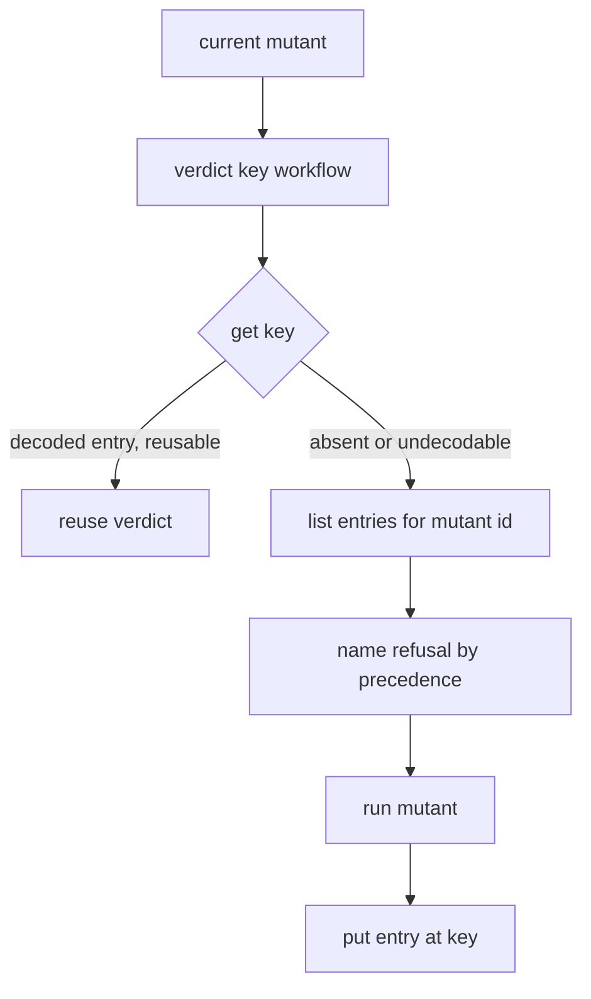

# VerdictStore port with content-addressed verdict keys - Plan

## Goal Capsule

- **Objective:** Make it safe to reuse a mutation verdict in a later run, in another shard or on another PR whenever its inputs are byte-identical. An unchanged re-run should reuse at least 95% of verdicts, and no concurrent writer or killed process can leave a verdict that reads back wrong.
- **Means:** Move the verdict part of the incremental cache behind a `VerdictStore` port. Entries are immutable and keyed by a content-addressed verdict key. The port gets three adapters: an in-memory fake, a filesystem driver, and an S3 driver shipped as its own package.
- **Product authority:** Stream B of the stryker-js-effect SOTA program, on branch `stryker/verdict-store`. Stream A is splitting `@systemfsoftware/stryker-js` into contracts/ports, engine, drivers and edges packages; that split is not in scope here. Dry-run coverage and budget sharing are not in scope either.
- **Open blockers:** None.

---

## Product Contract

### Summary

Each verdict, together with its measured cost, is stored as its own entry under a key computed from everything that can change the verdict. A run looks up each mutant's key. On a miss it lists that mutant's other entries, which tells it why the verdict was refused. The run writes every settled verdict as soon as it settles. Both drivers use blind writes where the last writer wins: S3 through `PutObject`, the filesystem through temp file, fsync, rename. One law suite proves the fake, the fs driver and the S3 driver behave the same.

### Problem Frame

Verdict identity is already content-derived. The per-mutant reuse key is `mutantId \0 closureOrProgramDigest \0 engineDigest \0 mutantSetPolicy \0 runInputsDigest` (`packages/stryker-js/src/incremental-diff.workflow.ts:98-105`). The mutant id is a sha256 over file, mutator, original text, replacement and ordinal (`packages/stryker-js-instrumenter/src/MutantIdentity.ts:20-35`). Admission refuses a whole record on any header mismatch (`packages/stryker-js/src/admit-incremental-report.workflow.ts`). So this work is mostly a port extraction over a key that already addresses content. It also closes four gaps in that key and in how it is stored:

1. **The key is never materialized.** Verdicts sit inside one JSON document per project (`packages/stryker-js/src/IncrementalReport.schema.ts:47-63`). That document also holds report-shaped data, costs, `dryRunCoverage` and `budget`. Matching happens by comparing fields on records read from that document, and from any extra report globbed through `incrementalSources` (`packages/stryker-js/src/run/incremental-reuse.ts:47-71`). The store is addressed by a file path, never by a key. Sharing across PRs or machines depends on someone copying files: shard parts are unioned by mutant id (`packages/stryker-js/src/shard/incremental-union.ts:100-111`), and `actions/cache` restores the file on main (`.github/workflows/mutation.yml:52-77`).
2. **Checker configuration is missing for tested verdicts.** tsconfig content enters the key only through the checker's `programDigest` (`packages/stryker-js-typescript-checker/src/program-digest.schema.ts:19-28`), and `programDigest` is compared only for `CompileError` records (`incremental-diff.workflow.ts:116-123`). It appears in neither `runInputsDigest` (`packages/stryker-js/src/verdict-semantics.ts:90-133`) nor the closure crawl. A tsconfig change that would turn a remembered `Survived` mutant into a `CompileError` therefore still reuses the stale `Survived`. Runner configuration is already covered: vitest config files, `setupFiles` and `globalSetup` are reported as `globalTestInputs` (`packages/stryker-js-vitest-runner/src/drivers/vitest-node.ts:81-91`) and hashed into every closure (`packages/stryker-js/src/run/incremental-reuse.cell.ts:299`).
3. **The separator is ambiguous.** `keyOf` joins its components with `'\u0000'`. Main mutation report `mutation-report-416` (head `1e1de6d05`) shows mutant `0574dc1362451398` (`'\u0000'` → `""` at `incremental-diff.workflow.ts:105`) Survived. No test distinguishes two component tuples that concatenate to the same string.
4. **Writes rewrite the whole document.** Every checkpoint re-encodes and renames the full project record (`packages/stryker-js/src/mutation-reporting.service.ts:874,1018,1053`). The rename is atomic (`packages/stryker-js/src/atomic-write.cell.ts:13-30`) but has no fsync. Concurrent writers to one path lose each other's verdicts wholesale, not per key.

### Key Decisions

- **Blind writes, last-write-wins, on every adapter.** S3 never stores a partial object and gives strong read-after-write consistency ([PutObject](https://docs.aws.amazon.com/AmazonS3/latest/API/API_PutObject.html), [consistency](https://docs.aws.amazon.com/AmazonS3/latest/userguide/Welcome.html#ConsistencyModel)). The fs driver gives the same guarantee with temp file, fsync, rename. No conditional put anywhere. emulate 0.12.1 does not support conditional put (`packages/@emulators/aws/src/routes/s3.ts:300-393` upserts unconditionally). (session-settled: user-directed — chosen over If-None-Match write-once, which blocks on emulate and freezes an unreproduced Timeout, and over write-once fs only, which splits the law suite: one write law for fake, fs and S3.) Governs R9, R10, R13.
- **The store takes over verdicts and their per-mutant cost; `dryRunCoverage` and `budget` stay in the incremental file.** The execution that produces a verdict also measures its cost, so the cost shares the verdict key and travels with it across shards and PRs, and the planner gets real costs for reused mutants. `dryRunCoverage` and `budget` are not per-mutant verdict data: they are keyed by suite inputs and run policy. They stay in the incremental file, which mutation.yml keeps caching and re-seeding. (session-settled: user-approved — chosen over verdicts only, where cost and verdict could disagree, and over moving the whole file, the largest diff and the heaviest collision with Stream A.) Governs R6, R16, R17.
- **The S3 driver is its own package, `packages/stryker-js-verdict-store-s3` (`@systemfsoftware/stryker-js-verdict-store-s3`).** It depends only on the port and key-schema entry that stryker-js publishes. (session-settled: user-approved — chosen over an optional peer inside stryker-js and over a hard dependency; `@aws-sdk/client-s3` must not reach every CLI install.) (pack: cell-architecture, service-and-layer-boundaries.md "Separate Driver Package") Governs R11, R12.
- **CI proves the 95% reuse in a PR e2e journey against emulate on the host.** mutation.yml on main keeps its fs-file cache. (session-settled: user-directed — chosen over a main-only mutation.yml step, which never runs on the PR head.) Governs R20.
- **Entries are grouped by mutant id, so a miss can still say why it missed.** A pure key lookup only answers "no entry". Listing the mutant id's other entries lets the run compare key components, which preserves the named refusal reasons the `reuse` event reports today (`packages/stryker-js-cli-contract/src/run-event.schema.ts:32-43,289-293`) and the prior cost and timeout evidence. Governs R7, R8.
- **No unit of work.** A store gets one when a read-decide-save protects a non-confluent invariant (pack: cell-architecture, store-serializable-unit-of-work.md). Here a lost timeout-reproduction increment under a race only delays reuse by one run. Governs R10.
- **The port is placed where Stream A's contracts/ports package expects it.** The port, key schema and entry schema live in one driver-free folder behind one public entry, so they move as a unit and only the import specifier changes. (pack: cell-architecture, ports-separate-from-layers.md) Governs R11.

### Requirements

**Verdict key**

- R1. The verdict key is a full-length digest over a canonical, length-prefixed encoding of: a key-layout version, `engineDigest`, `mutantSetPolicy`, `runInputsDigest`, the mutant identity (file name, mutator, original text, replacement, ordinal, location), the mutated file's content digest, the sorted covering test ids, the covering-test closure digest, and the checker configuration digest.
- R2. The checker configuration digest covers the tsconfig chain contents, the checker options, and the TypeScript and checker versions, but not program source files. A run with no checker contributes a fixed no-checker marker.
- R3. A `CompileError` verdict is reused exactly when today's program-digest rule allows (`incremental-diff.workflow.ts:110-123`), so a source edit anywhere in the program still refuses it.
- R4. Key derivation is a pure workflow. Equal inputs produce equal keys, and a change to any single component produces a different key. This includes component pairs whose plain concatenations collide.

**Store port and entries**

- R5. `VerdictStore` is a `Context.Service` port with three operations: get an entry by key, put an entry by key, and list the entries for a mutant id. Its module imports no driver and exports no Layer.
- R6. An entry is a schema-decoded record carrying its full key components, the remembered status, `coveredBy`, `killedBy`, `testsCompleted`, timeout evidence and the measured cost.
- R7. On a hit, the run reuses the entry under today's reuse rules: remembered statuses only, an unreproduced wall-clock Timeout refused, flaky dependence refused.
- R8. On a miss, the run names the refusal by today's fixed precedence, comparing against the listed entries for that mutant id. With no entries listed, the reason is `noPriorRecord`.
- R9. A missing, torn or undecodable entry reads as a miss and never fails the run. The `reuse` event counts undecodable entries under a new refusal reason, `entryUnreadable`.
- R10. A put replaces any entry at that key. Concurrent puts to one key leave exactly one of the written entries, never a mix. The timeout-reproduction upgrade is an overwrite at the same key.

**Adapters and packaging**

- R11. stryker-js publishes the port, key schema, entry schema and in-memory fake from one declared public entry, and the shared law suite from a test-support entry. The S3 package imports nothing else from stryker-js.
- R12. `@systemfsoftware/stryker-js-verdict-store-s3` exports a parameterized `layer(options)` over `@aws-sdk/client-s3`, pinned through the pnpm catalog on the current 3.x line. The CLI loads it from the project install only when configuration selects S3. If the package is missing, the run is refused with an error that names it.
- R13. The fs driver writes each entry to a temp file inside the store directory, fsyncs it, and renames it over the key path. Readers never treat leftover temp files as entries.
- R14. Store configuration selects the fs driver (the default, a directory under the project's reports) or S3 (bucket, prefix, region, endpoint, path-style). Store options join the non-fingerprinted storage keys (`verdict-semantics.ts:90`), and the fs directory joins `strykerOutputFilesOf` (`packages/stryker-js/src/stryker-outputs.ts`), so a run never hashes its own store.

**Run behavior**

- R15. A run puts each verdict as soon as it settles, so a run interrupted or killed at any point leaves every verdict that settled before the kill reusable.
- R16. Every reader of prior verdicts or prior per-mutant cost reads the store: run-time reuse, the planner's pricing, and the deferrable-dry-run decision. The incremental file and the shard union stop carrying verdict records and costs.
- R17. Shards writing to one store need no merge step for verdicts. mutation.yml keeps its `actions/cache` path, now carrying the fs store directory.

**Proof**

- R18. One law suite, defined once and run on the fake, the fs driver and the S3 driver against emulate 0.12.1 through `createEmulator({ service: 'aws' })`, `reset()` and `close()`, proves:
  - get after put returns the value put; repeated gets return the same value;
  - puts on different keys commute;
  - an absent key reads as a miss;
  - concurrent puts to one key are last-write-wins with no mix;
  - a corrupt entry reads as a miss;
  - the timeout-upgrade overwrite works.

  The fs suite also plants a leftover temp file and a truncated entry. (pack: boundary-testing, fake-and-real-store-laws.md)
- R19. An e2e journey runs real CLI processes concurrently against one store, SIGKILLs one mid-run, and then shows that a following run decodes every entry (`entryUnreadable` is 0) and reuses the verdicts the killed process settled.
- R20. An e2e journey in the ci.yml e2e lane runs the packed CLI twice on an unchanged fixture against the S3 driver pointed at emulate on the host. It passes only when the second run's own `reuse` event shows `reused / (reused + ran) >= 0.95`.

### Key Flows

- F1. Reuse on a re-run
  - **Trigger:** `stryker run` with incremental mode on.
  - **Steps:** Instrument; dry run; compute each mutant's key (R1); get it; on a hit, reuse (R7); on a miss, list the mutant's entries, name the refusal (R8) and run the mutant; put each settled verdict (R15); emit `reuse`.
  - **Covered by:** R1, R7, R8, R9, R15
- F2. Shards and PRs sharing one store
  - **Trigger:** Several CLI processes, on one machine or many, are configured with the same store.
  - **Steps:** Each process reads and puts independently; equal keys race and the last write wins (R10); no merge step for verdicts (R17).
  - **Covered by:** R10, R17, R19

### Acceptance Examples

- AE1. **Covers R2, R4.** Given a remembered `Survived` verdict, when only `tsconfig.json` changes `strict`, the key changes and the mutant runs again with refusal `runInputsChanged` or a dedicated checker reason, whichever planning names.
- AE2. **Covers R9.** Given an entry file truncated mid-JSON, when a run looks up that key, the mutant runs, the run succeeds, and `reuse.refused.entryUnreadable` is 1.
- AE3. **Covers R10.** Given an unreproduced wall-clock Timeout entry, when the re-run times out again, the entry at the same key is replaced with `reproductions: 1`, and a third run reuses it.
- AE4. **Covers R15, R19.** Given a run SIGKILLed after its fifth `mutantTested` event, when a new run starts, at least those five verdicts are reused.

### Success Criteria

- The R20 journey is green on the PR head, and its assertion reads the CLI's own NDJSON `reuse` event, not a hand-computed count.
- The R18 law suite runs, with no skips, in the stryker-js and S3-package test tasks on the PR head.
- The new key-workflow property tests kill the main-report survivor `0574dc1362451398`. The entry round-trip and reuse properties target the `rememberedOf` survivors in `incremental-diff.workflow.ts` (`7c2e2e9e9da4fc43`, `c5b364135610b3a4`, `174b8e52f6c5c584`, `a4deb93c48d0b4bd`, `ec2b75971f004744`, `5c5af2eb451aef17`, `6ac950f8cd326ba3`, `e0c3736e2c4fa506`) and the timeout-evidence survivor `e6d78dc9239886fb`. Main mutation runs grade them after merge.

### Scope Boundaries

- Moving `dryRunCoverage` and `budget` into the store, and sharing dry runs across PRs. Both are a later store candidate under their own suite-input and run-policy keys, not under the verdict key.
- A real shared S3 bucket for main's mutation shards. That needs IaC and credentials. Follow-up.
- Retention and pruning of store entries. Leave it to S3 lifecycle rules or cache eviction.
- Conditional writes, multipart upload, Range reads.
- Stream A's package split. This work only places the port where that split expects it.
- Any mock of the S3 client: no `vi.mock`, no `aws-sdk-client-mock`, no hand-rolled S3 server.

### Dependencies / Assumptions

- `emulate` 0.12.1 (catalog pin shared with `systemfsoftware/mergify` and `systemfsoftware/github-selfhosted-runner` `pnpm-workspace.yaml`) serves PutObject, GetObject, HeadObject, DeleteObject, ListObjectsV2 and CreateBucket over path-style addressing and does not verify signatures. Neither org repo uses emulate for AWS: github-selfhosted-runner uses moto (its ADR-0002). The `^3.654.0` line appears only in a vendored SST example (`repos/sst/examples/aws-analog/package.json:30`), not in an org catalog.
- `minimumReleaseAgeExclude` in `pnpm-workspace.yaml` does not list either new dependency, so the pinned versions must be older than the configured release age. Changing that list needs human approval.
- Forks reach the host through the `host` network profile (`docs/solutions/tooling-decisions/microsandbox-fork-host-access-vm-via-snapshot-restore.md:36,64`). Unverified: that a fork reaches emulate on the bind address `createEmulator` uses.

### Outstanding Questions

**Deferred to Planning**

- Does the refusal for AE1 get its own reason (`checkerConfigChanged`), or does it fold into an existing one?
- Does a `CompileError` verdict get a second key kind keyed on `programDigest`, or the same key with the closure component swapped?
- Does `incrementalSources` survive once dry-run coverage is its only payload?
- What replaces the interrupted-checkpoint Pending rows that `test/e2e/tests/enterprise-runner-resilience.e2e.test.ts` asserts today?

### Sources / Research

- `docs/solutions/tooling-decisions/verdict-cache-content-keyed-reuse.md`: invariants that carry over (content key, named refusal, reproducible-only verdicts, outputs excluded from the crawl).
- `docs/plans/2026-09-29-0427-feat-state-of-the-art-mutation-testing-plan.md` R5, R8-R10, R38, KTD1-KTD2.
- Main mutation report artifact `mutation-report-416` (run on `1e1de6d05`), the source of the cited mutant ids.
- Packs: boundary-testing (`fake-and-real-store-laws.md`, `real-system-oracles.md`), cell-architecture (`ports-separate-from-layers.md`, `service-and-layer-boundaries.md`, `store-serializable-unit-of-work.md`), schema-laws (`refusals-beside-generated-laws.md`, `arbitrary-filter-floors.md`). package-topology exists upstream but is not declared in `.compound-engineering/config.yaml`.
