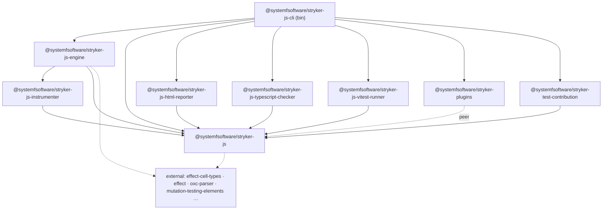
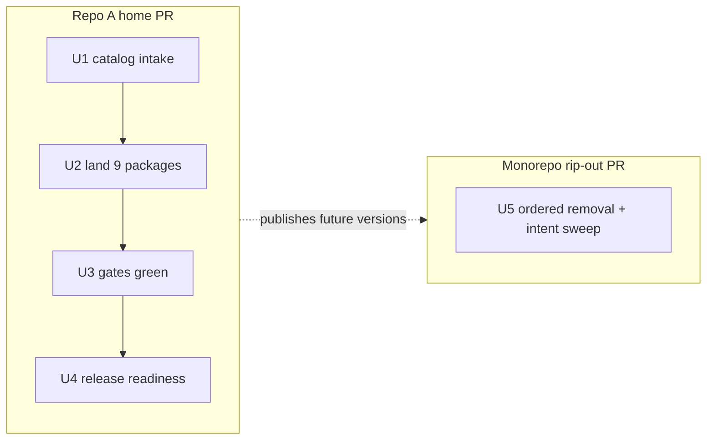

# Home the stryker-js package family

**Target repos:** this repository (`systemfsoftware/stryker-js-effect`, below: "repo A") and `systemfsoftware/systemfsoftware` (below: "the monorepo"). All paths are repo-relative to their named repo. Where the same path exists in both repos (`packages/stryker-js/**`), the section names which repo it means — unit Files lists are repo A unless marked "(monorepo)".

---

## Goal Capsule

- **Objective:** The nine `@systemfsoftware/stryker-*` packages are developed, tested, and releasable from repo A, and the monorepo no longer carries them. Consumers in both repos resolve the packages without breakage. A user outside either repo's internals can verify this by cloning repo A and running its CI gate, and by the monorepo's release dry-run exiting clean.
- **Means:** copy the family into repo A's flat `packages/*`, port configs to standalone style, remove the subtree from the monorepo, and bump every `@systemfsoftware/*` pin to latest (KTD1–KTD8).
- **Authority:** this plan governs; repo `AGENTS.md` surface boundaries hold — `.github/workflows/` and `commitlint.config.ts` are read-only in both repos, `repos/**` is vendored read-only, publishing/credentials are human-approved.
- **Stop conditions:** a gate that cannot go green without editing a read-only instrument stops that unit; the gap becomes an owner residual in the PR body.
- **Execution profile:** LFG pipeline; implementation via deterministic subagent workpools ("workflowz"); two independent PRs (repo A home PR, monorepo rip-out PR); land the home PR first.
- **Tail ownership:** `ce-work` implements; LFG ships.

---

## Product Contract

### Summary

Move the stryker-js fork family (9 packages, 440 tracked files, ~3 MB) out of the monorepo into repo A, its new dedicated home. Remove them from the monorepo while its 12 mutation consumers keep working off the registry. Bring every `@systemfsoftware/*` dependency in repo A to the latest published version.

### Problem Frame

The fork is the monorepo's most actively developed area (ledger shows `stryker-js-cli` 2.0.0 → 8.0.1 across ~46 family releases) and repo A was created for it: the repo is named `stryker-js-effect`, and `STRATEGY.md`'s dogfooding track expects derived repos to feed the template back. The family cannot stay half-here: repo A's starter consumes five of the nine as published tools, with `stryker-js-cli` two majors behind the code (^6.0.0 catalog vs 8.0.1 in-tree) and the other four trailing by patches.

### Requirements

New home (repo A):

- R1. The nine packages live under `packages/*` in repo A at the monorepo HEAD versions: `stryker-js` 4.0.0, `stryker-js-cli` 8.0.1, `stryker-js-engine` 4.0.0, `stryker-js-html-reporter` 3.0.3, `stryker-js-instrumenter` 6.0.1, `stryker-js-typescript-checker` 5.0.4, `stryker-js-vitest-runner` 4.0.4, `stryker-plugins` 3.1.0, `stryker-test-contribution` 2.0.3.
- R2. A fresh clone of repo A installs and passes `pnpm check:ci` (format, lint, typecheck, test, build, mutation) with the nine packages present.
- R3. After U2, no moved package references a monorepo-private package repo A does not carry: the `@systemfsoftware/oxlint-config` devDependencies present on eight of the nine moved manifests at HEAD are dropped, each affected `oxlint.config.ts` is rewritten to the published `@systemfsoftware/all` preset, and `vitest-config` is vendored under `packages/toolchain/` (private) per KTD2.
- R4. `packages/starter` consumes the moved packages via `workspace:^`, replacing its five `catalog:` registry pins.
- R5. Every remaining external `@systemfsoftware/*` dependency in repo A — catalog entries and manifest literals — is at the latest published version. The authoritative set is enumerated at U1 step 1 (every `@systemfsoftware/*` name in repo A's catalog and the moved manifests, minus the nine family names); known floors: `all` ^2.0.2, `tsconfig` ^1.3.4, `effect-gherkin-spec` ^4.0.2, `effect-cell-types` ^8.1.0, `arethetypeswrong-cli` ^4.1.0.

Rip-out (monorepo):

- R6. `packages/stryker-js/` and its workspace entries are gone from the monorepo. The 12 mutation consumers (10 `packages/oxlint-plugin/oxlint-plugin-*` leaves, `effect-daemon-spec`, `hex-schema`) still resolve the five tool packages from the registry through `catalog:stryker`. Target pins: latest published (floor: cli ^8.0.1, typescript-checker ^5.0.4, vitest-runner ^4.0.4, stryker-plugins ^3.1.0, test-contribution ^2.0.3). If a consumer mutation run breaks on the bump and cannot be fixed in the rip-out PR, the pins revert to the consumers' current working versions (cli ^4.0.1 et al.) and the PR body names both the attempted floor and the reverted pin.
- R7. The monorepo release pipeline is healthy after removal: no pending `.changeset/*.md` intent names a deleted package, and `corepack pnpm version -r --dry-run` exits 0.
- R8. Read-only instruments in the monorepo are not edited. Gaps they inherit from the removal are reported to the owner as PR-body residuals.

Release readiness:

- R9. Each moved package carries a changeset intent in the home PR — bump `none` where the published surface (exports map) is unchanged, `patch` only where it moves — and its manifest points at the new repository (`repository`, `homepage`, `bugs`).

### Acceptance Examples

- AE1. Fresh clone of repo A: `pnpm install && pnpm check:ci` exits 0. Covers R2.
- AE2. Monorepo after the rip-out: `turbo run mutation --dry=json` enumerates all twelve consumers, and `pnpm --filter @systemfsoftware/effect-daemon-spec mutation` completes a real mutation run against the resolved registry plugins as the representative end-to-end kill. Covers R6.
- AE3. Monorepo after the rip-out: `corepack pnpm version -r --dry-run` exits 0. Covers R7.

### Scope Boundaries

Deferred to follow-up work (not this migration):

- Mutation enrollment for the nine moved packages in repo A (stryker configs, thresholds, budgets) — KTD4.
- Mutation CI workflow for repo A (the monorepo's `mutation.yml` shape) — CI is a read-only instrument; owner-led.
- The CLI contract lane: not carried (KTD5 — admission-gate refusal); a future in-process contract surface is follow-up work.
- npm OIDC trusted-publisher registration for the nine names under repo A's release workflow — owner action before first publish (`.changeset/README.md`: "OIDC cannot debut a package npm has never seen").
- Monorepo doc/doctrine updates naming the removed family (`CONCEPTS.md`, `STRATEGY.md`, `AGENTS.md` surface table, stale `docs/solutions` names) — doctrine edits are deliberate-direction only.

Outside this work's identity:

- No code changes to the moved packages' behavior. Config rewrites are mechanical ports; source `src/**` and test logic travel verbatim.
- No Effect-version change: `effect` stays `^4.0.0-rc.112` (KTD6).

---

## Planning Contract

### Key Technical Decisions

- KTD1. **Clean copy, not a history transplant.** The nine trees are copied as-is (versions preserved per R1); git history stays in the monorepo. Chosen over `git subtree`/`filter-repo` archaeology: the ask moves code to a new home; a clean first-commit history in repo A is simpler and the monorepo keeps its record.
- KTD2. **The private vitest toolchain is vendored; oxlint configs are rewritten per package.** Copy `@systemfsoftware/vitest-config` verbatim into `packages/toolchain/vitest-config` as a private workspace package — the only monorepo-private toolchain any moved package consumes (tsdown-config has zero consumers; it is not carried). "Verbatim" covers `lib/**` and `vitest.config` consumers; its manifest gets one edit — the `@systemfsoftware/tsconfig` devDependency repoints from `workspace:^` to `catalog:` (repo A has no workspace package by that name). Moved packages keep their vitest-config imports, repointed to the vendored copy (byte-stable configs, zero per-package drift). Each `oxlint.config.ts` is rewritten to extend the published `@systemfsoftware/all` (repo A's house preset) with the strict trio (`typescript/no-unnecessary-condition`, `typescript/strict-boolean-expressions`, `typescript/no-non-null-assertion` at error) while preserving each package's genuine deltas (e.g. the instrumenter's `ban-classes` rule, the checker's and runner's `testResources` ignores). `packages/toolchain/` carries exactly this one private package — it is not a general intake point. `tsconfig.json` keeps extending the published `@systemfsoftware/tsconfig` subpaths — only the version bumps.
- KTD3. **The api-extractor surface is not carried.** Strip `api:check` from every moved `build` script; drop `api-extractor*.json`, `etc/`, `tsconfig.api*.json`. Keep `attw` scripts (repo A's turbo already defines the task). Chosen over porting `api:check`: adding a new gate on just-landed code is building the instrument that grades your own work (CONST-E9). Update moved README/AGENTS.md references to the dropped reports.
- KTD4. **Mutation enrollment for the moved packages is deferred.** No `stryker.config.json` and no `mutation` script ships on any moved package. The CLI's self-mutation config extends `../../../stryker.config.base.json`, which will not exist; its `mutation` script (`node ./dist/main.mjs run`) would enroll a self-mutation at `break: 100` into repo A's `check:ci` — the monorepo deliberately ran that lane only in an advisory workflow, never in its gate. `packages/starter` remains the only mutation cell in repo A.
- KTD5. **The CLI contract lane is not carried.** The entire container-backed test layer is refused by the test-layer admission gate (process spawning) and deleted in the move: `test:contract` script, `vitest.contract.config.ts`, `global-setup.ts`, `tests/__fixtures__/` (including `StrykerCliAdapter` and the six fixture projects), the three container-backed integration suites, and the `testcontainers` devDependency. Repo A's CI has no Docker on macOS besides. The lane stays recoverable at the monorepo's pre-rip-out commit (recorded in both PR bodies); both PR bodies declare the capability loss. Replacement oracle for CLI behavior: the CLI's in-source/unit and property suites plus AE2's consumer mutation run — the behavioral depth this narrows is named, not hidden.
- KTD6. **Named sub-catalogs are ported; peers flatten.** Repo A gains a `catalogs:` block carrying `stryker` (`semver`, `mutation-testing-elements`) and `oxlint` (`oxlint`, `oxlint-tsgolint`, `@oxlint/plugins`) at monorepo HEAD values, so moved `catalog:stryker` and `catalog:oxlint` references resolve unchanged. `catalog:peers` peerDependencies entries (engine, html-reporter, vitest-runner, stryker-plugins, test-contribution) flatten to the default `catalog:`. Repo A's `effect: ^4.0.0-rc.112` is unchanged; the lockfile resolves rc.112 today, which the moved packages were verified against.
- KTD7. **The monorepo removal is three ordered edits plus an intent sweep, in one PR.** (a) bump `catalogs.stryker` pins per R6; (b) delete `packages/stryker-js/` and its ten `pnpm-workspace.yaml` package entries; (c) drop the stale `$TURBO_ROOT$/packages/stryker-js/**` mutation-task input. Sweep pending `.changeset/*.md`: delete intents whose entire subject died; drop dead name lines from mixed intents; verify R7.
- KTD8. **Monorepo instrument gaps are owner residuals, not edits.** PR body lists: `mutation.yml` lines 173/184 (the `report` job builds and invokes `packages/stryker-js/stryker-js-cli/dist/main.mjs merge-reports` — a hard failure on `main` after merge until the owner repoints at the registry-installed CLI), `AGENTS.md` surface-table row for `@systemfsoftware/stryker-test-contribution`, `CONCEPTS.md`/`STRATEGY.md` family mentions, `scripts/tools/discover-mutation-targets.mjs` subtree rule and stale selftest paths, `.claude/hooks/guard-local-mutation.ts` selftest rows, `dprint.json` subtree exclude, `oxlint-plugin-effect-dmmf/AGENTS.md` reference.

### Challenge ledger (directives examined)

Each user directive received exactly one challenge against research evidence. None invalidated.

- "New home is repo A" — valid: repo A duplicates zero packages, its `packages/*` globs fit the family, and `packages/starter` already consumes five members as tools.
- "Rip out, not copy" — valid: the 12 monorepo consumers already resolve the family from the registry (`catalog:stryker` in every manifest; no `workspace:` edge into the subtree), so removal breaks no install.
- "Update all systemf deps" — valid and enumerable (R5, R6): repo A crosses majors on `@systemfsoftware/all` (1.1.3 → 2.0.2); lint fallout is budgeted as fix work, never severity downgrades.
- "workflowz" — execution-profile note, not a challengeable directive: execution fans out per unit to subagent workpools with file-disjoint ownership.

### High-Level Technical Design

Family dependency shape (monorepo HEAD, unchanged by the move):



Two-repo sequencing (independent PRs; home lands first):



### Assumptions

- Registry latest equals monorepo HEAD versions for the nine names and for `effect-cell-types`/`effect-schema-law`/`effect-schema-vite`. Verified at execution with `pnpm view`; pins adjust to actual registry latest if it is ahead of HEAD.
- `effect ^4.0.0-rc.112` still resolves to rc.112 (latest rc at research time). If a newer rc exists, R5's "latest published" applies to the named packages, not to `effect` — the effect pin is out of scope per Scope Boundaries.
- Monorepo `mutation.yml` runs on `push` to `main` and PRs; its post-merge `report`-job failure is accepted and owner-residual (KTD8), not silently avoided by editing the workflow.
- The moved packages' suites are hermetic apart from the (not-carried) contract lane; any suite needing network, Docker, or process spawning is discovered at U3 and deleted or replaced there under the test-layer admission gate.

### Output Structure

```text
packages/
  starter/                          # unchanged shape, devDeps switch to workspace:^ (R4)
  stryker-js/                       # @systemfsoftware/stryker-js
  stryker-js-cli/                   # @systemfsoftware/stryker-js-cli (bin: stryker)
  stryker-js-engine/                # @systemfsoftware/stryker-js-engine
  stryker-js-html-reporter/         # @systemfsoftware/stryker-js-html-reporter
  stryker-js-instrumenter/          # @systemfsoftware/stryker-js-instrumenter
  stryker-js-typescript-checker/    # @systemfsoftware/stryker-js-typescript-checker
  stryker-js-vitest-runner/         # @systemfsoftware/stryker-js-vitest-runner
  stryker-plugins/                  # @systemfsoftware/stryker-plugins
  stryker-test-contribution/        # @systemfsoftware/stryker-test-contribution
  toolchain/                        # vendored private toolchain (vitest-config only — KTD2)
```

Monorepo-side expected shape after U5: `packages/stryker-js/` absent; `pnpm-workspace.yaml` loses ten package entries; `catalogs.stryker` remains (registry consumption) with bumped pins; `turbo.json` mutation task loses one input glob.

---

## Implementation Units

### U1. Catalog intake and dependency re-pin (repo A)

- **Goal:** repo A's catalog and `packages/starter` are ready to receive the family as workspace members with external pins at latest.
- **Requirements:** R4, R5.
- **Dependencies:** none.
- **Files:** `pnpm-workspace.yaml`.
- **Approach:**
  1. Enumerate the authoritative external set: grep the nine moved manifests (monorepo HEAD) for every `"catalog:` and `catalog:<name>` reference and every `@systemfsoftware/*` dependency name; union with repo A's existing catalog. For each external `@systemfsoftware/*` name, read its latest published version with `pnpm view`.
  2. Add every catalog entry the moved manifests reference that repo A lacks (known set: `effect-cell-types`, `effect-schema-law`, `effect-schema-vite`, `@effect/vitest`, `@effect/platform-node`, `@effect/platform-node-shared`, `@std/jsonc`, `@noble/hashes`, `@oxc-project/types`, `oxc-parser`, `@vitest/coverage-v8`, `@vitest/browser-playwright`, `vite-tsconfig-paths`, `testcontainers`, `@microsoft/api-extractor`, `svelte`, `semver`, `mutation-testing-elements`, `@oxlint/plugins`, `@systemfsoftware/arethetypeswrong-cli` — re-derive by the grep, do not trust this list); add the `catalogs:` named-catalog block per KTD6; bump `all`, `tsconfig`, `effect-gherkin-spec` to latest per R5.
  3. Extend the workspace package list with `packages/toolchain/*` — repo A's `packages/*` glob does not match the two-level vendored private (KTD2).
- **Test scenarios:**
  - `pnpm install --frozen-lockfile` on the catalog-only tree exits 0 (no moved manifests exist yet; the catalog adds resolve standalone).
  - Every `catalog:` and `catalog:<name>` reference in the nine HEAD manifests has a matching catalog entry — verified by cross-checking the step-1 grep against `pnpm-workspace.yaml`.
  - `grep -r "1.1.3\|4.0.1\|6.0.0"` (old `all`/`gherkin`/`cli` pins) returns no live dependency references in manifests or configs.
- **Verification:** catalog complete against the moved manifests' references; every external `@systemfsoftware/*` pin at or above its R5 floor.

### U2. Land the nine packages (repo A)

- **Goal:** the family lives in `packages/*` as first-class repo A members with standalone configs.
- **Requirements:** R1, R3, R4, R9 (manifest URLs).
- **Dependencies:** U1.
- **Files:** `packages/stryker-js/**`, `packages/stryker-js-cli/**`, `packages/stryker-js-engine/**`, `packages/stryker-js-html-reporter/**`, `packages/stryker-js-instrumenter/**`, `packages/stryker-js-typescript-checker/**`, `packages/stryker-js-vitest-runner/**`, `packages/stryker-plugins/**`, `packages/stryker-test-contribution/**`, `packages/toolchain/**`, `packages/starter/package.json`, `pnpm-lock.yaml`, `dprint.json`, root `README.md`.
- **Approach:**
  1. Copy each tree from the monorepo at HEAD (KTD1): the nine package trees plus `packages/toolchain/vitest-config` (private — KTD2; verbatim `lib/**`, manifest edit per KTD2). Keep `src/**`, `tests/**`, `testResources/**`, fixtures, `LICENSE`, `README.md`, per-package `AGENTS.md` unchanged.
  2. Manifests: keep versions per R1; keep `workspace:^` edges between family members; retarget `repository`/`homepage`/`bugs` to `systemfsoftware/stryker-js-effect`; rewrite external `@systemfsoftware/*` deps from `workspace:^` to `catalog:` (`effect-cell-types`, `effect-gherkin-spec`, `effect-schema-law`, `effect-schema-vite`, `all`, `tsconfig`); flatten `peerDependencies` `catalog:peers` → `catalog:` (KTD6); repoint `vitest-config` devDep to the vendored `workspace:^` copy and drop `oxlint-config` devDeps from all eight manifests that carry it (KTD2); drop the `testcontainers` devDependency with the contract lane (KTD5).
  3. Configs per KTD2/KTD3/KTD4/KTD5: vitest configs travel verbatim (their imports resolve from the vendored private); rewrite each `oxlint.config.ts` to `extends: [all]` plus the strict trio, preserving per-package deltas (instrumenter's `ban-classes`, checker/runner `testResources` ignores, test-file and build-config overrides); strip `api:check` from `build` scripts; drop api-extractor files; delete the CLI's `stryker.config.json` and `mutation`/`mutation:full` scripts; delete the full CLI contract layer (`test:contract` script, `vitest.contract.config.ts`, `global-setup.ts`, `tests/__fixtures__/` including `StrykerCliAdapter` and the six fixture projects, the three container-backed integration suites, `testcontainers` devDep) — the admission gate refuses process-spawning tests. Test-layer admission clause: any moved test that spawns a process, launches a container, or shells out is refused — delete it in the same change and name the coverage loss in the PR body.
  4. Author `tsconfig.node.json` for the six moved packages that lack one (extends `@systemfsoftware/tsconfig/node`, include listing that package's `oxlint.config.ts`, `tsdown.config.ts`, `vitest.config.ts`, and `vitest.setup.ts` where present — mirror `stryker-plugins/tsconfig.node.json`), then align every moved package's `typecheck` script with repo A's shape (`tsc --noEmit --incremental && tsc -p tsconfig.node.json --noEmit`) so config files are type-gated like `packages/starter`.
  5. Switch `packages/starter` devDependencies for the five stryker tool packages from `catalog:` to `workspace:^`, regenerate `pnpm-lock.yaml`, and grep the tree for stale version literals of the old pins (README install lines, fixtures, configs), updating or justifying each.
  6. Docs: derive leaf `AGENTS.md` content for `stryker-js-html-reporter` and `stryker-js-typescript-checker` from the monorepo group file (they had no leaf file; the group file does not travel); fix `packages/stryker-js/**` path references inside moved AGENTS.md/README files to the flat layout; update moved docs that describe the contract lane to state it is not carried; update root `README.md` workspace map; add the `dprint.json` exclude for `packages/stryker-js-typescript-checker/testResources/errors/invalid-tsconfig/tsconfig.json` (without it `format:check` — the first gate — fails on arrival).
- **Patterns to follow:** `packages/starter` manifest/config anatomy (dev exports + `publishConfig`, per-package strict oxlint trio, self-referential vitest alias).
- **Test scenarios:**
  - Every moved package's vitest suite passes locally without Docker (all lanes; the contract layer is not carried): engine, cli unit lane, html-reporter, instrumenter, typescript-checker, vitest-runner, stryker-js, stryker-plugins, test-contribution.
  - `stryker-js/src/schema-laws.test.ts` regenerates via the `effect-schema-vite` transform (registry version) and passes.
  - The property suites' `it.prop` surface exists on `@systemfsoftware/effect-gherkin-spec` ^4.0.2 (registry) — import resolves and tests run.
  - `tsdown.config.ts` with `exports: true` regenerates each package's `exports`/`publishConfig.exports` without hand edits; the first build's manifest churn is accepted in the PR diff.
  - `pnpm --filter @systemfsoftware/stryker-js-cli build` produces `dist/main.mjs` and the `stryker` bin resolves.
  - `pnpm format:check` passes with the new `testResources` exclude in place.
  - After the starter switch: `pnpm-lock.yaml` shows `link:` resolutions for the nine family members and `pnpm install --frozen-lockfile` exits 0 on a second run.

### U3. Gate convergence (repo A)

- **Goal:** START-1 through START-4 pass with the family present, with proof the gates actually see the new code.
- **Requirements:** R2.
- **Dependencies:** U2.
- **Files:** workspace source/config fallout only (lint fixes, tsconfig adjustments); no gate definitions change.
- **Approach:**
  1. Run the four legs individually (`format:check`, `gate:tasks`, `gate:dist`, `mutation`) before the composed `check:ci`, so a failure names its leg.
  2. Fix fallout in moved code per repo A conventions (`@systemfsoftware/all` 2.0.2 strict-trio findings, dprint formatting, tsconfig deltas). Never lower severity; no new suppression comments.
  3. Inversion proof, split by what each gate can observe: plant a surviving mutant in `stryker-js` (core) and a breaking change in a `stryker-plugins` ignorer and in the CLI bin, observing `gate:tasks` (`pnpm test`) go red each time — mutation cannot observe these plants (KTD4 leaves starter as the only mutation cell). Prove the mutation leg's wiring separately: plant a surviving mutant in `starter/src` and observe `pnpm mutation` go red. Restore after each. Registration without observation is not delivery.
  4. Boundary check (real probe, not the vacuous query — repo A's turbo.json declares no boundary rules): for each moved package, compare its manifest `dependencies` against the `@systemfsoftware/*` and bare imports found in its built `dist/**`; every imported name is declared. Also `grep -rn 'from "@systemfsoftware/' packages/*/dist/` returns nothing outside declared externals; load one built `dist` from a synthetic cwd outside the workspace.
- **Test scenarios:**
  - Planted-defect runs: each plant makes `pnpm test` or `pnpm mutation` exit non-zero with the defect named in output; all return green after restore.
  - `pnpm check:ci` exits 0 end-to-end on a clean tree.
  - `turbo run lint --filter=@systemfsoftware/stryker-js --dry=json` shows no root `workspace:` edges in the hash inputs.
  - `turbo run test --dry=json` enumerates all nine moved packages plus `starter`, and `turbo run mutation --dry=json` enumerates `starter` alone — enrollment by script presence asserted against KTD4, not assumed.
- **Verification:** AE1 holds on the PR branch.

### U4. Release readiness (repo A)

- **Goal:** the home PR is release-pipeline-clean and the publish path is unblocked except for the owner's OIDC registration.
- **Requirements:** R9.
- **Dependencies:** U2.
- **Files:** `.changeset/*.md` (nine intents).
- **Approach:**
  1. Author nine intents, one per moved package, each bumping `none` while the exports map is unchanged (expected for all nine) and `patch` only where the surface moves, with changelog summaries claiming the published surface (recomputed from the exports maps, not the diff). `none` satisfies the check-changeset gate and leaves the registry versions at their R1 values.
  2. Run `./scripts/check-changeset.ts <base-sha>` locally against the PR diff — repo A's gate demands an intent for every publishable package once any workspace path changed.
- **Test scenarios:**
  - `./scripts/check-changeset.ts <base-sha>` exits 0 on the PR diff.
  - `corepack pnpm version -r --dry-run` in repo A exits 0; with all-`none` intents it proposes no version movement (registry already carries the R1 versions).
- **Verification:** intents complete; PR body carries the OIDC trusted-publisher checklist for the nine names (owner action).

### U5. Monorepo rip-out

- **Goal:** the family is gone from the monorepo; consumers, release pipeline, and mutation matrix keep working off the registry.
- **Requirements:** R6, R7, R8.
- **Dependencies:** none (independent of U1–U4).
- **Files (monorepo):** `packages/stryker-js/**` (delete), `pnpm-workspace.yaml`, `turbo.json`, `.changeset/*.md` (sweep), `pnpm-lock.yaml` (regenerate).
- **Approach:**
  1. Ordered edits per KTD7: bump `catalogs.stryker` pins → delete subtree + workspace entries → drop the stale turbo mutation input glob.
  2. Intent sweep per R7: drop every moved-package name line from pending intents; delete intents whose whole subject died; the rip-out's own edits are root tooling (`turbo.json`, `pnpm-workspace.yaml`, subtree deletion) — state in the PR body that no workspace package path changed, or attach an intent if implementation reveals otherwise.
  3. Regenerate the lockfile; confirm no `workspace:` resolution remains for any family name.
  4. Consumer smoke: `pnpm --filter @systemfsoftware/effect-daemon-spec mutation` completes against the resolved registry versions (AE2). If the bump breaks consumer runs and cannot be fixed in this PR, revert per R6's condition — to the consumers' current working pins, both versions named in the PR body.
  5. Compose the KTD8 owner-residual block for the PR body.
- **Patterns to follow:** `docs/solutions/runtime-errors/pnpm-versioning-unknown-package-deleted-intent.md` (a deletion sweeps its intents in the same change).
- **Test scenarios:**
  - AE2 holds (real mutation run, not a dry exit code).
  - AE3 holds: `corepack pnpm version -r --dry-run` exits 0.
  - `pnpm install --frozen-lockfile` exits 0; no `[WARN] cyclic workspace dependencies` and no turbo `Circular package dependency detected` on a full task run.
  - `grep -r "packages/stryker-js" pnpm-workspace.yaml turbo.json` returns nothing; `grep -rl "stryker" .changeset/*.md` returns only intents naming live packages.
- **Verification:** R6/R7 hold; R8 holds — the diff touches no `.github/workflows/` file and no `commitlint.config.ts`.

### U6. Cross-PR close-out

- **Goal:** both PRs open, ordered, and residuals durable.
- **Requirements:** R2, R6, R8, R9.
- **Dependencies:** U1, U3, U4, U5.
- **Files:** PR descriptions only.
- **Approach:**
  1. Open the repo A home PR first, then the monorepo rip-out PR (both may be open simultaneously; they are independent).
  2. Each PR body carries: what moved/removed, the KTD decisions that shaped it, verification evidence (gates run, inversion proof, consumer smoke), the owner-residual blocks (KTD8; OIDC checklist), the declared contract-layer capability loss (KTD5), and the monorepo pre-rip-out commit SHA as the contract-layer recovery coordinate.
- **Test scenarios:**
  - CI on the home PR is green (repo A's `check` matrix).
  - CI on the rip-out PR is green except for any leg the owner-residual block names (the `mutation.yml` report job), which the block explains.
- **Verification:** both PR URLs held; residuals durable in PR bodies.

---

## Verification Contract

| Gate              | Repo | Command                                                                                                       | Proves                                  |
| ----------------- | ---- | ------------------------------------------------------------------------------------------------------------- | --------------------------------------- |
| Format            | A    | `pnpm format:check`                                                                                           | START-1; dprint exclude ported          |
| Type/lint/test    | A    | `pnpm typecheck && pnpm test`                                                                                 | START-2/3                               |
| Full CI           | A    | `pnpm check:ci`                                                                                               | START-4; AE1 on a fresh clone           |
| Mutation          | A    | `pnpm mutation`                                                                                               | starter cell still kills 100%           |
| Dist imports      | A    | per-package: manifest `dependencies` vs `@systemfsoftware/*` + bare imports in `dist/**`                      | no undeclared runtime deps (real probe) |
| Dist hygiene      | A    | `grep -rn 'from "@systemfsoftware/' packages/*/dist/`                                                         | no bare externalized imports            |
| Changesets        | A    | `./scripts/check-changeset.ts <base-sha>`                                                                     | R9 intents complete                     |
| Consumer mutation | M    | `turbo run mutation --dry=json` (12 consumers) + `pnpm --filter @systemfsoftware/effect-daemon-spec mutation` | AE2                                     |
| Release dry-run   | M    | `corepack pnpm version -r --dry-run`                                                                          | AE3                                     |
| Release dry-run   | A    | `corepack pnpm version -r --dry-run`                                                                          | R9 versions coherent                    |

Registry facts (`pnpm view <pkg> version`) are read fresh at execution time; the plan's version numbers are research-time floors, not pins.

---

## Definition of Done

- Every unit U1–U6 complete with its verification run and evidence in the PR bodies.
- Repo A `AGENTS.md` gates START-1..4 pass (`pnpm check:ci`), on a fresh clone for AE1.
- Monorepo rip-out PR: R6, R7, R8 hold; owner residuals durable in the PR body.
- No committed scratch: the `/tmp/systemfsoftware` clone stays outside both repos; no snapshots or differential artifacts land in either repo.
- Abandoned attempts removed: any experimental config rewrite superseded during execution is deleted, not left commented.

---

## Risks & Dependencies

- `@systemfsoftware/all` 1 → 2 may flag new lint findings across nine freshly moved codebases; budget is fix-in-place, never severity downgrades (repo A has no `warn`).
- Registry latest may be ahead of monorepo HEAD; pins then move past the researched versions and suites re-verify against the newer build (U1 verifies before U2 lands).
- The monorepo consumer mutation matrix may behave differently on the major plugin bump (cli 4.0.1 → 8.0.1); U5's fallback (keep old catalog pins, record the gap) bounds the damage.
- The CLI's unit lane names its container-free includes explicitly; the split was re-derived in the monorepo at HEAD and ports verbatim — any drift surfaces at U3's per-package runs.
- Monorepo `mutation.yml` report job breaks on `main` post-merge until the owner applies the KTD8 residual; this is declared, not hidden.
- The contract lane is gone from both repos after landing (KTD5); the CLI's behavioral oracle narrows to unit/property suites until an in-process contract surface is built — declared in both PR bodies, not silently dropped.

## Sources / Research

- Monorepo inventory and blast radius: `pnpm-workspace.yaml` (workspace entries, `catalogs.stryker`), `turbo.json` (mutation task inputs), `.github/workflows/mutation.yml` (lines 173, 184), `stryker.config.base.json`, `scripts/tools/discover-mutation-targets.mjs`, per-package manifests under `packages/stryker-js/*`.
- Repo A conventions: `pnpm-workspace.yaml` (catalog), `packages/starter/*` (exemplar anatomy), `turbo.json` (task graph), `.changeset/README.md`, `scripts/check-changeset.ts`, `commitlint.config.ts` (type-matches-diff-shape), `dprint.json`.
- Institutional learnings (monorepo `docs/solutions/`): `architecture-patterns/extraction-strands-the-origins-gate.md`, `tooling-decisions/registry-consumption-of-self-hosted-forks.md`, `tooling-decisions/root-workspace-protocol-hashes-every-task.md`, `build-errors/turbo-build-cycle-from-self-hosted-devdeps.md`, `build-errors/tsdown-private-dependency-bare-import-dist.md`, `runtime-errors/pnpm-versioning-unknown-package-deleted-intent.md`, `test-failures/fixture-pin-duplicates-the-catalogs-decision.md`.
- History (context only, not a source of truth — stale against HEAD): `docs/plans/2026-08-23-001-sever-strykerjs-org-dependencies-plan.md` and the 2026-07/08 stryker plans.
