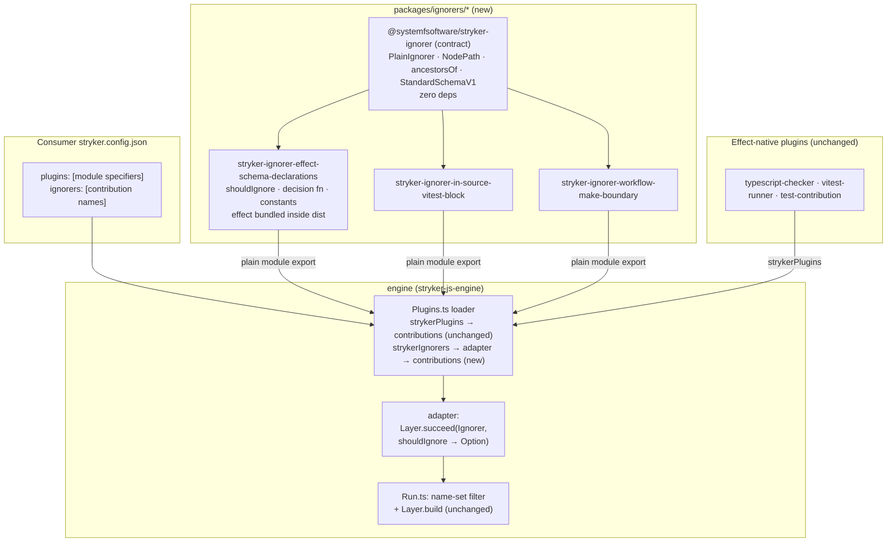

## Goal Capsule

- **Objective:** A mutation-run consumer can install exactly the ignorer they want, decoupled from effect and from the family's runtime service packages, and the run ignores the same mutants it ignores today. Neither the host's Effect version nor those packages' release cadence can break an installed ignorer. (The one remaining edge is the shared plain contract package — the protocol's single first-party dependency, owned by this repo.)
- **Means:** Split `@systemfsoftware/stryker-plugins` into three single-ignorer packages under a new `packages/ignorers/` group that publish a plain `{ name, shouldIgnore }` protocol with effect bundled internally; the engine loader gains a host-side adapter that lifts plain ignorers into `Ignore` contributions (KTD1, KTD2). One zero-dependency contract package types the author-facing surface in Standard Schema terms (KTD3).
- **Authority hierarchy:** root `AGENTS.md` and `CONSTITUTION.md` govern; `scripts/check-changeset.ts`, `.github/workflows/`, and `commitlint.config.ts` are read-only judgment surfaces — their gaps become PR-body residuals, never edits.
- **Stop conditions:** all of R1–R8 hold and `pnpm check:ci` passes with every new package's suite proven non-vacuous; or a settled decision (KD1–KD4) is shown infeasible, which stops the run for re-planning rather than silent descoping.
- **Execution profile:** two independently green phases on one branch — Phase A lands the protocol (U1, U2) with the old bundle untouched and its suites still passing; Phase B migrates and cuts over (U3–U6). Each phase is a shippable, separately reviewable PR; see Phased Delivery. Release (npm publish, name registration) is user-approved only.
- **Tail ownership:** after merge the owner owns the npm-side actions this plan cannot carry: registering the four names as trusted publishers, `npm deprecate` on the old name, and the `check-changeset.ts` glob widening.

---

## Product Contract

### Summary

`@systemfsoftware/stryker-plugins` today bundles three Stryker `Ignore` plugins behind one package name whose docs describe only one of them, and whose plugin protocol forces every consumer into runtime peer-dependency on `effect` plus two family packages. This plan splits it into three purpose-built ignorer packages that publish a plain protocol — no peer dependencies, no effect or family-runtime coupling (R2's one dependency is the shared contract package) — adds the engine-side adapter that makes that protocol loadable, and cuts the old package over everywhere it is named.

### Problem Frame

The user-facing defects, established by reading the package and its consumers this session: one bundle name misfiles three plugins of two different equivalence kinds (proven-equivalent mutants vs out-of-population mutants), its README documents only the schema ignorer, and its `AGENTS.md` rule SP1 ("an ignored mutant is proven-equivalent") is unsatisfiable by two of the three plugins it governs.

The baseline matters: the old bundle already serves single-install, per-ignorer selection — published subpaths exist for all three cells, and `ignorers: ["effect-schema-declarations"]` already selects one. What it never serves is decoupling: an ignorer author must import `declarePlugin` (runtime function), the host's `Ignorer` service tag (runtime value), and `effect/Layer`/`effect/Option` — as peers, in version lockstep with the host — to deliver what is behaviorally a synchronous pure function over a plain AST path object. Splitting that package three ways without changing the protocol would triple the peer-bound install surface. Effect 4's `Context` keys services by string id (verified in `node_modules/.pnpm/effect@4.0.0-rc.112/…/Context.ts`: `mapUnsafe: ReadonlyMap<string, any>`, `lookup` compares `overlay.key === key`), so duplicate copies interop — the peer cost is install weight, lockstep, and ERESOLVE pain, not silent breakage. The remedy is to move the Effect speaking to the one place that owns the runtime: the engine's loader.

### Requirements

**Packages and protocol**

- R1. Three publishable packages exist at `packages/ignorers/effect-schema-declarations/`, `packages/ignorers/in-source-vitest-block/`, and `packages/ignorers/workflow-make-boundary/`, named `@systemfsoftware/stryker-ignorer-effect-schema-declarations`, `@systemfsoftware/stryker-ignorer-in-source-vitest-block`, and `@systemfsoftware/stryker-ignorer-workflow-make-boundary`, each registering exactly one `Ignore` contribution under its existing registered name (`effect-schema-declarations`, `in-source-vitest-block`, `workflow-make-boundary`).
- R2. Each package's published surface is the plain protocol: an exported ignorer descriptor array (`name` + `shouldIgnore(path): string | undefined`) plus its decision function and reason constants. Each manifest declares exactly one runtime dependency — the contract package — and zero `peerDependencies`; any Effect usage (AST guards) is bundled into `dist` as an implementation detail invisible to consumers.
- R3. A zero-dependency contract package `@systemfsoftware/stryker-ignorer` at `packages/ignorers/contract/` types the author-facing interface: the protocol descriptor type, the minimal `NodePath` shape, the ancestor walker, and the Standard Schema interface used to type any validator that appears on a published signature. No Effect type appears on any published signature of the contract or the three implementations.
- R4. Behavior is preserved: for identical AST path inputs, each ignorer returns the identical reason string it returns today. The existing integration suites' expectations travel unchanged except for import specifiers, the deleted aggregate assertions, and the replaced registration scenario (KTD6).

**Engine**

- R5. The engine's plugin loader accepts plain ignorer modules (the new export shape) and adapts each entry into an `Ignore` contribution host-side; Effect-native plugins (`typescript-checker`, `vitest-runner`, `stryker-test-contribution`) load with unchanged behavior, and both protocols coexist in one run. The new packages are loadable only by an engine carrying this adapter — the engine minor and the package debuts ship in one release train (Success Criteria).

**Cutover**

- R6. `packages/stryker-plugins/` no longer exists in the workspace; every tracked reference to `@systemfsoftware/stryker-plugins` or its subpaths is re-pointed to the new names or removed — the engine default plugin preset (`packages/stryker-js-engine/src/config/base.ts`), the manifest-reporting list (`packages/stryker-js-engine/src/mutation-reporting.ts`), the root `README.md`, the CLI's dangling devDependency (dropped, not repointed), and the pending changeset intent for the dead package.
- R7. Each new package ships a README and `AGENTS.md` scoped to its own ignorer: the install line, the minimum engine version carrying the loader adapter, the exact `plugins:` module specifier and `ignorers:` contribution-name pair (which differ), the explicit warning that a mismatched pair fails silent-green, and package rules whose equivalence claim matches the ignorer's actual kind.
- R8. The full gate set passes with the new packages enrolled: `pnpm check:ci` green, each package's vitest suite reporting a non-zero test count, and each package's exports-map `types` paths resolving to files a clean build actually emits.

### Key Decisions

- KD1. Split into three single-ignorer packages under `packages/ignorers/` (session-settled: user-directed — chosen over renaming the bundle to one ignorer package or only widening the README: one bundle name misfiles three plugins of two different equivalence kinds). Governs R1, R6.
- KD2. Kind-first package naming `@systemfsoftware/stryker-ignorer-<registered-name>` (session-settled: user-directed — chosen over `@systemfsoftware/stryker-<slug>-ignorer` preserving today's subpath slugs: the package name then matches the `ignorers:` config entry one-to-one). Governs R1, R7.
- KD3. Plain ignorer protocol with effect bundled internally and a host-side engine adapter (session-settled: user-directed — chosen over keeping the Effect-native plugin surface: the protocol forced runtime peers on `effect` + `stryker-js-language` + `stryker-js-plugin-interface` in lockstep with the host, tripling under the split). Governs R2, R5.
- KD4. Standard Schema, not raw Effect Schema, at the contract surface (session-settled: user-directed — chosen over exposing Effect Schema types or validators: any schema library an author brings can validate AST nodes; Effect Schema survives only as bundled internal construction). Governs R3.

### Success Criteria

- A consumer on an engine that carries the loader adapter installs one ignorer package and nothing else new: no `effect`, no family-runtime package, no peer resolution — and their run's ignore behavior is unchanged from today's bundle. (Prerequisite stated, not implied: packages debut in the same release train as the engine minor.)
- `grep -rn "@systemfsoftware/stryker-plugins" --include="*.ts" --include="*.json" packages/ .changeset/ README.md` (excluding `docs/` history and dist artifacts) returns nothing. Known non-targets that legitimately contain the bare substring `stryker-plugins`: `packages/stryker-js-html-reporter/tests/stryker-plugins.integration.test.ts` and its `__fixtures__/stryker-plugins.schema.ts`, which name that package's own `./stryker-plugins` reporter-registry subpath — unrelated to the deleted package.
- Each new package's manifest declares exactly one runtime dependency (the contract package) and no `peerDependencies`, and its built `dist` imports no `@systemfsoftware/*` or `effect` specifier.

### Scope Boundaries

**In scope:** the three implementation packages, the contract package, the engine loader adapter (module-recognition changes and the wrap), the two engine string lists (default preset in `config/base.ts` and the manifest list in `mutation-reporting.ts`), the cutover of every tracked reference, changesets, and docs.

**Deferred to Follow-Up Work**

- Widening `scripts/check-changeset.ts`'s two-level `{apps,packages}/*/package.json` glob to see nested publishable groups — a judgment surface; owner action, disclosed as a residual (see Risks).
- `npm deprecate @systemfsoftware/stryker-plugins` and registering the four new names as trusted publishers on npmjs.com — registry mutations outside the diff; owner actions before first release.
- Enrolling a mutation cell so property/composition suites carry a mutation score — the repo currently has none (`check:ci` has no mutation leg; see Verification Contract).
- Hoisting shared AST-node validator vocabulary into the contract as constructed (not just typed) validators — only worth it when a third-party ignorer exists to consume it.
- The engine's silent drop of an `ignorers:` name that matches no loaded contribution (pre-existing; surfaced by this split, not created by it — owner residual).
- Unifying the `Ignore`/`Ignorer`/`ignorers` spelling drift across `PluginKind`, the service tag, and the config key.

**Outside this product's identity:** re-enrolling mutation gating for any package as part of this change; touching the instrumenter's path producer; any change to Effect-native plugin kinds.

---

## Planning Contract

### Key Technical Decisions

- KTD1. **Plain module shape and adapter seam.** A plain ignorer module exports `strykerIgnorers: readonly PlainIgnorer[]` where each entry is `{ name: string; shouldIgnore(path: NodePath): string | undefined }`. The engine's loader, after importing a module, recognizes this export and maps each entry to the same contribution the Effect-native path produces — one `declarePlugin('Ignore', name, Layer.succeed(Ignorer, { shouldIgnore: (path) => Option.fromUndefinedOr(fn(path)) }))` — before the existing `pluginsByKind` grouping. Downstream machinery (name-set selection in `Run.ts:458-475`, `Layer.build`, shadowing last-wins) is untouched; the plain protocol is an authoring on-ramp, not a second plugin system. The protocol carries no version field by design: the contract is two fields, so structural decode is the whole compatibility check — an entry that fails the structural decode is rejected at load with a named error, which closes the silent-malfunction failure mode the plugin-axiom canon attaches to unversioned loading (software-wiki, `plugin-axiom-lifecycle-versioning`, A12). Instantiates KD3; governs R2, R5.
- KTD2. **Adapter lives in the engine load path — two call sites, behavior-additive for native modules.** The plain entries get a real structural schema, not a catch-all: `PluginModuleSchema` becomes `S.Struct({ strykerPlugins: S.Array(S.Unknown), strykerIgnorers: S.optional(S.Array(PlainIgnorerSchema)) })` with `PlainIgnorerSchema = S.Struct({ name: S.String, shouldIgnore: <function-valued schema> })` — so a missing `name` or non-callable `shouldIgnore` fails decode with a named error (the observability U2's invalid-entry scenario requires). Two call sites change in `Plugins.ts`: (a) `modulePluginContributions` — the module-classification `Match` — recognizes a plain-only module (today `isPluginModule` requires `strykerPlugins`, so a plain-only module is warn-dropped) and merges: a module carrying both exports yields the native contributions followed by the wrapped plain ones, in stable order; (b) `hasContribution` and `warnUndescribedPluginModule` treat a plain-only module as contributing, and the warning names both exports. The wrap requires no `PluginEnvironment` services — `Layer.succeed` carries no requirements, so plain ignorers cannot depend on run configuration (that need graduates a plugin to the Effect-native protocol; both load side by side). The change is behavior-additive for Effect-native modules — every existing native-path behavior is unchanged — but it is not a single-branch edit, and Phase A's additivity proof runs the existing engine suites unchanged. Governs R5.
- KTD3. **Contract package is types-plus-walker, zero dependency.** `packages/ignorers/contract/` (`@systemfsoftware/stryker-ignorer`) ships: the `PlainIgnorer` descriptor type, the minimal structural `NodePath` (`{ node, parentPath? }` — the runtime object may carry more; the three cells' decisions never call the `is*` helpers), `ancestorsOf` (moved from `src/AncestorPath.ts` with its parameter type renamed from the local `IgnorerPath` to the contract's `NodePath`; body unchanged), and a vendored `StandardSchemaV1` type declaration (spec: standardschema.dev, `packages/spec/schema.md`; also published as `@standard-schema/spec` — vendored rather than depended on so the manifest stays empty in both directions) used to type any validator on a published signature. The three implementations take it as a plain `dependency` — it is plain code with no peers, so no lockstep. Instantiates KD4; governs R2, R3.
- KTD4. **Config anatomy — the single per-package checklist; U3–U5 state only deltas from it.** Each package copies the `stryker-test-contribution` anatomy (the closest single-contribution sibling): barrel at `src/mod.ts` with tsdown `entry: { index: './src/mod.ts' }`, `outExtensions` `.mjs`/`.d.ts`, `tsconfig.json`/`tsconfig.build.json`/`tsconfig.node.json` trio byte-identical to the family's, `vitest.config.ts` + `vitest-setup.ts` + `inlineSchemaTests()` (each package carries its own generated `src/schema-laws.test.ts`), the strict-trio `oxlint.config.ts` with the `__fixtures__` override, `.attw.json`, Apache `LICENSE`, `publishConfig { access: "public", provenance: true }` (explicit `access`, unlike the old manifest — the release analysis found the inconsistency), `engines` omitted to match the old manifest. Two deliberate diverences from the template. (1) **Bundling**: the template's `deps: { onlyBundle: false }` externalizes every production dependency — the template's own shipped `dist` opens with external `effect` imports — so each package adds `deps: { alwaysBundle: ['effect', '@systemfsoftware/stryker-ignorer'], onlyBundle: false }` to inline effect and the contract into `dist` (`noExternal` is the repo's deprecated idiom and cannot be combined with `alwaysBundle`; `alwaysBundle` also drives dts emission, which U6's types probe then covers). (2) **Exports map**: hand-written single-entry `exports` (`.` → `{ types: "./dist/index.d.ts", default: "./dist/index.mjs" }` + `./package.json`), no `exports: true` in tsdown — generated exports (the engine's style) are the surface the stale-types learning warns about; the stale-types-condition learning (docs/solutions/build-errors/tsdown-preserves-stale-exports-types-conditions.md) makes the `types` path a verified contract, checked by probe in U6, since `attw` ignores `no-resolution` and cannot catch it. Governs R1, R2, R8.
- KTD5. **Source layout per package is the flattened cell.** `src/mod.ts` (the cell's barrel: plain descriptor + decision re-exports; the `declarePlugin`/`Layer`/`Option` imports and the `Ignorer` import are deleted), `src/<Decision>.ts` and `src/AstNode.schema.ts` moved verbatim (Effect Schema stays as internal construction, now bundled), local `IgnorerPath` deleted in favor of the contract's `NodePath`. The `AstNode.schema.ts` `identifier` annotations (present in the effect-schema and workflow-make cells) are re-stamped from `systemfsoftware.stryker-plugins.<cell>.AstNode` to the new package identifiers so diagnostics do not name a dead package. Governs R2, R3.
- KTD6. **Test wiring keeps the published-name discipline.** Each package's suites import the package by its own published name (Node self-reference through `exports` → `dist`; no vitest alias exists in the family), which ties each test lane to its own `build` — `turbo.json` already declares `test.dependsOn: ["^build", "build"]`. Specifiers rewrite: `@systemfsoftware/stryker-plugins/effect-schema-ignorer` → the effect-schema package name, etc. The workflow suite's one cross-cell fixture import (`taggedCall` from `EffectSchemaAst.fixtures.ts`) moves that builder into the workflow package's own fixtures. Three scenarios in the workflow suite are affected, and each is settled differently: the bare-barrel scenario (asserting the aggregate `composedPlugins`) is deleted with the barrel; the cross-cell `decideSchemaDeclarationIgnore` assertions are deleted (that surface is pinned in U3's own suites); the cell's own registration scenario ("The entrypoint registers an ignore plugin named workflow-make-boundary", which asserts `kind: 'Ignore'` and a defined `layer` on the cell's export) is replaced by the descriptor-shape scenario — kind-`Ignore` loading is asserted once, in the engine adapter's suite (U2), not per package. Each package's own suite asserts its descriptor's `name` and that `shouldIgnore` answers identically to the exported decision function. Governs R3, R4.
- KTD7. **Changesets and the gate hole.** Three debut intents (`"@systemfsoftware/stryker-ignorer-…": minor`, packages versioned `0.0.0` → first release) plus one engine `minor` for the loader capability; each body follows the family tone (lowercase single paragraph, consumer-facing, migration sentence). `scripts/check-changeset.ts` globs `{apps,packages}/*/package.json` — two levels — so `packages/ignorers/*` is invisible to the intent gate; the gate is a judgment surface and is not edited by this change. Intents are therefore hand-authored and each PR body discloses that the gate did not demand them. The pending `.changeset/stryker-plugins-home-migration.md` dies with its subject and is deleted (same rule the family-migration plan applied to dead intents). Governs R6.
- KTD8. **CLI devDependency is dropped, not repointed.** Verified zero references anywhere in `packages/stryker-js-cli/{src,tests,configs}` — the sole binding was the manifest line; its historical consumer (`stryker.config.json`) was deleted with the starter refactor, and the CLI bundle imports nothing but node builtins (CLI-D1). Re-pointing to three would add three dead edges. Governs R6.
- KTD9. **Engine string lists re-point by grep, not by dependency edges.** `config/base.ts`'s default `plugins:` preset names two old subpaths as bare strings (resolved by Stryker's loader at run time — invisible to typecheck and import lint), and `mutation-reporting.ts`'s `MANIFEST_SPECIFIERS` names the bare package. Both become the two corresponding new package names (`in-source-vitest-block` was never in the preset and is not added); the name-keyed `ignorers: ["effect-schema-declarations"]` default is unchanged. Both edits land in U6 with the cutover — after the new packages exist — not in the Phase A adapter unit. Governs R6.

### Phased Delivery

- **Phase A — protocol (U1, U2), independently green.** Contract package and engine adapter land with `packages/stryker-plugins/` untouched; its suites and every existing engine test still pass, proving the adapter behavior-additive for native modules. Shippable as its own PR (contract debut + engine `minor` changesets). Phase A is the first PR to exercise the changeset-gate hole (KTD7): its PR body must name the hand-authored contract intent explicitly, not merely "disclose" a gap.
- **Phase B — migration and cutover (U3–U6).** The three packages land on the protocol, the old package is deleted, references re-pointed, proofs run. Shippable as a second PR whose baseline is Phase A merged.
- Rationale: an adapter regression must not block (or be blocked by) the package migration in review; each phase leaves `pnpm check:ci` green on its own.

### High-Level Technical Design



One plugin system after the adapter: plain ignorers become `Ignore` contributions at load time; selection, shadowing, and layer building never learn a protocol existed.

### Output Structure

```text
packages/ignorers/
  contract/                                  @systemfsoftware/stryker-ignorer (zero-dep)
    src/mod.ts                               PlainIgnorer, NodePath, ancestorsOf, StandardSchemaV1 (vendored type)
    tests/contract.integration.test.ts
  effect-schema-declarations/                @systemfsoftware/stryker-ignorer-effect-schema-declarations
    src/{mod.ts, SchemaDeclarationIgnore.ts, AstNode.schema.ts, schema-laws.test.ts}
    tests/__fixtures__/EffectSchemaAst.fixtures.ts
    tests/effect-schema-declarations.integration.test.ts
    tests/schema-declaration-ignore-property.integration.test.ts
  in-source-vitest-block/                    @systemfsoftware/stryker-ignorer-in-source-vitest-block
    src/{mod.ts, InSourceTestIgnore.ts, AstNode.schema.ts, schema-laws.test.ts}
    tests/__fixtures__/InSourceTestAst.fixtures.ts
    tests/in-source-vitest-block.integration.test.ts
  workflow-make-boundary/                    @systemfsoftware/stryker-ignorer-workflow-make-boundary
    src/{mod.ts, MakeBoundaryIgnore.ts, AstNode.schema.ts, schema-laws.test.ts}
    tests/__fixtures__/WorkflowMakeAst.fixtures.ts   (+ moved taggedCall builder)
    tests/workflow-make-boundary.integration.test.ts
```

Each package additionally carries the family config set (`package.json`, `tsdown.config.ts`, `tsconfig.json`, `tsconfig.build.json`, `tsconfig.node.json`, `vitest.config.ts`, `vitest-setup.ts`, `oxlint.config.ts`, `.attw.json`, `LICENSE`, `README.md`, `AGENTS.md`). Per-unit `Files` fields remain authoritative.

### Assumptions

- The four npm names (`@systemfsoftware/stryker-ignorer` plus the three kind-first names) are available to register; the owner registers them before first release (a taken name breaks KD2's one-to-one name↔entry property and is an owner escalation, not a plan pivot).
- Effect Schema instances satisfy `StandardSchemaV1` as claimed by `effect/StandardSchema`'s re-export — the contract only types against the interface, so conformance of the internal construction never crosses the boundary anyway.
- Bundling effect into each ignorer's `dist` is acceptable size-wise (three self-contained bundles); if bundle size matters later, rewriting the guards as plain type predicates is a contained internal change under the same public surface. U6 records each built `dist` byte size in the PR body so the assumption is falsifiable before release.

### Risks & Dependencies

| Risk                                                                                                                          | Mitigation                                                                                                                                |
| ----------------------------------------------------------------------------------------------------------------------------- | ----------------------------------------------------------------------------------------------------------------------------------------- |
| Intent gate cannot see `packages/ignorers/*` (two-level glob) — new publishable packages land ungated                         | Hand-authored intents, named per PR (KTD7, Phased Delivery); PR body names the glob gap for the gate's owner; owner widens the glob later |
| OIDC cannot debut a name npm has never seen — first release fails after merge, off-CI                                         | PR body lists name registration as a merge prerequisite; owner registers before release                                                   |
| `passWithNoTests: true` makes an empty suite green                                                                            | U6 verifies each package's reported test count > 0; per-package planted-defect proof makes the suite observably red                       |
| Stale `types` condition in a hand-written exports map silently breaks consumers (attw blind with `no-resolution` ignored)     | U6 probe: every `exports[.].types` path exists in `dist/` after a clean build                                                             |
| `alwaysBundle` of `effect` may emit dts or size surprises no family package has precedented (no sibling inlines effect today) | First-built package (U3) is the trial: its bundling sweep and types probe run before U4/U5 copy the config; U6 records dist byte sizes    |
| Fresh-clone ordering (self-name imports resolve through own `dist`) — passes warm, fails cold                                 | No new turbo config needed (task graph already orders build before test); U6 runs the cold-checkout reproduction once                     |
| Registry consumers of the old package see it frozen, never deprecated                                                         | Owner runs `npm deprecate` after the successor release; each new README carries the before/after config migration                         |

### Sources / Research

- Import graph, config anatomy, cutover list, workspace wiring: RepoPatterns scout report (this session) — every claim path-cited, including the one shared fixture (`EffectSchemaAst.fixtures.ts` → workflow suite) and the two aggregate test scenarios at `packages/stryker-plugins/tests/workflow-make-ignorer/workflow-make-boundary.integration.test.ts:540-570`.
- Consumer-flow gaps (silent `ignorers:` name miss in `Run.ts:458-475`; gate glob holes; OIDC debut constraint in `.changeset/README.md`; `passWithNoTests` in `packages/toolchain/vitest-config/lib/base.js:23`): FlowAnalysis scout report (this session).
- Institutional learnings: `docs/solutions/build-errors/tsdown-preserves-stale-exports-types-conditions.md` (learned on this very package), `docs/solutions/build-errors/workspace-bin-and-typecheck-ordering.md`, `docs/solutions/tooling-decisions/pnpm-owns-the-changeset-ledger.md`.
- Effect 4 interop fact: `Context.ts` in `node_modules/.pnpm/effect@4.0.0-rc.112` — services stored by string key; duplicate copies interop.
- Plugin loading contract: `packages/stryker-js-engine/src/Plugins.ts` (`PluginModule`, `modulePluginContributions`, `hasContribution`, warn-and-continue paths), `Plugins.schema.ts:23-25`, `packages/stryker-js-plugin-interface/src/Plugin.ts` (`declarePlugin` overloads).
- tsdown 0.23 bundling mechanics: `packages/stryker-test-contribution/dist/index.mjs` (externalized effect under the exact copied config), `deps.alwaysBundle` / deprecated `noExternal` in tsdown's resolved types.
- Plugin-architecture canon (taste check, software-wiki, queried 2026-09-13): `plugin-axiom-contracts` A6 — a plugin depends only on published surface, never internals (the plain protocol removes even that dependency); `plugin-axiom-lifecycle-versioning` A12 — incompatible plugins are rejected at load with a clear error (realized here by structural decode, KTD1).
- Standard Schema spec (substance check, primary source): standardschema.dev and `github.com/standard-schema/standard-schema` `packages/spec/schema.md` — the `StandardSchemaV1` interface shape cited by KTD3.

---

## Implementation Units

### U1. Workspace group and the contract package

- **Goal:** `packages/ignorers/` is an installed workspace group, and `@systemfsoftware/stryker-ignorer` publishes the plain protocol's types and walker.
- **Requirements:** R3 (advances); grounds R2.
- **Dependencies:** none.
- **Files:** `pnpm-workspace.yaml` (add `- packages/ignorers/*` to `packages:`), `packages/stryker-plugins/src/AncestorPath.ts` (source of the move — removed from the old tree here, move-then-delete; U6 deletes the rest of the tree), `packages/ignorers/contract/package.json`, `packages/ignorers/contract/tsdown.config.ts`, `packages/ignorers/contract/tsconfig.json`, `packages/ignorers/contract/tsconfig.build.json`, `packages/ignorers/contract/tsconfig.node.json`, `packages/ignorers/contract/vitest.config.ts`, `packages/ignorers/contract/vitest-setup.ts`, `packages/ignorers/contract/oxlint.config.ts`, `packages/ignorers/contract/.attw.json`, `packages/ignorers/contract/LICENSE`, `packages/ignorers/contract/README.md`, `packages/ignorers/contract/AGENTS.md`, `packages/ignorers/contract/src/mod.ts`, `packages/ignorers/contract/tests/contract.integration.test.ts`.
- **Approach:**
  1. Add the workspace glob (the one ordering constraint — nothing composes until pnpm sees the group; `packages/toolchain/*` is the precedent that a non-package parent directory works).
  2. Author the contract surface per KTD3: `PlainIgnorer` (`{ name: string; shouldIgnore(path: NodePath): string | undefined }`), `NodePath` (`{ node: unknown; parentPath?: NodePath | null }`), `ancestorsOf` moved from `packages/stryker-plugins/src/AncestorPath.ts` with its parameter type renamed to the contract's `NodePath` (body unchanged), vendored `StandardSchemaV1` type. Delete `AncestorPath.ts` from the old tree in the same change.
  3. Manifest and configs per the KTD4 checklist, minus the bundling divergence (the contract has nothing to bundle — plain code only): `dependencies: {}`, no peers. `README.md` states the protocol in one screen (what an ignorer is, the two config arrays it surfaces through, and that validators are typed Standard Schema so any schema library works).
  4. `AGENTS.md` with the SP-rule generalization (see U3–U5 wording) keyed to `pnpm --filter @systemfsoftware/stryker-ignorer …`.
- **Patterns to follow:** `packages/toolchain/vitest-config/package.json` (nested-group manifest shape); `packages/stryker-test-contribution` config anatomy; `src/AncestorPath.ts` for the walker.
- **Test scenarios:**
  - Property (FastCheck, per the repo's `vitest-setup.ts` draw counts): for a generated chain of ancestor nodes, `ancestorsOf` yields exactly that chain nearest-first — the oracle is the generated list itself, not the walker. A foreign `NodePath` carrying extra properties is accepted in the same property (the minimal shape is structural, not a brand).
  - Boundary: `parentPath: null` and `parentPath: undefined` both yield nothing.
  - `PlainIgnorer` typing: a descriptor with `shouldIgnore` returning `undefined` type-checks against the exported type (compile-time, via the test's own usage).
- **Verification:** `pnpm --filter @systemfsoftware/stryker-ignorer typecheck && pnpm --filter @systemfsoftware/stryker-ignorer test` green with non-zero test count; `pnpm install` resolves the new group without warnings about unmatched globs.

### U2. Engine loader adapter for plain ignorers

- **Goal:** The engine loads a module exporting `strykerIgnorers` and treats each entry as an `Ignore` contribution identical to an Effect-native one; native behavior is unchanged.
- **Requirements:** R5 (advances); grounds R2, R4.
- **Dependencies:** none. The engine types the plain entries through its own structural schema (KTD2) — no dependency on the contract package, and no manifest change: loader tests use a local fixture module exporting the plain shape, keeping Phase A self-contained.
- **Files:** `packages/stryker-js-engine/src/Plugins.schema.ts` (PlainIgnorerSchema + extended PluginModuleSchema), `packages/stryker-js-engine/src/Plugins.ts` (module recognition + merge + wrap), `packages/stryker-js-engine/tests/plain-ignorer-loader.integration.test.ts` (new suite), `packages/stryker-js-engine/tests/__fixtures__/plain-ignorer-module.fixture.ts` (local fixture).
- **Approach:**
  1. Author `PlainIgnorerSchema` (`name` string, `shouldIgnore` function-valued) and extend `PluginModuleSchema` with optional `strykerIgnorers` per KTD2 — the structural decode is what makes the named-error rejection observable.
  2. Change the two call sites per KTD2: `modulePluginContributions` (recognition; plain-only modules are no longer warn-dropped; both-export modules yield native contributions then wrapped plain ones) and `hasContribution`/`warnUndescribedPluginModule` (a plain-only module counts as contributing; the warning names both exports).
  3. New suite asserts the plain path end-to-end through the loader's public behavior; the existing engine suites run unchanged — that is the Phase A additivity proof.
- **Execution note:** Start from a failing loader test for the new export shape before touching the loader.
- **Patterns to follow:** the warn/absent/shadow behaviors live in `packages/stryker-js-engine/src/Plugins.ts` itself (`warnAbsentPlugin`, `warnUndescribedPluginModule`, the shadowing logic in the load plan) — the engine has no plugin-load suite today; `tests/builtin-reporters.integration.test.ts` is the suite-structure precedent; `declarePlugin`'s layer-kind overload in `packages/stryker-js-plugin-interface/src/Plugin.ts:46-64`.
- **Test scenarios:**
  - Happy path: a plain module's entry surfaces as a contribution with kind `Ignore` and the given name, and `shouldIgnore` answers flow through `Option.fromUndefinedOr` (reason string preserved; `undefined` → `Option.none`).
  - Both protocols in one module: native contributions and wrapped plain entries all appear, native first, order stable.
  - Invalid entry (missing `name`, or `shouldIgnore` not a function): the structural decode fails with a named error, not a silent drop — observable because the schema is structural, not catch-all.
  - Shadowing: two entries with the same `Ignore` name warn once, last wins (existing behavior extended over the new shape).
- **Verification:** `pnpm --filter @systemfsoftware/stryker-js-engine test` green including the new suite and all pre-existing suites unchanged; `grep -rn "stryker-plugins" packages/stryker-js-engine/src` returns nothing (the preset and manifest list are re-pointed in U6, and U6's sweep uses the prefixed name).

### U3. Package: effect-schema-declarations

- **Goal:** The schema-declaration ignorer ships as a self-contained plain-ignorer package with its existing decisions and tests; its build is the trial for the bundling divergence every sibling copies.
- **Requirements:** R1, R2, R4, R7, R8 (advances).
- **Dependencies:** U1 (contract), U2 (adapter proves the protocol loads — tests here assert the package's own surface).
- **Files:** `packages/ignorers/effect-schema-declarations/` full set per Output Structure (manifest, configs, `LICENSE`, `README.md`, `AGENTS.md`, `src/`, `tests/`), sources moved from `packages/stryker-plugins/src/effect-schema-ignorer/` and `packages/stryker-plugins/tests/effect-schema-ignorer/` + `tests/__fixtures__/EffectSchemaAst.fixtures.ts`.
- **Approach:**
  1. Move `SchemaDeclarationIgnore.ts` and `AstNode.schema.ts` verbatim; author `src/mod.ts` as the plain barrel per KTD5 (descriptor with registered name `effect-schema-declarations`; re-export the decision fn and nine reason constants; delete the `declarePlugin`/`Layer`/`Option`/`Ignorer` imports).
  2. Manifest and configs per the KTD4 checklist including the bundling divergence (`alwaysBundle` for `effect` and the contract package); `dependencies` carries only `@systemfsoftware/stryker-ignorer: workspace:^`; no peers. Generated `src/schema-laws.test.ts` via the package's own `inlineSchemaTests()` wiring.
  3. Rewrite the two suites' import specifiers to the package's own name (KTD6); expectations unchanged (they are the CONST-T9 pin for the published decision surface).
  4. `README.md` per R7: install line, minimum engine version carrying the adapter, the `plugins:`/`ignorers:` pair as a two-column table (`@systemfsoftware/stryker-ignorer-effect-schema-declarations` / `effect-schema-declarations`), the silent-miss warning, a before/after config migration from the old package, and the documentation-vs-behaviour table carried over from the old README (it described this ignorer accurately). `AGENTS.md` SP-rules: SP1/SP2 verbatim (this is the proven-equivalent ignorer they were written for), SP3 restated as "the plain protocol is the only engine touchpoint".
- **Execution note:** This package lands first — its bundling sweep and types probe validate the `alwaysBundle` config before U4/U5 copy it (no family precedent inlines effect; see Risks).
- **Patterns to follow:** `packages/stryker-test-contribution` (single-contribution anatomy); the moved cell's own suite structure.
- **Test scenarios:** the two moved suites' full existing scenario sets, unchanged in expectation — schema-declaration ignores (brands, `TaggedClass`/`TaggedError` tags, field schemas, `optionalWith` defaults, documentation annotations, annotations-object-only-when-all-documenting) and the property suite's generated laws; plus one new scenario asserting the exported descriptor's `name` is `effect-schema-declarations` and `shouldIgnore` answers identically to the exported decision function on a fixture path.
- **Verification:** `pnpm --filter @systemfsoftware/stryker-ignorer-effect-schema-declarations typecheck && pnpm --filter @systemfsoftware/stryker-ignorer-effect-schema-declarations test && pnpm --filter @systemfsoftware/stryker-ignorer-effect-schema-declarations build` green; built `dist/index.mjs` contains no `@systemfsoftware/` or `effect` import specifier (bundling proof); reported test count > 0.

### U4. Package: in-source-vitest-block

- **Goal:** The in-source-test-guard ignorer ships as a self-contained plain-ignorer package.
- **Requirements:** R1, R2, R4, R7, R8 (advances).
- **Dependencies:** U1, U2, U3 (copies its landed anatomy).
- **Files:** `packages/ignorers/in-source-vitest-block/` full set per Output Structure; sources moved from `packages/stryker-plugins/src/in-source-test-ignorer/` and its fixture/suite.
- **Approach:** KTD4 checklist verbatim including the bundling divergence as landed in U3; the only other deltas from U3 are this cell's contents (registered name `in-source-vitest-block`; re-export `decideInSourceTestIgnore`, `IN_SOURCE_TEST_IGNORED`, `isInSourceTestGuard`) and the `AGENTS.md` SP-rule wording for this ignorer's equivalence kind: mutants inside an `if (import.meta.vitest)` guard are unreachable in a mutation run (untestable-guard), not proven-equivalent — the rule states the actual claim.
- **Patterns to follow:** U3's landed anatomy (copy it, not the old bundle).
- **Test scenarios:** the moved suite's existing scenarios unchanged (bare vitest flag guard, flag on either side of a comparison, guard shapes and the ancestor walk); plus the same one new descriptor-shape scenario as U3 with this package's name.
- **Verification:** same three commands as U3 for this filter; bundling and non-vacuity proofs identical.

### U5. Package: workflow-make-boundary

- **Goal:** The workflow-make boundary ignorer ships as a self-contained plain-ignorer package, including the three-scenario test cutover.
- **Requirements:** R1, R2, R4, R7, R8 (advances); owns the KTD6 scenario cutover.
- **Dependencies:** U1, U2, U3 (copies its landed anatomy).
- **Files:** `packages/ignorers/workflow-make-boundary/` full set per Output Structure; sources moved from `packages/stryker-plugins/src/workflow-make-ignorer/`, `packages/stryker-plugins/tests/workflow-make-ignorer/`, `packages/stryker-plugins/tests/__fixtures__/WorkflowMakeAst.fixtures.ts`, and the `taggedCall` builder moved out of `EffectSchemaAst.fixtures.ts` into this package's fixtures.
- **Approach:** KTD4 checklist verbatim including the bundling divergence as landed in U3; deltas from U3 are this cell's contents (registered name `workflow-make-boundary`; re-export `decideWorkflowMakeBoundaryIgnore`, `NOT_INSIDE_WORKFLOW_MAKE`), the `taggedCall` builder moved into this package's fixtures, and the three-scenario cutover per KTD6: delete the bare-barrel `composedPlugins` scenario and the cross-cell `decideSchemaDeclarationIgnore` assertions (that surface is pinned in U3's own suites); replace "The entrypoint registers an ignore plugin named workflow-make-boundary" (which asserts `kind: 'Ignore'` and a defined `layer` — both vanish under the plain barrel) with the descriptor-shape scenario; kind-`Ignore` loading is owned by U2's suite. `AGENTS.md` SP-rule wording for this kind: mutants outside `Workflow.make` bodies are out of the mutation population by policy, not equivalent mutants — the rule states the boundary, not an equivalence claim.
- **Patterns to follow:** U3's landed anatomy.
- **Test scenarios:** the moved suite's scenarios except the bare-barrel and cross-cell-decision ones, expectations unchanged (inside/outside make bodies, boundary shapes, the decision cell's full coverage — if the `taggedCall` move breaks, these scenarios fail, which is why no separate fixture-guard test exists); the entrypoint-registration scenario replaced by the descriptor-shape scenario with this package's name.
- **Verification:** same command set for this filter; bundling and non-vacuity proofs identical.

### U6. Cutover, gates, and proofs

- **Goal:** The old package and every reference to it are gone; the full gate set passes; each gate is proven to actually bite.
- **Requirements:** R6, R8 (completes); retires KD1's subject.
- **Dependencies:** U1, U2, U3, U4, U5.
- **Files:** delete `packages/stryker-plugins/` (whole tree); `packages/stryker-js-engine/src/config/base.ts` (re-point the two default `plugins:` entries, KTD9); `packages/stryker-js-engine/src/mutation-reporting.ts` (re-point `MANIFEST_SPECIFIERS`, KTD9); `packages/stryker-js-cli/package.json` (drop the devDependency, KTD8); `README.md` (root — comparison-table cell, workspace-map row, FAQ entry; the FAQ's `effect-schema-ignorer` name corrected to `effect-schema-declarations` while touching it); delete `.changeset/stryker-plugins-home-migration.md`; author four changesets per KTD7; `pnpm-lock.yaml` (regenerated).
- **Approach:**
  1. Author the changesets (three ignorer debuts + engine minor).
  2. Run the proof scenarios below against the new packages — none of them needs the old tree deleted; the planted-defect plants are restored after each observation.
  3. Re-point the two engine string lists (KTD9 — they name Phase B packages, so they land here, not in Phase A); delete the old tree, the dead intent, and the CLI edge; edit the three README lines; regenerate the lockfile. The deletion is the unit's one irreversible step and it comes after the proofs are observed.
  4. Reference sweep and final `pnpm check:ci`.
- **Execution note:** This unit is mostly packaging/config and deletion; the proof steps ARE the verification — a green `check:ci` without the planted-defect and non-vacuity observations proves nothing (the passWithNoTests and gate-glob findings say green can lie here).
- **Patterns to follow:** the family-migration plan's inversion-proof discipline (plant → observe red → restore) and its dead-intent sweep rule.
- **Test scenarios:**
  - Planted defect per implementation package: break each decision function (invert one reason) and observe that package's suite go red naming the scenario; restore. Three observations.
  - Non-vacuity: each package's vitest run reports a test count > 0 (not just exit 0).
  - Types-contract probe: for each new package, every `exports["."].types` path exists in `dist/` immediately after `rm -rf dist && build`.
  - Bundle-size record: each built `dist/*.mjs` byte size recorded in the PR body (falsifies the size assumption; a surprise triggers the plain-type-predicate fallback, an internal change under the same surface).
  - Cold-checkout ordering: `rm -rf packages/ignorers/*/dist && pnpm install --frozen-lockfile` then the turbo test lane — self-name imports must resolve through freshly built `dist` (the ordering learning's reproduction).
  - Preset integrity: the default preset's plugin specifiers resolve to packages that exist in the workspace (in-process resolution check; guards the dead-module regression the re-points could reintroduce).
  - Reference sweep: repo grep for `@systemfsoftware/stryker-plugins` (prefixed) over tracked `*.ts`/`*.json`/`*.md` outside `docs/` returns nothing; any remaining bare `stryker-plugins` hits are the two known html-reporter reporter-registry files (Success Criteria).
  - Bundling sweep: each built `dist/*.mjs` imports no `@systemfsoftware/*` or `effect` specifier.
- **Verification:** `pnpm check:ci` green end-to-end; all eight scenarios above observed and recorded in the PR body; PR body carries the three residuals (check-changeset glob, npm name registration, engine silent-miss gap).

---

## Verification Contract

- **Repo gates:** `pnpm format:check`, `pnpm typecheck`, `pnpm lint`, `pnpm test`, `pnpm build` — aggregated by `pnpm check:ci`; the Definition of Done requires the aggregate green.
- **Per-package:** `pnpm --filter <package> typecheck && pnpm --filter <package> test && pnpm --filter <package> build` for the contract and three ignorer packages; `pnpm --filter @systemfsoftware/stryker-js-engine test` for the adapter.
- **Behavioral proof beyond green:** the U6 planted-defect, non-vacuity, types-probe, bundle-size, cold-checkout, preset-integrity, reference-sweep, and bundling-sweep scenarios — these are the plan's actual kill criteria; the aggregate gate alone is insufficient evidence (three independent gate-blind spots were found in research).
- **Mutation gate — unwired, disclosed:** `pnpm check:ci` carries no mutation task (the repo's only mutation cell, `packages/starter`, was deleted; the family-migration plan's KTD4 deliberately deferred enrollment), so the property and composition layers in this plan can name no mutation score. The U6 planted-defect proof is the compensating observer for this change; enrolling a mutation cell is the gate owner's decision, recorded under Scope Boundaries, not wired by the graded.
- **`attw` (manual, not in `check:ci`):** run `pnpm attw` once during U6 acceptance for the four new packages, knowing it cannot catch the dangling-types class (`no-resolution` ignored) — the types-probe scenario covers that blind spot.
- **Release validation:** not in this change's critical path; `release:validate` semantics reduce to the PR-body residuals (name registration, deprecation) which gate the first release, not the merge.

## Definition of Done

**Global**

- All of R1–R8 hold; `pnpm check:ci` green on a clean checkout.
- `packages/stryker-plugins/` absent; prefixed reference sweep clean; lockfile regenerated; working tree committed as conventional commits with a clean tree.
- PR body discloses: the check-changeset glob gap (owner action), npm name registration prerequisite (owner action), the engine's silent `ignorers:`-name drop (pre-existing engine gap), and the `npm deprecate` follow-up.
- No abandoned-attempt code left in the diff (dead configs, half-moved fixtures, or commented-out old protocol code).

**Per unit**

- U1: contract package installable, suite non-empty, walker moved with its type renamed and the source deleted move-then-delete.
- U2: adapter behavior-additive for native modules — existing engine suites unchanged and green; new loader suite green; no manifest edge added.
- U3–U5: each package's three commands green, `dist` self-contained, test count > 0, README/AGENTS state the config pair, the minimum engine version, and the ignorer's actual equivalence kind; U3's build is the validated template for the bundling divergence.
- U6: all eight proof scenarios observed; changesets authored; residuals recorded.

## Appendix

None — research breadcrumbs live inline in Sources / Research; the scout reports' full outputs are in this session's transcript, not needed for execution.
