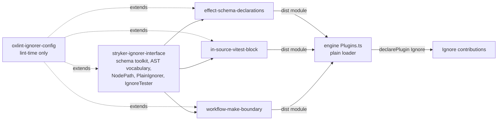

# Ignorer Family on Standard Schema - Plan

## Goal Capsule

**Objective.** An ignorer author installs one package, writes a plain module that declares the AST shape it reasons about as a Standard Schema, and a StrykerJS run ignores exactly the mutants that module names. The ignorer and the host share no runtime. A malformed module is rejected by name at load.

**Means.** A zero-dependency interface package declares the input as a Standard Schema and ships the node vocabulary, the schema toolkit, and the test harness. Three single-ignorer packages depend only on it. The engine's plain loader requires the declared schema (KTD1, KTD2, KTD5, KTD6).

**Authority.** This plan, then `AGENTS.md` and `CONSTITUTION.md`, then the session-settled Key Decisions below. Where this plan and a gate disagree about a specific change, the gate wins and the disagreement goes to the gate's owner.

**Stop conditions.** Stop and report, do not improvise, when: the preset cannot resolve its `jsPlugins` entry and both documented fallbacks fail; a test fixture cannot typecheck against the canonical vocabulary without a cast; a case expectation and the carried-over suite disagree.

**Execution profile.** Subagent-driven via `ce-work`. Tail: simplification pass, code review, commits on `feat/plain-ignorer-split`; the open ignorer-split PR is updated, not re-opened.

## Product Contract

### Summary

The three Effect ignorer plugins and their contract package become four packages that share no runtime with the host: one interface package publishing a Standard Schema declaration of the ignorer input, and three ignorers depending only on it. The engine keeps its native plugin protocol and gains a structural requirement on plain ignorer modules. A private lint preset enforces the zero-Effect invariant.

### Problem Frame

The shipped split bundled Effect into every ignorer `dist` and kept Effect in every devDependency block, so an ignorer's install weight and test harness rode on the host framework's version. The guards were Effect Schemas, so the published input shape was expressible only in one library's dialect. The family aggregate lint preset pulled ten plugins, five of them Effect-peered, into packages that must not import Effect at all.

### Requirements

**Contract and packaging**

- R1. The interface package declares the ignorer input — the AST node and path shapes an ignorer decides over — as Standard Schema values on its published surface.
- R2. The interface package and the three ignorers carry no Effect dependency in `dependencies`, `devDependencies`, or `peerDependencies`, and no source or built file of those four imports an `effect` specifier.
- R3. Each ignorer package has exactly one runtime dependency: the interface package.
- R4. The four packages lint against a preset this repo owns, which bans Effect and family-runtime imports. The preset is not inherited from `@systemfsoftware/all`.

**Behavior**

- R5. Each ignorer's decisions are unchanged: the same inputs produce the same reasons the shipped suites pin today.
- R6. The engine loads plain `strykerIgnorers` modules, requires each entry to carry a valid Standard Schema, rejects a malformed entry with a named load error, and lifts valid entries into `Ignore` contributions exactly as native plugins. The schema is checked once at load and consumed by the case-table harness (U2); a run never validates a mutant path against it.
- R7. A test author exercises an ignorer through a case-table harness without importing runner internals into production code, and an unwired harness fails loudly instead of passing silently.

**Release**

- R8. Changesets name the new package names and the no-Effect facts. No published claim states that Effect is bundled.

### Key Decisions

- KD1. **The ignorer input is declared as a Standard Schema, not as Effect Schema or bare TypeScript types.** Governs R1. (session-settled: user-directed — chosen over Effect Schema and bare types: the ignorer and the host must not share a runtime.)
- KD2. **The four packages carry no Effect dependency at all, devDependencies included.** Governs R2. (session-settled: user-directed — chosen over runtime-only removal: the user's words were "shouldn't even have an effect dependency at all".)
- KD3. **The family lints against its own preset rather than inheriting `@systemfsoftware/all`.** Governs R4. (session-settled: user-directed — chosen over per-package inline rule lists: the ban must live in one enforceable place.)
- KD4. **Case tables through a purpose-built harness replace property tests and snapshots.** Governs R5, R7. (session-settled: user-directed — chosen over snapshot tests and over keeping FastCheck: the user asked for an IgnoreTester after first proposing snapshots.)

### Scope Boundaries

Non-goals: the engine's native `strykerPlugins` protocol and its suites; per-mutant schema validation; a `StandardJSONSchemaV1` companion; renaming the three ignorer packages; publishing the preset. Deferred to follow-up work: publishing the preset as a family package if a second consumer appears.

### Sources

- Standard Schema spec, primary source: `github.com/standard-schema/standard-schema`, `packages/spec/src/index.ts` (the `~standard` shape, `validate(value, options?)`, `Result`/`Issue`), and `packages/examples/json-implement.ts` (minimal implementation returning `{value}` or `{issues}`).
- Wiki `software-wiki/entities/standard-schema.md` atoms A3, A8, A12, A13: integration carries no runtime dependency; copy/paste of the types is sanctioned; the spec _package_ must be a regular dependency, a route this plan rejects because the interface package's contract is zero runtime dependencies.
- Wiki `software-wiki/pages/plugin-axiom-contracts.md` A2, A5, A6: plugins depend only on the published contract; the contract is versioned and backward-stable.
- Repo anchors: `packages/ignorers/*/src/AstNode.schema.ts` (the guards being replaced), `packages/stryker-js-engine/src/Plugins.schema.ts:23-25` and `src/Plugins.ts:449-467` (the loader seam), `packages/toolchain/vitest-config` (the private-package precedent), `packages/ignorers/contract/node_modules/@systemfsoftware/all/dist/index.mjs` (the preset composition model).

## Planning Contract

### Key Technical Decisions

- KTD1. The interface package vendors the spec-current Standard Schema types by copy/paste instead of depending on `@standard-schema/spec`. Cites R1. The spec sanctions copying; the package route would make it a regular dependency per the spec's own guidance, and this package's contract is zero runtime dependencies.
- KTD2. The toolkit is the builder set closed under the four packages' needs, each builder naming its consumer in U2. Cites R1. The rejected alternative — plain type predicates plus one adapter — loses declarative composition and would re-declare the shared vocabulary per package; every builder in the kept set has a named consumer, so none is speculative.
- KTD3. `struct` is inexact and `suspend` fails past `maxDepth: 6`, mirroring the Effect schemas' excess-property tolerance and their `recursionBudget: { maxDepth: 6, depthSize: 'small' }`. Cites R5. Every existing fixture nests at most four levels, so no pinned expectation moves.
- KTD4. The canonical ESTree vocabulary lives in the interface package; per-ignorer schema files keep only decision-specific composites. `effect-schema-declarations` keeps a local strict `CallExpression` (`arguments: array(AstNode)`) because its decision indexes arguments. Cites R1, R5.
- KTD5. The engine validates the descriptor structurally, once per module at load, and never validates a per-mutant path. Cites R6. (session-settled: user-directed — chosen over per-path validation: a recursive AST validated per mutant is a cost with no consumer.)
- KTD6. The declared schema's runtime consumer is the harness's per-case input assertion; the loader checks shape only. Cites R6, R7. A host-side path check was rejected: every vocabulary ends in an `UnknownNode` catch-all, so such a check could never fail.
- KTD7. The preset is a private workspace package composing `@systemfsoftware/oxlint-plugin` and `@systemfsoftware/oxlint-plugin-recommended`, excluding every Effect-peered plugin, and adding a `no-restricted-imports` ban. Cites R4. (session-settled: user-directed — chosen over a published family package and over per-package inline configs.)
- KTD8. Contract versioning rides the interface package's semver plus `~standard.version: 1`; the descriptor carries no version field. Cites R6. An incompatible descriptor is rejected at load by the structural decode.

### High-Level Technical Design

Sketches only; the units carry the binding detail.

Component topology:



Load protocol, one pass per module:

1. Read the module's `strykerIgnorers` export.
2. Decode each entry against the plain schema: `name` a string, `schema` a `~standard` object with `version: 1`, a `vendor` string, and a callable `validate`, `shouldIgnore` a function.
3. On decode failure, fail the load with `PluginLoadFailedError` naming the module.
4. On success, wrap the entry in an `Ignore` contribution and merge it with native plugin contributions; selection, shadowing, and layer building are unchanged.

Toolkit grammar:

```text
Schema<Output>  = { '~standard': { version: 1, vendor, validate(value, options?) -> Result, types } }
Result          = { value: Output } | { issues: Issue[] }
builders        = string | literal | literals | unknown | struct(inexact) | union(first-match)
                | array | nonEmptyArray | optional | nullable | declared | suspend(maxDepth 6)
is(schema)      = synchronous predicate over the builder's validate
```

### Assumptions

- A1. `import.meta.resolve('@systemfsoftware/oxlint-plugin')` resolves from the preset's own dependency tree, as it does inside `@systemfsoftware/all`. Fallbacks are named in Risks.
- A2. `oxlint-tsgolint`, a peer of `oxlint-plugin-recommended`, resolves from the root devDependencies for filtered lint runs, as it does today.
- A3. The carried-over case expectations are the oracle for R5; no expectation is re-derived from the implementation under change.

Review lens: one destructive-review cycle ran over the pre-convergence draft with the **Substitution** lens (no prior cycle). It surfaced three assumptions — that the toolkit must be hand-rolled, that per-package schema files must stay local, that the `schema` field needs no consumer — and remediated all three: the toolkit kept only builders with named consumers, the vendored types were updated to the spec-current shape, and the harness's per-case assertion became the schema's consumer (KTD2, KTD1, KTD6).

### Risks & Dependencies

- Preset `jsPlugins` resolution fails → fall back to an absolute path from `import.meta.dirname` plus `node_modules/@systemfsoftware/oxlint-plugin/dist/index.mjs`; if that fails, drop `jsPlugins`, keep `oxlint-plugin-recommended`'s rules, and report the loss of the house rules.
- Type-aware lint cannot find `oxlint-tsgolint` from an ignorer package → add `"oxlint-tsgolint": "catalog:"` to that package's devDependencies.
- Toolkit typing friction on the recursive `AstNode` inside `MemberExpression` → declare that node kind's TypeScript interface by hand beside its schema, the pattern both Effect-based files already use; do not weaken the toolkit's types.
- Upstream dependency: the changeset gate (`scripts/check-changeset.ts`) globs two levels and cannot see `packages/ignorers/*`, and widening it is forbidden because it grades the work; the gate verifies only the engine intent, and the four ignorer intents in U7 are hand-authored and verified by hand.

### Sequencing

U1 before U2-U5: the four packages' configs extend the preset, so it must exist first. U2 before U3-U5: the ignorers import the vocabulary and toolkit. U3-U5 before U6: the engine's fixtures must carry the schema field the loader will require. U7 after U2: the interface intent must name the final package name. U8 last.

## Implementation Units

### U1. Private lint preset package

- **Goal.** A private workspace package whose default export is the four packages' entire lint configuration, banning Effect imports.
- **Requirements.** R4. Cites KD3, KTD7.
- **Files.** Create `packages/toolchain/oxlint-ignorer-config/` (`package.json`, `lib/base.js`, `lib/base.d.ts`, `tsconfig.json`, `.gitignore`, `LICENSE`); edit `pnpm-workspace.yaml`.
- **Approach.** Mirror `packages/toolchain/vitest-config`'s file set: private, `"type": "module"`, no build step, hand-written `.d.ts`, `scripts.typecheck` only. The composition is fully specified in this unit's text; `@systemfsoftware/all@2.0.2`'s built file (wherever the lockfile places it before U2 removes the last dependent) is an authoring-time cross-check only, and runtime resolution comes from the preset's own dependencies: `jsPlugins` resolves the house plugin only; `plugins` re-lists `jsdoc`, `node`, `oxc`, `promise` because setting `plugins` replaces oxlint's default set; `options` and `categories` carry over; `rules` merges the recommended rules with the house recommended rules, turns `no-ternary` and `typescript/consistent-type-assertions` off (the deltas all four packages declare today), and adds three `no-restricted-imports` patterns — `^effect(?:/.*)?$`, `^@effect/.*$` plus `^@systemfsoftware/(?:all|effect-.*)$`, and `^@systemfsoftware/stryker-js-.*$` — each with a message naming the ban. Exclude every Effect-peered plugin (`effect-dmmf`, `effect-schema`, `effect-workflow`, `effect-entrypoint`, `cell-vocabulary`, `property-testing`, `test-hygiene`, `test-placement`). Copy `all`'s nine `ignorePatterns` verbatim. Overrides: test files drop complexity and unsafe-assertion; fixture directories drop the six `typescript/no-unsafe-*` rules (list copied from `packages/ignorers/effect-schema-declarations/oxlint.config.ts`); `src` keeps complexity max 2 modified. Do not ban `node:` builtins. In `pnpm-workspace.yaml` add catalog entries for `@systemfsoftware/oxlint-plugin` `^4.0.2` and `@systemfsoftware/oxlint-plugin-recommended` `^1.3.1` and both exact versions to `minimumReleaseAgeExclude`.
- **Test scenarios.** An ignorer source file importing `effect` fails lint naming `no-restricted-imports` with the Effect message. The same import in `@systemfsoftware/all`-extended config would have passed, so the ban is observable. A test file using `describe`/`it`/`expect` from `vitest` passes. A `src` file with cyclomatic complexity 3 fails; complexity 2 passes. A fixture file with an `any`-typed member passes.
- **Verification.** `pnpm install --no-frozen-lockfile` links the package; `pnpm --filter @systemfsoftware/oxlint-ignorer-config typecheck` green.
- **Dependencies.** None.

### U2. Interface package: rename, toolkit, vocabulary, harness

- **Goal.** One zero-dependency package that declares the ignorer input as Standard Schema values and ships the vocabulary, the `ancestorsOf` walker, and the case-table harness.
- **Requirements.** R1, R2, R3, R7. Cites KD1, KD4, KTD1, KTD2, KTD3, KTD6.
- **Files.** `git mv packages/ignorers/contract packages/ignorers/interface`; edit `package.json`, `tsdown.config.ts`, `tsconfig.json`, `tsconfig.node.json`, `vitest.config.ts`, `oxlint.config.ts`, `README.md`, `AGENTS.md`; create `src/StandardSchemaV1.ts`, `src/StandardSchema.ts`, `src/AstNode.schema.ts`, `src/testing.ts`, `tests/standard-schema.test.ts`, `tests/ast-node.test.ts`, `tests/ancestors.test.ts`, `tests/ignore-tester.test.ts`; rewrite `src/mod.ts`; delete `vitest-setup.ts`, `src/__tests__/ancestor-walk.workflow.property.test.ts`, `tests/contract.integration.test.ts`.
- **Approach.** Rename the package to `@systemfsoftware/stryker-ignorer-interface`. Vendor the spec-current types in `src/StandardSchemaV1.ts`: `StandardTypedV1` base, `StandardSchemaV1` with `validate(value, options?)`, `Options.libraryOptions`, `Result`, `Issue`, `PathSegment`, `Types`, `InferInput`, `InferOutput`. Build `src/StandardSchema.ts` on them; every builder returns `{ '~standard': { version: 1, vendor: '@systemfsoftware/stryker-ignorer-interface', validate, types } }` and accepts then ignores `options`. Builder consumers: `string` for `Identifier.name`, `UnknownNode.type`, `vendor`; `literal` for every `type` discriminant, `computed: false`, `version: 1`; `literals` for the documentation key set; `unknown` for documentation values, call arguments, program bodies; `struct` for every node kind; `union` for `AstNode`, documentation keys, import specifiers; `array` for call arguments, specifiers, program bodies; `nonEmptyArray` for documentation properties; `optional` and `nullable` for `NodePath.parentPath`; `declared` for `shouldIgnore` and `validate`; `suspend` for `AstNode` and `NodePath`. `src/AstNode.schema.ts` declares the sixteen canonical kinds with exactly the field constraints the three ignorers use today, the `AstNode` union with `UnknownNode` last, one `is*` predicate per kind, then `NodePath` (`node: unknown`, `parentPath?: NodePath | null`) and `NodePathSchema`; `ancestorsOf` keeps its body byte-identical. `src/mod.ts` exports `PlainIgnorer` with the added `schema: StandardSchemaV1` field, `PlainIgnorerSchema`, and re-exports the toolkit, vocabulary, `NodePath`, `NodePathSchema`, `ancestorsOf`, and the vendored types. `src/testing.ts` exports `IgnoreTester` with `describe`/`it`/`expect` statics and `run(name, ignorer, cases)`; `run` throws when any static is unassigned, registers one descriptor case, validates every case's node against `ignorer.schema` before asserting, then one case per ignored and kept entry; `buildPath` links `ancestors` nearest-first ending in `parentPath: null`. Build entries `{ index: './src/mod.ts', testing: './src/testing.ts' }`, no `deps.alwaysBundle`; publish a `./testing` subpath; devDependencies lose `@effect/vitest`, `effect`, `@systemfsoftware/all`, `@systemfsoftware/effect-gherkin-spec` and gain the preset; `tsconfig.json` drops the `/effect` preset and keeps `tsc/dom/library-monorepo`.
- **Test scenarios.** `struct` accepts an object carrying extra keys and rejects a wrong-typed field. `union` matches the first member. `suspend` with `maxDepth: 6` rejects a seven-deep chain and accepts a six-deep one. `optional` accepts an absent key; `nullable` accepts `null`. `nonEmptyArray` rejects an empty array. `is` narrows a value the schema accepts and refuses one it does not. `ancestorsOf` over a three-level chain yields nearest-first parent, grandparent, root; `parentPath: null` and an absent `parentPath` yield nothing; a node carrying extra host properties still yields. `NodePathSchema` accepts `{node, parentPath: null}` and an absent `parentPath`. `IgnoreTester.run` throws when the statics are unassigned. A wired run over a stub ignorer with two ignored and three kept cases registers exactly six tests. A case whose node fails the declared schema fails its own case.
- **Verification.** `pnpm --filter @systemfsoftware/stryker-ignorer-interface build test typecheck lint attw` green; `dist/*.mjs` imports nothing.
- **Dependencies.** U1.

### U3. effect-schema-declarations off Effect

- **Goal.** The package decides over Standard Schema validators from the interface package, with no Effect anywhere and its decisions byte-identical.
- **Requirements.** R1, R2, R3, R5, R8. Cites KD1, KD4, KTD3, KTD4.
- **Files.** Rewrite `src/AstNode.schema.ts`; edit `src/mod.ts`, `package.json`, `tsdown.config.ts`, `tsconfig.json`, `tsconfig.node.json`, `vitest.config.ts`, `oxlint.config.ts`, `README.md`, `AGENTS.md`, `tests/__fixtures__/EffectSchemaAst.fixtures.ts`; create `tests/effect-schema-declarations.test.ts`; delete `src/schema-laws.test.ts`, `vitest-setup.ts`, `tests/schema-declaration-ignore-property.integration.test.ts`, `tests/effect-schema-declarations.integration.test.ts`.
- **Approach.** Re-export the canonical kinds under the names the decision file imports; keep local the strict `CallExpression` (`arguments: array(AstNode)`), the documentation key set, `DocumentationProperty` with `computed: false` and a constrained key, `DocumentationObject`, and their two predicates. Leave `src/SchemaDeclarationIgnore.ts` untouched. Add `schema: AstNode` to the descriptor. Delete the FastCheck generators from the fixtures; keep all fourteen fixture builders. Convert every scenario from both deleted suites into `IgnoreTester` cases with expectations verbatim: ignored positions carry `SYMBOL_DESCRIPTION_IGNORED`, `TAGGED_TAG_IGNORED`, `TAGGED_FIELDS_IGNORED`, `CLASS_ID_IGNORED`, `BRAND_NAME_IGNORED`, `OPTIONAL_DEFAULT_IGNORED`, `ANNOTATION_OBJECT_IGNORED`, `ANNOTATION_TEXT_IGNORED`; kept positions cover the bare factory tag and fields, `Symbol.keyFor` and `Object.for` descriptions, the `Symbol.iterator` member, non-tagged factories, swapped arguments, non-string and different-string slots, `Match.tag`, the orphan node, string and `S.optional` defaults, mixed and generator-only annotation objects, the empty object, documentation at index 1, documentation under a bare `annotations` identifier or under `S.filter`, a documentation key, a value with no enclosing call, behaviour-only objects, computed keys, and a `Schema.Literal` member. Express each as a path with the node under test as `node` and the enclosing positions in `ancestors`, nearest-first; the four-position documentation cases pass `ancestors: [property, object, call]`, one case per asserted value. Manifest and config deltas as in U2.
- **Test scenarios.** Every carried expectation above appears as a named case with its reason constant. Inverting the rule match in the decision file (`rule.matches(…)` to its negation) turns the suite red and names a case; restoring it turns the suite green. The descriptor case asserts the name and a `~standard` with `version: 1` and a callable `validate`.
- **Verification.** `pnpm --filter @systemfsoftware/stryker-js-ignorer-effect-schema-declarations build test typecheck lint attw` green; the package's `package.json` has one runtime dependency.
- **Dependencies.** U2.

### U4. in-source-vitest-block off Effect

- **Goal.** Same contract for the in-source test ignorer.
- **Requirements.** R1, R2, R3, R5, R8. Cites KD1, KD4.
- **Files.** Rewrite `src/AstNode.schema.ts`; edit `src/mod.ts`, manifest and configs as in U3, `README.md`, `AGENTS.md`; create `tests/in-source-vitest-block.test.ts`; delete `src/schema-laws.test.ts`, `vitest-setup.ts`, the Gherkin suite file.
- **Approach.** Re-export canonical `Identifier`; declare locally `AstLike` (the name the decision file imports for the catch-all kind), `MetaProperty`, `ImportMetaMember`, `BinaryExpression`, `IfStatement`, their three predicates, and the local `AstNode` union for the descriptor. Leave `src/InSourceTestIgnore.ts` untouched; fixtures are already Effect-free and stay verbatim. Convert every scenario: the guard shapes and the ancestor walk are ignored with `IN_SOURCE_TEST_IGNORED`; the near-misses — a bare vitest flag with no guard, the flag on the wrong side of a comparison, a non-`IfStatement` parent — are kept.
- **Test scenarios.** Each carried scenario appears as a named case with its expectation. Swapping `some` for `every` in the decision file turns the suite red and names a case; restoring turns it green.
- **Verification.** Package gates green; one runtime dependency.
- **Dependencies.** U2.

### U5. workflow-make-boundary off Effect

- **Goal.** Same contract for the workflow boundary ignorer.
- **Requirements.** R1, R2, R3, R5, R8. Cites KD1, KD4.
- **Files.** Rewrite `src/AstNode.schema.ts`; edit `src/mod.ts`, manifest and configs as in U3, `README.md`, `AGENTS.md`; create `tests/workflow-make-boundary.test.ts`; delete `src/schema-laws.test.ts`, `vitest-setup.ts`, the Gherkin suite file.
- **Approach.** Re-export the canonical kinds this package already matches, including the loose `arguments: array(unknown())`; keep only the local `AstNode` union and the `isArrowFunction` / `isFunctionExpression` aliases its decision file imports. Leave `src/MakeBoundaryIgnore.ts` untouched; fixtures stay verbatim. Convert all nineteen scenarios: positions inside a `Workflow.make` or `Workflow.total` body are kept; positions outside every make body are ignored with `NOT_INSIDE_WORKFLOW_MAKE`; the `andThen` composing member, the aliased and namespace imports, the same-file function-reference resolution, and the unrelated-import near-misses keep their current expectations.
- **Test scenarios.** Each carried scenario appears as a named case. Negating `isWorkflowConstructorCall` in `isConstructorArgumentBoundary` turns the suite red and names a case; restoring turns it green.
- **Verification.** Package gates green; one runtime dependency.
- **Dependencies.** U2.

### U6. Engine requires the declared schema

- **Goal.** A plain ignorer module without a valid declared schema fails to load with a named error; valid modules behave exactly as before.
- **Requirements.** R6. Cites KD1, KTD5, KTD6, KTD8.
- **Files.** Edit `packages/stryker-js-engine/src/Plugins.schema.ts`, `tests/__fixtures__/plain-ignorer-only.fixture.mjs`, `tests/__fixtures__/both-protocols.fixture.mjs`, `tests/__fixtures__/plain-ignorer-shadowed.fixture.mjs`, `tests/plain-ignorer-loader.integration.test.ts`; create `tests/__fixtures__/invalid-plain-schema.fixture.mjs`.
- **Approach.** Add to the plain-entry schema a `schema` field decoded as a struct with `~standard` holding `version` literal 1, `vendor` string, and a declared function `validate`. A failed decode already routes to `failPluginLoad`, so no loader logic changes. Attach a valid `~standard` object to every existing plain entry; the new fixture carries `version: 2` and a non-callable `validate`. Add a fifth scenario to the loader suite.
- **Test scenarios.** A module whose entries carry a valid schema loads and lifts into `Ignore` contributions, and the run ignores the mutants those entries name. A module whose entry declares `version: 2` with a non-callable `validate` is rejected with `PluginLoadFailedError` whose descriptor names `invalid-plain-schema.fixture.mjs`. The native-only, both-protocols, and shadowing scenarios keep their current outcomes.
- **Verification.** `pnpm --filter @systemfsoftware/stryker-js-engine test typecheck lint` green.
- **Dependencies.** U3, U4, U5.

### U7. Release intents

- **Goal.** Changesets name the new package names and the no-Effect facts.
- **Requirements.** R8.
- **Files.** Rename `.changeset/stryker-ignorer-contract-debut.md` to `.changeset/stryker-ignorer-interface-debut.md`; rewrite it and `stryker-ignorer-effect-schema-declarations-debut.md`, `stryker-ignorer-in-source-vitest-block-debut.md`, `stryker-ignorer-workflow-make-boundary-debut.md`, `stryker-js-engine-plain-ignorer-loader.md`.
- **Approach.** The interface intent states that it publishes Standard Schema validators for the AST input, the toolkit, and the harness. The three ignorer intents drop the bundled-Effect sentence and state no Effect dependency and one runtime dependency. The engine intent names the descriptor shape `{ name, schema, shouldIgnore }`.
- **Test scenarios.** The changeset gate run against the PR base reports the engine covered; the four ignorer intents are verified by hand, each intent's frontmatter key matching one of the four package names. No intent body contains the phrase "Effect is bundled".
- **Verification.** `deno run --allow-read --allow-run=git scripts/check-changeset.ts <base-sha>` green.
- **Dependencies.** U2.

### U8. Supersede the prior plan

- **Goal.** The tree and the PR reference one current plan document.
- **Requirements.** None; housekeeping required by the plan-freeze rule.
- **Files.** Delete `docs/plans/2026-09-13-2332-refactor-ignorer-split-plan.md` (removal staged at plan-write time); update the PR description's plan link.
- **Approach.** The corrected plan was placed at `docs/plans/2026-09-14-0150-refactor-ignorer-standard-schema-plan.md` at plan-write time and the superseded document was removed from the worktree then; U8 commits that pair with U7 and re-points the PR body at the new path.
- **Test scenarios.** The old path is absent from the tree and the index; the PR body links the new path.
- **Verification.** `git status` shows the deletion staged or committed; the PR body diff shows the link change.
- **Dependencies.** U7.

## Verification Contract

Run from the repository root. `pnpm install --no-frozen-lockfile` after U1 and again after U2's rename.

1. **Equivalence differential, before the Effect schemas are deleted** (U3-U5, once per package). In a gitignored `.scratch/differential.mjs`, import the current Effect-based predicates from the package's pre-change `dist` and the new toolkit predicates from `src`; run both over every fixture the package's tests build plus the near-miss shapes each suite asserts; print any disagreement. Expected: zero disagreements in all three packages. Delete `.scratch/` before committing. A disagreement means the new predicate is wrong; fix it, never the case table.
2. **No Effect anywhere.** A `node -e` pass over the four `package.json` files asserts no key in any dependency block matches `/^effect$|^@effect\//`. `git grep -n "from 'effect" packages/ignorers` returns nothing. `git grep -n "@systemfsoftware/all\|effect-gherkin-spec\|effect-schema-vite\|effect-schema-law\|@effect/vitest" packages/ignorers` returns nothing.
3. **Published surface.** Per package: `rm -rf dist && pnpm run build`; every `exports[*].types` path exists; `dist/*.mjs` contains no `effect` import specifier (the three ignorers import only the interface package; the interface package imports nothing); `pnpm run attw` green.
4. **The preset has teeth.** Add `packages/ignorers/interface/src/scratch.ts` importing `effect`; `pnpm --filter @systemfsoftware/stryker-ignorer-interface lint` fails on `no-restricted-imports` with the Effect message; delete the file; lint green. Repeat once in an ignorer package with `import { Schema } from 'effect'`. One-off observation, recorded in the report, never a committed test.
5. **Harness counts and guards.** The interface suite includes the unwired-throw case. Per ignorer, vitest's reported test count equals `1 + ignored.length + kept.length` computed from its case arrays. `passWithNoTests` is on, so zero is a failure.
6. **Behavior preserved.** The three planted inversions named in U3-U5 each turn their suite red with a named case, then green on restore. Planting a reason string proves nothing: the cases compare against the exported constants.
7. **Engine loader.** U6's test scenarios observed and the engine suite green with the fifth scenario.
8. **Whole gate.** `pnpm check:ci` exit 0; `pnpm exec turbo build typecheck test lint --force` reports every task successful with no `WARNING no output files found`.
9. **Rename complete.** `git grep -n "@systemfsoftware/stryker-ignorer[^-]"` returns nothing outside `docs/`; `packages/ignorers/contract` is absent.

### Test-layer admission

`choose-test-layer` step-0 gate on every test this plan proposes; all run in-process through a published surface, assert observable outcomes, and spawn nothing.

| Test                                                         | Surface under test                                                 | Non-test consumer                | Verdict                                                                                                         |
| ------------------------------------------------------------ | ------------------------------------------------------------------ | -------------------------------- | --------------------------------------------------------------------------------------------------------------- |
| `interface/tests/standard-schema.test.ts`                    | toolkit builders, `is`, `validate`                                 | the three ignorers' schema files | admit                                                                                                           |
| `interface/tests/ast-node.test.ts`                           | canonical predicates, `AstNode`, `NodePathSchema`                  | the three ignorers               | admit                                                                                                           |
| `interface/tests/ancestors.test.ts`                          | `ancestorsOf`                                                      | the three ignorers' `mod.ts`     | admit                                                                                                           |
| `interface/tests/ignore-tester.test.ts`                      | `IgnoreTester.run`                                                 | the three ignorers' suites       | admit; the export's consumer class is tests by design, published on `./testing`, precedent `oxlint/plugins-dev` |
| `<ignorer>/tests/<name>.test.ts` (U3-U5)                     | the published descriptor through the package's own name via `dist` | the engine loader                | admit                                                                                                           |
| `engine/tests/plain-ignorer-loader.integration.test.ts` (U6) | `loadPlugins` / `create` / `createAll` on `./plugin-loader`        | `Run.ts`                         | admit                                                                                                           |

Declared deviation: the selection table routes a pure validator to property tests plus scenarios; this plan writes scenarios only, per KD4. The compensating observers are the per-builder boundary cases and the carried case tables. No mutation gate can be named: `pnpm check:ci` has no mutation task and the repo's only mutation cell was deleted. Refused and therefore not written as tests: the preset ban (check 4, a manual observation; a committed test shelling out to oxlint would spawn a process) and the differential (check 1, development-time evidence in a gitignored scratch directory per `CONST-T11`).

## Definition of Done

Global:

- `pnpm format:check`, `pnpm typecheck`, `pnpm test`, `pnpm check:ci` all green (the `AGENTS.md` gates).
- Checks 1-9 of the Verification Contract observed, with the differential at zero disagreements and `.scratch/` deleted.
- No `effect` specifier in any dependency block, source file, or built file of the four packages.
- Abandoned-approach code removed: no FastCheck import, no `inlineSchemaTests` wiring, no `vitest-setup.ts`, no snapshot call, no scratch lint file, no dead export left by the rename.
- Committed on `feat/plain-ignorer-split` with conventional commits scoped `repo`; the open PR updated.

Per unit: the unit's Verification line green and its test scenarios observed.

## Open Questions

Deferred, non-blocking:

- Whether the preset earns publication as a family package if a second consumer appears. Deferred; U1 ships it private.
- Whether a `StandardJSONSchemaV1` companion is worth authoring for tooling. Deferred; out of scope here.
