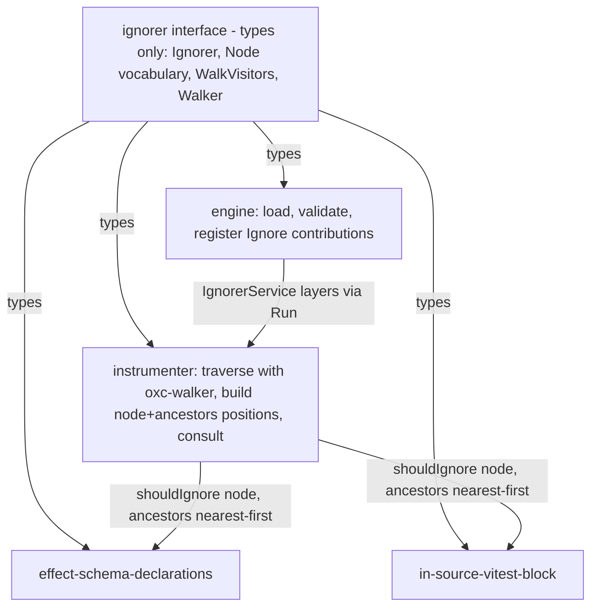

# Ignorer Walker Contract - Plan

## Goal Capsule

- **Objective:** An ignorer author writes one typed entry — `shouldIgnore` receives the oxc node and its ancestor chain, fully typed — and no ignorer package hand-rolls AST walking or shape-guard machinery to interpret positions.
- **Means:** Dependency-inverted walker — the interface package inlines the walker types (vendor-neutral, types-only); the instrumenter supplies the oxc-walker runtime and consults ignorers with typed positions; `PlainIgnorer` and `NodePath` are deleted (KTD1, KTD2).
- **Authority:** User direction in session (2026-09-14) → package `AGENTS.md` → `CONSTITUTION.md`.
- **Stop conditions:** The interface publishes types only; both ignorers pass their case tables unchanged through the migration; no `PlainIgnorer`/`NodePath` symbol remains in the workspace; `pnpm check:ci` green.
- **Execution profile:** One linear refactor, interface-first, docs last; single PR scale.
- **Tail ownership:** This plan; worktree branches per repo convention.

---

## Protected Invariants

Frozen by user direction this session; a challenge requires the user to reopen it, not an implementer.

1. The interface package stays types-only — no value export, no runtime dependency, no Effect anywhere (gate: `pnpm --filter @systemfsoftware/stryker-ignorer-interface build` — `dist/index.mjs` empty; SI1-SI3 in `packages/ignorers/interface/AGENTS.md`).
2. Positions are fully typed — nothing `unknown` crosses the published contract.
3. `PlainIgnorer` and `NodePath` are deleted, not renamed or shimmed.

---

## Product Contract

### Summary

The ignorer interface becomes one contract: a single `Ignorer` type, the AST node vocabulary, and the walker types. Hosts walk and hand each ignorer a typed `(node, ancestors)` position, nearest first. Ignorer packages depend on the interface only and never see `oxc-walker`.

### Problem Frame

The shipped contract hands each ignorer `unknown` nodes inside a `NodePath` wrapper. Every ignorer then re-proves node shapes with duplicated hand-rolled guards and re-derives parent chains by positional decoding — three packages carry walker-shaped machinery the interface never names. The redesign moves that machinery to where it belongs: the vocabulary and walk contract in the interface, the walk itself in the host.

### Requirements

| ID  | Rule                                                                                                                                                                                                                                                                                                                                             | Gate                                                                                                                    |
| --- | ------------------------------------------------------------------------------------------------------------------------------------------------------------------------------------------------------------------------------------------------------------------------------------------------------------------------------------------------ | ----------------------------------------------------------------------------------------------------------------------- |
| R1  | The interface publishes exactly: the AST vocabulary, `Ignorer`, `WalkVisitors`, `Walker` — all types, no value exports, no runtime dependencies                                                                                                                                                                                                  | Interface build + `attw`; api report (`etc/stryker-ignorer-interface.api.md`) lists exactly those symbols               |
| R2  | `Ignorer.shouldIgnore(node: Node, ancestors: readonly Node[]): string \| undefined` — ancestors nearest first; absence of a reason is `undefined`, never a boolean or empty string                                                                                                                                                               | Review reads the declared signature (SI4 pair in `packages/ignorers/interface/AGENTS.md`); type-checker                 |
| R3  | `WalkVisitors`/`Walker` are vendor-neutral; no `oxc-walker` name in the interface's surface, dependencies, or bundled declarations                                                                                                                                                                                                               | Interface build + api report; reviewer reads `package.json`                                                             |
| R4  | No `PlainIgnorer` or `NodePath` symbol remains on the contract's own surface                                                                                                                                                                                                                                                                     | Interface and family api reports list neither symbol; the effect platform's unrelated `NodePath` export is out of scope |
| R5  | The instrumenter consults every registered ignorer with `(node, ancestors)` nearest first, first reason wins; its walk conforms to the interface's `Walker` type                                                                                                                                                                                 | Instrumenter suite; type-checker proves the module-private walk adapter satisfies the published `Walker` type           |
| R6  | The engine validates entries structurally (`name` string, `shouldIgnore` callable), fails the load by module name, registers `Ignore` contributions — behavior unchanged, seam retyped                                                                                                                                                           | Engine loader integration suite (rejection fixture)                                                                     |
| R7  | `IgnorerService.shouldIgnore(node, ancestors): Option<string>` in the language package; `NodePath` re-export removed from both export sites                                                                                                                                                                                                      | Language typecheck + api report                                                                                         |
| R8  | The ignorers and the instrumenter's own ignorer implement the typed signature; hand-rolled machinery that only re-proves what the typed vocabulary proves — chain decoding, node-shape guards, slice-based path reconstruction — is deleted, keeping domain checks a type cannot express; case-table rows and reason strings stay byte-identical | Both ignorer suites — every existing row passes unchanged; reviewer reads the deleted-helper list in U4/U5              |
| R9  | Ignorer `dependencies` blocks list exactly the interface; no `oxc-walker` in any ignorer manifest                                                                                                                                                                                                                                                | Review reads the manifests (SP5 pair in `packages/ignorers/in-source-vitest-block/AGENTS.md`)                           |
| R10 | Interface `AGENTS.md`/`README`/description, both ignorer `AGENTS.md`/`README` wordings, regenerated api reports, and one changeset per touched published package state the contract                                                                                                                                                              | Review reads the docs; changesets present                                                                               |

### Key Decisions

- **One ignorer interface; `PlainIgnorer` and `NodePath` are deleted, not renamed** (session-settled: user-directed — chosen over keeping a renamed plain descriptor: two contracts for one concept). Governs R1, R4, R7
- **Positions are fully typed — nothing `unknown` crosses the contract** (session-settled: user-directed — chosen over `unknown` args narrowed per-ignorer: the guard tax is the removed cost). Governs R2, R8
- **The walker is dependency-inverted — the interface inlines walker types; a host supplies the runtime** (session-settled: user-directed — chosen over the interface publishing `oxc-walker` runtime: keeps the package types-only and ignorers vendor-unaware). Governs R3, R5, R9
- **Config names stay fixed** — the `strykerIgnorers` module key and `ignorers:` config names are unchanged, so no user config breaks. Governs R6, R10

### Scope Boundaries

- `### Deferred to Follow-Up Work`
  - Unify the instrumenter's internal vocabulary (`packages/stryker-js-instrumenter/src/Ast.ts` derivation) with the interface's — the interface's derivation becomes canonical; the follow-up deletes the instrumenter's copy with its published-surface report pinned first.
  - Skip/stop/replace walk controls in `WalkVisitors` — add when a known consumer needs them.
  - A published `Walker` runtime implementation — add when an ignorer or tool needs to re-walk rather than be consulted.
  - Scope-aware walking (`ScopeTracker`) — out of contract until a requirement names it.

---

## Planning Contract

### Key Technical Decisions

- KTD1. **Span-optional vocabulary derivation in the interface, declared canonical.** The interface derives its bundled vocabulary the way the instrumenter already does — recursive `Built`/`Child` types over `@oxc-project/types` making span fields optional, with seam unions for the large unions — so `Node` accepts parser-produced nodes and hand-built test fixtures. `type-fest` joins `devDependencies` with the `inlinedDependencies` block that inlines it into the declarations, mirroring `packages/stryker-js-instrumenter/package.json`. Raw node types from `@oxc-project/types` (^0.140.0 per `pnpm-workspace.yaml` catalog) require span fields; `packages/stryker-js-instrumenter/src/Ast.ts` carries the derivation and the assertion-disable header that records that friction. (session-settled: user-directed — chosen over raw vocabulary types: typed positions must accept authored fixtures, per R2, R8)
- KTD2. **The instrumenter is the walker-supplying host; the engine stays loader and validator.** The walk happens during instrumentation; the engine never walks. Conformance is real, not asserted: the instrumenter authors a module-private adapter value — wrapping `oxc-walker`'s walk while maintaining the ancestor chain — and binds it to the interface's `Walker` type, so the published contract is satisfied by an actual function the type-checker verifies. No new public export (per R3, R5).
- KTD3. **Flattened service signature.** `IgnorerService.shouldIgnore(node, ancestors)` replaces the path-object parameter everywhere, so one position shape flows from traverse to ignorer with no wrapper reconstruction (per R7).
- KTD4. **Precedence is pinned by the case tables.** Across ignorers the first `Some` wins (existing reduce in `packages/stryker-js-instrumenter/src/Transformer.ts`); within `effect-schema-declarations` every position from the node outward is a decision position (existing scan). The typed rewrite preserves both orderings; any case-table row changing verdict or reason is a regression (per R8). The case tables are also the mutation-gate oracle: they are the authored rows the family's mutation discipline scores against — repo gate SP5 (`packages/ignorers/effect-schema-declarations/AGENTS.md`) forbids generated rows here.
- KTD5. **Minor bump per touched package, one changeset each** — interface, both ignorers, language, engine, instrumenter — matching the family convention (`.changeset/stryker-js-engine-plain-ignorer-loader.md` shipped default-preset renames as minor on 4.x). Consumer-observable prose only (per R10).

### High-Level Technical Design

Contract shape (directional sketch of the entire published surface; the vocabulary re-export stays as today):

```ts
export interface Ignorer {
  readonly name: string
  shouldIgnore(node: Node, ancestors: readonly Node[]): string | undefined
}

export interface WalkVisitors {
  enter?(node: Node, ancestors: readonly Node[]): void
  leave?(node: Node, ancestors: readonly Node[]): void
}

export type Walker = (root: Node, visitors: WalkVisitors) => void
```

Runtime and typing flow:



`oxc-walker` (^1.1.1 per catalog and installed manifest) provides `parent` only in its callbacks; the host maintains the ancestor chain — the instrumenter already does this via its traverse stack, which is why it owns the supply role.

### Test Layer Classification

Every test this plan keeps or proposes, against the admission gate (in-process, published surface, observable outcomes, no test-born exports; default refuse):

- U3 engine loader suite — existing composition tests through the published `plugin-loader` subpath, in-process module loading, observable `Ignorer` service outcomes. Admitted; retained, not extended.
- U4 instrumenter suites — existing composition tests through the public `instrument()` export. Admitted. Two new rows proposed (root-position consult; two-ignorer precedence), both asserting observable mutant outcomes through `instrument()` — admitted.
- U5/U6 ignorer case tables — existing scenario rows calling the public `strykerIgnorers` export. Admitted as authored oracles per each package's own gate — SP5 in `effect-schema-declarations`' AGENTS and SP6 in `in-source-vitest-block`'s, both forbidding generated rows; retained byte-identical, which is the regression pin (KTD4).
- U1/U2/U7 — no tests; types and docs (SI6 in `packages/ignorers/interface/AGENTS.md`).

### Assumptions

- `oxc-walker@^1.1.1` peer range (`@oxc-project/types >=0.98.0`) is satisfied by the catalog's `^0.140.0` — verified against the installed manifest under `node_modules/.pnpm/oxc-walker@1.1.1_*`.
- Engine loader fixtures (`shouldIgnore: () => 'reason'` in `packages/stryker-js-engine/tests/__fixtures__/`) are arity-agnostic and survive the retype unmodified.
- Positions built by the instrumenter's vocabulary assign structurally to the interface's `Node` — both derive from the same `@oxc-project/types` release (tsc at the seam is the check).

### Risks

- **Vocabulary derivation friction.** The interface has never used node types in signatures; the derivation may surface seam issues the instrumenter already solved. Mitigation: mirror the `packages/stryker-js-instrumenter/src/Ast.ts` derivation shape exactly (KTD1).
- **Behavior drift in ignorers.** The typed rewrite touches every guard. Mitigation: case tables stay byte-identical (KTD4).
- **Report churn.** The interface api report (current file ≈1350 lines, `packages/ignorers/interface/etc/stryker-ignorer-interface.api.md`) and four sibling reports regenerate; review by symbol-name diff only.
- **`Walker` ships with no runtime consumer in-repo.** Its conformance proof is the instrumenter's type-level check; the interface README names the instrumenter's walk as the reference implementation so the type is not read as dead surface.

---

## Destructive Review Report

### Phase 1: Assumptions Surfaced

1. Callable-only load validation suffices for the typed contract — the host always supplies parser-produced positions, so the engine never needs to validate node shapes at load (testable: every `shouldIgnore` callsite receives nodes from the instrumenter's own traverse).
2. Structural assignability holds across the two independent vocabulary derivations — instrumenter `Node` and interface `Node` both derive from `@oxc-project/types` and the consultation seam typechecks without adapters (testable: tsc at the seam, U4).
3. Hand-built fixtures satisfy the derived `Node` union without casts once their required non-span data fields are completed — the derivation makes span fields optional; required data fields (for example a literal's `raw`) stay required and the fixture builders supply them (testable: U5/U6 fixture typecheck; a cast would be the decode-never-cast smell).

### Phase 2: Mutation Lens

**Selected:** Substitution (cycle 1; no prior lens). **Rationale:** the plan is pattern-heavy — it copies a derivation pattern into a second package and publishes a contract type without a runtime consumer; Substitution attacks exactly the primary-pattern copies.

### Phase 3: Divergence

**Pre-validation:** locations cited per failure against this plan and the repo.

**3 Failures Under This Lens:**

1. KTD1/U1 step 2 duplicate the instrumenter's `Built`/`Child` derivation instead of substituting the interface as the single vocabulary owner — the plan creates the second copy it criticizes.
2. R3 publishes `Walker` with no runtime consumer; the substitution — keep the type private until a consumer binds — is barred by Key Decision 3 (the dependency-inversion decision: the interface inlines the walker types, a host supplies the runtime), so the plan must instead make the consumer story explicit or the type reads as dead surface (Risks, fourth row).
3. U5 steps 1/3 preserve the flatten-and-index chain algorithm (`chain[position + n]` in `packages/ignorers/effect-schema-declarations/src/mod.ts`) under new types — substituting types onto the mutation-prone positional shape instead of replacing it with ancestor-relative positions.

**Diverged Draft:** The interface becomes the workspace's single vocabulary owner in this change: the instrumenter deletes its `Ast.ts` derivation and imports `Node` from the interface; one derivation, one report, ignorers and language consume the same.

### Phase 4: Convergence

## Delta Report

- **Lens Applied:** Substitution
- **Kept:** Protected invariants 1-3; unit boundaries and ordering; case-table pins (KTD4); host split — instrumenter supplies the walk, engine loads and validates.
- **Replaced:** U5's flattened-chain positional decoding → decider over `(node, ancestors)` with named relative positions (`ancestors[0]` parent, `ancestors[1]` grandparent), scan order preserved (failure 3).
- **Added:** Canonical-ownership declaration on KTD1 — the interface's derivation is canonical; the follow-up deletes the instrumenter's copy, never the reverse (failure 1). Interface README names the instrumenter's walk as the `Walker` reference implementation (failure 2).
- **Removed:** nothing structural beyond the replaced algorithm.

## Remediation Report

| # | Failure                                         | Class | Resolution                                                                                                                                                                             | Research |
| - | ----------------------------------------------- | ----- | -------------------------------------------------------------------------------------------------------------------------------------------------------------------------------------- | -------- |
| 1 | Derivation duplicated rather than substituted   | Clear | Defer full unification (touching the instrumenter's published vocabulary report doubles the review surface); declare interface derivation canonical so the follow-up has one direction | N/A      |
| 2 | `Walker` without a runtime consumer             | Clear | Invariant keeps the export; U4 proves type-level conformance, U7 documents the reference implementation                                                                                | N/A      |
| 3 | Positional chain algorithm survives under types | Clear | Adopt ancestor-relative positions in U5; U6 already scans ancestors directly — no change there                                                                                         | N/A      |

---

## Implementation Units

### U1. Interface contract rewrite

- **Goal:** The interface publishes the new surface and nothing else.
- **Requirements:** R1-R4
- **Dependencies:** none
- **Files:** `packages/ignorers/interface/src/mod.ts`, `packages/ignorers/interface/package.json` (add `type-fest` to `devDependencies`, add the `inlinedDependencies` block pinning it, update `description`), `packages/ignorers/interface/etc/stryker-ignorer-interface.api.md` (regenerate)
- **Approach:**
  1. Delete `PlainIgnorer` and `NodePath`.
  2. Add the span-optional `Built`/`Child` derivation over `@oxc-project/types` (pattern: `packages/stryker-js-instrumenter/src/Ast.ts`), re-exporting the vocabulary under the package's own names — this derivation is canonical (KTD1).
  3. Declare `Ignorer`, `WalkVisitors`, `Walker` per the HTD sketch.
- **Patterns to follow:** `packages/stryker-js-instrumenter/src/Ast.ts` derivation; existing tsdown dts-only build config unchanged.
- **Test scenarios:** Test expectation: none — types-only package; the type-checker, `attw`, and the regenerated api report are the verification (SI6).
- **Verification:** Package builds with an empty `dist/index.mjs`; `attw` clean; api report lists exactly `Ignorer`, `WalkVisitors`, `Walker`, and the vocabulary.

### U2. Language service retype

- **Goal:** `IgnorerService` speaks flattened typed positions.
- **Requirements:** R7
- **Dependencies:** U1
- **Files:** `packages/stryker-js-language/src/Ignorer.ts`, `packages/stryker-js-language/src/index.ts`, `packages/stryker-js-language/etc/stryker-js-language.api.md` (regenerate)
- **Approach:** Drop the `NodePath` import/re-export at both sites — `Ignorer.ts` and the `index.ts` barrel; type `shouldIgnore(node: Node, ancestors: readonly Node[])` with `Node` from the interface, bundled into the declarations as `NodePath` is today.
- **Test scenarios:** Test expectation: none — signature-only change; the existing suite and type-check are the verification.
- **Verification:** Language typecheck/build/api report green; no `NodePath` symbol in its report.

### U3. Engine loader retype

- **Goal:** Validation and wrapping match the new entry shape with unchanged behavior.
- **Requirements:** R6
- **Dependencies:** U2
- **Files:** `packages/stryker-js-engine/src/Plugins.ts`, `packages/stryker-js-engine/src/Plugins.schema.ts`, `packages/stryker-js-engine/tests/plain-ignorer-loader.integration.test.ts`, `packages/stryker-js-engine/etc/stryker-js-engine.api.md` (regenerate)
- **Approach:** Rename the local entry/module schema declarations to the `Ignorer` vocabulary; keep the callable-check declaration; retype the wrapper to pass `(node, ancestors)` through `Option.fromUndefinedOr`; retype the test helper from path-object to positional args; fixtures unchanged.
- **Test scenarios:** (existing suite, retained)
  - A module with two valid entries loads; the first answers its reason, the second returns none.
  - An entry with non-callable `shouldIgnore` fails the load naming the module (`PluginLoadFailedError`).
  - A module exporting both `strykerPlugins` and `strykerIgnorers` loads both contribution kinds.
  - Two entries sharing a name both load under that name; registration does not dedupe.
- **Verification:** Engine suite green; rejection path still covered by the invalid-entry fixture.

### U4. Instrumenter seam retype and Walker conformance

- **Goal:** The consultation hands typed positions and the walk conforms to `Walker`.
- **Requirements:** R5
- **Dependencies:** U2
- **Files:** `packages/stryker-js-instrumenter/src/Transformer.ts`, `packages/stryker-js-instrumenter/src/Instrument.ts`, `packages/stryker-js-instrumenter/tests/instrumenter.integration.test.ts`, `packages/stryker-js-instrumenter/tests/angular-ignorer.integration.test.ts`, `packages/stryker-js-instrumenter/etc/stryker-js-instrumenter.api.md` (regenerate)
- **Approach:**
  1. Delete `toIgnorerPath` and every path-object reconstruction at the consultation seam; the seam reads `(node, ancestors)` straight off the `TraversePath` chain, nearest first.
  2. Rewrite `angularIgnorer` and its helpers over positional ancestors: parent is `ancestors[0]`, grandparent `ancestors[1]`, and the per-ancestor re-entry calls the reason lookup as `reasonAt(ancestors[index], ancestors.slice(index + 1))` — a synthetic pair, not a rebuilt wrapper. One `shouldIgnore` call per node, unchanged.
  3. Author the conformance adapter: a module-private value wrapping `oxc-walker`'s walk with an ancestor-stack, asserted to satisfy the interface's `Walker` type; no new public export.
  4. Retype the test ignorers (`invertedKeepIgnorer`, `regionFlagIgnorer`) to the new signature.
- **Test scenarios:** (through the public `instrument()` export, in-process)
  - Keep-ignorer rows: mutants inside ignored regions carry the reason; others instrumented — existing rows unchanged.
  - Region-flag rows and Angular rows unchanged.
  - New: a top-level node (empty ancestors) consults without error and instruments normally.
  - New: with two ignorers both matching, the mutant carries the first ignorer's reason.
- **Verification:** Instrumenter suites green with unchanged rows; type-check proves `Walker` conformance.

### U5. effect-schema-declarations migration

- **Goal:** The ignorer decides over typed ancestor-relative positions with its guard machinery deleted.
- **Requirements:** R2, R8, R9
- **Dependencies:** U1
- **Files:** `packages/ignorers/effect-schema-declarations/src/SchemaDeclarationIgnore.ts`, `packages/ignorers/effect-schema-declarations/src/mod.ts`, `packages/ignorers/effect-schema-declarations/tests/effect-schema-declarations.test.ts`, `packages/ignorers/effect-schema-declarations/tests/__fixtures__/EffectSchemaAst.fixtures.ts`, `packages/ignorers/effect-schema-declarations/etc/stryker-ignorer-effect-schema-declarations.api.md` (regenerate)
- **Approach:**
  1. Rewrite the decider over `(node: Node, ancestors: readonly Node[])` with named relative positions — parent is `ancestors[0]`, grandparent `ancestors[1]`, great-grandparent `ancestors[2]` — replacing the flattened `[node, ...ancestors]` chain and its index arithmetic (Destructive Review, failure 3). Scan order preserved: the node first, then each ancestor outward.
  2. Delete the `TypedNode` guard scaffolding that only re-proves what the discriminated union now proves; keep domain checks a type cannot express (documentation-key membership, computed flags, factory-name lists).
  3. Complete the fixture builders' required non-span data fields (for example a string literal's `raw`) and type them against the vocabulary, so constructed nodes satisfy `Node` without casts (spans optional per KTD1). Verification: the decider receives `Node` parameters with no `as`-cast at any call boundary.
- **Test scenarios:** (existing case table, retained byte-identical — the regression pin)
  - Every ignored row returns its exact reason constant.
  - Every kept row returns `undefined`.
  - Chain-depth rows (grandparent/great-grandparent positions) keep their verdicts.
- **Verification:** Full case table passes unchanged; package deps list only the interface.

### U6. in-source-vitest-block migration

- **Goal:** Same migration, smaller surface.
- **Requirements:** R2, R8, R9
- **Dependencies:** U1
- **Files:** `packages/ignorers/in-source-vitest-block/src/InSourceTestIgnore.ts`, `packages/ignorers/in-source-vitest-block/src/mod.ts`, `packages/ignorers/in-source-vitest-block/tests/in-source-vitest-block.test.ts`, `packages/ignorers/in-source-vitest-block/tests/__fixtures__/InSourceTestAst.fixtures.ts`, `packages/ignorers/in-source-vitest-block/etc/stryker-ignorer-in-source-vitest-block.api.md` (regenerate)
- **Approach:** Type the guard chain over `(node: Node, ancestors: readonly Node[])`; the decider keeps its ancestors scan (already ancestor-relative — no algorithm change); delete shape-guard scaffolding; retype fixtures and the test helper.
- **Test scenarios:** (existing case table, retained)
  - Every ignored row returns the exact reason constant; every kept row returns `undefined`.
  - A literal whose ancestors carry the guard is ignored (existing extra case).
- **Verification:** Full case table passes unchanged; package deps list only the interface.

### U7. Docs, gates, and changesets

- **Goal:** Governing prose and release notes state the contract.
- **Requirements:** R10
- **Dependencies:** U1-U6
- **Files:** `packages/ignorers/interface/AGENTS.md`, `packages/ignorers/interface/README.md`, `packages/ignorers/effect-schema-declarations/AGENTS.md`, `packages/ignorers/effect-schema-declarations/README.md`, `packages/ignorers/in-source-vitest-block/AGENTS.md`, `packages/ignorers/in-source-vitest-block/README.md`, one changeset per touched package under `.changeset/`
- **Approach:** Rewrite the interface identity line and API table (`Ignorer`, vocabulary, `WalkVisitors`, `Walker`); name the instrumenter's walk as the `Walker` reference implementation; update the usage example to typed positions; refresh SI4's signature wording and the ignorers' guard-story wording; author six consumer-observable changesets (KTD5).
- **Test scenarios:** Test expectation: none — documentation and release metadata; review reads the stated contract.
- **Verification:** No stale `PlainIgnorer`/`NodePath` mention in any README/AGENTS/description; six changesets present.

---

## Verification Contract

| Scope        | Command                                                                                                                                                        | Proves                                                                      |
| ------------ | -------------------------------------------------------------------------------------------------------------------------------------------------------------- | --------------------------------------------------------------------------- |
| Interface    | `pnpm --filter @systemfsoftware/stryker-ignorer-interface build && pnpm --filter @systemfsoftware/stryker-ignorer-interface attw`                              | Types-only surface, empty runtime bundle, resolvable declarations (R1-R3)   |
| Language     | `pnpm --filter @systemfsoftware/stryker-js-language typecheck && pnpm --filter @systemfsoftware/stryker-js-language test`                                      | Service retype compiles; suite unaffected (R7)                              |
| Engine       | `pnpm --filter @systemfsoftware/stryker-js-engine test`                                                                                                        | Loader validation and rejection path (R6)                                   |
| Instrumenter | `pnpm --filter @systemfsoftware/stryker-js-instrumenter test`                                                                                                  | Consultation positions, precedence, angular rows, `Walker` conformance (R5) |
| Ignorers     | `pnpm --filter @systemfsoftware/stryker-ignorer-effect-schema-declarations test && pnpm --filter @systemfsoftware/stryker-ignorer-in-source-vitest-block test` | Case tables byte-identical through migration (R8)                           |
| Workspace    | `pnpm check:ci`                                                                                                                                                | Format, lint, typecheck, tests, builds                                      |

Symbol-death check: the interface's exports and the family's api reports list no `PlainIgnorer` or `NodePath` symbol, and the deleted decode helpers (`toIgnorerPath`, `ancestorPath`, the flattened-chain adapter) appear nowhere in source (R4, R8). The effect platform's unrelated `NodePath` export is out of scope; file and fixture names carrying the old term are residue, not symbols.

## Definition of Done

- All rows of the Verification Contract pass.
- Both ignorer case tables pass with unchanged rows, verdicts, and reason strings.
- No `PlainIgnorer`, `NodePath`, or `unknown`-typed position remains in any touched package.
- Ignorer `dependencies` blocks list exactly the interface; the interface's `dependencies` block stays empty.
- Every regenerated api report matches its package's built declarations; no hand-edited report.
- Six changesets present, consumer-observable prose only.
- Cleanup: deleted guard and chain-decoding code is removed, not commented; no compatibility shims or deprecated aliases survive the cutover.

## Sources and Research

- `packages/stryker-js-instrumenter/src/Ast.ts` — the existing `Built`/`Child` derivation and traverse stack this plan mirrors (KTD1, U4).
- `packages/stryker-js-engine/src/Plugins.schema.ts`, `Plugins.ts:429-475` — the validation and wrapping seam (U3).
- `packages/stryker-js-instrumenter/src/Transformer.ts:305-311,749-838,1369-1377` — consultation seam, angular ignorer, precedence reduce (U4).
- Installed `oxc-walker@1.1.1` manifest and README — callback shape (`enter(node, parent, ctx)`, `this.skip()/replace()/remove()`), peer ranges.
- oxc project, "Two Ways to Walk: The Visit and Traverse Systems" — the vendor's own walker taxonomy; the contract follows the callback lineage rather than the path-object lineage (Babel's `NodePath`-carrying visitors are the rejected shape).
- nikic/PHP-Parser, "Walking the AST" — prior art for `(node, parent)`-style visitor callbacks with host-side state.
- Wiki: `surface-decision-holder` (who owns a published surface — the interface's shape is a host-contract decision), `shipped-runtime-enforcement` (a types-only package enforces nothing at runtime; the engine's load-time validation is the enforcement point — confirmed by R6's design).
