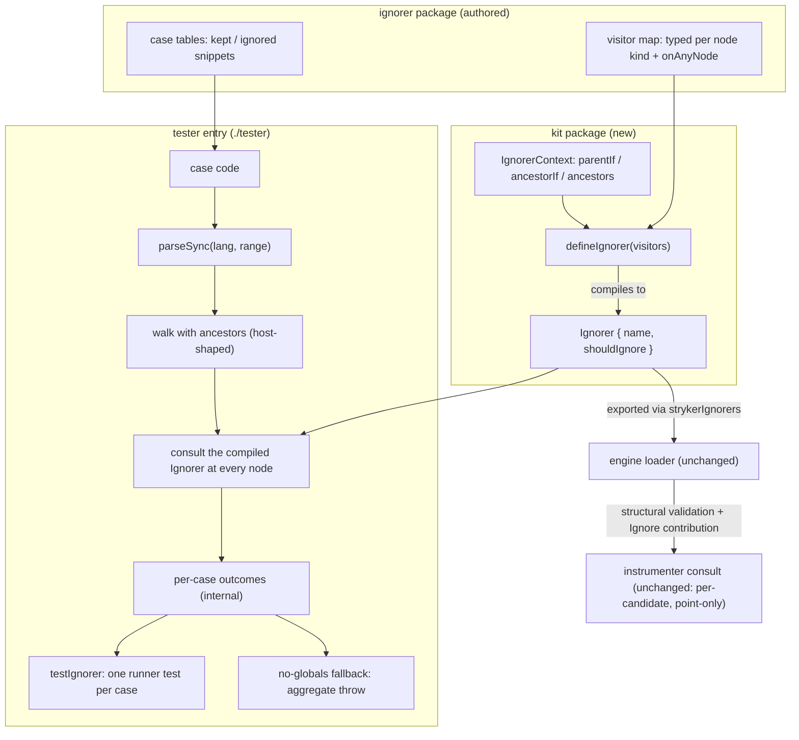

# feat: Ignorer authoring API and RuleTester kit

## Goal Capsule

- **Objective:** Ignorers are authored as typed visitors with a typed ancestor context and tested from source snippets through a RuleTester-shaped harness — kept/ignored cases in, one report enumerating every failing case out, registered as one runner test per case — so an author who has never seen the engine internals can write and verify a new ignorer.
- **Means:** A new kit package in the ignorer family compiles visitor declarations (typed visited node + typed context accessors over the ancestor chain) down to the plain `Ignorer` wire contract the engine already validates, and ships a snippet harness that parses with the instrumenter's own parser convention and reports per-case outcomes as data (KTD1, KTD2, KTD6, KTD7).
- **Authority:** User direction in session (2026-09-15, third complaint + redesign approval) → package `AGENTS.md` → `CONSTITUTION.md`.
- **Stop conditions:** Both ignorer packages are authored through the kit, every parseable case-table row passes with byte-identical reason strings, no hand-built AST fixture remains, `pnpm check:ci` green.
- **Execution profile:** One linear feature, kit-first then migrations, docs ride each unit; single PR scale.
- **Tail ownership:** This plan; worktree branches per repo convention.

---

## Product Contract

### Summary

The ignorer family gains the two layers it never had: an authoring API (`defineIgnorer` — a visitor map keyed by node type whose visitors receive the visited node narrowed **and** a typed context for the ancestor chain, compiled to the existing `Ignorer` object) and a testing harness (`IgnorerTester` — kept/ignored cases written as source snippets, parsed and walked for real, asserting ignored spans and reasons, reported per case as data and registered as one runner test per case). The wire contract, the engine loader, and the instrumenter do not change; existing ignorers keep loading exactly as they do today.

### Problem Frame

The walker-contract refactor (PR #17) settled how a _host_ consumes ignorers: one pure `{ name, shouldIgnore(node, ancestors) }` seam, host-supplied walk, types-only interface package. It left how a _human_ writes and tests one where it was: authoring means hand-rolled `unknown`-narrowing guards over the oxc node union (~372 kinds, `@oxc-project/types@0.140.0` via the pnpm catalog; the effect-schema package carries 33 such guards in `packages/ignorers/effect-schema-declarations/src/SchemaDeclarationIgnore.ts`) — and the guard pile has two halves, node-kind narrowing and ancestor/position reasoning, both hand-rolled; testing means hand-assembled AST fixture trees that bypass the parse→walk seam and mirror parser output by hand. Grounded research (2026-09-15) shows: oxlint and ESLint type the _visited_ node (`@oxlint/plugins` `StrictVisitorObject`) but leak the loose union for ancestors (ESLint issue #20902 open; oxlint `getAncestors` untyped) — the ancestor half is unsolved upstream; snippet harnesses for predicate plugins assert spans and reasons (RuleTester lineage) while transform harnesses assert output code (babel-plugin-tester, jscodeshift), and both ship an embedded parser default with a per-case override seam and per-case test registration. The host consults ignorers per mutant-candidate, point-only, first-reason-wins after directives (`packages/stryker-js-instrumenter/src/Transformer.ts:1435`, mutant filter at :1406) — so a pure predicate tested over a full walk is a superset of host consultation, and host policy stays host-tested. Nothing architectural blocks closing the authoring/test gap; this plan closes both halves of it.

### Requirements

| ID | Rule                                                                                                                                                                                                                                                                                                                                                                                                                                                                                                                                                       | Gate                                                                                                                                                |
| -- | ---------------------------------------------------------------------------------------------------------------------------------------------------------------------------------------------------------------------------------------------------------------------------------------------------------------------------------------------------------------------------------------------------------------------------------------------------------------------------------------------------------------------------------------------------------- | --------------------------------------------------------------------------------------------------------------------------------------------------- |
| R1 | `defineIgnorer` compiles a visitor declaration into a plain `Ignorer`; the engine's structural load validation (name a string, `shouldIgnore` callable) accepts its output unchanged                                                                                                                                                                                                                                                                                                                                                                       | Engine loader integration suite (unchanged) + kit suite wire-shape scenario; typecheck                                                              |
| R2 | Visitors are keyed by node type; a typed visitor receives its node narrowed to that kind plus an `IgnorerContext` whose `parentIf`/`ancestorIf` return the chain member narrowed to the requested kind or `undefined` (nearest-first), with the raw chain exposed beside them; an `onAnyNode` visitor is consulted for every node no typed visitor claimed                                                                                                                                                                                                 | Kit suite dispatch and context scenarios (U2)                                                                                                       |
| R3 | The kit's root entry imports nothing that loads a parser — no `oxc-parser`/`oxc-walker` in its module graph; the interface package stays types-only                                                                                                                                                                                                                                                                                                                                                                                                        | Review reads the root entry's import graph; `pnpm --filter @systemfsoftware/stryker-ignorer-interface build` (empty runtime, unchanged); kit `attw` |
| R4 | A kept case parses its snippet with the instrumenter's parser convention (same `parseSync` shape, `lang`, `range`) and asserts no node in the parsed tree yields an ignore reason                                                                                                                                                                                                                                                                                                                                                                          | Kit suite kept scenarios + sabotage row (U3)                                                                                                        |
| R5 | An ignored case asserts each named expectation — ignored source text, optionally a reason — against a distinct ignored span (multiset containment), never the exhaustive ignored-node set; every failing case's registered test throws an enumeration carrying its snippet, expected list, and received spans (text, node type, reason)                                                                                                                                                                                                                    | Kit suite ignored-case scenarios incl. failure-enumeration rows (U3)                                                                                |
| R6 | The tester's walk hands each node the ancestor chain excluding the node itself, matching host walk semantics; a snippet that fails to parse fails as that case's own test carrying its name and code; `testIgnorer` registers one runner test per case, titled from the case name under the subject's registered name                                                                                                                                                                                                                                      | Kit suite ancestors pin, parse-failure rows, per-case registration rows (U3)                                                                        |
| R7 | Both ignorer packages are authored through `defineIgnorer` with context accessors (no hand-rolled ancestor narrowing remains), their suites rewritten as tester cases with every parseable row preserved and reason strings byte-identical, and the hand-built AST fixture files deleted; rows no snippet can produce (a parentless identifier, ancestor chains missing their intervening nodes — inputs a real walk never yields) retire with that justification recorded beside the table; each registered visitor kind is exercised by at least one row | Double-green pin runs (U4, U5); workspace symbol search finds no fixture import                                                                     |
| R8 | Manifests and package docs state the new dependency posture — interface plus kit, still zero Effect — api reports regenerated, one changeset per touched published package                                                                                                                                                                                                                                                                                                                                                                                 | Review reads manifests/docs; `pnpm check:ci` (api:check, attw)                                                                                      |

### Key Decisions

- **Build the missing authoring and testing layer; the wire contract does not change** (session-settled: user-directed — chosen over the wire-contract-only status quo, rejected in three prior sessions). Governs R1, R2, R4, R5, R7
- **The kit publishes with no backwards-compatibility commitment while it has no adopters beyond this plan's own migrations** (user-directed in review, 2026-09-15 — chosen over freezing an adopter-less surface or keeping the kit workspace-private: breaking changes stay allowed at 0.x; the api reports gate drift for this repo's family, not consumer stability; the audience is ignorer authors, starting with this repo's family). Scoped exception, recorded: the wiki plugin-contract axioms (backward-stable contracts, A2/A5/A6) point the other way; this posture holds only until a first adopter outside this repo exists, per user direction. Governs R8
- **Typed context accessors over the ancestor chain, not a raw array and not a relational rule engine** (redesign approved 2026-09-15 after grounded research): visitors receive `(node, ctx)`; `ctx.parentIf(kind)`/`ctx.ancestorIf(kind)` collapse the ancestor half of the guard pile into narrowed one-liners while keeping the oxlint-shaped visitor map the user named. Rejected: relational rule objects (ast-grep shape) — our rules are position+value-predicate mixes, so a data engine grows `where` callbacks and ends up code anyway, and ast-grep itself is a second (tree-sitter) parser whose test runner is out-of-process; raw `Node[]` ancestors — the leak both upstream ecosystems still have and this family does not need to inherit. Governs R2, R7

### Success Criteria

- An ignorer author writes a new ignorer as a typed visitor map with typed ancestor context and tests it with code snippets; no hand-built AST node and no hand-rolled ancestor narrowing appears anywhere in the family's sources or tests.
- A migrated ignorer's suite passes the same rows with the same reason strings before and after the source rewrite — the pin proves the rewrite behavior-preserving.
- A failing case goes red as its own runner test, naming its snippet, expectations, and received spans.

### Scope Boundaries

#### Deferred to Follow-Up Work

- Migrating the instrumenter's internal ignorers (angular signal-query, comment directives) to kit authoring — host-internal deciders, not plugin-family packages.
- An exhaustive-set assertion mode for ignored cases — containment is the default; add when a case genuinely needs totality.
- Publishing a shared walker runtime outside the interface package (interface is types-only; the tester-local walk remains the accepted duplication, KTD5).

#### Outside this product's identity

- Changes to the engine loader, the `strykerIgnorers` module key, the `Ignorer` wire type, or the instrumenter's walk and consult policy (per-mutant-candidate, point-only, first-reason-wins after directives).
- Runtime exports from the interface package; any Effect dependency in the ignorer family.
- Testing host consult policy (directives, exclusions, multi-ignorer precedence) — the engine and instrumenter suites own it; the kit tests one ignorer's decision policy over a full walk, a superset of host consultation for pure ignorers.

---

## Planning Contract

### Key Technical Decisions

- KTD1. **`defineIgnorer` compiles at author time to the plain `Ignorer` object** — visitors dispatch on the node's type field inside `shouldIgnore`; no host, loader, or instrumenter change exists to make. The compile is a lookup plus call, pure per node (CONST-P1). Rejected: teaching the engine to accept visitor maps natively — moves every host onto a new contract to fix an authoring problem.
- KTD2. **One kit package, two entries** — root entry exports `defineIgnorer` and types only (parser-free); a `./tester` subpath owns the `oxc-parser`/`oxc-walker` dependencies. Keeps ignorer runtime dependencies tiny and prevents parser construction in engine consumers (precedent: `IN5` in `packages/stryker-js-instrumenter/AGENTS.md` — lazy parser import, WASI-aliased in the CLI). The interface package is a declared runtime dependency of the kit so tsdown keeps its node types external in emitted declarations — inlining produced the cross-copy `d.ts` explosion fixed earlier in this repo. Rejected: two packages (doubles tooling boilerplate); one entry (couples authoring to the parser).
- KTD3. **Containment assertions, not exhaustive ignored-node sets** — a subtree-ignoring decider (the vitest-block ignorer answers for every node under a guard) makes the exhaustive set walker noise; asserting named spans with reasons keeps the oracle sharp where it matters. Multiset matching preserves multiplicity when a case means to. Committed stored-output snapshots stay banned (CONST-T11); expectations are hand-written oracles, not recorded output.
- KTD4. **Tests-first migration per package** — convert each suite to `IgnorerTester` while the current deciders still hold, run green (the pin), then re-author through `defineIgnorer` and run the same rows green again (CONST-T9: pin the published behavior before deleting a path).
- KTD5. **The tester hosts its own ancestor-tracking walk** over `oxc-walker`, shaped identically to the instrumenter's adapter (`packages/stryker-js-instrumenter/src/Ast.ts`, module-private walker; oxc-walker exposes enter/leave only — no ancestor stack, no per-type dispatch) and typed by the interface `Walker` type. Rejected: exporting a runtime walker from the interface (types-only invariant); the instrumenter depending on the kit (wrong direction for a dev kit). Drift risk is named in the kit's package rules with a review gate and pinned by the U3 ancestors scenario.
- KTD6. **Ignored spans identified by source-text slice with optional reason; `lang` defaults to `ts` per tester, per-case override** — source text is what an author writes; spans derive from the parsed node's `start`/`end` offsets (guaranteed by `range: true`), never from the instrumenter's `spanOf` helper, which reads a `range` field parser output does not carry. The embedded-parser-with-override seam mirrors babel-plugin-tester and jscodeshift; the vendor is fixed by the contract (the wire `Node` is oxc's), so the seam is options, not parser identity.
- KTD7. **One public tester entry; registration with a throwing fallback** — `testIgnorer(subject, cases)` parses, walks, consults, and registers one runner test per case through detected globals (`describe`/`it` on globalThis, the babel-plugin-tester pattern); with no globals present it throws one aggregate error enumerating every failing case (runner-agnostic CI). The case set is bound to its subject — the wire contract guarantees `subject.name`, so a separate case-set name argument and its mismatch-failure class do not exist (cycle-2 Brevity: deleted, not guarded). Per-case outcomes stay an internal type; publishing a report plus an assert function had no consumer beyond their own tests (CONST-S3). Rejected: aggregate-throw-only entry (one vitest failure hides the rest — cycle-1 F3); importing vitest in the tester entry (runner coupling); a three-name surface (`run`/`assertReport`/`describeIgnorer`).

### Test Layer Ruling

Every test this plan proposes is a **composition/scenario test through a published programmatic surface**, per the choose-test-layer admission gate: in-process (`parseSync` is an in-process binding, not a spawn); imports nothing but the published surface under test (kit root, kit tester entry, each package's `strykerIgnorers`); asserts only externally observable outcomes (reasons returned, registered per-case test outcomes, thrown enumerations); no test-born exports. `testIgnorer`-registered cases are scenario tests through the published harness, one runner test per case. Direct-call rows pass minimal literal nodes as _inputs_ to the published `shouldIgnore`/context surface — admitted by the gate as composition tests with public-surface observables, not fixtures. Error paths are mandatory coverage (sabotage, parse-failure, and no-globals fallback rows in U3). Mutation stance per CONST-T3: the change-level observer is the double-green pin run (the same case tables kill the same decisions before and after rewrite); no new mutation gate is minted for these packages (none exists today; gate-minting is not this change's to do).

### High-Level Technical Design

### Destructive Review (two cycles: Inversion, then Brevity)

Assumptions surfaced: **D1** the mapped visitor type over ~372 kinds typechecks acceptably (precedent now external: `@oxlint/plugins` ships the same mapped-type visitor object over its union, bivariance hack included); **D2** source-text slice is a stable identity for expected spans; **D3** the existing case tables fully capture both packages' published behavior; **D4** typed context accessors are novel upstream (ESLint issue #20902 open) — API churn risk bounded by the no-backwards-compat posture. Lens: **Inversion** (first cycle on this artifact; chosen because the plan mirrors the oxlint shape faithfully and the compile direction deserved attack). Findings and adopted remediations:

| #  | Failure                                                                                                                                              | Class | Resolution                                                                                                           |
| -- | ---------------------------------------------------------------------------------------------------------------------------------------------------- | ----- | -------------------------------------------------------------------------------------------------------------------- |
| F1 | A visitor keyed on a wrong-but-valid node kind silently never fires — nothing typechecks or tests registered-key coverage                            | Clear | R7 gains the registered-kind-exercised requirement; U2/U4/U5 scenarios each name it                                  |
| F2 | A fresh decider with a broad `onAnyNode` can pass its own cases while excluding whole unrelated subtrees — over-ignoring inflates the score silently | Clear | Each migrated suite gains one broad kept snippet (realistic non-matching file) pinning that the decider stays narrow |
| F3 | Aggregate single-error reporting inverts RuleTester's per-case red — one vitest failure hides the rest in a text blob                                | Clear | KTD7 lands per-case registration (`describeIgnorer`) now; `assertReport` keeps the enumeration for CI                |

Structural delta: Kept — wire compile (KTD1), two entries (KTD2), containment (KTD3), tests-first migration (KTD4), tester-local walk (KTD5). Added — registered-kind coverage requirement (R7), broad kept snippets (U4/U5), typed context accessors (R2), report-as-data plus per-case registration (KTD7). Replaced — aggregate-only reporting → report data + per-case tests; raw `Node[]` authoring surface → typed context. Removed — nothing; no prior artifact.

Cycle 2 (redesign, Brevity lens rotated from Inversion — the redesign accumulated API surface). Assumptions surfaced: the context needs both accessors plus the raw chain; the tester needs three public names (`run`/`assertReport`/`describeIgnorer`); a case-set name argument is needed beside the subject's registered name. Failures and adopted remediations:

| #  | Failure                                                                                                                                      | Class | Resolution                                                                                                                                        |
| -- | -------------------------------------------------------------------------------------------------------------------------------------------- | ----- | ------------------------------------------------------------------------------------------------------------------------------------------------- |
| F4 | Report outcomes echo their inputs — `code` and case kind re-shipped per outcome (U3 approach)                                                | Clear | Outcomes stay internal and carry only name, passed flag, failures, and received spans; the snippet reaches failure messages from the case closure |
| F5 | `run` plus `assertReport` have no consumer beyond their own tests (KTD7, CONST-S3)                                                           | Clear | One public entry `testIgnorer(subject, cases)`; per-case outcomes internal; the no-globals aggregate throw is the entry's own fallback branch     |
| F6 | Three names for one identity — case-set name argument, `subject.name`, registered title; R6's mismatch check policed the redundancy (U3, R6) | Clear | Name argument deleted, not guarded: the case set is bound to its subject; R6 loses the mismatch row and gains the registration-title clause       |

Radical alternative considered: collapse the tester to the single registration entry with internal outcomes (adopted). Structural delta cycle 2: Kept — cycle-1 kept set plus typed visitors and both context accessors (`parentIf` is depth-exact, not subsumed by `ancestorIf`'s nearest-at-any-depth scan). Replaced — three-name tester trio → single `testIgnorer`; `run(name, …)` → identity from the subject. Added — no-globals fallback scenario (globals saved and restored around the row). Removed — case-set name parameter, public report/assert names, R6 mismatch row.

### Assumptions

- Package name `@systemfsoftware/stryker-ignorer-kit` at `packages/ignorers/kit/` (workspace glob `packages/ignorers/*` in `pnpm-workspace.yaml` admits it; turbo discovers by scripts).
- D1 (above) — verify at U2 typecheck; documented fallback: visitor parameter typed at the union with narrowing in the map's value type. The fallback loses nothing behavioral. External precedent (`@oxlint/plugins@1.79.0` `StrictVisitorObject`) says the mapped form compiles at ecosystem scale.
- Every public entry gets its own api-extractor config: the root entry's `api-extractor.json` plus `api-extractor.tester.json` for the `./tester` entry, with `api:check`/`api:update` chaining one `--config` run per entry — the engine's actual multi-entry precedent (`packages/stryker-js-engine/package.json` chains five configs via `concurrently`; `packages/stryker-js-engine/api-extractor.base.json` is the per-entry shape).
- Tests consume built dist (`turbo test` dependsOn `^build`, `turbo.json`).

### Risks & Dependencies

- **Visitor-map and context-accessor type weight** (TS2589 or slow dts emit) — mitigation: decide at U2 typecheck; fallback above is behavior-neutral; external precedent cited in Assumptions.
- **Typed-context novelty** (D4) — upstream has no accepted typed-ancestor design; our accessor set may churn — mitigation: no-backwards-compat posture at 0.x, accessors are three pure functions over the chain.
- **Walker-semantics drift** between tester walk and instrumenter consult walk — mitigation: identical adapter shape, interface `Walker` typing both, kit package rule naming the invariant (review gate), U3 ancestors pin. Reversal trigger for the whole tester shape: a second AST vendor or a format oxc cannot parse enters the family → add a `parse` injection option to the tester then.
- **Snippet-fidelity risk in migration** — a converted case that does not reproduce the original fixture's AST shape tests something else; mitigation: convert row-by-row against the existing tables (they are the pin), keep names and reason strings byte-identical so drift fails loudly.

### Sources / Research

- Grounded research run 2026-09-15 (four scouts): babel-plugin-tester v12 (output-code assertions; embedded babel default with per-case/per-invocation override seam; factory registers its own tests; MIT, active), jscodeshift v17 testUtils (`defineInlineTest`, module-level parser with per-test override; output-code assertions; MIT, Meta-maintained), ast-grep v0.45 relational rules (`inside`/`has`/`stopBy`, `nthChild`; MIT, active; napi typed API but rule-test runner is the Rust CLI, out-of-process; tree-sitter parser ≠ oxc nodes), esquery/ESLint selectors (per-node matching only; chained relative selectors buggy — esquery issue #152 open 2026-08).
- oxlint JS plugin API 2026: ESLint-clone `create(context)` visitors; `@oxlint/plugins` `defineRule`/`StrictVisitorObject` types the visited node (unions where shapes diverge, bivariance hack); ancestors untyped; official `RuleTester` shipped Feb 2026 (PR #16206, commit 5da1a63) bundled in the `oxlint` package, split into `@oxlint/plugins-dev` proposed (issue #18610, open) — the same authoring/tester entry split this plan adopts.
- ESLint v9/v10: `RuleTester` flat-config constructor, per-case `languageOptions.parser`; `getAncestors`/`parent` typings "inaccurate and missing" per ESLint issue #20902 (open 2026-05-22); typed node→parent map proposal #20969 closed unaccepted 2026-06-10.
- Host consult semantics (in-repo): `packages/stryker-js-instrumenter/src/Transformer.ts:1290` (visitNode), :1435 (`mutableFor` → `ignoreReasonFor`), :1406 (ignoreReason mutant filter), :1395-1400 (first-reason-wins fold over `options.ignorers`), :1354-1361 (`shouldSkip` prune — directives/types only, never ignorers); engine builds descriptors only (`packages/stryker-js-engine/src/Plugins.ts:425-432`, `Run.ts:458-475,556-557`).
- Local precedent: `packages/stryker-js-instrumenter/src/Parser.ts` (parse convention), `src/Ast.ts` (walker adapter), `src/Oxc.ts` (lazy parser load), `packages/stryker-js-engine/src/Plugins.schema.ts` (structural validation), `docs/plans/2026-09-14-2048-refactor-ignorer-walker-contract-plan.md` (types-only invariant, R-ID discipline), `docs/solutions/tooling-decisions/plain-entry-contract-without-a-declared-schema.md` (the AST vendor owns the vocabulary).

---

## Implementation Units

### U1. Kit package scaffold

- **Goal:** `@systemfsoftware/stryker-ignorer-kit` exists as a building workspace package with two entries and full family tooling.
- **Requirements:** R3
- **Dependencies:** none
- **Files:** `packages/ignorers/kit/package.json`, `packages/ignorers/kit/tsconfig.json`, `packages/ignorers/kit/tsconfig.build.json`, `packages/ignorers/kit/tsconfig.node.json`, `packages/ignorers/kit/tsconfig.api-tester.json`, `packages/ignorers/kit/tsdown.config.ts`, `packages/ignorers/kit/vitest.config.ts`, `packages/ignorers/kit/oxlint.config.ts`, `packages/ignorers/kit/api-extractor.json`, `packages/ignorers/kit/api-extractor.tester.json`, `packages/ignorers/kit/.attw.json`, `packages/ignorers/kit/.gitignore`, `packages/ignorers/kit/LICENSE`, `packages/ignorers/kit/AGENTS.md`, `packages/ignorers/kit/README.md`, `packages/ignorers/kit/etc/stryker-ignorer-kit.api.md`, `packages/ignorers/kit/etc/stryker-ignorer-tester.api.md`, `.changeset/stryker-ignorer-kit-debut.md`
- **Approach:** Clone the tooling set from `packages/ignorers/in-source-vitest-block` (tsdown entries `index` → `src/mod.ts`, `tester` → `src/tester.ts`; exports map `.`, `./tester`, `./package.json`; api report `stryker-ignorer-kit.api.md`). Every public entry gets its own api-extractor config — `api-extractor.json` for the root and `api-extractor.tester.json` for `./tester` (report `stryker-ignorer-tester.api.md`, entry point `dist/tester.d.ts`, its own `tsconfig.api-tester.json`) — with `api:check`/`api:update` chaining one `--config` run per entry, exactly as `packages/stryker-js-engine/package.json` chains five. Dependencies: interface (`workspace:^`), `oxc-parser`/`oxc-walker` (`catalog:`) — parser pair serves the tester entry only, by entry isolation (KTD2). `pnpm install` links the package before anything builds against it. Kit AGENTS.md states the identity rules: zero Effect; root entry parser-free (review gate per R3); tester walk mirrors the instrumenter's ancestor semantics (KTD5, review gate); no backwards-compatibility commitment while adopter-less — breaking changes allowed at 0.x, api reports gate family drift, not consumer stability.
- **Test expectation:** none — scaffolding; proof is the build, api seed, and `attw`.
- **Verification:** Kit builds; `pnpm --filter @systemfsoftware/stryker-ignorer-kit build` green; package linked.

### U2. defineIgnorer authoring API with typed context

- **Goal:** An ignorer author declares typed visitors; each visitor receives its narrowed node plus a typed context for the ancestor chain; `defineIgnorer` compiles them to the wire contract.
- **Requirements:** R1, R2, R3
- **Dependencies:** U1
- **Files:** `packages/ignorers/kit/src/mod.ts`, `packages/ignorers/kit/tests/define-ignorer.test.ts`, `packages/ignorers/kit/etc/stryker-ignorer-kit.api.md` (regenerate)
- **Approach:** Export `IgnorerContext { readonly ancestors: readonly Node[]; parentIf<K extends Node['type']>(kind: K): Extract<Node, { readonly type: K }> | undefined; ancestorIf<K extends Node['type']>(kind: K): Extract<Node, { readonly type: K }> | undefined }` — `parentIf` reads `ancestors[0]`, `ancestorIf` scans nearest-first; both are three-line pure lookups, the only narrowing machinery in the family. The visitor map type maps every node kind to a visitor receiving that kind's narrowed node plus `IgnorerContext`, with an `onAnyNode` fallback beside it receiving the full union plus context; the compile dispatches on the node's type field, builds the context once per call, and falls through to `onAnyNode` when the typed visitor is absent or declines (R2). One localized type assertion at the dispatch, commented with its soundness invariant (the map is keyed by the same field the dispatch reads). Reason strings are the visitor's return; absence is `undefined` — never a boolean.
- **Patterns to follow:** `packages/ignorers/interface/src/mod.ts` for the derived vocabulary; `@oxlint/plugins` `StrictVisitorObject` (mapped visitor type over a node union, bivariance hack) as external precedent for the mapped form; `packages/ignorers/in-source-vitest-block/src/InSourceTestIgnore.ts` for reason-constant discipline.
- **Test scenarios** (composition layer through the published root entry):
  - A typed visitor receives the node it was keyed for; its reason string is returned from the compiled `shouldIgnore`.
  - A typed visitor declining falls through to `onAnyNode`.
  - A node kind with no typed visitor is handed to `onAnyNode`.
  - A typed visitor claiming the node prevents `onAnyNode` from running for that node.
  - `ctx.parentIf` returns the parent narrowed when its kind matches and `undefined` when it does not; `ctx.ancestorIf` returns the nearest matching chain member, nearest-first, and `undefined` when absent; `ctx.ancestors` is the raw chain.
  - The compiled object satisfies the wire shape structurally — name string, callable `shouldIgnore` — asserted without importing the engine's Effect schema (kit is zero-Effect; engine-side acceptance stays with the existing loader suite and U4/U5's `strykerIgnorers` runs).
  - A typed visitor receives the ancestor chain excluding the node itself, nearest-first — the compiled `shouldIgnore` passes its ancestors argument through unmodified (R2's ancestor clause, proven here).
- **Verification:** Kit suite green; typecheck accepts the mapped type and the context generics (D1's fallback decision happens here); api report regenerated; `attw` clean.

### U3. IgnorerTester harness

- **Goal:** RuleTester-shaped cases — snippets in, ignored spans asserted — run against any compiled ignorer as one runner test per case, with a throwing aggregate fallback where no runner globals exist.
- **Requirements:** R4, R5, R6
- **Dependencies:** U2
- **Files:** `packages/ignorers/kit/src/tester.ts`, `packages/ignorers/kit/tests/ignorer-tester.test.ts`
- **Approach:** The single public entry is `testIgnorer(subject, cases): Promise<void>`: the case set is bound to its subject, whose registered name titles the registered suite (the wire contract guarantees the name, so no name argument and no mismatch-failure class exist — cycle-2 F6). The entry is async: the tester entry lazily dynamic-imports `oxc-parser` on first use, mirroring `loadOxc` in `packages/stryker-js-instrumenter/src/Oxc.ts` — a static import would construct parser machinery at module load — then parses each case with the instrumenter's `parseSync` convention (`lang`, `range`), walks with the host-shaped ancestor walk (enter receives the chain excluding the current node — R6), and consults the subject at every node. Ignored spans are the snippet text sliced at the parsed node's `start`/`end` offsets — guaranteed present by `range: true` — never the instrumenter's `spanOf` helper, which reads a `range` field parser output does not carry (D2's verification step: every span assertion exercises it). Kept cases pass when zero nodes yield a reason; ignored cases match expectations against distinct ignored spans with optional reason pins, multiset, containment only (KTD3). Parse failures fail as that case's own test carrying its name and code (R6). When runner globals exist (`describe`/`it` on globalThis — the babel-plugin-tester pattern) the entry registers one test per case, each failing test throwing an enumeration of its snippet, expected list, and received spans (text, node type, reason); with no globals it throws one aggregate error enumerating every failing case (runner-agnostic CI). Internal assertions use `node:assert`. `lang` defaults to `ts`, overridable per case (KTD6).
- **Patterns to follow:** `packages/stryker-js-instrumenter/src/Oxc.ts` (`loadOxc`) for the lazy parser import; `packages/stryker-js-instrumenter/src/Parser.ts` (`parseWithOxc`) for the parse call; `packages/stryker-js-instrumenter/src/Ast.ts` walker adapter for the walk shape; interface `Walker` type typing the walk; babel-plugin-tester for embedded-parser-with-override and self-registering cases.
- **Test scenarios** (composition layer through the published tester entry):
  - A kept case passes when the subject ignores nothing in the snippet.
  - A kept case fails, listing received spans with reasons, when the subject ignores something (sabotage — the suite must be able to go red).
  - An ignored case passes with text-only expectations and with reason-pinned expectations.
  - An ignored case fails when an expected span is not ignored — the outcome shows expected versus received.
  - An ignored case fails when a span's reason differs from the pinned reason.
  - Repeated identical text expectations each consume a distinct span (multiset).
  - Ignored spans beyond the named expectations do not fail the case (containment, not totality).
  - A snippet that does not parse yields a failing outcome carrying the case name and code (R6).
  - A per-case `lang` override parses the snippet as that language.
  - With runner globals absent (saved and restored around the row), `testIgnorer` throws one error enumerating every failing case with snippet, expected, and received spans.
  - A recording subject asserts, for one known snippet, that a nested node's ancestors exclude the node itself and run nearest-first (R6 pin).
  - `testIgnorer` registers one test per case: a sabotage case goes red alone while its siblings stay green in the same suite.
  - Two cases with identical snippets and different expectations produce independent outcomes (case isolation).
- **Verification:** Kit suite green end to end with sabotage rows demonstrably able to fail per case.

### U4. Migrate in-source-vitest-block

- **Goal:** The vitest-block ignorer is authored as visitors with typed context and tested from snippets; its fixture file is gone.
- **Requirements:** R1, R2, R4–R7
- **Dependencies:** U3
- **Files:** `packages/ignorers/in-source-vitest-block/src/InSourceTestIgnore.ts`, `packages/ignorers/in-source-vitest-block/src/mod.ts`, `packages/ignorers/in-source-vitest-block/tests/in-source-vitest-block.test.ts`, `packages/ignorers/in-source-vitest-block/tests/__fixtures__/InSourceTestAst.fixtures.ts` (delete), `packages/ignorers/in-source-vitest-block/package.json`, `packages/ignorers/in-source-vitest-block/AGENTS.md`, `packages/ignorers/in-source-vitest-block/README.md`, `packages/ignorers/in-source-vitest-block/etc/stryker-ignorer-in-source-vitest-block.api.md` (regenerate), `.changeset/` (package entry)
- **Approach:**
  1. Convert the suite to `IgnorerTester` (via `testIgnorer`) against the current deciders: every row of the existing table becomes a snippet case — bare `import.meta.vitest` guard, flag on either comparison side, guarded ancestor chain, the guard statement as node, and every kept row (different meta property, `require.meta`, `import.cache`, bare flag without `if`, plain comparison, no-guard ancestors, no ancestors, non-`IfStatement` parent) — names and reason strings byte-identical (KTD4 pin). Delete the fixtures file. Run green.
  2. Re-author through `defineIgnorer`: an `IfStatement` visitor answering for the guard node itself (its `test` narrowed by kind via the visitor key and by field checks on the typed node), `onAnyNode` answering for anything whose chain carries a guard — the chain scan written with `ctx.ancestorIf('IfStatement')` / `ctx.ancestorIf('BinaryExpression')` plus typed field checks, or `ctx.ancestors.some(...)` where the guard predicate is a domain check; the `unknown`-narrowing scaffolding the visitors and accessors prove is deleted; each registered kind exercised by a row (R7).
  3. Manifest gains the kit as second runtime dependency; AGENTS.md's only-runtime-dependency rule and README wording update (R8); api report and changeset regenerate.
- **Execution note:** Characterization-first — the converted suite must pass against the old deciders before the source rewrite begins.
- **Patterns to follow:** U3's case-table shape; family AGENTS.md row style.
- **Test scenarios:** The converted table retained in full; one new broad kept snippet (F2 remediation): a realistic file with no vitest guard asserts nothing anywhere is ignored; the subtree row names several spans under one guard, exercising containment deliberately.
- **Verification:** Suite green twice (pin, post-rewrite); no fixture import remains (workspace search); `pnpm --filter @systemfsoftware/stryker-ignorer-in-source-vitest-block lint/typecheck/test` green; api report lists the kit-authored surface.

### U5. Migrate effect-schema-declarations

- **Goal:** The effect-schema ignorer is authored as typed visitors with typed context — both halves of the guard pile collapse — and tested from snippets; its fixture file is gone.
- **Requirements:** R1, R2, R4–R7
- **Dependencies:** U3
- **Files:** `packages/ignorers/effect-schema-declarations/src/SchemaDeclarationIgnore.ts`, `packages/ignorers/effect-schema-declarations/src/mod.ts`, `packages/ignorers/effect-schema-declarations/tests/effect-schema-declarations.test.ts`, `packages/ignorers/effect-schema-declarations/tests/__fixtures__/EffectSchemaAst.fixtures.ts` (delete), `packages/ignorers/effect-schema-declarations/package.json`, `packages/ignorers/effect-schema-declarations/AGENTS.md`, `packages/ignorers/effect-schema-declarations/README.md`, `packages/ignorers/effect-schema-declarations/etc/stryker-ignorer-effect-schema-declarations.api.md` (regenerate), `.changeset/` (package entry)
- **Approach:**
  1. Convert the suite to `IgnorerTester` (via `testIgnorer`) against the current deciders, row by row — the existing table is the spec: `Symbol.for` description; kept `Symbol.keyFor`/`Object.for`/`Symbol.iterator` variants; non-literal argument at `Symbol.for`; `TaggedClass`/`TaggedError` tag and fields; kept `Struct` and swapped-argument rows; bare factory without the `Schema` namespace; `Class` factory id and fields; brand name; `optionalWith` arrow default versus kept literal default and kept plain `optional`; `Literal` argument rows; annotations object and documentation-value rows — every parseable row byte-identical (KTD4). Rows no snippet can produce — the parentless identifier, and ancestor chains missing their intervening nodes — retire with a justification note beside the converted table: a real walk never yields those inputs, so no snippet pins them (R7). Delete the fixtures file. Run green.
  2. Re-author through `defineIgnorer` keyed on the argument node kinds the rules target (`StringLiteral`, `ObjectExpression`, `ArrowFunctionExpression` visitors); position and callee context come from the typed context — `ctx.parentIf('CallExpression')` then typed field reads (`call.arguments[i] === node`, callee kind checks on the narrowed parent) — so the per-rule `is(node)` half and every `unknown`-narrowing ancestor guard are deleted; domain checks a type cannot express (documentation-key membership, computed flags, factory-name lists) remain as value predicates on typed nodes; each registered kind exercised by a row (R7). `decideSchemaDeclarationIgnore` leaves the public surface with the api report updated — behavior is pinned by the converted table, and workspace search confirms no external importer.
  3. Manifest, AGENTS.md, README, api report, changeset as in U4 (R8).
- **Execution note:** Characterization-first, identical order to U4. Net-deletion expectation stated on the unit: the guard pile shrinks to domain checks; if the rewrite does not net-delete, the pin run shows it.
- **Patterns to follow:** U4's migration shape; the package's reason-constant exports.
- **Test scenarios:** The converted table retained in full; one broad kept snippet (F2 remediation): a mixed file with ordinary objects, calls, and no Schema factories asserts nothing is ignored.
- **Verification:** Suite green twice; fixture file and imports gone (workspace search); `pnpm --filter @systemfsoftware/stryker-ignorer-effect-schema-declarations lint/typecheck/test` green; api report reflects the visitor-authored surface.

### U6. Workspace verification and close-out

- **Goal:** The family change is whole: every gate green, every published package's docs and changesets true.
- **Requirements:** R7, R8
- **Dependencies:** U4, U5
- **Files:** none new — verification across `packages/ignorers/*` and `.changeset/`
- **Approach:** Run the workspace gates; symbol-death checks: no deleted fixture or guard symbol appears anywhere; api reports of the kit and both ignorers list the new surface and not the deleted one; three changesets exist (kit debut, one per migrated package). Commit per repo convention.
- **Test expectation:** none — verification unit; its proof is the gate run.
- **Verification:** `pnpm check:ci` green; `git status` clean after commit.

---

## Verification Contract

| Scope     | Command                                                                                                                                                                              | Proves                                                                                                            |
| --------- | ------------------------------------------------------------------------------------------------------------------------------------------------------------------------------------ | ----------------------------------------------------------------------------------------------------------------- |
| Kit       | `pnpm --filter @systemfsoftware/stryker-ignorer-kit typecheck && pnpm --filter @systemfsoftware/stryker-ignorer-kit test && pnpm --filter @systemfsoftware/stryker-ignorer-kit lint` | D1 type assumption, dispatch and context semantics (R2), tester contract incl. sabotage and per-case rows (R4–R6) |
| Ignorers  | `pnpm --filter @systemfsoftware/stryker-ignorer-in-source-vitest-block test && pnpm --filter @systemfsoftware/stryker-ignorer-effect-schema-declarations test`                       | Byte-identical case tables through both migration halves (R7, KTD4 pin)                                           |
| Ignorers  | `pnpm --filter @systemfsoftware/stryker-ignorer-in-source-vitest-block lint && pnpm --filter @systemfsoftware/stryker-ignorer-effect-schema-declarations lint`                       | Zero-Effect posture intact with the kit dependency (R8)                                                           |
| Workspace | `pnpm check:ci`                                                                                                                                                                      | Format, lint, typecheck, tests, builds, api reports, attw (START-1..4)                                            |

Engine-side acceptance is covered by the existing loader integration suite (unchanged seam) plus both ignorers loading through `strykerIgnorers` in their own suites. Host consult policy (directives, exclusions, precedence) stays with the engine/instrumenter suites by scope boundary.

## Definition of Done

- **Global:** `pnpm check:ci` green; working tree committed clean with conventional commits; every touched published package has its changeset and true AGENTS/README/api-report wording; no deleted symbol (fixtures, decider-shaped guards) remains anywhere in the workspace.
- **Per-unit:** each unit's Verification line holds before the next begins; U4 and U5 each show the pin-then-rewrite double-green run.
- **Cleanup:** abandoned scaffolding and throwaway probe scripts from implementation are removed, not left in the diff.
