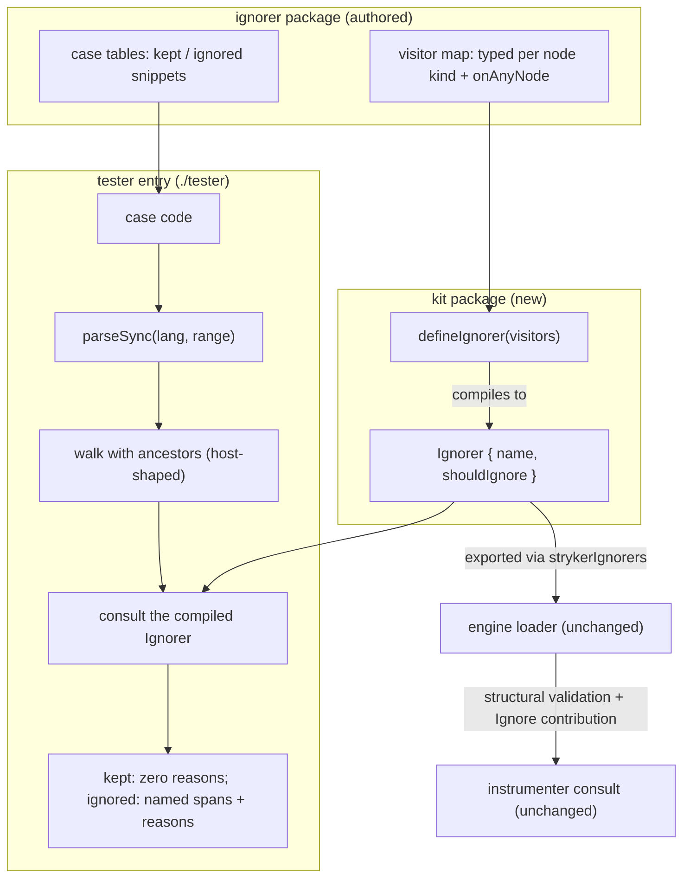

# feat: Ignorer authoring API and RuleTester kit

## Goal Capsule

- **Objective:** Ignorers are authored as typed visitors and tested from source snippets through a RuleTester-shaped harness — kept/ignored cases in, one aggregate report enumerating every failing case out — so an author who has never seen the engine internals can write and verify a new ignorer.
- **Means:** A new kit package in the ignorer family compiles visitor declarations down to the plain `Ignorer` wire contract the engine already validates, and ships a RuleTester-shaped harness that parses snippets with the instrumenter's own parser convention (KTD1, KTD2).
- **Authority:** User direction in session (2026-09-15) → package `AGENTS.md` → `CONSTITUTION.md`.
- **Stop conditions:** Both ignorer packages are authored through the kit, every existing case-table row passes with byte-identical reason strings, no hand-built AST fixture remains, `pnpm check:ci` green.
- **Execution profile:** One linear feature, kit-first then migrations, docs ride each unit; single PR scale.
- **Tail ownership:** This plan; worktree branches per repo convention.

---

## Product Contract

### Summary

The ignorer family gains the two layers it never had: an authoring API (`defineIgnorer` — a visitor map keyed by node type, compiled to the existing `Ignorer` object) and a testing harness (`IgnorerTester` — kept/ignored cases written as source snippets, parsed and walked for real, asserting ignored spans and reasons). The wire contract, the engine loader, and the instrumenter do not change; existing ignorers keep loading exactly as they do today.

### Problem Frame

The walker-contract refactor (PR #17) settled how a _host_ consumes ignorers: one pure `{ name, shouldIgnore(node, ancestors) }` seam, host-supplied walk, types-only interface package. It left how a _human_ writes and tests one where it was: authoring means hand-rolled `unknown`-narrowing guards over the oxc node union (~372 kinds, `@oxc-project/types@0.140.0` via the pnpm catalog; the effect-schema package carries 33 such guards in `packages/ignorers/effect-schema-declarations/src/SchemaDeclarationIgnore.ts`), and testing means hand-assembled AST fixture trees that bypass the parse→walk seam and mirror parser output by hand. oxlint and ESLint separate wire contract, authoring API (`create(context)` visitors), and RuleTester (per ESLint's custom-rule and working-with-rules docs); this repo built layer one only. Nothing architectural blocks closing the gap.

### Requirements

| ID | Rule                                                                                                                                                                                                                                                                                                                                                                                                                                                                                    | Gate                                                                                                                                                |
| -- | --------------------------------------------------------------------------------------------------------------------------------------------------------------------------------------------------------------------------------------------------------------------------------------------------------------------------------------------------------------------------------------------------------------------------------------------------------------------------------------- | --------------------------------------------------------------------------------------------------------------------------------------------------- |
| R1 | `defineIgnorer` compiles a visitor declaration into a plain `Ignorer`; the engine's structural load validation (name a string, `shouldIgnore` callable) accepts its output unchanged                                                                                                                                                                                                                                                                                                    | Engine loader integration suite (unchanged) + kit suite wire-shape scenario; typecheck                                                              |
| R2 | Visitors are keyed by node type; a typed visitor receives its node narrowed to that kind plus the ancestor chain nearest-first; an `onAnyNode` visitor is consulted for every node no typed visitor claimed                                                                                                                                                                                                                                                                             | Kit suite dispatch scenarios (U2)                                                                                                                   |
| R3 | The kit's root entry imports nothing that loads a parser — no `oxc-parser`/`oxc-walker` in its module graph; the interface package stays types-only                                                                                                                                                                                                                                                                                                                                     | Review reads the root entry's import graph; `pnpm --filter @systemfsoftware/stryker-ignorer-interface build` (empty runtime, unchanged); kit `attw` |
| R4 | A kept case parses its snippet with the instrumenter's parser convention (same `parseSync` shape, `lang`, `range`) and asserts no node in the parsed tree yields an ignore reason                                                                                                                                                                                                                                                                                                       | Kit suite kept scenarios + sabotage row (U3)                                                                                                        |
| R5 | An ignored case asserts each named expectation — ignored source text, optionally a reason — against a distinct ignored span (multiset containment), never the exhaustive ignored-node set; a failing run reports every failing case with snippet, expected, and received spans                                                                                                                                                                                                          | Kit suite ignored-case scenarios incl. failure-report rows (U3)                                                                                     |
| R6 | The tester's walk hands each node the ancestor chain excluding the node itself, matching host walk semantics; the entry takes the case set's name and refuses to run when it differs from the subject's registered name; a snippet that fails to parse surfaces with its case name and code                                                                                                                                                                                             | Kit suite ancestors pin, name-mismatch row, and parse-failure rows (U3)                                                                             |
| R7 | Both ignorer packages are authored through `defineIgnorer`, their suites rewritten as tester cases with every parseable row preserved and reason strings byte-identical, and the hand-built AST fixture files deleted; rows no snippet can produce (a parentless identifier, ancestor chains missing their intervening nodes — inputs a real walk never yields) retire with that justification recorded beside the table; each registered visitor kind is exercised by at least one row | Double-green pin runs (U4, U5); workspace symbol search finds no fixture import                                                                     |
| R8 | Manifests and package docs state the new dependency posture — interface plus kit, still zero Effect — api reports regenerated, one changeset per touched published package                                                                                                                                                                                                                                                                                                              | Review reads manifests/docs; `pnpm check:ci` (api:check, attw)                                                                                      |

### Key Decisions

- **Build the missing authoring and testing layer; the wire contract does not change** (session-settled: user-directed — chosen over the wire-contract-only status quo, rejected in three prior sessions). Governs R1, R2, R4, R5, R7
- **The kit publishes with no backwards-compatibility commitment while it has no adopters beyond this plan's own migrations** (user-directed in review, 2026-09-15 — chosen over freezing an adopter-less surface or keeping the kit workspace-private: breaking changes stay allowed at 0.x; the api reports gate drift for this repo's family, not consumer stability; the audience is ignorer authors, starting with this repo's family). Governs R8

### Success Criteria

- An ignorer author writes a new ignorer as a typed visitor map and tests it with code snippets; no hand-built AST node appears anywhere in the family's tests.
- A migrated ignorer's suite passes the same rows with the same reason strings before and after the source rewrite — the pin proves the rewrite behavior-preserving.

### Scope Boundaries

#### Deferred to Follow-Up Work

- Migrating the instrumenter's internal ignorers (angular signal-query, comment directives) to kit authoring — host-internal deciders, not plugin-family packages.
- An exhaustive-set assertion mode for ignored cases — containment is the default; add when a case genuinely needs totality.
- Per-case runner reporting (one runner-reported test per case) — the async `run` keeps a RuleTester-shaped surface now; the evolution path (exposing per-case outcomes as data for suites that want `it.each`) is named here so the API can grow it without a break.
- Publishing a shared walker runtime outside the interface package (interface is types-only; the tester-local walk remains the accepted duplication, KTD5).

#### Outside this product's identity

- Changes to the engine loader, the `strykerIgnorers` module key, the `Ignorer` wire type, or the instrumenter's walk.
- Runtime exports from the interface package; any Effect dependency in the ignorer family.

---

## Planning Contract

### Key Technical Decisions

- KTD1. **`defineIgnorer` compiles at author time to the plain `Ignorer` object** — visitors dispatch on the node's type field inside `shouldIgnore`; no host, loader, or instrumenter change exists to make. The compile is a lookup plus call, pure per node (CONST-P1). Rejected: teaching the engine to accept visitor maps natively — moves every host onto a new contract to fix an authoring problem.
- KTD2. **One kit package, two entries** — root entry exports `defineIgnorer` and types only (parser-free); a `./tester` subpath owns the `oxc-parser`/`oxc-walker` dependencies. Keeps ignorer runtime dependencies tiny and prevents parser construction in engine consumers (precedent: `IN5` in `packages/stryker-js-instrumenter/AGENTS.md` — lazy parser import, WASI-aliased in the CLI). The interface package is a declared runtime dependency of the kit so tsdown keeps its node types external in emitted declarations — inlining produced the cross-copy `d.ts` explosion fixed earlier in this repo. Rejected: two packages (doubles tooling boilerplate); one entry (couples authoring to the parser).
- KTD3. **Containment assertions, not exhaustive ignored-node sets** — a subtree-ignoring decider (the vitest-block ignorer ignores every node under a guard) makes the exhaustive set walker noise; asserting named spans with reasons keeps the oracle sharp where it matters. Multiset matching preserves multiplicity when a case means to. Committed stored-output snapshots stay banned (CONST-T11); expectations are hand-written oracles, not recorded output.
- KTD4. **Tests-first migration per package** — convert each suite to `IgnorerTester` while the current deciders still hold, run green (the pin), then re-author through `defineIgnorer` and run the same rows green again (CONST-T9: pin the published behavior before deleting a path).
- KTD5. **The tester hosts its own ancestor-tracking walk** over `oxc-walker`, shaped identically to the instrumenter's adapter (`packages/stryker-js-instrumenter/src/Ast.ts`, module-private walker) and typed by the interface `Walker` type. Rejected: exporting a runtime walker from the interface (types-only invariant); the instrumenter depending on the kit (wrong direction for a dev kit). Drift risk is named in the kit's package rules with a review gate.
- KTD6. **Ignored spans identified by source-text slice with optional reason; `lang` defaults to `ts` per tester, per-case override** — source text is what an author writes; failure reports carry node type for diagnosis and aggregate every failing case into one rejecting report (`node:assert`, runner-agnostic; `run` is async — see U3).

### Test Layer Ruling

Every test this plan proposes is a **composition/scenario test through a published programmatic surface**, per the choose-test-layer admission gate: in-process (`parseSync` is an in-process binding, not a spawn); imports nothing but the published surface under test (kit root, kit tester entry, each package's `strykerIgnorers`); asserts only externally observable outcomes (reasons returned, aggregate failure reports); no test-born exports. Example-based tests of isolated internals are absent by construction — dispatch and harness behavior is observed through `defineIgnorer` output and `IgnorerTester.run`, never through private helpers. Error paths are mandatory coverage (sabotage and failure-report rows in U3). Mutation stance per CONST-T3: the change-level observer is the double-green pin run (the same case tables kill the same decisions before and after rewrite); no new mutation gate is minted for these packages (none exists today; gate-minting is not this change's to do).

### High-Level Technical Design

### Destructive Review (Inversion lens)

Assumptions surfaced: **D1** the mapped visitor type over ~372 kinds typechecks acceptably; **D2** source-text slice is a stable identity for expected spans; **D3** the existing case tables fully capture both packages' published behavior. Lens: **Inversion** (first cycle on this artifact; chosen because the plan mirrors the oxlint shape faithfully and the compile direction deserved attack). Findings and adopted remediations:

| #  | Failure                                                                                                                                              | Class | Resolution                                                                                                           |
| -- | ---------------------------------------------------------------------------------------------------------------------------------------------------- | ----- | -------------------------------------------------------------------------------------------------------------------- |
| F1 | A visitor keyed on a wrong-but-valid node kind silently never fires — nothing typechecks or tests registered-key coverage                            | Clear | R7 gains the registered-kind-exercised requirement; U2/U4/U5 scenarios each name it                                  |
| F2 | A fresh decider with a broad `onAnyNode` can pass its own cases while excluding whole unrelated subtrees — over-ignoring inflates the score silently | Clear | Each migrated suite gains one broad kept snippet (realistic non-matching file) pinning that the decider stays narrow |
| F3 | Aggregate single-error reporting inverts RuleTester's per-case red — one vitest failure hides the rest in a text blob                                | Clear | Report enumerates every failing case (R5); per-case outcome exposure named as the API's evolution path in Deferred   |

Structural delta: Kept — wire compile (KTD1), two entries (KTD2), containment (KTD3), tests-first migration (KTD4), tester-local walk (KTD5). Added — registered-kind coverage requirement (R7), broad kept snippets (U4/U5). Replaced — aggregate-only reporting → enumerated-all-cases reports (R5). Removed — nothing; no prior artifact.

### Assumptions

- Package name `@systemfsoftware/stryker-ignorer-kit` at `packages/ignorers/kit/` (workspace glob `packages/ignorers/*` in `pnpm-workspace.yaml` admits it; turbo discovers by scripts).
- D1 (above) — verify at U2 typecheck; documented fallback: visitor parameter typed at the union with narrowing in the map's value type. The fallback loses nothing behavioral.
- Every public entry gets its own api-extractor config: the root entry's `api-extractor.json` plus `api-extractor.tester.json` for the `./tester` entry, with `api:check`/`api:update` chaining one `--config` run per entry — the engine's actual multi-entry precedent (`packages/stryker-js-engine/package.json` chains five configs via `concurrently`; `packages/stryker-js-engine/api-extractor.base.json` is the per-entry shape).
- Tests consume built dist (`turbo test` dependsOn `^build`, `turbo.json`).

### Risks & Dependencies

- **Visitor-map type weight** (TS2589 or slow dts emit) — mitigation: decide at U2 typecheck; fallback above is behavior-neutral.
- **Walker-semantics drift** between tester walk and instrumenter consult walk — mitigation: identical adapter shape, interface `Walker` typing both, kit package rule naming the invariant (review gate), U3 ancestors pin.
- **Snippet-fidelity risk in migration** — a converted case that does not reproduce the original fixture's AST shape tests something else; mitigation: convert row-by-row against the existing tables (they are the pin), keep names and reason strings byte-identical so drift fails loudly.

### Sources / Research

- ESLint rule-authoring and RuleTester model: eslint.org custom-rule tutorial and working-with-rules docs (visitor authoring; `run(name, rule, {valid, invalid})`) — the layering this plan mirrors.
- oxlint JS plugin surface carries no type information (project wiki, `oxlint-js-plugin-type-awareness`) — confirms visitors dispatch on syntax only; no type-awareness seam is owed.
- Snapshot testing canon (project wiki): stored-output assertions are the anti-pattern — grounding for containment with hand-written expectations (CONST-T11 alignment).
- Local precedent: `packages/stryker-js-instrumenter/src/Parser.ts` (parse convention), `src/Ast.ts` (walker adapter), `packages/stryker-js-engine/src/Plugins.schema.ts` (structural validation), `docs/plans/2026-09-14-2048-refactor-ignorer-walker-contract-plan.md` (types-only invariant, R-ID discipline).

---

## Implementation Units

### U1. Kit package scaffold

- **Goal:** `@systemfsoftware/stryker-ignorer-kit` exists as a building workspace package with two entries and full family tooling.
- **Requirements:** R3
- **Dependencies:** none
- **Files:** `packages/ignorers/kit/package.json`, `packages/ignorers/kit/tsconfig.json`, `packages/ignorers/kit/tsconfig.build.json`, `packages/ignorers/kit/tsconfig.node.json`, `packages/ignorers/kit/tsconfig.api-tester.json`, `packages/ignorers/kit/tsdown.config.ts`, `packages/ignorers/kit/vitest.config.ts`, `packages/ignorers/kit/oxlint.config.ts`, `packages/ignorers/kit/api-extractor.json`, `packages/ignorers/kit/api-extractor.tester.json`, `packages/ignorers/kit/.attw.json`, `packages/ignorers/kit/.gitignore`, `packages/ignorers/kit/LICENSE`, `packages/ignorers/kit/AGENTS.md`, `packages/ignorers/kit/README.md`, `packages/ignorers/kit/etc/stryker-ignorer-kit.api.md`, `packages/ignorers/kit/etc/stryker-ignorer-tester.api.md`, `.changeset/stryker-ignorer-kit-debut.md`
- **Approach:** Clone the tooling set from `packages/ignorers/in-source-vitest-block` (tsdown entries `index` → `src/mod.ts`, `tester` → `src/tester.ts`; exports map `.`, `./tester`, `./package.json`; api report `stryker-ignorer-kit.api.md`). Every public entry gets its own api-extractor config — `api-extractor.json` for the root and `api-extractor.tester.json` for `./tester` (report `stryker-ignorer-tester.api.md`, entry point `dist/tester.d.ts`, its own `tsconfig.api-tester.json`) — with `api:check`/`api:update` chaining one `--config` run per entry, exactly as `packages/stryker-js-engine/package.json` chains five. Dependencies: interface (`workspace:^`), `oxc-parser`/`oxc-walker` (`catalog:`) — parser pair serves the tester entry only, by entry isolation (KTD2). `pnpm install` links the package before anything builds against it. Kit AGENTS.md states the identity rules: zero Effect; root entry parser-free (review gate per R3); tester walk mirrors the instrumenter's ancestor semantics (KTD5, review gate); no backwards-compatibility commitment while adopter-less — breaking changes allowed at 0.x, api reports gate family drift, not consumer stability.
- **Test expectation:** none — scaffolding; proof is the build, api seed, and `attw`.
- **Verification:** Kit builds; `pnpm --filter @systemfsoftware/stryker-ignorer-kit build` green; package linked.

### U2. defineIgnorer authoring API

- **Goal:** An ignorer author declares typed visitors; `defineIgnorer` compiles them to the wire contract.
- **Requirements:** R1, R2, R3
- **Dependencies:** U1
- **Files:** `packages/ignorers/kit/src/mod.ts`, `packages/ignorers/kit/tests/define-ignorer.test.ts`, `packages/ignorers/kit/etc/stryker-ignorer-kit.api.md` (regenerate)
- **Approach:** The visitor map type maps every node kind to a visitor receiving that kind's narrowed node plus `ancestors`, with an `onAnyNode` fallback beside it; the compile dispatches on the node's type field and falls through to `onAnyNode` when the typed visitor is absent or declines (R2). One localized type assertion at the dispatch, commented with its soundness invariant. Reason strings are the visitor's return; absence is `undefined` — never a boolean.
- **Patterns to follow:** `packages/ignorers/interface/src/mod.ts` for the derived vocabulary; `packages/ignorers/in-source-vitest-block/src/InSourceTestIgnore.ts` for reason-constant discipline.
- **Test scenarios** (composition layer through the published root entry):
  - A typed visitor receives the node it was keyed for; its reason string is returned from the compiled `shouldIgnore`.
  - A typed visitor declining falls through to `onAnyNode`.
  - A node kind with no typed visitor is handed to `onAnyNode`.
  - A typed visitor claiming the node prevents `onAnyNode` from running for that node.
  - The compiled object satisfies the wire shape structurally — name string, callable `shouldIgnore` — asserted without importing the engine's Effect schema (kit is zero-Effect; engine-side acceptance stays with the existing loader suite and U4/U5's `strykerIgnorers` runs).
  - A typed visitor receives the ancestor chain excluding the node itself, nearest-first — the compiled `shouldIgnore` passes its ancestors argument through unmodified (R2's ancestor clause, proven here).
- **Verification:** Kit suite green; typecheck accepts the mapped type (D1's fallback decision happens here); api report regenerated; `attw` clean.

### U3. IgnorerTester harness

- **Goal:** RuleTester-shaped cases — snippets in, ignored spans asserted — run against any compiled ignorer.
- **Requirements:** R4, R5, R6
- **Dependencies:** U2
- **Files:** `packages/ignorers/kit/src/tester.ts`, `packages/ignorers/kit/tests/ignorer-tester.test.ts`
- **Approach:** The entry is `run(name, subject, cases)`: the case set's name is the first argument (the model ESLint's RuleTester uses), and the run refuses before any case executes when it differs from the subject's registered name (R6). `run` is async: the tester entry lazily dynamic-imports `oxc-parser` on first use, mirroring `loadOxc` in `packages/stryker-js-instrumenter/src/Oxc.ts` — a static import would construct parser machinery at module load — then parses each case with the instrumenter's `parseSync` convention (`lang`, `range`), walks with the host-shaped ancestor walk (enter receives the chain excluding the current node — R6), and consults the subject at every node. Ignored spans are the snippet text sliced at the parsed node's `start`/`end` offsets — guaranteed present by `range: true` — never the instrumenter's `spanOf` helper, which reads a `range` field parser output does not carry (this is D2's verification step: every span assertion exercises it). Kept cases assert zero reasons anywhere; ignored cases match expectations against distinct ignored spans with optional reason pins, multiset, containment only (KTD3). Failures aggregate into one rejecting report enumerating every failing case with snippet, expected, and received spans (text, node type, reason); parse failures surface with case name and code. Assertions use `node:assert` — runner-agnostic. `lang` defaults to `ts`, overridable per case.
- **Patterns to follow:** `packages/stryker-js-instrumenter/src/Oxc.ts` (`loadOxc`) for the lazy parser import; `packages/stryker-js-instrumenter/src/Parser.ts` (`parseWithOxc`) for the parse call; `packages/stryker-js-instrumenter/src/Ast.ts` walker adapter for the walk shape; interface `Walker` type typing the walk.
- **Test scenarios** (composition layer through the published tester entry):
  - A kept case passes when the subject ignores nothing in the snippet.
  - A kept case fails, listing received spans with reasons, when the subject ignores something (sabotage — the suite must be able to go red).
  - An ignored case passes with text-only expectations and with reason-pinned expectations.
  - An ignored case fails when an expected span is not ignored — the report shows expected versus received.
  - An ignored case fails when a span's reason differs from the pinned reason.
  - Repeated identical text expectations each consume a distinct span (multiset).
  - Ignored spans beyond the named expectations do not fail the case (containment, not totality).
  - A snippet that does not parse fails with case name and code (R6).
  - A per-case `lang` override parses the snippet as that language.
  - A subject whose registered name differs from the case set's name fails before any case runs.
  - A recording subject asserts, for one known snippet, that a nested node's ancestors exclude the node itself and run nearest-first (R6 pin).
- **Verification:** Kit suite green end to end with sabotage rows demonstrably able to fail.

### U4. Migrate in-source-vitest-block

- **Goal:** The vitest-block ignorer is authored as visitors and tested from snippets; its fixture file is gone.
- **Requirements:** R1, R2, R4–R7
- **Dependencies:** U3
- **Files:** `packages/ignorers/in-source-vitest-block/src/InSourceTestIgnore.ts`, `packages/ignorers/in-source-vitest-block/src/mod.ts`, `packages/ignorers/in-source-vitest-block/tests/in-source-vitest-block.test.ts`, `packages/ignorers/in-source-vitest-block/tests/__fixtures__/InSourceTestAst.fixtures.ts` (delete), `packages/ignorers/in-source-vitest-block/package.json`, `packages/ignorers/in-source-vitest-block/AGENTS.md`, `packages/ignorers/in-source-vitest-block/README.md`, `packages/ignorers/in-source-vitest-block/etc/stryker-ignorer-in-source-vitest-block.api.md` (regenerate), `.changeset/` (package entry)
- **Approach:**
  1. Convert the suite to `IgnorerTester` against the current deciders: every row of the existing table becomes a snippet case — bare `import.meta.vitest` guard, flag on either comparison side, guarded ancestor chain, the guard statement as node, and every kept row (different meta property, `require.meta`, `import.cache`, bare flag without `if`, plain comparison, no-guard ancestors, no ancestors, non-`IfStatement` parent) — names and reason strings byte-identical (KTD4 pin). Delete the fixtures file. Run green.
  2. Re-author through `defineIgnorer`: an `IfStatement` visitor answering for the guard node itself, `onAnyNode` answering for anything with a guard in its chain; ancestor-scan guard predicates remain, shape-narrowing scaffolding the typed visitors prove is deleted; each registered kind exercised by a row (R7).
  3. Manifest gains the kit as second runtime dependency; AGENTS.md's only-runtime-dependency rule and README wording update (R8); api report and changeset regenerate.
- **Execution note:** Characterization-first — the converted suite must pass against the old deciders before the source rewrite begins.
- **Patterns to follow:** U3's case-table shape; family AGENTS.md row style.
- **Test scenarios:** The converted table retained in full; one new broad kept snippet (F2 remediation): a realistic file with no vitest guard asserts nothing anywhere is ignored; the subtree row names several spans under one guard, exercising containment deliberately.
- **Verification:** Suite green twice (pin, post-rewrite); no fixture import remains (workspace search); `pnpm --filter @systemfsoftware/stryker-ignorer-in-source-vitest-block lint/typecheck/test` green; api report lists the kit-authored surface.

### U5. Migrate effect-schema-declarations

- **Goal:** The effect-schema ignorer is authored as typed visitors — the guard pile collapses — and tested from snippets; its fixture file is gone.
- **Requirements:** R1, R2, R4–R7
- **Dependencies:** U3
- **Files:** `packages/ignorers/effect-schema-declarations/src/SchemaDeclarationIgnore.ts`, `packages/ignorers/effect-schema-declarations/src/mod.ts`, `packages/ignorers/effect-schema-declarations/tests/effect-schema-declarations.test.ts`, `packages/ignorers/effect-schema-declarations/tests/__fixtures__/EffectSchemaAst.fixtures.ts` (delete), `packages/ignorers/effect-schema-declarations/package.json`, `packages/ignorers/effect-schema-declarations/AGENTS.md`, `packages/ignorers/effect-schema-declarations/README.md`, `packages/ignorers/effect-schema-declarations/etc/stryker-ignorer-effect-schema-declarations.api.md` (regenerate), `.changeset/` (package entry)
- **Approach:**
  1. Convert the suite to `IgnorerTester` against the current deciders, row by row — the existing table is the spec: `Symbol.for` description; kept `Symbol.keyFor`/`Object.for`/`Symbol.iterator` variants; non-literal argument at `Symbol.for`; `TaggedClass`/`TaggedError` tag and fields; kept `Struct` and swapped-argument rows; bare factory without the `Schema` namespace; `Class` factory id and fields; brand name; `optionalWith` arrow default versus kept literal default and kept plain `optional`; `Literal` argument rows; annotations object and documentation-value rows — every parseable row byte-identical (KTD4). Rows no snippet can produce — the parentless identifier, and ancestor chains missing their intervening nodes — retire with a justification note beside the converted table: a real walk never yields those inputs, so no snippet pins them (R7). Delete the fixtures file. Run green.
  2. Re-author through `defineIgnorer` keyed on the argument node kinds the rules target (string-literal, object-expression, arrow-function visitors checking the parent call's callee and argument position); the per-rule `is(node)` half and the shape-guard scaffolding those visitors prove is deleted; domain checks a type cannot express (documentation-key membership, computed flags, factory-name lists) remain; each registered kind exercised by a row (R7). `decideSchemaDeclarationIgnore` leaves the public surface with the api report updated — behavior is pinned by the converted table, and workspace search confirms no external importer.
  3. Manifest, AGENTS.md, README, api report, changeset as in U4 (R8).
- **Execution note:** Characterization-first, identical order to U4.
- **Patterns to follow:** U4's migration shape; the package's reason-constant exports.
- **Test scenarios:** The converted table retained in full; one broad kept snippet (F2 remediation): a mixed file with ordinary objects, calls, and no Schema factories asserts nothing is ignored; net-deletion expectation stated on the unit (guards shrink to domain checks).
- **Verification:** Suite green twice; fixture file and imports gone (workspace search); `pnpm --filter @systemfsoftware/stryker-ignorer-effect-schema-declarations lint/typecheck/test` green; api report reflects the visitor-authored surface.

### U6. Workspace verification and close-out

- **Goal:** The family change is whole: every gate green, every published package's docs and changesets true.
- **Requirements:** R7, R8
- **Dependencies:** U4, U5
- **Files:** none new — verification across `packages/ignorers/*` and `.changeset/`
- **Approach:** Run the workspace gates; symbol-death checks: no deleted fixture or guard symbol appears anywhere; api reports of the kit and both ignorers list the new surface and not the deleted one; three changesets exist (kit debut, one per migrated package). Commit per repo convention.
- **Test expectation:** none — verification unit; its proof is the gate run.
- **Verification:** `pnpm check:ci` green; `git status` clean after commit.

---

## Verification Contract

| Scope     | Command                                                                                                                                                                              | Proves                                                                                   |
| --------- | ------------------------------------------------------------------------------------------------------------------------------------------------------------------------------------ | ---------------------------------------------------------------------------------------- |
| Kit       | `pnpm --filter @systemfsoftware/stryker-ignorer-kit typecheck && pnpm --filter @systemfsoftware/stryker-ignorer-kit test && pnpm --filter @systemfsoftware/stryker-ignorer-kit lint` | D1 type assumption, dispatch semantics (R2), tester contract incl. sabotage rows (R4–R6) |
| Ignorers  | `pnpm --filter @systemfsoftware/stryker-ignorer-in-source-vitest-block test && pnpm --filter @systemfsoftware/stryker-ignorer-effect-schema-declarations test`                       | Byte-identical case tables through both migration halves (R7, KTD4 pin)                  |
| Ignorers  | `pnpm --filter @systemfsoftware/stryker-ignorer-in-source-vitest-block lint && pnpm --filter @systemfsoftware/stryker-ignorer-effect-schema-declarations lint`                       | Zero-Effect posture intact with the kit dependency (R8)                                  |
| Workspace | `pnpm check:ci`                                                                                                                                                                      | Format, lint, typecheck, tests, builds, api reports, attw (START-1..4)                   |

Engine-side acceptance is covered by the existing loader integration suite (unchanged seam) plus both ignorers loading through `strykerIgnorers` in their own suites.

## Definition of Done

- **Global:** `pnpm check:ci` green; working tree committed clean with conventional commits; every touched published package has its changeset and true AGENTS/README/api-report wording; no deleted symbol (fixtures, decider-shaped guards) remains anywhere in the workspace.
- **Per-unit:** each unit's Verification line holds before the next begins; U4 and U5 each show the pin-then-rewrite double-green run.
- **Cleanup:** abandoned scaffolding and throwaway probe scripts from implementation are removed, not left in the diff.
