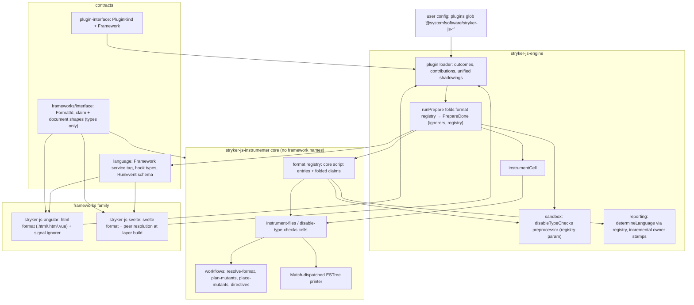
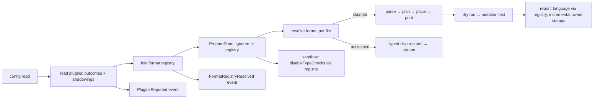
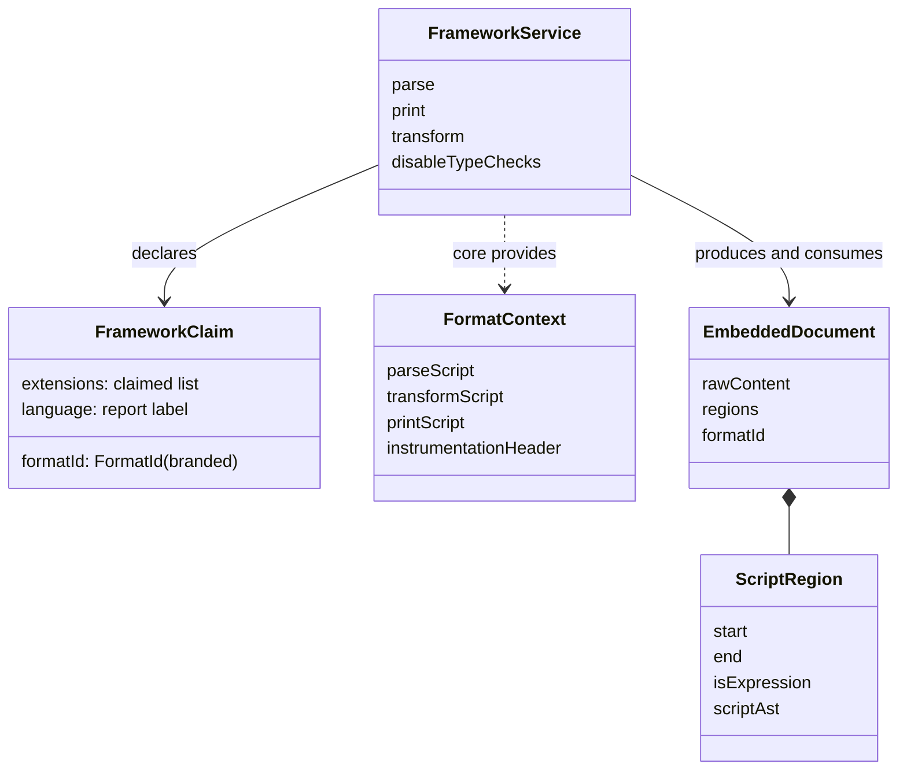
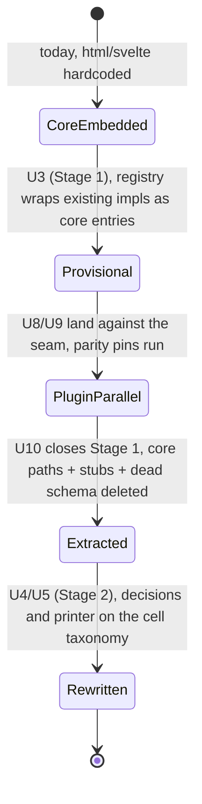

# Framework Plugins and the Cell-Taxonomy Instrumenter - Plan

## Goal Capsule

- **Objective:** TypeScript projects using Angular templates (including `.vue` SFCs) or Svelte components run mutation tests by installing the matching framework plugin package, with no engine configuration edits. The instrumenter core names no framework. Machine consumers observe plugin-load outcomes, the active format registry, and per-file skips on the NDJSON stream.
- **Means:** a new `Framework` plugin kind loaded through the existing engine plugin loader, a `packages/frameworks/{interface,angular,svelte}` family named to ride the default plugin glob, and a full cell-taxonomy rebuild of the instrumenter over an open runtime format registry (KTD1, KTD2, KTD4).
- **Authority:** `CONSTITUTION.md` > `STRATEGY.md` > root `AGENTS.md` + leaf `AGENTS.md` files > this plan. `.github/workflows/`, `commitlint.config.ts`, and `repos/**` are read-only surfaces; a gate that cannot go green without editing one stops the unit and is reported as an owner residual.
- **Stop conditions:** evidence that a settled decision (KD1-KD4, KTD1, KTD2) cannot work → stop and report, never resolve silently. A parity pin (KTD14) failing without a named root cause → stop before deleting any old path.
- **Execution profile:** code. Two shippable stages — Sequencing is canonical: Stage 1 lands the seam, the plugins, and observability as the breaking release; Stage 2 lands the deep instrumenter rewrite on the extracted, framework-free core. Units are atomic commits; each commit targets green `pnpm check:ci`.
- **Tail ownership:** publishing and npm OIDC trusted-publisher registration for debut package names are human-approval steps outside this plan (Assumptions).

---

## Product Contract

### Summary

Framework file-format support becomes a plugin contribution. Angular and Svelte move out of the instrumenter core into first-class plugin packages discovered by the default plugin glob, and the instrumenter is rebuilt on the repo's Cell/Workflow taxonomy with an open format registry, typed skip records, and machine-readable plugin/format reporting on the NDJSON stream. Breaking changes ship without compatibility shims.

### Problem Frame

The instrumenter hardcodes Angular and Svelte as closed cases threaded through six files: a closed `AstFormat` literal drives exhaustive dispatch in the parser, printer, transformer, and type-check disabler; an extension table maps `.vue` to the Angular HTML parser and `.svelte` to a Svelte 4/5 version-branched compiler path; the Angular signal ignorer sits in the transformer exported but wired nowhere; two vestigial stubs (`strykerPlugins = []`, `frameworkPluginsFileUrl`) have zero consumers. The plugin system cannot host any of this: `PluginKind` covers Checker, TestRunner, Reporter, Ignore, and Evaluator, and no kind can extend the file-format pipeline. The engine statically imports both `instrument` and `disableTypeChecks`, so framework knowledge leaks further: the report side keeps a second hardcoded extension table (`report-assembly.ts` mislabels `.svelte` as `javascript`), the engine schema directory carries a dead hand-authored JSON with karma/`angular-cli` definitions for a runner that does not exist, and dependency discovery probes the karma family.

The instrumenter is also the only core package outside the repo's cell taxonomy: its orchestration wraps throwing async code in `Effect.tryPromise`, its transformer mutates ASTs in place behind runtime deep-freeze guards, and its printer is a 99KB class dispatching through a giant `switch`. Upstream StrykerJS shares the hardcoded design and has no competing seam (its maintainers explicitly declined framework-specific mutation in stryker-js#3693), so this plan is first-mover on the format-plugin axis. STRATEGY.md names AI agents and CI primary consumers and gates every engine state change on NDJSON representation — yet plugin load outcomes, shadowing (computed twice, surfaced nowhere), and the active format set are invisible to the stream today.

### Requirements

**Framework plugins**

- R1. Framework plugin packages contribute file-format support through the existing engine plugin loader as a new `Framework` plugin kind whose contribution carries the format claim (branded format id, file extensions, report language label) and Effect-typed hooks for parse, print, transform, and disable-type-checks over a core-provided script toolkit context.
- R2. The Angular plugin claims `.html`, `.htm`, and `.vue` for an HTML-template format that instruments embedded script regions only — never template expressions — and bundles the Angular signal ignorer (input/model/output/query configuration objects) as an `Ignore` contribution from the same module; the bundled ignorer is auto-selected at prepare because its owning module also contributed a `Framework` claim (the bundled-ignorer rule), so an explicit `ignorers` entry stays an override, never a prerequisite (R4's install-is-the-only-setup-step holds for signal ignoring).
- R3. The Svelte plugin claims `.svelte`, owns the `svelte` optional peer dependency, resolves and version-checks the compiler when its plugin layer is built (one supported-range constant `>=3.30` shared by the migrated optional peer and the runtime guard, so a resolvable 3.x install reaches the typed `PeerVersionUnsupported` branch; `>=5` walks via `oxc-walker` — version constants source: `MINIMUM_SVELTE_VERSION`/`SVELTE_5` in `packages/stryker-js-instrumenter/src/Parser.ts`), and places the module-script instrumentation header when mutants were placed.
- R4. Installing a framework plugin package is the only setup step: the default `plugins` glob `@systemfsoftware/stryker-js-*` discovers it with no base-config or user-config edit; the shipped `config/base` preset's explicit plugin list suppresses glob discovery for projects that extend it, so U6 reconciles the preset to the glob plus the non-glob-matching family names.

**Instrumenter core**

- R5. The instrumenter core supports the script formats (js/ts/tsx) natively and consumes a runtime format registry for every other format; no framework name, framework extension, or framework dependency remains in core sources.
- R6. The instrumenter pipeline is rebuilt on the cell taxonomy: pure decision workflows (format resolution, directive decoding, mutant planning, mutant placement) inside cell sandwiches (instrument-files, disable-type-checks); the ESTree printer dispatches per node kind through exhaustive `Match` with an explicit tolerant branch for unknown kinds; the mutable mutant collector and the deep-freeze helpers are deleted.
- R7. A file whose extension no loaded format claims skips instrumentation with a typed per-file skip record that reaches the run stream, and the record's reason names the plugin package that would claim the extension so the skip reads as an install instruction; a file whose format is claimed but fails to parse still fails the run with a typed error.

**Machine-first observability**

- R8. The run stream reports, machine-readably: per-descriptor plugin load outcome (loaded/absent/failed/undescribed) with declared contributions (kind and name), name-level and extension-claim shadowings with winner and loser modules, and the resolved format registry (extension → format → owning module); the stream schema version is bumped and new members are pinned by literal-oracle conformance tests before they ship.
- R9. Plugin load failures carry typed reason variants that decide the exit class: absent named plugin, missing peer, unsupported peer version, and invalid contribution are ConfigError (exit 2); an import crash is InternalError (exit 4) — the deciding path is `StageError.exitClass` plus the CLI's `collectExitClasses`/`highestExitClass` cause traversal (`packages/stryker-js-engine/src/Run.schema.ts`, `packages/stryker-js-engine/src/Envelope.ts`), and U2 makes a load failure's own exit class survive the prepare-stage wrapper; the terminal `RunFailed` event carries the machine-readable reason discriminant.
- R10. Report per-file language labels derive from the resolved registry (a Svelte file reports `svelte`, fixing today's `javascript` mislabel); the report `framework` field keeps its mutation-testing-report spec semantics (the mutation framework, not user frameworks); the engine's toolchain dependency discovery drops the karma family and `@angular/cli`.
- R11. Incremental state records each file's format-owner identity (format id, owning module, owner version), invalidates remembered mutants when the owner or version changes, and never records skipped files as covered.

**Packaging and release**

- R12. New packages follow the family workspace conventions: a `packages/frameworks/*` workspace glob, the `@systemfsoftware/source` dev-condition wiring, the shared toolchain packages, api-extractor baselines from debut, and leaf `AGENTS.md` files; the types-only interface package is a runtime dependency of every package whose public surface references its vocabulary.
- R13. Framework code leaves the core through a strangler cutover: characterization pins pass against the plugin implementations before the old core paths, the dead engine schema JSON, and the vestigial stubs are deleted; breaking changes ship as major versions without compatibility shims; each affected published package's changeset prose and README name the removed built-in Angular/Svelte support and the replacement plugin package, so an upgrading adopter's first signal is actionable.

### Key Decisions

- KD1. Framework support ships as plugins, not core-embedded. User directive; research found no competing upstream design — upstream StrykerJS dispatch is hardcoded and stryker-js#3693 shows maintainers treated framework-specific mutation as out of core. Governs R1, R2, R3, R4, R5, R13.
- KD2. Breaking changes ship without back-compat shims. User directive; consistent with STRATEGY.md's "No Effect 3 backwards compatibility" boundary and the no-adopters posture the ignorer kit shipped under. Governs R7, R13.
- KD3. Vue SFCs keep riding the HTML-template format in the Angular plugin (session-settled: user-approved — chosen over dropping Vue support and over a framework-neutral html plugin separate from Angular: preserves current `.vue` behavior with one fewer package). Governs R2.
- KD4. No framework authoring kit ships in this plan (session-settled: user-approved — chosen over building a kit now: the interface package plus two first-party plugins are the contract test until a third-party author exists).

### Success Criteria

- A fixture project run with only the plugin package installed produces mutants from `.html`/`.vue`/`.svelte` files through default-glob discovery, proven by an engine-level integration smoke.
- A packed-tarball install check (human-run review oracle per the CONST-E9 precedent, not an automated test): `pnpm pack` both framework packages, install the tarballs into a scratch fixture project, run mutation — the npm-install journey the Objective promises, exercised without the out-of-scope publish step.
- Instrumenter core sources contain zero framework identifiers — `angular`, `svelte`, `vue`, or `html`-as-format — grep-verifiable at review.
- Every new pure decision workflow carries the repo's two property laws (TypeId brand law and the total law over generated commands).
- A machine consumer distinguishes plugin-loaded-and-formats-active from plugin-absent-and-files-skipped from plugin-broken-and-run-refused from the NDJSON stream alone.
- `pnpm check:ci` is green, and the migrated Angular and Svelte integration suites pass in their plugin packages with unchanged intent.

### Acceptance Examples

- AE1. Skip visibility
  - **Covers:** R4, R7, R8, R11
  - **Given** a project whose `mutate` glob matches `.svelte` files, and `@systemfsoftware/stryker-js-svelte` is not installed
  - **When** a machine-mode run executes
  - **Then** the run completes, the stream carries per-file skip records naming extension and reason, and the skipped files are absent from both the mutation results and the incremental state.
- AE2. Missing peer refuses at prepare
  - **Covers:** R3, R9
  - **Given** the Svelte plugin is installed but the `svelte` peer is absent
  - **When** prepare builds the plugin layer
  - **Then** the run fails before instrumentation with a ConfigError-class typed reason naming the missing peer (exit code 2).
- AE3. Vue script-only mutation
  - **Covers:** R2
  - **Given** the Angular plugin is installed and a `.vue` file contains `<script lang="ts">` plus `<template>` expressions
  - **When** the file is instrumented
  - **Then** mutants appear only inside script regions and none in template expressions, and the signal ignorer is active with no `ignorers` config entry.

### Scope Boundaries

Outside this product's identity:

- Frameworks beyond Angular and Svelte (React, Astro, Preact plugins).
- Template-expression mutation (`<template>` bindings, Angular structural directives) — script-only mutation stays, matching the upstream maintainer position.
- A karma runner revival; the dead karma schema entries are deleted, not implemented.
- TUI or interactive affordances for framework selection.
- General routing of all engine log warnings onto the stream — only the plugin/format diagnostics this plan creates move.
- Compile-checking of mutants inside framework files — embedded-script mutants stay strangers to the TypeScript checker's program (pre-existing behavior, pinned in U7); re-integrating them into the TS program is a separate concern.

#### Deferred to Follow-Up Work

- Framework authoring kit (KD4).
- A discovery subcommand listing active frameworks and formats outside a run — the stream events may suffice; revisit on consumer demand.
- JSON Schema publication of `RunEvent` for consumer codegen.
- Framework branding/dependencies metadata enrichment in reports beyond plugin name and version.
- Svelte 5 native-AST migration — the legacy AST plus `oxc-walker` path is preserved as today.
- Mutation enrollment of the new decision files — the test-layer doctrine requires a 100% killed-or-disposed mutation gate wherever enrollment exists, but building that gate on just-landed code is an owner decision (CONST-E9); this plan records the proposal, and the property + conformance suites are the interim gate.
- Framework-contributed mutators (e.g. Angular template mutators, the appetite upstream stryker-js#3693 shows) — the Framework hook set is closed for this plan (Assumption 1); widening the kind is a future typed addition.
- TypeScript-checker re-integration of framework-file mutants (the stranger path in `packages/stryker-js-typescript-checker/src/mutant-groups.ts` becomes a visible limitation once framework files are first-class instrumentation targets).

### Outstanding Questions

No blocking questions. Deferred:

- When a dedicated Vue plugin eventually claims `.vue`, extension-collision resolution (KTD6) makes the handoff deterministic — first-wins by module order with a shadowing event. No action in this plan.

---

## Planning Contract

### Key Technical Decisions

- KTD1. Full cell-taxonomy rebuild of the instrumenter, printer dispatch included (session-settled: user-approved — chosen over seam-only extraction and over a printer-exempt rebuild: the user's no-compromise state-of-the-art demand, and the instrumenter is the only core package outside the taxonomy). Decision code becomes `Workflow.make` files (complexity 1 by construction, Match-only); orchestration becomes `Cell.layer` sandwiches; the printer's `switch` dispatch becomes per-node-kind `Match` with today's tolerance for unknown kinds preserved as an explicit named branch. Scope note: the printer keeps its `PrintState` accumulation machinery — CONST-P2 binds decisions and workflows, the renderer is a pure computation, and `ban-classes` is already disabled package-local; the dispatch form aligns with the taxonomy. Governs R6.
- KTD2. Frameworks family topology and naming (session-settled: user-approved — chosen over flat standalone packages and over explicit base-config listing: zero-config discovery through the default `@systemfsoftware/stryker-js-*` glob). Directories `packages/frameworks/{interface,angular,svelte}` mirror the ignorers family; published names `@systemfsoftware/stryker-framework-interface` (types-only), `@systemfsoftware/stryker-js-angular`, `@systemfsoftware/stryker-js-svelte`; the Angular ignorer bundles in the Angular plugin via the dual `strykerPlugins` + `strykerIgnorers` export the loader already merges (proven by the `both-protocols` loader fixture). One-domain check (plugin axiom A13, software-wiki `entities/plugin-axiom-scope.md`): format support and the signal ignorer are one domain — Angular semantics — and the ignorer stays individually disable-able through the existing `ignorers` option, so the bundle keeps partial disablement. Governs R2, R4, R12.
- KTD3. Framework contract = Layer-kind contribution + types-only interface package + Effect-typed hooks + core-provided toolkit. The contribution is a bundle (ESLint's `Language` object and Prettier's languages/parsers/printers are the closest ecosystem precedents; Vite/jest-style loose hooks cannot express a parse→print round-trip). `FrameworkContext` — the authoring-facing name of the toolkit context — is declared in `frameworks/interface` and constructed by the instrumenter at hook invocation, so plugins type their hook argument against the interface package and never against the instrumenter. Layering rule, corrected against the manifests: `stryker-js-language` is NOT a zero-dependency root — it already depends on the vocabulary tier `@systemfsoftware/stryker-ignorer-interface`, and `IgnorerService` names its `Node` directly (source: `packages/stryker-js-language/package.json`, `packages/stryker-js-language/src/Ignorer.ts`). The `Framework` service follows that precedent: language types the hooks against the vocabulary tier it already imports plus its own structural context shape, and never imports `frameworks/interface`; extensions, the language label, and the document/region shapes reference the vocabulary's AST types. `PluginKind`/`PluginLayerKind`/`PluginInterfaces` gain `Framework`; hooks are Effect-typed because Layer-kind plugins already depend on effect and plugin-interface (CONST-B2). Dependency invariant: a framework plugin's manifest declares `{language, plugin-interface, frameworks/interface, its own framework runtime}` — NOT instrumenter or engine; the precedent: the typescript-checker's and vitest-runner's manifests; `FormatContext` arrives as a runtime parameter of hook invocation, and its structural type is satisfied by the instrumenter's concrete toolkit. Host-owned validation follows the plain-entry learning: the engine validates contributions with its own schema; plugin authors carry no validator. Governs R1.
- KTD4. Open runtime format registry with a branded `FormatId`. The closed `AstFormat` literal is deleted. Core script formats (js/ts/tsx) are built-in registry entries; `Framework` contributions fold in at engine prepare; the registry rides on `PrepareDone` because both `instrumentCell` and the sandbox's `disableTypeChecks` preprocessor consume it — the sandbox is built inside the instrument cell's read, AND the preprocessor runs unconditionally over every `disableTypeChecks`-matched file at sandbox build (default `true`; source: `packages/stryker-js-engine/src/Sandbox.ts`, `packages/stryker-js-language/src/Schema.schema.ts`), so attaching the registry later would starve it and unclaimed framework files must return unchanged (pinned in U3). The core AST union becomes script ASTs plus an open embedded-document shape keyed by `FormatId`; dispatch is registry lookup then a Match over {script, embedded, unclaimed}. Governs R5, R7.
- KTD5. Embedded-document representation = range-slice plus recursive re-parse. The plugin's parse produces located script regions (`start`, `end`, `isExpression`, inner script format) inside the raw document; the core re-parses each slice through `FormatContext` with offset remapping — the model upstream Stryker's svelte parser proves and today's `parseHtml`/`parseSvelte` already implement. Chosen over the Vue block-descriptor facade because inner scripts must mutate as ESTree and print back into exact original offsets. Governs R1, R2, R3.
- KTD6. Extension-claim collision resolves by a written, deterministic composition rule — registration order alone is not a contract (plugin axiom A4; source: software-wiki `pages/plugin-axiom-extension-points.md`). Determinism needs the discovery union site fixed, because today's order is NOT stable: `readOrgPackagesUpward` accumulates org-directory entries into a `HashSet` and returns `Array.from` of it (hash iteration order) over an unsorted `fs.readDirectory`, while the load passes themselves are order-preserving `Effect.forEach` — completion order is not a reordering mechanism (source: `packages/stryker-js-engine/src/Plugins.ts`). U2 therefore sorts the resolved descriptor list once, in byte order, after the multi-root union, and folds claims in that order. The first claim wins; every dropped claim is reported as an extension-level shadowing record (winner + loser modules) on the stream; the loser's other-kind contributions (its `Ignore` entries) still load. Shadowing computation unifies into the single pass in `buildPluginLoadPlan` (name-level and extension-level); the duplicate fold in `composePlugins` is a hard deletion — `ComposedPlugins.shadowings` is public surface, so its removal is a plugin-interface major (CONST-S4; U2's changeset). Chosen over a hard config error so glob-discovered duplicates degrade observably instead of breaking runs. Governs R8.
- KTD7. Peer/compiler resolution happens at plugin-layer build (prepare), never at parse time. The Framework layer resolves its dynamic compiler import and version guard when built; failures are typed load-reason variants: `PeerMissing`, `PeerVersionUnsupported`, `InvalidContribution` (ConfigError, exit 2 — the user fixes an install or a config), `ImportFailed` (InternalError, exit 4 — the module crashed). Today a missing `svelte` peer surfaces as an untyped parse-time "Failed to parse" InternalError; this replaces it. Governs R3, R9.
- KTD8. Stream observability via new `RunEvent` members, not reporter events. Engine state belongs to the run stream: a plugin-load report member (per-descriptor outcome + contributions + shadowings) and a format-registry member (extension → format → owner) emitted inside prepare after `loadPlugins` succeeds, plus a distinct post-instrument member carrying the per-file skip records the instrument pass produces (prepare cannot carry records it has not seen); `RunFailed` gains a `reason` literal discriminant; the CLI `wireKind` mapper (already `Match.exhaustive`) forces the additions at compile time; `STREAM_SCHEMA_VERSION` bumps. Chosen over `ReporterEvent` (reporter-scoped capability) and over verdict-envelope duplication (the stream is authoritative; the envelope does not re-encode). New members ship only after literal-oracle conformance pins exist (CONST-T9/T10). Governs R8, R9.
- KTD9. Skip semantics: only unclaimed extensions skip; a claimed-but-unparseable file is a hard typed failure — conflating them would silently swallow broken Svelte files. `InstrumentResult` gains typed skip records `{file, extension, reason}`; the engine surfaces them as stream events. The sandbox's `disableTypeChecks` preprocessor stops swallowing failures for registry-claimed formats: U6 re-signatures it to take the registry and propagates a claimed-but-unparseable file's typed parse failure into the run stream instead of the warning-and-unchanged catch (source: `packages/stryker-js-engine/src/Sandbox.ts`). The default `mutate` globs keep the upstream-compatible extension list (`html|vue|svelte`) per STRATEGY's track-upstream-where-practical boundary; the skip report is the observability carrier instead of narrowing the glob (which would be its own breaking behavior change). Skipped files never enter the incremental report's file map, so a later plugin install re-runs them fresh. Governs R7, R11.
- KTD10. Incremental staleness identity lives in the engine-owned incremental file schema: per-file `{formatId, ownerModule, ownerVersion}` stamps; rememberability invalidates on owner or version change. The public mutation-testing-report stays spec-clean — its `framework` field names the mutation framework (the frozen StrykerJS constant is correct per the external spec) and receives no plugin data; the analyzer suggestion to repurpose it is rejected on external-contract grounds. Governs R11.
- KTD11. Report-side cutover: `determineLanguage` consults the resolved registry via each claim's `language` label (fixes `.svelte` → `javascript`); the engine's `MANIFEST_SPECIFIERS` dependency probe drops the karma family and `@angular/cli` (tooling this repo does not ship; active-framework identity flows from the stream report instead). Governs R10.
- KTD12. Name-collision resolution: the engine's `plan-instrumentation.workflow.ts` keeps `InstrumentCommand`/`InstrumentError`/`planInstrumentation` (published, load-bearing); the instrumenter's step objects in `Instrument.schema.ts` (a different `InstrumentCommand`/`InstrumentDecoded`/`InstrumentDecision` triple) are replaced by the cell-taxonomy command/decision vocabulary named around files (instrument-files). Governs R6.
- KTD13. New-package quality surfaces: api-extractor baselines from day one for all three packages (a debut surface defines its own baseline — it grades no landed code, so CONST-E9 is not implicated; matches every existing plugin package). Full family wiring per the source-condition learning: tsdown `sourceExports`, tsconfig `customConditions`, vitest `sharedConfig`, api-extractor `tsconfig.api.json` reset, `publishConfig.exports` stripped of the dev condition, `types` conditions verified against emitted `dist` after a clean build (no `customExports` shims). The framework packages' vitest include globs target test files only — `.html`/`.svelte` fixtures stay inert data and no rule is ever selected by a fixture filename (CONST-T12). `frameworks/interface` lands in `dependencies` — never `devDependencies` — of every package whose public surface references its vocabulary (single-copy rule, TS2321); the same fix moves `@systemfsoftware/stryker-ignorer-interface` from the instrumenter's devDependencies to dependencies while `Ast.ts` re-exports its vocabulary. Governs R12.
- KTD14. Strangler cutover with T9 pins: the old html/svelte core paths stay live during Stage 1, wrapped as provisional core-owned registry entries; the plugin packages land against the seam; parity is proven by the migrated integration suites plus dev-time scratch comparisons — rebuilding the package between old and new arms (the dist-staleness learning) and never committing scratch evidence (CONST-T11); only then does the subtraction unit delete the core paths. The provisional window spans Stage 1 only: the deep rewrite (U4/U5) runs on the framework-free core after extraction, so no html/svelte splice behavior transits the printer restructure. Governs R13.
- KTD15. Deletions (CONST-S4): the dead engine `schema/stryker-schema.json` (zero references, unpublished), `frameworkPluginsFileUrl`, the empty instrumenter `strykerPlugins` stub, the deep-freeze helpers, the mutable `MutantCollector`, the Svelte-specific parser error variants (relocated to the Svelte plugin), and — after U8/U9 parity — all core html/svelte code. `.nuxt`/`.svelte-kit` stay in the engine's `ALWAYS_IGNORE`: directory hygiene that must not depend on plugin load order. S4 net-line story: the family debut and the registry add lines that REPLACE the six-file hardcoded dispatch and its vestiges — the diff trades core-owned framework code for plugin-owned framework code plus a data registry, and deletes more than the registry machinery adds. Governs R5, R13.
- KTD16. The Framework contribution carries a contract-version identity (a `contractVersion` on the claim record, sourced from `frameworks/interface`); the engine compares it against its supported range at load and a mismatch is a typed `InvalidContribution`-class ConfigError (exit 2), never a silent semantic drift. Shape validation alone cannot detect a shape-compatible v1/v2 plugin — the contribution layer payload is opaque (source: `packages/stryker-js-plugin-interface/src/Plugin.schema.ts`). This is the KTD7 failure class extended to the plugin↔engine axis. Scope review noted the marker has no current consumer (KD4: no third-party author yet); it is kept deliberately — R4's glob discovery makes the `Framework` kind a public extension surface on day one, and the marker is the only discriminant for shape-compatible semantic skew on that surface. Governs R8, R9.

### High-Level Technical Design

Component topology after the change:



Run-pipeline data flow with the skip path:



Framework contribution surface (directional shape, not signatures):



Strangler lifecycle across units:



### Output Structure

Scope declaration only — per-unit `**Files:**` remain authoritative. File granularity inside `directives/` and `mutators/` is an implementation choice within the CONST-N2 naming rules.

```text
packages/
  frameworks/
    interface/                  @systemfsoftware/stryker-framework-interface — types only, zero runtime deps
      src/mod.ts
      package.json  tsconfig.json  tsconfig.node.json  tsconfig.api.json
      tsdown.config.ts  vitest.config.ts  api-extractor.json  oxlint.config.ts  .attw.json
      etc/stryker-framework-interface.api.md
      AGENTS.md  README.md  LICENSE
    angular/                    @systemfsoftware/stryker-js-angular
      src/mod.ts                strykerPlugins (Framework 'angular') + strykerIgnorers (signal-io)
      src/html-format.ts        parse / print / transform / disable-type-checks for html templates
      src/signal-io-ignorer.ts  input/model/output/query configuration ignorer
      tests/                    migrated angular-ignorer suite + html-format integration
      (manifest/config family as interface)
    svelte/                     @systemfsoftware/stryker-js-svelte
      src/mod.ts                strykerPlugins (Framework 'svelte')
      src/svelte-format.ts      parse / print / transform / module-header / disable-type-checks
      src/compiler-resolution.ts  layer-build peer resolution + version branch
      tests/                    migrated svelte-parsing suite + version matrix
      (manifest/config family as interface)
  stryker-js-instrumenter/src/  post-rewrite layout
    index.ts
    instrument-files.cell.ts    disable-type-checks.cell.ts
    resolve-format.workflow.ts  plan-mutants.workflow.ts  place-mutants.workflow.ts
    format-registry.ts
    directives/grammar.ts       directives/rule-fold.ts
    mutators/                   catalog per mutator family (explicit registry preserved)
    print/                      Match-dispatched ESTree renderer
    script-parse.ts  script-transform.ts  script-print.ts  instrument-header.ts
    Ast.ts  Oxc.ts  Syntax.ts  Syntax.schema.ts  *.schema.ts
```

### Assumptions

- Structural assumptions this plan holds under (stress-tested under the Inversion lens — the re-staged Sequencing is the outcome; review record per the destructive-review protocol):
  1. The Framework hook set (parse/print/transform/disable-type-checks plus the claim record) is the complete extension surface format support needs — no framework-contributed mutator path is required this plan (upstream stryker-js#3693 shows the appetite; widening the kind is a future typed addition, deferred).
  2. First-wins extension collision is deterministic ONLY once the discovery union site is sorted: today's order is NOT stable (`readOrgPackagesUpward` unions org-directory entries into a `HashSet` and returns `Array.from` of it, over an unsorted `fs.readDirectory`; the load passes are order-preserving `Effect.forEach`, so completion order is not the scrambler — source: `packages/stryker-js-engine/src/Plugins.ts`), so U2 sorts the resolved descriptor list once after the multi-root union — verified by the shuffled-readdir repeated-run scenario asserted over two install roots.
  3. Threading the registry as plain data on `PrepareDone` serves every consumer once U6 re-signatures the sandbox preprocessor: the worker boundary is unaffected (today's worker RPC carries only `Mutant[]`/`DryRunOptions`; source: `packages/stryker-js-engine/src/WorkerProtocol.ts`), and the sandbox half IS affected because `makeDisableTypeChecksPreprocessor` currently captures a statically imported `disableTypeChecks` — U6's explicit registry parameter is exactly that change (U6 approach 1).
- npm OIDC trusted-publisher registration for the three debut package names is a human-approved prerequisite before first publish; changeset intents land in-plan, publishing is out of scope (source: `.changeset/README.md`).
- `angular-html-parser ~10.4.0` migrates as-is to the Angular plugin; the `svelte` optional peer migrates widened to `>=3.30` — one constant with the runtime guard, so the typed `PeerVersionUnsupported` branch is reachable by a resolvable install (today's `>=4.0.0` peer made it unreachable) — and the `5.55.1` dev pin migrates to the Svelte plugin; `oxc-walker` stays a core dependency — `Ast.ts`'s general walk still imports it after the Svelte parser leaves core (source: `packages/stryker-js-instrumenter/src/Ast.ts`) — and is added to the Svelte plugin for the v5 walk (source: `packages/stryker-js-instrumenter/package.json`; `pnpm-workspace.yaml` catalog).
- The new decision workflows are gated by property tests plus characterization/conformance suites; mutation enrollment of new files is an owner proposal, not a gate this plan builds (CONST-E9; the family plan leaves the starter package as the only mutation cell — source: `docs/plans/2026-09-13-0704-feat-home-stryker-js-family-plan.md`).
- Two version surfaces exist today (`packages/stryker-js-cli/src/StreamVersion.ts` at `1.0`; verdict-envelope pins reading `1.1` — source: `packages/stryker-js-cli/tests/verdict-envelope.integration.test.ts`); U6 reconciles which one the bump applies to as an execution-time detail.

### Sequencing

Two shippable stages; the stage order is canonical (Inversion-lens remediation — ship the user-facing extraction before the riskiest internal rewrite, and let two real plugins exercise `FormatContext` before the decomposition freezes it):

| Stage                                  | Units                                              | Shape                                                                                                                                                        |
| -------------------------------------- | -------------------------------------------------- | ------------------------------------------------------------------------------------------------------------------------------------------------------------ |
| Stage 1 — seam, plugins, observability | U1 → U2 → U3 → U6 → {U7, U8, U9 in parallel} → U10 | The breaking release: plugins discovered by glob, stream reporting load/registry/skips, core framework-free at U10                                           |
| Stage 2 — deep rewrite                 | U4 → U5                                            | Internal cell-taxonomy decomposition and printer restructure on the extracted core; behavior pinned by the Stage 1 suites; no second breaking surface change |

Dependency edges are minimal within the order: U7 may land any time after U6; U8/U9 need only U1+U3+U6. Document order below is by U-ID; this table is the execution order.

### System-Wide Impact

- **Stream wire compatibility:** new `RunEvent` members are a breaking change for agent decoders branching on the closed eight-kind union; `STREAM_SCHEMA_VERSION` is the only signal a consumer has (source: `packages/stryker-js-language/src/Run.schema.ts`, `packages/stryker-js-cli/src/StreamVersion.ts`). Mitigation: T9 conformance pins before ship and the version bump in the same change (KTD8, U6).
- **One meaning of "active framework":** loaded contributions, selected ignorers, and registry-claimed formats are three different sets. The resolved-registry event is the authoritative active surface — a plugin that loaded but lost its extension claim to shadowing, or whose ignorer was not selected, is not active (KTD6, U6).
- **First-event latency:** STRATEGY's headline metric is time-to-first-stream-event; the plugin-load and registry events are queued emissions inside prepare, never blocking pre-steps (U6).
- **TypeScript-checker boundary (pre-existing, preserved):** a mutant whose `fileName` is a framework file is a stranger to the TS program and is silently never compile-checked (`knownFileGroups` in `packages/stryker-js-typescript-checker/src/mutant-groups.ts`). This plan names and pins the behavior (U7) and defers re-integration; it becomes visible once framework files are first-class instrumentation targets.
- **Report consumers:** `FileResult.language` flows opaquely into mutation-testing-elements (`packages/stryker-js-html-reporter/src/Reporter.ts` stringifies the report without per-language validation); the new `svelte` label degrades gracefully — falsifiable labels, not crashes (R10 covers the fix).
- **Worker boundary is clean:** worker RPCs carry only `Mutant[]` and option/result payloads — no registry, claim, or format data crosses (`packages/stryker-js-engine/src/WorkerProtocol.ts`); framework hooks execute in the main process only.
- **Plugin↔engine version skew:** shape validation cannot detect semantic drift; the contract-version marker is the discriminant (KTD16).
- **Sandbox preprocessor:** `disableTypeChecks` runs unconditionally at sandbox build over matched files, which is why the registry must ride `PrepareDone` (KTD4); unclaimed framework files return unchanged (U3 pin).

### Risks & Dependencies

| Risk                                                                                                                                                                                                                                | Severity | Mitigation (owner)                                                                                                                    |
| ----------------------------------------------------------------------------------------------------------------------------------------------------------------------------------------------------------------------------------- | -------- | ------------------------------------------------------------------------------------------------------------------------------------- |
| Discovery order nondeterministic across OS/FS — extension-shadowing winner flips between runs (`HashSet` union in `readOrgPackagesUpward` over an unsorted `fs.readDirectory`; source: `packages/stryker-js-engine/src/Plugins.ts`) | High     | KTD6 union-site sort; U2 shuffled-readdir repeated-run scenario over two install roots                                                |
| NDJSON wire change breaks agent decoders                                                                                                                                                                                            | High     | `STREAM_SCHEMA_VERSION` bump + literal-oracle conformance pins before ship (KTD8, U6)                                                 |
| Printer restructure blast radius (99KB renderer, per-kind dispatch, tolerant fallback)                                                                                                                                              | Med-High | IN2 characterization gate; dev-time parity arms with rebuild between them (U5, Verification Contract)                                 |
| Framework-file mutants silently unchecked by the TypeScript checker                                                                                                                                                                 | Med-High | Named boundary + U7 pin; re-integration deferred (System-Wide Impact)                                                                 |
| Plugin↔engine contract skew undetectable by shape validation                                                                                                                                                                        | Med      | Contract-version marker + typed ConfigError (KTD16, U2 fixture)                                                                       |
| `ComposedPlugins.shadowings` removal is a breaking plugin-interface surface change                                                                                                                                                  | Med      | Classified as a plugin-interface major in U2's changeset (KTD6)                                                                       |
| Parity window grades stale `dist` (suites import built artifacts by published name)                                                                                                                                                 | Med      | Rebuild protocol (Verification Contract; source: `docs/solutions/build-errors/suite-imports-package-dist-rebuild-before-trusting.md`) |
| npm OIDC trusted-publisher registration gates debut publishing (human approval)                                                                                                                                                     | Med      | Assumptions; changeset intents land in-plan, publishing is out of scope                                                               |
| Svelte compiler churn (v5 dropped the `walk` export upstream — stryker-js#5154)                                                                                                                                                     | Low-Med  | The version branch lives in the Svelte plugin's compiler resolution; version-matrix tests (U9)                                        |
| Family debut adds net lines against CONST-S4                                                                                                                                                                                        | Low      | KTD15 states what the added lines replace                                                                                             |

Prerequisites: U1's contract types gate every other unit; OIDC registration gates first publish (human-approved); the `svelte` `5.55.1` dev pin gates U9's test matrix.

---

## Implementation Units

| U   | Stage | Title                                                | Key files                                                                                                                            | Depends        |
| --- | ----- | ---------------------------------------------------- | ------------------------------------------------------------------------------------------------------------------------------------ | -------------- |
| U1  | 1     | Framework contract types and plugin kind             | `packages/frameworks/interface/**`, language `Framework.ts`, plugin-interface `Plugin.schema.ts`                                     | —              |
| U2  | 1     | Loader outcomes, unified shadowing, failure taxonomy | engine `Plugins.ts`, `Plugins.schema.ts`, plugin-interface `Plugin.ts`                                                               | U1             |
| U3  | 1     | Open format registry and instrumenter cell skeleton  | instrumenter `format-registry.ts`, cells, `resolve-format.workflow.ts`, `Parser.ts`, `Instrument.ts`                                 | U1             |
| U6  | 1     | Engine wiring and stream observability               | engine `Run.ts`, `Sandbox.ts`; language `Run.schema.ts`; cli `Output.ts`, `StreamVersion.ts`                                         | U2, U3         |
| U8  | 1     | Angular plugin package                               | `packages/frameworks/angular/**`                                                                                                     | U1, U3, U6     |
| U9  | 1     | Svelte plugin package                                | `packages/frameworks/svelte/**`                                                                                                      | U1, U3, U6     |
| U7  | 1     | Report and incremental cutover                       | engine `report-assembly.ts`, `mutation-reporting.ts`, `Mutants.ts`, `IncrementalDiff.schema.ts`, delete `schema/stryker-schema.json` | U6             |
| U10 | 1     | Core subtraction and family docs                     | instrumenter core deletions, `AGENTS.md` files, READMEs, changesets                                                                  | U6, U7, U8, U9 |
| U4  | 2     | Mutant pipeline decision decomposition               | instrumenter `plan-mutants.workflow.ts`, `place-mutants.workflow.ts`, `directives/`, `Mutator.ts`, `Transformer.ts`                  | U3, U10        |
| U5  | 2     | Printer Match-dispatch restructure                   | instrumenter `print/**`                                                                                                              | U4             |

### U1. Framework contract types and plugin kind

- **Goal:** Define the Framework contribution end to end: types-only interface package, language service tag with hook types, plugin-interface kind extension, workspace wiring.
- **Requirements:** R1, R12 (instantiates KD1; per KTD2, KTD3, KTD13).
- **Dependencies:** none.
- **Files:** `pnpm-workspace.yaml` (add `packages/frameworks/*` glob); `packages/frameworks/interface/{package.json,src/mod.ts,tsconfig.json,tsconfig.node.json,tsconfig.api.json,tsdown.config.ts,vitest.config.ts,api-extractor.json,oxlint.config.ts,.attw.json,LICENSE,README.md,AGENTS.md,etc/}`; `packages/stryker-js-language/src/{Framework.ts,index.ts}`; `packages/stryker-js-plugin-interface/src/{Plugin.schema.ts,Plugin.ts,index.ts,etc/stryker-js-plugin-interface.api.md}`; `.changeset/` intent.
- **Approach:**
  1. Interface package mirrors `packages/ignorers/interface` (types only, zero Effect, SI-style leaf rules): branded `FormatId`, framework claim record (`formatId`, `extensions`, `language`), embedded-document and script-region shapes, plus the `FrameworkContext` type plugins import to type their hook argument (`parseScript`/`transformScript`/`printScript`/`instrumentationHeader`); the instrumenter constructs the value and passes it at hook invocation, so the type lives in the authoring-facing package while the dependency invariant holds. Re-export AST vocabulary from `@systemfsoftware/stryker-ignorer-interface` — never re-derive it (single-copy rule); that package is a runtime dependency here.
  2. Language `Framework.ts` declares the `Framework` context service and the service interface: Effect-typed `parse`, `print`, `transform`, `disableTypeChecks` hooks plus the claim record — typed against the vocabulary tier language already imports (the `Ignorer.ts` precedent) and structural over `FormatContext`; language never imports `frameworks/interface` (KTD3).
  3. Plugin-interface: add `'Framework'` to `PluginKind` and `PluginLayerKind`; `PluginInterfaces.Framework` maps to the language tag; extend the `declarePlugin` layer overload; refresh api-extractor baselines.
  4. Manifest family per KTD13 (sourceExports, customConditions, publishConfig strip, types-condition verified against dist).
- **Patterns to follow:** `packages/ignorers/interface` (manifest + types-only identity), `packages/stryker-js-language/src/Ignorer.ts` (service tag), `packages/stryker-js-plugin-interface/src/Plugin.schema.ts`.
- **Test scenarios:**
  - Schema-law test over the extended `PluginKind` literal (pattern: existing `schema-laws.test.ts` files).
  - Type-level: a `declarePlugin('Framework', name, Layer<Framework, never, PluginEnvironment>)` contribution is assignable; a Reporter-shaped payload for kind `Framework` is rejected at compile time.
  - Interface package builds with an empty runtime entry (types-only precedent holds).
- **Verification:** filtered build/typecheck/lint/api:check/attw green for the three touched packages; interface `dist` exports no runtime values; `packages/stryker-js-language/package.json` carries NO `@systemfsoftware/stryker-framework-interface` entry (layering assertion, KTD3).

### U2. Loader outcomes, unified shadowing, failure taxonomy

- **Goal:** `loadPlugins` returns per-descriptor outcomes and shadowings; one pass resolves name-level and extension-claim collisions; load failures carry typed reasons with corrected exit classes.
- **Requirements:** R8 (load-report data), R9 (instantiates KTD6, KTD7).
- **Dependencies:** U1.
- **Files:** `packages/stryker-js-engine/src/{Plugins.ts,Plugins.schema.ts,Run.schema.ts}`; `packages/stryker-js-plugin-interface/src/Plugin.ts` (delete the duplicate shadowing fold in `composePlugins` — removing `ComposedPlugins.shadowings` is a breaking public-surface change → plugin-interface MAJOR changeset; adjust `Run.ts` consumption); `packages/stryker-js-engine/tests/plain-ignorer-loader.integration.test.ts` + new `tests/__fixtures__/framework-*.fixture.mjs`; engine + plugin-interface `etc/` api baselines; `.changeset/` intents.
- **Approach:**
  1. `LoadedPlugins`/`PluginLoadPlan` gain `outcomes` (per descriptor: `loaded|absent|failed|undescribed` + contribution kind/name list) and keep `shadowings` with two variants: name-level (existing) and extension-claim (new; first-wins by `resolvePluginModules` order, loser's extension dropped, loser's other kinds unaffected).
  2. The extension fold reads Framework contributions' claim records during the same reduce that keys `${kind}:${name}` — one pass, both variants.
  3. `PluginLoadFailedError` splits into typed reasons per KTD7 with exit classes: `PeerMissing`/`PeerVersionUnsupported`/`InvalidContribution` → ConfigError; `ImportFailed` → InternalError. `PluginNotFoundError` stays ConfigError. `StageError.exitClass` falls through to the wrapped cause's exit class when the cause carries one, so `ImportFailed` reaches the process as exit 4 instead of collapsing to the prepare stage's ConfigError (source: `packages/stryker-js-engine/src/Run.schema.ts`). Engine-side validation of Framework contributions uses the engine's own schema (host-owned validation per the plain-entry learning).
  4. Delete `composePlugins`' second shadowing computation; `Run.ts` consumes the plan's single source; unified shadowing records carry stable contribution identifiers (kind + name + owning module) instead of raw array indices — the two folds indexed different arrays (descriptor positions vs contribution positions), so the engine's shadowing warning and the `Shadowing` api surface are updated in the same step.
  5. Determinism (KTD6): sort the resolved descriptor list once, in byte order, after `readOrgPackagesUpward`'s multi-root `HashSet` union, and feed `buildPluginLoadPlan` in that order; validate each Framework claim's `contractVersion` against the engine's supported range (KTD16).
- **Patterns to follow:** `plain-ignorer-loader.integration.test.ts` fixture protocol (`both-protocols.fixture.mjs` proves dual-export merging); the existing `buildPluginLoadPlan` reduce style.
- **Test scenarios:**
  - A fixture Framework module loads → outcome `loaded` with its contribution kind+name recorded.
  - Two differently-named fixtures claim `.html` → first module wins, an extension-shadowing record names winner and loser, and the loser's `Ignore` contribution still instantiates.
  - Malformed contribution (parse hook not callable) → `InvalidContribution`, ConfigError class, message names the module.
  - Module whose import throws → `ImportFailed`, InternalError class.
  - Absent named descriptor → outcome `absent` and `PluginNotFoundError` ConfigError (existing behavior preserved).
  - Dual-protocol module (`strykerPlugins` + `strykerIgnorers`) merges both contribution sets (regression pin on the existing fixture).
  - Two fixtures claim `.html` under a shuffled directory-read order across two install roots → the same winner across repeated runs (KTD6 determinism at the union site).
  - A claim record with an unsupported `contractVersion` → `InvalidContribution`-class ConfigError naming module and version (KTD16).
- **Verification:** loader integration suite green; engine + plugin-interface api baselines updated; filtered check green.

### U3. Open format registry and instrumenter cell skeleton

- **Goal:** Replace the closed `AstFormat` dispatch with the runtime registry; rebuild `instrument` and `disableTypeChecks` as cells; typed skip records for unclaimed files; instrumenter step-object renames.
- **Requirements:** R5, R7 (instantiates KTD4, KTD5, KTD9, KTD12; provisional entries per KTD14).
- **Dependencies:** U1.
- **Files:** `packages/stryker-js-instrumenter/src/{format-registry.ts,resolve-format.workflow.ts,instrument-files.cell.ts,disable-type-checks.cell.ts}` (new); `Instrument.ts` (public API becomes thin cell-run surface), `Instrument.schema.ts` (renamed command/decision vocabulary + `skipped` records), `Parser.ts` (dispatch → registry lookup; existing `parseHtml`/`parseSvelte` wrapped as provisional core entries), `Printer.ts`, `Syntax.ts`, `Syntax.schema.ts` (`AstFormat` literal deleted; script formats closed, embedded-document shape open), `index.ts`; instrumenter `etc/` baseline; tests: `resolve-format.workflow.property.test.ts` (new), existing integration suites.
- **Approach:**
  1. Registry data type: core script entries (js/ts/tsx) built in; framework entries folded from `Framework` service values; lookup by extension; `FormatId` branded (CONST-D3).
  2. `resolve-format` workflow decides per file: assign (script or embedded) vs skip (unclaimed extension) — pure Match, both channels inhabited, total-law property test.
  3. `instrument-files` cell: read = parse through registry entries (shell; oxc stays lazy per IN5), decode/decide = admit + resolve + plan workflows, write = print; `disable-type-checks` cell mirrors it; `InstrumentResult` gains `skipped: {file, extension, reason}[]`.
  4. Rename the instrumenter's `InstrumentCommand`/`InstrumentDecoded`/`InstrumentDecision` vocabulary out of the engine's collision zone (KTD12).
  5. Provisional state: current html/svelte implementations register as core-owned entries so every commit stays behavior-complete until U8/U9/U10 (KTD14).
- **Execution note:** Characterization first — the existing instrumenter integration suites must pass unchanged in intent against registry dispatch before any new workflow lands; rebuild the package before trusting a green suite (dist-staleness learning).
- **Patterns to follow:** engine `Run.ts` cells; `tests/__fixtures__/admit-order.workflow.ts` (canonical minimal workflow); `src/__tests__/*.workflow.property.test.ts` in the engine (brand law + total law shapes).
- **Test scenarios:**
  - Property (brand law): every `resolve-format` decision variant carries the shared TypeId symbol.
  - Property (total law): for generated (extension, registry) inputs, the decision is assign exactly when the extension is claimed and skip otherwise — never both, never neither.
  - A `.svelte` file with a registered svelte entry instruments identically to the pre-rewrite characterization output.
  - An unclaimed `.svelte` file → skip record present, file absent from results, run completes.
  - A claimed but unparseable file → typed parse failure surfaces as a run failure, not a skip (KTD9 boundary).
  - `disableTypeChecks`: a registry-owned html file gets `@ts-nocheck` spliced into each script region; an unclaimed file returns unchanged.
- **Verification:** instrumenter suite green after rebuild; typecheck/lint/api:check green; zero behavior change for js/ts/tsx files.

### U4. Mutant pipeline decision decomposition

- **Goal:** Directive grammar, rule fold, mutator application, and placer selection become pure workflows; the mutable collector becomes fold state; deep-freeze helpers are deleted.
- **Requirements:** R6 (instantiates KTD1, KTD15).
- **Dependencies:** U3, U10 (Stage 2 — runs on the framework-free core after extraction).
- **Files:** `packages/stryker-js-instrumenter/src/{plan-mutants.workflow.ts,place-mutants.workflow.ts}` (new), `directives/{grammar.ts,rule-fold.ts}` (new), `Mutator.ts` (catalog reorganized; explicit registry preserved), `Transformer.ts` (shrinks to script-transform orchestration consuming decisions), `instrument-header.ts` (header source as cached parsed constant, clone-before-insert), `Instrument.schema.ts` decision variants; property tests beside each workflow; `tests/` migrated coverage.
- **Approach:**
  1. `directives/grammar.ts`: comment text → directive or typed malformed variant — pure decode, no `getOrThrowWith` (CONST-B5/D2).
  2. `directives/rule-fold.ts`: (rule, directive) fold preserving today's disable/restore precedence semantics exactly.
  3. `plan-mutants` workflow: AST + rules + selected ignorers + excluded mutators → mutant plan (mutants with locations and ignore reasons) as a decision; mutator catalog functions stay pure `(node, context) → Iterable<Node>`; application becomes a fold — the mutable `MutantCollector` array is deleted; mutant ids come from fold state, branded (CONST-D3).
  4. `place-mutants` workflow: plan → edit sites per placer via Match; `canPlace` becomes a predicate inside the dispatch; placement impossibility is a typed decision variant, never a `throw` (replaces `throwPlacementError`/`nodeOfKind` throws).
  5. Deep-freeze helpers deleted once in-place mutation is gone (S4); the header AST stays a cached constant cloned before insertion.
- **Execution note:** Prove behavior preservation with dev-time scratch comparisons on the existing corpus (rebuild between arms; scratch never committed — CONST-T11).
- **Patterns to follow:** engine workflow files (Match-only bodies, tagged variants with TypeId brands); the ignorer kit's typed-visitor style for node classification helpers.
- **Test scenarios:**
  - Property: grammar decode is total over generated comment shapes — directive or malformed variant, never a throw.
  - Property: rule-fold precedence laws — a later `disable` overrides an earlier `restore` at the same scope semantics used today (pins existing behavior).
  - Property (brand + total laws) on `plan-mutants` and `place-mutants` commands.
  - Expression, statement, and switch-case placers each place or refuse with the typed reason on representative nodes (migrate existing placer coverage).
  - Directive with an unknown mutator name still yields the existing unused-directive warning text.
- **Verification:** instrumenter suite green; decision files contain no `throw`, `if`, `switch`, or loops (grep-verifiable at review); property suites carry the laws.

### U5. Printer Match-dispatch restructure

- **Goal:** `print/index.ts` dispatch becomes per-node-kind `Match` with an explicit tolerant unknown-kind branch; `PrintState` accumulation machinery stays; the restructure is characterization-gated (IN2).
- **Requirements:** R6 (instantiates KTD1 scope note).
- **Dependencies:** U4 (transitively U3 and U10).
- **Files:** `packages/stryker-js-instrumenter/src/print/**`; characterization coverage in `tests/`.
- **Approach:**
  1. Replace the giant `switch (kind)` with `Match` dispatch over the node-type union the printer handles; precedence tables stay data.
  2. Preserve today's tolerance as a named branch: unknown kinds route through the existing unclassified-node logic as an explicit decision — `Match.exhaustive` over a closed union would turn tolerance into a compile error, so the union stays open at the fallback edge.
  3. Comment and hashbang attachment behavior unchanged.
- **Execution note:** Expand characterization coverage over the representative corpus (all placer and header paths) BEFORE the dispatch rewrite; old-vs-new output parity runs are dev-time scratch with a rebuild between arms.
- **Patterns to follow:** `Match.discriminator` on node type tags; the existing printer's internal helper organization.
- **Test scenarios:**
  - Committed characterization assertions: js/ts/tsx corpus prints to intended outputs against inline oracles (existing suites carry most; add coverage for any node kind touched only by the switch default today).
  - An unknown/exotic node kind routes through the tolerant branch with output identical to today's.
  - Comment attachment (leading/trailing, hashbang) cases preserved.
  - Framework formats are out of scope here: html/svelte were extracted in Stage 1, so the printer restructure covers script formats only — no provisional splice behavior transits this unit.
- **Verification:** instrumenter suite green after rebuild; parity evidence summarized in the PR description, not committed.

### U6. Engine wiring and stream observability

- **Goal:** Framework contributions fold into the registry at prepare; the registry threads to the instrument cell and the sandbox; the stream carries plugin-load, registry, and skip events; `RunFailed` gains the reason discriminant.
- **Requirements:** R4 (end-to-end discovery), R8, R9 (instantiates KTD4 threading, KTD8).
- **Dependencies:** U2, U3.
- **Files:** `packages/stryker-js-engine/src/{Run.ts,Sandbox.ts,config/base.ts}`; `packages/stryker-js-language/src/Run.schema.ts` (new event members + schema version); `packages/stryker-js-cli/src/{Output.ts,StreamVersion.ts}`; new `packages/stryker-js-cli/tests/stream-conformance.integration.test.ts`; engine prepare tests; `.changeset/` intents.
- **Approach:**
  1. `runPrepare` folds loaded Framework contributions over core defaults into the registry; `PrepareDone` gains `formatRegistry` beside `ignorers` (existing threading pattern); `makeSandbox`/`makeDisableTypeChecksPreprocessor` take the registry explicitly, and for registry-claimed formats the preprocessor propagates a claimed-but-unparseable file's typed parse failure into the run stream instead of the `preprocessorErrors` swallow (KTD9); `runPrepare` also auto-selects every `Ignore` contribution whose owning module contributed a `Framework` claim (bundled-ignorer rule, R2) beside the explicit `ignorers` list; the shipped `config/base` preset's `plugins` list becomes the default glob plus the non-glob-matching family names (`stryker-ignorer-effect-schema-declarations`, `stryker-test-contribution`) so the recommended starting config keeps discovery (R4).
  2. New `RunEvent` members: plugin-load report (per-descriptor outcomes, contributions, shadowings) and resolved format registry (extension → format → owner), emitted inside prepare after `loadPlugins` succeeds; a distinct post-instrument member carries the per-file skip records (file, extension, reason) when the instrument pass produces them; on load failure emit `PhaseEntered('prepare')` then `RunFailed` with the reason discriminant (fixes today's silent no-phase failure path).
  3. `Output.ts` `wireKind` Match gains the new members (compiler-forced); `STREAM_SCHEMA_VERSION` bumps; reconcile with the envelope version surface (Assumptions).
  4. Events must not gate the first-stream-event latency metric: they are emitted as queued events, never as a blocking pre-step.
  5. All stream/conformance tests run in-process through the published engine and cli surfaces — the test-layer admission gate forbids process spawns in tests, and the family plan's process-spawning CLI contract lane was refused on exactly that ground (source: `docs/plans/2026-09-13-0704-feat-home-stryker-js-family-plan.md` KTD5).
- **Patterns to follow:** `verdict-envelope.integration.test.ts` (literal-oracle conformance shape); `Run.ts` ignorer threading; existing `PhaseEntered` emission sites.
- **Test scenarios:**
  - Conformance (literal oracles): a machine-mode run with a fixture framework plugin emits the plugin-load event with per-descriptor outcomes and the registry event with extension→format→owner rows — wire lines pinned as fixed literals (T10).
  - An absent glob-matched plugin → outcome `absent` in the report, run proceeds.
  - A broken plugin → `RunFailed` with reason `ImportFailed` and the CLI-derived process exit class InternalError (4); a missing peer → reason `PeerMissing`, exit class ConfigError (2) — asserted on the exit class, not only the event's reason (fixture plugin layer).
  - Skip records from U3 surface in the stream with file, extension, reason (AE1).
  - Human mode: new event kinds are not framed on stdout (existing framing behavior).
  - Stream header carries the bumped schema version; a decoder branching on the version distinguishes old from new members.
- **Verification:** cli + engine suites green; conformance pins pass against literal expectations; first-event ordering traced in the prepare-failure path.

### U7. Report and incremental cutover

- **Goal:** Report language labels derive from the registry; dependency discovery drops dead tooling; incremental state carries format-owner identity; the dead schema JSON is deleted.
- **Requirements:** R10, R11 (instantiates KTD9 incremental clause, KTD10, KTD11).
- **Dependencies:** U6.
- **Files:** `packages/stryker-js-engine/src/{report-assembly.ts,mutation-reporting.ts,Mutants.ts,IncrementalDiff.schema.ts,IncrementalReport.schema.ts}`; delete `packages/stryker-js-engine/schema/stryker-schema.json`; engine tests; `.changeset/` intent.
- **Approach:**
  1. `determineLanguage` consults the registry's claimed `language` labels; core script formats keep their current labels.
  2. `STRYKER_FRAMEWORK` constant stays (external report-spec semantics — KTD10); `MANIFEST_SPECIFIERS` drops the karma family and `@angular/cli`.
  3. Incremental file schema gains per-file `{formatId, ownerModule, ownerVersion}`; rememberability invalidates on mismatch; skipped files never enter the incremental file map.
  4. Delete the dead schema JSON (verified zero references, unpublished).
- **Patterns to follow:** `IncrementalDiff.schema.ts` existing stamp style; `Mutants.ts` rememberability checks.
- **Test scenarios:**
  - A `.svelte` file instrumented via a fixture plugin reports language `svelte` (mislabel fix).
  - Owner version change between runs invalidates remembered mutants for that file (recomputed, not reused).
  - Skipped files absent from incremental state; a later run with the plugin installed instruments them fresh (AE1).
  - Dependency discovery no longer probes karma/`@angular/cli`; report `framework` field unchanged (spec constant).
  - Workspace builds with `schema/stryker-schema.json` deleted (dead-file proof).
  - Checker-boundary pin: a fixture `.svelte`-file mutant is reported without compile checking (the checker's stranger pass-through — current behavior recorded, not regressed; System-Wide Impact).
- **Verification:** engine suite green; a sample run's report diff shows only the intended language-label changes.

### U8. Angular plugin package

- **Goal:** Debut `@systemfsoftware/stryker-js-angular`: HTML-template format support claiming `.html`/`.htm`/`.vue` plus the bundled signal ignorer, at parity with the provisional core entry.
- **Requirements:** R2, R4 (instantiates KD3, KTD2, KTD5, KTD7).
- **Dependencies:** U1, U3, U6.
- **Files:** `packages/frameworks/angular/**` (manifest family per KTD13; `src/mod.ts` exporting `strykerPlugins` with the Framework layer and `strykerIgnorers` with the signal-io entry; `src/html-format.ts`; `src/signal-io-ignorer.ts`; `tests/` with the migrated angular-ignorer suite and new html-format integration tests); `packages/stryker-js-instrumenter/package.json` (drop `angular-html-parser` at U10 — dependency moves here now, core deletion later); `.changeset/` debut intent (minor, following the ignorer-interface debut precedent).
- **Approach:**
  1. Move `parseHtml`, `htmlPrint`, `transformHtml`, `disableTypeCheckingInHtml` behavior into the plugin's format hooks; the layer resolves `angular-html-parser` dynamically at layer build (KTD7); inner scripts re-parse through `FormatContext` (range-slice model preserved exactly).
  2. Move `angularIgnorer` into `signal-io-ignorer.ts` as a plain `{name, shouldIgnore}` entry — auto-registered by the existing loader path; reason strings byte-identical.
  3. Claim record: format id `html`, extensions `.html`/`.htm`/`.vue`, language `html`; script-only mutation preserved (AE3).
  4. Manifest declares dependencies `{language, plugin-interface, frameworks/interface, angular-html-parser}` — no instrumenter, no engine (KTD3 invariant).
- **Execution note:** Before the core entry is removed (U10), the migrated suites here ARE the parity pins — they must pass against the plugin while the provisional core entry still passes the originals (KTD14).
- **Patterns to follow:** `packages/stryker-test-contribution/src/mod.ts` (entry shape), `packages/stryker-js-typescript-checker` (layer + declaration), ignorers implementation packages (plain-entry export).
- **Test scenarios:**
  - Migrated signal-ignorer scenarios pass verbatim: signal config objects ignored with exact reason strings; a plain object keeps its mutants.
  - A `.vue` SFC with `<script lang="ts">` and `<template>` expressions → mutants only in script regions (AE3).
  - An `.html` file with multiple scripts → every script instrumented, offsets remapped to the original document.
  - `disableTypeChecks` splices `@ts-nocheck` into each script region of an html document.
  - Layer build with `angular-html-parser` unresolvable → typed load failure (ConfigError class).
  - Engine-level discovery smoke: an in-process fixture project (no process spawn — test-layer admission gate) on bare schema defaults — no preset — with the plugin loaded through the default glob instruments an html file end to end (Success Criteria pin); a second smoke starts from the shipped `config/base` preset and asserts the framework package is still discovered.
- **Verification:** plugin suite green; discovery smoke passes; api baseline created; attw clean.

### U9. Svelte plugin package

- **Goal:** Debut `@systemfsoftware/stryker-js-svelte`: svelte format support owning the `svelte` optional peer and the version branch, at parity with the provisional core entry.
- **Requirements:** R3, R4 (instantiates KTD2, KTD5, KTD7).
- **Dependencies:** U1, U3, U6.
- **Files:** `packages/frameworks/svelte/**` (manifest family with `svelte` optional peer + `5.55.1` dev pin + `oxc-walker` dependency; `src/mod.ts`; `src/svelte-format.ts`; `src/compiler-resolution.ts`; `tests/` with the migrated svelte-parsing suite and a version-matrix test); svelte error variants relocated from `packages/stryker-js-instrumenter/src/Parser.schema.ts` (deleted from core at U10); `.changeset/` debut intent.
- **Approach:**
  1. Move `parseSvelte`, `sveltePrint`, `transformSvelte`, `placeModuleHeader*`, `disableTypeCheckingInSvelte` behavior into format hooks; expression-flagged script regions preserved.
  2. `compiler-resolution.ts` runs at layer build: dynamic `svelte/compiler` import, `VERSION` guard `>=3.30`, `>=5` walks via `oxc-walker` (keep the current repo approach; upstream's estree-walker fix is evidence the branch is load-bearing, not a reason to switch walkers); failures are the typed `PeerMissing`/`PeerVersionUnsupported` reasons (AE2).
  3. Claim record: format id `svelte`, extension `.svelte`, language `svelte`.
  4. Manifest declares dependencies `{language, plugin-interface, frameworks/interface, oxc-walker}` plus the `svelte` optional peer at `>=3.30` — the same constant as the runtime guard (R3) — no instrumenter, no engine (KTD3 invariant).
- **Execution note:** Migrate `svelte-parsing.integration.test.ts` intent-verbatim, including its comment on why the compiler must resolve from the install, not a bundled copy.
- **Patterns to follow:** U8's package shape; the existing `loadWalker` version-branch logic (relocated, not rewritten).
- **Test scenarios:**
  - Migrated suite: a Svelte component with a comparison yields script-block mutants with the compiler resolved from the install.
  - Module-script header injected only when mutants were placed in the component.
  - Expression regions (`isExpression`) print with the existing slice-trim behavior pinned.
  - Peer absent → prepare fails ConfigError `PeerMissing` naming `svelte` (AE2); version `<3.30` → `PeerVersionUnsupported`.
  - `disableTypeChecks` splices sorted script regions of a svelte document.
  - Engine-level discovery smoke: an in-process fixture project (no process spawn) with the plugin instruments a `.svelte` file end to end.
- **Verification:** plugin suite green against the `5.55.1` dev pin; discovery smoke passes; api baseline created; attw clean.

### U10. Core subtraction and family docs

- **Goal:** Delete the provisional core entries and every framework vestige; finalize public surfaces; ship the breaking family release with docs and changesets.
- **Requirements:** R5, R12, R13 (instantiates KD2, KTD13 dep placement, KTD15).
- **Dependencies:** U6, U7, U8, U9 (parity proven; closes Stage 1).
- **Files:** `packages/stryker-js-instrumenter/src/**` (delete provisional html/svelte entries, svelte `Parser.schema.ts` variants, `angularIgnorer`, `frameworkPluginsFileUrl`, empty `strykerPlugins` stub; move `@systemfsoftware/stryker-ignorer-interface` devDependencies→dependencies; drop `angular-html-parser` dep and `svelte` peer/devDep; refresh `index.ts` + `etc/` baseline); `packages/stryker-js-instrumenter/AGENTS.md` (identity: script formats + registry; IN1 note that the registry option is data, not a Babel-style transform-plugin chain; IN5 stays); `packages/stryker-js-instrumenter/README.md`; new-package READMEs; root `README.md` framework-plugin section; `.changeset/` majors for instrumenter/engine/language/plugin-interface/cli + debut intents reconciled.
- **Approach:**
  1. Grep gates as the deletion oracle — review-time oracles run by the reviewer/executor, NOT new CI gates (CONST-E9): zero case-insensitive matches for `angular`, `svelte`, `vue` and no `html`-as-format references in instrumenter `src/`; zero references to the deleted exports workspace-wide (the stubs have none today); `packages/frameworks/*/package.json` names neither instrumenter nor engine (KTD3 dependency invariant).
  2. Api-extractor diffs reviewed as the breaking-surface record feeding the changeset prose; the diffs name `frameworkPluginsFileUrl` and the empty `strykerPlugins` stub as removed public symbols so the instrumenter major declares its full breaking surface.
  3. AGENTS/README updates: instrumenter identity (script formats + open registry), framework family READMEs with install-as-the-only-step docs — the Angular README states Vue SFC support on its first line so the Angular package name does not hide Vue discovery (KD3) — root README plugin table gains the Framework kind.
- **Test scenarios:** Test expectation: none — no new behavior; verification is the full-workspace gate plus the grep oracles plus the migrated suites green in the plugin packages only.
- **Verification:** `pnpm check:ci` green; grep oracles empty; changesets present for every touched published package (pnpm change convention); working tree free of scratch parity artifacts (cleanup criterion).

---

## Verification Contract

| Gate        | Command                                                        | Scope                                                      |
| ----------- | -------------------------------------------------------------- | ---------------------------------------------------------- |
| Format      | `pnpm format:check`                                            | workspace (START-1)                                        |
| Types       | `pnpm typecheck`                                               | workspace (START-2)                                        |
| Tests       | `pnpm test`                                                    | workspace (START-3)                                        |
| Full CI     | `pnpm check:ci`                                                | format + turbo lint/typecheck/test + turbo build (START-4) |
| Per package | `pnpm --filter <pkg> build typecheck lint test attw api:check` | every touched/new package                                  |

Protocols this plan adds on top of the repo gates:

- Parity protocol (KTD14): rebuild the package before trusting any green suite (suites import built `dist` by published name); rebuild between the two arms of any old-vs-new comparison; scratch parity evidence stays in a gitignored directory and is never committed (CONST-T11) — summarize it in the PR description instead.
- Stream conformance (KTD8): new `RunEvent` members ship only with literal-oracle wire pins (CONST-T10 — expected values are fixed literals, never emitter output).
- Grep oracles (U10): zero framework identifiers in instrumenter `src/`; zero references to deleted exports; framework plugin manifests name neither instrumenter nor engine; IN1's zero-babel grep still passes. These are review-time oracles run by the reviewer/executor — not new CI gates (CONST-E9: the graded work does not build its own gate).
- Property laws (R6): every new `*.workflow.ts` carries the brand law and the total law over generated commands, at the repo's established property run count (match the existing engine `src/__tests__/*.workflow.property.test.ts` configuration; the test-layer doctrine requires a high per-property count, not a vague default).
- Mutation gate: property and composition suites must reach 100% killed-or-disposed wherever mutation enrollment exists; enrollment of the new decision files is an owner proposal recorded in Deferred (CONST-E9 — the graded work does not build its own gate), never a silent skip.
- In-process rule: every conformance/smoke test runs through published programmatic surfaces; spawning a process in a test is forbidden (test-layer admission gate).

---

## Definition of Done

Global:

- `pnpm check:ci` green on the final commit.
- Both framework plugins installed in fixture runs are discovered by the default glob with zero config edits — including a run started from the shipped `config/base` preset — and their suites carry the migrated Angular/Svelte behavior pins.
- Instrumenter core sources pass the framework-identifier grep oracle; the dead schema JSON, stubs, deep-freeze helpers, and mutable collector are gone.
- The stream conformance suite pins every new event member against literal oracles, and the stream schema version is bumped.
- Changeset intents exist for every touched published package (majors for breaking surfaces, minor debuts for the three new packages), authored with `pnpm change`.
- Leaf `AGENTS.md` files and READMEs reflect the new identities; abandoned-attempt and scratch-parity code is removed from the tree (cleanup criterion).

| Unit | Done signal                                                                                                                                                         |
| ---- | ------------------------------------------------------------------------------------------------------------------------------------------------------------------- |
| U1   | Interface package builds types-only; `Framework` kind compiles through `declarePlugin`; schema-law + type-level tests green                                         |
| U2   | Loader returns outcomes + unified shadowings; typed failure reasons with corrected exit classes; fixture suite green                                                |
| U3   | Registry dispatch replaces the closed literal; skip records typed; cells replace `Effect.tryPromise` orchestration; property laws green; characterization unchanged |
| U4   | Directive/plan/place workflows pure (no throw/if/switch/loop); collector + deepFreeze deleted; migrated pins green                                                  |
| U5   | Printer dispatches via Match with the tolerant branch; characterization suite green after rebuild                                                                   |
| U6   | Prepare threads the registry to instrument + sandbox; new events framed with literal pins; version bumped; failure-path ordering traced                             |
| U7   | Language labels registry-derived; incremental owner stamps invalidate; dead schema deleted; report diff minimal                                                     |
| U8   | Angular plugin suite + discovery smoke green; ignorer reasons byte-identical; debut changeset present                                                               |
| U9   | Svelte plugin suite + version matrix + discovery smoke green; peer failures typed at prepare; debut changeset present                                               |
| U10  | Grep oracles empty; check:ci green; majors + docs + AGENTS updates committed                                                                                        |

---

## Appendix

### Sources and Research

External (framework-seam prior art; shaped KTD3/KTD5/KTD7):

- Upstream StrykerJS `packages/instrumenter/src/parsers/create-parser.ts` and `printers/index.ts` — hardcoded dispatch over a closed `AstFormat`; the negative reference proving no upstream seam competes with this design.
- Upstream `packages/instrumenter/src/parsers/svelte-parser.ts` — range-slice + recursive re-parse with offset remapping; `satisfies(VERSION, '>=3.30'/'>=5')` guards (KTD5, KTD7).
- stryker-js issues #3693 (Angular template mutation declined as framework-specific — validates KD1) and #5154 (Svelte 5 dropped the `walk` export — evidence the version branch is load-bearing).
- ESLint `docs/latest/extend/languages` — plugin-published `Language` bundle (parse + source-code + claim data), the closest pluggable-per-format precedent (KTD3); `docs/latest/extend/custom-processors` — embedded-content child-file model (considered, not adopted).
- Vite `guide/api-plugin` and jest `docs/code-transformation` — hook-only plugin models; insufficient for a parse→print round-trip (KTD3 rationale).
- `@vue/compiler-sfc` README — block-descriptor facade model (the rejected KTD5 alternative).
- `@sveltejs/vite-plugin-svelte` package.json — narrow pinned `svelte` peer major as the ecosystem norm (KTD2 packaging).
- Stryker.NET `adding_a_mutator.md` and Infection `guide/custom-mutators.html` — sibling frameworks treat language as core-owned; Infection's external mutators are node-strategy, not format (first-mover signal).
- Prettier `docs/next/plugins` — plugins declare `languages` with `extensions`, plus `parsers` and `printers` keyed by AST format: the closest shipped analogue of a claim+parse+print bundle (corroborates KTD3/KTD4).
- software-wiki `pages/plugin-axiom-extension-points.md` (A3 explicit/named/typed closed extension points; A4 declared deterministic composition) and `entities/plugin-axiom-scope.md` (A13 one domain per plugin; A15 a reusable core never names one tenant's concepts) — taste grounding for KTD2, KTD3, KTD6, and the core-seam premise.

Internal:

- `docs/solutions/tooling-decisions/plain-entry-contract-without-a-declared-schema.md` — host-owned validation, smallest contract (KTD3).
- `docs/solutions/tooling-decisions/workspace-source-condition-dev-resolution.md` — the dev-condition wiring every new package consumes (KTD13).
- `docs/solutions/build-errors/tsdown-inlines-devdep-types-into-dts-single-copy-rule.md` — types-only packages in `dependencies`, single vocabulary copy (KTD13, U1).
- `docs/solutions/build-errors/tsdown-preserves-stale-exports-types-conditions.md` — types conditions must match emitted `dist` (KTD13).
- `docs/solutions/build-errors/suite-imports-package-dist-rebuild-before-trusting.md` — the parity/rebuild protocol (Verification Contract).
- `docs/solutions/build-errors/workspace-bin-and-typecheck-ordering.md` — turbo self-build edges already present; do not re-fix.
- `docs/solutions/workflow-issues/matrix-legs-rename-the-required-status-check.md` — applies only if a required CI job is matrixized (not planned).
- `docs/solutions/tooling-decisions/pnpm-owns-the-changeset-ledger.md` — intents vs pending releases for the debut packages.
- `docs/plans/2026-09-13-0704-feat-home-stryker-js-family-plan.md` — family topology precedent (nested family dirs + workspace-glob extension), read-only surface boundaries, mutation-enrollment precedent.
- Key code anchors: `packages/stryker-js-engine/src/{Run.ts,Plugins.ts,Sandbox.ts,report-assembly.ts,mutation-reporting.ts,Mutants.ts,config/base.ts}`; `packages/stryker-js-instrumenter/src/{Parser.ts,Printer.ts,Transformer.ts,Instrument.ts,Syntax.ts,Mutator.ts,print/index.ts}`; `packages/stryker-js-plugin-interface/src/{Plugin.ts,Plugin.schema.ts}`; `packages/stryker-js-language/src/{Run.schema.ts,Schema.schema.ts,Ignorer.ts}`; `packages/stryker-js-cli/src/{Output.ts,StreamVersion.ts,main.ts}`; `packages/stryker-js-engine/tests/plain-ignorer-loader.integration.test.ts`.
- Additional anchors: `pnpm-workspace.yaml` (catalog `@systemfsoftware/effect-cell-types ^8.1.0`, `oxc-parser ^0.140.0`, `oxc-walker ^1.1.1`; `packages/frameworks/*` glob addition site); `packages/stryker-js-engine/src/exit-classification.ts` (`EXIT_CODE`: ConfigError 2, InternalError 4); `packages/stryker-js-engine/src/WorkerProtocol.ts` (worker payloads — the registry stays engine-side); `.changeset/README.md` (debut/OIDC rule); `packages/stryker-js-instrumenter/AGENTS.md` (IN1-IN5 identity rules the rewrite must honor).
