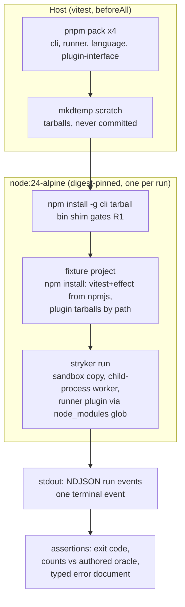

# Stryker CLI E2E Lane - Plan

## Goal Capsule

- **Objective:** A regression in the shipped `stryker` artifact — a broken packed install, a dead bin, a CLI/runner contract break, or a lost error envelope at the process boundary — turns a CI lane red within one run of landing.
- **Means:** A three-journey E2E lane that packs the workspace-under-test fresh, installs it into a disposable pinned Alpine container, and asserts the published machine-mode contract (KD1, KD2, KTD1–KTD5).
- **Authority hierarchy:** this plan > `apps/stryker-js-cli/AGENTS.md` (its packed-install rule updates here, R6) > `CONSTITUTION.md` (CONST-T8/T10/T15 govern test shape; CONST-E9 governs the CI-workflow boundary).
- **Stop conditions:** all units landed and the Verification Contract passes; scope cuts beyond Scope Boundaries require the author's consent (CONST-W1).
- **Execution profile:** Standard implementation, one branch, dependency-ordered units U1→U4; the implementing agent finishes and ships.

---

## Product Contract

### Summary

Build `apps/stryker-js-cli-e2e`, a private test app modeled on `systemfsoftware/are-the-types-wrong-effect`'s `apps/arethetypeswrong-cli-e2e`: one pinned Alpine Node container per run (testcontainers), the packed CLI tarball installed the way a consumer installs it, authored fixture projects with hand-known mutant outcomes, and assertions against exit codes, the machine-mode NDJSON run-event stream, and typed failure documents. Three journeys only — packed install, one real mutation run, one representative failure — everything else stays pinned at existing lower layers.

### Problem Frame

The CLI package's own rules state the gap: the packed-install closure is ungated (`apps/stryker-js-cli/AGENTS.md` CLI-D4 — no lane here installs the packed executable), and a workspace install can never gate it because pnpm links the bin shim only at install time against an existing target, which gitignored `dist/` defeats on a fresh clone (`docs/solutions/build-errors/workspace-bin-and-typecheck-ordering.md`, INV-1). STRATEGY.md's gate — every CLI behavior "covered by automated integration checks" for the machine-first streaming contract — has no lane that observes the real artifact crossing the process boundary. Existing tests exercise workflows in-process with property tests; none executes the shipped tarball, the bin shim, the sandbox copy, or the child-process worker plugin boundary.

### Key Decisions

- KD1. Three seam-unique journeys, breadth delegated downward (session-settled: user-directed — chosen over mirroring the reference suite's ~25-test full-surface coverage: only behavior observable solely at the end-to-end seam earns an E2E test; flag matrix, error taxonomy, mode resolution, and merge logic are already pinned by `apps/stryker-js-cli/src/__tests__/` property suites and engine integration tests). Governs R2, R3.
- KD2. No registry emulation — direct tarball installs (session-settled: user-directed — chosen over a local Verdaccio registry: a registry is load-bearing only for a registry-dependent product path such as attw's `--from-npm`, which the stryker CLI lacks; its bundle imports only `node:` builtins and plugin discovery walks `node_modules` on disk). Governs R1.

### Requirements

Gate breadth — the three journeys:

- R1. A packed CLI tarball from the current workspace build installs into a clean container the way a consumer installs it (`npm install -g <tarball>`), and the installed `stryker` bin executes with exit code 0 — gating the packed-install closure (bin shim, dist layout, wasm beside chunks) that no other lane observes.
- R2. A mutation run driven by the packed CLI with the packed vitest-runner plugin against an authored fixture project ends in exactly one machine-mode `verdict` terminal event whose mutant counts equal the fixture's hand-authored oracle, with exit code 0 under default thresholds.
- R3. A run whose fixture tests fail during the dry run ends in the typed `error` terminal event — string `schemaVersion`, numeric `code`, non-empty `remediation` — with no verdict event and the classed nonzero exit code.

Lane mechanics:

- R4. The lane packs its tarballs from the current workspace build on every run and pins the container image by digest; no tarball, container state, or run output is committed.
- R5. The lane runs as its own turbo task, excluded from `pnpm test` and `pnpm check:ci`, executable under podman locally and Docker in CI.
- R6. Workspace instructions reflect the lane: the CLI package's packed-install rule (CLI-D4) names the gate that now covers it, and the new app appears in the apps scope doc.

### Scope Boundaries

Delegated downward (not re-pinned here): flag permutations, error-envelope taxonomy variants, output-mode resolution, `merge-reports`, human-mode rendering — owned by `apps/stryker-js-cli/src/__tests__/` workflow property suites and engine integration tests.

Out of scope:

- The reference app's LLM-judged evals lane (rubric/transcripts/baseline) — no such infra in this repo.
- Editing `.github/workflows/` — agent-read-only evaluator surface (repo boundaries, CONST-E9). The lane ships a ready-to-apply ubuntu `e2e` job snippet in its README; the owner applies it.

### Deferred to Follow-Up Work

- CI e2e job application (owner-applied snippet above).
- Container-layer caching of the fixture `npm install` (duration optimization; lane first, speed later).

### Sources & Research

- Reference architecture: `systemfsoftware/are-the-types-wrong-effect` `apps/arethetypeswrong-cli-e2e` (container bed, digest-pinned image, oracle discipline, `test:e2e` turbo task, separate CI e2e job).
- pnpm workspace protocol — `workspace:` specs are rewritten to concrete versions on pack (pnpm.io/10.x/workspaces, "Publishing workspace packages"); `pnpm pack` provides `--pack-destination` and `--filter` (pnpm.io/cli/pack).
- testcontainers podman support — rootful socket via `DOCKER_HOST`, `TESTCONTAINERS_RYUK_PRIVILEGED=true`; rootless requires `TESTCONTAINERS_RYUK_DISABLED=true` (node.testcontainers.org/supported-container-runtimes).
- E2E breadth evidence: Datadog E2E best practices (updated 2025-12), Software Testing Magazine on AI-era duplicate tests (2026-08), Oliphant on AI test sprawl (2026-03) — each test must own behavior unique to its seam.
- Repo: `STRATEGY.md` (machine-first positioning, integration-check gate), `docs/solutions/build-errors/workspace-bin-and-typecheck-ordering.md` (INV-1), `docs/solutions/tooling-decisions/workspace-source-condition-dev-resolution.md`.

---

## Planning Contract

### Key Technical Decisions

- KTD1. In-container tarball installs by path; public deps from npmjs (session-settled: user-directed — chosen over a Verdaccio registry per KD2). The CLI tarball installs with `npm install -g` inside the container; the fixture project installs vitest, effect, and effect-cell-types from npmjs plus the three plugin-chain tarballs (runner, language, plugin-interface) by path. Grows R1, R2.
- KTD2. The suite packs the workspace-under-test fresh each run (session-settled: user-approved — chosen over committed or prebuilt tarballs: the lane must gate the current workspace state). `pnpm pack` after turbo `^build`, into a host `mkdtemp` scratch dir — pnpm, not npm, because only pnpm rewrites `workspace:^` to concrete versions in the packed manifest; `npm pack` emits the spec verbatim and the in-container install could not resolve it. Grows R1, R4.
- KTD3. One digest-pinned `node:24-alpine` container per run, started in `beforeAll` and stopped in `afterAll` (reference pattern). Node 24 matches CI and the flake devshell; musl gives the WASI oxc parser a second libc, so a musl-only break surfaces here rather than in a user's container.
- KTD4. The e2e app imports no workspace packages. Assertions parse stdout as plain JSON against hand-authored expectations — no `Run.schema` import, keeping the oracle independent of the system under test (CONST-T10) and sidestepping the source-condition/dist-staleness class entirely (`docs/solutions/build-errors/suite-imports-package-dist-rebuild-before-trusting.md`).
- KTD5. A dedicated `test:e2e` turbo task: `cache: false`, `dependsOn: ["^build"]`, `passThroughEnv` for `TESTCONTAINERS_RYUK_DISABLED`, `TESTCONTAINERS_RYUK_PRIVILEGED`, `TESTCONTAINERS_HOST_OVERRIDE`, `DOCKER_HOST`, `CI`; root script `test:e2e`. The app declares `lint` and `typecheck` but **no** `test` script, so `pnpm test` / `pnpm check:ci` (macOS matrix, no Docker) never picks the lane up. Grows R5.
- KTD6. The fixture loads the runner the way a consumer does: default plugin glob `@systemfsoftware/stryker-js-*` resolving from the fixture's own `node_modules` inside the sandbox copy, with `testRunner: 'vitest'` — the plugin name the runner declares (`declarePlugin('TestRunner', 'vitest')` in `packages/stryker-js-vitest-runner/src/index.ts`), not its package name. `checkers` stays unset (schema default is none, `packages/stryker-js-language/src/Schema.schema.ts`); org packages the glob misses only warn (`warnAbsentPlugin`, `packages/stryker-js-engine/src/Plugins.ts`). Vitest pinned to the workspace catalog major. Grows R2.
- KTD7. Machine mode asserted without flags: non-TTY stdout selects machine output by default (`apps/stryker-js-cli/src/resolve-output-mode.workflow.ts`), so plain `container.exec` observes NDJSON `{"kind": ...}` lines; terminal kinds are `verdict` / `error` / `help`; classed exit codes 0/1 (VerdictFail) /2 (ConfigError) /3 (RuntimeError) /4 (InternalError) per `apps/stryker-js-cli/src/__tests__/classify-run-outcome.workflow.property.test.ts`. Grows R2, R3.

### High-Level Technical Design

### Assumptions

- npmjs egress is available from CI runners and from the local podman container network.
- The runner's published peer range (`vitest: >=2.0.0`, `packages/stryker-js-vitest-runner/package.json`) accepts the workspace catalog's vitest ^4.
- Workspace package versions are read dynamically at pack time (tarball filenames parsed); nothing hardcodes today's 8.0.1 / 4.0.4 / 4.0.0.
- Adding `testcontainers` to the pnpm catalog resolves within the `minimumReleaseAge` supply-chain window; if the newest release is younger, select the newest version outside the window (the exclude list itself is human-gated and untouched).

### Risks & Dependencies

- npm tree resolution with mixed registry specs + tarball paths may nest unexpectedly. Mitigation: two-step install (registry deps first, then tarball paths); execution-time fallback, not a design fork.
- The failing-dry-run exit class is planning-time inference (RuntimeError → 3) from the class table; implementation confirms the observed class and pins that class's code with a comment citing the table.
- Alpine/musl × WASI parser: a failure here is a real portability catch, not lane noise — triage as a product bug.
- Local podman is rootful on this host: `DOCKER_HOST=unix://$(podman info --format '{{.Host.RemoteSocket.Path}}')` plus `TESTCONTAINERS_RYUK_PRIVILEGED=true` (primary doc); README documents both podman and CI-Docker invocation.
- Lane duration (image pull + two `npm install`s per run): hook timeout 600s, test timeout 120s; caching deferred by design.

### Sequencing

U1 (scaffold + bed + packed-install gate) → U2 (mutation journey) → U3 (failure journey) → U4 (docs, rules, CI handoff). U2 and U3 both depend on U1's bed; they are otherwise independent.

---

## Implementation Units

### U1. Scaffold e2e app, container bed, packed-install gate

- **Goal:** The lane exists as a wired workspace app that packs the workspace, starts the pinned container, installs the CLI tarball like a consumer, and proves the bin runs (R1, R4; R5 wiring half).
- **Requirements:** R1, R4, R5 (task wiring and local executability; R5's CI executability and run-mode docs complete in U4).
- **Dependencies:** none.
- **Files:** `apps/stryker-js-cli-e2e/package.json`, `apps/stryker-js-cli-e2e/tsconfig.json`, `apps/stryker-js-cli-e2e/tsconfig.node.json`, `apps/stryker-js-cli-e2e/oxlint.config.ts`, `apps/stryker-js-cli-e2e/vitest.config.ts`, `apps/stryker-js-cli-e2e/tests/bed.ts`, `apps/stryker-js-cli-e2e/tests/packed-install.e2e.test.ts`, `turbo.json`, `package.json`, `pnpm-workspace.yaml` (catalog: `testcontainers`).
- **Approach:**
  1. Private app `@systemfsoftware/stryker-js-cli-e2e`, `engines.node >=24`, scripts `lint` / `typecheck` / `test:e2e` — no `test` script (KTD5); configs mirror `apps/stryker-js-cli` (tsconfig extends `@systemfsoftware/tsconfig`, oxlint `all` preset, vitest node config with `hookTimeout 600_000`, `testTimeout 120_000`, `passWithNoTests: false`).
  2. Root wiring: `test:e2e` turbo task per KTD5; root script `"test:e2e": "turbo --concurrency=${TURBO_CONCURRENCY:-50%} test:e2e"`.
  3. `tests/bed.ts`: host-side `beforeAll` — `pnpm pack` the four packages into `mkdtemp` scratch (KTD2), start the digest-pinned `node:24-alpine` container (KTD3), copy tarballs, `npm install -g` the CLI tarball (KTD1); export `runCli` / `runShell` helpers over `container.exec`; `afterAll` stops the container and removes scratch (R4).
  4. `tests/packed-install.e2e.test.ts` — the R1 gate.
- **Patterns to follow:** `apps/arethetypeswrong-cli-e2e` in the reference repo (bed shape, exec helpers, requireStep-style setup failure); `apps/stryker-js-cli/vitest.config.ts` and `oxlint.config.ts` for config conventions.
- **Test scenarios:**
  - `stryker --version` exits 0, prints the version read from the packed tarball's manifest (oracle: the manifest the suite itself packed), writes nothing to stderr.
  - `sh -c 'command -v stryker'` exits 0 — npm created the bin shim for the tarball-installed package (the INV-1 consumer path).
  - A bed setup failure (e.g. pack fails) fails the suite loudly with the failing step named, not a timeout.
- **Verification:** `pnpm --filter @systemfsoftware/stryker-js-cli-e2e lint && pnpm --filter @systemfsoftware/stryker-js-cli-e2e typecheck` pass; the lane runs green under local podman; `pnpm test` output does not include the e2e app.

### U2. Mutation-run journey with authored oracle

- **Goal:** One real mutation run through the real plugin/worker boundary ends in a verdict matching a hand-authored oracle (R2).
- **Requirements:** R2.
- **Dependencies:** U1.
- **Files:** `apps/stryker-js-cli-e2e/tests/mutation-run.e2e.test.ts`, `apps/stryker-js-cli-e2e/fixtures/calc-fixture/` (`package.json`, `vitest.config.ts`, `stryker.config.json`, `src/calc.ts`, `src/calc.test.ts`, `oracle.md`).
- **Approach:**
  1. Author the fixture: a pure-function module (e.g. `add`, a comparison, a boolean return) with vitest tests that kill the arithmetic/logic mutants on tested lines and leave one clearly-remarked survivor line untested; `stryker.config.json` with `testRunner: 'vitest'` (KTD6) and `mutate` scoped to the fixture source (KTD7). The fixture root's `package.json` and `vitest.config.ts` are load-bearing: the runner resolves `vitest` through `createRequire(<fixture-root>/package.json)` and reads `vitest.config.ts` as its default `vitest.configFile` (`packages/stryker-js-engine/src/config/base.ts`).
  2. Journey setup inside the test: copy the fixture dir into the container, `npm install` registry deps then the three plugin tarballs by path (KTD1), run `stryker run` with no mode flags.
  3. Assert the machine-mode contract against the oracle constants co-located with the fixture (KTD4).
- **Execution note:** Derive the oracle by hand — which mutation each test kills, which survives — and write the derivation in `fixtures/calc-fixture/oracle.md`; a run may confirm the numbers but never originates them (CONST-T10). A mismatch is triaged as fixture-authoring error or product bug, never auto-copied into the oracle.
- **Patterns to follow:** Reference suite's envelope parsing (plain-JSON decode helpers with discriminant checks, no schema import from the SUT).
- **Test scenarios:**
  - Exit code 0 with default thresholds (`break: null`).
  - Every stdout line parses as JSON carrying a `kind` field; no ANSI escapes.
  - Exactly one terminal event, kind `verdict`, and it is the last line.
  - Verdict counts equal the authored oracle exactly (killed, survived, total).
  - At least one pre-terminal event (plan/phase/mutant-tested/tick — the 10s heartbeat) precedes the terminal — the stream is live, not batched.
  - `runId` is identical across the events that carry one.
- **Verification:** The journey is green under local podman with the oracle numbers matching the hand derivation; sabotaging one oracle number turns it red.

### U3. Failing-run journey

- **Goal:** A representative failure crosses the process boundary as the typed error contract (R3).
- **Requirements:** R3.
- **Dependencies:** U1.
- **Files:** `apps/stryker-js-cli-e2e/tests/failing-run.e2e.test.ts`, `apps/stryker-js-cli-e2e/fixtures/failing-fixture/` (same shape as U2's fixture with a test that throws on the dry run).
- **Approach:** Reuse U1's bed and U2's install flow; the fixture's own test fails, so the dry run fails before any mutant runs. Assert the failure lane per KTD7 (class inference per Risks).
- **Test scenarios:**
  - Exit code equals the classed code for a failing dry run (expected RuntimeError → 3; pin the observed class's code with a comment citing the class table if it differs).
  - The last stream event is terminal kind `error` with string `schemaVersion`, numeric `code`, non-empty `remediation`.
  - No `verdict` event appears on stdout.
  - Every stdout line still parses as JSON — the failure never leaks unstructured text onto the machine stream.
- **Verification:** Journey green under local podman; intentionally widening the assertion (accepting exit 0) fails the test.

### U4. Docs, rule updates, CI handoff

- **Goal:** The lane is discoverable, its run modes documented, and the workspace rules reflect the new gate (R5, R6).
- **Requirements:** R5, R6.
- **Dependencies:** U1, U2, U3.
- **Files:** `apps/stryker-js-cli-e2e/README.md`, `apps/stryker-js-cli-e2e/AGENTS.md`, `apps/stryker-js-cli/AGENTS.md`, `apps/AGENTS.md` (on main; absent on this branch until it merges `27e4495`).
- **Approach:**
  1. README: purpose, the three journeys, local podman invocation (rootful socket + `TESTCONTAINERS_RYUK_PRIVILEGED=true`), CI-Docker invocation, and the owner-applied CI job snippet as a fenced block (ubuntu-latest, `pnpm install --frozen-lockfile`, `pnpm test:e2e`).
  2. Update `apps/stryker-js-cli/AGENTS.md` CLI-D4: the packed-install closure is now gated by this lane; keep the "no `test:contract` script" clause (the lane is `test:e2e`, a different name by design).
  3. Amend the apps scope boundary: `apps/AGENTS.md` on main (commit `27e4495`) excludes "Container-backed contract test lanes and self-mutation lanes" — a deliberate refusal recorded as KTD5 of `docs/plans/2026-09-13-0704-feat-home-stryker-js-family-plan.md` that this plan consciously reverses for the E2E seam. Amend that line to name `apps/stryker-js-cli-e2e` as the exception, citing the isolation mechanics (no `test` script, separate `test:e2e` task excluded from `pnpm test` / `pnpm check:ci`, digest-pinned container one-per-run); create the file with the amended boundary if the branch has not yet merged main's scope-doc consolidation. Give the app a minimal AGENTS.md (run command, no-`test`-script rule, podman/Docker env vars).
- **Test expectation:** none — documentation and wiring; the lane's own green run is the proof.
- **Verification:** `pnpm format:check` clean; the CI snippet in the README is complete enough to paste into `.github/workflows/ci.yml` without edits.

---

## Verification Contract

| Check                              | Command                                                                                                                      | Applies to |
| ---------------------------------- | ---------------------------------------------------------------------------------------------------------------------------- | ---------- |
| Lane (local, podman)               | `DOCKER_HOST=unix://$(podman info --format '{{.Host.RemoteSocket.Path}}') TESTCONTAINERS_RYUK_PRIVILEGED=true pnpm test:e2e` | U1–U3      |
| App gates                          | `pnpm --filter @systemfsoftware/stryker-js-cli-e2e lint && pnpm --filter @systemfsoftware/stryker-js-cli-e2e typecheck`      | U1         |
| Lane excluded from default gates   | `pnpm test` — e2e app absent                                                                                                 | U1         |
| Repo gates                         | `pnpm check:ci`                                                                                                              | all units  |
| Lane (CI, after owner applies job) | `pnpm test:e2e` on ubuntu-latest                                                                                             | U4 handoff |

The lane's three journeys are the behavioral proof of this plan; no unit test beyond them is added (CONST-T8 — the journeys test the public artifact, nothing here is a forwarding helper).

---

## Definition of Done

- Global: all units landed; the three journeys green under local podman; `pnpm check:ci` green; no committed tarballs, scratch dirs, or container state; README and AGENTS updates landed; the CI job snippet handed off (applied by the owner or explicitly deferred by them).
- Per-unit: each unit's own Verification clause holds.
- Cleanup: any experimental fixture variants, scratch scripts, or bed alternatives tried during implementation are removed — the diff contains only the lane, its fixtures, the wiring, and the doc updates.
