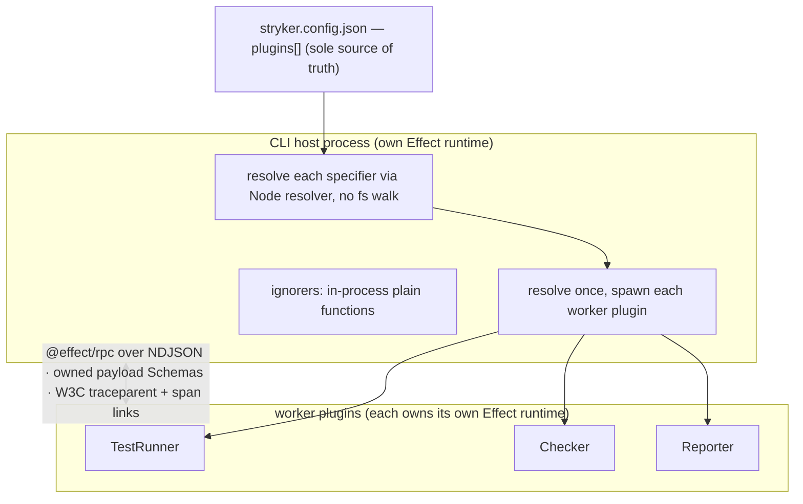
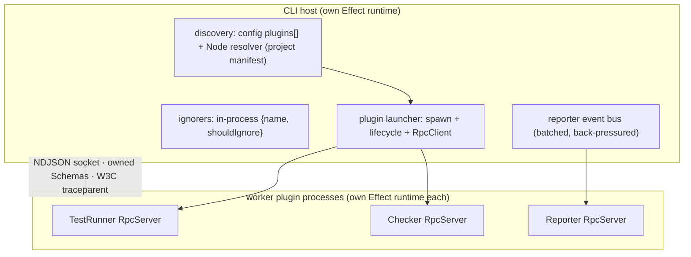
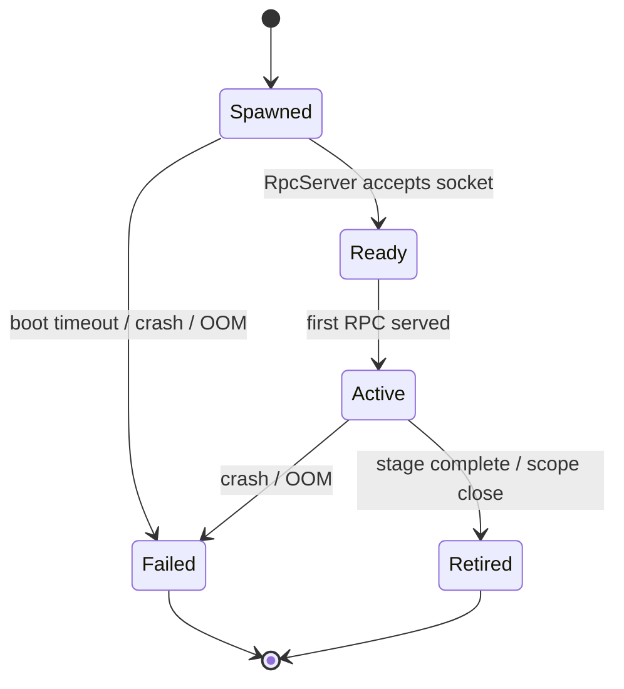

# Plugin System Redesign - Plan

## Goal Capsule

- **Objective:** A plugin system where every worker plugin runs as an isolated process over a shared `@effect/rpc` wire, so a plugin built against any Effect release works with any CLI, every boundary failure is typed, the project's `stryker.config.json` is the only source of what loads, and plugin execution links into the host's OpenTelemetry trace — with no shared Effect runtime and no filesystem discovery.
- **Means:** Each worker plugin is its own spawned process owning its full Effect runtime (KTD2), driven over `@effect/rpc` whose payloads are owned Schemas (KTD1).
- **Product authority:** User-directed architectural decisions from the 2026-09-16 brainstorm (confirmed); STRATEGY.md constraints (Effect 4 RC foundation, machine-first, track upstream where practical).
- **Execution profile:** Deep, phased (foundation → worker plugins + telemetry → ignorers + cutover). Finished and shipped by ce-work through the Definition of Done, verified by the repo's START gates and the container e2e lane.
- **Open blockers:** None. The Evaluator-kind question is recorded as an explicit assumption (Outstanding Questions).

---

## Product Contract

_Product Contract preservation: unchanged — R/A/F/AE IDs and meaning carried from the 2026-09-16 brainstorm._

### Summary

Replace the in-process plugin loader with a process-isolated model: TestRunner, Checker, and Reporter plugins each run as their own spawned process owning a complete Effect runtime, driven by the host over a shared `@effect/rpc` wire whose payloads are owned Schemas, with W3C trace context on every call. The `plugins` array in the project's config file is the sole source of what loads, resolved by Node's resolver. Ignorers stay in-process as plain functions.

### Problem Frame

The current system loads every plugin into the host process and builds the plugin's live Effect `Layer` with the host's runtime. That one choice is the root of four distinct defects.

Discovery walks `node_modules/<org>` upward twice — from the project and from the engine's own install tree — unions the names, then imports each by name against the project, so packages the project never installed produce spurious "cannot find plugin" warnings (issue #25). Whether a missing plugin is a warning or a fatal failure is decided by matching the plugin's name against the text of Node's resolver error (issue #26). Each plugin bundle inlines its own copy of the interface package, so the loader can never compare contributions by identity and reads them structurally off an unvalidated `S.Unknown` payload (issue #27).

The deepest coupling is invisible until versions diverge: because the plugin's `Layer` is a runtime-internal object built by the host's Effect, a plugin and CLI on different Effect release candidates share one object graph with no compatibility contract. The only test that crosses the packed boundary pins the same Effect version on both sides, so the skew is green by construction and nothing catches it. No trace context crosses the boundary, so plugin work is invisible to the trace.

### Key Decisions

- **Data, not Effect, crosses the boundary** — the seam carries plain data and function handles, never a runtime value. Governs R1, R8. (session-settled: user-directed — chosen over a shared Effect runtime: a plugin must not be unusable over a different Effect version.)
- **Worker plugins over `@effect/rpc`** — TestRunner, Checker, and Reporter run as spawned processes over the existing RPC transport. Governs R3, R4, R6. (session-settled: user-directed — chosen over an in-process data seam and over an owned NDJSON envelope: each plugin owns its full runtime; the envelope coupling is an accepted loss.)
- **Ignorers stay in-process** — an ignorer is a plain `shouldIgnore` function, not an Effect value, so there is no runtime coupling to isolate. Governs R13. (session-settled: user-directed.)
- **Config file is the sole source of truth** — the project's `stryker.config.json` (or a supplied config) `plugins` array decides what loads, resolved by Node's resolver. Governs R9, R10, R11. (session-settled: user-directed — chosen over a `package.json`-deps scan and over the `node_modules` glob walk.)
- **No contractVersion handshake** — the wire Schema decode is the compatibility gate; an explicit version number was redundant ceremony once the envelope coupling was accepted. Governs R8. (session-settled: user-directed — chosen over a load-time version handshake. Conflict call-out: the plugin-architecture canon favors an explicitly versioned, checked contract — see Risks.)
- **OpenTelemetry cross-span linkage is required** — plugin spans link into the host trace across the process boundary. Governs R12. (session-settled: user-directed.)
- **Full breaking changes** — the existing plugins are rewritten, not shimmed; the glob descriptor and the in-process `Layer` contract are dropped. Governs R15. (session-settled: user-directed.)
- **The contract package owns the boundary** — a single resolved package owns the payload Schemas and spawn contract and is no longer inlined into plugin bundles. Governs R2, R14.

### Architecture

The current and proposed shapes, for orientation; the Requirements below are authoritative.



### Actors

- A1. **Plugin author** — writes a package against the contract package and lists it in a project's config.
- A2. **The host (CLI / engine)** — resolves, spawns, and drives plugins; owns the run, the trace, and all Effect interpretation at the seam.
- A3. **CI pipelines and AI agents** — primary consumers of the NDJSON stream and the trace, per STRATEGY.

### Key Flows

- F1. A mutation run through the redesigned system.
  - **Trigger:** The CLI is invoked in a project.
  - **Actors:** A2, A3
  - **Steps:** Read the config; resolve each `plugins` specifier via Node's resolver; spawn each worker plugin; drive the run stages over the RPC wire with trace context on every call; stream reporter events to the reporter worker; emit the verdict.
  - **Outcome:** The run completes with worker spans linked into the host trace; any plugin failure is a typed error.
  - **Covers R3, R4, R6, R7, R9, R10, R12**
- F2. Authoring and installing a plugin.
  - **Trigger:** A1 creates a plugin package.
  - **Actors:** A1, A2
  - **Steps:** Depend on the contract package; export the spawn entrypoint and contributions that conform to the payload Schemas; a project lists the specifier in `plugins`.
  - **Outcome:** The host spawns and drives it with no interface inlining and no glob.
  - **Covers R2, R9, R14**

### Requirements

**Boundary contract**

- R1. The plugin boundary carries only plain data and function handles — never an Effect value (Layer, Effect, Context, or Schema instance).
- R2. Every payload that crosses the boundary is defined by a schema the contract package owns and is decoded at the seam; an undecodable payload fails the call.

**Process model**

- R3. TestRunner, Checker, and Reporter plugins each run in their own spawned process owning a complete Effect runtime; the host never imports a worker plugin's code.
- R4. The host resolves each plugin once and spawns it; worker plugins do not re-run discovery against the sandbox working directory.
- R5. A plugin process failure (crash, out-of-memory, boot timeout) surfaces as a typed worker error, never a host hang.

**Wire and compatibility**

- R6. Host-to-plugin communication uses `@effect/rpc` over NDJSON on a socket; the payload Schemas are owned by the contract package.
- R7. Every boundary failure is a typed error variant decoded from structured signals, never matched on a message string; an unrecognized failure fails loud carrying the descriptor and the underlying signal.
- R8. No Effect version is compared at the boundary; the run does not gate a plugin on its Effect version.

**Discovery and resolution**

- R9. The project's config file `plugins` array is the sole source of truth for which plugins load; there is no glob default and no `package.json` scan.
- R10. Each plugin specifier is resolved by Node's own module resolver from the project root; the loader never walks `node_modules` and never consults the host's own install tree.
- R11. A specifier the project cannot resolve is reported against that specifier only, and never causes another plugin to be skipped or a spurious not-found for a package the project did not declare.

**Observability**

- R12. Every boundary call carries the active W3C `traceparent`/`tracestate`; a synchronous RPC call's worker spans are children of the host span that made the call, and asynchronous plugin work is connected with span links, so plugin execution links into the host trace across the process boundary.

**Ignorers**

- R13. Ignorers remain in-process plain `shouldIgnore` functions contributing no Effect value; they are unchanged by the worker migration.

**Migration and packaging**

- R14. The contract package becomes the versioned owner of the boundary schemas and spawn contract; no plugin inlines it for cross-identity structural reads — the host never imports a worker plugin, and an ignorer contributes plain functions with no interface copy. A worker's self-contained spawn entry bundles the contract together with its own Effect runtime as one coherent unit — that is the version-isolation mechanism, not the removed identity hack.
- R15. The first-party plugins (vitest-runner, typescript-checker, test-contribution, ignorer plugins) are rewritten to the new contract; backward compatibility with the glob descriptor and the in-process Layer contract is dropped.

### Acceptance Examples

- AE1. A plugin on a different Effect release remains usable.
  - **Given** a TestRunner plugin built against Effect rc.M and a CLI bundling rc.N
  - **When** the run spawns and drives it
  - **Then** the plugin runs to completion and its spans link into the host trace
  - **Covers R8, R12**
- AE2. An unresolvable specifier is isolated to itself.
  - **Given** `plugins` lists one installed runner and one specifier the project cannot resolve
  - **When** prepare resolves
  - **Then** the runner loads, exactly one error names the unresolvable specifier, and no not-found line names a package the project did not declare
  - **Covers R11**
- AE3. A schema-incompatible payload fails loud, never silently.
  - **Given** a plugin that emits a payload failing the contract schema
  - **When** the host decodes it
  - **Then** the run fails with a typed error naming the plugin and the decode failure, and the plugin is not silently skipped
  - **Covers R2, R7**
- AE4. Worker spans link into the host trace.
  - **Given** OpenTelemetry is enabled
  - **When** a TestRunner worker runs
  - **Then** its spans appear in the run's trace as children of the host span that made the RPC call, with asynchronous work connected by span links
  - **Covers R12**

### Success Criteria

- The container e2e lane passes its four seam-only journeys against the packed artifact: the packed-install closure, a mutation run driven through the worker plugins (the live CLI-to-worker RPC boundary — the existing mutation-run journey), a failing run crossing as a typed error with a classed exit code (the existing failing-run journey), and the Effect-skew run.
- The Effect-skew run passes with a plugin built against a different Effect release than the CLI — the skew case the current lane cannot exhibit.
- A run whose project declares one plugin emits zero "cannot find plugin" lines for packages the project did not declare.
- A trace for a mutation run shows TestRunner, Checker, and Reporter worker spans linked to the host trace.
- Time-to-first-`stream`-event (STRATEGY's key metric) is no worse than the pre-redesign packed-install baseline; record that baseline before U3 lands.

### Scope Boundaries

- **Deferred for later:** The framework-plugin (angular/svelte) work on its branch — this contract is designed to fit framework plugins but does not implement them.
- **Outside this work's scope:** Ignorer redesign (unchanged per R13); any contractVersion handshake; backward compatibility with the glob descriptor or the in-process `Layer` contract.

### Dependencies and Assumptions

- Effect 4 RC remains the foundation across all packages (STRATEGY boundary).
- The wire transport is `@effect/rpc` (`effect/unstable/rpc`); its NDJSON envelope may break across release candidates — an accepted, bounded loss (user-directed).
- Built-in reporters (progress, html, json, clear-text) remain in-process; only plugin-supplied reporters become workers.
- The contract package is the single owner of the boundary schemas; existing plugins are rewritten against it.

### Outstanding Questions

- **Resolved as assumption (product):** The Evaluator plugin kind is kept as declared, and no Evaluator worker is built — it is currently declared with no consumer. Reopen in ce-brainstorm if it should become a worker kind.
- **Resolved (decision):** The reporter event stream is batched and back-pressured (KTD6); the batching mechanism is implementation detail.
- **Resolved (decision):** Built-in reporters stay in-process (Assumptions, U5); only plugin-supplied reporters become workers.
- **Resolved (default):** The reporter worker is spawned eagerly at prepare so its init completes before dry run; the TestRunner and Checker pools build lazily on first use. Spawn lifecycle/pooling detail beyond this default is Deferred to Implementation, guarded by the time-to-first-event Success Criterion.

### Sources / Research

- Grounding dossier (verbatim quotes + file:line): `/tmp/compound-engineering-0/ce-brainstorm/plugin-redesign/grounding.md`
- Filed defects: issues #25, #26, #27 on systemfsoftware/stryker-js-effect.
- Current loader: `packages/stryker-js-engine/src/Plugins.ts`; module shape `Plugins.schema.ts` (`strykerPlugins: S.Array(S.Unknown)`); import split `Config.ts:438`.
- Current contract: `packages/stryker-js-plugin-interface/src/Plugin.ts` and `Plugin.schema.ts`.
- Existing RPC contract to generalize: `packages/stryker-js-engine/src/WorkerProtocol.ts`; worker pattern in `apps/stryker-js-cli/src/workers/`.
- CLI reporter-injection hack: `apps/stryker-js-cli/src/Cli.ts:615`.
- Glob default: `packages/stryker-js-language/src/Schema.schema.ts:168`.
- Product constraints: `STRATEGY.md`.

---

## Planning Contract

### Key Technical Decisions

- KTD1. **The contract package owns the wire.** Rewrites `@systemfsoftware/stryker-js-plugin-interface` into the owner of the per-kind `@effect/rpc` groups (generalizing `WorkerProtocol.ts`), the boundary payload Schemas, the spawn/entry contract, and the typed error taxonomy — with no Effect-typed contribution classes at the boundary. It pins the effect RC it targets; on an RC bump its own suite must pass before any plugin updates (the bump is a coordinated, deliberate step). Instantiates the data-not-Effect and contract-package decisions. Cites R1, R2, R7, R14.
- KTD2. **Each worker plugin is its own spawned process.** Every TestRunner/Checker/Reporter package ships a spawn entrypoint that hosts an `RpcServer` for its kind's group; the host resolves and spawns it, replacing the generic-worker-that-loadPlugins pattern. The worker's dist fully bundles the Effect runtime and the contract package, so the plugin's effect is baked in at build time, never resolved from the host or the project — this bundling is the version-isolation mechanism. (session-settled: user-directed — chosen over generic-worker-hosts-plugin: total runtime isolation.) Cites R3, R4, R5.
- KTD3. **Discovery is config + Node resolution from the project manifest.** Read the config `plugins` array and resolve each specifier via Node's resolver with the project's `package.json` as the resolution parent (`import.meta.resolve` with a parent URL, or `createRequire` on the project manifest) — never the host's dist, never a `node_modules` walk; an unresolvable specifier is reported against itself alone. Closes #25. Cites R9, R10, R11.
- KTD4. **Failures are a typed taxonomy at the wire.** Resolver errors and RPC error channels are decoded into typed variants; no message-substring classification; an unrecognized signal fails loud naming the descriptor and the code. Closes #26. Cites R7.
- KTD5. **Trace context is W3C on the envelope.** Inject `traceparent`/`tracestate` into the wire envelope; a synchronous RPC call is the parent of the worker spans it invokes, and asynchronous plugin work is connected with span links; each worker runs its own OTel SDK exporting to the shared collector. The propagated context is a version-stable string; cross-major OTel SDK compatibility is a separate concern (see Risks). Cites R12.
- KTD6. **The reporter stream is batched and back-pressured by request/response.** The host sends reporter events as bounded `onEventBatch` RPC calls and awaits each batch's acknowledgment before sending the next, so back-pressure comes from the synchronous RPC round-trip rather than an unverified server-pushed streaming primitive. Cites R3, R12.
- KTD7. **Ignorers keep the smallest contract.** An ignorer stays a plain `{ name, shouldIgnore }` descriptor; the interface inlining and Effect-`Layer` wrapping are removed and the host owns the `Ignorer` service construction. Cites R13, R14.

### High-Level Technical Design

Component topology, the spawn-and-drive sequence, and the worker lifecycle.



```mermaid
sequenceDiagram
  participant C as config (plugins[])
  participant H as host (engine)
  participant L as launcher
  participant W as worker plugin
  C->>H: plugins[]
  H->>H: resolve each via Node resolver (project package.json)
  alt a specifier does not resolve
    H-->>H: report that specifier only; others proceed
  end
  H->>L: spawn(resolved entrypoint)
  L->>W: start process (cwd=sandbox, options)
  W-->>L: RpcServer ready
  H->>W: RPC call (traceparent on envelope)
  W-->>H: typed result / typed error
  Note over H,W: async work linked by span links
```



### Assumptions

- Each worker plugin ships a spawn entrypoint (`bin` or exported worker module) the host can spawn by resolved path; the host never imports the plugin's library code. The worker's dist bundles the Effect runtime and the contract package (the version-isolation surface) so the plugin's effect is its own; the wrapped domain tool (vitest, typescript) stays a project-resolved external and Node builtins stay external.
- The engine's `TestRunner`/`Checker` stage logic (cell pipelines, admission workflows) is preserved; only the mechanism that supplies the service changes from in-process Layer-build to spawned-RPC.
- The `@effect/rpc` NDJSON envelope may break across release candidates — an accepted, bounded loss (user-directed); no owned envelope and no version handshake is built.
- The reporter event volume is the highest of the three kinds and drives the batching/back-pressure design in KTD6.

### Sequencing

Three phases, dependency-ordered:

- **Phase A — Foundation:** U1 (contract), U2 (discovery), U3 (launcher).
- **Phase B — Worker plugins + telemetry:** U4 (TestRunner + Checker workers), U5 (Reporter worker), U6 (OTel propagation).
- **Phase C — Ignorers + cutover:** U7 (ignorers), U8 (cutover + cleanup + skew test).

### Destructive Review (three assumptions + lens)

Lens: **Edge-First** — attack the boundary conditions of the new worker model. Three testable structural assumptions it surfaced, each carried into the plan:

1. The reporter event stream tolerates the wire. Counter-edge: a per-event NDJSON stream floods the socket. → answered by KTD6 (request/response batching), verified at the U5 in-process integration seam (buffer bounded under a fast producer) and exercised end-to-end by the mutation-run e2e journey, which drives the reporter worker's event stream. No separate e2e reporter journey is added — the four-journey cap holds.
2. Spawn-per-plugin overhead is acceptable against STRATEGY's time-to-first-event. Counter-edge: three cold spawns before the first NDJSON event. → spawn lifecycle/pooling recorded as an Open Question; time-to-first-event kept as a Success Criterion.
3. Node's resolver from the project manifest resolves every legitimate specifier package-manager-agnostically. Counter-edge: bare `import()` resolves relative to the host's dist, reintroducing the wrong-root defect. → answered by KTD3 (explicit project-manifest resolution parent) and its resolution tests.

### Alternative Approaches Considered

- **In-process data seam** — host adapts plain function handles in one process. Rejected: weaker isolation (shared module graph, shared blast radius); the user chose process isolation.
- **Owned NDJSON envelope** — a versioned protocol we define, with `@effect/rpc` as transport. Rejected: the user accepted the `@effect/rpc` envelope coupling as a bounded loss rather than own a protocol.
- **Generic-worker-hosts-plugin** — keep the current generic worker that loads the plugin in-process, with a data wire to the host. Rejected: the plugin then shares the worker's runtime rather than owning its own; the user chose plugin-as-own-process.

### Risks & Dependencies

- **Envelope break across RCs (accepted).** The `@effect/rpc` envelope lives in `effect/unstable` and may change across release candidates; a host/plugin skew on it breaks the wire. Accepted as a bounded loss; the payload Schemas remain ours. The contract package pins the RC (KTD1), and a bump is a coordinated step gated on its suite.
- **Canon tension on contract versioning.** The plugin-architecture canon (A5/A12) favors an explicitly versioned, checked contract. We chose decode-as-check and no numeric handshake (settled). A contract incompatibility surfaces as a wire decode error — legible but blunter than a version-mismatch message. Recorded as a conflict call-out on the no-handshake Key Decision; workable, and the e2e skew journey is where it would first show.
- **Reporter stream back-pressure.** The highest-volume kind crossing the wire; mishandled back-pressure risks buffer growth or stalls. Mitigated by KTD6 (request/response batching), proven at the U5 in-process integration seam (buffer bounded under a fast producer), and exercised end-to-end by the mutation-run journey.
- **Checker worker wraps a compiler child.** A Checker plugin that itself spawns a compiler (tsc) becomes a worker around a worker — two process boundaries. This is the accepted cost of the isolation model (user-directed); noted so plugin authors expect it.
- **OTel cross-major compatibility.** The W3C trace-context string is version-stable, but a host and worker on different `@opentelemetry/api` majors may differ in SDK export or semantic conventions; the skew test pins a different effect RC, not a different OTel major, so cross-major OTel is asserted on the wire format, not verified end to end.
- **Spawn/resource overhead.** One process per worker plugin; startup cost and RSS add up. Spawn lifecycle/pooling defaults to eager-reporter/lazy-pools (Outstanding Questions); time-to-first-event is a Success Criterion with a recorded baseline.
- **Dependency:** the contract package is the single owner of boundary schemas; existing plugins are rewritten against it (R15). Effect 4 RC foundation per STRATEGY.

### System-Wide Impact

- The plugin loading path, the two existing workers, the CLI's reporter wiring, and the vitest-runner/typescript-checker packages all change; this is a cross-cutting architectural change with full breaking changes to the plugin contract.
- Plugin authors (A1) must rewrite to the new spawn-entry + contract; the e2e lane and CI's telemetry gate are affected.

---

## Implementation Units

### U1. Plugin contract package

- **Goal:** Own the wire — the per-kind `@effect/rpc` groups, the boundary payload Schemas, the spawn/entry contract, and the typed error taxonomy — with no Effect-typed contribution classes at the boundary.
- **Requirements:** R1, R2, R7, R14. KTD1. Cites AE3, F2.
- **Dependencies:** none.
- **Files:** `packages/stryker-js-plugin-interface/src/Plugin.schema.ts`, `packages/stryker-js-plugin-interface/src/Plugin.ts`, `packages/stryker-js-plugin-interface/src/index.ts`, `packages/stryker-js-plugin-interface/package.json`, `packages/stryker-js-plugin-interface/tsdown.config.ts`; generalize `packages/stryker-js-engine/src/WorkerProtocol.ts` into this package.
- **Approach:** Define `TestRunnerRpcs`, `CheckerRpcs`, and `ReporterRpcs` here (payloads from `stryker-js-language` Schemas). Name the `ReporterRpcs` methods explicitly: `init` (init options → void), `onEventBatch` (`S.Array(ReporterEvent)` → void), and `flush` (→ drained); derive `ReporterEventBatch` from the `ReporterStream` event Schema. Declare the spawn/entry contract: a worker plugin ships a `bin` (or `./worker` export) whose target is an `RpcServer` entry hosting its kind's group. Declare the typed boundary-error taxonomy. Remove `PluginLayerContribution`/`PluginReporterContribution`/`declarePlugin`/`composePlugins` and the `PluginInterfaces`/`PluginEnvironment` Effect-typed surface. Wire the `@systemfsoftware/source` dev condition per the workspace learning.
- **Patterns to follow:** `WorkerProtocol.ts` for the RpcGroup shape; `packages/toolchain/tsdown-config/lib/base.js` for the source condition.
- **Test scenarios:**
  - Each boundary payload schema satisfies codec laws — decode(encode(x)) === x and encode is stable — for a non-error schema (colocated `*.test.ts`).
  - Each typed boundary-error variant round-trips through its schema.
  - A contribution can be constructed and serialized without importing any Effect `Layer`/`Context` value.
  - The package has no runtime dependency on the engine (import-graph check).
- **Verification:** the package typechecks and its tests pass; the engine no longer owns `WorkerProtocol.ts` (it imports the groups from the contract package).

### U2. Discovery and resolution

- **Goal:** Replace glob discovery with config-declared plugins resolved by Node's resolver from the project manifest; report an unresolvable specifier in isolation.
- **Requirements:** R9, R10, R11. KTD3. Closes #25. Cites AE2, F2.
- **Dependencies:** U1.
- **Files:** `packages/stryker-js-engine/src/Plugins.ts`, `packages/stryker-js-engine/src/Plugins.schema.ts`, `packages/stryker-js-language/src/Schema.schema.ts`, `packages/stryker-js-engine/src/config/base.ts`, `packages/stryker-js-engine/tests/plugin-glob-resolution.integration.test.ts` (rework into a resolution spec).
- **Approach:** Read the config `plugins` array; for each specifier, resolve to an entrypoint via `createRequire(projectManifestPath).resolve(specifier)` (this honors `exports` maps; verify against pnpm, npm, and yarn fixtures in CI before the package-manager-agnostic claim holds). A specifier that fails to resolve is reported against itself while the rest proceed. The `plugins`/`appendPlugins` schema default becomes `[]` (no glob fallback); an empty resolved list fails at prepare with a `StageError` naming the runner/checker implied by `testRunner`/`checkers`, so a config that omits `plugins` fails with an actionable message, not deep in the runner stage. Delete `readOrgDirectory`/`readOrgPackagesUpward`/`parsePluginExpression`/`pluginNamePattern`/`IGNORED_PACKAGES`.
- **Patterns to follow:** the substituted-`FileSystem`/`Module` harness in the existing loader tests; `importModule` in `Config.ts` for the resolver seam.
- **Test scenarios:**
  - A project declaring one plugin resolves exactly it (in-process, substituted FileSystem/Module).
  - A specifier the project cannot resolve yields exactly one error naming that specifier and zero not-found lines for packages the project did not declare.
  - Resolution uses the project manifest as parent, not the host's dist — a host-adjacent package is not resolved.
  - Only the config file supplies plugins — no `package.json` scan and no glob.
- **Verification:** the resolution spec passes; no `node_modules` walk or glob default remains; issue #25's acceptance (zero spurious not-found) holds.

### U3. Plugin process launcher

- **Goal:** Generalize the worker launcher to spawn any plugin's own worker entry by resolved path and manage its lifecycle, exposing the host `RpcClient`.
- **Requirements:** R3, R4, R5. KTD2.
- **Dependencies:** U1, U2.
- **Files:** `packages/stryker-js-engine/src/WorkerLauncher.ts`, `packages/stryker-js-engine/src/Worker.ts`, `packages/stryker-js-engine/src/Worker.schema.ts`, `apps/stryker-js-cli/src/platform/node.ts`.
- **Approach:** Spawn by resolved entrypoint rather than a fixed worker URL; the plugin process is the plugin; reuse the existing crash/OOM/boot-timeout/retry handling; no plugin discovery inside the spawned process.
- **Patterns to follow:** `WorkerLauncher.ts`, `nodeWorkerLauncherLayer`, `connectRetry`, `makeChildProcessTestRunner`'s lifecycle handling.
- **Test scenarios:**
  - A substituted plugin entry is spawned and its socket connected (in-process with a substituted spawner).
  - Boot timeout produces a typed worker error, not a hang.
  - Crash and OOM map to their typed error variants.
  - The host never imports the plugin module (a substituted Module layer that throws on import is never touched).
- **Verification:** launcher integration tests pass in-process with a substituted spawner; no process is spawned by an integration test (live spawn is proven at the e2e seam).

### U4. TestRunner and Checker as self-spawned workers

- **Goal:** Rewrite the vitest-runner and typescript-checker as self-contained spawned processes hosting `TestRunnerRpcs`/`CheckerRpcs` servers, replacing the generic-worker-loadPlugins path.
- **Requirements:** R3, R4, R5. KTD2. Cites F1.
- **Dependencies:** U1, U3.
- **Files:** `packages/stryker-js-vitest-runner/src/`, `packages/stryker-js-vitest-runner/package.json`, `packages/stryker-js-typescript-checker/src/`, `packages/stryker-js-typescript-checker/package.json`, `packages/stryker-js-engine/src/TestRunner.ts`, `packages/stryker-js-engine/src/Checker.ts`, `apps/stryker-js-cli/src/workers/child-process-test-runner-worker.ts`, `apps/stryker-js-cli/src/workers/Checker.worker.ts`.
- **Approach:** Each plugin package adds a `bin` (or `./worker` export) whose target is a worker entry hosting an `RpcServer` for its kind's group and owning its full Effect runtime; tsdown emits that entry alongside `index` (and `stryker-setup` for the runner). The worker entry bundles the Effect runtime and the contract package (tsdown `noExternal`, resolving the contract's peer `effect` to the worker's pinned RC) — normalizing today's split (runner: `effect` peer; checker: `effect` dependency) — so the published tarball carries its own effect. The wrapped tool (`vitest`/`typescript`) stays external and resolves from the project. The host resolves the specifier via `createRequire(projectManifest)` to the bin path and spawns it as today (`process.execPath` + resolved path). The engine's `TestRunner.ts`/`Checker.ts` spawn the plugin's own process via U3 instead of a generic worker that re-runs `loadPlugins`; the generic worker entries are removed.
- **Patterns to follow:** the existing `TestRunnerRpcs`/`CheckerRpcs` handlers and `RpcServer.layerProtocolSocketServer` + `RpcSerialization.layerNdjson` + `NodeSocketServer` wiring.
- **Test scenarios:**
  - The runner worker answers capabilities/dryRun/mutantRun over an in-process socket pair; the checker worker answers check/group.
  - A worker that fails init fails the run with a typed error, not a timeout.
  - No `loadPlugins` runs inside the worker (no re-glob against the sandbox cwd).
  - The plugin's internal result mapping stays correct (existing runner/checker suites adapted).
- **Verification:** integration over an in-process RPC socket; the existing runner/checker behavior suites pass; e2e journey (live worker boundary) green.

### U5. Reporter as a self-spawned worker

- **Goal:** Plugin-supplied reporters become spawned workers receiving the batched, back-pressured event stream; remove the CLI's `reporterPluginModules` file:// injection; built-in reporters stay in-process.
- **Requirements:** R3, R12. KTD6.
- **Dependencies:** U1, U3.
- **Files:** `packages/stryker-js-engine/src/ReporterStream.ts`, `packages/stryker-js-engine/src/select-reporters.ts`, `packages/stryker-js-engine/src/mutation-reporting.ts`, `apps/stryker-js-cli/src/Cli.ts`, the contract package `ReporterRpcs` (from U1).
- **Approach:** Drive the reporter over the `ReporterRpcs` from U1 (`init`/`onEventBatch`/`flush`): the host sends bounded event batches and awaits each batch's acknowledgment before sending the next (back-pressure via the synchronous round-trip, KTD6). The reporter writes its output file (`htmlReporter`/`jsonReporter` `fileName`) resolved against the project `basePath` carried on the worker-options envelope — not the sandbox cwd — so the report lands in the project, not the discarded sandbox. Built-in reporters (progress, html, json, clear-text) remain in-process and are not routed through the plugin mechanism.
- **Patterns to follow:** `ReporterStream.ts` event model; the worker RPC wiring from U4.
- **Test scenarios:**
  - A reporter worker receives the event stream over an in-process socket and produces its output.
  - Back-pressure bounds the buffer under a fast event producer.
  - Built-in reporters still attach and emit in-process.
  - No `reporterPluginModules` file:// descriptor is injected.
- **Verification:** integration over a socket; the reporter event stream reaches the worker; the file:// hack is gone.

### U6. OpenTelemetry cross-process propagation

- **Goal:** Propagate W3C trace context across every boundary call so plugin spans link into the host trace across the process boundary.
- **Requirements:** R12. KTD5. Cites AE4.
- **Dependencies:** U1, U4, U5.
- **Files:** the contract package (envelope decoration), `packages/stryker-js-engine/src/` (span injection at the wire client), each worker plugin including the reporter worker (extraction + own SDK), `apps/stryker-js-cli-e2e/otel.ts`, `apps/stryker-js-cli-e2e/vitest.config.ts`.
- **Approach:** Inject `traceparent`/`tracestate` into the wire envelope as version-stable strings; a synchronous RPC call is the parent of the worker spans it invokes; connect asynchronous plugin work with span links; each worker runs its own OTel SDK exporting to the shared collector. Follow the observability-code discipline for signal choice and attribute cardinality.
- **Patterns to follow:** the lane's existing OTel/Tempo gate (`apps/stryker-js-cli-e2e/otel.ts`, `scripts/export-traces.ts`); W3C trace-context propagation.
- **Test scenarios:**
  - The wire envelope carries a valid `traceparent` for the active span.
  - A worker span's parent is the host span (in-process span assertion).
  - Asynchronous plugin work is connected by a span link, not a broken parent.
  - Cross-version OTel trace-context propagates (the W3C string format is version-stable); cross-major SDK compatibility is a noted risk, not asserted here.
- **Verification:** in-process span assertions; the e2e telemetry gate shows worker spans linked to the host trace.

### U7. Ignorers stay in-process

- **Goal:** Keep ignorers as plain in-process `{ name, shouldIgnore }` descriptors and remove the interface inlining and Effect-`Layer` wrapping around them.
- **Requirements:** R13, R14. KTD7.
- **Dependencies:** U1.
- **Files:** `packages/stryker-js-engine/src/Plugins.ts` (ignorer contribution), `packages/ignorers/interface/`, `packages/ignorers/effect-schema-declarations/`, `packages/ignorers/in-source-vitest-block/`, `packages/stryker-js-engine/tests/plain-ignorer-loader.integration.test.ts`.
- **Approach:** Ship the smallest contract `{ name, shouldIgnore }` (per the workspace learning); the host owns the `Ignorer` service construction; no interface inlining and no Effect-`Layer` contribution for ignorers.
- **Patterns to follow:** `docs/solutions/tooling-decisions/plain-entry-contract-without-a-declared-schema.md`; the existing plain-ignorer loader spec.
- **Test scenarios:**
  - An ignorer module's `{ name, shouldIgnore }` loads and filters a node (in-process).
  - No interface inlining is required for an ignorer to load.
  - Existing ignorer behavior (effect-schema-declarations, in-source-vitest-block) stays green.
- **Verification:** the plain-ignorer spec passes; the ignorer boundary carries no Effect value.

### U8. Cutover, cleanup, and the Effect-skew test

- **Goal:** Remove the old in-process `Layer` contract, the glob default, the interface inlining, the structural `S.Unknown` reads, and the reporter file:// hack; add the e2e journey proving a plugin on a different Effect release runs.
- **Requirements:** R15. Closes the remaining #26/#27 surface. Cites AE1.
- **Dependencies:** U4, U5, U6, U7.
- **Files:** `packages/stryker-js-engine/src/Plugins.ts`, `packages/stryker-js-engine/src/Plugins.schema.ts`, `packages/stryker-js-vitest-runner/tsdown.config.ts`, `packages/stryker-js-typescript-checker/tsdown.config.ts`, `apps/stryker-js-cli/src/Cli.ts`, `apps/stryker-js-cli-e2e/` (skew fixture and journey).
- **Approach:** Clean cutover — delete the old loader and module-shape schema, remove the `alwaysBundle` inlining of the interface/language from the host-imported plugin library (the identity hack — distinct from the worker entry's legitimate contract+effect bundle), remove the glob default, remove `reporterPluginModules`. Sweep every callsite of `loadPlugins`/`create`/`createAll`/`composePlugins`/`declarePlugin`/`pluginModulePaths` in `packages/stryker-js-engine/src/` (`Run.ts`, `TestRunner.ts`, `Checker.ts`, `select-reporters.ts`) and the plugin-interface exports, replacing each with descriptor → spawn. Resolve the Evaluator-kind `test-contribution` plugin's fate (keep in-process via a contract evaluator descriptor, or drop it) so it is not orphaned. Add the Effect-skew journey: a fixture plugin whose worker entry bundles effect rc.M (≠ the CLI's rc.N) is packed and run against the CLI — the rc.M is baked into the plugin's bundle at build time, so the skew is real regardless of install layout — then asserted to run and link into the trace.
- **Patterns to follow:** the e2e bed (`apps/stryker-js-cli-e2e/tests/__fixtures__/bed.ts`) and the existing journeys.
- **Test scenarios:**
  - The skew journey: a packed plugin whose worker entry bundles effect rc.M (≠ the CLI's rc) runs to completion and links into the trace (e2e).
  - No `alwaysBundle` of the interface/language remains in any host-imported plugin library (the identity hack); a worker's spawn entry bundles the contract with its own effect as the isolation mechanism, not the removed hack.
  - No glob default and no `S.Array(S.Unknown)` module read remains.
  - The existing mutation-run and failing-run e2e journeys pass unchanged.
- **Verification:** `pnpm check:ci` green; the e2e lane green including the skew journey; issues #25/#26/#27 closed.

---

## Verification Contract

Repo gates (the START Definition of Done) plus the plan-specific proofs:

- `pnpm format:check` — formatting (START-1).
- `pnpm typecheck` — workspace typecheck (START-2).
- `pnpm test` — all unit/integration/property suites (START-3).
- `pnpm check:ci` — build + verification tasks (START-4).
- `./scripts/check-changeset.ts $(git merge-base HEAD origin/main)` — change intent (START-5).
- `pnpm test:e2e` — the container lane (seam-only journeys, below).
- Mutation gate at 100% on the declared mutated set for new/changed pure logic (CONST-T3).

Test-layer placement (per the permission matrix):

- **Schema codec laws** (colocated `*.test.ts`) for every non-error boundary payload schema in U1.
- **Property tests** (colocated `*.property.test.ts`) for pure decisions (specifier selection, failure classification) in U2/U4.
- **In-process integration** for resolution, launcher (substituted spawner), the RPC socket pair, and the reporter stream — never spawning a process in an integration test.
- **Fake-vs-Real contract tests** for the substituted FileSystem/Module/spawner doubles.
- **E2E, capped at four seam-only journeys:** packed-install closure; a mutation run driven through the worker plugins (the live CLI→worker RPC boundary — the existing mutation-run journey); a failing run crossing as a typed error + classed exit code (the existing failing-run journey); and the Effect-skew run (a packed plugin built against a different Effect release). All flag matrices and error taxonomies are delegated downward.

---

## Definition of Done

Global:

- All START gates pass (`format:check`, `typecheck`, `test`, `check:ci`, changeset).
- The four e2e journeys pass, including the Effect-skew run.
- No Effect value crosses the plugin boundary; the contract package owns the wire.
- Issues #25, #26, #27 are closed by the new behavior, each with a failing-before/passing-after proof.
- A run whose project declares one plugin emits zero spurious not-found lines.
- Abandoned-approach and experimental code from the redesign is removed, not left in the diff.

Per-unit: each unit's Verification statement holds; feature-bearing units carry their test scenarios; U8 holds only when the cutover leaves no old loader, glob default, inlining, or `S.Unknown` read behind.
