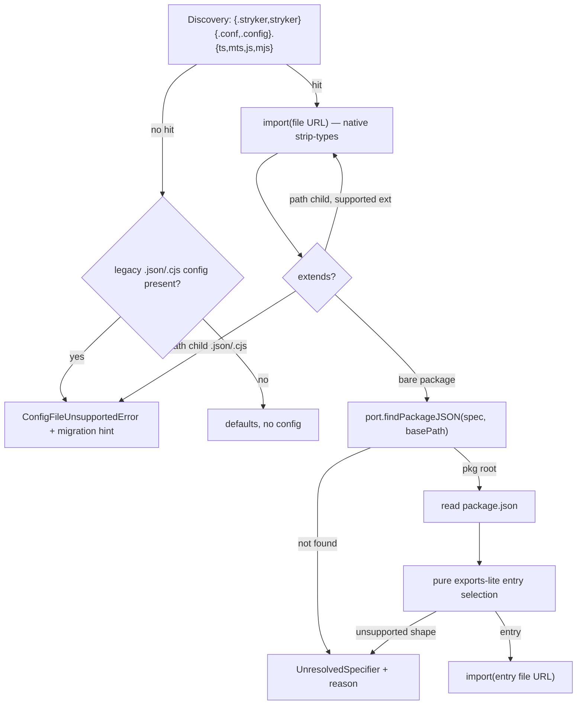
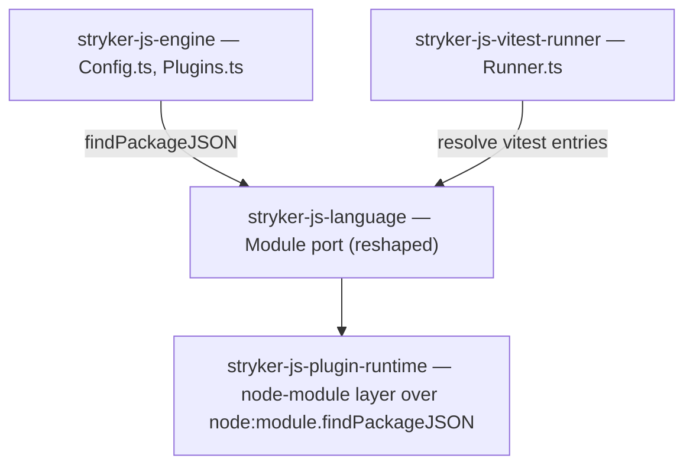

# JS-only config files and ESM plugin resolution - Plan

## Goal Capsule

- **Objective:** Stryker is configured exclusively by a TypeScript or ESM JavaScript config module (`.ts`/`.mts`/`.js`/`.mjs`), and every module stryker loads — configs, `extends` targets, plugins, the vitest runner's own vitest — resolves and imports through Node's ESM module system. A JSON-config project fails fast with migration guidance; no `createRequire`/`require` remains in shipped product code. Verifiable without reading the loader: a `stryker.config.ts` project runs; a JSON-only project exits with class `ConfigError` and migration text; `grep createRequire` over product source is empty.
- **Means:** One consolidated module-import config reader over a `ts`/`mts`/`js`/`mjs` allow-list, and bare-specifier resolution through a reshaped `Module` port (`findPackageJSON`) plus a pure manifest entry-selection workflow feeding dynamic `import()` (KTD3, KTD4).
- **Authority hierarchy:** repo constitution > `STRATEGY.md` > this plan. Where this plan drops upstream stryker JSON-config conventions, the divergence is intentional and recorded under Key Decisions.
- **Stop conditions:** All R-IDs hold and the Verification Contract is green. Stop and escalate if the Node runtime contradicts the planning facts this plan rests on (notably `module.findPackageJSON` semantics, KTD3).
- **Execution profile:** single branch `js-config-files`; six units landing in dependency order as atomic commits; repo gates (`START-1`–`START-5`) close every unit.
- **Who finishes and ships:** the implementing agent via `ce-work`; release/publish stays human-approved per repo boundaries.

---

## Product Contract

### Summary

Drop all support for stryker JSON config files — auto-discovery, explicit `--configFile`, and `extends` chains. Config files become ESM modules (`.ts`, `.mts`, `.js`, `.mjs`) loaded by dynamic import; `.ts`/`.mts` load through Node's native type stripping with no transpiler dependency. Delete every `createRequire`/`require` path from product code: bare plugin specifiers resolve relative to the user's project through a `findPackageJSON`-backed port and load via dynamic `import()`. Breaking change shipped as major bumps with migration notes.

### Problem Frame

The config loader still speaks the CommonJS era. JSON configs cannot express computed or typed configuration, and the loader carries a parallel JSON parse path plus a 16-name discovery list dominated by `json`/`cjs`. Plugin loading runs through `createRequire` — CJS resolution semantics (the `require` exports condition, extension search, `NODE_PATH`), and no path to ESM-only plugin packages. `STRATEGY.md`'s Modern Platform track commits to Node 22+ and TypeScript 7 out-of-the-box by the 2026-10-01 milestone; native `.ts` configs and an ESM-only loader are that commitment's config surface. Upstream stryker supports `stryker.conf.json`; this fork deliberately diverges (KD2) because its plugin model already diverged (process-per-plugin, `file://` worker entries).

### Requirements

**Config format**

- R1. Config auto-discovery searches only `.ts`, `.mts`, `.js`, `.mjs` variants of the stryker config names (`{stryker,.stryker}{.conf,.config}.{ts,mts,js,mjs}`), in a deterministic order.
- R2. An explicit `--configFile` pointing at an unsupported extension (`.json`, `.cjs`, extensionless, or any other) fails with a config error naming the path and the supported extensions; `.json`/`.cjs` additionally get migration guidance.
- R3. When discovery finds no supported config file but a legacy `.json`/`.cjs` stryker config exists in the project, the run fails with a migration error naming the found file — never a silent "no config found" default run.
- R4. Supported config modules load via dynamic import of their file URL; `.ts`/`.mts` load through Node's native type stripping, with no transpiler dependency added.
- R5. A config module whose TypeScript syntax Node's strip-only mode cannot execute (enums, namespaces with runtime code, parameter properties, decorators) fails as a config error carrying erasable-syntax remediation text.
- R6. `extends` chains read child documents through the same module path; a `.json`/`.cjs` child is refused with the same migration error as R2.

**Module loading**

- R7. No shipped package's product code calls `createRequire` or `require`, or publishes them in a port — the vitest runner's vitest loading and bare-package `extends` resolution migrate off `require` with everything else.
- R8. Bare plugin specifiers resolve relative to the user's project (the config base path) — correct under pnpm-style isolation — and the plugin module loads via dynamic `import()` of the resolved entry file URL.
- R9. A bare specifier that cannot be resolved reports as an unresolved specifier with a machine-readable reason (warning at load; prepare-stage selection error when the configured runner/checker has no provider), preserving today's failure flow.
- R10. CommonJS plugin packages are neither detected nor refused; Node's ESM-over-CJS interop is not tested and not documented as working.

### Key Decisions

- KD1. The extension allow-list is `.ts`/`.mts`/`.js`/`.mjs` (session-settled: user-directed — chosen over strictly `.ts`/`.mts`/`.js`: `.mjs` is the explicit-ESM twin of `.js`; keeping `.js` while dropping `.mjs` is inconsistent). Governs R1.
- KD2. Legacy configs fail loudly: an existing `.json`/`.cjs` config with no supported config present is a hard migration error, not a silent default run (session-settled: user-directed — chosen over silently ignoring legacy files: a silent near-miss run after upgrade hides the migration; a pointed error performs it). Governs R2, R3, R6.
- KD3. CJS plugins are passively unsupported: the mechanism is ESM-only, nothing detects or refuses CJS packages, and interop outcomes belong to Node (session-settled: user-directed — chosen over actively refusing CJS plugins: refusal machinery encodes support policy for a stance of non-support). Governs R10.

### Success Criteria

- Zero `createRequire`/`require(` occurrences in product source under `apps/` and `packages/` (test substitutions retire with the port).
- The container e2e lane is green with `.ts` config fixtures, and the only-legacy-JSON scenario exits with class `ConfigError` (code 2) and migration text.

### Acceptance Examples

- AE1. **Covers R1, R4** — Given a project whose only config is `stryker.config.ts` exporting a default object, When the CLI runs, Then the config loads through native type stripping and the run proceeds.
- AE2. **Covers R3** — Given a project whose only stryker config is `stryker.config.json`, When the CLI runs, Then the run fails with exit class `ConfigError` and a message naming the file and the `.ts`/`.mts`/`.js`/`.mjs` migration targets.
- AE3. **Covers R5** — Given a `.ts` config declaring an `enum`, When the CLI runs, Then the failure names the config file and the erasable-syntax-only constraint.
- AE4. **Covers R8** — Given `plugins: ['@systemfsoftware/stryker-js-vitest-runner']` in a pnpm project where the runner is a direct devDependency, When plugins load, Then the specifier resolves from the user's project base and the module imports by entry file URL.
- AE5. **Covers R9** — Given `plugins: ['not-installed-pkg']`, When plugins load, Then a warning reports the unresolved specifier with a reason, and the run fails at prepare only because the configured runner has no provider.
- AE6. **Covers R6** — Given `extends: './base.json'` inside a `.ts` config, When the chain resolves, Then the run fails with the migration error.
- AE7. **Covers R2** — Given `--configFile stryker.conf.json` passed explicitly, When the path validates, Then the run fails with the unsupported-extension error listing the allow-list.

### Scope Boundaries

**In scope:** everything above, including the vitest runner's `createRequire` removal and the reshaped `Module` port.

**Deferred to Follow-Up Work:**

- A JSON→TS config migration codemod. The migration error links docs; no tool ships here.
- Swapping the port's Node implementation to `import.meta.resolve(specifier, parent)` once Node unflags the two-argument form (nodejs/node#61127). The port isolation makes this a zero-engine-change swap by design.
- Supporting the upstream stryker third-party plugin ecosystem, already outside compatibility by the process-per-plugin model.

**Outside this product's identity:** CommonJS support of any kind — CJS configs, CJS plugin loading machinery, or `require`-based resolution. ESM-only is a product stance, not a temporary limitation.

---

## Planning Contract

### Key Technical Decisions

- KTD1. The two parallel config read paths consolidate into one module-import chain. `readConfigChild`/`importJSConfig` and `readConfigFile`/`readModuleConfigFile` are near-duplicates (research: `packages/stryker-js-engine/src/Config.ts:1464-1475` vs `:697-723`); the cutover deletes `readJsonConfig`, `readJsonConfigFile`, `requireJsonObject`, both `'.json'` dispatch arms, and the vestigial exported `DEFAULT_CONFIG_FILE_NAMES` (no consumer; `etc/stryker-js-engine.api.md:140-145`), and `extends` rides the same reader. Cites R1, R4, R6.
- KTD2. A new tagged error `ConfigFileUnsupportedError { file, hint }` (exitClass `ConfigError`) carries R2/R3/R6 — a distinct variant per the constitution's each-error-its-own-variant rule, not a message overload of `ConfigFileNotFoundError`; the `hint` varies by case (allow-list for explicit paths, found-file migration text for discovery, child-path migration text for `extends` children). The NDJSON envelope and exit-code-2 path stay untouched (`packages/stryker-js-cli/src/Envelope.ts` maps by `exitClass`). TS-syntax and import failures stay `ConfigFileUnreadableError` with remediation appended. Cites R2, R3, R5, R6.
- KTD3. Bare-specifier resolution: the `Module` port reshapes to `findPackageJSON(specifier, base)` (Node `node:module`, v23.2.0/v22.14.0), feeding a pure entry-selection step and dynamic `import()` of the entry file URL. `findPackageJSON` throws `ERR_MODULE_NOT_FOUND` on a bare-specifier miss — it does not return undefined (smoke-verified on Node v24.19.0 in this repo) — so the port's Node implementation catches that error and maps it to a refusal; the generic `.code` extractor (`Plugins.ts:189-195`) and `resolutionFailureReason` (`Plugins.ts:211-216`) stay and keep translating misses into machine-readable reasons, while the CJS `require.resolve` call site in `resolveSpecifier` (`Plugins.ts:217-223`) retires. `createRequire`, `ModuleRequire`, and the consumerless `isBuiltin` are deleted outright (session-settled: user-directed — chosen over keeping `createRequire().resolve` as a resolution-only locator: "any form of createRequire in our implementation code should outright die"). The literal directive "plugins resolve via `import.meta.resolve`" cannot hold on stable Node: the two-argument form stays flag-gated on every line as of Sept 2026 (`nodejs.org/api/esm.html` history table carves out `parentURL`; nodejs/node#61127 open), and the one-argument form resolves only from the calling module — under pnpm the engine cannot see the user's plugins from its own location. Cites R7, R8.
- KTD4. Entry selection is an exports-lite pure workflow: manifest JSON in, `Either<entry file, refusal reason>` out. Package-root specifiers resolve through `exports['.']` (string or conditions picking `import` → `node` → `default`, recursing into nested conditional objects — vitest's real `exports` map nests `import`/`require` branches) or legacy `main` (extension required, no probing); subpaths through string exports, simple `./*` patterns, and the same conditions — with `./package.json` universally allowed and resolving to the manifest itself (Node allows it unconditionally, exports map or not), because the vitest version read (KTD6) depends on it. A subpath with no matching `exports` entry refuses, never falling back to a raw file path (the exports map is the encapsulation boundary). Every unsupported shape refuses with a remediation reason surfaced as an unresolved specifier. No reimplementation of full `PACKAGE_EXPORTS_RESOLVE` — this fork's plugin manifests are simple and first-party. A userland full-ESM resolver exists (npm `import-meta-resolve`); rejected as a dependency where first-party manifests need a fraction of the algorithm. Cites R8, R9.
- KTD5. Node engines floor rises to `>=22.18.0` on every participating published package (cli, engine, language, plugin-runtime, vitest-runner): 22.18.0 is where type stripping is default-on and warning-free on the 22.x line (`nodejs.org/api/typescript.html`), `findPackageJSON` needs 22.14+, and `STRATEGY.md`'s "Node 22+" keeps the maintenance-LTS line supportable. CI already proves Node 24. The engines bump ships inside each intent's package list (no separate changeset intent) and is a hard cut on the major, matching the repo's breaking-change convention.
- KTD6. The vitest runner's `createRequire` site (`packages/stryker-js-vitest-runner/src/Runner.ts:645` — the `createRequire` of `vitest/node` inside the user's project, plus its `vitest/package.json` version read) and the `provideService(Module, …)` wiring at `Runner.ts:911-914` both migrate to the same port + `import()` in this change, not deferred: R7 admits no exceptions. Cites R7.
- KTD7. Docs and release: `CONFIG_SYNTAX_HELP` (`Config.ts:1331-1350`) is rewritten to ESM-only examples, dropping the `module.exports` example. Two changeset intents follow `.changeset/stryker-js-plugin-interface-extraction.md` (major bumps, "To migrate…" paragraphs), one per breaking contract so each release reason stands alone: the config-format contract (cli, engine) and the module-loading contract (language, plugin-runtime, vitest-runner). Docs and release completeness are Definition-of-Done criteria, gated by START-5 and review.

### High-Level Technical Design

One resolution pipeline serves configs, `extends`, and plugins; discovery gates format before any read.

The port keeps one owner per host-module capability; nothing else touches `node:module`.

### Implementation Constraints

- Boundary code reads the host module API only through the `Module` port; no `import.meta` or `node:module` import appears in engine feature code beyond the existing 1-argument `import.meta.resolve` manifest reads that resolve relative to the caller's own module.
- Every new decision function is pure (manifest entry selection, extension/discovery dispatch) and lives where the mutation gate sees it.
- `.ts` plugin entries under `node_modules` are refused by Node itself (type stripping excludes `node_modules`); plugin packages must publish JS entries — documented, not worked around.

### Risks

- `findPackageJSON` bare-specifier miss semantics are smoke-verified (throws `ERR_MODULE_NOT_FOUND` on Node v24.19.0; handled per KTD3). Residual uncertainty is limited to exotic subpath/`exports` shapes; the U1 contract suite is the check, and a minimal pure node_modules walk for package-root specifiers is the fallback. Escalate under the Goal Capsule stop condition if neither holds.
- exports-lite may refuse an exotic third-party manifest shape. Accepted: the plugin ecosystem is first-party; refusal carries remediation text (R9).
- Non-erasable TS syntax in user configs has no transform escape — Node 26 removed `--experimental-transform-types` entirely. The error remediation (R5) is the only support path.
- api-extractor report regeneration is flaky under turbo (known pre-existing); rerun `api:update` before treating a red `api:check` as real.

## Implementation Units

### U1. Module port reshaped to findPackageJSON

- **Goal:** The `Module` port exposes `findPackageJSON(specifier, base)`; `ModuleRequire` and `isBuiltin` are gone; the Node implementation wraps `node:module`.
- **Requirements:** R7 (port shape), R8 (enables).
- **Dependencies:** none.
- **Files:** `packages/stryker-js-language/src/Module.ts`, `packages/stryker-js-plugin-runtime/src/node-module.ts`, new `packages/stryker-js-plugin-runtime/tests/node-module.contract.test.ts`, regenerated `packages/stryker-js-language/etc/stryker-js-language.api.md` and `packages/stryker-js-plugin-runtime/etc/stryker-js-plugin-runtime.api.md`, engines fields in both `package.json` files (KTD5).
- **Approach:** Keep the service tag and port location; replace the shape per KTD3/KTD6. Implementation reads `process.getBuiltinModule('node:module')` as today and wraps `findPackageJSON` so a bare-specifier miss surfaces as a refusal, never a raw throw past the port. Resolution semantics: `findPackageJSON` walks `node_modules` upward from the supplied base, matching today's `createRequire(join(basePath, 'package.json'))` behavior — hoisted ancestor deps resolve, and R8's direct-dep guarantee holds. Update the three test layers that substitute `Module` (`packages/stryker-js-engine/tests/plugin-resolution.integration.test.ts:80-98`, `tests/plain-ignorer-loader.integration.test.ts:16-55`, `tests/worker-launcher.integration.test.ts:61-82`) to substitute the new shape where their suites still require the service.
- **Patterns to follow:** current port declaration (`Module.ts:24-27`) and layer (`node-module.ts:29-41`).
- **Test scenarios:** Fake-vs-Real contract suite over the port — the real `nodeModuleLayer` and a fixed-path substitute run the same specifier+base fixtures (hit → manifest path; miss → caught `ERR_MODULE_NOT_FOUND` mapped to a refusal, never a raw throw; scoped and subpath specifiers) and agree pairwise. This suite is also the implementation-time check on the `findPackageJSON` semantics the plan assumes (Risk 1).
- **Verification:** contract suite green against real Node 24; workspace typecheck green; both api reports regenerate; engines fields updated.

### U2. Pure exports-lite entry-selection workflow

- **Goal:** A pure decision turns a plugin/extends manifest plus requested subpath into an entry file or a refusal reason.
- **Requirements:** R8, R9.
- **Dependencies:** none.
- **Files:** new `packages/stryker-js-engine/src/resolve-package-entry.workflow.ts`, new `packages/stryker-js-engine/src/__tests__/resolve-package-entry.workflow.property.test.ts`.
- **Approach:** Follow the house workflow shape — tagged command/decision classes, `Either`/`Result` out, exhaustive match (per KTD4). Inputs: manifest as unknown JSON, requested subpath; outputs: entry (repo-relative file string) or refusal reason enum covering: no `exports` and no `main`, `main` without extension, unsupported `exports` shape, unmatched subpath. Subpath refusal is final — no raw-path fallback (KTD4).
- **Patterns to follow:** `packages/stryker-js-engine/src/plan-plugin-load.workflow.ts` and its property test `src/__tests__/plan-plugin-load.workflow.property.test.ts`.
- **Test scenarios:**
  - String `exports['.']` resolves the root specifier to that entry.
  - Conditional `exports` selection is deterministic: `import` beats `node` beats `default` for every generated key ordering (property).
  - Vitest-shaped nested conditions (`exports['./node']` with nested `import`/`require` objects) resolve through the `import` branch (fixture mirrors the real vitest manifest).
  - Subpath `pkg/sub` matches `exports['./sub']` exactly and `./*` patterns by substitution (property over generated subpaths).
  - Generated invalid manifests (missing `main` and `exports`, extensionless `main`, array/nested-condition shapes outside the supported set) always refuse with a specific reason — refusal is total over the invalid generator (property).
  - Legacy `main` with extension resolves root specifier.
- **Verification:** property suite green under the repo's mutation discipline for workflow files; no I/O imports in the workflow (constitution purity gate).

### U3. Bare-specifier resolution cutover: plugins and extends

- **Goal:** Every bare-specifier resolution — plugin packages and bare-package `extends` targets — goes through the port + entry selection and loads via dynamic `import()` of the entry file URL; `importModule`'s `createRequire` branch is deleted.
- **Requirements:** R7, R8, R9, R10.
- **Dependencies:** U1, U2.
- **Files:** `packages/stryker-js-engine/src/Plugins.ts`, `packages/stryker-js-engine/src/Config.ts` (`importModule`), `packages/stryker-js-engine/src/plan-plugin-load.workflow.ts` (only if resolution result shapes move), `packages/stryker-js-engine/tests/plugin-resolution.integration.test.ts` and `tests/__fixtures__/`, regenerated `etc/stryker-js-engine.api.md` + `etc/plugin-loader.api.md`.
- **Approach:** Replace `resolveSpecifiers`' `createRequire` resolution with port `findPackageJSON` at `join(basePath, 'package.json')`, manifest read, U2 entry selection, and `Path.toFileUrl` for the entrypoint; `loadPlugin` imports the URL and keeps the `strykerPlugins`/`strykerIgnorers`/`strykerValidationSchema` contribution reading untouched. `resolveExtendsSpecifier` (`Config.ts:741-755`) rewires from `createRequire` to the same port + U2 selection, and `importModule` (`Config.ts:444-456`) drops its `createRequire` branch — its remaining caller path builds a file URL, so it reduces to the dynamic import itself — all bare-specifier resolution and require-loading lands in this one unit. `UnresolvedSpecifier` reasons now come from port-miss refusals and entry-selection refusals; `resolutionFailureReason` (`Plugins.ts:211-216`) keeps translating error codes. Preserve the path-prefixed refusal workflow and property law verbatim.
- **Patterns to follow:** existing `resolveSpecifiers`/`loadPlugin` structure; 1-argument `import.meta.resolve` manifest reads stay as they are (they resolve caller-relative).
- **Test scenarios:**
  - Fixture plugin resolves by bare name from the fixture base path and loads by file URL; its `strykerPlugins` descriptors surface (reshaped existing integration suite).
  - Unresolved bare specifier warns with specifier + reason, and a configured-but-unprovided runner fails at prepare with the existing missing-plugin reason (existing gherkin scenarios adapted).
  - Conditional-exports fixture resolves the `import`-branch entry.
  - Path-prefixed specifier refusal property law stays green unchanged.
  - Bare-package `extends` (e.g. `extends: '@scope/shared-stryker-config'`) resolves through the port against the config base path plus U2 entry selection over the resolved manifest, then imports the entry file URL; a conditional-exports variant resolves the `import`-branch entry, and a manifest with neither `exports` nor `main` surfaces an unresolved-specifier reason.
- **Verification:** engine integration + property suites green; `importModule` no longer references `Module`'s require shape; api reports regenerate.

### U4. Config file cutover

- **Goal:** One config reader over the `.ts`/`.mts`/`.js`/`.mjs` allow-list; JSON paths, the duplicate reader, and the vestigial name export are deleted; legacy configs fail with migration guidance.
- **Requirements:** R1, R2, R3, R4, R5, R6 (help text per KTD7).
- **Dependencies:** U3 (bare-package `extends` resolution).
- **Files:** `packages/stryker-js-engine/src/Config.ts`, `packages/stryker-js-engine/src/Config.schema.ts`, new `packages/stryker-js-engine/tests/config-file.integration.test.ts` with fixture configs under `packages/stryker-js-engine/tests/__fixtures__/`, regenerated engine api report, engines field.
- **Approach:** Per KTD1/KTD2: rebuild `SUPPORTED_CONFIG_FILE_NAMES` from `['ts','mts','js','mjs']`; consolidate the two read chains into one module reader used by both the top-level load and `resolveExtends`; after a failed supported-name scan, probe the legacy `json`/`cjs` names and fail with `ConfigFileUnsupportedError`; validate explicit `--configFile` extensions up front; map import failures — including `ERR_UNSUPPORTED_TYPESCRIPT_SYNTAX` — to `ConfigFileUnreadableError` with the erasable-syntax remediation; rewrite `CONFIG_SYNTAX_HELP` to ESM examples. A shadowed legacy config (supported file also present) logs a warning and proceeds.
- **Patterns to follow:** existing `Match` dispatch and tagged-error style (`Config.schema.ts`); gherkin integration style of the engine test suites.
- **Execution note:** Pin the removed capability as refusal tests before deleting the JSON path (constitution: pin the published contract before deleting a path) — the R2/R3/R6 scenarios are that pin.
- **Test scenarios:**
  - `.ts`, `.mts`, `.mjs`, and `.js` fixture configs each load their default export (AE1).
  - Discovery finds the supported file when a legacy `.json` sits beside it, and warns (shadowed-legacy).
  - Only-legacy project fails with `ConfigFileUnsupportedError` naming the file and migration targets (AE2).
  - Explicit `--configFile stryker.conf.json` fails with allow-list + migration hint (AE7); extensionless explicit path fails listing extensions.
  - `extends: './base.json'` fails with the migration error (AE6); `extends: './base.ts'` loads; bare-package `extends` resolves through the port.
  - `.ts` config with an `enum` fails with erasable-syntax remediation (AE3).
  - `.js` config with `export default` in a package without `"type": "module"` loads via syntax detection (documented behavior scenario).
- **Verification:** new integration suite green on Node 24; engine api report regenerates with `SUPPORTED_CONFIG_FILE_NAMES`' new type and `DEFAULT_CONFIG_FILE_NAMES`/`readConfigFile` gone.

### U5. vitest-runner off require

- **Goal:** The vitest runner resolves and imports vitest through the port; its `createRequire` sites and local `Module` construction are gone.
- **Requirements:** R7, R8.
- **Dependencies:** U1, U2.
- **Files:** `packages/stryker-js-vitest-runner/src/Runner.ts`, regenerated runner api report if the service surface moves, engines field.
- **Approach:** Per KTD6: `vitest/node` and related bare specifiers resolve via port `findPackageJSON` against the user's project/sandbox base plus U2 entry selection, then dynamic `import()`; the `provideService(Module, …)` construction at `Runner.ts:911-914` is replaced by the layer-provided reshaped port. Keep the existing caller-relative `import.meta.resolve` manifest reads.
- **Patterns to follow:** U3's cutover shape.
- **Test scenarios:** existing vitest-runner suite stays green (its tests exercise vitest loading end-to-end); no new unit layer — the loading mechanism is covered where it runs.
- **Verification:** `grep createRequire packages/stryker-js-vitest-runner/src` empty; runner suite green.

### U6. e2e conversion, docs, and release intents

- **Goal:** The e2e lane proves the new contract end to end; every user-facing doc states it; breaking changes ship as changeset intents.
- **Requirements:** KTD7 (docs and release contract); end-to-end proof of R1–R6.
- **Dependencies:** U3, U4, U5.
- **Files:** `apps/stryker-js-cli-e2e/testResources/{calc,failing,skew}-fixture/stryker.config.json` → `stryker.config.ts` (3 fixtures), `apps/stryker-js-cli-e2e/testResources/effect-skew-checker/tsdown.config.mjs` (its two `createRequire` sites become direct manifest reads — the skew env dirs name the install roots, so the manifests resolve by path join with no module-resolution machinery; 1-arg `import.meta.resolve` would resolve from the wrong parent), `apps/stryker-js-cli-e2e/AGENTS.md` (E2E-4) + `README.md`, root `README.md`, `apps/stryker-js-cli/README.md`, `packages/ignorers/effect-schema-declarations/README.md` + `packages/ignorers/in-source-vitest-block/README.md`, `packages/stryker-js-engine/schema/stryker-schema.json` (`configFile` description), new `.changeset/*.md` intents (two, per KTD7).
- **Approach:** Fixtures become ESM default-export `.ts` configs (plain objects; journey assertions unchanged — they parse NDJSON outcomes, not config filenames). Docs per KTD7: ESM-only examples, Node `>=22.18.0` note, migration paragraph. Two changeset intents per KTD7 — config-format contract (cli, engine) and module-loading contract (language, plugin-runtime, vitest-runner) — each with `major` bumps and a "To migrate…" section modeled on `.changeset/stryker-js-plugin-interface-extraction.md`.
- **Patterns to follow:** that changeset template; existing README structure.
- **Execution note:** The container e2e lane is the smoke proof for the whole plan — run it before writing the changeset.
- **Test scenarios:** the three converted journeys pass with unchanged NDJSON outcome assertions; the effect-skew journey still builds and packs its plugin bundle.
- **Verification:** all five START gates green (`pnpm format:check`, `pnpm typecheck`, `pnpm test`, `pnpm check:ci`, `./scripts/check-changeset.ts $(git merge-base HEAD origin/main)`) plus the container e2e lane.

---

## Verification Contract

| Gate                 | Command                                                                        | Proves                             |
| -------------------- | ------------------------------------------------------------------------------ | ---------------------------------- |
| START-1 formatting   | `pnpm format:check`                                                            | dprint-clean units                 |
| START-2 types        | `pnpm typecheck`                                                               | port reshape + call-site migration |
| START-3 tests        | `pnpm test`                                                                    | U2–U5 suites, property laws        |
| START-4 build/verify | `pnpm check:ci`                                                                | api reports, package builds        |
| START-5 changesets   | `./scripts/check-changeset.ts $(git merge-base HEAD origin/main)`              | KTD7 release intents               |
| e2e smoke            | container e2e lane (`pnpm lgtm:up` + `pnpm test:e2e`, Node 24)                 | `.ts`-config runs end to end       |
| contract pin         | new config-file integration suite (U4) + reshaped plugin-resolution suite (U3) | R1–R9 incl. legacy refusal         |

`grep -rn "createRequire" apps/ packages/` returning zero hits in product and fixture source (the `.mjs` fixture included — the Goal Capsule's product-source wording governs, not a `*.ts` filter) is the R7 exit check.

## Definition of Done

- Global: all Verification Contract gates green; zero `createRequire`/`require(` in product source; every publishable touched package named in a changeset intent; docs and JSON-schema description updated; api reports regenerated; no throwaway scripts or scaffolding left in the diff; abandoned-attempt code removed.
- Per unit: the unit's **Verification** field holds, in dependency order U1 → U2 → U3/U4/U5 → U6.

## Sources & Research

- Repository inventory (two config read chains, Module port consumers including `packages/stryker-js-vitest-runner/src/Runner.ts:644-646,911-914`, worker-entry `file://` contract, e2e fixtures, changeset gate mechanics, zero existing config tests) — session research agent `RepoPatterns`, grounded at `packages/stryker-js-engine/src/Config.ts`, `packages/stryker-js-engine/src/Plugins.ts`, `packages/stryker-js-language/src/Module.ts`, `scripts/check-changeset.ts`.
- Node runtime matrix — session research agent `NodeFacts` against `nodejs.org/api/esm.html` (`import.meta.resolve` history; non-standard `parentURL` carve-out), `nodejs.org/api/typescript.html` (stripping default at v22.18.0/v23.6.0; stable v24.12.0; unsupported syntax; `node_modules` refusal; transform-types removed v26.0.0), `nodejs.org/api/module.html` (`findPackageJSON` v23.2.0/v22.14.0), `nodejs.org/api/packages.html` (ESM vs CJS resolution differences), `github.com/nodejs/node/issues/61127` (two-arg resolve still experimental), `raw.githubusercontent.com/nodejs/Release/main/README.md` (LTS status Sept 2026).
- `STRATEGY.md` — Modern Platform track (Node 22+, TypeScript 7), machine-first streaming boundary (error envelope invariance), 2026-10-01 milestone.
