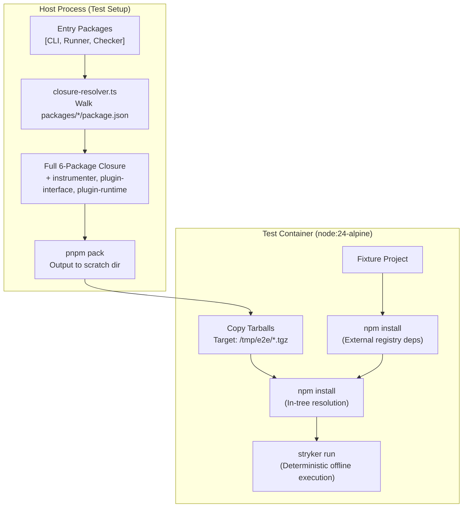

# E2E Workspace Closure Packaging - Plan

## Goal Capsule

- **Objective:** The E2E container lane executes deterministically against local workspace artifacts on every branch and release commit without resolving internal `@systemfsoftware/*` packages from public npm.
- **Means:** Dynamically discover the production workspace dependency closure starting from the CLI and plugin packages, pack tarballs for all packages in the closure, and install all closure tarballs together into the container fixtures (KTD1, KTD2).
- **Authority:** This plan refines KD2 of `docs/plans/2026-09-16-0011-feat-stryker-cli-e2e-lane-plan.md` (direct tarball installs).
- **Stop conditions:** All implementation units pass and the Verification Contract gates pass; unreleased version simulation succeeds without querying public npm.
- **Execution profile:** Standard implementation, one branch, dependency-ordered units U1→U4; the implementing agent finishes and ships.

---

## Product Contract

### Summary

The containerized E2E test lane currently packs only three top-level packages (`@systemfsoftware/stryker-js`, `@systemfsoftware/stryker-js-vitest-runner`, and `@systemfsoftware/stryker-js-typescript-checker`). Transitive internal workspace dependencies (such as `@systemfsoftware/stryker-js-plugin-interface`, `@systemfsoftware/stryker-js-plugin-runtime`, and `@systemfsoftware/stryker-js-instrumenter`) are left out of the packed tarball set and are resolved by `npm` from the public registry. During release merges, newly bumped package versions do not yet exist on npm, causing `npm error code ETARGET` failures.

This plan makes the E2E harness self-contained by traversing internal `workspace:` dependencies in-process, building and packing tarballs for the full transitive production closure, and installing all closure tarballs in each fixture's container environment.

### Problem Frame

When `chore(release): version packages` merges to `main`, the `e2e` CI job races against the `release` workflow. Because `pnpm pack` rewrites `workspace:^` dependencies to explicit version ranges (e.g. `^7.1.0`), and because the fixture container only installs the three entry tarballs, `npm install` inside the container attempts to fetch unpublished versions of internal dependencies from npmjs.com.

This failure is structural: any release commit or pull request introducing an unreleased internal package version will fail in the E2E lane. Emulating a full registry via Verdaccio adds unnecessary container orchestration, network latency, and complexity without eliminating the need to pack all packages. A self-contained multi-tarball install preserves direct tarball testing while making the suite immune to registry publish timing.

### Key Decisions

- KD1. In-process dependency traversal (session-settled: user-directed — chosen over `turbo query` and `pnpm ls`: an in-process filesystem walk across `packages/*/package.json` executes in <1ms, requires no external CLI binaries, and accurately isolates production `workspace:` dependencies from internal development tooling). Governs R1, R2.
- KD2. Direct multi-tarball container installation (session-settled: user-directed — chosen over spinning up an ephemeral Verdaccio container: Verdaccio still requires packing every workspace package, introduces container networking complexity, and contradicts the established KD2 direct-tarball design in `docs/plans/2026-09-16-0011-feat-stryker-cli-e2e-lane-plan.md`). Governs R3, R4.
- KD3. Automatic closure derivation from entry roots (session-settled: user-approved — chosen over maintaining a hardcoded static package list: as the monorepo evolves and packages are split or added, the harness automatically includes all required internal packages without manual maintenance). Governs R1.

### Destructive Review & Assumptions

- **Assumptions Surfaced:**
  1. _Traversability:_ All runtime monorepo dependencies needed by the fixtures declare explicit `workspace:` specs under `dependencies` or `peerDependencies` in their respective `package.json`.
  2. _Sibling Tarball Co-Installation:_ `npm install` given multiple `.tgz` tarballs in a single invocation resolves inter-package semver requirements directly against the co-installed tarballs without falling back to the public registry.
  3. _Zero DevTooling Leakage:_ In-process manifest traversal can cleanly filter out root configurations, ignore packages, and build tooling by restricting traversal to packages with `private !== true` residing directly in `packages/*`.
- **Mutation Lens Applied:** Edge-First (focusing on build ordering, topological packing, and skew test variants).
- **Remediations Incorporated:**
  - Topological build: Packaging must ensure packages in the closure are built in topological order (or via turbo's existing `dependsOn: ["^build"]`) so that packed tarballs never package unbuilt or stale `dist/` artifacts.
  - Skew compatibility: Fixtures requiring distinct or skew package versions (e.g. effect skew checker) must append their custom tarballs to the install command without clobbering the core closure.

### Test Layer Selection & Admission Gate

- **Admitted Tests:**
  - _Pure Logic / Unit:_ `test/e2e/tests/closure-resolver.test.ts` — in-process unit test verifying that `resolveWorkspaceClosure` correctly produces the expected 6 production packages given the monorepo manifests.
  - _E2E Seam Test:_ `test/e2e/tests/typescript-checker.e2e.test.ts` & `mutation-run.e2e.test.ts` — containerized end-to-end journey verifying that the packed CLI and closure tarballs execute real mutation runs cleanly in a clean container without public registry access for `@systemfsoftware/*`.
- **Refused Tests:**
  - Spawning Docker containers or child-process CLI runs within in-process unit/integration test suites (violates Test Layer In-Process Admission Gate; container executions remain restricted to `test/e2e`).

### Requirements

**Closure Discovery and Packaging**

- R1. The E2E test harness must dynamically compute the transitive workspace dependency closure starting from the root test packages (`@systemfsoftware/stryker-js`, `@systemfsoftware/stryker-js-vitest-runner`, and `@systemfsoftware/stryker-js-typescript-checker`).
- R2. Closure traversal must only follow production dependencies and peer dependencies targeting `workspace:` packages, excluding development tooling (such as toolchain configs and test runners).
- R3. The harness must build and pack tarballs for all packages in the discovered closure into the test scratch directory in topological order.

**Container Fixture Installation**

- R4. All generated closure tarballs must be copied into the container environment.
- R5. When installing fixture dependencies, the container harness must pass all closure tarball paths in the `npm install` command so that inter-package dependencies resolve directly from local tarballs without querying the public registry.
- R6. Additional test-specific tarballs (such as skew checkers) must continue to be accepted and installed alongside the workspace closure.

### Key Flows

- F1. E2E Environment Initialization
  - **Trigger:** Test suite execution (`pnpm test:e2e`).
  - **Actors:** Vitest test runner, container environment harness (`test/e2e/tests/__fixtures__/container-environment.ts`), Node container.
  - **Steps:**
    1. Harness reads workspace manifests under `packages/*/package.json`.
    2. Harness recursively discovers all `workspace:` dependencies reachable from the entry packages.
    3. Harness runs `pnpm build` and `pnpm pack` for each package in the closure.
    4. Harness starts the `node:24-alpine` test container and copies all packed tarballs into `/tmp/e2e`.
  - **Covered by:** R1, R2, R3, R4.

- F2. Fixture Installation
  - **Trigger:** An E2E test invokes `installFixture(fixtureUrl, fixtureName)`.
  - **Actors:** Test fixture runner, container shell.
  - **Steps:**
    1. Harness copies the fixture project directory into the container work root.
    2. Container runs `npm install` to resolve external third-party registry dependencies (e.g. `vitest`, `effect`).
    3. Container runs `npm install <all-closure-tarballs>` to install the CLI and all workspace packages.
    4. npm resolves internal `@systemfsoftware/*` dependencies directly from the provided local tarballs without contacting npmjs.com.
  - **Covered by:** R5, R6.

### Acceptance Examples

- AE1. Full closure discovery
  - **Covers:** R1, R2
  - **Given:** Root packages `stryker-js`, `stryker-js-vitest-runner`, and `stryker-js-typescript-checker`.
  - **When:** Closure discovery runs on the workspace.
  - **Then:** The resulting package set contains exactly `stryker-js`, `stryker-js-vitest-runner`, `stryker-js-typescript-checker`, `stryker-js-instrumenter`, `stryker-js-plugin-interface`, and `stryker-js-plugin-runtime`, with zero toolchain or private packages.

- AE2. Unpublished version installation in container
  - **Covers:** R3, R4, R5
  - **Given:** Workspace packages bumped to unreleased versions not present on npmjs.com (e.g. `plugin-interface@99.0.0`).
  - **When:** `installFixture` runs inside the container.
  - **Then:** `npm install` succeeds with exit code 0, and all `@systemfsoftware/*` packages in `node_modules` match the local workspace versions.

### Scope Boundaries

- **In scope:**
  - Dynamic closure resolution logic in `test/e2e/tests/__fixtures__/container-environment.ts`.
  - Packaging and copying all closure tarballs into the container.
  - Passing all closure tarballs to fixture `npm install` invocations.
  - Unit/smoke verification proving local dependency resolution without registry access.

- **Out of scope:**
  - Mocking external third-party dependencies (`vitest`, `effect`, etc.) — external packages continue to install from npmjs.com.
  - Modifying the GitHub Actions workflow triggers or release workflow.
  - Introducing local registry servers (Verdaccio or similar).

---

## Planning Contract

### Key Technical Decisions

- KTD1. Pure file-system closure resolution (session-settled: user-directed — chosen over `turbo query` and `pnpm ls`). The helper inspects `packages/*/package.json`, checks `private !== true`, and recursively follows `dependencies` and `peerDependencies` that start with `workspace:` or match an existing workspace package. Benchmarked at 0.61ms with zero external child processes. Governs R1, R2.
- KTD2. Unified multi-tarball installation command. In `installFixture`, `npm install` is invoked with all tarball paths in a single command (`npm install ...closureTarballs ...extraTarballs`). This causes npm to place all packages into `node_modules` simultaneously, satisfying sibling semver ranges locally without querying npmjs.com for `@systemfsoftware/*`. Governs R4, R5, R6.
- KTD3. Separation of pure closure algorithm into standalone module (`closure-resolver.ts`). This allows unit-testing the graph resolution in-process under Vitest (`closure-resolver.test.ts`) without requiring Docker or testcontainers. Governs R1, R2.

### High-Level Technical Design

### Assumptions

- The repository layout places public workspace packages under `packages/<package-name>/package.json`.
- Each package in the workspace defines its dependencies on other workspace packages via `workspace:^` or `workspace:*`.
- Internal build tooling and configuration packages reside in `packages/toolchain/*` and are marked with `private: true` or do not appear in runtime `dependencies`/`peerDependencies`.

### Risks & Dependencies

- **Tarball size and packaging duration:** Packing 6 packages instead of 3 adds ~300ms to test setup. This is negligible compared to Docker container startup (~3-5s) and `npm install` inside the container.
- **npm deduplication behavior:** Verified via live prototype that npm 10+ satisfies range requirements from explicitly passed sibling tarballs without failing `ETARGET`.

### Sequencing

- U1 must land first: provides the pure `resolveWorkspaceClosure` module and its unit test.
- U2 builds on U1: updates `container-environment.ts` to pack and copy all closure tarballs into the container.
- U3 completes the integration: updates `installFixture` to install all closure tarballs in the container.
- U4 runs verification: runs unit tests, typechecks the workspace, formats code, and performs mock offline install verification.

---

## Implementation Units

### U1. Pure In-Process Workspace Closure Resolver

- **Goal:** Create a pure, reusable TypeScript helper to compute the transitive workspace dependency closure starting from a set of entry packages.
- **Requirements:** R1, R2.
- **Dependencies:** None.
- **Files:**
  - Create: `test/e2e/tests/__fixtures__/closure-resolver.ts`
  - Create: `test/e2e/tests/closure-resolver.test.ts`
- **Approach:**
  1. Implement `resolveWorkspaceClosure(entryPackages: readonly string[], repoRoot: string): Promise<readonly string[]>`.
  2. Scan `packages/` directory for subdirectories containing `package.json`.
  3. Filter out directories where `private === true` or manifest is missing.
  4. Perform breadth-first traversal from `entryPackages`, checking `manifest.dependencies` and `manifest.peerDependencies`.
  5. If dependency value starts with `workspace:` or matches a known workspace package, add to queue.
  6. Return sorted array of unique package names.
- **Test Scenarios:**
  - _Happy path (AE1):_ Resolving closure for `['@systemfsoftware/stryker-js', '@systemfsoftware/stryker-js-vitest-runner', '@systemfsoftware/stryker-js-typescript-checker']` returns all 6 packages: `stryker-js`, `stryker-js-vitest-runner`, `stryker-js-typescript-checker`, `stryker-js-instrumenter`, `stryker-js-plugin-interface`, `stryker-js-plugin-runtime`.
  - _Toolchain filtering:_ Config packages (`packages/toolchain/*`) and ignore packages are excluded from the result.
  - _Cycle handling:_ Monorepos with circular peer dependencies terminate without infinite loops.
- **Verification:** Unit test passes under `pnpm --filter @systemfsoftware/stryker-e2e test` or `pnpm exec vitest run test/e2e/tests/closure-resolver.test.ts`.

### U2. Container Environment Closure Packaging

- **Goal:** Update the container environment setup to resolve the closure dynamically, build and pack all closure packages, and copy them into the container.
- **Requirements:** R3, R4.
- **Dependencies:** U1.
- **Files:**
  - Modify: `test/e2e/tests/__fixtures__/container-environment.ts`
- **Approach:**
  1. Import `resolveWorkspaceClosure` in `container-environment.ts`.
  2. In `packWorkspacePackages(directory: string)`:
     - Compute `closurePackages = await resolveWorkspaceClosure(ENTRY_PACKAGES, REPO_ROOT)`.
     - Build each package in topological order using `pnpm --filter <pkg> build`.
     - Pack each package into `directory` using `pnpm --filter <pkg> pack --pack-destination <directory>`.
     - Return map of all packed packages keyed by package name.
  3. Update `copyTarballs` to copy all closure tarballs into `/tmp/e2e` in the container.
- **Test Scenarios:**
  - _Packaging:_ All 6 closure tarballs are packed into the temporary scratch directory.
  - _Container copying:_ All 6 tarballs exist in `/tmp/e2e` inside the container after initialization.
- **Verification:** Scratch directory contains 6 `.tgz` archives matching the closure.

### U3. Fixture Installation with Full Closure Tarballs

- **Goal:** Update `installFixture` to pass all closure tarball paths in the container `npm install` invocation.
- **Requirements:** R5, R6.
- **Dependencies:** U2.
- **Files:**
  - Modify: `test/e2e/tests/__fixtures__/container-environment.ts`
- **Approach:**
  1. In `installFixture`, construct the tarball installation argument list from all closure tarballs stored in `packedPackages`.
  2. Append any `extraTarballs` passed by specific tests (e.g. skew checker).
  3. Execute `npm install ...tarballPaths` in the fixture directory.
- **Test Scenarios:**
  - _Co-installation (AE2):_ Fixture installation succeeds even when workspace packages declare unreleased versions.
  - _Skew support:_ Fixtures with `extraTarballs` (e.g. `mixed-effect-versions.e2e.test.ts`) install the skew tarball alongside the closure.
- **Verification:** Fixture `npm install` succeeds without contacting registry for `@systemfsoftware/*`.

### U4. Repository Verification & Compliance Gates

- **Goal:** Ensure all workspace code adheres to repository quality standards, formatting, typechecking, and changeset requirements.
- **Requirements:** R1, R2, R3, R4, R5, R6.
- **Dependencies:** U1, U2, U3.
- **Files:**
  - Modify: `test/e2e/package.json` (add unit test script if needed)
- **Approach:**
  1. Run `pnpm format` to match dprint formatting.
  2. Run `pnpm typecheck` across all workspace packages.
  3. Verify that changes in `test/e2e` do not violate boundaries or require unexpected changesets.
  4. Run host prototype verification simulating unreleased version install.
- **Test Scenarios:**
  - `pnpm format:check` passes with zero violations.
  - `pnpm typecheck` passes with zero errors.
  - Unit test `closure-resolver.test.ts` passes.
- **Verification:** All repository gates in `Definition of Done` pass.

---

## Verification Contract

| Check / Command                                                | Scope      | Pass Criteria                                                          |
| -------------------------------------------------------------- | ---------- | ---------------------------------------------------------------------- |
| `pnpm exec vitest run test/e2e/tests/closure-resolver.test.ts` | Unit       | Closure resolution returns exactly the 6 production workspace packages |
| `pnpm format:check`                                            | Repository | dprint formatting passes cleanly across the workspace                  |
| `pnpm typecheck`                                               | Repository | TypeScript compiler emits zero type errors                             |
| Host tarball install simulation                                | Fixture    | `npm install` of packed closure succeeds locally in scratch project    |

---

## Definition of Done

- [ ] All 6 production workspace packages are dynamically discovered and packed by the E2E harness.
- [ ] Container fixtures install all closure tarballs in a single command, preventing ETARGET release races.
- [ ] In-process unit test `closure-resolver.test.ts` passes and gates the closure discovery logic.
- [ ] Code formatting matches dprint (`pnpm format:check`).
- [ ] Workspace typecheck passes (`pnpm typecheck`).
- [ ] Clean cutover: no temporary test scripts or scratch files left in git status.
