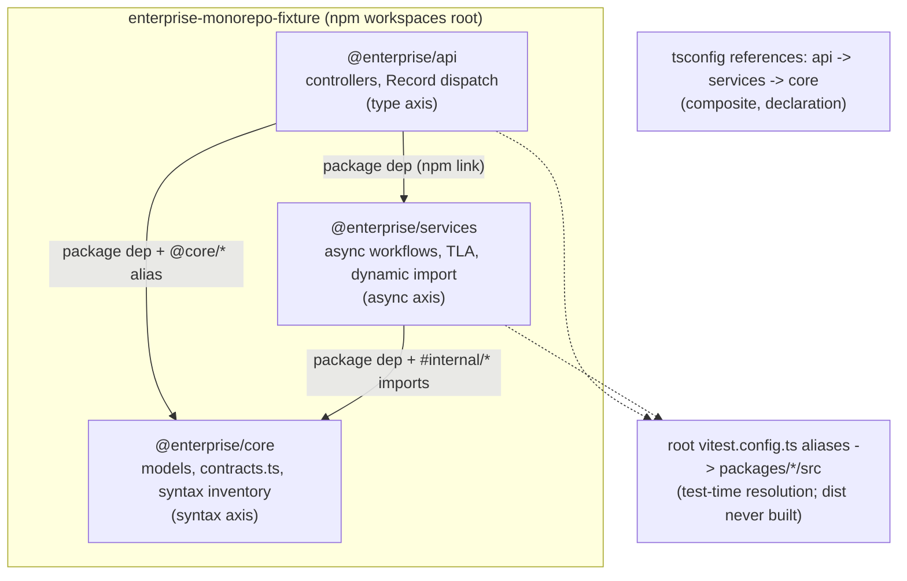
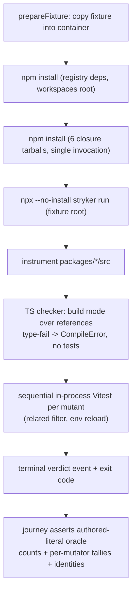

# SOTA Enterprise Monorepo E2E Fixture - Plan

## Goal Capsule

- **Objective:** The E2E container test suite validates that the shipped Stryker CLI, instrumenter, checker, and runner execute deterministically against real-world production TypeScript monorepo codebases—covering composite project references, path aliases, async mock/runner lifecycles, and modern language syntax idioms—without crashes, dropped mutants, or unhandled errors.
- **Means:** Author an interconnected 3-package enterprise monorepo fixture in `test/e2e/testResources/enterprise-monorepo-fixture/` and a dedicated container journey in `test/e2e/tests/enterprise-monorepo.e2e.test.ts` asserting an exact mathematical mutant count oracle against the machine-mode event stream in the pinned container environment (KD1, KD3; KTD1–KTD7 instantiate).
- **Authority hierarchy:** This plan > `test/e2e/AGENTS.md` (rules E2E-1 through E2E-6) > `CONSTITUTION.md` (CONST-T8, CONST-T10, CONST-T15, CONST-E9).
- **Stop conditions:** The enterprise fixture and container journey are complete, the container execution passes with exit code 0 under the configured test timeout, and all mutant statuses match the authored mathematical oracle.
- **Execution profile:** Standard implementation, one branch, dependency-ordered units; implementing agent finishes and ships.

---

## Product Contract

_Product Contract unchanged (R8's mutator tally list read as a floor, not a ceiling — see KTD3; the cross-package compile-error vehicle is specified in KTD4)._

### Summary

Replace toy-level synthetic fixtures with an exhaustive enterprise monorepo fixture and container journey modeling real-world production constraints across four core dimensions: TypeScript composite project references and module resolution, async test runner concurrency and mock lifecycles, monorepo configuration orchestration, and idiomatic JavaScript/TypeScript syntactic constructs (including negated member accesses, optional chains, computed properties, assignments, dynamic imports, and top-level await). The journey drives the packed CLI in the container and asserts strict mutant tallies against the machine-mode event stream.

### Problem Frame

Current E2E test resources (`calc-fixture`, `failing-fixture`, `typescript-checker-fixture`) test trivial math calculations or isolated synthetic type definitions. They leave massive blindspots across production language and architecture patterns:

1. **Syntactic Idioms & Placement Seams:** Real code ubiquitously uses negated property accesses (`!config.enabled`, `!obj.prop`), optional member accesses (`!item?.active`), computed accesses (`!map[key]`), and compound assignments. Toy fixtures use primitive arithmetic literals (`a + b`), so instrumenter mutant placement bugs on common expressions escape detection entirely.
2. **TypeScript Composite Architecture:** Production monorepos rely on multi-package tsconfig project references (`composite: true`, `references: [...]`, declaration emit, path aliases). The test suite does not exercise cross-package declaration boundary mutations where mutating an upstream exported interface or type contract forces downstream compilation errors.
3. **Async Test Execution & Concurrency:** Real services use async lifecycles (`async/await`, timers, promises), module mocking (`vi.mock`, `vi.spyOn`), and unhandled rejection traps across worker processes. Existing fixtures run synchronous or trivial tests.
4. **Workspace Packaging & Modern Runtimes:** Real projects feature multi-package workspace structures with internal dependencies, subpath exports, top-level await, and dynamic imports (`await import(...)`).

A comprehensive, realistic fixture grounds the E2E suite in production realities and guarantees that real-world language patterns are actively validated before release.

### Key Decisions

- KD1. **Dedicated Enterprise Multi-Package Fixture & Journey** (session-settled: user-directed — chosen over multi-fixture fragmentation: keeps all interconnected production concerns inside a single realistic monorepo architecture, preserving existing smoke tests for baseline checks). Governs R1, R2, R3, R4, R5, R6, R7, R8.
- KD2. **Four-Axis Production Complexity Scope** (session-settled: user-directed — chosen over partial coverage: exhaustively combines composite tsconfigs, async mocking, workspace configuration, and modern runtime idioms). Governs R2, R3, R4, R5, R6.
- KD3. **Full Mutation Run with Strict Mathematical Oracle** (session-settled: user-directed — chosen over sliced PR runs or behavioral-only assertions: enforces rule E2E-2 by asserting exact, hand-authored literal tallies for all mutant statuses—killed, survived, and compile errors). Governs R7, R8.

### Requirements

#### Fixture Monorepo Architecture & Packaging

- R1. The fixture must be structured under `test/e2e/testResources/enterprise-monorepo-fixture/` as a multi-package workspace declaring standard root workspaces (`"workspaces": ["packages/*"]`), containing three interdependent packages:
  - `@enterprise/core`: Domain models, pure utility helpers, custom schemas, and shared type contracts.
  - `@enterprise/services`: Business logic, async workflows, service clients with dynamic imports, and top-level await.
  - `@enterprise/api`: Application entry point/controller layer importing services and core via package exports and path aliases.
- R2. The workspace must implement TypeScript composite project references across all three packages (`composite: true`, `declaration: true`, `references: [...]` linking `api -> services -> core`), declaration maps, and subpath exports maps (`"exports": { "./*": "./dist/*" }`).
- R3. The workspace must define path aliases (including `@core/*` and `#internal/*`) resolved through tsconfig `paths` and package imports, ensuring the TypeScript checker and instrumenter correctly handle non-relative module specifiers across package boundaries.

#### Exhaustive Language & Syntactic Pattern Coverage

- R4. The fixture source code across the three packages must exhaustively incorporate the following idiomatic language constructs within mutated code paths:
  - **Negated Member Expressions:** Expressions of the form `!obj.property`, `!this.active`, and `!opts.enabled`, exercising prefix negation over static member accesses.
  - **Optional Chaining & Computed Members:** Expressions of the form `!item?.valid`, `config?.options?.enabled`, and `!record[key]`, exercising member resolution and mutant placers across safe access chains.
  - **Assignment & Update Expressions:** Statements and expressions involving compound assignments (`x += y`, `status = !status`) and update operators (`++count`, `index++`).
  - **Logical Operators & Binary Expressions:** Complex boolean conditions combining `&&`, `||`, `??`, `===`, `!==`, `<`, and `>=`.
  - **Modern Module & Runtime Idioms:** Top-level await in service initialization, dynamic module imports (`await import(...)`), and object/array destructuring with default parameters.

#### Test Execution, Mocking & Concurrency

- R5. The fixture's test suites must execute under Vitest and exhaustively exercise:
  - **Async Test Lifecycles:** Asynchronous test cases using `async/await`, `beforeEach`/`afterEach` async cleanup, and timer delays.
  - **Module and Function Mocking:** Realistic test mocks using `vi.mock(...)` for external boundaries, `vi.spyOn(...)` for internal service calls, and mock restoration across test boundaries.
  - **Multi-Worker Isolation:** Multi-file test suites executed across Stryker worker processes, asserting that mutants in shared dependencies do not bleed state across test workers.

#### Monorepo Configuration Orchestration

- R6. The fixture must define a monorepo root `stryker.config.ts` that coordinates workspace mutation testing:
  - Points to the root composite `tsconfig.json`.
  - Configures explicit `mutate` glob patterns targeting source files across the workspace packages (`packages/*/src/**/*.ts`).
  - Loads both `@systemfsoftware/stryker-js-typescript-checker` and `@systemfsoftware/stryker-js-vitest-runner` from local container tarballs.

#### E2E Container Journey & Mathematical Oracle

- R7. A dedicated container journey (`test/e2e/tests/enterprise-monorepo.e2e.test.ts`) must:
  - Install all workspace closure tarballs alongside fixture dependencies in the pinned Alpine container via the container harness.
  - Execute `stryker run` from the fixture root with an explicit test timeout scaled for multi-package compilation and execution.
  - Parse the machine-mode event stream from stdout.
  - Assert that the run completes with exit code 0, emits no unhandled socket or rejection warnings, and terminates with a single `verdict` event.
- R8. The journey must assert an exact, hand-authored literal oracle (per rule E2E-2) specifying:
  - Total mutants generated.
  - Killed mutant count.
  - Survived mutant count.
  - Compile error / type-error mutant count (verifying that invalid mutations across project references are classified by the TypeScript checker without running tests).
  - Mutator status tally covering ArithmeticOperator, BooleanLiteral, BlockStatement, ConditionalExpression, EqualityOperator, and LogicalOperator.

### Key Flows

- F1. Enterprise Monorepo Mutation Testing Journey
  - **Trigger:** Vitest executes `test/e2e/tests/enterprise-monorepo.e2e.test.ts`.
  - **Actors:** Container test harness, Alpine container, packed Stryker CLI, TypeScript checker plugin, Vitest runner plugin.
  - **Steps:**
    1. Harness copies workspace closure tarballs and `testResources/enterprise-monorepo-fixture` into the container environment.
    2. Container installs the package closure tarballs and workspace dependencies via `npm install`.
    3. Stryker CLI executes against the enterprise fixture root using the root `stryker.config.ts`.
    4. Instrumenter transforms source files across all three packages, placing mutants on boolean literals, negated member expressions, arithmetic operators, and conditional blocks.
    5. TypeScript checker validates composite project references and classifies typecheck mutant candidates across packages without running tests.
    6. Stryker worker processes execute Vitest test runs concurrently across mutated code, exercising async test suites and mock hooks.
    7. CLI emits machine-mode stream ending with a terminal `verdict` event.
    8. Test asserts exit code 0, absence of socket warnings, and exact mathematical tally against the authored literal oracle.
  - **Covered by:** R1, R2, R3, R4, R5, R6, R7, R8.

### Scope Boundaries

#### In Scope

- Creation of `test/e2e/testResources/enterprise-monorepo-fixture/` with 3 interconnected packages (`core`, `services`, `api`).
- Composite project reference setup, path aliases (`@core/*`, `#internal/*`), and declaration emit.
- Source code implementing negated member accesses, optional chains, computed properties, compound assignments, dynamic imports, and top-level await.
- Async Vitest test suites with mocks, spies, and async hooks.
- Monorepo root `stryker.config.ts`.
- Container journey file `test/e2e/tests/enterprise-monorepo.e2e.test.ts`.
- Hand-authored mathematical mutant count oracle adhering to rule E2E-2.

#### Out of Scope

- Deleting existing smoke test fixtures (`calc-fixture`, `typescript-checker-fixture`) — retained for fast regression checks.
- HTML report visual regression testing (owned by dedicated reporting lanes).
- Modifying GitHub Actions workflow files directly (evaluator surface, CONST-E9).

### Acceptance Examples

- AE1. Negated Member Expression Mutation & Placement
  - **Covers:** R4, R7, R8
  - **Given:** Source code in `@enterprise/services` containing negated property checks (e.g. `if (!config.enabled) return null`).
  - **When:** Stryker instruments the file and applies the `BooleanLiteral` mutator to strip the negation (`config.enabled`).
  - **Then:** The instrumenter places the mutant cleanly without throwing placement errors, and the Vitest test runner executes the mutated code to kill the mutant.

- AE2. Cross-Package TypeScript Checker Compile Error Classification
  - **Covers:** R2, R4, R8
  - **Given:** `@enterprise/api` importing an exported interface or function from `@enterprise/core`.
  - **When:** Stryker mutates an exported return type or parameter signature in `@enterprise/core` that breaks type compatibility in `@enterprise/api`.
  - **Then:** The TypeScript checker classifies the mutant as a compile error / type error, recording it in the mutant tally without invoking test runner workers.

- AE3. Concurrent Async Test Execution with Module Mocks
  - **Covers:** R5, R7, R8
  - **Given:** Async test suites in `@enterprise/services` using `vi.mock` for external I/O and async delays.
  - **When:** Stryker executes mutant test runs concurrently across worker processes.
  - **Then:** Mock isolation is preserved across test runs, zero unhandled rejections occur, and all mutants covered by tests are deterministically killed.

- AE4. Exact Mathematical Oracle Verification
  - **Covers:** R7, R8
  - **Given:** The full enterprise monorepo fixture mutation run in the container.
  - **When:** The run reaches the terminal `verdict` event.
  - **Then:** The parsed event stream matches the exact hand-authored literal counts for killed, survived, compile error, and per-mutator tallies.

---

## Planning Contract

### Key Technical Decisions

- KTD1. **Source resolution at test time via root vitest aliases; no dist build in the journey** (session-settled: user-approved — chosen over adding a `tsc -b` build step: the mutation pipeline never consumes dist, and a build stage would add container time without exercising the contract). The fixture root `vitest.config.ts` maps `@enterprise/*`, `@core/*`, and `#internal/*` to `packages/*/src` entry points; tsconfig `paths` mirror the same mapping for the checker. Subpath exports (`./*` → `./dist/*`, per R2) stay declared on the packages for realism but are never resolved at test time. This closes the dry-run break where nothing builds `dist` and cross-package imports would fail: the vitest runner's alias shim reads only sandbox-root exports and tsconfig paths, so the aliases are the load-bearing resolution edge. Governs R1, R2, R3, R5.
- KTD2. **npm-installable manifests: plain semver inter-package ranges, registry-only devDependencies at the workspaces root.** The container installs with npm, which rejects the `workspace:` protocol (`Unsupported URL Type 'workspace:'`, npm/cli#8845); inter-package dependencies therefore use plain ranges (`"@enterprise/core": "1.0.0"`). devDependencies (vitest, typescript, `@types/node`) live on the workspaces root so npm hoists them within reach of every package's tests; no `@systemfsoftware/*` entry appears in any fixture manifest (closure tarballs supply them — registry resolution of a stryker package is the ETARGET failure class). Governs R1, R6, R7.
- KTD3. **Oracle completeness: every fired mutator is tallied; the six R8 mutators are the required floor** (session-settled: user-approved — chosen over restricting fixture source so only the six can fire: R4's optional chains, compound assignments, and update operators necessarily fire OptionalChaining, AssignmentOperator, and UpdateOperator mutants, and a strict oracle must pin them rather than leave an unpinned residue). The authored oracle pins per-mutator tallies for every mutator that fires — the six named in R8 plus the additional ones R4's constructs produce — and the journey asserts the identity total = Σ tallies plus exact `verdict.counts`. Instantiates KD3 (governs R7, R8); preserves E2E-2's authored-literal discipline. The input space is fixed and authored (the fixture source), so a hand-authored inventory oracle is the correct shape — a generated property adds nothing over an enumerated input (software-wiki synthesis "properties-versus-oracles": the deciding variable is input-space structure).
- KTD4. **Cross-package CompileError vehicle: an isolated literal-contracts module in core, consumed by api's dispatch module** (session-settled: user-approved — chosen over signature-level mutation: instrumenter mutators rewrite expressions, never type annotations, so the literal-type route is the only vehicle that realizes AE2's classification outcome). AE2's "mutates an exported return type or parameter signature" is realized by mutating string-literal values that feed exported literal types: `packages/core/src/contracts.ts` exports an `as const` severity/feature-flag map, and `packages/api` keys a `Record<Severity, Handler>` dispatch table on its literal union — a mutated literal in the contracts module changes the exported type and fails api's composite typecheck without running tests. The vehicle lives in one auditable file so a CompileError tally mismatch has exactly one candidate site class, distinct from value-level StringLiteral mutants that get Killed. AE2's Then (checker classifies as compile error, no runner workers) holds via this vehicle. Governs R2, R4, R8.
- KTD5. **Exit-0 determinism: thresholds left at default (`break: null`).** The run must exit 0 while survived mutants exist, which any positive `thresholds.break` would forbid (exit codes publish through the runtime teardown; a threshold violation is a stamped failure). The fixture config omits thresholds and the journey asserts `verdict.thresholds.break === null`, mirroring `test/e2e/tests/mutation-run.e2e.test.ts`. Governs R7.
- KTD6. **Journey mirrors the mutation-run skeleton with a scaled timeout and a bounded mutant budget.** Parse stdout via `RunEventWireLine` (precedent: `mutation-run.e2e.test.ts` decodes the published wire contract; the plain-JSON variant from `mixed-effect-versions.e2e.test.ts` is the fallback if review reads E2E-3 strictly); assert terminal-single-verdict, no ANSI escapes, no `worker.sock` warning, runId consistency. The vitest runner is sequential in-process (`maxWorkers 1`) with an environment reload per mutant, so wall-clock scales with mutant count: the journey sets an explicit per-test timeout scaled for multi-package compile + run, and fixture authoring keeps the mutant total modest (≤ ~60) with timer delays ≤ 50 ms. Governs R5, R7.
- KTD7. **Axis-owned authoring: each package owns one production axis, matching its R1 role.** `@enterprise/core` carries the pure-syntax axis (R4's operator/negation/computed-access inventory plus the contracts module), `@enterprise/services` carries the async/runtime axis (async lifecycles, mocks, TLA, dynamic import), `@enterprise/api` carries the composite-type axis (alias-consuming controllers + the KTD4 dispatch consumer). Every package still imports across boundaries realistically (R1's interdependence); the axis ownership governs which mutants and tests concentrate where, so oracle triage is local: a mismatched tally points at one package's inventory before it points at the instrumenter.

### High-Level Technical Design

Fixture topology — who imports whom, and which resolution edge serves which consumer:



Journey chain — each box is a harness-owned step; the oracle compares only the last two:



### Output Structure

```text
test/e2e/testResources/enterprise-monorepo-fixture/
  package.json                  # workspaces root, registry-only devDeps (KTD2)
  tsconfig.json                 # files: [], references to all three, @core/* paths
  vitest.config.ts              # aliases -> packages/*/src (KTD1)
  stryker.config.ts             # plugins + tsconfigFile + mutate globs (R6, U5)
  packages/core/
    package.json                # exports ./* -> ./dist/*, no internal deps
    tsconfig.json               # composite, declaration; paths for its own specifiers
    src/index.ts                # public-surface barrel (alias target)
    src/contracts.ts            # KTD4 literal-typed vehicle (isolated)
    src/…                       # syntax-axis code + colocated *.test.ts
  packages/services/
    package.json                # exports, imports: { "#internal/*": … }, dep on core
    tsconfig.json               # composite, references core; paths for @enterprise/core
    src/index.ts                # public-surface barrel (alias target)
    src/…                       # async-axis code + colocated *.test.ts
  packages/api/
    package.json                # exports, deps on core + services
    tsconfig.json               # composite, references services + core; paths for @core/* and siblings
    src/index.ts                # public-surface barrel (alias target)
    src/…                       # type-axis controllers + colocated *.test.ts
test/e2e/tests/enterprise-monorepo.e2e.test.ts
```

The tree is a scope declaration; per-unit `Files` remain authoritative.

### Test Layer Admission

Admitted under the e2e seam-only gate (`test-layer-selection`): the journey observes only seam-observable behaviors — the packed-install closure at a workspaces root, the live checker/runner boundary with composite typecheck, and the terminal verdict contract; no flag matrix or internal branch is asserted at this altitude. The fixture-internal `*.test.ts` files are fixture inputs (the surface the mutation seam exercises), not repo tests. Gate: review — the reviewer confirms every journey assertion is observable in the machine stream or exit code, and that fixture tests assert only fixture-internal behavior. With this journey the lane reaches five journey files; further e2e needs must consolidate into existing journeys, not append new ones.

### Destructive Review Record

Lens: **Substitution** (cycle 1) — the draft was pattern-heavy; the primary structural pattern (every package carrying a mixed share of all four axes) was replaced (KTD7). Assumptions surfaced, all carried as verification obligations rather than silent bets:

1. npm workspaces linking at the fixture root inside the container resolves plain-range inter-package deps and hoists root devDeps (single-package precedent only; verified at first install).
2. Vitest `related: true` maps mutated source files to colocated tests across package boundaries through the root alias config (verified at dry-run; core-mutant NoCoverage is the failure signature).
3. The checker's build-mode sandbox resolves the chained `api -> services -> core` reference set — only a one-deep reference chain is proven today (verified at first checker phase).

Structural delta: axis-owned packages replaced mixed-axis authoring (KTD7); the KTD4 vehicle moved into an isolated `src/contracts.ts` module; per-axis kill expectations added to U2–U4 test scenarios. No protected invariant (KD1–KD3, E2E rules, R-IDs) was challenged.

### Implementation Constraints

- Lane rules E2E-1 through E2E-6 (`test/e2e/AGENTS.md`) bind the whole plan: no `test` script anywhere in the lane app; oracles are authored literals (E2E-2); each fixture declares every plugin it loads in its own `stryker.config.ts` (E2E-4); failure diagnosis goes through Grafana LGTM traces, never injected logging (E2E-6). Gate: review per `test/e2e/AGENTS.md`.
- Fixture sources lint under the lane's oxlint config (`test/e2e/oxlint.config.ts`: correctness category plus no-non-null-assertion, no-unnecessary-condition, strict-boolean-expressions) — author fixture TS accordingly (explicit null/undefined comparisons, no `!` type assertions). Gate: `pnpm --filter @systemfsoftware/stryker-e2e lint`.
- The fixture stays outside the host pnpm workspace (`pnpm-workspace.yaml` globs `test/*` at depth 1); `node_modules/` and `dist/` are gitignored repo-wide, `package-lock.json` is not — never commit a host-side authoring lockfile. Gate: review of the diff.
- Formatting via dprint. Gate: `pnpm format:check`.

### Risks & Dependencies

- **npm-workspaces-in-container is single-package-proven, not three-package-proven** (assumption 1). Existing journeys install flat fixtures; a workspaces-root install inside `node:24-alpine` (linking three packages, hoisting devDeps) is verified at first container run — failure here is a fixture-manifest fix, not a product bug.
- **Related-mode mapping across packages is unverified** (assumption 2). The vitest runner defaults `related: true` (tests filtered to those related to the mutated file); alias resolution must carry related-mapping across package boundaries or core mutants select zero tests and surface as NoCoverage. NoCoverage tallies are pinned either way — but a zero-test dry-run is a red flag, not an oracle outcome.
- **Chained reference depth is unproven** (assumption 3). The checker journey proves a one-deep reference chain; `api -> services -> core` exercises two hops of sandbox reference rewriting. First checker-phase failure triages via Tempo trace (E2E-6).
- **Oracle drift on instrumenter change** is the point of the fixture: a mutator semantics change (e.g. `??` gaining `||`) intentionally fails this journey; triage per E2E-2 before touching the oracle.
- **Wall-clock budget:** hook budget (600 s) covers container start + packing + install; the per-test scaled timeout (KTD6) bounds the mutation run itself. Sequential-runner wall-clock grows linearly with mutant count.

### Deferred Implementation Notes

- Exact oracle numbers (total, per-status, per-mutator) are authored at U6 from the mutator tables and the per-package source inventory; the plan intentionally does not predict them.
- Exact per-test timeout value (order of 300–480 s) is tuned to the observed first run.
- Whether the vitest runner needs `testRunner.options.vitest.configFile` pinned explicitly (vs default discovery) is settled by the first container run; pin it if discovery is ambiguous.
- Fixture module granularity (how many source files per package) is an authoring choice; the mutant budget (KTD6) and axis ownership (KTD7) are the constraints.

### Sequencing

U1 → U2 → U3 → U4 → U5 → U6. U2–U4 are parallelizable after U1 in principle but share the mutant-budget constraint; author them in one pass so the per-axis inventory stays coherent. U6 authors the oracle last (E2E-2).

### Sources & Research

- Journey/assertion precedent: `test/e2e/tests/mutation-run.e2e.test.ts` (oracle skeleton, stream invariants), `test/e2e/tests/typescript-checker.e2e.test.ts` (composite-references arm, CompileError tallies, `toMatchVerdict` matcher), `test/e2e/tests/mixed-effect-versions.e2e.test.ts` (plain-JSON parse variant).
- Harness: `test/e2e/tests/__fixtures__/container-environment.ts` (digest-pinned `node:24-alpine`, `installFixture` two-step npm install, closure tarballs, `runCli`), `test/e2e/tests/__fixtures__/container-harness.ts` (`prepareFixture`, file-scoped container), `test/e2e/tests/__fixtures__/closure-resolver.ts` (derived 6-package closure).
- Machine stream schema: `packages/stryker-js/src/RunEvent.schema.ts` (stream/phase/plan/mutant/tick/verdict/error/help; `RunMutantTested`, `VerdictReached` with `counts` metrics), wire codec `packages/stryker-js/src/run-event-wire.schema.ts`; status mapping `checkStatusToMutantStatus` (checker failure → CompileError).
- Mutator semantics: `packages/stryker-js-instrumenter/src/Mutator.ts` — BooleanLiteral flips `true/false` and strips `!x` → `x`; ArithmeticOperator skips string concatenation; LogicalOperator maps `??` → `&&` only; ConditionalExpression: if-test → true+false pair, loop-test → false; OptionalChaining, AssignmentOperator, UpdateOperator, StringLiteral exist outside the six.
- Checker: build mode auto-detects on `references` (`packages/stryker-js-typescript-checker/src/Tsconfig.ts`); sandbox rewrites tsconfig extends/references/include paths (`Sandbox.ts`).
- Runner: `packages/stryker-js-vitest-runner/src/Runner.ts` — sequential in-process Vitest (`maxWorkers 1`), `reloadEnvironment` capability, `related` default true, root-package self-exports alias shim.
- Learnings: `docs/solutions/build-errors/e2e-lane-packed-a-subset-of-its-workspace-closure.md` (closure completeness, single-invocation install, package-lock `resolved=file:` provenance guard), `docs/solutions/workflow-issues/exit-codes-through-runtime-teardown.md` (KTD5), `docs/solutions/runtime-errors/host-instrumenter-namespace-identity.md` (oracle anti-tautology).
- Doctrine: software-wiki "oracle-independence" (an oracle derived from the same session's observed behavior certifies bugs as intended — the oracle's authority is the mutator specification, which is why U6 authors from `Mutator.ts` tables and never from run output); software-wiki synthesis "properties-versus-oracles" (fixed authored input space → inventory oracle; refusal-shaped assertions carry the most signal — U6's negative guards).
- npm `workspace:` protocol rejection: npm/cli#8845 (KTD2).

---

## Implementation Units

### U1. Fixture workspace scaffold

- **Goal:** A npm-workspaces root with three package manifests, the composite tsconfig chain, path aliases, and the root vitest alias config — installable by plain npm inside the container, with no source code yet beyond placeholder entries.
- **Requirements:** R1, R2, R3 (KTD1, KTD2).
- **Dependencies:** none.
- **Files:**
  - `test/e2e/testResources/enterprise-monorepo-fixture/package.json`
  - `test/e2e/testResources/enterprise-monorepo-fixture/tsconfig.json`
  - `test/e2e/testResources/enterprise-monorepo-fixture/vitest.config.ts`
  - `test/e2e/testResources/enterprise-monorepo-fixture/packages/core/package.json`
  - `test/e2e/testResources/enterprise-monorepo-fixture/packages/core/tsconfig.json`
  - `test/e2e/testResources/enterprise-monorepo-fixture/packages/services/package.json`
  - `test/e2e/testResources/enterprise-monorepo-fixture/packages/services/tsconfig.json`
  - `test/e2e/testResources/enterprise-monorepo-fixture/packages/api/package.json`
  - `test/e2e/testResources/enterprise-monorepo-fixture/packages/api/tsconfig.json`
- **Approach:**
  1. Root manifest: `private`, `type: module`, `"workspaces": ["packages/*"]`, devDependencies mirroring `test/e2e/testResources/typescript-checker-fixture/package.json` pins (vitest `^4`, typescript `^5`, `@types/node` `^22`); no `@systemfsoftware/*` entries (KTD2).
  2. Package manifests: version `1.0.0` each; inter-package deps as plain ranges; subpath exports `"./*": "./dist/*"` with `types` variants (R2, declared but unresolved at test time per KTD1); `@enterprise/services` declares an `imports` map for `#internal/*`; `@enterprise/api` depends on both siblings.
  3. tsconfig chain: root `files: []` + `references` to all three packages; package tsconfigs set `composite`, `declaration`, `declarationMap`, `strict`, with `api` referencing services and core, services referencing core (R2). Each package tsconfig declares its own `compilerOptions.paths` for every non-relative specifier its sources use — TypeScript resolves `paths` per project, and the root tsconfig (with `files: []`) never compiles api/services sources, so root-level `paths` alone cannot drive build mode: `api` maps `@enterprise/core`/`@enterprise/services` and `@core/*` to `../<pkg>/src`; `services` maps `@enterprise/core` to `../core/src` (`#internal/*` resolves via services' own package.json `imports`). Root `paths` mirror the same mapping for editor/`tsc -p` convenience only.
  4. `vitest.config.ts`: node environment, `include: packages/*/src/**/*.test.ts`, `resolve.alias` entries pinned to concrete entry files — `@enterprise/core|services|api` → `packages/<pkg>/src/index.ts`, `@core/*` and `#internal/*` → their `src` paths (KTD1) — the aliases are the resolution contract U2–U4 import against.
  5. Each package ships `src/index.ts` re-exporting its public surface (the alias target and the barrel npm-link consumers would reach); placeholder sources under `src/` give `npm install` + vitest discovery something to resolve (deleted or absorbed by U2–U4).
- **Patterns to follow:** manifest shape of `test/e2e/testResources/typescript-checker-fixture/package.json`; tsconfig references shape of its `tsconfig.references.json` / `tsconfig.core.json`; vitest config shape of `test/e2e/testResources/calc-fixture/vitest.config.ts`.
- **Test expectation:** none — scaffolding/config; resolution is proven by the U6 container run and the checker's build-mode typecheck.
- **Verification:** dprint-clean, lane oxlint-clean; structural review against KTD1/KTD2 (aliases present, no `workspace:` protocol, no `@systemfsoftware/*` deps).

### U2. @enterprise/core: syntax axis and the contracts module

- **Goal:** Core carries the pure-syntax axis — the R4 operator/negation/computed-access inventory in pure domain helpers — plus the isolated literal-typed contracts module (KTD4), with colocated tests that kill the syntax-axis mutants (KTD7).
- **Requirements:** R2, R4, R5 (KTD3, KTD4, KTD7).
- **Dependencies:** U1.
- **Files:** `test/e2e/testResources/enterprise-monorepo-fixture/packages/core/src/**` (including `src/contracts.ts`; sources and colocated `*.test.ts`).
- **Approach:**
  1. Pure helpers: arithmetic over numeric fields (ArithmeticOperator; avoid string concatenation where mutation would be skipped), equality/logical chains (`===`, `!==`, `<`, `>=`, `&&`, `||`, `??`), boolean flags consumed as `!config.enabled` / `!opts.enabled` (BooleanLiteral negation-strip sites, AE1), conditional blocks worth BlockStatement and ConditionalExpression mutants.
  2. `src/contracts.ts`: an `as const` severity/feature-flag map exported for `@enterprise/api` type positions (KTD4). The exported type must be **derived from the map itself** (e.g. a `typeof` indexed lookup), never declared as a separate literal union — a hand-written `type Severity = 'low' | 'medium' | 'high'` beside the map would not propagate a mutated literal, silently defeating the vehicle. A mutated literal must change the exported type, not just the value. Nothing else lives in this module.
  3. Computed lookups (`!record[key]`, `map[key]` in conditions) and compound-assignment/update counters in a stats or accumulator module.
  4. Colocated tests: happy-path value assertions per idiom site, boundary cases (empty collections, zero counters), and contract tests that fail when the literal map changes — written to kill syntax-axis mutants, with statuses pinned by the U6 oracle.
  5. Keep lint-clean under the lane oxlint trio (explicit comparisons; `!` negation only on boolean-typed members).
- **Patterns to follow:** test style of `test/e2e/testResources/calc-fixture/src` (small modules, colocated tests); strict-boolean-safe condition style.
- **Test scenarios:**
  - Arithmetic helper returns expected results for positive, zero, and negative inputs (kills `+`/`-`/`*`/`/`/`%` mutants).
  - Threshold/ordering predicates flip at exact boundaries `<` vs `<=`, `>` vs `>=` (kills EqualityOperator mutants).
  - Gate functions honor `enabled`/`disabled` flags under `!flag` negation sites (kills BooleanLiteral negation-strip mutants, AE1).
  - Logical chains: both-operands, left-short-circuit, and `??` fallback cases (kills LogicalOperator mutants incl. `??` → `&&`).
  - Conditional and block-structured helpers: each branch's outcome asserted (kills ConditionalExpression true/false pairs and BlockStatement emptiers).
  - Accumulator: compound-assignment and `++`/`--` sequences produce exact counts (kills AssignmentOperator/UpdateOperator mutants).
  - Computed access: present-key, absent-key, and falsy-value lookups (guards `!record[key]` sites).
  - Contracts module: exhaustive mapping over the exported literal union fails when a literal changes (the KTD4 type-level tripwire, exercised at typecheck time in-container).
  - Per-axis kill expectation: every syntax-axis mutant in core's inventory is Killed or consciously authored as Survived in the U6 oracle — none falls to NoCoverage.
- **Verification:** vitest suite green in the fixture's authoring environment (host `npm install` inside the fixture dir is acceptable for authoring smoke; never commit the lockfile); in-container kill behavior confirmed by the U6 oracle.

### U3. @enterprise/services: async axis

- **Goal:** Services carries the async/runtime axis — top-level await, dynamic import, mocked boundaries, spies with restoration, timer-based delays — with tests that kill covered mutants deterministically (KTD7).
- **Requirements:** R4, R5 (KTD6, KTD7).
- **Dependencies:** U1 (imports `@enterprise/core` via plain range and `#internal/*` via the imports map).
- **Files:** `test/e2e/testResources/enterprise-monorepo-fixture/packages/services/src/**` (sources and colocated `*.test.ts`).
- **Approach:**
  1. One module with top-level await (module-level async init, e.g. awaiting a resolved configuration promise) and one lazy loader using `await import(...)` with a **static string specifier** (alias resolution cannot follow computed specifiers).
  2. A leaf client module as the `vi.mock` boundary (external I/O stand-in: a fetch-style client or clock port), mocked in tests; internal cross-module calls spied via `vi.spyOn` with `mockRestore()` in `afterEach` (R5).
  3. Async workflows: `async/await` chains with `beforeEach`/`afterEach` async cleanup, rejection-propagation paths (a failing client call must surface as a rejected promise, not an unhandled rejection — AE3), timer delays ≤ 50 ms (KTD6 budget).
  4. Destructuring with defaults in signatures and assignments; boolean/negation sites over config objects and optional chains (`!item?.valid`, `config?.options?.enabled`) — present here because async code shape requires them, not as the primary syntax axis.
  5. Multi-file suites: at least two test files touching the shared core dependency so per-mutant environment reload isolates state (R5's isolation requirement in the runner's sequential model, KTD6).
- **Patterns to follow:** mock/spy lifecycle conventions from the vitest docs surface the fixture already pins; module structure of U2.
- **Test scenarios:**
  - Workflow returns expected result for the happy path and propagates client failure as a rejected promise (kills conditional/logic mutants; guards AE3's zero-unhandled-rejection claim).
  - `vi.mock` boundary: mocked client responses drive branch outcomes; mock does not leak into the sibling test file (isolation across files).
  - `vi.spyOn` on an internal call: assertion on the spied interaction, then restoration verified by the next test observing real behavior.
  - Top-level-await module: init state visible on first import; dynamic import loads the lazy module exactly once per environment reload.
  - Optional-chain sites: populated, absent (`undefined`), and disabled (`false`) configurations take distinct branches (kills OptionalChaining and BooleanLiteral mutants).
  - Timer-based retry: succeeds within bounds without exceeding the delay budget.
  - Per-axis kill expectation: async-axis mutants are Killed or consciously authored Survived; a NoCoverage here means a test file lost its related-mode mapping — investigate before pinning.
- **Verification:** vitest suite green in the authoring environment; reload isolation and kill determinism confirmed by the U6 oracle (statuses pinned).

### U4. @enterprise/api: type axis and dispatch consumer

- **Goal:** The controller layer imports core and services through package names and the `@core/*` alias, consumes core's literal-typed contracts in type positions (the KTD4 downstream half), and exercises the composite-reference resolution (KTD7).
- **Requirements:** R2, R3, R4, R5 (KTD1, KTD4, KTD7).
- **Dependencies:** U1, U2, U3.
- **Files:** `test/e2e/testResources/enterprise-monorepo-fixture/packages/api/src/**` (sources and colocated `*.test.ts`).
- **Approach:**
  1. Controllers dispatching to services and shaping responses via core models; imports split across the package-name dep, `@core/*` alias, and `#internal`-free paths so all three resolution edges of KTD1 are exercised.
  2. A `Record<Severity, Handler>` dispatch table keyed on core's exported literal union — a mutated literal in `packages/core/src/contracts.ts` must fail this package's typecheck (KTD4, AE2).
  3. Request-shaping logic with optional chains over possibly-absent request fields, negated guards, `??` defaults from destructuring, and equality/ordering branches.
  4. Colocated tests per controller action, including an unknown-severity rejection path that depends on the literal union's exhaustiveness.
- **Patterns to follow:** U2/U3 module and test style.
- **Test scenarios:**
  - Dispatch maps each valid severity to its handler and rejects the unknown-severity case (kills branch mutants; exercises the literal-union contract).
  - Absent optional request fields fall through to defaults; present fields take the shaped path (kills OptionalChaining/BooleanLiteral mutants).
  - Guard clauses with `!opts.enabled`-style checks flip behavior exactly (AE1 pattern at the controller layer).
  - Composite typecheck failure when core's contracts module mutates is asserted transitively by the U6 oracle's CompileError tally (AE2), not by a runtime test — the candidate site set is exactly `src/contracts.ts` plus the dispatch table (KTD4 locality).
- **Verification:** vitest suite green in the authoring environment; the `@core/*` alias resolves under both vitest and the checker's tsconfig paths (first container run).

### U5. Root stryker.config.ts

- **Goal:** The monorepo mutation config wiring both plugins explicitly, pointing at the composite root tsconfig, and scoping mutation to workspace sources (R6, E2E-4).
- **Requirements:** R6 (KTD2, KTD5).
- **Dependencies:** U1 (manifests and tsconfig chain exist); meaningful only with U2–U4 sources.
- **Files:** `test/e2e/testResources/enterprise-monorepo-fixture/stryker.config.ts`.
- **Approach:**
  1. `defineConfig` from `@systemfsoftware/stryker-js/config` (published-contract import, allowed under E2E-3's fixture carve-out).
  2. `plugins`: `import.meta.resolve` entries for `@systemfsoftware/stryker-js-typescript-checker` and `@systemfsoftware/stryker-js-vitest-runner` — the only source of what loads (E2E-4; tarball-installed per KTD2 closure).
  3. Checker `tsconfigFile` at the root composite tsconfig (build mode auto-detects `references`); `mutate: ['packages/*/src/**/*.ts', '!packages/*/src/**/*.test.ts']`; vitest runner options per the deferred note (configFile pinned only if discovery proves ambiguous).
  4. Thresholds omitted (KTD5).
- **Patterns to follow:** plugin declaration style of `test/e2e/testResources/typescript-checker-fixture/stryker.vitest.config.ts` and `stryker.references.config.ts`; mutate-glob negation style of `test/e2e/testResources/calc-fixture/stryker.config.ts`.
- **Test expectation:** none — config; exercised end-to-end by U6.
- **Verification:** lint/format clean; first container run loads both plugins from tarballs (plugin-load failure = the `failPluginLoad` surface — triage via Tempo trace per E2E-6).

### U6. Container journey and authored oracle

- **Goal:** `test/e2e/tests/enterprise-monorepo.e2e.test.ts` executing the full journey in the pinned container and asserting the exact authored-literal oracle plus stream invariants (R7, R8, E2E-2).
- **Requirements:** R7, R8 (KTD3, KTD5, KTD6, KTD7; instantiates KD3).
- **Dependencies:** U1, U2, U3, U4, U5.
- **Files:** `test/e2e/tests/enterprise-monorepo.e2e.test.ts`.
- **Approach:**
  1. `prepareFixture(fixtureUrl, 'enterprise-monorepo-fixture')` (unique install name; two-step npm install and closure tarballs are harness-owned); `fixture.run(['run'])` from the fixture root; explicit per-test timeout override scaled for the monorepo run (KTD6).
  2. Parse stdout with `RunEventWireLine` decode per `mutation-run.e2e.test.ts`; keep every expectation an authored literal (E2E-2).
  3. Stream invariants: exit code 0; exactly one terminal event, last, of kind `verdict`; preceding kinds ⊆ {stream, phase, plan, mutant, tick}; no ANSI escapes; no `worker.sock` or unhandled-rejection markers in output; `runId` consistent across events (R7, AE3's zero-rejection claim) — the refusal-shaped guards carry the diagnostic signal.
  4. Oracle assertions: `plan` event total = oracle total; `verdict.counts` exact across all Metrics fields (killed, survived, compileErrors, noCoverage, timeout, runtimeErrors, ignored, pending); per-mutator `${mutator}:${status}` tallies match the oracle for the six R8 mutators **and every other mutator that fires**; identities total = Σ tallies and total = Σ counts (KTD3); `verdict.thresholds.break === null` (KTD5); actionable mutants = survivors only.
  5. Provenance guard from the closure learning: read the fixture's container-side `package-lock.json` and assert every `@systemfsoftware/stryker-*` entry resolves `file:` to a packed tarball.
  6. Oracle authoring protocol (E2E-2, oracle-independence): derive the per-package mutant inventory from the mutator tables in `packages/stryker-js-instrumenter/src/Mutator.ts` against the authored source — the mutator specification is the oracle's authority. Encode the literals before consulting run output; a run confirms, never originates. On mismatch, triage in order package → axis → mutant: first a fixture-authoring error (fix the fixture or the inventory), then a product bug (spec-vs-implementation divergence). Never copy run output into the oracle.
- **Execution note:** Smoke-first proof — the first container run is the verification vehicle for the three review assumptions (workspaces install, alias resolution + related-mode mapping, chained-reference depth). Author the oracle only after the stream is otherwise clean; a mismatch means the fixture or the product is wrong, not the oracle's format.
- **Patterns to follow:** assertion skeleton of `test/e2e/tests/mutation-run.e2e.test.ts`; CompileError-tally assertions of `test/e2e/tests/typescript-checker.e2e.test.ts`; provenance shape from `docs/solutions/build-errors/e2e-lane-packed-a-subset-of-its-workspace-closure.md`.
- **Test scenarios:** (the journey is itself the test; these are its assertion groups)
  - Full-run happy path: exit 0, single terminal verdict, oracle counts exact (AE4).
  - Negated-member and boolean-literal mutants placed and killed per tally (AE1, R4).
  - Cross-package CompileError mutants classified without runner invocation, tallied exactly (AE2, R8) — candidates localize to the contracts module and dispatch table (KTD4).
  - Async mock isolation: no unhandled-rejection or socket markers anywhere in output (AE3, R7).
  - Provenance: closure tarballs resolve `file:` in the fixture lockfile (KTD2 guard).
- **Verification:** lane green under the container run command in the Verification Contract; oracle literals remain authored (never regenerated from a run).

---

## Verification Contract

| Gate                    | Command                                                                                                                                                            | Proves                                                                                                                                                        |
| ----------------------- | ------------------------------------------------------------------------------------------------------------------------------------------------------------------ | ------------------------------------------------------------------------------------------------------------------------------------------------------------- |
| E2E lane (primary)      | `DOCKER_HOST=unix://$(podman info --format '{{.Host.RemoteSocket.Path}}') TESTCONTAINERS_RYUK_PRIVILEGED=true pnpm --filter @systemfsoftware/stryker-e2e test:e2e` | The new journey passes in the pinned container; existing journeys stay green (no lane regression)                                                             |
| Format                  | `pnpm format:check`                                                                                                                                                | dprint-clean fixture and journey files (START-1)                                                                                                              |
| Typecheck               | `pnpm typecheck`                                                                                                                                                   | journey typechecks against the published contract (START-2); fixture is intentionally outside host typecheck — the container's checker plugin is that surface |
| Unit/integration suites | `pnpm test`                                                                                                                                                        | workspace suites unaffected (START-3)                                                                                                                         |
| Workspace verify        | `pnpm check:ci`                                                                                                                                                    | START-4 (e2e lane excluded by design, E2E-1)                                                                                                                  |
| Lane lint               | `pnpm --filter @systemfsoftware/stryker-e2e lint`                                                                                                                  | fixture + journey pass the lane oxlint trio                                                                                                                   |
| Changeset intent        | `./scripts/check-changeset.ts $(git merge-base HEAD origin/main)`                                                                                                  | START-5 — add a changeset only if the script demands one for this private-lane change                                                                         |

Behavioral skill evaluation: none. Release validation: none (no published surface changes).

---

## Definition of Done

**Global:**

- The enterprise journey passes in the container with exit 0, a single terminal verdict, and every oracle literal matching (AE4).
- All existing e2e journeys still pass; no lane rule (E2E-1 … E2E-6) violated — plugins declared per-fixture, oracle literals authored, no workspace imports in assertions beyond the published wire contract, no `test` script added.
- Repo gates green: `pnpm format:check`, `pnpm typecheck`, `pnpm test`, `pnpm check:ci`, lane lint; changeset gate satisfied (added or demonstrably not required).
- No host-side authoring residue committed: no fixture `package-lock.json`, `node_modules/`, or `dist/` in the diff; placeholder files from U1 absorbed or removed.
- Abandoned-attempt code (dead fixture modules, speculative config variants tried during oracle authoring) removed, not left in the diff.

**Per-unit:**

- U1: scaffold complete, lint/format clean, no `workspace:` protocol, no `@systemfsoftware/*` in fixture manifests.
- U2–U4: sources carry their axis inventory per KTD7; colocated suites green in the authoring environment; lane oxlint trio clean.
- U5: config loads both plugins from tarballs in the container (first run of U6's journey proves it).
- U6: oracle literals authored from the mutator-table inventory (derivable by a reviewer reading the fixture per package), journey green in-container.
