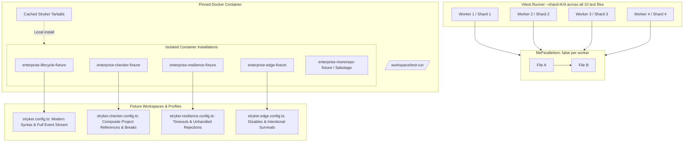
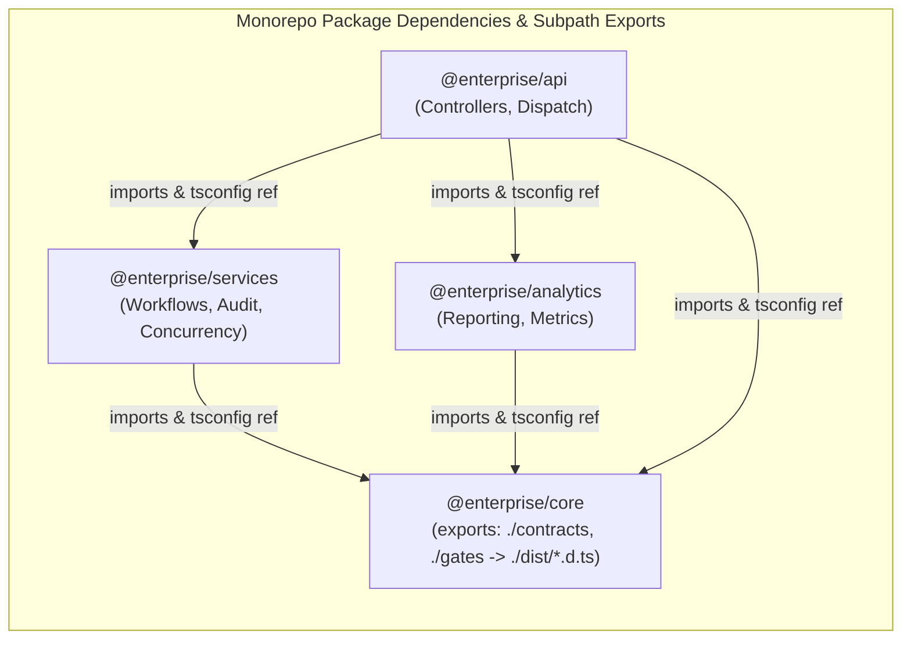

# E2E Test Suite Comprehensive Coverage & Sharding - Plan

## Goal Capsule

- **Objective:** The end-to-end container test suite validates Stryker's complete lifecycle across modern JavaScript/TypeScript syntax, composite monorepo boundaries, worker concurrency edge cases, and mutator status semantics while executing safely and deterministically under Vitest file-level sharding (`vitest run --shard=K/N`).
- **Means:** Decompose the monolithic container test journey into 4 capability-sliced test files (`enterprise-mutation-lifecycle.e2e.test.ts`, `enterprise-composite-checker.e2e.test.ts`, `enterprise-runner-resilience.e2e.test.ts`, and `enterprise-mutator-edge-cases.e2e.test.ts`) that install into dedicated container workspaces (`enterprise-<slice>-fixture`), configure Vitest with `fileParallelism: false` to avoid container lifecycle collisions when multiple test files land on the same shard, and enrich the enterprise fixture with modern syntax idioms, composite subpath exports, worker timeout traps, and mutation status exclusions.
- **Product authority:** This plan governs all E2E test file decomposition and enterprise monorepo fixture additions under `test/e2e/`. Existing smoke journeys (`calc-fixture`, `failing-fixture`, `typescript-checker-fixture`, `enterprise-monorepo-sabotage.e2e.test.ts`) remain intact as companion validation.
- **Stop conditions:** The monolithic enterprise journey is split into 4 standalone test files, all test files execute deterministically under Vitest `--shard=1/4`..`--shard=4/4` in the container harness, and the updated fixture code exercises all target syntax, composite, runner, and mutator patterns with exact mathematical oracles.
- **Execution profile:** Standard implementation, dependency-ordered units; implementing agent finishes and ships.

---

## Product Contract

_Product Contract updated to resolve doc-review findings: accounts for full-suite Vitest SHA-1 file sharding, sequential file execution per worker (`fileParallelism: false`), decorator mutation invariants (skipped by instrumenter), dist declaration paths for composite subpath exports, and companion sabotage test retention._

### Summary

Decompose the monolithic enterprise E2E test suite into four capability-focused test files that enable native Vitest worker sharding (`--shard=1/4`), while expanding the enterprise fixture to exhaustively cover modern JS/TS syntax idioms (decorated classes/methods, async generators, private fields), cross-package composite project boundaries (subpath export maps resolving dist declarations, type-only re-exports across diamond dependencies), runner concurrency edge cases (unhandled rejections, mock leak traps), and mutator status semantics (disable comments, intentional survivals).

### Problem Frame

The current enterprise monorepo test suite concentrates all execution into a single monolithic journey (`enterprise-monorepo.e2e.test.ts`). This structure creates four severe operational and architectural limitations:

1. **Monolithic Execution Bottleneck:** A full mutation run against the enterprise fixture takes significant wall-clock time in CI. Because all assertions live in a single test file, Vitest cannot distribute the workload across multiple worker nodes using `--shard=1/N`, forcing serial execution and slow feedback cycles.
2. **Syntax Idiom Blindspots:** The fixture tests common expressions but lacks coverage for newer ECMAScript and TypeScript features commonly found in modern enterprise codebases: decorated classes and methods, async generators (`for await`), private class identifiers (`#field`), and nested object destructuring with default parameters. When Stryker's instrumenter encounters these nodes, mutation placement and code emission bugs can silently corrupt code or escape notice.
3. **Runner Lifecycle & Mock Isolation Vulnerabilities:** Real production test runners encounter flaky async operations, worker process timeouts, unhandled promise rejections, and test-double leakage across test iterations (`vi.mock` / `vi.spyOn`). Current fixtures do not deliberately stress these boundary conditions.
4. **Mutator Status Blindspots:** The suite asserts killed mutants and compile errors, but does not exercise intentional mutant exclusion via code comments (`// Stryker disable next-line`), mutant survivals triggering score thresholds, or mutator filtering via CLI flags.

### Key Decisions

- KD1. **Capability-Sliced Test File Decomposition with Isolated Fixture Namespaces** (session-settled: user-directed — chosen over package directory splits: separates test files by system behavior and failure mode rather than arbitrary source directories, preserving multi-package composite project references across every test run while enabling Vitest `--shard=1/4` and installing into isolated container subpaths `enterprise-<slice>-fixture` to prevent report/state collision). Governs R1, R2, R3, R4, R5.
- KD2. **Four-Axis Fixture Coverage Expansion** (session-settled: user-directed — chosen over narrow syntax-only additions: deepens fixture realism across modern language idioms, cross-package boundaries, test runner concurrency traps, and mutator exclusions). Governs R6, R7, R8, R9, R10.
- KD3. **Per-File Independent Mathematical Oracles** (session-settled: user-directed — chosen over a shared global oracle: each capability test file asserts an exact, hand-derivable mathematical status tally for its specific scenario and filter slice). Governs R11, R12.

### Requirements

#### Test Decomposition & Vitest Sharding

- R1. The monolithic journey in `test/e2e/tests/enterprise-monorepo.e2e.test.ts` must be split into 4 independent test files under `test/e2e/tests/`:
  - `enterprise-mutation-lifecycle.e2e.test.ts`: Validates the standard happy-path mutation lifecycle, complete machine event stream ordering (`stream`, `phase`, `plan`, `mutant`, `verdict`), and persisted report schemas with 100% killed mutants.
  - `enterprise-composite-checker.e2e.test.ts`: Validates TypeScript composite project references, cross-package declaration boundaries, type-only export breaks, and compilation error detection.
  - `enterprise-runner-resilience.e2e.test.ts`: Validates test runner process isolation, worker thread timeouts, unhandled promise rejection traps, and mock hygiene across mutant iterations.
  - `enterprise-mutator-edge-cases.e2e.test.ts`: Validates intentional mutant exclusions, disable comments (`// Stryker disable next-line`), actionable survived mutants, and mutation threshold enforcement.
- R2. Each decomposed test file must execute independently via `pnpm --filter @systemfsoftware/stryker-e2e test:e2e -- tests/<file>.test.ts` and install its fixture into an isolated container path (`enterprise-<slice>-fixture`) to avoid report or `.stryker-tmp` cache collisions.
- R3. The E2E test configuration must support Vitest native file-level sharding (`vitest run --shard=1/4`, `--shard=2/4`, `--shard=3/4`, `--shard=4/4`) across the full 10-file test directory without container teardown races or port conflicts. Vitest must run test files sequentially within each worker process (`fileParallelism: false`) to honor file-scoped container harnesses.
- R4. Shared container harness primitives (container startup, image packing, tarball caching) must be reused efficiently across test files within a single test execution run to prevent redundant Docker container rebuilds.
- R5. All decomposed test files must continue asserting behavior through the typed machine event stream (`RunEventWireLine`), preserving strict black-box verification.

#### Modern JS/TS Syntax Idioms

- R6. The enterprise monorepo fixture (`test/e2e/testResources/enterprise-monorepo-fixture/`) must incorporate modern JavaScript/TypeScript syntax idioms across its packages:
  - Private class fields and methods (`#privateField`, `#privateMethod()`).
  - Async generator functions and iteration (`async function*`, `for await (const x of stream)`).
  - Decorated classes and methods (Stage 3 decorators).
  - Deep destructuring patterns with default values (`const { a: { b = defaultValue } } = input`).
- R7. Stryker's instrumenter must correctly parse, preserve, and print decorated classes without corruption, and place mutators on class members, private fields, async generators, and destructuring patterns without generating malformed AST replacements or unparseable JavaScript. (Note: Decorator AST nodes themselves are intentionally skipped from mutation per instrumenter design in `packages/stryker-js-instrumenter/src/Transformer.ts`).

#### Cross-Package Monorepo & Composite Boundaries

- R8. The fixture packages (`@enterprise/core`, `@enterprise/services`, `@enterprise/analytics`, `@enterprise/api`) must be expanded to include:
  - Subpath exports in `@enterprise/core/package.json` mapping to emitted declaration files in `./dist/` (`"./contracts": { "types": "./dist/contracts.d.ts", "default": "./dist/contracts.js" }`, etc.) to support composite project reference resolution (`tsc -b`).
  - Type-only re-exports (`export type * from '@enterprise/core/contracts'`) and declaration file (`.d.ts`) emit verification across existing diamond project references.
- R9. Mutating an upstream contract in `@enterprise/core` must trigger cross-package TypeScript compile errors in downstream consumers when running under composite checker mode.

#### Runner Lifecycles & Concurrency Edge Cases

- R10. The fixture test suites must include targeted concurrency and lifecycle scenarios:
  - An intentional long-running / infinite loop mutant that triggers Stryker's timeout detection threshold (configured to 5,000ms in `stryker.resilience.config.ts`) without hanging the container runner indefinitely.
  - An unhandled promise rejection trap in an async service method to verify that the runner worker process traps rejections rather than crashing the harness.
  - A test suite utilizing `vi.mock` and `vi.spyOn` verifying that mock state does not leak across mutant test runs.

#### Mutator Status & Oracle Mechanics

- R11. The fixture must contain code decorated with Stryker disable comments (`// Stryker disable next-line <MutatorName>` and `// Stryker disable all`) and assert that disabled mutants transition to `Ignored` status.
- R12. Each of the 4 decomposed test files must define its own exact `ENTERPRISE_ORACLE` specifying exact counts for `killed`, `survived`, `compileErrors`, `ignored`, `timeout`, and `noCoverage`, strictly forbidding fuzzy floor comparisons.

### Key Flows

- F1. Sharded CI Pipeline Execution
  - **Trigger:** CI runner invokes Vitest with shard parameters (`vitest run --shard=K/N`).
  - **Actors:** Vitest runner, Container harness, Stryker CLI.
  - **Steps:**
    1. Vitest assigns a subset of E2E test files (enterprise journeys plus companion tests) to the current shard using file path hashing.
    2. Container harness initializes the pinned Docker environment with pre-cached tarballs.
    3. Vitest executes assigned test files sequentially within the shard (`fileParallelism: false`).
    4. Each test journey installs its fixture to its isolated container path (`enterprise-<slice>-fixture`).
    5. Stryker runs against the designated scenario in the enterprise monorepo fixture.
    6. Test asserts exact machine event stream lines and verifies the file-specific mathematical oracle.
  - **Outcome:** The shard completes with exit code 0; all mutants in the slice match exact expected tallies.
  - **Covers:** R1, R2, R3, R4, R5, R12.

- F2. Composite Cross-Package Compile Error Detection
  - **Trigger:** `enterprise-composite-checker.e2e.test.ts` executes in the container.
  - **Actors:** Stryker TypeScript Checker plugin, TypeScript compiler (`tsc -b`).
  - **Steps:**
    1. Stryker mutates an exported interface or type guard in `@enterprise/core`.
    2. The TypeScript checker compiler builds the composite dependency graph across project references using emitted `.d.ts` declarations.
    3. The mutation triggers downstream diagnostic errors in `@enterprise/services` and `@enterprise/api`.
    4. Stryker emits `mutant` events with `status: 'CompileError'` referencing the downstream failure.
  - **Outcome:** Checker detects composite breaks across packages without false positives.
  - **Covers:** R8, R9, R12.

### Acceptance Examples

- AE1. Decomposed Test File Isolation
  - **Covers:** R1, R2, R3
  - **Given:** The 4 decomposed test files exist under `test/e2e/tests/`.
  - **When:** Each test file is executed in isolation with `pnpm --filter @systemfsoftware/stryker-e2e test:e2e -- tests/<file>.test.ts`.
  - **Then:** Each test file passes independently with exit code 0 and operates in its own container directory (`enterprise-<slice>-fixture`).

- AE2. Vitest Native Sharding Execution
  - **Covers:** R3
  - **Given:** A clean container test environment.
  - **When:** Vitest runs with `--shard=1/4`, `--shard=2/4`, `--shard=3/4`, and `--shard=4/4`.
  - **Then:** All 10 test files across the 4 shards complete with exit code 0, without container teardown races or directory state collisions.

- AE3. Modern Syntax Mutation Handling
  - **Covers:** R6, R7
  - **Given:** Fixture source code utilizing private class fields (`#secretKey`), async generators (`async function* generateEvents()`), and decorated methods.
  - **When:** Stryker mutates the syntax nodes in `enterprise-mutation-lifecycle.e2e.test.ts`.
  - **Then:** All generated mutants on class members, generators, and destructuring are syntactically valid TypeScript/JavaScript, all mutants are killed or resolved to compile errors by the test suite, and 0 mutants crash the parser, instrumenter, or runner.

- AE4. Disable Comment Ignored Mutants
  - **Covers:** R11, R12
  - **Given:** Fixture code containing `// Stryker disable next-line ConditionalExpression`.
  - **When:** `enterprise-mutator-edge-cases.e2e.test.ts` executes.
  - **Then:** The targeted mutant is marked with `status: 'Ignored'`, and the `verdict.counts.ignored` matches the authored oracle count exactly.

### Scope Boundaries

- **In Scope:**
  - Splitting `test/e2e/tests/enterprise-monorepo.e2e.test.ts` into 4 dedicated test files (`lifecycle`, `composite-checker`, `runner-resilience`, `mutator-edge-cases`).
  - Expanding `test/e2e/testResources/enterprise-monorepo-fixture/` packages with modern JS/TS syntax, subpath export maps resolving `./dist/*.d.ts`, async generator streams, and mock leak traps.
  - Setting `fileParallelism: false` in `test/e2e/vitest.config.ts` to ensure safe sequential file execution per Vitest worker.
  - Authoring independent, exact mathematical status oracles for each of the 4 test files.
- **Out of Scope (Deferred):**
  - Breaking the `enterprise-monorepo-fixture` into separate disconnected directories — the monorepo fixture remains a single multi-package workspace to preserve realistic composite references.
  - Modifying or replacing `enterprise-monorepo-sabotage.e2e.test.ts` and `stryker.sabotage.config.ts` — that journey remains an intentional sabotage-mutation scenario verifying score break thresholds.
  - Production code modifications to `@systemfsoftware/stryker-js` or plugins — the E2E suite tests the existing packaged artifact behavior.
  - Modifying the other legacy test fixtures (`calc-fixture`, `failing-fixture`).

### Success Criteria

- **Metric:** 100% of enterprise monorepo test coverage is distributed across 4 modular test files, executable deterministically under Vitest `--shard=1/4`..`4/4`.
- **Determinism:** 0 flaky runs across 10 consecutive container executions on any single shard.
- **Oracle Precision:** Every test file asserts exact integer counts for `killed`, `survived`, `compileErrors`, `ignored`, `timeout`, and `noCoverage`, with 0 loose floor/ceiling ranges.
- **Syntax Completeness:** 100% of target modern syntax idioms (private fields, async generators, decorated methods, destructuring) are parsed, preserved, and actively tested by the fixture test suite.

---

## Planning Contract

### Key Technical Decisions

- KTD1. **Vitest File-Level Sharding via `--shard=K/N` with Isolated Container Installation Directories and Sequential File Execution**
  (session-settled: user-directed — chosen over package directory splits: partitions the 4 capability journeys across Vitest worker shards while giving each journey an isolated container directory `enterprise-<slice>-fixture` via `installFixture()`, and configuring `fileParallelism: false` in `test/e2e/vitest.config.ts` to prevent file-scoped container teardown races). Cites R1, R2, R3, R4.
- KTD2. **Per-Journey Isolated Stryker Config Presets & Mutate Globbing**
  (chosen over single-run filtering: provides targeted config presets `stryker.config.ts`, `stryker.checker.config.ts`, `stryker.resilience.config.ts`, and `stryker.edge.config.ts` in the fixture so each capability test runs a deterministically bounded mutant slice without cross-talk). Cites R1, R2, R5, R12.
- KTD3. **Exact Integer Oracles Authored per Capability Slice**
  (session-settled: user-directed — chosen over fuzzy floor ranges: each test file exports its own literal `ENTERPRISE_ORACLE` with exact status counts, mutator status tallies, and actionable tallies derived from the fixture source code). Cites R11, R12.
- KTD4. **Exported Type Boundary Breakage for Composite Checker via Dist Declaration Subpath Exports**
  (chosen over ad-hoc synthetic errors: introduces subpath exports in `@enterprise/core/package.json` pointing to emitted `./dist/*.d.ts` declaration files that force downstream declaration errors in `@enterprise/services` and `@enterprise/api` through TypeScript project references `tsc -b`). Cites R8, R9.
- KTD5. **Idiomatic Modern ECMAScript / TypeScript Syntax Nodes**
  (chosen over toy arithmetic: adds private identifiers `#secretSalt`, async generator streams `async function*`, Stage 3 method decorators, and deep destructuring with defaults). Cites R6, R7.
- KTD6. **Mock Leak Traps and Worker Unhandled Rejections**
  (chosen over unisolated tests: verifies that `vi.mock` cleanup survives across mutant runs and that unhandled promise rejections inside worker processes do not abort the harness). Cites R10.

### High-Level Technical Design





### Output Structure

```
test/e2e/
├── vitest.config.ts                                 (Updated: fileParallelism: false for safe sharding)
├── tests/
│   ├── enterprise-mutation-lifecycle.e2e.test.ts   (New: Happy path, modern syntax, stream validation)
│   ├── enterprise-composite-checker.e2e.test.ts     (New: Cross-package composite declaration errors)
│   ├── enterprise-runner-resilience.e2e.test.ts     (New: Timeouts, unhandled rejections, mock hygiene)
│   ├── enterprise-mutator-edge-cases.e2e.test.ts    (New: Disable comments, threshold checks, survivals)
│   ├── enterprise-monorepo-sabotage.e2e.test.ts     (Retained: Existing sabotage score break scenario)
│   └── enterprise-monorepo.e2e.test.ts              (Replaced/Removed)
└── testResources/enterprise-monorepo-fixture/
    ├── stryker.config.ts                            (Updated: Core lifecycle config)
    ├── stryker.checker.config.ts                    (New: Composite checker focused config)
    ├── stryker.resilience.config.ts                 (New: Concurrency & timeout config)
    ├── stryker.edge.config.ts                       (New: Disable comments & mutator exclusions)
    ├── stryker.sabotage.config.ts                   (Retained: Sabotage config)
    └── packages/
        ├── core/
        │   ├── package.json                         (Updated: subpath exports to ./dist/*.d.ts)
        │   └── src/gates.ts                         (Updated: Private fields, decorators, destructuring)
        ├── services/
        │   ├── src/audit-log.ts                     (Updated: Async generators, stream iteration)
        │   └── src/concurrency.ts                   (Updated: Unhandled rejection traps, mock hygiene)
        └── analytics/
            └── src/index.ts                         (Updated: Diamond dependency type re-exports)
```

### Assumptions

- The pinned Docker container harness (`container-environment.ts`) provides sufficient memory (≥2GB) and CPU cores to execute sharded Vitest processes without throttling.
- Vitest's built-in file sharding distributes test files across `--shard=K/N` based on SHA-1 file path hashing across the entire suite of 10 test files.
- Setting `fileParallelism: false` ensures that if multiple test files land on the same shard/worker, they run sequentially, respecting file-scoped container setup and teardown.
- Each test journey installs into its own dedicated fixture directory name (e.g. `enterprise-lifecycle-fixture`), ensuring complete isolation of reports and build artifacts.
- Shared tarball packaging occurs once per test run or is cached by container harness setup, so running test files sequentially introduces minimal tarball rebuild overhead.

### Sequencing & Phase Breakdown

1. **Phase 1: Fixture Expansion & Vitest Config (U1–U3)**:
   - Configure `fileParallelism: false` in `test/e2e/vitest.config.ts`.
   - Enrich `@enterprise/core` and `@enterprise/services` with modern syntax idioms (decorators, private fields, async generators).
   - Implement subpath export maps on `@enterprise/core/package.json` pointing to `./dist/*.d.ts` and consume them across `@enterprise/services`, `@enterprise/analytics`, and `@enterprise/api`.
   - Author concurrency stress traps, timeout loops, and Stryker disable comment markers, authoring `stryker.edge.config.ts`, `stryker.resilience.config.ts`, and `stryker.checker.config.ts`.
2. **Phase 2: Capability Journey Implementation (U4–U5)**:
   - Create `enterprise-mutation-lifecycle.e2e.test.ts` and `enterprise-mutator-edge-cases.e2e.test.ts` (U4).
   - Create `enterprise-composite-checker.e2e.test.ts` and `enterprise-runner-resilience.e2e.test.ts` (U5, independent of U4).
   - Author hand-calculated, exact mathematical status oracles for each file.
   - Clean cutover removing the monolithic `enterprise-monorepo.e2e.test.ts`.
3. **Phase 3: Sharding & Container Verification (U6)**:
   - Verify all test files run cleanly under Vitest file-level sharding (`vitest run --shard=1/4`..`4/4`).
   - Validate full workspace check (`pnpm check:ci`) and typecheck.

---

## Implementation Units

### U1. Modern JS/TS Syntax Idioms in Core & Services

- **Goal:** Enrich `@enterprise/core` and `@enterprise/services` with private class fields, async generator functions, Stage 3 decorators, and nested destructuring with default parameters to test mutator placement and printing.
- **Requirements:** R6, R7. Cites KTD5.
- **Dependencies:** None.
- **Files:**
  - `test/e2e/testResources/enterprise-monorepo-fixture/packages/core/src/gates.ts`
  - `test/e2e/testResources/enterprise-monorepo-fixture/packages/core/src/gates.test.ts`
  - `test/e2e/testResources/enterprise-monorepo-fixture/packages/services/src/audit-log.ts`
  - `test/e2e/testResources/enterprise-monorepo-fixture/packages/services/src/audit-log.test.ts`
- **Approach:**
  1. Add a class `Gatekeeper` in `gates.ts` utilizing private fields (`#secretSalt: string`, `#maxAttempts = 3`) and private method (`#validateHash()`).
  2. Decorate methods in `Gatekeeper` with a simple Stage 3 method decorator to verify instrumenter AST printing does not mangle decorated members.
  3. Implement an async generator `streamAuditEvents()` in `audit-log.ts` that yields structured audit records using `for await (const chunk of generator)`.
  4. Apply nested object destructuring with default values in `audit-log.ts` (`const { actor: { id = 'anonymous', role = 'guest' } = {} } = event`).
  5. Ensure all companion unit tests in `gates.test.ts` and `audit-log.test.ts` thoroughly exercise these constructs so mutants are killed deterministically.
- **Patterns to follow:** Existing pure TypeScript patterns in `packages/core/src/pricing.ts`.
- **Test scenarios:**
  - _Happy path:_ Gatekeeper validates inputs against `#secretSalt` and returns expected boolean verdicts.
  - _Async generator:_ `streamAuditEvents()` yields all buffered events in FIFO order and completes gracefully.
  - _Destructuring default:_ Fallback values are assigned when nested fields are missing or undefined.
- **Verification:** Unit tests within the fixture pass with `pnpm --filter @systemfsoftware/stryker-e2e test:e2e` and TypeScript compilation succeeds.

---

### U2. Subpath Export Maps and Type-Only Re-exports across Diamond Dependencies

- **Goal:** Add subpath export maps to `@enterprise/core/package.json` (`./contracts`, `./gates`) mapping to emitted `./dist/*.d.ts` declaration files, and consume them via type-only re-exports across `@enterprise/analytics` and `@enterprise/api`.
- **Requirements:** R8, R9. Cites KTD4.
- **Dependencies:** U1.
- **Files:**
  - `test/e2e/testResources/enterprise-monorepo-fixture/packages/core/package.json`
  - `test/e2e/testResources/enterprise-monorepo-fixture/packages/core/src/contracts.ts`
  - `test/e2e/testResources/enterprise-monorepo-fixture/packages/analytics/package.json`
  - `test/e2e/testResources/enterprise-monorepo-fixture/packages/analytics/src/index.ts`
  - `test/e2e/testResources/enterprise-monorepo-fixture/packages/api/package.json`
  - `test/e2e/testResources/enterprise-monorepo-fixture/packages/api/src/report.ts`
  - `test/e2e/testResources/enterprise-monorepo-fixture/vitest.config.ts`
- **Approach:**
  1. Add subpath exports to `packages/core/package.json` mapping to `./dist/*.d.ts` and `./dist/*.js` (`"./contracts": { "types": "./dist/contracts.d.ts", "default": "./dist/contracts.js" }`, `"./gates": { "types": "./dist/gates.d.ts", "default": "./dist/gates.js" }`).
  2. In `@enterprise/analytics/src/index.ts`, consume `@enterprise/core/contracts` via type-only re-export (`export type * from '@enterprise/core/contracts'`).
  3. In `@enterprise/api/src/report.ts`, import from both `@enterprise/services` and `@enterprise/analytics`, verifying resolution through export maps.
  4. Update `vitest.config.ts` resolve aliases to support the subpath exports in Vitest.
- **Patterns to follow:** Existing project reference mapping in `tsconfig.json`.
- **Test scenarios:**
  - _Subpath export resolution:_ `@enterprise/api` imports `@enterprise/core/contracts` and builds cleanly.
  - _Type re-export integrity:_ Declaration files (`.d.ts`) emit correctly with composite project references enabled (`tsc -b`).
- **Verification:** Run `tsc -b` in the fixture directory; builds cleanly with composite project references.

---

### U3. Concurrency Stress Traps, Mutator Exclusion Semantics, and Config Presets

- **Goal:** Implement intentional timeout loops, unhandled rejection traps, mock leakage verification, Stryker disable comments, and targeted Stryker configuration presets.
- **Requirements:** R10, R11. Cites KTD2, KTD6.
- **Dependencies:** U1.
- **Files:**
  - `test/e2e/testResources/enterprise-monorepo-fixture/packages/services/src/concurrency.ts`
  - `test/e2e/testResources/enterprise-monorepo-fixture/packages/services/src/concurrency.test.ts`
  - `test/e2e/testResources/enterprise-monorepo-fixture/packages/services/src/inventory.ts`
  - `test/e2e/testResources/enterprise-monorepo-fixture/packages/services/src/inventory.test.ts`
  - `test/e2e/testResources/enterprise-monorepo-fixture/stryker.config.ts`
  - `test/e2e/testResources/enterprise-monorepo-fixture/stryker.checker.config.ts`
  - `test/e2e/testResources/enterprise-monorepo-fixture/stryker.edge.config.ts`
  - `test/e2e/testResources/enterprise-monorepo-fixture/stryker.resilience.config.ts`
- **Approach:**
  1. In `concurrency.ts`, add a method `processBatchWithTimeout()` containing a mutant-sensitive loop condition where mutating `<` to `<=` causes an infinite loop, caught by Stryker's timeout threshold (configured to 5,000ms timeout in `stryker.resilience.config.ts`).
  2. Add an async trap that emits an unhandled rejection if an internal flag is mutated, verifying runner worker error handling.
  3. In `concurrency.test.ts`, author a test using `vi.spyOn(Date, 'now')` and verify automatic mock restoration across mutant test iterations.
  4. In `inventory.ts`, decorate critical validation logic with `// Stryker disable next-line ConditionalExpression` and `// Stryker disable all`.
  5. Author `stryker.checker.config.ts` (targeting composite checker declaration bounds), `stryker.edge.config.ts` (targeting mutator disables and survivals), and `stryker.resilience.config.ts` (targeting concurrency and timeouts).
- **Patterns to follow:** `testResources/enterprise-monorepo-fixture/stryker.config.ts`.
- **Test scenarios:**
  - _Timeout isolation:_ Infinite loop mutant triggers `Timeout` status without hanging the parent process beyond test timeout.
  - _Unhandled rejection handling:_ Runner catches worker rejections and records `RuntimeError` or `Killed` status.
  - _Disable comments:_ Mutants on disabled lines are recorded with `status: 'Ignored'` in `RunEventWireLine`.
- **Verification:** Local tests pass; Stryker recognizes disable comments when targeted.

---

### U4. Decomposed Test Journeys: Lifecycle & Mutator Edge Cases

- **Goal:** Author `enterprise-mutation-lifecycle.e2e.test.ts` and `enterprise-mutator-edge-cases.e2e.test.ts` asserting exact mathematical status oracles for their designated slices.
- **Requirements:** R1, R2, R5, R11, R12. Cites KTD1, KTD2, KTD3.
- **Dependencies:** U1, U2, U3.
- **Files:**
  - `test/e2e/tests/enterprise-mutation-lifecycle.e2e.test.ts`
  - `test/e2e/tests/enterprise-mutator-edge-cases.e2e.test.ts`
- **Approach:**
  1. Author `enterprise-mutation-lifecycle.e2e.test.ts`:
     - Installs fixture to isolated container directory: `prepareFixture(ENTERPRISE_FIXTURE_URL, 'enterprise-lifecycle-fixture')`.
     - Invokes `stryker.config.ts` targeting `@enterprise/core` and `@enterprise/services` modern syntax.
     - Verifies typed event stream (`stream` -> `phase` -> `plan` -> `mutant` -> `verdict`), tarball provenance, and persisted report JSON.
     - Defines exact `LIFECYCLE_ORACLE` asserting 100% killed mutants and 0 survived mutants on this core journey.
  2. Author `enterprise-mutator-edge-cases.e2e.test.ts`:
     - Installs fixture to isolated container directory: `prepareFixture(ENTERPRISE_FIXTURE_URL, 'enterprise-edge-fixture')`.
     - Invokes `stryker.edge.config.ts` targeting `inventory.ts` and disable-commented files.
     - Verifies `verdict.counts.ignored > 0`, intentional survived mutants, and exact `EDGE_ORACLE` counts.
- **Patterns to follow:** `test/e2e/tests/enterprise-monorepo.e2e.test.ts`.
- **Test scenarios:**
  - _Event stream integrity:_ Machine events are non-ANSI, properly sequenced, with identical `runId`.
  - _Report persistence:_ Persisted `mutation.json` matches verdict counts exactly.
  - _Disable status:_ Ignored mutant count matches exact expected tally.
- **Verification:** Both test files pass in container with exit code 0.

---

### U5. Decomposed Test Journeys: Composite Checker & Runner Resilience

- **Goal:** Author `enterprise-composite-checker.e2e.test.ts` and `enterprise-runner-resilience.e2e.test.ts`, and remove the monolithic `enterprise-monorepo.e2e.test.ts`.
- **Requirements:** R1, R2, R5, R8, R9, R10, R12. Cites KTD1, KTD2, KTD3, KTD4, KTD6.
- **Dependencies:** U2, U3.
- **Files:**
  - `test/e2e/tests/enterprise-composite-checker.e2e.test.ts`
  - `test/e2e/tests/enterprise-runner-resilience.e2e.test.ts`
  - `test/e2e/tests/enterprise-monorepo.e2e.test.ts` (remove)
- **Approach:**
  1. Author `enterprise-composite-checker.e2e.test.ts`:
     - Installs fixture to isolated container directory: `prepareFixture(ENTERPRISE_FIXTURE_URL, 'enterprise-checker-fixture')`.
     - Invokes `stryker.checker.config.ts` targeting cross-package contract boundaries.
     - Verifies that mutating upstream exported contracts in `core` produces `CompileError` events in downstream `services` and `api`.
     - Asserts exact `CHECKER_ORACLE` counts for compile errors and killed mutants.
  2. Author `enterprise-runner-resilience.e2e.test.ts`:
     - Installs fixture to isolated container directory: `prepareFixture(ENTERPRISE_FIXTURE_URL, 'enterprise-resilience-fixture')`.
     - Invokes `stryker.resilience.config.ts` targeting concurrency, timeouts, and unhandled rejections.
     - Asserts exact `RESILIENCE_ORACLE` counts with exact integers for `killed`, `timeout: 1`, and `runtimeErrors: 0`.
  3. Remove the obsolete monolithic `enterprise-monorepo.e2e.test.ts`.
- **Patterns to follow:** `test/e2e/tests/enterprise-monorepo.e2e.test.ts`.
- **Test scenarios:**
  - _Composite compile error detection:_ Cross-package declaration breaks are classified as `CompileError`.
  - _Runner timeout handling:_ Infinite loop mutants are flagged as `Timeout` without aborting the container test.
  - _Monolithic file removal:_ No references remain to `enterprise-monorepo.e2e.test.ts`.
- **Verification:** All decomposed tests pass; monolithic file removed cleanly.

---

### U6. Vitest Sharding & Container CI Verification

- **Goal:** Configure Vitest with `fileParallelism: false` for safe sequential execution per worker, verify native Vitest file sharding (`--shard=1/4` .. `--shard=4/4`), full workspace typechecking, and CI check scripts.
- **Requirements:** R2, R3, R4. Cites KTD1.
- **Dependencies:** U4, U5.
- **Files:**
  - `test/e2e/package.json`
  - `test/e2e/vitest.config.ts`
- **Approach:**
  1. In `test/e2e/vitest.config.ts`, set `fileParallelism: false` so that tests running within a single worker process execute sequentially, preserving file-scoped container setup/teardown.
  2. Ensure `test/e2e/package.json` scripts support sharded execution (`pnpm test:e2e -- --shard=1/4`).
  3. Verify that each shard executes cleanly without container directory collisions or lockfile races.
  4. Run `pnpm typecheck` and `pnpm lint` across the workspace to ensure zero lint or type regressions.
- **Patterns to follow:** Workspace script conventions in root `package.json`.
- **Test scenarios:**
  - _Sharded execution:_ `vitest run --shard=1/4` completes and exits 0.
  - _Sharded execution:_ `vitest run --shard=2/4` completes and exits 0.
  - _Sharded execution:_ `vitest run --shard=3/4` completes and exits 0.
  - _Sharded execution:_ `vitest run --shard=4/4` completes and exits 0.
- **Verification:** All 4 shards exit 0; `pnpm check:ci` passes.

---

## Verification Contract

| Verification Check     | Target / Command                                                                                         | Applies To | Done Signal                                        |
| ---------------------- | -------------------------------------------------------------------------------------------------------- | ---------- | -------------------------------------------------- |
| Fixture Unit Tests     | `pnpm --filter @systemfsoftware/stryker-e2e test:e2e`                                                    | U1, U2, U3 | All fixture tests pass in node environment         |
| Lifecycle Journey      | `pnpm --filter @systemfsoftware/stryker-e2e test:e2e -- tests/enterprise-mutation-lifecycle.e2e.test.ts` | U4         | Exit code 0, 100% oracle match                     |
| Mutator Edge Cases     | `pnpm --filter @systemfsoftware/stryker-e2e test:e2e -- tests/enterprise-mutator-edge-cases.e2e.test.ts` | U4         | Exit code 0, ignored mutant oracle match           |
| Composite Checker      | `pnpm --filter @systemfsoftware/stryker-e2e test:e2e -- tests/enterprise-composite-checker.e2e.test.ts`  | U5         | Exit code 0, cross-package compile errors verified |
| Runner Resilience      | `pnpm --filter @systemfsoftware/stryker-e2e test:e2e -- tests/enterprise-runner-resilience.e2e.test.ts`  | U5         | Exit code 0, timeout and rejection traps verified  |
| Vitest Native Sharding | `vitest run --shard=1/4 && vitest run --shard=2/4 && vitest run --shard=3/4 && vitest run --shard=4/4`   | U6         | All 4 shards complete with exit code 0             |
| Workspace Typecheck    | `pnpm typecheck`                                                                                         | U1–U6      | Zero TypeScript compiler diagnostic errors         |
| Workspace Lint         | `pnpm --filter @systemfsoftware/stryker-e2e lint`                                                        | U1–U6      | Zero oxlint errors                                 |

---

## Definition of Done

| Requirement                   | Implementation Unit | Completion Signal                                                                                |
| ----------------------------- | ------------------- | ------------------------------------------------------------------------------------------------ |
| R1, R2 (Decomposition)        | U4, U5              | 4 standalone test files created under `test/e2e/tests/`, monolithic file removed                 |
| R3, R4 (Vitest Sharding)      | U6                  | All 4 shards (`--shard=1/4`..`4/4`) execute independently with `fileParallelism: false` and pass |
| R5 (Event Stream)             | U4, U5              | All journeys assert typed `RunEventWireLine` stream invariants                                   |
| R6, R7 (Syntax Idioms)        | U1, U4              | Private fields, async generators, and decorated methods parsed and tested                        |
| R8, R9 (Composite Boundaries) | U2, U5              | Subpath exports mapping to `./dist/*.d.ts` and cross-package declaration compile errors verified |
| R10 (Runner Concurrency)      | U3, U5              | Timeout loops and unhandled rejection traps tested without hanging container                     |
| R11 (Disable Comments)        | U3, U4              | Disabled mutants recorded with `status: 'Ignored'` and verified by oracle                        |
| R12 (Mathematical Oracles)    | U4, U5              | Every test file defines exact integer counts with zero fuzzy floor ranges                        |
