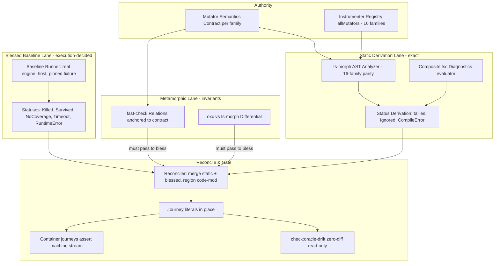

# SOTA Differential Harness & Metamorphic Oracle Revamp - Plan

## Goal Capsule

- **Objective:** Anyone changing fixture code or mutator behavior gets the exact expected mutant statuses for every E2E journey derived and verified by tooling — never hand-counted — with CI failing loudly when a journey's authored oracle literals fall behind.
- **Means:** An authored mutator-semantics contract anchoring three verification layers: metamorphic property relations over generated programs, exact static derivation of statically-decidable statuses, and blessed-baseline regeneration of execution-decided statuses by running the real engine, reconciled in place into journey literals behind a drift gate (KTD1–KTD7; governs R1–R16).
- **Product authority:** This plan governs all oracle derivation, differential testing, and metamorphic property verification under `test/e2e/`.
- **Stop conditions:** The mutator contract covers all 16 registered mutator families with analyzer parity, the metamorphic suite passes its relations within the 30s PR budget, every journey's oracle literals are reconciler-generated with `pnpm check:oracle-drift` green, and all container journeys pass unchanged against the machine event stream.
- **Execution profile:** Standard implementation, one branch, dependency-ordered units; implementing agent finishes and ships.

---

## Product Contract

_Product Contract changed: R4, R5, R6, R7, R8, R13 — execution-decided statuses (Killed/Survived/NoCoverage/Timeout/RuntimeError) move from claimed static derivation to blessed-baseline generation by real engine execution (static exact kill derivation is beyond published capability — the equivalent-mutant problem is undecidable); external snapshot modules become in-place literal regeneration per doctrine E2E-2/E2E-3; R15 and R16 added for the authored mutator-semantics contract and registry exhaustiveness. KD1 narrowed accordingly; KD4 added (session-settled exclusion of external reference engines)._

### Summary

Revamp the differential harness and oracle architecture into a state-of-the-art verification stack anchored on an authored mutator-semantics contract: metamorphic property relations prove placement invariants over generated programs, static analysis derives exactly the statuses that are statically decidable, and the real engine produces execution-decided ground truth that a reconciler writes into journey oracle literals in place — all behind a CI drift gate that fails on any unreconciled change.

### Problem Frame

The current E2E test oracle architecture exhibits three critical vulnerabilities:

1. **Manual Oracle Fragility & Maintenance Bottlenecks:** Container E2E test files (`enterprise-mutation-lifecycle.e2e.test.ts`, `enterprise-mutator-edge-cases.e2e.test.ts`) rely on hand-authored static status tables (`*_ORACLE` constants). Any modification to fixture code, mutator placements, or compiler diagnostics requires manual recounting, which is error-prone, brittle, and invites arbitrary fudge numbers.
2. **Incomplete Analyzer Coverage:** The ts-morph analyzer in `test/e2e/scripts/derive-oracle.ts` matches 13 of the 16 registered mutator families (`packages/stryker-js-instrumenter/src/Mutator.ts`), missing `MethodExpression`, `Regex`, and `UnaryOperator` (`+`/`-`/`~` prefixes), and its `BooleanLiteral` coverage misses the prefix-`!` collapse (`!x` → `x`, emitted by `booleanLiteralMutator`'s `isNegatedPrefix` arm) — yet the lifecycle oracle asserts a `MethodExpression:Killed` count, so the analyzer cannot independently reproduce the numbers the journeys assert.
3. **Incomplete Metamorphic Verification Coverage:** The existing property test (`derive-oracle.property.test.ts`) verifies only four baseline invariants (alpha-renaming, monotonic subtraction of excluded mutators, oxc/ts-morph count agreement, diagnostic category matching). Critical relations — dead-code invariance, boolean/arithmetic duality, statement commutativity, directive scoping, mutation subsumption — are unverified.

### Key Decisions

- KD1. **Tiered Metamorphic Property & Static Derivation Engine** (session-settled: user-directed — chosen over micro-VM execution and live dual-engine runners: in-memory derivation for statically-decidable statuses without container or VM flakiness). Narrowed at planning: execution-decided statuses are blessed by real engine runs, not statically derived. Governs R1, R2, R3, R4, R5.
- KD2. **Hybrid Derivation with In-Place Literal Reconciliation** (session-settled: user-directed — chosen over live-only or purely static workflows: static derivation plus blessed baselines, regenerated into journey files and checked into git for review). Governs R7, R8, R9, R10, R13.
- KD3. **Automated CI Drift-Detection Gate** (session-settled: user-directed — chosen over permissive auto-updating in CI: any fixture or mutator change without reconciled literals fails CI immediately). Governs R11, R12, R14.
- KD4. **No External Reference Engine** (session-settled: user-directed — chosen over upstream Stryker differential comparison: this repo owns the mutator specification; upstream agreement or disagreement proves nothing about our semantics). Governs R15.

### Requirements

#### Mutator Semantics Contract & Analyzer Parity

- R15. An authored mutator-semantics contract must define, for each of the 16 registered mutator families in `packages/stryker-js-instrumenter/src/Mutator.ts`, the exact placement rules (which AST nodes are matched, which are excluded) and replacement rules (each emitted replacement), including the gray-zone families: `OptionalChaining`, decorators, `MethodExpression`, and the prefix-`!` collapse (owned by `BooleanLiteral`'s `isNegatedPrefix` arm, not `UnaryOperator`). Contract family keys must spell exactly the `allMutators` registry keys, so oracle literal keys never need migration. The contract is the single authority the instrumenter, the analyzer, and every metamorphic relation are checked against.
- R16. The ts-morph analyzer must achieve full parity with the 16-family registry — adding `MethodExpression`, `Regex`, `UnaryOperator` (`+`/`-`/`~` prefixes), and the `BooleanLiteral` prefix-`!` collapse per the contract — and a registry-exhaustiveness property test must fail the build when the registry gains a family the analyzer does not cover.

#### Metamorphic Property Engine

- R1. The metamorphic property test suite in `test/e2e/scripts/derive-oracle.property.test.ts` must be expanded to cover at least five additional metamorphic relations across generated ASTs, each citing the contract clause it encodes (per R15):
  - **Dead-Code Invariance:** Mutants in unreachable code are placed and tallied exactly as the contract specifies for reachable code (the engine's coverage handling affects `noCoverage` status, never placement).
  - **Boolean & Arithmetic Duality:** Complementary boolean/arithmetic source forms produce the contract-specified mutator counts.
  - **AST Commutativity:** Reordering independent, non-dependent declarations produces identical mutator tallies.
  - **Directive Scope Invariance:** `// Stryker disable next-line` directives mute mutants on exactly the contract-specified lines without leaking across block boundaries.
  - **Mutation Subsumption (bounded):** Where one mutant's AST subtree strictly contains another's, the tallies reflect the contract's nesting rules; this is a static approximation, not dynamic subsumption analysis.
- R2. The metamorphic property tests must execute entirely in-process under `pnpm test:oracle` with a runtime budget of under 30 seconds for 200+ fast-check iterations per property.
- R3. The property engine must assert differential equivalence between the OXC instrumenter visitor and the ts-morph analyzer across all 16 mutator families — staged: the 13 currently covered families hold from U1, and U4 extends the differential to the newly covered families once U2 ships parity. This check detects implementation divergence (parser, span, and count skew) only; semantic correctness is anchored by R15.

#### Exact Static Status Derivation

- R4. The oracle tooling must derive, exactly and statically: all placement counts and mutator tallies; `Ignored` status (from directives and `excludedMutations`); and `CompileError` status (from real TypeScript pre-emit diagnostics, evaluated against the fixture's composite project references — cross-package type errors included, not a single in-memory file).
- R5. The oracle tooling must derive execution-decided statuses (`Killed`, `Survived`, `NoCoverage`, `Timeout`, `RuntimeError`) exclusively from blessed baselines: real engine runs of the fixture slices, executed deterministically in-process on the host (no container required for generation).
- R6. The tooling must never guess an execution-decided status. Any mutant whose blessed run result is unavailable or indeterminate blocks reconciliation with an explicit diagnostic naming the mutant and slice.

#### In-Place Literal Reconciliation & Drift Gate

- R7. The reconciler CLI must regenerate oracle constant blocks **in place** inside each journey file (`test/e2e/tests/*.e2e.test.ts`), delimited by region markers. No external snapshot modules are created; expected counts remain authored literals in the asserting journey per doctrine E2E-2.
- R8. Regenerated literal blocks must be plain constants with no imports added to journey files (per doctrine E2E-3), serialized canonically (dprint-formatted) so formatting never produces false drift.
- R9. The reconciler must support scoped regeneration per capability slice (`--slice lifecycle|edge|checker|resilience`), keyed by slice configuration so overlapping fixture mutate globs with distinct `excludedMutations` never cross-contaminate. The sabotage journey asserts threshold-breach behavior, not derivable tallies; it stays hand-authored outside regeneration scope (R12).
- R10. Reconciled literals must be committed alongside the fixture or mutator change that produced them, reviewed in the same diff.
- R11. A CI check command `pnpm check:oracle-drift` must re-derive all slices and exit non-zero with the exact per-mutant diff when committed literals differ from derivation.
- R12. The drift gate must never write files (per doctrine E2E-2: a run may confirm the numbers, never originate them); regeneration happens only via explicit local `pnpm derive-oracle --reconcile`.
- R17. The first reconciliation must produce a committed triage report at `test/e2e/scripts/oracle/first-reconciliation-triage.md` listing each delta with family, slice, expected-by-contract vs actual-by-blessed values, and adjudication category (`fixture-fix` / `product-bug` / `contract-clarification`); every `product-bug` adjudication carries a linked issue identifier or `N/A (pre-existing)`. (R17 added in 2026-09-21 review.)
- R13. Journey files must keep asserting against their inline literals exactly as today; the only change is that the literal blocks are regenerable and region-marked.
- R14. Container journeys must continue asserting strictly against the machine event stream (`RunEventWireLine`), preserving end-to-end black-box verification.

### Test Layer Classification & Gate Admission

Per the test-layer-selection discipline, tests introduced or modified by this plan are admitted as follows:

| Test Target                                         | Permitted Layer                                | Location                                            | Gate & Invariant                                                               |
| --------------------------------------------------- | ---------------------------------------------- | --------------------------------------------------- | ------------------------------------------------------------------------------ |
| Mutator contract parity & metamorphic relations     | Property tests (fast-check)                    | `test/e2e/scripts/derive-oracle.property.test.ts`   | Pure in-memory AST transforms; zero process spawning; `pnpm test:oracle` < 30s |
| Analyzer 16-family parity & registry exhaustiveness | Property tests                                 | `test/e2e/scripts/derive-oracle.property.test.ts`   | Fails build on uncovered registry family                                       |
| Composite diagnostics & static status derivation    | Unit/integration (in-process `ts-morph`/`tsc`) | `test/e2e/scripts/*.test.ts` (oracle vitest config) | Exact statuses on hand-verifiable mini-fixtures                                |
| Blessed baseline generator                          | Integration (in-process engine run)            | `test/e2e/scripts/*.test.ts`                        | Deterministic statuses on a pinned micro-slice                                 |
| Reconciler & drift gate                             | Integration (fs code-mod, zero-diff assertion) | `test/e2e/scripts/*.test.ts`                        | Round-trip: reconcile → check → zero diff; refuses to write in check mode      |
| Shipped CLI container journeys                      | Sparse E2E (unchanged count)                   | `test/e2e/tests/*.e2e.test.ts`                      | Machine-stream assertions against regenerated literals                         |

### Scope Boundaries

#### Deferred for Later

- True dynamic mutation subsumption graphs (Kurtz-style) and TCE-style equivalent-mutant detection via compiler equivalence; the plan ships only the bounded AST-dominance approximation (R1).
- Coverage-guided static `NoCoverage` derivation from raw V8 maps (blessed runs already produce it exactly; a static variant adds nothing this fixture needs).

#### Outside This Product's Identity

- External reference-engine comparison against upstream Stryker or any third-party mutation tool (KD4: the mutator spec is owned here; external agreement proves nothing).
- Predictive or ML-based mutant kill classification (published techniques are F1-grade prioritizers, not gates; kill is execution-decided).
- Modifying the production Stryker CLI or instrumenter to satisfy oracle requirements; the harness is strictly external verification (fixes discovered by the harness are filed as product bugs, per E2E-2 triage).
- Ad-hoc logging or monkeypatching inside test runners (violates doctrine OBS-1 and E2E-6).

### Acceptance Examples

- AE1. **Metamorphic Invariance Under Dead Code**
  - **Given:** A valid TypeScript function with 5 active mutators and an injected unreachable block `if (false) { const dead = 1 + 2; }`.
  - **When:** The dead-code-invariance property runs.
  - **Then:** The active mutator tally matches the contract-specified placement for both forms — mutants inside the unreachable block are placed and counted identically to reachable code.
  - **Covers:** R1, R2, R15.
- AE2. **Registry Exhaustiveness**
  - **Given:** A new mutator family registered in `Mutator.ts` with no analyzer coverage.
  - **When:** `pnpm test:oracle` runs.
  - **Then:** The exhaustiveness property fails, naming the uncovered family.
  - **Covers:** R16.
- AE3. **Blessed Reconciliation and Drift Detection**
  - **Given:** A developer adds `x + 1` to `packages/core/src/pricing.ts` in the fixture without reconciling.
  - **When:** `pnpm check:oracle-drift` runs in CI.
  - **Then:** The gate exits non-zero, printing the per-mutant diff (new `ArithmeticOperator` placements and their derived statuses) and naming `pnpm derive-oracle --reconcile` as the remedy; after local reconcile and commit, the gate passes.
  - **Covers:** R7, R11, R12.
- AE4. **Composite Compile-Error Derivation**
  - **Given:** A mutant in `@enterprise/core` whose replacement breaks a downstream `@enterprise/api` type contract.
  - **When:** Static derivation runs against the fixture's composite project references.
  - **Then:** The mutant is classified `CompileError` with the downstream diagnostic code recorded — matching what the container checker run reports.
  - **Covers:** R4.

---

## Planning Contract

### Key Technical Decisions

- KTD1. **Pure-core/shell decomposition of oracle tooling.** All derivation logic moves from the monolithic `derive-oracle.ts` into pure modules under `test/e2e/scripts/oracle/` (`ast-analyzer`, `diagnostics`, `status-derivation`, `baseline-runner`, `reconciler`, `drift-check`) with a thin CLI shell (`derive-oracle.ts` keeps the npm-script entrypoint). Pure modules carry no fs/process access, which is what makes the property and unit lanes fast and deterministic. Grounds U2, U3, U5, U6.
- KTD2. **Status split by decidability.** Statically decidable statuses (placement counts, tallies, `Ignored`, `CompileError`) are derived by analysis only; execution-decided statuses (`Killed`, `Survived`, `NoCoverage`, `Timeout`, `RuntimeError`) come exclusively from blessed engine runs. Static kill derivation is not attempted — the equivalent-mutant problem is undecidable and published predictors are F1-grade prioritizers, not oracles. Grounds U3, U5.
- KTD3. **Blessed baselines with invariant-gated regeneration.** Baseline numbers originate from real engine runs of the pinned fixture on the host (the engine's actual behavior is the ground truth for execution-decided statuses), and a reconciliation is only complete when `pnpm test:oracle` AND the U5 flake-rate gate also pass — a blessed bug that violates a metamorphic relation or the analyzer differential cannot be blessed silently, and a nondeterministic blessed status cannot be blessed at all. This is the bless-the-bug mitigation: baselines catch regressions, relations catch invariant-violating baselines, the flake gate catches alternating baselines. Grounds U5, U6.
- KTD4. **In-place literal regeneration with region markers and canonical serialization.** Journey oracle constants live between generated-region markers inside the asserting journey file (doctrine E2E-2: literals in the journey; E2E-3: no new imports), emitted through one canonical serializer and dprint-formatted so style never diffs. Check mode is strictly read-only (E2E-2). Grounds U6, U7.
- KTD5. **Mutator-semantics contract as executable-adjacent authority.** The contract (R15) is a reviewed markdown artifact whose per-family rules are mirrored by machine-checkable expectation tables consumed by the analyzer parity test and the metamorphic suite — the spec we own is written down once, and every layer is checked against that single statement. Grounds U1, U2, U4.
- KTD6. **Metamorphic relations anchored to the contract, not compiler folklore.** Each relation names the contract clause it encodes; MR violations are triaged as contract-error, generator-error, or product bug (never auto-blessed), accepting the known MR triage cost. The dead-code relation encodes _our_ placement contract (mutants placed regardless of reachability), not EMI's compiler variant. Grounds U4.
- KTD7. **Registry exhaustiveness as a build gate.** The analyzer's family coverage is asserted against the instrumenter's `allMutators` registry at property-test time; a 17th family without analyzer parity fails the suite with the family named. Grounds U1, U2.

### High-Level Technical Design

Sequencing: U1 (contract + exhaustiveness) anchors everything; U2 builds the analyzer after U1; U3–U4 build the status-derivation and metamorphic lanes in parallel after U2; U5 needs U2+U3; U6 needs U3+U5; U7 migrates journeys last, with first-reconciliation triage per E2E-2.

### Assumptions

- The blessed baseline runner executes fixture slices in-process on the host via the verified programmatic entry — `run(options, targetMutatePatterns?)` from `@systemfsoftware/stryker-js/promises`, wrapping `strykerCell` (`packages/stryker-js/src/index.ts`) and returning `Promise<MutationTestDone>` with per-mutant results; no CLI spawn is required, but the engine does spawn plugin worker child processes even for host-local runs, so blessed determinism is a measured property (U5's flake-rate gate), not an assumed one. U5 is this API's first programmatic consumer. If the host blessed run fails to complete a slice or diverges from container behavior, the fallback is to generate that slice inside the existing container harness and record the divergence as a triage finding per E2E-2 — recorded here as the plan's main execution-time unknown.
- The resilience slice's timeout trap mutants are made stable by margin, not by seed: per-mutant timeout is computed from wall-clock dry-run time (`packages/stryker-js/src/Mutants.ts`), so `timeoutMS` budgets are set orders of magnitude away from trap runtimes (traps always `Timeout`; ordinary mutants always resolve), and the flake-rate gate measures the residue instead of assuming it away.
- Journey files currently import `@systemfsoftware/stryker-js` for stream decoding although E2E-3's text forbids workspace imports under `tests/`; this plan preserves the established pattern unchanged and flags the doctrine drift for the lane owners rather than silently "fixing" either side.

### Risks & Dependencies

| Risk                                                                                                                                                 | Likelihood | Mitigation                                                                                                                                                                                                                                                         |
| ---------------------------------------------------------------------------------------------------------------------------------------------------- | ---------- | ------------------------------------------------------------------------------------------------------------------------------------------------------------------------------------------------------------------------------------------------------------------ |
| Metamorphic relation false alarms (generator or contract error, not product bug)                                                                     | Medium     | Each MR cites its contract clause; triage protocol in KTD6; relations kept few and contract-anchored                                                                                                                                                               |
| Blessed-run nondeterminism (timeouts, async traps, plugin worker scheduling — `run-host.ts` spawns plugin worker processes even for host-local runs) | Medium     | Wide-margin timeout budgets and fixed concurrency in U5; a flake-rate integration test (N=50 micro-slice runs, zero status disagreements) gates reconciliation per KTD3; a mutant that still alternates blocks reconciliation loudly (R6) instead of being blessed |
| Composite diagnostics cost (per-mutant `tsc` across project references)                                                                              | Medium     | One shared `ts-morph` Project per package graph; diagnostics batched per mutated file; measured against the 30s oracle-lane budget — the slow lane is the baseline runner, not diagnostics                                                                         |
| Region-marker conflicts with hand edits inside generated blocks                                                                                      | Low        | Policy: no edits inside markers; drift gate + code review enforce; reconciler preserves everything outside markers byte-identically                                                                                                                                |
| TypeScript version bump changes diagnostic codes                                                                                                     | Low        | Diagnostic codes asserted as named constants in U3 tests; contract pins expected codes per family                                                                                                                                                                  |
| oxc↔ts-morph span parity for the 3 newly covered families                                                                                            | Medium     | Differential property extended to the new families in U4 before reconciliation consumes them                                                                                                                                                                       |

### Sources / Research

- Mutator registry ground truth: `packages/stryker-js-instrumenter/src/Mutator.ts` (16 families; analyzer misses `MethodExpression`, `Regex`, `UnaryOperator`).
- Verdict wire shape for literal typing: `packages/stryker-js/src/RunEvent.schema.ts` (`VerdictReached`, `Metrics`).
- Doctrine: `test/e2e/AGENTS.md` E2E-1..E2E-6 (authored literals in journey; no CI auto-update; machine-stream assertions).
- Blessed-baseline lineage: rustc UI tests / compiletest, TypeScript compiler baselines (checked-in outputs, regenerate-by-running, CI diff gate).
- Metamorphic lineage: Le/Afshari/Su, _Compiler Validation via Equivalence Modulo Inputs_ (PLDI 2014) — profile-and-prune of unexecuted code, 147 confirmed GCC/LLVM bugs; MR-violation triage cost per Kanewala et al. 2023 (_Bug or not Bug?_).
- Kill-prediction ceiling: Tian et al. (ISSTA 2024) — equivalent-mutant detection is undecidable; best LLM techniques are F1-scored classifiers (+35.69% avg F1 over 10 baselines), unusable as hard gates.
- Verified engine entry: `packages/stryker-js/src/promises/index.ts` (`run`, wrapping `strykerCell` from `packages/stryker-js/src/index.ts`; `MutationTestDone` carries per-mutant results); gate chain verified at root `package.json` (`check:ci` → `gate:tasks` → turbo literal task names) and `turbo.json` (no generic check task exists).
- Learnings: `docs/solutions/runtime-errors/host-instrumenter-namespace-identity.md` (zero-valid-mutant score is NaN, not 0 — reconciler must pin the empty-tally guard); `docs/solutions/build-errors/e2e-lane-packed-a-subset-of-its-workspace-closure.md` (closure completeness precedes any status comparison); `docs/solutions/build-errors/suite-imports-package-dist-rebuild-before-trusting.md` (oracle lane must resolve sources, not stale dist).
- Review-verified facts (2026-09-21 doc review): prefix-`!` collapse is owned by `booleanLiteralMutator`'s `isNegatedPrefix` arm, `UnaryOperator` covers `+`/`-`/`~` (`packages/stryker-js-instrumenter/src/Mutator.ts:758-1304`); per-mutant timeout derives from wall-clock dry-run time (`packages/stryker-js/src/Mutants.ts`), so `Timeout` stability comes from wide-margin budgets, not seeds; the fixture root `tsconfig.json` declares `references` and per-package tsconfigs declare their own `paths` under NodeNext (U3 spike target).

---

## Implementation Units

### U1. Mutator semantics contract and registry exhaustiveness

- **Goal:** Author the single authority for mutator placement/replacement semantics across all 16 families, and gate the build on analyzer coverage of the registry.
- **Requirements:** R15, R16 (partially — contract + exhaustiveness test), R3 (contract anchors the differential).
- **Dependencies:** none.
- **Files:**
  - `test/e2e/scripts/oracle/mutator-contract.md` (new — per-family placement/exclusion/replacement rules, gray zones specified)
  - `test/e2e/scripts/oracle/mutator-registry.ts` (new — machine-checkable expectation table mirroring the contract)
  - `test/e2e/scripts/derive-oracle.property.test.ts` (modify — add exhaustiveness property)
- **Approach:**
  1. Read `packages/stryker-js-instrumenter/src/Mutator.ts` and each family's visitor implementation; write the contract's placement and replacement tables, explicitly resolving the gray zones (OptionalChaining `?.`/`?.[`/`?.(` forms, decorator-skipping behavior, MethodExpression member-call replacement).
  2. Encode the same rules as a data table in `mutator-registry.ts` keyed by family name — keys spell exactly the `allMutators` registry keys (R15), so oracle literal keys never migrate; the markdown is the reviewed human authority, the table is the executable mirror, and each table row cites its contract section anchor.
  3. Add a property test that draws every family from the instrumenter's `allMutators` registry and asserts the analyzer covers it; failure message names the uncovered family.
  4. Add a count-equality property: for each registry table row, generate the row's minimal snippet and assert the analyzer emits exactly the placement count and replacement strings the table claims — citation alone is a string match, so the table's numeric claims are verified against visitor behavior, not self-consistency.
- **Execution note:** Cross-model review of the gray-zone contract clauses before they are treated as authority — a second model family reviews the OptionalChaining/decorator/MethodExpression clauses against the visitor code.
- **Test scenarios:**
  - Happy path: for each of the 16 families, a minimal source snippet produces exactly the contract-specified placements and replacements.
  - Edge: OptionalChaining in all three forms (`a?.b`, `a?.[k]`, `a?.()`) matches the contract clause.
  - Edge: decorated class/method produces zero mutants per the contract's decorator-skip rule.
  - Error: a synthetic 17th family injected into the registry stub fails the exhaustiveness property with the family named.
  - Integration: contract table and markdown stay in sync — a test asserts every table row cites an existing contract section anchor.
- **Verification:** Exhaustiveness property green; count-equality property green per family; gray-zone clauses reviewed; contract readable standalone by a reviewer who has not seen the visitor code. The differential equivalence of R3 stays staged: 13 families from U1, extended at U4 (R3).

### U2. Oracle module decomposition and full analyzer parity

- **Goal:** Split the monolithic `derive-oracle.ts` into pure modules and complete the analyzer to 16-family parity per the contract.
- **Requirements:** R16 (parity), R4 (analyzer foundation), KTD1.
- **Dependencies:** U1.
- **Files:**
  - `test/e2e/scripts/derive-oracle.ts` (modify — becomes thin CLI shell re-exporting/invoking modules)
  - `test/e2e/scripts/oracle/ast-analyzer.ts` (new — `analyzeFileWithTsMorph` + directive parsing moved, extended with `MethodExpression`, `Regex`, `UnaryOperator`)
  - `test/e2e/scripts/oracle/diagnostics.ts` (new — `determineCompileErrorsWithDiagnostics` moved)
  - `test/e2e/scripts/oracle/types.ts` (new — `IndependentMutant`, `IndependentInventory`, status union incl. execution-decided)
  - `test/e2e/scripts/derive-oracle.property.test.ts` (modify — imports move to modules)
- **Approach:**
  1. Move existing analyzer, directive parser, and inventory types into the modules unchanged (behavior-preserving); the shell keeps the existing `derive-oracle` npm script entrypoint working.
  2. Implement the missing coverage exactly per the U1 contract table — `MethodExpression` (method call replacement per contract), `Regex` (regex literal replacement), `UnaryOperator` (`+`/`-`/`~` prefixes per `unaryOperatorMutator`), and the `BooleanLiteral` prefix-`!` collapse (`!x` → `x` per `booleanLiteralMutator`'s `isNegatedPrefix` arm).
  3. Extend the differential property inputs to cover snippets exercising the new families.
- **Test scenarios:**
  - Happy path: existing four property invariants pass unchanged against the modularized code (no behavior drift from the move).
  - Edge: `Regex` literal `/\d+/g` produces the contract-specified replacement; empty-class edge `[//]` handled per contract.
  - Edge: `BooleanLiteral` on `!item?.active` places the prefix-`!` collapse per contract without double-counting the OptionalChaining placement; `UnaryOperator` on `~mask` and `-count` places per contract.
  - Integration: analyzer output for the full enterprise fixture equals the pre-move inventory for the 13 previously covered families (byte-identical tally).
- **Verification:** All existing property tests green unmodified in behavior; new families produce contract-exact placements on the fixture; `pnpm typecheck` green for the e2e package.

### U3. Composite-aware diagnostics and exact static status derivation

- **Goal:** Derive `CompileError` against the fixture's real composite project graph, and produce the exact static status set (tallies, `Ignored`, `CompileError`) per slice configuration.
- **Requirements:** R4, R6 (blocking diagnostic), R9 (slice keying), KTD2.
- **Dependencies:** U2.
- **Files:**
  - `test/e2e/scripts/oracle/diagnostics.ts` (modify — composite-aware evaluation)
  - `test/e2e/scripts/oracle/status-derivation.ts` (new — static status merge: tallies + Ignored + CompileError; explicit Unresolved blockers)
  - `test/e2e/scripts/oracle/slice-config.ts` (new — slice registry: fixture path, stryker config, mutate globs, excludedMutations, target journey file)
  - `test/e2e/scripts/diagnostics.test.ts` (new — mini-fixture tests)
- **Approach:**
  1. Spike first, gating the unit: build a one-page composite mini-fixture (two packages, one cross-package type import, one mutator whose replacement breaks the import) and prove a `ts-morph` Project loaded from the fixture's root `tsconfig.json` surfaces the downstream diagnostic through the per-package `paths` mappings (`packages/api/tsconfig.json` declares its own `paths` under NodeNext). U3 implementation proceeds only on a green spike; if ts-morph cannot honor the per-package `paths`, the approach falls back to one Project per package tsconfig with shared program reuse, and the spike records which.
  2. Replace the single in-memory `target: 99` project with the composite-aware Project(s) the spike validated; for each active mutant, apply the replacement in-memory and read pre-emit diagnostics across the reference graph so downstream breaks surface (AE4).
  3. Batch: one Project per package graph, mutants grouped per source file; cache program between mutants in the same file.
  4. Implement `slice-config.ts` so each regenerable capability slice (lifecycle, edge, checker, resilience) declares its stryker config path, mutate globs, and exclusions — the key that prevents cross-slice contamination (R9). Sabotage is not registered: its assertions are behavioral (R9).
  5. Status merge emits the static portion of the oracle plus an explicit blocker list for anything execution-decided not yet blessed (R6).
- **Test scenarios:**
  - Happy path: a mini composite fixture (two referenced packages) — a mutant breaking a downstream type contract is classified `CompileError` with the downstream diagnostic code (AE4).
  - Edge: a mutant inside a `// Stryker disable next-line` line is `Ignored` and never sent to diagnostics.
  - Edge: zero-valid-mutant file yields an empty tally with the NaN-score guard (score renders `n/a`, thresholds skipped) per the namespace-identity learning.
  - Error: an excludedMutations config naming a family still leaves the family in the tally but `Ignored` (monotonic subtraction semantics preserved).
  - Integration: static derivation over the real fixture reproduces the `CompileError` and `Ignored` portions of all four current journey oracles exactly.
- **Verification:** Mini-fixture tests green; real-fixture static portions match existing authored literals for CompileError/Ignored on all slices.

### U4. Metamorphic engine expansion

- **Goal:** Add the five contract-anchored metamorphic relations plus new-family differential coverage to the property suite.
- **Requirements:** R1, R2, R3, KTD6.
- **Dependencies:** U1, U2.
- **Files:**
  - `test/e2e/scripts/derive-oracle.property.test.ts` (modify — five new relations; extend arbitraries)
  - `test/e2e/scripts/oracle/metamorphic.ts` (new — relation helpers: dead-code injection, duality transform, commutativity shuffle, directive injection, subsumption nesting)
- **Approach:**
  1. Implement relation transforms as pure functions over generated sources in `metamorphic.ts`, each documented with the contract clause it encodes.
  2. Dead-code invariance: inject unreachable blocks with Stryker-disabled contents and contract-permitted mutable contents; assert placement/tally follows the contract for both (KTD6 — this encodes our placement semantics, not EMI's).
  3. Duality and commutativity relations reuse and extend the existing arbitraries (binary ops, compound/logical assignment, optional chains, private fields).
  4. Extend the oxc↔ts-morph differential property to the newly covered families (R3), comparing replacement strings — not counts alone — for arbitraries that emit a single mutant; for `OptionalChaining`, assert the emitted replacement is one of `.`, `[`, `(` at the question-dot span (the OXC visitor replaces the whole member expression, so count-only agreement can hide a span mismatch).
  5. Keep the whole suite under the 30s budget; tune `numRuns` per relation (200+ floor) and measure.
- **Test scenarios:**
  - Happy path: each of the five relations passes over 200+ generated programs.
  - Edge: dead-code injection adjacent to a directive line does not leak the disable across the injected block boundary.
  - Error: a deliberately broken analyzer rule (test-only mutation of the analyzer) is caught by at least one relation — proving the relations have teeth.
  - Integration: full `pnpm test:oracle` wall time < 30s with all relations enabled.
- **Verification:** Suite green within budget; each relation's failure message names the contract clause violated.

### U5. Blessed baseline runner

- **Goal:** Produce execution-decided statuses (Killed/Survived/NoCoverage/Timeout/RuntimeError) by running the real engine in-process against each fixture slice, deterministically.
- **Requirements:** R5, R6, KTD3.
- **Dependencies:** U2, U3.
- **Files:**
  - `test/e2e/scripts/oracle/baseline-runner.ts` (new — in-process engine execution per slice)
  - `test/e2e/scripts/oracle/baseline-runner.test.ts` (new — pinned micro-slice determinism tests)
- **Approach:**
  1. Drive the engine via `import { run } from '@systemfsoftware/stryker-js/promises'` with `PartialStrykerOptions` loaded from each slice's stryker config and `cwd` set to the fixture slice; read per-mutant statuses from the returned `MutationTestDone` — never parsing human output, never the `bin/main.ts` argv path. The e2e lane resolves workspace sources, not stale `dist/promises.mjs` (per the suite-imports-dist learning).
  2. Determinism by margin and measurement, not by seed. Static statuses (placement, tallies, `Ignored`, `CompileError`) are fully deterministic; runner-decided statuses (`Killed`, `Survived`, `Timeout`) are stable when `timeoutMS` budgets sit orders of magnitude from trap runtimes (per-mutant timeout derives from wall-clock dry-run time, `packages/stryker-js/src/Mutants.ts` — seeds cannot pin it); child-process-decided statuses (`RuntimeError` from signal handling) are environment-tolerant. Blessing runs use fixed concurrency and the wide-margin budgets; the flake-rate gate (below) measures the residue per status class.
  3. Merge blessed statuses with the U3 static inventory into the complete per-slice oracle model; any mutant without a determinate blessed status is a reconciliation blocker naming mutant and slice (R6).
  4. Flake-rate gate: an integration test runs the pinned micro-slice 50 consecutive times and fails on any status disagreement for the deterministic and runner-decided classes; mutants observed alternating (expected only in the environment-tolerant class) are named per class and become R6 blockers, never blessed values. This gate joins `pnpm test:oracle` in the KTD3 invariant gate — reconciliation requires both green.
  5. Fallback protocol: if the host blessed run errors during prepare or fails to complete a slice (first-programmatic-consumer risk), generate that slice inside the existing container harness and record the host failure as a triage finding per E2E-2; a slice that can be blessed neither way blocks U6, named in the triage report.
- **Test scenarios:**
  - Happy path: a pinned micro-slice (one file, three mutants: kill, survive, compile-error) yields identical statuses across 50 consecutive runs (flake-rate gate green).
  - Edge: a trap mutant under a wide-margin timeout budget produces `Timeout` in every flake-gate run.
  - Error: an unavailable blessed result surfaces as a named blocker, never as a guessed status.
  - Integration: blessed statuses for the lifecycle slice match the `killed`/`survived`/`noCoverage` portions of the current authored lifecycle oracle (discrepancies are E2E-2 triage findings, to be adjudicated before U7).
- **Verification:** Flake-rate gate green (50/50 agreement) and joined to the KTD3 invariant gate; lifecycle slice blessed output adjudicated against the authored oracle with any divergence resolved as fixture-authoring error or product bug; any container-fallback slice recorded as a triage finding.

### U6. Reconciler CLI and drift gate

- **Goal:** Regenerate journey oracle literal blocks in place per slice, and provide the read-only drift gate for CI.
- **Requirements:** R7, R8, R9, R10, R11, R12, KTD4.
- **Dependencies:** U3, U5.
- **Files:**
  - `test/e2e/scripts/oracle/reconciler.ts` (new — region code-mod over journey files)
  - `test/e2e/scripts/oracle/drift-check.ts` (new — read-only zero-diff assertion)
  - `test/e2e/scripts/derive-oracle.ts` (modify — CLI args: `--reconcile`, `--slice`, `--check`)
  - `test/e2e/scripts/reconciler.test.ts` (new)
  - `test/e2e/package.json` (modify — add `"check:oracle-drift": "node --import tsx scripts/derive-oracle.ts --check"`, mirroring the sibling `derive-oracle` script)
  - `package.json` (modify — root `gate:tasks` gains the `check:oracle-drift` turbo task name; the script alone is invisible to `check:ci`, which fans out literal task names)
  - `turbo.json` (modify — register the `check:oracle-drift` task: `cache: false`, inputs on `test/e2e/scripts/**` and journey files, `dependsOn: ["^build"]`)
- **Approach:**
  1. Region format: line-comment markers `// @stryker-oracle-start` / `// @stryker-oracle-end` delimit the generated block inside each journey file (dprint preserves line comments); everything outside markers is preserved byte-identically; the block is emitted by one canonical serializer, and the reconciler's final step runs dprint on the whole file so the committed state is already dprint-canonical — a later `pnpm format` produces zero diff and false drift is impossible (R8).
  2. `--reconcile [--slice X]`: run static derivation + blessed statuses for the slice, preconditioned on `pnpm test:oracle` passing (KTD3 invariant gate), then rewrite the region.
  3. `--check`: recompute every slice and assert zero diff against committed literals; on diff, exit non-zero printing the per-mutant delta and the reconcile remedy; never writes (R12).
  4. Wire the gate explicitly: the e2e package script plus the root `gate:tasks` task list plus the `turbo.json` task registration — CI invokes only `pnpm check:ci` → `gate:tasks` → turbo literal task names, so all three edits are required and workflow files stay untouched.
- **Test scenarios:**
  - Happy path: round-trip — reconcile a copy of a journey file, then `--check` reports zero diff.
  - Edge: hand-edited content outside the markers survives reconciliation byte-identically.
  - Edge: slice-scoped reconcile of `edge` leaves the `lifecycle` region untouched.
  - Error: `--check` with an intentionally stale literal exits non-zero and names the exact mutant delta.
  - Error: `--check` never modifies the file (mtime/content assertion).
  - Integration: reconciler output passes `pnpm format:check` with no reformat needed.
  - Integration: `pnpm format` over a reconciled journey file produces zero diff against the reconciled state (canonicalizer and dprint cannot fight).
- **Verification:** Round-trip tests green; drift gate fails loudly on a staged stale literal and passes after reconcile; root `check:ci` includes the gate — proven by a staged staleness failing the full root gate, not just the package script.

### U7. Journey migration and first reconciliation

- **Goal:** Region-mark all journey oracle blocks, run the first full reconciliation, and adjudicate any divergence per E2E-2.
- **Requirements:** R10, R13, R14, R17, AE3.
- **Dependencies:** U4, U6.
- **Files:**
  - `test/e2e/tests/enterprise-mutation-lifecycle.e2e.test.ts` (modify — region markers; literals regenerated)
  - `test/e2e/tests/enterprise-mutator-edge-cases.e2e.test.ts` (modify)
  - `test/e2e/tests/enterprise-composite-checker.e2e.test.ts` (modify)
  - `test/e2e/tests/enterprise-runner-resilience.e2e.test.ts` (modify)
- **Approach:**
  1. Insert region markers around each journey's existing oracle constants without changing any literal (pure marker addition, verified zero-diff in values).
  2. Run full reconciliation across slices; where regenerated values differ from the current authored literals, triage per E2E-2 — each delta is adjudicated as a fixture-authoring error (fix the literal via reconcile) or a product bug (file it; do not reconcile over it), and every adjudication lands in the committed triage report `test/e2e/scripts/oracle/first-reconciliation-triage.md` (R17). The `MethodExpression:Killed: 1` lifecycle entry is a known candidate: the analyzer previously could not see this family at all. Reviews should expect the marker-insertion diff on all four journey files — it is pre-declared churn, not incidental edits.
  3. Run the container suite to confirm all journeys pass against the machine stream with reconciled literals (R14).
- **Test scenarios:**
  - Happy path: marker insertion alone leaves all journey assertions passing unchanged.
  - Edge: sabotage journey's threshold-breach assertions remain hand-authored and untouched — sabotage is outside regeneration scope (R9, R12).
  - Integration: full container suite green with reconciled literals; `check:oracle-drift` green at HEAD.
  - Integration: a staged fixture change without reconcile fails `check:oracle-drift` in CI configuration (AE3), and passes after reconcile + commit.
- **Verification:** All journeys green in the container; drift gate green at HEAD; triage report committed with every first-reconciliation delta adjudicated (fixture fix, filed product bug with issue id, or contract clarification) per R17.

---

## Verification Contract

| Gate                 | Command                                                               | Applies to             | Done signal                                                                                                  |
| -------------------- | --------------------------------------------------------------------- | ---------------------- | ------------------------------------------------------------------------------------------------------------ |
| Oracle property lane | `pnpm --filter @systemfsoftware/stryker-e2e test:oracle`              | U1, U2, U3, U4, U5, U6 | All property + script tests green < 30s lane budget                                                          |
| Drift gate           | `pnpm --filter @systemfsoftware/stryker-e2e check:oracle-drift`       | U6, U7                 | Zero diff at HEAD; non-zero with named delta on staged staleness                                             |
| Container journeys   | `DOCKER_HOST=... pnpm --filter @systemfsoftware/stryker-e2e test:e2e` | U7                     | All journeys pass against the machine event stream with reconciled literals                                  |
| Format               | `pnpm format:check`                                                   | all                    | dprint clean, including regenerated regions                                                                  |
| Typecheck            | `pnpm typecheck`                                                      | all                    | e2e package both tsconfigs clean                                                                             |
| Full gate            | `pnpm check:ci`                                                       | U7                     | Workspace build + verification tasks pass with the drift gate in the chain                                   |
| Changeset intent     | `./scripts/check-changeset.ts $(git merge-base HEAD origin/main)`     | U7                     | Repo policy satisfied for e2e-lane-only change (private package; expected no changeset — confirm at PR time) |

## Definition of Done

- Global: every Verification Contract gate green on the final diff; all 16 mutator families covered by contract, analyzer, and metamorphic lanes; every journey's oracle literals region-marked and regenerable; drift gate wired into `check:ci`; zero hardcoded, non-regenerable oracle numbers remaining in `test/e2e/tests/`.
- Global cleanup: no dead-end modules, abandoned experimental transforms, or superseded code paths left in `test/e2e/scripts/`; the pre-decomposition monolith's responsibilities all live in exactly one module each.
- U1: contract covers 16/16 families; exhaustiveness property fails on an injected 17th; gray-zone clauses cross-model reviewed.
- U2: analyzer parity 16/16 with byte-identical tallies for previously covered families; existing four invariants green unchanged.
- U3: composite diagnostics reproduce downstream compile errors on the mini-fixture and the real fixture's CompileError/Ignored portions exactly.
- U4: five new relations green at 200+ iterations within the 30s budget; each names its contract clause on failure.
- U5: flake-rate gate green (50/50 status agreement on the pinned micro-slice) and wired into the KTD3 invariant gate; lifecycle blessed output adjudicated against the authored oracle.
- U6: reconcile → check round-trips to zero diff; check mode never writes; staged staleness fails with a named per-mutant delta.
- U7: container suite green with reconciled literals; drift gate green at HEAD; triage report committed with every first-reconciliation delta adjudicated on record (R17).
