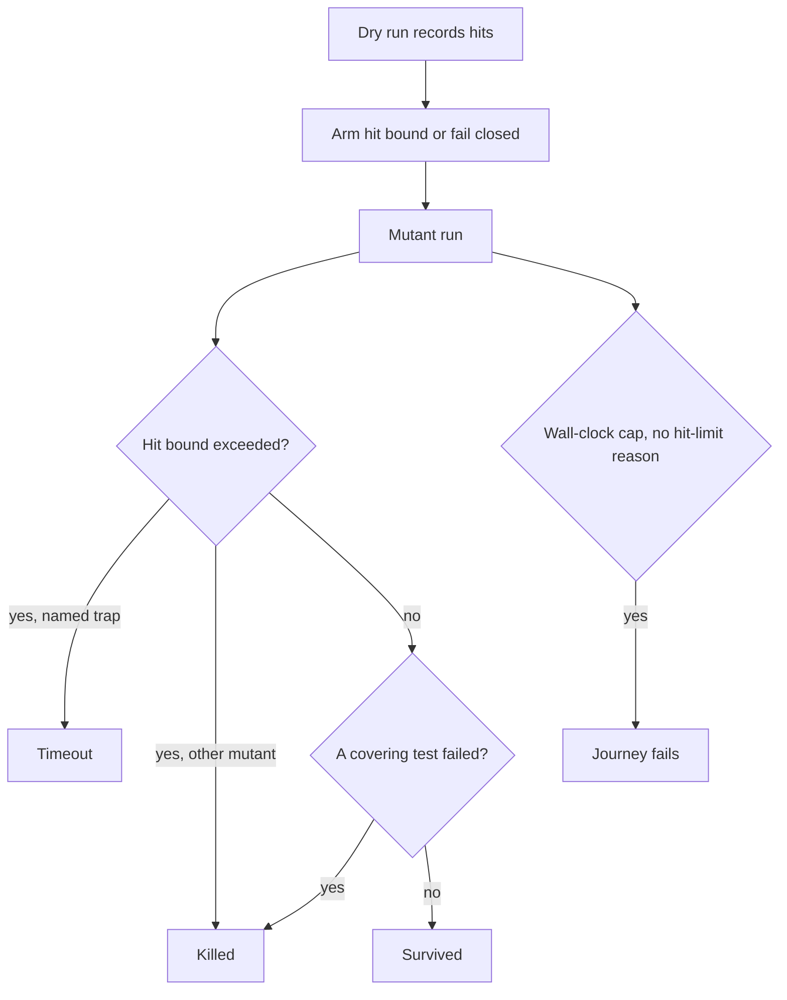

# Machine-Invariant Mutation Oracle - Plan

## Goal Capsule

- **Objective:** A mutation run passes or fails for the same reason on every machine that can finish the tests. Core count and load do not change the verdict, and a green run does not wait out a wall-clock budget for work that can finish.
- **Means:** Classify finite mutants from test assertions. Prove non-termination with a hit bound on one constructed infinite loop that no shorter timeout can rescue. Fail the run when a finite mutant is reported as a timeout.
- **Product authority:** Governs status assertions in the end-to-end mutation lane, and the condition under which a mutant may be reported Timeout. Supersedes the timeout-floor and survived-band clauses of R13' in `docs/plans/2026-09-21-1424-refactor-e2e-normalized-oracle-substrate-plan.md` where they conflict. The container substrate in that plan is not active scope here.
- **Open blockers:** None.

## Product Contract

### Summary

The lane stops blessing wall-clock counts from one machine and asserting them on another. Finite mutants are killed or survived from test results. One constructed infinite loop must come back as Timeout, detected by a hit bound. A finite mutant that times out fails the run.

### Problem Frame

Main CI reported 10 survivors where a blessed baseline required 15. The dry-run overhead plus a 500ms absolute timeout produced a budget of about 1.7 seconds, and 15 mutant runs were interrupted at that budget. The tests for one of those mutants finish in about 100 milliseconds when they are allowed to finish. The current journey pins survivors exactly and treats extra timeouts as allowed load. That pin moved with the machine. A floor taken from a bless run on a faster box has the same defect: another timeout inside the test can rescue a loop before the runner sees it, so the floor itself moves.

Stryker's documented score counts Timeout as detected, in the same bucket as Killed, and describes Timeout as tests that never finish, typically an infinite loop. A maintainer note on a run that timed out every mutant under core contention says that should not happen. A pass that depends on which box ran is the wrong design.

### Key Decisions

- **Machine-dependent pass/fail is a wrong design.** (session-settled: user-directed — chosen over blessed floors and count tweaks: if the result flakes by machine, the design is wrong.) Governs R1.
- **Replace clock-moved status pins rather than implement the existing timeout floor as written.** (session-settled: user-directed — chosen over implementing R13' as written: raise the ambition instead of patching the count.) Governs R5.
- **Prove non-termination with a hit bound, not a wider wall-clock budget.** (session-settled: user-approved — chosen over widening the clock: a wider budget is slower and still moves with the box.) Governs R3, R6, R8.
- **A finite mutant reported as Timeout fails the run.** (session-settled: user-approved — chosen over folding that case into the score: folding would hide a run that timed out everything.) Governs R4.
- **The rule covers every journey that pins Killed, Timeout, or Survived.** (session-settled: user-approved — the call-out stood when the scope was confirmed.) Governs R5, R8.

### Actors

- A1. The engineer who needs the lane green for the same reason on a workstation and in CI.
- A2. The mutation runner, which classifies each mutant and emits the verdict.

### Requirements

**Verdict**

- R1. A journey pass or fail is identical on any machine that can run the covered tests to completion. Core count, load, and wall-clock must not change that verdict.
- R2. The classifier emits Killed when at least one covering test fails, and Survived when every covering test passes. It must not emit Timeout, or any other status, for a finite mutant.
- R3. Timeout is reported only for one constructed infinite loop that cannot finish. The hit bound sits on a path that loop actually executes, and it does not depend on CPU speed. No inner test timeout may finish that loop before the bound fires.
- R4. If the runner reports Timeout for a finite mutant, the journey fails after that one wall-clock cap and does not start further mutants. That failure is a broken budget. It is not a count to bless or relax.
- R5. No journey pins Killed, Timeout, or Survived to a count, floor, or band taken from a bless run on one machine. Exact pins remain allowed for compile errors, ignored, no coverage, runtime errors, pending, and total.
- R6. A green run does not add waiting time versus classifying finite mutants from test assertions. Non-termination detection does not wait out a wall-clock budget.

**Score**

- R7. The customer mutation score still treats Timeout as detected, in the same bucket as Killed. This work does not change that score definition.
- R8. The live process seam proves at most two cases: the constructed loop reported Timeout, and a finite mutant clipped by a wall-clock cap failing the process. The finite classification law in R2 is proved on the pure decision, not by adding journeys that pin a status matrix.

### Key Flows

- F1. Finite mutant on a slow machine
  - **Trigger:** A2 runs a finite mutant on a machine slower than the one that last blessed counts.
  - **Actors:** A1, A2
  - **Steps:** Covering tests run to completion. A2 classifies from pass or fail. The journey does not compare the status to a blessed clock count.
  - **Outcome:** The verdict matches the verdict on a faster machine.
  - **Covers:** R1, R2, R5, R6
- F2. Constructed infinite loop
  - **Trigger:** A2 activates the constructed loop.
  - **Actors:** A2
  - **Steps:** The loop cannot finish. A hit bound fires. No shorter test timeout returns first.
  - **Outcome:** The mutant is Timeout. The wait is the bound, not a wall-clock cap.
  - **Covers:** R3, R6
- F3. Finite work clipped by a clock
  - **Trigger:** A wall-clock cap interrupts a finite mutant before its tests finish.
  - **Actors:** A1, A2
  - **Steps:** A2 reports Timeout for that mutant.
  - **Outcome:** The journey fails without burning a wall-clock cap for every remaining finite mutant. A1 does not update a blessed count to make it pass.
  - **Covers:** R4, R8

### Acceptance Examples

- AE1. Same finite verdict on two machines
  - **Covers R1, R2, R5.**
  - **Given:** a finite mutant whose covering tests fail.
  - **When:** the journey runs on a 2-core runner and on a 16-core workstation.
  - **Then:** both runs report that mutant Killed, and neither fails because a blessed survivor or timeout count differed.
- AE2. Loop is Timeout without a clock wait
  - **Covers R3, R6.**
  - **Given:** the constructed infinite loop, and a covering test with no timeout shorter than the hit bound.
  - **When:** A2 activates that mutant.
  - **Then:** the status is Timeout, and the run did not sit for a wall-clock cap to decide it.
- AE3. Clock clip fails the journey
  - **Covers R4.**
  - **Given:** a finite mutant whose tests can finish.
  - **When:** a wall-clock cap reports that mutant Timeout.
  - **Then:** the journey fails without waiting out that cap for every other finite mutant, and relaxing a blessed floor is not a passing fix.
- AE4. Score definition unchanged
  - **Covers R7.**
  - **Given:** a customer run whose only detected mutant is a Timeout.
  - **When:** the mutation score is computed.
  - **Then:** that mutant counts as detected, as it does today.

### Scope Boundaries

- Customer mutation-score math stays as documented. Timeout remains detected.
- No new bless of a timeout floor or a survived band from one machine.
- The one-shot container substrate in `docs/plans/2026-09-21-1424-refactor-e2e-normalized-oracle-substrate-plan.md` is not this plan's work.
- Interactive terminal output is out of scope.
- Additional end-to-end journeys that re-pin Killed, Timeout, or Survived matrices are refused. Per the test-layer admission gate, those laws stay on the pure decision.

<!-- ce-section: work-relationships -->

### How This Work Fits Together

This plan covers the status contract for the end-to-end mutation lane. The breakdown below is the current understanding, not a roadmap.

- Container substrate in `docs/plans/2026-09-21-1424-refactor-e2e-normalized-oracle-substrate-plan.md`
  - Can proceed independently of this status contract.
  - Shares the lane. Its timeout-floor and survived-band clauses are superseded here where they conflict with R5.

### Dependencies / Assumptions

Lens for this pass: Edge-First. First cycle, chosen because the artifact specified the happy path and left the clip and the rescued loop thin.

Three structural assumptions:

1. The constructed loop's body is on a path the hit bound can observe. If the bound sits on code the loop never executes, R3 cannot fire.
2. Covering tests used as R2 evidence do not themselves pass or fail because of scheduling. A timing-sensitive test is not evidence for R2.
3. A red clock-clip fails inside the lane's existing time budget. It does not spend a full wall-clock cap on each finite mutant first.

- Stryker's public mutant-state docs remain the score authority for R7: Timeout is detected, and the documented example is an infinite loop. Source: [Mutant states and metrics](https://stryker-mutator.io/docs/mutation-testing-elements/mutant-states-and-metrics/).
- Dry-run hit counts already feed `getHitLimit` in `packages/stryker-js/src/Mutants.ts`. A missing count returns no bound. That is the fail-open path KTD2 closes.
- Product Contract restructured, no scope change: R2 is the classifier law; R4 is the runner-observed failure.

### Outstanding Questions

- None. The retained `withTimeout` race is the wall-clock backstop. KTD3 treats that result as a run failure, not as Timeout evidence.

### Sources / Research

- [Mutant states and metrics](https://stryker-mutator.io/docs/mutation-testing-elements/mutant-states-and-metrics/). Timeout means tests never finished. Detected is killed plus timeout.
- [stryker#2447](https://github.com/stryker-mutator/stryker/issues/2447). A run that timed out every mutant under core contention still scored as fully detected. The maintainer said that should not happen.
- CI run `35634262299`, job `106447675477`, trace `c1d00d7a68633ff085f4865863d78d1c`. Survivors 10 versus a blessed 15. Fifteen mutant runs interrupted at a budget of about 1.7 seconds.
- `docs/plans/2026-09-21-1424-refactor-e2e-normalized-oracle-substrate-plan.md` R13'. Resilience was specified as a timeout floor. That clause is superseded where it conflicts with R5.
- Software wiki had no mutation-oracle article. Nearest taste: fast-check timeouts are runner limits, not the predicate (`software-wiki/wiki/entities/fastcheck-timeouts.md`).

---

## Planning Contract

Product Contract unchanged.

### Key Technical Decisions

- KTD1. Extend `decideVitestMutantRun` in place. Do not add a second classifier. (session-settled: user-approved — chosen over a second classifier: the hit-limit check already runs before a failed-test result.) The command gains the active mutant id, threaded from the runner that already has it. A hit-limit signal on the named trap is Timeout and the reason starts with `Hit limit reached`. The same signal on any other mutant is Killed. The hit-limit and wall-clock reason strings are exported constants in one module in `packages/stryker-js` that the vitest runner imports; property tests pin the constants, not literals. Governs R2, R3.
- KTD2. A covered mutant with no dry-run hit count does not run under a wall-clock cap alone. The run fails on the stage-failure path the mutation-test cell already uses. Do not add a new plan variant. Today `getHitLimit` returns no bound when the count is missing.
- KTD3. `withTimeout` sets reason `wall-clock-timeout` when it synthesizes a timeout. That result fails the run and does not record a mutant. (session-settled: user-approved — chosen over recording Timeout and continuing: R4 forbids starting further mutants after the first cap.) A completed interpreter result is not masked by the race. Governs R4, R6.
- KTD4. The named trap is a dedicated loop and test with no test timeout shorter than the hit bound. An inner timeout that finishes the loop first makes the mutant Killed and R3 fails. The existing 300ms timeout on `executeBatchUntilTarget` is that rescue. The trap does not use it.

### High-Level Technical Design

### Sequencing

U1 before U3. U2 before U4. U5 after U1 through U4, so the seam exists before clock pins are removed.

---

## Implementation Units

### U1. Hit-limit law in the vitest interpreter

- **Goal:** The interpreter reports Timeout only for the named trap's hit-limit signal, and Killed when that signal belongs to any other mutant.
- **Requirements:** R2, R3. Covers AE2.
- **Dependencies:** none
- **Files:**
  - `packages/stryker-js-vitest-runner/src/interpret-vitest-run.workflow.ts`
  - `packages/stryker-js-vitest-runner/src/Runner.ts`
  - `packages/stryker-js-vitest-runner/src/Runner.schema.ts`
  - `packages/stryker-js-vitest-runner/src/__tests__/interpret-vitest-run.workflow.property.test.ts`
- **Approach:** Add the active mutant id to `VitestMutantRunCommand` and its schema. `Runner.ts` already has that id and drops it when it builds the command. Pass it through. The named trap id is the id the seam config names, not a hard-coded string in the interpreter. Keep hit-limit precedence over failed tests.
- **Patterns to follow:** `decideVitestMutantRun` and the hit-limit property already in that test file.
- **Test scenarios:**
  - Covers AE2. Hit count above the bound and mutant id equal to the named trap yields Timeout, and the reason names the hit limit.
  - Hit count above the bound and any other mutant id yields Killed, not Timeout.
  - Hit count at or below the bound and one failed test yields Killed.
  - Hit count at or below the bound and no failed test yields Survived.
  - Missing hit count does not yield Timeout.
- **Verification:** The property file fails if hit-limit on the trap is classified as Killed, or if hit-limit on another mutant is classified as Timeout.

### U2. Fail closed when the hit bound is missing

- **Goal:** A covered mutant is not sent to a wall-clock wait because its dry-run hit count was missing.
- **Requirements:** R3, R4, R6
- **Dependencies:** none
- **Files:**
  - `packages/stryker-js/src/Mutants.ts`
  - `packages/stryker-js/src/__tests__/mutant-hit-limit.property.test.ts`
- **Approach:** `getHitLimit` stays the bound function. A covered mutant with no hit count fails the run on the stage-failure path `mutation-test.cell.ts` already uses. Do not add a plan variant. Uncovered mutants are not run.
- **Patterns to follow:** `getHitLimit` and `toRunPlan` in `packages/stryker-js/src/Mutants.ts`.
- **Test scenarios:**
  - A defined hit count yields count times `HIT_LIMIT_FACTOR`.
  - A covered mutant with no hit count does not produce a run plan whose only stop is the wall-clock cap.
  - An uncovered mutant is not given a hit bound and is not run.
- **Verification:** A property fails if a missing hit count still produces a runnable plan whose only stop is the wall-clock cap.

### U3. Wall-clock overrun fails the run

- **Goal:** A timeout with no hit-limit reason stops the journey. It does not append a Timeout mutant and continue.
- **Requirements:** R4, R6, R7. Covers AE3.
- **Dependencies:** U1
- **Files:**
  - `packages/stryker-js/src/TestRunner.ts`
  - `packages/stryker-js/src/run/mutation-test.cell.ts`
  - `packages/stryker-js/src/__tests__/wall-clock-timeout.property.test.ts`
- **Approach:** `withTimeout` sets reason `wall-clock-timeout` on the result it synthesizes. The cell fails the run on that reason and does not schedule further mutants. A Timeout whose reason starts with `Hit limit reached` is recorded and the run continues. A completed interpreter result is not replaced by the race.
- **Patterns to follow:** `withTimeout` in `packages/stryker-js/src/TestRunner.ts`.
- **Test scenarios:**
  - Covers AE3. A timeout result with no hit-limit reason fails the run and does not record a Timeout mutant.
  - A timeout result with the hit-limit reason records Timeout and the run continues.
  - The failure path does not start another mutant run after the first wall-clock overrun.
- **Verification:** A property fails if a bare wall-clock timeout is stored as a mutant Timeout.

### U4. Named trap the inner timeout cannot rescue

- **Goal:** One infinite loop is covered in the dry run, exceeds its hit bound when mutated, and is not finished by a shorter test timeout.
- **Requirements:** R3, R6. Covers AE2.
- **Dependencies:** U2
- **Files:**
  - `test/e2e/testResources/enterprise-monorepo-fixture/packages/services/src/nontermination.ts`
  - `test/e2e/testResources/enterprise-monorepo-fixture/packages/services/src/nontermination.test.ts`
  - `test/e2e/testResources/enterprise-monorepo-fixture/stryker.resilience.config.ts`
- **Approach:** The test calls the loop with a finite count so the dry run records hits. The mutant makes the loop unable to finish. The test sets no timeout of its own. The resilience config mutates this file for the seam. Do not reuse the 300ms timeout on `executeBatchUntilTarget`.
- **Patterns to follow:** The loop in `packages/services/src/concurrency.ts`, without a per-test timeout.
- **Test scenarios:**
  - Covers AE2. Dry run of the unmutated loop finishes and records a hit count greater than zero.
  - The mutated loop cannot reach its exit. No test-level timeout is declared.
  - The resilience mutate list includes this file and does not depend on `concurrency.ts` for the trap.
- **Verification:** The fixture test passes unmutated. The file declares no test timeout.

### U5. Drop clock pins and keep two seam cases

- **Goal:** No journey gates on a blessed Killed, Timeout, or Survived count. The resilience journey proves the two seam cases and nothing else about those statuses.
- **Requirements:** R1, R5, R8. Covers AE1, AE2, AE3.
- **Dependencies:** U1, U3, U4
- **Files:**
  - `test/e2e/tests/enterprise-runner-resilience.e2e.test.ts`
  - `test/e2e/tests/enterprise-mutation-lifecycle.e2e.test.ts`
  - `test/e2e/tests/enterprise-mutator-edge-cases.e2e.test.ts`
  - `test/e2e/tests/enterprise-composite-checker.e2e.test.ts`
  - `test/e2e/tests/mutation-run.e2e.test.ts`
  - `test/e2e/scripts/oracle/literal-block.ts`
  - `test/e2e/scripts/oracle/slice-config.ts`
  - `test/e2e/scripts/reconcile-oracle.ts`
- **Approach:** Delete survived floors, timeout floors, and exact killed or survived pins from journey literals and the reconciler's clock bands. Keep compile errors, ignored, no coverage, runtime errors, pending, and total. The resilience journey asserts the named trap is Timeout and that a forced finite wall-clock clip fails the process. Do not add a new end-to-end file.
- **Patterns to follow:** Existing journey files and `literal-block.ts`. R8 caps the seam at two cases.
- **Test scenarios:**
  - Covers AE1. A lifecycle or calc journey no longer fails because survived or killed differed from a blessed count.
  - Covers AE2. The resilience seam reports the named trap as Timeout.
  - Covers AE3. The resilience seam fails the process when a finite mutant is clipped by the wall-clock cap, and it does not continue the rest of that run.
  - Reconcile does not emit a survived floor or a timeout floor for any slice.
- **Verification:** Journey tests contain no exact survived length pin and no timeout floor taken from a baseline. The resilience file contains the two seam cases.

---

## Verification Contract

- U1: `pnpm --filter @systemfsoftware/stryker-js-vitest-runner exec vitest run src/__tests__/interpret-vitest-run.workflow.property.test.ts`
- U2 and U3: `pnpm --filter @systemfsoftware/stryker-js exec vitest run src/__tests__/mutant-hit-limit.property.test.ts src/__tests__/wall-clock-timeout.property.test.ts`
- U5 oracle scripts: `pnpm --filter @systemfsoftware/stryker-e2e exec vitest run scripts/oracle`
- U5 seam: `pnpm --filter @systemfsoftware/stryker-e2e exec vitest run tests/enterprise-runner-resilience.e2e.test.ts`
- Lane gate after U5: `pnpm test:e2e` finishes inside the existing 1200s budget. A green run does not show mutant runs sitting on the 1.7s cap.

---

## Definition of Done

- R1 through R8 hold for the seam cases on a 2-core run and a 16-core run.
- No journey pins Killed, Timeout, or Survived to a blessed count, floor, or band.
- The named trap is Timeout without waiting out a wall-clock cap.
- A finite wall-clock clip fails the run once, then stops.
- The customer score still counts Timeout as detected.
- Abandoned experiments are not in the diff.
- `pnpm format:check`, `pnpm typecheck`, and `pnpm test` pass for the packages this plan touches.

### Risks

- A missing hit count that fails closed will reject runs that today wait out the cap. That closes the fail-open path on purpose.
- The vitest default test timeout is 5 seconds. The trap must accrue hits faster than that, and must not declare a shorter timeout. The 300ms timeout on `executeBatchUntilTarget` is the known rescue.
- A runner other than the vitest plugin is out of this plan. A pinning journey that uses one cannot drop its clock pin until the same law exists there.

### Deferred to Follow-Up Work

- Hit-bound parity for the in-memory VM runner, if a journey starts pinning clock statuses through it.

---

## Appendix

### Destructive review

Lens: Edge-First, first cycle. The happy path was specified and the clip and the rescued loop were thin.

Kept: R1, R7, and the session-settled decisions. Replaced implied new end-to-end status matrices with R8's two seam cases. Added the requirement that the hit bound sit on a path the loop executes, and that a red clip must not burn a cap per finite mutant. Removed blessing another timeout floor.

### External guidance that shaped KTD2 and KTD3

- Stryker arms hit limits from dry-run coverage. An unarmed guard burns wall-clock. [Mutation switching](https://stryker-mutator.io/blog/2020-07-13/announcing-stryker-4-beta-mutation-switching).
- Infection fails the build on too many timeouts. Timeouts are not a blessed count. [Infection usage](https://infection.github.io/guide/usage.html).
- [stryker#2447](https://github.com/stryker-mutator/stryker/issues/2447). Counting every timeout as detected hid a run that timed out everything.
