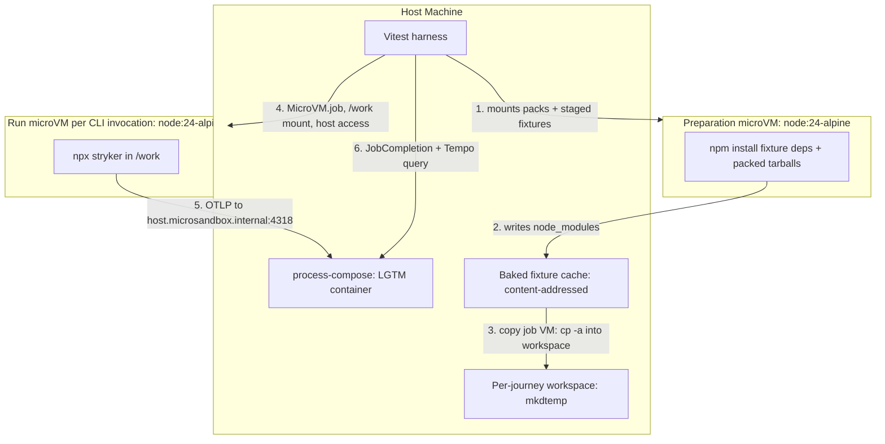
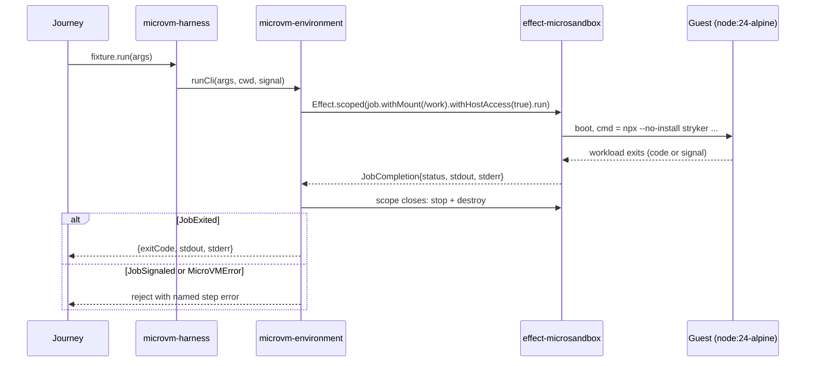
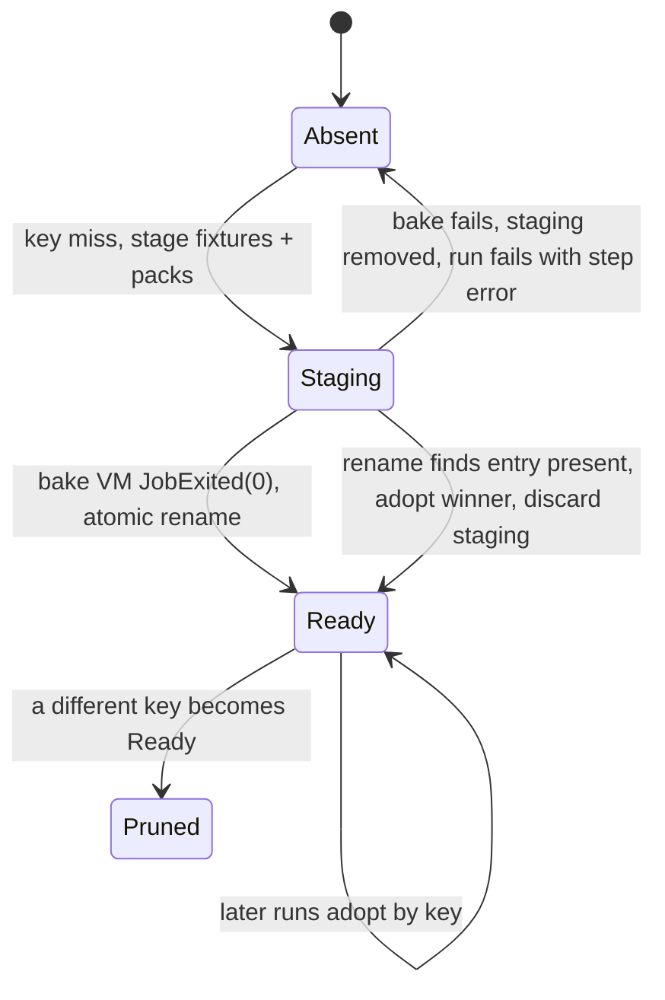

# Migrate E2E Isolation Substrate to MicroVMs - Plan

## Goal Capsule

- **Objective:** A contributor or CI runner with hardware virtualization can run `pnpm test:e2e` and get the same authored oracle verdicts and Tempo traces for the shipped `stryker` artifact, with no container engine installed or configured for the lane.
- **Means:** Each engine invocation runs as a one-shot `@systemfsoftware/effect-microsandbox@0.2.0` job microVM against a workspace copied from a content-addressed, guest-baked fixture cache (KD1, KD2, KTD1, KTD2).
- **Product Authority:** Product Contract R-IDs win on behavior; KTDs win on mechanism. The host-side Grafana LGTM stack under `process-compose.yaml` stays containerized (KD4).
- **Execution profile:** `ce-work` inside the `lfg` pipeline on branch `testcontainers-to-microsandbox`. The pipeline ships through a PR and a human merges it.
- **Stop conditions:** Stop and report if the authored oracle literals in `test/e2e/tests/*.e2e.test.ts` or `test/e2e/oracle-baselines/*.json` would need to change. Also stop if a judgment surface would need an edit: `.github/workflows/`, `test/e2e/AGENTS.md` rule rows, `vitest*.config.ts` timeouts, or lint configs (CONST-E9). Never add a container fallback (KD6).
- **Open Blockers:** None for implementation. The KVM proof needs a host with read/write `/dev/kvm`: this agent sandbox has none, and the CI `e2e` job gets one only after the owner adds the udev step (see Risks & Dependencies).

---

## Product Contract

### Summary

The `test/e2e` lane moves from container isolation (`podman`/`docker run --rm`) to hardware-isolated microVMs driven by `@systemfsoftware/effect-microsandbox`. Each CLI run executes as a one-shot job inside a digest-pinned `node:24-alpine` microVM. Fixture dependencies are installed once by a preparation microVM into a host cache instead of being baked into a Docker image. The seven journeys, their authored oracle literals, and Tempo trace grading stay as they are.

### Problem Frame

The lane depends on a local container engine, and that causes three problems:

1. **Socket and daemon requirements.** Developers need a working rootful or rootless Podman/Docker socket. In rootless user namespaces with `pasta`, and inside containerized agent sandboxes, container-to-host loopback routing often fails.
2. **Fragile bake step.** Pre-baking every fixture's `npm install` into `stryker-js-effect-e2e:latest` through a `Dockerfile` and `entrypoint.sh --bake-all` needs a container build tool. The fixed image tag makes a run reuse stale bundles until someone runs `podman rmi` by hand (E2E-7).
3. **Platform lock-in.** Local runs are limited to Linux hosts with a container runtime, although the toolchain is plain TypeScript and Node.js.

### Key Decisions

- **KD1. One-shot job microVM per CLI invocation.** Each `stryker` run executes in a disposable `MicroVM.job` with a fresh guest root filesystem. (session-settled: user-directed — chosen over a long-lived service VM per test file: preserves the pristine-filesystem isolation guarantee of KTD8/R18 and eliminates cross-mutant state leakage). Governs R1, R2, R4.
- **KD2. Host-mounted fixture cache instead of image baking.** Dependencies are installed inside a guest microVM once and cached in a host directory that later run VMs consume. (session-settled: user-directed — chosen over publishing baked OCI images to GHCR: removes container build tools and external registry credentials from the test pipeline). Governs R5, R6.
- **KD3. Upstream DSL extensions in `effect-microsandbox`.** Missing runtime capabilities are added to the upstream package, not worked around with shell wrappers. (session-settled: user-directed — chosen over in-harness driver workarounds: aligns with cell architecture and upstream ownership). Governs R3, R7, R8.
- **KD4. Test-lane substrate only.** The migration covers the runner harness in `test/e2e`; the LGTM stack stays under `process-compose.yaml`. (session-settled: user-directed — chosen over moving the LGTM stack into a microVM: avoids multi-container microVM composition complexity). Governs R9.
- **KD5. Parity before deletion (CONST-T9).** The unchanged journeys must pass their unchanged authored literals on the microVM substrate before the container plumbing counts as retired. Governs R10, R11.
- **KD6. MicroVMs with no exceptions.** The lane has no container fallback and no dual substrate. A host without virtualization fails fast (AE3). (session-settled: user-directed — chosen over keeping podman/docker as a fallback for hosts without KVM: the user required microsandboxes with no exceptions). Governs R1, R4.

---

### Requirements

**Execution substrate and lifecycle**

- R1. Every Stryker CLI execution the harness triggers MUST run inside its own microVM managed by `@systemfsoftware/effect-microsandbox`.
- R2. Each microVM invocation MUST start from a pristine guest root filesystem and leave no guest state for the next run.
- R3. The run microVM MUST be able to reach host services at `host.microsandbox.internal`, so in-guest processes can export OpenTelemetry data to the host collector. (pack: boundary-testing, `real-system-oracles.md`)
- R4. The microVM lifecycle MUST live in an Effect `Scope`, so normal exit, failure, and interruption each destroy the VM and release host resources.

**Fixture preparation and caching**

- R5. The lane MUST run against the digest-pinned base image `node:24-alpine@sha256:333f6b3eca25980d5682c26207665b93c9417786b21760b2764d5821d9704c8a` without `podman build` or `docker build`.
- R6. Fixture packages and the packed workspace tarballs (`pnpm pack`) MUST be installed once into a host cache directory during a preparation phase, and run microVMs MUST execute against that installed tree.

**Upstream DSL capabilities (`@systemfsoftware/effect-microsandbox`)**

- R7. `@systemfsoftware/effect-microsandbox` MUST expose a per-job opt-in that lets the guest reach the host at `host.microsandbox.internal`. It shipped as `withHostAccess(true)` in 0.2.0.
- R8. `@systemfsoftware/effect-microsandbox` MUST let a caller await a job's default workload and receive its exit status, stdout, and stderr. It shipped as `JobResource.run` returning `JobCompletion` in 0.2.0.

**Observability and diagnostics**

- R9. The CLI and worker processes inside the microVM MUST export OTLP traces to the host-side LGTM collector at `http://host.microsandbox.internal:4318`.
- R10. The trace assertions in `test/e2e/tests/enterprise-mutation-lifecycle.e2e.test.ts` MUST keep querying Tempo over HTTP with no code change.

**Verification and budget**

- R11. All seven E2E journeys MUST pass against their authored oracle counts (`oracle-baselines/*.json`) with no baseline value changed and no assertion weakened. (pack: boundary-testing, `real-system-oracles.md`)
- R12. The full E2E suite on microVMs MUST complete within the 1,200-second CI budget.
- R13. The `test/e2e` package MUST keep declaring no `test` script, so it stays reachable only through the `pnpm test:e2e` turbo task.

Product Contract preservation: R7 and R8 were reworded to name the combinators as they shipped in `@systemfsoftware/effect-microsandbox@0.2.0` (issue systemfsoftware/systemfsoftware#471, PR #472). Their intent did not change. KD6 records a decision the user settled in the brainstorm session and adds no new scope. Everything else is unchanged.

---

---

### Key Flows

- F1. Pre-run fixture bake
  - **Trigger:** Vitest global setup runs before any journey file, or a standalone caller (`scripts/blessed-baseline.ts`) makes its first harness call.
  - **Actors:** Vitest harness, microVM engine, host filesystem.
  - **Steps:**
    1. Build and pack the workspace closure resolved through Turbo.
    2. Derive the cache key from the base image digest, the tarball bytes, the fixture sources, and the bake script.
    3. If no cache entry exists for that key, boot a preparation microVM that mounts the tarballs and a staging copy of the fixtures.
    4. Run `npm install` for each fixture inside the guest, against the registry and then against the packed tarballs.
    5. Move the staging directory into place as the cache entry for that key.
  - **Outcome:** Installed fixtures exist on the host, keyed by content, ready to copy into workspaces.
  - **Covered by:** R5, R6.

- F2. Isolated test invocation
  - **Trigger:** A journey calls `fixture.run(args)`.
  - **Actors:** Test journey, microVM harness, host collector.
  - **Steps:**
    1. The first `install` for a fixture name populates a fresh host workspace from the baked fixture tree through a copy job microVM (KTD3).
    2. The harness builds a `MicroVM.job` on the pinned base image. It sets the OTEL environment, host access, a memory limit, workdir `/work`, and a mount of the workspace at `/work`.
    3. The VM boots, and its default workload runs `npx --no-install stryker ...`.
    4. The CLI writes NDJSON to stdout and exports traces to `host.microsandbox.internal:4318`.
    5. The workload exits, the scope closes, and the VM is destroyed.
    6. The harness returns `{ exitCode, stdout, stderr }` to the test.
  - **Outcome:** An execution result with no residual guest state.
  - **Covered by:** R1, R2, R3, R4, R8, R9.

---

### Acceptance Examples

- AE1. Parity under the mutation lifecycle journey
  - **Covers:** R1, R2, R11
  - **Given:** An enterprise fixture workspace mounted into a microVM.
  - **When:** The lifecycle journey runs a full mutation run through `fixture.run(['run'])`.
  - **Then:** The run exits 0 and the normalized projection matches `LIFECYCLE_COUNTS` (`killedOrTimeout: 195`, `compileErrors: 98`, `survived: 30`).

- AE2. Trace emission to the host collector
  - **Covers:** R3, R9, R10
  - **Given:** The host LGTM container is running with port 4318 reachable.
  - **When:** A microVM runs Stryker with `OTEL_ENABLED="true"` and the endpoint rewritten to `http://host.microsandbox.internal:4318`.
  - **Then:** The lifecycle journey polls Tempo at `http://127.0.0.1:3200` and validates the span counts for its execution window.

- AE3. Fast failure without hardware virtualization
  - **Covers:** R4, R13
  - **Given:** A host without read/write access to `/dev/kvm`.
  - **When:** The E2E suite initializes.
  - **Then:** The harness fails immediately with the `VirtualizationUnsupportedError` message and its remediation, and it does not hang.

---

### Scope Boundaries

#### Included in Scope

- Rewriting the harness in `test/e2e/tests/__fixtures__/` to run on `@systemfsoftware/effect-microsandbox` instead of the podman/docker CLI.
- Removing `test/e2e/tests/__fixtures__/image/` (`Dockerfile`, `entrypoint.sh`) and the image-building logic.
- Removing the obsolete `TESTCONTAINERS_*` and `DOCKER_HOST` pass-through variables from `turbo.json`.
- Removing the unused `testcontainers` catalog entry from `pnpm-workspace.yaml`.
- Updating the lane's runbooks: `test/e2e/README.md` and the descriptive sections of `test/e2e/AGENTS.md`, including the CI KVM snippet for the workflow owner.

#### Deferred for Later

- Migrating the host-side LGTM stack (`process-compose.yaml`) from Podman to a microVM.
- Enrolling the E2E lane in macOS CI runners. CI stays Linux-only.
- MicroVM disk snapshotting or branching primitives.

#### Outside This Product's Identity

- Unit-testing internal harness helpers with mocks (prohibited by the boundary-testing pack).
- Retargeting dogfood mutation packages away from published catalog versions.
- Changing authored oracle numbers to absorb performance or timing changes.

#### Deferred to Follow-Up Work

- Adding the KVM udev step to the `e2e` job in `.github/workflows/ci.yml`. The workflow is read-only here, so this belongs to the workflow owner.
- Updating rule rows E2E-6 and E2E-7 in `test/e2e/AGENTS.md`, which still describe `host.containers.internal` and `podman rmi`. That file is a rule list and a judgment surface under CONST-E9, so this also belongs to its owner.
- Narrowing the LGTM OTLP publish in `process-compose.yaml` back to loopback. Host access reaches `127.0.0.1`-bound host services, so the all-interfaces publish added for rootless pasta is no longer needed by this lane (KD4 keeps the file out of scope).
- A `withCpus` combinator in `@systemfsoftware/effect-microsandbox`, if CI shows the lane is CPU-bound (see Risks & Dependencies).

---

### Success Criteria

- SC1. **No container engine for the lane.** `pnpm test:e2e` completes on a KVM-enabled host with no Docker daemon, Podman socket, or container CLI. The LGTM stack is needed only when `OTEL_ENABLED=true` (KD4).
- SC2. **No oracle regression.** All four baseline suites (`checker`, `edge`, `lifecycle`, `resilience`) pass with no deviation from the authored counts.
- SC3. **CI wall-clock compliance.** The full E2E suite completes in GitHub Actions in under 1,200 seconds.
- SC4. **Clean teardown.** No microVM, background process, or scratch directory the lane created remains after a completed or interrupted run.

---

## Planning Contract

### Key Technical Decisions

- KTD1. **One-shot `MicroVM.job(...).run` inside an Effect scope per `runCli` call.** The run is interpreted at a single edge in the harness with `NodeServices.layer`. `JobExited(code)` maps to `exitCode`. `JobSignaled` rejects with a named error rather than becoming a number, because aliasing a signal death to 1 would collide with the CLI's classed `VerdictFail` code 1 and could pass a journey falsely. The rejection names the guest memory limit (KTD9) as the first suspect, because a guest OOM kill is the plausible signal death. Any `MicroVMError` rejects with its tag and message, which keeps AE3's remediation text intact. This instantiates KD1 and cites R1, R2, R4, R8.
- KTD2. **Content-addressed bake cache, populated by a preparation microVM.** The key is a SHA-256 over four inputs: the base image reference, each packed tarball's bytes, every fixture source file (excluding any `node_modules`), and the bake script. An entry is staged in a sibling directory and renamed into place only after the bake VM exits 0, so a crashed bake is never adopted. If the rename finds the entry already present because a concurrent bake won, the loser discards its staging directory and adopts the winner. A source change always re-bakes, which removes the E2E-7 stale-image ritual by construction. The cache lives under `test/e2e/node_modules/.cache/stryker-e2e/baked/<key>`, which is gitignored and survives local reruns. After a successful bake, entries under other keys are pruned. This instantiates KD2 and cites R5, R6.
- KTD3. **Workspaces are populated by a copy job VM; CLI run VMs mount only the workspace.** `installFixture` creates a `mkdtemp` workspace. It then runs one fixed-argv job VM that mounts `<cache>/<fixtureId>` and the workspace and runs `cp -a` from one to the other. CLI run VMs mount only `/work`. The copy stays in the guest because microsandbox mounts virtualize file identity: guest permission changes do not rewrite host inode modes and may live in per-file metadata overrides (docs.microsandbox.dev/security/filesystem, changelog 2026-08-28). A host-side `fs.cp` of the guest-baked tree could therefore drop the exec bits `npx` needs on `node_modules/.bin/*`. Keeping the cache out of CLI run VMs keeps it immutable under concurrent runs, because the DSL offers only read-write binds. The in-guest `entrypoint.sh` and its `.baked-complete` marker are no longer needed. This cites R2 and R6.
- KTD4. **Always rewrite a loopback OTLP endpoint to `host.microsandbox.internal`, and always opt run VMs into host access.** The `--network host` probe and the `host.containers.internal` branch go away. CI still exports `OTEL_EXPORTER_OTLP_ENDPOINT=http://127.0.0.1:4318` from a read-only workflow, so the rewrite of `127.0.0.1`/`localhost` stays. The bake VM gets no host access, because it needs only the public npm registry, which the default policy allows. This cites R3 and R9.
- KTD5. **The global setup bakes once and hands the cache path to workers through an environment variable.** Vitest spawns its workers after global setup, so they inherit `process.env`. Workers then skip packing entirely. Standalone callers such as `scripts/blessed-baseline.ts` bake on first use when the variable is absent. Vitest `provide`/`inject` was rejected because the harness module also runs outside Vitest.
- KTD6. **The lane declares a direct dependency on `microsandbox@0.7.2` only for orphan cleanup.** The global setup's start and its teardown remove `effect-microsandbox-<pid>-*` sandboxes whose owner PID is no longer alive. This covers the case where a worker process is killed and the scope finalizers never run. Live-owner sandboxes are never touched. The version is pinned to the one `effect-microsandbox@0.2.0` depends on, so both resolve to one runtime. This cites R4 and SC4.
- KTD7. **In-flight runs follow the test's abort signal.** Each `runCli` passes the test's `AbortSignal`, when Vitest exposes one, to the Effect run, so a Vitest test timeout interrupts the fiber and the scope destroys the VM. This cites R4.
- KTD8. **Rename the harness modules to match the substrate.** `container-environment.ts` becomes `microvm-environment.ts`, and `container-harness.ts` becomes `microvm-harness.ts`, using an LSP file rename. The journeys change only their import paths; their bodies and literals stay byte-identical (R11). `runShell` is deleted because no journey or script calls it.
- KTD9. **Set an explicit guest memory limit; accept the default vCPU count.** Old containers ran with no limits, and the lifecycle journey runs vitest workers plus the TypeScript checker, which the unstated default memory may not fit. `withMemoryLimit` sets memory; its starting value is fixed during implementation. The DSL has no vCPU combinator, so the runtime default applies. If R12 fails for CPU reasons, the remedy is an upstream `withCpus`, never a weaker assertion (R19 of `docs/plans/2026-09-21-1424-refactor-e2e-normalized-oracle-substrate-plan.md`).

### High-Level Technical Design

This sketch of one invocation's lifecycle is directional, not an implementation spec:

Bake-cache state per key:

### Assumptions

- `pnpm pack` output is byte-stable for unchanged sources. If it is not, every run re-bakes: slower, but still correct. Hashing the unpacked contents is the fallback, decided during implementation.
- Vitest workers inherit environment variables set in global setup (KTD5). If they do not, the worker path computes the key itself, which costs a pack per worker.
- microsandbox pulls `node:24-alpine@sha256:333f…` from Docker Hub without authentication. The anonymous pull-rate limit is a CI risk, not a design input.
- The default network policy allows the bake VM to reach `registry.npmjs.org` (docs.microsandbox.dev/networking/overview: public access on by default).

### Sequencing

U1 lands first because every other unit imports its dependencies. U2 and U3 share `microvm-environment.ts` and land in that order. U4 depends on U3's harness shape. U5 comes last because it documents the final behavior.

---

## Implementation Units

### U1. Dependency and task wiring

- **Goal:** Make `@systemfsoftware/effect-microsandbox`, `microsandbox`, and `@effect/platform-node` available to the lane, and remove the container-era wiring.
- **Requirements:** R1, R13; KTD6.
- **Dependencies:** none.
- **Files:**
  - Modify: `pnpm-workspace.yaml` (catalog: add `@systemfsoftware/effect-microsandbox: ^0.2.0` and `microsandbox: 0.7.2`, remove `testcontainers: ^12`)
  - Modify: `test/e2e/package.json` (devDependencies on those catalogs plus `@effect/platform-node`, and a description that names microVMs)
  - Modify: `turbo.json` (the `test:e2e` `passThroughEnv` drops `TESTCONTAINERS_RYUK_DISABLED`, `TESTCONTAINERS_RYUK_PRIVILEGED`, `TESTCONTAINERS_HOST_OVERRIDE`, `DOCKER_HOST`)
  - Modify: `pnpm-lock.yaml`
- **Approach:** Use catalog references, matching every other devDependency in `test/e2e/package.json`. Keep `catalog:stryker` untouched (START-6). The `test` script stays absent (R13).
- **Test expectation:** none -- dependency and task wiring. `pnpm install --frozen-lockfile` and the workspace typecheck prove it.
- **Verification:** A frozen install succeeds, and `testcontainers` appears nowhere in the lockfile's importers.

### U2. Guest-baked, content-addressed fixture cache

- **Goal:** Replace the Dockerfile image build with a preparation microVM that installs every fixture into a keyed host cache.
- **Requirements:** R5, R6, R2; F1; KD2; KTD2, KTD5.
- **Dependencies:** U1.
- **Files:**
  - Create: `test/e2e/tests/__fixtures__/bake-fixtures.sh` (the `--bake-all` loop from today's `entrypoint.sh`, run in place over the staged fixtures)
  - Modify: `test/e2e/tests/__fixtures__/microvm-environment.ts` (renamed in U3; this unit owns the bake path)
  - Modify: `test/e2e/tests/__fixtures__/global-setup.ts`
  - Delete: `test/e2e/tests/__fixtures__/image/Dockerfile`, `test/e2e/tests/__fixtures__/image/entrypoint.sh`
- **Approach:**
  1. Keep `resolvePackableClosureFromTurbo`, `packWorkspaceClosure`, and the closure invariant (`docs/solutions/build-errors/e2e-lane-packed-a-subset-of-its-workspace-closure.md`, I1 to I3) as they are. The closure is still built, then packed, then installed in one `npm install` invocation.
  2. Derive the key from the inputs in KTD2. On a hit, adopt the entry. On a miss, stage each `testResources/*` fixture that has a `package.json` into `<key>.staging-<pid>`, then run the bake job VM with the staging dir at `/baked`, the tarballs at `/packs`, and the script dir mounted. Then rename the staging dir to the entry and prune the other keys.
  3. Name each failure by its step (`requireStep`). The bake job's non-zero exit carries the tail of its stderr, which keeps the I3 split between registry installs and closure installs readable.
  4. Delete `runtimeBinary`, `RUNTIME`, `adoptExistingImage`, `buildImage`, `noteHostNetworking`, `tmpfsBuildScaffoldEnv`, `assembleBuildContext`, `IMAGE_TAG`, and the `/baked` probe.
  5. The global setup bakes, exports the cache path (KTD5), and returns a teardown that removes the pack scratch.
- **Execution note:** This is mostly packaging and runtime work. Prove it with a throwaway script that computes the key twice with no change, then again after touching one fixture file, rather than with a committed unit test.
- **Patterns to follow:** `requireStep` naming in the current harness; the bake loop in today's `entrypoint.sh`.
- **Test scenarios** (lane observations on a KVM host plus throwaway scripts; this unit adds no committed test, per the test-layer gate in the Verification Contract):
  - Covers F1. A cold cache on a KVM host produces an entry in which every fixture has `node_modules` and each `@systemfsoftware/stryker-*` lock entry resolves to `file:…tgz`.
  - A second run with no source change adopts the entry and boots no bake VM.
  - Changing one byte of a workspace package's source changes the tarball, then the key, and triggers a re-bake that the next journey observes (the E2E-7 regression case).
  - A bake that fails (for example, an unresolvable fixture dependency) leaves no entry under the key, and the lane fails with the named bake step and the npm stderr tail.
  - Covers AE3. On a host without `/dev/kvm`, global setup fails with the `VirtualizationUnsupportedError` remediation and never hangs.
- **Verification:** The lane's global setup completes on a KVM host, and neither `podman` nor `docker` is invoked anywhere in the harness.

### U3. One-shot run microVM per CLI invocation

- **Goal:** Run every `runCli` call as `MicroVM.job(...).run` against a workspace copied from the cache.
- **Requirements:** R1, R2, R3, R4, R8, R9, R10; F2; KD1, KD6; KTD1, KTD3, KTD4, KTD7, KTD8, KTD9.
- **Dependencies:** U2.
- **Files:**
  - Rename: `test/e2e/tests/__fixtures__/container-environment.ts` → `test/e2e/tests/__fixtures__/microvm-environment.ts`
  - Rename: `test/e2e/tests/__fixtures__/container-harness.ts` → `test/e2e/tests/__fixtures__/microvm-harness.ts`
  - Modify: import lines only in `test/e2e/tests/*.e2e.test.ts` (8 files) and `test/e2e/scripts/blessed-baseline.ts`
- **Approach:**
  1. `installFixture` creates a workspace with `mkdtemp` and populates it through the copy job VM (KTD3).
  2. `runCli` builds the job with these settings:
     - the pinned base image;
     - `cmd` `npx --no-install stryker …args`;
     - `withWorkdir('/work')` and `withMount({ host: cwd, guest: '/work' })`;
     - `withEnv` carrying the OTEL variables with the endpoint rewritten (KTD4);
     - `withHostAccess(true)` and `withMemoryLimit` (KTD9).
  3. It then runs the job under `Effect.scoped` at one interpretation edge, provided with `NodeServices.layer` (pack: cell-architecture, `scoped-lifecycle-boundaries.md`).
  4. The job's stdout and stderr are decoded as UTF-8, and the status is mapped as KTD1 specifies.
  5. The harness fixture threads the test's abort signal into `run` (KTD7). The `ContainerHarness` and `PreparedFixture` shapes keep their fields, so journeys need no body change.
  6. Rename the symbols: `ensureContainerEnvironment` becomes `ensureMicroVMEnvironment`, `teardownContainerEnvironment` becomes `teardownMicroVMEnvironment`, and the `containerHarness` fixture becomes `microvmHarness`. Delete `runShell` (KTD8).
- **Patterns to follow:** The README's one-shot job example in `@systemfsoftware/effect-microsandbox@0.2.0`. For exit-code semantics, `docs/solutions/workflow-issues/exit-codes-through-runtime-teardown.md`, whose classed codes 0 to 4 are what journeys assert.
- **Test scenarios** (observed through the seven existing journeys; no committed test is added):
  - Covers AE1. The lifecycle journey passes with `LIFECYCLE_COUNTS` unchanged.
  - Covers AE2. With `OTEL_ENABLED=true` and LGTM up, the lifecycle journey's Tempo window query finds the CLI and worker spans under `OTEL_SERVICE_NAME`.
  - `failing-run.e2e.test.ts` still observes its non-zero classed exit code and the typed error envelope. A non-zero `JobExited` resolves rather than rejects.
  - `typescript-checker.e2e.test.ts` reads `reports/*.json` and `reports/mutation-stream.jsonl` from the host workspace after the VM is gone, which shows that `/work` writes land on the host mount.
  - Two consecutive `run` calls on the same fixture name share the workspace. The guest rootfs is fresh each time, while `/work` persists, matching today's first-run copy semantics.
  - A journey that exceeds its Vitest timeout leaves no running sandbox once the timeout fires (KTD7).
- **Verification:** All seven journeys pass on a KVM host with no diff inside any `ORACLE-LITERALS` block and no change to `oracle-baselines/*.json`.

### U4. Orphan sweep and teardown hygiene

- **Goal:** Guarantee that no lane-created sandbox or scratch directory outlives a completed or interrupted run.
- **Requirements:** R4, SC4; KTD6.
- **Dependencies:** U3.
- **Files:**
  - Modify: `test/e2e/tests/__fixtures__/global-setup.ts`
  - Modify: `test/e2e/tests/__fixtures__/microvm-environment.ts`
- **Approach:**
  1. At global setup start and in its teardown, list the sandboxes through the `microsandbox` SDK.
  2. Select names matching `effect-microsandbox-<pid>-*` whose PID no longer exists.
  3. Stop each selected sandbox, then remove it. A failure to remove one is reported but does not fail the run.
  4. `teardownMicroVMEnvironment` keeps removing the workspace dirs and the pack scratch.
- **Test scenarios** (lane observations on a KVM host; no committed test is added):
  - Killing a worker process mid-run with SIGKILL leaves a sandbox, and the next lane start removes it.
  - A sandbox owned by a live process, such as a concurrent lane, survives the sweep.
  - After a green run, the SDK's sandbox listing contains no `effect-microsandbox-*` entry, and no `stryker-e2e-*` directory remains under the OS temp root.
- **Verification:** The SDK listing is empty of lane sandboxes after a completed run and after an interrupted one followed by a new start.

### U5. Runbooks and owner hand-offs

- **Goal:** Make the lane's documentation describe the microVM substrate, and give the workflow owner the exact KVM step.
- **Requirements:** R13, SC1; KD6.
- **Dependencies:** U2, U3, U4.
- **Files:**
  - Modify: `test/e2e/README.md` (host requirements: KVM on Linux or Apple Silicon; the `/dev/kvm` group or ACL remediation; the rootless-podman `AddDevice=/dev/kvm` note for agent sandboxes; the CI udev snippet; remove the Docker/Podman socket instructions and the stale Effect-skew bullet)
  - Modify: `test/e2e/AGENTS.md` (the intro paragraph and the `## Container environment` section only; the `## Rules` table stays untouched under CONST-E9)
  - Create: `.changeset/*.md`, only if `scripts/check-changeset.ts` requires one for a private app
- **Approach:** Document what the harness now reads: `OTEL_*`, and the cache path set by global setup. Drop `RUNTIME` from the lane's table; it remains an input only to `process-compose.yaml`. The stale E2E-6 and E2E-7 rule text goes to the owner as a residual and is not edited.
- **Test expectation:** none -- documentation.
- **Verification:** No doc under `test/e2e/` instructs a reader to install or start a container engine for the lane itself.

---

## Risks & Dependencies

| Risk                                                                                                                                                             | Mitigation                                                                                                                                                                                                                                                                                                                          |
| ---------------------------------------------------------------------------------------------------------------------------------------------------------------- | ----------------------------------------------------------------------------------------------------------------------------------------------------------------------------------------------------------------------------------------------------------------------------------------------------------------------------------- |
| The CI `e2e` job has no usable `/dev/kvm`. `ubuntu-latest` exposes it as `crw-rw---- root kvm`, and the runner user is not in that group (opentendril/core#297). | The lane fails fast with `VirtualizationUnsupportedError` (AE3). The owner adds a step before `pnpm test:e2e`: write the udev rule `KERNEL=="kvm", GROUP="kvm", MODE="0666", OPTIONS+="static_node=kvm"` to `/etc/udev/rules.d/99-kvm4all.rules`, then run `udevadm control --reload-rules` and `udevadm trigger --name-match=kvm`. |
| virtiofs small-file I/O on `node_modules` makes the bake or the runs slower than bind mounts.                                                                    | Measure against R12 in CI. The remedy is shrinking the lifecycle mutate set (R19), never a weaker assertion.                                                                                                                                                                                                                        |
| The default vCPU count starves the lifecycle journey's parallelism.                                                                                              | KTD9. An upstream `withCpus` is the follow-up.                                                                                                                                                                                                                                                                                      |
| Docker Hub anonymous pull-rate limits hit the base-image pull on CI.                                                                                             | One pull per run with a digest pin. Record it if it is observed.                                                                                                                                                                                                                                                                    |
| Stale E2E-6 and E2E-7 rule text misleads a future diagnosis.                                                                                                     | Residual handed to the `test/e2e/AGENTS.md` owner (CONST-E9).                                                                                                                                                                                                                                                                       |

---

## Verification Contract

No new committed test is admitted. The seven journeys are the lane's e2e layer. The harness modules are glue whose own tests are refused (skill `test-layer-selection`: spawning processes or VMs from a test is integration-refused, and forwarding helpers get no dedicated unit tests). Everything a unit's test scenarios describe is observed through the lane or proven by a throwaway script that does not stay in the diff.

| Gate                    | Command                                                                                                                                                                | Where it can run                              | Proves                                                             |
| ----------------------- | ---------------------------------------------------------------------------------------------------------------------------------------------------------------------- | --------------------------------------------- | ------------------------------------------------------------------ |
| Format                  | `pnpm format:check`                                                                                                                                                    | anywhere                                      | START-1                                                            |
| Typecheck               | `pnpm typecheck`                                                                                                                                                       | anywhere                                      | START-2, the renamed imports, and the DSL types                    |
| Lane lint and typecheck | `pnpm --filter @systemfsoftware/stryker-e2e lint` and `pnpm --filter @systemfsoftware/stryker-e2e typecheck`                                                           | anywhere                                      | harness code under the lane's oxlint scope                         |
| Workspace tests         | `pnpm test`                                                                                                                                                            | anywhere                                      | START-3; the lane is excluded (R13)                                |
| CI gates                | `pnpm check:ci`                                                                                                                                                        | anywhere                                      | START-4                                                            |
| Changeset               | `./scripts/check-changeset.ts $(git merge-base HEAD origin/main)`                                                                                                      | anywhere                                      | START-5                                                            |
| Dogfood pin             | `git grep -F 'catalog:stryker' -- packages/stryker-js/package.json packages/stryker-js-vitest-runner/package.json packages/stryker-js-typescript-checker/package.json` | anywhere                                      | START-6                                                            |
| AE3 fast path           | `pnpm test:e2e` on a host without `/dev/kvm`                                                                                                                           | this agent sandbox                            | fails fast with `VirtualizationUnsupportedError` and does not hang |
| Lane parity             | `timeout 1200 pnpm test:e2e` with `OTEL_ENABLED=true` and LGTM up                                                                                                      | a KVM host, or CI after the owner's udev step | R10, R11, R12, SC2, SC3                                            |
| Teardown                | the SDK sandbox listing after a green run and after an interrupted run                                                                                                 | a KVM host                                    | SC4                                                                |

---

## Definition of Done

- Every unit's Verification holds.
- `git diff` shows no change inside any `ORACLE-LITERALS` block, in `test/e2e/oracle-baselines/`, in `.github/workflows/`, in `test/e2e/AGENTS.md` `## Rules`, or in `test/e2e/vitest*.config.ts`.
- No `podman`, `docker`, `RUNTIME`, `testcontainers`, `host.containers.internal`, or `IMAGE_TAG` reference remains in `test/e2e/tests/`, `test/e2e/scripts/`, or `turbo.json`.
- The gates in the Verification Contract marked "anywhere" exit 0. The AE3 fast path is observed in this sandbox.
- The KVM-host parity run is either green or recorded as a residual that names the owner's udev step as its prerequisite.
- No abandoned-attempt code, throwaway scripts, or scratch files remain in the diff.

---

## Sources & Research

- `@systemfsoftware/effect-microsandbox@0.2.0` (`dist/mod.d.ts`, `README.md`): `JobResource.run`, `JobCompletion`, `JobExited`/`JobSignaled`, `withHostAccess`, `withWorkdir`, `withMemoryLimit`. `JobSpec.vCPUs` exists without a combinator.
- `microsandbox@0.7.2` `dist/sandbox.d.ts`: `Sandbox.list`, `Sandbox.get`, `Sandbox.remove` (KTD6).
- docs.microsandbox.dev/security/filesystem and changelog 2026-08-28: mounts virtualize guest file identity and ownership (KTD3).
- GitHub changelog 2024-04-02, "Hardware accelerated Android virtualization now available": the `99-kvm4all.rules` udev step for GitHub-hosted Linux runners.
- docs.microsandbox.dev/networking/overview: `host.microsandbox.internal` needs the `host` profile, and the default policy allows public egress.
- Issue systemfsoftware/systemfsoftware#471 and PR #472: the upstream facets behind R7 and R8.
- `docs/solutions/build-errors/e2e-lane-packed-a-subset-of-its-workspace-closure.md`: closure invariants I1 to I3 that U2 keeps.
- `docs/plans/2026-09-21-1424-refactor-e2e-normalized-oracle-substrate-plan.md`: R18 (immutable substrate, host bind mount at `/work`) and R19 (the 1200s budget remedy).
