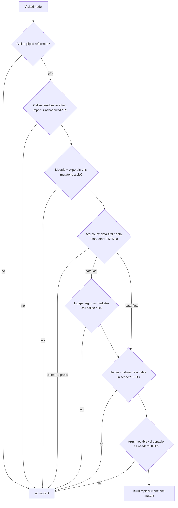
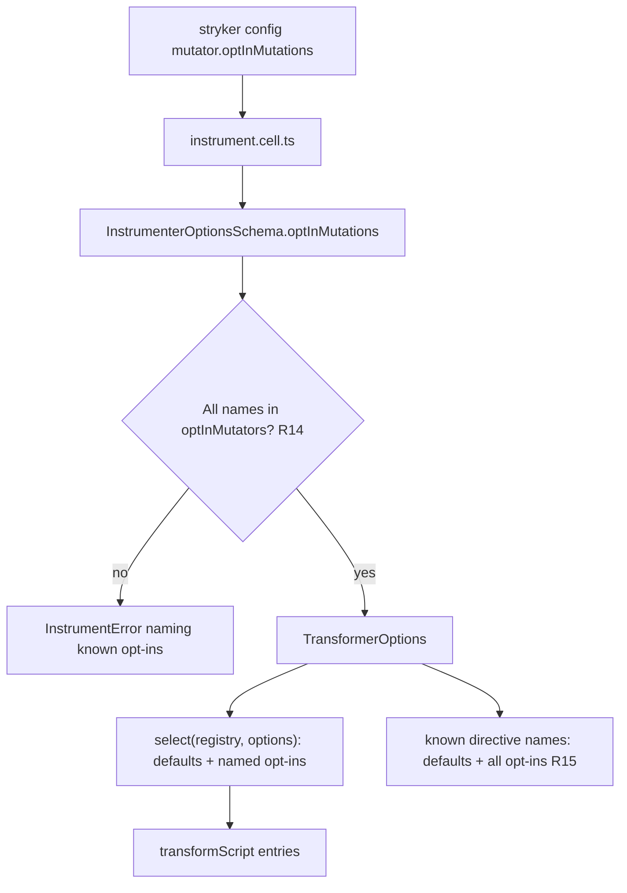

# Opt-in Effect Concurrency Mutators - Plan

## Goal Capsule

- **Objective:** A repository that opts in gets mutants that remove locks, split atomic `Ref` updates, and let finalizers escape at every matching Effect call site. Its CI can then prove that its concurrency tests catch races, with no hand-kept source patches. A repository that does not opt in sees the same mutants, ids, and scores it sees today.
- **Means:** Three pure mutators live in a separate opt-in registry, selected by a new `mutator.optInMutations` list (KTD1, KTD2). Each builds its replacement only from `effect` bindings already in scope at the call site (KTD3).
- **Authority:** Issue #83 is the source of truth. The Product Contract below restates it with stable IDs. `CONSTITUTION.md` and `AGENTS.md` outrank this plan.
- **Stop conditions:** Stop and report if a call shape cannot be given a replacement that passes the fork's TypeScript checker without a cast or suppression. Stop if opting out would change any existing mutant id or replacement.
- **Execution profile:** Deep. Instrumenter package first, then the Stryker config surface and the checker proof.
- **Finish and ship:** `ce-work` implements. LFG runs review and opens the PR. Merging and releasing stay with the owner.

---

## Product Contract

### Summary

Add three opt-in mutators to `@systemfsoftware/stryker-js-instrumenter`: `AtomicUpdateSplit`, `SynchronizationRemoval`, and `FinalizerEscape`. Each produces one mutant per matching Effect call. The mutant behaves like the original on one uninterrupted fiber, and differs only under concurrency or interruption. They are off unless named in `mutator.optInMutations`.

### Problem Frame

A consuming repository wants CI to fail when its concurrency tests stop catching races. Examples: a removed lock, an atomic `Ref.modify` split into a read and a write, or a release that escapes its finalizer. None of the 16 current mutators (`packages/stryker-js-instrumenter/src/Mutator.ts`, `allMutators`) produces these faults. Today they have to be planted with hand-maintained source patches, and those patches break whenever the surrounding code moves. The consumer code in the issue evidence (`LeaderLockAdapter.ts`: `uninterruptibleMask`, `onError`, `ensuring` around a scope close) gets no mutant on any of those calls.

### Requirements

**Call resolution**

- R1. An Effect call is a call whose callee resolves to `effect` or `effect/<Module>` through a named, aliased, or namespace import. A same-named function imported from another module, declared locally, or reached through a shadowing binding is not an Effect call and produces no mutant.
- R2. A mutant's replacement uses only identifiers that resolve, unshadowed, at the call site to value imports from `effect`. A call whose replacement would need a binding the file does not have produces no mutant.
- R3. A call with a spread argument, or with an argument count that matches neither the data-first nor the data-last form, produces no mutant.
- R4. A data-last form produces a mutant only where its replacement function is contextually typed: as a piped argument of `.pipe(...)` or of an `effect` `pipe(...)`, or as the callee of an immediate call. Anywhere else it produces no mutant.
- R5. An Effect call nested inside another covered call produces its own mutant, independent of the outer call.

**Mutation shapes**

- R6. `AtomicUpdateSplit`: `modify`, `modifySome`, `update`, `updateSome`, `updateAndGet`, and `getAndUpdate` on `Ref` and `SynchronizedRef`, data-first and data-last, become a separate read, a yield, and a separate write that compute the same result.
- R7. `SynchronizationRemoval`: `Semaphore.withPermits` and `Semaphore.withPermit`, at every arity, become the wrapped effect alone. `Effect.uninterruptible(e)` becomes `e`, and a bare `Effect.uninterruptible` piped reference becomes an identity function. `Effect.uninterruptibleMask(f)` becomes `f` applied lazily with a restore that does not re-establish a mask (KTD7).
- R8. `FinalizerEscape` changes each call as follows:
  - `Effect.ensuring` and `Effect.onExit` still run their finalizer on success and failure, but not on interruption.
  - `Effect.onError` runs its handler only on causes that contain no interruption.
  - `Effect.onInterrupt` loses its handler.
  - `Effect.acquireRelease` acquires interruptibly and registers the release as a separate later step.
  - `Effect.acquireUseRelease` releases after `use` succeeds or fails, but not when `use` is interrupted.

**Behaviour guarantees**

- R9. Each mutant is single-fiber equivalent. Run alone on one uninterrupted fiber, it returns the same value and fails with the same error as the original. It also leaves every `Ref`, `SynchronizedRef`, semaphore, and scope in the same state. This holds on both the success path and the failure path.
- R10. Each mutant is observably different from the original with two fibers or one interruption.
- R11. Every mutant produced from the Definitions fixtures passes the fork's TypeScript checker. No replacement contains `@ts-ignore`, `@ts-expect-error`, `as any`, or `as unknown`.

**Selection**

- R12. The three mutators are not in the default set. A config without the opt-in produces a mutant set identical, by id and replacement, to the one produced at `432b15ac` on the instrumenter's fixtures.
- R13. A config can enable any subset of the opt-in mutators, and doing so enables no other opt-in mutator.
- R14. An opt-in name that is not a known opt-in mutator fails the instrument stage and names the known opt-in mutators.
- R15. The three names are always known to `// Stryker disable` directives. `// Stryker disable next-line AtomicUpdateSplit: <reason>` suppresses that mutant with its reason and raises no "Unused 'Stryker disable' directive" warning, whether or not the mutator is enabled.

### Key Decisions

- **Opt-in names are a separate additive list, not a whitelist of the whole set.** A consumer adds the concurrency faults on top of the defaults without restating 16 names, and a later default mutator still reaches them. Governs R12, R13.
- **An unknown opt-in name fails the run.** A typo that silently enables nothing removes mutants and raises the score, which is the failure the registry comment in `Mutator.ts` warns about. Governs R14.
- **A call with no usable in-scope binding for its replacement gets no mutant.** The alternative is a replacement that does not compile, which only shows up as a `CompileError`. Governs R2, R4.

### Acceptance Examples

- AE1. Named, aliased, and namespace imports
  - **Covers R1, R6.**
  - **Given:** `import { Effect, Ref } from 'effect'`, `import { Ref as R } from 'effect'`, `import * as E from 'effect'`, and `import * as Ref from 'effect/Ref'`, each in its own fixture calling `update` on a ref.
  - **Then:** each fixture yields exactly one `AtomicUpdateSplit` mutant.
- AE2. Refusals
  - **Covers R1.**
  - **Given:** `update` imported from `./local-ref`, a locally declared `update`, and a function parameter named `Ref` that shadows the import.
  - **Then:** zero `AtomicUpdateSplit` mutants.
- AE3. Lost update
  - **Covers R9, R10.**
  - **Given:** the `Ref.update(counter, (n) => n + 1)` mutant.
  - **When:** it runs alone.
  - **Then:** the counter ends at 1, as the original does.
  - **When:** two fibers run it concurrently.
  - **Then:** the counter ends at 1 where the original ends at 2.
- AE4. Finalizer escape on interruption
  - **Covers R8, R9, R10.**
  - **Given:** `Effect.ensuring(work, Ref.set(closed, true))`.
  - **When:** `work` succeeds or fails.
  - **Then:** both the original and the mutant set `closed` and return the same `Exit`.
  - **When:** the fiber is interrupted.
  - **Then:** the original sets `closed` and the mutant does not.
- AE5. Opt-out is inert
  - **Covers R12.**
  - **Given:** every existing instrumenter fixture and the new Effect fixtures, instrumented without `optInMutations`.
  - **Then:** ids, mutator names, and replacements equal the output recorded at `432b15ac`. Per CONST-T11 that recording is development-time evidence in a gitignored `.scratch/` directory, compared before the PR opens and then deleted. The committed proof is the existing integration suites, which pass unchanged with their hand-written expectations, plus an opt-out test showing that no opt-in mutator name appears.

### Scope Boundaries

- The three mutators stay out of the default set (R12).
- No existing mutator changes name or behaviour.
- `MutatorOptions` and the Stryker `mutator` block gain only `optInMutations`.
- Method-form calls on a semaphore value (`sem.withPermits(1)`) are not Effect calls under R1 and are out of scope.
- `modifyEffect`, `updateEffect`, and other `SynchronizedRef` effectful variants are not listed in R6 and are out of scope.
- The replacements call effect 4 APIs (`onExitIf`, `onErrorIf`, the `Semaphore` module, and `Cause.reasons`), matching the version this repository pins. Code on effect 3.x is not supported, and such a repository must not opt in.
- The mutation dogfood stays on `catalog:stryker`. Nothing is retargeted to `workspace:^`.

### Sources / Research

- Issue: https://github.com/systemfsoftware/stryker-js-effect/issues/83
- effect 4.0.0-rc.116 signatures: `repos/effect/packages/effect/src/Ref.ts` (`modify` 461, `modifySome` 521, `update` 573, `updateSome` 658), `SynchronizedRef.ts` (`modify` 283; `SynchronizedRef` does not extend `Ref`), `Semaphore.ts` (`withPermits` 407, `withPermit` 432), and `Effect.ts`: `ensuring` 6815, `onError` 6852, `onErrorIf` 6890, `onExit` 6987, `onExitIf` 7023, `onInterrupt` 7354, `uninterruptible` 7387, `uninterruptibleMask` 7422, `acquireRelease` 6589, `acquireUseRelease` 6721, `addFinalizer` 6773. `Cause.reasons` is public (`Cause.ts:77`), and each reason carries `_tag: "Fail" | "Die" | "Interrupt"`.
- The executable dependency-semantics pins in U6 follow (pack: boundary-testing, pin-dependency-semantics.md). The negative fixtures beside every positive one follow (pack: boundary-testing, refusals-beside-generated-laws.md).
- Prior art: Bradbury, Cordy, and Dingel, [Mutation Operators for Concurrent Java (J2SE 5.0)](https://research.cs.queensu.ca/TechReports/Reports/2006-520.pdf), Mutation 2006. Their RSB (Remove Synchronized Block), EAN (Exchange Atomic Call with Non-Atomic), and RFU (Remove Finally Around Unlock) are the Java counterparts of the three mutators here. RFU also changes the sequential exception path, and R8 excludes that, because a sequential test would kill the mutant (issue non-counting outcomes).

---

## Planning Contract

Product Contract unchanged.

### Key Technical Decisions

- KTD1. **Separate opt-in registry.** `Mutator.ts` exposes `defaultMutators`, which is `allMutators` renamed via `lsp rename` because the old name would read as "every mutator". It also exposes a new frozen `optInMutators`. `test/e2e/scripts/derive-oracle.property.test.ts` iterates the default registry and must stay unchanged in meaning, so the new names never enter it. Governs R12.
- KTD2. **Selection is a pure function over an injectable registry.** `transformScript`'s per-call override seam (`mutators?`, which no caller passes today) is retyped as `registry?: MutatorRegistry` (`{ defaults, optIn }`), so the existing injection point keeps working with the new shape. Active entries are all defaults plus the opt-in entries named in `options.optInMutations`. Directive-known names are every default and every opt-in name. Unknown opt-in names are rejected in `instrument()` as an `InstrumentError` before transformation. Governs R12–R15.
- KTD3. **Replacements reuse in-scope `effect` bindings; the instrumenter never injects imports.** The checker splices `replacement` into the original file text (`packages/stryker-js-typescript-checker/src/Compiler.ts`, `mutateScriptFile`), so an injected header import is invisible to it and every such mutant would be a `CompileError`. Module access resolves in this order:
  1. The callee's own module object (`Ref.update` gives `Ref`).
  2. An unshadowed `import { Mod [as L] } from 'effect'`.
  3. `import * as N from 'effect'`, giving `N.Mod`.
  4. `import * as N from 'effect/Mod'`.

  Type-only imports never count. Governs R1, R2.
- KTD4. **Scope resolution walks `context.ancestors`.** The import table is built once per `Program` and memoised in a `WeakMap`. Shadowing checks each enclosing scope for a same-named value binding in any of these forms:
  - function parameters, and function-expression or class-expression names
  - hoisted `var` declarations, not inside nested functions
  - lexical `let`/`const`/`using`, class, and function declarations in blocks, switch cases, and `for` heads
  - catch parameters
  - TypeScript value-bearing declarations: `namespace`/`module` with a body, `enum`, and `import X = require(...)`

  Type-only declarations (`type`, `interface`, `declare` without a value) do not shadow. oxc's JS binding yields no scope data, so this is hand-rolled. Governs R1, R2.
- KTD5. **Argument discipline instead of duplication.** Replacements never evaluate an original argument twice. A replacement may move an argument into a callback only if it contains no `yield` or `await` outside a nested function. It may drop an argument only if that argument is side-effect free: an identifier, literal, `this`, member chain, or function expression. Any other argument yields no mutant. A moved argument is evaluated when the effect runs rather than when it is built. Effect construction is pure, so R9 holds. Governs R3, R9.
- KTD6. **`AtomicUpdateSplit` routes the original operation through a snapshot ref.** Directionally, for data-first `M.op(ref, f)`:
  1. Bind `ref` once through `E.succeed`.
  2. `M.get` the value.
  3. `M.make` a snapshot ref holding it.
  4. Run the original `M.op(snapshot, f)`, so `f` stays a direct argument and keeps its contextual typing.
  5. `E.yieldNow`.
  6. `M.set` the real ref to the snapshot's value.
  7. Return the operation's result.

  One shape covers all six operations on both modules. For a non-matching `modifySome` or `updateSome` it writes back the value it read, which is the same state on one fiber and a lost update under a race. The yield makes the race deterministic under the default scheduler. A strict tsc spike on TS 7.0.2 type-checked this for `Ref.modify` and for `SynchronizedRef.modifySome` with an inline tuple lambda. Governs R6, R9, R10, R11.
- KTD7. **`uninterruptibleMask(f)` becomes `E.suspend(() => f(E.interruptible))`.** `Effect` has no generic identity. `Function.identity` would add a second required binding. An untyped identity lambda is an implicit `any`. `E.interruptible` has exactly the `restore` type, and it is the identity whenever the surrounding region is interruptible, which is the case the fault targets. Inside an already-uninterruptible region it makes restored sections interruptible. That differs from a literal identity restore only under interruption, so R9 still holds. `suspend` keeps `f` called at run time, as the original does. Governs R7, R9.
- KTD8. **`FinalizerEscape` uses Effect's own conditional finalizers.** `ensuring(self, fin)` becomes `E.onExitIf(self, notInterrupted, () => fin)`. `onExit(self, f)` becomes `E.onExitIf(self, notInterrupted, f)`. `onError(self, h)` becomes `E.onErrorIf(self, noInterrupt, h)`. `notInterrupted` is inlined as `(exit) => exit._tag === "Success" || !exit.cause.reasons.some((reason) => reason._tag === "Interrupt")`: the `||` narrows `exit` to a failure before `cause` is read. `noInterrupt` is `(cause) => !cause.reasons.some((reason) => reason._tag === "Interrupt")`. Neither needs an `Exit` or `Cause` binding, and the spike type-checked both. Further rewrites:
  - `onInterrupt(self, h)` becomes `self`.
  - `acquireRelease(acq, rel[, opts])` becomes `E.flatMap(E.interruptible(acq), (a) => E.as(E.addFinalizer((exit) => rel(a, exit)), a))`, and `opts` must be droppable per KTD5.
  - `acquireUseRelease(acq, use, rel)` keeps `acq` and `use` and wraps `rel` so it returns `E.void` when the exit is an interruption.

  The strict tsc spike confirmed that `Effect<X>` finalizers and releases are accepted where `Effect<void>` is expected. Governs R8, R9, R11.
- KTD9. **Data-last replacements are `(self) => <data-first replacement over self>`.** They are emitted only in the R4 positions. The spike showed that `(self) => …` has an implicit `any` parameter outside those positions. `withPermits(sem, n)` and `withPermit(sem)` become `(self) => self`. Governs R4, R7.
- KTD10. **Arity table decides the form.** Data-first and data-last argument counts:
  - `Ref` and `SynchronizedRef` operations: 2 and 1.
  - `withPermits`: 3 and 2.
  - `withPermit`: 2 and 1.
  - `ensuring`, `onExit`, `onError`, `onInterrupt`: 2 and 1.
  - `uninterruptible`, `uninterruptibleMask`: 1, with no data-last call form.
  - `acquireRelease`: 2 or 3, with no data-last form.
  - `acquireUseRelease`: 3, with no data-last form.

  Any other count gives no mutant. Governs R3.
- KTD11. **Executed fixtures drive the behavioural proof.** Tests instrument fixture modules, load the instrumented output through Vitest's module runner from a gitignored directory inside the package, so `effect` resolves, and flip `ACTIVE_MUTANT` on the existing host namespace object. They never replace that object (`docs/solutions/runtime-errors/host-instrumenter-namespace-identity.md`, INV-1). This exercises real placement as well as the replacement. Governs R9, R10.

No Bake-off. Injecting imports was the only structurally distinct alternative to KTD3, and the checker's splice-into-original contract rules it out.

### High-Level Technical Design

Mutation decision for one visited node (the three mutators share the resolution front half):

Option flow for the opt-in list:

### Assumptions

- "A named import" in the issue's acceptance criteria covers both `import { Ref } from 'effect'` and a bare function import such as `import { update } from 'effect/Ref'`. The bare form gets a mutant only when a module binding for its helpers is also in scope (R2).
- The dummy-mutator criterion ("a config can enable exactly these three mutators and no others") is read under the additive model. A dummy registered in the opt-in registry, with the three selected, yields zero mutants.
- For `uninterruptible`, the "data-last form" is the bare piped reference `.pipe(Effect.uninterruptible)`. The function is unary and not dual, so no data-last call form exists.
- Moving an argument into a callback changes when it is evaluated, but not whether it is evaluated on a run (KTD5). Moved arguments are assumed to be effect values or pure effect constructors, which is idiomatic Effect code, so evaluating them again on every run is unobservable. U6 pins this for the fixtures by building each effect once and running it twice.

### Sequencing

U1 comes first, so the opt-out snapshot records pre-change output. U2 comes before U3–U5. U3 ships the shared call resolution that U4 and U5 reuse. U5 lands after U4, because its real-registry selection check needs all three opt-ins. U6 and U7 need U3–U5. U8 comes last.

---

## Implementation Units

### U1. Definitions fixtures and opt-out characterization

- **Goal:** Commit the Effect definitions fixtures and an opt-out test. Record the pre-change default mutant set as scratch evidence before any source change.
- **Requirements:** R12. Covers AE5.
- **Dependencies:** none.
- **Files:**
  - Create `packages/stryker-js-instrumenter/tests/__fixtures__/effect-concurrency/` with one module per mutator: `atomic-update-split.ts`, `synchronization-removal.ts`, and `finalizer-escape.ts`. Also create `import-styles.ts`, `refusals.ts`, and `shapes.ts`.
  - Create `packages/stryker-js-instrumenter/tests/opt-out.integration.test.ts`.
  - Add `.scratch/` to the root `.gitignore`. It holds the development-time parity recording (CONST-T11).
- **Approach:**
  1. Author the fixtures as real, type-checked modules. They export small functions that build the target effects from parameters, so U6 can run them.
  2. Cover every R6–R8 call shape in data-first and data-last form, the four import styles of AE1, and the refusals of AE2.
  3. Include a spread-argument call, a wrong-arity call, a data-last call outside a pipe, and a nested covered call.
  4. `shapes.ts` is a table of every R6–R8 call shape × form. Each entry gives its fixture export, its owning mutator, and the U6 scenario kinds it needs. U3–U7 iterate this table rather than hand-listing shapes. A completeness assertion in the opt-out test checks the table against the R6–R8 operation lists written out as literals.
  5. Before U2 touches `src/`, a throwaway script run through `vitest` records `id`, `mutatorName`, `replacement`, and `location` for every file under `tests/__fixtures__/` with default options, and writes them to `.scratch/opt-out-parity/baseline.json`. The script is not committed.
  6. Freeze the fixture modules once the baseline is recorded. Cases that U3–U5 add later go into separate `extra-*.ts` fixture modules or into inline test sources.
- **Execution note:** Characterization first, as scratch evidence only. Record the baseline on the unmodified `src/` tree at `432b15ac`. Commit the fixtures and the opt-out test before U2. The recorded output is never committed (CONST-T11).
- **Patterns to follow:** The Gherkin feature shape, `makeFeature({ it, layer })`, in `packages/stryker-js-instrumenter/tests/regex-mutation.integration.test.ts`.
- **Test scenarios:**
  - Covers AE5 (committed half). Every effect-concurrency fixture, instrumented with `{ ignorers: [], excludedMutations: [] }`, yields no mutant named `AtomicUpdateSplit`, `SynchronizationRemoval`, or `FinalizerEscape`, and still yields at least one default mutant (the fixtures are live).
  - `shapes.ts` lists every operation named in R6–R8, checked against literal lists in the test.
- **Verification:** The opt-out test passes on the pre-change tree. The fixture modules type-check under the package's test project. The scratch baseline exists.

### U2. Opt-in registry, selection, and the instrumenter option

- **Goal:** The instrumenter accepts `optInMutations`, runs exactly the named opt-in mutators on top of the defaults, rejects unknown names, and treats every opt-in name as a known directive name.
- **Requirements:** R12, R13, R14, R15. Implements KTD1, KTD2.
- **Dependencies:** U1.
- **Files:**
  - Modify `packages/stryker-js-instrumenter/src/Mutator.ts`: rename `allMutators` to `defaultMutators` with `lsp rename`, and add `optInMutators` (empty until U3–U5 fill it), `MutatorRegistry`, and a pure selection function. Put an in-source `import.meta.vitest` block here.
  - Modify `packages/stryker-js-instrumenter/src/Transformer.ts`: add the registry parameter, active entries, and known directive names.
  - Modify `packages/stryker-js-instrumenter/src/Instrument.schema.ts` to add `optInMutations: S.optional(S.Array(S.String))`, plus an error variant or reason for unknown names.
  - Modify `packages/stryker-js-instrumenter/src/Instrument.ts` to validate the names and thread them through `toTransformerOptions`.
  - Update `test/e2e/scripts/derive-oracle.property.test.ts` for the rename only.
  - Regenerate `packages/stryker-js-instrumenter/etc/stryker-js-instrumenter.api.md`.
- **Approach:**
  - Keep the doc comment's reasoning on the hand-written registry, and state that `optInMutators` follows the same rule.
  - The unknown-name check runs before any file is parsed and lists the valid names in its message.
  - `excludedMutations` still applies to enabled opt-in mutators, with the usual Ignored reason.
  - Follow the local `Match.value` style.
  - Do not introduce `if`, `else`, `switch`, `let`, or loops in new code.
- **Patterns to follow:** `findExcludedMutatorIgnoreReason` and `processStrykerDirectives` in `Transformer.ts`. In-source tests are enabled by `includeSource` in `packages/stryker-js-instrumenter/vitest.config.ts`.
- **Test scenarios:**
  - A test-local registry holds three named stand-in opt-ins plus a `Dummy` opt-in that returns one mutant for every node. Selecting the three stand-in names produces zero `Dummy` mutants over a non-trivial source. This is the in-source selection test. U5 repeats the check against the real `optInMutators`.
  - The same registry with `Dummy` selected yields `Dummy` mutants, which proves the fixture is live.
  - `optInMutations: ['AtomicUpdateSplt']` makes `instrument` fail with an error naming the three valid opt-ins.
  - Absent `optInMutations` and `optInMutations: []` both yield zero opt-in mutants on the effect-concurrency fixtures. The scratch parity comparison against the baseline also matches (development evidence).
- **Verification:** The opt-out test and the existing integration suites pass unchanged. The e2e oracle property test passes unchanged in meaning. The API report diff shows only the new optional field.

### U3. Effect call resolution and `AtomicUpdateSplit`

- **Goal:** Resolve Effect calls per R1–R5, and produce the `AtomicUpdateSplit` mutant for every R6 shape.
- **Requirements:** R1–R6, R9, R11. Implements KTD3–KTD6, KTD9, KTD10. Covers AE1, AE2.
- **Dependencies:** U2.
- **Files:**
  - Create `packages/stryker-js-instrumenter/src/EffectCall.ts`. It holds the import table, shadowing, callee resolution, module-access expressions, pipe and immediate-call position detection, and the movable and droppable argument predicates.
  - Create `packages/stryker-js-instrumenter/src/ConcurrencyMutators.ts` with `atomicUpdateSplitMutator` and the replacement builders.
  - Modify `packages/stryker-js-instrumenter/src/Mutator.ts` to register the opt-in.
  - Modify `packages/stryker-js-instrumenter/src/Ast.ts` to add `logicalExpression` and `binaryExpression` builders if U5 needs them.
  - Create `packages/stryker-js-instrumenter/tests/atomic-update-split-mutation.integration.test.ts`.
- **Approach:**
  - `EffectCall.ts` returns a resolved description for a call node: module name, export name, form, the module-access expression per required module, and the argument nodes. It returns nothing when any R1–R5 condition fails.
  - The mutators consume that description. They never inspect imports themselves.
  - Memoise the import table per `Program` with a `WeakMap` (KTD4).
  - Build replacement nodes with `Ast.ts` builders. Clone original argument nodes (`cloneNode`) rather than sharing them.
- **Technical design (directional):** The data-first replacement shape is `E.flatMap(E.succeed(ref), (self) => E.flatMap(M.get(self), (s) => E.flatMap(M.make(s), (snap) => E.flatMap(M.op(snap, f), (b) => E.flatMap(E.yieldNow, () => E.flatMap(M.get(snap), (a) => E.as(M.set(self, a), b)))))))`. The data-last shape wraps the same body in `(self) => …`.
- **Patterns to follow:**
  - `methodExpressionMutator` and `spreadFreeArguments` in `Mutator.ts` for call handling.
  - The `mutantsWhen` and `NO_MUTANTS` idioms.
- **Test scenarios:** Every run enables only `AtomicUpdateSplit`.
  - Covers AE1. For each of the six operations × `Ref`/`SynchronizedRef` × data-first/data-last (in `.pipe` and in `pipe(...)`), the fixture line yields exactly one mutant.
  - Covers AE1. Named, aliased, `effect` namespace, and `effect/Ref` namespace imports each yield exactly one mutant.
  - Covers AE2. An import from a non-`effect` module, a local declaration, and a parameter that shadows `Ref` inside a function each yield zero.
  - A `var Ref` hoisted in the enclosing function shadows the import and yields zero. So do a block-scoped `class Ref`, a TypeScript `namespace Ref {}` with a body, an `enum Ref`, and `import Ref = require('./other')` in an enclosing scope.
  - A `type Ref = …` alias in an enclosing scope does not shadow, and the call still yields one mutant.
  - A type-only import yields zero.
  - A bare `import { update } from 'effect/Ref'` with no `Ref` module binding in the file yields zero. With `import { Effect, Ref } from 'effect'` also present, it yields one.
  - A spread argument yields zero. Zero or three arguments yield zero.
  - A data-last call assigned to a `const` outside a pipe yields zero. A data-last call used as the callee of an immediate call yields one.
  - `Ref.update(yield* makeRef, f)` yields zero, because the argument is not movable.
  - A covered call nested inside another covered call yields one mutant for each call.
  - `// Stryker disable next-line AtomicUpdateSplit: race proven elsewhere` marks the mutant Ignored with that reason and emits no warning.
  - The same directive in a run that does not opt in emits no "Unused 'Stryker disable' directive" warning (R15).
  - No replacement text contains `@ts-ignore`, `@ts-expect-error`, `as any`, or `as unknown`.
  - Gatekeeper: removing the registry entry fails this file.
- **Verification:** The integration file passes. The opt-out test and the scratch parity comparison pass with the opt-in absent.

### U4. `SynchronizationRemoval`

- **Goal:** Produce the R7 mutants.
- **Requirements:** R3, R4, R5, R7, R9, R11. Implements KTD5, KTD7, KTD9, KTD10.
- **Dependencies:** U3.
- **Files:**
  - Modify `packages/stryker-js-instrumenter/src/ConcurrencyMutators.ts` and `packages/stryker-js-instrumenter/src/Mutator.ts`.
  - Create `packages/stryker-js-instrumenter/tests/synchronization-removal-mutation.integration.test.ts`.
- **Approach:**
  - `withPermits(sem, n, e)` becomes `e`, and `withPermit(sem, e)` becomes `e`. `sem` and `n` must be droppable.
  - The data-last forms become `(self) => self`.
  - `uninterruptible(e)` becomes `e`. A piped `Effect.uninterruptible` reference, meaning a member expression or identifier resolving to it as a pipe argument, becomes `(self) => self`.
  - `uninterruptibleMask(f)` becomes the KTD7 shape, which needs Effect module access.
- **Test scenarios:** Every run enables only `SynchronizationRemoval`.
  - Each of `withPermits` (3 and 2 arguments), `withPermit` (2 and 1 arguments), `uninterruptible` (call and piped reference), and `uninterruptibleMask` yields exactly one mutant under the four import styles that apply.
  - `Semaphore.withPermits(sem, 1)(effect)` as an immediate call yields one mutant.
  - `sem.withPermits(1)(effect)`, the method form, yields zero.
  - A `Semaphore` imported from another library yields zero.
  - `withPermits(makeSem(), 1, e)` yields zero, because the argument is not droppable.
  - The issue's evidence snippet (`uninterruptibleMask` wrapping `onError` and `ensuring`) yields exactly one `SynchronizationRemoval` mutant, on the mask.
  - Directive suppression works with the reason recorded.
  - Gatekeeper: removing the registry entry fails this file.
- **Verification:** The integration file passes.

### U5. `FinalizerEscape`

- **Goal:** Produce the R8 mutants.
- **Requirements:** R3, R4, R5, R8, R9, R11. Implements KTD5, KTD8, KTD9, KTD10.
- **Dependencies:** U3, U4 (for the real-registry selection check).
- **Files:**
  - Modify `packages/stryker-js-instrumenter/src/ConcurrencyMutators.ts`, `packages/stryker-js-instrumenter/src/Mutator.ts`, and, if needed, `packages/stryker-js-instrumenter/src/Ast.ts`.
  - Create `packages/stryker-js-instrumenter/tests/finalizer-escape-mutation.integration.test.ts`.
- **Approach:**
  - Build the structural interruption predicate once as an AST factory.
  - `ensuring`'s finalizer and `acquireRelease`'s release move into callbacks and must be movable.
  - `onInterrupt`'s handler and `acquireRelease`'s options are dropped and must be droppable.
- **Test scenarios:** Every run enables only `FinalizerEscape`.
  - `ensuring`, `onExit`, `onError`, and `onInterrupt`, in data-first and data-last form, and `acquireRelease` (2 and 3 arguments) and `acquireUseRelease`, each yield exactly one mutant under each applicable import style.
  - The issue's evidence snippet yields one mutant for `onError` and one for `ensuring`.
  - `onInterrupt(self, makeHandler())` yields zero.
  - An `ensuring` finalizer containing `yield*` yields zero.
  - A local `ensuring` helper yields zero.
  - An `acquireUseRelease` whose release contains `yield*` yields zero, because the release is moved into a wrapper.
  - Directive suppression works.
  - The registry is `{ ...optInMutators, Dummy }`, where `Dummy` mutates every node. Selecting the three real names yields zero `Dummy` mutants (AC: "enable exactly these three mutators and no others").
  - Gatekeeper: removing the registry entry fails this file.
- **Verification:** The integration file passes.

### U6. Behavioural proof: single-fiber equivalence and concurrency divergence

- **Goal:** Prove R9 and R10 for every call shape by running the original and the mutant.
- **Requirements:** R9, R10. Implements KTD11. Covers AE3, AE4.
- **Dependencies:** U3, U4, U5.
- **Files:**
  - Create `packages/stryker-js-instrumenter/tests/concurrency-mutant-behaviour.integration.test.ts`.
  - Write instrumented fixture output to `packages/stryker-js-instrumenter/.scratch/concurrency-behaviour/`, which the U1 `.gitignore` entry already covers, and remove it after the suite.
- **Approach:**
  1. Instrument the U1 fixture modules with all three opt-ins.
  2. Write the instrumented output under the scratch directory and import it.
  3. Per mutant id, run the fixture's exported builder with `ACTIVE_MUTANT` unset and then set, on the host namespace object from `INSTRUMENTER_CONSTANTS`.
  4. Assert each run's `Exit` and final observable state against literal expected values written in the scenario, such as AE3's counter values. Check both the original and the mutant against those literals, and never compute an expected value by running the other (CONST-T10). State is read with `Ref.get`, with a semaphore's available permits via `take`/`release` probes, and with whether a scope finalizer ran.
  5. For the single-fiber cases, build the effect once and run it twice in sequence, checking after each run, so any per-run re-evaluation of moved arguments (KTD5) would surface.
- **Execution note:** Use deterministic coordination: `Deferred`, `Effect.yieldNow`, and `Fiber.interrupt`. Never use wall-clock sleeps (`docs/solutions/tooling-decisions/do-not-sleep-to-prove-a-mutation-timeout.md`). Drive every scenario from the U1 shape table so that no shape is skipped.
- **Test scenarios:**
  - Covers AE3. For each `AtomicUpdateSplit` shape, one fiber gives the same result value and final ref value. For the partial-function operations, both the matching and the non-matching function give the same result. Two concurrent fibers leave the final value different from the original's (a lost update).
  - For each `SynchronizationRemoval` semaphore shape, single-fiber success and failure give the same `Exit`, and the semaphore's free permits are unchanged. Two fibers in the guarded section reach a maximum concurrency of 2, where the original's is 1.
  - For `uninterruptible` and `uninterruptibleMask`, single-fiber success and failure match. An interrupt delivered inside the region completes the original region but stops the mutant's.
  - Covers AE4. For `ensuring` and `onExit`, success and failure run the finalizer in both. Interruption runs it only in the original.
  - For `onError`, a failure runs the handler in both. Interruption runs it only in the original.
  - For `onInterrupt`, success and failure match with no handler run. Interruption runs the handler only in the original.
  - For `acquireRelease` inside `Effect.scoped`, success and failure release exactly once in both. The divergence fixture uses a two-step acquire that marks the resource acquired and then suspends on a `Deferred`. An interrupt delivered during that suspension leaves the resource acquired and never released in the mutant. In the original, the acquire is uninterruptible, so it completes, registers its release, and the release runs.
  - For `acquireUseRelease`, success and failure of `use` release in both. Interrupting `use` releases only in the original.
- **Verification:** Every call shape has one equivalence case per success/failure path (or per matching/non-matching function) and one divergence case, and all pass.

### U7. Checker proof: no `CompileError`

- **Goal:** Every mutant from the Definitions fixtures passes the fork's TypeScript checker.
- **Requirements:** R11.
- **Dependencies:** U3, U4, U5.
- **Files:**
  - Create a strict `tsconfig.json` fixture project under `packages/stryker-js-typescript-checker/`, following that package's test layout. It includes the instrumenter's `tests/__fixtures__/effect-concurrency/` modules by path.
  - Create a Vitest integration test beside it.
- **Approach:**
  1. Instrument the fixtures with all three opt-ins using `@systemfsoftware/stryker-js-instrumenter`, which is already a dependency of the checker.
  2. Map each mutant to `CheckerMutantWire`.
  3. Run `makeCheckerService` over `makeTypescriptCompiler` with Node's file system: `init`, then `check`.
  4. Assert every result is `passed`.
- **Patterns to follow:** `makeCheckerService` and `makeTypescriptCompiler` in `packages/stryker-js-typescript-checker/src/Checker.ts` and `src/Compiler.ts`.
- **Test scenarios:**
  - `init` reports zero dry-run diagnostics on the unmutated fixture project.
  - Every `AtomicUpdateSplit`, `SynchronizationRemoval`, and `FinalizerEscape` mutant from the fixtures is `passed`, with zero `compileError`.
  - Control: a deliberately ill-typed replacement on the same file comes back as `compileError`, which proves the checker is live on these files.
- **Verification:** The test passes, and its mutant count equals the sum of the U3–U5 fixture expectations.

### U8. Stryker config surface, docs, and changeset

- **Goal:** Users opt in from their Stryker config, and the release notes describe it.
- **Requirements:** R12, R13, R14.
- **Dependencies:** U2.
- **Files:**
  - Modify `packages/stryker-js-plugin-interface/src/stryker-options.schema.ts`: `MutatorDescriptor.optInMutations` defaults to `[]`, and the `mutator` default becomes `{ excludedMutations: [], optInMutations: [] }`.
  - Modify `packages/stryker-js/src/run/instrument.cell.ts` to pass the list to `instrument`.
  - Regenerate the API reports for `stryker-js-plugin-interface`, `stryker-js-plugin-runtime`, and `stryker-js`.
  - Modify `packages/stryker-js-instrumenter/README.md` to add a short opt-in section naming the three mutators and the option, and stating that the replacements target effect 4 APIs.
  - Create a `.changeset/` entry, written with `skill://author-changesets`. It gives `minor` for the instrumenter, the plugin interface, and `stryker-js`, and `patch` for packages whose API report changes only transitively.
- **Test scenarios:**
  - A Stryker options object with no `mutator.optInMutations` decodes to `[]`.
  - A config with `mutator: { optInMutations: ['FinalizerEscape'] }` reaches the instrumenter unchanged. Assert this at the schema decode seam the existing options tests use, not by mocking the cell.
  - An unknown name fails the instrument stage with `StageError` stage `instrument` and the instrumenter's message.
- **Verification:**
  - `./scripts/check-changeset.ts $(git merge-base HEAD origin/main)` passes.
  - The API reports are regenerated and clean.

---

## Verification Contract

| Scope         | Command                                                                                                                                                                                        |
| ------------- | ---------------------------------------------------------------------------------------------------------------------------------------------------------------------------------------------- |
| U1–U6         | `pnpm --filter @systemfsoftware/stryker-js-instrumenter test`                                                                                                                                  |
| U7            | `pnpm --filter @systemfsoftware/stryker-js-typescript-checker test`                                                                                                                            |
| U8            | `pnpm --filter @systemfsoftware/stryker-js-plugin-interface test` and `pnpm --filter @systemfsoftware/stryker-js test`                                                                         |
| Rename safety | `pnpm --filter @systemfsoftware/stryker-e2e exec vitest run scripts/derive-oracle.property.test.ts` (or the e2e package's script that runs it)                                                 |
| Gates         | `pnpm format:check`, `pnpm typecheck`, `pnpm test`, `pnpm check:ci`, `./scripts/check-changeset.ts $(git merge-base HEAD origin/main)`                                                         |
| Dogfood       | `git grep -F 'catalog:stryker' -- packages/stryker-js/package.json packages/stryker-js-vitest-runner/package.json packages/stryker-js-typescript-checker/package.json` still matches all three |

Gatekeeper check for each of U3–U5: temporarily delete that mutator's `optInMutators` entry and confirm its integration file fails, then restore the entry.

### Test layer admission

Each admitted test runs in-process through a published surface or an in-source block. No test spawns a process. Any child process the TypeScript compiler itself uses is inside the library under test.

| Test                        | Layer                                                                          | Why admitted                                                                                                                       |
| --------------------------- | ------------------------------------------------------------------------------ | ---------------------------------------------------------------------------------------------------------------------------------- |
| U1 opt-out test             | Integration via `instrument()`                                                 | Asserts the published default set excludes the opt-ins (R12). The byte-level parity baseline is scratch evidence only (CONST-T11). |
| U2 dummy-registry selection | In-source block in `Mutator.ts`                                                | Internal pure selection function. The AC requires an injected registry that the public API does not expose.                        |
| U2 unknown-name refusal     | Integration via `instrument()`                                                 | A refusal next to the acceptance path.                                                                                             |
| U3–U5 per-mutator files     | Integration via `instrument()`                                                 | Published mutant output. These are the gatekeepers the AC names.                                                                   |
| U6 behaviour                | Integration: instrumented code loaded in-process and run on the Effect runtime | The only layer where R9 and R10 are observable.                                                                                    |
| U7 checker                  | Integration via `makeCheckerService`                                           | Proves R11 against the real checker, not a stand-in.                                                                               |
| U8 option decode            | Schema decode seam                                                             | Proves the default and pass-through of a public config field.                                                                      |

Refused: no unit tests for `EffectCall.ts` helpers, which U3–U5 cover through `instrument()`. No e2e journey, which is deferred.

---

## Definition of Done

- R1–R15 each have a passing test named in U1–U8.
- AE1–AE5 pass.
- The opt-out test and the existing integration suites pass unchanged after all units land. The scratch parity comparison matches the `432b15ac` baseline, and `.scratch/` is then emptied.
- Each of the three per-mutator integration files fails when its mutator is removed from the registry.
- No replacement contains a cast or suppression, and no source file gains a lint or Effect-diagnostic suppression.
- The `pnpm check:ci` and changeset gates pass.
- The scratch directories (`.scratch/`, and U6's executed-fixture output) are gitignored and empty after the suite. No spike or dead-end code remains in the diff.

### Risks

- The race in U6 depends on the default scheduler running a forked fiber at `yieldNow`. If an effect release changes that, the divergence test fails loudly, which is intended (pack: boundary-testing, pin-dependency-semantics.md). Mitigation: coordinate the two fibers with a `Deferred` handshake around the yield.
- The hand-rolled scope resolution (KTD4) can miss a binding form. A miss is fail-open: a shadowed call would be mutated. The shadowing scenarios in U3 cover each declaration form listed in KTD4.
- `Cause.reasons` and `Exit._tag` are public in rc.116, but the release is a pre-1.0 candidate. U7 turns a type-level change into a failing check, and U6's interruption cases turn a runtime change into one.

### Deferred to Follow-Up Work

- Coverage of `Effect.fn` pipeline arguments as data-last positions.
- The `SynchronizedRef` effectful variants (`modifyEffect`, `updateEffect`, and the rest).
- An e2e journey that opts a fixture repository into the three mutators through the published CLI. The dogfood stays on `catalog:stryker` until a release carries this feature.

---

## Appendix

### Destructive review

Lens: Edge-First, first cycle. Chosen because the plan's risk sits in degenerate inputs: binding forms, argument evaluation, and a snapshot that later fixtures could invalidate.

Assumptions surfaced:

1. The snapshot-ref split (KTD6) is a faithful "separate read followed by a separate write that compute the same result".
2. Restricting data-last mutants to pipe and immediate-call positions (R4) covers realistic consumer code.
3. Moving arguments into callbacks keeps single-fiber equivalence (KTD5).

Failures found, and how each was resolved:

| # | Failure                                                                                                                                                    | Class | Resolution                                                                                 |
| - | ---------------------------------------------------------------------------------------------------------------------------------------------------------- | ----- | ------------------------------------------------------------------------------------------ |
| 1 | KTD4 listed only JS binding forms. A TypeScript `namespace`, `enum`, or `import X = require()` that shadows an import would have been mutated (fail-open). | Clear | KTD4 now names those forms and excludes type-only declarations. U3 has matching scenarios. |
| 2 | KTD5 moves arguments to run time, but U6 ran each effect only once, so re-evaluation per run was untested.                                                 | Clear | The assumption is now stated. U6 builds each effect once and runs it twice.                |
| 3 | U1's parity snapshot covered fixture modules that U3–U5 would naturally extend, so a later edit would silently change the pre-change baseline.             | Clear | U1 freezes its modules. Later cases go to `extra-*.ts` or inline sources.                  |

Radical alternative adopted: coverage of "every call shape" is enforced by data (the U1 `shapes.ts` table plus a completeness assertion) instead of prose lists repeated in U3–U7.
