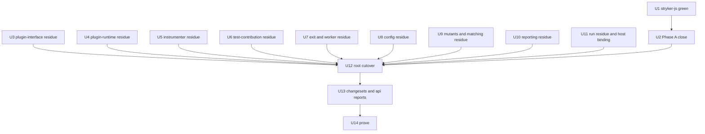

# Compound-Pack Bar Refactor Completion - Plan

## Goal Capsule

- Objective: stryker-js-effect users and plugin authors get the same CLI output, exit codes, JSON reports and plugin loading as before, from packages whose code a maintainer can read by role, with every @systemfsoftware dependency on its latest release.
- Means: finish the Phase A internal reshape, run Phase B (residue into lawful homes, namespace roots), and prove it frozen against the pre-refactor baseline (KTD1, KTD2, KTD3).
- Authority: `CONSTITUTION.md` > `AGENTS.md` (package-local too) > enforced lint rules > compound packs `cell-architecture` and `boundary-testing` > this plan.
- Stop conditions: a settled decision proves infeasible; a behavior-freeze check (R8) fails without a clear fix; a change needs a read-only surface (R11).
- Execution profile: parallel, file-disjoint units; one owner per file; type-aware runs go through `flock /tmp/refactor/tsc.lock` with a non-incremental config.
- Finish and ship: `lfg` implements via `ce-work`, then review, one PR on `systemf-updates`, CI e2e.

---

## Product Contract

### Summary

Finish the refactor that moves every package to the compound-pack bar while keeping external behavior byte-identical. Phase A is done except stryker-js's type errors. Phase B moves 32 leftover helper files into lawful homes and switches four package roots to namespace barrels.

### Problem Frame

The packages mixed procedural helpers, grab-bag modules and flat 90-name roots, so readers could not tell a file's role and suppressions hid defects. The owner directed a full reshape to the bar with no compromises and no suppressions. The dependency bump to the latest @systemfsoftware releases (effect 4.0.0-rc.117, effect-cell-types 10.1.1, effect-microsandbox 2.0.1, oxlint-config-recommended 2, tsconfig 2) is already applied and ships with it.

### Requirements

**Placement**
- R1. Every `src/**/*.ts` in a non-ignorer package is exactly one role file: `*.schema.ts`, `*.workflow.ts`, `*.cell.ts`, `*.service.ts`, `*.resource.ts`, `*.handle.ts`, `mod.ts`, a program root `main.ts`, `src/drivers/<tech>.ts`, or a test.
- R2. A pure helper lives, in order: private to its one user; a `Workflow.make` outcome when it decides between two or more outcomes; a schema transformation when it converts representations; an exported operation of the resource or handle whose data it acts on.
- R3. A constant is private to its user, a schema literal, or a static of the schema class owning its meaning.
- R4. Node-specific code lives only at a program root or `src/drivers/`; library programs leave platform services in `R` (pack: cell-architecture, composition-root).

**Surface**
- R5. Each published package root `src/mod.ts` is `export * as <Capability> from './<Capability>/mod.js'` namespaces; loader packages keep only the flat `strykerPlugins` / `strykerIgnorers` export.
- R6. `exports["."]["@systemfsoftware/source"]` stays `./src/mod.ts` and tsdown keeps `index: './src/mod.ts'`, so published file names do not change.
- R7. A changed public surface regenerates `etc/*.api.md` and carries a changeset.

**Freeze**
- R8. CLI stdout/stderr bytes, exit codes, the JSON report, run-event wire schemas, error messages and e2e oracle literals match commit `432b15ac3`.

**Discipline**
- R9. No suppressions of any kind, no casts across boundaries, no procedural control flow, typed failures only (local bar BAR-12, BAR-15, BAR-20).
- R10. Tests are laws (`it.prop`) for workflows and private pure helpers; no mocks of internal glue (pack: boundary-testing, no-mocks-on-internal-glue).
- R11. `repos/**`, `.github/workflows/`, `CONSTITUTION.md`, `commitlint.config.ts`, `subtrees.toml` are untouched; mutation dogfood stays on `catalog:stryker`.

### Key Decisions

- Compound packs are the law and `effect-microsandbox` is the bar (session-settled: user-directed — chosen over keeping the existing procedural code: the owner called it procedural slop). Governs R1, R2, R5.
- File role suffixes are mandatory (session-settled: user-directed — chosen over optional suffixes: "file suffixes are a mandatory migration"). Governs R1.
- No suppressions and no compromises (session-settled: user-directed — chosen over diagnostics-off comments and kept-with-comment residue: either the code is wrong or upstream's theory is incomplete, then file upstream). Governs R9.
- Fix every site the new lint majors flag (session-settled: user-directed — chosen over holding oxlint-config-recommended 2 and tsconfig 2 back). Governs R9.
- Export only what consumers need (session-settled: user-directed — chosen over broad exports: most helpers should not be exported). Governs R2, R5.
- Tags come from schemas (session-settled: user-directed — chosen over hand-written `_tag` constants). Governs R3.
- Never ship with unresolved P0/P1 review findings (session-settled: user-directed — chosen over listing them as unapplied in the PR body).

### Scope Boundaries

- Ignorer packages keep capability-named, unsuffixed files until systemfsoftware/systemfsoftware#491 defines effect-free roles (local bar BAR-18).
- `packages/stryker-js-vitest-runner/testResources/**` are fixtures, not source.

#### Deferred to Follow-Up Work

- Upstream fixes filed during Phase A: systemfsoftware/systemfsoftware#491 and #492.

---

## Planning Contract

### Key Technical Decisions

- KTD1. **Residue is resolved by file-disjoint parallel units, before any root cutover.** Residue files have one owner each; the owner edits foreign files only at import and call lines, and messages that file's owner first.
- KTD2. **Root cutover runs after all residue units land, one unit per package root.** plugin-interface, plugin-runtime and the two loader packages already meet R5; the cutover covers instrumenter, html-reporter, test-contribution and stryker-js.
- KTD3. **The pre-refactor build at `/tmp/refactor/baseline` (git archive `432b15ac3`) is the only freeze oracle.** Captures come from it, never from the working tree; comparisons mask only run id and elapsed time.
- KTD4. **Fresh typecheck evidence only.** `tsconfig.app.json` is composite and incremental and can replay cached diagnostics, so every claim uses a throwaway non-incremental config and quotes a non-zero instantiation count.
- KTD5. **AST dispatch uses `Match.discriminators('type')` over the caller's union, with fixed-type guards for union-typed node families** (Function, Class), never a generic `isNode<T>` guard.
- KTD6. **A third-party API typed only for parser output is not fed synthetic trees;** the used subset is owned privately (RA-8 walker in `Ast.handle.ts`).

### Assumptions

- The CI e2e microVM journeys are the final R8 gate because this host has no `/dev/kvm`.
- A namespace cutover of a published root is a breaking change: minor bump while the package is 0.x, major otherwise, per `.changeset/README.md`.

### Sequencing

---

## Implementation Units

| U-ID | Title | Key files | Depends on |
|---|---|---|---|
| U1 | stryker-js type errors to zero | `packages/stryker-js/src/run/*.cell.ts`, `src/Cli.cell.ts`, `src/Checker/*` | none |
| U2 | Phase A close | workspace | U1 |
| U3 | plugin-interface residue | `packages/stryker-js-plugin-interface/src/{TestRunner,TraceContext,mutant-timeout-reason,stryker-options}.ts` | none |
| U4 | plugin-runtime residue | `packages/stryker-js-plugin-runtime/src/TraceContextRpc.ts` | none |
| U5 | instrumenter residue | `packages/stryker-js-instrumenter/src/{Mutant,Printer,print/index}.ts` | none |
| U6 | test-contribution residue | `packages/stryker-test-contribution/src/test-contribution.ts` | none |
| U7 | exit and worker residue | `packages/stryker-js/src/{exit-classification,Worker,VmRunner,WorkerLauncher}.ts`, `packages/stryker-js-plugin-interface/src/ExitClass.ts` | none |
| U8 | config residue | `packages/stryker-js/src/{config-defaults,stryker-package}.ts`, `src/config/*.ts` | none |
| U9 | mutants and matching residue | `packages/stryker-js/src/{Mutants,mutant-result-mapping,file-matching,glob-match,IncrementalDiff.paths}.ts` | none |
| U10 | reporting residue | `packages/stryker-js/src/{Envelope,verdict-envelope,Reporter.ansi,report-assembly,calculate-metrics,metrics,StreamVersion}.ts` | none |
| U11 | run residue and host binding | `packages/stryker-js/src/Run.ts`, `test/e2e/scripts/blessed-baseline.ts` | U1 |
| U12 | root cutover | `src/mod.ts` of instrumenter, html-reporter, test-contribution, stryker-js | U2-U11 |
| U13 | changesets and api reports | `.changeset/*.md`, `packages/*/etc/*.api.md` | U12 |
| U14 | prove | workspace | U13 |

### U1. stryker-js type errors to zero

- **Goal:** a fresh typecheck of `packages/stryker-js` reports zero errors (list: 37 errors, being fixed by unit phase-a7g-1).
- **Requirements:** R1, R8, R9.
- **Dependencies:** none.
- **Files:** `packages/stryker-js/src/run/prepare.cell.ts`, `run/mutation-test.cell.ts`, `run/dry-run.cell.ts`, `run/run-stages.cell.ts`, `run/load-config.cell.ts`, `run/resolve-configured-plugin.workflow.ts`, `src/Cli.cell.ts`, `src/Checker/Checker.cell.ts`, `src/Checker/Checker.schema.ts`, `src/route-cli-request.workflow.ts`, `src/render-clear-text-report.workflow.ts`.
- **Approach:** fix each error at its cause (missing imports after the plugin-type move, `.make` construction, one-shape resolve effects, the checker mutant codec); no casts (KTD4 for evidence).
- **Test scenarios:** Test expectation: none -- type repair only; existing suites must stay green.
- **Verification:** fresh tsc 0 with non-zero instantiations; package vitest, oxlint, lint:tsgo, build and api:check green.

### U2. Phase A close

- **Goal:** Phase A leaves no open finding.
- **Requirements:** R8, R9.
- **Dependencies:** U1.
- **Files:** `packages/stryker-js/temp/cli-smoke.ts` (delete), plus files named by the checks.
- **Approach:**
  1. Rerun the 17-case CLI capture against `/tmp/refactor/baseline` (KTD3) with no preload stubs.
  2. Investigate `S.decode(StrykerOptionsSchema)({})` throwing inside SchemaAST (plugin-interface); fix at cause.
  3. Remove the `throw`/`getOrThrow` uses in `src/__tests__` property tests.
- **Test scenarios:**
  - `--help`, `--version`, `-v`, `run --help`, unknown flag, merge-reports (all variants), survivors: stdout, stderr and exit code identical to baseline.
  - Decoding the empty options object yields a typed result, not a thrown defect.
- **Verification:** 17/17 CLI cases byte-identical; workspace `pnpm typecheck`, `pnpm lint`, `pnpm test` green.

### U3. plugin-interface residue

- **Goal:** `TestRunner.ts`, `TraceContext.ts`, `mutant-timeout-reason.ts` and `stryker-options.ts` dissolve into R2/R3 homes.
- **Requirements:** R1, R2, R3, R7.
- **Dependencies:** none.
- **Files:** those four files; their schema siblings; `src/__tests__/` laws; importers in `packages/stryker-js/src`, `packages/stryker-js-vitest-runner/src`, `packages/stryker-js-typescript-checker/src` (import lines only).
- **Approach:** traceparent format/parse is a schema transformation; hit-limit reason text is a schema transformation plus literals; `toMutantRunResult` and `testFilesProvided` become operations of their data's schema or private to their one user; option defaults become schema statics.
- **Test scenarios:**
  - Traceparent round-trip law over generated trace/span ids; refusal of malformed headers.
  - Hit-limit reason encode/decode round-trip; the rendered text equals the baseline string for generated limits.
- **Verification:** package gates green; api.md delta limited to the moved names.

### U4. plugin-runtime residue

- **Goal:** `TraceContextRpc.ts` becomes role files.
- **Requirements:** R1, R2.
- **Dependencies:** none (coordinate with U3 on trace-context schemas).
- **Files:** `packages/stryker-js-plugin-runtime/src/TraceContextRpc.ts`, new role files beside it, tests.
- **Approach:** RPC middleware tag and group are a service contract; `tracePartsOf`/`partsOfEffectSpan` are schema transformations or private.
- **Test scenarios:** span-to-parts round-trip law; trace-propagation integration suite unchanged.
- **Verification:** package gates plus the PLUG-1 build gate.

### U5. instrumenter residue

- **Goal:** `Mutant.ts`, `Printer.ts` and `print/index.ts` move to role files with identical output.
- **Requirements:** R1, R2, R3, R8.
- **Dependencies:** none.
- **Files:** `packages/stryker-js-instrumenter/src/Mutant.ts`, `Printer.ts`, `print/index.ts`; importers in the instrumenter.
- **Approach:** `isMutant`/`normalizeFileName` become `Mutant` schema statics; `causeText`/`errorToString`/`isErrnoException` become an error-text schema transformation; `ERROR_CODES`/`INSTRUMENTER_CONSTANTS` become literals or statics; the printer is the encode side of source text and lands per R2 (KTD5 for dispatch).
- **Execution note:** capture the printer corpus from the baseline before moving code.
- **Test scenarios:**
  - Printer corpus (200 files plus 11 inline, plain and instrumented) byte-identical to baseline.
  - Error-text law: generated errno and cause shapes render the baseline text.
- **Verification:** fresh tsc 0; oxlint, lint:tsgo, vitest, build, api:check; `test:oracle` 41/41.

### U6. test-contribution residue

- **Goal:** `test-contribution.ts` dissolves (P6).
- **Requirements:** R1, R2, R3.
- **Dependencies:** none.
- **Files:** `packages/stryker-test-contribution/src/test-contribution.ts`, its workflow and schema files, tests.
- **Approach:** `judgeTestContribution` is the judge workflow value; `toothlessTestFiles` and `contributionByTestFile` are decision fields; `defaultRequireTestContributionSuffixes` is a command-schema static.
- **Test scenarios:** workflow laws for toothless detection and per-file contribution over generated reports; the throwing-getter characterization test still passes.
- **Verification:** package gates; api.md delta recorded.

### U7. exit and worker residue

- **Goal:** exit classification and worker helpers move to homes (P4).
- **Requirements:** R1, R2, R3.
- **Dependencies:** none.
- **Files:** `packages/stryker-js/src/exit-classification.ts`, `Worker.ts`, `VmRunner.ts`, `WorkerLauncher.ts`, `packages/stryker-js-plugin-interface/src/ExitClass.ts`, their importers.
- **Approach:** `classifyWorkerExit`, `verdictExitClass`, `resolveExitCode` become workflows; `highestExitClass` a private fold; `EXIT_CODE` an `ExitClass` schema static; `vmRunnerName`, `vmRunnerCapabilities`, `connectRetry` private; `PooledTestRunner`/`SpawnedSocketWorker` TypeId'd handles; `IdGenerator` a static layer.
- **Test scenarios:**
  - Exit-class laws: the highest severity wins, and every class maps to its baseline exit code.
  - Worker-exit classification over generated exit code/signal pairs.
- **Verification:** package gates; worker integration suites unchanged; exit codes in the CLI capture unchanged.

### U8. config residue

- **Goal:** config helpers move to schema and workflow homes (P9).
- **Requirements:** R1, R2, R3.
- **Dependencies:** none (coordinate with U3 on `stryker-options.ts`).
- **Files:** `packages/stryker-js/src/config-defaults.ts`, `stryker-package.ts`, `config/define-config.ts`, `config/merge-config.ts`, `config/stryker-config.ts`.
- **Approach:** defaults and syntax help become schema statics; merge is a total workflow or schema transformation with a `dual` public form; config types move to `config/*.schema.ts`.
- **Test scenarios:** merge laws (identity, right-bias, idempotence) over generated partial options; config-file and config-authoring suites unchanged.
- **Verification:** package gates; the CLI help bytes are unchanged.

### U9. mutants and matching residue

- **Goal:** mutant planning and file matching move to homes.
- **Requirements:** R1, R2, R3.
- **Dependencies:** none.
- **Files:** `packages/stryker-js/src/Mutants.ts`, `mutant-result-mapping.ts`, `file-matching.ts`, `glob-match.ts`, `IncrementalDiff.paths.ts`.
- **Approach:** planning decisions become workflows; result mapping a schema transformation; glob matching private to its user or a resource operation.
- **Test scenarios:** glob-match laws over generated paths and patterns against the baseline behavior; the incremental-diff path law; the mutant plan is unchanged on the e2e fixtures.
- **Verification:** package gates; `test:oracle` 41/41.

### U10. reporting residue

- **Goal:** envelope, ANSI and metrics helpers move to homes.
- **Requirements:** R1, R2, R3, R8.
- **Dependencies:** none.
- **Files:** `packages/stryker-js/src/Envelope.ts`, `verdict-envelope.ts`, `Reporter.ansi.ts`, `report-assembly.ts`, `calculate-metrics.ts`, `metrics.ts`, `StreamVersion.ts`.
- **Approach:** envelopes are schema transformations (encode side); ANSI tokens are schema literals, applied in write helpers (RA-5); metrics are a workflow over the report.
- **Test scenarios:** envelope encode round-trip laws; metrics equal the baseline's for generated reports; clear-text byte law stays green.
- **Verification:** package gates; CLI capture unchanged.

### U11. run residue and host binding

- **Goal:** `Run.ts` dissolves and `strykerCell` leaves platform services in `R` (P7); the e2e bless script stops throwing (P8).
- **Requirements:** R1, R3, R4, R9.
- **Dependencies:** U1.
- **Files:** `packages/stryker-js/src/Run.ts`, `src/run/*`, `src/bin/main.ts`, `src/promises/main.ts`, `src/drivers/node.ts`, `test/e2e/scripts/blessed-baseline.ts`.
- **Approach:** `RUN_EVENTS_QUEUE_BOUND` is a run-event schema static and `shouldKeepTempDir` a workflow outcome; the CLI root and the promises edge bind `nodePlatformLayer`; the bless script fails with tagged harness errors and prints the same bytes.
- **Test scenarios:** keep-temp-dir workflow law; the promises API runs a fixture end to end with the same result.
- **Verification:** package gates; e2e typecheck; CLI capture unchanged.

### U12. root cutover

- **Goal:** instrumenter, html-reporter, test-contribution and stryker-js roots are namespace barrels (R5, R6).
- **Requirements:** R5, R6, R7.
- **Dependencies:** U2-U11.
- **Files:** each package's `src/mod.ts` and `src/<Capability>/mod.ts`; downstream imports in `packages/*/src` and `test/e2e`.
- **Approach:** a few singular PascalCase capability namespaces per package, bar layout (`MicroVM/mod.ts` re-exporting role files); P1 exports the checker cell instead of the `checkGroupedPlans` adapter; P2 the reporter factory's `R` includes FileSystem and Path, provided by the host.
- **Test scenarios:** Test expectation: none -- surface move; existing suites and e2e fixtures import through the new namespaces.
- **Verification:** workspace build; api reports regenerated; PLUG-1 gate; worker bundle sizes within 5% of baseline.

### U13. changesets and api reports

- **Goal:** every changed public surface has an api.md update and a changeset.
- **Requirements:** R7.
- **Dependencies:** U12.
- **Files:** `.changeset/*.md`, `packages/*/etc/*.api.md`.
- **Approach:** one changeset per consumer-observable change, written for readers of the published CHANGELOG (namespace roots, `sandboxFileFor` returning `Result`, plugin-runtime services); `api:update` then review every hunk against a reported delta.
- **Test scenarios:** Test expectation: none -- release metadata.
- **Verification:** `./scripts/check-changeset.ts $(git merge-base HEAD origin/main)` passes; `api:check` green everywhere.

### U14. prove

- **Goal:** the Definition of Done holds on the whole workspace.
- **Requirements:** R8, R9, R11.
- **Dependencies:** U13.
- **Files:** none new.
- **Approach:** run the Verification Contract; re-measure against the baselines in `/tmp/refactor/baseline`; an adversarial pack-compliance review with every P0/P1 fixed.
- **Test scenarios:** Test expectation: none -- verification only.
- **Verification:** every row of the Verification Contract green.

---

## Verification Contract

| Gate | Command | Where |
|---|---|---|
| Format | `pnpm format:check` | root |
| Typecheck | `pnpm typecheck`, plus a fresh non-incremental tsc per package (KTD4) | root, packages |
| Lint | `pnpm lint` and `pnpm run lint:tsgo` where present | root, packages |
| Tests | `pnpm test` | root |
| Build and dist | `pnpm check:ci` | root |
| PLUG-1 | `pnpm --filter @systemfsoftware/stryker-js-vitest-runner --filter @systemfsoftware/stryker-js-typescript-checker build` | root |
| Oracle | `pnpm run test:oracle` and `pnpm run check:oracle-drift` | `test/e2e` |
| CLI freeze | 17-case capture diff against `/tmp/refactor/baseline` | `packages/stryker-js` |
| Printer freeze | corpus diff against the baseline | `packages/stryker-js-instrumenter` |
| Changesets | `./scripts/check-changeset.ts $(git merge-base HEAD origin/main)` | root |
| Dogfood | `git grep -F 'catalog:stryker' -- packages/stryker-js/package.json packages/stryker-js-vitest-runner/package.json packages/stryker-js-typescript-checker/package.json` | root |
| Suffix gate | no non-role `src/**/*.ts` outside `packages/ignorers/` | root |
| E2E | microVM journeys on CI | PR |

## Definition of Done

- Every Verification Contract row is green.
- Every unit's Verification holds.
- No suppression, cast across a boundary, `throw`, or procedural control flow is added (`git diff` review).
- Temporary files are gone: `tsconfig.fresh*.json`, `tsconfig.probe.json`, `*.tmp.ts`, `packages/stryker-js/temp/`.
- No P0 or P1 review finding is unresolved.
