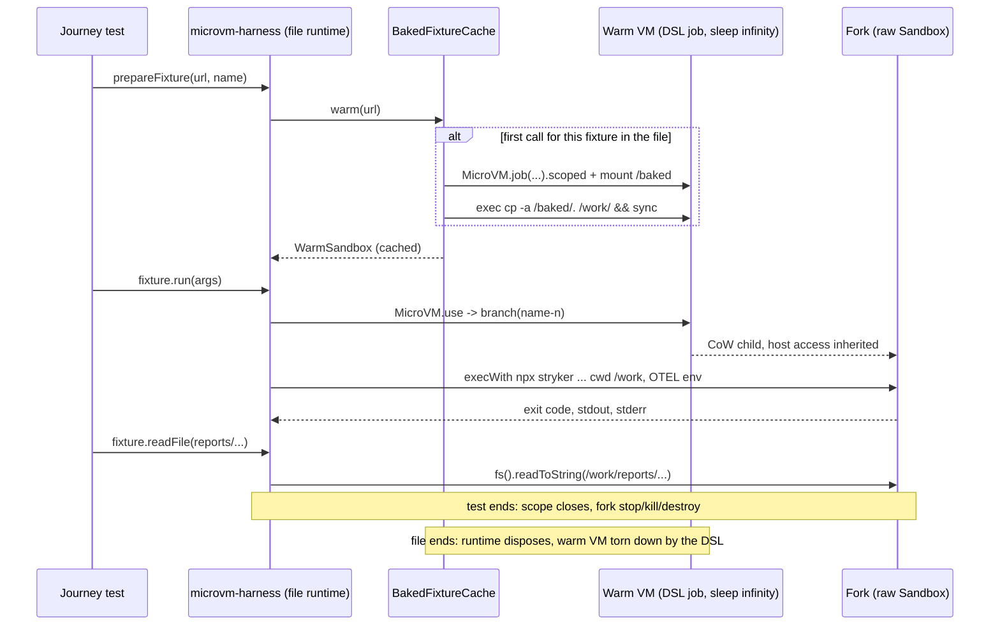

# E2E Warm Sandbox Forked Per Run - Plan

## Goal Capsule

- **Objective:** A contributor or CI runner gets the same `pnpm test:e2e` verdicts, with every Stryker run still starting from a pristine fixture filesystem, while the lane stops paying a cold microVM boot plus a copy-job microVM for every run.
- **Means:** One warm microVM per test file holds the baked fixture on its own disk; each CLI run executes in a copy-on-write branch of it that is destroyed afterwards (KTD1, KTD2).
- **Authority:** R-IDs win on behavior; KTDs win on mechanism. `docs/plans/2026-09-22-2126-refactor-test-e2e-microsandbox-isolation-substrate-plan.md` stays authoritative for everything this plan does not replace (bake cache, host access, OTLP rewrite).
- **Execution profile:** `ce-work` inside the `lfg` pipeline on branch `microsandbox-opt`; ships through a PR a human merges.
- **Stop conditions:** Stop and report if an authored oracle literal in `test/e2e/tests/*.e2e.test.ts` or `test/e2e/oracle-baselines/*.json` would need to change, or if a judgment surface would need an edit (`.github/workflows/`, `test/e2e/AGENTS.md` rule rows, `vitest*.config.ts` timeouts, lint configs). Stop if microsandbox 0.7.2 cannot branch a sandbox that carries host access (R3), since no fallback keeps traces working.

---

## Product Contract

### Summary

The E2E harness boots one warm microVM per test file per fixture, copies the baked fixture onto that VM's disk once, and forks the running VM for each Stryker CLI run. Each run reads and writes only its own fork, and the fork is destroyed when the test finishes. Journeys keep their API: `prepareFixture` returns a fixture whose `run` and `readFile` now act on forks.

### Problem Frame

Today every `fixture.run(...)` boots a fresh `node:24-alpine` microVM, and every `prepareFixture(...)` first boots a second microVM just to `cp -a` the baked fixture into a host workspace (`installFixtureInto` in `test/e2e/src/Harness/fixture-cache.service.ts`). The typescript-checker journey alone prepares six fixtures from one source directory, so a single file pays twelve boots. Runs that share a fixture name also share one host workspace, so a second run sees the first run's `reports/` and `.stryker-tmp/`. microsandbox 0.7.2 can branch a running sandbox into a copy-on-write child with private writes, which gives every run a clean filesystem without a boot or a copy.

### Key Decisions

- **KD1. Warm sandbox per test file, forked per run.** (session-settled: user-directed — chosen over the one-shot cold `MicroVM.job` per run with a copy-job workspace of the prior plan's KD1: branching keeps a clean filesystem per run while paying one boot and one copy per file.) Governs R1, R2, R3.

### Requirements

**Isolation**

- R1. Every Stryker CLI execution runs in its own fork of a warm microVM, and the warm microVM itself never runs Stryker.
- R2. A fork starts from the warm VM's post-copy filesystem and its writes are invisible to every other fork, the warm VM, and the host.
- R3. A fork reaches the host collector at `host.microsandbox.internal:4318` exactly as job VMs do today.

**Lifecycle**

- R4. The warm VM and every fork live in an Effect `Scope`: normal exit, failure, and interruption (including a test's abort signal) destroy them.
- R5. One warm VM exists per (test file, fixture directory) and is reused by every `prepareFixture` call for that fixture in the file.
- R6. A journey reads a run's output files (`fixture.readFile`) from the fork of the fixture's most recent run.

**Scope of change**

- R7. Journey bodies and authored oracle literals stay unchanged; `scripts/blessed-baseline.ts` runs each slice attempt in a fresh fork.

### Scope Boundaries

- The bake step (preparation job VM, content-addressed cache, `bake-fixtures.sh`) stays as is.
- The LGTM stack, OTLP endpoint rewrite, and CI workflow stay as they are.
- Pre-forking a pool of branches ahead of demand is out; forks are created on demand.

#### Deferred to Follow-Up Work

- Upstream `RunningVM.branch`, guest file read, and per-exec env/cwd in `@systemfsoftware/effect-microsandbox`, so the harness can drop the `MicroVM.use` escape hatch (KTD2).

---

## Planning Contract

### Key Technical Decisions

- KTD1. **Warm VM boots through the DSL as a long-lived job.** `MicroVM.job(BASE_IMAGE, ['tail', '-f', '/dev/null'])` (a portable busybox idle workload) with `withHostAccess(true)`, `withWorkdir('/work')`, `withMemoryLimit`, and a mount of the fixture's baked cache entry at `/baked`, acquired through `.scoped` (not `.run`). One `MicroVM.exec` then runs `mkdir -p /work && cp -a /baked/. /work/ && sync`, so `/work` lives on the guest disk, not a host mount. This keeps boot, host access, virtualization errors, and escalating teardown inside `@systemfsoftware/effect-microsandbox` (verified: job blueprints expose `.scoped`, `dist/mod.mjs` lines 641-676). Instantiates KD1; governs R1, R3, R4, R5.
- KTD2. **Forks go through `MicroVM.use` and the raw microsandbox `Sandbox`.** No `@systemfsoftware/effect-microsandbox` version (through 3.0.0) exposes branching, guest file reads, or exec with env and cwd. `MicroVM.use(vm, (sandbox) => sandbox.branch(name))` returns a child `Sandbox`. The harness wraps it in `Effect.acquireRelease` whose release mirrors the DSL teardown: `stopWithTimeout`, then `killWithTimeout` on failure, then `destroy({ force: true })`, uninterruptible (pack: cell-architecture, scoped-lifecycle-boundaries.md). Exec uses `execWith` with `cwd('/work')` and the per-run OTEL env. Reads use `fs().readToString`. Conflict call-out: the prior plan's KD3 (upstream DSL extensions over in-harness driver workarounds) is not met for branching. Upstreaming first would gate this change on an external release, so the harness takes the DSL's own exported escape hatch and records the upstream work as deferred.
- KTD3. **`microsandbox` becomes a direct `test/e2e` dependency.** The fork handle types come from `microsandbox`, which today resolves only transitively. Add it through the workspace catalog at the version `@systemfsoftware/effect-microsandbox` already resolves (0.7.2), so one runtime copy stays installed.
- KTD4. **Handles are values; lifecycle lives in scopes.** A new `warm-sandbox.handle.ts` defines `WarmSandbox` and `SandboxFork` as plain handle records with standalone operations `boot`, `fork`, `exec`, and `readFile`, rather than new `Context.Service`s (pack: cell-architecture, resource-vs-handle-duality.md). `BakedFixtureCache` keeps its service role and caches one `WarmSandbox` per fixture directory in its layer scope, which is the file-scoped `ManagedRuntime` in `microvm-harness.ts`.
- KTD5. **Forks are scoped to the test, not the run.** `StrykerCliRunner.run` requires `Scope` and returns the result together with its fork. `prepareFixture` opens one scope per test and closes it in fixture teardown, so `readFile` after `run` works (R6) and every fork dies with its test (R4). Branches use `guestFlush: 'required'` so a fork never materializes before the warm VM's post-copy writes reach disk (R2). Fork names are `<fixture id>-<8-char random>-<n>`, which stays far below microsandbox's 128-byte name limit for every fixture directory name under `test/e2e/testResources/`.
- KTD6. **Remove the copy-job workspace path.** `installFixtureInto`, the host `mkdtemp` workspace, and the `MicroVMHarness.readFile(hostPath)` host read go away. `GuestJobs` stays for the bake job only; members nothing calls are deleted.

### High-Level Technical Design

### Assumptions

- A microsandbox branch inherits the parent's network policy, so host access set at boot reaches the fork (docs.microsandbox.dev/sandboxes/snapshots.md#branching; inheritance of the `host` profile is inferred, not stated). If it does not, the stop condition in the Goal Capsule applies.
- The `/baked` bind mount on the warm VM does not block branching; the fork never reads `/baked`. Mount handling under `branch` is verified at execution time (Risks).
- Vitest's `signal` keeps interrupting in-flight runs the way it does today.

### Risks & Dependencies

| Risk                                                                  | Mitigation                                                                                                                                                                                                                               |
| --------------------------------------------------------------------- | ---------------------------------------------------------------------------------------------------------------------------------------------------------------------------------------------------------------------------------------- |
| `branch` rejects or warns on the warm VM's external `/baked` mount    | The first real fork proves it. If branching fails, drop the mount: pack the baked fixture entry into a host tarball once, push it with `fs().copyFromHost`, and extract it in the guest with `tar -x -C /work`, keeping KTD1's DSL boot. |
| Guest root disk too small for the enterprise fixture's `node_modules` | Surfaces as a failing `cp` exec with stderr tail; the remedy is a larger root disk, which the DSL does not expose, and would be a new stop-and-report.                                                                                   |
| Writes still in the guest page cache are lost to the fork             | `sync` after the copy, plus `guestFlush: 'required'` on every branch (KTD5).                                                                                                                                                             |
| A crashed test process leaks branches                                 | Forks are non-detached children of the test process; teardown is uninterruptible and escalates to kill.                                                                                                                                  |
| Peak memory with parallel files                                       | Each concurrent file holds one 4096 MiB warm VM plus copy-on-write deltas of its live forks. Today each concurrent run holds one 4096 MiB VM, so peak stays in the same range; watch it on the first full lane run.                      |

### Sources & Research

- `node_modules/.pnpm/microsandbox@0.7.2/node_modules/microsandbox/dist/sandbox.d.ts`: `branch`, `branchMany`, `execWith`, `fs()`.
- docs.microsandbox.dev: `sandboxes/snapshots.md` (branching, mount behavior: host bind mounts are external and not copied), `sdk/typescript/execution.md`, `sdk/typescript/filesystem.md`, `networking/overview.md#reaching-the-host`.
- `@systemfsoftware/effect-microsandbox@2.0.1` `dist/mod.mjs`: `use` escape hatch (lines 573-579), job `.scoped` (667-669), `withHostAccess` maps to network profiles `public` and `host`.

---

## Implementation Units

### U1. Direct microsandbox dependency

- **Goal:** `test/e2e` imports `microsandbox` types and APIs without a phantom dependency (KTD3).
- **Requirements:** R1, R2.
- **Dependencies:** none.
- **Files:** `pnpm-workspace.yaml`, `test/e2e/package.json`, `pnpm-lock.yaml`.
- **Approach:** add a `microsandbox` catalog entry resolving to the version `@systemfsoftware/effect-microsandbox` already pins, and a `catalog:` devDependency in `test/e2e`. Do not touch `catalogs.stryker` or `minimumReleaseAgeExclude`.
- **Test expectation:** none -- dependency wiring; `pnpm install --frozen-lockfile` and typecheck prove it.
- **Verification:** the lockfile keeps a single `microsandbox@0.7.2` entry.

### U2. Warm sandbox and fork handles

- **Goal:** boot a warm fixture VM and fork, exec in, and read from its branches, all scoped (KTD1, KTD2, KTD4, KTD5).
- **Requirements:** R1, R2, R3, R4.
- **Dependencies:** U1.
- **Execution note:** run the U5 smoke immediately after this unit, before U3 rewires any caller. It is the first evidence that a branch of a warm VM carrying host access and a `/baked` mount works at all, and a failure there triggers the Goal Capsule stop condition or the Risks mitigation before the rest of the diff exists.
- **Files:** `test/e2e/src/Harness/warm-sandbox.handle.ts` (new), `test/e2e/src/Harness/harness-failure.schema.ts`, `test/e2e/src/Harness/guest-job.service.ts`.
- **Approach:**
  1. `boot(bakedFixtureDir, label)` acquires the DSL job VM per KTD1 and runs the populate exec, failing with `ExitFailure` carrying the stderr tail on a non-zero code.
  2. `fork(warm, label)` requires `Scope`, calls `MicroVM.use` to branch, and registers the escalating release from KTD2.
  3. `exec(fork, argv, env)` runs through `execWith` with cwd `/work` and maps microsandbox's `ExecOutput` (exit code, stdout, stderr; its `ExitStatus` carries no signal) straight to the harness `ExecResult`. `GuestSignaledFailure` and `requireExited` stay only where the bake job still produces a `JobCompletion`.
  4. `readFile(fork, relativePath)` reads `/work/<relativePath>` as UTF-8.
  5. Add a tagged `SandboxForkFailure` (step, sandbox name, cause) to `harness-failure.schema.ts` and to `HarnessFailure`, used for branch, exec, and read failures.
- **Patterns to follow:** `stderrTailOf` in `guest-job.service.ts` for failure stderr tails; tagged errors in `harness-failure.schema.ts`.
- **Test expectation:** none -- exercised by the U5 smoke and the existing journeys.
- **Verification:** typecheck passes; the U5 smoke checks hold.

### U3. Harness services on warm sandboxes

- **Goal:** `BakedFixtureCache` hands out one cached `WarmSandbox` per fixture directory, and `StrykerCliRunner.run` executes in a fresh fork (KTD4, KTD5, KTD6).
- **Requirements:** R1, R4, R5, R6.
- **Dependencies:** U2.
- **Files:** `test/e2e/src/Harness/fixture-cache.service.ts`, `test/e2e/src/Harness/stryker-cli-runner.service.ts`, `test/e2e/src/Harness/guest-job.service.ts`.
- **Approach:**
  1. Replace `install(request)` with `warm(fixtureUrl)`, keyed on the fixture URL only, so different journey names share the warm VM (R5). Keep the missing-directory `FixtureMissingFailure` check.
  2. Delete `installFixtureInto`, the host workspace, and the host `readFile` (KTD6).
  3. `StrykerCliRunner.run(args, warm, label)` forks, execs `npx --no-install stryker ...args` with the existing OTEL env, and returns `{ result: ExecResult, fork }` under `Scope`.
  4. Remove `GuestJobs` members that no caller uses after the cutover.
- **Patterns to follow:** existing `Cache.make` in `BakedFixtureCache.layer`; `guestTelemetryEnvironment` stays the single OTEL env source.
- **Test scenarios:** exercised through U4 and U5.
- **Verification:** no remaining reference to a host workspace path or a copy job in `test/e2e/src/`.

### U4. Journey fixture API over forks

- **Goal:** `prepareFixture` keeps its journey-facing shape while `run` forks and `readFile` reads the latest fork (KTD5).
- **Requirements:** R4, R6, R7.
- **Dependencies:** U3.
- **Files:** `test/e2e/tests/__fixtures__/microvm-harness.ts`, `test/e2e/scripts/blessed-baseline.ts`.
- **Approach:**
  1. `prepareFixture` opens a `Scope` per test and closes it after `use` returns.
  2. `PreparedFixture` keeps `run` and `readFile` and drops the host `path`; `readFile` before any run fails with a clear error instead of reading the pristine warm VM.
  3. `run` passes the test's abort signal as today.
  4. `blessed-baseline.ts` warms the enterprise fixture once and runs each slice attempt in its own fork inside a per-attempt scope.
- **Test scenarios:** the ten existing journeys run unchanged and keep their verdicts (R7).
- **Verification:** `git diff` shows no change to journey bodies or oracle literals.

### U5. Fork isolation smoke

- **Goal:** prove R2 and R3 on real forks before trusting journey verdicts.
- **Requirements:** R2, R3.
- **Dependencies:** U2 (run before U3 per U2's execution note; rerun after U4).
- **Files:** none committed; a throwaway script against the harness services.
- **Approach:** warm `calc-fixture` and fork it several times. No permanent test: the lane already exceeds the seam-only journey cap, and a harness-invariant journey observes nothing the shipped CLI seam exposes (test-layer-selection admission gate: refused).
- **Test expectation:** none -- throwaway smoke; the scenarios below are its checks.
  - A fork writes `/work/marker.txt`; a second fork from the same warm VM does not see it and still sees the fixture's `package.json`.
  - A fork deletes `/work/package.json`; a later fork still reads it.
  - A fork resolves `host.microsandbox.internal` (host access inherited, R3).
  - After a fork's scope closes, microsandbox no longer lists its sandbox name.
- **Verification:** all four checks observed and reported in the PR; the script is deleted.

### U6. Lane documentation

- **Goal:** docs describe the warm-and-fork substrate instead of one-shot job VMs.
- **Requirements:** R1, R2.
- **Dependencies:** U4.
- **Files:** `test/e2e/AGENTS.md` (intro paragraph and MicroVM environment prose only, no rule rows), `test/e2e/README.md`.
- **Test expectation:** none -- documentation.
- **Verification:** no remaining claim that each run boots its own one-shot job VM or mounts a host workspace at `/work`.

---

## Verification Contract

| Gate                 | Command                                                                                    | Proves                                                          |
| -------------------- | ------------------------------------------------------------------------------------------ | --------------------------------------------------------------- |
| E2E lane             | `pnpm --filter @systemfsoftware/stryker-e2e test:e2e` on a host with read/write `/dev/kvm` | R1, R3-R7: unchanged verdicts                                   |
| Fork isolation smoke | U5 throwaway script                                                                        | R2, R3                                                          |
| Wall clock           | the same lane before and after, timed                                                      | the boots saved; reported in the PR, not a gate                 |
| Typecheck            | `pnpm typecheck`                                                                           | U1-U4 wiring                                                    |
| Lint                 | `pnpm --filter @systemfsoftware/stryker-e2e lint`                                          | lane lint scope                                                 |
| Format               | `pnpm format:check`                                                                        | START-1                                                         |
| Changeset            | `./scripts/check-changeset.ts $(git merge-base HEAD origin/main)`                          | START-5 (private package; confirm whether it requires an entry) |

## Definition of Done

- Every journey passes on the fork substrate with unchanged bodies and literals, and the U5 smoke checks hold.
- No code path boots a VM per run or copies a fixture into a host workspace.
- Typecheck, lint, and format gates pass.
- The upstream follow-up in Deferred to Follow-Up Work is recorded where the PR reader sees it.
- Abandoned-attempt code from execution is removed from the diff.
