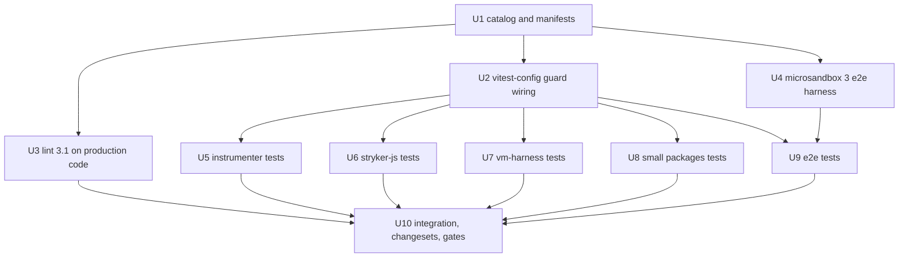

# Latest systemfsoftware Packages - Plan

## Goal Capsule

- **Objective:** Every `@systemfsoftware/*` dependency this workspace consumes is on its latest published version, and every repo gate (format, typecheck, lint, test, build, changeset) is green on it.
- **Means:** Bump the catalog, adopt the `@systemfsoftware/vitest` fork that the new majors require, and migrate every in-repo test onto it (KTD1, KTD2).
- **Authority:** `CONSTITUTION.md` > `AGENTS.md` > this plan > package READMEs of the new versions.
- **Stop conditions:** Stop and report if a new major cannot express an existing test's intent without deleting coverage, or if the fork's guard cannot be exempted for a test subject that must stay on plain Vitest (KTD4).
- **Execution profile:** Foundation units run serially, then the per-package test migration units fan out in parallel, then one integration owner runs the full gates.
- **Finishes and ships:** `lfg` pipeline, which opens the PR; merge stays with the user.

---

## Product Contract

### Summary

Move the workspace to the latest `@systemfsoftware/*` releases. Four of them (`effect-gherkin-spec` 5, `effect-schema-law` 3, `effect-schema-vite` 2.2.5, `differential-spec` 0.5) peer on `@systemfsoftware/vitest`, and `oxlint-config-recommended` 3.1 refuses every value import from `vitest` or `@effect/vitest`, so the suite moves to the fork as part of the same change.

### Problem Frame

The catalog is one to two majors behind on most `@systemfsoftware/*` packages. The new majors are coupled: the gherkin, schema-law, and differential libraries hand a test its checks through the fork's `expect` parameter, and the lint preset now forbids the upstream runner. Updating any one of them alone leaves the others unresolvable or the lint gate red.

### Requirements

**Dependency versions**

- R1. The `pnpm-workspace.yaml` default catalog pins each `@systemfsoftware/*` entry to its latest npm version as of 2026-09-25: `differential-spec` ^0.5.0, `effect-cell-types` ^10.2.0, `effect-microsandbox` ^3.1.0, `effect-readiness` ^0.3.1, `effect-gherkin-spec` ^5.0.0, `effect-schema-law` ^3.0.0, `effect-schema-vite` ^2.2.5, `oxlint-config-recommended` ^3.1.0, and a new `@systemfsoftware/vitest` ^0.1.0. `arethetypeswrong-cli` 4.2.0 and `tsconfig` 2.0.1 are already latest.
- R2. The `stryker` catalog stays on `latest` and the lockfile resolves each entry to the current npm `latest` (AGENTS.md dogfood rule, START-6).
- R3. No workspace test imports `@effect/vitest`. The catalog entry stays only if a KTD4 test subject still resolves the real package; for example, the vm-harness serves `@effect/vitest` to user suites and its tests pin that mapping.

**Test suite**

- R4. Every in-repo test (workspace `tests/`, `src/__tests__/`, in-source `import.meta.vitest` blocks, `test/e2e` harness and journey tests) runs on `@systemfsoftware/vitest` under its guard and keeps the behaviour it asserted before.
- R5. Test subjects that model a user's project stay on plain Vitest and outside the guard (KTD4).
- R6. No test is deleted or weakened to fit the fork; a refused matcher is rewritten to its named replacement.

**Lint and runtime APIs**

- R7. `pnpm lint` passes under `oxlint-config-recommended` 3.1 with no new suppression comments or rule disables (CONSTITUTION forbids reaching a gate by suppression).
- R8. The e2e harness uses the `effect-microsandbox` 3 blueprint API and keeps the warm-snapshot, fork-per-run behaviour.

### Key Decisions

- **Full upgrade, including the fork migration, in this change.** Governs R1, R3, R4. (session-settled: user-directed — chosen over a partial upgrade of only the fork-independent packages, or a staged partial PR followed by a separate migration PR: the user asked for every package on latest.)

### Scope Boundaries

- Test subjects under `testResources/**`, `__fixtures__/**` fixture projects, and Vitest source strings executed inside vm-harness sandboxes keep their plain-Vitest code (KTD4).
- No new product behaviour in the shipped packages.

### Deferred to Follow-Up Work

- Teaching `@systemfsoftware/stryker-vm-harness` to intercept `@systemfsoftware/vitest` imports, so user suites written on the fork run in the in-memory vm runner. That is a product feature; the dogfood mutation lane uses the vitest runner, not the vm runner.
- Syncing the vendored `repos/**` subtrees (read-only per AGENTS.md).

---

## Planning Contract

### Key Technical Decisions

- KTD1. **One PR for bump plus migration.** Instantiates the full-upgrade Key Decision (Governs R1, R3, R4). The coupled majors cannot resolve independently.
- KTD2. **Import `@systemfsoftware/vitest` by its own name; no alias.** The test-discipline rule `vitest-from-systemfsoftware-vitest` in `@systemfsoftware/oxlint-plugin-test-discipline` 4 bans value imports from both `vitest` and `@effect/vitest`, and the fork README states that packages import it by name. Aliasing `@effect/vitest` to the fork would still trip the rule. Type-only imports from `vitest` stay legal.
- KTD3. **Mirror upstream `vitest-config` into `packages/toolchain/vitest-config`.** Upstream `@systemfsoftware/vitest-config` is private and unpublished, so the repo keeps its own copy. Port the guard setup-file resolution, the exemption table, the `test.provide` property defaults, and the `effect/TestClock` alias from `/packages/toolchain/vitest-config/lib/base.js` upstream. Keep the repo-specific pieces: the `@systemfsoftware/source` resolve conditions, the `.stryker-tmp`/`.repo` excludes, the timeouts, and the coverage settings. A package without the fork as a devDependency then fails at config load rather than running unguarded.
- KTD4. **Test subjects stay on plain Vitest.** Fixture projects under `testResources/**` and `test/e2e/testResources/**`, the sandbox source strings in `packages/stryker-vm-harness/tests/*.integration.test.ts`, and the real-Vitest oracle inside `packages/stryker-js/tests/vm-parity.differential.test.ts` are the inputs Stryker runs against. They model user projects on stock Vitest, so rewriting them would change what the product is tested against. They stay outside the guard (their own configs, or the exemption table) and outside the lint globs.
- KTD5. **Real I/O runs on the live clock, by declaration.** Gherkin 5 runs every scenario under the simulation kernel unless it declares `live: '<reason>'` (scenario) or `.live('<reason>')` (feature). A scenario that spawns processes, workers, sockets, `tsgo`, or microVMs declares the reason. Plain fork tests with real I/O use `it.live`.
- KTD6. **One check per observed state, as a record.** Several `expect`s on one state become one `toMatchObject`/`toEqual` over a record. A `Then` followed by `And`/`But` on the same state merges into one `Then`. The e2e `expect.soft` runs become one record check per step, or `step(...)` from `@systemfsoftware/vitest/integration` where a flow asserts at several points.
- KTD7. **Properties take the named-subject form and must refute the constant impostor.** Positional `it.prop(name, [arbs], pred)` becomes `it.prop(name, { of, subject, runs }, holds)` or an `it.law.*` kind. When the constant-impostor gate reports `VacuousProperty`, add a law that pins output to input (a model or a base case). `it.law.idempotent`/`deterministic` exemptions are not used to silence the gate.
- KTD8. **In-source blocks follow the upstream shape.** `if (import.meta.vitest !== void 0) { const { it } = await import('@systemfsoftware/vitest') ... }`, as in upstream `effect-cell-types/src/Sandwich.ts`. The dynamic import keeps the fork out of the published module graph.
- KTD9. **`effect-microsandbox` 3 through the blueprint API.** `MicroVM.JobResource` becomes `MicroVM.JobBlueprint` at every type reference. The chained `.withMemoryLimit(...)`/`.withMount(...)` calls stay: the blueprint keeps them as instance methods alongside the `pipe` duals. The raw `microsandbox` SDK stays on 0.7.2, so `warm-sandbox.handle.ts` is unchanged. `effect-readiness` 0.3 needs no code change; the e2e harness uses only `HostProber` and `NodeHostProber.layer`.

### High-Level Technical Design

U5–U9 touch disjoint package directories and can run in parallel. U1 owns the lockfile and manifests, U2 owns the shared vitest config and every `vitest.config.ts`, and U10 owns the full gate run.

Each migration unit starts by recording its package's baseline count of test cases and gherkin scenarios. It ends with the same or a higher count; the fork's second run of a test does not count as a new case. The migration adds no new permanent test files; the test-layer admission gate therefore has nothing to admit. Existing integration suites that spawn processes stay at their current layer, and re-layering them is out of scope.

### Assumptions

- The published vitest runner (`@systemfsoftware/stryker-js-vitest-runner` from `catalog:stryker`) handles fork-registered tests: the fork registers through Vitest's own collector, and its second run merges into the same test id. [INFERENCE from ToolchainWiring research; the dogfood `mutation` turbo task is the proof.]
- e2e journeys need `/dev/kvm`, which this workstation lacks; CI runs them.
- CI's `mutation.yml` runs the dogfood lane per package with `continue-on-error`, so a broken dogfood runner would not fail CI. The Verification Contract therefore runs one package's mutation lane locally.

### Risks

| Risk                                                                                                                                                     | Mitigation                                                                                                                                                                 |
| -------------------------------------------------------------------------------------------------------------------------------------------------------- | -------------------------------------------------------------------------------------------------------------------------------------------------------------------------- |
| The fork runs each passing test twice and runs a block's tests concurrently and shuffled, which could double integration runtime or expose shared state. | Real shared state is a finding to fix, not suppress. `layer(L, { shared: true })` only where the suite deliberately shares one expensive resource, with the reason stated. |
| Constant-impostor gate fails many of the ~40 property files.                                                                                             | KTD7: add model or base-case laws per subject.                                                                                                                             |
| Virtual time breaks tests that sleep on real timers.                                                                                                     | KTD5: real I/O goes live. Pure-logic timing moves to `Effect.sleep` under virtual time.                                                                                    |
| The lint 3.1 kind rules flag production cells.                                                                                                           | U3 fixes them in source. Research found no `*.resource.ts`/`*.blueprint.ts` files, so the expected impact is small.                                                        |

### Sources

- New package READMEs and changelogs: `@systemfsoftware/vitest` 0.1.0, `effect-gherkin-spec` 5.0.0, `effect-microsandbox` 3.1.0, `effect-readiness` 0.3.1, `differential-spec` 0.5.0, `oxlint-config-recommended` 3.1.0, `oxlint-plugin-test-discipline` 4.0.0 (npm tarballs).
- Upstream patterns: `systemfsoftware/systemfsoftware` `packages/toolchain/vitest-config/lib/base.js` (guard wiring), `packages/effect-cell-types/src/Sandwich.ts` (in-source block), `packages/trace/trace-spec/src/observation-window.{blueprint,handle}.ts` (kind files).

---

## Implementation Units

### U1. Catalog, manifests, lockfile

- **Goal:** Resolve the latest versions workspace-wide and swap `@effect/vitest` for the fork in every manifest.
- **Requirements:** R1, R2, R3; KTD1, KTD2.
- **Dependencies:** none.
- **Files:** `pnpm-workspace.yaml`, `pnpm-lock.yaml`, `packages/*/package.json`, `packages/*/*/package.json`, `test/e2e/package.json`, `test/e2e/testResources/*/package.json` (only their `effect-cell-types` pin).
- **Approach:**
  1. Bump the default-catalog entries per R1 and add `@systemfsoftware/vitest`.
  2. Replace the `@effect/vitest` devDependency with `@systemfsoftware/vitest: catalog:` in every package that runs tests, and add it where a package has tests but no runner dependency.
  3. Keep the `@effect/vitest` catalog entry and devDependency only where a KTD4 subject resolves it (R3); remove them everywhere else. Leave `minimumReleaseAgeExclude` alone (human-approval surface).
  4. Refresh the lockfile so `catalog:stryker` entries resolve to current npm `latest`.
- **Test expectation:** none -- manifest change; U10's install and gates prove it.
- **Verification:** `pnpm install` succeeds with no unmet peer warnings for `vitest` ^5, `effect` rc.117, or `@systemfsoftware/vitest`.

### U2. vitest-config guard wiring

- **Goal:** Every workspace test project loads `@systemfsoftware/vitest/guard`, and the exempt subjects of KTD4 do not.
- **Requirements:** R4, R5; KTD3, KTD4.
- **Dependencies:** U1.
- **Files:** `packages/toolchain/vitest-config/lib/base.js`, `packages/toolchain/vitest-config/lib/base.d.ts`, `packages/toolchain/vitest-config/lib/setup.js`, `packages/toolchain/vitest-config/lib/files.js` (new), `packages/toolchain/vitest-config/package.json`, and each package's `vitest.config.ts` if its call shape changes (upstream `defineConfig` is async).
- **Approach:**
  1. Port the upstream guard resolution, exemption table, `test.provide` defaults, and `effect/TestClock` alias.
  2. Drop `globals: true` and whatever in `setup.js` the guard replaces.
  3. Replace `@effect/vitest` in `modulesReachingTheBudgetedPropMock` with `@systemfsoftware/vitest`.
  4. List in the exemption table any inline project whose tests a foreign runner registers.
- **Patterns to follow:** upstream `packages/toolchain/vitest-config/lib/base.js`.
- **Test scenarios:**
  - A package test that imports `expect` from `vitest` fails with the guard's "an expect imported from vitest ran" refusal.
  - A package missing the fork devDependency fails at config load with the vitest-config message.
  - A fixture project run by the vm-harness integration tests still passes with a raw Vitest `expect`.
- **Verification:** One migrated package's suite runs green, and a deliberately raw `expect` in a scratch test is refused (throwaway check, not committed).

### U3. Lint 3.1 on production code

- **Goal:** Production sources satisfy the rules added in `oxlint-config-recommended` 3.0/3.1 and `oxlint-config-cell-architecture` 2/3.
- **Requirements:** R7.
- **Dependencies:** U1.
- **Files:** `packages/*/src/**`, `packages/*/*/src/**`, `test/e2e/src/**` where flagged, and each `oxlint.config.ts` whose ignore globs must keep `testResources/**` out (KTD4).
- **Approach:** Run each package's lint, fix production-code findings at their source (kind construction, handle guards, `Sandwich` straight-line shells, medium recovery), and leave test-file findings to U5–U9.
- **Patterns to follow:** upstream `packages/trace/trace-spec/src/observation-window.{blueprint,handle}.ts`.
- **Test expectation:** none -- structural refactor whose behaviour the existing suites and mutation dogfood pin.
- **Verification:** `lint` passes for `src/**` in every package, with no new `oxlint-disable` comments.

### U4. microsandbox 3 in the e2e harness

- **Goal:** The e2e harness compiles and boots jobs on the blueprint API.
- **Requirements:** R8; KTD9.
- **Dependencies:** U1.
- **Files:** `test/e2e/src/Harness/guest-job.service.ts`.
- **Approach:** Rename the job type per KTD9, and fix any other 3.x compile error the typecheck reports in that file.
- **Test expectation:** none -- API rename; the e2e journeys (U9, CI) exercise it.
- **Verification:** `test/e2e` typechecks. The journeys pass in CI, where KVM is available.

### U5. stryker-js-instrumenter tests

- **Goal:** Instrumenter tests and in-source blocks run on the fork.
- **Requirements:** R4, R6; KTD5–KTD8.
- **Dependencies:** U2.
- **Files:** `packages/stryker-js-instrumenter/tests/**`, in-source blocks in `packages/stryker-js-instrumenter/src/**` (e.g. `src/Location.schema.ts`, `src/print/SourceText.handle.ts`).
- **Approach:** Convert each body to a generator with `{ expect }`, merge multi-`expect` states into record checks, and replace refused matchers with the rewrites the fork README names. In-source blocks follow KTD8.
- **Test scenarios:** Behaviour-preserving migration. For each file, the same mutants, locations, and outcomes are asserted as before. Refused-matcher rewrites keep the asserted value, e.g. `toHaveLength(n)` becomes `toEqual([...])` of the actual contents.
- **Verification:** The package's `test` and `lint` tasks pass, and the test-case count is unchanged or higher.

### U6. stryker-js tests

- **Goal:** Core package tests, including property, gherkin, and differential suites, run on the fork.
- **Requirements:** R4, R5, R6; KTD4–KTD8.
- **Dependencies:** U2.
- **Files:** `packages/stryker-js/tests/**`, `packages/stryker-js/src/__tests__/**`, in-source blocks in `packages/stryker-js/src/**`.
- **Approach:**
  1. Property files move to KTD7's named-subject form.
  2. Gherkin integration suites (e.g. `tests/checker-rpc.integration.test.ts`) take `(state, expect)` `Then` bodies and live declarations per KTD5.
  3. `differential-spec` 0.5 callers pass `expect` to `runDifferentialWithShrink`/`runMetamorphicWithShrink` and drop `DisparityError`.
  4. `tests/vm-parity.differential.test.ts` keeps its real-Vitest oracle (KTD4). Only the outer test moves to the fork, and `vi` comes from the fork's re-export. The oracle's `createVitest` instance runs on its own generated config, outside the shared config's guard. If it inherits the guard, name that project in the exemption table (U2).
- **Test scenarios:** Each property keeps its law and gains a pinning law when the impostor gate flags it. Each `Then` asserts the same facts as before as one record.
- **Verification:** The package's `test` and `lint` tasks pass, and no `VacuousProperty` or `LeakedState` failures remain.

### U7. stryker-vm-harness tests

- **Goal:** vm-harness integration and differential suites run on the fork, while their sandbox sources stay plain Vitest.
- **Requirements:** R4, R5, R6; KTD4–KTD6.
- **Dependencies:** U2.
- **Files:** `packages/stryker-vm-harness/tests/**`, in-source blocks in `packages/stryker-vm-harness/src/**`.
- **Approach:** Migrate the outer gherkin steps only. Sandbox source strings that exercise `expect.poll`, snapshots, `vi.*`, and timers are subject code and stay verbatim. `And`/`But`-after-`Then` chains in `runner-retry-repeats`, `runner-assertions`, and `session-init` merge into single record `Then`s.
- **Test scenarios:** Each scenario still observes the same drained outcomes (status, failure messages, retry counts) for its sandbox, asserted once per state.
- **Verification:** The package's `test` and `lint` tasks pass.

### U8. Remaining packages

- **Goal:** Every other package's tests run on the fork.
- **Requirements:** R4, R6; KTD2, KTD5–KTD8.
- **Dependencies:** U2.
- **Files:** tests and in-source blocks of `packages/stryker-js-html-reporter`, `packages/stryker-js-plugin-interface`, `packages/stryker-js-plugin-runtime`, `packages/stryker-js-typescript-checker`, `packages/stryker-js-vitest-runner`, `packages/stryker-test-contribution`, `packages/ignorers/*`, `packages/frameworks/*`, `packages/toolchain/tsdown-config`. Type tests `packages/ignorers/interface/tests/interface.test-d.ts` and `packages/ignorers/kit/tests/kit.test-d.ts` import `expectTypeOf` from the fork.
- **Approach:** Same migration rules as U5. Checker and runner integration suites that spawn `tsgo` or Vitest go live per KTD5.
- **Test scenarios:** Behaviour-preserving, as in U5.
- **Verification:** Each package's `test` and `lint` tasks pass.

### U9. e2e tests

- **Goal:** e2e journeys and harness-script tests run on the fork.
- **Requirements:** R4, R5, R6, R8; KTD4–KTD7.
- **Dependencies:** U2, U4.
- **Files:** `test/e2e/tests/*.e2e.test.ts`, `test/e2e/tests/**` non-fixture helpers, `test/e2e/scripts/**/*.test.ts` (incl. `scripts/oracle/derive-oracle.property.test.ts`). Fixture projects under `test/e2e/testResources/**` and `test/e2e/tests/__fixtures__/**` stay as they are (KTD4).
- **Approach:**
  1. Replace each journey's `expect.soft` runs with one record check per observed state, using `step` where a journey asserts at several phases (KTD6).
  2. Move the raw `fast-check` property to `it.prop` with Schema arbitraries (KTD7).
  3. Journeys run live (KTD5).
- **Test scenarios:** Each journey still asserts the same mutant counts, statuses, report fields, and exported-trace facts as before.
- **Verification:** `test/e2e` typechecks and lints locally. Journeys pass in CI (no KVM locally).

### U10. Integration, changesets, gates

- **Goal:** The workspace is green end to end, with change intent recorded.
- **Requirements:** R1–R8.
- **Dependencies:** U3, U5, U6, U7, U8, U9.
- **Files:** `.changeset/*.md`, `pnpm-lock.yaml`, docs that name `@effect/vitest` as the test runner (`README.md`, `CONTRIBUTING.md`, package READMEs, `AGENTS.md` if any).
- **Approach:**
  1. Confirm no `@effect/vitest` or value `vitest` import remains outside KTD4 subjects.
  2. Add changesets for published packages whose manifests changed (dependency and devDependency bumps), following the repo's changeset validator limits.
  3. Update docs that describe writing tests.
- **Test expectation:** none -- integration and gating.
- **Verification:** The Verification Contract passes.

---

## Verification Contract

| Gate                                | Command                                                                                                                                                                | Applies                    |
| ----------------------------------- | ---------------------------------------------------------------------------------------------------------------------------------------------------------------------- | -------------------------- |
| Format                              | `pnpm format:check`                                                                                                                                                    | always                     |
| Typecheck                           | `pnpm typecheck`                                                                                                                                                       | always                     |
| Lint + tsgo lint + typecheck + test | `pnpm gate:tasks`                                                                                                                                                      | always                     |
| Tests                               | `pnpm test`                                                                                                                                                            | always                     |
| Build and dist gates                | `pnpm check:ci`                                                                                                                                                        | always                     |
| Change intent                       | `./scripts/check-changeset.ts $(git merge-base HEAD origin/main)`                                                                                                      | package manifests changed  |
| Dogfood stays on latest             | `git grep -F 'catalog:stryker' -- packages/stryker-js/package.json packages/stryker-js-vitest-runner/package.json packages/stryker-js-typescript-checker/package.json` | always                     |
| e2e journeys                        | `pnpm test:e2e`                                                                                                                                                        | CI only (needs `/dev/kvm`) |
| Dogfood mutation on fork suites     | `pnpm turbo mutation --filter=./packages/stryker-js-plugin-interface` completes and writes a report                                                                    | once, after U10            |

---

## Definition of Done

- Every catalog entry named in R1 is on its latest version, and the lockfile resolves them.
- No workspace test imports `@effect/vitest` or a value from `vitest` outside KTD4 subjects.
- Every gate in the Verification Contract passes locally, and CI passes, including e2e.
- No test was deleted or reduced to fit the fork. No suppression comment or rule disable was added.
- Dead-end code from abandoned migration attempts is removed from the diff.
