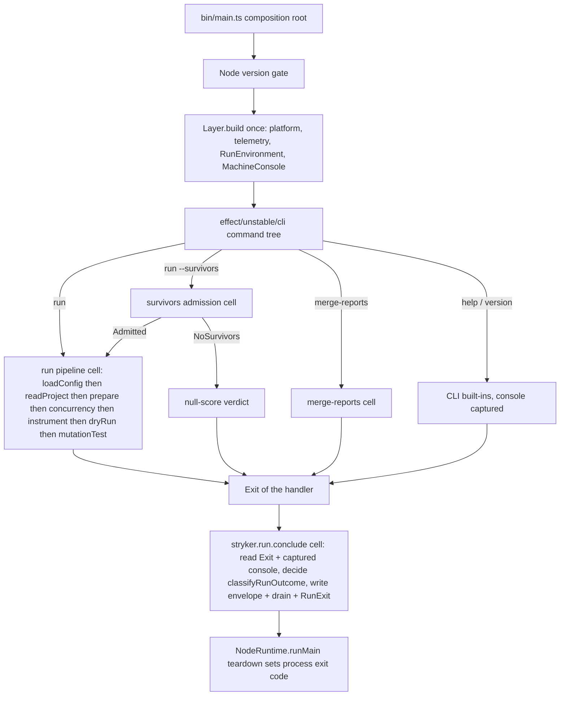
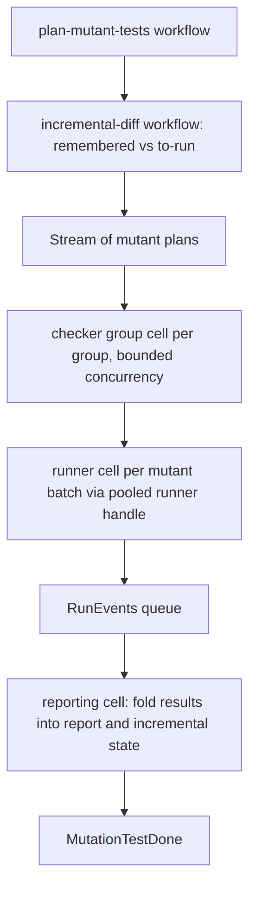
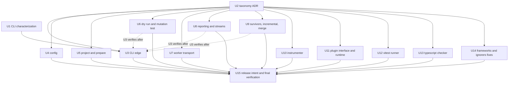

# Idiomatic Effect Rewrite of the Stryker Monorepo - Plan

## Goal Capsule

- **Objective:** Stryker users see the same CLI, config, reports, machine stream, and plugin contract they see today. Maintainers can change any stage, reporter, runner, or checker by editing one cell, workflow, or service, with no procedural glue to trace through.
- **Means:** rewrite every Effect package's internals to the cell architecture (KTD1, KTD2, KTD3). The published surfaces are the seams, and the unpinned CLI flows are characterized first (U1).
- **Authority:** `CONSTITUTION.md` > this plan's R-IDs > KTDs > unit text. The cell-architecture, boundary-testing, and schema-laws packs bind as cited.
- **Stop conditions:** stop and report instead of working around when any of these holds:
  - a published observable (R1–R5) cannot be preserved;
  - an `etc/*.api.md` report would change;
  - the work needs an edit to a judgment surface (R13).
- **Execution profile:** units U3–U14 run in parallel. Each unit owns the files it lists, and the published names are the contract between them. U1 and U2 land first; U15 closes.
- **Who finishes:** `ce-work` implements, then the `lfg` pipeline reviews and ships one pull request. Merging stays with the user.

---

## Product Contract

### Summary

Rewrite the internals of every Effect-based package so that each outside interaction is one `Sandwich.named` cell and every decision is a `Workflow.make`. Multi-item work becomes Effect `Stream` pipelines, and named effectful operations become `Effect.fn`. The CLI stops being a cell: `src/bin/main.ts` is a composition root, the `effect/unstable/cli` command tree calls cells, and one conclusion cell turns the run's outcome into the exit code and the machine envelope. The `*.parts.ts` and `*.steps.ts` grab-bags disappear. Published behavior is pinned before any path is replaced, and it stays unchanged.

### Problem Frame

The user's verdict is that the code is not idiomatic Effect and reads as procedural. The research confirms it with specifics.

- `packages/stryker-js/src/Cli.cell.ts` wraps the CLI in a cell. Its real work is `strykerCliEffect`, a ~70-line `Effect.gen` that runs the cell inside `Effect.exit`, then classifies the exit, emits machine output, drains the stream, and fails `RunExit`, all outside any cell phase.
- Five grab-bags hold most of the procedural mass, mixing pure helpers, `Effect.gen` procedures, and in-source tests: `run/mutation-test.parts.ts` (1490 lines, including a ~295-line `writeMutationTestProceed` generator), `run/load-config.parts.ts` (1307), `read-project.parts.ts` (840), `Cli.parts.ts` (600), and `run/dry-run.parts.ts` (~440). `load-config.cell.ts` even re-exports parts internals, so callers bypass the cell.
- Hand-rolled concurrency: `reporter-stream.service.ts` builds latches, queue pairs, and fiber records; `run-event-stream.service.ts` wires Queue, Ref, and Deferred by hand; `worker-protocol.blueprint.ts` tracks requests in `MutableHashMap`.
- The instrumenter's `Transformer.service.ts` is a 340-line generator that declares 15 nested imperative functions over mutable maps and throws inside the pure path.
- `ts-compiler.handle.ts` keeps an 8-field mutable record behind `Ref` and reads it with `Ref.getUnsafe`.
- `StandbyThreadsPool.handle.ts` is all Promise, callbacks, and mutable slots.
- `Effect.fn` has zero uses across `packages/*/src`.

Good shapes already exist and anchor the target: `route-cli-request.workflow.ts` (workflow), `progress-report.cell.ts` and `run/dry-run.cell.ts` (cells), `run/RunEnvironment.service.ts` (service), and `run/run-stages.cell.ts` (`Cell.andThen` composition).

### Requirements

**Published behavior (preserved exactly)**

- R1. The `stryker` CLI keeps its commands, flags, help and version output, and exit codes: 0 clean, 1 break threshold, 2 usage or configuration, 3 runtime failure, 130 interrupt, and the unsupported-Node rejection.
- R2. The machine stream keeps its wire shape and ordering: `RunEvent.RunEventWireLine`, `schemaVersion`, a single terminal event that comes last, one `runId`, and no ANSI on stdout. The persisted `reports/mutation/mutation.json` and the incremental report keep their shapes.
- R3. Config discovery, the file formats, `extends` resolution, option validation, and config error documents stay the same.
- R4. Every package's public API, pinned by `etc/*.api.md`, stays byte-identical. So do the plugin RPC groups, the worker spawn contract (`options.json` plus `STRYKER_WORKER_DIR`, `STRYKER_SOCKET`, `STRYKER_SANDBOX_DIR`), and the AGENTS.md PLUG-1 bundle rule.
- R5. Mutation verdicts, counts, and mutator tallies for the e2e fixtures still match the committed oracle literals, and the trace span names the e2e lane asserts survive: `prepare`, `instrument`, `dryRun`, `mutationTest`, `mutationTest.batch`, and `rpc.*`.

**Target architecture**

- R6. The CLI is an `effect/unstable/cli` command tree run from a composition root, and no cell models the CLI. A single conclusion cell owns the run conclusion: outcome to exit code, machine envelope, stream drain, and the `RunExit` failure.
- R7. Every outside interaction in the Effect packages is a `Sandwich.named` cell. One-pass stages compose with `Cell` combinators. Multi-item work (files, mutants, checker groups) is a `Stream` pipeline in the shell that runs a per-item cell. No code runs `cell.run` in sequence inside `Effect.gen`, and no `Cell.fromEffect` wraps a whole stage.
- R8. Every branching decision lives in a `*.workflow.ts` at cyclomatic complexity 1. Cell read and write phases, services, and drivers sequence steps and translate data. They do not decide.
- R9. No `*.parts.ts` or `*.steps.ts` file remains. Every source file follows the module taxonomy recorded in U2.
- R10. The Effect packages use Effect's own idioms:
  - named effectful operations are `Effect.fn`;
  - concurrency comes from `Stream`, `Queue`, `Pool`, `Scope`, and `FiberSet`/`FiberMap`, not hand-rolled latches or request maps;
  - Promise and callback APIs appear only at driver edges;
  - no `Ref.getUnsafe`, no module-level mutable state, no in-place mutation of caller-owned records in core code;
  - no `throw` outside driver interop.
- R11. `packages/frameworks/**` and `packages/ignorers/**` stay Effect-free, as their AGENTS.md files require. Only their documented rule deviations are fixed.

**Verification discipline**

- R12. Before U3 replaces the CLI edge, every published CLI flow the current suite leaves unpinned is characterized from the built binary as development-time evidence in `.scratch/`. The old and new binaries are then compared on the same inputs until they agree, and the evidence is deleted before commit (CONST-T9, CONST-T11). Expected values come from spec literals, not from the running code.
- R13. No judgment surface is edited:
  - `packages/toolchain/**`;
  - the `oxlint.config.ts`, `vitest.config.ts`, `vitest.mutation.config.ts`, and `stryker.config.ts` files;
  - `etc/*.api.md`;
  - `tests/**/*.integration.test.ts`;
  - `test/e2e/**`;
  - `.github/workflows/**`;
  - `turbo.json`;
  - every `packages/*/src/__tests__/*.property.test.ts` file that exists at the merge base. New or extended workflows get properties in new files (KTD6).

### Key Decisions

- **One plan for the whole monorepo.** Governs R7–R11. (session-settled: user-directed — chosen over an architecture-first plan or a stryker-js-only plan: the user wants the whole codebase rewritten now.) Conflict call-out: `packages/frameworks/AGENTS.md` and `packages/ignorers/AGENTS.md` forbid importing `effect`, so those tiers get only their rule-deviation fixes (R11). This narrows how far the Effect rewrite reaches, not the plan's coverage.
- **A rewrite of internals, not a product change.** Governs R1–R5. Every consumer-visible surface is already pinned by api-extractor reports, the integration tests, and the e2e oracle. Holding those fixed lets the packages be rewritten independently and in parallel.

### Scope Boundaries

- **In scope:** `packages/stryker-js`, `packages/stryker-js-instrumenter`, `packages/stryker-js-plugin-interface`, `packages/stryker-js-plugin-runtime`, `packages/stryker-js-vitest-runner`, `packages/stryker-js-typescript-checker`, `packages/stryker-js-html-reporter`, and `packages/stryker-test-contribution`. Also the R11 fixes in `packages/frameworks/svelte` and `packages/ignorers/angular`.
- **Outside this work:**
  - `packages/toolchain/**` and every other judgment surface (R13);
  - `test/e2e/**`;
  - `scripts/**`;
  - the `repos/**` subtrees;
  - `catalogs.stryker` dogfood pins (AGENTS.md START-6).
- **Not rewritten for its own sake:** `packages/stryker-js-instrumenter/src/print/SourceText.ts` is a pure exhaustive dispatch. It gets only the R10 fixes (throws, mutation), not a restructure (KTD8).
- **Empty leftover directories:** `packages/stryker-js-engine`, `packages/stryker-js-language`, and `packages/stryker-vm-harness` hold no tracked files and are not part of the repo's content.

#### Deferred to Follow-Up Work

- Rebless the e2e oracle baselines (`pnpm check:oracle-drift`) only if R5 turns out to be violated on purpose. It is not planned; any drift is treated as a defect.
- Consolidate the three mutant-status encodings in `plugin-interface` (`Metrics.schema.ts`, `ReporterEvent.schema.ts`, and `Mutant.MutantStatusSchema`). The encodings are published, so merging them is an API change R4 forbids.

---

## Planning Contract

### Key Technical Decisions

- KTD1. **The CLI is a composition root plus a command tree, and the conclusion is a cell.** `src/bin/main.ts` does the following:
  - checks the Node version;
  - builds the layer once;
  - runs the `effect/unstable/cli` command tree;
  - pipes the run's `Exit` into a `stryker.run.conclude` cell;
  - hands the result to `NodeRuntime.runMain({ disableErrorReporting: true })`.

  The conclusion cell reads the exit and the captured console, decides with the existing `classifyRunOutcome` workflow, and writes the envelope, drains the stream, and fails with a `RunExit` stamped with `Runtime.errorExitCode` inside `uninterruptibleMask`. This follows `docs/solutions/workflow-issues/exit-codes-through-runtime-teardown.md`. The subcommand handlers each run one composed cell. The flag definitions move to the command module, and flag decoding becomes Schema transformations. Governs R1, R6. (pack: cell-architecture, sandwich-phase-order.md; pack: cell-architecture, pipeline-composition.md)
- KTD2. **Module taxonomy.** Source files are `*.cell.ts`, `*.workflow.ts`, `*.schema.ts`, `*.service.ts`, `*.blueprint.ts`, and `*.handle.ts`, plus `src/drivers/<driver>.ts`, `src/bin/*`, and `mod.ts` barrels.
  - Pure helpers that decide or transform go in the `*.workflow.ts` modules that use them, where the mutation config (`src/**/*.workflow.ts`) grades them.
  - Schema files stay declaration-only (CONST-T4). Behavior now in `RunOutcomeCommand.schema.ts`, `reporting/*.schema.ts`, and `matching.schema.ts` moves to workflows.
  - `*.parts.ts` and `*.steps.ts` are retired.
  - U2 records the taxonomy as an ADR (CONST-G5 places contestable module-shape choices in ADRs). (pack: cell-architecture, service-and-layer-boundaries.md)
- KTD3. **Stage orchestration.** A one-pass stage is a cell, and stages chain with `Cell.andThen`, `Cell.mapError`, `Cell.gate`, and `Cell.collect`, as `run/run-stages.cell.ts` already does. Work over many items is a `Stream` pipeline in the stage's shell: files to instrument, mutants to check and run, checker groups, and reporter events. The pipeline runs a per-item cell with bounded concurrency (`Stream.mapEffect`, `Stream.groupedWithin`, `Stream.runFold`), and a cell never returns a `Stream` on `A`. The survivors path dispatches on its admission decision with cell combinators (`Cell.flatMap` over the decision tag). It does not use a `Match` inside `Effect.gen`. (pack: cell-architecture, four-channel-contracts.md)
- KTD4. **`Effect.fn` for named effectful operations.** Every exported or reused effectful function becomes `Effect.fn('<dotted.name>')(function* …)`. Hand-written `Effect.withSpan` stays only where a span name is pinned (R5) and `Effect.fn` would rename it. Plain arrow functions that return `Effect.gen` are gone.
- KTD5. **State and concurrency primitives:**
  - The event stream becomes a `Queue` consumed by one scoped `Stream` drain whose completion is the drain signal.
  - Reporters subscribe through `PubSub` or `Stream.broadcast`.
  - Worker request tracking uses the RPC client's own lifecycle, and a lost connection still settles every in-flight request (`docs/solutions/runtime-errors/worker-rpc-transient-retry-orphans-in-flight-requests.md`).
  - The vitest standby pool becomes a scoped `Pool` (or `FiberMap`) of thread handles. Thread start and stop are wrapped once in the driver, using `Effect.tryPromise` and `acquireRelease`.
  - Checker compiler state becomes immutable snapshots in a `SynchronizedRef`, and every read goes through `Ref.get`.
  - (pack: cell-architecture, handle-state-privacy.md; pack: cell-architecture, scoped-lifecycle-boundaries.md)
- KTD6. **Existing workflows and their property tests stay.** The 30+ `*.workflow.ts` modules are the codebase's good part. They keep their command, decision, and error schemas unless a unit folds new decision logic into them. Folded logic extends a workflow rather than replacing it, so the existing `src/__tests__/*.workflow.property.test.ts` suites keep grading the same decisions without being edited (R13). A new or extended workflow gets its properties in a new `src/__tests__/*.property.test.ts` file, and those properties must kill its mutants, because each package's mutation config grades `src/**/*.workflow.ts` at break 100 (CONST-T3). An in-source block moves into such a file only when it carries an independent oracle, such as the reference implementations U13 names.
- KTD7. **Tests: no new committed tests outside the pure core.** Following the test-layer admission gate (`skill://test-layer-selection`):
  - The composition root is exempt beyond a smoke boot.
  - Spawning a process in an integration test is refused.
  - Cells, handles, and services get no unit tests of their own.
  - The preservation net is the existing integration suites, the e2e lane, and the api reports, and no unit edits them (R13).
  - The CLI flows that net leaves unpinned are handled by scratch characterization evidence (R12, U1), not a committed spawn test.
  - In-source `import.meta.vitest` blocks for helpers a unit deletes are deleted with those helpers, not moved (CONST-T8). A block that grades a decision which becomes a workflow moves to that workflow's property file.
- KTD8. **The instrumenter transformer splits into a pure placement plan and one apply step.**
  - Placement facts, directive rules, and skip decisions become a fold over the AST inside a workflow that returns a placement plan with typed refusals in place of `throw`.
  - One shell step applies the plan to the oxc AST.
  - `Ast.handle.ts` walking becomes a pure recursive fold.
  - `Format.ts`, `Printer.ts`, and `FrameworkEntry.ts` return tagged failures instead of throwing.
  - The regex-mutator splice becomes an expression over immutable arrays.
  - `print/SourceText.ts` keeps its dispatch.
- KTD9. **Parallel units, published names as seams.** Each unit owns its file list. A file two units need belongs to the unit that owns the concept, and the other unit consumes its exported names without editing it. Inside `packages/stryker-js`, U6 owns the shared stage types: `run/RunEnvironment.service.ts`, `run/StageServices.service.ts`, `run/host.service.ts`, `Run.schema.ts`, and `stryker-error.schema.ts`. The seam names U3 consumes keep their current names and signatures in the units that own them: `mutationTestCell` (U6), `survivorsAdmissionCell` and `mergeReportsCell` (U9), and `RunEventStreamPort` (U8). U3 can therefore be written in parallel, but its verification runs only after U6, U8, and U9 land.
- KTD10. **Frameworks and ignorers boundary.** The Effect boundary stays at `packages/stryker-js-instrumenter/src/FrameworkEntry.ts`. `frameworks/svelte/src/peer.ts` stops returning `PeerLoad | Promise<PeerLoad>` and always returns a Promise. `ignorers/angular` moves onto `@systemfsoftware/stryker-ignorer-kit`, as `packages/ignorers/AGENTS.md` requires. Its `etc/*.api.md` stays unchanged (R4).
- KTD11. **Release intent.** Each changed publishable package gets a patch changeset stating an internal rewrite with no API or behavior change (START-5).

### High-Level Technical Design

Target runtime shape of `stryker run`:

Mutation-test stage as a stream pipeline (the shape that replaces `writeMutationTestProceed`):

Unit dependency order:

### Assumptions

- Preserving published behavior (R1–R5) is inferred from "rewrite" plus the repo's pinned surfaces. The user never stated it outright.
- The built `stryker` binary runs in a temp directory without the microVM e2e harness. That is enough to characterize help, version, usage errors, the survivors null-score verdict, merge-reports refusals, SIGINT, and the Node gate for U1's scratch evidence.
- The e2e lane (`pnpm test:e2e`) needs microsandbox. If it cannot run locally, CI's E2E job is the R2 and R5 gate for the pull request.
- The mutation lane runs the published `latest` CLI (START-6), so it grades the rewritten workflows only after a release. Pull-request proof relies on the integration tests, property suites, e2e, and api reports.

### Risks & Dependencies

| Risk                                                                                                                                                                                                              | Mitigation                                                                                                                                                                                                                                                    |
| ----------------------------------------------------------------------------------------------------------------------------------------------------------------------------------------------------------------- | ------------------------------------------------------------------------------------------------------------------------------------------------------------------------------------------------------------------------------------------------------------- |
| A degenerate run shape (help, usage error, NoSurvivors, SIGINT) loses its envelope, its drain, or the `RunExit` stamp, and nothing in-repo notices.                                                               | U1 characterizes each shape on the old binary. U3 is not done until the new binary matches every recorded observable.                                                                                                                                         |
| Reordering the drain against the terminal envelope corrupts the machine stream.                                                                                                                                   | `tests/run-event-stream.integration.test.ts` stays green. U8 keeps "terminal envelope, then drain completes, then exit".                                                                                                                                      |
| api-extractor alias rotation flakes `api:check` when internal types move.                                                                                                                                         | Export the types that public signatures reach (`docs/solutions/api-extractor-node-alias-nondeterminism.md`). Never edit a report to match.                                                                                                                    |
| Pool rewrites change warm-spare timing and lose the vm-runner wall-time gains.                                                                                                                                    | `tests/vm-parity.differential.test.ts` and `tests/vm-runner.integration.test.ts` stay green, and U12 keeps "spawn the next spare while the current file runs".                                                                                                |
| Moving in-source blocks breaks source-condition consumers.                                                                                                                                                        | No new `import.meta.vitest` blocks (`docs/solutions/build-errors/in-source-vitest-block-breaks-source-condition-consumers.md`).                                                                                                                               |
| Parallel units collide in `packages/stryker-js`.                                                                                                                                                                  | KTD9 ownership. One integration owner runs the gates after all units land.                                                                                                                                                                                    |
| Once U1's scratch evidence is deleted, only the microVM e2e lane grades the CLI edge (command tree, conclusion cell ordering, `RunExit` stamp). A regression on a flow the e2e fixtures miss would ship ungraded. | Accepted residual: the composition root is exempt from committed tests under the admission gate (KTD7). U3's verification requires the U1 replay plus the CI E2E journeys `failing-run`, `enterprise-mutation-lifecycle`, and `enterprise-monorepo-sabotage`. |

### Sources & Research

- Stryker-js module map and smells: `packages/stryker-js/src/run/mutation-test.parts.ts:854-1147`, `run/load-config.parts.ts:92-199`, `reporter-stream.service.ts:44-199`, `run-event-stream.service.ts:376-477`, `worker-protocol.blueprint.ts:38-95`, `Sandbox.blueprint.ts:657`.
- Exemplars: `packages/stryker-js/src/route-cli-request.workflow.ts:38-56`, `progress-report.cell.ts:50-95`, `run/run-stages.cell.ts:33-54`, `run/RunEnvironment.service.ts:24-83`.
- Effect v4 rc.117 idioms, vendored: `repos/effect/packages/effect/src/unstable/cli/Command.ts` (`make`, `withHandler`, `withSubcommands`, `run`, `runWith`), `repos/effect/packages/effect/src/Context.ts` (`Context.Service`), `Schema.ts` (`Schema.TaggedError`), `Effect.ts` (`Effect.fn`). `Schema.TaggedErrorClass`, `ServiceMap`, and `Effect.Service` do not exist in this rc.
- `@systemfsoftware/effect-cell-types` 10.2.0: the README defines a cell as "a pure decision with I/O on either side of it", and a cell is always one pass.
- Solutions: `docs/solutions/workflow-issues/exit-codes-through-runtime-teardown.md`, `docs/solutions/runtime-errors/worker-rpc-transient-retry-orphans-in-flight-requests.md`, `docs/solutions/build-errors/second-tsdown-config-clobbers-package-exports.md`, `docs/solutions/test-failures/agent-bail-hangs-the-test-run.md`, `docs/solutions/tooling-decisions/effect-tsgo-lint-task-wiring.md`.

---

## Implementation Units

### Unit Index

| U-ID | Title                                                                         | Key files                                                                                                      | Depends on                        |
| ---- | ----------------------------------------------------------------------------- | -------------------------------------------------------------------------------------------------------------- | --------------------------------- |
| U1   | Characterize the unpinned published CLI flows                                 | `.scratch/cli-characterization/` (gitignored, never committed)                                                 | —                                 |
| U2   | Record the module taxonomy and idioms ADR                                     | `docs/adr/0001-cell-architecture-module-taxonomy.md`                                                           | —                                 |
| U3   | CLI edge: composition root, command tree, conclusion cell                     | `src/bin/*`, `src/Cli.*`, `classify-run-outcome.workflow.ts`, `RunOutcomeCommand.schema.ts`                    | U1, U2; verifies after U6, U8, U9 |
| U4   | Config loading                                                                | `src/run/load-config.*`, `src/config/*`, `Config*.schema.ts`                                                   | U2                                |
| U5   | Project read, prepare, plugins, sandbox, instrument stage                     | `read-project.*`, `run/prepare.*`, `run/instrument.*`, `plugin-loader.service.ts`, `Sandbox.*`                 | U2                                |
| U6   | Dry run, mutation test, checker and runner pools                              | `run/dry-run.*`, `run/mutation-test.*`, `Checker/*`, `TestRunner.blueprint.ts`, `pooled-test-runner.handle.ts` | U2                                |
| U7   | Worker transport                                                              | `worker-protocol.blueprint.ts`, `worker-client.blueprint.ts`, `drivers/node.ts`                                | U2                                |
| U8   | Reporting and event streams                                                   | `mutation-reporting.service.ts`, `reporter-stream.service.ts`, `run-event-stream.service.ts`, report cells     | U2                                |
| U9   | Survivors, incremental, merge-reports                                         | `Survivors/*`, `merge-reports.*`                                                                               | U2                                |
| U10  | Instrumenter                                                                  | `Transformer.service.ts`, `Ast.handle.ts`, `Format.ts`, `Mutator.service.ts`                                   | U2                                |
| U11  | Plugin interface and plugin runtime                                           | `PluginRpcs.service.ts`, `worker-options.*`, `trace-context-rpc.service.ts`, `worker-server.blueprint.ts`      | U2                                |
| U12  | Vitest runner                                                                 | `StandbyThreadsPool.handle.ts`, `VitestRuntime.*`, `VitestRunner.service.ts`                                   | U2                                |
| U13  | TypeScript checker                                                            | `ts-compiler.handle.ts`, `ts-files.handle.ts`, `CheckerRuntime.service.ts`                                     | U2                                |
| U14  | Frameworks and ignorers fixes, conformance check of reporter and contribution | `frameworks/svelte/src/peer.ts`, `ignorers/angular/src/*`                                                      | U2                                |
| U15  | Release intent, docs, final verification                                      | `.changeset/*.md`, package AGENTS.md or README mentions                                                        | U1–U14                            |

Paths in U3–U9 are relative to `packages/stryker-js/` unless given in full.

### U1. Characterize the unpinned published CLI flows

- **Goal:** record what the current built binary does on each CLI flow no committed test pins, so U3 can prove the new binary does the same before the old path is deleted.
- **Requirements:** R1, R2, R12. KTD7.
- **Dependencies:** none.
- **Files:** `.scratch/cli-characterization/` (a script and its recorded observations). `.gitignore` already covers `.scratch/`, and nothing in it is committed.
- **Approach:**
  1. Build the current tree and run `packages/stryker-js/dist/main.mjs` with `STRYKER_MODE=machine`, a controlled env, and a temp cwd for each flow listed below.
  2. Record only published observables: the exit code, the terminal event's kind, `code`, and `schemaVersion` (stdout decoded with the published `RunEvent.RunEventWireLine`), the `runId` count, and whether stdout contains any ANSI bytes. For `--help` and `--version`, also record the first line of the help text and the printed version string, so the two flows are distinguishable.
  3. Check every recorded value against its spec literal: the exit-code table in `reporting/run-failure.schema.ts`, the `schemaVersion` literals, and the terminal kinds from `frame-run-event.workflow.ts`. A mismatch is a pre-existing defect to report, not an expected value.
  4. U3 reruns the same script against its new binary. The two outputs must match field for field before U3 deletes the old path.
- **Flows characterized:**
  - `stryker --help`: exit 0, terminal `help` with `schemaVersion` `1.1`, placed last.
  - `stryker --version`: exit 0, prints the `package.json` version.
  - An unknown flag: exit 2, terminal `error` with code 2 and a non-empty `remediation`.
  - `stryker run` with an invalid config file: exit 2, terminal `error`.
  - `stryker run --survivors` against a prior report with zero survivors: exit 0, terminal `verdict` whose report has `schemaVersion` `1.0` and empty `files`.
  - `stryker merge-reports`, once with a missing parts directory and once with parts present but none matching.
  - A `stryker run` interrupted with SIGINT: exit 130, terminal `error` with code 130.
  - Every flow: exactly one `runId`, no ANSI bytes on stdout.
- **Test expectation:** none committed — development-time evidence only (CONST-T11).
- **Verification:** the recorded observations exist for every flow above, and each matches its spec literal or is reported as a pre-existing defect.

### U2. Record the module taxonomy and idioms ADR

- **Goal:** one ADR that every rewrite unit follows. It covers the file suffixes, where pure helpers go, the entrypoint shape, and the Effect idioms listed in KTD1–KTD5.
- **Requirements:** R6–R10. KTD2.
- **Dependencies:** none.
- **Files:** create `docs/adr/0001-cell-architecture-module-taxonomy.md`.
- **Approach:** MADR format. State the decision, name each rejected alternative (`*.parts.ts` grab-bags, CLI-as-cell, `Cell.fromEffect` stage wrappers), and give its consequences. Cite the packs and `CONSTITUTION.md` rules instead of restating them.
- **Test expectation:** none — documentation only.
- **Verification:** each of U3–U14 can name its target shape by citing an ADR section.

### U3. CLI edge: composition root, command tree, conclusion cell

- **Goal:** replace `Cli.cell.ts`, `Cli.parts.ts`, and `strykerCliEffect` with the KTD1 shape.
- **Requirements:** R1, R2, R6, R8, R9, R10. KTD1, KTD4.
- **Dependencies:** U1, U2. U3 consumes the KTD9 seam names, so its verification runs after U6, U8, and U9 land.
- **Files:**
  - `src/bin/main.ts` and `src/bin/main.schema.ts`, plus a new command module under `src/bin/`.
  - Delete `src/Cli.cell.ts` and `src/Cli.parts.ts`.
  - `src/Cli.schema.ts` keeps `CliRouteCommand`. The flag-decoding schemas sit beside it, and the command tree writes a `CliRouteCommand`-shaped value that the kept `src/route-cli-request.workflow.ts` decides on. The existing route property suite keeps grading it unchanged.
  - A new `src/conclude-run.cell.ts`.
  - `src/classify-run-outcome.workflow.ts` (extended).
  - Move the cause-walk behavior out of `src/RunOutcomeCommand.schema.ts` into a workflow.
  - `src/reporting/run-failure.schema.ts`: its behavior moves to a workflow.
  - `src/output-mode-probe.service.ts` and `src/resolve-output-mode.workflow.ts`.
  - Tests: the existing `src/__tests__/classify-run-outcome.workflow.property.test.ts` and `route-cli-request` property tests, plus properties for the new or extended workflows (KTD6).
- **Approach:**
  1. Build the command tree with `Command.make` and `withSubcommands`, one handler per subcommand, each running a single composed cell.
  2. Decode flag values (`--cleanTempDir`, `--concurrency`, comma and space lists, plugin file URLs) with Schema transformations.
  3. Move the Node-version check into a workflow. Keep the rejection text and exit behavior.
  4. The composition root builds the layer once, runs the tree, and feeds the `Exit` plus the captured console text into the conclusion cell.
- **Patterns to follow:** `src/progress-report.cell.ts` (cell shape), `src/bin/main.ts` (`Layer.build` under `Effect.scoped`), and `docs/solutions/workflow-issues/exit-codes-through-runtime-teardown.md`.
- **Test scenarios:**
  - The node-version workflow's properties generate `NaN`, versions below 20, and pre-release forms. The workflow must reject exactly the versions the current `isSupportedNodeVersion` rejects, and the reference behavior comes from Node's documented `process.versions.node` format.
  - The flag-decoding schemas get schema-law properties: round-trip on accepted values, plus a hand-written refusal beside the generated laws for plugin specifiers that are not file URLs (pack: schema-laws, refusals-beside-generated-laws.md).
- **Verification:**
  - U1's characterization script, rerun against the new binary, matches the old recording field for field for every flow.
  - The CI E2E journeys `failing-run`, `enterprise-mutation-lifecycle`, and `enterprise-monorepo-sabotage` pass, covering exit codes 3, 0, and 1 with their terminal documents.
  - `tests/run-event-stream.integration.test.ts` and `tests/framework-run.integration.test.ts` pass.
  - No `Cli.cell.ts` and no cell named `stryker.cli` remains.
  - The `.scratch/cli-characterization/` evidence is deleted.

### U4. Config loading

- **Goal:** config discovery, `extends` resolution, validation, and legacy refusal become cells over workflows.
- **Requirements:** R3, R7, R8, R9, R10. KTD2, KTD6.
- **Dependencies:** U2.
- **Files:**
  - `src/run/load-config.cell.ts`.
  - Delete `src/run/load-config.parts.ts`.
  - New or extended `src/run/*.workflow.ts` for discovery order, extends-step decisions, and option validation.
  - `src/config/*.ts`: its published exports stay unchanged.
  - `src/Config.schema.ts` and `src/ConfigError.schema.ts`.
  - The SchemaError pretty-printer moves to a workflow.
- **Approach:** discovery, the extends chain, and module import are the read phases. Resolving `extends` steps and validating options are workflow decisions. Remove the re-exports of parts internals from `load-config.cell.ts`: callers use the cell or a published name.
- **Patterns to follow:** `src/run/dry-run.cell.ts` and `src/run/resolve-config.workflow.ts`.
- **Test scenarios:**
  - Existing: `tests/config-entry.integration.test.ts`, `tests/config-file.integration.test.ts`, and `tests/config-authoring.integration.test.ts` pass unchanged.
  - The error-text workflow's properties: for a generated nested option path and schema issue, the rendered text names every path segment in order and the issue message. The oracle is the published message format in `ConfigError.schema.ts`.
- **Verification:** the config integration suites pass, and no `load-config.parts.ts` remains.

### U5. Project read, prepare, plugin loading, sandbox, instrument stage

- **Goal:** file discovery and ignore folding, plugin loading, sandbox setup, and the instrument stage become cells, workflows, and a file stream.
- **Requirements:** R4, R7, R8, R9, R10. KTD3, KTD4.
- **Dependencies:** U2.
- **Files:**
  - `src/read-project.cell.ts`.
  - Delete `src/read-project.parts.ts`.
  - The glob-to-regexp and matching behavior leaves `src/matching.schema.ts` for a workflow.
  - `src/project-files.service.ts`.
  - `src/run/prepare.cell.ts`, and delete `src/run/prepare.parts.ts`.
  - `src/run/instrument.cell.ts`, and delete `src/run/instrument.parts.ts`.
  - `src/plugin-loader.service.ts` and `src/framework-claimant.service.ts`.
  - `src/Sandbox.blueprint.ts`, `src/Sandbox.handle.ts`, and `src/Sandbox.service.ts`.
- **Approach:**
  - The sandbox copy becomes a `Stream` over files with bounded concurrency inside `Sandbox.blueprint`'s scoped acquisition.
  - Plugin load-plan shadowing (last one wins per `kind:name`) stays a workflow.
  - Drop the duplicated merge-config logic in `read-project.parts.ts` in favor of `config/merge-config.ts`.
- **Test scenarios:**
  - Existing: `tests/empty-file-selection.integration.test.ts`, `tests/framework-run.integration.test.ts`, and `tests/framework-stream.integration.test.ts` pass.
  - The glob-matching workflow's properties keep the pattern classes that `matching.schema.ts`'s in-source property covers today (negation, `**`, a leading `/`). They move with the behavior into the workflow's property file (KTD7).
- **Verification:** the listed suites pass, and no `*.parts.ts` remains in these areas.

### U6. Dry run, mutation test, checker and runner pools

- **Goal:** replace `writeMutationTestProceed` and the dry-run parts with a stage cell plus the KTD3 stream pipeline. Checker grouping becomes cells over workflows, and the runner and checker pools become handles.
- **Requirements:** R2, R5, R7, R8, R9, R10. KTD3, KTD4, KTD5, KTD6, KTD9.
- **Dependencies:** U2.
- **Files:**
  - `src/run/dry-run.cell.ts`, and delete `src/run/dry-run.parts.ts`.
  - `src/run/mutation-test.cell.ts`, and delete `src/run/mutation-test.parts.ts`.
  - `src/run/run-stages.cell.ts`, `src/concurrency.cell.ts`.
  - `src/Checker/Checker.cell.ts`, `Checker.blueprint.ts`, and `Checker.handle.ts`; delete `src/Checker/Checker.parts.ts`.
  - `src/TestRunner.blueprint.ts`, `src/pooled-test-runner.handle.ts`, `src/command-runner.blueprint.ts`.
  - The owned shared types (KTD9).
  - Extended workflows: `plan-mutant-tests`, `incremental-diff`, `admit-checker-answer`, and `interpret-dry-run-result`.
- **Approach:**
  1. The mutation-test stage reads the plan and the incremental state.
  2. It streams mutant plans through a checker-group cell, then through a runner-batch cell on the pooled handle.
  3. It folds the results into `MutationTestDone`.
  4. The checker scope closes exactly once, as soon as checking ends, as the 12.1.0 changelog states.
  5. The span names `dryRun`, `mutationTest`, and `mutationTest.batch` are preserved (R5).
- **Test scenarios:**
  - Existing: `tests/checker-rpc.integration.test.ts`, `tests/vm-runner.integration.test.ts`, and `tests/vm-parity.differential.test.ts` pass, along with every `src/__tests__/*` workflow property.
  - The in-source "checker released once" property (`mutation-test.parts.ts:1437-1486`) tests a shell helper that U6 deletes, so it is deleted with it (KTD7). Checker release stays observable through `tests/checker-rpc.integration.test.ts` and the e2e `rpc.check` and `rpc.group` spans.
- **Verification:**
  - The listed suites pass.
  - The e2e `enterprise-mutation-lifecycle` and `enterprise-composite-checker` journeys still match their oracle literals in CI.

### U7. Worker transport

- **Goal:** the host side of the worker RPC uses the RPC client's lifecycle rather than a hand-rolled in-flight map, and still settles every request when the connection drops.
- **Requirements:** R4, R10. KTD5.
- **Dependencies:** U2.
- **Files:** `src/worker-protocol.blueprint.ts`, `src/worker-client.blueprint.ts`, `src/spawned-socket-worker.handle.ts`, `src/drivers/node.ts`, `src/WorkerLauncher.service.ts`, `src/Worker.service.ts`, and `src/classify-worker-exit.workflow.ts` (kept).
- **Approach:**
  - Replace the `MutableHashMap` and `MutableHashSet` request tracking and the `Ref<boolean>` connection flag with a scoped `FiberMap` or the protocol's own request lifecycle.
  - Keep the worker spawn env and the `options.json` write byte-compatible (R4).
- **Patterns to follow:** `docs/solutions/runtime-errors/worker-rpc-transient-retry-orphans-in-flight-requests.md`.
- **Test scenarios:** existing `tests/worker-connection-loss.integration.test.ts`, `tests/worker-launcher.integration.test.ts` (OOM exit 137), `tests/reporter-worker.integration.test.ts`, and `tests/trace-propagation.integration.test.ts` pass unchanged.
- **Verification:** the listed suites pass.

### U8. Reporting and event streams

- **Goal:** report assembly, reporter attachment, the run-event stream, and the machine console become cells and Effect stream primitives.
- **Requirements:** R2, R7, R8, R10. KTD3, KTD5.
- **Dependencies:** U2.
- **Files:**
  - `src/mutation-reporting.service.ts`, `src/reporter-stream.service.ts`, `src/reporter-wiring.service.ts`, `src/reporter-output.service.ts`, `src/run-event-stream.service.ts`, `src/run-events.service.ts`, `src/plugin-load-report.service.ts`.
  - `src/reporting/machine-console.service.ts`.
  - The behavior in `src/reporting/{verdict-envelope,metrics-from-report,report-assembly}.schema.ts` moves to workflows.
  - `src/clear-text-report.cell.ts`, `src/json-report.cell.ts`, `src/progress-report.cell.ts`.
  - Delete `src/progress-report.steps.ts` and `src/report-from-stream.steps.ts`, folding them into cells and workflows.
  - `src/frame-run-event.workflow.ts` (kept).
- **Approach:**
  - The event stream becomes one bounded `Queue` plus a scoped drain `Stream`.
  - Reporters subscribe through `PubSub`.
  - Report assembly is a `Stream.runFold` into immutable report state, replacing `MutableHashMap`-by-closure.
  - Framing stays in `frame-run-event.workflow.ts`.
- **Test scenarios:** existing `tests/run-event-stream.integration.test.ts` (wire framing, schemaVersion `1.1`, stderr separation, progress-file mirror), `tests/mutant-location-parity.integration.test.ts`, and `tests/reporter-worker.integration.test.ts` pass unchanged.
- **Verification:** the listed suites pass, and no `*.steps.ts` remains.

### U9. Survivors, incremental, merge-reports

- **Goal:** prior-report reading and hashing, and merge-reports part discovery and encoding, become cells over the existing workflows.
- **Requirements:** R1, R2, R7, R8, R9. KTD3, KTD6.
- **Dependencies:** U2.
- **Files:**
  - `src/Survivors/Survivors.cell.ts`, and delete `src/Survivors/Survivors.parts.ts`.
  - `src/merge-reports.cell.ts`, and delete `src/merge-reports.parts.ts`.
  - `src/admit-survivors-run.workflow.ts`, `src/merge-report-parts.workflow.ts`, `src/admit-incremental-report.workflow.ts`, `src/admit-file-identity.workflow.ts` (kept, extended only).
- **Approach:** the reads are cell read phases, and the decisions stay in the workflows. The survivors path dispatches on its admission decision with cell combinators over the decision tag (KTD3), not a `Match` inside `Effect.gen`. `merge-reports` keeps its `PACKAGES` env fallback and the no-merged-reports outcome.
- **Test scenarios:** U1 covers the survivors and merge-reports CLI flows. The existing `src/__tests__/admit-survivors-run.workflow.property.test.ts` and `merge-report-parts` properties pass unchanged.
- **Verification:** the U1 replay run under U3 matches for the survivors and merge-reports flows, and the property suites pass.

### U10. Instrumenter

- **Goal:** the transformer, AST walker, format hooks, and regex mutator follow KTD8. The public `Instrument`, `Mutant`, `Format`, and `ErrorText` namespaces do not change.
- **Requirements:** R4, R5, R8, R10. KTD8.
- **Dependencies:** U2.
- **Files:**
  - `packages/stryker-js-instrumenter/src/Transformer.service.ts`, `Ast.handle.ts`, `Format.ts`, `Printer.ts`, `FrameworkEntry.ts`, `Mutator.service.ts`, `EffectCall.ts`, `Parser.service.ts`.
  - The existing `place-mutants.workflow.ts` and `plan-mutants.workflow.ts`, extended.
  - `print/SourceText.ts`, R10 fixes only.
- **Approach:**
  - Placement facts, directive rules, and skip decisions become a workflow fold that returns a placement plan or a typed refusal. The shell parses, applies the plan, and prints.
  - The frozen mutator registry and its pure selection stay.
  - Module-scope `Map` construction in `Mutator.service.ts` becomes a constant expression.
  - Replacement text is still captured when the mutant is created (`docs/solutions/runtime-errors/mutant-replacement-text-captured-before-placement.md`).
- **Test scenarios:**
  - Existing instrumenter property and in-source suites for kept behavior pass.
  - `tests` of the instrumenter, plus stryker-js `tests/mutant-location-parity.integration.test.ts`, pass unchanged.
- **Verification:** the suites pass, `etc/stryker-js-instrumenter.api.md` is unchanged, and the e2e mutator tallies match in CI.

### U11. Plugin interface and plugin runtime

- **Goal:** remove the R10 violations and the duplicated RPC typing without touching the published surface.
- **Requirements:** R4, R10.
- **Dependencies:** U2.
- **Files:**
  - `packages/stryker-js-plugin-interface/src/PluginRpcs.service.ts`, which gets a single source for each RPC method's types.
  - `packages/stryker-js-plugin-runtime/src/worker-options.schema.ts`, where the escaped-key stripping becomes a Schema transformation with no `Option.getOrThrow` and no JSON round-trip.
  - `trace-context-rpc.service.ts`, whose header building becomes `Option` pipelines or `Match`.
  - `worker-server.blueprint.ts`, where socket restriction becomes an ordered, type-carried layer step.
  - `worker-telemetry.service.ts`, whose config is decoded once with `Config.all`.
- **Test scenarios:** stryker-js `tests/trace-propagation.integration.test.ts`, `tests/checker-rpc.integration.test.ts`, and `tests/reporter-worker.integration.test.ts` pass unchanged.
- **Verification:** both packages' `etc/*.api.md` are unchanged, and the listed suites pass.

### U12. Vitest runner

- **Goal:** the standby pool, the runtime driver, and coverage merging follow KTD5.
- **Requirements:** R4, R5, R10. KTD5.
- **Dependencies:** U2.
- **Files:**
  - `packages/stryker-js-vitest-runner/src/StandbyThreadsPool.handle.ts`, whose in-source doubles-based tests go with the Promise implementation.
  - `VitestRuntime.handle.ts` and `VitestRuntime.blueprint.ts`: one module-identity mechanism, and `Reflect` writes confined to a single driver adapter over decoded shapes.
  - `VitestRunner.service.ts`: coverage merges return new records.
  - `main.ts`: the composition root, sharing its shape with the checker's.
  - `sandbox/stryker-setup.ts`: untouched, since it is a shipped asset that runs inside the user's vitest.
- **Approach:** the pool is a scoped Effect structure of thread handles. Claim reuses a matching spare or starts a new one, and then always warms the next spare. Dispose stops every thread and surfaces the first failure as a typed error. The PLUG-1 `deps.onlyImport: ['vitest']` build contract must still pass.
- **Test scenarios:**
  - Existing `tests/vm-runner.integration.test.ts` and `tests/vm-parity.differential.test.ts` in stryker-js pass unchanged.
  - The workflow property suites pass.
  - The pool's in-source tests over thread doubles go with the Promise implementation (KTD7). Its behavior against real threads stays graded through `tests/vm-runner.integration.test.ts`. The standby-pool timing is a named residual risk (see Risks), not a new test.
- **Verification:** the listed suites pass, and the package builds under PLUG-1.

### U13. TypeScript checker

- **Goal:** compiler state becomes immutable snapshots, and the grouping and resolution logic becomes workflows.
- **Requirements:** R4, R5, R8, R10. KTD5.
- **Dependencies:** U2.
- **Files:**
  - `packages/stryker-js-typescript-checker/src/ts-compiler.handle.ts`, split into a handle plus `*.workflow.ts` modules for grouping, affected-file computation, `paths` alias matching, and resolution candidates.
  - `ts-files.handle.ts`: offsets come from a line table, not a split per mutation.
  - `CheckerRuntime.service.ts`, `CheckerWorker.service.ts`, `main.ts`.
- **Approach:** the in-source `it.prop` blocks at `ts-compiler.handle.ts:1150-1720` cover universals of the grouping, alias, and tsconfig decisions. They move with those decisions into `src/__tests__/*.workflow.property.test.ts` (CONST-T14), which puts them under the package's `*.workflow.ts` mutation glob. Reads use `Ref.get`, and there is no `Ref.makeUnsafe`. The PLUG-1 `deps.onlyImport: ['typescript']` build contract must still pass.
- **Test scenarios:**
  - The first-fit grouping property keeps its independent reference implementation as the oracle.
  - The alias-capture and tsconfig-override properties keep their independent oracles.
  - The existing `check-mutants.workflow.property.test.ts` passes unchanged.
- **Verification:** the suites pass, the e2e `typescript-checker` journey (StageError on a broken checker) passes in CI, and the package builds under PLUG-1.

### U14. Frameworks and ignorers fixes, reporter and contribution conformance

- **Goal:** fix the two documented rule deviations in the Effect-free tiers, and confirm the two small Effect packages already conform to the ADR.
- **Requirements:** R4, R9, R10, R11. KTD10.
- **Dependencies:** U2.
- **Files:**
  - `packages/stryker-js-html-reporter/src/*` and `packages/stryker-test-contribution/src/*`: conformance check only. `write-html-report.cell.ts` is already a `Sandwich.named` cell with a `Stream.filter` drain, `render-html-report.workflow.ts` is already a `Workflow.make`, and the contribution package has no R10 violations. Change them only if the U2 ADR finds a taxonomy mismatch.
  - `packages/frameworks/svelte/src/peer.ts`.
  - `packages/ignorers/angular/src/angular-signals.ts` and `packages/ignorers/angular/package.json`, which moves to the kit.
- **Test scenarios:**
  - The existing html-reporter, test-contribution, svelte, and angular suites pass unchanged.
  - The angular ignorer, authored with the kit, ignores and keeps the same snippets its current tests list.
- **Verification:** every `etc/*.api.md` for these packages is unchanged.

### U15. Release intent, docs, final verification

- **Goal:** the pull request carries change intent, the docs match the new layout, and every gate passes on the integrated tree.
- **Requirements:** R1–R13. KTD11.
- **Dependencies:** U1–U14.
- **Files:**
  - `.changeset/*.md`: one patch intent per changed publishable package.
  - Any `packages/*/AGENTS.md` or README line that names a deleted file or a retired suffix.
- **Approach:** after all units land, run the Verification Contract once on the integrated tree. Then run the idiom audit as a throwaway command whose output is reported and never committed.
- **Test expectation:** none — release metadata and docs.
- **Verification:** the Definition of Done holds.

---

## Verification Contract

| Gate                                             | Command                                                                                                                                                                                                                                       | Proves                                                                                                                                                                                                        |
| ------------------------------------------------ | --------------------------------------------------------------------------------------------------------------------------------------------------------------------------------------------------------------------------------------------- | ------------------------------------------------------------------------------------------------------------------------------------------------------------------------------------------------------------- |
| Format                                           | `pnpm format:check`                                                                                                                                                                                                                           | START-1                                                                                                                                                                                                       |
| Typecheck                                        | `pnpm typecheck`                                                                                                                                                                                                                              | START-2, and it also builds every package                                                                                                                                                                     |
| Tests                                            | `pnpm test`                                                                                                                                                                                                                                   | START-3: integration suites and property suites                                                                                                                                                               |
| CI aggregate                                     | `pnpm check:ci`, run once with a timeout of about 25 minutes                                                                                                                                                                                  | START-1 to START-4: `format:check`, then `gate:tasks` (`test:scripts`, `guard:projects`, lint, `lint:tsgo`, typecheck, test), then `gate:dist` (build, with `api:check` pulled in by each task's `dependsOn`) |
| U1 characterization replay (throwaway, reported) | Rerun the U1 script against the new binary                                                                                                                                                                                                    | R1, R2, R12: the recorded degenerate CLI observables match                                                                                                                                                    |
| API surface                                      | `git diff --exit-code -- 'packages/**/etc/*.api.md'` after `pnpm build`                                                                                                                                                                       | R4                                                                                                                                                                                                            |
| Plugin bundles                                   | `pnpm --filter @systemfsoftware/stryker-js-vitest-runner --filter @systemfsoftware/stryker-js-typescript-checker build`                                                                                                                       | PLUG-1                                                                                                                                                                                                        |
| Change intent                                    | `./scripts/check-changeset.ts $(git merge-base HEAD origin/main)`                                                                                                                                                                             | START-5                                                                                                                                                                                                       |
| Dogfood pins                                     | `git grep -F 'catalog:stryker' -- packages/stryker-js/package.json packages/stryker-js-vitest-runner/package.json packages/stryker-js-typescript-checker/package.json`                                                                        | START-6                                                                                                                                                                                                       |
| E2E                                              | `pnpm test:e2e` where microsandbox is available, otherwise the CI E2E job                                                                                                                                                                     | R2, R5                                                                                                                                                                                                        |
| Idiom audit (throwaway, reported)                | Search non-test `packages/*/src` for `*.parts.ts`, `*.steps.ts`, `Cell.fromEffect`, `Ref.getUnsafe`, `Ref.makeUnsafe`, `new Promise`, `.then(`, and `throw` outside `src/drivers/` and the vitest sandbox asset, plus a count of `Effect.fn(` | R7–R10                                                                                                                                                                                                        |

---

## Definition of Done

- Every Verification Contract gate passes on the integrated tree. The idiom audit reports zero `*.parts.ts`, zero `*.steps.ts`, zero `Cell.fromEffect` stage wrappers, zero `Ref.getUnsafe`, and zero `Ref.makeUnsafe`, with any remaining Promise or `throw` sites confined to driver edges.
- `git diff` against the merge base shows no change to any R13 judgment surface, and no `.scratch/` content is committed.
- `docs/adr/0001-cell-architecture-module-taxonomy.md` exists, and each rewritten package matches it.
- Each unit's own Verification line holds.
- Cleanup: no abandoned-attempt code, no commented-out blocks, no unused exports, and no leftover scratch evidence remain in the diff.
