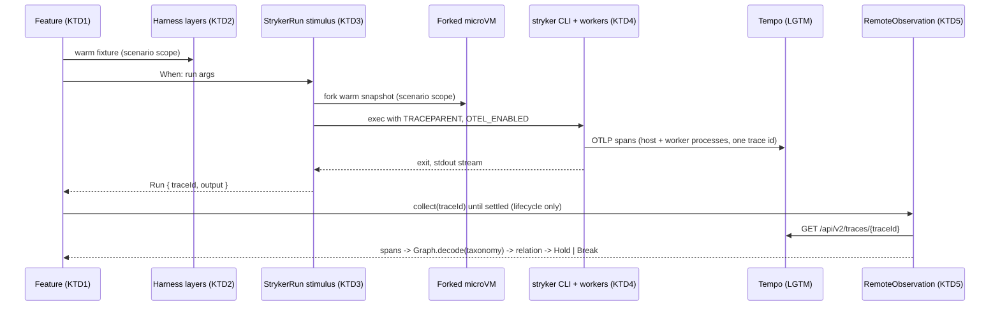
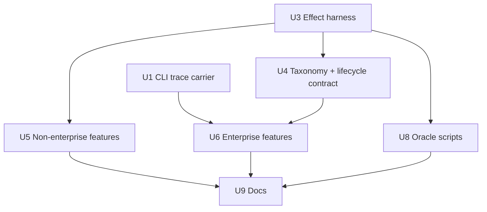

# E2E Lane on Effect Spec Libraries - Plan

## Goal Capsule

- **Objective:** The e2e lane proves the packed `stryker` CLI's reported verdicts and the trace its host and worker processes emit, and every failure names the scenario step, the run's trace id, and the assertion or contract that broke.
- **Means:** One Effect-native harness driving `@systemfsoftware/effect-gherkin-spec` features, with `@systemfsoftware/trace-spec` contracts judged over spans read back from Tempo and the oracle scripts' relations on `@systemfsoftware/differential-spec` (KTD1–KTD10).
- **Authority:** `CONSTITUTION.md` > root `AGENTS.md` and `test/e2e/AGENTS.md` > this plan > skill guidance. `.github/workflows/`, `CONSTITUTION.md` and `repos/**` are read-only.
- **Execution profile:** Deep. U1 and U3 can proceed in parallel; U4–U6 and U8 start once U3 lands; U9 closes.
- **Stop conditions:**
  - A contract or relation exposes a real product divergence: record it as a finding with the trace id or the shrunk counterexample; never weaken the oracle to absorb it.
  - A lane shard exceeds the CI step cap (1200 s) and only a workflow edit would fix it: stop and report, because `.github/workflows/` is read-only.
- **Finishes and ships:** `ce-work` implements; the LFG pipeline reviews, commits and opens the PR.

---

## Product Contract

### Summary

Rewrite `test/e2e` so every journey is a Gherkin feature on an Effect harness with no Promise edges, and every CLI run executes under a trace id the test owns. A declared trace contract judges the lifecycle run against spans read from Tempo, replacing the hand-rolled poller. The oracle scripts' metamorphic and differential properties move onto `differential-spec`. The CLI gains one capability to make trace ownership possible: it parents its root span on the W3C `TRACEPARENT` environment carrier.

### Problem Frame

The lane is mostly Effect already, but its seams are not. `tests/__fixtures__/microvm-harness.ts` wraps a `ManagedRuntime` behind a Promise API (`warm`, `openScope`, `closeScope`, `run`, `readFile`), so journeys call `Effect.promise(() => fixture.run(...))` and scope forks by hand. `tests/__fixtures__/tempo.ts` is a hand-rolled Promise poller that searches Tempo by time window and service name. Only the lifecycle journey reads it, and only when `OTEL_ENABLED` is set, so with telemetry off the trace check silently disappears. Journeys spell Gherkin by hand (`bddStep('Given' | 'When' | 'Then' | 'And', …)`), duplicate `parseEventStream` per file with `S.decodeUnknownPromise`, and assert several checks against one observed state. The oracle's metamorphic and differential properties (`scripts/derive-oracle.property.test.ts`) call their transforms directly instead of through a harness that shrinks disparities, and `scripts/blessed-baseline.ts` is an `async main` over the same `ManagedRuntime`.

One fact makes the conversion structural: the CLI's `stryker.cli.run` span (`packages/stryker-js/src/bin/main.ts`) always starts a fresh root trace, so a test cannot own the trace of a run it launches. Separately, `@systemfsoftware/vitest` re-runs every passing `it.live` test as a leaked-state check (README "Leaked state"; `makeTesterWith(…, rerunnable = true)` in the installed dist), so each journey most likely boots its warm microVM and runs the CLI twice today [INFERENCE — U3 measures it]. The conversion keeps that cost, because the published runner offers no live lane inside a declared-shared block (see Deferred to Follow-Up Work).

### Requirements

**Harness and runtime**

- R1. Every journey under `test/e2e/tests/`, and every lane script under `test/e2e/scripts/` except the Deno telemetry scripts, runs as an Effect program. There is no Promise-returning harness API and no `Effect.promise` or `async` body, and a `ManagedRuntime` or `runMain` appears only at a process edge (Vitest `globalSetup`, a script entrypoint).
- R2. Every CLI invocation runs under a trace id the test owns, and the scenario records that trace id where a failure report shows it.
- R3. The lane refuses to start when the trace collector is unreachable, naming the remediation, instead of skipping trace judgments.

**Behaviour specs**

- R5. All 15 journeys become `effect-gherkin-spec` features. They keep every current assertion, every authored oracle literal (E2E-2), and the `ORACLE-LITERALS` marker blocks that `scripts/reconcile-oracle.ts` splices.
- R6. Each observed state is asserted exactly once; further assertions read a new state derived by a `When` step.

**Trace contracts**

- R7. When a valid `TRACEPARENT`/`TRACESTATE` environment carrier is present, the CLI parents its root span on it; otherwise it starts a root trace.
- R8. A declared trace contract, judged against spans observed in Tempo, replaces `tests/__fixtures__/tempo.ts` and the lifecycle journey's span-name list assertions, and is shown to break on a trace that violates it.

**Oracle relations**

- R10. The oracle scripts' metamorphic and differential properties run through `differential-spec`, so a disparity shrinks to a minimal input and prints both sides.

**Documentation**

- R11. `test/e2e/AGENTS.md` and `test/e2e/README.md` describe the harness, the mandatory collector, and the owned-trace workflow for diagnosis.

### Scope Boundaries

- The conversion adds no new e2e suite. Only assertions and relations that already exist are carried over (see Test Admission).
- The Deno scripts `scripts/export-traces.ts` and `scripts/import-traces.ts` stay as they are, because CI invokes them and `.github/workflows/` is read-only.
- The CI shard layout is untouched. The four filenames it pins (`enterprise-mutation-lifecycle`, `enterprise-monorepo-sabotage`, `svelte-app`, `enterprise-composite-checker` `.e2e.test.ts`) keep their names.
- `scripts/reconcile-oracle.ts` stays a static drift gate (`check:oracle-drift`), because it is a deterministic comparison, not a generated-input relation.
- The scripts' existing unit suites (`normalize.test.ts`, `literal-block.test.ts`, `reconcile-oracle.test.ts`, `diagnostics.test.ts`, `concurrency-mutant-check.test.ts`) are already Effect and are not rewritten.
- The fixture cache, bake, snapshot and fork substrate (`src/Harness/fixture-cache.service.ts`, `warm-sandbox.handle.ts`, `guest-job.service.ts`) keeps its behaviour. Only its composition and the runner's per-run environment change.

#### Deferred to Follow-Up Work

- **One microVM boot and one CLI run per scenario.** `@systemfsoftware/vitest` exempts only a declared-shared `layer(…, { shared: true })` block from the leak-check re-run, and that block's `it` is `MethodsNonLive` (no `live` lane), while every e2e feature must be `.live`. `effect-gherkin-spec`'s `.withLayer` also rebuilds its layer per case (`Layer.fresh` in `effect-spec-runtime` `openShared`). Sharing the warm VM across a file's scenarios, and running each scenario once, needs an upstream live declared-shared lane; the baseline U3 records sizes that gain.
- **Journey pruning.** `test-layer-selection` caps the e2e layer at 2–4 journeys that observe seam-only behaviour: the packed install, the live multi-process boundary, and the top-level failure contract. This lane has 15. The conversion keeps all 15 because the request is to convert them, and deleting journeys needs the user's decision.
- **In-process differential specs** in `packages/stryker-js` for verdict invariance under `--concurrency` and `--mutate` restriction. The gate delegates flag matrices below the e2e layer, and runner parity already lives in `packages/stryker-js/tests/vm-parity.differential.test.ts`.
- **Declaring the CLI's spans** with `Span.declare` inside the stryker packages, so a renamed span becomes a compile error at the source. This plan declares the taxonomy test-side (KTD6).
- **E2E-3's wording.** Journeys already decode the published `RunEvent.RunEventWireLine` from `@systemfsoftware/stryker-js`, which the rule's "no workspace package" text does not describe. The conversion keeps that import.

---

## Planning Contract

### Key Technical Decisions

- KTD1. **Features on the top-level runner, harness per scenario.** Each journey file builds `Feature` from `makeFeature({ it, layer })` with the package's re-exported `it`, provides the harness through `.withLayer(<harness layer>)`, and declares `.live(<reason naming the microVM and collector>)`. That is the only registration the published libraries support for a live scenario: a declared-shared block's `it` has no `live` lane (`@systemfsoftware/vitest` `runner.ts` `sharedBlock`), and `.withLayer` rebuilds per case. Each scenario therefore builds its harness and warms its fixture as `prepareFixture` does today, and the leak-check re-run stays. Governs R1.
- KTD2. **Harness as layers and scoped resources.** A harness service built from the `BakedFixtureCache`, `StrykerCliRunner` and `GuestJobs` layers replaces the `ManagedRuntime` and its Promise API; it is provided with node services, readiness and harness telemetry, as `HarnessLive` is composed today. The warm VM is acquired per fixture into the scenario's scope through `BakedFixtureCache.warm`, and each CLI run's fork is acquired in the same scope, so teardown stays the uninterruptible stop → kill → destroy already in `warm-sandbox.handle.ts`. `bddStep` is deleted, and the Gherkin steps carry the step annotations. Governs R1.
- KTD3. **Every run is a trace-spec stimulus.** A `Stimulus.make` named for the CLI run wraps the harness run and passes the stimulus context's `traceparent` as `TRACEPARENT` in the CLI process's environment, through a per-run environment argument added to `StrykerCliRunner.run`. `OTEL_ENABLED`, `OTEL_SERVICE_NAME` and `OTEL_EXPORTER_OTLP_ENDPOINT` keep flowing from the host environment as `StrykerCliRunner` passes them today (KTD10 pins `OTEL_ENABLED`); the service name is not changed per run, because contracts find a trace by its id, never by service name. Journeys that judge no contract still run through the stimulus and annotate the returned trace id, so any failing scenario names its trace (OBS-1, E2E-6). Governs R2.
- KTD4. **The CLI adopts the environment carrier.** `stryker.cli.run` gets an external parent span, decoded from `TRACEPARENT` with the existing `Trace.Traceparent` schema (`packages/stryker-js-plugin-interface/src/TraceContext.schema.ts`). An absent or malformed value leaves today's root span. The change follows the OpenTelemetry environment-carrier specification, which names command-line tools and initialization-time extraction ([env-carriers](https://opentelemetry.io/docs/specs/otel/context/env-carriers/)), and the precedent of `environmentTraceInit` in `reporter-stream.service.ts`, which already reads the same variables. Worker spans need no change because they parent through RPC headers. The change ships with a `minor` changeset for `@systemfsoftware/stryker-js`, since it is additive. Governs R7.
- KTD5. **Remote observation replaces the poller.** `RemoteObservation.layer(TempoTraceStore.source({ baseUrl }), { interval, settle, timeout })` over `FetchHttpClient` provides `Observation` to contracts, and a node `FileSystem` holds break dumps. `baseUrl` comes from `TEMPO_URL` (default `http://127.0.0.1:3200`). `tests/__fixtures__/tempo.ts` is deleted. `settle` must outlast the CLI's and workers' export flush, and the exact durations are set from observed runs. `TempoTraceStore` reads `/api/v2/traces/{id}`, which Tempo added in 2.7 ([tempo#4127](https://github.com/grafana/tempo/pull/4127)); the pinned `grafana/otel-lgtm` image ships Tempo 2.10. Governs R8.
- KTD6. **Taxonomy declared test-side.** `tests/__fixtures__/stryker-trace.fixture.ts` uses `trace-taxonomy` `Span.declare` to declare only the spans the lifecycle contract names. Their attribute schemas match what the exporter actually encodes, verified from one decoded real trace before the contract pins them (per `docs/solutions/best-practices/vm-vitest-e2e-oracle-report-contract.md`). `Graph.decode` admits undeclared spans as recorded, so the taxonomy need not enumerate the CLI's ~90 spans. Every required span gets a `Rel.exists` beside any `Rel.fromTaxonomy`, because placement is not existence. Governs R8.
- KTD7. **One Feature per file; one assertion per state.** Each journey file becomes one `Feature`, marked `.live(<reason naming the microVM and collector>)` and given its current timeout as the feature option. A `Then` asserts one composite record of the state it reads. The next observation comes from a `When` that derives it: decoding the stream, reading the persisted report, or judging the trace. The five `typescript-checker-*.e2e.test.ts` journeys merge into `tests/typescript-checker.e2e.test.ts`, with the config-parametrized stream, counts and tally check as a `scenarioOutline`; CI pins none of their names. The `write-gherkin-integration-tests` admission gate governs in-process `*.integration.test.ts` files and scopes out e2e, but scenario wording still goes through the gherkin-spec-authoring capability (`write-gherkin-specs`). Governs R5, R6.
- KTD9. **Oracle relations move to the differential-spec DSL.** `scripts/derive-oracle.property.test.ts` becomes `scripts/derive-oracle.differential.test.ts`. The transform-based relations use `Metamorphic.on(…).relation(…)` with the transforms from `scripts/oracle/metamorphic.ts`. The oxc-versus-ts-morph agreement uses `Differential.compare`, with the independent ts-morph inventory as the reference. These are in-process computations, so they take `runBudget` alone. A side that proves to read the host filesystem takes `hostBound` with that reason instead; `hostBound` executes off the kernel only through the local `patches/@systemfsoftware__differential-spec@0.6.0.patch` (upstream 0.6.0 accepts the option but never executes it), so the patch stays in `patchedDependencies`. A host read misclassified onto the kernel surfaces as the kernel's unobservable-wait failure, not a silent pass. A relation that is not total stays out rather than being weakened. Governs R10.
- KTD10. **The collector is mandatory.** Global setup probes Tempo with `effect-readiness` before baking and fails with the remediation `pnpm lgtm:up`. It sets `OTEL_ENABLED=true` when unset and refuses an explicit `false`, so the harness telemetry, the test workers and every guest run read one value. The `OTEL_ENABLED` gate in the lifecycle journey is removed. CI already starts LGTM for every e2e shard. Governs R3.

### Test Admission

`test-layer-selection` admission (default REFUSE), applied to every test this plan writes:

| Proposed test                                                       | Verdict             | Reason                                                                                                                                                                                 |
| ------------------------------------------------------------------- | ------------------- | -------------------------------------------------------------------------------------------------------------------------------------------------------------------------------------- |
| 15 journeys rewritten as features (U5, U6)                          | Kept on the request | The request is to convert them. The layer cap is recorded as deferred pruning.                                                                                                         |
| Lifecycle trace contract (U4, U6)                                   | Admitted            | It replaces the existing `verifyTracePropagation`. Host and worker processes sharing one owned trace through the packed bundle is live multi-process boundary behaviour only e2e sees. |
| Oracle relations on differential-spec (U8)                          | Admitted            | They replace the existing eight properties over pure oracle code; the layer is unchanged.                                                                                              |
| In-process test of `main.ts` carrier wiring (U1)                    | Refused             | `main.ts` is the composition root (smoke boot only), and `Trace.Traceparent` already carries codec laws. The owned trace id observed in U6 is the proof.                               |
| Extra trace cases on calc, failing and checker fixtures             | Refused             | Phase order and failure outcome are observable in-process, and cross-process propagation duplicates the lifecycle contract.                                                            |
| E2E relations for concurrency, mutate restriction and runner parity | Refused             | These are flag matrices that belong below the e2e layer, and runner parity already exists in-process. Deferred.                                                                        |

### High-Level Technical Design

One scenario's run, from registration to verdict:



Changed files under `test/e2e` (a note marks each new, renamed or rewritten file):

```text
test/e2e/
  tests/
    __fixtures__/
      e2e-harness.fixture.ts          (replaces microvm-harness.ts)
      machine-stream.fixture.ts       (new: stream decode, shared)
      trace-observation.fixture.ts    (new: Observation + FileSystem layers)
      stryker-trace.fixture.ts        (new: taxonomy + lifecycle contract)
      typescript-checker.fixture.ts
      global-setup.ts
    *.e2e.test.ts                     (Features; checker journeys merged)
  scripts/
    derive-oracle.differential.test.ts (replaces derive-oracle.property.test.ts)
    blessed-baseline.ts               (Effect entrypoint)
```

### Assumptions

- The lane requires a running collector locally, as it does in CI. Developers start it with `pnpm lgtm:up` (KTD10).
- Merging the checker journeys into one file does not push a `rest-*` shard past its cap; U5 measures this.

### Sequencing



### Risks & Dependencies

| Risk                                                                                                                                                                                | Mitigation                                                                                                                                                                          |
| ----------------------------------------------------------------------------------------------------------------------------------------------------------------------------------- | ----------------------------------------------------------------------------------------------------------------------------------------------------------------------------------- |
| Some worker spans live in linked traces (`withLinkedSpan`), outside the owned trace id.                                                                                             | The contract names only spans that `collect(traceId)` returns, and U4 confirms them from a decoded trace.                                                                           |
| Scenarios of the merged checker feature run in one file, each booting a warm VM and forking a 4096 MiB guest.                                                                       | U5 observes that file's wall time and peak concurrent guests. If the host saturates or the shard budget suffers, it splits the feature back across files while keeping the outline. |
| A ported oracle relation is not total and fails on a legitimate input.                                                                                                              | Drop that relation and name it in the PR; do not weaken it (KTD9).                                                                                                                  |
| The new packages `@systemfsoftware/trace-spec@^0.5.1` and `@systemfsoftware/trace-taxonomy@^0.0.2` peer on `effect 4.0.0-rc.117`, `vitest ^5` and `@systemfsoftware/vitest ^0.2.0`. | These match the catalog. Add catalog entries in `pnpm-workspace.yaml`; `@systemfsoftware/*` is already in `minimumReleaseAgeExclude`.                                               |

### Sources

- `test/e2e/tests/__fixtures__/microvm-harness.ts`, `tempo.ts`, `global-setup.ts`; `test/e2e/src/Harness/stryker-cli-runner.service.ts`, `warm-sandbox.handle.ts`.
- `packages/stryker-js/src/bin/main.ts` (root span), `packages/stryker-js/src/reporter-stream.service.ts` (`environmentTraceInit`), `packages/stryker-js-plugin-runtime/src/trace-context-rpc.service.ts` (worker propagation).
- `packages/stryker-js/tests/trace-propagation.integration.test.ts` (Gherkin house style), `packages/stryker-js/tests/vm-parity.differential.test.ts` (differential DSL precedent).
- Upstream `systemfsoftware/systemfsoftware`:
  - `packages/trace/trace-spec/src/{Contract,Stimulus,Graph,RemoteObservation}.ts`, `drivers/tempo-trace-store.ts`, `tests/remote-trace-contract.integration.test.ts`
  - `packages/gherkin/effect-gherkin-spec/src/{Feature,DoNotation}.ts`
  - `packages/runner/vitest/README.md` (leaked-state re-run, declared-shared blocks)
  - issue #476
- `docs/solutions/tooling-decisions/microsandbox-fork-host-access-vm-via-snapshot-restore.md`, `docs/solutions/tooling-decisions/effect-metrics-need-a-metric-reader.md`, `docs/solutions/workflow-issues/mutation-lane-green-while-every-job-failed.md`, `docs/solutions/test-failures/agent-bail-hangs-the-test-run.md`.

---

## Implementation Units

### U1. The CLI parents its root span on TRACEPARENT

- **Goal:** A caller that sets `TRACEPARENT` owns the trace of the run it launches.
- **Requirements:** R7; KTD4.
- **Dependencies:** none.
- **Files:**
  - `packages/stryker-js/src/bin/main.ts`
  - the module that owns the environment-carrier decode, placed per `docs/adr/0001-cell-architecture-module-taxonomy.md` (next to `environmentTraceInit` if that is its owner)
  - `.changeset/<name>.md` (`@systemfsoftware/stryker-js`: minor)
- **Approach:**
  1. Decode `TRACEPARENT` (and `TRACESTATE`) through `Trace.Traceparent`. On success, wrap the `stryker.cli.run` span with an external parent that carries the carrier's trace id, span id and sampled flag.
  2. Keep the decode on the Effect `Config` path so that an absent or malformed value yields the unchanged root span.
- **Test expectation:** none in-process (see Test Admission). U6's lifecycle contract observes the owned trace id through the packed CLI.
- **Verification:**
  - A throwaway smoke run of the built CLI under an in-memory OTLP receiver shows `stryker.cli.run` carrying the carrier's trace id when `TRACEPARENT` is set.
  - The same smoke shows a fresh root when the variable is unset or malformed.
  - `pnpm --filter @systemfsoftware/stryker-js test` stays green.

### U3. Effect-native harness, stimulus and collector preflight

- **Goal:** Journeys reach microVMs, the CLI and Tempo only through Effect services, and the Promise harness, `bddStep` and `tempo.ts` are gone.
- **Requirements:** R1, R2, R3; KTD1, KTD2, KTD3, KTD5, KTD10.
- **Dependencies:** none. U1 is needed only for the owned trace id to reach the CLI's spans.
- **Files:**
  - `test/e2e/tests/__fixtures__/e2e-harness.fixture.ts` (new; replaces `microvm-harness.ts`, which is deleted)
  - `test/e2e/tests/__fixtures__/machine-stream.fixture.ts` (new)
  - `test/e2e/tests/__fixtures__/trace-observation.fixture.ts` (new)
  - `test/e2e/tests/__fixtures__/tempo.ts` (deleted)
  - `test/e2e/tests/__fixtures__/global-setup.ts`
  - `test/e2e/src/Harness/stryker-cli-runner.service.ts`
  - `test/e2e/package.json` (devDependencies for effect-gherkin-spec, differential-spec, trace-spec, trace-taxonomy) and `pnpm-workspace.yaml` (catalog entries for trace-spec and trace-taxonomy)
- **Approach:**
  1. Record the baseline before changing anything: with the collector up, run `mutation-run.e2e.test.ts` and `enterprise-mutation-lifecycle.e2e.test.ts` as they are and count `stryker.cli.run` traces and warm-VM boot spans per journey, plus wall time. The PR reports these numbers beside the converted lane's.
  2. Compose the harness layers and expose the run stimulus of KTD3. It warms the fixture and forks in the scenario scope, takes a per-run environment, and returns the exit code, stdout, stderr, and a `readFile` over that fork.
  3. Make `StrykerCliRunner.run` take the per-run environment. The OTLP loopback rewrite to `host.microsandbox.internal` stays.
  4. Move stream parsing into `machine-stream.fixture.ts`. It splits lines, decodes each with `RunEvent.RunEventWireLine` through the Effect decoder, and fails with a typed error that names the offending line. It exposes the terminal event as a typed value, so journeys stop throwing `Error` on a non-verdict terminal.
  5. Build the observation layers per KTD5.
  6. Add the Tempo readiness probe to global setup ahead of baking (KTD10).
- **Execution note:** Convert `mutation-run.e2e.test.ts` end to end on the new harness before touching other journeys; it fixes the shape U5 and U6 copy.
- **Patterns to follow:** the `HarnessLive` composition in the current `microvm-harness.ts`; `Readiness.NodeHostProber` usage in `global-setup.ts`; upstream `remote-trace-contract.integration.test.ts` for the observation layer stack.
- **Test scenarios:**
  - The converted `mutation-run` feature passes with the same authored literals as today.
  - The feature's annotations include the trace id its run used, and Tempo holds a trace with that id rooted at `stryker.cli.run`.
  - With LGTM stopped, the lane fails in global setup, before any bake, with a message naming `pnpm lgtm:up`.
- **Verification:**
  - Outside `global-setup.ts`, no file under `test/e2e/tests/` contains `ManagedRuntime`, `Effect.promise`, `async` or `bddStep`.
  - `pnpm --filter @systemfsoftware/stryker-e2e typecheck` passes.

### U4. Stryker trace taxonomy and the lifecycle contract

- **Goal:** Declare the lifecycle contract that states the claims `verifyTracePropagation` asserts today, over spans the exporter provably writes.
- **Requirements:** R8; KTD5, KTD6.
- **Dependencies:** U3.
- **Files:** `test/e2e/tests/__fixtures__/stryker-trace.fixture.ts`.
- **Approach:**
  1. Decode one real enterprise trace and record which spans, parents and attributes the exporter writes, and which worker spans fall outside the owned trace id.
  2. Declare those spans and state the contract. The host phase spans lie beneath `stryker.cli.run`. Worker `rpc.*` spans from the runner and checker processes descend from host phase spans. Checker spans descend from `stryker.checker.check`. Each required span has `Rel.exists`.
  3. Keep each conjunct to the claim it states (write-trace-specs TD1).
- **Test scenarios:** exercised through U6's lifecycle feature.
  - Falsification: judge the contract against a trace missing one required span (a scratch copy of a recorded trace, or a scratch copy of the contract that renames that span). It returns Break naming that conjunct. The proof is kept as evidence and not committed.
- **Verification:** The Break report names the conjunct, the trace id and the dump path.

### U5. Non-enterprise journeys as Features

- **Goal:** The calc, failing, vm-vitest, nested-describe, svelte and checker journeys become Gherkin features on the U3 harness.
- **Requirements:** R5, R6; KTD7.
- **Dependencies:** U3.
- **Files:**
  - `test/e2e/tests/mutation-run.e2e.test.ts`, `failing-run.e2e.test.ts`, `vm-vitest.e2e.test.ts`, `vitest-nested-describe.e2e.test.ts`, `svelte-app.e2e.test.ts`
  - `test/e2e/tests/typescript-checker.e2e.test.ts` (new; replaces the five `typescript-checker-*.e2e.test.ts` files, which are deleted)
  - `test/e2e/tests/__fixtures__/typescript-checker.fixture.ts`
- **Approach:**
  1. Draft scenario and step wording through the gherkin-spec-authoring capability before writing code.
  2. Map each current `bddStep('And', …)` group to a composite `Then` or to a derived state, per KTD7.
  3. Replace `typescript-checker.fixture.ts`'s own `parseEventStream` and `lastEvent` with `machine-stream.fixture.ts`, keeping its verify helpers and authored per-config counts.
  4. Keep every authored literal and timeout verbatim. The svelte feature keeps its 300 000 ms budget.
- **Test scenarios:**
  - Each feature asserts every fact its predecessor asserted: exit code, stream integrity, counts, reported rows, run-id consistency, attribution, and persisted-report equality. A before/after checklist per file shows no dropped assertion.
  - The checker `scenarioOutline` covers the build-mode, include and preset configs, with their authored counts per row.
  - The broken-checker scenario still names `non-existent-tsconfig.json` in the terminal error.
  - The vm-run scenario still proves that `reports/mutation/mutation.json` and `mutation-stream.jsonl` agree with stdout, each as its own derived state.
- **Verification:**
  - Each converted file passes.
  - The merged checker file's wall time and peak concurrent forks are recorded for the shard-budget check.

### U6. Enterprise journeys as Features, lifecycle judged by contract

- **Goal:** The five enterprise journeys become features, and the lifecycle's trace check is a contract judgment on its own run.
- **Requirements:** R2, R5, R6, R8; KTD7.
- **Dependencies:** U1, U4.
- **Files:** `test/e2e/tests/enterprise-mutation-lifecycle.e2e.test.ts`, `enterprise-mutator-edge-cases.e2e.test.ts`, `enterprise-composite-checker.e2e.test.ts`, `enterprise-runner-resilience.e2e.test.ts`, `enterprise-monorepo-sabotage.e2e.test.ts`.
- **Approach:**
  1. Keep the filenames and the `ORACLE-LITERALS:BEGIN/END` blocks byte-identical, so `scripts/reconcile-oracle.ts` still finds and splices them.
  2. The lifecycle `When` judges the enterprise run through the U4 contract, so one CLI run yields both the run output and the verdict. Later states read `judgment.run.output`.
  3. Delete `WORKER_SPAN_PREFIX`, `CHECKER_SPAN_NAMES`, `HOST_PHASE_SPAN_NAMES`, `verifyTracePropagation` and the `OTEL_ENABLED` gate.
- **Test scenarios:**
  - The lifecycle feature asserts the normalized 98/2/193/30 counts, the 31-row tally, run-id consistency, persisted-report equality, and a Hold on the lifecycle contract.
  - Edge, composite-checker, resilience and sabotage keep their authored counts and tallies, the timeout placement in `nontermination.ts`, and sabotage's exit 1 with break 100.
  - `pnpm check:oracle-drift` reports no drift, and `reconcile-oracle` still rewrites the literal blocks in place without touching the surrounding code.
- **Verification:**
  - All five features pass.
  - The lifecycle run appears once in Tempo per test run, under the trace id its scenario annotated.

### U8. Oracle scripts on differential-spec and Effect

- **Goal:** The oracle's relations shrink through `differential-spec`, and baseline blessing is an Effect program on the U3 harness layers.
- **Requirements:** R1, R10; KTD9.
- **Dependencies:** U3.
- **Files:**
  - `test/e2e/scripts/derive-oracle.differential.test.ts` (new; `derive-oracle.property.test.ts` is deleted)
  - `test/e2e/scripts/blessed-baseline.ts`
- **Approach:**
  1. Port each of the eight properties to `Metamorphic.on` or `Differential.compare`, keeping its generator. Drop any relation that is not total and name it in the PR.
  2. Rewrite `blessed-baseline.ts` as an Effect program run by the node runtime's `runMain`, using the harness layers and the node `FileSystem`. It keeps its refusal of non-verdict runs, non-zero exits and the `sabotage` slice.
- **Test scenarios:**
  - Each ported relation passes within its `runBudget`.
  - Broken on purpose in a scratch copy (for example, with a transform that drops a statement), each relation reports a shrunk counterexample.
  - `bless-oracle -- --verify <slice>` still performs two runs and reports gate differences.
- **Verification:**
  - `pnpm --filter @systemfsoftware/stryker-e2e test:oracle` passes.
  - Blessing one slice writes a baseline that decodes as `BlessedBaseline`.

### U9. Lane documentation

- **Goal:** Maintainers can run, read and diagnose the lane from its docs.
- **Requirements:** R11.
- **Dependencies:** U5, U6, U8.
- **Files:** `test/e2e/AGENTS.md`, `test/e2e/README.md`.
- **Approach:** Update:
  - the MicroVM environment table: `OTEL_ENABLED` is forced for guest runs, `TEMPO_URL` is documented, and the collector is mandatory
  - E2E-2's gate text, for the merged checker file
  - the tracing section: the owned trace id per scenario, Break dumps, and a pointer to `trace-observation.fixture.ts` for the observation interval, settle and timeout rather than copied numbers
- **Test expectation:** none -- documentation only.
- **Verification:** Every file, variable and command the docs name exists after the change.

---

## Verification Contract

| Gate                  | Command                                                                                                                                                                | Applies to |
| --------------------- | ---------------------------------------------------------------------------------------------------------------------------------------------------------------------- | ---------- |
| Stryker package suite | `pnpm --filter @systemfsoftware/stryker-js test`                                                                                                                       | U1         |
| Collector             | `pnpm lgtm:up` before any lane run                                                                                                                                     | U3–U6      |
| Lane (targeted)       | `pnpm --filter @systemfsoftware/stryker-e2e test:e2e -- tests/<file>`                                                                                                  | U3–U6      |
| Lane (full)           | `pnpm test:e2e`                                                                                                                                                        | final      |
| Oracle suites         | `pnpm --filter @systemfsoftware/stryker-e2e test:oracle`                                                                                                               | U8         |
| Oracle drift          | `pnpm check:oracle-drift`                                                                                                                                              | U6, final  |
| Lane types and lint   | `pnpm --filter @systemfsoftware/stryker-e2e typecheck` and `lint`                                                                                                      | every unit |
| START-1..4            | `pnpm format:check`, `pnpm typecheck`, `pnpm test`, `pnpm check:ci`                                                                                                    | final      |
| START-5               | `./scripts/check-changeset.ts $(git merge-base HEAD origin/main)`                                                                                                      | U1         |
| START-6               | `git grep -F 'catalog:stryker' -- packages/stryker-js/package.json packages/stryker-js-vitest-runner/package.json packages/stryker-js-typescript-checker/package.json` | final      |

After changing a workspace package (U1), clear `node_modules/.cache/stryker-e2e/baked` before trusting a lane verdict (E2E-7). Diagnose lane failures from the scenario's annotated trace id in Grafana, never by adding logging (OBS-1, E2E-6).

---

## Definition of Done

- Every requirement (R1–R3, R5–R8, R10, R11) holds, with the per-unit verification above observed, not inferred.
- The lifecycle contract and each ported oracle relation have been watched returning Break or a disparity on a deliberately wrong input.
- Each scenario's annotated trace id resolves in Tempo to a trace rooted at `stryker.cli.run`, and the per-journey CLI-run count matches the U3 baseline.
- The full lane passes locally with the collector up, and each CI shard's measured time is under its 1200 s step cap.
- `microvm-harness.ts`, `tempo.ts`, `derive-oracle.property.test.ts`, the five `typescript-checker-*.e2e.test.ts` files and `bddStep` no longer exist, and no abandoned-attempt code remains in the diff.
- The `@systemfsoftware/stryker-js` changeset is present, and START-1..6 pass.
