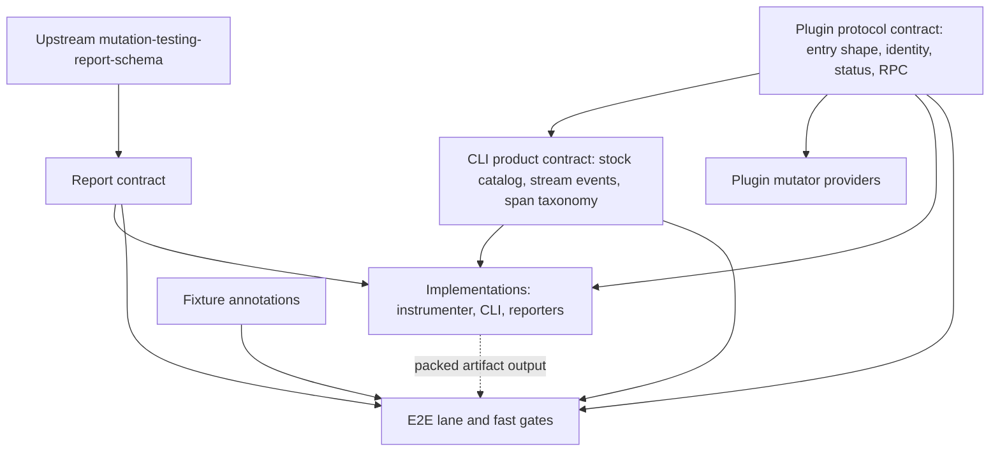
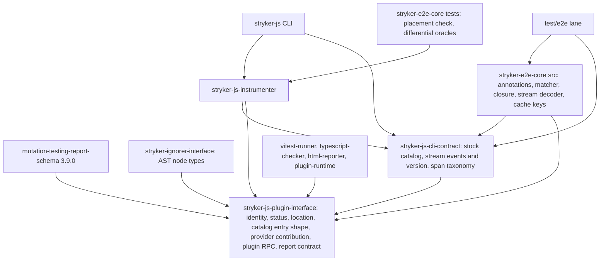
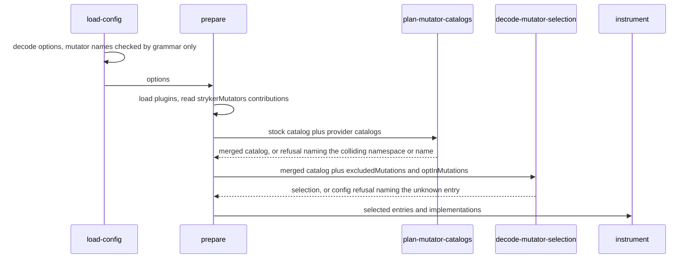
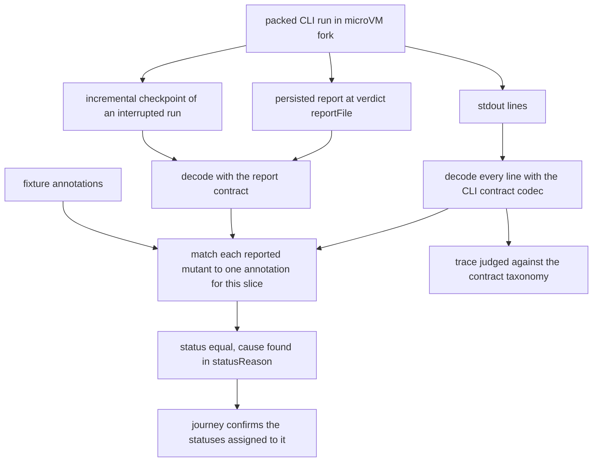
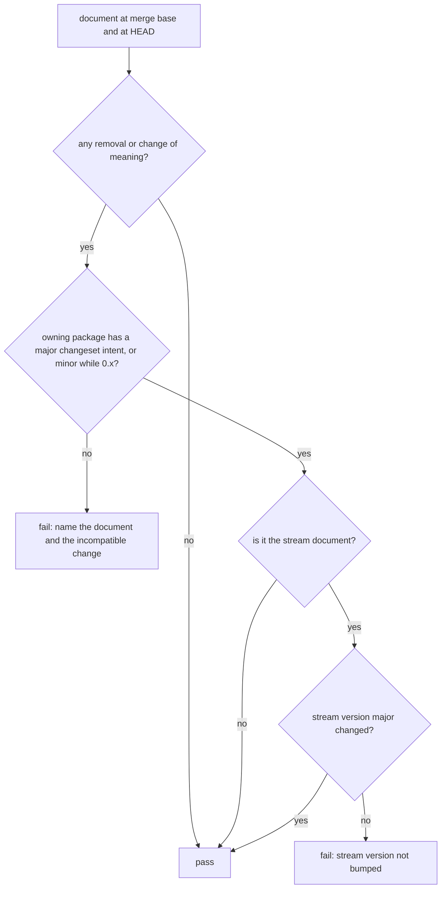

# Contract-First Mutation Surfaces and Authored E2E Oracles - Plan

## Goal Capsule

- **Objective:** Stryker's machine stream, report, span taxonomy and mutator catalog are defined by contracts that people write. Green gates mean the packed CLI satisfied those contracts, the fixtures place every stock and fixture-provider mutator in every tier, and every status the product ships was reached end to end. No expected value anywhere in the gates is recorded from a run.
- **Means:** Implementation-free contracts that producers are compiled against (KTD1, KTD4). A mutator catalog where stock mutators are one provider and plugins can add their own (KTD7). In-source mutant annotations and a coverage-closure gate replace the blessed baselines (KTD13, KTD14, KTD17).
- **Product authority:** This plan, under `CONSTITUTION.md` (CONST-1). It replaces the E2E-2 and E2E-3 rule text in `test/e2e/AGENTS.md` and the blessed-baseline machinery set up by `docs/plans/2026-09-21-1424-refactor-e2e-normalized-oracle-substrate-plan.md`. The other eight PR #127 review findings are closed with evidence and are not scope. Where a unit and this contract disagree, the requirement wins on product behavior and the KTD wins on mechanism.
- **Execution profile:** One PR on the `e2e-followup` worktree, executed unit by unit in the order of the Unit Index. Contracts land before their producers, producers before the lane rework, and the blessed machinery is deleted only after every journey asserts through annotations.
- **Stop conditions:** Stop and report instead of improvising when a lane shard exceeds its 1200 s cap (`.github/workflows/` is read-only, and assertions are never weakened to fit); when the upstream report schema cannot be imported by Effect core without a hand edit; when no deterministic fixture site exists for a status R22 names; or when evidence shows a session-settled decision cannot work.
- **Who finishes:** The executor lands every unit and opens the PR with changesets. Releasing and publishing need the user's approval (AGENTS.md boundary).
- **Open blockers:** None.
- **Product Contract preservation:** changed: R22, R25, R28, R29, AE13, AE14 and one Key Decision. During planning the user added NoCoverage and Pending producers to this wave. R25 now says that lints and guards run in `pnpm check:ci`, where `pnpm lint` puts them, and that laws run in `pnpm test`. The deferred questions are resolved in the Planning Contract.

---

## Product Contract

### Summary

Every published Stryker surface becomes contract-first. The plugin protocol defines what a mutator catalog entry is. The stock mutators are the core provider's catalog, written as data with worked examples. Plugins may provide further mutators under their own namespace. A CLI product contract declares the machine stream and the span taxonomy. The e2e lane checks the packed CLI only against those contracts and against annotations in the fixture source that must account for every reported mutant. A coverage model built from the catalog and the status contract makes the gates prove what the fixtures reach.

### Problem Frame

PR #127's review found that the e2e lane decodes the CLI's stdout with the CLI's own codec (`RunEvent.RunEventWireLine`) and reads the report through `Report.MutationTestResultSchema` from the plugin interface. A change applied to the encoder and the decoder together passes the lane even though every outside consumer sees it. E2E-3 forbids this, but that rule is enforced only by review.

The enterprise journeys' expected numbers have the same defect in a bigger form. `test/e2e/scripts/blessed-baseline.ts` runs the engine and writes `test/e2e/oracle-baselines/<slice>.json`, and `derive-oracle --reconcile` splices those numbers into `ORACLE-LITERALS` blocks marked "generated … Do not edit". Only the Ignored counts have an independent source. Per `test/e2e/scripts/oracle/first-reconciliation-triage.md`, CompileError counts and per-mutator placement are owned by the engine. So E2E-2's "a run may confirm the numbers, never originate them" is false in practice, and CONST-T10 is breached. `check:oracle-drift` and `bless-oracle` are not wired into CI, turbo or husky either.

Coverage is accidental. `mutator-contract.md` specifies 16 families, but the four baselines contain no Regex or UnaryOperator mutant. `noCoverage`, `runtimeErrors` and `pending` are 0 in every slice. Nothing in the engine produces NoCoverage or Pending. An uncovered mutant runs and ends Survived (`docs/solutions/best-practices/vm-vitest-e2e-oracle-report-contract.md`). An interrupted run's checkpoint omits every mutant it never reached. Nothing would fail if a family or status were added or stopped firing.

The contracts are code-first. `stryker-js-plugin-interface` depends on `stryker-js-instrumenter` (which pulls in `oxc-parser`) and imports `Mutant` into its report, checker, plugin, reporter and test-runner schemas. `defaultMutators` is `Readonly<Record<string, Mutator>>`, so no type fixes the set of families. `mutator.excludedMutations` and `optInMutations` are `S.Array(S.String)`, and unknown opt-in names are refused by hand-written code (`refuseUnknownOptInMutations`) rather than by the config schema. The lifecycle trace contract declares its spans on the test side (`tests/__fixtures__/stryker-trace.fixture.ts`). No plugin kind can supply mutators.

### Actors

- A1. Fixture author: writes e2e fixture source and the annotations on it.
- A2. Plugin author: publishes a mutator provider.
- A3. External consumer: reads the machine stream, the JSON report or the traces without importing Stryker.
- A4. Stryker CLI: the packed `dist/main.mjs` run inside the lane's microVM.
- A5. Gates: the fast in-process laws and lints, plus the microVM lane.

### Key Decisions

- **Contracts are written by people, and producers are compiled against them.** A contract generated from a producer lets the system under test produce its own oracle. (session-settled: user-directed — chosen over generating the wire schema from the producer's `RunEvent` schema with a drift gate: the user compared it to an OpenAPI document that clients are generated from, and CONST-T10 forbids an oracle the SUT produced.) Governs R1, R3, R4, R7.
- **The lane's expected mutant outcomes are annotations authored in fixture source, and coverage is closed against a model.** (session-settled: user-directed — chosen over runner-native snapshots only, and over annotations without a coverage model: only authored claims satisfy E2E-2 and CONST-T10, and a model makes coverage something the gates prove.) Governs R16, R17, R18, R20, R21, R22.
- **Placement coverage closes in-process; only status coverage needs the lane.** Which mutators a file yields is decided by the instrumenter alone, while a status needs the real runner, checker and workers across the process boundary, so a mutator-by-status matrix would be an e2e matrix with nothing seam-specific in it. Governs R20, R21.
- **No snapshot of engine output, per mutant or aggregate, survives anywhere in the lane.** (session-settled: user-approved — chosen over a per-mutant snapshot covering unannotated mutants: a snapshot records the value from a run.) Governs R16, R18.
- **CompileError and RuntimeError annotations name their expected cause.** A status alone can be copied from a run; a cause states why the author expects it, as rustc's `//~ ERROR` annotations do. (session-settled: user-approved — chosen over status-only annotations and over an engine-determined class that is never checked against an authored value, which would reintroduce the rejected snapshot.) Governs R16.
- **Stock and plugin mutators share one catalog model, and the mutator plugin loader ships in this wave.** Cosmic Ray, PIT, Infection and ESLint treat built-ins as the first provider. (session-settled: user-directed — chosen over a closed stock enum and over deferring the loader.) Governs R8, R9, R10, R11, R13.
- **Two contracts.** The plugin protocol owns the entry shape and the plugin RPC. The CLI product contract owns the stock catalog, the stream events and the span taxonomy. Plugins then never depend on the stock list. (session-settled: user-approved — chosen over one contract for everything: that would make adding a stock family a plugin-protocol release.) Governs R1, R3, R9.
- **Effect core does all schema import, codegen and validation.** This follows the STRATEGY boundary against wrapped capabilities. (session-settled: user-approved — chosen over a third-party JSON Schema validator.) Governs R2, R7, R15.
- **One wave.** Contracts, catalog with loader, and lane rework ship in one plan and one PR. (session-settled: user-directed — chosen over a contracts-only plan and over deferring the loader to its own plan.)
- **A breaking contract change needs a major version bump, not a deprecation path.** BREAK-1 overrides the deprecate-then-remove policy OTel Weaver uses for its registries. Governs R5.
- **NoCoverage and Pending get producers in this wave.** Both are in upstream's status enum, nothing produced either, and status closure could not reach them. (session-settled: user-directed — chosen over named waivers for both and over producing NoCoverage only.) Governs R22, R28, R29.



### Requirements

**Contracts**

- R1. `stryker-js-plugin-interface` depends on no Stryker implementation package. It defines mutant identity, status, location, the mutator catalog entry shape and the plugin protocol, and the report contract lives in it. The instrumenter depends on it, never the reverse. Mutant status is one enum, shared by the report contract and the status contract.
- R2. The report contract is derived from a pinned upstream `mutation-testing-report-schema` version and replaces the hand-ported report schema.
- R3. A CLI product contract, which never depends on the CLI implementation, declares the stock mutator catalog, the machine-stream events, the stream version and the span taxonomy.
- R4. Producers emit only through contract types and codecs, so the compiler rejects any stream event, span, report field or catalog entry the contracts do not declare.
- R5. Each contract carries a version, and a law compares the contract with itself at the change's merge base. Removing an entry or making an incompatible change fails unless the major version is bumped.
- R6. Every refinement in a contract has hand-written refusal cases next to its generated round-trip laws.
- R7. The published JSON Schema documents for the stream and the report are generated from the contracts and never from a producer.

**Mutator catalog and providers**

- R8. A catalog entry carries a stable id, a name, its tier membership, a definition with authored before-and-after examples, and its provider. Stock names stay unprefixed; provider names take the form `<namespace>/<Name>`.
- R9. The stock catalog is data in the CLI product contract, and the instrumenter implements every stock entry in every tier exhaustively.
- R10. A Mutator plugin kind loads provider catalogs named in `plugins` under the provider's namespace, and refuses a namespace or name collision.
- R11. `excludedMutations`, `optInMutations` and tier selection decode against the loaded catalogs, so the config schema refuses an unknown name.
- R12. Each entry's authored examples are checked in-process against its implementation. They replace the prose specification in `test/e2e/scripts/oracle/mutator-contract.md`.
- R13. Stream events and the report record the provider of every mutant.

**Lane oracles**

- R14. Files under `test/e2e/tests/` import no Stryker implementation package, type-only imports included. They may import the contract packages, the lane's core package, test tooling and the lane's own harness. A lint rule enforces this, and E2E-3 is reworded to "no implementation package".
- R15. Every stdout line from the packed CLI decodes under the CLI product contract, and every persisted report decodes under the report contract.
- R16. Every mutant a run reports matches exactly one annotation in fixture source, at line, block or declaration, or file scope, and the nearest scope wins. An unmatched mutant, an annotation with no mutant, or a mutant claimed by two annotations at the same scope fails the run. An annotation may claim `KilledOrTimeout` for a kill whose timing the fixture cannot fix; every other outcome is one exact status. Expected counts, per status and per mutator, count each matched mutant once under its annotation's outcome, and no count is written anywhere else. A CompileError or RuntimeError annotation also names its expected cause, a TypeScript diagnostic code or an error class, and the lane matches it against the mutant's `statusReason` in the persisted report.
- R17. Annotation placement is checked in-process against the real instrumenter; the microVM lane confirms the annotated statuses on the packed artifact.
- R18. `test/e2e/scripts/blessed-baseline.ts`, `test/e2e/oracle-baselines/`, the reconcile splicer, the `ORACLE-LITERALS` blocks, `check:oracle-drift` and `derive-oracle --reconcile` are deleted. E2E-2 is reworded to place the authored claims in fixture source.
- R19. The lifecycle trace contract is judged against the CLI product contract's span taxonomy, and no span is declared on the test side.

**Coverage closure**

- R20. Every catalog entry in every tier, stock and fixture provider alike, has an annotated witness confirmed by the in-process placement check, or a named waiver with a reason.
- R21. Every status in the status contract has an annotated witness confirmed by a lane run, or a named waiver with a reason.
- R22. The fixtures witness today's gaps (Regex, UnaryOperator, NoCoverage, RuntimeError, Pending), the opt-in tier and one fixture-provider mutator inside existing journeys, adding no journey file.
- R23. Before merge, a seeded engine fault for each status in the status contract turns red the journey the witness registry assigns to that status. The seeding is a committed, re-runnable verification script, not a permanent journey.

**Gates**

- R24. Every rule in `test/e2e/AGENTS.md` whose only gate is review (today all seven) either gains an executable gate or leaves the rules table. E2E-1 gets a manifest law. E2E-2 and E2E-3 are replaced by the annotation gate (R16) and the import lint (R14). E2E-6 gets `no-console` under `tests/`, and its trace-diagnosis procedure leaves the table. E2E-8 gets a property law on cache-key derivation.
- R25. Contract laws, example checks, plugin-load and config refusals, annotation placement and placement closure run in `pnpm test` without a microVM, in packages whose `test` task runs them, since E2E-1 keeps `test/e2e` out of `pnpm test`. Lints and guards run in `pnpm check:ci`. The lane stays within each shard's 1200 s cap.
- R26. The annotation matcher and the closure gate are pure workflows with property laws, mutation-tested by the dogfood Stryker in the mutation workflow that runs on `main`.
- R27. Every package whose published surface changes ships a changeset and a regenerated api report under BREAK-1.

**Status producers**

- R28. When per-test coverage shows that no test reaches a non-static mutant, the run reports that mutant NoCoverage without running it.
- R29. When a run is interrupted, its incremental checkpoint lists every planned mutant that has not settled as Pending. A completed run's report and verdict counts contain no Pending mutant.

### Key Flows

- F1. Adding a stock mutator
  - **Trigger:** A maintainer adds a family to the stock catalog.
  - **Actors:** A1, A5
  - **Steps:** The entry is authored with its examples. The compiler requires the instrumenter to implement it. The example check runs in-process. Placement closure fails until a fixture annotation witnesses the new family or a waiver names it.
  - **Covered by:** R8, R9, R12, R20
- F2. A plugin provides mutators
  - **Trigger:** A user lists a provider in `plugins`.
  - **Actors:** A2, A4
  - **Steps:** The loader reads the provider catalog under its namespace. Config selection decodes against stock plus provider entries. Mutants from the provider carry its provenance in the stream and the report.
  - **Covered by:** R10, R11, R13
- F3. Changing the wire
  - **Trigger:** A maintainer wants a new or changed stream event field.
  - **Actors:** A3, A5
  - **Steps:** The contract changes first. The producer then compiles against it. The version law requires a major bump for an incompatible change, and a changeset ships.
  - **Covered by:** R3, R4, R5, R27
- F4. A lane run
  - **Trigger:** `pnpm test:e2e`.
  - **Actors:** A4, A5
  - **Steps:** The packed CLI runs a fixture. Each stdout line and the report decode under the contracts. Each reported mutant is matched to its annotation, and its status must equal the annotated status; a CompileError or RuntimeError must also match the annotated cause. Status bins are credited with confirmed witnesses. The trace is judged against the contract taxonomy.
  - **Covered by:** R15, R16, R19, R21

### Acceptance Examples

- AE1. **Covers R20.** Given a new stock family with no fixture witness and no waiver, when the fast gates run, then placement closure fails and names the family.
- AE2. **Covers R16.** Given a fixture edit that places one new mutant with no annotation, when the in-process placement check runs, then it fails and names the file, location and mutator.
- AE3. **Covers R16.** Given an annotation whose mutant no longer exists after a fixture edit, when placement is checked, then the dangling annotation fails the gate.
- AE4. **Covers R16, R17.** Given an annotation of Killed on a mutant the packed CLI reports as Survived, when the lane runs, then the journey fails and names the mutant and both statuses.
- AE5. **Covers R4.** Given a producer change that emits a stream field the contract lacks, when the workspace typechecks, then compilation fails.
- AE6. **Covers R5.** Given a contract change that removes a stream event field without a major version bump, when the version law runs, then it fails.
- AE7. **Covers R10.** Given two providers that declare the same namespace, when the CLI loads plugins, then the run is refused before instrumentation.
- AE8. **Covers R11.** Given `optInMutations` naming an entry no loaded catalog declares, when config decodes, then the config schema refuses it.
- AE9. **Covers R15.** Given a stdout line that is not a valid contract event, when the lane decodes the stream, then the journey fails with that line.
- AE10. **Covers R21.** Given a status with no witness a lane run confirmed and no waiver, when status closure runs after the lane, then it fails and names the status.
- AE11. **Covers R23.** Given a seeded fault that misclassifies one status, when the lane runs, then the journey the witness registry assigns to that status fails.
- AE12. **Covers R16.** Given a CompileError annotation naming TS2322 on a mutant whose `statusReason` in the persisted report carries a different diagnostic, when the lane runs, then the journey fails and names the mutant and both causes.
- AE13. **Covers R28.** Given per-test coverage and a non-static mutant that no test covers, when the run completes, then the mutant is reported NoCoverage and no mutant run was dispatched for it.
- AE14. **Covers R29.** Given a run interrupted after some mutants settle, when its checkpoint is read, then every planned mutant without a result is Pending; given the same fixture run to completion, then its report contains no Pending mutant.

### Scope Boundaries

- The eight other PR #127 review findings are closed with evidence and change no code: stale trace, Tempo 404, `makeExternalSpan` fields, silent malformed `TRACEPARENT`, relations without `describe`, untested global-setup branches, `TimedOut`-only probe, taxonomy exclusivity.
- Deriving every count statically is out. The real instrumenter decides placement. The differential oracles (today `test/e2e/scripts/derive-oracle.differential.test.ts`) check the static analyzer against it; they are neither the placement authority nor a coverage measure.
- Plugin kinds other than the Mutator provider are unchanged, including shadowing of duplicate worker plugins.
- NoCoverage is produced only under per-test coverage analysis. Under other coverage modes an uncovered mutant still runs.
- A decision model classifying wire changes is out: the version law settles compatibility deterministically.

### Dependencies / Assumptions

- Effect core imports the upstream draft-07 schema. A probe on version 3.9.0 (`JsonSchema.fromSchemaDraft07`, then `SchemaRepresentation.fromJsonSchemaDocument` with `patterns: 'apply'`) accepted a valid report and refused an unknown status and an unsupported `schemaVersion`.
- trace-spec and trace-taxonomy can judge a contract whose spans come from a published package rather than the test file.
- The lane's microVM substrate and per-shard cap stay as shipped in PR #127.

### Sources / Research

- `CONSTITUTION.md` CONST-T9 and CONST-T10 (the oracle must not be the SUT); STRATEGY.md at `github.com/systemfsoftware/systemfsoftware` (re-firing mechanisms, whole-class waves, Effect core only).
- rustc compiletest UI tests: blessed output plus in-source annotations that must match every diagnostic (rustc-dev-guide "UI tests").
- Cargo testsuite: JSON-line assertions against authored literals via snapbox (rust-lang/cargo PR #14576).
- Upstream StrykerJS e2e reads reports through `mutation-testing-report-schema` and `mutation-testing-metrics` (`e2e/helpers.js`).
- Terraform machine-readable UI: versioned `ui` field, minor versions additive, unknown major rejected.
- Mutator extension models: PIT `MethodMutatorFactory` and `MutatorGroup`, Cosmic Ray operator providers with `provider/operator` names and `examples()`, Infection custom mutators with `Definition` and profiles, Stryker.NET mutation levels, StrykerJS issue #444.
- Registries and contracts: ESLint plugin rule namespacing, SARIF 2.1.0 `tool.driver` and `tool.extensions`, OTel Weaver registry `check`, `diff` and `live-check`, LSP `metaModel.json` with generated protocol types.
- Software wiki `concepts/snapshot-testing.md`: a persisted gold is sound only when externally authored and independently gated, and re-blessing commits regressions to the baseline.
- Repo: `packages/stryker-js-plugin-interface/package.json`, `packages/stryker-js-instrumenter/src/Mutator.service.ts` (`MutatorRegistry` with `defaults` and `optIn`), `packages/stryker-js-instrumenter/src/Transformer.service.ts` (`DEFAULT_MUTATOR_REGISTRY`), `packages/stryker-js-plugin-interface/src/Plugin.schema.ts`, `packages/stryker-js/src/run-event.schema.ts`, `test/e2e/scripts/oracle/first-reconciliation-triage.md`, `test/e2e/oracle-baselines/`.

---

## Planning Contract

### Key Technical Decisions

- KTD1. **Two new packages sit beside the existing contract.** `@systemfsoftware/stryker-js-cli-contract` is published at `packages/stryker-js-cli-contract`. It depends only on `stryker-js-plugin-interface` and `effect`, and owns the stock catalog, the stream events, the stream version and the span taxonomy. `@systemfsoftware/stryker-e2e-core` is private at `test/e2e-core`. It is the lane's functional core: the annotation parser, matcher and closure workflows, the stream decoder, and the bake-cache key decisions, with the in-process placement check and the relocated oracle suites in its `tests/`. Its `src/` imports only contract packages; its `tests/` may import the instrumenter and fixture configs. The lane (`test/e2e`) stays the imperative shell and keeps E2E-1. (session-settled: user-approved — chosen over letting the lane declare a `test` script for in-process laws: E2E-1's rule and the lane's no-`test` guarantee stay intact.) Governs R1, R3, R25, R26.
- KTD2. **Only the report-facing identity moves into the plugin interface.** `MutantId`, `MutatorName`, `CanonicalFileName`, the status enum with its subsets, and `Location`/`Position`/`OpenEndLocation` move into it. The test-runner run options and coverage move too, since they are plugin protocol. `InstrumenterContext`, `HitCount`, activation, `Span`, `ScriptOrigin` and `LineStarts` stay in the instrumenter. Nothing re-exports the moved symbols from the instrumenter; every consumer imports them from the plugin interface. The status enum is upstream's eight values, and `Metrics.schema.ts` derives its four subsets from it instead of re-declaring literals. `MutatorName` gains the provider grammar: a PascalCase name, optionally prefixed by `<namespace>/`. Governs R1, R8.
- KTD3. **The report contract is generated from upstream by Effect core codegen and committed.** `mutation-testing-report-schema` joins the catalog pinned at 3.9.0, matching `mutation-testing-elements`. A package script feeds its draft-07 document through `JsonSchema.fromSchemaDraft07` and `SchemaRepresentation.fromJsonSchemaDocument`, which returns a live `Schema.Top`. It then takes `Schema.toRepresentation`, `SchemaRepresentation.toMultiDocument` and `SchemaRepresentation.toCodeDocument`, and writes a generated module that is never hand-edited. Upstream's document is only an input; the published document is generated from the assembled contract (KTD4). Product-only fields such as `thresholds.break` extend the generated struct, which upstream permits because it sets no `additionalProperties`. Decoding accepts any upstream-valid report, because merge-reports, survivors and incremental runs read reports Stryker did not write. The `low <= high` ordering stays on the thresholds option, not on the report. Governs R2, R6, R15.
- KTD4. **Each contract package commits its published documents under `contract/` and exports them as subpaths.** The CLI contract emits `stream.schema.json` from the `RunEvent` union with `Schema.toJsonSchemaDocument`, plus `stock-catalog.json` and `span-taxonomy.json` from its data. The plugin interface emits `report.schema.json` the same way, from the assembled report contract with its product fields, so the version law sees every field a consumer reads. A package test regenerates every document and fails when a committed one differs. This is the same build-output consistency check api-extractor provides, not an oracle about behavior. Governs R7.
- KTD5. **The version law is a merge-base guard over the committed contract documents.** `scripts/guards/check-contract-versions.ts` follows `scripts/guards/check-single-plan.ts`: Deno, `--selftest`, and base from `git merge-base origin/main HEAD`. When that base equals HEAD, as on a push to `main`, it compares HEAD's first parent with HEAD instead of an empty range. `guard:projects` runs only the guards its loop lists, so each new guard adds its own name to that loop, which puts it in `pnpm check:ci`. A pure classifier in `scripts/lib/contract-compat.ts` compares each document at the base and at HEAD. Additions are compatible: a new optional field, event kind, enum value, catalog entry or span. Removals and changes of meaning are incompatible: a field or event removed, a field made required, a type narrowed, an enum value removed, a catalog entry removed or renamed, a span or span attribute removed or renamed. An incompatible change needs a changeset intent for the owning package of `major`, or `minor` while it is `0.x`. An incompatible change to `stream.schema.json` also needs a new major stream version. Consumers are documented to ignore unknown values, following Terraform's `ui` rule. Governs R5.
- KTD6. **The taxonomy declares every span the CLI emits, and only data crosses into the published contract.** `SpanTaxonomy` in the CLI contract is plain data: span id, name, and attribute schema. The published package does not depend on `@systemfsoftware/trace-taxonomy`; the lane converts the data into trace-taxonomy declarations. Production code names every span through a taxonomy member. The checker's runtime-computed span name becomes the declared `stryker.checker.check` span with the checker name as an attribute. `withPhaseSpan` in `packages/stryker-js/src/reporter-stream.service.ts` takes a taxonomy member instead of a string. `scripts/guards/check-span-names.ts` refuses a string or template literal as the span name argument of `Effect.fn`, `withSpan`, `useSpan` or `withPhaseSpan` under `packages/*/src`. Spans the RPC library names after protocol methods are declared from the plugin protocol's method list. (session-settled: user-approved — chosen over declaring only the lifecycle spans the lane asserts: traces are a published consumer surface.) Governs R3, R4, R19.
- KTD7. **Mutator providers are an in-process module contribution, like ignorers.** A provider module exports `strykerMutators`: a namespace, catalog entries in the plugin protocol's entry shape, and one implementation per entry. An implementation maps an AST node to replacement nodes, typed with the node types `@systemfsoftware/stryker-ignorer-interface` already publishes. The loader reads the contribution beside `strykerIgnorers` and adds `mutators` to `LoadedPlugins`. A new pure workflow `plan-mutator-catalogs` merges stock and provider catalogs and fails on a duplicate namespace or name, instead of the shadowing `planPluginLoad` applies to worker plugins. The failure surfaces in `prepare` before instrumentation. Governs R8, R10, AE7.
- KTD8. **A mutant's provider travels in its mutator name.** Stock names stay unprefixed. Provider names are `<namespace>/<Name>` in the stream, the report, the incremental file, checker requests and verdict mutants; there is no separate provider field. The `// Stryker disable` grammar widens to accept a namespaced name, and a directive names a provider mutator by its full name. (session-settled: user-approved — chosen over a new provider field on every mutant-carrying schema: one grammar reaches every carrier.) Governs R13.
- KTD9. **Mutator selection decodes after plugins load, against a schema built from the loaded catalogs.** The first config decode checks only the name grammar (KTD2). After loading, `prepare` runs a `decode-mutator-selection` workflow whose schema is built from the merged catalog. `excludedMutations` may name any entry. `optInMutations` may name only opt-in-tier entries. An unknown name or a default-tier opt-in fails as a config failure before instrumentation. `refuseUnknownOptInMutations` and its module-scope name list are deleted. Governs R11, AE8.
- KTD10. **The instrumenter takes its registry as input.** The module-scope `DEFAULT_MUTATOR_REGISTRY` is removed. `InstrumenterOptions` carries the selected entries, and they flow through `toTransformerOptions` into the transformer's placement context. The stock registry is a `Record` keyed by the CLI contract's stock names per tier, so a stock entry without an implementation is a compile error. Governs R9, R10.
- KTD11. **NoCoverage is an early result of `plan-mutant-tests`.** `MutantTestPlanCommand` gains the run's coverage-analysis mode, supplied by `planCommandOf` in `packages/stryker-js/src/run/mutation-test-plan.cell.ts`; today the command cannot tell `perTest` from `all`. When the mode is `perTest`, the mutant is not static, and no test covers it, the workflow plans a NoCoverage result instead of a run. The runner status enum is unchanged, and no runner is asked about the mutant. Governs R28, AE13.
- KTD12. **Pending is written into the incremental checkpoint of an interrupted run.** The checkpoint is the only file an interrupted run leaves, and the JSON report is written only on completion. Every checkpoint write joins the settled results with a Pending row for each planned mutant that has not settled, so a completed run's final checkpoint has none. `reportAll` and the verdict are unchanged. The next incremental run re-runs Pending rows because Pending is not in `RememberedStatusSchema`, which the reuse decision in `incremental-diff.workflow.ts` reads; `RememberedStatusSchema` keeps excluding Pending. (session-settled: user-approved — chosen over a Pending row in the JSON report or the stream: an interrupted run writes neither.) Governs R29, AE14.
- KTD13. **Annotations use their own marker, which the directive parser cannot read.** The marker never starts with `Stryker`, so `decode-directive` cannot consume an annotation and change what it grades. An annotation names a scope, an outcome, a mutator list or `all`, and optionally the slices it speaks for. The outcome is one status, `KilledOrTimeout`, or CompileError or RuntimeError with a cause. The nearest scope wins: line, then block or declaration, then file. Two annotations claiming one mutant at the same scope are a failure that names both. In `.svelte` and `.astro` files, file scope means the embedded script. The parser lives in `stryker-e2e-core` and never imports the instrumenter's directive code. Governs R16.
- KTD14. **Matching is per slice.** A slice is one fixture config file. An annotation without a slice qualifier applies to every slice whose mutate set reaches the file; a qualified one applies only to the slices it names. Where a slice's config excludes a mutator or a directive disables one, the Ignored outcome is itself annotated, so no expected status is derived from anything but authored text. A CompileError cause matches when the `statusReason` contains `error TS<code>:`, since the checker joins several diagnostics with newlines. A RuntimeError cause matches when the `statusReason` contains the named class as a whole identifier token, so `TypeError` never satisfies `Error`; the grammar refuses the bare name `Error`. Each authored CompileError code is confirmed in-process by the TypeScript compiler on the mutated file under the slice's tsconfig (U12). The compiler is an independent implementation, not the checker plugin under test, and a disagreement between the compiler and the lane's `statusReason` is triaged as a checker defect. (session-settled: user-approved — chosen over one global annotation set: several enterprise slices mutate the same files under different configs.) Governs R16, AE4, AE12.
- KTD15. **The lane decodes only through contracts and never filters lines.** Every non-empty stdout line must decode under the CLI contract's wire codec, or the journey fails with that line. The report path comes from the verdict's `reportFile`, never a hard-coded path. The report and the interrupted run's checkpoint decode under the report contract. The decoder is a `stryker-e2e-core` workflow. Governs R15, AE9.
- KTD16. **The import ban is an oxlint `no-restricted-imports` override in `test/e2e/oxlint.config.ts`.** It covers `tests/**` and bans every Stryker implementation package, type-only imports included. Allowed are the contract packages, `stryker-e2e-core`, test tooling, and the lane's own `src/Harness`. The same override adds `no-console`. `stryker-e2e-core`'s own config bans implementation packages from its `src/`. Governs R14, R24.
- KTD17. **Each status witness belongs to a named journey.** Lane shards run as separate CI jobs, so no process sees every run. `stryker-e2e-core` holds an authored registry that assigns each status to the journey that witnesses it, or to a named waiver. Status closure checks in-process that every status has an assignment, that no waiver covers an assigned status, and that no waiver covers a status this wave produces (NoCoverage, Pending). `check-e2e-manifest.ts` resolves every registry journey to a file under `test/e2e/tests/` that has no `.skip`, `.only` or `.todo`, and the CI shard split runs every journey file. Each journey asserts that its assigned statuses were confirmed on the packed CLI. Governs R21, AE10.
- KTD18. **The differential and checker oracle suites move into `stryker-e2e-core` and run in `pnpm test`.** The analyzer, metamorphic, diagnostics and type modules become test partners under `tests/__fixtures__/`. The differential relations and the concurrency checker rig become package tests, and the host-bound oxc relation keeps its 120 s timeout. The slice recomputation that `reconcile-oracle.ts` held becomes a differential comparison over each fixture's files. (session-settled: user-approved — chosen over deleting them: they never ran in CI, and deleting `vitest.oracle.config.ts` would orphan them.) Governs R18.
- KTD19. **The rules table keeps only rules with an executable gate.** E2E-1 is gated by `scripts/guards/check-e2e-manifest.ts`, which fails if the lane declares a `test` script or if `test:e2e` becomes cacheable, and also resolves the witness registry (KTD17). E2E-2 and E2E-3 are gated by the annotation gate and the import lint. E2E-6 keeps its `no-console` half as a lint. E2E-8 is gated by cache-key laws (KTD20). E2E-4 leaves the table, because the loader loads only declared plugins; that guarantee stays pinned by the `planPluginLoad` laws. E2E-7 leaves the table, because the E2E-8 packs-key law proves that a changed workspace package changes the bake key. The trace-diagnosis and packed-bundle procedures move to `test/e2e/README.md` as a runbook. Governs R24.
- KTD20. **The bake-cache key decisions move into `stryker-e2e-core` as workflows.** The pure parts of `derivePacksKey`, `deriveFixtureKeys`, `missingFixtures` and `pruneStaleEntries` in `test/e2e/src/Harness/fixture-cache.service.ts` become workflows with property laws. The lane service keeps the I/O and calls them. This removes the need to export private functions from a package without a `test` script. Governs R24.

### High-Level Technical Design

Package topology after this wave. Arrows point from a package to what it depends on.



Mutator catalog loading, from config to instrumentation.



A lane run and the checks each stage feeds.



The version law's decision for one committed contract document.



Directional grammar for a fixture annotation. The exact marker spelling is settled during implementation within KTD13.

```text
annotation := "//" marker [scope] outcome ":" mutators [slices]
scope      := "next-line" | "file"              default: the block or declaration that follows
outcome    := Status | "KilledOrTimeout" | "CompileError(" TSCode ")" | "RuntimeError(" ErrorClass ")"
mutators   := "all" | MutatorName ("," MutatorName)*
slices     := "[" ConfigFile ("," ConfigFile)* "]"
```

### Output Structure

```text
packages/stryker-js-cli-contract/
  contract/                 stream.schema.json, stock-catalog.json, span-taxonomy.json
  src/                      mod.ts, RunEvent and wire codec, stream version, StockCatalog, SpanTaxonomy
  tests/                    contract-documents.test.ts
  package.json, tsdown.config.ts, api-extractor.json, stryker.config.ts, tsconfig*.json, vitest.config.ts, oxlint.config.ts, README.md
test/e2e-core/
  src/                      annotation parser, matcher, placement and status closure, witness registry, stream decoder, cache-key workflows
  src/__tests__/            <stem>.workflow.property.test.ts per workflow
  tests/                    placement.integration.test.ts, analyzer.differential.test.ts, concurrency-checker.integration.test.ts
  tests/__fixtures__/       relocated analyzer, metamorphic, diagnostics and types modules, effect-concurrency project, annotated sample with a provider
  package.json, stryker.config.ts, tsconfig*.json, vitest.config.ts, oxlint.config.ts
```

### Deferred to Implementation

- The exact file split between the plugin interface and the instrumenter's `Mutant` and `Location` modules, within KTD2.
- Where the generated report module lives inside the plugin interface.
- The annotation marker's spelling, within KTD13.
- Which fixture site produces a RuntimeError on the packed runner. It is found with an in-process instrumenter probe before the annotation is written. If no site can be made deterministic, work stops and the user decides whether R22's RuntimeError clause becomes a waiver; it is never converted silently.
- How the harness interrupts a guest run after a set number of mutant events for the Pending witness. U14 owns it in `test/e2e/src/Harness`; today's exec blocks until the guest exits. If no checkpoint with unsettled mutants can be reached deterministically, work stops.
- Whether oxlint's `no-restricted-imports` reaches `import type`. A probe decides; if it does not, `check-e2e-manifest.ts` also refuses implementation-package imports under `tests/`.

### Alternative Approaches Considered

- Let the lane declare a `test` script that runs only in-process laws. Rejected: it rewrites E2E-1 and splits one package across two task kinds (KTD1).
- Put a provider field on every mutant-carrying schema. Rejected: nine carriers would each need it, and the namespaced name already records the provider (KTD8).
- Declare only the lifecycle spans the lane asserts. Rejected: the rest of the trace surface would stay code-first (KTD6).
- Delete the differential oracles with the blessed machinery. Rejected: they are the only check of the static analyzer against the instrumenter (KTD18).

### System-Wide Impact

- Plugin authors: runners, checkers and reporters import identity, status and location from the plugin interface, not the instrumenter.
- Config users: mutator selection now fails at config time for unknown names, instead of at instrumentation.
- Stream and report readers: the stream codec moves into a published contract with a documented compatibility policy. Reports now accept upstream's `performance` and `system` fields. Provider mutants carry namespaced names.
- Run behavior: under `perTest` coverage, uncovered non-static mutants become NoCoverage and are no longer run, which shortens runs. Metrics already count NoCoverage as undetected, so scores do not move. Interrupted runs leave Pending rows that the next incremental run picks up.
- Traces: the checker span gets a fixed name, and every span name is declared.
- CI: `pnpm test` gains the relocated oracle suites, including the host-bound oxc relation, and `pnpm check:ci` gains three guards.

### Risks & Dependencies

| Risk                                                                                       | Mitigation                                                                                                                                                                                                                      |
| ------------------------------------------------------------------------------------------ | ------------------------------------------------------------------------------------------------------------------------------------------------------------------------------------------------------------------------------- |
| Upstream's draft-07 `$ref`/`definitions` may not survive Effect's import intact            | U2 stops on the first hand edit it would need (Stop conditions). The probe on 3.9.0 already accepted and refused the expected reports.                                                                                          |
| api-extractor alias rotation (`Node_2`) makes regenerated reports flaky                    | Export every type the entry reaches, and regenerate through `pnpm check:ci`, never by committing a local render (`docs/solutions/api-extractor-node-alias-nondeterminism.md`).                                                  |
| Added witnesses and the interrupted run push a shard past 1200 s                           | Measure each shard during U14. Exceeding the cap is a stop condition, never a reason to drop an assertion.                                                                                                                      |
| `@systemfsoftware/trace-taxonomy` may not be installed in this worktree                    | Run `pnpm install` before U15 and confirm the package resolves.                                                                                                                                                                 |
| A report schema change breaks older incremental files                                      | `incrementalVersion` is `StrykerPackage.version` (`packages/stryker-js/src/mutation-reporting.service.ts`), so the `major` release discards older files through `admit-incremental-report.workflow.ts` without a separate bump. |
| Widening the directive grammar breaks a published surface                                  | The changesets for the instrumenter and the plugin interface record it (U17).                                                                                                                                                   |
| Dogfood mutation grades new workflows only after merge, in the mutation workflow on `main` | Accepted repo property (START-6). The property laws land with the workflows and run in `pnpm test` before merge.                                                                                                                |

### Sources & Research

- Repo evidence: `packages/stryker-js-plugin-interface/package.json` (instrumenter dependency), `packages/stryker-js-instrumenter/src/Transformer.service.ts` (module-scope registry), `packages/stryker-js/src/plan-plugin-load.workflow.ts` (total, shadowing), `packages/stryker-js/src/run/prepare.cell.ts` (plugin load after config decode), `packages/stryker-js-instrumenter/src/directives/directive.schema.ts` (no `/` in names), `packages/stryker-js-plugin-interface/src/TestRunner.schema.ts` (runner statuses), `packages/stryker-js/src/run/mutation-test.cell.ts` (checkpoint holds settled mutants only), `packages/stryker-js-typescript-checker/src/CheckerRuntime.service.ts` (`error TS<code>:` format), `test/e2e/tests/__fixtures__/machine-stream.fixture.ts` (line filter), `.github/workflows/ci.yml` (five shards, 1200 s).
- Learnings: `docs/solutions/workflow-issues/mutation-lane-green-while-every-job-failed.md` (gates key on artifacts only a finished run writes), `docs/solutions/tooling-decisions/plain-entry-contract-without-a-declared-schema.md` (take spec types from the spec package), `docs/solutions/runtime-errors/mutant-replacement-text-captured-before-placement.md` (examples read `replacementCode`), `docs/solutions/tooling-decisions/workspace-source-condition-dev-resolution.md` (manifest regeneration), `docs/solutions/build-errors/in-source-vitest-block-breaks-source-condition-consumers.md` (verify with a repo-root typecheck), `docs/adr/0001-cell-architecture-module-taxonomy.md` (workflow and law conventions).

---

## Implementation Units

| U-ID | Title                                                        | Key files                                                                                            | Depends on            |
| ---- | ------------------------------------------------------------ | ---------------------------------------------------------------------------------------------------- | --------------------- |
| U1   | Identity, status and location move into the plugin interface | `packages/stryker-js-plugin-interface/src/`, `packages/stryker-js-instrumenter/src/Mutant.schema.ts` | —                     |
| U2   | Report contract generated from upstream                      | `packages/stryker-js-plugin-interface/src/Report.schema.ts`                                          | U1                    |
| U3   | CLI product contract package                                 | `packages/stryker-js-cli-contract/`                                                                  | U1, U2                |
| U4   | Producers emit through the CLI contract                      | `packages/stryker-js/src/run-event-stream.service.ts`, span call sites                               | U3                    |
| U5   | Contract version law                                         | `scripts/guards/check-contract-versions.ts`, `scripts/lib/contract-compat.ts`                        | U3                    |
| U6   | Instrumenter implements the stock catalog                    | `packages/stryker-js-instrumenter/src/Mutator.service.ts`, `Transformer.service.ts`                  | U3                    |
| U7   | Mutator provider plugins                                     | `packages/stryker-js/src/plugin-loader.service.ts`, `plan-mutator-catalogs.workflow.ts`              | U6                    |
| U8   | Mutator selection decodes against loaded catalogs            | `packages/stryker-js/src/decode-mutator-selection.workflow.ts`                                       | U7                    |
| U9   | NoCoverage producer                                          | `packages/stryker-js/src/plan-mutant-tests.workflow.ts`                                              | U1                    |
| U10  | Pending producer                                             | `packages/stryker-js/src/run/mutant-run.cell.ts`, checkpoint workflow                                | U1                    |
| U11  | E2E core: annotations, matcher, closure, decoder             | `test/e2e-core/src/`                                                                                 | U3                    |
| U12  | In-process placement check and relocated oracle suites       | `test/e2e-core/tests/`                                                                               | U7, U11               |
| U13  | Lane decodes through contracts                               | `test/e2e/tests/__fixtures__/`, `test/e2e/oxlint.config.ts`                                          | U11                   |
| U14  | Fixture annotations, witnesses and journey conversion        | `test/e2e/testResources/`, `test/e2e/tests/*.e2e.test.ts`                                            | U8, U9, U10, U12, U13 |
| U15  | Trace contract from the CLI taxonomy                         | `test/e2e/tests/__fixtures__/stryker-trace.fixture.ts`                                               | U4                    |
| U16  | Blessed machinery removal and rules table                    | `test/e2e/scripts/`, `test/e2e/AGENTS.md`                                                            | U12, U14              |
| U17  | Changesets, api reports, docs and seeded-fault check         | `.changeset/`, `etc/*.api.md`, READMEs                                                               | U1-U16                |

### U1. Identity, status and location move into the plugin interface

**Goal:** The plugin interface depends on no Stryker implementation package and owns mutant identity, status and location.

**Requirements:** R1, R8 (name grammar), KTD2.

**Dependencies:** None.

**Files:**

- Create: `packages/stryker-js-plugin-interface/src/Mutant.schema.ts`, `packages/stryker-js-plugin-interface/src/Location.schema.ts`
- Modify: `packages/stryker-js-plugin-interface/src/{Checker.schema.ts,Metrics.ts,Metrics.schema.ts,Plugin.schema.ts,ReporterEvent.schema.ts,TestRunner.schema.ts,TestRunner.service.ts,mod.ts}`, `packages/stryker-js-plugin-interface/package.json`
- Modify: `packages/stryker-js-instrumenter/src/{Mutant.schema.ts,Location.schema.ts,Mutant/mod.ts}`, `packages/stryker-js-instrumenter/package.json`
- Modify: every importer of the moved symbols in `packages/stryker-js`, `packages/stryker-js-vitest-runner`, `packages/stryker-js-typescript-checker`, `packages/stryker-js-html-reporter`

**Approach:**

1. Move the report-facing subset named in KTD2 and its in-source laws. Leave instrumenter runtime types behind.
2. Drop the instrumenter from the plugin interface's `dependencies`, add the plugin interface to the instrumenter's, and rebuild so the generated `exports` maps are regenerated.
3. Derive the `Metrics.schema.ts` subsets from the one status enum.
4. Re-point every consumer import, with no re-export left in the instrumenter.

**Patterns to follow:** `packages/stryker-js-instrumenter/src/Location.schema.ts` refinements (`S.declare` with `toCodecArbitrary`), and the in-source `it.prop` refusal laws there.

**Test scenarios:**

- `MutatorName` accepts `ArithmeticOperator` and `acme/SwapArguments`, and refuses `acme/`, `/Swap`, `a/b/C` and the empty string.
- The four status subsets partition the eight statuses: every status is in exactly one subset.
- The generated `ruleOfSchemas` round-trip laws cover the moved schemas.

**Verification:** The plugin interface's manifest lists no Stryker implementation package, and a repo-root `pnpm typecheck` passes.

### U2. Report contract generated from upstream

**Goal:** The report contract is upstream's schema, and every report Stryker writes or reads decodes under it.

**Requirements:** R2, R6, R7 (report document), R15, KTD3, KTD4.

**Dependencies:** U1.

**Files:**

- Create: the codegen script and generated module in `packages/stryker-js-plugin-interface`, `packages/stryker-js-plugin-interface/contract/report.schema.json`, `packages/stryker-js-plugin-interface/tests/report-contract.test.ts`
- Modify: `packages/stryker-js-plugin-interface/src/Report.schema.ts`, `pnpm-workspace.yaml` (catalog pin), `packages/stryker-js-plugin-interface/package.json` (`exports` subpath, script)
- Modify: the `Report` consumers in `packages/stryker-js/src` (`merge-reports.cell.ts`, `merge-report-parts.workflow.ts`, `json-report.cell.ts`, `render-*.workflow.ts`, `reporter-stream.service.ts`, `report-from-stream.workflow.ts`, `reporting/*`, `mutation-reporting.service.ts`, `IncrementalReport.schema.ts`) and `packages/stryker-js-html-reporter/src/write-html-report.cell.ts`

**Approach:**

1. Pin `mutation-testing-report-schema` 3.9.0 in the catalog and generate the report schema from its document (KTD3).
2. Rebuild `Report.schema.ts` as the generated schema plus the product extension. Remove the hand-ported structs.
3. Source the `schemaVersion: '1.0'` literals in `run-event-stream.service.ts` and `mutation-reporting.service.ts` from one constant in the report contract.
4. Generate `contract/report.schema.json` from the assembled contract with `Schema.toJsonSchemaDocument` (KTD4).

**Execution note:** Decode one real persisted report from a local CLI run before pinning any field the lane will read (`docs/solutions/best-practices/vm-vitest-e2e-oracle-report-contract.md`).

**Test scenarios:**

- A report carrying upstream's `performance` and `system` decodes; today's schema refuses it.
- A mutant with a status outside the eight is refused, naming the status.
- A `schemaVersion` of `3` is refused, and one of `1.1` is accepted.
- An unknown top-level property is accepted.
- Regenerating from the pinned upstream document reproduces the committed module byte for byte, and the committed `report.schema.json` equals the document generated from the assembled contract, `thresholds.break` included.
- Merge-reports decodes a prior report part that carries `performance`.

**Verification:** No hand-written report struct remains, and the stryker-js report property laws pass against the generated schema.

### U3. CLI product contract package

**Goal:** A published package owns the stream events, the stream version, the stock catalog and the span taxonomy, and publishes their documents.

**Requirements:** R3, R6, R7, R8, R9 (catalog data), KTD1, KTD4, KTD6.

**Dependencies:** U1, U2.

**Files:**

- Create: `packages/stryker-js-cli-contract/` per the Output Structure, scaffolded from `packages/stryker-js-plugin-interface` (tsdown `sourceExports`, api-extractor with `tsconfig.api.json`, `vitest.config.ts` with `inlineSchemaTests`, `stryker.config.ts` and a `mutation` script)
- Move: `packages/stryker-js/src/run-event.schema.ts`, `packages/stryker-js/src/run-event-wire.schema.ts` and `packages/stryker-js/src/reporting/stream-version.schema.ts` into the new package
- Create: stock catalog data (16 default and 3 opt-in entries, each with authored before-and-after examples taken from `test/e2e/scripts/oracle/mutator-registry.ts`, `mutator-contract.md` and the instrumenter's example tables), and the span taxonomy data

**Approach:**

1. Scaffold the package and move the stream schemas unchanged in wire shape.
2. Author the catalog as data. Each entry has a stable id, a name, a tier, a definition and examples; `after` lists the exact replacement texts.
3. Author the taxonomy from every production span name (KTD6).
4. Add the document emitter and the drift test.

**Test scenarios:**

- The wire codec round-trips every event kind (generated laws).
- Refusals: a `mutant` event with an unknown status, a `mutant` event missing `file`, and an unknown event tag are each refused.
- Every catalog entry has a unique name, exactly one tier, and at least one example with a non-empty `before`.
- Taxonomy span ids are unique, and every attribute has a schema.
- The emitted documents equal the committed `contract/*.json`.

**Verification:** `pnpm --filter @systemfsoftware/stryker-js-cli-contract test` and its `api:check` pass. The package depends only on the plugin interface and `effect`.

### U4. Producers emit through the CLI contract

**Goal:** The CLI can encode only declared stream events, and names only declared spans.

**Requirements:** R4, R19 (production side), KTD6, AE5.

**Dependencies:** U3.

**Files:**

- Modify: `packages/stryker-js/src/run-event-stream.service.ts`, `frame-run-event.workflow.ts`, `reporting/verdict-envelope*.ts`, `packages/stryker-js/src/bin/main.ts`, `packages/stryker-js/src/reporter-stream.service.ts` (`withPhaseSpan`), `packages/stryker-js/src/run/{prepare,instrument,dry-run,mutation-test,mutant-run}.cell.ts`, `packages/stryker-js/src/Checker/Checker.handle.ts`, and every `Effect.fn`/`withSpan`/`useSpan` site under `packages/*/src`
- Create: `scripts/guards/check-span-names.ts` with `--selftest`, and add it to the `guard:projects` loop in `package.json`

**Approach:**

1. Import `RunEvent` and the wire codec from the contract, and delete the moved stryker-js modules.
2. Replace every span-name literal with a taxonomy member, and give the checker span its declared name plus the checker-name attribute.
3. Add the guard.

**Test scenarios:**

- Guard self-test: `Effect.fn('x')`, ``Effect.withSpan(`a.${b}`)``, `withSpan('y')` and `withPhaseSpan('prepare', {}, effect)` are refused with file and line; `Effect.fn(Spans.prepare.name)` passes.
- The existing stream integration tests pass unchanged against the contract codec.

**Verification:** The guard passes on the tree, and a throwaway change that encodes an undeclared stream field fails `pnpm typecheck` (AE5).

### U5. Contract version law

**Goal:** An incompatible contract change cannot merge without a major bump, and a breaking stream change also needs a new stream version.

**Requirements:** R5, KTD5, AE6.

**Dependencies:** U3.

**Files:**

- Create: `scripts/lib/contract-compat.ts`, `scripts/lib/contract-compat.test.ts`, `scripts/guards/check-contract-versions.ts`
- Modify: `package.json` (add `check-contract-versions` to the `guard:projects` loop). If `scripts/check-changeset.ts`'s intent parsing is needed, move it into `scripts/lib` so both scripts share it.

**Patterns to follow:** `scripts/guards/check-single-plan.ts` (merge-base resolution, `--selftest`, `error[ID]:` diagnostics with remediation) and `scripts/check-changeset.ts` (intent parsing).

**Test scenarios:**

- Removing a property from an event schema is incompatible.
- Adding an optional property or a new event kind is compatible.
- When the merge base equals HEAD, the guard compares HEAD's first parent with HEAD, and an incompatible change in that commit without a `major` intent fails.
- Turning an optional property into a required one is incompatible.
- Removing an enum value is incompatible, and adding one is compatible.
- A catalog entry removed or renamed is incompatible, and one added is compatible.
- A span attribute removed is incompatible.
- The guard fails on an incompatible stream change that has a `major` intent but no stream-version bump (AE6), and passes once both are present.
- A `0.x` package passes with a `minor` intent.

**Verification:** `pnpm test:scripts` and `pnpm guard:projects` pass.

### U6. Instrumenter implements the stock catalog

**Goal:** Every stock entry in every tier has an implementation the compiler requires, and each entry's authored examples are checked against it.

**Requirements:** R9, R12, KTD10, F1.

**Dependencies:** U3.

**Files:**

- Modify: `packages/stryker-js-instrumenter/src/{Mutator.service.ts,Transformer.service.ts,Instrument.schema.ts,Format.ts}`, `packages/stryker-js-instrumenter/package.json`
- Create: `packages/stryker-js-instrumenter/tests/catalog-examples.integration.test.ts`
- Delete: `test/e2e/scripts/oracle/mutator-contract.md`

**Approach:**

1. Key the stock registry by the contract's stock names per tier.
2. Remove the module-scope registry and pass the selected entries through the instrumenter options.
3. Check each example in-process: instrument its `before`, and read the replacement text from `replacementCode`, never from a print of the live AST.

**Test scenarios:**

- For every stock entry and every authored example, instrumenting `before` yields exactly the authored replacements in order.
- An opt-in entry yields mutants only when it is selected.
- An example whose `after` lists nothing yields no mutant from that entry.

**Verification:** Removing one implementation from the stock record fails `pnpm typecheck`, and the example suite passes.

### U7. Mutator provider plugins

**Goal:** A plugin can contribute a namespaced mutator catalog that runs beside the stock catalog, and collisions are refused before instrumentation.

**Requirements:** R8, R10, R13, KTD7, KTD8, AE7, F2.

**Dependencies:** U6.

**Files:**

- Create: `packages/stryker-js-plugin-interface/src/MutatorProvider.schema.ts`, `packages/stryker-js/src/plan-mutator-catalogs.workflow.ts`, `packages/stryker-js/src/__tests__/plan-mutator-catalogs.workflow.property.test.ts`
- Modify: `packages/stryker-js-plugin-interface/package.json` (depends on `stryker-ignorer-interface`), `packages/stryker-js/src/{Plugins.schema.ts,plugin-loader.service.ts}`, `packages/stryker-js/src/run/{prepare.cell.ts,instrument.cell.ts}`
- Modify: `packages/stryker-js-instrumenter/src/directives/{directive.schema.ts,decode-directive.workflow.ts}`, `packages/stryker-js-instrumenter/src/plan-mutants.workflow.ts`

**Approach:**

1. Define the contribution shape and add the `strykerMutators` reader, following `moduleIgnorers`.
2. Merge the catalogs in the new workflow, and fail in `prepare` on a collision.
3. Widen the directive name grammar to namespaced names.

**Test scenarios:**

- Two providers with distinct namespaces merge with the stock catalog into their union.
- Two providers declaring the same namespace are refused, and the refusal names both modules (AE7).
- A provider entry whose name lacks the provider's namespace is refused.
- A provider entry using a stock name is refused.
- `// Stryker disable next-line acme/SwapArguments: reason` decodes, and ignores that provider's mutant on the next line.
- A directive naming an unknown namespaced mutator emits the unused-directive warning.
- An in-process load of a module exporting `strykerMutators` puts its catalog on `LoadedPlugins`.

**Verification:** Provider mutants carry `<namespace>/<Name>` in the stream and the report of an in-process instrumentation.

### U8. Mutator selection decodes against loaded catalogs

**Goal:** An unknown or wrong-tier mutator name fails as a config failure before instrumentation.

**Requirements:** R11, KTD9, AE8.

**Dependencies:** U7.

**Files:**

- Create: `packages/stryker-js/src/decode-mutator-selection.workflow.ts`, `packages/stryker-js/src/__tests__/decode-mutator-selection.workflow.property.test.ts`
- Modify: `packages/stryker-js-plugin-interface/src/stryker-options.schema.ts`, `packages/stryker-js/src/run/prepare.cell.ts`, `packages/stryker-js-instrumenter/src/Instrument.service.ts` (delete the refusal)

**Test scenarios:**

- `optInMutations` naming an entry no loaded catalog declares is refused, and the refusal names the entry (AE8).
- `optInMutations` naming a default-tier entry is refused.
- `excludedMutations` naming a provider entry decodes when that provider is loaded and is refused when it is not.
- A selection that decodes reaches the instrumenter unchanged.

**Verification:** The refusal surfaces with the config-failure exit class, and `refuseUnknownOptInMutations` no longer exists.

### U9. NoCoverage producer

**Goal:** Under per-test coverage, an uncovered non-static mutant is reported NoCoverage without being run.

**Requirements:** R28, KTD11, AE13.

**Dependencies:** U1.

**Files:**

- Modify: `packages/stryker-js/src/MutantTestPlanCommand.schema.ts` (coverage-analysis mode), `packages/stryker-js/src/run/mutation-test-plan.cell.ts` (`planCommandOf`), `packages/stryker-js/src/plan-mutant-tests.workflow.ts` and its property test in `packages/stryker-js/src/__tests__/`, `docs/solutions/best-practices/vm-vitest-e2e-oracle-report-contract.md`

**Test scenarios:**

- `perTest`, non-static, zero covering tests: a NoCoverage early result, with no run plan (AE13).
- `perTest`, static, zero per-test hits: a run plan against all tests.
- Coverage `all` or `off`, uncovered: a run plan.
- One or more covering tests: a run plan limited to those tests.
- A static mutant under `ignoreStatic` stays Ignored.

**Verification:** Every mutant is in exactly one of the early-result and run-plan partitions.

### U10. Pending producer

**Goal:** An interrupted run's checkpoint lists every unsettled planned mutant as Pending, and a completed run never shows Pending.

**Requirements:** R29, KTD12, AE14.

**Dependencies:** U1.

**Files:**

- Create: a checkpoint workflow in `packages/stryker-js/src/` and its property test in `packages/stryker-js/src/__tests__/`
- Modify: `packages/stryker-js/src/run/{mutant-run.cell.ts,mutation-test.cell.ts}`, `packages/stryker-js/src/mutation-reporting.service.ts` (the checkpoint path only)

**Test scenarios:**

- Settled rows plus Pending rows cover every planned mutant exactly once.
- A settled mutant is never written as Pending.
- When every planned mutant has settled, the checkpoint has no Pending row.
- A checkpoint with Pending rows, read by the next incremental run, schedules exactly those mutants to run (the incremental-diff property).

**Verification:** `reportAll` and the verdict are untouched, and the JSON report of a completed run contains no Pending mutant.

### U11. E2E core: annotations, matcher, closure and decoder

**Goal:** The lane's oracles are pure, mutation-graded workflows that consume only authored text and contract-decoded output.

**Requirements:** R16, R20, R21, R26, KTD1, KTD13, KTD14, KTD15, KTD17, AE1-AE4, AE9, AE10, AE12.

**Dependencies:** U3.

**Files:**

- Create: `test/e2e-core/` per the Output Structure (a private package with `test`, `lint`, `typecheck`, `build` and `mutation` scripts, and `stryker.config.ts` from `packages/toolchain/stryker-config`)
- Create: workflows for annotation parsing, matching, placement closure, status closure and stream decoding, plus the witness and waiver registry, each with `src/__tests__/<stem>.workflow.property.test.ts`

**Patterns to follow:** `packages/stryker-js/src/classify-exit.workflow.ts` and its property test (the `Workflow.make` shape and `it.prop` over schema-derived arbitraries); tagged errors with `get message` for every refusal.

**Test scenarios:**

- A mutant covered by exactly one annotation with an equal status matches.
- A mutant with no annotation is unmatched, and the failure names its file, location and mutator (AE2).
- An annotation that matches no mutant is dangling (AE3).
- A status mismatch names the mutant and both statuses (AE4).
- A CompileError annotation naming `TS2322` against a `statusReason` whose only diagnostic is `error TS2345:` fails and names both causes (AE12). The same annotation matches when `error TS2322:` is the second of several newline-joined diagnostics.
- `RuntimeError(TypeError)` matches a reason naming `TypeError`; `RuntimeError(RangeError)` does not match it; the bare name `Error` is refused by the grammar.
- A line-scope annotation beats a block annotation, which beats a file annotation, for the same mutator.
- An annotation qualified with one slice does not apply in another slice.
- `all` covers every mutator in its scope, and one `all` annotation over a file contributes one unit per matched mutant to both the per-status and the per-mutator totals.
- Two annotations claiming one mutant at the same scope fail and name both annotations' file and location.
- A `KilledOrTimeout` annotation matches Killed and Timeout, and an exact `Killed` annotation does not match Timeout.
- Per-status and per-mutator expected totals equal the count of matched mutants under each annotation's outcome.
- Placement closure fails and names a catalog entry with neither witness nor waiver (AE1), and passes once a waiver names it.
- A waiver on an entry that also has a witness fails as stale.
- Status closure fails and names a status assigned to no journey and no waiver (AE10).
- Status closure fails when a waiver covers NoCoverage or Pending.
- The stream decoder fails on the first undecodable non-empty line and names it (AE9), including a non-JSON line.

**Verification:** `pnpm --filter @systemfsoftware/stryker-e2e-core test` passes, and its `src/` lint refuses an implementation-package import.

### U12. In-process placement check and relocated oracle suites

**Goal:** Every fixture's annotations match the real instrumenter's placement for every slice, and the analyzer-versus-instrumenter oracles keep running.

**Requirements:** R17, R18 (survivors), R20, R25, KTD18, AE2, AE3.

**Dependencies:** U7, U11.

**Files:**

- Create: `test/e2e-core/tests/placement.integration.test.ts`
- Move: `test/e2e/scripts/oracle/{ast-analyzer,metamorphic,diagnostics,types}.ts` to `test/e2e-core/tests/__fixtures__/`, `test/e2e/scripts/oracle/effect-concurrency/` to `test/e2e-core/tests/__fixtures__/effect-concurrency/`, `test/e2e/scripts/derive-oracle.differential.test.ts` to `test/e2e-core/tests/analyzer.differential.test.ts`, the surviving cases of `test/e2e/scripts/diagnostics.test.ts`, and `test/e2e/scripts/concurrency-mutant-check.test.ts` to `test/e2e-core/tests/concurrency-checker.integration.test.ts`, which resolves its tsconfig from the moved directory
- Create: `test/e2e-core/tests/__fixtures__/annotated/`, a small annotated sample with one provider module, so the placement check runs before U14 annotates the lane fixtures

**Approach:**

1. Build the placement check: for each slice config it is given, load its mutator options, instrument its mutate set in-process with the real instrumenter, and run placement matching. It runs over the annotated sample here and over every lane fixture once U14 annotates them.
2. For each CompileError annotation, compile the mutated file under the slice's tsconfig with the TypeScript compiler API and confirm the authored code is among the diagnostics (KTD14).
3. Fold the `recomputeStaticSlice` comparison into the differential suite, over each fixture's files.

**Test scenarios:**

- The annotated sample matches with no unmatched or dangling annotation, and removing one annotation from it fails naming the mutant.
- Placement closure holds over the stock catalog, the opt-in tier and the sample provider.
- A CompileError annotation whose code the compiler does not report for the mutated file fails and names both codes.
- Instrumenting a fixture with its annotations removed yields the same mutants as instrumenting it with them.
- The existing differential and metamorphic relations and the concurrency checker rig hold after the move.

**Verification:** These suites run under `pnpm test`, and nothing under `test/e2e/scripts/` still imports the moved modules.

### U13. Lane decodes through contracts

**Goal:** The lane reads the packed CLI only through published contracts, and a lint enforces it.

**Requirements:** R14, R15, R24 (E2E-3, E2E-6 lint), KTD15, KTD16, AE9.

**Dependencies:** U11.

**Files:**

- Modify: `test/e2e/tests/__fixtures__/{machine-stream.fixture.ts,typescript-checker.fixture.ts,e2e-harness.fixture.ts}`, `test/e2e/oxlint.config.ts`, `test/e2e/package.json`
- Create: a lane fixture that reads the report through the verdict's `reportFile`, and the checkpoint through the configured incremental file

**Test scenarios:**

- Test expectation: none. The decoder's behavior is proven in U11; this unit only rewires the lane.

**Verification:** `pnpm --filter @systemfsoftware/stryker-e2e lint` passes. A throwaway `import type { RunEvent } from '@systemfsoftware/stryker-js'` under `tests/` fails it, and so does a `console.log`.

### U14. Fixture annotations, witnesses and journey conversion

**Goal:** Every mutating journey asserts only through annotations, and the fixtures witness every catalog entry and every status.

**Requirements:** R16, R17, R21, R22, KTD14, KTD17, AE4, AE10, AE12, AE13, AE14, F4.

**Dependencies:** U8, U9, U10, U12, U13.

**Files:**

- Modify: the sources and `stryker*.config.ts` of every mutating fixture under `test/e2e/testResources/` (enterprise monorepo, calc, svelte app, typescript checker, nested describe, vm-vitest)
- Create: a fixture provider module inside `test/e2e/testResources/enterprise-monorepo-fixture`, listed in one slice config
- Modify: `test/e2e/tests/{enterprise-mutation-lifecycle,enterprise-mutator-edge-cases,enterprise-composite-checker,enterprise-runner-resilience,mutation-run,svelte-app,typescript-checker,vitest-nested-describe,vm-vitest}.e2e.test.ts`, `test/e2e/tests/__fixtures__/typescript-checker.fixture.ts`, `test/e2e/src/Harness/{warm-sandbox.handle.ts,stryker-cli-runner.service.ts}` (an exec that interrupts the guest CLI and leaves the fork readable), `test/e2e-core/src/` (witness registry), `test/e2e-core/tests/placement.integration.test.ts` (lane fixture slices)

**Approach:**

1. Annotate each fixture slice by slice, and delete every inline count and tally from the journeys.
2. Add the witnesses inside existing fixture files: Regex, UnaryOperator (a prefix `-`, since `!` belongs to BooleanLiteral), RuntimeError, an opt-in entry, the fixture provider, NoCoverage (a `perTest` slice and a function no test calls), and Pending (the resilience journey interrupts its run after a set number of mutant events and reads the checkpoint).
3. Register each status's witnessing journey, and point the placement check at every lane fixture slice.

**Execution note:** Author every annotation from the fixture's intent, including the TypeScript error a mutant should cause, never by copying a run's output. A mismatch is triaged as a fixture-authoring error or a product bug.

**Test scenarios:**

- Each converted journey: every stdout line decodes, every reported mutant matches its annotation, and the journey's assigned statuses are confirmed on the packed CLI (AE4, AE12).
- The resilience journey's checkpoint holds Pending rows for exactly the unsettled mutants (AE14).
- The NoCoverage witness mutants report NoCoverage with no `killedBy` (AE13).
- Sabotage and the failing run keep their authored exit-code and envelope assertions.

**Verification:** The placement check passes for every slice of every mutating lane fixture, with every CompileError code confirmed by the compiler. Every CI shard passes inside 1200 s with measured durations recorded, and status closure passes in-process.

### U15. Trace contract from the CLI taxonomy

**Goal:** The lifecycle trace contract declares no span on the test side.

**Requirements:** R19, KTD6.

**Dependencies:** U4.

**Files:**

- Modify: `test/e2e/tests/__fixtures__/stryker-trace.fixture.ts`

**Test scenarios:**

- Test expectation: none beyond the existing lifecycle trace journey, which keeps its relations and now draws every span from the contract.

**Verification:** The fixture contains no `Span.declare` with a literal name, and the lifecycle journey's trace contract holds.

### U16. Blessed machinery removal and rules table

**Goal:** No run-originated expected value remains, and every rule left in the lane's table has an executable gate.

**Requirements:** R18, R24, KTD19, KTD20.

**Dependencies:** U12, U14.

**Files:**

- Delete: `test/e2e/scripts/{blessed-baseline.ts,derive-oracle.ts,reconcile-oracle.ts,reconcile-oracle.test.ts}`, `test/e2e/scripts/oracle/{literal-block.ts,literal-block.test.ts,status-derivation.ts,normalize.ts,normalize.test.ts,mutator-registry.ts,first-reconciliation-triage.md}`, `test/e2e/oracle-baselines/`, `test/e2e/src/Oracle/`, `test/e2e/vitest.oracle.config.ts`
- Modify: `test/e2e/package.json` (remove the oracle scripts and dependencies no longer used), `test/e2e/tsconfig.node.json`, `test/e2e/src/Harness/harness-failure.schema.ts` (drop `BlessRefused`), `test/e2e/src/Harness/fixture-cache.service.ts`, `test/e2e/AGENTS.md`, `test/e2e/README.md`, `package.json` (delete the root `check:oracle-drift` script and add `check-e2e-manifest` to the `guard:projects` loop)
- Create: cache-key workflows and their property tests in `test/e2e-core`, and `scripts/guards/check-e2e-manifest.ts`

**Test scenarios:**

- Two fixture sets that differ only in fixture A's bytes: every fixture key except A's is unchanged.
- Two closures that differ in one packed file: the packs key changes.
- Missing-fixture selection returns exactly the fixtures whose keyed entry is absent.
- Pruning keeps the current entry and any freshly leased entry, and removes the rest.
- Guard self-test: a lane manifest with a `test` script fails, a cacheable `test:e2e` task fails, a registry journey with no file fails, and a registry journey containing `.skip` fails.

**Verification:** A search for `ORACLE-LITERALS`, `bless-oracle`, `oracle-baselines`, `reconcile-oracle` and `check:oracle-drift` finds nothing, and every row of the rules table names an executable gate.

### U17. Changesets, api reports, docs and seeded-fault check

**Goal:** The breaking release is described for consumers, and a re-runnable check shows that each misclassified status turns its witnessing journey red.

**Requirements:** R23, R27, AE11.

**Dependencies:** U1-U16.

**Files:**

- Create: `.changeset/*.md` for every public package whose surface changed. That includes the new CLI contract; the plugin interface, the instrumenter and stryker-js take `major`, and the runners, checker, html reporter and plugin runtime follow whatever their api reports show.
- Modify: `etc/*.api.md` for the same packages, the plugin interface and CLI contract READMEs (provider authoring, compatibility policy, published documents), `docs/solutions/` entries these changes contradict
- Create: `test/e2e/scripts/seed-status-fault.ts`, which takes a status, applies that status's named misclassification to a scratch copy of the engine source, runs the lane locally, and fails unless the journey the witness registry assigns to that status is among the failures. It writes a machine-readable result per status.

**Approach:**

1. Regenerate api reports through `pnpm check:ci`, exporting any type an entry reaches.
2. Write each changeset with one line per consumer-visible change and what the consumer must do.
3. Before merge, run `seed-status-fault.ts` for every status in the status contract that is not waived, and attach its results to the PR.

**Test scenarios:**

- Test expectation: none. This unit carries release metadata, documentation and a pre-merge verification step.

**Verification:** `./scripts/check-changeset.ts $(git merge-base HEAD origin/main)` passes, and `seed-status-fault.ts` reports the assigned journey red for every unwaived status (AE11).

---

## Verification Contract

| Gate                       | Command                                                                                                                                                                | Proves                                                                                                                             |
| -------------------------- | ---------------------------------------------------------------------------------------------------------------------------------------------------------------------- | ---------------------------------------------------------------------------------------------------------------------------------- |
| Format                     | `pnpm format:check`                                                                                                                                                    | START-1                                                                                                                            |
| Types                      | `pnpm typecheck` from the repo root                                                                                                                                    | START-2, and that source-condition consumers still typecheck after the package moves                                               |
| Laws and in-process checks | `pnpm test`                                                                                                                                                            | Contract laws, catalog examples, loader and selection refusals, producers, matcher and closure, placement, relocated oracle suites |
| Script laws                | `pnpm test:scripts`                                                                                                                                                    | Version-law classifier                                                                                                             |
| CI gate                    | `pnpm check:ci`                                                                                                                                                        | START-4: lint (import ban, `no-console`), the three new guards, `api:check`, build                                                 |
| Change intent              | `./scripts/check-changeset.ts $(git merge-base HEAD origin/main)`                                                                                                      | START-5                                                                                                                            |
| Dogfood pin                | `git grep -F 'catalog:stryker' -- packages/stryker-js/package.json packages/stryker-js-vitest-runner/package.json packages/stryker-js-typescript-checker/package.json` | START-6                                                                                                                            |
| Lane                       | `pnpm lgtm:up`, then each CI shard as `timeout --signal=TERM --kill-after=10s 1200 pnpm test:e2e -- <shard files>`                                                     | Status witnesses on the packed CLI, per-shard duration under the cap. Failures are diagnosed from Tempo traces (OBS-1).            |
| Seeded faults              | `test/e2e/scripts/seed-status-fault.ts` per unwaived status                                                                                                            | R23, AE11                                                                                                                          |

Dogfood mutation grades the new workflows in `.github/workflows/mutation.yml` on each push to `main` (R26).

---

## Definition of Done

- Every requirement R1-R29 and acceptance example AE1-AE14 holds, and each unit's Verification is met.
- Every gate in the Verification Contract passes, and every lane shard finishes under 1200 s.
- Nothing under `test/e2e/tests/` imports a Stryker implementation package, and no production span is named by a literal.
- No blessed baseline, literal block, splicer or inline expected count remains in the lane. Sabotage and the failing run keep their authored exit-code assertions.
- Every committed contract document equals its generated form.
- Abandoned approaches and throwaway probes are removed from the diff.
- The PR carries the seeded-fault results and the changesets. Releasing waits for the user.
