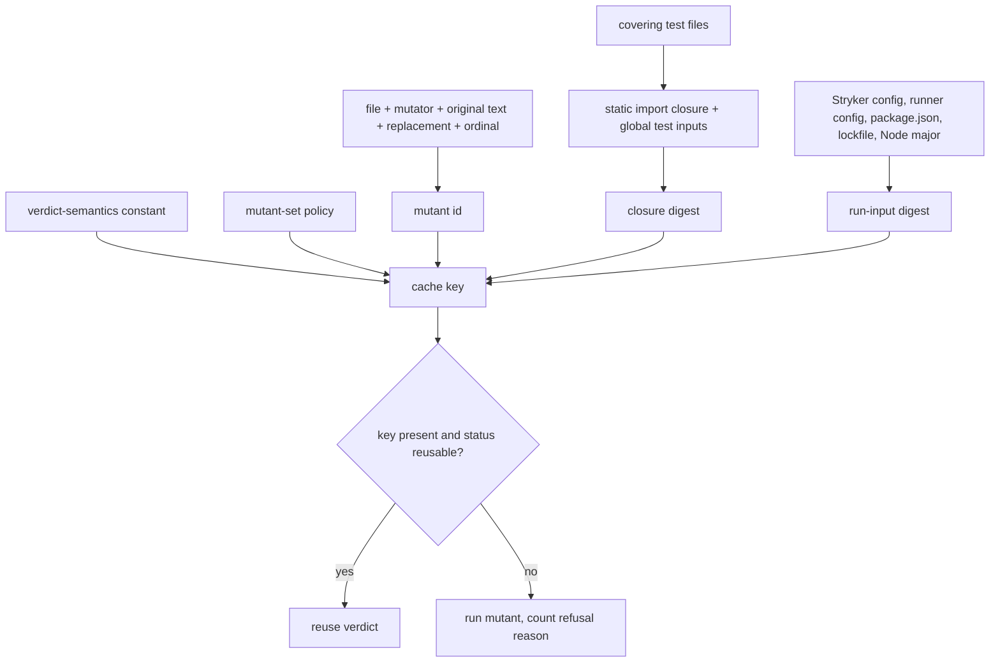
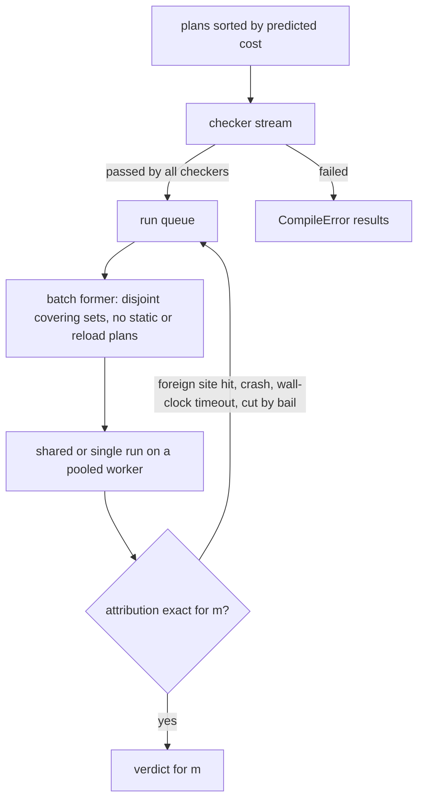

# State-of-the-Art Mutation Testing - Plan

## Goal Capsule

- **Objective:** Teams and AI agents that gate on `@systemfsoftware/stryker-js` get trustworthy results at a fraction of today's cost. Every surfaced survivor is worth acting on, and each result arrives where they already work: CI checks, code review, editors, and agent tools.
- **Means:** Content-derived mutant ids and a content-keyed verdict cache (KTD1, KTD2), a streamed and batched execution pipeline (KTD7–KTD10), a default mutant-set policy built into the instrumenter (KTD11–KTD13), and report projections plus stdio servers for review, editors, and agents (KTD14–KTD18).
- **Product authority:** This plan owns five areas: verdict trust and reuse, cheaper execution, fewer and better mutants, CI and review delivery, and agent and editor protocols. LLM-generated mutants, LLM equivalence verdicts, LLM test generation, and estimate modes are context only (see Scope Boundaries). `CONSTITUTION.md` governs where this plan conflicts with it. R-IDs win on behavior; KTDs win on mechanism.
- **Execution profile:** `ce-work` inside the `lfg` pipeline on branch `10x-improvement2`, shipped as one pull request a human merges. Units in the same phase with disjoint files may run in parallel.
- **Stop conditions:** Stop and report if the U11 profile shows test-body time above 70% of per-mutant cost (the 2x cold target then needs a user decision, per the origin's first deferred question). Stop if a change would alter a status under full-set policy beyond the R2 baseline. Stop if `effect` 4.0.0-rc.117 lacks an API a unit relies on (`effect/unstable/ai` `McpServer`, `effect/unstable/socket`).
- **Open blockers:** None.

---

## Product Contract

### Summary

The engine keeps verdicts and reuses them exactly: results survive releases, are keyed by content, and are refused with a stated reason. Runs get cheaper per mutant through kill-first test ordering, running checks and tests in parallel, shared runs for mutants that can't interfere, cost-aware scheduling, and warm workers. It stops generating mutants that can't be useful (arid code, redundant operator variants, duplicates, type-invalid replacements), and it names the rule behind every mutant it suppresses. Results reach reviewers as diff-scoped runs, a no-new-survivors gate, SARIF, and annotations. Agents and editors get stable mutant ids, single-mutant re-runs, the Mutation Server Protocol, and an MCP server.

### Problem Frame

**Cost.** The dogfood Mutation workflow on main (run 36364734326, 2026-09-28) took 25 minutes wall-clock and about 85 job-minutes across six shards. The slowest shard logged `version 13.0.0 does not match expected version 13.1.0; a full mutation testing run will be performed`. Dogfood runs the latest published CLI, so every release throws the cache away. That shard ran 1447 mutants in 22.9 minutes, and only 435 of them reached a Killed or Survived verdict.

**Waste inside a run.** A local one-file run (`src/plan-mutant-tests.workflow.ts`, 176 mutants) produced 103 CompileError mutants (59%): 61 of 76 `ArrowFunction` mutants and 24 of 33 `ObjectLiteral` mutants were rejected by the type checker. Of the 64 mutants that reached tests, 8 ran the full 549-test suite, and all 8 survived. The checker pass finishes for every mutant before the first test run starts. Each test run activates exactly one mutant, and covering tests run in no particular order.

**Trust.** Reuse requires the whole mutated file and every covering test file to be byte-identical, so a one-line edit re-runs the whole file. Changes to modules those tests import are ignored, so a stale verdict can be reused. The stream says nothing about what was reused or why reuse was refused.

**Delivery.** Mutation runs only on pushes to main. No PR sees survivors. There is no SARIF, no annotation output, no diff scope, no gate other than a flat score threshold, no stable public mutant id, and no editor or agent protocol. Peer tools treat all of these as table stakes (Appendix).

### Key Decisions

- **One plan covers every state-of-the-art area.** (session-settled: user-directed — chosen over a speed-only plan or adding a single area: the user asked for the full state of the art.) Planning may phase the work; the areas share a verdict store, mutant ids, and stream vocabulary.
- **Two cost targets, warm and cold.** (session-settled: user-directed — chosen over cold-only, warm-only, and wall-clock-only targets.) The thresholds are under Success Criteria.
- **Execution changes never change a status; only mutant-set policy may change what exists.** Ordering, batching, scheduling, reuse, and warm workers must leave every status unchanged, because CONST-T3 makes mutation the gate. Suppression rules may remove mutants, but each suppression is named and reported. Governs R1–R4, R20–R26.
- **Reuse is decided at file level over the static import closure of the covering tests, not per function over dynamic call edges.** In the ICST 2018 study, method-level dynamic regression test selection was the least precise of the three techniques measured, and FaultTracer ran slower than re-running everything. File-level static selection is structurally sound. Governs R8.
- **Releases declare verdict-semantics changes, and a scheduled cold run catches a missed declaration.** PIT's own documentation calls its history heuristics unproven, so this plan relies on neither memory nor heuristics. Governs R5–R7.
- **Only reproducible verdicts are cached.** Bazel caches failing tests only when explicitly asked, and documents that failures otherwise get stuck. The mutation equivalent is a wall-clock Timeout or a flaky kill persisting forever. Governs R10, R12.
- **Adopt existing standards over bespoke formats.** Use the Mutation Server Protocol (shipped in StrykerJS v10), SARIF 2.1.0, the mutation-testing-report schema, and OpenTelemetry `test.*` / `cicd.*` semantic conventions. Diagnostics go in sidecars and spans, not in the report schema. Governs R30, R35, R40.
- **Gate on new survivors in changed code, not on a flat score.** Google never surfaces a score. mutmut-ratchet shows a percentage band is wrong at both small and large module sizes. Governs R29.

### Requirements

**Verdict trust**

- R1. Execution changes in this plan leave every mutant's status equal to what a from-scratch run of the same engine version and mutant-set policy reports; the killing test and timings may differ.
- R2. Exactness is judged against a measured baseline: statuses that already differ between two from-scratch runs of the current engine count as baseline noise, not regressions.
- R3. A mutant is never scored from a run in which none of its covering tests executed; that run is retried and then reported as an error.
- R4. Each run records the mutant-set policy it used, so scores produced under different policies are never compared as equals.

**Verdict reuse**

- R5. A cached verdict survives a tool release unless that release declares a change to verdict semantics (how mutants are generated, placed, run, or judged).
- R6. A change that alters verdict semantics cannot merge without the declaration; review enforces this.
- R7. A scheduled cold run of the dogfood suite compares its statuses with the cached ones and fails, naming each mismatched mutant, when any differ beyond the R2 baseline. (pack: boundary-testing, real-system-oracles.md)
- R8. A cached verdict is reused only when no file in the static import closure of its covering tests has changed, and neither has any declared run input (configuration, lockfile, runtime version).
- R9. A cached verdict computed on any shard, branch, or machine is reusable on any other when its inputs are identical.
- R10. A wall-clock Timeout is reused only after it has reproduced; hit-limit Timeouts and all other statuses follow R8.
- R11. When nothing that feeds the dry run has changed, the run reuses the prior coverage instead of repeating the initial test run.
- R12. Tests that behave nondeterministically in the dry run are reported, and verdicts that depend on them are marked and not cached.

**Execution cost**

- R13. Each mutant's covering tests run in the order most likely to kill it first, such as its previous killer followed by the fastest tests.
- R14. A mutant's test run can start as soon as that mutant passes type checking, without waiting for checking to finish for all mutants.
- R15. Runtime mutants whose covering test sets don't overlap may share one test run, and each verdict is attributed to exactly one mutant; static mutants never share.
- R16. When a shared run times out, crashes, or executes none of a mutant's covering tests, its mutants are re-run individually before any of them gets a verdict.
- R17. Workers stay busy until the end of the run: the most expensive mutants, by cost predicted from the dry run, are scheduled first.
- R18. Each mutant's timeout is derived from the dry-run times of its own covering tests, with a floor, and hit-limit timeouts stay distinguishable from wall-clock timeouts.
- R19. Per-run fixed overhead (worker start, module transform, and import) is paid once per worker where possible, without sharing mutable state between mutant runs.

**Mutant-set policy**

- R20. By default, the engine does not generate mutants in arid code: logging, telemetry spans and annotations, time and schedule values, config defaults, and memoization. This includes their Effect-TS forms (`Effect.log*`, `withSpan`, `annotate*`, `Schedule.*`, `Config.withDefault`).
- R21. Operator variants that the published non-redundancy results (conditional, relational, unary insertion) prove subsumed are not generated by default.
- R22. A mutant whose canonical form equals the original code, or equals another mutant at the same site, is not generated.
- R23. Mutants the type checker would reject are avoided or rejected before reaching the full checker pass, and they never enter the score.
- R24. Static mutants are reported as their own class, with their measured cost, so their policy is an informed choice.
- R25. Every suppressed mutant is reported as Ignored with the name of the rule that suppressed it.
- R26. A full-set mode disables R20–R23 and reproduces today's mutant set.

**CI and review delivery**

- R27. A run can be scoped to the lines changed since a git ref. The verdict records the scope as diff, and scoping falls back to a full run when configuration or the lockfile changed.
- R28. Surfacing is capped per change (at most one surfaced survivor per line, and a per-file limit), while every verdict is still computed and stored.
- R29. A gate fails on new survivors in changed code against a committed baseline, and it tracks unchecked mutants separately from survivors.
- R30. Survivors can be emitted as SARIF 2.1.0 with stable fingerprints, so code-scanning alerts close when a mutant is killed.
- R31. Survivors can be emitted as GitHub workflow annotations at their exact location.

**Agent and editor protocols**

- R32. Every mutant has a public id, derived from its content, that stays stable across runs, shards, and machines.
- R33. A single mutant can be re-run by id, returning its status, covering tests, and killing test.
- R34. Every mutant carries a reproducer: its diff and the command that re-runs it.
- R35. The engine serves the Mutation Server Protocol over stdio and a socket, so the official Stryker editor extension and agents can drive runs.
- R36. The engine serves an MCP server that lists survivors, shows a mutant's diff and covering tests, and re-runs a mutant.
- R37. The stream accepts a useful or not-useful judgment per surfaced mutant and records it with the mutant id.

**Visibility**

- R38. The NDJSON stream reports how many verdicts were reused, how many ran, and a count for each reason reuse was refused.
- R39. The stream reports per-phase durations and a per-mutant cost breakdown (fixed overhead, tests executed, time in test bodies, whether the run was shared).
- R40. Each mutant run is an OpenTelemetry span carrying `test.*` and `cicd.*` attributes, and a `TRACEPARENT` supplied by CI links the run into the caller's trace.

### Key Flows

- F1. Pull request gate.
  - **Trigger:** A pull request changes source files.
  - **Steps:** Mutation runs scoped to the diff (R27). Cached verdicts are reused where inputs match (R8, R9). The remaining mutants run (R13–R19). Survivors are surfaced within the caps (R28) as annotations or SARIF (R30, R31). The gate compares survivors with the baseline (R29).
  - **Outcome:** The check fails only on new survivors in changed lines, and each one carries a reproducer (R34).
  - **Covered by:** R8, R9, R13–R19, R27–R31, R34.
- F2. Agent kills a survivor.
  - **Trigger:** An agent receives a survivor over MCP or the Mutation Server Protocol (R35, R36).
  - **Steps:** The agent reads the mutant's diff and covering tests (R34, R36), writes a test, and re-runs that mutant by id (R33).
  - **Outcome:** A Killed status is recorded under the same id (R32), and the agent can report the survivor as not useful instead (R37).
  - **Covered by:** R32–R37.
- F3. Release without a semantics change.
  - **Trigger:** A release ships and the next push to main runs mutation.
  - **Steps:** The cache is read (R5), reuse is decided (R8), and refusals are counted (R38).
  - **Outcome:** Only mutants with changed inputs run.
  - **Covered by:** R5, R8, R38.

### Acceptance Examples

- AE1. Release without a semantics change.
  - **Covers R5, R38.**
  - **Given** a cache written by 13.1.0 and a release 13.2.0 that declares no verdict-semantics change.
  - **When** the next push to main runs with unchanged sources and tests.
  - **Then** every verdict is reused and the stream reports zero refusals.
- AE2. Missed declaration.
  - **Covers R6, R7.**
  - **Given** a release that changed where ternary-test mutants are placed without declaring it.
  - **When** the scheduled cold run executes.
  - **Then** it fails and lists every mutant whose cached status differs.
- AE3. Changed import.
  - **Covers R8.**
  - **Given** a helper module in the static import closure of a mutant's covering tests changes, while the mutated file and the test files stay identical.
  - **Then** that mutant runs again.
- AE4. Wall-clock timeout.
  - **Covers R10.**
  - **Given** a mutant that hit a wall-clock Timeout once.
  - **When** the next run has identical inputs.
  - **Then** the mutant runs again. Its Timeout is reused only after it reproduces.
- AE5. Shared run with disjoint tests.
  - **Covers R15, R16.**
  - **Given** runtime mutants m1 and m2 with disjoint covering tests in one shared run.
  - **When** a test covering only m2 fails and every test covering m1 passes.
  - **Then** m2 is Killed and m1 is Survived. Had the run timed out, crashed, or executed none of m1's tests, m1 and m2 would each re-run alone.
- AE6. Arid code suppressed.
  - **Covers R20, R25, R26.**
  - **Given** a mutant on the message string of an `Effect.logInfo` call.
  - **Then** it is not generated by default, the report lists it as Ignored with the arid-logging rule, and full-set mode generates it.
- AE7. Diff-scoped pull request.
  - **Covers R27, R29.**
  - **Given** a pull request that edits one function and adds a survivor there, while three survivors already exist in untouched code in the baseline.
  - **Then** the gate fails naming only the new survivor, and the verdict records the scope as diff.
- AE8. Diff scope widened.
  - **Covers R27.**
  - **Given** a pull request that changes the Stryker configuration.
  - **Then** the run is not diff-scoped, and the verdict records the scope as full.

### Success Criteria

Baselines are the median job-minutes of the last 10 Mutation workflow runs on main before this work lands, taken from the workflow's recorded timings.

- **Warm:** a typical push to main costs at least 10x fewer job-minutes than the baseline. That includes the first push after a release that declares no semantics change.
- **Cold:** a full-set (R26) dogfood run with no cache costs at least 2x fewer job-minutes than a cold run of the pre-change engine, with statuses matching per R1 and R2.
- **Mutant-set policy:** the default policy generates at least 30% fewer mutants than full-set mode on the dogfood suite, and every removed mutant is accounted for by a named rule (R25).
- **Pull requests:** a pull request that touches one source file gets its mutation check result within 5 minutes of wall-clock time.
- **Exactness:** the R7 backstop reports zero mismatches beyond baseline noise across its first four scheduled runs. Backstop runs count toward the cold budget, not the warm metric.
- **Agent loop:** an agent can go from a surfaced survivor to a verified re-run of that mutant using only R33–R36, with no report parsing.
- **Streaming responsiveness:** when checkers are configured, the first mutant verdict event is emitted before type checking finishes for all mutants (R14).

### Scope Boundaries

**Deferred for later**

- LLM-generated mutants behind a precomputed-mutant seam (the LLMorpheus pattern). They are non-deterministic and need their own provenance design.
- An LLM survivor-killing test generator. R32–R36 give it everything it needs. The ISSTA 2026 data shows little value past about 5 attempts.
- Extreme mutation and a pseudo-tested methods report, as a separate signal that is never folded into the score.
- A remote shared verdict service, and queue-mode shard distribution. R9 makes results portable through the existing CI cache and artifacts.
- Moving shard orchestration into the engine CLI. `scripts/mutation-job.ts` and `STRYKER_SHARD` keep that job.
- Custom Node startup snapshots for workers. Measure R19 first.
- Speculative duplicate execution of straggler mutants.
- Pruning tests by state infection (AccMut/WinMut). Those gains are C/LLVM results, and exactness for JS expressions with side effects is unproven.

**Rejected on evidence**

- Sampling or predicted verdicts as a gating mode, because they break R1 and CONST-T3.
- An LLM equivalence classifier as a default filter: reported F1 above 80% falls to 47–59% without data leakage.
- Per-function reuse keyed on dynamic call edges (ICST 2018; see Key Decisions).
- Disabling test isolation for speed: this repo's enterprise fixture diverges under `--no-isolate`.
- ShadowRealm or `vm` modules as an isolation layer.
- A flat mutation-score threshold as the recommended gate.

<!-- ce-section: work-relationships -->

### How This Work Fits Together

This plan covers all five areas. The breakdown below is the current understanding of how they depend on each other, not a committed order.

- **Verdict trust and reuse** (R1–R12). Enables every other area: diff scope, the gate, and agent re-runs all read the same verdict store.
  - **Execution cost** (R13–R19). Depends on R3 and R16 so that sharing and warm workers can't corrupt statuses. Can proceed independently of delivery.
  - **Mutant-set policy** (R20–R26). Shares R4 and R25 with the stream. Can proceed independently of execution cost.
  - **CI and review delivery** (R27–R31). Depends on R9 and R32, because a baseline and a SARIF fingerprint both need stable ids and portable verdicts.
  - **Agent and editor protocols** (R32–R37). Depends on R32. Enables the deferred LLM test generator.

### Dependencies / Assumptions

- Dogfood runs the published CLI, so changes reach the dogfood workflow only after a release. The first release that carries R5 still invalidates the old cache once.
- `.github/workflows/` is read-only for agents under `AGENTS.md`. The R7 scheduled run and pull-request mutation for F1 in dogfood need a human to apply the workflow changes.
- CI keeps today's runner shape: `ubuntu-latest` with the vitest runner and TypeScript checker at 100% concurrency, split half test runners and half checkers.
- The 59% CompileError share comes from one file. The dogfood-wide share and its checker cost haven't been measured.
- How much sharing R15 can achieve depends on how disjoint covering-test sets are. The dry-run coverage map can measure that distribution before anything is built.
- The published Google rule list isn't language-specific for JS or TS, so the Effect-TS arid rules in R20 are derived from its rule categories.

### Outstanding Questions

**Deferred to Implementation**

- Whether the default for static mutants should change once R24 reports their cost. Until that data exists, `ignoreStatic` keeps today's default and static mutants never share a run (R15).
- The exact byte cost of the set-valued activation check on the inactive fast path. U14 measures it against the single-slot header before sharing is enabled by default.

Planning resolved the other questions the brainstorm deferred: cost order (KTD7), closure approximation (KTD3), set-valued activation (KTD9), operator tables and type-aware skipping (KTD12, KTD13), the R6 declaration and R7 cadence (KTD4, KTD5), and server sessions (KTD17).

### Sources / Research

- Repo evidence: `packages/stryker-js/src/read-project.cell.ts` (discard on version mismatch), `packages/stryker-js/src/incremental-diff.workflow.ts` (file-identity reuse), `packages/stryker-js/src/run/mutation-test.cell.ts` (the checker pass finishes before test runs; one mutant per run), `packages/stryker-js/src/run/dry-run.cell.ts`, `packages/stryker-js-vitest-runner/src/VitestRunner.service.ts`, `packages/stryker-js-instrumenter/src/InstrumentHeader.ts` (single active-mutant slot), `packages/stryker-js-instrumenter/src/Mutator.service.ts`, `packages/ignorers/`, `packages/stryker-test-contribution`, `packages/stryker-js-cli-contract/src/run-event.schema.ts`, `packages/stryker-js-cli-contract/src/SpanTaxonomy.ts`, `.github/workflows/mutation.yml`, `packages/stryker-js/stryker.config.ts`.
- Prior repo evidence on speed without parity: `docs/plans/2026-09-25-0809-refactor-vm-runner-runs-vitest-plan.md`. There the vm runner was faster only because it produced 144 of 319 different statuses.

---

## Planning Contract

**Product Contract preservation:** Product Contract unchanged. The KTDs below resolve the questions the brainstorm deferred, except the two still listed under Outstanding Questions > Deferred to Implementation.

### Key Technical Decisions

- KTD1. **A mutant id is a 16-hex digest of its content, not a per-run counter.** The digest covers the repo-relative file, mutator name, the original source text of the mutated node, the replacement code, and the ordinal among identical tuples in that file. It survives line shifts and filtering, which positional ids break (`docs/solutions/runtime-errors/directive-ignored-mutants-shift-placed-replacements.md`). `MutantId` stops being a decimal brand and `firstIndex`/`nextIndex` threading is deleted. Breaking under BREAK-1. Governs R9, R30, R32.
- KTD2. **The verdict cache is keyed by content and unioned from any number of incremental reports.** A cache entry's key is the mutant id plus the closure digest of its covering tests plus the run-input digest plus the verdict-semantics version plus the mutant-set policy. Nothing in the key names a shard, branch, path to the report, or machine, so shard reports merge by union. `incrementalVersion` stops meaning "tool version"; the tool version stays report metadata only. Governs R4, R5, R8, R9.
- KTD3. **The closure of a test file is computed statically with `oxc-parser` and over-includes whatever it cannot resolve.** Static imports, re-exports, literal dynamic `import()`, literal `require()`, and `vi.mock`/`vi.importActual` specifiers are followed through relative paths and workspace-resolvable bare specifiers. Packages under `node_modules` are covered by the lockfile digest instead. A non-literal specifier marks the closure open, and an open closure changes whenever any project file changes. Runner-reported global inputs (vitest `setupFiles`, `globalSetup`, the config file) join every closure. File level, not function level, per the ICST 2018 evidence. Governs R8.
- KTD4. **The verdict-semantics version is an integer constant, bumped deliberately, enforced by a guard.** `scripts/guards/check-verdict-semantics.ts` fails when a file on the verdict-semantics surface changes without a changeset that states `verdict-semantics: changed` (which also requires a bumped constant) or `verdict-semantics: unchanged`. The surface is every non-test source file in the packages that produce or interpret verdicts: `stryker-js`, `stryker-js-instrumenter`, `stryker-js-plugin-interface`, `stryker-js-vitest-runner`, `stryker-js-typescript-checker`, and `packages/ignorers/*`. A narrower hand-kept list would let an undeclared semantics change merge, which R6 forbids, so every change there must declare one way or the other. It joins `guard:projects` in `package.json`, so `pnpm check:ci` and the pre-push hook run it. Governs R5, R6.
- KTD5. **One comparison command serves R1, R2, and R7.** `stryker compare --baseline <report> --fresh <report> [--noise <file>]` reports every mutant whose status differs by id, subtracts a noise file, and exits 1 on any remaining mismatch. R2 defines noise against the current engine, so the noise set is never frozen: `scripts/mutation-backstop.ts` runs two forced cold runs of the dogfood suite, writes their disagreements as that run's noise file, and compares the cached statuses with the first fresh run. The weekly schedule is a workflow line a human adds, because `.github/workflows/` is read-only for agents. Governs R1, R2, R7.
- KTD6. **Wall-clock timeouts count reproductions across runs.** A cached wall-clock Timeout carries a reproduction count. The first occurrence is stored with count 0 and is re-run next time; a matching second occurrence raises it to 1, and only then is it reusable. Hit-limit Timeouts are deterministic and follow KTD2. No in-run retry, so a single run's statuses match today's semantics. Governs R10.
- KTD7. **Measure first, then batch.** U11 lands per-mutant cost attribution and span attributes before U14 enables shared runs by default, so the stop condition in the Goal Capsule can fire on data. Governs R39 and sequences R15, R19.
- KTD8. **Checking and testing are one stream.** The checker stage emits passed plans group by group, and the fan-out consumes them as they arrive. A plan enters testing only after every configured checker has passed it. Failures are collected in arrival order and settled before the run concludes. Governs R14.
- KTD9. **Shared runs activate a set of mutants and prove attribution from the run itself.** The header's single `activeMutant` slot becomes a set, with per-mutant hit counters, and while a set is active it records which active sites each test reaches. A shared run's verdict for mutant `m` is exact only when every test that reached `m`'s site covers only `m` among the active set. A test that reaches a foreign active site, a crash, a wall-clock timeout, or bail cutting off `m`'s covering tests sends `m` back to the queue to run alone. Static mutants and mutants needing environment reload never share. Governs R3, R15, R16.
- KTD10. **Kill-first ordering works at file granularity for Vitest.** The engine orders a plan's `testFilter` by previous killer, then ascending dry-run time. The Vitest runner honors that order through a custom `sequence.sequencer`. Vitest cannot reorder tests inside one file, so declaration order still holds there. Plan order is longest predicted cost first, with static and reload plans kept last. Governs R13, R17.
- KTD11. **Mutant-set policy lives in the instrumenter, not in an ignorer package.** `mutator.mutantSetPolicy: 'default' | 'full'` defaults to `'default'`. Arid-code rules, redundancy pruning, duplicate suppression, and type-invalid skipping are pure decisions over OXC nodes and ancestors inside the instrumenter. The ignorer family's charter requires proven equivalence, and arid code is not equivalent. Governs R20–R23, R26.
- KTD12. **Redundancy pruning applies the relational-operator table only, and only where it shrinks the set.** Today's `EqualityOperator` emits two variants per relational operator (`<` to `<=` and `>=`), and `ConditionalExpression` adds `true` and `false` when the comparison is a condition. The Just et al. sufficient set for `a < b` is `a <= b`, `a != b`, and `false`. Under `default`, a comparison in a condition position (the test of `if`, `while`, `for`, `do`, or `?:`) emits exactly the sufficient set in place of today's four variants. A bare comparison (`const ok = a < b`) keeps today's two, because the sufficient set would add a mutant there and R21 only removes. `==`, `!=`, `===`, and `!==` keep today's set, because their sufficient set is no smaller. Every variant removed is Ignored with `redundant-relational`. The published conditional and unary-insertion tables assume boolean-typed operands, which JavaScript's `&&`, `||`, and `??` are not, so R21 prunes nothing there. Governs R21.
- KTD13. **Type-invalid avoidance is syntactic and conservative.** In TypeScript sources, `ArrowFunction` is not applied to an arrow with an explicit return type other than `void`, `undefined`, `any`, or `unknown`. `ObjectLiteral` is not applied to an object whose declared type is syntactically visible (a typed variable or property, `satisfies`, or `as`). Everything else still reaches the checker, and CompileError stays out of the score. Governs R23.
- KTD14. **Every suppression reason starts with a rule id from one closed vocabulary.** `statusReason` for an Ignored mutant is `<rule-id>: <detail>`. Rule ids: `arid-logging`, `arid-telemetry`, `arid-time`, `arid-config-default`, `arid-memoization`, `redundant-relational`, `equivalent-to-original`, `duplicate-at-site`, `type-invalid-return`, `type-invalid-object`, `ignore-static`, `directive`, `excluded-mutator`, `ignorer`. The vocabulary is a schema in the plugin interface. Governs R25.
- KTD15. **Diff scope reads git through one child-process service and writes ordinary mutate ranges.** `--since <ref>` runs `git merge-base` and `git diff --unified=0` plus uncommitted changes, maps hunks onto the existing `file:line-line` grammar in `packages/stryker-js/src/MutationRange.schema.ts`, and intersects them with the configured `mutate` globs. The ref is passed as its own argv element (`ChildProcess.make(command, args)`), never through `shell: true` or string interpolation, because the ref is user input. A change to the Stryker config, the test-runner config, `package.json`, or the lockfile falls back to full scope. Governs R27.
- KTD16. **Review surfaces are projections of the finished report.** The SARIF reporter writes `reports/mutation/mutation.sarif` during a run. `stryker gate`, `stryker annotate`, and the reproducer sidecar read the finished report. Annotations never share stdout with the NDJSON stream, because `annotate` is its own command. One capping workflow feeds all of them (default: one survivor per line, seven per file). Governs R28–R31, R34.
- KTD17. **Servers are subcommands of the same CLI and run the same engine.** `stryker serve stdio|socket` speaks the Mutation Server Protocol with Content-Length framing; `stryker mcp` serves MCP over stdio through `effect/unstable/ai` `McpServer`. Each request runs the existing run pipeline with restricted `mutate` ranges or ids, one run at a time per server, and both bypass the output-mode probe so nothing but protocol reaches stdout. The protocol has no authentication, and `mutationTest` runs project test code, so socket mode binds loopback (`127.0.0.1`) by default. A non-loopback `--address` must be given explicitly and prints a warning naming the exposure. No new npm dependency. Governs R33, R35, R36.
- KTD18. **Stream additions are closed structs under one stream-version bump.** New lines: `reuse`, `mutant-detail`, `feedback`. `mutant` gains `static` and `cost`; `verdict` gains `scope`, `mutantSetPolicy`, `phaseDurations`, `static`. No rest records (`docs/solutions/test-failures/stream-schema-must-not-carry-json-rest-records.md`). `StreamSchemaVersion` moves to `2.0` and the committed contract documents are regenerated. Governs R24, R37–R39.
- KTD19. **Per-mutant spans follow OpenTelemetry semantic conventions.** `stryker.testRunner.mutantRun` gains `test.suite.name` (file and mutator), `test.suite.run.status` (Killed maps to `failure`, Survived to `success`, Timeout to `timed_out`, CompileError and RuntimeError to `aborted`, NoCoverage and Ignored to `skipped`), and `cicd.pipeline.run.id` and `cicd.pipeline.name` when CI supplies them. `TRACEPARENT` parenting already exists (`packages/stryker-js/src/reporter-stream.service.ts`) and is kept. Governs R40.

### High-Level Technical Design

Verdict cache key composition (KTD1, KTD2, KTD3):

Execution pipeline after U13 and U14 (KTD8, KTD9, KTD10):

Shared-run attribution decision for one mutant `m` in active set `S` (KTD9):

| Observation in the shared run                                                              | Decision for `m`                  |
| ------------------------------------------------------------------------------------------ | --------------------------------- |
| A test covering `m` failed, and every active site it reached is `m`'s                      | Killed                            |
| A hit-limit error named `m`                                                                | Timeout (hit-limit)               |
| All of `m`'s covering tests executed and passed, none reached a site in `S` other than `m` | Survived                          |
| A test reached a site in `S` other than one it covers                                      | Requeue `m` alone                 |
| Worker crash or wall-clock timeout                                                         | Requeue every mutant in `S` alone |
| None or only some of `m`'s covering tests executed, no attributed failure                  | Requeue `m` (R3)                  |

CLI surface after this plan (KTD5, KTD15–KTD17):

| Command                                                            | Reads                        | Writes                              | Requirements |
| ------------------------------------------------------------------ | ---------------------------- | ----------------------------------- | ------------ |
| `stryker run [--since <ref>] [--mutant <id,...>]`                  | project, incremental reports | reports, stream, sidecars           | R27, R33     |
| `stryker merge-reports`                                            | shard parts                  | merged report and incremental union | R9           |
| `stryker gate --baseline <file> [--update-baseline]`               | finished report              | exit class, baseline                | R28, R29     |
| `stryker annotate [--baseline <file>]`                             | finished report              | workflow commands on stdout         | R28, R31     |
| `stryker compare --baseline <r> --fresh <r> [--noise <f>]`         | two reports                  | mismatch list, exit class           | R1, R2, R7   |
| `stryker feedback <id> --useful \| --not-useful [--reason <text>]` | none                         | feedback sidecar, stream line       | R37          |
| `stryker serve stdio \| socket [--port] [--address]`               | protocol requests            | protocol responses                  | R35          |
| `stryker mcp`                                                      | protocol requests            | protocol responses                  | R36          |

### Assumptions

- Vitest 5.0.1 is the pinned runner. Its `sequence.sequencer` orders files, `fsModuleCache` keys transforms by content, and neither changes test outcomes.
- `effect` 4.0.0-rc.117 ships `effect/unstable/ai` `McpServer` (verified in `node_modules/.pnpm/effect@4.0.0-rc.117`) and a Node socket server usable for the MSP socket transport.
- The Mutation Server Protocol is bound to the README in `stryker-mutator/editor-plugins/packages/mutation-server-protocol` as fetched during planning: JSON-RPC 2.0, Content-Length framing, `configure`, `discover`, `mutationTest`, and `reportMutationTestProgress`.
- Dogfood benefits only after a release, because dogfood runs `catalog:stryker`. In-PR evidence is a local proxy benchmark with the workspace build (Verification Contract).
- The ROR sufficient sets assume numbers without `NaN`. Tests that distinguish `NaN` behavior through relational operators are rare; `full` policy restores every variant.
- Seven surfaced survivors per file follows Google's mechanism, not its constant. It is a configurable default.

### System-Wide Impact

- **Published contracts break:** `MutantId` (plugin interface), the NDJSON stream (cli-contract, version `2.0`), the incremental report layout, the option schema (`mutantSetPolicy`, `since`, `mutant`, `surfacing`, `sharedRuns`, `incrementalSources`), and the header runtime contract (`activeMutants`). Every touched published package gets a changeset bumping `minor` (all are `0.x`) or `major` for `1.x` and later, per BREAK-1.
- **Worker RPC:** `MutantRunOptions` gains `activeMutants` and loses the singular `activeMutant`; the vitest runner and any third-party runner must follow. PLUG-1 `deps.onlyImport` stays exact for the runner and checker worker bundles.
- **E2E journeys:** journeys that assert per-mutator counts run under `mutantSetPolicy: 'full'` so they keep testing execution rather than policy.
- **Agents:** `skills/stryker-mutation-testing/SKILL.md` and `plugin.json` describe the new commands and the MCP server.

### Risks & Dependencies

| Risk                                                                    | Mitigation                                                                                                                                                                      |
| ----------------------------------------------------------------------- | ------------------------------------------------------------------------------------------------------------------------------------------------------------------------------- |
| A shared run marks a mutant Killed through interference                 | KTD9 records per-test active-site reach and requeues on any foreign hit; U14 compares statuses against single runs on the enterprise fixture before enabling sharing by default |
| The closure misses an input, and a stale verdict is reused              | KTD3 over-includes; the R7 backstop fails loudly on any mismatch                                                                                                                |
| A missed verdict-semantics declaration                                  | KTD4 guard at `pnpm check:ci` and pre-push; R7 backstop                                                                                                                         |
| Content ids collide                                                     | 64-bit digest plus the per-file ordinal; the in-source schema law checks for collisions over generated files                                                                    |
| Wall-clock timeouts flap in CI                                          | KTD6 requires reproduction before reuse                                                                                                                                         |
| Streaming checkers starve the runner pool                               | The pool keeps `testRunners` slots while checkers run and grows to `testRunners + checkers` once checkers release                                                               |
| Worker RPC retries orphan in-flight requests under longer-lived workers | Follow `docs/solutions/runtime-errors/worker-rpc-transient-retry-orphans-in-flight-requests.md`; no change to retry settings                                                    |

### Sequencing

Phases run in order; units inside a phase with disjoint files can run in parallel.

1. Contracts: U1, U2, U3.
2. Verdict trust and reuse: U4, U5, U6, U7, U8, U9, U10.
3. Execution: U11, then U12, U13, U15 in parallel, then U14.
4. Mutant-set policy: U16, U17, U18, U19.
5. Delivery: U20, U21, U22.
6. Protocols: U23, then U24 and U25.
7. Adoption and docs: U26.

---

## Implementation Units

| U-ID | Title                                           | Key files                                                                              | Depends on        |
| ---- | ----------------------------------------------- | -------------------------------------------------------------------------------------- | ----------------- |
| U1   | Content-derived mutant ids                      | `Mutant.schema.ts`, `plan-mutants.workflow.ts`                                         | none              |
| U2   | Stream vocabulary 2.0                           | `run-event.schema.ts`, `SpanTaxonomy.ts`                                               | U1                |
| U3   | Mutant-set policy option and rule vocabulary    | `stryker-options.schema.ts`, `Mutator.service.ts`                                      | none              |
| U4   | Verdict cache identity                          | `admit-incremental-report.workflow.ts`, `IncrementalReport.schema.ts`                  | U1, U3            |
| U5   | Static import closure                           | `import-closure.workflow.ts`, `import-closure.cell.ts`                                 | none              |
| U6   | Content-keyed reuse and refusal counts          | `incremental-diff.workflow.ts`, `incremental-reuse.cell.ts`                            | U2, U4, U5        |
| U7   | Timeout provenance and reproduction             | `IncrementalDiff.schema.ts`, `plan-mutant-tests.workflow.ts`                           | U6                |
| U8   | Zero-executed covering-test guard               | `interpret-mutant-run.workflow.ts`, `mutant-run.cell.ts`                               | U2                |
| U9   | Dry-run reuse and flake detection               | `dry-run.cell.ts`, `dry-run-reuse.workflow.ts`                                         | U5, U6            |
| U10  | Semantics guard, compare command, backstop      | `check-verdict-semantics.ts`, `compare-verdicts.workflow.ts`                           | U4                |
| U11  | Per-mutant cost, phase durations, spans         | `mutant-run.ts`, `SpanTaxonomy.ts`                                                     | U2                |
| U12  | Cost-first scheduling and kill-first order      | `sort-run-plans.workflow.ts`, `VitestRuntime.blueprint.ts`                             | U11               |
| U13  | Streaming checker                               | `checker-pool.handle.ts`, `mutation-test.cell.ts`                                      | U11               |
| U14  | Shared runs with exact attribution              | `InstrumentHeader.ts`, `attribute-shared-run.workflow.ts`                              | U8, U11, U12, U13 |
| U15  | Warm worker caches                              | `VitestRuntime.blueprint.ts`, `StandbyThreadsPool.handle.ts`                           | U11               |
| U16  | Arid-code rules                                 | `arid-code.workflow.ts`                                                                | U3                |
| U17  | Relational redundancy and duplicate suppression | `mutant-set-policy.workflow.ts`, `Mutator.service.ts`                                  | U3                |
| U18  | Type-invalid avoidance                          | `type-invalid-skip.workflow.ts`                                                        | U3                |
| U19  | Static mutant class reporting                   | `plan-mutant-tests.workflow.ts`, `verdict-envelope.ts`                                 | U2, U11           |
| U20  | Diff scope                                      | `git-diff.workflow.ts`, `git-diff.service.ts`                                          | U2                |
| U21  | Surfacing caps and new-survivor gate            | `cap-survivors.workflow.ts`, `gate-new-survivors.workflow.ts`                          | U1, U20           |
| U22  | SARIF reporter, annotations, reproducers        | `sarif-report.workflow.ts`, `render-annotations.workflow.ts`, `reproducer.workflow.ts` | U21               |
| U23  | Re-run by id                                    | `admit-mutant-rerun.workflow.ts`, `Rerun.cell.ts`                                      | U1, U2, U14, U22  |
| U24  | Mutation Server Protocol server                 | `msp-protocol.workflow.ts`, `msp-framing.schema.ts`                                    | U23               |
| U25  | MCP server and usefulness feedback              | `mcp-server.cell.ts`, `record-feedback.workflow.ts`                                    | U23               |
| U26  | Dogfood adoption, docs, changesets              | `scripts/mutation-job.ts`, `README.md`, `.changeset/*`                                 | all               |

### U1. Content-derived mutant ids

- **Goal:** Every mutant's id is stable for identical content across runs, shards, and machines.
- **Requirements:** R32, R9 prerequisite; KTD1.
- **Dependencies:** None.
- **Files:**
  - `packages/stryker-js-plugin-interface/src/Mutant.schema.ts` (modify `MutantId` grammar to 16 lowercase hex; in-source laws)
  - `packages/stryker-js-instrumenter/src/plan-mutants.workflow.ts` (mint the digest; delete `firstIndex`/`nextIndex`)
  - `packages/stryker-js-instrumenter/src/Mutator.service.ts`, `packages/stryker-js-instrumenter/src/Transformer.service.ts`, `packages/stryker-js-instrumenter/src/place-mutants.workflow.ts` (remove counter threading)
  - `packages/stryker-js/src/mutation-reporting.service.ts`, `packages/stryker-js/src/merge-reports.ts`, `packages/stryker-js/src/Survivors/Survivors.schema.ts` (consumers assuming decimal ids)
  - Tests: `packages/stryker-js-instrumenter/src/__tests__/plan-mutants.workflow.property.test.ts`, `packages/stryker-js-instrumenter/tests/instrumenter.integration.test.ts`
- **Approach:**
  1. Hash with `@noble/hashes` sha256, already a dependency (`packages/stryker-js/src/Survivors/Survivors.cell.ts` `hashContent`); add it to the instrumenter's dependencies if it is not there.
  2. The ordinal counts earlier candidates in the same file with the same tuple, so ids stay unique without positions.
  3. Audit every `Record(MutantId, …)` worker payload for decode assumptions before changing the brand.
- **Patterns to follow:** `docs/solutions/runtime-errors/directive-ignored-mutants-shift-placed-replacements.md` (key by id, never zip positions).
- **Test scenarios:**
  - Instrumenting the same source twice yields identical ids.
  - Inserting a line above a mutant leaves its id unchanged.
  - Two identical replacements of identical text in one file get different ids.
  - Adding a directive that ignores an earlier mutant leaves later ids unchanged.
  - A decimal string is refused by the `MutantId` schema; a 16-hex string is accepted.
  - Instrumented output still activates the right mutant by its new id (`stryMutAct_*("<hex>")`).
- **Verification:** All consumers compile against the new brand and the instrumenter integration suite passes with hex ids.

### U2. Stream vocabulary 2.0

- **Goal:** The NDJSON contract and span taxonomy carry every new field and line this plan emits, as closed structs.
- **Requirements:** R4, R24, R37, R38, R39, R40 (vocabulary only); KTD18, KTD19.
- **Dependencies:** U1.
- **Files:**
  - `packages/stryker-js-cli-contract/src/run-event.schema.ts` (new `reuse`, `mutant-detail`, `feedback`; `mutant.static`, `mutant.cost`; `verdict.scope`, `verdict.mutantSetPolicy`, `verdict.phaseDurations`, `verdict.static`; `StreamSchemaVersion` `2.0`)
  - `packages/stryker-js-cli-contract/src/SpanTaxonomy.ts` (mutant-run attributes per KTD19)
  - `packages/stryker-js-cli-contract/contract/stream.schema.json`, `packages/stryker-js-cli-contract/contract/span-taxonomy.json` (regenerated)
  - `packages/stryker-js/src/run/frame-run-event.workflow.ts` or the framing site found by search (exhaustiveness)
  - Tests: `packages/stryker-js-cli-contract/tests/run-event-wire-line.integration.test.ts`, `packages/stryker-js-cli-contract/tests/contract-documents.integration.test.ts`
- **Approach:** Only vocabulary here; producers land in U6, U11, U19, U20, U23, U25. `reuse.refused` is a struct with one count per refusal reason: `semanticsChanged`, `policyChanged`, `runInputsChanged`, `closureChanged`, `timeoutUnreproduced`, `flakyDependency`, `noPriorRecord`.
- **Patterns to follow:** `docs/solutions/test-failures/stream-schema-must-not-carry-json-rest-records.md`; existing schema laws in the cli-contract package.
- **Test scenarios:**
  - Every new line round-trips through `RunEventWireLine` for generated values.
  - A `mutant` line without `cost` is refused.
  - Regenerated contract documents match the committed files.
  - `scripts/guards/check-contract-versions.ts` classifies the change as incompatible and accepts the cli-contract `minor` changeset (the package is `0.x`, per BREAK-1) with the `StreamSchemaVersion` `2.0` bump.
- **Verification:** The cli-contract suite and the contract-version guard pass.

### U3. Mutant-set policy option and rule vocabulary

- **Goal:** Users choose `default` or `full`, the instrumenter receives it, and suppression reasons draw from one vocabulary.
- **Requirements:** R4 (recording), R25, R26; KTD11, KTD14.
- **Dependencies:** None.
- **Files:**
  - `packages/stryker-js-plugin-interface/src/stryker-options.schema.ts` (`mutator.mutantSetPolicy`, defaulted `'default'`)
  - `packages/stryker-js-plugin-interface/src/ignore-rule.schema.ts` (create: rule-id literals and `<rule-id>: <detail>` grammar)
  - `packages/stryker-js-instrumenter/src/Mutator.service.ts`, `packages/stryker-js-instrumenter/src/Instrument.schema.ts`, `packages/stryker-js-instrumenter/src/Format.ts`, `packages/stryker-js-instrumenter/src/Transformer.service.ts` (thread policy)
  - `packages/stryker-js-instrumenter/src/plan-mutants.workflow.ts` (prefix existing directive, exclusion, and ignorer reasons with their rule ids)
  - `packages/stryker-js/src/run/instrument.cell.ts`, `packages/stryker-js/src/plan-mutant-tests.workflow.ts` (`ignore-static` prefix)
  - `packages/stryker-js-cli-contract/src/StockCatalog.ts` and `packages/stryker-js-instrumenter/tests/catalog-examples.integration.test.ts` (the catalog documents the full set; its test runs under `full`)
  - Tests: in-source laws in `ignore-rule.schema.ts` and `stryker-options.schema.ts`; `packages/stryker-js-instrumenter/src/__tests__/plan-mutants.workflow.property.test.ts`
- **Approach:** `full` must reproduce today's mutant set byte for byte; U16–U18 read the policy from the placement context.
- **Test scenarios:**
  - An omitted policy decodes as `default`; an unknown value is refused with the option path in the message.
  - Every Ignored reason emitted by the planner parses as `<rule-id>: <detail>`.
  - Under `full`, the stock catalog examples produce exactly today's replacements.
- **Verification:** Instrumenter and options suites pass; the catalog suite passes under `full`.

### U4. Verdict cache identity

- **Goal:** A cached report is admitted across releases unless semantics, policy, or run inputs changed, and every discard names its reason.
- **Requirements:** R4, R5, R8 (run inputs); KTD2, KTD4.
- **Dependencies:** U1, U3.
- **Files:**
  - `packages/stryker-js/src/verdict-semantics.ts` (create: the integer constant and the surface file list)
  - `packages/stryker-js/src/IncrementalReport.schema.ts` (`verdictSemanticsVersion`, `mutantSetPolicy`, `runInputsDigest`; `incrementalVersion` becomes the cache layout version)
  - `packages/stryker-js/src/admit-incremental-report.workflow.ts` (typed discard reasons; a missing field discards)
  - `packages/stryker-js/src/read-project.cell.ts` (compute run-input digest: Stryker config, runner config file, `package.json`, lockfile, Node major; discard messages)
  - `packages/stryker-js/src/mutation-reporting.service.ts` (write the new fields)
  - Tests: `packages/stryker-js/src/__tests__/admit-incremental-report.workflow.property.test.ts`
- **Approach:** Digest the canonical JSON of resolved options rather than file bytes, so formatting-only edits to the config do not invalidate (`docs/solutions/build-errors/pnpm-pack-tarball-bytes-are-not-a-stable-cache-key.md`). The lockfile is found by walking up from the project root.
- **Test scenarios:**
  - Covers AE1. Reports differing only in tool version are admitted.
  - Covers AE2. A report with a lower semantics version is discarded with reason `semanticsChanged`.
  - A report under another policy is discarded with `policyChanged`.
  - A report missing the new fields is discarded, not crashed on.
  - Changing the lockfile digest discards with `runInputsChanged`.
- **Verification:** A cache written by the pre-release build is admitted by a build that only bumps `package.json` version.

### U5. Static import closure

- **Goal:** Each test file maps to a digest of every project file it can reach.
- **Requirements:** R8; KTD3.
- **Dependencies:** None.
- **Files:**
  - `packages/stryker-js/src/import-closure.workflow.ts` (create: pure closure over an extracted import graph, open-closure rule, digest)
  - `packages/stryker-js/src/import-closure.cell.ts` (create: read files, extract specifiers with `oxc-parser` `parseSync`, resolve relative and workspace specifiers, hash)
  - `packages/stryker-js-plugin-interface/src/TestRunner.schema.ts` (optional `globalTestInputs` on the dry-run result)
  - `packages/stryker-js-vitest-runner/src/` dry-run interpretation (report `setupFiles`, `globalSetup`, config file)
  - Tests: `packages/stryker-js/src/__tests__/import-closure.workflow.property.test.ts`, `packages/stryker-js/tests/import-closure.integration.test.ts`
- **Approach:** Resolution tries the specifier, then TS extension substitution (`.js` to `.ts`, `.mjs` to `.mts`), then index files. Bare specifiers resolving outside `node_modules` are followed; those inside are external.
- **Patterns to follow:** `packages/stryker-js-instrumenter/src/Parser.service.ts` (`parseSync` usage).
- **Test scenarios:**
  - Covers AE3. Changing a helper two imports deep changes the test file's digest.
  - A cycle terminates and includes every member once.
  - A non-literal `import(x)` marks the closure open.
  - `vi.mock('./clock.js')` pulls `clock.ts` into the closure.
  - Changing a file outside every closure leaves digests unchanged.
  - Changing a vitest setup file changes every digest.
- **Verification:** On the enterprise fixture, every test file's closure contains the source files its covering mutants live in.

### U6. Content-keyed reuse and refusal counts

- **Goal:** Reuse is decided per cache key across any number of incremental reports, and the stream reports reuse and refusals.
- **Requirements:** R8, R9, R38; KTD2.
- **Dependencies:** U2, U4, U5.
- **Files:**
  - `packages/stryker-js/src/incremental-diff.workflow.ts` (`MutantToRun` carries exactly one refusal reason, chosen by fixed precedence: `semanticsChanged`, `policyChanged`, `runInputsChanged`, `closureChanged`, `flakyDependency`, `timeoutUnreproduced`, `noPriorRecord`; key by cache key)
  - `packages/stryker-js/src/IncrementalDiff.schema.ts` (per-mutant closure digest)
  - `packages/stryker-js/src/run/incremental-reuse.cell.ts` (union reports from `incrementalFile` plus the new `incrementalSources` globs)
  - `packages/stryker-js-plugin-interface/src/stryker-options.schema.ts` (`incrementalSources`)
  - `packages/stryker-js/src/run/mutation-test.cell.ts` (emit `reuse` line; drop the log-only count)
  - `packages/stryker-js/src/merge-reports.ts` (write the union of shard incremental reports)
  - Tests: `packages/stryker-js/src/__tests__/incremental-diff.workflow.property.test.ts`, `packages/stryker-js/tests/run-event-stream.integration.test.ts`
- **Test scenarios:**
  - Covers AE3. A changed closure digest yields `MutantToRun` with `closureChanged`.
  - A verdict written under another report path and shard is reused when keys match.
  - Two reports with the same key and different statuses resolve to the newer report.
  - `reused + ran` equals planned mutants, and the refusal counts partition `ran`: each run mutant counts under exactly one reason, and mutants never seen before count under `noPriorRecord`.
  - A mutant refused for several reasons counts only under the first in precedence order.
  - `force` reuses nothing and runs everything.
- **Verification:** Running the enterprise fixture twice with no change reuses every verdict and reports zero refusals.

### U7. Timeout provenance and reproduction

- **Goal:** Wall-clock timeouts are reused only after reproducing, and timeouts keep a per-mutant floor.
- **Requirements:** R10, R18; KTD6.
- **Dependencies:** U6.
- **Files:**
  - `packages/stryker-js/src/IncrementalDiff.schema.ts` (`timeoutKind`, `reproductions`)
  - `packages/stryker-js/src/incremental-diff.workflow.ts` (reuse rule; refusal `timeoutUnreproduced`)
  - `packages/stryker-js/src/mutation-reporting.service.ts` (classify reasons with `packages/stryker-js-plugin-interface/src/mutant-timeout-reason.schema.ts`)
  - `packages/stryker-js/src/plan-mutant-tests.workflow.ts` (floor applied to the per-mutant formula)
  - Tests: `packages/stryker-js/src/__tests__/incremental-diff.workflow.property.test.ts`, `packages/stryker-js/src/__tests__/plan-mutant-tests.workflow.property.test.ts`
- **Test scenarios:**
  - Covers AE4. A wall-clock Timeout with zero reproductions re-runs; after a second wall-clock Timeout it is reused.
  - A wall-clock Timeout followed by Killed stores Killed and resets reproductions.
  - A hit-limit Timeout is reused on first sight.
  - The computed timeout never falls below the floor for any covering-test time.
- **Verification:** The timeout integration suite (`packages/stryker-js/tests/wall-clock-timeout.integration.test.ts`) stays green.

### U8. Zero-executed covering-test guard

- **Goal:** No verdict comes from a run that executed none of the mutant's covering tests.
- **Requirements:** R3.
- **Dependencies:** U2.
- **Files:**
  - `packages/stryker-js-plugin-interface/src/TestRunner.schema.ts` (`executedTests` on mutant-run results)
  - `packages/stryker-js-vitest-runner/src/MutantRun.cell.ts`, `packages/stryker-js-vitest-runner/src/interpret-vitest-mutant-run.workflow.ts` (report executed test ids)
  - `packages/stryker-js/src/interpret-mutant-run.workflow.ts` (retry decision), `packages/stryker-js/src/run/mutant-run.cell.ts` (one retry on a fresh worker, then RuntimeError with reason `no covering test executed`)
  - Tests: `packages/stryker-js/src/__tests__/interpret-mutant-run.workflow.property.test.ts`, `packages/stryker-js-vitest-runner/src/__tests__/interpret-vitest-mutant-run.workflow.property.test.ts`
- **Test scenarios:**
  - A Survived result with no executed covering test becomes a retry, then RuntimeError.
  - A Killed result whose failing test covers the mutant settles immediately.
  - A result whose `testFilter` is empty (run-all) is never retried for this reason.
- **Verification:** The guard fires on an injected empty filter match and never on the enterprise fixture baseline.

### U9. Dry-run reuse and flake detection

- **Goal:** Warm runs skip the dry run, and cold runs report nondeterministic tests and keep dependent verdicts out of the cache.
- **Requirements:** R11, R12.
- **Dependencies:** U5, U6.
- **Files:**
  - `packages/stryker-js/src/dry-run-reuse.workflow.ts` (create: skip or run from closure and run-input digests)
  - `packages/stryker-js/src/detect-dry-run-flakes.workflow.ts` (create: two passes to flaky test ids by status or coverage difference)
  - `packages/stryker-js/src/dry-run-coverage.schema.ts` (create: serializable per-test coverage, timings, overhead)
  - `packages/stryker-js/src/run/dry-run.cell.ts` (skip branch rebuilding `DryRunDone`; second pass when the dry run runs)
  - `packages/stryker-js/src/IncrementalReport.schema.ts`, `packages/stryker-js/src/mutation-reporting.service.ts` (persist coverage)
  - Tests: `packages/stryker-js/src/__tests__/dry-run-reuse.workflow.property.test.ts`, `packages/stryker-js/src/__tests__/detect-dry-run-flakes.workflow.property.test.ts`
- **Approach:** Flaky dependency marks the mutant result, and the refusal reason `flakyDependency` applies the next time. `--dry-run-only` and empty-suite semantics stay as they are.
- **Test scenarios:**
  - Identical digests skip the dry run and rebuild the same coverage map.
  - Any test-file closure change runs the dry run.
  - A test passing once and failing once is flaky; one covering a different mutant set across passes is flaky.
  - A verdict whose covering tests include a flaky test is not written as reusable.
- **Verification:** A warm run on the enterprise fixture emits no `dry-run` phase work beyond reading the cache.

### U10. Semantics guard, compare command, backstop

- **Goal:** Semantics changes cannot merge undeclared, and cached statuses are compared against fresh ones on demand.
- **Requirements:** R1, R2, R6, R7; KTD4, KTD5.
- **Dependencies:** U4.
- **Files:**
  - `scripts/guards/check-verdict-semantics.ts` (create, with `--selftest`), `scripts/lib/changeset-intents.ts` (parse the declaration), `package.json` (`guard:projects` list)
  - `packages/stryker-js/src/compare-verdicts.workflow.ts` (create), `packages/stryker-js/src/bin/cli-command.ts`, `packages/stryker-js/src/Cli.schema.ts`, `packages/stryker-js/src/route-cli-request.workflow.ts`, `packages/stryker-js/src/run-request.cell.ts` (`compare` route)
  - `scripts/mutation-backstop.ts` (create: two forced cold runs, their disagreements as this run's noise file, then compare against the cache)
  - Tests: guard selftest cases; `packages/stryker-js/src/__tests__/compare-verdicts.workflow.property.test.ts`; `packages/stryker-js/src/__tests__/route-cli-request.workflow.property.test.ts`
- **Test scenarios:**
  - Covers AE2. A surface file change without a declaration fails the guard.
  - `verdict-semantics: changed` without a constant bump fails; with a bump passes.
  - A change outside the surface passes without a declaration.
  - `compare` lists every mismatched id and exits 1; mismatches present in the noise file are subtracted.
  - A mutant whose two fresh runs disagree lands in the noise file and never fails the backstop.
  - Identical reports exit 0.
- **Verification:** `pnpm guard:projects` passes on this branch with this plan's changeset declaring `verdict-semantics: changed`.

### U11. Per-mutant cost, phase durations, spans

- **Goal:** Every mutant's cost is attributed on the stream and on its span.
- **Requirements:** R39, R40; KTD7, KTD19.
- **Dependencies:** U2.
- **Files:**
  - `packages/stryker-js-vitest-runner/src/vitest-test-run.ts`, `packages/stryker-js-vitest-runner/src/vitest-run-command.schema.ts` (per-test durations, executed count)
  - `packages/stryker-js-plugin-interface/src/TestRunner.schema.ts`, `packages/stryker-js-plugin-interface/src/Mutant.schema.ts` (carry timings)
  - `packages/stryker-js/src/run/mutant-run.ts` (`settleMutantRun` computes `testsExecuted`, `testBodyMs`, `fixedOverheadMs`, `shared`)
  - `packages/stryker-js/src/run/run-stages.cell.ts` or the phase emitter (phase durations on `verdict`)
  - `packages/stryker-js/src/run/mutant-run.cell.ts` (span attributes)
  - Tests: `packages/stryker-js/src/__tests__/mutant-cost.workflow.property.test.ts`, `packages/stryker-js/tests/trace-propagation.integration.test.ts`
- **Approach:** Fixed overhead is wall time minus summed test-body time. After landing, profile the dogfood `stryker-js` package locally and record the split in the PR; the Goal Capsule stop condition reads it.
- **Test scenarios:**
  - `testBodyMs + fixedOverheadMs` equals the measured run time for every settled mutant.
  - Phase durations sum to the run's elapsed time within one event interval.
  - Span status mapping follows KTD19 for every status.
  - With `TRACEPARENT` set, mutant-run spans share the caller's trace id.
- **Verification:** A local dogfood run prints per-mutant cost lines and a phase breakdown.

### U12. Cost-first scheduling and kill-first order

- **Goal:** Expensive mutants start first and each mutant's likeliest killer runs first.
- **Requirements:** R13, R17; KTD10.
- **Dependencies:** U11.
- **Files:**
  - `packages/stryker-js/src/sort-run-plans.workflow.ts` (create; replaces `sortRunPlans` in `packages/stryker-js/src/run/mutation-test-plan.cell.ts`)
  - `packages/stryker-js/src/plan-mutant-tests.workflow.ts` (order `testFilter`: previous killer from the cache, then ascending dry-run time)
  - `packages/stryker-js-vitest-runner/src/VitestRuntime.blueprint.ts`, `packages/stryker-js-vitest-runner/src/VitestRunner.service.ts` (custom sequencer ordering files by the filter's order)
  - Tests: `packages/stryker-js/src/__tests__/sort-run-plans.workflow.property.test.ts`, `packages/stryker-js/src/__tests__/plan-mutant-tests.workflow.property.test.ts`, `packages/stryker-js-vitest-runner/tests/` sequencer integration test
- **Test scenarios:**
  - Plans are ordered by descending `netTime`; ties break by id, so the order is total.
  - Static and reload plans stay after all others.
  - The previous killer leads the filter even when it is the slowest test.
  - The runner executes the file holding the first filter entry first.
  - Statuses on the enterprise fixture match the unsorted run.
- **Verification:** Killed mutants execute fewer tests on average than before on the enterprise fixture.

### U13. Streaming checker

- **Goal:** A mutant starts testing as soon as all checkers pass it.
- **Requirements:** R14; KTD8.
- **Dependencies:** U11.
- **Files:**
  - `packages/stryker-js/src/Checker/checker-pool.handle.ts` (stream of `CheckedPlans` per group; chained checkers pass plans on as they clear)
  - `packages/stryker-js/src/run/mutation-test.cell.ts` (fan-out consumes the stream concurrently)
  - Tests: `packages/stryker-js/src/__tests__/checker-pool.workflow.property.test.ts`, `packages/stryker-js/tests/checker-streaming.integration.test.ts`
- **Test scenarios:**
  - With a slow fake checker group, the first `mutant` line precedes the last check result.
  - A plan failed by the second checker never reaches a runner.
  - Every failed check is reported before the verdict.
  - The number of concurrent runner leases never exceeds pool capacity.
- **Verification:** On a local dogfood run with the TypeScript checker, the first verdict arrives before type checking ends.

### U14. Shared runs with exact attribution

- **Goal:** Disjoint runtime mutants share test runs without changing any status.
- **Requirements:** R15, R16, R3; KTD9.
- **Dependencies:** U8, U11, U12, U13.
- **Files:**
  - `packages/stryker-js-instrumenter/src/InstrumentHeader.ts`, `packages/stryker-js-instrumenter/src/InstrumentContext.schema.ts` (active set, per-mutant hit counters, per-test active-site reach)
  - `packages/stryker-js-plugin-interface/src/Mutant.schema.ts` (`activeMutants` replaces `activeMutant`)
  - `packages/stryker-js-vitest-runner/src/MutantRun.cell.ts`, `packages/stryker-js-vitest-runner/src/VitestRuntime.handle.ts`, `packages/stryker-js-vitest-runner/src/vitest-run-command.schema.ts`, `packages/stryker-js-vitest-runner/src/interpret-vitest-mutant-run.workflow.ts` (provide the set; report per-test reach and failures)
  - `packages/stryker-js/src/form-batches.workflow.ts`, `packages/stryker-js/src/attribute-shared-run.workflow.ts` (create)
  - `packages/stryker-js-vitest-runner/sandbox/stryker-setup.ts` (mutant-run hooks set `currentTestId` per test, as the dry-run hooks do; without it every hit counts as static and per-test reach is unknown)
  - `packages/stryker-js-plugin-interface/src/stryker-options.schema.ts` (`sharedRuns`, default `true`)
  - `packages/stryker-js/src/run/mutant-run.cell.ts`, `packages/stryker-js/src/run/mutation-test.cell.ts` (batch execution and requeue)
  - Tests: `packages/stryker-js/src/__tests__/form-batches.workflow.property.test.ts`, `packages/stryker-js/src/__tests__/attribute-shared-run.workflow.property.test.ts`, `packages/stryker-js-instrumenter/tests/concurrency-mutant-behaviour.integration.test.ts`, `packages/stryker-js/tests/shared-run.differential.test.ts`
- **Approach:** Batch size is capped by summed covering-test time so one batch cannot exceed a single mutant's timeout budget by more than the batch's own sum. Measure the inactive-path cost before enabling sharing by default; `sharedRuns: false` disables it.
- **Execution note:** Start with the differential test comparing shared and single-mutant statuses on the enterprise fixture; it is the exactness gate for this unit.
- **Test scenarios:**
  - Covers AE5. m2's covering test fails, m1's pass: m2 Killed, m1 Survived.
  - Covers AE5. A crash or wall-clock timeout requeues every mutant in the batch alone.
  - A test reaching a foreign active site requeues the affected mutant.
  - A hit-limit error names its mutant, which becomes Timeout; the rest continue.
  - Batches never contain overlapping covering sets, static mutants, or reload plans.
  - Differential: shared and single runs agree on every status for generated disjoint mutant pairs on the fixture.
- **Verification:** The differential test passes and the enterprise fixture needs fewer runner invocations than mutants.

### U15. Warm worker caches

- **Goal:** Module transform and compile cost is paid once per worker lifetime.
- **Requirements:** R19.
- **Dependencies:** U11.
- **Files:**
  - `packages/stryker-js-vitest-runner/src/VitestRuntime.blueprint.ts` (`fsModuleCache` with a path under the sandbox temp directory)
  - `packages/stryker-js-vitest-runner/src/StandbyThreadsPool.handle.ts` (`NODE_COMPILE_CACHE` for worker `execArgv`/env)
  - Tests: `packages/stryker-js-vitest-runner/tests/runtime-cache.integration.test.ts`
- **Test scenarios:**
  - Two consecutive mutant runs on one worker reuse transformed modules (second run's transform time drops).
  - Statuses with caches on equal statuses with caches off on the enterprise fixture.
- **Verification:** U11's `fixedOverheadMs` median drops on the enterprise fixture.

### U16. Arid-code rules

- **Goal:** Default policy never generates mutants in logging, telemetry, time, config defaults, or memoization.
- **Requirements:** R20, R25; KTD11, KTD14.
- **Dependencies:** U3.
- **Files:**
  - `packages/stryker-js-instrumenter/src/arid-code.workflow.ts` (create: node plus ancestors to rule id or none)
  - `packages/stryker-js-instrumenter/src/Transformer.service.ts` (consult before mutators under `default`)
  - Tests: `packages/stryker-js-instrumenter/src/__tests__/arid-code.workflow.property.test.ts`, `packages/stryker-js-instrumenter/tests/instrumenter.integration.test.ts`
- **Approach:** Rules: `arid-logging` (`Effect.log*`, `Effect.logWithLevel`, `Logger.*`, `console.*`), `arid-telemetry` (`Effect.withSpan`, `Effect.annotate*`, `Effect.withLogSpan`, `Metric.*`), `arid-time` (`Effect.sleep`, `Schedule.*`, `Duration.*` literals, `Date.now`), `arid-config-default` (`Config.withDefault`), `arid-memoization` (`Effect.cached`, `Effect.cachedWithTTL`). A mutant is arid when its node lies inside the arguments of such a call.
- **Test scenarios:**
  - Covers AE6. A string inside `Effect.logInfo(...)` is Ignored with `arid-logging: …` under `default` and mutated under `full`.
  - A condition deciding whether to log is still mutated.
  - Each rule has one ignored example and one kept near-miss (a user function named `logInfo` not on `Effect`).
- **Verification:** The dogfood `stryker-js` package loses its arid mutants with every loss named.

### U17. Relational redundancy and duplicate suppression

- **Goal:** Default policy emits the sufficient relational set and drops mutants equivalent to the original or to a sibling.
- **Requirements:** R21, R22, R25; KTD12, KTD14.
- **Dependencies:** U3.
- **Files:**
  - `packages/stryker-js-instrumenter/src/relational-sufficient-sets.ts` (create: the Just et al. table with citation)
  - `packages/stryker-js-instrumenter/src/mutant-set-policy.workflow.ts` (create: canonical form comparison, duplicate detection per site)
  - `packages/stryker-js-instrumenter/src/Mutator.service.ts` (`EqualityOperator`, `ConditionalExpression` consult the table under `default`)
  - `packages/stryker-js-instrumenter/src/plan-mutants.workflow.ts` (apply duplicate and equivalence decisions with rule ids)
  - Tests: `packages/stryker-js-instrumenter/src/__tests__/mutant-set-policy.workflow.property.test.ts`, `packages/stryker-js-instrumenter/tests/instrumenter.integration.test.ts`
- **Approach:** Canonical form strips spans, comments, redundant parentheses, and whitespace from the printed replacement. Replacement text is captured at creation (`docs/solutions/runtime-errors/mutant-replacement-text-captured-before-placement.md`).
- **Test scenarios:**
  - `if (a < b)` under `default` yields exactly `a <= b`, `a != b`, and `false`; under `full`, today's four variants.
  - A bare `const ok = a < b` keeps today's `a <= b` and `a >= b` under both policies.
  - `a === b` keeps today's replacements under both policies.
  - Every variant `default` removes is Ignored with `redundant-relational`.
  - `a && b` keeps today's replacements under both policies.
  - A replacement printing identical to its original is Ignored `equivalent-to-original`.
  - Two mutators producing the same canonical replacement at one site keep the first and Ignore the second `duplicate-at-site`.
- **Verification:** Per-mutator counts on the instrumenter suite match the table under `default` and today under `full`.

### U18. Type-invalid avoidance

- **Goal:** Default policy skips arrow and object mutants that syntactically cannot type-check.
- **Requirements:** R23, R25; KTD13.
- **Dependencies:** U3.
- **Files:**
  - `packages/stryker-js-instrumenter/src/type-invalid-skip.workflow.ts` (create)
  - `packages/stryker-js-instrumenter/src/Mutator.service.ts` or `Transformer.service.ts` (consult under `default` for TS sources)
  - Tests: `packages/stryker-js-instrumenter/src/__tests__/type-invalid-skip.workflow.property.test.ts`, `packages/stryker-js-instrumenter/tests/instrumenter.integration.test.ts`
- **Test scenarios:**
  - `(): number => n + 1` is Ignored `type-invalid-return`; `(): void => f()` is mutated.
  - `const o: { a: number } = { a: 1 }` is Ignored `type-invalid-object`; `f({ a: 1 })` is mutated.
  - JavaScript sources are never skipped by this rule.
- **Verification:** On `packages/stryker-js/src/plan-mutant-tests.workflow.ts`, the CompileError share falls below the 59% baseline, and every skipped mutant was CompileError under `full`.

### U19. Static mutant class reporting

- **Goal:** Static mutants are counted and costed separately.
- **Requirements:** R24.
- **Dependencies:** U2, U11.
- **Files:**
  - `packages/stryker-js/src/plan-mutant-tests.workflow.ts` (static flag on plans), `packages/stryker-js/src/run/mutant-run.ts` (`mutant.static` on the stream)
  - `packages/stryker-js/src/reporting/verdict-envelope.ts` (`verdict.static`: count and summed cost)
  - `packages/stryker-js/src/render-clear-text-report.workflow.ts` (human line)
  - Tests: `packages/stryker-js/src/__tests__/plan-mutant-tests.workflow.property.test.ts`, `packages/stryker-js/tests/run-event-stream.integration.test.ts`
- **Test scenarios:**
  - The static count equals the number of `mutant` lines with `static: true`.
  - Static cost equals the sum of their `cost` totals.
  - `ignoreStatic` moves them to Ignored `ignore-static` and zeroes their cost.
- **Verification:** A local dogfood run reports the static share of total mutant cost.

### U20. Diff scope

- **Goal:** A run can be limited to lines changed since a git ref, and the verdict says which scope ran.
- **Requirements:** R27; KTD15.
- **Dependencies:** U2.
- **Files:**
  - `packages/stryker-js/src/git-diff.workflow.ts` (create: hunks and changed files to ranges or full-scope fallback)
  - `packages/stryker-js/src/git-diff.service.ts` (create: `git merge-base`, `git diff --unified=0`, untracked files, spawned with argv arrays through `ChildProcess.make`, never `shell: true`)
  - `packages/stryker-js-plugin-interface/src/stryker-options.schema.ts` (`since`), `packages/stryker-js/src/bin/cli-command.ts` (`--since`)
  - `packages/stryker-js/src/select-project-files.workflow.ts` (intersect ranges with `mutate`), `packages/stryker-js/src/reporting/verdict-envelope.ts` (`scope`)
  - Tests: `packages/stryker-js/src/__tests__/git-diff.workflow.property.test.ts`; `packages/stryker-js/src/git-diff.service.contract.test.ts` (in-process fake against real git over a temporary repository); `packages/stryker-js/tests/diff-scope.integration.test.ts` (in-process, with the fake git service layer, so the test runner spawns nothing)
- **Test scenarios:**
  - Covers AE8. A changed Stryker config falls back to full scope and the verdict says `full`.
  - A hunk inside a configured `mutate` file becomes that line range; a hunk in an excluded file is dropped.
  - A deleted-only hunk produces no range.
  - An unknown ref fails with a named error and exit class 2.
  - A ref containing shell metacharacters reaches git as one literal argument and is never executed.
  - Covers AE7. The verdict for a diff-scoped run says `diff`.
- **Verification:** A run with `--since HEAD~1` on a one-file change mutates only that file's changed lines.

### U21. Surfacing caps and new-survivor gate

- **Goal:** Survivors surface within caps, and a gate fails only on new survivors in changed code.
- **Requirements:** R28, R29; KTD16.
- **Dependencies:** U1, U20.
- **Files:**
  - `packages/stryker-js/src/cap-survivors.workflow.ts` (create: one per line, per-file limit, deterministic pick by id)
  - `packages/stryker-js/src/gate-new-survivors.workflow.ts` (create: new survivors, unchecked tally)
  - `packages/stryker-js/src/Baseline.schema.ts` (create: committed baseline of survivor ids)
  - CLI route files as in U10 for `gate`; `packages/stryker-js/src/classify-run-outcome.workflow.ts`, `packages/stryker-js/src/reporting/run-failure.ts` (gate exit class)
  - `packages/stryker-js-plugin-interface/src/stryker-options.schema.ts` (`surfacing.perLine`, `surfacing.perFile`)
  - Tests: `packages/stryker-js/src/__tests__/cap-survivors.workflow.property.test.ts`, `packages/stryker-js/src/__tests__/gate-new-survivors.workflow.property.test.ts`, `packages/stryker-js/tests/gate.integration.test.ts`
- **Approach:** Survived and NoCoverage count as survivors; Timeout does not. Unchecked means in scope with no verdict (Pending) and never counts as a survivor.
- **Test scenarios:**
  - Covers AE7. One new survivor plus three baseline survivors fails naming only the new one.
  - No new survivors passes even with unchecked mutants, which are reported separately.
  - `--update-baseline` writes exactly the current survivor ids.
  - Capping never exceeds the per-line or per-file limit and picks the same survivor on every run.
- **Verification:** `stryker gate` exits 0 or 1 by the rule above on a fixture report.

### U22. SARIF reporter, annotations, reproducers

- **Goal:** Survivors reach code scanning and workflow annotations, and every mutant carries a reproducer.
- **Requirements:** R30, R31, R34; KTD16.
- **Dependencies:** U21.
- **Files:**
  - `packages/stryker-js/src/sarif-report.workflow.ts` (create), `packages/stryker-js/src/reporter.service.ts`, `packages/stryker-js/src/reporter-name.schema.ts`, `packages/stryker-js/src/reporter-factories.ts`, `packages/stryker-js/src/bin/prepare.cell.ts` (`sarif` builtin reporter)
  - `packages/stryker-js/src/render-annotations.workflow.ts` (create), CLI route files as in U10 for `annotate`
  - `packages/stryker-js/src/reproducer.workflow.ts` (create: unified diff of the mutated lines plus `stryker run --mutant <id>`), `packages/stryker-js/src/mutation-reporting.service.ts` (write `reports/mutation/reproducers.json`)
  - Tests: `packages/stryker-js/src/__tests__/sarif-report.workflow.property.test.ts`, `packages/stryker-js/src/__tests__/render-annotations.workflow.property.test.ts`, `packages/stryker-js/src/__tests__/reproducer.workflow.property.test.ts`, `packages/stryker-js/tests/sarif-reporter.integration.test.ts`
- **Approach:** SARIF `partialFingerprints.primaryLocationLineHash` is the mutant id; one rule per mutator; relative URIs; survivors `warning`, NoCoverage `note`; results capped at 5,000.
- **Test scenarios:**
  - SARIF output validates against the SARIF 2.1.0 structure the workflow emits and carries the id as fingerprint.
  - Annotation messages escape `%`, `\r`, `\n`, and `::` per the workflow-command rules.
  - Applying a reproducer diff to the original file yields the mutated source.
  - Annotations with `--baseline` include only new survivors.
- **Verification:** A fixture run produces `mutation.sarif`, `reproducers.json`, and annotation lines for its survivors.

### U23. Re-run by id

- **Goal:** One or more mutants re-run by id and report status, covering tests, and killing test.
- **Requirements:** R33, R34; KTD17.
- **Dependencies:** U1, U2, U14, U22.
- **Files:**
  - `packages/stryker-js/src/Rerun/admit-mutant-rerun.workflow.ts` (create, mirroring `packages/stryker-js/src/Survivors/admit-survivors-run.workflow.ts`)
  - `packages/stryker-js/src/Rerun/Rerun.cell.ts` (create, mirroring `packages/stryker-js/src/Survivors/Survivors.cell.ts`)
  - `packages/stryker-js/src/bin/cli-command.ts`, `packages/stryker-js/src/Cli.schema.ts`, `packages/stryker-js/src/route-cli-request.workflow.ts`, `packages/stryker-js/src/run-request.cell.ts` (`run --mutant`)
  - `packages/stryker-js/src/run/mutation-test.cell.ts` (emit `mutant-detail` for selected ids)
  - Tests: `packages/stryker-js/src/__tests__/admit-mutant-rerun.workflow.property.test.ts`, `packages/stryker-js/tests/rerun-by-id.integration.test.ts`
- **Approach:** The run goes through the normal pipeline with `mutate` restricted to the ids' files and the planner restricted to the ids, with incremental reuse on so an unchanged id returns immediately.
- **Test scenarios:**
  - An id present in the prior report re-runs and emits `mutant-detail` with status, covering tests, killing test, and reproducer.
  - An unknown id is refused with remediation and exit class 2.
  - Re-running an unchanged id reuses its verdict.
- **Verification:** `stryker run --mutant <id>` on a fixture survivor reports it Survived with its covering tests.

### U24. Mutation Server Protocol server

- **Goal:** Editors and agents drive discovery and mutation runs over MSP on stdio or a socket.
- **Requirements:** R35; KTD17.
- **Dependencies:** U23.
- **Files:**
  - `packages/stryker-js/src/Serve/msp-framing.schema.ts` (create: Content-Length codec over byte chunks, with in-source codec laws)
  - `packages/stryker-js/src/Serve/msp-protocol.workflow.ts` (create: JSON-RPC request to engine action decision)
  - `packages/stryker-js/src/Serve/msp.schema.ts` (create: `configure`, `discover`, `mutationTest`, `reportMutationTestProgress`)
  - `packages/stryker-js/src/Serve/Serve.cell.ts` (create: stdio and socket transports; one run at a time)
  - CLI route files as in U10 for `serve`; `packages/stryker-js/src/bin/main.ts` (skip the output-mode probe for `serve` and `mcp`)
  - Tests: `packages/stryker-js/src/__tests__/msp-protocol.workflow.property.test.ts`, in-source codec laws in `msp-framing.schema.ts`, `packages/stryker-js/tests/mutation-server.integration.test.ts`
- **Approach:** `discover` instruments without running tests; `mutationTest` runs the pipeline and forwards `mutant` lines as progress notifications. Socket mode binds `127.0.0.1` unless `--address` names another interface, and exits with an error when the port is taken.
- **Test scenarios:**
  - Framing round-trips for multi-byte UTF-8 bodies and split chunks.
  - `configure` returns the protocol version.
  - `discover` with a file range returns mutants with 1-based, end-exclusive locations.
  - `mutationTest` streams one progress notification per mutant, then the final result.
  - A request during a running `mutationTest` is rejected with a JSON-RPC error.
  - Nothing but framed JSON is written to stdout.
  - Binding a port another listener holds fails with a named error and a non-zero exit, without hanging.
  - Closing the transport releases the listener, so an immediate second bind on the same port succeeds.
  - With no `--address`, the listener is bound to loopback only; `--address 0.0.0.0` binds and prints the exposure warning.
- **Verification:** The integration suite drives `discover` and `mutationTest` through an in-memory stdio transport and a loopback socket.

### U25. MCP server and usefulness feedback

- **Goal:** Agents list survivors, inspect and re-run mutants, and record usefulness over MCP and the CLI.
- **Requirements:** R36, R37; KTD17, KTD18.
- **Dependencies:** U23.
- **Files:**
  - `packages/stryker-js/src/Mcp/mcp-tools.ts` (create: `list_survivors`, `show_mutant`, `rerun_mutant`, `report_usefulness` as `Tool.make` definitions)
  - `packages/stryker-js/src/Mcp/mcp-server.cell.ts` (create: `McpServer.layerStdio`)
  - `packages/stryker-js/src/Feedback/record-feedback.workflow.ts` (create), `packages/stryker-js/src/Feedback/Feedback.cell.ts` (create: append to `reports/mutation/feedback.jsonl`, emit `feedback` line)
  - CLI route files as in U10 for `mcp` and `feedback`
  - Tests: `packages/stryker-js/src/__tests__/record-feedback.workflow.property.test.ts`, `packages/stryker-js/tests/mcp-server.integration.test.ts`, `packages/stryker-js/tests/feedback.integration.test.ts`
- **Test scenarios:**
  - Covers F2. `list_survivors` then `show_mutant` then `rerun_mutant` returns the same id with covering tests and a status.
  - `report_usefulness` for an unknown id is refused; for a known id it appends one line with id, judgment, and reason.
  - `stryker feedback <id> --not-useful` records the same line as the MCP tool.
- **Verification:** An in-process MCP client completes F2 against a fixture report.

### U26. Dogfood adoption, docs, changesets

- **Goal:** The repo uses the new capabilities where its own files allow, and users can find them.
- **Requirements:** R7, R9, F1, F3 (adoption); all (documentation).
- **Dependencies:** All other units.
- **Files:**
  - `scripts/mutation-job.ts` (pass `incrementalSources` over all restored shard reports)
  - `README.md`, `packages/stryker-js/README.md` (new options and commands), `skills/stryker-mutation-testing/SKILL.md`, `plugin.json` (MCP server entry)
  - `docs/solutions/` entry for the verdict cache design if `ce-compound` judges it durable
  - `.changeset/*.md` (one per touched public package; stryker-js declares `verdict-semantics: changed`)
  - E2E fixtures under `test/e2e/` whose annotations assert per-mutator sets (pin `mutantSetPolicy: 'full'`)
- **Test expectation:** none -- documentation, configuration, and changesets; behavior is covered by the units above.
- **Verification:** `./scripts/check-changeset.ts $(git merge-base HEAD origin/main)` passes, and the PR body lists the two workflow edits a human must apply (weekly backstop for R7, pull-request mutation for F1).

---

## Verification Contract

| Gate                             | Command                                                                                                                 | Applies to                                 |
| -------------------------------- | ----------------------------------------------------------------------------------------------------------------------- | ------------------------------------------ |
| Formatting                       | `pnpm format:check`                                                                                                     | every unit                                 |
| Types                            | `pnpm typecheck`                                                                                                        | every unit                                 |
| Tests                            | `pnpm test`                                                                                                             | every unit                                 |
| Build, lint, guards, API reports | `pnpm check:ci`                                                                                                         | every phase end                            |
| Changesets                       | `./scripts/check-changeset.ts $(git merge-base HEAD origin/main)`                                                       | U26 and any package change                 |
| Contract versions and span names | `pnpm guard:projects`                                                                                                   | U2, U10, U11                               |
| Plugin bundles                   | `pnpm --filter @systemfsoftware/stryker-js-vitest-runner --filter @systemfsoftware/stryker-js-typescript-checker build` | U8, U11, U12, U14, U15                     |
| E2E journeys                     | `pnpm test:e2e`                                                                                                         | U1, U2, U14, U16–U18 (fixtures and stream) |

**Proxy benchmark (in-PR evidence for Success Criteria).** Build the workspace, then run the workspace CLI (not `catalog:stryker`) on `packages/stryker-js` with the dogfood config three times and record median job-seconds, per-mutant cost split, and statuses:

- Cold, `mutantSetPolicy: 'full'`, pre-change engine versus this branch: at least 2x faster, statuses equal beyond the R2 noise measured by two cold runs of this branch.
- Warm, no source change, after a simulated version bump: at least 10x fewer job-seconds than the pre-change engine's cold median from the bullet above.
- `default` versus `full` mutant counts: at least 30% fewer, every difference named by a rule id.

Post-release Success Criteria (dogfood job-minutes, pull-request latency, backstop runs) are measured by the humans who apply the workflow edits.

---

## Definition of Done

- Every unit's Verification holds and every gate in the Verification Contract passes on the final commit.
- The proxy benchmark results are recorded in the pull request body, including the U11 cost split and the stop-condition check.
- Every published package whose surface changed carries a changeset, and the stryker-js changeset declares `verdict-semantics: changed`.
- The pull request body lists the human-applied workflow edits for R7 and F1.
- No abandoned-attempt code, feature flags left unused, or throwaway scripts remain in the diff.

---

## Appendix

### Evidence behind the requirements

| Technique                                    | Evidence                                                                                                                                                                            | Reported effect                                                                                              | Requirement |
| -------------------------------------------- | ----------------------------------------------------------------------------------------------------------------------------------------------------------------------------------- | ------------------------------------------------------------------------------------------------------------ | ----------- |
| Arid-node suppression                        | Google, https://arxiv.org/html/2102.11378v2                                                                                                                                         | useful findings 15% → 89%; logging, time, and flag rules alone reach 80%                                     | R20, R25    |
| Non-redundant operator subsets               | Just et al., https://homes.cs.washington.edu/~rjust/publ/non_redundant_mutants_jstvr_2014.pdf                                                                                       | more than 20% run-time cut; only the relational table is adopted, at condition sites (KTD12)                 | R21         |
| Trivial compiler equivalence                 | Papadakis et al., http://www0.cs.ucl.ac.uk/staff/Yue.Jia/resources/papers/PapadakisJHT2015.pdf                                                                                      | about 28% of mutants removable (7.4% equivalent, 21% duplicated)                                             | R22         |
| Compile-valid meta-mutants                   | mutest-rs, https://eprints.whiterose.ac.uk/id/eprint/244320/1/levai-mutest-2026.pdf                                                                                                 | 0% invalid against a median of 21% for cargo-mutants; median 1.6 h → 22.9 s                                  | R23         |
| Batching mutants with disjoint tests         | mutest-rs batching, https://eprints.whiterose.ac.uk/id/eprint/215350/8/levai-batching-2023.pdf; Stryker.NET mix-mutants, https://stryker-mutator.io/docs/stryker-net/configuration/ | 28.9–82.9% fewer mutant rounds                                                                               | R15, R16    |
| Dynamic scheduling                           | https://eprints.whiterose.ac.uk/id/eprint/244319/1/levai-scheduling-2026.pdf                                                                                                        | up to 75.6% less wasted time                                                                                 | R17         |
| Kill-first test ordering                     | FaMT, https://lingming.cs.illinois.edu/publications/issta2013a.pdf; PIT, https://pitest.org/faq/                                                                                    | up to 47.5% fewer executions for killed mutants                                                              | R13         |
| Per-test timeouts                            | cargo-mutants, https://mutants.rs/timeouts.html; mutest-rs batching paper                                                                                                           | fewer false timeouts                                                                                         | R18         |
| Warm workers, module cache                   | Vitest, https://vitest.dev/guide/improving-performance                                                                                                                              | `fsModuleCache` 8.75 s → 5.90 s                                                                              | R19         |
| Guard against zero-test runs                 | StrykerJS issue #6073, https://github.com/stryker-mutator/stryker-js/issues/6073                                                                                                    | flipping survivors gone on the reproduction                                                                  | R3          |
| Content-addressed, reproducible-only caching | Bazel, https://bazel.virtuslab.com/book/1~2~1/; Gradle, https://docs.gradle.org/current/userguide/build_cache_concepts.html                                                         | no stuck failures; cache shareable across machines                                                           | R9, R10     |
| File-level static dependency reuse           | ICST 2018, https://lingming.cs.illinois.edu/publications/icst2018.pdf                                                                                                               | file-level selection suitable; method-level dynamic less precise; naive copying 5919 error cells against 382 | R8          |
| Soundness caveat for history files           | PIT, https://pitest.org/quickstart/incremental_analysis/                                                                                                                            | heuristics "currently unproven"                                                                              | R5–R7       |
| Flake detection after the dry run            | DeFlaker, https://www.cs.cornell.edu/~legunsen/pubs/BellETAL18DeFlaker.pdf                                                                                                          | 95.5% detection, 1.5% false alarms                                                                           | R12         |
| Diff scope                                   | Arcmutate, https://docs.arcmutate.com/docs/git-integration.html; cargo-mutants, https://mutants.rs/in-diff.html                                                                     | Google: median 820 → 7 mutants per change                                                                    | R27         |
| New-survivor ratchet                         | mutmut-ratchet, https://pypi.org/project/mutmut-ratchet/0.3.0/                                                                                                                      | no noise failures; unchecked mutants tracked                                                                 | R29         |
| SARIF for mutation                           | Mull, https://mull-project.com/reference/reporters/; GitHub, https://docs.github.com/en/code-security/reference/code-scanning/sarif-files/sarif-support                             | alerts close when mutants are killed                                                                         | R30         |
| Mutation Server Protocol                     | https://github.com/stryker-mutator/editor-plugins/tree/main/packages/mutation-server-protocol                                                                                       | shipped in StrykerJS v10 core                                                                                | R35         |
| MCP for mutation tools                       | https://github.com/wdm0006/mutmut-mcp                                                                                                                                               | stable ids, diffs, covering tests, re-run                                                                    | R32–R36     |
| OpenTelemetry CI/CD conventions              | https://opentelemetry.io/docs/specs/semconv/cicd/cicd-spans/; https://vitest.dev/guide/open-telemetry.html                                                                          | per-test trace correlation                                                                                   | R40         |
| LLM equivalence replication                  | https://wenxiangwang.github.io/papers/LLM4Mutant-evel.pdf                                                                                                                           | F1 80% → 47–59% without leakage                                                                              | Rejected    |
| LLM killing tests                            | LLMutantKiller, https://www.franktip.org/pubs/issta2026.pdf; Meta ACH, https://arxiv.org/abs/2501.12862                                                                             | 95.3% of behavioral survivors killed; little value past 5 attempts                                           | Deferred    |
