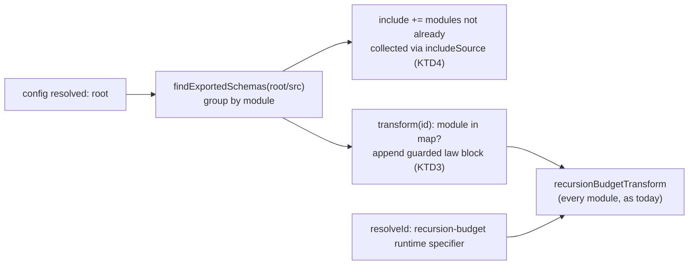

# In-Source Schema Laws - Plan

## Goal Capsule

- **Objective:** A mutation run on this repository spends its test time only on generated schema laws that can observe the mutated code, so the same mutants finish in well under half of today's wall time with every mutant status unchanged.
- **Means:** each schema module's generated laws run in that module's own test entry, replacing the single aggregated law file.
- **Product authority:** the user, in the 2026-09-30 brainstorm session. Only this repository is in scope; the upstream law packages, their other consumers, and the upstream test-placement lint are not.
- **Open blockers:** none.

---

## Product Contract

### Summary

Every package here that generates schema laws runs them from the schema modules themselves instead of from one `schema-laws.test.ts` that imports every schema. A mutant then runs only the laws of schemas whose module imports the mutated file, directly or indirectly, through the related-file selection the Vitest runner already performs. The law set, and every mutation status, stays exactly as it is today.

### Problem Frame

Module-load mutants (code that runs once when a module is evaluated, such as schema declarations and top-level constants) cannot be attributed to individual tests, so each one runs every test file that loads the mutated module. The generated law file imports all 410 exported schemas of `packages/stryker-js/src`, so it loads nearly every module and holds 771 of the package's 1,021 tests. Every module-load mutant therefore ran the whole law suite.

Measured on the dogfood package (2,801 mutants that compile, 8 workers, checker off), the 269 module-load mutants executed 155,186 tests and spent 2,749 s in test bodies, 72% of 3,792 s of test-runner time. The generated laws were the first killer of only 37 of 815 killed mutants in the earlier cold run.

### Requirements

**Law coverage**

- R1. Every exported schema that gets generated laws today keeps exactly the same laws: round-trip identity, encode stability, and recursion laws where they apply, with the same property-run budgets.
- R2. A schema module's generated laws run in that module's own test entry, and only there; a module that imports it never registers them.
- R3. A module that already carries an in-source test block is collected once, with its hand-written block and its generated laws in the same entry.
- R4. Recursion-budget derivation hooks keep working for every recursive schema, as they do under today's plugin.

**Mutation selection**

- R5. A mutant runs only the generated laws of schemas whose module imports the mutated file, directly or indirectly, through the runner's existing related-file selection, with no change to the engine's mutant planning.
- R6. Every mutant status on the dogfood package matches today's result: zero status changes across the full mutant set.

**Removal**

- R7. The aggregated `schema-laws.test.ts` entry and the upstream law-file plugin are removed from every package in this repository that uses them, with no placeholder files, aliases, or dead configuration left behind.
- R8. Documentation in this repository that describes where generated laws live is updated in the same change.

### Key Decisions

- **Exact results are the bar.** Any selection that could change a status is rejected: dropping laws for workflow types changed 5 statuses, and excluding laws from mutation runs changed 55 and lost 26 kills. (session-settled: user-directed — chosen over sampling or predicted statuses: speed must never change a verdict.) Governs R1, R6.
- **This repository only.** The generator and wiring live in this repository; upstream `@systemfsoftware/effect-schema-vite`, its other consumers, and the upstream test-placement lint are left untouched. (session-settled: user-directed — chosen over changing the upstream plugin and lint: the repository under test is the one that matters.) Governs R7.
- **Laws inside each schema module, not a file per module or a tag filter.** Per-module law files on disk measured the same (200 s) but add files; tag-based selection in one entry selects the same tests but still loads every schema module per run. Governs R2, R5.
- **Normal full test runs may get slower.** Each schema module becomes its own test entry; the dogfood package's full suite went from 8.3 s to 11.4 s. Accepted for the mutation-run gain.

### Success Criteria

- On the same 2,801-mutant dogfood set, mutation wall time is at most 40% of today's (measured prototype: 526 s to 202 s) and runner time drops accordingly (3,792 s to 979 s).
- Tests executed by module-load mutants fall by an order of magnitude (prototype: 155,186 to 4,189).

### Scope Boundaries

- **Deferred for later:** a warm test worker that loads modules once, switches call-time mutants in place, and re-evaluates only the mutated module's importers for module-load mutants. After this change, Vitest per-run overhead is 733 of 979 s of runner time, so this is the next lever; it is unmeasured because the runner currently crashes in the dry run with `isolate: false`.
- **Deferred for later:** caching `CompileError` verdicts across runs.
- **Outside this work:** changes to the upstream law packages, their other consumers, or the upstream test-placement lint.

### Dependencies / Assumptions

- Vitest 5.0.1 detects in-source test files by reading the file text from disk for `import.meta.vitest`, but collects any file listed in `test.include` without that check; `import.meta.vitest` is set only in the module Vitest runs as the test entry. Both were confirmed by a prototype that collected the identical 1,021 tests.
- Each mutant run passes the mutated file to Vitest as a related file, and the runner's `related` option defaults to true (`packages/stryker-js-vitest-runner/src/MutantRun.cell.ts`, `packages/stryker-js-vitest-runner/src/VitestRunner.schema.ts`).

### Outstanding Questions

**Resolved in planning**

- The generator lives in the private toolchain package `packages/toolchain/vitest-config` and reuses the upstream discovery and recursion-budget packages (KTD1, KTD2).
- `test/e2e-core` migrates like every other law-generating package (KTD6).

### Sources / Research

- Measurement harness and variants: `packages/stryker-js/.context/proto-laws/` (gitignored, machine-local). Wall times: base 526 s, in-source 202 s, per-module files 200 s, fewer laws 167 s, no laws 134 s; in-source with the `threads` pool 198 s.
- Generated laws only prove acceptance and kill few mutants (pack: schema-laws, law-failure-is-a-codec-defect.md; pack: schema-laws, refusals-beside-generated-laws.md).
- PIT inserts mutants into a warm JVM and filters static-initializer mutants because they do not re-run: https://pitest.org/faq/

---

## Planning Contract

### Key Technical Decisions

- KTD1. **The plugin ships from `@systemfsoftware/vitest-config` under a new `./schema-laws` subpath export.** The package is private and workspace-only, already owns the shared Vite and Vitest config for every consumer, and needs no changeset. A subpath export keeps the discovery parser off the `.` entry that about 46 packages load for every test run. Implements R7 under the "This repository only" Key Decision.
- KTD2. **Reuse `@systemfsoftware/effect-schema-discovery` (`findExportedSchemas`) and `@systemfsoftware/effect-schema-recursion-budget` (`recursionBudgetTransform`, `RECURSION_BUDGET_RUNTIME_SPECIFIER`) as direct dependencies.** Both already resolve in the lockfile under the upstream plugin (discovery 2.0.0, recursion-budget 1.0.2 with its patch). Discovery gets the same schema set upstream uses, which R1 needs, and the recursion hook stays byte-identical, which R4 needs. Both get `catalog:` entries in `pnpm-workspace.yaml`.
- KTD3. **Laws exist only in the Vite transform output, never on disk.** For each discovered module, the plugin's `transform` appends one guarded block that imports `ruleOfSchemas` and `recursionLaws` from `@systemfsoftware/effect-schema-law` and registers laws against the module's own bindings. Three things follow:
  - Stryker instruments and ignores the on-disk file before Vite runs, so no mutant is created in law code. Today's `schema-laws.test.ts` is excluded by `!src/**/*.test.ts` in every `mutate` list, so law code yields zero mutants both before and after.
  - The `in-source-vitest-block` ignorer never sees the block.
  - TypeScript never sees `import.meta.vitest` in a shared source file, so the failure in `docs/solutions/build-errors/in-source-vitest-block-breaks-source-condition-consumers.md` cannot recur.
- KTD4. **The plugin, not each package config, decides which schema modules become test entries.** Vitest 5.0.1 collects an `includeSource` file only when its on-disk text contains `import.meta.vitest`, and the laws are never on disk (KTD3). So the plugin adds every discovered module to the project's `include`, except a module Vitest already collects through `includeSource` because it has a hand-written block. Each module is then collected exactly once (R3). Deciding membership from the text on disk also covers `stryker-js-typescript-checker`, which declares no `includeSource`.
- KTD5. **Law names drop the upstream path-qualified label.** Inside one module the exported name is unique, so the label is the schema name. The prototype confirmed that the law set is otherwise identical: the same 1,021 tests, and only labels changed. Changed test ids invalidate the incremental verdict cache once, which is expected and does not affect statuses.
- KTD6. **All six packages migrate in one change:** `stryker-js`, `stryker-js-cli-contract`, `stryker-js-plugin-interface`, `stryker-js-plugin-runtime`, `stryker-js-typescript-checker` and `test/e2e-core`. Each drops `inlineSchemaTests`, its `src/schema-laws.test.ts` stub and its `@systemfsoftware/effect-schema-vite` devDependency, and the catalog entry goes with the last user. This implements R7, and the repository's total-removal rule (`DEL1` in the agent rules) applies.
- KTD7. **Property budgets are untouched.** `packages/toolchain/vitest-config/lib/property-runs.js` already gives mutation workers `{ runs: 30, seed: 1 }` through `STRYKER_WORKER_DIR`. Generated laws read the same `propertyCheck` wherever they are registered (R1).
- KTD8. **Changeset intents bump `none`.** `scripts/check-changeset.ts` requires an intent for every public package once any `packages/` file changes. No published artifact changes: stubs and vitest configs are not shipped.

### High-Level Technical Design

Directional sketch of the plugin's three hooks. It shows where each decision lands, not the code.

Under mutation the same hooks run inside the sandbox: `root` is the sandbox directory, discovery reads the instrumented sources, and the runner's `related` selection picks the module entries that import the mutated file.

### Assumptions

- Discovery over Stryker-instrumented sandbox sources finds the same schemas as over clean sources, as it must already do for today's aggregate file. The U3 dry-run check below proves it.
- The plugin extends each project's `include` from Vitest's `configureVitest` plugin hook. Vitest 5.0.1 declares the hook (`vitest/dist/config.d.ts:42`) and calls it for every project before test files are globbed. If mutating `project.config.include` there does not take effect, the plugin exports the module list and each package config spreads it into `include`. That keeps the same membership rule at the cost of one extra line per config.

### Risks

- **A module is collected twice or not at all:** laws would run twice, or never. The U2 integration test and the U3 per-package test-count comparison catch both.
- **Recursive schema loses its budget hook:** statuses for every mutant in that schema could change. KTD2 keeps the upstream transform, and the R6 status diff is the final guard.
- **Full-suite slowdown:** each package's normal test run gets slower as schema modules become entries (8.3 s to 11.4 s measured on `stryker-js`). This is accepted by Key Decision.

---

## Implementation Units

- U1. **In-source law plugin in `vitest-config`.** Add the `./schema-laws` export, its typed declaration and the two direct dependencies with catalog entries, implementing KTD1–KTD5 and KTD7.
  - **Requirements:** R1–R5.
  - **Files:** `packages/toolchain/vitest-config/lib/schema-laws.js`, `lib/schema-laws.d.ts`, `package.json`, `pnpm-workspace.yaml`, `pnpm-lock.yaml`.
  - **Patterns:** follow `lib/base.js` plus `lib/base.d.ts` (hand-written JS with a declaration file). The upstream `inlineSchemaTests` hook order is the reference: `enforce: 'pre'`, `resolveId` for the runtime specifier, `configResolved` capturing `root`.
  - **Test expectation:** covered by U2.
- U2. **Integration test for the plugin contract.** Add a `test` script, `vitest.config.ts` and `tests/` to `vitest-config`, mirroring `packages/toolchain/stryker-config`. Run Vitest programmatically on a fixture `src` and assert the collected tests per file.
  - **Requirements:** R1–R4.
  - **Files:** `packages/toolchain/vitest-config/tests/schema-laws.integration.test.ts`, a fixture tree under `packages/toolchain/vitest-config/tests/fixtures/`, `packages/toolchain/vitest-config/vitest.config.ts`, `packages/toolchain/vitest-config/tsconfig.test.json` (so `pnpm typecheck` covers `tests/`, as in `packages/toolchain/stryker-config`), `package.json`.
  - **Test scenarios:**
    - A module exporting two schemas yields exactly those schemas' round-trip and encode-stability laws, under that module's file only.
    - A module that imports that schema module registers no laws of its own (R2).
    - A module with a hand-written `import.meta.vitest` block is collected once, with both its own tests and its generated laws (R3).
    - A recursive schema closed with `Schema.suspend` yields its recursion laws, and they pass (R4).
    - A module exporting no schema is not added as a test entry.
  - This test also pins the two Vitest behaviours the design rests on (Dependencies / Assumptions), so a Vitest upgrade that changes them fails here.
- U3. **Migrate the six packages.** Replace `inlineSchemaTests()` with the new plugin in each `vitest.config.ts`, and delete each `src/schema-laws.test.ts` stub. Drop the `effect-schema-vite` devDependency, then its catalog entry, and regenerate the lockfile (KTD6).
  - **Requirements:** R2, R3, R5, R7.
  - **Files:** `vitest.config.ts`, `src/schema-laws.test.ts` (deleted) and `package.json` in `packages/stryker-js`, `packages/stryker-js-cli-contract`, `packages/stryker-js-plugin-interface`, `packages/stryker-js-plugin-runtime`, `packages/stryker-js-typescript-checker`, `test/e2e-core`, plus `pnpm-workspace.yaml` and `pnpm-lock.yaml`. `packages/stryker-js/vitest.mutation.config.ts` overrides `include`, so the module entries must survive that override. The plugin hook adds them after config resolution, and under the Assumptions fallback this config spreads the list as well.
  - **Approach:** keep the whole-spread shape (`...sharedConfig`, `...sharedConfig.test`) in every config (`docs/solutions/build-errors/vitest-config-narrow-spread-drops-source-condition.md`). Existing `testTimeout` values stay: they are per test, and the report laws they cover keep their cost.
  - **Execution note:** for each package, first record test names per suite with the upstream plugin (`vitest list --json`), then diff after migration. The only allowed difference is the label change from KTD5.
  - **Test expectation:** none beyond U2. The per-package name diff and the R6 status diff are verification, not permanent tests.
- U4. **Documentation and change intent.** Update `docs/adr/0001-cell-architecture-module-taxonomy.md:60` so generated laws run inside each schema module's own test entry. Update the verification step in `docs/solutions/test-failures/stream-schema-must-not-carry-json-rest-records.md:64-65` to run the package suite under CI settings instead of the deleted file. Add `none` intents for every public package (KTD8).
  - **Requirements:** R8.
  - **Files:** the two docs above and `.changeset/*.md`.
  - **Test expectation:** none -- documentation and change-intent metadata only.

Dependency order: U1 → U2 → U3 → U4.

---

## Verification Contract

- **R6, zero status changes:** on the same 2,801 non-`CompileError` mutant ids used by the prototype (`packages/stryker-js/.context/proto-laws/`), run the engine twice with the same build: before (with the upstream plugin at the merge base) and after. Use a forced cold run each time: 8 workers, checker off, incremental off. Diff statuses by mutant id from the JSON reports each finished run writes, not from the stream. Required: zero differences and zero missing ids. The remaining `CompileError` mutants are decided by the TypeScript checker from the mutated source and `tsconfig`, which this change leaves untouched (KTD3), so they are covered by construction.
- **Success Criteria, wall time:** from the same two runs, after-run wall time is at most 40% of the before run. Report runner time and the number of tests executed by module-load mutants for both runs.
- **Dry-run discovery (Assumptions):** in the after run's dry run, the number of generated law tests equals the count from a plain `vitest list` over clean sources.
- **Flake check for generated laws:** run each migrated package's suite several times under CI settings (`env -u AGENT CI=true`), so new seeds are drawn each time.
- **Repository gates:** `pnpm format:check`, `pnpm typecheck`, `pnpm test`, `pnpm check:ci`, and `./scripts/check-changeset.ts $(git merge-base HEAD origin/main)`.
- **Removal (R7):** `git grep -nI -e 'inlineSchemaTests' -e 'effect-schema-vite' -e 'schema-laws.test' -- . ':!*.lock' ':!docs/plans'` returns no matches.

---

## Definition of Done

- U1–U4 have landed on one stack layer from current `main`.
- Every item in the Verification Contract has been run in the parent session, with its command and result recorded.
- R6 holds with zero status differences, and the wall-time criterion is met or its miss is reported with the measured numbers.
