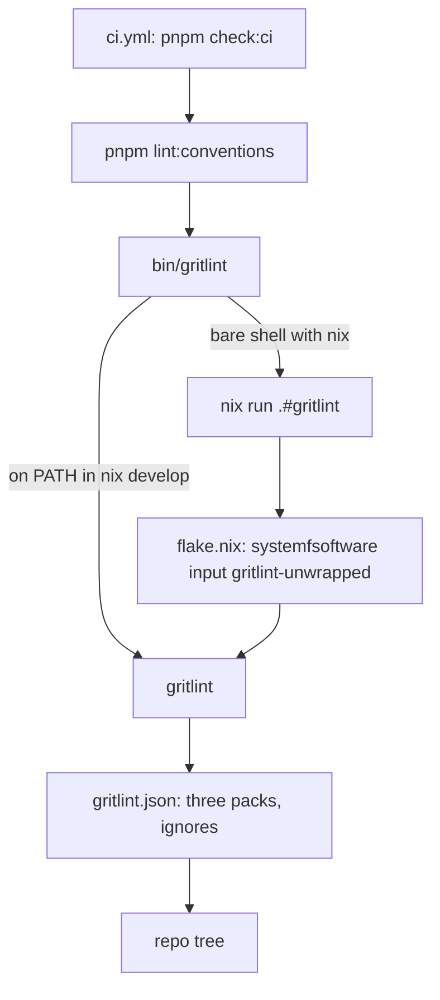

# gritlint conventions gate - Plan

## Goal Capsule

- **Objective:** A pull request that breaks a systemfsoftware file-shape convention (export maps, publish metadata, tsconfig resolution, bundler config) fails `pnpm check:ci` here instead of shipping, and `main` satisfies every such convention today.
- **Means:** gritlint from the systemfsoftware flake, run by a `lint:conventions` step in `check:ci` (KTD1, KTD2).
- **Authority:** the gritlint rule bodies in the pinned systemfsoftware input decide what a violation is; this plan decides which packs run and how each finding is fixed.
- **Stop conditions:** stop if the flake-built gritlint cannot run in CI without editing `.github/workflows/` (read-only per `AGENTS.md`), or if a fix would change what a published package resolves for its consumers.
- **Execution profile:** one branch, one PR; units land as separate commits in U-ID order so each commit's tree passes the gate state it introduces.

---

## Product Contract

### Summary

Wire systemfsoftware's gritlint into this repo through the nix flake, enable the `source-resolution`, `typecheck-build-mode` and `npm-provenance` packs, fix the nine findings they report on real config, and make `check:ci` fail on any new finding.

### Problem Frame

This repo follows systemfsoftware's conventions for export maps, tsconfig conditions and npm publishing, but nothing enforces them: no gritlint config, wrapper or flake input exists, and `gritlint` is not on any PATH the check chain uses. A scan with the upstream packs on `main` (`4ec69700d`) reports 9 findings on real config files, each a convention the repo already intends to follow (for example `packages/stryker-js/tsdown.config.ts` disables `clean`, the setting whose stale output the prior two-config incident in `docs/solutions/build-errors/second-tsdown-config-clobbers-package-exports.md` turned on). Drift is caught today only when it breaks a build, as #136's manifest race did.

### Requirements

**Delivery**

- R1. gritlint runs from this repo's flake, pinned by `flake.lock`, both inside `nix develop` and on a bare shell with nix (CI).
- R2. Running it never reads registry code outside a lockfile.

**Configuration**

- R3. A root `gritlint.json` enables `source-resolution`, `typecheck-build-mode` and `npm-provenance` with this repo's parameters, and ignores trees that hold deliberate test inputs.

**Conformance**

- R4. Every scoped publishable manifest sets `publishConfig.access` to `"public"`.
- R5. Every published subpath in `publishConfig.exports` is an object; the JSON contract documents keep resolving to the same files.
- R6. Every `tsdown.config.ts` obtains `devExports` and `customExports` from the shared helper and leaves `clean` enabled.
- R7. `@systemfsoftware/stryker-js` builds its library and CLI in one tsdown run whose cleaning and manifest write happen once.
- R8. No tsconfig maps a package's own published name through `paths`.

**Gate**

- R9. `pnpm check:ci` fails when gritlint reports a finding.

### Scope Boundaries

- Only the three packs systemfsoftware enables in its own `gritlint.json`; no new rules are authored here.
- `.github/workflows/` stays untouched (read-only).

### Deferred to Follow-Up Work

- Running gritlint in the pre-push hook or lint-staged.
- Enforcing `tsconfig-preset-module-mode`, which selects no files here because the tsconfig presets come from the `@systemfsoftware/tsconfig` npm package, not an in-tree directory.

---

## Planning Contract

### Key Technical Decisions

- KTD1. **Gate the three upstream packs in `check:ci`.** The gate is a `lint:conventions` script that `check:ci` runs alongside its existing steps, so CI picks it up through the one `pnpm check:ci` call in `ci.yml`. (session-settled: user-approved — chosen over leaving the systemfsoftware rules unenforced: the operator signed off on the new gate (GATE1) on 2026-10-01 after being told it adds a CI gate.)
- KTD2. **Deliver gritlint as a flake input built from source.** Add `github:systemfsoftware/systemfsoftware` as a flake input and re-export its gritlint package, reached through a `bin/gritlint` wrapper copied from `bin/dprint`. On CI the wrapper falls back to `nix run .#gritlint`. Measured cost: the compile takes about 35 s on 8 cores with sources present; a cold runner also fetches the Rust toolchain, vendored crates and the ~174 MB monorepo tarball. A locked flake fetches an input only when an evaluated expression references it, so the `.#dprint` and `.#deno` steps other CI jobs run pay nothing as long as only the `gritlint` package and the dev shell reference the input (Robert Hensing, NixOS Discourse topic 52638). (session-settled: user-approved — chosen over an npx/npm-delivered binary: the user called `npx` insecure and approved a flake input like comment-checker's.)
- KTD3. **Re-export `gritlint-unwrapped`, not the bwrap-sandboxed `gritlint`.** Ubuntu 24.04 runners refuse bwrap user namespaces unless a workflow step relaxes AppArmor (upstream's `reusable-checks.yml` has that step), and this repo's workflows are read-only. gritlint's engine never writes or fetches during a scan (its engine contract suite pins this).
- KTD4. **Do not make the input follow this repo's nixpkgs.** Upstream's `cargoHash` is a fixed-output hash over `fetchCargoVendor` from its own locked nixpkgs and `rust-overlay`; following a different nixpkgs can change the vendor tree and fail the build. The cost is a second nixpkgs fetch on cold CI.
- KTD5. **Ignore `**/testResources/**` and `**/__fixtures__/**`.** Those trees hold deliberate non-conforming manifests, tsconfigs and vitest configs that suites feed to the runner and checker; 36 of the 45 raw findings sit there. The npm-provenance pack README directs adopters to list such trees under `ignore`. `repos/**` (read-only subtrees) is ignored too.
- KTD6. **JSON contract documents become a `documents` option on `sourceExports`.** The helper emits each document as `{ "default": "<path>" }` in both export maps, so `stryker-js-cli-contract` and `stryker-js-plugin-interface` drop their hand-assembled `exports` object for `exports: sourceExports(...)`, the shape the 13 other packages use. JSON has no declaration file, so the object carries `default` only; TypeScript resolves the file itself under `resolveJsonModule`, exactly as it does for the bare string today.
- KTD7. **One tsdown config array for `stryker-js`, cleaning on.** tsdown's `buildWithConfigs` runs one memoised `cleanOutDir` over every config before any build starts, and `bundleDone` writes `package.json` once per package after its last bundle. Moving the CLI config into `tsdown.config.ts` as a second array entry therefore lets `clean` stay on, drops `rimraf dist` and the second `tsdown` invocation from the build script, and removes the manifest write window the bin pass used to open.
- KTD8. **Changeset intent `none`.** No published package changes what it resolves or exports for a consumer: `access` is publish metadata, a `{ default }` object resolves the same file as the bare string, and the stryker-js `dist/` contents are unchanged.

### High-Level Technical Design

### Assumptions

- The gritlint at the pinned input reports the same 9 findings that `gritlint-0.1.0` built from systemfsoftware `031205f9` reports today.
- Self-referencing `@systemfsoftware/stryker-js` from its `tests/` tree resolves through the export map's `@systemfsoftware/source` condition once the `paths` entry is gone, as `docs/solutions/build-errors/second-tsdown-config-clobbers-package-exports.md` states.

---

## Implementation Units

### U1. gritlint from the flake

- **Goal:** `./bin/gritlint` runs the flake-built gritlint in `nix develop` and on a bare shell with nix.
- **Requirements:** R1, R2 (KTD2, KTD3, KTD4)
- **Dependencies:** none
- **Files:** `flake.nix`, `flake.lock`, `bin/gritlint`, `gritlint.json`
- **Approach:**
  1. Add the `systemfsoftware` input without `inputs.nixpkgs.follows` (KTD4) and re-export its `gritlint-unwrapped` as this flake's `gritlint` package (KTD3); add it to the dev shell. Reference the input from nothing else, so other packages never fetch it (KTD2).
  2. Lock the new input.
  3. Copy `bin/dprint` to `bin/gritlint` with `TOOL="gritlint"`.
  4. Write `gritlint.json` with the three packs, the source-resolution parameters systemfsoftware uses, `npm-provenance.repositoryUrl` set to `git+https://github.com/systemfsoftware/stryker-js-effect.git`, and the ignores in KTD5.
- **Patterns to follow:** `nix/comment-checker.nix` and the `comment-checker` wiring in `flake.nix`; `bin/dprint`; systemfsoftware's `gritlint.json`.
- **Test expectation:** none -- tooling and config; proven by the smoke checks below.
- **Verification:** on a bare shell `./bin/gritlint check` builds through `nix run` and reports exactly the 9 findings U2-U5 fix; `tsconfig-preset-module-mode` appears under `zero-file rules`, which gritlint reports without failing (an empty tree with every pack enabled exits 0); `nix build --no-link .#dprint` does not fetch the systemfsoftware input; inside `nix develop` gritlint is on PATH.

### U2. Public access on scoped publishable packages

- **Goal:** the `public-access` rule passes.
- **Requirements:** R4
- **Dependencies:** U1
- **Files:** `packages/stryker-js-instrumenter/package.json`, `packages/stryker-js-typescript-checker/package.json`, `packages/stryker-js-vitest-runner/package.json`
- **Approach:** add `"access": "public"` beside the existing `provenance` in each `publishConfig`; tsdown rewrites only `publishConfig.exports`, so the field survives builds.
- **Test expectation:** none -- publish metadata only.
- **Verification:** gritlint no longer reports `npm-provenance/public-access`; a build of each package leaves `access` in place.

### U3. JSON contract documents through `sourceExports`

- **Goal:** `publish-config-exports` and `tsdown-exports` pass for the two contract packages.
- **Requirements:** R5, R6 (KTD6)
- **Dependencies:** U1
- **Files:** `packages/toolchain/tsdown-config/lib/base.js`, `packages/toolchain/tsdown-config/lib/base.d.ts`, `packages/stryker-js-cli-contract/tsdown.config.ts`, `packages/stryker-js-cli-contract/package.json`, `packages/stryker-js-plugin-interface/tsdown.config.ts`, `packages/stryker-js-plugin-interface/package.json`
- **Approach:**
  1. Give `sourceExports` a `documents` option: each listed path is added to the map as `{ default: path }` on both hook invocations, after the entry rewrite, and is never passed through `withSourceFirst`.
  2. Replace both packages' `exports: { devExports, customExports }` objects with `exports: sourceExports({ dtsExt: '.d.mts', documents: [...] })`.
  3. Rebuild both packages so tsdown regenerates `exports` and `publishConfig.exports`; never hand-edit them.
- **Patterns to follow:** the existing `sourceExports` / `withSourceFirst` split.
- **Test expectation:** none -- the helper's only observable output is the generated manifest, which gritlint's `publish-config-exports` and `export-map-order` rules and the contract-document integration suites already check (OP12).
- **Verification:** after a build, both packages' `publishConfig.exports` list every contract document as `{ "default": ... }` and the code subpath unchanged; the contract-document integration suites still pass; gritlint no longer reports either rule for these packages.

### U4. One tsdown run for stryker-js

- **Goal:** `tsdown-exports` passes for `packages/stryker-js/tsdown.config.ts` and the build cleans and writes its manifest once.
- **Requirements:** R6, R7 (KTD7)
- **Dependencies:** U1
- **Files:** `packages/stryker-js/tsdown.config.ts`, `packages/stryker-js/tsdown.bin.config.ts` (deleted), `packages/stryker-js/package.json`, `packages/stryker-js/tsconfig.node.json`, `docs/solutions/build-errors/second-tsdown-config-clobbers-package-exports.md`
- **Approach:**
  1. Move the CLI config into `tsdown.config.ts` as a second entry of a `defineConfig([...])` array, keeping its version assertion, aliases, copy and bundling options; it declares no `exports`.
  2. Remove `clean: false` from both entries.
  3. Set the build script to typecheck then a single `tsdown`.
  4. Drop `tsdown.bin.config.ts` from `tsconfig.node.json` and delete the file.
  5. Rewrite the solution doc's Solution and invariant sections for the one-run shape, since its `rimraf dist && tsdown bin && tsdown lib` recipe becomes stale (DEL1).
- **Execution note:** prove it after a build, not by reading config: the solution doc's invariant 4 applies.
- **Test expectation:** none -- build configuration; the full suite and the smoke checks prove it.
- **Verification:** after `pnpm --filter @systemfsoftware/stryker-js build`, `dist/main.mjs`, `dist/parser.wasm32-wasi.wasm` and every library entry exist, `package.json` `exports` lists `.`, `./config`, `./events`, `./promises`, `./package.json`, `bin.stryker` is unchanged, git shows `package.json` unchanged, and the built CLI prints its version; a stale file planted in `dist/` before the build is gone after it.

### U5. Drop the stryker-js self-name `paths`

- **Goal:** `tsconfig-paths` passes.
- **Requirements:** R8
- **Dependencies:** U1
- **Files:** `packages/stryker-js/tsconfig.test.json`
- **Approach:** delete the `paths` block; `customConditions` already names `@systemfsoftware/source`, so the export map resolves the self-imports to source.
- **Test expectation:** none -- resolution config; typecheck and the type-aware lint prove the self-imports still resolve.
- **Verification:** `tsc -b`, `lint`, `lint:tsgo` and `test` pass for `@systemfsoftware/stryker-js`; gritlint no longer reports the rule.

### U6. Gate `check:ci` on gritlint

- **Goal:** a new finding fails `pnpm check:ci`.
- **Requirements:** R9 (KTD1)
- **Dependencies:** U2, U3, U4, U5
- **Files:** `package.json`, `.changeset/<name>.md`
- **Approach:**
  1. Add a `lint:conventions` script that runs `./bin/gritlint check`, and add `pnpm lint:conventions || s=1` to `check:ci` in the same accumulate-then-exit style.
  2. Add a `none` changeset intent naming every publishable package U2-U5 touched (KTD8).
- **Test expectation:** none -- gate wiring; the negative check below proves it fires.
- **Verification:** `pnpm lint:conventions` exits 0 on the branch; planting `clean: false` in a package's `tsdown.config.ts` makes it and `pnpm check:ci` exit non-zero (CHK1), and removing it restores exit 0.

---

## Verification Contract

| Check            | Command                                                                                                                                                                | Expected                                         |
| ---------------- | ---------------------------------------------------------------------------------------------------------------------------------------------------------------------- | ------------------------------------------------ |
| Conventions      | `./bin/gritlint check`                                                                                                                                                 | exit 0, zero findings                            |
| Gate fires       | plant `clean: false` in a `tsdown.config.ts`, run `pnpm lint:conventions`                                                                                              | exit 1 naming `source-resolution/tsdown-exports` |
| Flake            | `nix build --no-link .#gritlint`                                                                                                                                       | builds                                           |
| stryker-js build | `pnpm --filter @systemfsoftware/stryker-js build`                                                                                                                      | outputs and manifest as in U4                    |
| Full gate        | `pnpm check:ci`                                                                                                                                                        | exit 0                                           |
| Changesets       | `./scripts/check-changeset.ts $(git merge-base HEAD origin/main)`                                                                                                      | exit 0                                           |
| Dogfood pin      | `git grep -F 'catalog:stryker' -- packages/stryker-js/package.json packages/stryker-js-vitest-runner/package.json packages/stryker-js-typescript-checker/package.json` | matches unchanged                                |

## Definition of Done

- Every Verification Contract check above passes on the final commit.
- `git grep -n tsdown.bin.config` returns no matches.
- No scratch config, planted violation, or abandoned approach remains in the diff.
- The PR body records the GATE1 approval and its date (KTD1).
