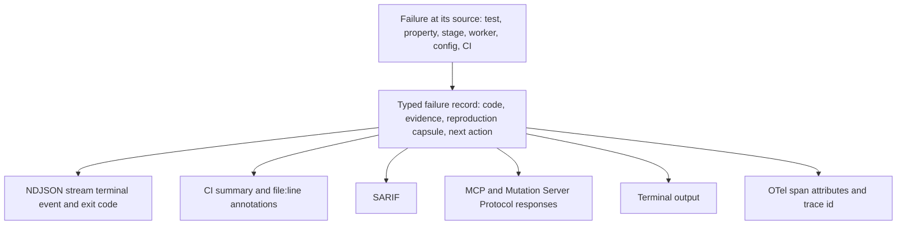
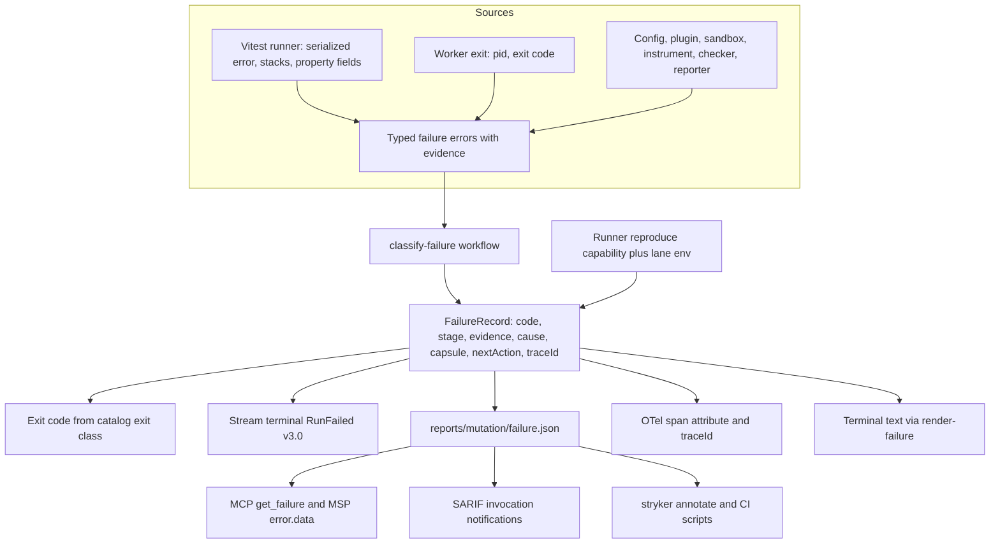
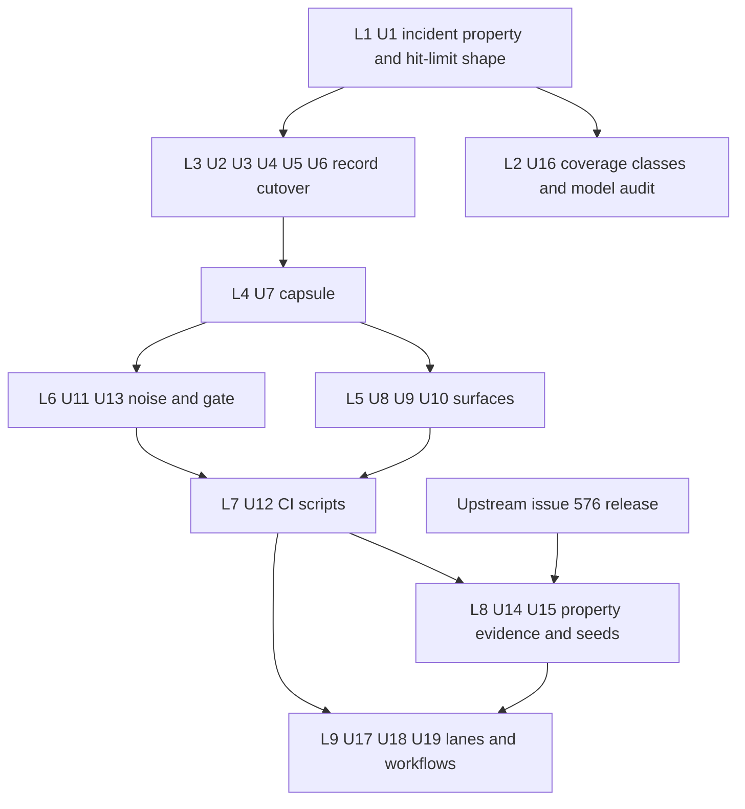

# Agent-Ready Failure Diagnostics - Plan

## Goal Capsule

- **Objective:** When any run in this repository fails, a coding agent with no human help can tell what failed, reproduce it in one step, and land the right fix, using only what the run published. Property tests and mutation lanes can no longer pass on one lane and fail on another.
- **Means:** one typed failure record per failure, rendered by one renderer onto every output surface (KTD1, KTD3); property lanes made sound by identity seeds, coverage classes and a scheduled sweep (KTD12-KTD14, KTD21); a PR lane that runs the mutation preflight and the mutants the change invalidates (KTD16, KTD17).
- **Product authority:** the user, in the 2026-10-01 debug and brainstorm session. Scope covers this repository plus the upstream `@systemfsoftware/vitest` property engine in `systemfsoftware/systemfsoftware`, tracked in systemfsoftware/systemfsoftware#576. Waking or dispatching the agent is not in scope.
- **Execution profile:** Deep. 19 units in three phases, shipped as one `gh stack` with one concern per layer (Sequencing). Phase A needs nothing outside this repository. Phase B needs the #576 release. Phase C edits `.github/workflows/` under the user's authorization for this plan (KTD19).
- **Stop conditions:** if #576 has no release, or its release lacks a property field R3 names, finish Phase A and leave U14 and U15 unstarted; never parse property facts out of message text to fill the gap. If a contract guard or api report demands a bump a unit did not plan, follow the guard; never edit a guard to pass. Workflow edits stay within U17-U19; no other unit touches `.github/workflows/`.
- **Who finishes:** `ce-work` executes every unit, including the Phase C workflow edits. The maintainer (A3) reviews the workflow diff, merges and cuts the releases.
- **Open blockers:** none for Phase A. Phase B waits on the #576 release (R29).

---

## Product Contract

### Summary

Every failure in this repository, from a single property test up to a CI job, becomes one typed record carrying a stable code, its evidence, a one-step reproduction and the next action. The stream, the exit code, the CI summary and annotations, SARIF, the terminal, MCP and the Mutation Server Protocol all render that record. Property tests become sound under any seed: each property runs its own fixed seed in every lane, a random sweep on `main` feeds broken seeds back as regression seeds, and a property that never draws the inputs that decide its output fails for that reason directly. PRs run a mutation preflight and the mutants their change can affect, so lane-only failures and new surviving mutants are caught before merge, while the full mutation run stays on `main`.

### Problem Frame

On 2026-10-01 the Mutation workflow on `main` (run 36935602456, after PR #136 moved to effect 4.0.0 and `@systemfsoftware/vitest` 1.0.0) failed in five of six `stryker-js` shards, each with exit 3 after a dry run of more than a minute. The cause was a test-only defect. Mutation workers run every property at `runs: 30, seed: 1` (`packages/toolchain/vitest-config/lib/property-runs.js`). Seed 1 draws no `Timeout` status for the property at `packages/stryker-js/src/mutation-reporting.service.ts:1043`, so its subject always returned `{}`. The upstream constant-impostor gate then flagged the file as vacuous. PR CI had passed, because it uses random seeds at 100 runs, where this defect surfaces about 3% of the time.

The run published almost nothing an agent could act on. The upstream message printed the frozen output as `[object Object]` and named no seed, no draws and no undrawn input class. Stryker's terminal stream envelope did hold the dry-run failure. It was prefixed with an internal tag, cut at 1024 characters, carried `reason: null`, and suggested reading a report file that a failed dry run never writes. The CI summary script ignored that envelope and reported "infrastructure failure (missing binary, crashed run or timeout)". This contradicts the repository's own recorded learning in `docs/solutions/workflow-issues/mutation-lane-green-while-every-job-failed.md`. The failing shards' artifacts were deleted by the report job minutes later. Every shard repeated the same failing dry run, a warning with no headline fired on every run, and no trace was exported for the lane. Reconstructing the cause took a local reproduction, a seed probe and a reading of upstream library source.

`STRATEGY.md` names CI pipelines and AI coding agents as primary consumers and the NDJSON stream plus structured exit codes as the contract. Grounding found the same gap across the whole failure surface, not only on this path:

- the stream schema can type only plugin-load failures, a CONST-D2 violation;
- dry-run failures reduce to `{name, failureMessage}`;
- worker out-of-memory and crash classifications are flattened into a generic stage error;
- the Mutation Server Protocol drops the exit class, and MCP rerun failures die;
- other existing properties whose deciding inputs are rare are candidates for the same vacuity.

### Actors

- A1. Coding agent: reads published failures, reproduces them, and lands fixes on its own. The primary reader for every requirement here.
- A2. CI pipeline: runs the per-commit, PR, `main` and scheduled lanes and publishes their records.
- A3. Maintainer: merges and cuts upstream releases.
- A4. Upstream property engine: `@systemfsoftware/vitest`, which produces the property failures this repository consumes.

### Key Decisions

- **One typed failure record is the source of truth, every record carries a reproduction capsule, and MCP and the Mutation Server Protocol are projections of it.** A record without a replay leaves the agent reading prose; a replay without a record leaves CI guessing. Governs R1, R2, R3, R4, R5, R8, R9, R10, R11, R12, R13. (session-settled: user-directed — chosen over record-only, reproduction-first, and query-first designs: the agent needs both a typed classification and a one-step replay, and the existing MCP and Mutation Server Protocol surfaces already lose the failure class.)
- **The primary reader is an agent that closes the loop alone.** Diagnostics are judged by whether an agent can classify, reproduce and fix a failure without a human or log digging. Governs R3, R4, R5, R9. (session-settled: user-directed — chosen over agent triage with human approval, human-first summaries, and equal weighting: the user wants failures fixed without involvement.)
- **Scope is the whole failure surface, including the upstream property engine.** Governs R21, R29. (session-settled: user-directed — chosen over limiting this work to one of run-failure diagnostics, property soundness, or the upstream message: leave nothing behind.)
- **Seeds follow the Hypothesis split: a fixed seed per property in every per-commit lane, random exploration on a schedule.** A seed-dependent property is a broken property; deterministic per-commit lanes make a red build mean "this change broke it", and the mutation lane needs reproducible verdicts. Governs R16, R17, R18. (session-settled: user-directed — chosen over random PR seeds with coverage checks only, and over adding multi-seed sweeps to every PR: matches Hypothesis's documented `derandomize` and `ci` profile design.)
- **PRs run a mutation preflight plus the mutants their change can affect; the full run stays on `main`.** Measured full runs cost 83-95 runner-minutes, and reusing `main`'s verdicts limits a PR to the mutants its change affects. `CONSTITUTION.md` CONST-T12 defines the PR set as change-relevant mutants, which the verdict cache's reuse refusal already computes; changed lines alone would miss mutants whose covering tests or imports changed. Governs R23, R24, R25, R27. (session-settled: user-directed — chosen over preflight-only and seed-split-only PR lanes, after the user rejected full mutation on PRs for cost: scoped runs reusing `main`'s verdicts are cheap.)
- **Automated actors never suppress surviving mutants; an equivalent mutant is resolved by refactoring the code so the mutant cannot exist**, which is CONST-T12's "deleting the dead branch it exploits". Governs R5, R26. (session-settled: user-directed — chosen over agent suppression backed by machine proof and agent suppression with human review: equivalent mutants signal redundant code.)
- **Hit-limit timeout reasons have one canonical shape, `Hit limit reached (count/limit)`.** Governs R22. (session-settled: user-directed — chosen over the prefix-only rule production uses today: the full shape is what the decoder and the Vitest runner already produce.)
- **Waking or dispatching the agent is outside this work.** This work guarantees that the published record is sufficient; something else decides when an agent reads it. (session-settled: user-directed — chosen over CI-started agents and published-for-pickup triggers: not the responsibility of this work.)
- **This is a breaking cutover.** The stream schema, exit codes, envelope and every consumer move together with no compatibility path, per `AGENTS.md` BREAK-1 and `CONSTITUTION.md` CONST-D2. Governs R2, R8.

### Requirements



**Typed failure record**

- R1. Every failure that ends or degrades a run is described by one typed record: argument parsing, configuration, plugin load, sandbox preparation, instrumentation, checker, dry run, worker crash or out-of-memory, mutant-phase infrastructure, reporter, interruption, and every CI-level failure.
- R2. Each record carries a stable code from one closed, documented catalog; prose is a rendering of the record and never the only carrier of a fact.
- R3. Each record carries its evidence: the failing stage, the failing test's identity with file and line where one exists, and the full cause chain without truncation. For property failures it also carries the seed, run count, counterexample or structurally rendered frozen output, and the declared input classes that were never drawn.
- R4. Each record carries a reproduction capsule: one local command, including seed, lane budget and environment, that reproduces the failure. A failure that cannot replay (out-of-memory, missing binary) says so and names the evidence that stands in for the replay.
- R5. Each record names its next action from a closed set that distinguishes at least fixing a test, fixing code, adding a test to kill a survivor, refactoring away an equivalent mutant, fixing configuration, and retrying infrastructure.
- R6. No record or rendering contains internal type tags, framework prefixes, or placeholder text such as `[object Object]`, "Unknown failure", or remediation that does not apply to the failure at hand.
- R7. A failure the catalog does not classify carries a dedicated code that marks it as a catalog gap, with its full cause attached.

**Surfaces projected from the record**

- R8. The NDJSON stream emits the full record as its terminal failure event, and the exit code derives from the record's class, with a code of its own for a failing baseline or dry run.
- R9. The CI summary and annotations render from the record, including a file:line annotation for a failing test. CI reports infrastructure failure only when a record says so, and reports a run that produced no record as exactly that.
- R10. SARIF output includes run-failure records alongside surviving mutants, and CI uploads it.
- R11. MCP and Mutation Server Protocol responses carry the same record, with no loss of class and no crash on engine failure.
- R12. Human terminal output renders from the record.
- R13. Mutation lanes export traces the way the e2e lane does, OTel spans carry the record's code, and the record carries its trace id, so `AGENTS.md` OBS-1 applies to mutation failures.
- R14. Evidence a failed run produced, including its stream and record, stays downloadable after the run ends.
- R15. A warning fires only when its condition holds, and a failing run's log carries no lines that explain nothing about the run.

**Property-test soundness**

- R16. Each property runs under its own fixed seed derived from its identity, the same in every per-commit lane: local, PR CI and mutation workers. No seed is shared across all properties.
- R17. A scheduled job on `main` runs properties under random seeds; a seed that breaks a property appears in the sweep's record, and the fix for it commits that seed as a regression seed that every lane replays from then on.
- R18. Each property declares the input classes that decide its output, and a class never drawn fails the property directly under any seed, naming the class.
- R19. The vacuity check keeps judging the draws the property actually ran, and its verdict reports the evidence of every property that shares the subject.
- R20. Property failures (refuted, vacuous, under-covered, non-boolean) arrive as structured data attributed to the property that owns them, never as a file-level prose blob.
- R21. Every existing property in this repository meets R16-R20, and those the new checks flag are fixed, including test models that reimplement production rules.
- R22. Production, the Vitest runner, and every test model classify hit-limit timeouts by the canonical `Hit limit reached (count/limit)` shape.

**PR and main lanes**

- R23. Every PR runs one dry-run preflight under mutation-worker conditions before any mutant runs, and a preflight failure stops the lane with its record.
- R24. A PR evaluates exactly the mutants whose reused `main` verdict its change invalidates and reuses every other verdict. A dependency-only PR runs the preflight only, and a PR lane that evaluates no mutants reports that outcome explicitly rather than a pass.
- R25. A new surviving mutant among those the PR evaluated blocks the PR and arrives as a record naming the mutant, its location, its covering tests and its next action.
- R26. No automated actor suppresses a surviving mutant.
- R27. `main` keeps the full mutation run, and its failures and the scheduled sweep's failures publish records of the same shape as PR failures.
- R28. A mutation run performs its dry run once, not once per shard.

**Upstream property engine**

- R29. The upstream `@systemfsoftware/vitest` changes that R3, R4 and R16-R20 depend on ship as an upstream release, tracked in systemfsoftware/systemfsoftware#576, and this repository consumes that release.

### Key Flows

- F1. Property defect caught on a PR
  - **Trigger:** A PR changes code or dependencies so that a property becomes vacuous or under-covered.
  - **Actors:** A1, A2
  - **Steps:** PR CI runs the property under its fixed seed; it fails on an undrawn class or the vacuity check; CI publishes the record; the agent runs the capsule, sees the same failure, and fixes the property or the code.
  - **Outcome:** The defect never reaches `main`.
  - **Covered by:** R3, R4, R16, R18, R19, R20
- F2. Preflight failure on a PR
  - **Trigger:** A test fails only under mutation-worker conditions.
  - **Actors:** A1, A2
  - **Steps:** The preflight runs once and fails; the lane stops; the summary shows the record's code, the failing test at file:line, and the capsule.
  - **Outcome:** No shard time is spent, and nothing is labelled infrastructure.
  - **Covered by:** R8, R9, R23, R28
- F3. New survivor on a PR
  - **Trigger:** Changed code introduces a mutant no test kills.
  - **Actors:** A1, A2
  - **Steps:** PR mutation reports the survivor; the PR is blocked; the record names the action: add a killing test, or refactor away if the mutant is equivalent.
  - **Outcome:** The agent unblocks the PR without suppressing anything.
  - **Covered by:** R5, R24, R25, R26
- F4. Sweep finds a breaking seed on `main`
  - **Trigger:** The scheduled random run breaks a property.
  - **Actors:** A2, A1
  - **Steps:** The sweep publishes the record with the breaking seed; the agent's fix commits that seed, and every lane replays it from then on.
  - **Outcome:** A found counterexample can never pass silently again.
  - **Covered by:** R17, R27

### Acceptance Examples

- AE1. **Covers R16, R18, R20.** Given the tree at `4ec69700d` with the timeout-fields property unchanged, when PR CI runs, then the property fails on the PR under its own seed, naming the never-drawn `Timeout` class, and the record's capsule reproduces it locally.
- AE2. **Covers R8, R9, R23.** Given a test that fails only under mutation-worker conditions, when the preflight runs, then the exit code is the baseline-failure code and the CI summary shows the test at file:line with the capsule, and the word "infrastructure" appears nowhere.
- AE3. **Covers R1, R4, R5.** Given a worker killed for out-of-memory during the mutant phase, when the run ends, then the record's code is the out-of-memory class, the capsule states that the failure does not replay and names the memory evidence, and the next action is infrastructure.
- AE4. **Covers R5, R25, R26.** Given a survivor among a PR's evaluated mutants that no test can kill, when the PR lane reports it, then the next action is refactoring the code away, and no suppression is added by any automated actor.
- AE5. **Covers R15.** Given a configuration with `warnings.unknownOptions` enabled and no unknown options, when a run starts, then no unknown-options warning is printed.
- AE6. **Covers R24.** Given a PR that only bumps a dependency, when PR CI runs, then the preflight runs, no mutants run, and the lane reports that it evaluated none.
- AE7. **Covers R7.** Given a failure no catalog entry classifies, when it occurs, then the record carries the catalog-gap code with the full cause, not free text with a null reason.

### Success Criteria

- Replaying the 2026-10-01 incident, an agent given only the published record identifies the cause and produces the fix without reading raw logs or reading library source.
- No rendering of any record contains the strings `[object Object]`, "Unknown failure", or an internal type tag.
- Every catalog code has a documented meaning, next action and capsule rule.
- A PR whose change invalidates no reused verdict adds only the preflight to its CI time, and the preflight completes in a few minutes, in line with today's roughly one-minute dry run plus job setup.

### Scope Boundaries

- Which files are mutated, score thresholds, and verdict semantics are unchanged.
- Waking or dispatching an agent when a record is published is out of scope.
- No automated route to removing a mutant is added; the existing mutant-set policy rules are unchanged.
- Full mutation on PRs is out of scope.

### Dependencies / Assumptions

- The upstream release (R29) lands before the repository parts that consume structured property failures, per-property seeds and recorded-seed replay.
- GitHub Actions lets PR runs restore caches created on the base branch and forbids PR runs from writing the default branch's scope (GitHub docs, "Restrictions for accessing a cache"), so a PR can reuse `main`'s verdicts but never change them.
- The verdict cache refuses all reuse when a mutant's closure or run-inputs digest changes (`packages/stryker-js/src/incremental-diff.workflow.ts`), which is why dependency-only PRs run the preflight only.
- Stryker already has a dry-run-only mode (`packages/stryker-js/src/bin/cli-command.ts`).

### Sources / Research

- Incident: CI run 36935602456; local reproduction with `STRYKER_WORKER_DIR` set; a seed probe showing seed 1 draws zero `Timeout` statuses in 30 runs while seeds 2-10 draw 1-7.
- Failure path in this repository: `packages/stryker-js-cli-contract/src/run-event.schema.ts` (RunFailed reason), `packages/stryker-js/src/run-event-stream.service.ts`, `packages/stryker-js/src/reporting/run-failure.ts`, `packages/stryker-js/src/bin/main.ts` (1024-character limit), `packages/stryker-js/src/interpret-dry-run-observation.workflow.ts`, `packages/stryker-js/src/Checker/checker-pool.handle.ts`, `packages/stryker-js/src/Serve/msp.schema.ts`, `packages/stryker-js/src/Mcp/mcp-server.cell.ts`, `packages/stryker-js/src/run/validate-options-admission.workflow.ts`, `packages/stryker-js/src/sarif-report.workflow.ts` (existing SARIF reporter, not enabled in this repository).
- CI: `.github/workflows/mutation.yml`, `.github/workflows/ci.yml`, `scripts/mutation-job.ts`, `scripts/lib/mutation-plan.ts`.
- Property lanes: `packages/toolchain/vitest-config/lib/property-runs.js`, `packages/toolchain/vitest-config/lib/base.js`, `packages/toolchain/vitest-config/lib/schema-laws.js`, `packages/stryker-js-plugin-interface/src/mutant-timeout-reason.schema.ts`, `packages/stryker-js-vitest-runner/src/__tests__/interpret-vitest-mutant-run.workflow.property.test.ts`, `packages/stryker-js-instrumenter/src/__tests__/mutant-set-policy.workflow.property.test.ts`.
- Upstream: `systemfsoftware/systemfsoftware` `packages/runner/vitest/src/internal/property/` (`engine.ts`, `impostor.ts`, `failure-record.ts`).
- Prior work: `docs/plans/2026-09-29-0427-feat-state-of-the-art-mutation-testing-plan.md` (R29 gate on new survivors, R30 SARIF, R35 Mutation Server Protocol, R40 and KTD19 OTel); `docs/plans/2026-09-25-0337-chore-systemfsoftware-latest-packages-plan.md` (KTD7 impostor gate); `docs/solutions/workflow-issues/mutation-lane-green-while-every-job-failed.md`; `docs/solutions/workflow-issues/exit-codes-through-runtime-teardown.md`; `docs/solutions/test-failures/stream-schema-must-not-carry-json-rest-records.md`; `docs/solutions/tooling-decisions/verdict-cache-content-keyed-reuse.md`.
- External: rustc JSON diagnostics (https://doc.rust-lang.org/stable/rustc/json.html); SARIF 2.1.0; OpenTelemetry CI/CD semantic conventions (https://opentelemetry.io/docs/specs/semconv/cicd/cicd-spans/); Hypothesis settings, `derandomize` and the `ci` profile (https://hypothesis.readthedocs.io/en/latest/_modules/hypothesis/_settings.html); Nelson Elhage, two kinds of testing (https://blog.nelhage.com/post/two-kinds-of-testing/); fast-check seed and path replay (https://fast-check.dev/docs/tutorials/quick-start/read-test-reports/); proptest failure persistence (https://proptest-rs.github.io/proptest/proptest/failure-persistence.html); cargo-mutants exit codes (https://mutants.rs/exit-codes.html).

---

## Planning Contract

### Key Technical Decisions

**Record and catalog**

- KTD1. **The record is a tagged union whose `_tag` is its catalog code.** Every variant carries `stage`, `cause`, `capsule`, `nextAction` and an optional `traceId`, plus evidence fields of its own. A `code` string beside a free-form evidence blob is the CONST-D2 violation this work removes. Lives in `packages/stryker-js-cli-contract/src/failure-record.schema.ts`. Governs R1, R2, R3.
- KTD2. **The catalog is a total map `Record<FailureCode, CatalogEntry>`, generated to `packages/stryker-js-cli-contract/contract/failure-catalog.json`.** An entry holds meaning, exit class, next action and capsule rule, so the compiler refuses an undocumented code. `scripts/guards/check-contract-versions.ts` gains a `failure-catalog` kind classified like `stock-catalog.json`: a removed or renamed code demands a matching bump. Codes are PascalCase names such as `BaselineTestsFailed`; agents read names, and the guard gives them the stability rustc gets from numbers. Governs R2, R7.
- KTD3. **One renderer in the contract package writes every prose form** (terminal text, GitHub summary markdown, workflow annotations, SARIF notification text) from the record. No surface writes its own failure prose. Governs R6, R9, R12.
- KTD4. **`RunFailed` becomes `{schemaVersion: '3.0', code, record}`.** The `error`, `remediation` and `reason` fields are removed; plugin-load reasons become the evidence of `PluginLoadFailed`. `boundedErrorText` and its 1024-character limit in `packages/stryker-js/src/bin/main.ts` are deleted; the record is never truncated. Governs R3, R8.
- KTD5. **Exit codes derive from the record's catalog exit class, with one new class.** `BaselineFailed = 5` joins `ExitClass` and the `ExitCodeFromClass` code maps in `packages/stryker-js-plugin-interface/src/ExitClass.schema.ts`; `CatalogGap` maps to `InternalError = 4`, ending the generic fallback that shared code 1 with `VerdictFail`. When a cause holds several classes, precedence is `InternalError`, `RuntimeError`, `BaselineFailed`, `ConfigError`, `VerdictFail`, held as a total map over `ExitClass` so a future class cannot be skipped (today's `PRECEDENCE` array in `packages/stryker-js/src/conclude-run.ts` is not exhaustive). Publishing stays the single `RunExit` path (`docs/solutions/workflow-issues/exit-codes-through-runtime-teardown.md`). Governs R7, R8.
- KTD9. **`nextAction` is `{primary, otherwise}` over a closed set:** `fixTest`, `fixCode`, `killSurvivor`, `refactorAwayEquivalent`, `fixConfiguration`, `retryInfrastructure`, `reportToolDefect`. A survivor is `killSurvivor` otherwise `refactorAwayEquivalent`, because the tool cannot prove equivalence and the agent decides. A failing baseline test is `fixCode` otherwise `fixTest`; a vacuous or under-covered property is `fixTest`. Governs R5, R26.

| Code                       | Stage        | Exit     | Next action (primary / otherwise)      | Capsule         |
| -------------------------- | ------------ | -------- | -------------------------------------- | --------------- |
| `ArgumentsInvalid`         | cli          | 2        | fixConfiguration                       | replays         |
| `ConfigInvalid`            | config       | 2        | fixConfiguration                       | replays         |
| `PluginLoadFailed`         | config       | 2        | fixConfiguration                       | replays         |
| `PluginImportFailed`       | config       | 4        | reportToolDefect                       | replays         |
| `SandboxPreparationFailed` | prepare      | 3        | fixConfiguration / retryInfrastructure | replays         |
| `InstrumentationFailed`    | instrument   | 3        | reportToolDefect                       | replays         |
| `CheckerFailed`            | check        | 3        | fixConfiguration / reportToolDefect    | replays         |
| `BaselineTestsFailed`      | dryRun       | 5        | fixCode / fixTest                      | replays         |
| `BaselineTimedOut`         | dryRun       | 5        | fixTest / retryInfrastructure          | replays         |
| `BaselineErrored`          | dryRun       | 5        | fixTest                                | replays         |
| `BaselineFoundNoTests`     | dryRun       | 2        | fixConfiguration                       | replays         |
| `WorkerOutOfMemory`        | mutationTest | 3        | retryInfrastructure                    | does not replay |
| `WorkerCrashed`            | mutationTest | 3        | retryInfrastructure / reportToolDefect | does not replay |
| `ReporterFailed`           | report       | 3        | fixConfiguration                       | replays         |
| `RunInterrupted`           | any          | 130      | retryInfrastructure                    | does not replay |
| `SurvivingMutant`          | gate         | 1        | killSurvivor / refactorAwayEquivalent  | replays         |
| `CatalogGap`               | any          | 4        | reportToolDefect                       | replays         |
| `RecordMissing`            | ci           | observed | reportToolDefect                       | does not replay |
| `JobTimedOut`              | ci           | observed | retryInfrastructure                    | does not replay |
| `BinaryMissing`            | ci           | observed | fixConfiguration                       | does not replay |

The table is the starting catalog; U2 owns the final list. Property failures are evidence inside `BaselineTestsFailed`, not codes of their own.

**Sources, evidence and capsule**

- KTD6. **Failure sources raise typed errors carrying evidence, and `StageError{reason: string}` is removed.** A pure `classify-failure.workflow.ts` maps the run's `Cause` to a record with `Match.tag`; anything unmatched becomes `CatalogGap` with the full cause chain. It replaces the prototype traversal and `Cause.pretty` in `packages/stryker-js/src/conclude-run.ts`, and `failureTextOf`, `'Unknown failure'` and `DEFAULT_REMEDIATION` in `packages/stryker-js/src/reporting/run-failure.ts`. Out-of-memory and crash errors keep `{pid, exitCode, workerKind}` instead of the flattening in `mapMutationTestCause`. Governs R1, R3, R7.
- KTD7. **The runner reads Vitest's serialized error, not only its `message`.** `packages/stryker-js-vitest-runner/src/drivers/vitest-node.ts` keeps `stack`, `stacks` (file, line, column), `name` and `cause`; the first frame in project source becomes `location`. The failed `TestResult` gains `location` and `stack`, replacing `startPosition`, which no producer sets. Property evidence is decoded by Schema from the serialized error's own fields once #576 adds them, never parsed from message text. Governs R3, R20.
- KTD8. **The test-runner plugin supplies the capsule's command; Stryker adds the lane environment.** The plugin interface gains an optional `reproduce(failedTest)` capability returning argv, because only the runner knows its CLI. Stryker adds `cwd`, the `STRYKER_WORKER_DIR` marker that selects the mutation-worker property budget, and, for property failures, the replay variable #576 defines. Without a runner capsule the command is `stryker run --dryRunOnly` with the run's configuration. Non-replayable codes carry `DoesNotReplay{why, standIn}`. Environment is a fixed-field array of `{name, value}` (`docs/solutions/test-failures/stream-schema-must-not-carry-json-rest-records.md`). Governs R4.
- KTD10. **The record is written to `reports/mutation/failure.json` and registered in `strykerOutputFilesOf`** (`packages/stryker-js/src/stryker-outputs.ts`), like `reproducers.json`. It is the durable copy MCP, CI and SARIF read, and stays out of verdict-cache digests. Governs R11, R14.
- KTD11. **Deno scripts import the record module from source.** `failure-record.schema.ts`, `failure-catalog.ts` and `render-failure.ts` import only `effect` and each other, so `scripts/` reaches them by relative path through the `effect` mapping in `scripts/deno.json`. CI-level failures become records of the same catalog, built by the script. If Deno rejects the `.js` relative specifiers, the fix is Deno configuration, never a second copy of the schema. Governs R1, R9.

**Surfaces**

- KTD22. **OTel spans carry `stryker.failure.code`, and the record carries `traceId` read from the current span at conclusion.** The truncated `stryker.run.error` attribute leaves `packages/stryker-js-cli-contract/src/SpanTaxonomy.ts`, which the span-taxonomy guard classifies as breaking. Governs R13.
- KTD23. **SARIF carries run failures as `runs[0].invocations[0]`** with `executionSuccessful: false` and one `toolExecutionNotifications` entry per record (`descriptor.id` is the code; the location comes from test evidence). The conclusion path writes it when the `sarif` reporter is configured, because a failed run never emits the `mutationTestReportReady` event the reporter listens to. Governs R10.
- KTD24. **The Mutation Server Protocol puts the record in `error.data`, and MCP returns it.** `packages/stryker-js/src/Serve/Serve.cell.ts` fills the existing optional `JsonRpcErrorObject.data`. `packages/stryker-js/src/Mcp/mcp-server.cell.ts` replaces `Effect.orDie` in `runRestricted` with a typed refusal carrying the record, and MCP gains a `get_failure` tool that reads `reports/mutation/failure.json`. Governs R11.

**Property lanes**

- KTD12. **Every property gets a seed derived from its identity in every per-commit lane, provided by #576.** `packages/toolchain/vitest-config/lib/property-runs.js` stops passing `seed: 1` and requests derandomized runs. Budgets still differ (100 runs normally, 30 in mutation workers); under one seed the worker draws are a prefix of the CI draws, and the PR preflight (KTD16) runs the 30-run budget before merge. Governs R16.
- KTD13. **Regression seeds live in `packages/toolchain/vitest-config/property-seeds.json`**, keyed by the property identity #576 defines and carried through the existing `@systemfsoftware/vitest:property-check` provide key (`packages/toolchain/vitest-config/lib/base.js:201`). The store's format is #576's. Governs R17.
- KTD14. **Coverage classes use the fork's existing `cover` option.** `cover` already exists in `@systemfsoftware/vitest` 1.0.0, so properties can declare classes before #576; #576 only makes the under-coverage failure structured. Governs R18, R21.
- KTD15. **Hit-limit reasons are classified by decoding `HitLimitReason`.** The check on `HitLimitReasonText` becomes the full `Hit limit reached (count/limit)` pattern, `timeoutKindIn` in `packages/stryker-js/src/mutation-reporting.service.ts` decodes instead of prefix-matching, and the runner test pins the full shape. Governs R22.
- KTD21. **The sweep runs daily on `main` at 1000 runs per property under random seeds**, in one job capped at 60 minutes, publishing one record per broken property with its seed. 1000 runs is the budget per-commit CI dropped for cost in PR #135; a nightly job is where Hypothesis places randomized exploration. Governs R17, R27.

**Lanes**

- KTD16. **The PR lane runs `stryker run --dryRunOnly` as its preflight, then an incremental run that restores `main`'s `.stryker-incremental` cache read-only.** The dry run already executes in a spawned worker with `STRYKER_WORKER_DIR` set (`packages/stryker-js/src/drivers/node.ts:63`), so the preflight runs under mutation-worker conditions by construction. "Evaluated none" is read from the stream's `reuse` line (`ran === 0`). Governs R23, R24.
- KTD17. **A new survivor is a survivor among the mutants the PR ran that is absent from `main`'s survivor baseline.** After merging its report, `main`'s lane writes that baseline with `stryker gate --baseline <file> --update-baseline` and uploads it as the `mutation-survivor-baseline` artifact; the PR restores the latest one from `main` and runs `stryker gate --baseline` against it, never passing `--update-baseline`. The gate's refusal emits `SurvivingMutant` records, and its remediation line in `packages/stryker-js/src/run-request.cell.ts:347-348`, which tells the reader to accept survivors with `--update-baseline`, is replaced by the record's next action. The flag itself stays for the maintainer. Governs R25, R26.
- KTD18. **`main` runs the dry run once.** A preflight job runs `--dryRunOnly` and publishes its dry-run coverage; shards restore it through `incrementalSources`, so `dryRunReuse` returns `DryRunCoverageReused`. This relies on the run-inputs and closure digests being the same for every shard, which is inferred from `scopeOptionKeys` in `packages/stryker-js/src/verdict-semantics.ts` and proved in U17 before the workflow change lands. Governs R28.
- KTD19. **U17-U19 edit `.github/workflows/` directly; no other unit does.** `AGENTS.md` lists the directory as read-only for agents; the user lifted that for this plan's lane units, so the PR carries the full YAML diff for review instead of a patch for someone else to apply. The edits stay limited to the lane changes R10, R13, R14, R17 and R23-R28 name. Governs R10, R13, R14, R17, R23-R28. (session-settled: user-directed — chosen over maintainer-applied patches in the PR body: the agent finishes the lanes end to end and the workflow diff is reviewed in the PR.)
- KTD20. **A failed run's shard artifacts and record are kept 30 days, and the report job deletes per-shard artifacts only when every shard succeeded.** Today shard parts keep 1 day and are deleted after the merge. 30 days matches the timings record. Governs R14.

### High-Level Technical Design

Directional, not an implementation specification.



```ts
// Directional shape of failure-record.schema.ts
const Capsule = S.Union([
  S.TaggedStruct('Replays', { cwd: S.String, argv: S.NonEmptyArray(S.String), env: S.Array(EnvEntry) }),
  S.TaggedStruct('DoesNotReplay', { why: NonReplayReason, standIn: S.String }),
])
const Shared = {
  stage: Stage,
  cause: S.Array(CauseNode),
  capsule: Capsule,
  nextAction: NextAction,
  traceId: S.optional(TraceId),
}
export const FailureRecord = S.Union([
  S.TaggedStruct('BaselineTestsFailed', { ...Shared, tests: S.NonEmptyArray(FailedTestEvidence) }),
  S.TaggedStruct('WorkerOutOfMemory', { ...Shared, pid: S.Int, exitCode: S.Int, workerKind: WorkerKind }),
  S.TaggedStruct('CatalogGap', { ...Shared }),
  // one variant per catalog code
])
```

### Sequencing

Stack layers, bottom first. Each layer passes the Definition of Done on its own.



- L1 lands first because `main`'s mutation lane stays red until the incident property is sound.
- U2-U6 share one layer: changing `RunFailed` breaks every producer and consumer, and BREAK-1 moves them together.
- The dogfood lane runs the published CLI (`AGENTS.md` START-6), so CLI-side surface changes reach `main`'s mutation lane only after a release. In-PR proof of CLI behavior comes from integration tests and the e2e lane.

### Assumptions Under Challenge

- **Vitest keeps a thrown error's own fields across the worker boundary.** KTD7 and U14 depend on it. U5 checks it against a real Vitest run before U14 builds on it; if the fields are dropped, #576 must put them in a channel Vitest keeps, and U14 waits.
- **Shards accept one preflight's dry-run coverage.** KTD18 depends on it. U17 proves it with two shards reusing one coverage file; if a digest differs per shard, U17 fixes the digest inputs or R28 is reported unmet.
- **The PR mutation set stays small.** KTD16 runs the PR's mutants unsharded. A change to a widely imported module invalidates many verdicts; U18 measures the worst recent PR and shards the PR run if it exceeds the 15-minute target set by `TARGET_SECONDS` in `.github/workflows/mutation.yml`.

### System-Wide Impact

- Contract documents `stream.schema.json`, `span-taxonomy.json` and the new `failure-catalog.json` change, and the contract-version guard demands bumps. Changesets: `@systemfsoftware/stryker-js-cli-contract` minor while 0.x; `@systemfsoftware/stryker-js`, `@systemfsoftware/stryker-js-plugin-interface` and `@systemfsoftware/stryker-js-vitest-runner` major (BREAK-1).
- api-extractor reports under `packages/*/etc/*.api.md` change; regenerate with `api:update` and export every type a public signature reaches (`docs/solutions/build-errors/api-check-alias-rotation-not-stable-across-invocations.md`).
- Consumers of `RunFailed` that move in U6: `packages/stryker-js/src/run-event-stream.service.ts`, `packages/stryker-js/src/frame-run-event.workflow.ts`, `packages/stryker-js/src/plugin-load-report.service.ts`, `test/e2e/tests/failing-run.e2e.test.ts`, `test/e2e/tests/__fixtures__/machine-stream.fixture.ts`, `packages/stryker-js-cli-contract/src/run-event-wire.schema.ts`, and `scripts/lib/mutation-plan.ts`.
- Plugin worker bundles must keep their `deps.onlyImport` closure (`AGENTS.md` PLUG-1) when the runner adds the `reproduce` capability.

## Implementation Units

| U-ID | Title                                            | Key files                                                                                                                           | Depends on       |
| ---- | ------------------------------------------------ | ----------------------------------------------------------------------------------------------------------------------------------- | ---------------- |
| U1   | Incident property and canonical hit-limit shape  | `packages/stryker-js/src/mutation-reporting.service.ts`, `packages/stryker-js-plugin-interface/src/mutant-timeout-reason.schema.ts` | none             |
| U2   | Failure record schema and catalog                | `packages/stryker-js-cli-contract/src/failure-record.schema.ts`, `failure-catalog.ts`                                               | U1               |
| U3   | One failure renderer                             | `packages/stryker-js-cli-contract/src/render-failure.ts`                                                                            | U2               |
| U4   | Typed failure sources                            | `packages/stryker-js/src/Run.schema.ts`, `run/dry-run.cell.ts`, `run/mutation-test.cell.ts`                                         | U2               |
| U5   | Runner failure evidence                          | `packages/stryker-js-vitest-runner/src/drivers/vitest-node.ts`, `packages/stryker-js-plugin-interface/src/TestRunner.schema.ts`     | U2               |
| U6   | Classification, exit codes, stream cutover       | `packages/stryker-js/src/classify-failure.workflow.ts`, `conclude-run.ts`, `run-event-stream.service.ts`                            | U3, U4, U5       |
| U7   | Reproduction capsule                             | `packages/stryker-js/src/reproduction-capsule.workflow.ts`, plugin interface                                                        | U6               |
| U8   | OTel failure code and trace id                   | `packages/stryker-js-cli-contract/src/SpanTaxonomy.ts`, `packages/stryker-js/src/bin/main.ts`                                       | U6               |
| U9   | MCP and Mutation Server Protocol                 | `packages/stryker-js/src/Mcp/`, `packages/stryker-js/src/Serve/`                                                                    | U7               |
| U10  | SARIF run-failure notifications                  | `packages/stryker-js/src/sarif-report.workflow.ts`                                                                                  | U7               |
| U11  | Warnings and log noise                           | `packages/stryker-js/src/run/validate-options-admission.workflow.ts`                                                                | U6               |
| U12  | CI scripts render records                        | `scripts/lib/mutation-plan.ts`, `scripts/mutation-job.ts`, `packages/stryker-js/src/render-annotations.workflow.ts`                 | U7, U13          |
| U13  | Survivor records and gate remediation            | `packages/stryker-js/src/gate-new-survivors.workflow.ts`, `run-request.cell.ts`                                                     | U7               |
| U14  | Structured property evidence from #576           | `packages/stryker-js-vitest-runner/src/drivers/vitest-node.ts`, `pnpm-workspace.yaml`                                               | U7, #576 release |
| U15  | Identity seeds and regression seed store         | `packages/toolchain/vitest-config/lib/property-runs.js`, `property-seeds.json`                                                      | U14              |
| U16  | Coverage classes and model audit                 | property tests across `packages/`                                                                                                   | U1               |
| U17  | Main lane: one dry run, traces, retention, SARIF | `scripts/mutation-job.ts`, `.github/workflows/mutation.yml`                                                                         | U12              |
| U18  | PR mutation lane                                 | `scripts/mutation-job.ts`, `.github/workflows/mutation.yml`                                                                         | U12, U13, U17    |
| U19  | Scheduled property sweep                         | `packages/toolchain/vitest-config/lib/property-runs.js`, `.github/workflows/property-sweep.yml`                                     | U15              |

Test placement follows `docs/adr/0001-cell-architecture-module-taxonomy.md` and `skill://test-layer-selection`: workflow decisions get colocated `*.workflow.property.test.ts`, schemas state refusals in their own module, cells and handlers get Gherkin integration tests, and e2e stays at the existing capped journeys. Tests that would assert wiring, forwarding or non-emptiness are refused.

### Phase A: the record (this repository only)

### U1. Incident property and canonical hit-limit shape

**Goal:** the timeout-fields property draws the inputs that decide its output, so `main`'s mutation lane passes under `{runs: 30, seed: 1}`.

**Requirements:** R21, R22; AE1 for the incident property.

**Dependencies:** none.

**Files:**

- `packages/stryker-js/src/mutation-reporting.service.ts` (property at `:1043`, `timeoutKindIn` at `:349-358`, test model at `:1004-1040`)
- `packages/stryker-js-plugin-interface/src/mutant-timeout-reason.schema.ts`
- `packages/stryker-js-vitest-runner/src/__tests__/interpret-vitest-mutant-run.workflow.property.test.ts`
- `.changeset/*.md`

**Approach:**

1. Draw `status` with `Timeout` as its own weighted branch, `statusReason` from the wall-clock literal, encoded `HitLimitReason` text, arbitrary text and `undefined`, and `evidence` as `UndefinedOr(TimeoutEvidenceSchema)`.
2. Declare `cover` classes for the deciding combinations (KTD14): `Timeout` with a wall-clock reason, with a hit-limit reason, and with evidence only.
3. Apply KTD15 to the schema, `timeoutKindIn` and the runner test; the test model compares against the decoded `HitLimitReason`, not a regex.

**Patterns to follow:** `packages/stryker-js-plugin-interface/src/mutant-timeout-reason.schema.ts` `textOf` for the canonical encoding.

**Test scenarios:**

- Covers AE1. Under `STRYKER_WORKER_DIR` set, `vitest run src/mutation-reporting.service.ts` passes; with the generator reverted it fails naming the uncovered `Timeout` class.
- A reason `Hit limit reached (3/2)` classifies as `hitLimit`; `Hit limit reached` with no counts, or with trailing text, falls back to the evidence kind.
- The runner property pins the full `(count/limit)` shape for every hit-limit outcome it builds.

**Verification:** the incident reproduction passes for seeds 1-10 at 30 runs; the full `stryker run --mutate src/mutation-reporting.service.ts` dry run in `packages/stryker-js` completes.

### U16. Coverage classes and model audit

**Goal:** every property in this repository declares the input classes that decide it, and no test model reimplements a production rule.

**Requirements:** R18, R21.

**Dependencies:** U1. Final R21 sign-off also needs U14 and U15.

**Files:** property tests across `packages/` flagged by the audit, starting with `packages/stryker-js-instrumenter/src/__tests__/mutant-set-policy.workflow.property.test.ts` and `packages/stryker-js-vitest-runner/src/__tests__/interpret-vitest-mutant-run.workflow.property.test.ts`.

**Approach:**

1. Run every property file under seeds 1-20 at 30 runs with `STRYKER_WORKER_DIR` set and list the ones that fail or draw a deciding class fewer than once.
2. Declare `cover` classes on each flagged property (KTD14) and fix its generator.
3. Replace models that restate production rules with independent oracles (CONST-T10).

**Execution note:** the seed sweep is a throwaway script in a gitignored scratch directory, deleted in the landing commit.

**Test scenarios:** each flagged property gains its `cover` declaration; no new test files.

**Verification:** the seed sweep reports zero failures and zero undrawn classes.

### U2. Failure record schema and catalog

**Goal:** a closed, documented record type exists in the contract package and is published as a contract document.

**Requirements:** R1, R2, R3, R4, R5, R7.

**Dependencies:** U1.

**Files:**

- `packages/stryker-js-cli-contract/src/failure-record.schema.ts` (new)
- `packages/stryker-js-cli-contract/src/failure-catalog.ts` (new)
- `packages/stryker-js-cli-contract/src/mod.ts`
- `packages/stryker-js-cli-contract/scripts/contract-documents.ts`
- `packages/stryker-js-cli-contract/contract/failure-catalog.json` (generated)
- `packages/stryker-js-cli-contract/tests/contract-documents.integration.test.ts`
- `scripts/guards/check-contract-versions.ts`, `scripts/lib/contract-compat.ts`, `scripts/lib/contract-compat.test.ts`
- `packages/stryker-js-plugin-interface/src/ExitClass.schema.ts`

**Approach:**

1. Write the union per KTD1 and the catalog per KTD2 and KTD9, importing only `effect` (KTD11). Exit classes are a local literal set mirrored by `ExitClass`, which gains `BaselineFailed` (KTD5).
2. Generate `failure-catalog.json` through the existing contract-documents generator.
3. Add the `failure-catalog` kind to the guard, reusing `compareCatalog`.

**Patterns to follow:** `packages/stryker-js-cli-contract/src/StockCatalog.ts` and `contract/stock-catalog.json`; `plugin-load-failure-reason.schema.ts` for tagged evidence.

**Test scenarios:**

- Removing a catalog code from `failure-catalog.json` is classified incompatible by `contract-compat`; adding one is compatible.
- The record schema refuses a variant with an empty `argv`, an `env` entry with extra keys, and an unknown `_tag`.
- The regenerated catalog document equals the committed bytes (existing contract-documents integration test, extended to the new document).

**Verification:** `pnpm guard:projects` passes with the new document and fails on a hand-deleted code.

### U3. One failure renderer

**Goal:** every prose form of a record comes from one pure module.

**Requirements:** R6, R9, R12.

**Dependencies:** U2.

**Files:**

- `packages/stryker-js-cli-contract/src/render-failure.ts` (new, in-source property block)

**Approach:** export `terminalTextOf`, `markdownOf`, `annotationsOf` and `sarifTextOf` (KTD3). Annotations emit `::error file=,line=,col=` for evidence with a location. Values render structurally; nothing calls `String()` on an object.

**Patterns to follow:** `packages/stryker-js/src/render-annotations.workflow.ts` for the workflow-command grammar and escaping.

**Test scenarios:**

- For any record, no rendering contains `[object Object]`, `Unknown failure`, a `~`-prefixed tag or a `_tag` key.
- For any record whose evidence has a test location, `annotationsOf` emits exactly one `::error` per located test, with file and line equal to the evidence.
- Rendering escapes `%`, CR and LF in messages so one record is never split across workflow commands.

**Verification:** properties pass under the worker budget and the default budget.

### U4. Typed failure sources

**Goal:** every failure source raises a tagged error that carries its evidence.

**Requirements:** R1, R3.

**Dependencies:** U2.

**Files:**

- `packages/stryker-js/src/Run.schema.ts`
- `packages/stryker-js/src/dry-run.workflow.ts`, `packages/stryker-js/src/interpret-dry-run-observation.workflow.ts`
- `packages/stryker-js/src/__tests__/interpret-dry-run-observation.workflow.property.test.ts`
- `packages/stryker-js/src/run/dry-run.cell.ts`, `packages/stryker-js/src/run/mutation-test.cell.ts`
- `packages/stryker-js/src/Checker/checker-pool.handle.ts`, `packages/stryker-js/src/drivers/node.ts`

**Approach:**

1. Replace `StageError` with one tagged error per source (KTD6); each declares its catalog code and evidence fields.
2. `failedTestSummariesOf` keeps test id, file, location, message and stack instead of `{name, failureMessage}`.
3. `mapMutationTestCause` passes out-of-memory and crash errors through with `{pid, exitCode, workerKind}`.

**Patterns to follow:** `packages/stryker-js/src/plugin-load-report.service.ts` for typed reasons; channel-E refusals (pack: cell-architecture, four-channel-contracts.md).

**Test scenarios:**

- A dry-run observation with failed tests yields a decision carrying each test's id, file and location unchanged (replaces the lossy `{name, failureMessage}` assertion).
- A worker exit of 134 or 137 surfaces as the out-of-memory error with the same pid and exit code; any other non-zero exit surfaces as a crash.

**Verification:** `StageError` has no remaining references (`git grep -n StageError` exits 1).

### U5. Runner failure evidence

**Goal:** the Vitest runner reports where a test failed and why, not only the first message.

**Requirements:** R3.

**Dependencies:** U2.

**Files:**

- `packages/stryker-js-vitest-runner/src/drivers/vitest-node.ts`
- `packages/stryker-js-vitest-runner/src/vitest-test-run.ts` (in-source properties)
- `packages/stryker-js-vitest-runner/src/VitestRunner.service.ts`
- `packages/stryker-js-plugin-interface/src/TestRunner.schema.ts`

**Approach:** apply KTD7. File-level errors (`fileFailureMessages`) gain the same fields.

**Execution note:** before anything builds on it, confirm with a real Vitest run that an error's own enumerable fields reach the runner (Assumptions Under Challenge).

**Test scenarios:**

- A test record whose first project-source stack frame is `src/a.ts:12:5` yields `location` `{file: 'src/a.ts', line: 12, column: 5}`; frames under `node_modules` are skipped.
- A failure with no project-source frame yields no `location` and keeps the stack.
- Replace `∀r_TestRecord_≡FailureMessageIffFailed` with the widened failure shape.

**Verification:** a failing fixture test run through the runner reports its file and line.

### U6. Classification, exit codes and stream cutover

**Goal:** a failed run ends with one record on the stream, on disk, in the exit code and on the terminal.

**Requirements:** R7, R8, R12, R14; AE7.

**Dependencies:** U3, U4, U5.

**Files:**

- `packages/stryker-js/src/classify-failure.workflow.ts` (new) and `packages/stryker-js/src/__tests__/classify-failure.workflow.property.test.ts` (new)
- `packages/stryker-js/src/conclude-run.ts`, `packages/stryker-js/src/conclude-run.cell.ts`, `packages/stryker-js/src/classify-run-outcome.workflow.ts`
- `packages/stryker-js/src/reporting/run-failure.ts`, `packages/stryker-js/src/reporting/run-failure.schema.ts`
- `packages/stryker-js/src/run-event-stream.service.ts`, `packages/stryker-js/src/frame-run-event.workflow.ts`, `packages/stryker-js/src/bin/main.ts`, `packages/stryker-js/src/stryker-outputs.ts`
- `packages/stryker-js-cli-contract/src/run-event.schema.ts`, `stream-version.schema.ts`, `contract/stream.schema.json`
- `test/e2e/tests/failing-run.e2e.test.ts`, `test/e2e/tests/__fixtures__/machine-stream.fixture.ts`

**Approach:**

1. Add the classification workflow (KTD6) and derive the exit code from the catalog (KTD5).
2. Cut `RunFailed` over (KTD4); write `reports/mutation/failure.json` (KTD10).
3. Render the terminal line through U3 and read `MachineConsole` once, removing the second read at conclusion.
4. Delete `failureTextOf`, `capturedOrUnknown`, `DEFAULT_REMEDIATION` and `boundedErrorText`.
5. A run that ends without failure deletes any `reports/mutation/failure.json` left by an earlier run, so `stryker annotate` and MCP never read a stale record.

**Patterns to follow:** `packages/stryker-js/src/classify-run-outcome.workflow.ts` for workflow shape; exit-code invariants in `docs/solutions/workflow-issues/exit-codes-through-runtime-teardown.md`.

**Test scenarios:**

- Covers AE7. A cause containing an error no variant matches classifies as `CatalogGap` whose cause chain holds every message in the chain, exit 4.
- For every catalog code, the decided exit code equals the catalog's exit class code; `BaselineTestsFailed` is 5 and `VerdictFail` stays 1.
- When a cause holds several typed errors, the record takes the one the existing severity precedence picks (replaces `HighestExitClass` in `conclude-run.ts`).
- e2e `failing-run`: exit 5, terminal event `error` with `schemaVersion` `3.0`, record `BaselineTestsFailed` naming the failing test with its file and line.

**Verification:** a local `stryker run` on a fixture with a failing test prints the rendered record, exits 5 and leaves `reports/mutation/failure.json` decodable by `FailureRecord`.

### U7. Reproduction capsule

**Goal:** every record carries a one-step reproduction, or says it has none and why.

**Requirements:** R4; AE3.

**Dependencies:** U6.

**Files:**

- `packages/stryker-js/src/reproduction-capsule.workflow.ts` (new) and its property test
- `packages/stryker-js-plugin-interface/src/TestRunner.schema.ts` (optional `reproduce` capability)
- `packages/stryker-js-vitest-runner/src/VitestRunner.service.ts`

**Approach:** apply KTD8. The Vitest runner answers `vitest run <file> -t <full test name>`; the workflow adds `cwd`, the worker marker and the run's configuration file.

**Test scenarios:**

- Covers AE3. A `WorkerOutOfMemory` record's capsule is `DoesNotReplay` with `why` out-of-memory and a stand-in naming the pid and exit code.
- A `BaselineTestsFailed` record whose runner supplies argv carries that argv with the `STRYKER_WORKER_DIR` marker in `env`.
- A record whose runner supplies no argv falls back to `stryker run --dryRunOnly` with the same configuration file.

**Verification:** running the capsule from the U6 smoke fixture reproduces the same failing test under the same budget.

### U8. OTel failure code and trace id

**Goal:** a mutation failure can be found in traces from its record and the other way round.

**Requirements:** R13 (CLI side).

**Dependencies:** U6.

**Files:**

- `packages/stryker-js-cli-contract/src/SpanTaxonomy.ts`, `contract/span-taxonomy.json`
- `packages/stryker-js/src/bin/main.ts`, `packages/stryker-js/src/plan-run-conclusion.workflow.ts`, `packages/stryker-js/src/reporter-stream.service.ts`
- `packages/stryker-js/tests/trace-propagation.integration.test.ts`

**Approach:** apply KTD22.

**Test scenarios:**

- With OTel enabled and a failing dry run, the run span carries `stryker.failure.code = BaselineTestsFailed` and the record's `traceId` equals the exported span's trace id.
- With OTel disabled the record has no `traceId`.

**Verification:** the e2e telemetry export for the failing journey shows the code on the run span.

### U9. MCP and Mutation Server Protocol carry the record

**Goal:** agents on MCP or MSP receive the same record as the stream, and engine failures no longer kill the server.

**Requirements:** R11.

**Dependencies:** U7.

**Files:**

- `packages/stryker-js/src/Mcp/mcp-tools.ts`, `mcp-tools.schema.ts`, `mcp-server.cell.ts`
- `packages/stryker-js/src/Serve/Serve.cell.ts`
- `packages/stryker-js/tests/mcp-server.integration.test.ts`, `packages/stryker-js/tests/mutation-server.integration.test.ts`

**Approach:** apply KTD24.

**Test scenarios:**

- An MSP `mutationTest` whose engine fails answers a JSON-RPC error whose `data` decodes as the record with the same code the stream would carry; the server keeps serving.
- An MCP `rerun_mutant` whose engine fails returns a refusal carrying the record instead of terminating the server.
- `get_failure` after a failed run returns the record from `reports/mutation/failure.json`; with no file it returns the no-failure answer.

**Verification:** both integration suites pass with the new scenarios.

### U10. SARIF run-failure notifications

**Goal:** SARIF consumers see a failed run, not an empty results list.

**Requirements:** R10 (CLI side).

**Dependencies:** U7.

**Files:**

- `packages/stryker-js/src/sarif-report.workflow.ts`, `packages/stryker-js/src/__tests__/sarif-report.workflow.property.test.ts`
- `packages/stryker-js/src/reporter-factories.ts`
- `packages/stryker-js/tests/sarif-reporter.integration.test.ts`

**Approach:** apply KTD23.

**Test scenarios:**

- For any record, the SARIF log has one invocation with `executionSuccessful: false`, the run's exit code, and one notification whose `descriptor.id` is the code.
- A record with located tests gives the notification a physical location matching the evidence.

**Verification:** a failed fixture run with the `sarif` reporter writes a log that validates against SARIF 2.1.0.

### U11. Warnings and log noise

**Goal:** a run's log holds only lines about that run.

**Requirements:** R15; AE5.

**Dependencies:** U6.

**Files:**

- `packages/stryker-js/src/run/validate-options-admission.workflow.ts`, `packages/stryker-js/src/__tests__/validate-options-admission.workflow.property.test.ts`
- `packages/stryker-js/src/bin/main.ts` (process warning handling)

**Approach:** append `POSSIBLE_CAUSES_OF` only when there is at least one unknown option (`:192-203`). The `ExperimentalWarning: WASI` line comes from the parser the bin bundles on purpose (`packages/stryker-js/tsdown.bin.config.ts` aliases `oxc-parser` to `@oxc-parser/binding-wasm32-wasi`), so the bin entry drops exactly that one warning and leaves every other process warning visible.

**Test scenarios:**

- Covers AE5. Options with no excess names yield no warning; options with one excess name yield a warning naming it plus the possible causes.

**Verification:** a clean `stryker run` log has no "Possible causes" and no `ExperimentalWarning` line.

### U13. Survivor records and gate remediation

**Goal:** a gate refusal is a record per new survivor whose next action never suggests accepting it.

**Requirements:** R25, R26; AE4.

**Dependencies:** U7.

**Files:**

- `packages/stryker-js/src/gate-new-survivors.workflow.ts` and its property test
- `packages/stryker-js/src/run-request.cell.ts`
- `packages/stryker-js/tests/gate.integration.test.ts`

**Approach:** apply KTD17 and KTD9. The capsule is `stryker run --mutant <id>` with the run's configuration.

**Test scenarios:**

- Covers AE4. Any new survivor yields a `SurvivingMutant` record with location, covering tests and next action `killSurvivor` otherwise `refactorAwayEquivalent`.
- No rendering of a gate refusal mentions `--update-baseline`.

**Verification:** the gate integration suite passes and its refusal output is the rendered records.

### U12. CI scripts render records

**Goal:** the CI summary and annotations say what the record says, and a run without a record is reported as exactly that.

**Requirements:** R1, R9, R24 (reporting); AE2 and AE6 reporting halves.

**Dependencies:** U7, U13.

**Files:**

- `scripts/lib/mutation-plan.ts`, `scripts/lib/mutation-plan.test.ts`
- `scripts/mutation-job.ts`
- `packages/stryker-js/src/render-annotations.workflow.ts`, `packages/stryker-js/src/run-request.cell.ts` (`annotate` reads `failure.json`)

**Approach:**

1. `loadState` decodes the terminal `error` line and the `reuse` line with the contract schema (KTD11); `buildSummary` and `buildRequireError` render through U3.
2. The script builds `RecordMissing`, `JobTimedOut` and `BinaryMissing` records itself; the "infrastructure failure (missing binary, crashed run or timeout)" text is deleted.
3. A run whose `reuse` line says `ran === 0` reports "evaluated no mutants" as its outcome, not a pass.
4. `stryker annotate` also renders the failure record's annotations.

**Patterns to follow:** existing `decodeJson` with Effect Schema in `scripts/lib/mutation-plan.ts`; `docs/solutions/workflow-issues/mutation-lane-green-while-every-job-failed.md`.

**Test scenarios:**

- Covers AE2 reporting. A stream ending in a `BaselineTestsFailed` record yields a summary with the code, the test at file:line and the capsule, and the word "infrastructure" appears nowhere.
- A run with neither report nor terminal record yields a `RecordMissing` summary naming the exit code.
- Covers AE6 reporting. A stream whose `reuse` line has `ran: 0` yields the evaluated-none outcome and a non-zero gate.

**Verification:** `pnpm test:scripts` passes; `deno check` resolves the contract module from `scripts/`.

### Phase B: property soundness (needs the #576 release)

### U14. Structured property evidence from #576

**Goal:** property failures reach the record as data: property, verdict, seed, runs, witness and undrawn classes.

**Requirements:** R3, R4, R20, R29.

**Dependencies:** U7; the #576 release.

**Files:**

- `pnpm-workspace.yaml` (`@systemfsoftware/vitest` catalog pin)
- `packages/stryker-js-vitest-runner/src/drivers/vitest-node.ts`
- `packages/stryker-js-cli-contract/src/failure-record.schema.ts` (`PropertyEvidence`)
- `packages/stryker-js/src/reproduction-capsule.workflow.ts`

**Approach:** decode the released tagged errors by Schema (KTD7); add the replay variable to the capsule (KTD8). Every property-failure kind #576 exports maps to a `PropertyEvidence` variant.

**Test scenarios:**

- A serialized vacuous-property error decodes to evidence with the property names, seed, runs and frozen output rendered structurally.
- An error without property fields decodes to a plain test failure, never a partial property record.
- Covers AE1. The incident property with U1's generator reverted fails with a record naming the undrawn `Timeout` class, and its capsule reproduces it.

**Verification:** the U1 revert experiment's record carries seed, runs and the undrawn class, and running its capsule fails the same way.

### U15. Identity seeds and the regression seed store

**Goal:** each property runs one seed of its own in every per-commit lane, after any committed regression seeds.

**Requirements:** R16, R17.

**Dependencies:** U14.

**Files:**

- `packages/toolchain/vitest-config/lib/property-runs.js`, `packages/toolchain/vitest-config/lib/base.js`
- `packages/toolchain/vitest-config/property-seeds.json` (new)
- `packages/toolchain/vitest-config/tests/in-source-schema-laws.integration.test.ts`

**Approach:** apply KTD12 and KTD13; the generated schema laws use the same budget.

**Test scenarios:**

- A property run twice in a row, in a mutation worker and outside one, draws the same first 30 inputs.
- A seed added to the store is replayed before novel draws in both lanes.

**Verification:** `git grep -n "seed: 1\|mutationWorkerSeed"` exits 1.

### Phase C: lanes

### U17. Main lane: one dry run, traces, retention, SARIF

**Goal:** `main`'s mutation run dry-runs once, exports traces, keeps a failed run's evidence, and uploads SARIF.

**Requirements:** R9, R10, R13, R14, R27, R28.

**Dependencies:** U12.

**Files:**

- `scripts/mutation-job.ts` (preflight mode publishing dry-run coverage; shard mode consuming it)
- `scripts/lib/mutation-plan.ts`, `scripts/lib/mutation-plan.test.ts`
- `.github/workflows/mutation.yml`

**Approach:**

1. Preflight and shard reuse per KTD18.
2. Workflow: preflight job; OTel environment, `pnpm lgtm:up` and `test/e2e/scripts/export-traces.ts` per shard as in `.github/workflows/ci.yml`'s e2e job; retention and deletion per KTD20; SARIF upload; `stryker annotate` step; publish the survivor baseline artifact (KTD17).

**Execution note:** prove shard reuse first: two local shard runs against one preflight's coverage must log `DryRunCoverageReused` and finish with the same verdicts as a cold run.

**Test scenarios:**

- A shard given a preflight coverage file whose digests match reuses it; a mismatched file is refused with its reason and the shard runs its own dry run.

**Verification:** after merge, one `main` run shows one dry run, trace artifacts per shard, and failed-shard artifacts that outlive the report job.

### U18. PR mutation lane

**Goal:** every PR runs the preflight and the mutants its change invalidates, and new survivors block it.

**Requirements:** R23, R24, R25, R26; AE2, AE4, AE6; F2, F3.

**Dependencies:** U12, U13, U17.

**Files:**

- `scripts/mutation-job.ts` (PR mode: preflight, incremental run, gate against `main`'s baseline)
- `.github/workflows/mutation.yml` (new `pull_request` job)

**Approach:** apply KTD16 and KTD17. The job's check name stays stable (`docs/solutions/workflow-issues/matrix-legs-rename-the-required-status-check.md`). Before the job lands, replay the scoped run on the recent PR with the largest mutate-scope change; if it exceeds the 15-minute `TARGET_SECONDS` target in `.github/workflows/mutation.yml`, the PR job shards its run through the existing `shardMutate` split.

**Test scenarios:**

- PR mode given a stream whose `reuse` line has `ran: 0` reports evaluated-none and does not pass.
- PR mode given a survivor absent from the baseline fails with its `SurvivingMutant` record; a survivor present in the baseline does not fail it.

**Verification:** on this stack's own PR, the dependency-free layers show the preflight and the evaluated-none outcome; a throwaway PR that adds an unkilled branch is blocked with the survivor's record.

### U19. Scheduled property sweep

**Goal:** random exploration runs on `main` every day and turns any breaking seed into a committed regression seed.

**Requirements:** R17, R27; F4.

**Dependencies:** U15.

**Files:**

- `packages/toolchain/vitest-config/lib/property-runs.js` (sweep budget selected by an environment marker)
- `.github/workflows/property-sweep.yml` (new, scheduled and manually dispatchable)

**Approach:** apply KTD21. A broken property publishes its record with the seed; the fix adds that seed to `property-seeds.json` (KTD13).

**Test expectation:** none beyond U15's replay scenario; the sweep is configuration over the same budget mechanism.

**Verification:** a manual dispatch of the sweep completes inside 60 minutes and publishes records for any failure.

## Verification Contract

| Gate                          | Command                                                                                                                                                                | Applies to                       |
| ----------------------------- | ---------------------------------------------------------------------------------------------------------------------------------------------------------------------- | -------------------------------- |
| Format                        | `pnpm format:check`                                                                                                                                                    | every layer                      |
| Typecheck                     | `pnpm typecheck`                                                                                                                                                       | every layer                      |
| Tests                         | `pnpm test`                                                                                                                                                            | every layer                      |
| Build, api reports and guards | `pnpm check:ci` (includes `guard:projects`, `api:check`)                                                                                                               | every layer                      |
| Scripts                       | `pnpm test:scripts`                                                                                                                                                    | U2, U12, U17, U18                |
| e2e                           | `pnpm test:e2e`                                                                                                                                                        | U6, U8                           |
| Change intent                 | `./scripts/check-changeset.ts $(git merge-base HEAD origin/main)`                                                                                                      | every layer touching `packages/` |
| Dogfood pin                   | `git grep -F 'catalog:stryker' -- packages/stryker-js/package.json packages/stryker-js-vitest-runner/package.json packages/stryker-js-typescript-checker/package.json` | every layer                      |
| Plugin bundles                | `pnpm --filter @systemfsoftware/stryker-js-vitest-runner --filter @systemfsoftware/stryker-js-typescript-checker build`                                                | U5, U7, U14                      |

Incident replay, run before declaring Phase A done: with U1's generator reverted on a scratch branch, a local `stryker run` in `packages/stryker-js` exits 5, prints the `BaselineTestsFailed` record naming `mutation-reporting.service.ts` with its line, writes `reports/mutation/failure.json`, and the record's capsule reproduces the failure. After U14, the same replay names seed, runs and the undrawn `Timeout` class.

## Definition of Done

- Every gate in the Verification Contract passes on each stack layer.
- No rendering of any record contains `[object Object]`, `Unknown failure` or an internal type tag, and `git grep -n -e StageError -e DEFAULT_REMEDIATION -e boundedErrorText -e 'infrastructure failure (missing binary'` exits 1.
- Every catalog code has meaning, exit class, next action and capsule rule, enforced by the total map in `failure-catalog.ts`.
- Each phase's Acceptance Examples hold: AE3, AE5 and AE7 in Phase A; AE1 in Phase B; AE2, AE4 and AE6 in Phase C.
- `.github/workflows/` changes appear only in U17-U19's layer.
- Abandoned approaches, scratch scripts and probes are deleted from the diff.
