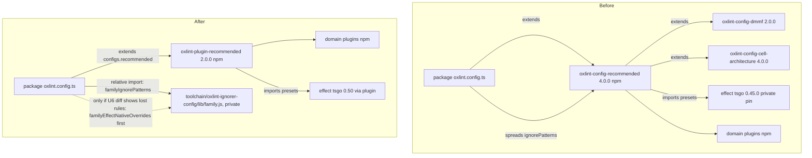

# Own Tool Configs, Consume Only Plugins - Plan

## Goal Capsule

- **Objective:** No systemfsoftware tool configuration crosses this repository's boundary in either direction. stryker-js-effect lints, tests, builds and mutates with configuration that lives in its own tree, takes only plugin packages from outside, and releases no configuration package.
- **Means:** consume the repo's own toolchain bases by relative path, and rename the private packages that host them out of the `@systemfsoftware/` scope (KTD1). Stop releasing the ignorer lint preset and keep it as an internal base (KTD2). Replace `@systemfsoftware/oxlint-config-recommended` with `configs.recommended` from `@systemfsoftware/oxlint-plugin-recommended` 2.0.0, plus a repo-owned base (KTD3, KTD4).
- **Authority:** the conductor's config-ownership contract (2026-10-08, with the 2026-10-09 session override) outranks this plan. `CONSTITUTION.md` and the repo `AGENTS.md` (BREAK-1, DEL1, START-1..6) outrank everything below them. `@systemfsoftware/tsconfig` is out of scope, and no tsconfig file is edited.
- **Execution profile:** a two-layer `gh stack` on trunk `main`. Layer 1 (`chore/own-lint-configs`) carries this plan and U1-U2. Layer 2 (`chore/own-lint-presets`) carries U3-U6 and starts only once `@systemfsoftware/oxlint-plugin-recommended` 2.0.0 is on npm.
- **Stop conditions:** stop and report if the before/after lint diff shows a rule that was effective before, is not effective after, and cannot be restored from a package already in the lockfile. Stop if any unit would need a tsconfig edit, a force-push, a local mutation run, or a new third-party executable.
- **Open blockers:** Layer 2 waits on the plugin-recommended 2.0.0 release. Five conductor rulings are listed under Open Questions; each has a default this plan executes if the conductor accepts it.
- **Who finishes:** the agent implements after the conductor's go, runs `ce-code-review` as its own step and reports findings unapplied. The conductor rules and merges bottom-up.

---

## Product Contract

### Summary

The repo already owns copies of its vitest, tsdown and stryker configuration. They still carry the `@systemfsoftware/` names of the monorepo's config packages, and every consumer declares them as a dependency, so those names end up in the published manifests. The repo also publishes one config package of its own, the ignorer lint preset, and nine lint roots still extend the external `@systemfsoftware/oxlint-config-recommended`. This work makes every config base a plain repo file imported by relative path, makes the ignorer preset internal, and moves the nine roots onto the plugin presets. Equivalence is shown with the real tools before and after.

### Problem Frame

The org rule (2026-10-08) is that tool configuration is internal to each repo and only plugins cross a repo boundary. This repo breaks it twice.

It consumes an external config package. `@systemfsoftware/oxlint-config-recommended` 4.0.0 comes from npm and pulls in `oxlint-config-cell-architecture` 4.0.0, `oxlint-config-dmmf` 2.0.0 and a private copy of `@effect/tsgo` pinned at 0.45.0, while the repo itself runs 0.50.0.

It also distributes a config package. `@systemfsoftware/oxlint-ignorer-config` is public, has its own changesets, and ships in the `workspace-tarballs` flake output. Its README invites ignorer authors outside the repo to extend it.

The three private toolchain packages (`packages/toolchain/{vitest,tsdown,stryker}-config`) are repo-owned copies and were never distributed. Their names still match the monorepo's config packages, so the contract's predicate grep cannot tell them apart from a cross-boundary dependency. Every consumer also declares them as `workspace:^` devDependencies, and `pnpm pack` writes those names into each released tarball's manifest. The released `stryker-ignorer-kit` tarball, for example, lists `@systemfsoftware/vitest-config: ^0.1.0` and `@systemfsoftware/tsdown-config: ^0.1.0`.

### Requirements

**Configuration ownership**

- R1. No manifest, config file, import, flake input or lockfile entry in this repo names `oxlint-config-{recommended,cell-architecture,dmmf,rule-authoring}` or `@systemfsoftware/{vitest-config,tsdown-config,stryker-config}`. The only exceptions are CHANGELOG history and finished plans in `docs/plans/`. `.changeset/ledger.yaml` has no hit today.
- R2. Every lint, test, build and mutation config in the repo gets its configuration from files in this repo, plus the `configs.*` presets of plugin packages.
- R3. No package this repo releases is a configuration package. Concretely, every package under `packages/toolchain/` is `private: true` and absent from the `workspace-tarballs` index.
- R4. Shared configuration inside the monorepo stays internal. A config base is a plain file under `packages/toolchain/`, imported by relative path. No manifest declares a dependency on it, so no released manifest names it.

**Equivalence**

- R5. For every one of the 18 lint roots, every rule that was effective before is still effective after, at the same or stricter severity, on the same file globs. The linted file count is unchanged. Each difference is listed and justified in the PR body. U3 edits 8 of the roots and U5 edits 9. The 18th, `test/e2e`, owns a config that extends nothing; it is snapshotted but not edited.
- R6. `tsc --showConfig` output, normalised with `jq -S`, is unchanged for every tsconfig in the workspace.
- R7. For every vitest config, the resolved project names and test-file list are unchanged.

**Plugins**

- R8. The domain plugins in use today (`oxlint-plugin-{cell-architecture,dmmf-workflow,effect-schema,effect-platform,test-discipline}` and the `effecttsgo` rules) are still loaded. They are wired through `configs.recommended` of `@systemfsoftware/oxlint-plugin-recommended` and still resolve from the npm registry. Any `effecttsgo` rule that this preset no longer enables is re-enabled by name in the repo-owned family base (KTD4).

**Delivery**

- R9. CI is green on each layer's head SHA, and the logs show lint and tests actually ran: turbo `lint` and `test` task lines, and oxlint's `Finished … on N files with M rules` summary per root.

### Key Decisions

- **Config bases are plain repo files imported by relative path.** This follows the pilot lesson that owned bases are extended by relative path. It also takes the internal names out of every released manifest. The toolchain directories stay private workspace packages only so their own dependencies, tests and tsconfigs keep working. Governs R1, R4. Open for ruling (OQ1).
- **The ignorer preset stops being released and is not turned into a plugin.** It has no rules of its own, so it is a config, and the contract does not allow a config to be distributed. External ignorer authors lose a published preset, which BREAK-1 permits. Governs R3. Open for ruling (OQ2).
- **Equivalence is measured on the effective rule set, not on preset names.** The version skew described below means the same preset name produces a different rule set. Governs R5.

### Scope Boundaries

- `@systemfsoftware/tsconfig` and every `tsconfig*.json` stay as they are.
- The per-root repo rules that are copied across the nine roots today (the strict trio and the `process` global ban) stay in each root. Merging them is a separate refactor.
- Fixtures under `testResources/**` and `tests/__fixtures__/**` keep their own configs. They model user projects and are inputs to the product.
- No npm registry action. Version 0.1.2 of the old ignorer preset stays on npm, and this unit runs no `npm deprecate`.
- No new CI gate (GATE1). The rule that toolchain packages are private is written down in `packages/toolchain/AGENTS.md`, and R3's evidence comes from the Nix tarball index.

### Dependencies / Assumptions

- `@systemfsoftware/oxlint-plugin-recommended` 2.0.0 is released to npm with the `configs.{recommended,cell-architecture,dmmf,rule-authoring}` shape it has on upstream branch `chore/own-configs` (head `edf81999`). Layer 2 is blocked until then.
- That upstream branch builds `configs.recommended` on `@effect/tsgo` ^0.50.0. Between tsgo 0.45 and 0.50, 21 `effecttsgo/*` rules moved out of the `correctness` and `recommended` presets into `effectNative`. The plugin re-adds 7 of them by name, so 14 are lost compared with today. KTD4 handles them.
- `minimumReleaseAgeExclude` already covers `@systemfsoftware/*`, so 2.0.0 installs as soon as it is published.

---

## Planning Contract

### Key Technical Decisions

- KTD1. **Consumers import toolchain files by relative path, and the hosting packages are renamed to `@stryker-js-effect/*`.**
  - Imports: every config file and the two `/telemetry` test sources import `<relative>/packages/toolchain/<dir>/lib/<file>.js` instead of a package specifier. Each consumer manifest drops its `workspace:^` devDependency on the toolchain package.
  - Type checking: TypeScript resolves the `.js` specifier to the sibling `lib/*.d.ts`. Declaration files are exempt from the composite-project file-list check, so no consumer tsconfig changes.
  - Bare imports: Vite already inlines the workspace-linked file today (its realpath is outside `node_modules`) and resolves its bare imports from the file's own directory, so vitest resolution is unchanged.
  - Hosting packages: they stay `private: true` workspace packages in the same directories, so their dependencies, tests and tsconfigs keep working. They are renamed (`@systemfsoftware/vitest-config` becomes `@stryker-js-effect/vitest-config`, and so on) and lose their `exports`, `module` and `files` fields, because nothing resolves them by name any more.
  - Turbo: the `typecheck` and `lint` inputs gain the `$TURBO_ROOT$/packages/toolchain/*/lib/**` globs they do not list yet, because the dependency edge that used to carry those changes is gone.
  - Implements R1, R4.
- KTD2. **The ignorer preset becomes `@stryker-js-effect/oxlint-config`, a private package whose files are imported by relative path.**
  - It stays in `packages/toolchain/oxlint-ignorer-config` with the same `lib/base.js` rules. The 8 consumers import `../../toolchain/oxlint-ignorer-config/lib/base.js` and drop their devDependency.
  - Remove `publishConfig`, `engines`, `keywords`, `bugs`, `exports`, the install section of the README, and the dead `ignorePatterns` export. oxlint drops `ignorePatterns` through `extends`, and `oxlint --print-config` in `packages/ignorers/kit` shows 0 patterns today.
  - Keep the api-extractor gate on `lib/base.d.ts`, because removing it would mean deleting `tsconfig.api.json`.
  - Delete the `@systemfsoftware/oxlint-ignorer-config@*` entry from the `pnpm-workspace.yaml` overrides: once the rename lands, no installed package resolves it. The flake's `.sfs-deps/` keeps the v18 tarball until the `stryker-published` pin moves to a release without it.
  - Implements R3, R4.
- KTD3. **The nine recommended roots extend `presets.configs.recommended` and use a repo-owned family base.**
  - The `default` import of `@systemfsoftware/oxlint-plugin-recommended` replaces `@systemfsoftware/oxlint-config-recommended` in each root, in the catalog and in every manifest.
  - No root adds a separate domain-plugin `extends`. Upstream at `edf81999` documents that `configs.recommended` already composes `dmmf`, `cell-architecture`, `oxlint-plugin-test-discipline`, `oxlint-plugin-effect-platform` and the `@effect/tsgo` presets, and adding them again would apply them twice. If the released 2.0.0 does not compose one of them, the roots extend that plugin's own `configs.recommended` directly. That is the session override's "domain plugins' `configs.recommended` where used".
  - `packages/toolchain/oxlint-ignorer-config/lib/family.js` exports `familyIgnorePatterns`: the 25-entry list that `oxlint-config-recommended` 4.0.0 exported, copied verbatim and imported by relative path.
  - The six roots that spread `recommended.ignorePatterns` today spread `familyIgnorePatterns` instead. The three that did not (html-reporter, plugin-runtime, typescript-checker) still do not.
  - Each root keeps its existing rules and extra ignore entries unchanged. Its existing overrides also stay unchanged and in order. The only exception is the KTD4 restore, when it is needed: its overrides go first.
  - Implements R2, R5, R8.
- KTD4. **Restore by name, in the family base, exactly the `effecttsgo` rules the measured diff shows as lost.**
  - Trigger: the U6 diff between the Layer 2 baseline and the preset swap. The branch at `edf81999` suggests 14 lost rules, but the released 2.0.0 is the authority, so the list comes from the measurement and not from that branch.
  - Shape: `familyEffectNativeOverrides` in `lib/family.js` holds the lost rule names. Each keeps the severity (at least `error`) and the file globs the before-snapshot shows. No preset is imported and no rule that was off before is turned on. The `effecttsgo` plugin itself is still loaded by `configs.recommended`.
  - Placement: oxlint keeps inherited `overrides` and applies every matching override in order after the merged top-level rules (oxc#22925). So the restore has to be expressed as overrides, placed first in each root's own `overrides`, directly after the inherited ones.
  - When the diff shows nothing lost, KTD4 is not built and the PR body says so.
  - Implements R5, R8.
- KTD5. **Evidence comes from the real tools and is never committed.** Before and after snapshots go under `.scratch/config-ownership/{before,after}/`; `.scratch/` is already gitignored. The commands are listed in the Verification Contract. The PR body carries the diffs and their justification. The scratch directory is deleted before the landing commit (OP12). Implements R5, R6, R7, R9.
- KTD6. **Changeset intents: `none` for config-only changes; `patch` for `@systemfsoftware/stryker-ignorer-interface`.**
  - `none` covers changes to `oxlint.config.ts`, `vitest.config.ts`, `tsdown.config.ts` and `stryker.config.ts`, and the removed toolchain devDependencies. None of these is read by an installer. This follows `docs/plans/2026-09-30-1853-perf-in-source-schema-laws-plan.md` KTD8.
  - The ignorer-interface README ships in its tarball and changes, so that package gets `patch`. Its changelog entry states that the ignorer lint preset is no longer published.
  - `./scripts/check-changeset.ts` decides whether any further intent is needed.

### High-Level Technical Design

Lint wiring before and after for one recommended root. The ignorer roots only swap their package import for a relative import of `packages/toolchain/oxlint-ignorer-config/lib/base.js`.

### Sequencing

Layer 1 can land as soon as the conductor gives the go, because it has no external dependency. Layer 2 starts once 2.0.0 is on npm and is rebased onto Layer 1 by merge, never by force-push. Inside Layer 2 the order is U3, U4, U5, then U6. U6 measures the swap and is the only unit that writes the KTD4 restore.

---

## Implementation Units

### U1. Capture the baseline evidence on Layer 1's base

- **Goal:** Record the before-state that R5-R7 are compared against, taken from `origin/main` at the commit the stack is based on.
- **Requirements:** R5, R6, R7.
- **Files:** `.scratch/config-ownership/before/**` only (gitignored).
- **Approach:** Install the repo the usual way: `pnpm install --frozen-lockfile` after the released tarballs are in place, then the root `prepare` patch, so the `effecttsgo` plugin is registered. For each lint root, save `oxlint --print-config | jq -S` and the summary line of a real `oxlint` run. For each `tsconfig*.json` outside `repos/`, `testResources/` and `__fixtures__/`, save `tsc --showConfig -p <file> | jq -S`. For each vitest config, save `vitest list --filesOnly --json` after `pnpm build`.
  - Run each capture as one workspace-wide command (`pnpm -r exec …`, `turbo`), the same way `pnpm lint` and `pnpm test` reach every package.
  - The harness refuses shell lines that name the mutation tool. A refused command is never reshaped to get past the guard. A check that would have to name it runs in CI or through a non-shell tool, as the Verification Contract states.
- **Execution note:** Do this before any edit. U6 later takes a second Layer 2 baseline on Layer 1's head, so the lint diff isolates the preset swap.
- **Test expectation:** none. This unit only captures evidence.
- **Verification:** 18 print-config files, 18 summary lines, one showConfig per tsconfig (about 120), and one list per vitest config (28 config files, minus fixture configs).

### U2. Consume the toolchain bases by relative path (Layer 1)

- **Goal:** The predicate grep matches nothing outside history, no released manifest names an internal toolchain package, and the owned configs behave exactly as before.
- **Requirements:** R1, R4, R6, R7. Implements KTD1.
- **Files:**
  - Toolchain packages: `packages/toolchain/{vitest,tsdown,stryker}-config/package.json` (`name`, `exports`, `module`, `files`).
  - Names inside the toolchain code: the `[@systemfsoftware/vitest-config]` error prefix in `packages/toolchain/vitest-config/lib/base.js`, the `@systemfsoftware/vitest-config:in-source-schema-laws` plugin name in `lib/schema-laws.js`, and the self-imports in the three toolchain test suites.
  - Consumer manifests: the toolchain devDependency comes out of all 22 consumer `package.json` files.
  - Consumer configs: 21 `vitest.config.ts`, 2 `vitest.mutation.config.ts`, 17 `tsdown.config.ts` and 4 `stryker.config.ts` switch to relative imports.
  - The 2 `/telemetry` imports: `packages/stryker-js/tests/vm-parity.differential.test.ts` and `test/e2e/src/Harness/harness-telemetry.service.ts`.
  - Repo config: the `sharedVitestConfig` parameter in `gritlint.json` (it matches the relative specifier), and the `typecheck` and `lint` inputs in `turbo.json`.
  - Docs: `docs/adr/0001-cell-architecture-module-taxonomy.md` and `docs/solutions/test-failures/agent-bail-hangs-the-test-run.md`.
  - `packages/toolchain/AGENTS.md`: a new boundary saying toolchain packages are private, are imported only by relative path, and are never released or listed in `workspace-tarballs`.
  - `pnpm-lock.yaml`, regenerated by `pnpm install`.
  - One `.changeset/*.md` with `none` intents for the packages whose `vitest`, `tsdown` and mutation configs and devDependencies change (KTD6).
- **Approach:** Rewrite import specifiers with `xd://ast_edit`. Edit manifests, JSON and docs with `edit`. Directory names, tsconfigs and every line that does not carry a name or specifier stay unchanged.
- **Patterns to follow:** the `lib/*.js` + `lib/*.d.ts` convention of the toolchain packages; the `$TURBO_ROOT$/packages/toolchain/...` input globs already in `turbo.json`.
- **Test scenarios:** The existing suites must still pass: `packages/toolchain/vitest-config/tests/in-source-schema-laws.integration.test.ts`, which registers schema laws under the renamed plugin; `packages/toolchain/tsdown-config/tests/base.test.ts`; and the mutation-config package's `tests/base.test.ts`. They run through `pnpm test`, not by path. A package missing the `@systemfsoftware/vitest` devDependency still fails at config load, with the renamed prefix in the message.
- **Verification:** The R1 grep is clean apart from Layer 2 targets and history. The packed-manifest gate passes. R6 and R7 diffs are empty. `pnpm check:ci` passes.

### U3. Internalise the ignorer preset (Layer 2)

- **Goal:** The repo releases no configuration package, and the eight ignorer and framework roots lint exactly as before.
- **Requirements:** R3, R4, R5. Implements KTD2.
- **Files:**
  - `packages/toolchain/oxlint-ignorer-config/{package.json,README.md,lib/base.js,lib/base.d.ts,etc/oxlint-ignorer-config.api.md}`.
  - The 8 consumer `oxlint.config.ts` and `package.json`: `packages/frameworks/{angular,interface,svelte}` and `packages/ignorers/{angular,effect-schema-declarations,in-source-vitest-block,interface,kit}`.
  - The `overrides` in `pnpm-workspace.yaml`; `pnpm-lock.yaml`.
  - `packages/ignorers/interface/README.md`.
  - The self-reference in the `no-restricted-imports` message in `lib/base.js`.
  - One `.changeset/*.md`: `patch` for `@systemfsoftware/stryker-ignorer-interface` (its README) and `none` for the 8 consumers (KTD6).
- **Approach:** Rename the package, set `private: true` and remove the fields listed in KTD2. Update the api report with `pnpm api:update`. Each consumer imports `../../toolchain/oxlint-ignorer-config/lib/base.js` and drops its devDependency.
- **Test scenarios:** Test expectation: none, since this is pure configuration. The proof is that all 8 roots have identical print-config and identical summary lines (R5).
- **Verification:** `nix build .#workspace-tarballs` produces an `index.json` with no toolchain package (R3). The R5 diff for the 8 roots is empty.

### U4. Add the repo-owned family base (Layer 2)

- **Goal:** The ignore patterns that the recommended roots inherited, which `extends` does not carry, now live in this repo.
- **Requirements:** R2, R5. Implements KTD3.
- **Files:** `packages/toolchain/oxlint-ignorer-config/{lib/family.js,lib/family.d.ts}`.
- **Approach:** `familyIgnorePatterns` is the 25-entry list copied verbatim, in order, from `oxlint-config-recommended` 4.0.0 `dist/index.mjs`. `checkJs` in the package's existing `tsconfig.app.json` type-gates the file. The KTD4 restore is not written here; U6 writes it.
- **Test scenarios:** Test expectation: none, since this is configuration data. The proof is U6's diff.
- **Verification:** The hosting package's `typecheck` and `api:check` pass.

### U5. Swap the nine roots to plugin presets (Layer 2)

- **Goal:** No lint root extends an external config package.
- **Requirements:** R1, R2, R8. Implements KTD3.
- **Files:**
  - `oxlint.config.ts` and `package.json` of `packages/stryker-js`, `packages/stryker-js-{cli-contract,html-reporter,instrumenter,plugin-interface,plugin-runtime,typescript-checker,vitest-runner}` and `test/e2e-core`.
  - The catalog in `pnpm-workspace.yaml` (`@systemfsoftware/oxlint-config-recommended` is replaced by `@systemfsoftware/oxlint-plugin-recommended: ^2.0.0`).
  - `pnpm-lock.yaml`.
  - One `.changeset/*.md` with `none` intents for the 9 roots (KTD6).
- **Approach:** Each root does `import presets from '@systemfsoftware/oxlint-plugin-recommended'` and `extends: [presets.configs.recommended]`. It imports the family base by relative path.
  - Where a root spread the old list, it spreads `familyIgnorePatterns`.
  - Each root's own `rules`, `overrides` and extra ignore entries stay unchanged. No KTD4 overrides yet.
  - If 2.0.0 brings domain-plugin majors that rename a rule a root names, follow the rename. The affected names are `@systemfsoftware/oxlint-plugin-cell-architecture/ban-classes` in the instrumenter and `@systemfsoftware/oxlint-plugin-test-discipline/vitest-from-systemfsoftware-vitest` in the vitest runner.
- **Test scenarios:** Test expectation: none, since this is pure configuration. The proof is U6.
- **Verification:** The lockfile resolves no `oxlint-config-*` package and no `@effect/tsgo@0.45.0`. `pnpm lint` passes.

### U6. Prove equivalence and fix fallout (Layer 2)

- **Goal:** R5-R7 hold, with every difference justified, and every newly stricter rule is satisfied in code.
- **Requirements:** R5, R6, R7, R9. Implements KTD4 and KTD5.
- **Files:** `.scratch/config-ownership/**`. When the diff shows lost rules: `packages/toolchain/oxlint-ignorer-config/{lib/family.js,lib/family.d.ts}` and the 9 recommended roots' `oxlint.config.ts`. Also any source file flagged by a rule the swap made stricter, and the PR body.
- **Approach:**
  1. Take a Layer 2 baseline on Layer 1's head, then the after-snapshot, using the U1 commands. Compare each root's top-level `rules` as a map. Compare its `overrides` as an ordered list of `(files, rules)` entries, because oxlint applies overrides in order (oxc#22925). Also compare the rule count in the summary line, which includes jsPlugin rules that `--print-config` leaves out.
  2. Classify each difference as one of four kinds:
     - removed: forbidden; restore it in step 3, or stop;
     - weakened: forbidden; restore it in step 3, or stop;
     - added or strengthened by the preset swap: allowed; fix the code;
     - rename-only: allowed; map the old name to the new one.
  3. If any `effecttsgo` rule is removed or weakened, write `familyEffectNativeOverrides` with exactly those rules (KTD4). Put the overrides first in each affected root's own `overrides`, then re-run step 1 until no rule is removed or weakened. Any other lost rule triggers the stop condition.
  4. Fix every new finding in code. Never disable a rule, lower a severity or add a suppression comment.
  5. Write the PR body: the per-root diff table, the summary lines before and after, the KTD4 rule list or the fact that none was needed, the tsc and vitest diffs (expected empty), and the classified list of `docs/plans/` predicate hits.
  6. Delete `.scratch/config-ownership/`.
- **Test scenarios:** Any source change made to satisfy a newly effective rule keeps its existing tests green. No new tests (OP12).
- **Verification:** The Verification Contract table passes on the head SHA of both layers.

---

## Verification Contract

| Gate                   | Command                                                                                                                                                                                                                                                                                                     | Applies to                    |
| ---------------------- | ----------------------------------------------------------------------------------------------------------------------------------------------------------------------------------------------------------------------------------------------------------------------------------------------------------- | ----------------------------- |
| Format                 | `pnpm format:check`                                                                                                                                                                                                                                                                                         | both layers                   |
| Typecheck              | `pnpm typecheck`                                                                                                                                                                                                                                                                                            | both layers                   |
| Lint and tests         | `pnpm lint`, `pnpm test` (via `pnpm check:ci`)                                                                                                                                                                                                                                                              | both layers                   |
| CI-equivalent gate     | `pnpm check:ci`                                                                                                                                                                                                                                                                                             | both layers                   |
| Change intent          | `./scripts/check-changeset.ts $(git merge-base HEAD origin/main)`                                                                                                                                                                                                                                           | both layers                   |
| Dogfood                | CI's `released-tarballs` action builds the pinned tarballs, and the `check` job runs `pnpm install --frozen-lockfile`. Locally: `pnpm install --frozen-lockfile`, then the `grep` tool over `pnpm-lock.yaml` for registry-resolved family packages                                                          | both layers                   |
| R1 predicate           | the `grep` tool (not a shell line) with the contract's predicate regex over the repo, every hit classified as history                                                                                                                                                                                       | Layer 2 head                  |
| R3 not distributed     | `jq -r '.[].name' "$(nix build --no-link --print-out-paths .#workspace-tarballs)/index.json"` lists no `@stryker-js-effect/*` name and no `@systemfsoftware/oxlint-ignorer-config`                                                                                                                          | Layer 2 head                  |
| DEL1                   | `git grep -nI -e '@systemfsoftware/oxlint-ignorer-config' -- . ':!*.lock' ':!**/CHANGELOG.md' ':!.changeset/ledger.yaml' ':!docs/plans/**'` returns nothing                                                                                                                                                 | Layer 2 head                  |
| No internal name ships | `pnpm --filter ./packages/ignorers/kit pack --pack-destination .scratch/pack`, then `tar -xOzf` its `package/package.json` and `jq '.devDependencies \| keys'`. The keys include none of `@systemfsoftware/{vitest-config,tsdown-config}`, the old mutation-config name, or any `@stryker-js-effect/*` name | both layers                   |
| R5 lint equivalence    | per root: `oxlint --print-config \| jq -S`, plus the summary line of `oxlint --format=default`                                                                                                                                                                                                              | both layers, before and after |
| R6 tsconfig            | per tsconfig: `tsc --showConfig -p <file> \| jq -S`                                                                                                                                                                                                                                                         | both layers                   |
| R7 vitest              | per vitest config: `vitest list --filesOnly --json`                                                                                                                                                                                                                                                         | Layer 1                       |
| R9 CI                  | `xd://github run_watch` on CI, Nix, Changeset and Commitlint for each head SHA; quote the turbo `lint`/`test` lines and the oxlint summaries from the `check` job log                                                                                                                                       | both layers                   |

Mutation is not run locally. Main's Mutation workflow covers the renamed `stryker.config.ts` imports after merge.

---

## Definition of Done

- Every R1-R9 holds on the merged head of `main`, with evidence in the two PR bodies.
- Each layer's head SHA has CI, Nix, Changeset and Commitlint green, and the SHA is reported for queueing.
- The PR bodies list each predicate hit under `docs/plans/` and classify it as a finished plan. The plans to classify are 2026-09-13 home-family, 2026-09-24 compound-pack, 2026-09-25 latest-packages, 2026-09-30 in-source-schema-laws and this plan.
- No scratch evidence, migration script or abandoned attempt is left in the diff. `.scratch/config-ownership/` is deleted.
- `ce-code-review` has run as its own step, and its findings have been reported unapplied for the conductor to rule on.

---

## Open Questions

These are conductor rulings. The plan runs each default unless it is overruled.

- OQ1. **Internal toolchain bases: relative-path imports (default) or renamed packages consumed by name?** The default follows the pilot lesson ("plain repo files extended by relative path") and keeps internal names out of released manifests. Today `pnpm pack` copies every `workspace:^` devDependency into the published manifest, including the private toolchain names. The cost is 49 relative import paths and a few extra turbo input globs to replace the dependency edges that used to trigger re-runs. Renaming without relative imports would keep the dependency edges, but every released tarball would then carry an `@stryker-js-effect/*` devDependency that no registry can resolve.
- OQ2. **Ignorer preset: internalise (default) or republish as a plugin carrying `configs.ignorer`?** The plugin form keeps a lint bar for external ignorer authors. It is the same rules-less shape as `oxlint-plugin-recommended`, but it adds a new published package. The default is internalise.
- OQ3. **Ignorer internalisation: Layer 2 (default) or Layer 1?** It does not depend on the 2.0.0 release. The session override says lint code waits, so the default keeps it in Layer 2.
- OQ4. **Upstream preset skew.** `oxlint-plugin-recommended` on `chore/own-configs@edf81999` drops 14 `effecttsgo` rules compared with `oxlint-config-recommended` 4.0.0 as this repo consumes it: `async-function`, `crypto-random-uuid`, `crypto-random-uuid-in-effect`, `extends-native-error`, `global-console`, `global-console-in-effect`, `global-fetch`, `global-fetch-in-effect`, `global-random`, `global-random-in-effect`, `instance-of-schema`, `prefer-schema-over-json`, `process-env-in-effect` and `schema-sync`. Fixing it upstream in 2.0.0 would make KTD4 unnecessary here and in every other consumer. The default is the in-repo restore.
- OQ5. **Directory name.** `@stryker-js-effect/oxlint-config` stays in `packages/toolchain/oxlint-ignorer-config` so that no tsconfig file moves. Renaming the directory with `git mv` would leave tsconfig contents byte-identical, but it needs the conductor's reading of "don't touch any tsconfig". The default is to keep the directory.

---

## Sources / Research

- Today's lint preset: `oxlint-config-recommended@4.0.0` `dist/index.mjs`, which extends dmmf and cell-architecture, spreads the `@effect/tsgo` 0.45.0 `correctness`/`recommended` presets with warnings promoted to errors, and exports 25 `ignorePatterns`.
- Replacement: upstream `packages/oxlint-plugin/oxlint-plugin-recommended/src/{index,recommended,dmmf,cell-architecture}.ts` on `chore/own-configs@edf81999`. It ports the presets unchanged apart from the dropped `ignorePatterns`, and adds `effecttsgo/unstable-api-usage: off` on src and entry globs.
- Skew evidence: the `@effect/tsgo/oxlint-presets` rule sets of 0.45.0 and 0.50.0, compared with both installed. 0.50 has 84 promoted rules against 100 in 0.45, and the 21 that moved are all in `effectNative`.
- `extends` drops `ignorePatterns`: `oxlint --print-config` in `packages/ignorers/kit` and `packages/stryker-js-html-reporter` reports 0 ignore patterns. See also oxc#23143.
- Override order: oxc#22925. Inherited `overrides` stay in effect and are applied after the child's top-level `rules`, so a restoring override has to be an override, not a top-level rule.
- Leaked names: the `stryker-ignorer-kit.tgz` in `.sfs-deps/` declares `@systemfsoftware/vitest-config` and `@systemfsoftware/tsdown-config` `^0.1.0` as devDependencies.
- Distribution: the `.sfs-deps/` contents (17 tarballs, including `oxlint-ignorer-config.tgz`) and `scripts/guards/check-tarball-contents.sh`, which selects only non-private packages.
- Precedents: `docs/plans/2026-09-25-0337-chore-systemfsoftware-latest-packages-plan.md` KTD3, which mirrored vitest-config into the repo, and `docs/plans/2026-09-30-1853-perf-in-source-schema-laws-plan.md` KTD8, which used `none` intents for config-only changes.
