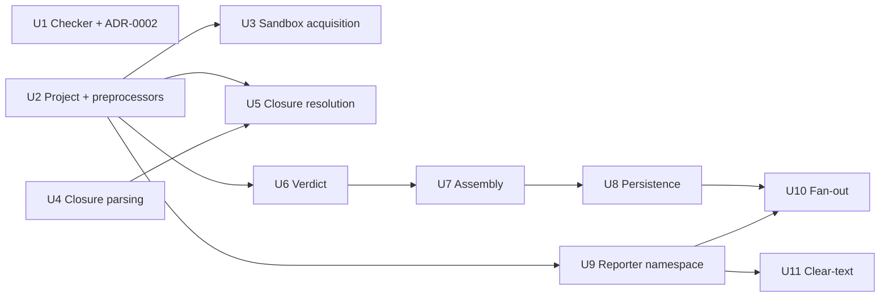
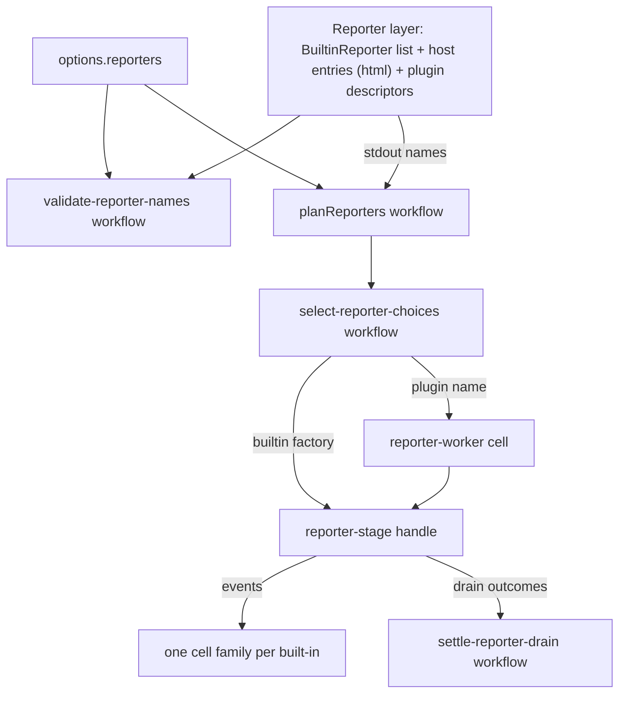

# Decompose the Grab-Bag Modules - Plan

## Goal Capsule

- **Objective:** A surviving mutant, a failing test, or a reviewer's question about any module under `packages/*/src` points at one file that does one thing, so each decision is graded by mutation where it lives and no module mixes decisions, I/O and wiring.
- **Means:** Decompose `mutation-reporting.service.ts`, `import-closure.cell.ts` and `Sandbox.blueprint.ts` into taxonomy-conforming cells, workflows, schemas and blueprints; make reporters one namespace capability; retire the two non-taxonomy suffixes; then bring every other non-schema source file under 400 lines. Delivery is a series of small PRs off `main`.
- **Product authority:** `docs/adr/0001-cell-architecture-module-taxonomy.md` (the closed taxonomy), as amended at line 60 by ADR-0002 from PR 1 (operations over a schema's data live in its `*.schema.ts`); `CONSTITUTION.md` (supreme per CONST-G5); the cell-architecture and boundary-testing packs named in `.compound-engineering/config.yaml`; and the operator, who merges every PR.
- **Open blockers:** none.

---

## Product Contract

### Summary

Split the three named grab-bag modules and the reporter code into single-purpose cells, workflows, schemas and blueprints, with every moved decision graded by a property test. Make adding a built-in reporter a matter of adding that reporter's own cell and one registration entry. Finish with no non-schema file over 400 lines and no suffix outside ADR-0001 in `packages/*/src`, without changing behaviour.

### Problem Frame

ADR-0001 retired `*.parts.ts` and `*.steps.ts`, but three modules still carry the same mix under lawful-looking suffixes. `import-closure.cell.ts` holds no `Sandwich` at all: it is an AST scanner, a module resolver, disk probes and a digest builder behind one exported generator. `mutation-reporting.service.ts` is mostly report assembly, persistence and the exit-code decision, not reporting, and none of its twelve decisions is mutated, because the mutation population is `src/**/*.workflow.ts` and `src/**/*.schema.ts` only. `Sandbox.blueprint.ts` mutates the `Project` its caller owns. The reporter capability is spread across about twenty modules, and adding a built-in reporter edits at least seven of them. Stream A is moving the same core files into new packages at the same time, so every change here has to land small and fast.

### Key Decisions

- **Pure operations over a type live in that type's `*.schema.ts`, and nothing is copied.** (session-settled: user-directed, 2026-10-09 — chosen over a private copy in each workflow, the earlier ruling now withdrawn, and over an unsuffixed sibling module per ADR-0001 line 60.) A workflow may import a relative `*.schema.ts` (P1), a schema file may export a function whose types name a type it declares (P3), and schema files are mutated (P5), so CONST-T4 holds for those operations. PR 1 records this as ADR-0002, which amends ADR-0001 line 60 and states what a schema file may hold and where its operations' laws live (U1). A decision that chooses an outcome stays a `Workflow.make` in its own `*.workflow.ts`. The tree already does this in places (`packages/stryker-js/src/Serve/msp.schema.ts:194`, `packages/stryker-js-typescript-checker/src/program-digest.schema.ts:18`). Governs R5.
- **A sibling workflow is never a dependency of another workflow.** Two decisions compose in a cell, each with its own `Workflow.make` file, because `make-body-purity` refuses a sibling-workflow import (P1) and a file holds one `Workflow.make` (P3). Governs R4.
- **"Adding a reporter means adding one cell" means one new reporter module family and one registration entry.** (session-settled: user-approved — chosen over import-time or directory-scan discovery: ESM has no import-time discovery, and a scan makes built-in resolution an I/O step.) The family is the reporter's cell plus, when it decides anything, its own workflow and property test. Governs R11.
- **The three named modules, the Checker suffixes and the reporter capability go first. The other oversize core files follow, and the other packages can interleave at any point.** Stream A is splitting the core package, so core files collide with it. Its branch already moves one inventory file outside the core package, `VitestRunner.service.ts` (P13), so entry 31 drops that file, and every entry from 12 on re-checks `origin/stream-a/*` before it starts. Governs R19.
- **PRs off `main` stay independent where their files are disjoint and are stacked where they touch a common file.** This follows the delivery instruction and harness rule OP13b, which requires stacking when two open PRs change the same file. Governs R18.

### Requirements

**Taxonomy and size**

- R1. No non-test file under `packages/*/src` (excluding `testResources/`) carries a suffix outside the ADR-0001 taxonomy table (ADR-0001 lines 39-48), so `Checker/Checker.plans.ts` and `Checker/Checker.protocol.ts` no longer exist under those names.
- R2. No non-schema, non-test source file under `packages/*/src` exceeds 400 lines, `bin/` and `drivers/` included; 28 do today (inventory below).
- R3. No file reaches R1 or R2 by mechanical splitting: no two new modules share mutable state, and none reaches the other through a re-export.
- R4. Each decision moved out of a cell, service, handle, blueprint or unsuffixed module lands in its own `*.workflow.ts` under `make-body-purity` and complexity 1 (P1, P2) (pack: cell-architecture, pure-decision-workflows.md).
- R5. A pure operation over a type lives in the `*.schema.ts` that declares the type, and every workflow, cell, handle or service that uses it imports it from there (ADR-0002). No module holds a private copy of another module's helper, and no module this series creates is an unsuffixed home for operations over a schema's data.
- R6. No module mutates a record its caller owns, and no module-level mutable state is introduced (ADR-0001 line 55). `mergeUpdatedFile` and the tsconfig rewriter in `Sandbox.blueprint.ts` and the threaded `MutableHashMap` memos in `import-closure.cell.ts` are removed (P8, P7).
- R7. Foreign-API calls outside `src/drivers/` move into `src/drivers/`; the oxc-parser load and parse at `import-closure.cell.ts:295-299` is the known case (P7).

**The three named modules**

- R8. `import-closure.cell.ts` becomes a real cell (`Sandwich.named(...).decide(workflow).write(...)`) or a composition of cells. The AST extraction, specifier and exports-map resolution, and digest assembly become decisions, and disk probing is the cell's read side (P7).
- R9. `Sandbox.blueprint.ts` keeps only the `Sandbox` kind, its steps and its targets (pack: cell-architecture, staged-lawful-builders.md). Build, node_modules linking, move and restore I/O live in cells, and the preprocessors return a new `Project` (P8).
- R10. `mutation-reporting.service.ts` is reduced to the `MutationReporting` contract and its layer, or deleted. Its decisions (P6) move into workflows, its I/O into cells, and its in-source laws (lines 1065-1251) into `src/__tests__/<stem>.workflow.property.test.ts` files for the workflows that now own those decisions.

**Reporter capability**

- R11. Built-in reporters form one namespace capability in `packages/stryker-js/src` (pack: cell-architecture, single-namespace-barrel.md). Adding a built-in reporter means adding its module family plus one registration entry, with no edit to reporter-name schemas, factory tables, failure mappers or `plan-reporters.workflow.ts`, and only the one registration line added to the `Reporter` layer.
- R12. A reporter's name, its failure mapping and whether it writes to stdout are declared once, by that reporter, and every consumer (config validation, `planReporters`, the factory table) derives from the declaration.
- R13. The plugin-loaded reporter path (`'Reporter'` descriptors spawned as workers) and the host-supplied `html` reporter keep resolving by name exactly as today (P9).

**Behaviour and tests**

- R14. Run output, exit codes, report files, incremental records, spans and the stream protocol are unchanged. The existing integration suites (`packages/*/tests`) and the e2e lane pass unmodified except for import paths and public-namespace renames.
- R15. Every decision that moves into a workflow gets laws in `src/__tests__/<stem>.workflow.property.test.ts` that draw Schema-derived input and can fail on a plausible bug (ADR-0001 lines 57 and 61). Where a law targets code already in the mutation population, the PR cites the surviving-mutant ids it kills from the latest `main` Mutation report.
- R16. Cells, blueprints, services and handles get no unit tests of their own beyond ADR-0001's stated exceptions; the existing integration suites and the e2e lane grade them (ADR-0001 lines 57-58).
- R17. No test is skipped, deleted to pass, or re-pinned to the old structure. No line-count lint or other new gate is added (harness rule GATE1).

**Delivery**

- R18. Each PR covers one module or one capability, branches from `main`, carries a changeset when a package changes (START-5), and regenerates the api report when a public namespace changes (BREAK-1). It merges `main` in when `main` moves, never rebases, and is stacked under harness rule OP13b when it shares a file with another open PR.
- R19. The series follows the PR order below unless a dependency found in planning forces a change.
- R20. Each PR is green in CI on its exact head with the suites actually running. Mutation runs only on `main`, never locally.

### Acceptance Examples

- AE1. **Covers R11, R12.** **Given** a new built-in reporter `foo` that writes `reports/foo.txt`, **when** a developer adds the `foo` module family and its registration entry, **then** `reporters: ['foo']` validates, `planReporters` places it correctly, `foo` receives every `ReporterEvent`, and no existing file changes beyond the line holding the registration entry. **Checked by:** review of the reporter-namespace PR, whose body shows the diff a `foo` reporter would need; no reporter is added and no permanent test is left.
- AE2. **Covers R6, R9.** **Given** a `Project` whose `filesToMutate` holds `a.ts`, and `disableTypeChecks` matches `a.ts`, **when** the sandbox preprocessors run, **then** the caller's `Project` value is unchanged and the returned `Project` holds the rewritten `a.ts` in both `files` and `filesToMutate`. **Checked by:** the laws of the workflow that decides the merge, plus the existing sandbox integration suites.
- AE3. **Covers R8, R14.** **Given** the 19 scenarios in `packages/stryker-js/tests/import-closure.integration.test.ts`, **when** they run against the decomposed module, **then** every closure, `open` flag and digest equals the value on `main` 1e1de6d05. **Checked by:** that suite, unchanged.

### Load-Bearing Premises

Verified on `main` 1e1de6d05 unless marked otherwise. Lint facts come from the versions pinned in `pnpm-lock.yaml` (`@systemfsoftware/oxlint-plugin-dmmf-workflow@7.0.0` at line 3046, `oxlint-plugin-cell-architecture@5.0.0` at 3040, `oxlint-plugin-effect-schema@6.0.0` at 3058), read from the published tarballs' `dist/index.mjs`.

| ID  | Premise                                                                                                                                                                                                                                                                                                                                                                                                                                                                                                                                                                                                                                                                                                                                                                                                                                                                                                                                                                                                                                         | Evidence                                                                                                                                                                                                                                                                                                                                                                                        |
| --- | ----------------------------------------------------------------------------------------------------------------------------------------------------------------------------------------------------------------------------------------------------------------------------------------------------------------------------------------------------------------------------------------------------------------------------------------------------------------------------------------------------------------------------------------------------------------------------------------------------------------------------------------------------------------------------------------------------------------------------------------------------------------------------------------------------------------------------------------------------------------------------------------------------------------------------------------------------------------------------------------------------------------------------------------------- | ----------------------------------------------------------------------------------------------------------------------------------------------------------------------------------------------------------------------------------------------------------------------------------------------------------------------------------------------------------------------------------------------- |
| P1  | A `Workflow.make` decide body, and every same-file helper it calls, may reference parameters, locals, same-file declarations, the sealed pure `effect` surface, and bindings imported from a relative `*.schema.js`/`*.schema.ts`. Any other local import, including a sibling `*.workflow.ts` or an unsuffixed module, is refused as `unsealedImport`. So a workflow cannot import pure helpers from a sibling module unless that module is a schema file.                                                                                                                                                                                                                                                                                                                                                                                                                                                                                                                                                                                     | dmmf-workflow 7.0.0 `dist/index.mjs:1042-1046` (schema-file edge), `:1154-1185` (import verdicts), `:1489-1555` (helper following). Probe, run 2026-10-09 with `oxlint` in `packages/stryker-js` on throwaway files since deleted: references to `./probe-helper.js` and `./keep-temp-dir.workflow.js` inside `decide` were reported by `make-body-purity`; `./probe-helper.schema.js` was not. |
| P2  | Complexity max 1 (`modified`) applies to every function in `**/src/**/*.workflow.ts`, not only to `decide`. A pure helper with an `if`, a ternary or a `&&`/`\|\|` cannot live in a workflow file as written.                                                                                                                                                                                                                                                                                                                                                                                                                                                                                                                                                                                                                                                                                                                                                                                                                                   | dmmf-workflow 7.0.0 `dist/index.mjs:2491-2496`. Same probe: a helper never called from `decide` was reported at complexity 2.                                                                                                                                                                                                                                                                   |
| P3  | One `Workflow.make` per file and one non-schema value export per workflow file. The fix text sends an extra pure operation to "the *.schema.ts file that declares that type". A `*.schema.ts` may export a function whose types name a type that file declares.                                                                                                                                                                                                                                                                                                                                                                                                                                                                                                                                                                                                                                                                                                                                                                                 | dmmf-workflow 7.0.0 `dist/index.mjs:86-88`, `:105-106`. effect-schema 6.0.0 `dist/index.mjs:2479-2480`. Probe: the schema file exporting `flipSchema` drew no report.                                                                                                                                                                                                                           |
| P4  | ADR-0001 puts functions over a schema's data in an unsuffixed sibling (`Location.ts`), never in the schema file. That contradicts P3 and CONST-T4, because unsuffixed files are not mutated. ADR-0002, carried by PR 1, replaces that rule: operations over a schema's data live in its `*.schema.ts`.                                                                                                                                                                                                                                                                                                                                                                                                                                                                                                                                                                                                                                                                                                                                          | `docs/adr/0001-cell-architecture-module-taxonomy.md:60`; `packages/stryker-js/stryker.config.ts:15-22`; `CONSTITUTION.md:253-256`; operator ruling, 2026-10-09.                                                                                                                                                                                                                                 |
| P5  | Only `src/**/*.workflow.ts` and `src/**/*.schema.ts` are mutated. `thresholds.break: 100` is configured but does not gate `main`: the shard run step continues on error, the gate step compares a budget baseline, and run 37960922409 on 1e1de6d05 concluded `success` at a mutation score of 55.01. A decision moved into a workflow joins the population, and its survivors appear in the `main` report. The CI run mutates only the projects in `PROJECTS`: `packages/stryker-js`, `packages/stryker-js-typescript-checker`, `packages/stryker-js-vitest-runner` and `test/e2e-core`. `packages/stryker-js-instrumenter` has no stryker config and is never mutated.                                                                                                                                                                                                                                                                                                                                                                        | `packages/stryker-js/stryker.config.ts:15-22`; `packages/toolchain/stryker-config/lib/base.js:23`; `.github/workflows/mutation.yml:29,206-215,322-333`; run 37960922409, artifact `mutation-report-416`.                                                                                                                                                                                        |
| P6  | `mutation-reporting.service.ts` (1251 lines) splits as follows. Decisions: `mapRunResult` 245-266, `partitionByFile` 271-280, `determineLanguage` 287-293, `withProgramDigest` 314-322, `timeoutKindIn` 398-407, `timeoutKindOf` 412-420, `reproducedCountOf` 422-430, `timeoutFieldsOf` 437-451, `determineExitCode` 708-732, `checkpointResultOf` 984-992, `checkpoint` 1021-1029, `publishDryRunCoverage` 1056-1063. Pure shaping: 199-243, 268-365, 453-549, 810-852, 971-982. I/O: source reads, dependency discovery and the report with clock at 551-706; threshold logs and verdict emission at 734-808; incremental, reproducer and checkpoint writes at 854-969 and 1011-1019; dry-run coverage at 1034-1054. Service and layer: 156-183. In-source laws: 1065-1251. Its only reporter touch point is the terminal hand-off at 905-911.                                                                                                                                                                                               | Scout inventory of the file; spot-checked at lines 54, 245-266, 398-470, 700-810, 898-940 and 1065-1080.                                                                                                                                                                                                                                                                                        |
| P7  | `import-closure.cell.ts` (911 lines) has no `Sandwich`, `Cell` or `Workflow.make`, and exports the generator `analyzeImportClosure` (869-911). Pure: AST extraction 186-293, specifier candidates and path normalisation 304-373, package and exports-map matching 412-427 and 455-503. Disk probes: 375-385, 429-453, 506-541, 574-585, 603-636, 719-837. oxc is loaded and called outside `src/drivers/` (295, 299). The memo created at 876 is mutated by callees (548-558, 719-743). The closure decision already lives in `import-closure.workflow.ts`. The cell is public as `ImportClosure` (`packages/stryker-js/src/mod.ts:6`; `etc/stryker-js.api.md:33-35`); its production callers are `run/dry-run-choice.ts` and `run/incremental-reuse.cell.ts`.                                                                                                                                                                                                                                                                                 | Scout inventory; spot-checked at 293-300, 543-911 and `mod.ts:6`.                                                                                                                                                                                                                                                                                                                               |
| P8  | `Sandbox.blueprint.ts` (734 lines) holds one `Blueprint.make` (687). `mergeUpdatedFile` (47-53) writes into the caller's `Project.files` and `filesToMutate`, which are `MutableHashMap` (`Project.schema.ts:17-18`). It is reached through `updates.forEach(mergeUpdatedInto(project))` (93) on the `instrumentedProject` passed from `run/instrument.cell.ts:82-84`. The tsconfig rewriter assigns into decoded records (131, 211, 225, 260) and into the caller's `ProjectFile` with `Object.assign` (149), although `ProjectFile.content` is `readonly` (`Project.schema.ts:9`); `TsConfigSchema` is declared mutable for that purpose (`Sandbox.schema.ts:14-32`). The copy-and-return precedent is `run/instrument.ts:59-67`. Decisions: `failOnBuildFailure` 339-354, `directoryRole` 401-406, `hasBackupToRestore` 543-547, `linksNodeModules` 590-594, `tryRewriteReference` 295-308, `referencedTsConfigPath` 246-250. I/O: 356-390 (child process), 408-524 and 549-649 (fs). Sole production importer: `run/instrument.cell.ts:17`. | Read directly.                                                                                                                                                                                                                                                                                                                                                                                  |
| P9  | Built-in reporters are a `builtin` record in `Reporter.layer` (`reporter.service.ts:51-58`), named by literals in `reporter-name.schema.ts:3-18`. The host injects `html` at `bin/main.ts:221`, `Serve/Serve.cell.ts:116` and `run/run-stages.ts:24`, and the MCP host injects none (`Mcp/mcp-server.cell.ts:137`). `run/prepare.ts:206-225` merges both with plugin `'Reporter'` descriptors into name-keyed choices. The plugin contract is `ReporterFactory` (`packages/stryker-js-plugin-interface/src/ReporterEvent.schema.ts:85-88`). Adding a built-in today touches `reporter-name.schema.ts`, `run/plan-reporters.workflow.ts`, a new render workflow and cell, `reporter-factories.ts`, `reporter-failures.ts` and `reporter.service.ts`.                                                                                                                                                                                                                                                                                             | Read directly; the edit list is from the scout trace.                                                                                                                                                                                                                                                                                                                                           |
| P10 | `Checker.plans.ts` (71 lines) holds three `dual` facades over `groupCell`, `checkCell` and `checkGroupedCell`. Its production importer is `Checker/checker-pool.handle.ts:21`, and `Checker/mod.ts:7` re-exports `checkGroupedPlans`, which is public (`etc/stryker-js.api.md:8-9`). `Checker.protocol.ts` (153 lines) holds pure partition and lookup helpers, `Effect.fn` skip logging, and request types, and is imported by `Checker.cell.ts:4`, `check.cell.ts:24`, `group.cell.ts:24` and `Checker.plans.ts:14`. The wire schema is not in it; it lives in `packages/stryker-js-plugin-interface/src/Checker.schema.ts:6-13`.                                                                                                                                                                                                                                                                                                                                                                                                             | Read directly.                                                                                                                                                                                                                                                                                                                                                                                  |
| P11 | 28 non-schema, non-test files under `packages/*/src` exceed 400 lines, and all 28 are the bar (operator ruling, 2026-10-09). 26 are in stryker-js, stryker-js-instrumenter and stryker-js-typescript-checker, and 24 remain after excluding `bin/` and `drivers/`, which is probably the brief's original count. Stream A moves `VitestRunner.service.ts` to `drivers/vitest-runner.ts` (P13); it is re-measured after A lands.                                                                                                                                                                                                                                                                                                                                                                                                                                                                                                                                                                                                                 | Line count over `git ls-files 'packages/*/src/**'`, excluding `__tests__`, `*.test.ts`, `*.schema.ts` and `testResources/`.                                                                                                                                                                                                                                                                     |
| P12 | Non-taxonomy suffixes today: `plans` and `protocol` only. Many unsuffixed modules exist (for example `run/mutant-settlement.ts`, `conclude-run.ts`). The taxonomy admits them only as `Type.ts` siblings; R1 concerns suffixes, and Scope Boundaries leave unsuffixed modules under 400 lines as they are.                                                                                                                                                                                                                                                                                                                                                                                                                                                                                                                                                                                                                                                                                                                                      | Same scan.                                                                                                                                                                                                                                                                                                                                                                                      |
| P13 | `origin/stream-a/l1-ports-topology` is 10 commits beyond `origin/main` 1e1de6d05. Of the inventory files it moves only `packages/stryker-js-vitest-runner/src/VitestRunner.service.ts`, to `drivers/vitest-runner.ts`, and it touches no file of PRs 1-11. Its later moves are unverified.                                                                                                                                                                                                                                                                                                                                                                                                                                                                                                                                                                                                                                                                                                                                                      | `git log origin/main..origin/stream-a/l1-ports-topology` (10 commits) and `git diff --name-status origin/main...origin/stream-a/l1-ports-topology -- packages` (23 paths), checked 2026-10-09; the rename is in 32c2cf34c.                                                                                                                                                                      |
| P14 | `docs/plans` may gain at most one plan per PR (REPO-D2), so this file is the series' only plan and `ce-plan` enriches it in place.                                                                                                                                                                                                                                                                                                                                                                                                                                                                                                                                                                                                                                                                                                                                                                                                                                                                                                              | `AGENTS.md` REPO-D2; `package.json` `gate:repo`.                                                                                                                                                                                                                                                                                                                                                |
| P15 | After `makeSandbox` returns, no consumer reads a `Project` file's `content`: they read map keys (`run/dry-run-choice.ts:75`, `run/dry-run.cell.ts:109`, `run/incremental-reuse.cell.ts:297`, `run/mutation-test-plan.cell.ts:95`, `run/prepare.ts:232,251-263`) or original content through `ProjectFiles.readAllOriginal` (`mutation-reporting.service.ts:556-591`). The preprocessors never add a key (`Sandbox.blueprint.ts:79`, `:158`). So giving the preprocessed `Project` only to the sandbox writer, and leaving the caller's `Project` as it was, changes no output.                                                                                                                                                                                                                                                                                                                                                                                                                                                                  | grep for `project.files`, `filesToMutate` and `instrumentedProject` under `packages/stryker-js/src`; U2 re-checks this before it lands.                                                                                                                                                                                                                                                         |
| P16 | A workflow is a plain function returning a `Result`, so a cell's read or write and a handle may call one directly when a decision runs per item inside a loop.                                                                                                                                                                                                                                                                                                                                                                                                                                                                                                                                                                                                                                                                                                                                                                                                                                                                                  | `reporter-factories.ts:117-133` calls `sarifReport`; `mutation-reporting.service.ts:913-920` calls `classifyExit`.                                                                                                                                                                                                                                                                              |
| P17 | `classifyExit` lets a breaking score outrank every pending exit class (`classify-exit.workflow.ts:80-88`), while `reportAll` asks it twice, the second time with the score `Unscored`, so a terminal reporter drain failure (`RuntimeError`) outranks `VerdictFail` (`mutation-reporting.service.ts:911-932`). Collapsing the two calls into one would change exit codes.                                                                                                                                                                                                                                                                                                                                                                                                                                                                                                                                                                                                                                                                       | Read directly.                                                                                                                                                                                                                                                                                                                                                                                  |
| P18 | `effect` 4.0.0 exports `Schema.Json` (a codec over JSON values), so a workflow command can carry a parsed AST without `S.Unknown`.                                                                                                                                                                                                                                                                                                                                                                                                                                                                                                                                                                                                                                                                                                                                                                                                                                                                                                              | `effect/dist/Schema.d.ts:11175,11207`.                                                                                                                                                                                                                                                                                                                                                          |
| P19 | The only reader of `.stryker/budget-baseline.json` is the Mutation workflow's gate step, which runs on a push to `main`, on dispatch and on a schedule, never on a pull request. No PR-lane workflow (`ci.yml`, `nix.yml`, `changeset-check.yml`, `commitlint.yml`) reads it. The repo's documented update path is `stryker gate --update-budget-baseline`, which rewrites the file from a finished run's report.                                                                                                                                                                                                                                                                                                                                                                                                                                                                                                                                                                                                                               | `.github/workflows/mutation.yml:3-17,37,323-342`; grep for `budget-baseline` under `.github/`; `packages/stryker-js/src/budget-gate.workflow.ts:11,96`; `packages/stryker-js/src/bin/cli-command.ts:398-401`.                                                                                                                                                                                   |

### Oversize Inventory

| Lines | File                                                               |
| ----: | ------------------------------------------------------------------ |
|  2206 | `packages/stryker-js-instrumenter/src/print/SourceText.ts`         |
|  1817 | `packages/stryker-js-typescript-checker/src/ts-compiler.handle.ts` |
|  1522 | `packages/stryker-js-instrumenter/src/Mutator.service.ts`          |
|  1433 | `packages/stryker-js-instrumenter/src/Transformer.service.ts`      |
|  1251 | `packages/stryker-js/src/mutation-reporting.service.ts`            |
|   994 | `packages/stryker-js-instrumenter/src/EffectCall.ts`               |
|   911 | `packages/stryker-js/src/import-closure.cell.ts`                   |
|   779 | `packages/stryker-js-instrumenter/src/Ast.handle.ts`               |
|   744 | `packages/stryker-js/src/render-clear-text-report.workflow.ts`     |
|   738 | `packages/stryker-js/src/bin/cli-command.ts`                       |
|   734 | `packages/stryker-js/src/Sandbox.blueprint.ts`                     |
|   686 | `packages/stryker-js/src/run/dry-run.cell.ts`                      |
|   664 | `packages/stryker-js/src/run-request.cell.ts`                      |
|   613 | `packages/stryker-js/src/Serve/Serve.cell.ts`                      |
|   553 | `packages/stryker-js/src/reporter-stream.service.ts`               |
|   551 | `packages/stryker-js/src/run-event-stream.service.ts`              |
|   550 | `packages/stryker-js/src/run/incremental-reuse.cell.ts`            |
|   521 | `packages/stryker-js/src/plugin-loader.service.ts`                 |
|   491 | `packages/stryker-js-vitest-runner/src/VitestRunner.service.ts`    |
|   486 | `packages/stryker-js/src/read-project.cell.ts`                     |
|   466 | `packages/stryker-js/src/select-project-files.workflow.ts`         |
|   453 | `packages/stryker-js/src/drivers/config.ts`                        |
|   434 | `packages/stryker-js/src/conclude-run.ts`                          |
|   426 | `packages/stryker-js/src/plan-request.cell.ts`                     |
|   426 | `packages/stryker-js/src/plan-mutant-tests.workflow.ts`            |
|   419 | `packages/stryker-js/src/pooled-test-runner.handle.ts`             |
|   409 | `packages/stryker-js/src/Checker/checker-pool.handle.ts`           |
|   405 | `packages/stryker-js-vitest-runner/src/VitestRuntime.blueprint.ts` |

<!-- ce-section: work-relationships -->

### PR Series

Entries 1-11 are planned in full as U1-U11 below. Entries 12-31 keep this table; each gets its own inventory and units as a plan amendment when it is reached. "Stacked on N" follows R18 and names every unit a PR shares a file with; a PR stacked on two units opens on the one stack that holds both (High-Level Technical Design).

|     # | PR                                                                                                                                                                                                                                                                                                                                                                                                                                                                                                 | Relationship                                                                                          |
| ----: | -------------------------------------------------------------------------------------------------------------------------------------------------------------------------------------------------------------------------------------------------------------------------------------------------------------------------------------------------------------------------------------------------------------------------------------------------------------------------------------------------- | ----------------------------------------------------------------------------------------------------- |
|     1 | Checker: retire `Checker.plans.ts` and `Checker.protocol.ts`, and record ADR-0002 (U1)                                                                                                                                                                                                                                                                                                                                                                                                             | Independent                                                                                           |
|     2 | Project immutability and sandbox preprocessors: `Project` maps become immutable, the preprocessors return a new `Project`, and the tsconfig rewrite and file merge become workflows (U2)                                                                                                                                                                                                                                                                                                           | Independent                                                                                           |
|     3 | Sandbox acquisition: restore, build, node_modules linking and file writes become cells, their decisions become workflows, and the blueprint keeps only kind, steps and targets (U3)                                                                                                                                                                                                                                                                                                                | Stacked on 2                                                                                          |
|     4 | Import closure parsing: oxc moves to `src/drivers/`, and AST extraction becomes a workflow (U4)                                                                                                                                                                                                                                                                                                                                                                                                    | Independent                                                                                           |
|     5 | Import closure resolution: candidate files, exports-map matching and digest composition become workflows, the module becomes a cell, and the memos go (U5)                                                                                                                                                                                                                                                                                                                                         | Stacked on 2 and 4                                                                                    |
|     6 | Mutation verdict: the score-vs-threshold decision and its logs become a workflow and a cell, and `classifyExit` keeps only precedence (U6)                                                                                                                                                                                                                                                                                                                                                         | Stacked on 2                                                                                          |
|     7 | Mutation report assembly: mutant settlement, report-file assembly and digest stamping become workflows, and the in-source laws move to property files (U7)                                                                                                                                                                                                                                                                                                                                         | Stacked on 6                                                                                          |
|     8 | Mutation report persistence: incremental, checkpoint, dry-run coverage and reproducer writes become cells, their gates and cost evidence become workflows, and `MutationReporting` shrinks to its contract (U8)                                                                                                                                                                                                                                                                                    | Stacked on 7                                                                                          |
|     9 | Reporter namespace: `src/Reporter/` with a registry in which each built-in declares its name and stdout membership once (U9)                                                                                                                                                                                                                                                                                                                                                                       | Stacked on 2                                                                                          |
|    10 | Reporter fan-out: `reporter-stream.service.ts` and `reporter-wiring.service.ts` become a stage handle, a worker cell, a trace service and three workflows (U10)                                                                                                                                                                                                                                                                                                                                    | Stacked on 8 and 9                                                                                    |
|    11 | Clear-text rendering: `render-clear-text-report.workflow.ts` becomes a schema and four workflows (U11)                                                                                                                                                                                                                                                                                                                                                                                             | Stacked on 9                                                                                          |
| 12-24 | One PR each for the remaining core oversize files, largest first: `bin/cli-command.ts`, `run/dry-run.cell.ts`, `run-request.cell.ts`, `Serve/Serve.cell.ts`, `run-event-stream.service.ts`, `run/incremental-reuse.cell.ts`, `plugin-loader.service.ts`, `read-project.cell.ts`, `select-project-files.workflow.ts`, `drivers/config.ts`, `conclude-run.ts`, `plan-request.cell.ts` with `plan-mutant-tests.workflow.ts`, and `pooled-test-runner.handle.ts` with `Checker/checker-pool.handle.ts` | After 1-11; each stacked only on a PR that shares its files; re-check `origin/stream-a/*` first (P13) |
|    25 | typescript-checker: `ts-compiler.handle.ts` (1817 lines), probably several PRs; graded by property laws plus its existing suites                                                                                                                                                                                                                                                                                                                                                                   | Re-check `origin/stream-a/*` first (P13)                                                              |
| 26-30 | instrumenter: `print/SourceText.ts`, `Mutator.service.ts`, `Transformer.service.ts`, `EffectCall.ts`, `Ast.handle.ts`, one or more PRs each; graded by property laws plus the existing suites                                                                                                                                                                                                                                                                                                      | Re-check `origin/stream-a/*` first (P13)                                                              |
|    31 | vitest-runner: `VitestRuntime.blueprint.ts`; graded by property laws plus its existing suites. `VitestRunner.service.ts` is dropped from this entry: Stream A moves it to `drivers/vitest-runner.ts`, and it is re-measured after A lands (P13)                                                                                                                                                                                                                                                    | Re-check `origin/stream-a/*` first (P13)                                                              |

### Scope Boundaries

- Unsuffixed modules under 400 lines stay as they are (P12), apart from those a PR above absorbs.
- `packages/frameworks/**` and `packages/ignorers/**` are outside the taxonomy (ADR-0001 line 70).
- No change to the published `ReporterFactory` contract, the plugin-loading mechanism, or which reporters exist.
- No local mutation runs, no new third-party executable dependencies, and no new lint or CI gates (R17, R20).
- ADR-0001 changes only at line 60, which ADR-0002 supersedes in PR 1.
- No edit to `.github/workflows/`, and no package is added to the CI Mutation `PROJECTS`. Entries 25-31 are graded by property laws plus their existing suites; R15's survivor citations apply only to packages the Mutation run covers (P5).
- Stream A's package split itself is out of scope. This series merges `main` in as A lands.
- Surviving mutants in existing workflows that a unit only moves (for example `sarif-report.workflow.ts`, `build-reproducers.workflow.ts`, `render-progress-report.workflow.ts`) are not targeted by this series.

### Outstanding Questions

**Resolved during planning**

- Module splits and stems: U1-U11.
- Registration entry shape: KTD5. `html` registration: KTD6.
- R6: KTD4 (types block property writes and map sets; U2 removes the one `Object.assign`).
- Where shared pure operations live: the Key Decision on pure operations, KTD1, and ADR-0002 (U1).
- Budget baseline: P19 and the Verification Contract.
- Mutation report for R15 citations: KTD9.

**Deferred to the plan amendment for each entry**

- Entries 12-31: the decision, pure-shaping, I/O and mutation-site inventory for each file, in the form P6-P8 give, made before it is split.
- Before each of entries 12-31 starts, re-check `origin/stream-a/*` for moves of its files (P13).
- How many PRs entries 25-30 need, sized so each stays reviewable.

### Sources

- `docs/adr/0001-cell-architecture-module-taxonomy.md`, ADR-0002 (created by PR 1), `CONSTITUTION.md` (CONST-G5, P1, P2, B1, T4), `AGENTS.md` (BREAK-1, REPO-D2, START-1 to START-6), and the operator's harness rules (OP7, OP13, OP13b, GATE1, DEL1).
- Packs: cell-architecture (`pure-decision-workflows.md`, `single-namespace-barrel.md`, `staged-lawful-builders.md`, `handle-state-privacy.md`, `pipeline-composition.md`, `scoped-lifecycle-boundaries.md`), boundary-testing (`real-system-oracles.md`, `no-mocks-on-internal-glue.md`), schema-laws (`arbitrary-filter-floors.md`).
- Tests that hold behaviour: `packages/stryker-js/tests/import-closure.integration.test.ts`, `tests/clean-temp-dir.integration.test.ts`, `tests/compile-error-reuse.integration.test.ts`, `tests/plan-without-sandbox.integration.test.ts`, `tests/checker-rpc.integration.test.ts`, `tests/sarif-reporter.integration.test.ts`, `tests/reporter-worker.integration.test.ts`, `tests/break-threshold-exit.integration.test.ts`, `src/__tests__/checker-pool.workflow.property.test.ts`, and `packages/stryker-js-html-reporter/tests/`.
- Mutation report: `main` Mutation run 37960922409 on 1e1de6d05 (artifact `mutation-report-416`, created 2026-10-09T16:41:27Z): 8626 mutants, 1035 survived, 451 without coverage.
- D. L. Parnas, "On the criteria to be used in decomposing systems into modules", CACM 1972 (https://dl.acm.org/doi/10.5555/944331.944358): decompose by the design decision each module hides, not by processing step or size, which is the basis for R3.

---

## Planning Contract

### Key Technical Decisions

- **KTD1. A pure operation two modules share lives in the schema file of the type it operates on, and both import it.** Checker's `commandFailed` and `plansByIdOf`, for example, go into `Checker/Checker.schema.ts`, which `check.cell.ts` and `group.cell.ts` import. A shared helper whose signature names no type the series declares gets that type, declared in the schema file of its domain; it is never copied. A decision that chooses an outcome stays a workflow (Key Decision on pure operations, ADR-0002). Governs R5.
- **KTD2. A workflow may run inside a loop by being called from a cell's read or write.** A per-file or per-directory decision (tsconfig rewrite, directory classification, candidate files) is called from the cell that walks, not wrapped in a cell per item (P16).
- **KTD3. When several I/O steps are gated by flags, one `plan-*` workflow decides which steps run, and the cell that owns the steps acts on it.** `plan-sandbox-acquisition` (U3) and `plan-report-persistence` (U8) follow this. One table-driven decision keeps the gates in the mutation population without a workflow per boolean.
- **KTD4. R6 is enforced by type for direct writes.** `Project.files` and `Project.filesToMutate` become immutable `HashMap.HashMap` (`Project.schema.ts:17-18`), `TsConfigSchema` loses `S.mutableKey`/`S.mutable`, and `FilePreprocessor` returns a `Project`. A property assignment or `MutableHashMap.set` on a caller's record then fails to compile (harness rule OP7). `Object.assign` still compiles over `readonly` fields, so U2 removes the one at `Sandbox.blueprint.ts:149` and its verification greps for any other; no new lint or CI check is added (R17). The cost is a wide U2 diff over every `MutableHashMap` read of a `Project`. Governs R6.
- **KTD5. The reporter registry is one typed list in the `Reporter` layer.** Each entry is a `BuiltinReporter` declaring `name`, `stdout` and a factory built from the reporter's own cell (today's `builtin` record at `reporter.service.ts:51-58`). Stdout membership reaches `planReporters` as command data, not a schema literal. The two protocol roles stay schema literals: `progress-stream` (the machine stream) and `clear-text` (its human substitute). Each reporter cell builds its own `ReporterFailed` mapper from its name, so `reporter-failures.ts` goes. Governs R11, R12.
- **KTD6. `html` stays host-injected** through `RunEnvironment.builtinReporters` (`bin/main.ts:221`, `Serve/Serve.cell.ts:116`, `run/run-stages.ts:24`) and is not a stdout reporter. The registry admits host entries alongside its own. Governs R13.
- **KTD7. Public API breaks are taken with major changesets** (BREAK-1): `Checker.checkGroupedPlans` becomes `Checker.checkGroupedCell` (U1), and `ImportClosure.analyzeImportClosure` becomes the closure cell (U5). Each regenerates `packages/stryker-js/etc/stryker-js.api.md`.
- **KTD8. The checker `WireLookup` cache is removed.** Each checker cell describes its own plans, so `checkGroupedCell` decodes a mutant twice instead of once. Decoding is deterministic, so results are unchanged, and the precedence logic in `wireOrFallbackOf` (`Checker.protocol.ts:55-68`) goes with it.
- **KTD9. R15 citations use the latest green `main` Mutation run when each PR opens.** Today that is run 37960922409 (`mutation-report-416`). A survivor in code a unit deletes is reported as deleted, not killed.
- **KTD10. Decision-free I/O stays in the shell.** Under R10, I/O that surrounds a decision goes into that decision's cell. A write of already-decided content with no branching (the verdict `Queue.offer` at `mutation-reporting.service.ts:788-807`) stays a step of the `MutationReporting` service. ADR-0001's `service` suffix admits it.
- **KTD11. The two-step exit classification is preserved** (P17). U6 removes the score from `classifyExit` and keeps precedence over pending classes.

### High-Level Technical Design

Directional only. The graph shows which units share files and therefore stack (R18). `gh stack` layers are linear, so a unit with two open parents opens on the one stack that holds both, in the order U2, U3, U4, U5, U6, U7, U8, U9, U10, U11; a parent that has already merged drops out of that order. U1 shares no file and stays independent.

The reporter capability after U9 and U10:

### Assumptions

- Stream A's branch moves no file of U1-U11 today (P13). If it lands such a move first, the open PRs merge `main` and follow the moves (R18).
- `Sandboxes.withPreprocessor` and `make` (`Sandbox.blueprint.ts:720-722`) have no caller outside the file. U3 checks with references; if none exists, the step and `SandboxSpec.preprocessors` are deleted (harness rule DEL1) and R9's "steps" is satisfied by the targets alone.

---

## Implementation Units

| U-ID | Title                                                 | Files touched                                                                                                                  | Depends on |
| ---- | ----------------------------------------------------- | ------------------------------------------------------------------------------------------------------------------------------ | ---------- |
| U1   | Retire Checker `plans` and `protocol`; ADR-0002       | `src/Checker/*`, `etc/stryker-js.api.md`, `docs/adr/0001-*`, `docs/adr/0002-*`                                                 | -          |
| U2   | Immutable `Project`; preprocessors return a `Project` | `Project.schema.ts`, `Sandbox.blueprint.ts`, `Sandbox.schema.ts`, `read-project.cell.ts`, `run/instrument.ts`, `run/*` readers | -          |
| U3   | Sandbox acquisition cells                             | `Sandbox.blueprint.ts`, new `*sandbox*` cells and workflows                                                                    | U2         |
| U4   | Import closure parsing                                | `drivers/oxc-parser.ts`, `import-closure.cell.ts`                                                                              | -          |
| U5   | Import closure resolution and cell                    | `import-closure.cell.ts`, `import-closure.schema.ts`, `run/dry-run-choice.ts`, `run/incremental-reuse.cell.ts`                 | U2, U4     |
| U6   | Mutation verdict                                      | `classify-exit.workflow.ts`, `mutation-reporting.service.ts`                                                                   | U2         |
| U7   | Mutation report assembly                              | `mutation-reporting.service.ts`, `run/mutant-run.ts`, `run/mutant-settlement.ts`, `run/mutation-test.cell.ts`                  | U6         |
| U8   | Mutation report persistence                           | `mutation-reporting.service.ts`                                                                                                | U7         |
| U9   | Reporter namespace                                    | `src/Reporter/`, `run/plan-reporters.workflow.ts`, `run/prepare.ts`                                                            | U2         |
| U10  | Reporter fan-out                                      | `reporter-stream.service.ts`, `reporter-wiring.service.ts`, their `run/*` importers, `mutation-reporting.service.ts`           | U8, U9     |
| U11  | Clear-text rendering                                  | `render-clear-text-report.workflow.ts`, `clear-text-report.cell.ts`, `clear-text-report.schema.ts`                             | U9         |

Paths are under `packages/stryker-js/` unless stated. Every unit runs `pnpm lint`, `pnpm typecheck` and `pnpm test` before pushing, and its PR body lists the survivor ids it targets (KTD9).

### U1. Retire Checker `plans` and `protocol` (PR 1)

**Goal:** the Checker directory holds only taxonomy suffixes, with its two decisions in workflows and its shared operations in its schema file, and ADR-0002 records where operations over a schema's data live.

**Requirements:** R1, R3, R4, R5, R15, R18; KTD1, KTD7, KTD8; Key Decision on pure operations.

**Dependencies:** none.

**Files:**

- Delete `src/Checker/Checker.plans.ts`, `src/Checker/Checker.protocol.ts`.
- Create `src/Checker/describe-checker-mutants.workflow.ts`, `src/Checker/warn-skipped-mutants.workflow.ts`, `src/__tests__/describe-checker-mutants.workflow.property.test.ts`, `src/__tests__/warn-skipped-mutants.workflow.property.test.ts`.
- Modify `src/Checker/Checker.schema.ts` (gains the type vocabulary `CheckerRequest`, `CheckRaw`, `CheckerCellError`, `GroupedPlansResult`, `CheckedPlansResult`), `src/Checker/check.cell.ts`, `src/Checker/group.cell.ts`, `src/Checker/Checker.cell.ts`, `src/Checker/checker-pool.handle.ts`, `src/Checker/mod.ts`, `etc/stryker-js.api.md`, a `.changeset` entry (major).
- Create `docs/adr/0002-schema-file-operations.md`. Modify `docs/adr/0001-cell-architecture-module-taxonomy.md` at line 60 only, marking its last sentence (functions over a schema's data live in an unsuffixed sibling) superseded by ADR-0002.

**Approach:**

- ADR-0002 (`docs/adr/0002-schema-file-operations.md`) follows ADR-0001's MADR shape: front matter `status: "accepted"`, `date`, `decision-makers`; Context and Problem Statement, Decision Drivers, Considered Options, Decision Outcome with Consequences and Confirmation, and Pros and Cons. Context: ADR-0001 line 60 sends functions over a schema's data to an unsuffixed sibling, which is never mutated (P4, P5) and which no workflow may import (P1). Options: that unsuffixed sibling; a private copy in each workflow that needs the function; the type's own `*.schema.ts` (chosen); and a new suffix, which would sit outside both the mutation population and what a workflow may import.
- ADR-0002's decision: a `*.schema.ts` holds its declarations (schemas, tagged classes, tagged errors, type aliases, interfaces) and pure operations whose signatures name a type the file declares (P3). It holds no I/O, services, layers, clocks, randomness or `throw`, and no `Workflow.make`; a decision that chooses an outcome stays in its own `*.workflow.ts`. An operation's laws sit in its schema file's in-source `import.meta.vitest` block, beside the refusal laws ADR-0001 line 60 already puts there, because `src/__tests__/` admits only `<stem>.workflow.property.test.ts` (ADR-0001 line 57). Those blocks already run (`includeSource` at `packages/toolchain/vitest-config/lib/base.js:196`; for example `packages/stryker-js-plugin-interface/src/Location.schema.ts:86`). The laws draw Schema-derived input against an independent oracle (ADR-0001 line 61), and a helper that only wraps a library still gets none (line 59). A workflow that calls the operation is graded by its own property file as well. Bad consequence: schema files grow, and behaviour sits beside declarations. Confirmation: review against the taxonomy table, plus the effect-schema lint's `schema-file-exports-schemas-only` and `schema-file-imports-pure-modules-only` rules.
- `describeCheckerMutants` decides, for `{ plans }`, which mutants can be put on the wire and which cannot, by decoding each with `CheckerMutantFromMutant` and keeping plan order. It replaces `wireRecordOf`, `partitionMutantsForWire`, `lookupOf`, `wireOrFallbackOf`, `selectedFromLookup` and `partitionedFor` (`Checker.protocol.ts:15-68,124`). Each cell's read calls it on its own plans (KTD2, KTD8), and `CheckerRequest` loses `lookup`.
- `warnSkippedMutants` decides between quiet and a warning for `{ checkerName, skipped }`. The warning text stays byte-identical to `Checker.protocol.ts:100-102`: the first five ids, `, +N more` beyond five, and distinct reasons joined by `;`. `check.cell.ts` logs it and updates `checkerMutantsSkipped` (`Checker.protocol.ts:93-109`) as read-side I/O.
- Shared operations move to `Checker/Checker.schema.ts` (KTD1, ADR-0002), each over a type that file declares: `commandFailed` (over `CheckRaw`), `plansByIdOf` (restated over `CheckerRequest`), and `compileErrorAnswersOf`, `singletonGroupsOf` and `undescribableIdsOf` (over `UndescribableMutant`, declared at `Checker.schema.ts:6`). `check.cell.ts` and `group.cell.ts` import them; neither holds a copy.
- The `dual` facades go. `checker-pool.handle.ts:271,277` run `groupCell` and `checkCell` with `{ checker, checkerName, plans }`. `Checker/mod.ts` exports `checkGroupedCell` in place of `checkGroupedPlans` (KTD7).

**Patterns to follow:** `src/Checker/partition-checked-plans.workflow.ts` and its property test (pack: cell-architecture, pure-decision-workflows.md; handle-state-privacy.md).

**Test scenarios:**

- `describeCheckerMutants`, totality and order: for drawn `Mutant.RunPlan` arrays, the wire ids followed by the undescribable ids, each in input order, are a partition of the plan ids. Fails if a mutant is dropped, duplicated, or placed on both sides.
- `describeCheckerMutants`, side rule: a plan lands on the wire side iff its plain projection is a valid `Checker.CheckerMutantWire` (`S.is`, the independent oracle). Fails if the `separate` sides are swapped. The arbitrary must reach both sides; which mutant fields make the decode refuse is read from `Checker/Checker.schema.ts:16-37` before writing the generator (pack: schema-laws, arbitrary-filter-floors.md).
- `warnSkippedMutants`: quiet iff `skipped` is empty; the warning's count equals the input length; it names exactly the first min(n, 5) ids in order; it carries `, +${n - 5} more` iff n > 5; each distinct reason appears once. Fails on `>=` at the five boundary or on undeduplicated reasons. Targets the `UndescribableMutant` field-set survivor `761798af7f12ab38` (`Checker/Checker.schema.ts:10`).
- `Checker.schema.ts` operations, in that file's in-source block (ADR-0002): `compileErrorAnswersOf` answers each drawn `UndescribableMutant` id with `compileError` and its own reason, and no other id; `singletonGroupsOf` yields one single-id group per undescribable mutant, in input order; `commandFailed` carries the issue, the checker name, and every plan's mutant id in plan order. Fails on a dropped or swapped reason, a merged group, or reordered ids. `plansByIdOf` and `undescribableIdsOf` only build a `Map` or `Set` and get no laws (ADR-0001 line 59).
- Integration, unchanged: `tests/checker-rpc.integration.test.ts`, `tests/check-cost-record.integration.test.ts`, `tests/compile-error-reuse.integration.test.ts`, `tests/uncovered-mutant-checking.integration.test.ts`, `src/__tests__/checker-pool.workflow.property.test.ts`, `src/__tests__/partition-checked-plans.workflow.property.test.ts`.

**Verification:** no `*.plans.ts` or `*.protocol.ts` under `packages/*/src`; the api report diff is the `checkGroupedPlans` to `checkGroupedCell` rename only; `docs/adr/0001-cell-architecture-module-taxonomy.md` differs from `main` only at line 60.

### U2. Immutable `Project`; preprocessors return a `Project` (PR 2)

**Goal:** no module can write into a `Project` it did not create, and the sandbox preprocessors' decisions are mutated.

**Requirements:** R3, R4, R5, R6, R9, R14, R15, R18; AE2; KTD1, KTD2, KTD4.

**Dependencies:** none. U3 and U6 stack on it.

**Files:**

- Modify `src/Project.schema.ts` (`files` and `filesToMutate` become `HashMap.HashMap<string, ProjectFile>`; add a `ProjectFile` schema for workflow commands), `src/read-project.cell.ts:428-449`, `src/run/instrument.ts:59-67,155-158,184-207`, `src/Sandbox.blueprint.ts:40-318`, `src/Sandbox.schema.ts:14-35`, the `Project` readers in P15 (`src/mutation-reporting.service.ts:271-280`, `src/run/dry-run-choice.ts`, `src/run/dry-run.cell.ts`, `src/run/incremental-reuse.cell.ts`, `src/run/mutation-test-plan.cell.ts`, `src/run/prepare.ts`), `etc/stryker-js.api.md` (`Engine.Project` and `Engine.ProjectFile` change, `etc/stryker-js.api.md:19`), and a `.changeset` entry (major).
- Create `src/merge-preprocessed-files.workflow.ts`, `src/rewrite-sandbox-tsconfig.workflow.ts`, `src/disable-type-checks.cell.ts`, `src/sandbox-tsconfig.cell.ts`, `src/__tests__/merge-preprocessed-files.workflow.property.test.ts`, `src/__tests__/rewrite-sandbox-tsconfig.workflow.property.test.ts`.

**Approach:**

- `FilePreprocessor` takes and returns a `Project`; `combinePreprocessors` folds instead of looping for effect. `acquireSandbox` writes the folded project and hands nothing back to its caller (P15).
- `mergePreprocessedFiles` decides, from the project's file list, its mutate set and the updated files, the new `files` and `filesToMutate`: an updated file replaces its entry in `files`, and in `filesToMutate` only when it was already there (`Sandbox.blueprint.ts:47-53`). `disable-type-checks.cell.ts` reads the matched files and runs `Instrument.disableTypeChecks` (read), decides with the merge, and returns the new `Project` (write).
- `rewriteSandboxTsconfig` decides one tsconfig's rewrite. Its command carries the decoded config, `basePath`, and every reference the read resolved to an absolute path (resolution needs `Path.Path`, so it stays on the read side). The workflow decides which references escape `basePath` from those resolved paths, with the test the rewriter applies today (`:295-308`), so the escape classification is a mutated decision. The decision is the rewritten config plus the extends entries and project references to follow, with `/tsconfig.json` appended to a reference unless it ends in `.json` (`Sandbox.blueprint.ts:246-250`). Escaping references become `../../` plus the canonical name (`:295-308`). `sandbox-tsconfig.cell.ts` reads and parses the file, decides, writes a new `ProjectFile`, and recurses into the follow list from its write (KTD2). A parse failure logs the same warning as `:166-168`.
- The `&&` and ternary helpers moved into workflows are restated with `Option`/`Match` to meet complexity 1 (P2).
- Operations over `TSConfig` and `ProjectFile` that a cell and a workflow both use go in `Sandbox.schema.ts` and `Project.schema.ts` (KTD1); none is copied.

**Patterns to follow:** `src/run/instrument.ts:59-67` (copy and return); `src/keep-temp-dir.workflow.ts` (a small decision with a Schema command).

**Test scenarios:**

- `mergePreprocessedFiles` (AE2): for a drawn project and drawn updates naming existing files, each updated name maps to its update in `files`; it is in `filesToMutate` iff it was before; every other entry is identical; no name is added. Fails if an update is added to `filesToMutate` unconditionally (the `onNone` arm at `:50`).
- `rewriteSandboxTsconfig`, escape law: the draw holds resolved reference paths both inside and outside a drawn `basePath`. A string in `include`, `exclude`, `files`, `extends` or `references[].path` becomes `../../` plus its canonical name iff its resolved path escapes `basePath`, and every other string is unchanged. Fails if `files` is skipped, a non-escaping entry is rewritten, or an escaping one is kept.
- `rewriteSandboxTsconfig`, shape law: keys outside those five round-trip unchanged (the index signature at `Sandbox.schema.ts:14-19`), and an array holding a non-string is left as it was (`:119-120`). Fails if `compilerOptions` is dropped.
- `rewriteSandboxTsconfig`, follow law: the follow list is exactly the non-escaping extends entries and the non-escaping references, with the `.json` rule applied. Fails if an escaping entry is followed or the `.json` test is inverted. Targets the survivors `5d7353b99a24bd51` and `0e47ce21d936380f` (`Sandbox.schema.ts:26,34`), unless the schema edit removes those lines, in which case the PR reports them as deleted.
- Integration, unchanged: `tests/instrument-stage.integration.test.ts`, `tests/framework-run.integration.test.ts` (disableTypeChecks fixtures), `tests/compile-error-reuse.integration.test.ts` (tsconfig, `inPlace`), `tests/clean-temp-dir.integration.test.ts`, `tests/plan-without-sandbox.integration.test.ts`, and the e2e enterprise-monorepo lane (`tsconfigFile: 'tsconfig.json'`). No integration suite asserts a rewritten tsconfig directly, so the follow and escape laws are the primary guard.

**Verification:** no `MutableHashMap` in `Project.schema.ts`; no `Object.assign` or property assignment on a `Project`, `ProjectFile` or decoded `TSConfig` in `src/`.

### U3. Sandbox acquisition cells (PR 3)

**Goal:** `Sandbox.blueprint.ts` holds only the kind, its steps and its targets; acquisition is a cell whose gates are one decision.

**Requirements:** R2, R3, R4, R9, R14, R15; KTD2, KTD3.

**Dependencies:** U2 (stacked).

**Files:**

- Modify `src/Sandbox.blueprint.ts` (keeps `TypeId`, `Sandboxes`, `make`, `withPreprocessor`, `makeSandbox`; targets run the acquisition cell), `src/Sandbox.schema.ts` (gains `MakeSandboxInput`, `SandboxSpec`, `FilePreprocessor` type vocabulary).
- Create `src/plan-sandbox-acquisition.workflow.ts`, `src/judge-sandbox-build.workflow.ts`, `src/classify-sandbox-directory.workflow.ts`, `src/acquire-sandbox.cell.ts`, `src/sandbox-build.cell.ts`, `src/link-node-modules.cell.ts`, and a property test per workflow.

**Approach:**

- `planSandboxAcquisition` decides from `{ inPlace, backupDirectory, symlinkNodeModules, buildCommand }` whether to register the restore-from-backup finalizer (`hasBackupToRestore`, `:543-547`), whether to link node_modules (`:590-594`), and whether to build (`:573-588`). `acquire-sandbox.cell.ts` reads the spec and announces the sandbox (`:526-541`), then decides. Its write registers `restoreOriginalFiles` as a finalizer on the caller's `Scope` when the decision says so, exactly as `acquireSandbox` does today (`:566-571`, `:661-664`), so the restore runs when the run's scope closes and never at acquisition. The write then preprocesses (U2), writes files in place or to the sandbox (`:672-677`), builds, links, and returns the `SandboxHandle` (`:655-682`).
- `judgeSandboxBuild` decides pass or `StrykerError` from `{ command, exitCode, stderr }` (`:339-354`). `sandbox-build.cell.ts` spawns the command with the inherited `PATH` plus `node_modules/.bin` directories (read, `:328-390`), decides, and fails or succeeds (write).
- `classifySandboxDirectory` decides skipped, nodeModules or searchable for a directory name (`:401-406`). The walk in `link-node-modules.cell.ts` calls it per directory (KTD2), then symlinks each node_modules found (`:447-649`).
- Move, restore and symlink helpers (`:476-571`) are effectful; they move with the cell that uses them and stay private to it. A pure operation among them that two modules need goes to `Sandbox.schema.ts` (KTD1).

**Patterns to follow:** `src/keep-temp-dir.workflow.ts`; `src/run/run-stages.ts:17-36` (cell composition) (pack: cell-architecture, staged-lawful-builders.md, scoped-lifecycle-boundaries.md).

**Test scenarios:**

- `planSandboxAcquisition`: over all drawn combinations, the restore finalizer is registered iff `inPlace` and `backupDirectory` is non-empty; link iff `symlinkNodeModules` and not `inPlace`; build iff the command is a non-empty string. Fails if linking happens in place or a restore is registered without a backup.
- `judgeSandboxBuild`: passes iff `exitCode` is 0; a failure's message carries the command and the stderr text exactly as `:339-354` builds it. Fails if a non-zero exit passes or stderr is dropped.
- `classifySandboxDirectory`: the temp directory name is skipped even when it is `node_modules`; `node_modules` is nodeModules; anything else is searchable; an undefined temp directory name never skips. Fails if the precedence is swapped.
- Restore timing: no integration suite asserts the in-place restore (no `restor` or `backup` match under `packages/stryker-js/tests`), so the guard is structural. The write registers the restore through `Effect.addFinalizer` and never calls `restoreFromBackup` directly, and review checks this; no new test is added (R16).
- Integration, unchanged: `tests/clean-temp-dir.integration.test.ts`, `tests/slow-reporter-terminal-report.integration.test.ts` (`symlinkNodeModules: false`), `tests/compile-error-reuse.integration.test.ts` (`inPlace`), `tests/instrument-stage.integration.test.ts`, `tests/plan-without-sandbox.integration.test.ts`, e2e lane.

**Verification:** `Sandbox.blueprint.ts` contains one `Blueprint.make` and no `Effect.fn`; every new file is under 400 lines.

### U4. Import closure parsing (PR 4)

**Goal:** oxc is called only from `src/drivers/`, and AST extraction is a mutated decision.

**Requirements:** R3, R4, R7, R8, R14, R15; AE3; P18.

**Dependencies:** none. U5 stacks on it.

**Files:**

- Create `src/drivers/oxc-parser.ts`, `src/extract-module-specifiers.workflow.ts`, `src/__tests__/extract-module-specifiers.workflow.property.test.ts`.
- Modify `src/import-closure.cell.ts` (lines 46-302 replaced by a driver call and a workflow call), `src/import-closure.schema.ts` (gains the extraction decision type).

**Approach:**

- The driver owns the dynamic `import('oxc-parser')` and `parseSync` (`:295-299`) and returns `{ program, parseFailed }`, with `program` typed as `S.Json` (P18).
- `extractModuleSpecifiers` decides `{ specifiers, dynamicOpen }` for `{ program }`, from the walk at `:186-293`: static imports and exports, `require`, dynamic `import()` and the `vi.*` calls the scanner recognises, with `dynamicOpen` set when a dynamic import or require has a non-literal source.
- The walk's helpers carry `&&`, `||` and ternaries (`:186`, `:190`, `:196`, `:202`, `:215`). They are restated with `Option` and `Match` at complexity 1 (P2), and the laws are written first so the restatement is graded against them.

**Patterns to follow:** `src/drivers/config.ts` (driver shape); `src/import-closure.workflow.ts` and its property test.

**Test scenarios:**

- Literal law: build an ESTree program from a drawn list of import forms read from `:186-293` (each form with a drawn specifier, nested at a drawn depth inside function bodies and arrays). The extracted specifier set equals the set of literal specifiers generated. Fails if a form such as `export * from` is missed or the walk stops at arrays.
- Open law: `dynamicOpen` is true iff the drawn program holds a dynamic import or require with a non-literal source, a template literal with expressions included. Fails if a template with expressions is read as a literal.
- Integration, unchanged: `tests/import-closure.integration.test.ts` (AE3, 19 scenarios: computed dynamic import, require, directory index), `tests/incremental-reuse.integration.test.ts`, `tests/dry-run-coverage-across-roots.integration.test.ts`.

**Verification:** no `oxc-parser` import outside `src/drivers/`.

### U5. Import closure resolution and cell (PR 5)

**Goal:** `import-closure.cell.ts` is a real cell with no threaded memo, and resolution and digest composition are mutated decisions.

**Requirements:** R2, R3, R4, R6, R8, R14, R15, R18; AE3; KTD2, KTD7.

**Dependencies:** U2 and U4 (stacked; shares `run/dry-run-choice.ts` and `run/incremental-reuse.cell.ts` with U2, `import-closure.cell.ts` with U4).

**Files:**

- Create `src/candidate-module-files.workflow.ts`, `src/match-package-exports.workflow.ts`, `src/compose-closure-digest.workflow.ts`, and a property test per workflow.
- Modify `src/import-closure.cell.ts` (becomes `Sandwich.named(...)(read).decide(importClosure).write(...)`), `src/import-closure.schema.ts`, `src/mod.ts` / `ImportClosure` exports, `src/run/dry-run-choice.ts:72`, `src/run/incremental-reuse.cell.ts:295`, `etc/stryker-js.api.md`, a `.changeset` entry (major), and `src/__tests__/import-closure.workflow.property.test.ts`.

**Approach:**

- `candidateModuleFiles` decides the ordered candidate files for a path specifier and its importer (`:304-373`: extension swaps, extensionless lookups, directory index files).
- `matchPackageExports` decides the target for a manifest's `exports` and a subpath under the scanner's current semantics (`:412-427`, `:455-503`; `import-closure.schema.ts:31-38`), including the `main`/`module` fallback for the root subpath; behaviour is unchanged (R14, AE3). Before writing it, compare with `src/run/select-package-entry.workflow.ts` and `packages/stryker-js-typescript-checker/src/resolve-package-exports.workflow.ts`. Reuse `selectPackageEntry` only if it decides the same thing. The checker's workflow follows tsc's rules (an active condition set, a `null` terminal, array fallbacks), which differ from the closure resolver's, so it is not reused, and the PR body says so.
- The read walks the module graph breadth-first, probing candidates on disk in the order the two workflows give (KTD2) and reading each module (`:574-636`, `:719-837`). The resolution memo, the scanned map and the hash map (`:548-558`, `:676-743`, `:876`) become immutable `HashMap`s returned from each step of the walk (R6).
- Operations over the closure's own types that the read and the workflows share (for example `keyOf`, `replaceDirectory` and `resolutionFiles` over `Roots` and `Resolution`, `:560-572`) move to `import-closure.schema.ts` with those types (KTD1).
- The decide is the existing `importClosure` workflow. `composeClosureDigest` decides the digest input lines for the project and for each closure, including observed-evidence augmentation (`:653-705`, `:839-867`). The write hashes those lines with the existing `hashOf`, which needs no laws (ADR-0001 line 59).
- `ImportClosure.analyzeImportClosure` is replaced by the cell (KTD7).

**Patterns to follow:** `src/Checker/check.cell.ts` (sandwich shape), `src/run/select-package-entry.workflow.ts` (pack: cell-architecture, sandwich-phase-order.md, pipeline-composition.md).

**Test scenarios:**

- `candidateModuleFiles`: a specifier that already names a supported file is its own first candidate; a `.js` specifier yields its `.ts` swap (`EXTENSION_SWAPS`, `:156-161`); a directory specifier yields index files in `EXTENSION_ORDER`; candidates are unique. Fails on a swapped order or a missing index candidate.
- `matchPackageExports`: an exact `./subpath` key beats the `./*` wildcard; the wildcard substitutes the subpath for `*`; a condition object resolves to its `@systemfsoftware/source` value, else its first value in key order; a string `exports` resolves only the root subpath; with no `exports` target, the root subpath falls back to `main`, then `module`, and any other subpath resolves to nothing. Fails if the wildcard beats an exact key, the source condition loses to an earlier key, or a non-root subpath falls back to `main`.
- `composeClosureDigest`: permuting the scanned modules leaves every digest input unchanged; changing one reached member's content hash changes that closure's input and no unrelated closure's; an unreached module never enters a closure's input; observed-evidence roots are added as sorted dependencies and invalid evidence opens the module (`:839-842`). Fails on an unsorted join or on including unreached files.
- `importClosure` (existing workflow, laws extended): now on the cell's decide path, the PR adds laws that kill the 11 survivors at `import-closure.workflow.ts:17-54` (`0c0f11cf59bbc0df`, `97462743632c8387`, `154f9dfc62df5513`, `7085f7c9d11deef5`, `dd69700b0b5b5a72`, `93e600889ea347e7`, `174bf815fb920eb9`, `2eed2ccbdcdf1697`, `5ec18eef3450b2fc`, `2f251d77b6eeaa5c`, `b88ef34f93df6eaf`), or states which it cannot kill and why.
- Integration, unchanged: `tests/import-closure.integration.test.ts` (AE3), `tests/incremental-reuse.integration.test.ts`, `tests/plan-shard-reuse.integration.test.ts`, `tests/dry-run-coverage-across-roots.integration.test.ts`.

**Verification:** no `MutableHashMap` in `import-closure.cell.ts`; the file is under 400 lines.

### U6. Mutation verdict (PR 6)

**Goal:** the score-vs-threshold decision and its logs are a workflow and a cell, and `classifyExit` decides only precedence.

**Requirements:** R4, R10, R14, R15; KTD9, KTD11.

**Dependencies:** U2 (stacked; shares `mutation-reporting.service.ts`).

**Files:**

- Create `src/judge-mutation-score.workflow.ts`, `src/mutation-verdict.cell.ts`, `src/__tests__/judge-mutation-score.workflow.property.test.ts`.
- Modify `src/classify-exit.workflow.ts` (drop `score` and `breakingThreshold`; each decision variant carries its `Plugin.ExitClass`), `src/__tests__/classify-exit.workflow.property.test.ts`, `src/mutation-reporting.service.ts` (`:708-771` removed; `reportAll` at `:911-932` uses the cell and the precedence-only `classifyExit`).

**Approach:**

- `judgeMutationScore` decides one of five outcomes from `{ score, breakingThreshold }`: scored with no threshold, scored at or above it, scored below it, unscored with a threshold, unscored without one. Only "below" carries `VerdictFail`.
- `mutation-verdict.cell.ts` writes each outcome's log lines exactly as `:734-771` does and returns the exit class.
- `reportAll` keeps two steps (KTD11): the cell's exit class and the drain class go into `classifyExit` as pending. Because each decision variant now names its exit class, the reverse maps at `:717-720` and `:924-930` go.

**Patterns to follow:** `src/classify-exit.workflow.ts`, `src/clear-text-report.cell.ts:122-128` (write handlers per decision).

**Test scenarios:**

- `judgeMutationScore`: breaks iff the score is `Scored`, a threshold is set, and the percentage is strictly below it; draws include percentage equal to the threshold, which passes. An unscored run never breaks. Each input maps to exactly one of the five outcomes. Fails on `<=` or on a null threshold read as 0.
- `classifyExit`: empty pending passes; otherwise the result is the highest of InternalError, RuntimeError, ConfigError, VerdictFail present; each variant's exit class matches its tag. The four survivors at `classify-exit.workflow.ts:67-74` (`2c6daf224e727981`, `354e6d1d3c4dc374`, `5f1b04c8d61df244`, `6cea2aa080723204`) are in the deleted score branch and are reported as deleted; the boundary law covers that logic in its new home.
- Integration, unchanged: `tests/break-threshold-exit.integration.test.ts`, `tests/gate.integration.test.ts`, `tests/shard-run-verdict.integration.test.ts`, `tests/slow-reporter-terminal-report.integration.test.ts` (drain failure outranks the verdict).

**Verification:** `classify-exit.workflow.ts` no longer imports `Report`; exit codes in the listed suites are unchanged.

### U7. Mutation report assembly (PR 7)

**Goal:** settling a mutant's result, assembling report files and stamping digests are mutated decisions, and the in-source laws live in property files.

**Requirements:** R4, R5, R10, R14, R15, R16; KTD1, KTD2.

**Dependencies:** U6 (stacked).

**Files:**

- Create `src/settle-mutant-result.workflow.ts`, `src/assemble-report-files.workflow.ts`, `src/stamp-report-digests.workflow.ts`, `src/mutation-test-report.cell.ts`, and a property test per workflow.
- Modify `src/mutation-reporting.service.ts` (`:67-80`, `:193-706`, `:1065-1251` removed; the service drops `reportCheckFailure`, `reportIgnored`, `reportNoCoverage` and `reportMutantRunResult`), `src/run/mutant-run.ts:230`, `src/run/mutant-settlement.ts:232,237`, `src/run/mutation-test.cell.ts:113`.

**Approach:**

- `settleMutantResult` decides a `RunMutantResult` from one of four inputs: a checker failure, an ignored check, no coverage, or a test-run result (`:199-266`). The four callers call it directly (P16).
- `assembleReportFiles` decides the report's `files` and `testFiles` from already-read sources, languages, report names, results, tests and timeout evidence. It covers the test-id remap (`:354-365`), mutant and test rows (`:453-476`), timeout fields (`:398-451`) and grouping (`:478-549`). The remap and timeout helpers are same-file helpers restated at complexity 1; `timeoutKindIn`'s `&&` at `:402-403` is one of them.
- `stampReportDigests` decides the closure digest on each mutant by id and the program digest on `CompileError` mutants (`:295-347`).
- `mutation-test-report.cell.ts` reads sources through `readAllOriginal`, resolves each file's language and format identity from the `FormatRegistry` (`:67-80`, `:287-291`, `:551-638`), discovers framework dependencies (`:640-675`) and reads the clock. It decides with `assembleReportFiles` and stamps with a second sandwich over `stampReportDigests`, composed with `Cell.andThen`.
- Operations that `settleMutantResult` and `assembleReportFiles` both use (the optional-field shaping at `:453-470`) go into the schema file that declares the type they shape (KTD1). Where that type is declared in `stryker-js-plugin-interface` (`Mutant.schema.ts`), the operation goes there and the PR adds that package's changeset; nothing is copied.

**Patterns to follow:** `src/run/run-stages.ts:17-36` (`Cell.andThen`); the in-source `it.effect.prop` laws at `:1065-1251` (pack: cell-architecture, pure-decision-workflows.md).

**Test scenarios:**

- `settleMutantResult`: a literal outcome table in the test is the oracle. `error` gives RuntimeError with the error message as reason; `killed` gives Killed with `killedBy`, `testsCompleted` from `nrOfTests`, and the failure message as reason; `timeout` gives Timeout with the reason only when present; `survived` gives Survived with `testsCompleted`; a checker failure gives CompileError with its reason; an ignored check gives Ignored with the TCE reason (moved from `:1138-1145`); no coverage gives NoCoverage with no reason. Identity fields are copied unchanged. Fails on a swapped status or a dropped `killedBy`.
- `assembleReportFiles`: each mutant appears in exactly one file under its report name; test ids are remapped to the same positional ids in `killedBy`, `coveredBy` and the test definitions; timeout fields are present iff the status is Timeout and a kind is known, with the reason's kind taking precedence over the evidence's; `reproductions` is 1 iff both are `wallClock`, else 0. Fails on an inconsistent remap or on reproductions counted for `hitLimit`. Absorbs the `timeoutFieldsOf` law from the in-source block.
- `stampReportDigests`: a program digest lands only on CompileError mutants and only when given; a closure digest lands by mutant id; stamping twice equals stamping once; no other field changes.
- Integration, unchanged: `tests/incremental-report-roundtrip.integration.test.ts`, `tests/wall-clock-timeout.integration.test.ts`, `tests/mutant-location-parity.integration.test.ts`, `tests/sarif-reporter.integration.test.ts`, `tests/compile-error-reuse.integration.test.ts`, `tests/check-cost-record.integration.test.ts`, `tests/uncovered-mutant-checking.integration.test.ts`.

**Verification:** no `import.meta.vitest` block in `mutation-reporting.service.ts`.

### U8. Mutation report persistence (PR 8)

**Goal:** `MutationReporting` is its contract plus a layer that composes cells, under 400 lines.

**Requirements:** R2, R4, R10, R14, R15; KTD2, KTD3, KTD10.

**Dependencies:** U7 (stacked).

**Files:**

- Create `src/plan-report-persistence.workflow.ts`, `src/select-cost-evidence.workflow.ts`, `src/restore-checkpoint-results.workflow.ts`, `src/write-incremental-report.cell.ts`, `src/checkpoint-incremental.cell.ts`, `src/publish-dry-run-coverage.cell.ts`, `src/write-reproducers.cell.ts`, and a property test per workflow.
- Modify `src/mutation-reporting.service.ts` (`:810-1063` removed; `reportAll`, `checkpoint` and `publishDryRunCoverage` compose the cells).

**Approach:**

- `planReportPersistence` decides, from the options and the run's evidence, whether to write the incremental report (`:935-938`), checkpoint (`:1021-1029`) and publish dry-run coverage (`:1056-1063`).
- `selectCostEvidence` decides the executed and prior cost entries (`:816-832`). Executed entries come from results with a cost, prior entries from records with a non-null `actualMs`. The cell passes them to `mutantCostsOf`, which stays in `mutant-cost-model.ts` with its own laws.
- `restoreCheckpointResults` decides the results a checkpoint restores from its rows and the planned mutants (`:977-1009`).
- Reproducers keep their existing decision, `build-reproducers.workflow.ts`; `write-reproducers.cell.ts` only owns the I/O (`:877-896`).
- Verdict emission (`:773-808`) stays in the service (KTD10).

**Patterns to follow:** `src/checkpoint-mutants.workflow.ts` and `src/build-reproducers.workflow.ts` with their property tests.

**Test scenarios:**

- `planReportPersistence`: a truth table over `incremental`, the presence of dry-run coverage and the checkpoint inputs. The incremental report is written iff `incremental`; coverage is published iff `incremental` and coverage is present. Fails if coverage is published outside incremental mode.
- `selectCostEvidence`: an executed entry exists iff a result has a cost, and its value is the total or 0; a prior entry exists iff `actualMs` is non-null; when both exist for one id, the outcome follows `:834-849`. Fails on a null `actualMs` read as 0.
- `restoreCheckpointResults`: a settled row restores its mutant with its status and `killedBy`; every other row maps as `:984-992` does; the restored ids equal the planned ids that have rows. Fails on a dropped `killedBy`.
- Integration, unchanged: `tests/incremental-report-roundtrip.integration.test.ts`, `tests/incremental-reuse.integration.test.ts`, `tests/cost-model.integration.test.ts`, `tests/plan-recorded-costs.integration.test.ts`, `tests/plan-costs.integration.test.ts`, `tests/rerun-by-id.integration.test.ts`, `tests/mcp-server.integration.test.ts` (reproducers file), `tests/dry-run-coverage-across-roots.integration.test.ts`, `tests/shard-merge.integration.test.ts`.

**Verification:** `mutation-reporting.service.ts` is under 400 lines and holds no decision.

### U9. Reporter namespace (PR 9)

**Goal:** adding a built-in reporter is its module family plus one registry entry (AE1).

**Requirements:** R3, R11, R12, R13, R14, R15, R18; AE1; KTD5, KTD6.

**Dependencies:** U2 (stacked; shares `run/prepare.ts`). U10 and U11 stack on it.

**Files:**

- Create `src/Reporter/mod.ts`, `src/Reporter/reporter-role.schema.ts` (the `progress-stream` and `clear-text` role literals), `src/Reporter/sarif-report.cell.ts`.
- Move into `src/Reporter/`: `reporter.service.ts` (the registry), `reporter-output.service.ts`, `clear-text-report.cell.ts`, `json-report.cell.ts`, `progress-report.cell.ts`, `render-json-report.workflow.ts`, `render-progress-report.workflow.ts`, `render-clear-text-report.workflow.ts`, `sarif-report.workflow.ts`, `run/plan-reporters.workflow.ts`, with their property tests' imports.
- Delete `src/reporter-factories.ts`, `src/reporter-failures.ts`, `src/reporter-name.schema.ts`.
- Modify `src/run/prepare.ts:206-225` and every importer of the moved files.

**Approach:**

- The registry is a list of `BuiltinReporter` entries (KTD5). The factories at `reporter-factories.ts:46-152` become each reporter's own entry; sarif gets a cell whose decide is `sarifReport` (today it is called inside a factory). Progress keeps its state fold inside its own family.
- `planReporters`' command gains the stdout reporter names, which `prepare.ts` takes from the registry entries marked `stdout`. Its role literals come from `reporter-role.schema.ts`.
- Host entries (`html`) and plugin descriptors join the choices exactly as at `prepare.ts:206-225` (KTD6, R13).
- AE1 is demonstrated in the PR by adding no reporter; the PR body shows the diff a `foo` reporter would need.

**Patterns to follow:** `src/Checker/mod.ts` (namespace barrel) (pack: cell-architecture, single-namespace-barrel.md).

**Test scenarios:**

- `planReporters` over drawn configured names and drawn stdout sets: the machine plan removes exactly the configured names in the stdout set and includes `progress-stream` once; the human plan maps `progress-stream` to `clear-text` and deduplicates; both keep the configured order. Fails if a stdout reporter survives in machine mode or `progress-stream` appears twice. Targets the survivors at `plan-reporters.workflow.ts:22-67` (`bc61161a774aba78`, `c17d0e704cc4e286`, `fb6edede1547d9a5`, `8e295fe936a544d3`, `dd4fee836181364e`, `47ec6d87fb9d2825`, `306330445ff9b5aa`, `81001d21b51c3e5b`, `e44ea30e61393fab`, `b7d98d129e8b02fa`). `5beff525ef9c87e0` (the `STDOUT_REPORTERS` literal, `:16`) and the four `reporter-name.schema.ts` survivors (`4c9ea7b701de5869`, `d570280ddf76f75e`, `5f474469e58a2bc3`, `fbc462f210b1e839`) are reported as deleted.
- Integration, unchanged: `tests/sarif-reporter.integration.test.ts`, `tests/reporter-worker.integration.test.ts`, `tests/slow-reporter-terminal-report.integration.test.ts`, `tests/framework-stream.integration.test.ts`, `tests/run-event-stream.integration.test.ts`, `tests/mcp-server.integration.test.ts`, `tests/break-threshold-exit.integration.test.ts` (clear-text), `packages/stryker-js-html-reporter/tests/`.

**Verification:** grep for the five reporter name literals finds each once, in its own family or the role schema.

### U10. Reporter fan-out (PR 10)

**Goal:** fan-out, worker spawning and trace context are separate modules, and their three decisions are mutated.

**Requirements:** R2, R3, R4, R6, R13, R14, R15; KTD2.

**Dependencies:** U8 and U9 (stacked; shares `run/prepare.ts` and `run/dry-run.cell.ts` with U2, `mutation-reporting.service.ts` with U6-U8, `run/mutant-run.ts` and `run/mutant-settlement.ts` with U7, and the reporter modules with U9).

**Files:**

- Delete `src/reporter-stream.service.ts`, `src/reporter-wiring.service.ts`.
- Create `src/Reporter/reporter-stage.handle.ts`, `src/Reporter/reporter-worker.cell.ts`, `src/Reporter/reporter-trace.service.ts`, `src/Reporter/validate-reporter-names.workflow.ts`, `src/Reporter/settle-reporter-drain.workflow.ts`, `src/Reporter/select-reporter-choices.workflow.ts`, and a property test per workflow.
- Modify the importers: `src/run/prepare.ts`, `src/run/prepare.cell.ts`, `src/run/dry-run.cell.ts`, `src/run/mutant-run.ts`, `src/run/mutant-settlement.ts`, `src/mutation-reporting.service.ts`, `src/Plugin/mod.ts`.

**Approach:**

- `reporter-stage.handle.ts` owns the stage, its `PubSub` channels and `SynchronizedRef` states privately (`reporter-stream.service.ts:32-206`, `:262-443`) (pack: cell-architecture, handle-state-privacy.md).
- `reporter-worker.cell.ts` resolves a plugin reporter, spawns its worker and wraps the client as a `ReporterFactory` (`reporter-stream.service.ts:207-260`; `reporter-wiring.service.ts:28-69`).
- `reporter-trace.service.ts` holds trace-context reads (`reporter-stream.service.ts:445-553`).
- `validateReporterNames` decides the `ConfigError` for unknown configured names (`:101-126`). `settleReporterDrain` decides the failed names and the exit class from drain outcomes (`:351-355`, `:357-424`). `selectReporterChoices` decides the choices for configured names (`reporter-wiring.service.ts:71-88`).

**Patterns to follow:** `src/Checker/Checker.handle.ts`.

**Test scenarios:**

- `validateReporterNames`: passes iff every configured name is available under the comparison `:116-126` uses; the message quotes each unknown name once, uses the plural form iff more than one is unknown, and lists `(none)` when nothing is available. Fails on case-folding drift or a singular/plural swap.
- `settleReporterDrain`: the exit class is RuntimeError iff some outcome is terminal-failed; the failed names are exactly those; a detached reporter is not a failure. Fails if detached counts as failed.
- `selectReporterChoices`: each configured name resolves through its lower-cased key, in configured order, built-in before plugin when both exist. Fails on case sensitivity.
- Integration, unchanged: `tests/reporter-worker.integration.test.ts`, `tests/slow-reporter-terminal-report.integration.test.ts`, `tests/worker-boot-timeout.integration.test.ts`, `tests/worker-connection-loss.integration.test.ts`, `tests/trace-propagation.integration.test.ts`, `tests/run-event-stream.integration.test.ts`.

**Verification:** every new file is under 400 lines; `REPORTER_STREAM_QUEUE_BOUND` and `REPORTER_EVENT_BATCH_BOUND` keep their values.

### U11. Clear-text rendering (PR 11)

**Goal:** the 744-line clear-text workflow becomes a schema and four workflows, each under 400 lines and each with its own laws.

**Requirements:** R2, R3, R4, R5, R14, R15; KTD1; Key Decision on pure operations.

**Dependencies:** U9 (stacked).

**Files:**

- Delete `src/Reporter/render-clear-text-report.workflow.ts`, `src/__tests__/render-clear-text-report.workflow.property.test.ts`.
- Create `src/Reporter/clear-text-report.schema.ts` (tones, spans, lines, chunks, render options, command and decision classes from `:12-90`, and the width operations over spans and lines), `src/Reporter/render-mutant-section.workflow.ts`, `src/Reporter/render-score-table.workflow.ts`, `src/Reporter/render-static-summary.workflow.ts`, `src/Reporter/assemble-clear-text-sections.workflow.ts`, and a property test per workflow.
- Modify `src/Reporter/clear-text-report.cell.ts`.

**Approach:**

- One workflow per section: the mutant section (file listing, diffs, diagnostics), the score table (column widths, padding, emoji width at `:152-257`, threshold tones) and the static summary (`:683-700`).
- `assembleClearTextSections` decides the ordered stdout chunks and the diagnostics from the three section decisions: blank line, mutant section, static summary, score table (`:702-718`). The cell's read runs the three section workflows (P16), its decide is the assembly, and its write is today's per-decision handlers, so the composed output stays in the mutation population.
- The width operations over spans and lines (`spanWidth` and `lineWidth`, with `charWidth` and `stringWidth` private to the file, `:152-165`) live in `clear-text-report.schema.ts` beside `ReportSpan` and `ReportLine` (KTD1). Each section workflow imports them, and their laws sit in that file's in-source block (ADR-0002).

**Patterns to follow:** `src/Reporter/clear-text-report.cell.ts:122-128` (moved there by U9).

**Test scenarios:**

- `renderScoreTable`: every rendered row has the same display width; lengthening one file name widens the name column for every row by the same amount; a score cell shows the percentage to two decimals; tones follow the `high`/`low`/`break` thresholds. Fails on an off-by-one in padding or a wide character counted as 1.
- `renderMutantSection`: each listed mutant appears once, under its file, in report order, with the status set the current renderer lists (read from the existing laws before splitting). Fails on a dropped file header.
- `renderStaticSummary`: present iff a summary is given; the text is `Static mutants: <count> of <total> (<ms>ms)` with the cost rounded to whole milliseconds.
- `assembleClearTextSections`: for drawn section outputs, stdout is exactly a blank line, the mutant section, the static summary when present, and the score table, in that order, and the diagnostics are the mutant section's. Fails if a section is dropped or reordered. Today's composed-output laws (`spansOf` and `tableBodyRowsOf` over `ClearTextReportRendered.stdout` in `render-clear-text-report.workflow.property.test.ts`) move here.
- The other existing laws in `render-clear-text-report.workflow.property.test.ts` move to the matching section workflow's file unchanged in meaning. The old file has 183 survivors and 15 uncovered mutants in run 37960922409; each new workflow's PR body lists only the ids its laws kill.
- Integration, unchanged: `tests/break-threshold-exit.integration.test.ts`, `tests/gate.integration.test.ts`, `tests/sarif-reporter.integration.test.ts` (each runs `clear-text`).

**Verification:** clear-text stdout for the listed suites is byte-identical.

---

## Verification Contract

- Per PR, run once after edits from the repo root: `pnpm format:check`, `pnpm typecheck`, `pnpm test`, `pnpm check:ci` (START-1 to START-4). Lint runs through `pnpm lint` (oxlint with dmmf-workflow, cell-architecture and effect-schema plugins); a new workflow that fails `make-body-purity` or complexity 1 is redesigned, never suppressed.
- Public namespace changes: `pnpm --filter @systemfsoftware/stryker-js api:update`, and the changed `etc/stryker-js.api.md` is committed with a major changeset (BREAK-1, START-5).
- R1 and R2 are checked with a throwaway count over `git ls-files 'packages/*/src/**'`, never committed (R17).
- CI on the PR's exact head must be green with the suites running (R20), read through REST per harness rule OP13. No local stryker run of any kind.
- After merge, the next `main` Mutation report shows the survivor ids each PR targeted as killed or gone; a target that still survives is reported to the operator.
- Budget baseline (P19): no PR in this series updates `.stryker/budget-baseline.json`, because no PR-lane check reads it. If a PR-lane check that reads it appears and a PR's added mutants fail it, that PR updates the baseline through `stryker gate --update-budget-baseline` from the CI run's report, never from a local mutation run. If a host guard refuses the update, the PR reports blocked with the exact refusal and never bypasses the guard. A budget failure on the `main` Mutation run after a merge is reported to the operator.

## Definition of Done

- Global: all of R1-R20 hold over `packages/*/src`; entries 12-31 each have a plan amendment and a merged PR; no `Checker.plans.ts`, `Checker.protocol.ts`, `reporter-factories.ts`, `reporter-failures.ts`, `reporter-name.schema.ts`, `reporter-stream.service.ts` or `reporter-wiring.service.ts` remains, and no reference to their exports remains (harness rule DEL1); ADR-0002 is merged and ADR-0001 line 60 is marked superseded.
- Per unit: its workflows pass lint at complexity 1 with property tests that can fail on the named bug; its schema-file operations carry in-source laws where ADR-0002 requires them; its listed integration suites pass unmodified apart from import paths; its PR body lists targeted survivor ids; CI is green on the exact head.
- Cleanup: no abandoned-attempt code, probe files, or scratch scripts in the diff.
