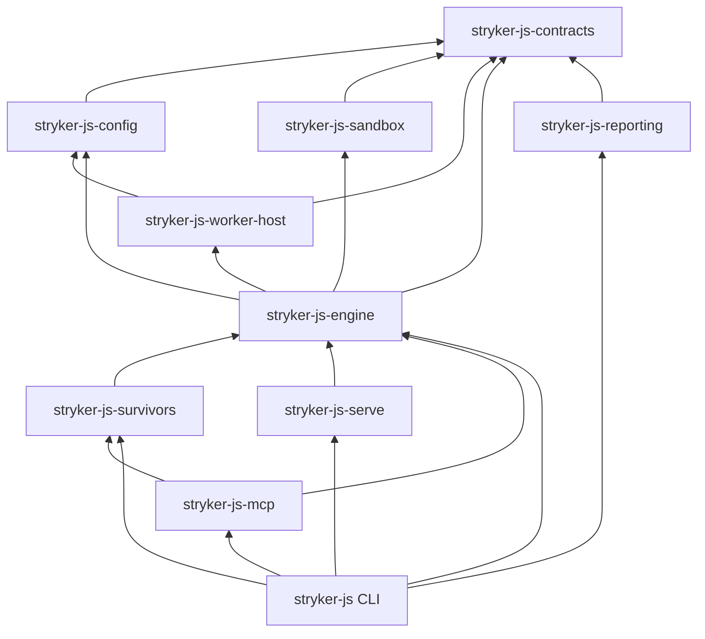

# Ports split from layers, then one package per engine capability - Plan

---

## Goal Capsule

- Objective: a consumer of `@systemfsoftware/stryker-js-*` can depend on one engine capability (its contracts, the engine, the worker host, a reporter set, survivors, serve, mcp) without installing or importing the CLI, and can provide their own implementation of any service the engine needs, because every service contract is importable without its implementation.
- Means: L1 moves every `Layer` out of the `*.service.ts` file that declares its tag, under a new ADR that supersedes ADR-0001's service row (KTD1, KTD2). L2 then cuts `packages/stryker-js` along the seams its import graph shows, into packages that each publish one namespace (KTD5, KTD6).
- Authority: `CONSTITUTION.md` first, then the cell-architecture, boundary-testing, schema-laws, and package-topology packs, then the ADRs in `docs/adr/`, then this plan. Where `cell-architecture/ports-separate-from-layers.md` and the tier-2 clause of `cell-architecture/service-and-layer-boundaries.md` disagree, ports-separate-from-layers wins (KTD1).
- Stop conditions: stop and ask when a unit needs to edit a read-only surface (`.github/workflows/`, `CONSTITUTION.md`, `repos/**`) or a grading surface (`gritlint.json`, the `check:ci` script, thresholds), needs a new third-party executable dependency, or would retarget the dogfood overrides in `pnpm-workspace.yaml`. No local mutation runs.
- Execution profile: one stacked PR per layer. L1 is branch `stream-a/l1-ports-topology` off `main`. L2 is the next layer, cut from L1. No force-push; when `main` moves, merge `origin/main` upward.

---

## Product Contract

### Summary

`packages/stryker-js` is one package of 248 production modules that holds the contracts, the engine, the host side of the worker boundary, the reporters, survivors, the MSP server, the MCP server, and the CLI. Twenty `*.service.ts` files declare a service tag and its `Layer` in the same file, so importing a contract also imports its implementation. L1 separates every contract from its implementation and records that rule in an ADR. L2 splits the core package along the seams its own import graph shows, so each capability is a package with one declared entry.

### Problem Frame

A port and its implementation in one file mean a consumer that wants the contract inherits the implementation's imports. The core package's root barrel exports eleven namespaces, so a consumer who wants `Engine` also gets `Mcp`, `Serve`, and the CLI wiring. Neither the contract nor the capability can be reused or replaced without the rest of the monolith.

### Requirements

Port and layer separation (L1)

- R1. `.compound-engineering/config.yaml` declares the four packs: cell-architecture, boundary-testing, schema-laws, package-topology.
- R2. A new accepted ADR supersedes ADR-0001's `*.service.ts` row ("contracts and their static layers") and leaves ADR-0001 unedited.
- R3. No `*.service.ts` file in the repository exports a `Layer` value, a function returning a `Layer`, or a static `*Live` member.
- R4. Every `Layer` that satisfies a service lives in a driver module under that package's `src/drivers/` (or the e2e harness's `drivers/`), and consumers import it from there.
- R5. Each published surface the move changes ships a changeset classified per `package-topology/surface-changes-are-versioned`.

Capability packages (L2)

- R6. The core package is split into the packages the import graph supports (KTD5), each with one namespace barrel and an exports map that declares only that entry (plus `./package.json`).
- R7. No workspace package imports a path another package's exports map does not declare.
- R8. The workspace package graph is acyclic.
- R9. Every in-repo consumer imports from the package that owns the symbol; no package re-exports another package's symbols as its own surface.
- R10. publint and arethetypeswrong run in CI on every published package and pass.
- R11. The existing e2e lanes pass against the split packages.

### Success Criteria

- A throwaway audit over `git ls-files '*.service.ts'` finds zero files that both declare a `Context.Service` tag and export a `Layer`, and the same audit exits non-zero when a `Layer` is planted in one service file.
- `turbo` builds the workspace graph without a cycle error, and `pnpm check:ci`, `pnpm test`, and the e2e jobs are green on each layer's head.
- A consumer can `import { Engine } from '@systemfsoftware/stryker-js-engine'` without the CLI, MCP, or MSP modules in its module graph.

### Scope Boundaries

- Not in L1 or L2: the versioned runner/checker protocol (L3), the single `MutantEvent` stream (L4), the plugin registry (L5), and MCP/SARIF end-to-end work (L6).
- Not in L1: `*.service.ts` files that declare no tag and export no `Layer` (the four instrumenter modules, `PluginRpcs.service.ts`, `framework-claimant.service.ts`, `plugin-load-report.service.ts`, `plugin-loader.service.ts`, `reporter-stream.service.ts`, `reporter-wiring.service.ts`, `run/StageServices.service.ts`, `run/host.service.ts`). They misuse the suffix but are not a port/layer co-location. L2 renames the core ones as it rehomes them; the instrumenter and plugin-interface ones are left for their packages' owners.
- Not in L1: hosts that call `RunEnvironment.stage` inside a cell (`Mcp/mcp-server.cell.ts`, `Serve/Serve.cell.ts`, `run-request.cell.ts`, `plan-request.cell.ts`, `run/run-stages.ts`). Today they reach the Layers through the port's static. After U7 they import `drivers/run-stage.ts`, which breaks the "inward import direction" bullet of `ports-separate-from-layers` in the open. It is also mid-pipeline binding under `service-and-layer-boundaries` invariant 4.3. L1 moves the function, not the call sites, and ADR-0002 names these five modules as the known remaining violation. The fix is each host binding the stage at its own composition root, which needs the L4 event stream. A reviewer must not read L1 as having closed it.
- Not in L2: changing what the released `stryker` binary does. The CLI keeps bundling its whole closure into `dist/main.mjs` (KTD7).

### Key Decisions

- The package list comes from the import graph, not the stream contract's list. The graph supports ten packages; it does not support `reporting` as one package or a separate `shard` package (KTD5, Appendix A).
- Breaking changes are made, not shimmed (`BREAK-1`). `RunEventDrainLive` leaves `RunEvent`, and the core root's eleven namespaces move to their owning packages.
- Config authoring moves to `@systemfsoftware/stryker-js-config` only if the user confirms (Outstanding Questions). `docs/plans/2026-09-18-1505-refactor-stryker-facade-dismantle-language-plan.md` KTD2 made `@systemfsoftware/stryker-js/config` the authoring path as a user-directed decision ("zero auxiliary package installations") and rejected a `stryker-config` package as an unearned bucket. Keeping that path while `mergeConfig` lives below the engine needs a re-export from the CLI package, which `package-topology/one-access-path` and the stream contract's no-monolith-re-export rule both refuse. U11 is blocked until this is decided.

### Sources

- `.context`-supplied stream contract (not committed); ruling: follow `ports-separate-from-layers`, supersede ADR-0001's clause.
- `docs/adr/0001-cell-architecture-module-taxonomy.md:44` (the superseded row), `:46` (drivers row).
- Packs at `systemfsoftware/systemfsoftware@8e03267` `compound-packs/`: `cell-architecture/ports-separate-from-layers.md`, `cell-architecture/service-and-layer-boundaries.md`, `cell-architecture/single-namespace-barrel.md`, all seven `package-topology/*.md` rules.

---

## Planning Contract

### Key Technical Decisions

- KTD1. Port files export no `Layer` at all, including pure in-memory ones. `service-and-layer-boundaries` tier 2 allows `static layer(options)` on the class when no driver is involved; `ports-separate-from-layers` says port files "export no `Layer` values". The stream ruling makes the second binding. One rule with no exceptions is also the only form a later lint can check. (session-settled: user-directed - chosen over keeping tier-2 static layers on pure services: the ruling binds the pack rule.)
- KTD2. Implementations go to `src/drivers/<what-it-binds>.ts`, exporting `layer` (a value, or a function where the old static was already a function). `*.layer.ts`/`*.port.ts` suffixes are banned by `service-and-layer-boundaries` §1, and a sibling unsuffixed module would collide with ADR-0001's "functions over a schema's data" convention. The ADR extends ADR-0001's drivers row from "adapters to foreign APIs" to "every Layer that satisfies a service contract".
- KTD3. Static `*Live` names in libraries are removed, not renamed in place: `OutputModeProbeLive`, `RunEventDrainLive`, `WorkerReportsLive` (`service-and-layer-boundaries` gate 3).
- KTD4. `RunEnvironment.stage` and `RunEnvironment.forStream` move with the Layers they assemble into `src/drivers/run-stage.ts`; the `RunEnvironment` port file keeps the tag, `RunEnvironmentShape`, and `phaseEntered`.
- KTD5. L2 packages, in dependency order (Appendix A has the evidence):
  1. `stryker-js-contracts`: every `*.schema.ts` imported across seams, every service port, and the pure helpers those reference (`FileMatcher.ts`, `admit-file-match.workflow.ts`, `classify-run-outcome.workflow.ts`, `stryker-outputs.ts`, `mutant-cost.ts`, `surfacing.ts`, `phase-durations.ts`). About 53 modules.
  2. `stryker-js-config`: `config/`, `Configuration/`, `drivers/config.ts`, and the config steps now under `run/` (`load-config*`, `extends-step`, `validate-options*`, `discover-config-file`, `resolve-config*`, `describe-config-*`). About 18.
  3. `stryker-js-sandbox`: `Sandbox.*`, `keep-temp-dir.workflow.ts`, `atomic-write.cell.ts`. About 5.
  4. `stryker-js-worker-host`: the host side of the worker boundary: `Worker*`, `WorkerLauncher`, socket worker, worker client/protocol blueprints, `command-runner`, `pooled-test-runner`, `vm-runner`, plugin loading, `Plugin/`. About 18. Named `worker-host`, not `worker-runtime`, because `stryker-js-plugin-runtime` already is the worker-side runtime.
  5. `stryker-js-engine`: `run/`, `Checker/`, `Engine/`, `RunEvent/`, planning, instrumentation, incremental reuse, the `MutationReporting` implementation, the reporter host (`reporter-stream`, `reporter-wiring`), and report assembly (`reporting/verdict-envelope*`, `static-verdict`, `metrics-from-report*`, `build-reproducers`, `report-test-ids`). About 88.
  6. `stryker-js-reporting`: the renderers (clear-text, JSON, SARIF, progress, annotations, the rest of `reporting/`). Depends on contracts only. About 22.
  7. `stryker-js-survivors`: `Survivors/`, `Rerun/`, `Feedback/`, budget gate, baseline. About 14.
  8. `stryker-js-serve`: `Serve/`. About 5.
  9. `stryker-js-mcp`: `Mcp/`. About 4.
  10. `stryker-js` keeps its name and the `stryker` bin: `bin/`, `run-request`, `conclude-run`, CLI routing, `drivers/node.ts`, and `shard/` (only the CLI imports it). About 19.
- KTD6. Existing packages are not merged into the new ones. `stryker-js-plugin-interface` stays the plugin boundary (L3's protocol home), and `stryker-js-cli-contract` stays the machine-stream wire contract. Engine ports are not plugin contracts, so they get `stryker-js-contracts`.
- KTD7. The CLI keeps `deps.alwaysBundle: [/./]` (`packages/stryker-js/tsdown.config.ts:66`), so the released binary stays one self-contained bundle and the dogfood install shape does not change. Library consumers get each package's own `dist`.
- KTD8. Package isolation and acyclicity use the tools already present: exports maps resolved through the `@systemfsoftware/source` condition (`packages/stryker-js/tsconfig.app.json:13`) make an undeclared deep import fail typecheck, and turbo refuses a cyclic workspace graph. No new lint is added for R7/R8.
- KTD9. L1 adds no permanent tests. It moves code without changing behavior. The suites that build each moved Layer prove it (per-unit Test Scenarios), and a test asserting where a Layer lives would be a source-text test (`CHK1`, OP12). The refusal evidence for R3 is the planted-Layer audit run in the PR, not a committed test.

### Alternatives considered

- The contract's nine packages as listed. Rejected: `reporting` as one package forms a cycle with the engine (engine -> report assembly, 11 edges; reporting -> engine host, 13 edges), and `shard` has no consumer but the CLI.
- Three packages (contracts, engine, cli). Rejected: it keeps MCP, MSP, survivors, and renderers inside the CLI, which the Objective excludes.
- Nx module-boundary rules or dependency-cruiser for R7/R8. Rejected: neither is in the lockfile, and exports maps plus turbo already refuse both cases.

### High-Level Technical Design

Package dependency direction after L2 (directional; arrows point at the dependency):

### Assumptions

- The four residual back-edges in Appendix A outside the contracts package each close by moving or reparameterizing one module (U11, U12, U13, U15); none changes behavior.
- `turbo` 2.x refuses a cyclic workspace graph with "Invalid package dependency graph: cyclic dependency detected" (https://github.com/vercel/turborepo/discussions/1752).

### Risks & Dependencies

- `.github/workflows/mutation.yml:29-36` hard-codes `PROJECTS` and `INCREMENTAL_REPORTS` to `packages/stryker-js` and three others. After L2, workflows outside `packages/stryker-js` go unmutated until that list changes, and the file is read-only to agents. L2 cannot finish R10/R11 green and keep mutation coverage without an operator edit.
- Moving modules between packages resets their incremental mutation records, so the first `main` mutation run after L2 is a full run.
- New packages are not in the released flake input, so the dogfood overrides cannot point at them until a release carries them (`AGENTS.md` Dogfood row). The CLI bundle (KTD7) keeps mutation on the released CLI working meanwhile.
- `attw` is wired as a turbo task and per-package script but `check:ci` (`package.json:25`) does not run it today, so R10 changes a grading surface and needs operator approval (GATE1, CONST-E9).

---

## Implementation Units

| U-ID | Title                                              | Files touched                                                                                                                                                                                                           | Depends on             |
| ---- | -------------------------------------------------- | ----------------------------------------------------------------------------------------------------------------------------------------------------------------------------------------------------------------------- | ---------------------- |
| U1   | Declare package-topology pack                      | `.compound-engineering/config.yaml`                                                                                                                                                                                     | -                      |
| U2   | ADR-0002 ports separate from layers                | `docs/adr/0002-*.md`                                                                                                                                                                                                    | -                      |
| U3   | plugin-runtime layers to drivers                   | `packages/stryker-js-plugin-runtime/src/**`                                                                                                                                                                             | U2                     |
| U4   | typescript-checker layers to drivers               | `packages/stryker-js-typescript-checker/src/**`, tests                                                                                                                                                                  | U3                     |
| U5   | vitest-runner layers to drivers                    | `packages/stryker-js-vitest-runner/src/**`                                                                                                                                                                              | U3                     |
| U6   | core platform-facing layers to drivers             | `packages/stryker-js/src/{git-diff,project-files,reporter-output,output-mode-probe,Sandbox}.service.ts`, `reporting/machine-console.service.ts`, `run-event-stream.service.ts`, `bin/main.ts`, `Mcp/mcp-server.cell.ts` | U2                     |
| U7   | core run-scoped layers and stage wiring to drivers | `packages/stryker-js/src/{Worker,mutation-reporting,reporter,run-events}.service.ts`, `run/{RunEnvironment,phase-clock}.service.ts`, `drivers/run-stage.ts`                                                             | U6                     |
| U8   | e2e harness layers to drivers                      | `test/e2e/src/Harness/**`                                                                                                                                                                                               | U2                     |
| U9   | API reports and changesets for L1                  | `packages/*/etc/*.api.md`, `.changeset/*`                                                                                                                                                                               | U3-U7                  |
| U10  | contracts package                                  | `packages/stryker-js-contracts/**`                                                                                                                                                                                      | L1                     |
| U11  | config package                                     | `packages/stryker-js-config/**`, framework READMEs                                                                                                                                                                      | U10                    |
| U12  | sandbox and worker-host packages                   | `packages/stryker-js-sandbox/**`, `packages/stryker-js-worker-host/**`                                                                                                                                                  | U10, U11               |
| U13  | engine package                                     | `packages/stryker-js-engine/**`                                                                                                                                                                                         | U12                    |
| U14  | reporting package                                  | `packages/stryker-js-reporting/**`                                                                                                                                                                                      | U10                    |
| U15  | survivors, serve, mcp packages                     | `packages/stryker-js-{survivors,serve,mcp}/**`                                                                                                                                                                          | U13, U14               |
| U16  | CLI residue and core root surface                  | `packages/stryker-js/**`                                                                                                                                                                                                | U15                    |
| U17  | publint and attw in CI                             | `package.json`, `turbo.json`, `packages/*/tsdown.config.ts`                                                                                                                                                             | U16, operator approval |
| U18  | flake, e2e closure, mutation projects              | `flake.nix`, `test/e2e*`, `mutation.yml` (operator)                                                                                                                                                                     | U16                    |
| U19  | API reports and changesets for L2                  | `packages/*/etc/*.api.md`, `.changeset/*`                                                                                                                                                                               | U16                    |

### L1 (stream-a/l1-ports-topology)

### U1. Declare the package-topology pack

- Goal: the CE pack resolver loads all four packs.
- Requirements: R1.
- Files: `.compound-engineering/config.yaml`.
- Approach: append `- source: https://github.com/systemfsoftware/systemfsoftware/tree/main/compound-packs/package-topology` beside the three existing entries.
- Test Scenarios: Test expectation: none - configuration. Verification is the resolver run below.
- Verification: the ce-brainstorm `packs-resolve.py` resolver prints four roots with no `errors`.

### U2. ADR-0002: ports separate from layers

- Goal: one accepted record that makes KTD1-KTD4 the module rule.
- Requirements: R2.
- Files: `docs/adr/0002-ports-separate-from-layers.md` (new). `docs/adr/0001-cell-architecture-module-taxonomy.md` stays byte-identical.
- Approach: MADR minimal variant with frontmatter `status: "accepted"`, `date`, `decision-makers`, and `supersedes: ["ADR-0001"]`. The problem statement scopes the supersession to ADR-0001's `*.service.ts` row and drivers row and says every other clause stands. Options: tier-2 static layers kept on pure services; a new `*.live.ts` suffix; driver modules for every Layer (chosen). Name the pack conflict (`ports-separate-from-layers` vs `service-and-layer-boundaries` tier 2) and the ruling. Confirmation: review against the replacement rows, plus the planted-Layer audit.
- ADR content also required: a "Bad, because" consequence naming the five host modules that import `drivers/run-stage.ts` after U7 (Scope Boundaries), so the record does not claim inward direction holds everywhere.
- Test Scenarios: Test expectation: none - decision record.
- Verification: the three MADR H2s are present, the `Chosen option: "..."` line is present, and the YAML parses with a quoted status (madr skill V1, V2).

### U3. plugin-runtime: layers to drivers

- Goal: the plugin-runtime port files export no Layer, and the two worker mains still boot.
- Requirements: R3, R4, R5.
- Files: `packages/stryker-js-plugin-runtime/src/worker-options.service.ts` (`WorkerOptions.layer`, line 16), `worker-telemetry.service.ts` (`WorkerTelemetry.layer`, line 19), `trace-context-rpc.service.ts` (Layer-only, no tag: rename to `src/drivers/trace-context-rpc.ts`), new `src/drivers/worker-options.ts` and `src/drivers/worker-telemetry.ts`, `src/Worker/mod.ts`, `src/Trace/mod.ts`. Consumers: `packages/stryker-js-typescript-checker/src/main.ts`, `packages/stryker-js-vitest-runner/src/main.ts`.
- Approach: the `Worker` namespace publishes the two driver layers under one name each (`package-topology/one-access-path`), with no `*Live` suffix. The `Trace` names stay the same; only their module moves.
- Patterns to follow: existing `workerServerLayer` in the `Worker` namespace.
- Test Scenarios:
  - The vitest runner and typescript checker integration suites start real worker processes that build `WorkerOptions` and `WorkerTelemetry` from the environment. They pass unchanged (`boundary-testing/real-system-oracles`).
  - The worker build keeps the PLUG-1 invariant: `pnpm --filter @systemfsoftware/stryker-js-vitest-runner --filter @systemfsoftware/stryker-js-typescript-checker build` succeeds with no `deps.onlyImport` error.
- Verification: `pnpm --filter @systemfsoftware/stryker-js-plugin-runtime api:check` fails until U9 regenerates the report; after U9 it passes.

### U4. typescript-checker: layers to drivers

- Goal: `CheckerRuntime.service.ts` declares only the port.
- Requirements: R3, R4.
- Files: `packages/stryker-js-typescript-checker/src/CheckerRuntime.service.ts` (`layer`, line 107; imports `typescript/unstable/async`), new `src/drivers/checker-runtime.ts`, `CheckerWorker.service.ts` (Layer-only handlers: rename to `src/drivers/checker-worker.ts`), `src/main.ts`, `tests/check-mutants.integration.test.ts`, `tests/program-digest.integration.test.ts`, `test/e2e-core/tests/concurrency-checker.integration.test.ts`, `test/e2e-core/tests/placement.integration.test.ts`.
- Approach: the TypeScript driver import leaves the port file together with the Layer. That is the driver leak `ports-separate-from-layers` names.
- Test Scenarios: the four suites above pass with the new import path. They drive a real `tsc` program (`boundary-testing/real-system-oracles`), so a wrong wiring fails them.
- Verification: `pnpm --filter @systemfsoftware/stryker-js-typescript-checker typecheck test`; the api report is unchanged (only `strykerPlugins` is published).

### U5. vitest-runner: layers to drivers

- Goal: `VitestSession.service.ts` declares only the port.
- Requirements: R3, R4.
- Files: `packages/stryker-js-vitest-runner/src/VitestSession.service.ts` (`layer`, line 78), new `src/drivers/vitest-session.ts`, `VitestRunner.service.ts` and `TestRunnerWorker.service.ts` (Layer-only: rename into `src/drivers/`), `src/main.ts`.
- Test Scenarios: the vitest-runner integration suites that run a real vitest session pass unchanged.
- Verification: `pnpm --filter @systemfsoftware/stryker-js-vitest-runner typecheck test build`; the api report is unchanged.

### U6. Core platform-facing layers to drivers

- Goal: core ports that bind `FileSystem`, `Stdio`, or `ChildProcessSpawner` declare only the tag.
- Requirements: R3, R4, R5.
- Files (port: member, line -> driver):
  - `git-diff.service.ts`: `GitDiff.layer` 177 -> `drivers/git-diff.ts`; consumer `drivers/node.ts`.
  - `project-files.service.ts`: `ProjectFiles.layer` 50 -> `drivers/project-files.ts`.
  - `reporter-output.service.ts`: `ReporterOutput.layer` 33 -> `drivers/stdio-reporter-output.ts`.
  - `output-mode-probe.service.ts`: `OutputModeProbeTag.layer` 116 and `OutputModeProbeLive` -> `drivers/output-mode-probe.ts`; consumer `bin/main.ts`.
  - `Sandbox.service.ts`: `TemporaryDirectory.layer` 87 -> `drivers/temporary-directory.ts`; consumer `run/prepare.cell.ts`.
  - `reporting/machine-console.service.ts`: `layer` 200 and `captureLayer` 205 -> `drivers/machine-console.ts`; consumers `bin/main.ts`, `Mcp/mcp-server.cell.ts`.
  - `run-event-stream.service.ts`: `RunEventDrain.layer` 115, `fileLayer` 128, `RunEventDrainLive`, `RunEventStreamPortTag.layer` 396 -> `drivers/run-event-stream.ts`; consumer `bin/main.ts`; `RunEvent/mod.ts` stops exporting `RunEventDrainLive`.
- Approach: KTD2, KTD3. `drivers/node.ts` keeps composing the platform layer and imports `drivers/git-diff.ts`.
- Test Scenarios:
  - The core integration suites that run a real CLI process (`packages/stryker-js/tests/*.integration.test.ts`) pass. They cover the machine console, stream drain, output-mode probe, and git diff wiring end to end.
  - `pnpm test:e2e` lanes pass. They exercise the published CLI with the moved `bin/main.ts` composition.
- Verification: `pnpm --filter @systemfsoftware/stryker-js typecheck test`.

### U7. Core run-scoped layers and stage wiring to drivers

- Goal: the remaining core ports declare only the tag, and the run-stage composition lives in a driver module.
- Requirements: R3, R4, R5.
- Files:
  - `Worker.service.ts`: `IdGenerator.layer` 21 -> `drivers/id-generator.ts`.
  - `run/phase-clock.service.ts`: `PhaseClock.layer` 19 -> `drivers/phase-clock.ts`.
  - `mutation-reporting.service.ts` (1252 lines): `MutationReporting.layer` 159 and its implementation -> `drivers/mutation-reporting.ts`. The port file keeps the tag and shape.
  - `reporter.service.ts`: `Reporter.layer` 43 -> `drivers/reporter.ts`.
  - `run-events.service.ts`: `WorkerReportsLive` 31 -> `drivers/run-events.ts` as `workerReportsLayer`.
  - `run/RunEnvironment.service.ts`: `stage` 41, `forStream` 57, `stageLayerOf` -> `drivers/run-stage.ts` (KTD4). Consumers: `Mcp/mcp-server.cell.ts`, `Serve/Serve.cell.ts`, `plan-request.cell.ts`, `run-request.cell.ts`, `run/run-stages.ts`, `tests/__fixtures__/check-cost-workspace.fixture.ts`, and the rest of the 19 `RunEnvironment.stage` users.
- Approach: the port shape of `MutationReporting` keeps its type-only import of `MutationTestDone`. Moving that type to a schema is L2 work (U10).
- Execution note: move the code without editing it. Diff each moved implementation against its original body before committing.
- Test Scenarios:
  - Core integration suites and `test/e2e-core` pass. They run whole mutation runs through `RunEnvironment.stage`.
  - The property suites under `packages/stryker-js/src/__tests__/` pass unchanged. None of them import a moved Layer.
- Verification: `pnpm --filter @systemfsoftware/stryker-js typecheck test`, then `pnpm --filter @systemfsoftware/stryker-js-e2e-core test`.

### U8. e2e harness layers to drivers

- Goal: the e2e harness follows the same rule.
- Requirements: R3, R4.
- Files: `test/e2e/src/Harness/fixture-cache.service.ts` (`layer` 815), `guest-job.service.ts` (`layer` 35), `stryker-cli-runner.service.ts` (`StrykerCliRunner.layer` 102), `harness-telemetry.service.ts` (Layer-only: rename), new `test/e2e/src/Harness/drivers/*.ts`, consumer `test/e2e/src/Harness/harness-layers.ts`.
- Test Scenarios: the e2e lanes pass. The harness layers are the lanes' own composition, so wrong wiring fails every lane.
- Verification: CI `e2e` jobs on the L1 head.

### U9. API reports and changesets for L1

- Goal: each changed published surface is recorded and versioned.
- Requirements: R5.
- Files: `packages/stryker-js/etc/stryker-js.api.md`, `packages/stryker-js-plugin-runtime/etc/stryker-js-plugin-runtime.api.md`, `.changeset/*.md`.
- Approach: `api:update` per changed package. Changesets: `@systemfsoftware/stryker-js` major (`RunEventDrainLive` removed; static `layer` members removed from published classes such as `IdGenerator` and `RunEnvironment.stage`); `@systemfsoftware/stryker-js-plugin-runtime` major (static `layer` removed from `WorkerOptions` and `WorkerTelemetry`; new `Worker` layer names); typescript-checker and vitest-runner patch (internal only).
- Test Scenarios: Test expectation: none - generated reports. `api:check` is the gate.
- Verification: `pnpm build` (runs `api:check`) and CI `Changeset Check`.

### L2 (stacked on L1)

### U10. Contracts package

- Goal: every cross-seam schema and every service port is importable from `@systemfsoftware/stryker-js-contracts`.
- Requirements: R6, R7, R9.
- Files: new `packages/stryker-js-contracts/` (`package.json`, `tsdown.config.ts`, `tsconfig*.json`, `api-extractor.json`, `vitest.config.ts`, `src/mod.ts`), plus the modules KTD5.1 lists, moved with `git mv`. `MutationTestDone` moves from `run/mutation-test.cell.ts` into a contracts schema so the `MutationReporting` port stops importing a cell. That also breaks the 17-module cycle in Appendix A.
- Approach: one namespace barrel per `cell-architecture/single-namespace-barrel`. If the vocabulary is too large to scan at once, chunk it with namespace exports from the root, not subpaths (`package-topology/declared-entry-points`). Generated schema laws and in-source refusal blocks move with their schemas (`schema-laws/refusals-beside-generated-laws`).
- Test Scenarios:
  - The generated schema laws run in the new package's vitest project and pass. They are the existing laws, moved with their schemas.
  - Moved in-source refusal blocks still state each refined schema's refusal boundary and pass.
- Verification: `pnpm --filter @systemfsoftware/stryker-js-contracts typecheck test build api:check`.

### U11. Config package

- Goal: user config files import `defineConfig` from `@systemfsoftware/stryker-js-config`. Blocked on the config-path question in Outstanding Questions. If the user keeps `@systemfsoftware/stryker-js/config`, this unit becomes "config schema and merge to contracts, loading to engine, authoring entry stays in the CLI package", plus a declared exception to `one-access-path` for those names.
- Requirements: R6, R9.
- Files: new `packages/stryker-js-config/`; the modules KTD5.2 lists; framework and ignorer READMEs that show `import { defineConfig } from '@systemfsoftware/stryker-js/config'` (`packages/frameworks/angular/README.md`, `packages/frameworks/svelte/README.md`, `packages/ignorers/*/README.md`, `packages/stryker-js/README.md`), the repo's own `stryker.config.ts` files.
- Approach: the `./config` subpath is a host contract (a config loader imports it without the runtime). The new package's root entry is that contract, so it needs no subpath. `load-config*` stops importing `RunEnvironment` by taking the values it reads as parameters, which removes the config -> engine edge.
- Test Scenarios:
  - Existing config-loading integration tests pass: a `stryker.config.ts` importing the new specifier loads and validates.
  - A config with an unknown option still fails with the existing typed `ConfigError`.
- Verification: package `typecheck test build api:check`; e2e lanes load fixture configs through the new specifier.

### U12. Sandbox and worker-host packages

- Goal: the sandbox and the host side of the worker boundary are separate packages over contracts.
- Requirements: R6, R7.
- Files: new `packages/stryker-js-sandbox/`, `packages/stryker-js-worker-host/`; modules from KTD5.3 and KTD5.4. `run/explain-file-skip.workflow.ts` and `run/select-package-entry.workflow.ts` move with plugin loading. `Plugin/mod.ts` stops re-exporting `reporter-stream.service.ts`, which stays in the engine.
- Test Scenarios:
  - The worker-connection-loss, mutant-deadline, and checker-rpc integration suites pass against real spawned workers (`boundary-testing/real-system-oracles`).
  - `keep-temp-dir.workflow.property.test.ts` (or its current name) moves with its workflow and passes.
- Verification: package `typecheck test build api:check` for both.

### U13. Engine package

- Goal: `import { Engine } from '@systemfsoftware/stryker-js-engine'` gives the run engine without CLI, MCP, or MSP modules.
- Requirements: R6, R7, R8.
- Files: new `packages/stryker-js-engine/`; modules from KTD5.5. `Engine/mod.ts` stops exporting `nodePlatformLayer` from `drivers/node.ts` (CLI-owned), which removes the engine -> cli edge. The engine publishes a parameterized platform layer only if a non-CLI consumer composes one; otherwise the CLI keeps it.
- Test Scenarios:
  - The core integration suites that drive `strykerCell`/`mutationTestCell` move with the engine and pass.
  - `test/e2e-core` passes against the engine package.
- Verification: package `typecheck test build api:check`; `turbo` reports no cycle.

### U14. Reporting package

- Goal: built-in renderers are a package over contracts.
- Requirements: R6, R7.
- Files: new `packages/stryker-js-reporting/`; renderer modules from KTD5.6. `reporter-factories.ts` takes `surfacing.ts` from contracts.
- Test Scenarios: the renderer workflow property suites (`render-*`, `sarif-report`, `report-from-stream`) move and pass.
- Verification: package `typecheck test build api:check`; its manifest lists no engine dependency.

### U15. Survivors, serve, and mcp packages

- Goal: each host capability is its own package over the engine.
- Requirements: R6, R7, R9.
- Files: new `packages/stryker-js-survivors/`, `packages/stryker-js-serve/`, `packages/stryker-js-mcp/`; modules from KTD5.7-5.9. `budget.ts` moves to survivors and the `MutationReporting` driver takes the budget figures it needs as input (closes engine -> survivors).
- Test Scenarios: the survivors, rerun, feedback, MSP framing, and MCP tool suites move and pass. The MCP and MSP suites that run a real server over stdio stay integration tests.
- Verification: package `typecheck test build api:check` for each.

### U16. CLI residue and the core root surface

- Goal: `@systemfsoftware/stryker-js` is the CLI package and re-exports nothing it does not own.
- Requirements: R6, R9.
- Files: `packages/stryker-js/package.json` (dependencies on the new packages; exports `.`, `./events`, `./promises`, `./package.json` re-justified per `declared-entry-points`), `src/mod.ts` (the eleven namespaces leave), `tsdown.config.ts` (keeps `alwaysBundle`, KTD7), `shard/` stays.
- Approach: each of `./events` and `./promises` is kept only if it hides at least two modules or is a host contract. Otherwise it moves to the owning package with a major changeset.
- Test Scenarios:
  - `pnpm test:e2e` passes against tarballs packed from the split workspace.
  - The released-CLI dogfood path still runs: `nix build .#stryker-published --out-link .sfs-deps && pnpm install --frozen-lockfile` succeeds (START-6).
- Verification: `pnpm check:ci`.

### U17. publint and attw in CI

- Goal: every published package's tarball passes publint and arethetypeswrong in CI.
- Requirements: R10.
- Files: `package.json` (`check:ci` or `gate:dist`), `turbo.json` (`attw` task inputs), each package's `tsdown.config.ts` (`publint: true`), `pnpm-workspace.yaml` catalog (`publint`).
- Approach: attw is already a per-package script and a turbo task through the `@systemfsoftware/arethetypeswrong-cli` fork (`pnpm-workspace.yaml:29`, catalog `^4.2.0`); only CI wiring is missing. publint runs inside tsdown's build through its `publint` option (tsdown 0.23.0 lists `publint ^0.3.8` as an optional peer). Blocked on operator approval of versions and the grading-surface edit (Outstanding Questions).
- Test Scenarios: in the PR body, show one planted defect per tool exiting non-zero: an exports entry pointing at a missing file for publint, and a `types` condition ordered after `default` for attw. This is one-off evidence, not a committed test (CHK1).
- Verification: `pnpm check:ci` runs both and passes on the L2 head.

### U18. Flake, e2e closure, and mutation projects

- Goal: the new packages build in the flake, pack into the e2e lanes, and are mutated on `main`.
- Requirements: R11.
- Files: `flake.nix` (workspace tarball set), `test/e2e/**` closure inputs if any are hand-listed, `.github/workflows/mutation.yml` `PROJECTS`/`INCREMENTAL_REPORTS` (operator edit).
- Approach: the e2e lane derives its pack set from manifest closure (`docs/solutions/build-errors/e2e-lane-packed-a-subset-of-its-workspace-closure.md`), so new packages join it through the CLI's dependencies. The dogfood overrides gain the new packages only after a release carries them.
- Test Scenarios: CI `e2e` jobs green on the L2 head; `nix build .#packages.x86_64-linux.workspace-tarballs` includes the new tarballs.
- Verification: CI on the exact L2 head.

### U19. API reports and changesets for L2

- Goal: every surface change is versioned.
- Requirements: R6, R9.
- Files: `packages/*/etc/*.api.md`, `.changeset/*.md`.
- Approach: `@systemfsoftware/stryker-js` major (root namespaces and `./config` removed); each new package debuts at its manifest version (`docs/solutions/tooling-decisions/first-publish-under-oidc-trusted-publishing.md`).
- Test Scenarios: Test expectation: none - generated reports.
- Verification: `pnpm build` and CI `Changeset Check`.

---

## Verification Contract

- Per layer: `pnpm format:check`, `pnpm typecheck`, `pnpm test`, `pnpm check:ci` (START-1 to START-4), CI `Changeset Check` (START-5), and the CI `e2e` jobs, all on the layer's exact head.
- L1 refusal evidence (R3): a throwaway audit over `git ls-files '*.service.ts'` that exits 1 when a file both declares a tag and exports a Layer. Show it exiting 0 on the head and 1 with one planted `static readonly layer`, then delete it.
- L2: `turbo` builds with no cycle error (R8); a deep import of an undeclared path in any package fails typecheck (R7, shown once in the PR body); publint and attw pass in `check:ci` (R10).
- No local mutation runs. New tests cite the latest `main` mutation report's mutant ids where one applies; L1 adds none (KTD9).

---

## Definition of Done

- L1: U1-U9 merged on one PR whose head is green; ADR-0001 unchanged; the audit shows zero co-located files; no `*Live` statics remain in libraries.
- L2: U10-U19 merged on one PR stacked on L1, green on its head; `packages/stryker-js/src/mod.ts` exports only CLI-owned names. L2 is not done until `.github/workflows/mutation.yml` `PROJECTS` and `INCREMENTAL_REPORTS` cover every new package, because otherwise the moved workflows silently leave the mutation gate.
- Cleanup: no throwaway audit scripts, scratch graphs, or empty `*.service.ts` shells remain; DEL1 grep for each removed identifier (`RunEventDrainLive`, `OutputModeProbeLive`, `WorkerReportsLive`) returns nothing.

---

## Outstanding Questions

- Approve the publint and attw versions for U17: `publint` 0.3.25 (npm latest, published 2026-10-01) as a new catalog entry, and keep the existing `@systemfsoftware/arethetypeswrong-cli` ^4.2.0 fork instead of upstream `@arethetypeswrong/cli` 0.18.5.
- Approve the grading-surface edit that puts `attw` and publint into `check:ci`.
- Who edits `.github/workflows/mutation.yml` `PROJECTS`/`INCREMENTAL_REPORTS` for the new packages (read-only to agents)?
- Config authoring path (blocks U11): move `defineConfig`/`mergeConfig` to a new `@systemfsoftware/stryker-js-config` package, which reverses the 2026-09-18 user-directed "zero auxiliary installs" decision, or keep `@systemfsoftware/stryker-js/config` with a declared `one-access-path` exception.

---

## Appendix

### A. Import-graph evidence (origin/main 1e1de6d05)

Measured with a throwaway script that resolves every relative `import`/`export ... from`/`import()` specifier in `packages/stryker-js/src` (not committed, per OP12). 320 `.ts` files: 248 production, 72 tests; 746 production edges.

File-level cycle: one strongly connected component of 17 modules: `mutation-reporting.service.ts`, `run/RunEnvironment.service.ts`, `run/StageServices.service.ts`, and 14 `run/` stage modules. It closes through `mutation-reporting.service.ts:60` (`import type { MutationTestDone } from './run/mutation-test.cell.js'`) and `run/RunEnvironment.service.ts:18`. All 17 land in the engine package, and U10 moves `MutationTestDone` to contracts.

Seam assignment as the contract named it, before any moves: every seam sits in one cycle. The largest back-edges were reporting -> engine (28), engine -> reporting (28), engine -> worker (25), config -> engine (9), survivors -> engine (10).

After the KTD5 moves (cross-seam schemas and ports to contracts; config steps out of `run/`; report assembly to engine; plugins fused with the worker host; `shard/` to CLI), the remaining back-edges are:

- contracts -> others (11): all from port files that still hold their implementation. L1 removes them.
- config -> engine (2): `run/load-config*.ts` read `RunEnvironment`. U11 removes them.
- engine -> cli (1): `Engine/mod.ts` re-exports `drivers/node.ts`. U13 removes it.
- engine -> survivors (1): `mutation-reporting.service.ts -> budget.ts`. U15 removes it.
- worker-host -> engine (1): `Plugin/mod.ts -> reporter-stream.service.ts`. U12 removes it.

Resulting module counts: engine 88, contracts 53, reporting 22, cli 19, config 18, worker-host 18, survivors 14, sandbox 5, serve 5, mcp 4, plus the two root barrels (`mod.ts`, `promises/mod.ts`) that U16 rewrites: 248.

### B. Port/layer co-location inventory (L1 scope)

Twenty `*.service.ts` files declare a tag and export a Layer: 13 in `packages/stryker-js`, 2 in plugin-runtime, 1 each in typescript-checker and vitest-runner, 3 in `test/e2e/src/Harness`. Five more `*.service.ts` files export a Layer and declare no tag: plugin-runtime `trace-context-rpc.service.ts`, typescript-checker `CheckerWorker.service.ts`, vitest-runner `VitestRunner.service.ts` and `TestRunnerWorker.service.ts`, e2e `harness-telemetry.service.ts`. U3-U8 list each one with its member and line.

### C. Existing tools that already cover parts of this

- pnpm workspaces: `packages/*` in `pnpm-workspace.yaml:108` picks up new packages with no edit.
- turbo: present (`turbo.json`); refuses a cyclic package graph, which covers R8.
- arethetypeswrong: the `@systemfsoftware/arethetypeswrong-cli` fork is in the catalog, every published package has `"attw": "attw --pack ."` (the private `test/e2e` and `test/e2e-core` do not), and `turbo.json:119` defines the task, but `check:ci` (`package.json:25`) never runs it.
- publint: not installed; tsdown 0.23.0 can run it inside the build.
- api-extractor: `api:check` on every published package already gates `public-signature-types` (`ae-forgotten-export`) and records surface changes.
- gritlint `packs/source-resolution` (`gritlint.json:3-8`) checks export-map condition keys, which covers part of `condition-branch-agreement`.
- Nx, dependency-cruiser, madge: absent; not needed (KTD8).
