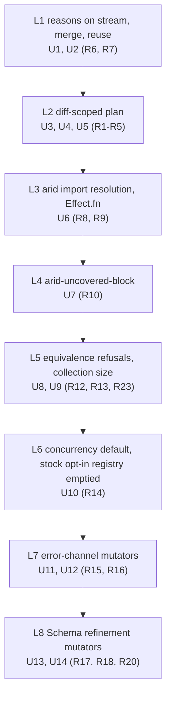
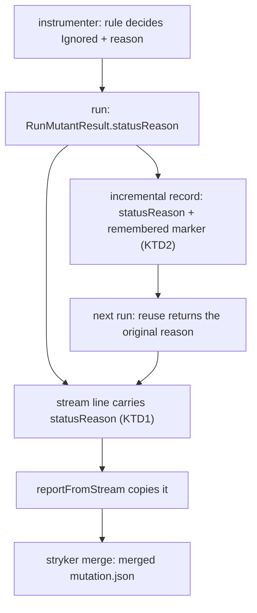
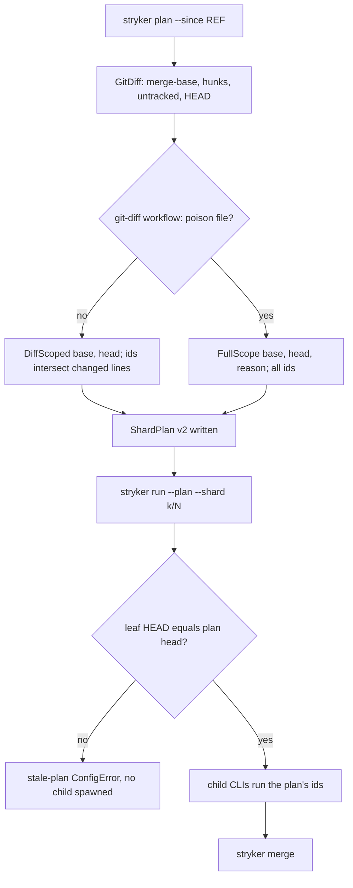
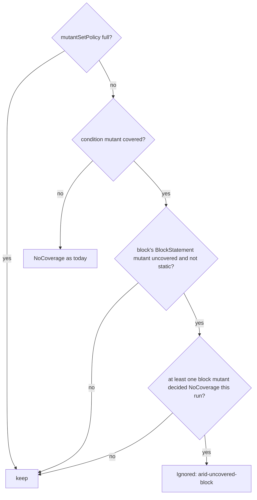

# Mutant Quality (Unit C) - Plan

## Goal Capsule

- **Objective:** A stryker-js-effect user gets fewer, better mutants by default. A run or plan scoped to a git diff mutates only changed lines. Arid code and equivalent mutants are not tested, and each is reported as Ignored with the rule that removed it. Effect code gets mutants that model real error-handling, concurrency, and validation bugs.
- **Means:** Close the gap between what origin/main `1e1de6d05` already ships (diff scope for `run`, arid rules, mutant-set policy, TCE, opt-in concurrency mutators) and the Unit C Done list, as one `gh stack` of eight layers (KTD15). Nothing that already works is rebuilt.
- **Authority:** `.omp-brief/unit-c-contract.md` (the Unit C contract) is binding, then the supervisor rulings in `.omp-brief/rulings-brainstorm.md`. `CONSTITUTION.md` outranks this plan (CONST-1). The prior plans `docs/plans/2026-09-29-0427-feat-state-of-the-art-mutation-testing-plan.md` (R20-R27) and `docs/plans/2026-09-23-1903-feat-effect-concurrency-mutators-plan.md` are context. Where this plan departs from them, the departure is a Key Decision or KTD below.
- **Execution profile:** Deep. Each layer is one PR, implemented by `ce-work`, reviewed report-only, and merged bottom-up by the operator. No agent merges.
- **Stop conditions:** Stop and report instead of shipping when any of these holds. A layer cannot be green on its exact head. A requirement can only be met by loosening a CONSTITUTION article. The e2e guest cannot run `git` without changing another fixture's bake key (Risk RK1).

---

## Product Contract

### Gap analysis

Each Done item is listed with what origin/main `1e1de6d05` has, what is missing, and the evidence for any new heuristic. CI data comes from main Mutation run [37960922409](https://github.com/systemfsoftware/stryker-js-effect/actions/runs/37960922409) (run #416, head `1e1de6d05`, artifact `mutation-report-416`). It has 8626 mutants: CompileError 4136 (47.9%), Killed 1797, Ignored 1187, Survived 1035, NoCoverage 451, Timeout 20.

| Done item                               | origin/main has                                                                                                                                                                                                                                                                                                                                                                                                                                                                                                                                                                                                                                                                                                                                                 | Missing                                                                                                                                                                                                                                                                                                                                                                                                                                                                                                                                                                                                                                                                                                                                                                                                         | Evidence for new heuristics                                                                                                                                                                                                                                                                                                                                                                                                                                                                                                                                                                                                                                                                                                                   |
| --------------------------------------- | --------------------------------------------------------------------------------------------------------------------------------------------------------------------------------------------------------------------------------------------------------------------------------------------------------------------------------------------------------------------------------------------------------------------------------------------------------------------------------------------------------------------------------------------------------------------------------------------------------------------------------------------------------------------------------------------------------------------------------------------------------------- | --------------------------------------------------------------------------------------------------------------------------------------------------------------------------------------------------------------------------------------------------------------------------------------------------------------------------------------------------------------------------------------------------------------------------------------------------------------------------------------------------------------------------------------------------------------------------------------------------------------------------------------------------------------------------------------------------------------------------------------------------------------------------------------------------------------- | --------------------------------------------------------------------------------------------------------------------------------------------------------------------------------------------------------------------------------------------------------------------------------------------------------------------------------------------------------------------------------------------------------------------------------------------------------------------------------------------------------------------------------------------------------------------------------------------------------------------------------------------------------------------------------------------------------------------------------------------- |
| 1. Diff-scoped planning                 | `run --since` flag (`packages/stryker-js/src/bin/cli-command.ts:91`). Pure diff decision with full-scope fallback on manifest, lockfile, Stryker config, or test-runner config change (`packages/stryker-js/src/git-diff.workflow.ts:10-18,38-60,84-87`). Wiring in `packages/stryker-js/src/read-project.cell.ts:313-361`. Tests: `packages/stryker-js/tests/diff-scope.integration.test.ts:167-252` (real engine, fake git), `git-diff.integration.test.ts`, `src/__tests__/git-diff.workflow.property.test.ts`. Shard leaves already run only the plan's mutant ids (`packages/stryker-js/src/run-request.cell.ts:631-648`).                                                                                                                                 | `stryker plan` takes no diff. `planOptions` has only target-seconds, max-shards, projects, out, and full (`cli-command.ts:414-437`). `planProject` passes `targetMutatePatterns: undefined` (`packages/stryker-js/src/plan-request.cell.ts:233`). `ShardPlan` records no base commit, HEAD, or scope (`packages/stryker-js-cli-contract/src/shard-plan.schema.ts:29-34`). `GitDiffResult` returns the ref and base but not HEAD (`packages/stryker-js/src/git-diff.schema.ts:20-25`). No e2e under `test/e2e/` uses `--since` or `stryker plan`, and the e2e guest image `node:24-alpine` has no `git` (`test/e2e/src/Harness/guest-job.service.ts:28`).                                                                                                                                                        | None new. Diff scope is R27 of the SOTA plan (Arcmutate and cargo-mutants in-diff; Google reports a median of 820 mutants per change falling to 7, SOTA plan `:993`).                                                                                                                                                                                                                                                                                                                                                                                                                                                                                                                                                                         |
| 2. Arid-node suppression                | Pure `aridCode` workflow with five rule ids. `arid-logging`, `arid-telemetry`, `arid-time`, `arid-config-default`, and `arid-memoization` cover `Effect.log*`, `Logger`, `console`, `withSpan`, `annotate*`, `withLogSpan`, `Metric`, `sleep`, `Schedule`, `Duration`, `Date.now`, `Config.withDefault`, and `cached*` (`packages/stryker-js-instrumenter/src/arid-code.workflow.ts:8-14,48-62`). Reason attached in `Transformer.service.ts:894-905`. Properties (`src/__tests__/arid-code.workflow.property.test.ts:49-76`). Closed rule vocabulary (`packages/stryker-js-plugin-interface/src/ignore-rule.schema.ts:6-21`).                                                                                                                                  | (a) No rule name reaches any machine surface. All 1187 Ignored mutants in run #416's merged `mutation.json` have no `statusReason`, because the stream's mutant line has no reason field (`packages/stryker-js-cli-contract/src/run-event.schema.ts:105-116`, `packages/stryker-js/src/report-from-stream.workflow.ts:33-44`). All 1187 in the incremental records read `Remembered`, because reuse overwrites the reason (`packages/stryker-js/src/run/incremental-reuse.cell.ts:421,446`). (b) No uncovered-only rule. (c) Rules match the identifier text `Effect`, `Metric`, and so on (`arid-code.workflow.ts:38-46`), not the import the way `EffectCall.ts` resolves it. An aliased import (`import * as E from 'effect/Effect'`) escapes them. (d) The span name of `Effect.fn('name')` is not covered. | Petrović, Ivanković, Fraser, Just, "Practical Mutation Testing at Scale", [arXiv 2102.11378](https://arxiv.org/html/2102.11378v2). Arid-node suppression raised useful findings from 15% to 89%. Heuristics: A-A 1 Logging, A-A 3 Monitoring, A-A 5 Tracing, A-A 7 Block Body Uncovered. Google also mutates only covered lines (Fig. 1, step 2).                                                                                                                                                                                                                                                                                                                                                                                             |
| 3. Equivalent-mutant culling            | AST equivalence in the instrumenter: `equivalent-to-original` and `duplicate-at-site` over a canonical form (trim plus outer parentheses, `packages/stryker-js-instrumenter/src/mutant-set-policy.workflow.ts:47-158`), plus `redundant-relational`. TCE in the TS checker compares each mutant's emit with the original's and with earlier siblings' (`packages/stryker-js-typescript-checker/src/classify-tce.workflow.ts:74-90`). It is called from `ts-compiler.handle.ts:1592-1597` and maps to `equivalent-to-original: tce` / `duplicate-at-site: tce` (`check-mutants.workflow.ts:41-61`). TCE has a refusal property, `∀command_KeptCandidate_≡DistinctFromOriginalAndEarlierSiblings` (`src/__tests__/classify-tce.workflow.property.test.ts:38-48`). | (a) The instrumenter's `equivalent-to-original` and `duplicate-at-site` have no refusal property. The only properties cover the relational verdict and the `full` policy (`src/__tests__/mutant-set-policy.workflow.property.test.ts:22-41`). (b) The culling yield can't be measured on CI, for the same reason as gap 2(a). (c) None of Google's sound Appendix A equivalence heuristics is implemented; only A-A 20 has non-zero yield here (Done-3 yield table).                                                                                                                                                                                                                                                                                                                                            | TCE is Papadakis et al. ICSE 2015 (about 28% of mutants removable; SOTA plan `:981`). A-A 20 Collection Size, arXiv 2102.11378 Appendix A ("sound because it has the full type and expression information available"), measured at 25 mutants on run #416.                                                                                                                                                                                                                                                                                                                                                                                                                                                                                    |
| 4. Effect-aware semantic mutators       | `AtomicUpdateSplit`, `SynchronizationRemoval`, and `FinalizerEscape` exist, with behaviour tests (`packages/stryker-js-instrumenter/tests/concurrency-mutant-behaviour.integration.test.ts`). They sit only in `optInMutators` (`packages/stryker-js-instrumenter/src/Mutator.service.ts:1437-1441`), so they are off by default.                                                                                                                                                                                                                                                                                                                                                                                                                               | Concurrency mutators are behind an off flag, so they don't count (contract, "Does not count"). There are no error-channel mutators and no Schema refinement mutators.                                                                                                                                                                                                                                                                                                                                                                                                                                                                                                                                                                                                                                           | Error channel: Yuan et al., "Simple Testing Can Prevent Most Critical Failures", [OSDI 2014](https://www.usenix.org/system/files/conference/osdi14/osdi14-paper-yuan.pdf). 92% of catastrophic failures came from incorrect handling of explicitly signalled non-fatal errors. Concurrency: Bradbury, Cordy, Dingel, [Mutation Operators for Concurrent Java](https://research.cs.queensu.ca/TechReports/Reports/2006-520.pdf), already cited by the concurrency plan. Schema refinements: PIT's default `CONDITIONALS_BOUNDARY` operator ([pitest.org mutators](https://pitest.org/quickstart/mutators/)), and CWE-20 Improper Input Validation, #18 in the [2025 CWE Top 25](https://cwe.mitre.org/top25/archive/2025/2025_cwe_top25.html). |
| 5. One PR per item, green on exact head | n/a                                                                                                                                                                                                                                                                                                                                                                                                                                                                                                                                                                                                                                                                                                                                                             | All of it                                                                                                                                                                                                                                                                                                                                                                                                                                                                                                                                                                                                                                                                                                                                                                                                       | n/a                                                                                                                                                                                                                                                                                                                                                                                                                                                                                                                                                                                                                                                                                                                                           |

### Contract claim check

Every "already exists" claim in the contract was checked against the files on `1e1de6d05`. All are confirmed, with these corrections:

- **TCE location.** The contract points at `CheckMutants.schema.ts`. That file only declares the `TceOutcome` field. The decision is `classify-tce.workflow.ts`, its caller is `ts-compiler.handle.ts:1592`, and the reasons are in `check-mutants.workflow.ts:41-44`. PR #183 was not checked.
- **SOTA R23 is not on main.** Type-invalid avoidance (SOTA KTD13) is absent: `type-invalid-return` and `type-invalid-object` are not in `RULE_IDS` (`ignore-rule.schema.ts:6-19`). Key Decision KD3 drops it on measured data.
- **"Reported as Ignored with the rule name" (SOTA R25) holds only in-process.** CI artifacts carry no rule name (gap 2(a)).
- **Dogfood sees almost none of this.** The repo mutates only `src/**/*.workflow.ts` and `src/**/*.schema.ts` (`packages/stryker-js/stryker.config.ts:15-20`). Across the 156 mutated files on run #416 there are 0 arid-callee sites, 0 concurrency sites, 2 `Effect.fail` calls, and 22 Schema refinement calls. CI before/after counts will therefore move mostly through reported reasons and refinement mutants, so each PR also reports e2e fixture counts (KD7).
- **The grounding scout's claim that the U16-U20 files do not exist is wrong.** `arid-code.workflow.ts`, `mutant-set-policy.workflow.ts`, and `git-diff.workflow.ts` are on main.
- **Effect 4 has no top-level `orElse`.** The brainstorm's R15 named an `orElse` family. The recoveries Effect 4 exports are `catch`, `catchTag`, `catchTags`, `catchIf`, `catchFilter`, `catchReason`, `catchReasons`, and `orElseSucceed` (`repos/effect/packages/effect/src/Effect.ts:2694,2744,2843,2956,3053,3366,3419,4466`). R15 is corrected in place.
- **`Effect.fnUntraced` takes no span name.** Only `Effect.fn(name, options?)` does (`Effect.ts:13535,13659-13661`). R9 is corrected in place.

### Summary

Add `--since` to `stryker plan`, record the resolved base, HEAD, and scope in the plan, and make shard leaves refuse a plan made at another HEAD. Prove with an e2e that unchanged lines get no mutants and that every shard count yields the same mutant set. Carry each Ignored mutant's rule name through the stream, the merged report, and reuse. Then extend the arid rules (import-resolved callees, `Effect.fn` span names, uncovered-block). Add refusal properties to AST equivalence and a type-based collection-size rule in the TS checker. Turn the three concurrency mutators on by default and add default error-channel and Schema refinement mutators.

### Problem Frame

Of the 8626 mutants on main, nearly half (4136) are CompileError. 1035 survived, and 1187 are Ignored with no surviving explanation. A user can't tell whether a suppression came from a policy rule, TCE, or an ignorer, so the policy can't be audited (SOTA R25) and its yield can't be measured. Diff scope works for `run` but not for `plan`, and `plan` is what CI and multi-shard users run, so diff-scoped work can't be sharded. The Effect-specific mutators that model the bugs Effect users actually ship are either off by default or missing.

### Requirements

**Diff-scoped planning (Done 1)**

- R1. `stryker plan` accepts `--since <ref>` with the same semantics as `run --since`: merge-base of ref and HEAD, plus uncommitted and untracked changes, intersected with `mutate`.
- R2. A diff-scoped plan records the resolved base commit, the HEAD commit it was planned at, and its scope (`diff`, or `full` with the fallback reason). Shard leaves run the plan's mutant ids, never resolve the diff again, and refuse with a typed error when their HEAD differs from the plan's.
- R3. When the diff decision falls back to full scope (`git-diff.workflow.ts:38-87`), the plan is full and states the reason. A fallback never yields an empty plan; a `DiffScoped` plan whose diff touches no file under `mutate` is empty by design and says so through its scope.
- R4. For one base commit, working tree, and incremental record, the union of mutant ids across shards equals the diff-scoped set for every `--max-shards`/`--target-seconds`. Two plans built from the same inputs are identical.
- R5. An e2e under `test/e2e/` on a git fixture proves R1, and R2's recording of base, HEAD, and mutant ids, through the published CLI (AE1). Unchanged lines yield zero mutants in the plan and in the merged report, and a changed line yields at least one. R2's stale-HEAD refusal, R3, and R4 are proven at lower layers (Test admission).

**Suppression is always reported (Done 2, Done 3)**

- R6. Every Ignored mutant carries `<rule-id>: <detail>` from the closed `IgnoreRuleId` vocabulary on the NDJSON mutant line, in the merged `mutation.json`, and in the incremental record, including after reuse.
- R7. Reuse keeps an Ignored mutant's original rule. Whether a verdict was remembered is recorded in a field of its own, not in `statusReason`.

**Arid-node suppression (Done 2)**

- R8. Arid rules resolve the callee through the file's imports of `effect` modules, as `EffectCall.ts` does. An aliased namespace is suppressed, and a local object that merely shares the name `Effect` is not.
- R9. The span-name argument of `Effect.fn(name, options?)` is arid under `arid-telemetry` (Google A-A 5 Tracing). The function body passed to `Effect.fn` is never arid by this rule.
- R10. A covered condition's mutants are Ignored as `arid-uncovered-block` (Google A-A 7) only when the block it guards is unexecuted and still yields at least one scored NoCoverage mutant in the same run. If the block yields none (empty, all arid, or all culled), the condition's mutants are kept. The decision comes from the current run's dry-run coverage, is never served from reuse, and is off under `mutantSetPolicy: 'full'` (KD6).
- R11. Each new rule is a pure Workflow (CONST-P1, CONST-P2; pack: cell-architecture, pure-decision-workflows.md). Each has properties for both directions, the suppressed shape and the kept shape (CONST-T14). `mutantSetPolicy: 'full'` keeps everything, per SOTA R26.

**Equivalent-mutant culling (Done 3)**

- R12. The instrumenter's `equivalent-to-original` and `duplicate-at-site` rules get refusal properties. A replacement whose meaning depends on parentheses or content its canonical form removes is never culled. Examples: a sequence expression, an object-literal arrow body `() => ({})` versus a block, and a difference inside a string literal.
- R13. The culling yield is visible as per-rule Ignored counts in the merged report (via R6). No new culling rule is added without a refusal test (contract, Done 3).
- R23. A comparison of a collection's size with zero that the mutant makes constant (`xs.length >= 0`, `xs.length < 0`, and their mirrored forms) is Ignored as `constant-collection-size` when the receiver's type is an array, tuple, or string and a kept sibling at the same site already replaces the whole comparison with the same constant (Google A-A 20, Done-3 yield table). Any other receiver type, operator, or literal is kept.

**Effect-aware semantic mutators (Done 4)**

- R14. `AtomicUpdateSplit`, `SynchronizationRemoval`, and `FinalizerEscape` are default mutators. This supersedes the concurrency plan's R12, which kept them out of the default set (`docs/plans/2026-09-23-1903-feat-effect-concurrency-mutators-plan.md:66`).
- R15. A default error-channel mutator removes one recovery: a `catch`, `catchTag`, `catchIf`, `catchFilter`, `catchReason`, or `orElseSucceed` call is dropped, and one handler of a `catchTags`/`catchReasons` record is dropped per mutant, so the typed failure propagates. It models the error-handling bugs that dominate Yuan et al. Its compile-valid share on the R19 fixtures is reported (KTD13).
- R16. A default error-channel mutator turns a typed failure into a defect: `Effect.fail(e)` becomes `Effect.die(e)`. This models a failure raised on the wrong channel, which a typed-error test kills.
- R17. A default Schema refinement mutator shifts each numeric or length bound by one inclusivity step: `isGreaterThan`↔`isGreaterThanOrEqualTo`, `isLessThan`↔`isLessThanOrEqualTo`, one `isBetween` exclusivity flag toggled per mutant, `isMinLength(n)`→`isMinLength(n + 1)`, and `isMaxLength(n)`→`isMaxLength(n - 1)`.
- R18. A default Schema refinement mutator removes one refinement (one `.check(...)`/`S.check(...)` argument, or the whole call when it has one), so the schema accepts what it refused (CWE-20).
- R19. Each mutator in R14-R18 has an instrumenter integration test, through the public `instrument` API, that produces its mutant on a fixture shaped like a named plausible bug. Each also has an in-process behaviour test that runs the original and the mutated code: an assertion that pins the behaviour separates them, and one that does not pin it fails to. The concurrency mutators already have the behaviour test (`concurrency-mutant-behaviour.integration.test.ts`), so R14 needs only the default-set change and updates to the existing opt-in and opt-out tests.
- R20. Refinement mutants are not swallowed by the `effect-schema-declarations` ignorer, which ignores only annotation and documentation parts of a check (`packages/ignorers/effect-schema-declarations/src/effect-schema-declarations.ts:25-28`).

**Delivery (Done 5)**

- R21. The work ships as one `gh stack` on trunk `main` (OP13b). R6-R7 form the bottom layer, because every other layer's evidence (R22) is counted by rule id. Each Done item then lands as at least one layer above it. Each layer is green on its exact head with its new tests running in CI, and carries a changeset (BREAK-1: `major`, or `minor` while 0.x, for the wire and default-set breaks).
- R22. Each PR body reports before/after mutant counts by status and by Ignored rule id from the first main Mutation run after merge, and fixture counts from the e2e lane, plus the PR number, head SHA, CI run URLs, and the review findings. The Unit C contract asks for this evidence.

### Test admission

Every test this plan proposes was run through the test-layer-selection gate, which refuses by default. Only these are admitted.

- **E2E, one journey (R5, AE1).** The shipped CLI plans with `--since` against a real git repository, runs the shards as child CLIs, and merges. Only the seam sees plan, child leaves, and merge together. The fallback reasons (R3, AE2), the HEAD refusal (R2, AE8), and the shard-count invariance (R4) are delegated downward.
- **Workflow properties.** R4 is a property over the shard planner: the id union is independent of shard count. R8-R12 and R23 are properties over their pure workflows, in both the suppressed and the kept direction. R10 is a property over the coverage decision.
- **Schema laws.** The changed mutant line, shard plan, and incremental record (R2, R6, R7) get codec laws and refusal properties beside their generated laws (pack: schema-laws, refusals-beside-generated-laws.md).
- **In-process integration.** AE3 runs through `packages/stryker-js/tests/incremental-reuse.integration.test.ts`. AE2 and AE8 run through the plan and shard integration suites. AE4 and AE5 run through the public `instrument` API, because import resolution and OXC frame extraction live outside the workflows. R19 and R20 also run through the public `instrument` API, and R20 adds one refusal case to the ignorer's suite. R23 runs through the checker's integration suite. These run locally as normal verification (KD8).
- **Refused.** A test asserting that a mutator is in the default registry restates configuration. A CLI flag-matrix e2e duplicates lower layers. A test asserting a file or field exists is circular (CHK1).

### Key Decisions

- KD1. **Rule names travel with the verdict, not with the cache.** R6 and R7 change the stream's mutant line and the incremental record (KTD1, KTD2). Rejected alternative: re-derive reasons in the merge step from the source. That would make the merge depend on instrumenter state and break SOTA KTD16's rule that review surfaces are projections of the finished report. Governs R6, R7.
- KD2. **Diff scope is resolved once, at plan time.** The plan stores the base commit, HEAD, and the ids, and shard leaves reuse them. Rejected alternative: each leaf runs `--since`. Leaves resolving `merge-base` after the ref moves would disagree, which is exactly what Done 1's "shards agree" forbids. Governs R2, R4.
- KD3. **No syntactic type-invalid skip (drops SOTA KTD13/R23 as specified).** On run #416, 778 ArrowFunction mutants sit on arrows whose explicit return type contains no `void`/`undefined`/`any`/`unknown`/`never`. 648 were CompileError, but 120 compiled and were tested: 99 Killed and 21 Survived. A KTD13 skip would cull valid mutants, 21 of which mark real test gaps. That violates Done 3's must-not-cull bar. The TS checker stays the authority, and CompileError is already outside the score.
- KD4. **All three concurrency mutators go default, and the stock opt-in registry is emptied.** (session-settled: user-directed — chosen over a subset such as `FinalizerEscape` only: the contract says an off flag does not count.) With R15-R18 also default, no stock mutator is opt-in, so the stock-only opt-in exports (`optInMutators`, `StockOptInName`) are deleted in the same layer (DEL1, BREAK-1). The opt-in tier itself stays: `MutatorProvider.schema.ts:29` gives provider mutators a `tier`, and `registryOf`/`selectMutators` (`Mutator.service.ts:1460-1517`) select provider opt-in entries through `mutator.optInMutations`. Governs R14.
- KD5. **Error-message literals stay mutated.** (session-settled: user-directed — chosen over suppressing the 293 mutants around `get message()` getters: no evidence source classes them as unproductive.) Google's literal-bearing heuristics are logging, monitoring, tracing, and print (A-A 1/3/5, A-D 5), and messages are output a test can assert on.
- KD6. **Uncovered-block suppression keeps the gap in the score.** (session-settled: user-directed — chosen over declaring Done 2's uncovered-only bullet met by the existing NoCoverage class, and over a separate non-scoring class: the guard keeps CONST-T3 intact.) The block's own NoCoverage mutants keep the test gap in the score; only the duplicate signal from its condition is removed. Governs R10.
- KD7. **Evidence counts come from both CI and the e2e lane.** (session-settled: user-directed — chosen over dogfood-only counts: the dogfood globs see almost no Effect or arid sites.) Governs R22.
- KD8. **In-process tests run locally; `test/e2e` runs in CI.** (session-settled: user-directed — chosen over CI-only for every engine-on-fixture suite.) Banned locally: running stryker against this repo's own packages, hand-applied mutants, and per-mutant red/green sweeps.
- KD9. **CI wiring of diff scope is out of Unit C.** (session-settled: user-directed — chosen over a human-applied PR Mutation workflow change inside this unit: `.github/workflows/` is read-only for agents.) Done 1 is met by the CLI and the e2e.
- KD10. **Only sound Appendix A heuristics with non-zero yield are adopted.** (session-settled: user-directed — chosen over adopting every sound TypeScript-applicable heuristic: zero-yield rules add code without culling anything.) A-A 20 is the only one (Done-3 yield table). A-A 21 and A-A 23 are unsound or style rules and are not adopted. Governs R23.

### Acceptance Examples

- AE1. **Covers R1, R4, R5.** Given a fixture repo where commit B edits line 3 of `target.ts` and leaves `other.ts` alone, when `stryker plan --since A --max-shards 1` and `--max-shards 3` both run, then both plans' mutant-id unions are equal and non-empty, all of those ids are on `target.ts:3`, and the merged report after running the shards has no mutant on any other line.
- AE2. **Covers R3.** Given the same fixture, when commit B also edits `pnpm-lock.yaml`, then the plan's scope is `full` with reason `manifest or lockfile changed: pnpm-lock.yaml`, and it lists every mutant.
- AE3. **Covers R6, R7.** Given a mutant Ignored by `arid-logging` in run 1, when run 2 reuses it, then the NDJSON line, the merged `mutation.json`, and the incremental record each read `arid-logging: …`, and the remembered marker sits in its own field.
- AE4. **Covers R8.** Given `import * as E from 'effect/Effect'` and `E.logInfo('x')`, then the `'x'` mutant is Ignored as `arid-logging`. Given a local `const Effect = { logInfo: f }`, then `Effect.logInfo('x')` is mutated.
- AE5. **Covers R12.** Given an arrow `() => ({})` and an ObjectLiteral replacement, the replacement is not culled as `equivalent-to-original`, even though stripping the outer parentheses makes the texts look alike.
- AE6. **Covers R15, R19.** Given `program.pipe(Effect.catchTag('NotFound', () => Effect.succeed(fallback)))`, the mutant drops the handler. A test asserting the fallback kills it, and a test asserting only success of the happy path does not.
- AE7. **Covers R17, R19.** Given `S.Number.check(S.isGreaterThan(0))`, the mutant is `isGreaterThanOrEqualTo(0)`. A refusal test with the boundary seed `0` (pack: schema-laws, refusals-beside-generated-laws.md) kills it, and a generated-acceptance-only law does not.
- AE8. **Covers R2.** Given a diff-scoped plan made at commit B, when HEAD has moved to commit C and `stryker run --plan plan.json --shard 1/1` starts, then it exits with a typed stale-plan error naming both commits and spawns no child.
- AE9. **Covers R10.** Given `if (flag) { doWork() }` where a test reaches the `if` with `flag` false only, under `coverageAnalysis: 'perTest'`, then the condition's mutants are Ignored as `arid-uncovered-block` and the block's own mutants are NoCoverage. Given the same code where every mutant inside the block is CompileError or Ignored, then the condition's mutants are kept.
- AE10. **Covers R23.** Given `const xs: string[]` and `if (xs.length > 0)`, the `xs.length >= 0` mutant is Ignored as `constant-collection-size` when the `true` sibling is kept. Given `const box: { length: number }`, the same mutant is kept.

### Scope Boundaries

- Out: LLM-generated mutants, LLM equivalence classifiers, and the tool calling an LLM (contract, "Does not count"; SOTA plan `:188-194`).
- Out: widening the dogfood `mutate` globs to cells or services. CONST-T8 forbids mixing I/O code into the pure-logic mutation run.
- Out: wiring a pull-request Mutation job (KD9).
- Out: new third-party executable dependencies (contract). The e2e guest's `git` is a system tool the CLI already shells out to for `--since`, not a package dependency.
- Out: Google A-A 8, 9, 10, 11, and 18 (zero yield), and A-A 21 and 23 (unsound) (KD10).
- Considered and not built: a syntactic skip of R15 sites whose error type an annotation fixes. CompileError costs one checker pass and is outside the score; the measured share (KTD13) decides whether it is ever needed.
- Considered and not built: re-evaluating a remembered Ignored verdict whose rule stopped firing. The engine digest already invalidates records when the policy code changes; a per-rule fingerprint would change only if a rule changed without an engine change, which does not happen in this repo.
- Considered and not built: validating `--projects` paths as repo-relative. Unchanged by this work, and a bad path already fails at `realPath` in `plan-request.cell.ts`.

### Sources

- `pack: cell-architecture` (pure-decision-workflows.md, four-channel-contracts.md, decode-never-cast.md), `pack: boundary-testing` (real-system-oracles.md, pin-dependency-semantics.md), `pack: schema-laws` (refusals-beside-generated-laws.md, invariants-as-refinements.md, tagged-unions-over-state-by-presence.md, cross-field-invariants-as-struct-checks.md).
- CONSTITUTION.md: CONST-P1, CONST-P2, CONST-D2, CONST-D4, CONST-T3, CONST-T8, CONST-T13, CONST-T14; AGENTS.md: BREAK-1, REPO-D2, START-1 to START-6, OP13b, DEL1.
- `docs/solutions/runtime-errors/directive-ignored-mutants-shift-placed-replacements.md` (placement stays id-keyed when a rule drops a prefix of a node's mutants), `docs/solutions/runtime-errors/mutant-replacement-text-captured-before-placement.md` (freeze replacement text before an in-place rewrite), `docs/solutions/test-failures/annotations-must-be-authored-on-formatted-fixture-source.md`, `docs/solutions/best-practices/e2e-lane-owns-its-traces-through-traceparent.md`, `docs/solutions/test-failures/stream-schema-must-not-carry-json-rest-records.md`, `docs/solutions/tooling-decisions/verdict-cache-content-keyed-reuse.md`.
- External: arXiv 2102.11378 (Google arid nodes and Appendix A), OSDI 2014 Yuan et al., Queen's TR 2006-520 (concurrency operators), pitest.org mutators, 2025 CWE Top 25.

---

## Planning Contract

### Done-3 yield table

Method: site patterns matched over the 156 source texts carried in run #416's incremental records, joined to the records' mutants at those sites; fixtures are the 67 source files under `test/e2e/testResources/` and `packages/stryker-js-instrumenter/tests/__fixtures__/`. Soundness quotes are from arXiv 2102.11378 Appendix A.

| Heuristic                                           | Paper soundness  | Dogfood sites | Mutants culled on run #416                                                                                                                         | Fixture sites / culled                                                                  | Verdict                  |
| --------------------------------------------------- | ---------------- | ------------- | -------------------------------------------------------------------------------------------------------------------------------------------------- | --------------------------------------------------------------------------------------- | ------------------------ |
| A-A 8 arithmetic with a no-op child                 | sound            | 1             | 0                                                                                                                                                  | 1 / 0                                                                                   | not adopted              |
| A-A 9 comparison of POD with zero                   | sound with types | 42            | 0: Stryker has no operand-for-comparison mutator, so `x !== 0` → `x` is never generated                                                            | 4 / 0                                                                                   | not adopted              |
| A-A 10 comparison with a null child                 | sound            | 11            | 0: same reason as A-A 9                                                                                                                            | 2 / 0                                                                                   | not adopted              |
| A-A 11 floating-point equality                      | sound            | 0             | 0                                                                                                                                                  | 0 / 0                                                                                   | not adopted              |
| A-A 18 infinity                                     | sound            | 0             | 0                                                                                                                                                  | 0 / 0                                                                                   | not adopted              |
| A-A 20 collection size vs zero                      | sound with types | 51            | 25: `xs.length > 0` → `xs.length >= 0` (12 Survived, 11 Killed, 2 NoCoverage); in 25 of 25 the `true` sibling at the same site had the same status | 3 / 0: one site is in a test file, two are `=== 0`, whose only operator mutant is `!==` | adopted (R23, U9)        |
| A-A 21 trivial methods, A-A 23 strict vs non-strict | unsound / style  | not counted   | n/a                                                                                                                                                | n/a                                                                                     | refused by ruling (KD10) |

### Key Technical Decisions

- KTD1. **The mutant line carries the reason, and Ignored requires one.** `RunMutantTested` gains the mutant's `statusReason`, and a struct check refuses an Ignored line whose reason is absent or outside `IgnoreStatusReason` (pack: schema-laws, cross-field-invariants-as-struct-checks.md). Requiring it narrows what an Ignored line may be, so `StreamSchemaVersion` takes a major bump and `@systemfsoftware/stryker-js-cli-contract` a minor bump while 0.x (`packages/stryker-js-cli-contract/README.md:53-61`). An optional field would need no bump but would let a reasonless Ignored mutant decode, which is the defect R6 removes. `reportFromStream` copies the field, so the merged report carries it with no merge-specific code. Governs R6.
- KTD2. **The remembered marker lives on the incremental record.** The record line and `MutantRemembered` gain the original `statusReason` and a separate remembered marker, and `rememberedResultOf` stops writing `Remembered` into `statusReason`. `INCREMENTAL_CACHE_VERSION` goes from `4` to `5` (`packages/stryker-js/src/verdict-semantics.ts:21`), because every Ignored record written before this reads `Remembered` and cannot supply a rule. Timeout records keep their own reasons, so the record's `statusReason` is constrained to the rule vocabulary only on Ignored entries. Governs R7.
- KTD3. **The shard plan's scope is a tagged union, and `--full` keeps its meaning.** `ShardPlan` goes to version 2 with a scope of `Unscoped` (no `--since`), `DiffScoped { base, head }`, or `FullScope { base, head, reason }` (pack: schema-laws, tagged-unions-over-state-by-presence.md). `plan --full` still means "ignore the incremental report"; it is a different axis from scope, and folding both into one flag would make a fallback indistinguishable from a forced re-run. Governs R1-R3.
- KTD4. **HEAD comes from the `GitDiff` service, and the stale check runs once per shard.** `GitDiffResult` gains `head`, read with `git rev-parse HEAD` in the same service. `runShard` compares the leaf's HEAD with the plan's before it spawns any child and fails with a dedicated stale-plan `ConfigError` (CONST-D2; pack: cell-architecture, four-channel-contracts.md). `Unscoped` plans skip the check, so planning without `--since` still needs no git. A shallow clone with no merge-base keeps today's `GitRefUnresolved` failure. Governs R2.
- KTD5. **Scope stays out of the run-inputs digest.** Base, HEAD, and scope are plan-document metadata, so a diff-scoped run reuses verdicts exactly as a full run does (`docs/solutions/tooling-decisions/verdict-cache-content-keyed-reuse.md`). This is what makes R4 hold across shard counts.
- KTD6. **Arid callees resolve through `EffectCall`'s import table.** Frames carry the resolved module and export instead of identifier text, so `import * as E` matches and a shadowing local does not. `console` and `Date` are globals; their rules match only when the identifier has no local binding. Governs R8.
- KTD7. **`Effect.fn` attaches the arid frame to its arguments only when the first is a string.** `Effect.fn('name', options)` makes the name and options arid. `Effect.fn(function* () {})` and the body in `Effect.fn('name')(function* () {})` stay mutated, because the body is an argument of the outer call, whose callee is not a member expression. Governs R9.
- KTD8. **Uncovered-block suppression is split between the instrumenter and test planning, and a guard group never straddles shards.** The instrumenter records, per `if` consequent block, the ids of the condition's mutants and of the block's mutants, including the BlockStatement mutant. Test planning decides from this run's coverage: the BlockStatement mutant has no covering test and is not static, at least one block mutant is decided NoCoverage, and the condition mutant is covered. Under `coverageAnalysis` other than `perTest` no mutant is decided NoCoverage, so the rule is inert there. The shard planner bins mutants one at a time (`plan-shards.workflow.ts:179-180`), and a leaf sees checker and coverage decisions only for the mutants it holds, so the planner places each guard group (condition mutants plus block mutants) as one unit; otherwise the verdict would depend on `--max-shards`. Records carrying `arid-uncovered-block` are refused by reuse and re-decided, per supervisor ruling Q1 in `.omp-brief/rulings-brainstorm.md` ("never served from reuse"). Governs R10.
- KTD9. **Instrumenter equivalence refusals are properties over generated replacement pairs.** The generators produce sequence expressions, parenthesised object literals in arrow bodies, and string literals differing only inside quotes, and assert `MutantKept`. If a property fails on main, the fix lands in the same unit. Governs R12.
- KTD10. **The collection-size rule lives in the TS checker.** Soundness needs the receiver's type, and only the checker has a type-checker (`getTypeAtLocation`, `isArrayType`, `isTupleType` in `typescript` 7.0.2's `unstable/async` API). The handle gathers facts (operator, literal, receiver kind, sibling constants at the site), and a pure workflow decides, following `classify-tce.workflow.ts`. Without the checker plugin the rule is inert. The rule id is `constant-collection-size`, so its yield is counted apart from TCE. Governs R23.
- KTD11. **Default mutators build replacements from bindings already in scope.** R15-R18 resolve their callees through `EffectCall.ts` (module access, aliasing, shadowing, data-first versus data-last by argument count), as the concurrency mutators do. A site with no usable binding yields no mutant. Exact call shapes are pinned against the vendored `effect` sources (pack: boundary-testing, pin-dependency-semantics.md). Governs R15-R18.
- KTD12. **Recovery removal returns the unrecovered effect.** Data-first `Effect.catchTag(self, 'A', h)` becomes `self`. A data-last call inside `pipe` becomes an identity arrow, so the pipe keeps its arity and its contextual typing. Governs R15.
- KTD13. **R15 sites are kept, and the compile-invalid share is measured.** (session-settled: user-directed — chosen over skipping sites whose error type an annotation fixes: the measurement decides first.) U11 runs the TS checker in-process over its R19 fixtures and reports the share of R15 mutants that are CompileError in the PR body. No skip is built in this plan; a material share goes back to the supervisor.
- KTD14. **New rule ids join the closed vocabulary in the layer that first emits them.** `arid-uncovered-block` (U7) and `constant-collection-size` (U9) are added to `RULE_IDS` in `packages/stryker-js-plugin-interface/src/ignore-rule.schema.ts`, so the reason codec accepts them.
- KTD15. **Eight layers in one stack, ordered by evidence dependency.** L1 reasons, L2 diff-scoped plan, L3 arid import resolution and `Effect.fn`, L4 uncovered block, L5 equivalence refusals and collection size, L6 concurrency default and stock opt-in registry emptied, L7 error-channel mutators, L8 refinement mutators. L1 is first because every later layer's evidence is counted by rule id (R21). L6 precedes L7 and L8 so that the stock opt-in exports are deleted once, before new default mutators arrive. Each layer is a separate PR with its own changeset.

### High-Level Technical Design

The stack, bottom to top. Each box is one PR; arrows give merge order (bottom-up, per the Execution profile). Code dependencies are the `Depends on` column of the Implementation Units table.

Where an Ignored reason travels after L1. Today the reason stops at the in-process report; the stream line, the stream-to-report rebuild, and reuse each lose it.

The diff-scoped plan and its leaves.

The uncovered-block decision (KTD8), per condition mutant.

### Deferred to implementation

- How `git` reaches the e2e guest for U5 (RK1). The constraint is that no other fixture's bake key changes.
- The settlement point for KTD8 at which every block mutant's checker verdict is known. The constraint is AE9's second case: when every block mutant ends CompileError or Ignored, the condition mutants are kept.
- How the TS checker learns the same-site siblings and their verdicts for KTD10, following how TCE receives its candidates.
- Wire key names for the new stream, plan, and record fields, chosen to match neighbouring keys.
- Mutator names for R15-R18, which become catalog entries.

### Risks & Dependencies

- RK1. **The e2e guest has no `git`.** The base image is `node:24-alpine` (`test/e2e/src/Harness/guest-job.service.ts:28`), and `stryker plan --since` shells out to `git`. U5 must supply it for its journey alone. If that cannot be done without moving every fixture's bake key, U5 stops and reports (Goal Capsule stop conditions).
- RK2. **New default mutators add mutants to existing e2e fixtures.** E2E-2 requires every reported mutant to match one `@stryker-expect` annotation. L6-L8 each update the annotations in fixtures with matching sites, authored on dprint-formatted source (`docs/solutions/test-failures/annotations-must-be-authored-on-formatted-fixture-source.md`).
- RK3. **In-place rewrites can corrupt replacement text.** R15 and R18 rewrite argument lists like the concurrency mutators. Replacement text is frozen before placement and placement stays id-keyed (`docs/solutions/runtime-errors/mutant-replacement-text-captured-before-placement.md`, `docs/solutions/runtime-errors/directive-ignored-mutants-shift-placed-replacements.md`).
- RK4. **Breaking changes reach every user.** The stream version, shard-plan version, incremental-cache version, default mutator set, the three catalog entries' tier, and the removed `optInMutators`/`StockOptInName` exports are all breaks. Each ships with its changeset per BREAK-1, and api reports are regenerated through `pnpm check:ci`, not a package-level `api:update`.
- RK5. **Another stream is splitting the core package.** When main moves, `git merge origin/main` into the bottom layer and up the stack (contract; OP13b).

---

## Implementation Units

| U-ID | Title                                              | Key files                                                                                  | Layer | Depends on |
| ---- | -------------------------------------------------- | ------------------------------------------------------------------------------------------ | ----- | ---------- |
| U1   | Reasons on the stream and merged report            | `run-event.schema.ts`, `run/mutant-run.ts`, `report-from-stream.workflow.ts`               | L1    | none       |
| U2   | Reuse keeps the rule                               | `IncrementalReport.schema.ts`, `incremental-reuse.cell.ts`, `incremental-diff.workflow.ts` | L1    | U1         |
| U3   | `plan --since` and the scoped plan                 | `cli-command.ts`, `plan-request.cell.ts`, `shard-plan.schema.ts`, `git-diff.service.ts`    | L2    | U1         |
| U4   | Stale-plan refusal in shard leaves                 | `shard/shard-run.ts`, `shard/shard-plan.ts`                                                | L2    | U3         |
| U5   | Diff-scoped e2e journey                            | `test/e2e/tests/`, `test/e2e/testResources/`                                               | L2    | U3, U4     |
| U6   | Import-resolved arid callees and `Effect.fn`       | `arid-code.workflow.ts`, `Transformer.service.ts`                                          | L3    | U1         |
| U7   | `arid-uncovered-block`                             | instrumenter guard relation, `plan-mutant-tests.workflow.ts`                               | L4    | U1, U2     |
| U8   | Equivalence refusal properties                     | `mutant-set-policy.workflow.ts`                                                            | L5    | none       |
| U9   | `constant-collection-size` in the TS checker       | checker workflow and handle                                                                | L5    | U1         |
| U10  | Concurrency mutators default, stock opt-in emptied | `Mutator.service.ts`, `StockCatalog*`, opt-in tests                                        | L6    | none       |
| U11  | Recovery-removal mutator                           | instrumenter mutator, catalog                                                              | L7    | U10        |
| U12  | Failure-to-defect mutator                          | instrumenter mutator, catalog                                                              | L7    | U10        |
| U13  | Refinement-boundary mutator                        | instrumenter mutator, catalog                                                              | L8    | U10        |
| U14  | Refinement-removal mutator and ignorer refusal     | instrumenter mutator, ignorer suite                                                        | L8    | U10        |

### U1. Reasons on the stream and merged report

- **Goal:** Every mutant line carries its `statusReason`, Ignored lines must carry one from the rule vocabulary, and the merged `mutation.json` keeps it.
- **Requirements:** R6, R13; KD1, KTD1.
- **Layer:** L1 (PR 1, branch `stryker/mutant-quality`, which also carries this plan file).
- **Dependencies:** none.
- **Files:** `packages/stryker-js-cli-contract/src/run-event.schema.ts`, `packages/stryker-js-cli-contract/src/stream-version.schema.ts`, `packages/stryker-js-cli-contract/contract/stream.schema.json` (regenerated), `packages/stryker-js/src/run/mutant-run.ts`, `packages/stryker-js/src/report-from-stream.workflow.ts`, `packages/stryker-js-cli-contract/tests/run-event-wire-line.integration.test.ts`, `packages/stryker-js/tests/shard-merge.integration.test.ts`, `packages/stryker-js/tests/run-event-stream.integration.test.ts`, `.changeset/*.md`.
- **Approach:**
  1. Add the field and the Ignored-requires-reason struct check to the wire struct and its decode/encode pair.
  2. Raise the `StreamSchemaVersion` major and regenerate the committed contract documents with `generate:contract`.
  3. Copy `statusReason` in the emitter and in `reportFromStream`.
  4. Changeset: cli-contract minor (0.x, breaking), stryker-js major.
- **Patterns to follow:** the fixed-field wire struct and its decodeTo pair in `run-event.schema.ts:120-163`; no rest records (`docs/solutions/test-failures/stream-schema-must-not-carry-json-rest-records.md`). CONST-D4: absence is not a state for Ignored. Pack: schema-laws, refusals-beside-generated-laws.md and cross-field-invariants-as-struct-checks.md.
- **Test scenarios:**
  - A Killed line with no reason and an Ignored line with `arid-logging: Effect.logInfo` both round-trip through the wire codec.
  - Refusal: an Ignored line with no reason is refused, with the boundary seed of an otherwise valid line.
  - Refusal: an Ignored line with `made-up-rule: x` is refused.
  - A Timeout line with `wall-clock-timeout` decodes, since the vocabulary constraint applies only to Ignored.
  - Two shard streams merged by `stryker merge` produce a `mutation.json` whose Ignored mutant reads `duplicate-at-site: …` exactly as its stream line did.
  - An engine run over an in-process fixture with an `Effect.logInfo('x')` call emits a mutant line whose reason starts with `arid-logging:`.
- **Verification:** the contract suite's byte-equality and version-law tests pass with the bumped version; the merge integration suite shows reasons in the merged report.

### U2. Reuse keeps the rule

- **Goal:** A reused Ignored mutant keeps its rule, and the remembered marker sits in its own field.
- **Requirements:** R7, AE3; KTD2.
- **Layer:** L1.
- **Dependencies:** U1.
- **Files:** `packages/stryker-js/src/IncrementalReport.schema.ts`, `packages/stryker-js/src/IncrementalDiff.schema.ts`, `packages/stryker-js/src/incremental-diff.workflow.ts`, `packages/stryker-js/src/run/incremental-reuse.cell.ts`, `packages/stryker-js/src/verdict-semantics.ts`, `packages/stryker-js/tests/incremental-reuse.integration.test.ts`, `.changeset/*.md`.
- **Approach:**
  1. Add the remembered marker to the record line and carry the record's `statusReason` into `MutantRemembered`.
  2. Make `rememberedResultOf` return the recorded reason and set the marker; delete `REMEMBERED_REASON` (DEL1).
  3. Bump `INCREMENTAL_CACHE_VERSION` to `5`.
  4. Update the three integration assertions that filter on `statusReason === 'Remembered'` to read the marker.
- **Patterns to follow:** `admit-incremental-report.workflow.ts` version refusal; pack: schema-laws, invariants-as-refinements.md.
- **Test scenarios:**
  - AE3: run 1 Ignores a mutant as `arid-logging`; run 2 reuses it; the stream line, merged report, and incremental record each read `arid-logging: …`, and the record's marker says remembered.
  - A remembered Timeout keeps `wall-clock-timeout` and its reproduction count.
  - A record written at cache version `4` is discarded with the version refusal, and the run tests every mutant.
  - Refusal: a record line for an Ignored entry whose reason is outside the vocabulary fails to decode.
- **Verification:** `incremental-reuse.integration.test.ts` passes with marker-based assertions; `git grep -nI "'Remembered'"` finds no reason sentinel in `packages/`.

### U3. `plan --since` and the scoped plan

- **Goal:** `stryker plan --since <ref>` plans only mutants on changed lines and records base, HEAD, and scope.
- **Requirements:** R1, R2 (recording), R3, R4; KD2, KTD3, KTD4, KTD5.
- **Layer:** L2 (PR 2).
- **Dependencies:** U1.
- **Files:** `packages/stryker-js/src/bin/cli-command.ts`, `packages/stryker-js/src/Cli.schema.ts`, `packages/stryker-js/src/route-cli-request.workflow.ts`, `packages/stryker-js/src/plan-request.cell.ts`, `packages/stryker-js/src/read-project.cell.ts`, `packages/stryker-js/src/git-diff.schema.ts`, `packages/stryker-js/src/git-diff.service.ts`, `packages/stryker-js-cli-contract/src/shard-plan.schema.ts` and its committed document, `packages/stryker-js/tests/plan.integration.test.ts`, `packages/stryker-js/tests/git-diff.integration.test.ts`, `packages/stryker-js/src/__tests__/plan-shards.workflow.property.test.ts`, `.changeset/*.md`.
- **Approach:**
  1. Add `since` to the plan flag set, route schema, and `PlanShardsRequest`.
  2. Resolve scope once per plan with the existing `diffScopeOf` path, and pass the ranges to every project's stage input.
  3. Add `head` to `GitDiffResult`.
  4. Write the scope union into `ShardPlan` version 2 and regenerate its committed document.
- **Patterns to follow:** `read-project.cell.ts:306-339` (`diffScopeOf`, `effectiveOptions`); `DiffScoped | FullScope` in `git-diff.schema.ts`. CONST-P1: the scope decision stays in `git-diff.workflow.ts`. Pack: schema-laws, tagged-unions-over-state-by-presence.md.
- **Test scenarios:**
  - With a fake `GitDiff` returning a hunk on line 3 of `src/target.ts`, `plan --since HEAD~1` lists only mutants on that line and records `DiffScoped` with base and head.
  - AE2: a changed `pnpm-lock.yaml` gives `FullScope` with reason `manifest or lockfile changed: pnpm-lock.yaml` and every mutant.
  - A diff touching no file under `mutate` gives a `DiffScoped` plan with zero mutants and zero shards, not a full plan.
  - `plan` without `--since` writes `Unscoped` and never calls `GitDiff`.
  - `plan --since nope` fails with `GitRefUnresolved` before writing a plan.
  - Property (R4): for any set of mutant costs and any `maxShards` or `targetSeconds`, the union of shard ids equals the input set, and two runs with the same inputs give byte-identical plans.
  - Refusal: a version-2 plan whose `FullScope` lacks a reason, or whose `DiffScoped` lacks a head, fails to decode.
- **Verification:** plan integration suite and properties pass; the shard-plan contract document is regenerated and byte-equal.

### U4. Stale-plan refusal in shard leaves

- **Goal:** A leaf refuses a diff-scoped plan made at another HEAD before it spawns anything.
- **Requirements:** R2, AE8; KTD4.
- **Layer:** L2.
- **Dependencies:** U3.
- **Files:** `packages/stryker-js/src/shard/shard-run.ts`, `packages/stryker-js/src/shard/shard-plan.ts`, `packages/stryker-js/src/shard/shard-plan.schema.ts`, a pure decision workflow beside `select-shard.workflow.ts` with its property file, `packages/stryker-js/tests/shard-run-verdict.integration.test.ts`.
- **Approach:** read HEAD through `GitDiff` once in `runShard`, decide stale-or-current in a pure workflow over the plan scope and the HEAD, and fail with the new stale-plan `ConfigError` carrying both commits.
- **Patterns to follow:** `select-shard.workflow.ts` (`ShardUnknown` refusal); CONST-D2 (own error variant); pack: cell-architecture, pure-decision-workflows.md.
- **Test scenarios:**
  - Property: `DiffScoped` or `FullScope` with a head equal to the leaf's is current; with a different head it is stale; `Unscoped` is always current.
  - AE8: a plan made at commit B run at commit C exits with the stale-plan error naming both and spawns no child process.
  - A plan made at B and run at B spawns its children as today.
- **Verification:** the property and integration suites pass.

### U5. Diff-scoped e2e journey

- **Goal:** The published CLI proves AE1 end to end.
- **Requirements:** R5, AE1.
- **Layer:** L2.
- **Dependencies:** U3, U4.
- **Files:** `test/e2e/tests/diff-scoped-plan.e2e.test.ts`, `test/e2e/testResources/diff-scope-fixture/` (two source files with authored `@stryker-expect` annotations for line 3 only, plus the change applied as the second commit), harness changes needed for RK1.
- **Approach:** the journey builds a two-commit repository from the fixture inside the guest, runs `stryker plan --since <first commit>` at `--max-shards 1` and `3`, runs each shard, merges, and decodes the plan and report through the contract packages only.
- **Execution note:** Runs only in the CI e2e lane (KD8). The new file lands in the `rest` shards, which pick up unlisted files automatically.
- **Patterns to follow:** E2E-1, E2E-2, E2E-3, E2E-8 and the report oracle (`docs/solutions/best-practices/vm-vitest-e2e-oracle-report-contract.md`, `docs/solutions/best-practices/e2e-lane-owns-its-traces-through-traceparent.md`). Pack: boundary-testing, real-system-oracles.md.
- **Test scenarios:**
  - AE1: both plans' id unions are equal, non-empty, and all on `target.ts:3`; the merged report has no mutant on any other line of either file.
- **Verification:** the e2e lane is green on the layer's head, and its telemetry shows the plan, shard, and merge spans.

### U6. Import-resolved arid callees and `Effect.fn`

- **Goal:** Arid rules match the imported module, not the identifier, and cover `Effect.fn` span names.
- **Requirements:** R8, R9, R11, AE4; KTD6, KTD7.
- **Layer:** L3 (PR 3).
- **Dependencies:** U1 (evidence by rule id).
- **Files:** `packages/stryker-js-instrumenter/src/arid-code.workflow.ts`, `packages/stryker-js-instrumenter/src/Transformer.service.ts`, `packages/stryker-js-instrumenter/src/EffectCall.ts` (import table reuse only), `packages/stryker-js-instrumenter/src/__tests__/arid-code.workflow.property.test.ts`, `packages/stryker-js-instrumenter/tests/instrumenter.integration.test.ts`, `.changeset/*.md`.
- **Approach:** extend the arid callee fact with the resolved module and export (or an unshadowed-global marker), switch each rule's matcher to it, and add `fn` to `arid-telemetry` with the string-first guard.
- **Patterns to follow:** `EffectCall.ts` import table and shadowing rules; existing `∀c_CommandAndFrame_≡…` properties. CONST-P1, CONST-P2, CONST-T14; pack: cell-architecture, pure-decision-workflows.md.
- **Test scenarios:**
  - AE4: `import * as E from 'effect/Effect'` with `E.logInfo('x')` Ignores `'x'` as `arid-logging`.
  - AE4 refusal: `const Effect = { logInfo: f }` with `Effect.logInfo('x')` keeps the mutant.
  - A named import `import { logInfo } from 'effect/Effect'` with `logInfo('x')` Ignores `'x'`.
  - A local `const console = { log: f }` keeps `console.log('x')` mutated.
  - `Effect.fn('handle', { attributes: { a: 1 } })` Ignores the name and options mutants as `arid-telemetry`.
  - Refusal: `Effect.fn(function* () { return a + b })` and `Effect.fn('n')(function* () { return a + b })` keep the ArithmeticOperator mutant.
  - Property: a frame whose callee resolves to no `effect` module and no unshadowed global is never suppressed; under `full` every frame is kept.
- **Verification:** properties and the instrumenter integration suite pass; run #416's evidence query counts per-rule Ignored mutants after merge (R22).

### U7. `arid-uncovered-block`

- **Goal:** A covered condition guarding an unexecuted block stops producing duplicate test goals, while the block's own NoCoverage mutants stay in the score.
- **Requirements:** R10, R11, AE9; KD6, KTD8, KTD14.
- **Layer:** L4 (PR 4).
- **Dependencies:** U1, U2.
- **Files:** `packages/stryker-js-plugin-interface/src/ignore-rule.schema.ts`, `packages/stryker-js-instrumenter/src/Transformer.service.ts` and the instrument result schema (guard relation), a new pure workflow in `packages/stryker-js/src/` beside `plan-mutant-tests.workflow.ts` with its property file, `packages/stryker-js/src/plan-mutant-tests.workflow.ts`, `packages/stryker-js/src/plan-shards.workflow.ts` and `packages/stryker-js/src/__tests__/plan-shards.workflow.property.test.ts` (guard groups binned as one unit), `packages/stryker-js/src/incremental-diff.workflow.ts` (reuse refusal for this rule), `packages/stryker-js/tests/incremental-reuse.integration.test.ts`, an engine-on-fixture integration suite under `packages/stryker-js/tests/`, `.changeset/*.md`.
- **Approach:**
  1. Instrumenter: record the guard relation for each `if` consequent block.
  2. Planner: `planShards` places each guard group (condition mutants plus block mutants) in one shard, as a single binning unit whose cost is the sum of its members' (KTD8).
  3. Engine: decide per condition mutant in a pure workflow from coverage and the block mutants' decisions.
  4. Reuse: refuse records whose reason is `arid-uncovered-block` so they are re-decided.
- **Patterns to follow:** `isPerTestUncoveredNonStatic` in `plan-mutant-tests.workflow.ts:339-348`; reuse refusal reasons in `incremental-diff.workflow.ts`. CONST-T3 (the guard), CONST-P2; pack: cell-architecture, pure-decision-workflows.md.
- **Test scenarios:**
  - AE9 first case: condition covered, BlockStatement mutant uncovered, one block mutant NoCoverage gives Ignored `arid-uncovered-block` for every condition mutant.
  - AE9 second case, refusal: every block mutant CompileError or Ignored keeps the condition mutants.
  - Refusal: the block's BlockStatement mutant is covered keeps them.
  - Refusal: the BlockStatement mutant is static keeps them.
  - `coverageAnalysis: 'all'` keeps them.
  - `mutantSetPolicy: 'full'` keeps them.
  - A second run with the incremental record re-decides the condition mutants instead of reusing them.
  - Property: no condition mutant is suppressed unless some mutant of its block is decided NoCoverage in the same command.
  - Property (planner): for any mutant set with guard groups and any `maxShards` or `targetSeconds`, every guard group's ids land in exactly one shard, and the id union still equals the input set (R4).
- **Verification:** properties and the engine-on-fixture suite pass; the merged report on the next main run shows per-rule counts for `arid-uncovered-block` (R22).

### U8. Equivalence refusal properties

- **Goal:** The instrumenter's AST equivalence never culls a mutant that differs only in what the canonical form strips.
- **Requirements:** R12, R13, AE5; KTD9.
- **Layer:** L5 (PR 5).
- **Dependencies:** none.
- **Files:** `packages/stryker-js-instrumenter/src/mutant-set-policy.workflow.ts`, `packages/stryker-js-instrumenter/src/__tests__/mutant-set-policy.workflow.property.test.ts`, `packages/stryker-js-instrumenter/tests/instrumenter.integration.test.ts`, `.changeset/*.md` when a fix lands.
- **Approach:** add generated refusal properties for both rules; if one fails on main, fix `canonicalForm` or the comparison in the same unit.
- **Execution note:** Write the properties first and record whether each fails on main; the PR body says which did.
- **Patterns to follow:** `∀command_KeptCandidate_≡DistinctFromOriginalAndEarlierSiblings` in `classify-tce.workflow.property.test.ts:38-48`. CONST-T14; pack: schema-laws, refusals-beside-generated-laws.md.
- **Test scenarios:**
  - Refusal property: `(a, b)` versus `a, b` in a position where the sequence changes meaning is kept.
  - AE5: an arrow body `({})` versus the block `{}` is kept as distinct from the original.
  - Refusal property: two string literals differing only inside the quotes are not duplicates.
  - Property: replacement text identical to the original after trimming and wrapping parentheses is still culled.
- **Verification:** the property suite passes; any fixed defect has a failing-on-main property.

### U9. `constant-collection-size` in the TS checker

- **Goal:** The checker culls the constant collection-size mutant only when types prove it and a kept sibling already tests the same constant.
- **Requirements:** R23, AE10; KD10, KTD10, KTD14.
- **Layer:** L5.
- **Dependencies:** U1.
- **Files:** `packages/stryker-js-plugin-interface/src/ignore-rule.schema.ts`, a new pure workflow in `packages/stryker-js-typescript-checker/src/` with its property file, `packages/stryker-js-typescript-checker/src/ts-compiler.handle.ts` (fact gathering), `packages/stryker-js-typescript-checker/src/check-mutants.workflow.ts` (reason mapping), `packages/stryker-js-typescript-checker/tests/check-mutants.integration.test.ts`, `.changeset/*.md`.
- **Approach:** the handle reads the receiver type of `X.length` in the original program and the site's sibling replacements; the workflow decides Ignored or kept; the reason is `constant-collection-size: <replacement> is always <true|false>`.
- **Patterns to follow:** `classify-tce.workflow.ts` and its call in `ts-compiler.handle.ts:1592-1597`; CONST-P1 (facts in, decision out); pack: cell-architecture, pure-decision-workflows.md; pin the TS 7 API calls (pack: boundary-testing, pin-dependency-semantics.md).
- **Test scenarios:**
  - AE10: `xs: string[]`, `xs.length > 0` → `xs.length >= 0` with a kept `true` sibling is Ignored.
  - `0 > s.length` with `s: string` and a kept `false` sibling is Ignored.
  - AE10 refusal: receiver `{ length: number }` is kept.
  - Refusal: receiver of type `any` or a union with a non-collection is kept.
  - Refusal: `xs.length <= 0` (not constant) is kept.
  - Refusal: comparison with `1` is kept.
  - Refusal: no `true` sibling at the site, or the sibling is itself Ignored, keeps the mutant.
  - Property: any fact set where the receiver is not a known collection or no kept sibling has the constant yields kept.
- **Verification:** checker properties and integration suite pass; the next main run's merged report counts `constant-collection-size` near the 25 measured on run #416 (R22).

### U10. Concurrency mutators default, stock opt-in registry emptied

- **Goal:** `AtomicUpdateSplit`, `SynchronizationRemoval`, and `FinalizerEscape` run by default, and no stock mutator is opt-in. Provider mutators keep the opt-in tier.
- **Requirements:** R14, R19; KD4.
- **Layer:** L6 (PR 6).
- **Dependencies:** none.
- **Files:** every file listed by `git grep -lI -e optInMutators -e StockOptInName` outside `docs/plans/` and `repos/`, including `packages/stryker-js-instrumenter/src/Mutator.service.ts`, `packages/stryker-js-instrumenter/src/Mutator/mod.ts`, `packages/stryker-js-cli-contract/src/StockCatalog.schema.ts`, `packages/stryker-js-cli-contract/src/StockCatalog.ts`, `packages/stryker-js-cli-contract/src/StockCatalog/mod.ts`, and the regenerated api reports; plus `packages/stryker-js-instrumenter/tests/opt-in-selection.integration.test.ts`, `packages/stryker-js/tests/__fixtures__/config-file/opt-in-mutators/stryker.config.ts`, `test/e2e/testResources/enterprise-monorepo-fixture/stryker.config.ts`, the instrumenter behaviour suites that set `optInMutations` for the three, and `.changeset/*.md` (instrumenter and cli-contract; the catalog tier change is incompatible under the contract's compatibility law, so cli-contract takes `minor` while `0.x`).
- **Approach:** move the three into `defaultMutators` and the stock catalog's default names (tier `default`), then delete `optInMutators` and `StockOptInName`, which are left empty (DEL1). `MutatorCatalog.Tier`'s `optIn`, `mutator.optInMutations`, `NotOptInTier`, and the opt-in branch of `registryOf`/`selectMutators` stay. Tests whose subjects were the three stock mutators as opt-in retarget to a provider catalog fixture with an `optIn` entry, so provider opt-in selection stays covered. Configs that named the three in `optInMutations` drop them, since naming a default mutator there is refused (`NotOptInTier`). The header comment in `Mutator.service.ts:1399-1417` is rewritten to say the stock registry is all default and opt-in is a provider tier.
- **Patterns to follow:** BREAK-1 (break, no shim); DEL1 (`git grep` returns nothing for removed identifiers).
- **Test scenarios:**
  - The existing behaviour suite runs unchanged against default instrumentation, with no option set.
  - `excludedMutations: ['FinalizerEscape']` removes that mutator's mutants.
  - Provider opt-in, kept: a provider catalog entry with tier `optIn` yields no mutants until `optInMutations` names it, then yields them (retargeted `opt-in-selection.integration.test.ts`).
  - Refusal: `optInMutations: ['FinalizerEscape']` is refused with `NotOptInTier`, because the stock mutator is now default.
  - The catalog-examples suite passes for every stock name.
- **Verification:** `git grep -nI -e optInMutators -e StockOptInName -- . ':!*.lock' ':!docs/plans/*' ':!repos/*' ':!**/CHANGELOG.md'` returns nothing; the e2e lane is green with updated annotations (RK2).

### U11. Recovery-removal mutator

- **Goal:** A default mutator drops one Effect recovery, so the typed failure propagates.
- **Requirements:** R15, R19, AE6; KTD11, KTD12, KTD13.
- **Layer:** L7 (PR 7).
- **Dependencies:** U10.
- **Files:** a new mutator module in `packages/stryker-js-instrumenter/src/`, `packages/stryker-js-instrumenter/src/Mutator.service.ts`, `packages/stryker-js-cli-contract/src/StockCatalog.schema.ts`, `packages/stryker-js-cli-contract/src/StockCatalog.ts` (catalog entry and example), a new `packages/stryker-js-instrumenter/tests/*-mutation.integration.test.ts`, `packages/stryker-js-instrumenter/tests/concurrency-mutant-behaviour.integration.test.ts` or a sibling behaviour suite, `packages/stryker-js-typescript-checker/tests/check-mutants.integration.test.ts` (KTD13 measurement), e2e fixture annotations (RK2), `.changeset/*.md`.
- **Approach:** resolve the call through `EffectCall`, choose data-first or data-last by argument count, and emit one mutant per call or per `catchTags`/`catchReasons` handler.
- **Patterns to follow:** `FinalizerEscape` and `SynchronizationRemoval` mutators and their integration tests; RK3 learnings. CONST-T13; pack: boundary-testing, pin-dependency-semantics.md.
- **Test scenarios:**
  - AE6: `program.pipe(Effect.catchTag('NotFound', () => Effect.succeed(fallback)))` yields a mutant without the handler; in the behaviour suite a test asserting the fallback kills it, and one asserting only the happy path does not.
  - Data-first `Effect.catchTag(program, 'NotFound', h)` yields `program`.
  - `Effect.catchTags({ A: f, B: g })` yields two mutants, each dropping one handler.
  - Refusal: a file that imports nothing from `effect` and defines its own `catchTag` yields no mutant.
  - Refusal: a shadowed `Effect` binding yields no mutant.
  - KTD13: the checker run over the fixture reports the CompileError share of these mutants; the share goes in the PR body.
- **Verification:** integration and behaviour suites pass; the catalog suite covers the new entry.

### U12. Failure-to-defect mutator

- **Goal:** A default mutator turns `Effect.fail(e)` into `Effect.die(e)`.
- **Requirements:** R16, R19; KTD11.
- **Layer:** L7.
- **Dependencies:** U10.
- **Files:** a new mutator module in `packages/stryker-js-instrumenter/src/`, `Mutator.service.ts`, the StockCatalog files, a new integration test, the behaviour suite, e2e fixture annotations (RK2), `.changeset/*.md`.
- **Approach:** resolve `fail` through `EffectCall` and replace only the callee's export name, keeping the argument.
- **Patterns to follow:** as U11.
- **Test scenarios:**
  - `E.fail(new NotFound())` under `import * as E from 'effect/Effect'` becomes `E.die(new NotFound())`.
  - `yield* Effect.fail(e)` inside `Effect.gen` is mutated.
  - Behaviour: a test asserting `Exit.isFailure` with the `NotFound` tag via `catchTag` kills the mutant, and a test asserting only that the program does not succeed does not.
  - Refusal: a non-Effect `fail` function and a shadowed `Effect` yield no mutant.
- **Verification:** integration and behaviour suites pass.

### U13. Refinement-boundary mutator

- **Goal:** A default mutator shifts a Schema bound by one inclusivity step.
- **Requirements:** R17, R19, AE7; KTD11.
- **Layer:** L8 (PR 8).
- **Dependencies:** U10.
- **Files:** a new mutator module in `packages/stryker-js-instrumenter/src/`, `Mutator.service.ts`, the StockCatalog files, a new integration test, a behaviour test running the mutated schema, e2e fixture annotations (RK2), `.changeset/*.md`.
- **Approach:** add `Schema` to `EffectCall.ts`'s module set (`EffectModuleName` and `MODULE_NAMES`, `EffectCall.ts:67,84`; internal, not in the api report), resolve the call against `effect/Schema` through `EffectCall`, and apply R17's table, one mutant per bound.
- **Patterns to follow:** as U11; schema behaviour per pack: schema-laws, refusals-beside-generated-laws.md.
- **Test scenarios:**
  - AE7: `S.Number.check(S.isGreaterThan(0))` becomes `isGreaterThanOrEqualTo(0)`; a refusal test with the seed `0` kills it and a generated-acceptance-only law does not.
  - `isBetween({ minimum: 1, maximum: 9 })` yields two mutants, one per exclusivity flag.
  - `isMinLength(2)` becomes `isMinLength(2 + 1)`, and a test decoding a length-2 value kills it.
  - Refusal: a local function named `isGreaterThan` yields no mutant.
- **Verification:** integration and behaviour suites pass; the next main run shows mutants at the six dogfood bound sites (R22): on run #416's mutated sources, 3 `isGreaterThanOrEqualTo`, 2 `isBetween`, and 1 `isGreaterThan` call. The PR body reports the mutant count found there.

### U14. Refinement-removal mutator and ignorer refusal

- **Goal:** A default mutator removes one refinement, and the schema ignorer never swallows refinement mutants.
- **Requirements:** R18, R19, R20; KTD11.
- **Layer:** L8.
- **Dependencies:** U10.
- **Files:** a new mutator module in `packages/stryker-js-instrumenter/src/`, `Mutator.service.ts`, the StockCatalog files, a new integration test, a behaviour test, `packages/ignorers/effect-schema-declarations/tests/effect-schema-declarations.test.ts`, e2e fixture annotations (RK2), `.changeset/*.md`.
- **Approach:** drop one argument of a multi-argument `.check(...)`/`S.check(...)` per mutant, or the whole call when it has one argument.
- **Patterns to follow:** as U11; RK3 for argument-list rewrites.
- **Test scenarios:**
  - `S.String.check(S.isMinLength(1), S.isPattern(/x/))` yields two mutants, each keeping the other check.
  - `S.Number.check(S.isInt())` becomes `S.Number`, and a test decoding `1.5` kills it.
  - R20 refusal: the ignorer keeps both new mutators' mutants on `S.Number.check(S.isGreaterThan(0, { title: 't' }))`, while it still ignores mutants inside the annotation object.
  - Refusal: a non-Schema `.check(...)` method on a local object yields no mutant.
- **Verification:** integration, behaviour, and ignorer suites pass; the next main run shows mutants at the dogfood `check` sites (R22).

---

## Verification Contract

| Gate                                                         | Command or source                                                                                                                                                       | Applies to                                                       |
| ------------------------------------------------------------ | ----------------------------------------------------------------------------------------------------------------------------------------------------------------------- | ---------------------------------------------------------------- |
| START-1 formatting                                           | `pnpm format:check`                                                                                                                                                     | every layer                                                      |
| START-2 typecheck                                            | `pnpm typecheck`                                                                                                                                                        | every layer                                                      |
| START-3 tests, including in-process integration suites (KD8) | `pnpm test`                                                                                                                                                             | every layer                                                      |
| START-4 build, api reports, contract documents               | `pnpm check:ci`                                                                                                                                                         | every layer; api reports regenerate through it (RK4)             |
| Contract documents                                           | `pnpm --filter @systemfsoftware/stryker-js-cli-contract generate:contract`, then the package's byte-equality and version-law tests                                      | L1, L2, L6, L7, L8                                               |
| START-5 change intent                                        | CI `Changeset Check`                                                                                                                                                    | every layer                                                      |
| START-6 dogfood installs released tarballs                   | `nix build .#stryker-published --out-link .sfs-deps && pnpm install --frozen-lockfile && ! git grep -qE "^  '@systemfsoftware/stryker-[a-z-]+@[0-9]" -- pnpm-lock.yaml` | every layer touching dependencies                                |
| REPO-D2 single plan file                                     | `pnpm gate:repo`                                                                                                                                                        | L1 (this plan file)                                              |
| DEL1 removals                                                | `git grep -nI -e '<removed identifier>' -- . ':!*.lock'` returns nothing                                                                                                | L1 (`REMEMBERED_REASON`), L6 (`optInMutators`, `StockOptInName`) |
| E2E journeys                                                 | CI e2e lane only (KD8)                                                                                                                                                  | L2, and L6-L8 for annotation updates                             |
| Mutation evidence                                            | first main Mutation run after each merge; merged `mutation-report-<run>` artifact, counted by status and by Ignored rule id                                             | every layer (R22)                                                |

No layer runs stryker against this repository's packages locally, applies mutants by hand, or sweeps mutants red/green (KD8).

---

## Definition of Done

- Every layer L1-L8 is an open PR in one `gh stack` on trunk `main`, green on its exact head, with its new tests running in CI (R21).
- Each PR body lists the PR number, head SHA, CI run URLs, the report-only review findings with dispositions, and the evidence counts from R22 and KD7. L5's body states which U8 properties failed on main. L7's body states the KTD13 CompileError share.
- Every Done item of the Unit C contract maps to merged-ready layers: Done 1 to L2, Done 2 to L1, L3, L4, Done 3 to L1, L5, Done 4 to L6, L7, L8, and Done 5 to the stack as a whole (one PR per layer, each green on its exact head).
- Every refusal scenario in U1-U14 exists as a test that fails if its guard is removed.
- No abandoned-attempt code, scratch scripts, or `.scratch/` evidence remains in any layer's diff.
- Per unit: its Verification line holds.

---

## Document review decisions

Filled from the report-only `ce-doc-review` pass on this plan.

Reviewers: coherence, feasibility, scope-guardian (round 1, report-only; the reviewers edited nothing). The plan author decided each finding below and made the accepted edits.

| Finding (reviewer, severity, confidence)                                                                   | Decision | Why                                                                                                                                                                                                                                                                                                                                                  |
| ---------------------------------------------------------------------------------------------------------- | -------- | ---------------------------------------------------------------------------------------------------------------------------------------------------------------------------------------------------------------------------------------------------------------------------------------------------------------------------------------------------- |
| Diff scope is file-granular, not line-granular (feasibility, P1, 100)                                      | Rejected | Refuted by code. `diffRanges` are `file:start-end` specifiers that `filterMutatePatternPure` parses into locations and `intersectFileDescriptions` overlaps line ranges (`select-project-files.workflow.ts:227-267,342-367`); `diff-scope.integration.test.ts` already asserts only the changed line carries mutants. U3 reuses that path unchanged. |
| `arid-uncovered-block` verdict depends on shard count (feasibility, P1, 75)                                | Accepted | `planShards` bins mutants one at a time (`plan-shards.workflow.ts:179-180`), so a condition mutant and its block's mutants can land in different leaves. KTD8 and U7 now bin each guard group as one unit, with a planner property.                                                                                                                  |
| U10 deletes the plugin-facing opt-in tier (scope-guardian, P1, 100)                                        | Accepted | KD4's premise was wrong: provider mutators carry a `tier` (`MutatorProvider.schema.ts:29`) and `registryOf`/`selectMutators` select provider opt-in entries. Ruling Q6 requires only that the three go default. KD4, KTD15, RK4, U10, the diagram, and the DEL1 row now delete only the stock opt-in exports.                                        |
| Stop condition blocks L7 on a supervisor ruling (coherence, P1, 75)                                        | Accepted | Ruling Q7 already sets the default (keep the sites; the checker discards). The KTD13 clause is removed from the Goal Capsule stop conditions; KTD13 still reports the share and escalates a material one.                                                                                                                                            |
| R3 forbids empty plans while U3 requires one (feasibility, P2, 75)                                         | Accepted | R3 now forbids an empty plan only on the full-scope fallback, and states that a diff touching no `mutate` file gives an empty `DiffScoped` plan.                                                                                                                                                                                                     |
| R5 claims e2e proof of R2's refusal (coherence, P2, 75)                                                    | Accepted | Test admission and U5 delegate the stale-HEAD refusal downward; R5 now claims R1 and R2's recording only.                                                                                                                                                                                                                                            |
| `arid-uncovered-block` adopted with no yield count (scope-guardian, P2, 75)                                | Rejected | Ruling Q1 adopts option (a) outright; KD10's yield gate covers the Done-3 Appendix A equivalence heuristics, not this ruled Done-2 rule. Making a zero count a stop would override a binding ruling. Its yield is reported per rule id (R22).                                                                                                        |
| U13 verification count of six is unsourced (coherence, P2, 50)                                             | Accepted | The six is measured (run #416 sources: 3 `isGreaterThanOrEqualTo`, 2 `isBetween`, 1 `isGreaterThan`); U13 now states the derivation and reports the mutant count in its PR body.                                                                                                                                                                     |
| Diagram caption implies a build chain the Depends column contradicts (coherence, P3, 50)                   | Accepted | The caption now says arrows give merge order, and code dependencies are the units table's `Depends on` column.                                                                                                                                                                                                                                       |
| KTD8 cites an unnamed ruling; DoD maps four of five Done items; KTD15's L5 omits U9 (coherence, malformed) | Accepted | These three arrived without a confidence value and failed schema validation. Each was checked against the text and fixed: KTD8 cites ruling Q1, the DoD maps Done 5 to the stack, and KTD15's L5 names collection size.                                                                                                                              |
| Residual: U13/U14 need `effect/Schema` in `EffectCall`'s closed module set (feasibility)                   | Accepted | `EffectModuleName` is `'Effect' \| 'Ref' \| 'Semaphore' \| 'SynchronizedRef'` (`EffectCall.ts:67,84`). U13's approach now widens it. It is internal and not in the api report, so it is not a second public break.                                                                                                                                   |
| Residual/deferred: recorded diff ranges in the shard plan; `--since` help text says "lines" (feasibility)  | Rejected | Both depend on the refuted file-granularity claim. Leaves run the plan's mutant ids (R2), so no ranges travel, and the help text is accurate.                                                                                                                                                                                                        |
| Deferred: does a new e2e journey need a witness-registry entry? (coherence)                                | Rejected | The registry maps statuses to witness journeys and only requires that named journeys exist (`status-closure.integration.test.ts:48-59`). A new journey that witnesses no new status needs no entry.                                                                                                                                                  |
| Deferred: do third-party providers ship opt-in mutators today? (scope-guardian)                            | Moot     | The provider tier is kept, so the answer no longer changes the work.                                                                                                                                                                                                                                                                                 |
| Residuals restating RK1, RK5, the R22 serialisation, and KTD15's order rationale (all)                     | No edit  | RK1 and RK5 are already risks with stop or merge rules. R22 serialisation is inherent to the contract's CI-only mutation evidence. The KTD15 order is merge order; code dependencies are in the units table.                                                                                                                                         |
