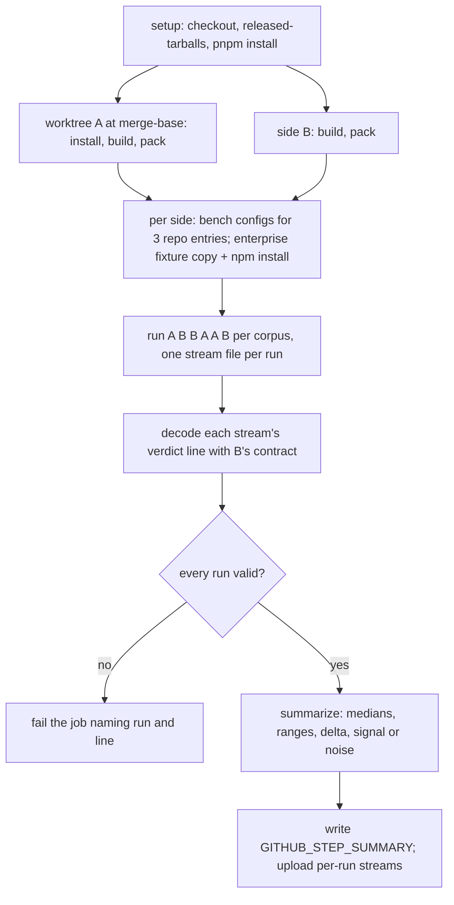

# Execution Engine Bench Lane - Plan

## Goal Capsule

- **Objective:** Every pull request shows whether it made a mutation run faster or slower, phase by phase (instrument, check, dry run, mutant execution), measured on the same runner against main and separated from runner noise, so that every later execution-engine optimisation has CI evidence for its gain.
- **Means:** a report-only `bench` workflow that builds main's merge-base and the PR head in one job, runs both interleaved over two committed corpora, and summarises each run's own verdict line (KTD1, KTD4).
- **Product authority:** Stream G (execution engine) of the stryker-js-effect SOTA program. The supervisor rules on scope, and stream coordination goes through the supervisor. This plan covers the first pull request, the bench lane. The rest of Stream G appears below as context and is not active scope.
- **Authority order:** `CONSTITUTION.md` > `AGENTS.md` > this plan's Product Contract > its Planning Contract.
- **Stop conditions:** stop and ask the supervisor before adding any third-party dependency or executable, before editing `pnpm-workspace.yaml` overrides or the `stryker-published` input, and when the measured job time on the PR head exceeds 15 minutes after the U6 reduction ladder is exhausted.
- **Execution profile:** one stacked PR on `stryker/exec-bench-lane` off `main`; one implementer; no local mutation or bench runs (the CLI refuses them outside GitHub Actions, `packages/stryker-js/src/refuse-local-mutation.workflow.ts:40-42`).
- **Open blockers:** the CONST-E9 approval for the new workflow file (U5) - see Outstanding Questions.

---

## Product Contract

### Summary

A CI lane on every pull request builds main's merge-base and the PR head in one job, runs both interleaved over a committed cross-package slice and the enterprise-monorepo fixture, and publishes a per-phase table of median, spread and delta read from each run's own NDJSON. The stream gains a `check` phase duration so checker time is visible for the first time.

### Problem Frame

Stream G exists to make each mutant cost the fewest test executions that can kill it, in a warm runtime, without changing a verdict. Every optimisation in that stream claims a speed gain, and today nothing in CI can confirm one. No workflow under `.github/` measures phase wall-clock, writes a job summary or comments on a PR. `mutation.yml` does not run on pull requests, and it runs the released CLI rather than the PR's code.

The engine already records most of what a bench needs: `verdict.phaseDurations` carries prepare, instrument, dry-run and mutation-test (`packages/stryker-js-cli-contract/src/run-event.schema.ts:203-209`). Checker time has no phase, though. Checking starts inside the mutation-test phase (`packages/stryker-js/src/run/mutation-test.cell.ts:90-91`), runs group by group, and streams passed plans into execution concurrently (`packages/stryker-js/src/Checker/checker-pool.handle.ts:274-289`, `:369-397`). Its time reaches the stream only as `fixedOverheadMs` on mutants the checker itself decided (`packages/stryker-js/src/run/mutant-settlement.ts:69-73`). Stream H needs a citable check phase too.

GitHub-hosted runners vary from run to run, so a single PR run diffed against a stored main number cannot separate a 10% gain from noise.

### Key Decisions

- **Same-job interleaved A/B, with no stored baseline.** Main's merge-base (A) and the PR head (B) are built in the same job and run interleaved on the same runner. Governs R1, R2, R4. (session-settled: user-directed — chosen over a stored main baseline and over both combined: cross-runner variance swamps small gains, and this PR builds no artifact store or cross-run history.)
- **Signal means beyond the A-vs-A spread.** A delta counts as signal only when it exceeds the spread measured between repeated A runs. Governs R5. (session-settled: user-directed — chosen over raw deltas: a noise floor measured in the same job is the only honest threshold.)
- **A pinned cross-package slice is the repo corpus.** The repo corpus is one committed slice that puts real work through the instrumenter, the TypeScript checker and the vitest runner, not all four dogfood projects. Governs R2, R3. (session-settled: user-directed — chosen over a single pinned project and over all four projects sharded: the job has to stay around 10–15 minutes on one runner.)
- **Report-only.** The lane publishes evidence and never fails a PR on a timing delta. The first gate in the stream is the verdict-parity job (PR 2), because a new gate needs explicit approval (GATE1). Governs R6.
- **`check` is measured as checker-busy wall-clock and overlaps mutation-test.** Checking interleaves with execution, so a sequential phase boundary would misattribute time. Phase durations therefore no longer sum to total run time. Governs R9.
- **Workspace builds on both sides, with the dogfood overrides untouched.** The bench measures engine code that has not been released, so it runs packed workspace builds the way the e2e lane does. `pnpm-workspace.yaml` overrides and the `stryker-published` input stay as they are (AGENTS.md Dogfood boundary). Governs R1.
- **Incremental reuse is off for every bench run.** Reuse would hide the work being measured. Governs R2.

### Requirements

**Comparison**

- R1. One CI job per pull request builds main's merge-base and the PR head on the same runner and runs both against the same corpus.
- R2. The job runs the two sides interleaved (A B A B …) for a small fixed N per side with incremental reuse disabled. The plan states N.
- R3. The repo corpus is a slice declared once in the repository, changed only by a reviewed edit, and chosen so that instrument, check, dry run and mutant execution all do real work. The plan states its file count, mutant count and expected job time.
- R4. The enterprise-monorepo e2e fixture is benched alongside the repo slice under the same A/B protocol, and the two are reported separately.

**Reporting**

- R5. For each corpus and phase (instrument, check, dry run, mutant execution, plus total), the lane reports the median and spread of A, the median and spread of B, and the delta. A delta is marked as signal only when it exceeds the A-vs-A spread.
- R6. The table appears on the PR as a job summary, and a timing delta never fails the job. The job fails only when it cannot produce a valid measurement, for example a run that errored or a stream that does not decode.
- R7. Every number comes from the NDJSON that the run itself wrote, decoded with the published stream schema. Nothing is read from logs, spans or wall-clock taken outside the run.
- R8. When a side's stream has no check duration (main before this PR lands), its check cell reads as not measured. The cell is never shown as zero.

**Stream contract**

- R9. The run's verdict line reports a `check` phase duration equal to the union of the wall-clock intervals in which any checker works, startup included, added without removing or renaming any existing phase, so Stream H can cite it.
- R10. A run with no checker configured reports check as not run, distinguishable from a measured zero.

**Cost and verification**

- R11. The whole job (both builds, both sides, both corpora) stays around 10–15 minutes of wall-clock on one GitHub-hosted runner, and the plan states the estimate.
- R12. The PR's own head CI shows the lane running and its table populated. Tests added for the check phase and the table decision can fail on a plausible bug.

### Acceptance Examples

- AE1. **Covers R5.** Given A's mutant-execution runs of 61 s, 64 s and 62 s (spread 3 s) and B's of 55 s, 56 s and 54 s, when the table renders, the delta of −7 s is marked as signal. Given B at 60 s, 63 s and 61 s, the delta of −1 s is shown and marked as noise.
- AE2. **Covers R8, R10.** Given main's stream has no `check` key and the PR's run has a checker, when the table renders, A's check cell reads "not measured" and B's shows its median. Given a run with no checker configured, the verdict line reports check as not run, not as 0 ms.
- AE3. **Covers R6.** Given one B run exits with a stream that fails to decode, the job fails and names the run and the line. Given every run decodes and B is slower beyond the spread, the job passes and the table shows the regression.

### Scope Boundaries

- Verdict parity between A and B is PR 2, which consumes this lane's per-run outputs. This PR does not compare statuses.
- No stored baseline, artifact store, trend history or cross-run comparison.
- No change to `mutation.yml`, the dogfood overrides or the released-tarball input.
- No per-mutant timing columns. Per-mutant `cost` already sits on each `mutant` line for anyone drilling in.
- No local mutation or bench runs. Measurement exists only in CI.

---

<!-- ce-section: work-relationships -->
## How This Work Fits Together

This plan covers PR 1, the bench lane. The breakdown below is how the rest of Stream G is understood today, not a committed roadmap. Each later item is its own PR, stacked where it depends on an earlier one, and ships only when the bench shows a measured gain and the parity gate holds.

- PR 2, verdict-parity gate. Depends on PR 1, reusing its A/B runs. It fails a PR when any mutant's status differs between the main build and the PR build on the fixture corpus. Both sides are computed fresh in the same job and never recorded, which keeps it within E2E-2 and CONST-T10. Mutants are keyed by file, location, mutator and replacement, and status is compared, not killedBy or statusReason.
- PR 3, exact test selection. Can proceed independently of PR 2, but should land early. The vitest runner's test filter is an unanchored, file-agnostic name regex (`packages/stryker-js-vitest-runner/src/VitestRunner.service.ts:159-170`), so tests whose names merely contain a covering test's name also run. Selection becomes exact on file plus full name.
- Infection-filtered execution. Depends on PR 2, on Stream F emitting the switch-point records described below, and on the qualifying-mutator table. Non-infecting (mutant, test) pairs are skipped, and a mutant that no covering test infects is reported Survived with reason "never infected".
- Kill-likelihood file order. Depends on Stream B's VerdictStore port and on PR 2. Covering test files are ranked by kills per execution from verdict history for the same source file or mutator, cost-aware (likelihood over expected time), falling back to duration. Order inside a file stays source order.
- Cheaper isolated re-imports. Depends on PR 1 for evidence. It keeps Vitest's per-file isolation semantics exactly, carries no module state across files, and comes in three independent steps: (a) compiled-code caching so a fresh thread re-evaluates without re-parsing or re-compiling; (b) worker start from a snapshot that holds no user-module state; (c) re-evaluating only what a static mutant needs instead of retiring or reloading the runner, and only with a written losslessness argument. A step the bench shows no gain for is recorded as a stated skip.

---

## What Main Already Does

Inventory at origin/main `1e1de6d05`, checked against the code.

| Stream G item | Status on main | Evidence |
|---|---|---|
| perTest coverage default | Met | `coverageAnalysis` defaults to `StrykerCoverageAnalysis` = `'perTest'` (`packages/stryker-js-plugin-interface/src/stryker-options.schema.ts:7`, `:70`, `:235`) |
| Per-test coverage recording | Met | `stryCov_9fa48` writes `mutantCoverage.perTest[currentTestId]`, else `.static` (`packages/stryker-js-instrumenter/src/InstrumentHeader.ts:48-58`). The vitest dry run sets `currentTestId` per test and publishes coverage in `afterAll` (`packages/stryker-js-vitest-runner/sandbox/stryker-setup.ts:56-65`) |
| Each mutant runs only its covering tests (item 2) | Partly met | The planner builds `testFilter` from `testsByMutantId` (`packages/stryker-js/src/plan-mutant-tests.workflow.ts:263-277`, `:310-328`). Uncovered non-static mutants become NoCoverage (`:281-288`). Static mutants run the whole suite with a reload unless `ignoreStatic` is set (`:290-308`, `:143-151`). The gap is that the runner's name regex over-selects (`VitestRunner.service.ts:159-170`), which is PR 3 |
| First-kill stop (item 4) | Met | Mutant runs use vitest `bail = 1` unless `disableBail`, and the dry run uses 0 (`packages/stryker-js-vitest-runner/src/VitestSession.service.ts:143-144`, `VitestRuntime.handle.ts:127-140`). `kill-first-ordering.integration.test.ts:158`, `:179` and `:226` assert `executedTests == [KILLER]` |
| Kill-likelihood ordering (item 4) | Partly met | Prior killer of this exact mutant first, then ascending duration (`plan-mutant-tests.workflow.ts:226-261`). The prior killer comes only from the incremental report (`packages/stryker-js/src/run/incremental-reuse.cell.ts:154-197`). Order is applied per file only (`packages/stryker-js-vitest-runner/src/sort-test-files.workflow.ts`). There is no history-derived score |
| Infection filtering (item 3) | Not met | No switch point evaluates a mutant during the dry run. The SOTA plan deferred it (`docs/plans/2026-09-29-0427-feat-state-of-the-art-mutation-testing-plan.md`) |
| Warm runtime (item 5) | Partly met | The node compile cache is enabled and inherited by workers (`packages/stryker-js/src/bin/enable-compile-cache.ts`, `bin/main.ts:140-144`). The Vite transform cache `fsModuleCache` is on by default (`VitestRuntime.blueprint.ts:274-281`). The standby pool pre-boots the next thread, but each test file gets a fresh thread that is stopped afterwards (`StandbyThreadsPool.handle.ts:149-160`). There is no `vm.Script` cachedData and no snapshot |
| Runner reuse | Exists | Child-process runners persist across mutants. `maxTestRunnerReuse` (default 0) and `withEnvironmentReload` govern retirement (`packages/stryker-js/src/pooled-test-runner.handle.ts:204-288`) |
| Per-phase timing in NDJSON (item 1) | Partly met | `phase` lines carry a cumulative `elapsedMs` mark (`run-event.schema.ts:11`, `:27-30`). `verdict.phaseDurations` holds four phases (`:203-209`, `:236`; `packages/stryker-js/src/phase-durations.ts:42-52`). There is no `check` |
| Bench lane in CI (item 1) | Not met | No bench job, step summary or PR comment anywhere in `.github/`. `mutation.yml` runs on push, schedule and dispatch, never on pull requests |
| Lossless verdict check vs main (item 6) | Not met | `stryker compare` exists (`packages/stryker-js/src/compare-verdicts.workflow.ts`) but no workflow invokes it. The e2e annotation oracle compares status totals, not per-mutant statuses (`test/e2e/tests/__fixtures__/annotation-oracle.fixture.ts:131-183`) |

V8 `Profiler.takePreciseCoverage` adds nothing here, so it is not adopted. It reports function and block execution counts per script, while the instrumenter already counts every mutant site per test (`InstrumentHeader.ts:48-58`). Mapping V8 block ranges back to mutant sites would reproduce that coarser and depend on V8's block boundaries matching mutation sites, which they do not for expression-level mutants.

---

## Stream Decisions Carried Forward

These decisions shape later PRs. They are recorded here so those PRs and Streams F and B can cite them.

### Infection: the losslessness argument

A (mutant, test) pair may be skipped when the mutant is a qualifying pure expression and its value equals the original's at every evaluation the test performs. The argument runs by induction over the test's execution:

1. The mutated program and the original run the same instructions until the first evaluation of the mutated expression.
2. At that point the mutant's value is computed from operand values the original has already produced, and computing it runs no user code. So the mutated program is in the same state as the original, with the same value under `Object.is`.
3. Steps 1 and 2 repeat at every later evaluation, so the whole execution is identical, and so is the test outcome. The dry run passed, so the mutant survives that test.

The premise matches the one perTest coverage already relies on: the test is deterministic. Equality uses `Object.is`, so `NaN` equals `NaN` and `-0` differs from `+0`. The parity gate (PR 2) is the empirical check on this argument.

### Infection recording must not perturb the baseline

- Probes run only in the dry run. A mutant run evaluates exactly what it evaluates today.
- A probe never changes the original value, never throws out of the switch point and never counts as a mutant hit.
- A probe that throws, fails its runtime guard or meets a non-primitive operand marks the pair infected.
- A probe that would recurse or run long is bounded the same way, and hitting the bound marks the pair infected.
- The recording dry run's verdicts, test results and coverage must equal those of a plain dry run on the fixture corpus. A CI check proves it before infection filtering ships.

### Switch-point contract for Stream F

- **At instrument time:** the emitter marks each mutant as probed or not probed, explicitly. Absence of an infection record means "never infected" only for probed mutants (pack: schema-laws, tagged-unions-over-state-by-presence.md).
- **At each evaluation of a probed site during the dry run:** the original is evaluated once, operand values are reused, and each probed mutant's value is computed under its guard. When the values differ, the guard fails or the computation throws, infection is recorded against the current test id, or against the static bucket at load time.
- **Static-bucket infection:** it counts as infecting every test, since static mutants already run the whole suite.
- **What switch points do not record:** values, or anything for unprobed mutants. Unprobed mutants run exactly as today.

### Qualifying mutators (draft)

Classes:
- **Q**: pure by construction.
- **G**: pure under a runtime guard that operands are primitives; guard failure means infected.
- **S**: qualifies only when every subexpression the mutant adds or drops is statically side-effect-free.
- **Reach-equivalent**: every reach infects, so pruning gains nothing beyond coverage, and the mutant runs normally without a probe.
- **No**: runs normally.

| Mutator | Mutation | Class | Why |
|---|---|---|---|
| ArithmeticOperator | `a + b` → `a - b` etc. | G | Operands are reused. Object operands would invoke `valueOf` or `toString`. A throw (BigInt mixing) means infected |
| EqualityOperator `<`/`<=`/`>`/`>=`/`==`/`!=` | operator swap | G | Relational and loose equality coerce objects. `NaN` comparisons can tie |
| EqualityOperator `===`↔`!==` | operator swap | Reach-equivalent | Always the opposite value |
| EqualityOperator sufficiency literal | comparison → `true`/`false` | S, G | The dropped comparison may coerce. Compare the boolean value |
| LogicalOperator | `&&`↔`\|\|`, `??`→`&&` | S | The left operand is reused. The right operand is known only when the original evaluated it. Otherwise it must be statically pure |
| UnaryOperator | `+x`↔`-x`, `~x`→`x` | G | Primitive operand. `+bigint` throws, which means infected |
| AssignmentOperator arithmetic/bitwise | `+=`↔`-=` etc. | G | Old target value and right-hand side are read once by the original. Compare the new values |
| AssignmentOperator logical | `&&=`, `\|\|=`, `??=` | S | Whether the right-hand side is evaluated differs between the two |
| OptionalChaining | `a?.b` → `a.b` | Q | Infected exactly when the base is nullish. Otherwise it is the same access the original already performed |
| ConditionalExpression | test → `true`/`false` | S, G | Compare `Boolean(test)` with the literal. The dropped test must be statically pure |
| StringLiteral template with expressions | template → empty | S, G | Interpolations are dropped and their `toString` may run user code |
| StringLiteral plain | `'x'`→`''`, `''`→`'Stryker was here!'` | Reach-equivalent | Always differs |
| BooleanLiteral | `true`↔`false`, `!x`→`x` | Reach-equivalent | Always differs |
| UpdateOperator | `x++`↔`x--` | Reach-equivalent | Writes state. Differs for every value except `NaN`. Runs normally |
| MethodExpression on intrinsic `String.prototype`/`Math` with primitive receiver and arguments | e.g. `startsWith`↔`endsWith`, `min`↔`max` | G (narrow) | Runtime check that the receiver is primitive and the method is the unpatched intrinsic. Otherwise infected |
| MethodExpression otherwise | method swap or drop | No | Calls user code, callbacks or mutating array methods |
| ArrayDeclaration, ObjectLiteral, ArrowFunction, Regex | new value | Reach-equivalent | A fresh object identity on every evaluation, and dropped elements may have side effects |
| BlockStatement | block → `{}` | No | A statement, not an expression |
| AtomicUpdateSplit, SynchronizationRemoval, FinalizerEscape | Effect rewrites | No | They build Effect descriptions. Behaviour differs only under interpretation |

### Kill order and warm runtime

- **Kill order:** test-file level only. Reordering tests inside a file is rejected as a verdict risk, because tests share `beforeAll` and module state. (session-settled: user-directed — chosen over intra-file reordering gated per file and over treating item 4 as met: shared file state makes reordering lossy.)
- **Warm runtime:** per-file isolation is kept exactly. Gains come only from caching compiled code, from a state-free start snapshot and from minimal static-mutant re-evaluation, each one bench-gated. (session-settled: user-directed — chosen over non-isolated warm module reuse and over deferring the design: `docs/plans/2026-09-25-0809-refactor-vm-runner-runs-vitest-plan.md` measured `isolate:false` diverging when `vi.mock` loses effect.)

---

## Dependencies / Assumptions

- Stream A is splitting the core package into contracts/ports, engine, drivers and edges, and no ADR for that split exists on main yet (only `docs/adr/0001-cell-architecture-module-taxonomy.md`). New stream-contract members land in `packages/stryker-js-cli-contract` (contracts). Engine timing lands beside the existing phase clock in `packages/stryker-js`, and the lane's NDJSON reader sits at the CI edge. Ports carry no driver imports (pack: cell-architecture, ports-separate-from-layers.md).
- Stream B's VerdictStore port is the only source of kill history for file ordering.
- Stream F owns emitting the switch-point records described above.
- CONST-E9: this lane is a new CI surface. `AGENTS.md` lists `.github/workflows/` as read-only, so the workflow file needs explicit approval (see Outstanding Questions). It is report-only, so it adds no gate (GATE1).

## Outstanding Questions

### Resolve Before Planning

- None. Planning resolved the slice and N (KTD5, KTD6), the enterprise placement (KTD3) and the `check` representation (KTD7).

### Needs the Supervisor

- Q1. Does the supervisor's request count as the CONST-E9 approval to add `.github/workflows/bench.yml` (U5), given `AGENTS.md` lists `.github/workflows/` as read-only? Without it, U1-U4 and U6 can land and U5 is handed over as a snippet, but then R12 (lane running on its own head) cannot hold for this PR.
- Q2. The job time is estimated, not measured: 14-22 minutes (KTD6). If the first head run exceeds 15 minutes after the U6 ladder, is the 10-15 minute target relaxed, or does the enterprise corpus move to its smaller `stryker.checker.config.ts` slice?

## Sources / Research

- `docs/plans/2026-09-29-0427-feat-state-of-the-art-mutation-testing-plan.md`: earlier SOTA plan. Infection pruning deferred, no bench lane planned.
- `docs/plans/2026-09-25-0809-refactor-vm-runner-runs-vitest-plan.md`: isolation measurements.
- `docs/solutions/test-failures/stream-schema-must-not-carry-json-rest-records.md`: stream members are closed structs.
- `docs/solutions/workflow-issues/mutation-lane-green-while-every-job-failed.md` and `docs/solutions/workflow-issues/matrix-legs-rename-the-required-status-check.md`: CI-lane gotchas.
- `CONSTITUTION.md`: CONST-T3, CONST-T9, CONST-T10, CONST-E7, CONST-E9.
- Tests feed real NDJSON through real decoding, with no mocks (pack: boundary-testing, no-mocks-on-internal-glue.md). External input is decoded, never cast (pack: cell-architecture, decode-never-cast.md).

---

## Planning Contract

### Key Technical Decisions

- KTD1. One report-only job on `pull_request`, in a new `.github/workflows/bench.yml`. It is not added to `ci.yml`, so no existing required status context moves (`docs/solutions/workflow-issues/matrix-legs-rename-the-required-status-check.md`), and its name never imitates `check`. It copies the `ci.yml` `check` setup skeleton: checkout, `.github/actions/released-tarballs` before `pnpm install --frozen-lockfile`, pnpm and node 24, turbo cache. `timeout-minutes: 30`.
- KTD2. Each side runs its own CLI and its own plugins. Side B is the PR checkout; side A is a `git worktree` at `git merge-base origin/main HEAD` with its own `pnpm install --frozen-lockfile` and turbo build, sharing one turbo cache dir so A usually hits main's cache. Plugins are not taken from the dogfood configs, because `installedPlugin` resolves next to the config (`packages/toolchain/stryker-config/lib/base.js:41-43`), where the overrides install the released tarballs. Instead each bench config names the side's built plugin entrypoint by `file:` URL, which the plugin loader uses verbatim (`packages/stryker-js/src/plugin-loader.service.ts:433-440`). The CLI bundle does not inline plugins (`packages/stryker-js/tsdown.config.ts`), so this swaps both runner and checker. When A's `flake.lock` pins a different `stryker-published` than B's, A gets its own `.sfs-deps` from `nix build <A>#stryker-published`; otherwise B's are copied. `pnpm-workspace.yaml` and `flake.lock` are never edited.
- KTD3. The enterprise fixture runs directly on the runner, not through the e2e harness. The harness needs KVM-backed microVMs, a Tempo probe and OTEL rewiring (`test/e2e/src/Harness/warm-sandbox.handle.ts`, `test/e2e/tests/__fixtures__/global-setup.ts`), and `ci.yml` has no udev step for `/dev/kvm`. Per side the bench builds the closure the way `packWorkspaceClosure` does (`test/e2e/src/Harness/fixture-cache.service.ts:456`: turbo build of the four entry packages, then `pnpm -r pack`), copies the fixture, resolves `catalog:` specs against that side's `pnpm-workspace.yaml`, and runs the two `npm install` steps of `test/e2e/tests/__fixtures__/bake-fixtures.sh` with the specs `installClosure` decides (`test/e2e-core/src/install-closure.workflow.ts`). It runs the lifecycle config `stryker.config.ts` unchanged, through `npx --no-install stryker run`.
- KTD4. Every number comes from the run's terminal `verdict` line, decoded with side B's `RunEvent.RunEventWireLine` (`packages/stryker-js-cli-contract/src/run-event-wire.schema.ts`). Each run gets its own `--progressStreamFile` and `--full` (`packages/stryker-js/src/bin/cli-command.ts:86-101`), so incremental reuse and the persisted dry run are off and runs cannot read each other's files. A run counts only when its stream holds exactly one decodable `verdict` line; a stream file that merely exists proves nothing (`docs/solutions/workflow-issues/mutation-lane-green-while-every-job-failed.md`). Exit codes are not the validity signal, because the dogfood configs break at score 100 (`packages/toolchain/stryker-config/lib/base.js:23`); the bench configs set `thresholds.break` to null so a healthy run exits 0, and a non-zero exit beside a valid verdict line is still reported. When side A's verdict declares a different `StreamSchemaVersion` than side B's contract (a PR that breaks the stream), A cannot be decoded by B: the corpus is reported `incomparable` with both versions named and B's absolute numbers shown, and the job does not fail on it.
- KTD4a. Both sides must run the same workload, or the delta measures the workload. The enterprise fixture is copied from side B's tree for both sides, so it is identical by construction. The repo corpus mutates each side's own project files, so the orchestrator digests every corpus `mutate` file and every test file of each corpus project on both sides; when the digests differ (the PR edits a corpus file), that corpus's rows are flagged `workload changed` and no delta is marked as signal.
- KTD5. The repo corpus is three files from three dogfood projects, declared once in `test/bench/corpus.json`. Counts come from main's `mutation-report-416` artifact (mutation run of 2026-10-09):

  | Project | File | Mutants | Test-executed | CompileError | Checker |
  |---|---|---|---|---|---|
  | `packages/stryker-js-vitest-runner` | `src/interpret-vitest-mutant-run.workflow.ts` | 109 | 36 | 63 | yes |
  | `packages/stryker-js-typescript-checker` | `src/classify-tce.workflow.ts` | 49 | 12 | 27 | yes |
  | `test/e2e-core` | `src/placement-closure.workflow.ts` | 39 | 30 | 0 | none |
  | Total | 3 files | 197 | 78 | 90 | |

  Selection rule, recorded beside the declaration: every phase does real work (instrument; check through CompileErrors; dry run; mutant execution); no file had a `Timeout` verdict on main, since timeouts measure the timeout setting rather than the engine; one entry has no checker, so `not-run` is exercised on every run. `packages/stryker-js` is excluded: its dry run runs 1,099 tests and would dominate every repetition. A repetition of the repo corpus is three CLI runs, one per entry, and its per-phase value is the sum over the three.
- KTD6. N = 3 per side per corpus, in the counterbalanced order A B B A A B. Plain A B A B always runs A first in each pair, so warm-up drift lands on one side; A B B A A B gives each side every position equally. Spread is the range (max - min) of a side's three runs. Estimated job time [INFERENCE, not measured, because no local runs are allowed]: setup 2-3 min; both builds in parallel plus packing and fixture installs 4-5 min; 6 repetitions of each corpus at 60-90 s (repo) plus 30-60 s (enterprise), 9-15 min; 14-22 min in total. The first PR-head run records actual per-run times in the summary. Reduction ladder if the job exceeds 15 minutes: drop the vitest-runner entry from the repo corpus (the largest), then take Q2 to the supervisor. N never drops below 3.
- KTD7. `check` is a new member of `RunEvent.PhaseDurations`, typed as a tagged union `CheckDuration`: `measured { ms }`, `not-run` (no checker configured), and `not-recorded`, the decoding default when the key is absent (`withDecodingDefaultKey`, `repos/effect/packages/effect/src/Schema.ts:5724`). The CLI always writes the key. Old streams (main before this PR, and stacked PRs whose merge-base predates it) decode as `not-recorded`, which the table renders as "not measured" (R8). Each state is its own variant, never a nullable whose meaning depends on context (CONST-D4; pack: schema-laws, tagged-unions-over-state-by-presence.md). Because the encoded key is optional, the contract-version law sees no newly required property (`packages/stryker-js-cli-contract/tests/__fixtures__/contract-compat.fixture.ts:234-236` flags only additions to `required`), and old consumers drop the extra key (Effect `onExcessProperty` defaults to ignore, `repos/effect/packages/effect/src/SchemaAST.ts:463`). `StreamSchemaVersion` stays `6.0`. `check` is not added to `RunPhase`: it is not a sequential boundary, and `phase` events keep their meaning.
- KTD8. `check` is the length of the union of checker-busy intervals: each checker's startup (`packages/stryker-js/src/Checker/checker-pool.blueprint.ts:66-72`) and each timed group check (`packages/stryker-js/src/Checker/checker-pool.handle.ts:276-281`). Both run paths acquire checkers through `acquireCheckers` (`packages/stryker-js/src/run/mutant-settlement.ts:80-95`), used by `mutation-test.cell.ts:86-117` and `deferrable-dry-run.cell.ts:64`, so recording at the pool covers both. Intervals go to `PhaseClock` (`packages/stryker-js/src/run/phase-clock.service.ts`), the single owner of phase timing; the union is a pure function beside `phaseDurationsOf` (`packages/stryker-js/src/phase-durations.ts`). The four sequential phases still sum to elapsed time; `check` overlaps them.
- KTD9. Placement follows Stream A's expected split without waiting for it. Contract shapes live in `packages/stryker-js-cli-contract`; timing stays in the engine (`packages/stryker-js`). The lane's pure decisions (corpus decode, aggregation, signal classification, table rendering) live in `test/e2e-core`, which already decodes `RunEventWireLine` (`test/e2e-core/src/decode-stream.workflow.ts`), imports contract packages only, and is mutated by the dogfood lane. The orchestrator is a new private workspace package `test/bench`, an Effect program run with node, mirroring the `test/e2e` / `test/e2e-core` shell-and-core split. It adds no third-party dependency: `effect` and `@effect/platform-node` are already catalog entries.
- KTD10. The pure catalog helpers move from `test/e2e/src/Harness/catalog-resolution.ts` into `test/e2e-core`, so the e2e harness and the bench share one implementation instead of a copy. `test/e2e/src/Harness/fixture-cache.service.ts:52-53` is the only importer.

### High-Level Technical Design

### Sequencing

U1 before U2 (the engine writes the new member). U3 needs U1's types. U4 is independent. U6 needs U3 and U4. U5 needs U6 and Q1. All units ship in this one PR so the lane runs on its own head (R12).

---

## Implementation Units

### U1. `check` in the stream contract

- **Goal:** the verdict line can carry checker time in all three states.
- **Requirements:** R8, R9, R10.
- **Files:** `packages/stryker-js-cli-contract/src/run-event.schema.ts`; `packages/stryker-js-cli-contract/contract/stream.schema.json` (regenerated by `packages/stryker-js-cli-contract/scripts/contract-documents.ts`); `packages/stryker-js-cli-contract/tests/run-event-wire-line.integration.test.ts`; `packages/stryker-js/src/reporting/verdict-envelope.schema.ts`; a `.changeset/*.md`.
- **Approach:** KTD7. Mirror the change in `VerdictEnvelope`.
- **Test scenarios:** a verdict line without `check` decodes to `not-recorded`; `measured` and `not-run` round-trip byte-stable; a negative or non-finite `ms` is refused; an unknown tag is refused.
- **Verification:** `contract-documents.integration.test.ts` and `contract-version-law.integration.test.ts` pass with the regenerated document.

### U2. Checker-busy time in the engine

- **Goal:** every run reports `check` as the union of checker-busy intervals.
- **Requirements:** R9, R10.
- **Files:** `packages/stryker-js/src/phase-durations.ts`; `packages/stryker-js/src/run/phase-clock.service.ts`; `packages/stryker-js/src/Checker/checker-pool.blueprint.ts`; `packages/stryker-js/src/Checker/checker-pool.handle.ts`; `packages/stryker-js/src/__tests__/phase-durations.workflow.property.test.ts`; `packages/stryker-js/tests/check-cost-record.integration.test.ts`.
- **Approach:** KTD8. `PhaseClock` gains an interval recorder; the pool records startup and each timed group; `phaseDurationsOf` takes the recorded intervals and whether any checker is configured.
- **Test scenarios:** properties - the union is at most the sum of the intervals and at least the longest one; it equals the sum for disjoint intervals; it is invariant under reordering and under splitting an interval in two; no checker configured gives `not-run` even with zero intervals; a configured checker always gives `measured`. The existing law is restated, not dropped: the four sequential phases still sum to elapsed time. Integration, on the existing checked and unchecked workspaces (`packages/stryker-js/tests/__fixtures__/check-cost-workspace.fixture.ts`): the checked run's verdict carries `measured` with `ms > 0`, and the unchecked run's carries `not-run`.
- **Verification:** `pnpm --filter @systemfsoftware/stryker-js test`.

### U3. Bench decisions in `test/e2e-core`

- **Goal:** pure, tested decisions that turn decoded runs into the table.
- **Requirements:** R3, R5, R6, R7, R8.
- **Files:** new `test/e2e-core/src/bench-corpus.schema.ts`, `test/e2e-core/src/bench-run.schema.ts`, `test/e2e-core/src/summarize-bench.workflow.ts`, `test/e2e-core/src/render-bench-summary.workflow.ts`, colocated `test/e2e-core/src/__tests__/*.property.test.ts`; `test/e2e-core/src/mod.ts`.
- **Approach:** the corpus schema decodes `test/bench/corpus.json` (repo entries: project directory and mutate list; enterprise: fixture directory and config). A run is a tagged union: `measured` (phase durations from its verdict, plus the stream version it declared), `invalid` (run id, reason, line number), or `incomparable` (A's stream version, B's stream version). Per corpus, a repetition's phase value is the sum over its entries; total is the sum of the four sequential phases; `check` sums the `measured` entries, and any `not-recorded` entry makes that repetition's check `not-measured`. Per phase: median and range per side, delta = median B - median A, `signal` when |delta| > range of A, else `noise`, and `not-measured` when either side lacks the value. A corpus whose workload digests differ (KTD4a) never marks `signal`. Any `invalid` run turns the summary into a failure listing every invalid run; `incomparable` does not.
- **Test scenarios:** AE1 and AE2 as examples. Properties: swapping A and B negates the delta; identical sides give delta 0 and `noise`; adding a constant to every B run shifts the delta by exactly that constant; a `not-recorded` check never renders as `0`; one invalid run anywhere yields a failure naming exactly the invalid runs; medians are independent of run order; a `workload changed` corpus has no `signal` cell whatever the timings; an `incomparable` corpus leaves the summary passing.
- **Verification:** `pnpm --filter @systemfsoftware/stryker-e2e-core test`.

### U4. Shared catalog resolution

- **Goal:** one implementation of `catalog:` spec resolution for the e2e harness and the bench.
- **Requirements:** R4.
- **Files:** `test/e2e/src/Harness/catalog-resolution.ts` (moved into `test/e2e-core/src/`); `test/e2e/src/Harness/fixture-cache.service.ts`; `test/e2e-core/src/mod.ts`.
- **Approach:** KTD10. Move, re-point the one importer, delete the old file.
- **Test scenarios:** properties for the moved functions: `catalog:` resolves to the default catalog's version, `catalog:<name>` to the named catalog's, a missing entry is refused, and non-catalog specs pass through unchanged.
- **Verification:** `pnpm --filter @systemfsoftware/stryker-e2e-core test`; `pnpm typecheck`.

### U5. The `bench` workflow

- **Goal:** the lane runs on every PR and its table shows on the PR.
- **Requirements:** R1, R6, R12.
- **Files:** `.github/workflows/bench.yml`.
- **Approach:** KTD1. `pull_request` trigger; full-history checkout (the merge-base needs it); nix only through the released-tarballs composite unless side A needs its own tarballs (KTD2); one step running the U6 orchestrator; `actions/upload-artifact` of every run's stream with `if: always()` and `if-no-files-found: error`, for PR 2 to consume.
- **Test scenarios:** none in-repo; the workflow is proven by running (R12).
- **Verification:** the PR head's `bench` job is green and its summary shows both corpora, with side A's check "not measured" and side B's measured.

### U6. The bench orchestrator and corpus

- **Goal:** both sides built, both corpora run interleaved, every run decoded, the summary written.
- **Requirements:** R1, R2, R3, R4, R6, R7, R11.
- **Files:** new package `test/bench/` (`package.json`, `tsconfig*.json`, `tsdown.config.ts`, `corpus.json`, `src/main.ts`, `src/*.service.ts`); `turbo.json` only if a `bench` task is needed.
- **Approach:** KTD2-KTD6. Per side, write one bench config per repo entry into that side's project directory, spreading the project's own `stryker.config.ts` and overriding `testRunner.plugin`, `checkers[].plugin` (keeping the project's own checker count), `mutate`, `reporters: []` and `thresholds.break: null`; prepare the enterprise fixture (KTD3). Run in the KTD6 order with `--full` and a unique `--progressStreamFile`, under the runner's `GITHUB_ACTIONS=true`, never `ALLOW_LOCAL_MUTATION`. Decode, call U3, write `$GITHUB_STEP_SUMMARY`, and exit non-zero only when U3 reports invalid runs. Each run's outer wall-clock goes into a summary footnote so KTD6's estimate can be checked; it is never used as a phase value (R7).
- **Test scenarios:** none for the shell, which spawns processes; its decisions are U3's. Execution-time check: the first head run's summary is read before the PR leaves draft, and the KTD6 ladder is applied if the job exceeds 15 minutes.
- **Verification:** U5's head run.

---

## Verification Contract

- `pnpm format:check`, `pnpm typecheck`, `pnpm test`, `pnpm check:ci` (START-1 to START-4), on the PR head in CI.
- A changeset covers `@systemfsoftware/stryker-js-cli-contract` and `@systemfsoftware/stryker-js` (START-5); its level follows the contract-version law's verdict on the regenerated document.
- The new tests are seen running in the head's CI log: the U1 wire-line scenarios, the U2 properties and integration scenarios, the U3 and U4 properties.
- The `bench` job on the head is green, its summary is populated for both corpora, and side A's check reads "not measured" (main predates `check`).
- No local bench or mutation runs; the CLI refuses them outside CI (`packages/stryker-js/src/refuse-local-mutation.workflow.ts:40-42`).
- Test layers, admitted by the test-layer selection gate: schema round-trip and refusal scenarios for the contract member (U1, `schema`); property tests only for the pure decisions (U2 interval union and phase law, U3, U4, all `workflow`); one in-process integration scenario pair for the engine's verdict line (U2, existing `check-cost-record.integration.test.ts`). Refused: tests for the orchestrator shell and the workflow file (process spawning; proven by the head run instead), and any test that only re-asserts the moved catalog code's import path.

## Definition of Done

- U1-U6 land in one PR whose head CI is green, with the `bench` job present and populated (R12).
- The measured job wall-clock is stated in the PR body, with the KTD6 ladder applied or Q2 answered.
- Each of R1-R12 traces to a unit above, and each of AE1-AE3 is a test or an observed head run.
- No leftover scaffolding: no unused corpus entries, no commented-out workflow steps, no copy of `catalog-resolution.ts` left in `test/e2e`.
