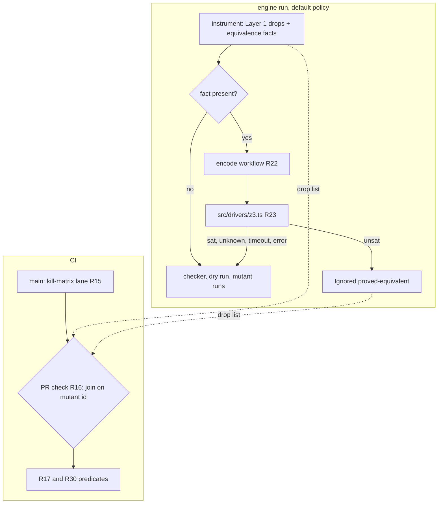

# Mutant Subsumption and Proved Equivalents - Plan

## Goal Capsule

- **Objective:** A stryker-js-effect run executes fewer mutants that carry no new kill signal. Every mutant it skips names either the kept mutant that dominates it or the solver proof that makes it equivalent. A CI check on the dogfood corpus shows that no test loses a kill.
- **Product authority:** `.omp-brief/unit-i-contract.md` (Unit I, binding; its 2026-10-09 update approves `z3-solver`), then `CONSTITUTION.md`, which outranks it. Stream C (`origin/stryker/mutant-quality`, plan `docs/plans/2026-10-09-1850-feat-mutant-quality-plan.md`) owns structural and type-based equivalent culling. Stream F owns native generation later. Neither is in scope here.
- **Open blockers:** Q1 asks who owns the no-signal-loss gate, because CONST-E9 forbids this unit from building the gate that grades it. Q2 asks for approval of `async-mutex`, a non-Microsoft transitive dependency of `z3-solver`. Both are listed under Resolve Before Planning.
- **Applicable packs** (`.compound-engineering/config.yaml`):
  - cell-architecture: pure-decision-workflows, ports-separate-from-layers, sandwich-phase-order
  - schema-laws: refusals-beside-generated-laws, tagged-unions-over-state-by-presence
  - boundary-testing: pin-dependency-semantics, real-system-oracles

---

## Product Contract

### Gap against origin/main

Every "has" cell below was read at `1e1de6d05`, and an independent verifier re-checked 20 code claims (all confirmed). The kill-matrix and yield figures come from Mutation run [37960922409](https://github.com/systemfsoftware/stryker-js-effect/actions/runs/37960922409) (#416, head `1e1de6d05`, artifact `mutation-report-416`). The scheduled `--full` run [37918729445](https://github.com/systemfsoftware/stryker-js-effect/actions/runs/37918729445) (#406, artifact `mutation-report-406`) gives the same figures.

| Done item                                                   | origin/main has                                                                                                                                                                                                                                                                                                                                                                           | Missing                                                                                                                                                                                                                                                                                        | Primary source                                                                                                                                                             |
| ----------------------------------------------------------- | ----------------------------------------------------------------------------------------------------------------------------------------------------------------------------------------------------------------------------------------------------------------------------------------------------------------------------------------------------------------------------------------- | ---------------------------------------------------------------------------------------------------------------------------------------------------------------------------------------------------------------------------------------------------------------------------------------------- | -------------------------------------------------------------------------------------------------------------------------------------------------------------------------- |
| 1. Static subsumption (Layer 1)                             | `redundant-relational`, at `packages/stryker-js-instrumenter/src/mutant-set-policy.workflow.ts:16,99-113`. Its sufficient-set table at `relational-sufficient-sets.ts:34-39` covers `<`, `<=`, `>`, `>=`. It applies only in condition positions (`Mutator.service.ts:889-892`, `:922-924`) and has generated properties (`__tests__/mutant-set-policy.workflow.property.test.ts:22-49`). | No dominator is named. Drops happen only in condition positions and fire 0 times on the corpus. No JS operand precondition is established. A drop still happens after a directive ignores its dominator (`plan-mutants.workflow.ts:156-186`).                                                  | Kaminski, Ammann, Offutt, "Better Predicate Testing", AST 2011; Just & Schweiggert, STVR 24(5) 2014, Table III; Ammann, Delamaro, Offutt, ICST 2014; ECMA-262 `IsLessThan` |
| 1. Dropped mutant reported with dominator and reason        | Ignored mutants carry `statusReason: '<ruleId>: <detail>'` (`Mutator.service.ts:136-150`). The vocabulary is closed at 12 ids (`packages/stryker-js-plugin-interface/src/ignore-rule.schema.ts:6-19`).                                                                                                                                                                                    | No dominator field. Reuse overwrites the reason with `'Remembered'` (`packages/stryker-js/src/run/incremental-reuse.cell.ts:421`): all 1187 Ignored mutants in #416 read `Remembered`. The merged `mutation.json` has no `statusReason`. Stream C R6/R7 fix both.                              | Kurtz et al., "Mutant Subsumption Graphs", Mutation 2014                                                                                                                   |
| 1. CI proves no signal loss against main's full kill matrix | `killedBy` and `coveredBy` exist in the report schema. The vitest runner reports every killer only under `disableBail` (`packages/stryker-js-vitest-runner/src/VitestRuntime.handle.ts:248`, `interpret-vitest-mutant-run.workflow.ts:94-110`).                                                                                                                                           | No full kill matrix exists. `disableBail` defaults to false (`stryker-options.schema.ts:284`) and no dogfood config sets it. All 1797 Killed mutants in #416 have exactly one `killedBy`. The merged `mutation.json` carries neither `killedBy` nor `coveredBy`. No CI job checks subsumption. | Kurtz et al., "Analyzing the Validity of Selective Mutation with Dominator Mutants", FSE 2016                                                                              |
| 2. Layer 2 SMT equivalence                                  | Only trivial-compiler equivalence (`packages/stryker-js-typescript-checker/src/check-mutants.workflow.ts:41-44`, `classify-tce.workflow.ts`). The engine has drivers at `packages/stryker-js/src/drivers/` (`config.ts`, `node.ts`, `promise.ts`), and its package describes itself as "the run engine" (`packages/stryker-js/package.json:13`).                                          | All of it: the eligibility fact, the SMT encoding, the solver driver, and the reason id                                                                                                                                                                                                        | Brain, Tinelli, Rümmer, Wahl, ARITH 2015; SMT-LIB FloatingPoint theory; Loring, Mitchell, Kinder, "ExpoSE", SPIN 2017; ECMA-262 Number and `SameValue`                     |
| 3. Before/after counts on the shared bench lane             | No bench lane. `.github/workflows/` holds changeset-check, ci, commitlint, force-release, mutation, nix, and release. `testsCompleted` is recorded per mutant in each project's incremental report.                                                                                                                                                                                       | The lane itself, which another stream owns                                                                                                                                                                                                                                                     | n/a                                                                                                                                                                        |
| 4. CI green with new tests                                  | `pnpm test` runs property tests. `stryker-js-instrumenter` is not in the Mutation corpus (`.github/workflows/mutation.yml:29`).                                                                                                                                                                                                                                                           | The new instrumenter code would get no CI mutation coverage (CONST-T3)                                                                                                                                                                                                                         | n/a                                                                                                                                                                        |

**Contract claims checked:**

- "Main's full kill matrix" does not exist. CI bails on the first failing test, and the merged report drops `killedBy`. This unit has to build the matrix.
- "`redundant-relational` may already be the Kaminski ROR subset" is half right. It is the Just & Schweiggert sufficient set for the four ordering operators, which equals the Kaminski set. It applies only in condition positions: KTD12 left value positions out on purpose (`docs/plans/2026-09-29-0427-feat-state-of-the-art-mutation-testing-plan.md:260`). This repo's pure core has cyclomatic complexity 1 and writes `Boolean.match` in place of `if` or `?:` (CONST-P2), so the rule fires on 0 of 76 relational sites. The Kaminski `==`/`!=` rows are absent, and the `EqualityOperator` mutator could not produce them anyway (`Mutator.service.ts:955-964`).
- The other contract claims hold. The rule ids are as stated. Stream C adds `arid-uncovered-block` and `constant-collection-size` and contains nothing on subsumption or solvers. No bench lane exists on main.

### Summary

Layer 1 extends `redundant-relational` into a set of subsumption rules that each name a dominator. Every rule states its JavaScript operand precondition and fires only where that precondition is established. Layer 2 proves mutants equivalent inside small pure numeric and boolean functions. The run engine encodes the original and the mutated function into SMT-LIB FloatingPoint and Bool terms, then asks `z3-solver` whether any input separates them. Only `unsat` drops the mutant. A full kill matrix, built in CI on the corpus, checks every drop from both layers.

### Problem Frame

Same-site reduction has little to work with on this corpus. In #416, 7489 of 7827 mutated sites (95.7%) carry one mutant. The 338 multi-mutant sites hold 1137 mutants, of which 925 were executed (2852 were executed in total). CompileError dominates the waste at 4136 of 8626 mutants (47.9%), and that belongs to the checker and Stream C.

Ceiling on #416 for each candidate drop:

| Candidate                                                 | Sites                                                                                 | Mutants dropped | Executed among them | Test executions saved (Σ `testsCompleted`) | Status                                              |
| --------------------------------------------------------- | ------------------------------------------------------------------------------------- | --------------- | ------------------- | ------------------------------------------ | --------------------------------------------------- |
| S1 relational complement, no precondition                 | 76                                                                                    | 76              | 68                  | 325 of 18697 (1.7%)                        | Sound for every JS value. Adopted.                  |
| S3 relational literal, dominated by the boundary operator | 73                                                                                    | 73              | 61                  | 339                                        | Needs precondition P. Gated on evidence.            |
| S2 equality negation, dominated by a literal              | 223                                                                                   | 223             | 182                 | 851                                        | Refuted on the corpus. Rejected.                    |
| L2 proved equivalent                                      | 16 annotated number/boolean functions (syntactic scan), about 70 mutants, 14 Survived | at least 1      | 1                   | 17 covering tests                          | One hand-derived proof; the solver decides the rest |

Two findings bound what static rules can do in JavaScript:

1. **Infection containment is not kill containment.** A static rule can prove that every single evaluation that infects dominator `d` also infects `m` into the same post-state (the RIP infection condition; Ammann & Offutt, _Introduction to Software Testing_, 2nd ed.). It cannot rule out masking across repeated evaluations of the same site (Kurtz, Ammann, Offutt, "Static Analysis of Mutant Subsumption", ICSTW 2015).
2. **The corpus contains a counterexample.** At `packages/stryker-js/src/run/validate-options-admission.workflow.ts:19`, the literal mutant `90f2080398d798bc` was Killed by test 973, while the negation `1e60ed65ae6cd32a` (`value === null`) Survived all 3 of its covering tests. Infection containment holds there and the operands are pure, yet the kill does not carry over. This is why S2 is rejected and why every drop is checked against the kill matrix.

Layer 2's corpus case: in `flooredTimeoutOf` (`packages/stryker-js/src/plan-mutant-tests.workflow.ts:155-159`), mutant `87ac4fce39ccfec2` replaces `timeout < MUTANT_TIMEOUT_FLOOR_MS` with `<=`, where `MUTANT_TIMEOUT_FLOOR_MS = 100` (`:153`). At `timeout = 100` both branches return `+100`. NaN and `-0` take the same branch under both operators. So no double separates the two under `SameValue`. The mutant Survived its 17 covering tests in #416, and that run spent those tests for nothing.

The `<=` mutants of `maxOf`/`minOf` (`packages/stryker-js/src/build-reproducers.workflow.ts:12,15`, ids `e65ee3e59dbf8148` and `4868200158d404eb`) are not equivalent: they return `-0` where the original returns `+0`, and vitest's `toBe` uses `Object.is`. Under R24 the solver must therefore return `sat` for them, and they keep running.

### Key Decisions

- **Rules prove infection containment; the kill matrix decides kill containment.** A static proof cannot cover masking across repeated evaluations. Governs R1, R17.
- **S1 extends `redundant-relational` and adds no parallel rule.** It only removes mutants, which matches KTD12's "R21 only removes". Governs R3, R8.
- **S2 is rejected on evidence.** At one site, CI ids `90f2080398d798bc` (Killed) and `1e60ed65ae6cd32a` (Survived) violate `killers(d) ⊆ killers(m)`.
- **The existing condition-position drops lose their unconditional status.** Only the complement drop has no precondition. This is a breaking change under BREAK-1. Governs R4.
- **Layer 1 decides once, over plain site facts, fed twice.** Plan time supplies syntactic facts; check time supplies type facts and dominator CompileError. The alternatives fail: instrumenter-only cannot establish class T, and checker-only does nothing without the checker plugin. Governs R10, R11.
- **Empirical subsumption mined from the matrix is not a drop rule**, because a heuristic without a proof is excluded ("Does not count").
- **Logical-connector (COR) subsumption is out.** The corpus has 15 `LogicalOperator` mutants on 9 sites, and KTD12 records that `&&`, `||`, and `??` return non-booleans.
- **Layer 2 runs in the run engine (`packages/stryker-js`), not in the instrumenter or the checker.** The supervisor's constraint names "the engine's equivalence workflow" behind `src/drivers/`. The engine is the package that calls itself the run engine and already holds `src/drivers/`. Putting it there also keeps the 35.8 MB solver out of both plugin-worker bundles (PLUG-1). Governs R19, R20.
- **The instrumenter emits the eligibility fact; the engine proves it.** The instrumenter holds the AST, so it emits a serializable term pair (original, mutated) for each eligible mutant. The engine never re-parses. A native generator can emit the same fact. Governs R21.
- **Equivalence means `SameValue` (`Object.is`) over every IEEE-754 double, not `===` and not over the TypeScript-refined domain.** `SameValue` is what vitest `toBe` observes. Drawing parameters from every double (NaN, ±0, ±∞, subnormals) over-approximates any `S.Int` or `S.Finite` refinement. That can only turn an `unsat` into `sat`, never the reverse. Governs R24.
- **The bound is deterministic: a Z3 resource limit, with wall-clock time as a backstop.** A wall-clock-only bound would let the mutant set differ between a fast and a slow machine, which breaks the before/after counts and verdict reuse. Governs R26.
- **The reason id is `proved-equivalent`.** It renders the supervisor's "proved equivalent" in the kebab-case convention of the existing ids (`equivalent-to-original`). Governs R27.

### Requirements

**Layer 1 rule semantics**

- R1. A rule drops mutant `m` only by naming one dominator `d`: a mutant of the same original expression at the same site. The rule proves that for every single evaluation of the site where its precondition holds, every value that infects `d` also infects `m` and leaves `m` in the same post-state.
- R2. Each rule declares one precondition class and fires only where the class is established. Otherwise every mutant at the site is kept. The classes:
  - **none:** no condition.
  - **P (pure operands):** each operand is a literal, a parameter or local binding, `typeof <identifier>`, `void 0`, or `.length` on an array-, tuple-, or string-typed receiver.
  - **T (non-nullish primitives):** both operand types lie within number, bigint, string, or boolean (literal and enum types included). The TypeScript checker establishes this class.
- R3. S1 (relational complement, class none, any position) drops these mutants: `<`→`>=` (dominator `<=`), `<=`→`>` (dominator `<`), `>`→`<=` (dominator `>=`), and `>=`→`<` (dominator `>`). All four operators evaluate left then right, apply ToPrimitive(number) once per operand, and differ only in how they map the `IsLessThan` result to a boolean. A Bun probe over number, bigint/number, string, number/string, nullable, and `valueOf`-object operands found identical evaluation traces and 0 violations.
- R4. Condition-position drops beyond S1 keep firing only under these preconditions:
  - `>` for `<` (and mirrors), dominated by `false`: class P.
  - `true` for `<`, dominated by `<=` or `!=`: class P.
  - `==` for `<`, dominated by `<=` under class T, or by `false` under class P.

  `!=` never dominates `>`: the probe found 13 NaN counterexamples. `<=` never dominates `==` without class T: `null`/`0` and identity-distinct objects break it.
- R5. A drop holds only while its dominator runs. If `d` is Ignored for any reason, or is CompileError, then `m` runs, unless a different admissible dominator does run.
- R6. S3 (`true` for `<`/`>`, `false` for `<=`/`>=`, dominated by the boundary operator, class P) ships only after the R16 check passes for it on the corpus.
- R7. Under `mutantSetPolicy: 'full'` neither layer drops anything.

**Reporting**

- R8. Every Layer 1 drop is Ignored with `redundant-relational`. A new rule family gets its own id in `IgnoreRuleId`.
- R9. Every surface that carries a dropped mutant's reason also carries a machine-recoverable reference to what made it redundant (dominator mutant id, or solver identity and version), and keeps it through verdict reuse: the NDJSON mutant line, the merged report, and the incremental record. This depends on Stream C R6/R7.

**Layer 1 purity and seam**

- R10. The Layer 1 rules are one pure Workflow with cyclomatic complexity 1, a sibling of `mutantSetPolicy`.
- R11. That workflow reads only serializable site facts:
  - site key and original operator kind;
  - each candidate's mutant id, replacement kind, and current ignore status;
  - the precondition classes established for the site;
  - dominator compile validity, once known.

**Layer 2 proved equivalence**

- R19. `z3-solver` is pinned to one exact version through the pnpm catalog and is a dependency of `@systemfsoftware/stryker-js` only. Only one module imports it: a driver at `packages/stryker-js/src/drivers/z3.ts`, called only by the engine's equivalence cell. That cell is lazy: a run with no eligible mutant never loads the solver. Facts from `npm view` on 2026-10-09:
  - version 5.2.0, MIT, repository `github.com/Z3Prover/z3`;
  - published by `nikolaj_bjorner <nbjorner@microsoft.com>`;
  - main `build/node.js`, 35,820,846 bytes unpacked, 25 files;
  - Node `>=16`;
  - one runtime dependency, `async-mutex ^0.3.2` (MIT, maintained by an individual, `dirtyhairy`). That dependency needs approval (Q2).
- R20. The equivalence step runs after the static ignore decisions (Layer 1, directives, ignorers, arid rules) and before the checker and the dry run. It considers only mutants that are still pending. A proved mutant never reaches the checker or a runner.
- R21. The instrumenter emits an equivalence fact for a mutant when it lies inside a small pure function. A function qualifies when all of the following are checkable from the AST:
  - it is an arrow function or function declaration;
  - every parameter has an explicit `number` or `boolean` annotation;
  - its return is an expression, or a single `return` of one;
  - its body is drawn only from: parameters; number and boolean literals; module-level `const` bindings whose initializer is such a literal; unary `-`, `+`, `!`; `+`, `-`, `*`, `/`; `<`, `<=`, `>`, `>=`; `===`, `!==`, `==`, `!=` on same-typed operands; `&&`, `||`, `?:`; and `Boolean.match(c, { onTrue: () => a, onFalse: () => b })` where `Boolean` is the namespace import of `effect/Boolean`;
  - its only calls are `Math.abs`, `Math.min`, `Math.max`, `Math.floor`, `Math.ceil`, `Math.trunc`, `Math.sign`, or a module `const` bound to one of them (`const floor = Math.floor`);
  - it has no loops, no recursion, no captured `let`/`var`, and at most N nodes (Q8);
  - the mutant's replacement is drawn from the same fragment.

  Anything else (`%`, `**`, bitwise operators, `Math.round`, `sqrt`, `pow`, other implementation-approximated `Math` functions, strings, bigint, objects) means no fact, and the mutant runs. The fact is a serializable term pair with parameter sorts, independent of oxc nodes.
- R22. The encoding is a pure Workflow (cyclomatic complexity 1). Its input is the fact. Its output is SMT-LIB2 query text, or a refusal when the fact holds a construct it cannot encode exactly:
  - number becomes `(_ FloatingPoint 11 53)`; boolean becomes `Bool`;
  - `+`, `-`, `*`, `/` become `fp.add`, `fp.sub`, `fp.mul`, `fp.div` under `RNE`; unary `-` becomes `fp.neg`; unary `+` on number is the identity;
  - `<`, `<=`, `>`, `>=` become `fp.lt`, `fp.leq`, `fp.gt`, `fp.geq` (false whenever NaN is involved);
  - `===` and `==` on numbers become `fp.eq` (NaN ≠ NaN, +0 = −0), and their negations become `not fp.eq`;
  - `!x` on number becomes `(or fp.isZero fp.isNaN)`;
  - `&&` and `||` on numbers become `ite` on that truthiness; `?:` and `Boolean.match` become `ite`;
  - `Math.floor`, `Math.ceil`, and `Math.trunc` become `fp.roundToIntegral` with `RTN`, `RTP`, and `RTZ`; `Math.abs` becomes `fp.abs`;
  - `Math.min`, `Math.max`, and `Math.sign` get explicit `ite` encodings of the ECMA-262 NaN and ±0 rules, because SMT-LIB leaves `fp.min`/`fp.max` unspecified on ±0.
- R23. The driver takes query text and returns one of `unsat`, `sat`, `unknown`, `timeout`, or `error`. Each value is a member of a tagged union, never a field that is present or absent.
- R24. The query declares one FloatingPoint or Bool constant per parameter, unconstrained, and asserts `(not (= f f_m))`. SMT `=` is `SameValue`: NaN equals NaN, and +0 differs from −0.
- R25. Only `unsat` drops the mutant. `sat`, `unknown`, `timeout`, `error`, and any refusal from R21 or R22 keep it. A driver failure never fails the run.
- R26. Every query runs under a fixed Z3 resource limit, which is deterministic across machines, and a wall-clock ceiling as a backstop. A verdict is cached under (`z3-solver` version, resource limit, query text). A verdict that hit the wall-clock ceiling is never cached.
- R27. A proved mutant is Ignored with the new `IgnoreRuleId` `proved-equivalent`. Its detail names the solver, the solver version, and the verdict (`proved-equivalent: z3-solver 5.2.0 unsat`). Reuse keeps that detail (R9).

**Tests (admitted by the test-layer gate)**

- R12. The Layer 1 workflow gets colocated property tests, with the JS engine as the oracle. Over generated operands in each precondition's domain (NaN, `-0`, mixed bigint and number, numeric and non-numeric strings, `null`, `undefined`, and objects with `valueOf` or `Symbol.toPrimitive`), the test evaluates the original, `d`, and `m` and asserts containment. Beside it, a refusal property asserts that a site outside the domain is kept.
- R13. A differential spec against the real TypeScript checker pins the claim that a dominator compiles whenever the original compiles, for every operator pair a rule uses. A rule whose dominator can fail to compile decides at check time.
- R28. The Layer 2 decision (verdict to outcome) gets colocated property tests: only `unsat` yields `proved-equivalent`, and every other verdict and every refusal keeps the mutant.
- R29. A differential spec pits the encoding against the JS engine. Over generated fragment terms and generated doubles (NaN, ±0, ±∞, subnormals, boundary values), JS evaluation of the term must equal the value the real Z3 driver returns for the encoded term at those inputs, compared by `SameValue`. This test is the soundness proof of R22. It runs the real solver in-process.

**No-signal-loss check**

- R14. The corpus is the Mutation workflow's `PROJECTS` (`.github/workflows/mutation.yml:29`) under each project's `mutate` globs, at main's head.
- R15. A CI-only kill-matrix lane runs on main, on a schedule and by dispatch:
  - it runs the released CLI with `mutantSetPolicy: 'full'`, `disableBail: true`, and `coverageAnalysis: 'perTest'`;
  - it does no verdict reuse (`disableBail` is fingerprinted, `packages/stryker-js/src/verdict-semantics.ts:92-111`);
  - it publishes each mutant's status, every `killedBy`, `coveredBy`, and `testsCompleted`.
- R16. On each PR that changes a rule or the encoding, a check:
  - computes the drop list `(m, reason, d or solver)` over the corpus from the workspace build without executing tests;
  - joins it to main's latest kill matrix on content-derived mutant ids (`packages/stryker-js-instrumenter/src/MutantIdentity.ts:20-31`);
  - evaluates R17 and fails on any violation;
  - publishes per-rule pair counts by verdict, and every unjoinable id.
- R17. The predicate below applies to each Layer 1 drop `(m, d)`. Separately, every test that kills at least one mutant in the full matrix must still kill some kept mutant.

  | `d` in matrix                          | `m` in matrix                     | Verdict                                |
  | -------------------------------------- | --------------------------------- | -------------------------------------- |
  | Killed                                 | Killed, `killers(d) ⊆ killers(m)` | pass                                   |
  | Killed                                 | Killed, `killers(d) ⊄ killers(m)` | fail                                   |
  | Killed or Timeout                      | Survived or NoCoverage            | fail                                   |
  | Killed                                 | Timeout                           | pass; listed as attribution-unverified |
  | Timeout                                | Killed or Timeout                 | pass; listed as attribution-unverified |
  | Survived                               | any                               | pass; counted as vacuous               |
  | NoCoverage                             | NoCoverage                        | pass; counted as vacuous               |
  | NoCoverage                             | covered                           | fail: misidentified pair               |
  | CompileError, RuntimeError, or Ignored | dropped                           | fail: R5 broken                        |

- R30. For a Layer 2 drop `m`, the check passes when `m` is Survived or NoCoverage in the matrix. Killed, Timeout, RuntimeError, or CompileError fail it: the proof covered a program that differs from the one that ran, or the encoding is unsound.

**Metrics**

- R18. A full, non-reusing run of the corpus is taken before and after the change. Each run reports planned mutants, Ignored mutants per rule id, executed mutants (Killed + Survived + Timeout + RuntimeError), test executions (Σ `testsCompleted`, read from the incremental records because the merged `mutation.json` lacks it), solver queries by verdict, and total solver time, plus the list of dropped ids. The counts are published on the shared bench lane.

### Acceptance Examples

- AE1. **Covers R3, R8, R9.** At `trapFile.length > 0` (`interpret-vitest-mutant-run.workflow.ts:33`), `<= 0` (`4252fb2dcdaf4ccc`) is Ignored with `redundant-relational`, naming dominator `3e6dbfafadd1dc10` (`>=`). The `true`, `false`, and `>=` mutants still run.
- AE2. **Covers R5.** If Stream C's `constant-collection-size` ignores `trapFile.length >= 0`, then `<= 0` is not dropped under S1.
- AE3. **Covers R5.** `if (a < b)` under `// Stryker disable next-line EqualityOperator` keeps `true`, because every dominator R4 admits for it is ignored.
- AE4. **Covers R4.** `if (x < limit)` with `x: number | null` keeps `x == limit`.
- AE5. **Covers R17.** A drop whose dominator was Killed by test 973 while `m` Survived (the S2 shape at `1e60ed65ae6cd32a`) fails the check, and the failure names both ids.
- AE6. **Covers R17.** `comparePatternKeysOf(key, current[0]) < 0`: dominator `056ca92f55a9284e` (`<=`) Survived and the dropped `f1f3c32d0a1b980f` (`>=`) was Killed. The pair passes as vacuous, unless some test's only kill was `f1f3c32d0a1b980f`.
- AE7. **Covers R24, R25, R27.** In `flooredTimeoutOf`, mutant `87ac4fce39ccfec2` (`timeout <= MUTANT_TIMEOUT_FLOOR_MS`) is Ignored `proved-equivalent: z3-solver 5.2.0 unsat` and never reaches a runner. The `true` mutant `cb489681b94eef94` at the same site is `sat` (separated at `timeout = 200`) and runs.
- AE8. **Covers R24, R25.** `maxOf`'s `left <= right` (`e65ee3e59dbf8148`) is `sat` at `left = +0, right = −0` and runs.
- AE9. **Covers R21, R25.** `percentageTotal` (`resolve-concurrency.workflow.ts:56`) calls `round`, so it yields no fact, and its mutants run without a solver query. A query that exhausts the resource limit returns `unknown`, and that mutant runs too.
- AE10. **Covers R30.** If the matrix shows a `proved-equivalent` mutant as Killed, the check fails and names the mutant and its query hash.

### Success Criteria

- On the #416 corpus, S1 drops 76 mutants and `87ac4fce39ccfec2` is proved equivalent. The R16 check on the first kill matrix reports 0 failures.
- The R18 counts appear on the bench lane for one before/after pair, and the dropped ids match the R16 drop list.

### Delivery order

Each layer is one stacked PR on `main`, inert until a higher layer wires it in.

1. Kill-matrix lane (R14, R15). This is the evidence every later layer needs, subject to Q1.
2. Layer 1: S1, the R4/R5 repair, dominator reporting (R1-R11), and its tests (R12, R13).
3. Layer 2 encoding: the fact emitted by the instrumenter, the encoding workflow, and the decision workflow (R21, R22, R24, R25, R28). Pure code, no solver dependency.
4. Layer 2 driver: the `z3-solver` catalog pin, `src/drivers/z3.ts`, wiring into the engine, `proved-equivalent`, and caching (R19, R20, R23, R26, R27, R29). This layer turns Layer 2 on by default.
5. The R16 check, which needs 1, 2, and 4, then the before/after counts (R18).

### Verification

- `pnpm test` runs R12, R13, R28, and R29 on every PR.
- R16 runs in CI on every PR that touches a rule or the encoding, against main's latest R15 artifact.
- The before/after numbers come only from CI runs, cited by run id and artifact. Nothing runs mutation locally.

### Scope Boundaries

- Deferred: S3, until R16 passes for it. Class-T rules, until a checker fact seam exists (Q5). Layer 2 bigint, `%`, and `Math.round`.
- Out: S2 (refuted), COR, the unary-insertion tables, empirically mined subsumption, and strings in Layer 2.
- Out: syntactic type-invalid skipping and CompileError reduction (Stream C KD3; the checker).
- Out: building the bench lane (another stream). Changing `PROJECTS`, `mutate` globs, thresholds, or any other judgment surface (CONST-E9; see Q1, Q6).
- Out: installing or running the solver during this brainstorm.

### Dependencies / Assumptions

- R9 depends on Stream C R6/R7. Class T depends on Stream C U9's checker fact provider (`ts-compiler.handle.ts`).
- Mutant ids join across the `full` and `default` policies, because policy is not an id input (`MutantIdentity.ts:20-31`; per-tuple ordinal at `Transformer.service.ts:137-141`).
- A kill-matrix run costs about one nightly run: #416's Killed mutants completed 8205 tests out of 9028 covering tests.
- [INFERENCE] `z3-solver` 5.2.0 exposes a resource-limit parameter (`rlimit`) and per-query timeout through its low-level API from Node. Planning must confirm this from the package's type declarations without installing it.
- [INFERENCE] `z3-solver`'s Node build uses WASM threads (`worker_threads`, `SharedArrayBuffer`). Planning must confirm how it loads in the engine process and in the published tarball.

### Outstanding Questions

**Resolve Before Planning**

- Q1. This unit is asked to build the CI check (R15, R16) that proves its own drops lose no signal. CONST-E9 bans the graded party from building its grader, and GATE1 requires operator sign-off on any new gate. Who owns R15 and R16?
- Q2. `z3-solver` 5.2.0 depends on `async-mutex ^0.3.2` (MIT, individual maintainer `dirtyhairy`, `github.com/DirtyHairy/async-mutex`). That package is not Microsoft's. Is it approved as a transitive dependency?

**Deferred to Planning**

- Q3. Which stream owns the bench lane, and where do R18 counts go before it exists?
- Q4. The R4 repair is breaking: condition positions get more mutants. Is it this unit's change to make? Stream C U8 only adds refusal tests to `mutant-set-policy`.
- Q5. Should class T reuse Stream C U9's checker fact seam, which would sequence Unit I after it?
- Q6. Should `packages/stryker-js-instrumenter` join the Mutation corpus? The fact emitter and the rules live there (CONST-T3), and the corpus is a judgment surface owned elsewhere.
- Q7. How is the dominator id or proof identity encoded: inside the `statusReason` detail, as a typed field on repo-owned records, or both?
- Q8. What are the node-count bound N (R21), the resource limit, and the wall-clock ceiling (R26)? Planning should set them from solve times measured on CI, not locally.
- Q9. Must the published `@systemfsoftware/stryker-js` tarball carry the WASM, or does it resolve `z3-solver` as a real dependency? This decides the dogfood tarball size and START-6.
- Q10. When a dominator turns out CompileError at check time, how does the engine re-admit the dropped mutant (R5)?

### Sources / Research

- Kaminski, Ammann, Offutt, "Better Predicate Testing", AST 2011.
- Just, Schweiggert, STVR 24(5), 2014, Table III (cited at `relational-sufficient-sets.ts:4-7`).
- Just, Kapfhammer, Schweiggert, "Do Redundant Mutants Affect the Effectiveness and Efficiency of Mutation Analysis?", Mutation 2012.
- Ammann, Delamaro, Offutt, "Establishing Theoretical Minimal Sets of Mutants", ICST 2014.
- Kurtz, Ammann, Delamaro, Offutt, Deng, "Mutant Subsumption Graphs", Mutation 2014.
- Kurtz, Ammann, Offutt, "Static Analysis of Mutant Subsumption", ICSTW 2015.
- Kurtz et al., "Analyzing the Validity of Selective Mutation with Dominator Mutants", FSE 2016.
- Garg et al., "Cerebro: Static Subsuming Mutant Selection", TSE 49(1) 2023, arXiv 2112.14151. A learned model, so it cannot serve as a verdict.
- Offutt, Lee, Rothermel, Untch, Zapf, "An Experimental Determination of Sufficient Mutant Operators", TOSEM 1996.
- Offutt, Lee, "An Empirical Evaluation of Weak Mutation", TSE 1994.
- Ammann, Offutt, _Introduction to Software Testing_, 2nd ed. (the RIP model).
- Loring, Mitchell, Kinder, "ExpoSE: Practical Symbolic Execution of Standalone JavaScript", SPIN 2017.
- Brain, Tinelli, Rümmer, Wahl, "An Automatable Formal Semantics for IEEE-754 Floating-Point Arithmetic", ARITH 2015.
- SMT-LIB FloatingPoint theory (`smt-lib.org/theories-FloatingPoint.shtml`).
- ECMA-262: `IsLessThan`, `SameValue`, and the Math functions specified as implementation-approximated.
- Stream C plan, `origin/stryker/mutant-quality` (R6, R7, R12, R23; KTD10, KTD14; U8, U9).
- SOTA plan, `docs/plans/2026-09-29-0427-feat-state-of-the-art-mutation-testing-plan.md` (KTD11, KTD12, KTD14).
- `docs/solutions/tooling-decisions/verdict-cache-content-keyed-reuse.md`.
- `docs/solutions/test-failures/agent-bail-hangs-the-test-run.md`.
