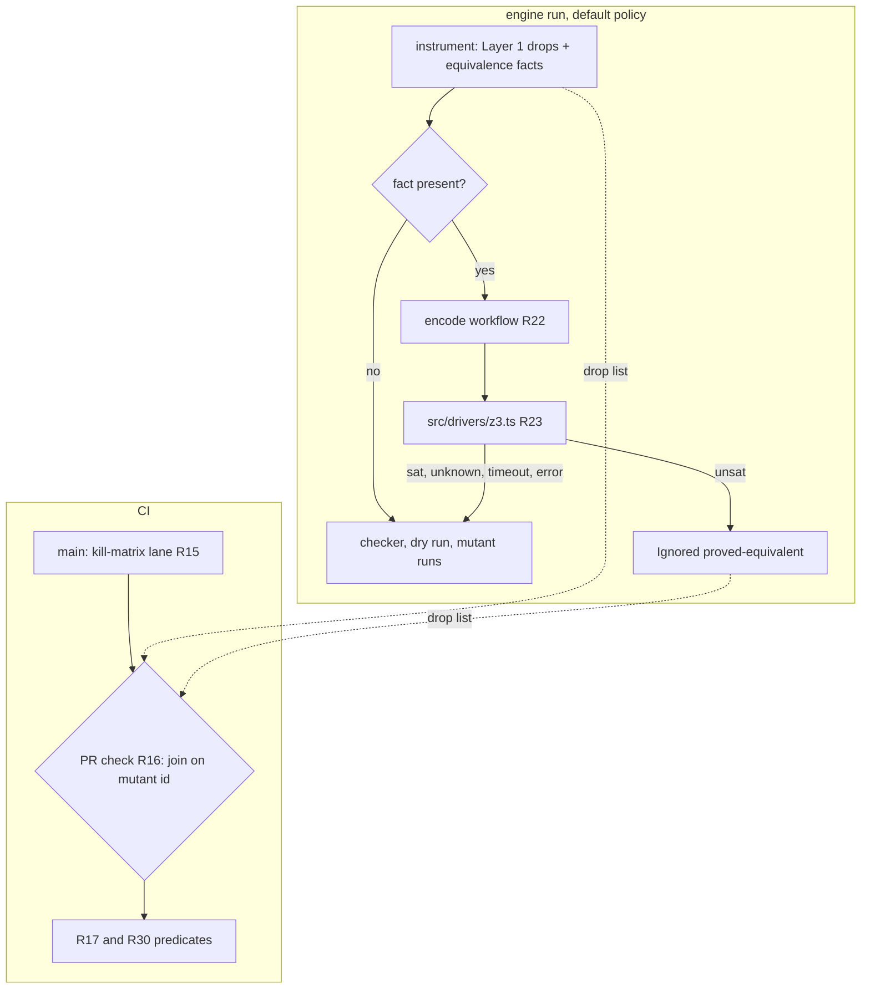
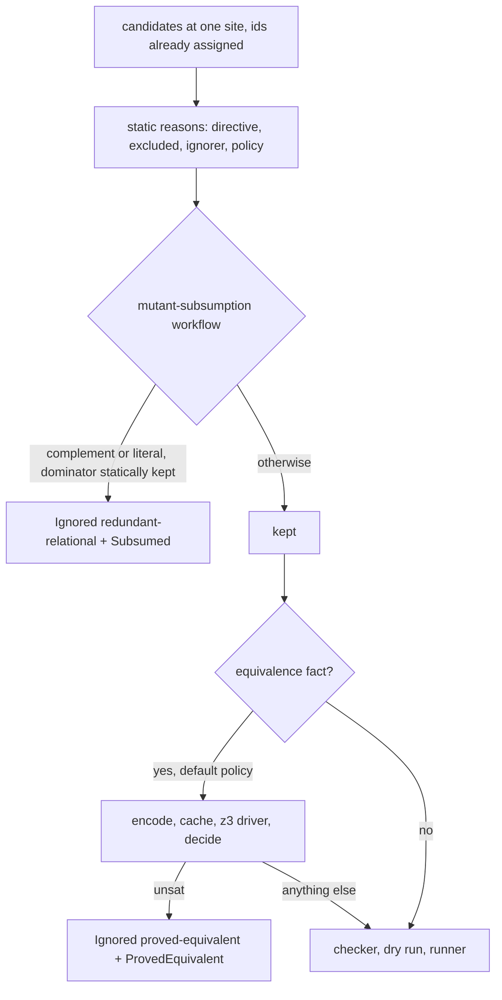
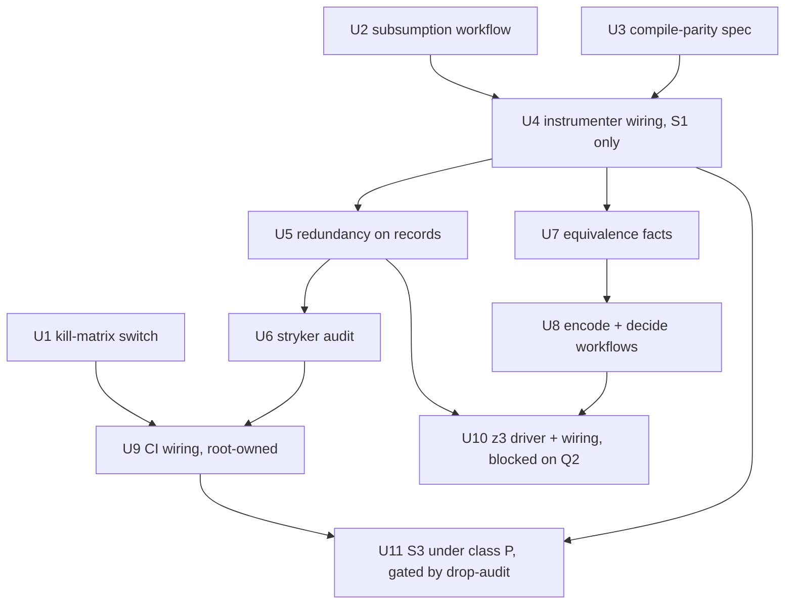

# Mutant Subsumption and Proved Equivalents - Plan

## Goal Capsule

- **Objective:** A stryker-js-effect run executes fewer mutants that carry no new kill signal. Every mutant it skips names either the kept mutant that dominates it or the solver proof that makes it equivalent. A CI check on the dogfood corpus shows that no test loses a kill.
- **Means:** static subsumption decided in the instrumenter (KTD1), solver proofs in the run engine (KTD9), and a kill-matrix audit run by CI (KTD6, KTD7).
- **Product authority:** `.omp-brief/unit-i-contract.md` (Unit I, binding; its 2026-10-09 update approves `z3-solver`), then `CONSTITUTION.md`, which outranks it. The supervisor's 2026-10-09 rulings on Q1-Q10 bind planning; they are recorded under Outstanding Questions. Stream C (`origin/stryker/mutant-quality`, plan `docs/plans/2026-10-09-1850-feat-mutant-quality-plan.md`) owns structural and type-based equivalent culling. Stream F owns native generation later. Neither is in scope here.
- **Execution profile:** one `gh stack` on `main`, one PR per unit, U1 to U11 in order. Local verification is targeted: typecheck and the affected package's tests, at most one build at a time, no e2e, no microVM, no mutation runs (contract "Host resources").
- **Stop conditions:** U9 edits `.github/workflows/`, which is Read-only for this unit; the root owns and reviews it. U10 waits for Q2. U11 waits for U9, because S3 ships only on a green drop audit (R6). If U3's compile-parity spec fails, stop: KTD2 is refuted and Q10 reopens. If Q1 is still pending when U8 merges, U1-U8 and U10 ship as they are, since the supervisor ruled that they must not depend on U9. Contract Done item 1's corpus proof stays unmet and is reported that way. S3 stays off.
- **Who finishes:** `ce-work` builds U1-U8, U10, and U11; the root reviews U9; the supervisor merges every layer.
- **Open blockers:** Q1 (pending the root) gates U9 and U11. Q2 (pending the root) gates U10 only. Q11-Q13 go to the supervisor.
- **Applicable packs** (`.compound-engineering/config.yaml`):
  - cell-architecture: pure-decision-workflows, ports-separate-from-layers, sandwich-phase-order, scoped-lifecycle-boundaries
  - schema-laws: tagged-unions-over-state-by-presence, refusals-beside-generated-laws, recursive-schema-suspend, arbitrary-filter-floors
  - boundary-testing: pin-dependency-semantics, real-system-oracles, no-mocks-on-internal-glue

---

## Product Contract

### Gap against origin/main

Every "has" cell below was read at `1e1de6d05`, and an independent verifier re-checked 20 code claims (all confirmed). The kill-matrix and yield figures come from Mutation run [37960922409](https://github.com/systemfsoftware/stryker-js-effect/actions/runs/37960922409) (#416, head `1e1de6d05`, artifact `mutation-report-416`). The scheduled `--full` run [37918729445](https://github.com/systemfsoftware/stryker-js-effect/actions/runs/37918729445) (#406, artifact `mutation-report-406`) gives the same figures.

| Done item                                                   | origin/main has                                                                                                                                                                                                                                                                                                                                                                           | Missing                                                                                                                                                                                                                                                                                        | Primary source                                                                                                                                                             |
| ----------------------------------------------------------- | ----------------------------------------------------------------------------------------------------------------------------------------------------------------------------------------------------------------------------------------------------------------------------------------------------------------------------------------------------------------------------------------- | ---------------------------------------------------------------------------------------------------------------------------------------------------------------------------------------------------------------------------------------------------------------------------------------------- | -------------------------------------------------------------------------------------------------------------------------------------------------------------------------- |
| 1. Static subsumption (Layer 1)                             | `redundant-relational`, at `packages/stryker-js-instrumenter/src/mutant-set-policy.workflow.ts:16,99-113`. Its sufficient-set table at `relational-sufficient-sets.ts:34-39` covers `<`, `<=`, `>`, `>=`. It applies only in condition positions (`Mutator.service.ts:889-892`, `:922-924`) and has generated properties (`__tests__/mutant-set-policy.workflow.property.test.ts:22-49`). | No dominator is named. Drops happen only in condition positions and fire 0 times on the corpus. No JS operand precondition is established. A drop still happens after a directive ignores its dominator (`plan-mutants.workflow.ts:156-186`).                                                  | Kaminski, Ammann, Offutt, "Better Predicate Testing", AST 2011; Just & Schweiggert, STVR 24(5) 2014, Table III; Ammann, Delamaro, Offutt, ICST 2014; ECMA-262 `IsLessThan` |
| 1. Dropped mutant reported with dominator and reason        | Ignored mutants carry `statusReason: '<ruleId>: <detail>'` (`Mutator.service.ts:136-150`). The vocabulary is closed at 12 ids (`packages/stryker-js-plugin-interface/src/ignore-rule.schema.ts:6-19`).                                                                                                                                                                                    | No dominator field. Reuse overwrites the reason with `'Remembered'` (`packages/stryker-js/src/run/incremental-reuse.cell.ts:421`): all 1187 Ignored mutants in #416 read `Remembered`. The merged `mutation.json` has no `statusReason`. Stream C R6/R7 fix both.                              | Kurtz et al., "Mutant Subsumption Graphs", Mutation 2014                                                                                                                   |
| 1. CI proves no signal loss against main's full kill matrix | `killedBy` and `coveredBy` exist in the report schema. The vitest runner reports every killer only under `disableBail` (`packages/stryker-js-vitest-runner/src/VitestRuntime.handle.ts:248`, `interpret-vitest-mutant-run.workflow.ts:94-110`).                                                                                                                                           | No full kill matrix exists. `disableBail` defaults to false (`stryker-options.schema.ts:284`) and no dogfood config sets it. All 1797 Killed mutants in #416 have exactly one `killedBy`. The merged `mutation.json` carries neither `killedBy` nor `coveredBy`. No CI job checks subsumption. | Kurtz et al., "Analyzing the Validity of Selective Mutation with Dominator Mutants", FSE 2016                                                                              |
| 2. Layer 2 SMT equivalence                                  | Only trivial-compiler equivalence (`packages/stryker-js-typescript-checker/src/check-mutants.workflow.ts:41-44`, `classify-tce.workflow.ts`). The engine has drivers at `packages/stryker-js/src/drivers/` (`config.ts`, `node.ts`, `promise.ts`), and its package describes itself as "the run engine" (`packages/stryker-js/package.json:13`).                                          | All of it: the eligibility fact, the SMT encoding, the solver driver, and the reason id                                                                                                                                                                                                        | Brain, Tinelli, Rümmer, Wahl, ARITH 2015; SMT-LIB FloatingPoint theory; Loring, Mitchell, Kinder, "ExpoSE", SPIN 2017; ECMA-262 Number and `SameValue`                     |
| 3. Before/after counts on the shared bench lane             | No bench lane. `.github/workflows/` holds changeset-check, ci, commitlint, force-release, mutation, nix, and release. `testsCompleted` is recorded per mutant in each project's incremental report.                                                                                                                                                                                       | The lane itself, which another stream owns                                                                                                                                                                                                                                                     | n/a                                                                                                                                                                        |
| 4. CI green with new tests                                  | `pnpm test` runs property tests. `stryker-js-instrumenter` is not in the Mutation corpus (`.github/workflows/mutation.yml:29`).                                                                                                                                                                                                                                                           | The new instrumenter code would get no CI mutation coverage (CONST-T3)                                                                                                                                                                                                                         | n/a                                                                                                                                                                        |

**Contract claims checked:**

- "Main's full kill matrix" does not exist. CI bails on the first failing test, and the merged report drops `killedBy`. This unit has to build the matrix.
- "`redundant-relational` may already be the Kaminski ROR subset" is half right. It is the Just & Schweiggert sufficient set for the four ordering operators, which equals the Kaminski set. It applies only in condition positions: KTD12 left value positions out on purpose (`docs/plans/2026-09-29-0427-feat-state-of-the-art-mutation-testing-plan.md:260`). This repo's pure core has cyclomatic complexity 1 and writes `Boolean.match` in place of `if` or `?:` (CONST-P2), so the rule fires on 0 of 76 relational sites. The Kaminski `==`/`!=` rows are absent, and the `EqualityOperator` mutator could not produce them anyway (`Mutator.service.ts:955-964`).
- The other contract claims hold. The rule ids are as stated. Stream C adds `arid-uncovered-block` and `constant-collection-size` and contains nothing on subsumption or solvers. No bench lane exists on main.

### Summary

Layer 1 extends `redundant-relational` into a set of subsumption rules that each name a dominator. Every rule states its JavaScript operand precondition and fires only where that precondition is established. Layer 2 proves mutants equivalent inside small pure numeric and boolean functions. The run engine encodes the original and the mutated function into SMT-LIB FloatingPoint and Bool terms, then asks `z3-solver` whether any input separates them. Only `unsat` drops the mutant. A full kill matrix, built in CI on the corpus, checks every drop from both layers.

### Problem Frame

Same-site reduction has little to work with on this corpus. In #416, 7489 of 7827 mutated sites (95.7%) carry one mutant. The 338 multi-mutant sites hold 1137 mutants, of which 925 were executed (2852 were executed in total). CompileError dominates the waste at 4136 of 8626 mutants (47.9%), and that belongs to the checker and Stream C.

Ceiling on #416 for each candidate drop:

| Candidate                                                 | Sites                                                                                 | Mutants dropped | Executed among them | Test executions saved (Σ `testsCompleted`) | Status                                              |
| --------------------------------------------------------- | ------------------------------------------------------------------------------------- | --------------- | ------------------- | ------------------------------------------ | --------------------------------------------------- |
| S1 relational complement, no precondition                 | 76                                                                                    | 76              | 68                  | 325 of 18697 (1.7%)                        | Sound for every JS value. Adopted.                  |
| S3 relational literal, dominated by the boundary operator | 73                                                                                    | 73              | 61                  | 339                                        | Needs precondition P. Gated on evidence.            |
| S2 equality negation, dominated by a literal              | 223                                                                                   | 223             | 182                 | 851                                        | Refuted on the corpus. Rejected.                    |
| L2 proved equivalent                                      | 16 annotated number/boolean functions (syntactic scan), about 70 mutants, 14 Survived | at least 1      | 1                   | 17 covering tests                          | One hand-derived proof; the solver decides the rest |

Two findings bound what static rules can do in JavaScript:

1. **Infection containment is not kill containment.** A static rule can prove that every single evaluation that infects dominator `d` also infects `m` into the same post-state (the RIP infection condition; Ammann & Offutt, _Introduction to Software Testing_, 2nd ed.). It cannot rule out masking across repeated evaluations of the same site (Kurtz, Ammann, Offutt, "Static Analysis of Mutant Subsumption", ICSTW 2015).
2. **The corpus contains a counterexample.** At `packages/stryker-js/src/run/validate-options-admission.workflow.ts:19`, the literal mutant `90f2080398d798bc` was Killed by test 973, while the negation `1e60ed65ae6cd32a` (`value === null`) Survived all 3 of its covering tests. Infection containment holds there and the operands are pure, yet the kill does not carry over. This is why S2 is rejected and why every drop is checked against the kill matrix.

Layer 2's corpus case: in `flooredTimeoutOf` (`packages/stryker-js/src/plan-mutant-tests.workflow.ts:155-159`), mutant `87ac4fce39ccfec2` replaces `timeout < MUTANT_TIMEOUT_FLOOR_MS` with `<=`, where `MUTANT_TIMEOUT_FLOOR_MS = 100` (`:153`). At `timeout = 100` both branches return `+100`. NaN and `-0` take the same branch under both operators. So no double separates the two under `SameValue`. The mutant Survived its 17 covering tests in #416, and that run spent those tests for nothing.

The `<=` mutants of `maxOf`/`minOf` (`packages/stryker-js/src/build-reproducers.workflow.ts:12,15`, ids `e65ee3e59dbf8148` and `4868200158d404eb`) are not equivalent: they return `-0` where the original returns `+0`, and vitest's `toBe` uses `Object.is`. Under R24 the solver must therefore return `sat` for them, and they keep running.

### Key Decisions

- **Rules prove infection containment; the kill matrix decides kill containment.** A static proof cannot cover masking across repeated evaluations. Governs R1, R17.
- **S1 extends `redundant-relational` and adds no parallel rule.** It only removes mutants, which matches KTD12's "R21 only removes". Governs R3, R8.
- **S2 is rejected on evidence.** At one site, CI ids `90f2080398d798bc` (Killed) and `1e60ed65ae6cd32a` (Survived) violate `killers(d) ⊆ killers(m)`.
- **The existing condition-position drops lose their unconditional status.** Only the complement drop has no precondition. This is a breaking change under BREAK-1. Governs R4.
- **Layer 1 decides once, over plain site facts, fed twice.** Plan time supplies syntactic facts; check time supplies type facts and dominator CompileError. The alternatives fail: instrumenter-only cannot establish class T, and checker-only does nothing without the checker plugin. Governs R10, R11.
- **Empirical subsumption mined from the matrix is not a drop rule**, because a heuristic without a proof is excluded ("Does not count").
- **Logical-connector (COR) subsumption is out.** The corpus has 15 `LogicalOperator` mutants on 9 sites, and KTD12 records that `&&`, `||`, and `??` return non-booleans.
- **Layer 2 runs in the run engine (`packages/stryker-js`), not in the instrumenter or the checker.** The supervisor's constraint names "the engine's equivalence workflow" behind `src/drivers/`. The engine is the package that calls itself the run engine and already holds `src/drivers/`. Putting it there also keeps the 35.8 MB solver out of both plugin-worker bundles (PLUG-1). Governs R19, R20.
- **The instrumenter emits the eligibility fact; the engine proves it.** The instrumenter holds the AST, so it emits a serializable term pair (original, mutated) for each eligible mutant. The engine never re-parses. A native generator can emit the same fact. Governs R21.
- **Equivalence means `SameValue` (`Object.is`) over every IEEE-754 double, not `===` and not over the TypeScript-refined domain.** `SameValue` is what vitest `toBe` observes. Drawing parameters from every double (NaN, ±0, ±∞, subnormals) over-approximates any `S.Int` or `S.Finite` refinement. That can only turn an `unsat` into `sat`, never the reverse. Governs R24.
- **The bound is deterministic: a Z3 resource limit, with wall-clock time as a backstop.** A wall-clock-only bound would let the mutant set differ between a fast and a slow machine, which breaks the before/after counts and verdict reuse. Governs R26.
- **The reason id is `proved-equivalent`.** It renders the supervisor's "proved equivalent" in the kebab-case convention of the existing ids (`equivalent-to-original`). Governs R27.

### Requirements

**Layer 1 rule semantics**

- R1. A rule drops mutant `m` only by naming one dominator `d`: a mutant of the same original expression at the same site. The rule proves that for every single evaluation of the site where its precondition holds, every value that infects `d` also infects `m` and leaves `m` in the same post-state.
- R2. Each rule declares one precondition class and fires only where the class is established. Otherwise every mutant at the site is kept. The classes:
  - **none:** no condition.
  - **P (pure operands):** each operand is a literal, a parameter or local binding, `typeof <identifier>`, or `void 0` (KTD4 gives the exact syntax). `.length` needs type facts and waits for class T.
  - **T (non-nullish primitives):** both operand types lie within number, bigint, string, or boolean (literal and enum types included). The TypeScript checker establishes this class.
- R3. S1 (relational complement, class none, any position) drops these mutants: `<`→`>=` (dominator `<=`), `<=`→`>` (dominator `<`), `>`→`<=` (dominator `>=`), and `>=`→`<` (dominator `>`). All four operators evaluate left then right, apply ToPrimitive(number) once per operand, and differ only in how they map the `IsLessThan` result to a boolean. A Bun probe over number, bigint/number, string, number/string, nullable, and `valueOf`-object operands found identical evaluation traces and 0 violations.
- R4. Beyond S1, a condition-position literal is dropped only by S3: `true` for `<`/`>` and `false` for `<=`/`>=`, each dominated by the boundary ordering operator (`<=`, `>=`, `<`, `>`), under class P. Main's other condition-position rows are retired by KTD2. The mutators never emit `>` for `<` or `==` for `<` (`Mutator.service.ts:955-996`). `!=` and literal dominators can be CompileError where the original compiles.

  `!=` never dominates `>`: the probe found 13 NaN counterexamples. `<=` never dominates `==` without class T: `null`/`0` and identity-distinct objects break it.
- R5. A drop holds only while its dominator runs. If `d` is Ignored for any reason, or is CompileError, then `m` runs, unless a different admissible dominator does run.
- R6. S3 (`true` for `<`/`>`, `false` for `<=`/`>=`, dominated by the boundary operator, class P) ships only after the R16 check passes for it on the corpus.
- R7. Under `mutantSetPolicy: 'full'` neither layer drops anything.

**Reporting**

- R8. Every Layer 1 drop is Ignored with `redundant-relational`. S1 and S3 are both relational rules and share that id; the redundancy reference's `rule` (`complement` or `boundary-literal`) tells them apart. A non-relational rule family gets its own id in `IgnoreRuleId`.
- R9. Every surface that carries a dropped mutant's reason also carries a reference to what made it redundant (dominator mutant id, or solver identity and version), and keeps it through verdict reuse. The NDJSON mutant line and the incremental record carry it as a typed field. The merged `mutation.json` follows the external report schema, so it carries the reference in `statusReason`, rendered from the line's typed field.

**Layer 1 purity and seam**

- R10. The Layer 1 rules are one pure Workflow with cyclomatic complexity 1, a sibling of `mutantSetPolicy`.
- R11. That workflow reads only serializable site facts:
  - site key and original operator kind;
  - each candidate's mutant id, replacement kind, and current ignore status;
  - the precondition classes established for the site;
  - dominator compile validity, once known.

**Layer 2 proved equivalence**

- R19. `z3-solver` is pinned to one exact version through the pnpm catalog and is a dependency of `@systemfsoftware/stryker-js` only. Only one module imports it: a driver at `packages/stryker-js/src/drivers/z3.ts`, called only by the engine's equivalence cell. That cell is lazy: a run with no eligible mutant never loads the solver. Facts from `npm view` on 2026-10-09:
  - version 5.2.0, MIT, repository `github.com/Z3Prover/z3`;
  - published by `nikolaj_bjorner <nbjorner@microsoft.com>`;
  - main `build/node.js`, 35,820,846 bytes unpacked, 25 files;
  - Node `>=16`;
  - one runtime dependency, `async-mutex ^0.3.2` (MIT, maintained by an individual, `dirtyhairy`). That dependency needs approval (Q2).
- R20. The equivalence step runs after the static ignore decisions (Layer 1, directives, ignorers, arid rules) and before the checker and the dry run. It considers only mutants that are still pending. A proved mutant never reaches the checker or a runner.
- R21. The instrumenter emits an equivalence fact for a mutant when it lies inside a small pure function. A function qualifies when all of the following are checkable from the AST:
  - it is an arrow function or function declaration;
  - every parameter has an explicit `number` or `boolean` annotation;
  - its return is an expression, or a single `return` of one;
  - its body is drawn only from: parameters; number and boolean literals; module-level `const` bindings whose initializer is such a literal; unary `-`, `+`, `!`; `+`, `-`, `*`, `/`; `<`, `<=`, `>`, `>=`; `===`, `!==`, `==`, `!=` on same-typed operands; `&&`, `||`, `?:`; and `Boolean.match(c, { onTrue: () => a, onFalse: () => b })` where `Boolean` is the namespace import of `effect/Boolean`;
  - its only calls are `Math.abs`, `Math.min`, `Math.max`, `Math.floor`, `Math.ceil`, `Math.trunc`, `Math.sign`, or a module `const` bound to one of them (`const floor = Math.floor`);
  - it has no loops, no recursion, no captured `let`/`var`, and at most N nodes (Q8);
  - the mutant's replacement is drawn from the same fragment.

  Anything else (`%`, `**`, bitwise operators, `Math.round`, `sqrt`, `pow`, other implementation-approximated `Math` functions, strings, bigint, objects) means no fact, and the mutant runs. The fact is a serializable term pair with parameter sorts, independent of oxc nodes.
- R22. The encoding is a pure Workflow (cyclomatic complexity 1). Its input is the fact. Its output is SMT-LIB2 query text, or a refusal when the fact holds a construct it cannot encode exactly:
  - number becomes `(_ FloatingPoint 11 53)`; boolean becomes `Bool`;
  - `+`, `-`, `*`, `/` become `fp.add`, `fp.sub`, `fp.mul`, `fp.div` under `RNE`; unary `-` becomes `fp.neg`; unary `+` on number is the identity;
  - `<`, `<=`, `>`, `>=` become `fp.lt`, `fp.leq`, `fp.gt`, `fp.geq` (false whenever NaN is involved);
  - `===` and `==` on numbers become `fp.eq` (NaN ≠ NaN, +0 = −0), and their negations become `not fp.eq`;
  - `!x` on number becomes `(or fp.isZero fp.isNaN)`;
  - `&&` and `||` on numbers become `ite` on that truthiness; `?:` and `Boolean.match` become `ite`;
  - `Math.floor`, `Math.ceil`, and `Math.trunc` become `fp.roundToIntegral` with `RTN`, `RTP`, and `RTZ`; `Math.abs` becomes `fp.abs`;
  - `Math.min`, `Math.max`, and `Math.sign` get explicit `ite` encodings of the ECMA-262 NaN and ±0 rules, because SMT-LIB leaves `fp.min`/`fp.max` unspecified on ±0.
- R23. The driver takes query text and returns one of `unsat`, `sat`, `unknown`, `timeout`, or `error`. Each value is a member of a tagged union, never a field that is present or absent.
- R24. The query declares one FloatingPoint or Bool constant per parameter, unconstrained, and asserts `(not (= f f_m))`. On FloatingPoint terms SMT `=` is `SameValue`. The theory has exactly one NaN value, and `+zero` and `-zero` are distinct values (`fp #b0 …` against `fp #b1 …`). `fp.eq` is the operator that equates them (SMT-LIB FloatingPoint theory, "exactly one NaN" note and the `fp.eq` note). Comparisons inside a term still use `fp.eq` (R22). Only the top-level separating assertion uses `=`.
- R25. Only `unsat` drops the mutant. `sat`, `unknown`, `timeout`, `error`, and any refusal from R21 or R22 keep it. A driver failure never fails the run.
- R26. Every query runs under a fixed Z3 resource limit, which is deterministic across machines, and a wall-clock ceiling as a backstop. Two machines produce the same mutant set only when the resource limit binds before the wall-clock ceiling. R18 therefore counts the queries that hit the wall-clock ceiling. A verdict is cached under (`z3-solver` version, resource limit, query text). A verdict that hit the wall-clock ceiling is never cached.
- R27. A proved mutant is Ignored with the new `IgnoreRuleId` `proved-equivalent`. Its detail names the solver, the solver version, and the verdict (`proved-equivalent: z3-solver 5.2.0 unsat`). Reuse keeps that detail (R9).

**Tests (admitted by the test-layer gate)**

- R12. The Layer 1 workflow gets colocated property tests, with the JS engine as the oracle. Over generated operands in each precondition's domain (NaN, `-0`, mixed bigint and number, numeric and non-numeric strings, `null`, `undefined`, and objects with `valueOf` or `Symbol.toPrimitive`), the test evaluates the original, `d`, and `m` and asserts containment. Beside it, a refusal property asserts that a site outside the domain is kept.
- R13. A differential spec against the real TypeScript checker pins the claim that a dominator compiles whenever the original compiles, for every operator pair a rule uses. A dominator for which that claim fails is not admitted (KTD2). Nothing is decided at check time.
- R28. The Layer 2 decision (verdict to outcome) gets colocated property tests: only `unsat` yields `proved-equivalent`, and every other verdict and every refusal keeps the mutant.
- R29. A differential spec pits the encoding against the JS engine. Over generated fragment terms and generated doubles (NaN, ±0, ±∞, subnormals, boundary values), JS evaluation of the term must equal the value the real Z3 driver returns for the encoded term at those inputs, compared by `SameValue`. It runs the real solver in-process. This is sampling. It catches encoding defects at the sampled inputs and proves nothing about the others. Encoder soundness rests on three things: R22's construct-by-construct mapping onto the cited SMT-LIB semantics, this net, and R30 on the corpus.

**No-signal-loss check**

- R14. The corpus is the Mutation workflow's `PROJECTS` (`.github/workflows/mutation.yml:29`) under each project's `mutate` globs, at main's head.
- R15. A CI-only kill-matrix lane runs on main, on a schedule and by dispatch:
  - it runs the released CLI with `mutantSetPolicy: 'full'`, `disableBail: true`, and `coverageAnalysis: 'perTest'`;
  - it does no verdict reuse (`disableBail` is fingerprinted, `packages/stryker-js/src/verdict-semantics.ts:92-111`);
  - it publishes each mutant's status, every `killedBy`, `coveredBy`, and `testsCompleted`.
- R16. On every PR, a check:
  - computes the drop list `(m, reason, d or solver)` over the corpus from the workspace build without executing tests;
  - joins it to main's latest kill matrix on content-derived mutant ids (`packages/stryker-js-instrumenter/src/MutantIdentity.ts:20-31`);
  - evaluates R17 and fails on any violation;
  - fails as `Unattested` when a rule has at least one drop but no joined pair. A rule over unchanged corpus code always joins, so a rule that never joins proves nothing;
  - publishes per-rule pair counts by verdict, and every unjoinable id.
- R17. The predicate below applies to each Layer 1 drop `(m, d)`. Separately, every test that kills at least one mutant in the full matrix must still kill some kept mutant.

  | `d` in matrix                          | `m` in matrix                                      | Verdict                                |
  | -------------------------------------- | -------------------------------------------------- | -------------------------------------- |
  | Killed                                 | Killed, `killers(d) ⊆ killers(m)`                  | pass                                   |
  | Killed                                 | Killed, `killers(d) ⊄ killers(m)`                  | fail                                   |
  | Killed or Timeout                      | Survived or NoCoverage                             | fail                                   |
  | Killed or Timeout                      | CompileError, RuntimeError, or Ignored             | pass; `m` carries no kill signal       |
  | Killed                                 | Timeout                                            | pass; listed as attribution-unverified |
  | Timeout                                | Killed or Timeout                                  | pass; listed as attribution-unverified |
  | Survived                               | any                                                | pass; counted as vacuous               |
  | NoCoverage                             | NoCoverage, CompileError, RuntimeError, or Ignored | pass; counted as vacuous               |
  | NoCoverage                             | Killed, Survived, or Timeout                       | fail: misidentified pair               |
  | CompileError, RuntimeError, or Ignored | any                                                | fail: R5 broken                        |
  | absent (or `m` absent)                 | any                                                | unjoinable                             |

- R30. For a Layer 2 drop `m`, the check passes when `m` is Survived or NoCoverage in the matrix. Killed, Timeout, RuntimeError, or CompileError fail it: the proof covered a program that differs from the one that ran, or the encoding is unsound.

**Metrics**

- R18. A full, non-reusing run of the corpus is taken before and after the change. Each run reports planned mutants, Ignored mutants per rule id, executed mutants (Killed + Survived + Timeout + RuntimeError), test executions (Σ `testsCompleted`, read from the incremental records because the merged `mutation.json` lacks it), solver queries by verdict, queries that hit the wall-clock ceiling, the distribution of each query's `rlimit count`, and total solver time, plus the list of dropped ids. The counts ship as a CI artifact that a bench lane can ingest. Publishing them to the lane is a follow-up (Q3).

### Acceptance Examples

- AE1. **Covers R3, R8, R9.** At `trapFile.length > 0` (`interpret-vitest-mutant-run.workflow.ts:33`), `<= 0` (`4252fb2dcdaf4ccc`) is Ignored with `redundant-relational`, naming dominator `3e6dbfafadd1dc10` (`>=`). The `true`, `false`, and `>=` mutants still run.
- AE2. **Covers R5.** If Stream C's `constant-collection-size` ignores `trapFile.length >= 0`, then `<= 0` is not dropped under S1.
- AE3. **Covers R5.** `if (a < b)` under `// Stryker disable next-line EqualityOperator` keeps `true`, because every dominator R4 admits for it is ignored.
- AE4. **Covers R4.** `if (x < limit)` with `x: number | null` keeps `x == limit`.
- AE5. **Covers R17.** A drop whose dominator was Killed by test 973 while `m` Survived (the S2 shape at `1e60ed65ae6cd32a`) fails the check, and the failure names both ids.
- AE6. **Covers R17.** `comparePatternKeysOf(key, current[0]) < 0`: dominator `056ca92f55a9284e` (`<=`) Survived and the dropped `f1f3c32d0a1b980f` (`>=`) was Killed. The pair passes as vacuous, unless some test's only kill was `f1f3c32d0a1b980f`.
- AE7. **Covers R24, R25, R27.** In `flooredTimeoutOf`, mutant `87ac4fce39ccfec2` (`timeout <= MUTANT_TIMEOUT_FLOOR_MS`) is Ignored `proved-equivalent: z3-solver 5.2.0 unsat` and never reaches a runner. The `true` mutant `cb489681b94eef94` at the same site is `sat` (separated at `timeout = 200`) and runs.
- AE8. **Covers R24, R25.** `maxOf`'s `left <= right` (`e65ee3e59dbf8148`) is `sat` at `left = +0, right = −0` and runs.
- AE9. **Covers R21, R25.** `percentageTotal` (`resolve-concurrency.workflow.ts:56`) calls `round`, so it yields no fact, and its mutants run without a solver query. A query that exhausts the resource limit returns `unknown`, and that mutant runs too.
- AE10. **Covers R30.** If the matrix shows a `proved-equivalent` mutant as Killed, the check fails and names the mutant and its query hash.

### Success Criteria

- On the #416 corpus, S1 drops 76 mutants and `87ac4fce39ccfec2` is proved equivalent. The R16 check on the first kill matrix reports 0 failures.
- The R18 counts appear as a CI artifact for one before/after pair, and the dropped ids match the R16 drop list.

### Delivery order

Each layer is one stacked PR on `main`, inert until a higher layer wires it in.

1. Kill-matrix lane (R14, R15). This is the evidence every later layer needs, subject to Q1.
2. Layer 1: S1, the R5 repair, dominator reporting (R1, R3, R5, R7-R11), and its tests (R12, R13).
3. Layer 2 encoding: the fact emitted by the instrumenter, the encoding workflow, and the decision workflow (R21, R22, R24, R25, R28). Pure code, no solver dependency.
4. Layer 2 driver: the `z3-solver` catalog pin, `src/drivers/z3.ts`, wiring into the engine, `proved-equivalent`, and caching (R19, R20, R23, R26, R27, R29). This layer turns Layer 2 on by default.
5. The R16 check, which needs 1, 2, and 4, then the before/after counts (R18).
6. S3 under class P (R2, R4, R6), whose own PR must pass the R16 check.

### Verification

- `pnpm test` runs R12, R13, R28, and R29 on every PR.
- R16 runs in CI on every PR, against main's latest R15 artifact.
- The before/after numbers come only from CI runs, cited by run id and artifact. Nothing runs mutation locally.

### Scope Boundaries

- Deferred: class-T rules, and `.length` in class P, until a checker fact seam exists (Q5). Layer 2 bigint, `%`, and `Math.round`.
- Last in the stack: S3 (U11). It lands only on a PR whose drop audit passes for it (R6).
- Out: S2 (refuted), COR, the unary-insertion tables, empirically mined subsumption, and strings in Layer 2.
- Out: syntactic type-invalid skipping and CompileError reduction (Stream C KD3; the checker).
- Out: building the bench lane (another stream). Changing `PROJECTS`, `mutate` globs, thresholds, or any other judgment surface (CONST-E9; see Q1, Q6).
- Out: installing or running the solver during this brainstorm.

### Dependencies / Assumptions

- Class T depends on Stream C U9's checker fact provider (`ts-compiler.handle.ts`). R9 does not wait for Stream C R6/R7 (Q7).
- Mutant ids join across the `full` and `default` policies, because policy is not an id input (`MutantIdentity.ts:20-31`; per-tuple ordinal at `Transformer.service.ts:137-141`).
- A kill-matrix run costs about one nightly run: #416's Killed mutants completed 8205 tests out of 9028 covering tests.
- [INFERENCE] `z3-solver` 5.2.0 exposes a resource-limit parameter (`rlimit`) and per-query timeout through its low-level API from Node. Planning must confirm this from the package's type declarations without installing it.
- [INFERENCE] `z3-solver`'s Node build uses WASM threads (`worker_threads`, `SharedArrayBuffer`). Planning must confirm how it loads in the engine process and in the published tarball.

### Outstanding Questions

**Pending the root (each blocks only the named unit)**

- Q1. This unit is asked to build the CI check (R15, R16) that proves its own drops lose no signal. CONST-E9 bans the graded party from building its grader, and GATE1 requires operator sign-off on any new gate. Who owns R15 and R16? Ruling: pending the root. Planned split: this unit builds the evidence producer (U1) and the predicate with its drop-list producer (U6). Every `.github/workflows/` edit sits in U9, which the root owns and reviews. No other unit depends on U9.
- Q2. `z3-solver` 5.2.0 depends on `async-mutex ^0.3.2` (MIT, individual maintainer `dirtyhairy`, `github.com/DirtyHairy/async-mutex`). That package is not Microsoft's. Is it approved as a transitive dependency? Ruling: pending the root. U10 is blocked on it; U1-U9 do not depend on it.

**Resolved for planning (supervisor rulings, 2026-10-09)**

- Q3. No bench lane exists on main. R18 counts ship as a CI artifact that a bench lane can ingest (U6, U9). Publishing them to the lane is a follow-up through the supervisor.
- Q4. The R4 repair is in scope and breaking (U4). It is flagged for Stream C, whose U8 edits the same files.
- Q5. Class T waits for Stream C U9's checker fact seam. Deferred.
- Q6. `PROJECTS` stays unchanged. Adding the instrumenter to the corpus is a follow-up for the root.
- Q7. Both: a typed `redundancy` field on repo-owned records (the NDJSON line, the incremental record) plus the `statusReason` detail (KTD5). Added alongside Stream C's fields, without waiting for Stream C R6/R7.
- Q8. The bounds start conservative in one named constant module, and a CI measurement tunes them (KTD11).
- Q9. `z3-solver` is a normal catalog-pinned dependency of `@systemfsoftware/stryker-js`, imported from outside the CLI bundle (KTD10).
- Q10. Planning decided: no check-time re-admission. Admissible dominators are limited to the ordering operators, whose compile validity equals the original's (KTD2, proved by U3). Plan-time re-admission is pure and tested (U2, U4).

### Open questions for the supervisor

- Q11. Stream C U9's `constant-collection-size` ignores mutants at check time. If it ignores an S1 dominator such as `trapFile.length >= 0`, the plan-time drop of `<= 0` stands with no running dominator. That breaks R5 and AE2. Either Stream C U9 re-admits drops that name a mutant it ignores, or this unit adds a check-time re-admission seam after U9 lands. Until one is chosen, AE2 fails wherever Stream C U9 is active, and U6's audit reports each instance as a failure.
- Q12. The R16 audit (U6, U9) runs the PR's workspace-built `stryker audit`, not the released CLI, because the drops under audit are the PR's own. It executes no tests, so it is not a mutation run. Please confirm that it falls outside the Dogfood boundary (`AGENTS.md`).
- Q13. `StreamSchemaVersion` is the single literal `'6.0'` (`packages/stryker-js-cli-contract/src/stream-version.schema.ts:3`). U5 and Stream C U1 each bump it. Whichever lands second takes the next number.

### Sources / Research

- Kaminski, Ammann, Offutt, "Better Predicate Testing", AST 2011.
- Just, Schweiggert, STVR 24(5), 2014, Table III (cited at `relational-sufficient-sets.ts:4-7`).
- Just, Kapfhammer, Schweiggert, "Do Redundant Mutants Affect the Effectiveness and Efficiency of Mutation Analysis?", Mutation 2012.
- Ammann, Delamaro, Offutt, "Establishing Theoretical Minimal Sets of Mutants", ICST 2014.
- Kurtz, Ammann, Delamaro, Offutt, Deng, "Mutant Subsumption Graphs", Mutation 2014.
- Kurtz, Ammann, Offutt, "Static Analysis of Mutant Subsumption", ICSTW 2015.
- Kurtz et al., "Analyzing the Validity of Selective Mutation with Dominator Mutants", FSE 2016.
- Garg et al., "Cerebro: Static Subsuming Mutant Selection", TSE 49(1) 2023, arXiv 2112.14151. A learned model, so it cannot serve as a verdict.
- Offutt, Lee, Rothermel, Untch, Zapf, "An Experimental Determination of Sufficient Mutant Operators", TOSEM 1996.
- Offutt, Lee, "An Empirical Evaluation of Weak Mutation", TSE 1994.
- Ammann, Offutt, _Introduction to Software Testing_, 2nd ed. (the RIP model).
- Loring, Mitchell, Kinder, "ExpoSE: Practical Symbolic Execution of Standalone JavaScript", SPIN 2017.
- Brain, Tinelli, Rümmer, Wahl, "An Automatable Formal Semantics for IEEE-754 Floating-Point Arithmetic", ARITH 2015.
- SMT-LIB FloatingPoint theory (`smt-lib.org/theories-FloatingPoint.shtml`).
- ECMA-262: `IsLessThan`, `SameValue`, and the Math functions specified as implementation-approximated.
- Stream C plan, `origin/stryker/mutant-quality` (R6, R7, R12, R23; KTD10, KTD14; U8, U9).
- SOTA plan, `docs/plans/2026-09-29-0427-feat-state-of-the-art-mutation-testing-plan.md` (KTD11, KTD12, KTD14).
- `docs/solutions/tooling-decisions/verdict-cache-content-keyed-reuse.md`.
- `docs/solutions/test-failures/agent-bail-hangs-the-test-run.md`.

---

## Planning Contract

### Key Technical Decisions

- KTD1. **Layer 1 is a new pure workflow, `mutant-subsumption.workflow.ts`, and `mutant-set-policy` gives up its relational rule.** `redundant-relational` keeps one owner. `mutantSetPolicy` keeps `equivalent-to-original` and `duplicate-at-site`. The new workflow's command carries only serializable site and candidate facts (R11), so a native generator (Stream F) can emit the same facts and reuse the workflow's property tests as its oracle. Governs R1, R3, R4, R8, R10, R11.
- KTD2. **Admissible dominators are the four ordering operators only.** Within those four, a comparison's compile validity does not depend on which operator it uses. U3 proves this against the real checker. Two families are excluded. `!=` fails where `<` compiles, e.g. TS2367 on a `number` against a `bigint`. `true` and `false` can fail where the comparison compiles, because a literal test changes reachability and narrowing (`while (true)` with no `break`). So a dominator can never be CompileError while the original compiles, and no check-time re-admission is needed (Q10). This deliberately narrows R4's `!=` and `false` dominators.

  | Original | Complement dropped (S1, class none) | Literal dropped (R4, class P, condition position only) | Dominator |
  | -------- | ----------------------------------- | ------------------------------------------------------ | --------- |
  | `<`      | `>=`                                | `true`                                                 | `<=`      |
  | `<=`     | `>`                                 | `false`                                                | `<`       |
  | `>`      | `<=`                                | `true`                                                 | `>=`      |
  | `>=`     | `<`                                 | `false`                                                | `>`       |

  R4's `>`-by-`false` and `==` rows have no counterpart, because the mutators never emit `>` for `<` or `==` for `<` (`Mutator.service.ts:955-996`).
- KTD3. **Plan-time re-admission runs inside `plan-mutants.workflow.ts`.** Directive, excluded-mutator, ignorer, and the remaining policy reasons are decided first (`:156-197`). The subsumption workflow then sees each candidate's static status and names only a dominator that is statically kept. Arid reasons apply to the whole frame (`Transformer.service.ts:920`), so they ignore `d` and `m` together. Governs R5.
- KTD4. **Class P is syntactic and conservative.** An operand passes when it is one of: a literal; `void 0`; a parameter of the enclosing function; a `const` declared in the same function body, with no function boundary between it and the site, by a statement that ends before the site; or `typeof` applied to such an identifier. Anything else, including `.length`, needs type facts and waits for class T (Q5). Requiring the declaration to come earlier, with no function boundary in between, rules out TDZ reads, which the R12 oracle cannot generate. Governs R2.
- KTD5. **The redundancy reference is a tagged union:** `Subsumed { dominator, rule }` or `ProvedEquivalent { solver, version, queryDigest }`. Each record type carries it in its own style:
  - **Plugin `Mutant`:** optional, refused unless the status is Ignored. This follows the `statusReason` check at `Mutant.schema.ts:80-85`.
  - **NDJSON mutant line:** `NullOr`, matching `cost` (`run-event.schema.ts:115,130`).
  - **Incremental record:** optional, and copied into the remembered result on reuse.

  The `statusReason` detail also names the dominator id, or the solver and its verdict. Governs R9, R27.
- KTD6. **One `stryker audit` subcommand produces the drop list and evaluates the predicate.** The ruling asks for a script. The only path that instruments without running tests is the engine's `planInstrumentCell` (`plan-request.cell.ts:233-235`), and a Deno script would need a second instrument path that resolves the oxc WASM and the npm graph. So the "script" becomes a sibling of `gate` (`bin/cli-command.ts:687-698`). The predicate is a pure workflow. Governs R16, R17, R18, R30.
- KTD7. **The kill matrix comes from an environment switch in `sharedConfig` plus the merged incremental reports.** `mutantSetPolicy` has no CLI flag (`stryker-options.schema.ts:154`), and shard children receive a fixed argument list (`shard/shard-run.ts:34-44`). Only config reaches every child. No corpus config sets `mutator` or `disableBail`, and all four spread `sharedConfig`. The merged `mutation.json` strips `killedBy`, `coveredBy`, and `testsCompleted` (`report-from-stream.workflow.ts:39-58`). The merged incremental reports keep them (`IncrementalReport.schema.ts:8-22`), and those reports are the matrix. Governs R14, R15.
- KTD8. **Layer 2 facts travel on `InstrumentResult` as a map keyed by mutant id, not on `Mutant`.** `Mutant` crosses into checker and runner workers; the facts must not. Governs R21.
- KTD9. **The equivalence cell runs right after instrumentation on both paths:** between `instrumentCell` and `deferrableDryRunCell` (`run/run-stages.cell.ts:35`), and after `planInstrumentCell` (`plan-request.cell.ts:235`). A proved mutant becomes Ignored before `partitionPlannable`. It therefore takes the existing dropped path, which records cost 0. This satisfies the shard-pricing rule in `docs/solutions/performance-issues/shard-plan-priced-untested-verdicts-at-a-whole-suite-prediction.md`. Plan and shard runs reach the same verdicts because the bound is deterministic (R26). Governs R19, R20.
- KTD10. **`z3-solver` stays outside the CLI bundle.** Emscripten resolves `z3-built.wasm` from `__dirname` and starts its pthread workers from the script's own path (`build/z3-built.js:139-146,8241-8245` in the 5.2.0 tarball). So the `main` entry adds `z3-solver` to `deps.onlyImport` (`packages/stryker-js/tsdown.config.ts:66`), and the driver loads it with a dynamic `import()`. The scope finalizer calls `killThreads(em)` (`build/kill-threads.d.ts`) so that the process exits and its exit code is published (`docs/solutions/workflow-issues/exit-codes-through-runtime-teardown.md`). The 5.2.0 type declarations (`build/low-level/types.__GENERATED__.d.ts`) confirm the two brainstorm inferences: per-solver `params_set_uint` sets `rlimit` and `timeout`, and `solver_check` is async. Only one async call may run at a time (`README.md`), so the driver serializes calls with a one-permit semaphore. Governs R19, R23, R26.
- KTD11. **The bounds live in one module, `packages/stryker-js-instrumenter/src/equivalence-bounds.ts`.** It exports the node bound N, the resource limit, and the wall-clock ceiling. The engine already bundles the instrumenter (`tsdown.config.ts:45`), so both packages read the same constants. The starting values are conservative: N = 64 AST nodes, and the wall-clock ceiling is 2000 ms. The first resource limit is 10× the largest `rlimit count` among U10's AE7-AE9 fixture queries, measured by U10's own test run and recorded beside the constant. Z3's `rlimit` units are abstract, so no number can be fixed before that measurement. If AE7 does not reach `unsat` within the ceiling, U10 does not close, and the shortfall goes to the supervisor. The U9 counts artifact publishes the corpus distribution, and a one-line follow-up PR retunes the limit. Governs R21, R26.
- KTD12. **The verdict cache lives in the incremental report under `equivalenceVerdicts`.** It is keyed by `sha256(z3-solver version, resource limit, query text)`. `Timeout` verdicts are never written. The cache travels wherever the incremental report already travels: CI cache, shard union (`shard/incremental-union.ts`), and merge. Governs R26.

### High-Level Technical Design

The following shows the decision order inside one site. It is directional only; the units specify the details.

The stack, bottom to top. Arrows mark true dependencies.

### Assumptions

- Mutant ids do not change across this unit's PRs, because neither policy nor the new rules feed `mutantIdOf` (`MutantIdentity.ts:20-31`; ids are assigned before the policy runs, `Transformer.service.ts:931`).
- [INFERENCE] The merged incremental reports of a kill-matrix run carry every killer for each mutant. The vitest runner reports all killers under `disableBail` (`interpret-vitest-mutant-run.workflow.ts:94-110`), and `shard/incremental-union.ts` keeps arbitrary fields. U9's first artifact confirms this when it shows `killedBy` lengths above 1.
- Corpus behavior changes only after a release, because the Mutation lane runs the released CLI (Dogfood). The U6 audit is the exception: it sees new rules on each PR.

### Risks

| Risk                                                                                                                                                                                                                                                                          | Mitigation                                                                                                                                                                                                                                                                                                                                              |
| ----------------------------------------------------------------------------------------------------------------------------------------------------------------------------------------------------------------------------------------------------------------------------- | ------------------------------------------------------------------------------------------------------------------------------------------------------------------------------------------------------------------------------------------------------------------------------------------------------------------------------------------------------- |
| Stream C edits the same files: `ignore-rule.schema.ts`, `mutant-set-policy.workflow.ts`, `Transformer.service.ts`, `Mutator.service.ts` (regions `:869-996` here, `:1399-1517` there), `run-event.schema.ts`, `incremental-reuse.cell.ts`, and `IncrementalReport.schema.ts`. | Additive fields only; merge `main` upward; the supervisor sequences overlapping layers (Q13).                                                                                                                                                                                                                                                           |
| No CI mutation run covers the new instrumenter code (`PROJECTS` excludes it, Q6; CONST-T3).                                                                                                                                                                                   | Property tests with a JS-engine oracle (U2), integration tests (U4, U7); corpus inclusion goes to the root as a follow-up.                                                                                                                                                                                                                              |
| A TCE `sibling` classification at check time ignores a named dominator whose duplicate still runs.                                                                                                                                                                            | Kills carry over through the identical sibling. The U6 audit reports it as an R17 failure, which then forces a fix to the report.                                                                                                                                                                                                                       |
| The resource limit is too low, so few proofs complete, or too high, so solving costs too much time.                                                                                                                                                                           | KTD11 measurement in CI; anything except `unsat` keeps the mutant, so the error is safe in either direction.                                                                                                                                                                                                                                            |
| The z3 pthread workers keep the process alive.                                                                                                                                                                                                                                | `killThreads` in the scope finalizer (KTD10). No in-process test can observe a process hang, and the e2e cap admits no new journey. The evidence is the first CI run that loads the solver: an existing e2e lane if a fixture holds an eligible function, otherwise the first Mutation run after release, where a hang trips the 60-minute job timeout. |
| Matrix ids fail to join PR drop ids when the PR edits corpus sources.                                                                                                                                                                                                         | The audit lists unjoinable ids. A rule with drops but no joined pair fails as `Unattested` (R16), so a vacuous audit cannot pass.                                                                                                                                                                                                                       |

### Deferred to Follow-Up Work

- AE2's check-time case, which waits for Q11. Class-T rules and `.length` in class P, which wait for Stream C U9 (Q5).
- Publishing R18 counts to a bench lane (Q3). Tuning the resource limit after the first counts artifact (KTD11). Adding the instrumenter to `PROJECTS` (Q6).

---

## Implementation Units

Each unit is one stacked PR on `main` and stays inert until a higher unit wires it in. The ids under "Mutant ids" come from Mutation run 37960922409 (#416). They name the corpus mutants whose CI outcome each unit is expected to change. Tests use their own fixtures, because ids are derived from file content.

### U1. Kill-matrix switch in the shared Stryker config

- **Goal:** with one environment variable set, every corpus project runs the full mutant set without bail, so a CI lane can record every killer of every mutant using the released CLI.
- **Requirements:** R14, R15.
- **Dependencies:** none.
- **Files:** `packages/toolchain/stryker-config/lib/base.js`.
- **Approach:** when `STRYKER_KILL_MATRIX=1`, `sharedConfig` adds `disableBail: true` and `mutator: { mutantSetPolicy: 'full' }`. `coverageAnalysis: 'perTest'` is already set (`base.js:17`). With the variable unset, the object is unchanged. Thresholds, reporters, and incremental settings are untouched. A cold start (no cache restore, `plan --full`) is U9's job (KTD7).
- **Patterns:** the environment reads at `base.js:4-8`.
- **Test expectation:** none. This is a config switch, and its proof is U9's first artifact showing Killed mutants with more than one `killedBy`. In #416 all 1797 have exactly one.
- **Verification:** `pnpm format:check`; `pnpm --filter @systemfsoftware/stryker-js typecheck` (corpus configs import `sharedConfig`).
- **Mutant ids:** none directly. The matrix this enables is the evidence for U6.

### U2. Subsumption decision workflow

- **Goal:** one pure workflow decides, per site, which ordering-operator complements are subsumed, and by which statically kept dominator.
- **Requirements:** R1, R3, R5, R7, R10, R11, R12.
- **Dependencies:** none (inert).
- **Files:**
  - New `packages/stryker-js-instrumenter/src/mutant-subsumption.workflow.ts`.
  - New `packages/stryker-js-instrumenter/src/__tests__/mutant-subsumption.workflow.property.test.ts`.
  - `packages/stryker-js-instrumenter/src/relational-sufficient-sets.ts`. Its `replacements` and `literal` members stay as they are, because generation reads them (`Mutator.service.ts:772,992`), and changing them would shift the planted set and every corpus id. The KTD2 dominator table is a separate exported record in the same module, with the same source citation.
- **Approach:** the command holds the policy, one site fact, and the candidate facts:
  - The site fact is a tagged union: `RelationalSite { operator, position: condition | value }`, or `OtherSite`. U11 adds operand purity.
  - Each candidate fact holds its id, its replacement (`OrderingOperator { op }`, `BooleanLiteral { value }`, or `OtherReplacement`), and its static status (`StaticallyKept` or `StaticallyIgnored`).
  - The decision for each candidate is `Unaffected` or `Subsumed { rule: complement, dominator }`. U11 adds `boundary-literal`.
  - Under `'full'` every candidate is `Unaffected`.
  - The workflow is built with `Workflow.make`, has `error: S.Never`, uses only exhaustive `Match`, and has cyclomatic complexity 1.
- **Patterns:** `mutant-set-policy.workflow.ts:99-188` (its fold over candidates); the packs pure-decision-workflows, tagged-unions-over-state-by-presence, arbitrary-filter-floors.
- **Test scenarios:**
  1. Containment, with the JS engine as oracle (R12). For each KTD2 row, operand pairs are drawn constructively from that row's class domain. Every operand read and every `valueOf` or `Symbol.toPrimitive` call is recorded in a trace.
     - Class none: numbers with NaN, ±0, and ±∞; mixed bigint and number; numeric and non-numeric strings; `null`; `undefined`; objects whose `valueOf` or `Symbol.toPrimitive` returns a generated primitive.
     - Assertion: whenever `d`'s value or trace differs from the original's, `m`'s value and trace equal `d`'s.
  2. If the named dominator is `StaticallyIgnored`, `m` is `Unaffected` (R5; the AE3 shape).
  3. A `BooleanLiteral` candidate is never `Subsumed`.
  4. A site whose only other kept candidate is `!=` leaves the complement `Unaffected`. This is the shape of the 13 NaN counterexamples to "`!=` dominates `>`".
  5. Under `'full'`, every candidate is `Unaffected` (R7).
  6. Every `Subsumed` names a candidate at the same site that is `StaticallyKept` and itself `Unaffected`, so no drop chains through another drop.
- **Verification:** `pnpm --filter @systemfsoftware/stryker-js-instrumenter test -- mutant-subsumption`; `pnpm --filter @systemfsoftware/stryker-js-instrumenter typecheck`.
- **Mutant ids:** none until U4 wires the workflow in.

### U3. Compile-parity spec for ordering-operator dominators

- **Goal:** the real TypeScript checker shows that whenever `a OP b` type-checks for one ordering operator, it type-checks for all four. This is the basis of KTD2 and the answer to Q10.
- **Requirements:** R13.
- **Dependencies:** none.
- **Files:** new `packages/stryker-js-typescript-checker/tests/ordering-operator-compile-parity.differential.test.ts`.
- **Approach:** a metamorphic differential spec built on `@systemfsoftware/differential-spec`. A constructive arbitrary generates operand-type pairs from: number, bigint, string, boolean, literal and enum types, unions with `null` and `undefined`, `any`, `unknown`, object types, and a generic constrained to `number`. For each pair, the spec compiles one program per operator under the corpus compiler settings, through a real TypeScript program, and compares diagnostics.
- **Patterns:** `packages/stryker-js/tests/vm-parity.differential.test.ts`; the packs real-system-oracles, pin-dependency-semantics.
- **Execution note:** write and run this before U4. A single disagreement refutes KTD2: stop and reopen Q10.
- **Test scenarios:**
  1. For every generated pair, the diagnostic sets for `<`, `<=`, `>`, and `>=` are equal.
  2. Each failing case reports both types and every operator's diagnostics.
- **Verification:** `pnpm --filter @systemfsoftware/stryker-js-typescript-checker test -- ordering-operator-compile-parity`.
- **Mutant ids:** none. It pins a property of the TypeScript compiler.

### U4. Subsumption wired into instrumentation; condition-position repair

- **Goal:** under the default policy, S1 complements are dropped in every position. Each dropped mutant is Ignored as `redundant-relational`, and its detail names the dominator. Condition-position literals always run until U11.
- **Requirements:** R3, R5, R6 (S3 stays off), R7, R8, R11; AE1, AE4.
- **Dependencies:** U2, U3.
- **Files:**
  - `packages/stryker-js-instrumenter/src/Transformer.service.ts`: site and candidate facts in `mutablesFor`, `:907-944`.
  - `packages/stryker-js-instrumenter/src/Mutator.service.ts`: `relationalSufficientReplacement` and `sufficientInCondition` (`:914-931`) are deleted. Generation at `:756-781,980-996` is unchanged.
  - `packages/stryker-js-instrumenter/src/plan-mutants.workflow.ts`: subsumption runs after the static reasons, `:156-197`.
  - `packages/stryker-js-instrumenter/src/mutant-set-policy.workflow.ts` and its property test: the relational rule and the `relationalSufficient` fact are removed.
  - `packages/stryker-js-instrumenter/tests/instrumenter.integration.test.ts`.
  - `packages/stryker-js-instrumenter/etc/*.api.md` and a changeset.
- **Approach:** `planMutants` computes each candidate's static reason, builds the subsumption command from those statuses, and appends the subsumption reason only to candidates that are still kept. The detail reads `subsumed by <dominator id> (<rule> of '<op>')`. Changeset: `major` for `@systemfsoftware/stryker-js-instrumenter` and `@systemfsoftware/stryker-js`. Condition positions keep `true`/`false`, and `MutantSetRuleId` loses `redundant-relational` (BREAK-1). The Stream C impact is noted in the changeset (Q4).
- **Patterns:** `ignoreReasonOf` precedence (`plan-mutants.workflow.ts:156-172`); the pack pure-decision-workflows.
- **Test scenarios:** all run the real instrumenter over source text.
  1. AE1: `const has = trapFile.length > 0` and `if (trapFile.length > 0)` both drop `<= 0`. Its detail names the id of the `>= 0` mutant, and the `>= 0` mutant still runs.
  2. `// Stryker disable next-line EqualityOperator` above `if (a < b)`: the `>=` mutant carries the directive reason, never `redundant-relational`, because its dominator `<=` is ignored too (R5).
  3. With parameters `a` and `b`, `if (a < b)` keeps `true` and `false`. This is the breaking change relative to main's condition-position table.
  4. `if (x < limit)` with `x: number | null` keeps every mutant that has no class-none drop (AE4).
  5. Under `'full'`, no mutant carries `redundant-relational`.
  6. The id named in a detail equals the `id` of the dominator mutant in the same result, which is what lets R16 join drops to the matrix.
- **Verification:** `pnpm --filter @systemfsoftware/stryker-js-instrumenter test`, `... typecheck`, `... api:check` (run `api:update` first when exports change).
- **Mutant ids:** the 76 S1 complements, for example:
  - `4252fb2dcdaf4ccc`, dominated by `3e6dbfafadd1dc10` (`interpret-vitest-mutant-run.workflow.ts:33`);
  - `7cc1d2e642bc9016`, dominated by `ce457592a72d9910` (`resolve-package-exports.workflow.ts:177`);
  - `f1f3c32d0a1b980f`, dominated by `056ca92f55a9284e` (`:210`);
  - `90f2dbf3b5f82fbb`, dominated by `149cefe61afda75a`;
  - `45d32ce61361d8a7`, dominated by `269522184df5c7de`.

### U5. Redundancy reference on every record

- **Goal:** for each dropped mutant, a consumer can recover the dominator id, or the solver identity, from the plugin `Mutant`, the NDJSON mutant line, and the incremental record, including after verdict reuse. The merged `mutation.json` names it in `statusReason`.
- **Requirements:** R9, R27 (the field shape).
- **Dependencies:** U4.
- **Files:**
  - `packages/stryker-js-plugin-interface/src/Mutant.schema.ts`: the union and the field.
  - `packages/stryker-js-cli-contract/src/run-event.schema.ts`: the event and wire codec, `:105-164`.
  - `packages/stryker-js-cli-contract/src/stream-version.schema.ts` and the regenerated stream contract JSON.
  - `packages/stryker-js/src/run/mutant-run.ts`: the emitter, `:93-104`.
  - `packages/stryker-js/src/IncrementalReport.schema.ts` (`:8-22`) and `packages/stryker-js/src/run/incremental-reuse.cell.ts` (`:414-422`).
  - `packages/stryker-js-instrumenter/src/plan-mutants.workflow.ts`, which sets the field.
  - `packages/stryker-js/src/report-from-stream.workflow.ts`: `mutantFromStream` (`:31-45`) copies only `id`, `mutatorName`, `status`, `location`, and `replacement`. It gains `statusReason`, rendered from the line's `redundancy` by the same function that writes the detail in U4.
  - The api reports, the tests named below, and changesets.
- **Approach:** KTD5. SCHEMA-1 applies: the optional field is spread in conditionally and never assigned `undefined`. `StreamSchemaVersion` goes to the next major (Q13). Changeset: `major` for `@systemfsoftware/stryker-js-cli-contract`, `minor` for `@systemfsoftware/stryker-js-plugin-interface` and `@systemfsoftware/stryker-js`.
- **Patterns:** the `Mutant` refusal check (`Mutant.schema.ts:80-85`); the packs tagged-unions-over-state-by-presence, refusals-beside-generated-laws.
- **Test scenarios:**
  1. Generated codec laws for the changed NDJSON line and incremental record. The `Mutant` decoder refuses `redundancy` on any status other than Ignored.
  2. Reuse: an incremental record holding an Ignored mutant with `Subsumed` produces a remembered result with the same `redundancy` (`packages/stryker-js/tests/incremental-reuse.integration.test.ts`).
  3. In-process, through the engine's programmatic run surface, with no CLI spawn: a fixture with one S1 site emits an NDJSON line whose `redundancy.dominator` equals the `id` on the dominator's own line.
  4. A stream holding a `Subsumed` line rebuilds a report whose mutant `statusReason` names the dominator id.
- **Verification:** `pnpm --filter` with `test`, `typecheck`, and `api:check` for `@systemfsoftware/stryker-js-plugin-interface`, `@systemfsoftware/stryker-js-cli-contract`, and `@systemfsoftware/stryker-js`.
- **Mutant ids:** the same 76 as U4, now with a typed `dominator`.

### U6. Drop audit: the predicate and `stryker audit`

- **Goal:** one command computes the corpus drop list without running tests, joins it to a kill matrix, evaluates R17 and R30, and writes the verdicts and the R18 counts.
- **Requirements:** R16, R17, R18, R30; AE5, AE6, AE10.
- **Dependencies:** U5.
- **Files:**
  - New `packages/stryker-js/src/audit-drops.workflow.ts` and `src/__tests__/audit-drops.workflow.property.test.ts`.
  - New `packages/stryker-js/src/audit-request.cell.ts`.
  - `packages/stryker-js/src/Cli.schema.ts`, `route-cli-request.workflow.ts` (and its exhaustive tag maps), and `bin/cli-command.ts`.
  - New `packages/stryker-js/tests/audit.integration.test.ts`, the api report, and a changeset (`minor`, `@systemfsoftware/stryker-js`).
- **Approach:** the command is `stryker audit --matrix <dir> --out <file> [--counts-only]`.
  - **Drop list:** for each project, the cell runs `prepareStageCell` and `planInstrumentCell` the way `plan-request.cell.ts:233-235` does, under the project's own default-policy config. It does the same through U10's equivalence cell once that lands. It collects every mutant that carries `redundancy`.
  - **Matrix:** it reads `<dir>/<project>/stryker-incremental.json`.
  - **Predicate:** both inputs feed one pure workflow, which returns a tagged verdict per drop (`Pass`, `Vacuous`, `AttributionUnverified`, `Fail { reason }`), a per-rule `Unattested` verdict when a rule has drops but no joined pair, counts per rule and verdict, orphaned tests (R17's global clause), and unjoinable ids.
  - **Counts:** a second pure workflow in the same module reduces a set of incremental reports to the R18 counts. `--counts-only` runs only this reducer, which needs no instrumentation.
  - **Exit code:** non-zero if any drop fails, any rule is `Unattested`, or any test is orphaned. An unjoinable id alone never fails the audit.
- **Patterns:** the `gate` subcommand route (`Cli.schema.ts:83`, `cli-command.ts`); `docs/solutions/workflow-issues/mutation-lane-green-while-every-job-failed.md` (the verdict comes from a finished JSON, with no `continue-on-error`); the packs pure-decision-workflows, arbitrary-filter-floors.
- **Test scenarios:**
  1. Every R17 row: generators build `(d, m, killers)` triples for that row, and the workflow returns that row's verdict.
  2. When both are Killed, the pair passes exactly when `killers(d) ⊆ killers(m)` over generated sets.
  3. AE6 shape: a test whose only kills are dropped mutants is orphaned and fails the audit, even when every pair passes.
  4. R30 and AE10: a `ProvedEquivalent` drop whose `m` is Killed, Timeout, RuntimeError, or CompileError fails, and the failure names `queryDigest`. Survived or NoCoverage passes.
  5. A drop id missing from the matrix is listed and does not fail, as long as its rule has another joined pair. A rule whose drops are all unjoinable is `Unattested` and fails.
  6. Integration, AE5 shape. The test runs in-process through the CLI route cell and spawns no process. Its fixture project has one S1 site. When the matrix records `d` Killed by a test that does not kill `m`, the audit returns a failing `RunExit` and its output names both ids. When the matrix is consistent, it returns exit 0.
- **Verification:** `pnpm --filter @systemfsoftware/stryker-js test -- audit`, `... typecheck`, `... api:check`.
- **Mutant ids:** AE5 `90f2080398d798bc` / `1e60ed65ae6cd32a` and AE6 `056ca92f55a9284e` / `f1f3c32d0a1b980f` serve as row labels in the property fixtures. On the first real matrix, the audit's subjects are the 76 U4 pairs.

### U7. Equivalence facts in the instrumenter

- **Goal:** for each mutant inside a small pure numeric or boolean function, the instrumenter emits a serializable term pair: the original function and the mutated function.
- **Requirements:** R7, R21; AE9 (no fact when the function calls `round`).
- **Dependencies:** U4 (both edit `Transformer.service.ts`).
- **Files:**
  - New `packages/stryker-js-instrumenter/src/EquivalenceFact.schema.ts`, a recursive `Term` built with `Schema.suspend`.
  - New `equivalence-fact.ts`: eligibility and translation, pure and `Match`-based.
  - New `equivalence-bounds.ts` (KTD11).
  - `Instrument.schema.ts`: `InstrumentResult.equivalenceFacts`, KTD8.
  - `Transformer.service.ts`, `src/mod.ts`, and new `tests/equivalence-fact.integration.test.ts`.
- **Approach:**
  1. Find the nearest enclosing function frame and check every R21 condition from the AST.
  2. Resolve module `const` literals and `Math.*` aliases with one top-level scan.
  3. Accept `Boolean.match` only when `Boolean` is the namespace import of `effect/Boolean`.
  4. Translate the body twice: once as written, and once with the mutated node replaced by its replacement. Stop at N nodes.
  5. Emit no facts under `'full'`.
- **Patterns:** the packs recursive-schema-suspend, refusals-beside-generated-laws, arbitrary-filter-floors.
- **Test scenarios:**
  1. A `flooredTimeoutOf`-shaped function, `const FLOOR = 100` with `Boolean.match(timeout < FLOOR, …)`, yields facts for its `<=` and `true` mutants, with `FLOOR` inlined as `100`.
  2. A `percentageTotal`-shaped function that calls `round` yields no fact (AE9).
  3. A `maxOf`-shaped function yields a fact.
  4. Each of the following yields no fact: a `string` parameter, `%`, a loop, a captured `let`, a call to anything outside `Math`, a missing annotation, or more than N nodes.
  5. Under `'full'`, there are no facts.
  6. `Term` passes its generated codec laws and refuses an unknown operator tag.
- **Verification:** `pnpm --filter @systemfsoftware/stryker-js-instrumenter test -- equivalence-fact`, `... typecheck`, `... api:check`.
- **Mutant ids:**
  - With a fact: `87ac4fce39ccfec2` and `cb489681b94eef94` (`flooredTimeoutOf`); `e65ee3e59dbf8148` and `4868200158d404eb` (`maxOf`/`minOf`).
  - Without a fact: `88b4963d7fe019c1` and `85e251aac16528a9` (`percentageTotal`).

### U8. Encoding and decision workflows

- **Goal:** pure workflows turn a fact into an SMT-LIB2 query or a refusal, and turn a solver verdict into a keep or drop outcome.
- **Requirements:** R22, R24, R25, R27 (detail text), R28.
- **Dependencies:** U7.
- **Files:**
  - New `packages/stryker-js/src/SmtVerdict.schema.ts`: `Unsat`, `Sat`, `Unknown`, `Timeout`, `Error`.
  - New `packages/stryker-js/src/encode-equivalence-query.workflow.ts` and its property test.
  - New `packages/stryker-js/src/decide-equivalence.workflow.ts` and its property test.
- **Approach:**
  - **Encoding:** follows R22 and sort-checks while it translates. A term the encoder cannot express returns `IllSorted` or `Unencodable`.
  - **Query:** declares one constant per parameter, defines both terms, asserts their `SameValue` inequality once (R24), and calls `check-sat`. Its digest is `sha256` of the query text.
  - **Decision:** `Unsat` yields Ignored with detail `proved-equivalent: z3-solver <version> unsat` and a `ProvedEquivalent` redundancy. Everything else keeps the mutant.
- **Patterns:** the packs pure-decision-workflows, tagged-unions-over-state-by-presence.
- **Test scenarios:**
  1. R28: across generated verdicts and refusals, only `Unsat` yields a drop.
  2. Generated well-sorted terms always encode, and generated ill-sorted terms always refuse. Both generators are constructive.
  3. `SmtVerdict` passes its generated codec laws.
- **Verification:** `pnpm --filter @systemfsoftware/stryker-js test -- equivalence`, `... typecheck`.
- **Mutant ids:** none until U10. Semantic soundness is proved in U10 by R29, which needs the solver.

### U9. CI wiring (owned by the root)

- **Goal:**
  - Main produces a kill matrix on a schedule and on dispatch.
  - Every PR runs the drop audit against main's latest matrix.
  - Every Mutation run publishes R18 counts.
- **Requirements:** R15, R16, R18.
- **Dependencies:** U1, U6. The root owns and reviews this unit (`.github/workflows/` is Read-only; Q1).
- **Files:**
  - New `.github/workflows/kill-matrix.yml`.
  - `.github/workflows/ci.yml`: a new non-matrix `drop-audit` job.
  - `.github/workflows/mutation.yml`: one counts step in the `report` job.
- **Approach:**
  - **Kill-matrix workflow** (schedule and dispatch, on `main`):
    - It mirrors the `plan`, `build`, `mutation`, and `report` jobs of `mutation.yml`, with `STRYKER_KILL_MATRIX=1` and `plan --full`.
    - It restores and saves no incremental cache, and it uses its own artifact names: `kill-matrix-shard-*`, and `kill-matrix-<run_number>` holding `reports/mutation/**/stryker-incremental.json`.
    - The report job succeeds only if every merged incremental report exists. It has no budget gate.
    - A separate file keeps the Mutation workflow's contexts unchanged (`docs/solutions/workflow-issues/matrix-legs-rename-the-required-status-check.md`).
  - **`drop-audit` job:**
    - It builds the workspace `stryker-js` and downloads the artifact of the latest successful kill-matrix run through REST.
    - It runs `node packages/stryker-js/dist/main.mjs audit --matrix <dir> --out audit.json` and uploads `audit.json`.
    - If no successful kill-matrix artifact exists, the job fails with `::error` and does not skip. A guard that stops reporting stays silent instead of turning red (`docs/solutions/workflow-issues/matrix-legs-rename-the-required-status-check.md`).
    - Its context name `drop-audit` goes to the root, who decides whether to require it.
  - **Counts step:** after `merge`, the workspace-built `audit --counts-only` writes `reports/mutation/mutation-counts.json` into the existing report artifact. R18's before/after pair is the counts from the last scheduled `--full` run before release and the first one after.
- **Patterns:** `mutation.yml:39-352`; `.github/actions/released-tarballs`; `docs/solutions/workflow-issues/mutation-lane-green-while-every-job-failed.md`.
- **Test expectation:** none. This is workflow wiring. Its evidence is the first kill-matrix artifact (Killed mutants with more than one `killedBy`) and the first `drop-audit` run on a PR that reports 0 failures.
- **Verification:** run on GitHub only, observed with `xd://github run_watch` (OP13), with the run ids cited.

### U10. `z3-solver` driver and engine wiring (blocked on Q2)

- **Goal:** default runs use `z3-solver` to prove eligible mutants equivalent and drop them as `proved-equivalent`. A run with no fact behaves exactly as before.
- **Requirements:** R19, R20, R23, R25, R26, R27, R29; AE7, AE8, AE9.
- **Dependencies:** U5, U8, and the Q2 approval.
- **Files:**
  - `pnpm-workspace.yaml` (a catalog entry `z3-solver: 5.2.0`, exact), `packages/stryker-js/package.json` (`"z3-solver": "catalog:"`), and `pnpm-lock.yaml`.
  - `packages/stryker-js/tsdown.config.ts` (`:66`, KTD10).
  - New `packages/stryker-js/src/SmtSolver.service.ts` (the port) and new `packages/stryker-js/src/drivers/z3.ts` (the layer).
  - New `packages/stryker-js/src/run/prove-equivalents.cell.ts`; `run/run-stages.cell.ts:35`; `plan-request.cell.ts:235`; `run/instrument.cell.ts` and `run/plan-instrument.cell.ts`, which carry the facts.
  - `IncrementalReport.schema.ts` (`equivalenceVerdicts`, KTD12).
  - `packages/stryker-js-plugin-interface/src/ignore-rule.schema.ts`: `proved-equivalent` joins `RULE_IDS` in the layer that first emits it.
  - `packages/stryker-js/README.md:200-201` and `skills/stryker-mutation-testing/SKILL.md:212`.
  - New `packages/stryker-js/tests/z3-encoding.differential.test.ts` and `tests/prove-equivalents.integration.test.ts`.
  - Changesets: `minor` for `@systemfsoftware/stryker-js` (new default drops); `minor` for `@systemfsoftware/stryker-js-plugin-interface` (new rule id).
- **Approach:**
  - **Driver:** `Effect.acquireRelease` around the dynamic import and `init()`, with `killThreads` on release. For each query: `params_set_uint` for `rlimit` and `timeout`, `solver_from_string`, an awaited `solver_check`, then the `rlimit count` statistic. Calls are serialized (KTD10), and every throw maps to the `Error` verdict (R25).
  - **Cell:** a sandwich.
    - Read: the facts of pending mutants within the run's requested ids, and the cache.
    - Decide: U8's workflows.
    - Write: statuses and cache entries.
  - **Loading:** the solver layer is provided only when at least one pending mutant has a fact (R19).
- **Patterns:** `src/drivers/promise.ts`, `src/drivers/node.ts`; `docs/adr/0001-cell-architecture-module-taxonomy.md:45-56` (the only place for promise translation); the packs ports-separate-from-layers, scoped-lifecycle-boundaries, sandwich-phase-order, pin-dependency-semantics, real-system-oracles, no-mocks-on-internal-glue.
- **Test scenarios:**
  1. R29 differential: well-sorted terms, and inputs drawn from NaN, ±0, ±∞, subnormals, `Number.MIN_VALUE`, `Number.MAX_VALUE`, and values next to each term's constants. JS evaluation of the term equals the value Z3 returns for the encoded term at those inputs, compared by `Object.is`. The real solver runs in-process.
  2. AE7: in a fixture with a `flooredTimeoutOf`-shaped function, the `<=` mutant is Ignored as `proved-equivalent: z3-solver 5.2.0 unsat` and never reaches the runner. The `true` mutant gets `sat` and runs.
  3. AE8: the `<=` mutant of `maxOf` gets `sat` at `+0, −0` and runs.
  4. AE9: a query that exhausts a driver built with a tiny resource limit returns `Unknown`, and that mutant runs.
  5. The top-level `=` is pinned against the real solver (R24). Two terms that differ only by `+0` against `−0` give `sat`. Two terms that both evaluate to NaN by different routes (`0/0`, `∞ − ∞`) give `unsat`.
  6. A run whose project has no fact emits no `z3` initialization span to the test telemetry exporter, and its result is unchanged. This holds the lazy-load contract of R19.
  7. A second run with the same incremental report issues no solver queries and Ignores the same set. A cached `Timeout` is never reused.
- **Verification:**
  - `pnpm --filter @systemfsoftware/stryker-js test -- equivalen z3`, `... typecheck`, `... api:check`.
  - `pnpm --filter @systemfsoftware/stryker-js build`, alone, which is the PLUG-1 check for the bundle.
  - `pnpm --filter @systemfsoftware/stryker-js-vitest-runner --filter @systemfsoftware/stryker-js-typescript-checker build`: the worker bundles stay free of `z3-solver`.
- **Mutant ids:** `87ac4fce39ccfec2` (unsat); `cb489681b94eef94`, `e65ee3e59dbf8148`, and `4868200158d404eb` (sat, all run); `88b4963d7fe019c1` and `85e251aac16528a9` (no query).

### U11. S3 boundary-literal drops under class P (after U9)

- **Goal:** under the default policy, at a condition position whose operands are pure (class P), the literal that the boundary operator subsumes is dropped: `true` for `<`/`>`, `false` for `<=`/`>=`. The drop names that operator as dominator.
- **Requirements:** R2, R4, R6, R12 (class-P domain); AE3.
- **Dependencies:** U4, U9, and therefore Q1. R6 lets S3 ship only when the drop audit passes for it. This PR's own `drop-audit` run is that check: its `boundary-literal` pairs join main's matrix, because the `full` policy plants every literal.
- **Files:**
  - New `packages/stryker-js-instrumenter/src/operand-purity.ts`, the KTD4 classifier.
  - `packages/stryker-js-instrumenter/src/Mutator.service.ts`: `relationalSiteFacts` gains operand purity.
  - `packages/stryker-js-instrumenter/src/mutant-subsumption.workflow.ts` and its property test: `RelationalSite` gains `operands: pure | unknown`, and `Subsumed.rule` gains `boundary-literal`.
  - `packages/stryker-js-instrumenter/src/Transformer.service.ts`, `tests/instrumenter.integration.test.ts`, the api report, and a changeset (`minor` for `@systemfsoftware/stryker-js-instrumenter`: new default drops).
- **Approach:** KTD2's literal column and KTD4's syntax. A literal is dropped only when the site is in condition position, its operands are pure, and the boundary operator is statically kept and itself unaffected.
- **Patterns:** the U2 workflow and its property test; the packs pure-decision-workflows, arbitrary-filter-floors.
- **Test scenarios:**
  1. Containment over the class-P domain (the class-none domain without objects), with the JS engine as oracle. Same trace assertion as U2.
  2. With `operands: unknown` or `position: value`, a literal is never `Subsumed`.
  3. With parameters `a` and `b`, `if (a < b)` drops `true` and names `<=`. `if (obj.x < b)` keeps `true`.
  4. AE3: under `// Stryker disable next-line EqualityOperator`, `if (a < b)` keeps `true`, because its dominator `<=` is ignored.
- **Verification:** `pnpm --filter @systemfsoftware/stryker-js-instrumenter test -- mutant-subsumption`, `... typecheck`, `... api:check`; this PR's `drop-audit` run shows `boundary-literal` pairs joined, 0 failures, and no `Unattested` rule, cited by run id.
- **Mutant ids:** the S3 candidates at the 76 corpus relational sites. In #416, 73 condition-position literals sat at those sites; the ones with class-P operands are the subjects.

---

## Verification Contract

| Gate                    | Command                                                                                                                 | Applies to                              |
| ----------------------- | ----------------------------------------------------------------------------------------------------------------------- | --------------------------------------- |
| Format (START-1)        | `pnpm format:check`                                                                                                     | every unit                              |
| Typecheck (START-2)     | `pnpm --filter <package> typecheck`                                                                                     | every unit, for each package it touches |
| Tests (START-3)         | `pnpm --filter <package> test`                                                                                          | U2-U8, U10, U11                         |
| API report              | `pnpm --filter <package> api:check` (`api:update` when exports change)                                                  | U4-U8, U10, U11                         |
| Bundle closure (PLUG-1) | `pnpm --filter @systemfsoftware/stryker-js-vitest-runner --filter @systemfsoftware/stryker-js-typescript-checker build` | U10                                     |
| Single plan (REPO-D2)   | `pnpm gate:repo`                                                                                                        | the PR that carries this plan           |
| CI (START-4, START-5)   | `check`, `e2e (…)`, and `Changeset Check` on each PR head, observed with `xd://github run_watch`                        | every unit                              |
| Kill matrix             | the `kill-matrix` workflow on `main`, cited by run id and artifact                                                      | after U9                                |
| No signal loss          | the `drop-audit` job reports 0 failures and 0 orphaned tests                                                            | every PR after U9                       |

Locally, run one build at a time, no e2e, no full-workspace test, and no mutation run. A unit's tests count as passing only when the parent session ran them (VER1).

## Definition of Done

- **Global:**
  - Each unit's PR is green on its head and stacked on `main` (OP13b).
  - The plan's success criteria are shown by CI evidence, cited by run id: on the corpus, S1 drops 76 mutants; `87ac4fce39ccfec2` is proved equivalent; the audit reports 0 failures.
  - Every breaking change ships its changeset.
  - The diff holds no abandoned-attempt code, no dead `relationalSufficient` paths, and no scratch files (DEL1).
- **U1:** with `STRYKER_KILL_MATRIX` unset, `sharedConfig` is unchanged.
- **U2:** all six property scenarios pass.
- **U3:** the parity spec passes. If it fails, KTD2 is reopened instead of being worked around.
- **U4:** AE1 and AE4 pass, condition-position literals all run, and the changesets name the break.
- **U5:** after reuse, the `redundancy` field survives on the plugin `Mutant`, the NDJSON line, and the incremental record, and the merged report's `statusReason` names the dominator.
- **U6:** `stryker audit` exits non-zero on the AE5 fixture and on an all-unjoinable rule, and 0 on the consistent fixture.
- **U7:** facts appear for the eligible shapes only.
- **U8:** R28 and the sort-refusal properties pass.
- **U9:** the first kill-matrix artifact and the first `drop-audit` run are cited, and the root has approved the workflow diff.
- **U10:** R29 passes against the real solver, the `=` pin passes, and AE7-AE9 pass at the recorded resource limit. The first CI run that loads the solver exits without hanging, cited by run id.
- **U11:** the S3 scenarios pass, and the PR's own `drop-audit` run reports 0 failures with joined `boundary-literal` pairs.
