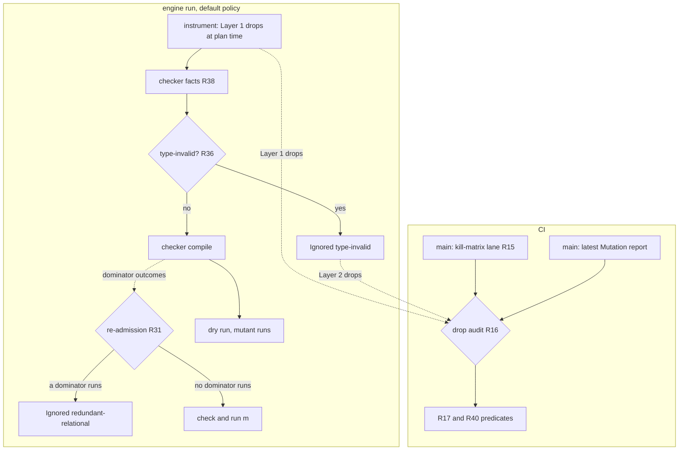
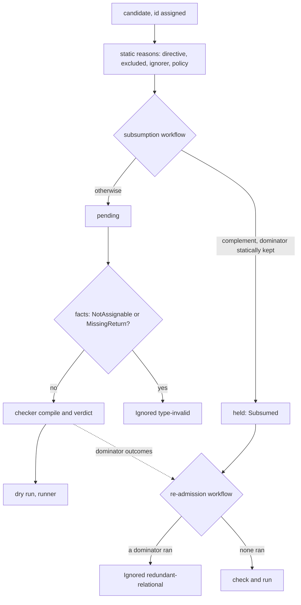
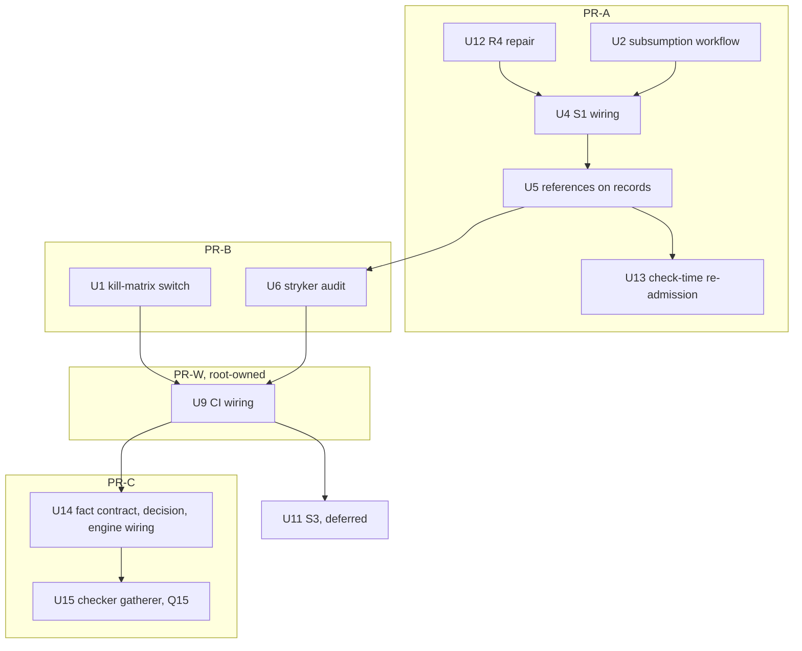

# Mutant Subsumption and Type-Guided Generation - Plan

## Goal Capsule

- **Objective:** A stryker-js-effect run executes fewer mutants that carry no new signal. A mutant that a kept mutant dominates is not run, and its record names that dominator. A mutant that the TypeScript checker's type facts show cannot compile is never compiled or run. CI shows on the dogfood corpus that no test loses a kill and that no mutant which compiles on main is lost.
- **Means:** static subsumption decided in the instrumenter (KTD1), with a check-time re-admission step in the engine (KTD13); type facts read from the TS 7 checker over the unmutated program, with a pure decision in the engine (KTD14, KTD15); a kill-matrix lane and a `stryker audit` command (KTD6, KTD7).
- **Product authority:** `.omp-brief/unit-i-contract.md` (Unit I), the supervisor's and the root's 2026-10-09 rulings recorded under Outstanding Questions, then `CONSTITUTION.md`, which outranks both. Stream C (`origin/stryker/mutant-quality`, plan `docs/plans/2026-10-09-1850-feat-mutant-quality-plan.md`) owns `arid-uncovered-block` and `constant-collection-size`. Stream H owns the TS checker package. Stream F owns native generation later.
- **Execution profile:** one `gh stack` on `main` with four PRs: PR-A, PR-B, PR-W, and PR-C, in that order. Each PR is shippable and tested end to end. Local verification is targeted: typecheck and the affected package's tests, at most one build at a time, no e2e, no microVM, no mutation runs. Close every long-lived `tsc`, `--lsp`, or watch process as soon as it is done.
- **Stop conditions:**
  - PR-W, and PR-C's one-job change to `drop-audit`, edit `.github/workflows/`, which is Read-only for this unit. The root owns and reviews both.
  - PR-C's checker-side unit (U15) needs a Stream H ruling (Q15). If that ruling is pending when U14 is done, push U14 and stop with U15 unstarted.
  - U11 (S3) is deferred until PR-W's `drop-audit` exists.
- **Who finishes:** `ce-work` builds PR-A, PR-B, and PR-C; the root reviews and owns PR-W; the supervisor merges every layer.
- **Open blockers:** Q14 (PR-W bootstrap, the root) and Q15 (checker-side gatherer, Stream H). Q16-Q19 go to the supervisor.
- **Applicable packs** (`.compound-engineering/config.yaml`):
  - cell-architecture: pure-decision-workflows, ports-separate-from-layers, sandwich-phase-order, scoped-lifecycle-boundaries
  - schema-laws: tagged-unions-over-state-by-presence, refusals-beside-generated-laws, arbitrary-filter-floors
  - boundary-testing: pin-dependency-semantics, real-system-oracles, no-mocks-on-internal-glue

---

## Product Contract

### Gap against origin/main

Every "has" cell below was read at `1e1de6d05`. The kill-matrix and Layer 1 figures come from Mutation run [37960922409](https://github.com/systemfsoftware/stryker-js-effect/actions/runs/37960922409) (#416, head `1e1de6d05`, artifact `mutation-report-416`). The CompileError diagnostics come from the scheduled `--full` run [37918729445](https://github.com/systemfsoftware/stryker-js-effect/actions/runs/37918729445) (#406, artifact `mutation-report-406`): #416 reused 3753 of its 4136 CompileError verdicts, and a reused verdict's reason reads `Remembered`, so #416 has no diagnostic text for them. 4079 of #406's 4128 CompileError ids appear in #416, and every one of them is CompileError there too.

| Done item                                                   | origin/main has                                                                                                                                                                                                                                                                                                                                                                                                                                                                                                                                                                                                                      | Missing                                                                                                                                                                                                                                                                                  | Primary source                                                                                                  |
| ----------------------------------------------------------- | ------------------------------------------------------------------------------------------------------------------------------------------------------------------------------------------------------------------------------------------------------------------------------------------------------------------------------------------------------------------------------------------------------------------------------------------------------------------------------------------------------------------------------------------------------------------------------------------------------------------------------------ | ---------------------------------------------------------------------------------------------------------------------------------------------------------------------------------------------------------------------------------------------------------------------------------------- | --------------------------------------------------------------------------------------------------------------- |
| 1. Static subsumption (Layer 1)                             | `redundant-relational` at `packages/stryker-js-instrumenter/src/mutant-set-policy.workflow.ts:16,99-113`, with its table at `relational-sufficient-sets.ts:34-39`. It applies only in condition positions (`Mutator.service.ts:889-892`, `:922-924`) and has generated properties (`__tests__/mutant-set-policy.workflow.property.test.ts:22-49`).                                                                                                                                                                                                                                                                                   | No dominator is named. Drops happen only in condition positions and fire 0 times on the corpus. Its literal drops have no JS operand precondition. A drop survives a directive that ignores its dominator (`plan-mutants.workflow.ts:156-186`) and any check-time ignore.                | Kaminski, Ammann, Offutt, "Better Predicate Testing", AST 2011; Just & Schweiggert, STVR 24(5), 2014, Table III |
| 1. Dropped mutant reported with dominator and reason        | Ignored mutants carry `statusReason: '<ruleId>: <detail>'` (`Mutator.service.ts:136-150`). The vocabulary is closed at 12 ids (`packages/stryker-js-plugin-interface/src/ignore-rule.schema.ts:6-19`).                                                                                                                                                                                                                                                                                                                                                                                                                               | No dominator field. Reuse overwrites the reason with `'Remembered'` (`packages/stryker-js/src/run/incremental-reuse.cell.ts:421`): all 1187 Ignored mutants in #416 read `Remembered`. The merged `mutation.json` has no `statusReason`.                                                 | Kurtz et al., "Mutant Subsumption Graphs", Mutation 2014                                                        |
| 1. CI proves no signal loss against main's full kill matrix | `killedBy` and `coveredBy` exist in the report schema. The vitest runner reports every killer only under `disableBail` (`packages/stryker-js-vitest-runner/src/VitestRuntime.handle.ts:248`, `interpret-vitest-mutant-run.workflow.ts:94-110`).                                                                                                                                                                                                                                                                                                                                                                                      | No full kill matrix. `disableBail` defaults to false (`stryker-options.schema.ts:284`), and no dogfood config sets it. All 1797 Killed mutants in #416 have exactly one `killedBy`. The merged `mutation.json` carries neither `killedBy` nor `coveredBy`. No CI job checks subsumption. | Kurtz et al., "Analyzing the Validity of Selective Mutation with Dominator Mutants", FSE 2016                   |
| 2. Layer 2: type-guided generation                          | The checker runs the TS 7 native API (`typescript/unstable/async`, `packages/stryker-js-typescript-checker/src/ts-compiler.handle.ts:26-34`, program built at `:1291-1296`). It returns diagnostics only (`Checker.schema.ts:29-36`); its interface is `init`/`check`/`group`/`digest` (`packages/stryker-js-plugin-interface/src/Checker.service.ts:8-17`). The TS 7 `Checker` class exposes `getContextualType`, `getResolvedSignature`, `getReturnTypeOfSignature`, `getPropertiesOfType`, `getUndefinedType`, and `isTypeAssignableTo` (`node_modules/typescript/dist/api/async/api.d.ts:207-327`), and no repo code calls them. | Every type fact. 4136 of 8626 mutants in #416 (47.9%) are CompileError, and each one costs a snapshot refresh and a diagnostics pass in the checker.                                                                                                                                     | TypeScript 7.0.2 `api.d.ts`; Stream C KD3                                                                       |
| 3. Before/after counts                                      | No bench lane on main. `.github/workflows/` holds changeset-check, ci, commitlint, force-release, mutation, nix, and release. Each project's incremental report records `testsCompleted` per mutant and `costs.<id>.actualMs`.                                                                                                                                                                                                                                                                                                                                                                                                       | The counts and the lane. The lane belongs to another stream.                                                                                                                                                                                                                             | n/a                                                                                                             |
| 4. CI green with new tests                                  | `pnpm test` runs property tests. `stryker-js-instrumenter` is not in the Mutation corpus (`.github/workflows/mutation.yml:29`).                                                                                                                                                                                                                                                                                                                                                                                                                                                                                                      | The new instrumenter code gets no CI mutation coverage (CONST-T3).                                                                                                                                                                                                                       | n/a                                                                                                             |

**Contract claims checked:**

- "Main's full kill matrix" does not exist. CI bails on the first failing test, and the merged report drops `killedBy`. This unit builds the matrix (Q1, accepted).
- "`redundant-relational` may already be the Kaminski ROR subset" is half right. It is the Just & Schweiggert sufficient set for the four ordering operators, which matches the Kaminski set. But it applies only in condition positions. KTD12 of the SOTA plan left value positions out on purpose (`docs/plans/2026-09-29-0427-feat-state-of-the-art-mutation-testing-plan.md:260`). This repo's pure core writes `Boolean.match` in place of `if` or `?:` (CONST-P2), so the rule fires on 0 of 76 relational sites.

### Summary

Layer 1 replaces main's condition-only relational table with subsumption rules that name a dominator. Each rule states its JavaScript operand precondition and fires only where that precondition holds. A drop stands only while its dominator runs, at plan time and at check time. Layer 2 asks the TS 7 checker, over the unmutated program, whether a constant replacement fits the type its site is checked against. A mutant whose replacement does not fit is Ignored as `type-invalid` before it reaches the checker's compile step or a runner. `stryker audit` checks both layers on the corpus. A Layer 1 drop is checked against main's full kill matrix, and a Layer 2 drop against main's latest mutant statuses.

### Problem Frame

**Same-site reduction has little to work with.** In #416, 7489 of 7827 mutated sites (95.7%) carry one mutant. The 338 multi-mutant sites hold 1137 mutants, and 925 of those were executed (2852 were executed in total).

Ceiling on #416 for each Layer 1 candidate:

| Candidate                                                 | Sites | Mutants dropped | Executed among them | Test executions saved (Σ `testsCompleted`) | Status                                |
| --------------------------------------------------------- | ----- | --------------- | ------------------- | ------------------------------------------ | ------------------------------------- |
| S1 relational complement, no precondition                 | 76    | 76              | 68                  | 325 of 18697 (1.7%)                        | Sound for every JS value. Adopted.    |
| S3 relational literal, dominated by the boundary operator | 73    | 73              | 61                  | 339                                        | Needs precondition P. Deferred (U11). |
| S2 equality negation, dominated by a literal              | 223   | 223             | 182                 | 851                                        | Refuted on the corpus. Rejected.      |

**CompileError is where the waste is.** In #416, 4136 of 8626 mutants (47.9%) are CompileError. They account for 3921 s of the 10403 s summed per-mutant `actualMs` (37.7%); in #406 the figures are 2814 s of 8667 s (32.5%). By mutator (#406):

| Mutator               | CompileError | Of its mutants | Replacement                  |
| --------------------- | ------------ | -------------- | ---------------------------- |
| ArrowFunction         | 1964         | 2572 (76.4%)   | `() => undefined`            |
| ObjectLiteral         | 1043         | 1711 (61.0%)   | `{}`                         |
| StringLiteral         | 506          | 1813 (27.9%)   | `""`                         |
| ArrayDeclaration      | 207          | 498 (41.6%)    | `[]`, `["Stryker was here"]` |
| BlockStatement        | 190          | 228 (83.3%)    | `{}` (emptied body)          |
| MethodExpression      | 141          | 269 (52.4%)    | another method               |
| BooleanLiteral        | 46           | 197 (23.4%)    | `true`/`false`               |
| all operator mutators | 31           | 1163           |                              |

By first diagnostic code: TS2322 1666, TS2739 597, TS2345 555, TS2375 181, TS2339 169, TS2554 146, TS2349 118, TS2769 112, TS2741 106, TS2355 86, TS2378 62. The largest mutator × code pairs are ArrowFunction/TS2322 (1213), ObjectLiteral/TS2739 (595), ArrowFunction/TS2345 (234), StringLiteral/TS2322 (231), StringLiteral/TS2345 (215), ObjectLiteral/TS2339 (148), ArrowFunction/TS2554 (146), and BlockStatement/TS2355 (86).

**Most of it is not decidable at the site.** Of the 4025 CompileErrors with diagnostics in #406, 1414 have every diagnostic inside the mutated range. 247 have some inside, 2158 have them only elsewhere in the same file, and 206 have them in another file. Elsewhere means generic inference: replacing an arrow argument changes the inferred type argument, and the error appears at the enclosing call or declaration. For example, the arrow at `packages/stryker-js/src/classify-exit.workflow.ts:53` (`98783bb973358922`) fails at `:81`, and `Match.orElse((): Tone => …)` at `render-clear-text-report.workflow.ts:497` (`6f53c0e6f3df5cc0`) fails at `:492`. Only a full compile of the mutated program decides those, and that is the checker's existing job.

**The site-anchored ceiling is 1170 mutants.** These are the CompileErrors whose diagnostics all sit inside the mutated range and all belong to the assignability family (TS2322, TS2345, TS2739, TS2740, TS2741, TS2375, TS2353, TS2367, TS2355, TS2378). By mutator: ObjectLiteral 589, ArrowFunction 257, BlockStatement 139, StringLiteral 136, ArrayDeclaration 27, BooleanLiteral 22. Their checker cost was 749 s, 26.6% of CompileError cost and 8.6% of all per-mutant cost. A rough syntactic look at where they sit gives:

- 542 of the 589 ObjectLiteral cases are call arguments, mostly `Option.match`/`Match` option objects whose keys are fixed.
- 57 of the BlockStatement cases are accessors and 80 are function bodies.
- StringLiteral and ArrowFunction cases are spread across call arguments, properties, and initializers.

[INFERENCE] Generic calls exclude many of the ArrowFunction and StringLiteral cases (R34), so ObjectLiteral and BlockStatement carry most of the realistic yield. PR-C's audit reports the measured count.

**A syntactic skip is already refuted.** Stream C's KD3 (`docs/plans/2026-10-09-1850-feat-mutant-quality-plan.md:114` at `575ca03e`) measured, on #416, 778 ArrowFunction mutants on arrows whose explicit return type excludes `void`/`undefined`/`any`/`unknown`/`never`. 648 were CompileError and 120 compiled (99 Killed, 21 Survived). The annotation sat on the arrow that the mutant replaces, so the mutant removed it. Every Layer 2 fact here is read from a type the mutation leaves in place, and the TS checker resolves it.

Two findings bound what the Layer 1 rules can do in JavaScript:

1. **Infection containment is not kill containment.** A static rule can prove that every single evaluation that infects dominator `d` also infects `m` into the same post-state (the RIP infection condition; Ammann & Offutt, _Introduction to Software Testing_, 2nd ed.). It cannot rule out masking across repeated evaluations of the same site (Kurtz, Ammann, Offutt, "Static Analysis of Mutant Subsumption", ICSTW 2015).
2. **The corpus contains a counterexample.** At `packages/stryker-js/src/run/validate-options-admission.workflow.ts:19`, the literal mutant `90f2080398d798bc` was Killed by test 973, while the negation `1e60ed65ae6cd32a` (`value === null`) Survived all 3 of its covering tests. Infection containment holds there and the operands are pure, yet the kill does not carry over. That rejects S2 and is why every drop is checked against the kill matrix.

### Key Decisions

- **Rules prove infection containment; the kill matrix decides kill containment.** A static proof cannot cover masking across repeated evaluations. Governs R1, R17.
- **S1 extends `redundant-relational` and adds no parallel rule.** It only removes mutants. Governs R3, R8.
- **S2 is rejected on evidence.** At one site, CI ids `90f2080398d798bc` (Killed) and `1e60ed65ae6cd32a` (Survived) violate `killers(d) ⊆ killers(m)`.
- **The R4 repair lands first.** Main's condition-position drops lose their unconditional status before any new drop ships. This is breaking under BREAK-1 and is flagged for Stream C, whose U8 edits `mutant-set-policy.workflow.ts`. Governs R4.
- **This unit owns the invariant that a drop holds only while its dominator runs, at check time too.** On main today the checker's TCE `sibling`/`original` classification can Ignore a named dominator at check time (`packages/stryker-js-typescript-checker/src/check-mutants.workflow.ts:41-44`). Stream C's `constant-collection-size` will add another check-time ignore. One generic engine step re-admits the dropped mutant; it does not depend on Stream C. Governs R5, R31.
- **Empirical subsumption mined from the matrix is not a drop rule**, because a heuristic without a proof is excluded ("Does not count").
- **Logical-connector (COR) subsumption is out.** The corpus has 15 `LogicalOperator` mutants on 9 sites, and `&&`, `||`, and `??` return non-booleans.
- **SMT equivalence proving is rejected (root, 2026-10-09).** No `z3-solver` and no `async-mutex`. On the corpus it would prove about 1 mutant (`87ac4fce39ccfec2` in `flooredTimeoutOf`) out of about 70 eligible mutants in 16 functions with only `number`/`boolean` parameters. It would add a 35.8 MB WASM package (35,820,846 bytes unpacked) and one individually maintained transitive dependency (`async-mutex`, maintainer `dirtyhairy`).
- **Layer 2 is type-guided generation, decided from real checker type facts.** A mutant is dropped only when the TS 7 checker, over the unmutated program, shows that its constant replacement is not assignable to a type the mutation leaves in place. Annotation text, syntax, and mutator name never decide a drop. Governs R32-R39.
- **Layer 2 reads facts before any mutant is compiled, so dropped mutants cost no compile.** Done is measured by the drop in mutants the checker compiles and in CompileError, with no compiling mutant lost. Governs R37, R40.

Retired with the SMT layer: R13, R19-R30, AE7-AE10, KTD8-KTD12, U3, U7, U8, and U10. U3's compile-parity spec is no longer needed, because R31 re-admits on a dominator CompileError.

### Requirements

**Layer 1 rule semantics**

- R1. A rule drops mutant `m` only by naming at least one dominator `d`: a mutant of the same original expression at the same site. The rule proves that for every single evaluation of the site where its precondition holds, every value that infects `d` also infects `m` and leaves `m` in the same post-state.
- R2. Each rule declares one precondition class and fires only where the class is established. Otherwise every mutant at the site is kept. The classes:
  - **none:** no condition.
  - **P (pure operands):** each operand is a literal, a parameter or local binding, `typeof <identifier>`, or `void 0` (KTD4 gives the exact syntax). `.length` needs type facts and waits for class T.
  - **T (non-nullish primitives):** both operand types lie within number, bigint, string, or boolean (literal and enum types included). Deferred (Q5).
- R3. S1 (relational complement, class none, any position) drops these mutants: `<`→`>=` (dominator `<=`), `<=`→`>` (dominator `<`), `>`→`<=` (dominator `>=`), and `>=`→`<` (dominator `>`). All four operators evaluate left then right, apply ToPrimitive(number) once per operand, and differ only in how they map the `IsLessThan` result to a boolean. A Bun probe over number, bigint/number, string, number/string, nullable, and `valueOf`-object operands found identical evaluation traces and 0 violations.
- R4. The repair: no condition-position literal or operator is dropped without a rule from R3 or U11. Main's condition-position table is removed (`Mutator.service.ts:914-931`, `mutant-set-policy.workflow.ts:99-113`). Generation is unchanged. `!=` never dominates `>`: the probe found 13 NaN counterexamples. `<=` never dominates `==` without class T: `null`/`0` and identity-distinct objects break it.
- R5. A drop holds only while a dominator runs. If every named dominator is Ignored, at plan time or at check time, or is CompileError, then `m` runs.
- R6. S3 (`true` for `<`/`>`, `false` for `<=`/`>=`, dominated by the boundary operator, class P) ships only after the R16 check passes for it on the corpus.
- R7. Under `mutantSetPolicy: 'full'`, neither layer drops anything.

**Layer 1 re-admission**

- R31. One pure check-time step runs after the checker's verdicts are known. A dominator runs when it passes the checker and settles with any status (Killed, Survived, Timeout, NoCoverage, or RuntimeError), in this run or as a remembered result. Each subsumed mutant none of whose named dominators runs is re-admitted and goes through the checker and the runner like any other mutant. While at least one named dominator runs, `m` stays dropped, and its record names a dominator that runs. The step does not depend on which checker or rule caused an ignore. A NoCoverage dominator counts as running because R17 audits that pair.

**Reporting**

- R8. Every Layer 1 drop is Ignored with `redundant-relational`. The redundancy reference's `rule` (`complement`, or `boundary-literal` after U11) tells the rules apart. Layer 2 drops are Ignored with the new id `type-invalid`.
- R9. The plugin `Mutant`, the NDJSON mutant line, and the incremental record carry a dropped mutant's reference as a typed field: the dominator ids for Layer 1, or the type fact for Layer 2. The merged `mutation.json` follows the external report schema, so it carries the reference in `statusReason`, rendered from the line's typed field. Subsumed and type-invalid records are decided fresh on every run and never served from remembered results, so `Remembered` never replaces them.

**Layer 1 purity and seam**

- R10. The Layer 1 rules are one pure Workflow with cyclomatic complexity 1. The re-admission step is a second one.
- R11. The rule workflow reads only serializable site facts: the site key and original operator kind; each candidate's mutant id, replacement kind, and current ignore status; and the precondition classes established for the site. The re-admission workflow reads only mutant ids, their named dominators, and each dominator's settled outcome. A native generator (Stream F) can emit the same facts and reuse both workflows' property tests as its oracle.

**Layer 2: type-guided generation**

- R32. Type facts come from the TS 7 checker's `Checker` over the unmutated program, through `typescript/unstable/async`. They are read before any mutant is applied: after `init`, or at the start of a batch after `resetMutatedFiles` (`ts-compiler.handle.ts:1654`) and `refreshSnapshot` (`:1656`) have installed the unmutated snapshot, and before the first `applyMutant`. No decision reads annotation text, syntax alone, or the mutator name. Without a checker plugin, no Layer 2 drop happens.
- R33. The eligible shapes, from the #406 buckets:
  - `{}` replacing an object literal (ObjectLiteral);
  - `""` replacing a string literal (StringLiteral);
  - `() => undefined` replacing an arrow or function expression (ArrowFunction);
  - `{}` replacing a function, method, or accessor body (BlockStatement).

  `[]`, `["Stryker was here"]`, boolean literals, and method replacements are deferred, because their literal types depend on the contextual type (`[]` becomes an empty tuple against a tuple target).
- R34. A fact is read only at an anchor: a type that the mutation leaves unchanged and that is not inferred from the mutated expression. The anchors:
  - (a) the initializer of a variable, property, or parameter-default declaration that has a type annotation;
  - (b) the returned expression, or the expression body, of a function whose return type is declared, when that function is not the mutated node;
  - (c) an argument of a call where every call signature of the callee that accepts the call's argument count yields a parameter type at that position;
  - (d) a property value or parenthesized expression nested inside (a)-(c).

  An anchor type that mentions a type parameter of an enclosing or called signature, directly or through an indexed-access, conditional, or mapped type, is `NoAnchor` for `""`, `() => undefined`, and the emptied body. Under (c), the `{}` shape alone may use such a parameter type, and only when the checker shows that the uninstantiated parameter type has a required property that is declared in it rather than produced by a mapped, conditional, or indexed-access type. Anything else is `NoAnchor`, and the mutant is kept.
- R35. The facts and what drops:
  - `{}`: every member of the anchor type (the type itself when it is not a union) is either `undefined`/`null` or an object type that has a required property (`getPropertiesOfType`, optional flag clear) and no index signature (`getIndexInfosOfType`). Any other member, such as `object`, `{}`, a primitive, `any`, or `unknown`, makes the fact `Fits`.
  - `""`: every member of the anchor type is a string literal type other than `""`, a `number`, `bigint`, `boolean`, or `symbol` type (literal types included), `undefined`, or `null`. Any other member, such as `string`, a template-literal or string-mapping type, any object type (a primitive string can satisfy `{}` or an interface of optional members), `any`, or `unknown`, makes the fact `Fits`.
  - `() => undefined`: every member of the anchor type is either `undefined`/`null` or a type whose call signatures are non-empty and each return a type to which `getUndefinedType()` is not assignable (`isTypeAssignableTo`). A `void` return accepts `undefined`, so it makes the fact `Fits`, as does any other member.
  - Emptied body: the function or accessor is not `async` and not a generator, its return type is declared, and `getUndefinedType()` is not assignable to the checker's resolved return type of its signature (`getSignatureFromDeclaration`, `getReturnTypeOfSignature`). A body's own declared return type is an anchor, because the mutation replaces only the body.

  Each fact names the probe, the anchor kind, and the target type text (`typeToString`). Facts are a tagged union: `NotAssignable`, `MissingReturn`, `Fits`, `NoAnchor { reason }`, and `Unavailable { reason }`. Only the first two drop.
- R36. The decision is one pure Workflow with cyclomatic complexity 1. `NotAssignable` and `MissingReturn` yield Ignored `type-invalid: <probe> does not fit <target> at <anchor>`. Every other fact, a missing fact, and the `'full'` policy keep the mutant.
- R37. The facts are requested and decided before the mutants are planned for checking, in every path that plans mutants:
  - the run path, after `acquireCheckers` and before `reuseAndPlan` (`run/mutation-test.cell.ts:91`, `run/deferrable-dry-run.cell.ts:64-65`);
  - the plan path (`plan-request.cell.ts:201-214`), which already starts a checker pool. It now starts one whenever an eligible candidate exists, so that a shard plan prices a `type-invalid` mutant at 0 like any other Ignored mutant;
  - the audit (R40).

  A dropped mutant is never grouped, compiled, or run.
- R38. Facts cross the worker boundary as data. A new optional checker capability, `facts(candidates)`, takes each candidate's id, file name, location, and shape, and returns one fact per id. A checker that lacks the capability keeps every mutant. The capability serves R33's shapes only; any alignment with other check-time facts is decided under Q18.
- R39. A `type-invalid` mutant keeps its id, because the instrumenter still generates it (`mutantIdOf`, `MutantIdentity.ts:20-31`). It is reported, so the audit can join it.

**Tests (admitted by the test-layer gate)**

- R12. The Layer 1 rule workflow gets colocated property tests, with the JS engine as the oracle. Over generated operands in each precondition's domain (NaN, `-0`, mixed bigint and number, numeric and non-numeric strings, `null`, `undefined`, and objects with `valueOf` or `Symbol.toPrimitive`), the test evaluates the original, `d`, and `m` and asserts containment. Beside it, a refusal property asserts that a site outside the domain is kept.
- R41. The re-admission workflow gets property tests through its real decision function, over generated dominator outcome sets.
- R42. A differential spec pits the gatherer against the real TS 7 checker. For generated fixtures covering each shape × anchor × target-type family, each fixture compiles without errors before mutation. Whenever the gatherer returns `NotAssignable` or `MissingReturn`, compiling the mutated fixture through the real checker yields an error diagnostic of the assignability family listed under Problem Frame (TS2355 included, for an emptied body) that lies inside the mutated range or at its anchor. That makes the drop rule's soundness an executable property of the pinned TypeScript version.

**No-signal-loss check**

- R14. The corpus is the Mutation workflow's `PROJECTS` (`.github/workflows/mutation.yml:29`) under each project's `mutate` globs, at main's head.
- R15. A CI-only kill-matrix lane runs on main, on a schedule and by dispatch:
  - it runs the released CLI with `mutantSetPolicy: 'full'`, `disableBail: true`, and `coverageAnalysis: 'perTest'`;
  - it does no verdict reuse (`disableBail` is fingerprinted, `packages/stryker-js/src/verdict-semantics.ts:92-111`);
  - it publishes each mutant's status, every `killedBy`, `coveredBy`, and `testsCompleted`.
- R16. On every PR, a check:
  - computes the drop list `(m, rule, reference)` over the corpus from the workspace build, without compiling a mutant or executing a test;
  - joins Layer 1 drops to main's latest kill matrix, and Layer 2 drops to main's latest Mutation report, on content-derived mutant ids (`packages/stryker-js-instrumenter/src/MutantIdentity.ts:20-31`);
  - evaluates R17 and R40 and fails on any violation;
  - fails a rule as `Unattested` when it has at least one drop but no joined pair;
  - publishes per-rule pair counts by verdict, and every unjoinable id.
- R17. The predicate below applies to each Layer 1 drop `(m, d)`, where `d` is the dominator its record names. Separately, every test that kills at least one mutant in the full matrix must still kill some kept mutant.

  | `d` in matrix                          | `m` in matrix                                      | Verdict                                |
  | -------------------------------------- | -------------------------------------------------- | -------------------------------------- |
  | Killed                                 | Killed, `killers(d) ⊆ killers(m)`                  | pass                                   |
  | Killed                                 | Killed, `killers(d) ⊄ killers(m)`                  | fail                                   |
  | Killed or Timeout                      | Survived or NoCoverage                             | fail                                   |
  | Killed or Timeout                      | CompileError, RuntimeError, or Ignored             | pass; `m` carries no kill signal       |
  | Killed                                 | Timeout                                            | pass; listed as attribution-unverified |
  | Timeout                                | Killed or Timeout                                  | pass; listed as attribution-unverified |
  | Survived                               | any                                                | pass; counted as vacuous               |
  | NoCoverage                             | NoCoverage, CompileError, RuntimeError, or Ignored | pass; counted as vacuous               |
  | NoCoverage                             | Killed, Survived, or Timeout                       | fail: misidentified pair               |
  | CompileError, RuntimeError, or Ignored | any                                                | fail: R5 broken                        |
  | absent (or `m` absent)                 | any                                                | unjoinable                             |

- R40. For each Layer 2 drop `m`, the check reads `m`'s status in main's latest Mutation report:

  | `m` on main                                            | Verdict                               |
  | ------------------------------------------------------ | ------------------------------------- |
  | CompileError                                           | pass                                  |
  | Ignored                                                | pass; counted as not compiled on main |
  | Killed, Survived, Timeout, NoCoverage, or RuntimeError | fail: a compiling mutant is lost      |
  | absent                                                 | unjoinable                            |

  NoCoverage counts as compiling, because a mutant reaches the no-coverage branch only after the checker passed it (`run/mutation-test.cell.ts:108-112`). This check needs no kill matrix.

**Metrics**

- R18. A full, non-reusing run of the corpus is taken before and after each layer ships. Each run reports:
  - planned mutants, and Ignored mutants per rule id;
  - CompileError count and share;
  - mutants the checker compiled;
  - executed mutants (Killed + Survived + Timeout + RuntimeError);
  - test executions (Σ `testsCompleted`), read from the incremental records because the merged `mutation.json` lacks it;
  - Σ checker milliseconds over CompileError mutants (`costs.<id>.actualMs`; a `type-invalid` mutant is never compiled and has no cost entry);
  - from the audit (not `--counts-only`, which reads only reports): Layer 2 facts per variant (`NotAssignable`, `MissingReturn`, `Fits`, `NoAnchor` by reason, `Unavailable` by reason), so a low N can be traced to the anchors or probes that did not fire, and the time spent gathering facts;
  - the list of dropped ids.

  The counts ship as a CI artifact that a bench lane can ingest. Publishing them to the lane is a follow-up (Q3).

### Acceptance Examples

- AE1. **Covers R3, R8, R9.** At `trapFile.length > 0` (`interpret-vitest-mutant-run.workflow.ts:33`), `<= 0` (`4252fb2dcdaf4ccc`) is Ignored with `redundant-relational`, naming dominator `3e6dbfafadd1dc10` (`>=`). The `true`, `false`, and `>=` mutants still run.
- AE2. **Covers R5, R31.** If the checker Ignores `trapFile.length >= 0` (`3e6dbfafadd1dc10`) at check time, for any reason, then `<= 0` (`4252fb2dcdaf4ccc`) is checked and run.
- AE3. **Covers R5.** Under `// Stryker disable next-line EqualityOperator`, `if (a < b)` keeps the `>=` mutant's directive reason, because its dominator `<=` is ignored too.
- AE4. **Covers R4.** `if (x < limit)` keeps `true` and `false`, which main's condition-position table drops today.
- AE5. **Covers R17.** A drop whose dominator was Killed by test 973 while `m` Survived (the S2 shape at `1e60ed65ae6cd32a`) fails the check, and the failure names both ids.
- AE6. **Covers R17.** `comparePatternKeysOf(key, current[0]) < 0`: dominator `056ca92f55a9284e` (`<=`) Survived and the dropped `f1f3c32d0a1b980f` (`>=`) was Killed. The pair passes as vacuous, unless some test's only kill was `f1f3c32d0a1b980f`.
- AE11. **Covers R34, R35, R36.** In `tceFieldOf` (`packages/stryker-js-typescript-checker/src/CheckMutants.schema.ts:10-14`), the `{}` mutant `2e81ec0fd3b2b496` of the `Option.match` options object is Ignored as `type-invalid`. The parameter type declares `onNone` and `onSome` as required. The `{}` mutant `e8aacef871e72071` of `({ tce: present })` (`:13`) is kept, because `{ readonly tce?: TceOutcome }` has no required property. It was Killed in #416.
- AE12. **Covers R35.** The emptied getter body `a2f15bd57cd23c25` (`get rendered(): string`, `CheckMutants.schema.ts:28`) is Ignored as `type-invalid`, because `undefined` is not assignable to `string`.
- AE13. **Covers R34.** The arrow `98783bb973358922` at `classify-exit.workflow.ts:53` is an argument whose type comes from inference, so it gets `NoAnchor` and is kept. It stays the checker's job.
- AE14. **Covers R40.** If the PR's drop list contains `761798af7f12ab38` (`S.Struct({})`'s `{}` at `Checker.schema.ts:10`, Survived on main), the audit fails and names it as a lost compiling mutant.

### Success Criteria

- On the corpus, S1 drops 76 mutants, and the R16 check on the first kill matrix (available once PR-W lands) reports 0 failures.
- On the corpus, PR-C's audit reports N > 0 `type-invalid` drops with 0 compiling mutants lost. N is at most the 1170-mutant ceiling measured on #406. The baseline is the R18 count of the last main Mutation run before PR-C's release, which already includes PR-A's R4 repair and S1; #416 (4136 CompileError, 47.9%; 3921 s) is the reference before PR-A. The first main Mutation run after PR-C's release shows CompileError falling by N from that baseline, and checker milliseconds over CompileError falling by the baseline cost of those N mutants.
- The R18 counts appear as a CI artifact for each before/after pair, and the dropped ids match the R16 drop list.

### Delivery order

Four stacked PRs. Each is shippable alone and tested end to end. The ruling's PR shape (2026-10-09):

| PR                          | Base       | Units                        | What ships                                                                                        |
| --------------------------- | ---------- | ---------------------------- | ------------------------------------------------------------------------------------------------- |
| PR-A Layer 1                | `main`     | U12 (first), U2, U4, U5, U13 | the R4 repair; S1 on by default; the dominator reference on every record; check-time re-admission |
| PR-B Evidence tooling       | PR-A       | U1, U6                       | the kill-matrix switch; `stryker audit` with the R17 and R40 predicates and the R18 counts        |
| PR-W Workflow wiring        | PR-B       | U9                           | the kill-matrix workflow, the `drop-audit` job, and the counts step. The root owns and reviews it |
| PR-C Type-guided generation | PR-W       | U14, U15                     | type facts, `type-invalid`, and the audit's Layer 2 drop list                                     |
| Follow-up                   | after PR-W | U11                          | S3 under class P, gated by its own `drop-audit` run                                               |

### Verification

- `pnpm test` runs R12, R41, and R42 on every PR.
- From PR-W on, R16 runs in CI on every PR.
- The before/after numbers come only from CI runs, cited by run id and artifact. Nothing runs mutation locally.

### Scope Boundaries

- Deferred: S3 (U11); class-T rules and `.length` in class P (Q5); Layer 2 shapes `[]`, `["Stryker was here"]`, booleans, and method replacements; CompileErrors whose diagnostics land outside the mutated range.
- Out: S2 (refuted), COR, the unary-insertion tables, empirically mined subsumption, and SMT equivalence proving (rejected).
- Out: any decision from annotation text or syntax alone (Stream C KD3).
- Out: building the bench lane (another stream). Changing `PROJECTS`, `mutate` globs, thresholds, or any other judgment surface (CONST-E9; Q6).
- Out: building inside Stream H's checker files without a ruling (Q15).

### Dependencies / Assumptions

- Mutant ids join across the `full` and `default` policies and across this unit's PRs, because neither the policy nor the new rules feed `mutantIdOf` (`MutantIdentity.ts:20-31`; per-tuple ordinal at `Transformer.service.ts:137-141`; ids are assigned before the policy runs, `Transformer.service.ts:931`).
- A kill-matrix run costs about one nightly run: #416's Killed mutants completed 8205 tests out of 9028 covering tests.
- Corpus behavior changes only after a release, because the Mutation lane runs the released CLI (Dogfood). The audit is the exception: it runs the PR's workspace build on every PR.
- [INFERENCE] A fact query is a few JSON-RPC round-trips on an already-built snapshot, which is cheaper than the snapshot refresh plus diagnostics pass the checker spends on each mutant. U14 reports the fact-gathering time in the R18 counts so the claim is measured.

### Outstanding Questions

**Rulings (2026-10-09)**

- Q1. Accepted by the root. This unit builds the kill-matrix lane as an evidence producer (U1) and the no-signal-loss predicate as a pure, tested workflow (U6). The root owns and reviews the `.github/workflows/` wiring that makes it a gate (PR-W, U9).
- Q2. Moot: SMT is rejected, so neither `z3-solver` nor `async-mutex` is added.
- Q3. No bench lane exists on main. R18 counts ship as a CI artifact that a bench lane can ingest. Publishing them to the lane is a follow-up through the supervisor.
- Q4. The R4 repair is in scope and breaking. It lands first in PR-A, and the PR body flags it for Stream C.
- Q5. Class T waits for a checker fact seam. U15's gatherer is that seam; class T stays deferred.
- Q6. `PROJECTS` stays unchanged. Adding the instrumenter to the corpus is a follow-up for the root.
- Q7. Both: a typed reference on repo-owned records plus the `statusReason` detail (KTD5), added without waiting for Stream C R6/R7.
- Q10, Q11. Overruled and resolved. This unit builds generic check-time re-admission in PR-A (R31, U13). It does not wait for Stream C.
- Q12. Confirmed. `stryker audit` instruments and runs no tests, so it is not a mutation run, and it runs from the workspace build.
- Q13. Confirmed. Whichever PR lands second, this unit's or Stream C U1, takes the next `StreamSchemaVersion` (`packages/stryker-js-cli-contract/src/stream-version.schema.ts:3`); merge main up when that happens.

### Open questions for the supervisor

- Q14 (the root). **PR-W bootstrap.** The `drop-audit` job needs one kill-matrix artifact, and a new workflow file cannot be dispatched until it exists on `main`. So on PR-W's own head the job can only fail with `NoMatrix`. Option (a): the root lands `kill-matrix.yml` on `main` alone first, dispatches it once, and PR-W then carries only the `drop-audit` job and the counts step, green on its head. Option (b): PR-W merges with `drop-audit` red as `NoMatrix`, not yet required, and the first green run is cited on PR-C. Recommended: (a), because every PR in the stack then meets "green on its head". A drop audit that passes without a matrix would be vacuous, so it does not pass.
- Q15 (Stream H). **The checker-side gatherer.** U15 adds a `type-facts` module beside `ts-compiler.handle.ts`, reads `CompilerState.api`/`snapshot` (`:120-130`), and serves the `facts` capability (`CheckerRuntime.service.ts`, `CheckerWorker.service.ts`). All of these are Stream H's files. Option (a): this unit writes U15 under Stream H's review. Option (b): Stream H builds the gatherer to R34, R35, and R38's fact contract, and this unit supplies U14 and the R42 spec. U14 needs neither.
- Q16. **"Never generated."** The instrumenter still produces a `type-invalid` mutant: it gets an id and a place in the mutant switch, and the report lists it as Ignored. It is never compiled, tested, or counted as CompileError. Keeping the record gives the audit an id to join (R39). Dropping it before placement would need type facts before instrumentation, so the checker would have to start before `instrumentCell` (`run/run-stages.cell.ts:18-35`), and the audit would lose its id. Is an Ignored `type-invalid` record acceptable as "not generated"?
- Q17. **The audit starts the checker.** For Layer 2 drops, `stryker audit` asks the checker for facts over the unmutated corpus programs. That type-checks the original program and compiles no mutant. Please confirm that this stays within Q12.
- Q18. **Alignment with Stream C U9.** Stream C U9 reads a receiver kind in `ts-compiler.handle.ts` during `check`. This plan proposes one gatherer module and one `TypeFact` union that both use: U9 calls the gatherer at check time, and Layer 2 calls it through `facts`. Whichever of U9 and U15 lands second adapts to the first. Neither depends on the other.
- Q19. **Shard co-location.** U13 places each subsumed mutant in the same shard as its dominators (`plan-shards.workflow.ts`). Stream C U7 adds guard-group placement to the same workflow. Whichever lands second merges both constraints into one grouping key.

### Sources / Research

- Kaminski, Ammann, Offutt, "Better Predicate Testing", AST 2011.
- Just, Schweiggert, STVR 24(5), 2014, Table III (cited at `relational-sufficient-sets.ts:4-7`).
- Just, Kapfhammer, Schweiggert, "Do Redundant Mutants Affect the Effectiveness and Efficiency of Mutation Analysis?", Mutation 2012.
- Ammann, Delamaro, Offutt, "Establishing Theoretical Minimal Sets of Mutants", ICST 2014.
- Kurtz, Ammann, Delamaro, Offutt, Deng, "Mutant Subsumption Graphs", Mutation 2014.
- Kurtz, Ammann, Offutt, "Static Analysis of Mutant Subsumption", ICSTW 2015.
- Kurtz et al., "Analyzing the Validity of Selective Mutation with Dominator Mutants", FSE 2016.
- Garg et al., "Cerebro: Static Subsuming Mutant Selection", TSE 49(1) 2023, arXiv 2112.14151. A learned model, so it cannot serve as a verdict.
- Ammann, Offutt, _Introduction to Software Testing_, 2nd ed. (the RIP model).
- ECMA-262 `IsLessThan`.
- TypeScript 7.0.2, `node_modules/typescript/dist/api/async/api.d.ts` (`Checker`, `TypeObject`, `Signature`).
- Stream C plan, `origin/stryker/mutant-quality` at `575ca03e` (KD3, KTD10, KTD14; U7, U8, U9).
- SOTA plan, `docs/plans/2026-09-29-0427-feat-state-of-the-art-mutation-testing-plan.md` (KTD12, KTD13).
- `docs/solutions/tooling-decisions/verdict-cache-content-keyed-reuse.md`; `docs/solutions/performance-issues/shard-plan-priced-untested-verdicts-at-a-whole-suite-prediction.md`; `docs/solutions/workflow-issues/matrix-legs-rename-the-required-status-check.md`; `docs/solutions/workflow-issues/mutation-lane-green-while-every-job-failed.md`.

---

## Planning Contract

### Key Technical Decisions

- KTD1. **Layer 1 is a new pure workflow, `mutant-subsumption.workflow.ts`, and `mutant-set-policy` gives up its relational rule.** `redundant-relational` keeps one owner. `mutantSetPolicy` keeps `equivalent-to-original` and `duplicate-at-site`. The new workflow's command carries only serializable site and candidate facts (R11). Governs R1, R3, R8, R10, R11.
- KTD2. **Admissible dominators are the four ordering operators.** These are the only dominators S1 needs. A dominator that fails to compile, or that the checker Ignores, no longer needs a compile-parity argument, because R31 re-admits `m`.

  | Original | Complement dropped (S1, class none) | Literal dropped (S3, U11, class P, condition position) | Dominator |
  | -------- | ----------------------------------- | ------------------------------------------------------ | --------- |
  | `<`      | `>=`                                | `true`                                                 | `<=`      |
  | `<=`     | `>`                                 | `false`                                                | `<`       |
  | `>`      | `<=`                                | `true`                                                 | `>=`      |
  | `>=`     | `<`                                 | `false`                                                | `>`       |

- KTD3. **Plan-time re-admission runs inside `plan-mutants.workflow.ts`.** Directive, excluded-mutator, ignorer, and the remaining policy reasons are decided first (`:156-197`). The subsumption workflow then sees each candidate's static status and names only dominators that are statically kept. Arid reasons apply to the whole frame (`Transformer.service.ts:920`), so they ignore `d` and `m` together. Governs R5.
- KTD4. **Class P is syntactic and conservative.** An operand passes when it is one of: a literal; `void 0`; a parameter of the enclosing function; a `const` declared in the same function body, with no function boundary between it and the site, by a statement that ends before the site; or `typeof` applied to such an identifier. Anything else, including `.length`, needs type facts. Requiring an earlier declaration with no function boundary in between rules out TDZ reads, which the R12 oracle cannot generate. Governs R2 (U11).
- KTD5. **The drop reference is a tagged union:** `Subsumed { rule, dominators }`, where `dominators` is a non-empty list of mutant ids whose first entry runs, or `TypeInvalid { probe, anchor, target }`. Each record type carries it in its own style:
  - **Plugin `Mutant`:** optional, refused unless the status is Ignored. This follows the `statusReason` check at `Mutant.schema.ts:80-85`.
  - **NDJSON mutant line:** `NullOr`, matching `cost` (`run-event.schema.ts:115,130`).
  - **Incremental record:** optional.

  The `statusReason` detail names the first dominator id, or the probe and target. Governs R9.
- KTD6. **One `stryker audit` subcommand produces the drop list and evaluates the predicates.** The only path that instruments without running tests is the engine's `planInstrumentCell` (`plan-request.cell.ts:233-235`), and a Deno script would need a second instrument path that resolves the oxc WASM and the npm graph. So the "script" becomes a sibling of `gate` (`bin/cli-command.ts:687-698`). The predicates are pure workflows. Governs R16, R17, R18, R40.
- KTD7. **The kill matrix comes from an environment switch in `sharedConfig` plus the merged incremental reports.** `mutantSetPolicy` has no CLI flag (`stryker-options.schema.ts:154`), and shard children receive a fixed argument list (`shard/shard-run.ts:34-44`), so only config reaches every child. No corpus config sets `mutator` or `disableBail`, and all four spread `sharedConfig`. The merged `mutation.json` strips `killedBy`, `coveredBy`, and `testsCompleted` (`report-from-stream.workflow.ts:39-58`). The merged incremental reports keep them (`IncrementalReport.schema.ts:8-22`), and those reports are the matrix. Governs R14, R15.
- KTD13. **Re-admission is an engine step that holds subsumed mutants until their dominators settle.** Today an Ignored mutant from the instrumenter becomes an early result (`run/mutation-test-plan.cell.ts:142-148,227-228`), and early results are announced before any check (`run/mutant-settlement.ts:207-214`). A check-time ignore arrives later, through `settleIgnored` (`:235-239`). So:
  1. A mutant carrying `Subsumed` is planned like a kept mutant: `planMutantTestsCell` sees it without its Ignored status, so it gets a real `RunPlan` from its own coverage (`run/mutation-test-plan.cell.ts:174-178,226-228`). Its `RunPlan` is then held aside, out of both the early results and the plans sent to `checkPlans`.
  2. The settlement records each dominator's outcome as the check stream settles it: checked and settled with a status, ignored at check time, CompileError, or remembered.
  3. After the stream drains, the re-admission workflow decides each held mutant. A re-admitted mutant's held `RunPlan` is passed to `checkPlans` and then to the same `runPlanOf`. The rest settle as Ignored `redundant-relational` naming a dominator that ran.
  4. Without a checker plugin, every dominator's outcome is known at plan time, so the step decides at once.

  A shard run sees its dominators' verdicts only if they run in the same process, so the shard plan places each subsumed mutant with its first dominator (Q19). S1 and S3 each name exactly one dominator, so co-locating the first one makes every outcome the step needs local. A placement group is placed as one item and never raises the shard count above `maxShards`. Subsumed records are never served from remembered results (R9), so a remembered drop cannot outlive a dominator that has stopped running. Governs R5, R31.
- KTD14. **Layer 2 facts are gathered in the checker; the decision runs in the engine.** Only the checker holds a type checker (`ts-compiler.handle.ts:120-130`), and the engine is where every plan path converges (R37). The checker exposes facts as data through a new optional `facts` capability on `CheckerService` and a `facts` RPC (`packages/stryker-js-plugin-interface/src/Checker.service.ts:8-17`, `PluginRpcs.service.ts:59-74`). The decision workflow lives in the engine. This keeps the fact contract serializable for Stream F. It also keeps checker-specific code inside the checker. Rejected: deciding inside `check`, the Stream C U9 pattern. The audit would then have to run `check`, which compiles mutants, to learn the drop list, and the plan path would price `type-invalid` mutants as compiled. Governs R32, R37, R38.
- KTD15. **Each fact is read on the unmutated program, at an anchor the mutation leaves in place.** That is what separates this from Stream C's refuted KD3. A mutant replaces only its own range, so any type outside that range is identical in the mutated program, unless TS infers it from the replaced range. R34's anchor list excludes exactly those inferred types. Each probe is the narrowest type TypeScript gives that replacement: the fresh `""` literal, the empty object literal, and an arrow whose return type is `undefined`. So when the probe is not assignable at the anchor, TypeScript reports an assignability error there in the mutated program. R42 makes that argument executable against the pinned compiler. Governs R34, R35.
- KTD16. **The new rule id is `type-invalid`.** It joins `RULE_IDS` (`ignore-rule.schema.ts:6-19`) in U14, the layer that first emits it. The SOTA plan's `type-invalid-return` and `type-invalid-object` were never added. One id with the probe in its detail covers all four shapes. Governs R8, R36.

### High-Level Technical Design

The decision order for one mutant, by layer. It is directional only; the units give the details.

The stack, bottom to top. Arrows mark true dependencies.

### Assumptions

- [INFERENCE] The merged incremental reports of a kill-matrix run carry every killer for each mutant. The vitest runner reports all killers under `disableBail` (`interpret-vitest-mutant-run.workflow.ts:94-110`), and `shard/incremental-union.ts` keeps arbitrary fields. U9's first artifact confirms this when it shows `killedBy` lengths above 1.
- [INFERENCE] The TS 7 `TypeObject` and symbol responses expose what R35 needs: literal values, the optional flag on property symbols, and whether a property is declared or produced by a mapped type. If any of these is missing from `typescript` 7.0.2, R34 and R35 narrow to the facts that are available, the mutants they cannot decide are kept, and the gap goes to Stream H (Q15).

### Risks

| Risk                                                                                                                                                                                                                                                       | Mitigation                                                                                                                                                                                                |
| ---------------------------------------------------------------------------------------------------------------------------------------------------------------------------------------------------------------------------------------------------------- | --------------------------------------------------------------------------------------------------------------------------------------------------------------------------------------------------------- |
| Stream C edits the same files: `ignore-rule.schema.ts`, `mutant-set-policy.workflow.ts`, `Transformer.service.ts`, `Mutator.service.ts`, `run-event.schema.ts`, `incremental-reuse.cell.ts`, `IncrementalReport.schema.ts`, and `plan-shards.workflow.ts`. | Additive fields only; merge `main` upward; the supervisor sequences overlapping layers (Q13, Q19). PR-A's body names every file it shares with Stream C.                                                  |
| No CI mutation run covers the new instrumenter code (`PROJECTS` excludes it, Q6; CONST-T3).                                                                                                                                                                | Property tests with a JS-engine oracle (U2) and integration tests (U4, U12); corpus inclusion is a follow-up for the root.                                                                                |
| A gatherer bug drops a mutant that compiles.                                                                                                                                                                                                               | R42's differential spec runs on every PR against the real checker; R40 checks every corpus drop against main; a fact the gatherer cannot classify is `NoAnchor` or `Unavailable`, and the mutant is kept. |
| A `typescript` minor update changes assignability or a fact's shape.                                                                                                                                                                                       | `typescript` is a catalog pin. R42 runs against the installed version, so an update that breaks a fact fails `pnpm test` (pin-dependency-semantics).                                                      |
| Fact gathering costs more than the compiles it saves.                                                                                                                                                                                                      | R18 reports fact time beside checker time. If gathering costs more on the corpus, PR-C does not meet its Done, and the measurement goes to the supervisor.                                                |
| Holding subsumed mutants until the check stream drains delays their settlement.                                                                                                                                                                            | They cost nothing to settle. Progress totals already count them as planned (`mutant-settlement.ts:158`).                                                                                                  |
| Matrix ids fail to join PR drop ids when the PR edits corpus sources.                                                                                                                                                                                      | The audit lists unjoinable ids. A rule with drops but no joined pair fails as `Unattested` (R16), so a vacuous audit cannot pass.                                                                         |

### Deferred to Follow-Up Work

- S3 (U11), after PR-W. Class-T rules and `.length` in class P (Q5).
- Layer 2 shapes `[]`, `["Stryker was here"]`, booleans, and method replacements, once the contextual-literal probes are designed.
- Publishing R18 counts to a bench lane (Q3). Adding the instrumenter to `PROJECTS` (Q6).

---

## Implementation Units

Units are grouped by PR. Within a PR, the order shown is the commit order. Mutant ids come from #416 (run 37960922409), or from #406 (run 37918729445) where #416 lacks diagnostics. They name the corpus mutants whose CI outcome each unit is expected to change. Tests use their own fixtures, because ids are derived from file content.

### PR-A: Layer 1 (base `main`)

#### U12. Condition-position repair (lands first)

- **Goal:** no condition-position mutant is dropped by main's unconditional table. `true`, `false`, and the complement all run in condition positions until U4 adds S1.
- **Requirements:** R4, R7; AE4.
- **Dependencies:** none.
- **Files:**
  - `packages/stryker-js-instrumenter/src/Mutator.service.ts`: `relationalSufficientReplacement` and `sufficientInCondition` (`:914-931`) are deleted. Generation at `:756-781,980-996` is unchanged.
  - `packages/stryker-js-instrumenter/src/mutant-set-policy.workflow.ts` and its property test: the relational rule (`:99-113`) and the `relationalSufficient` fact are removed; `MutantSetRuleId` loses `redundant-relational`.
  - `packages/stryker-js-instrumenter/src/Transformer.service.ts` (`:922`): it stops computing `relationalSufficient`.
  - `packages/stryker-js-instrumenter/tests/instrumenter.integration.test.ts`, `etc/*.api.md`, and a changeset (`major` for `@systemfsoftware/stryker-js-instrumenter` and `@systemfsoftware/stryker-js`).
- **Approach:** delete the table's consumers. `IgnoreRuleId` keeps `redundant-relational`, because U4 reuses it. The changeset and the PR body name the break and the Stream C overlap (Q4).
- **Patterns:** DEL1 (no `relationalSufficient` trace remains).
- **Test scenarios:** all run the real instrumenter over source text.
  1. AE4: `if (x < limit)` keeps `true`, `false`, `<=`, and `>=`.
  2. `while (a <= b)` keeps every mutant that main's `<=` row drops.
  3. Under `'full'`, the planted set equals the default set at relational sites.
- **Verification:** `pnpm --filter @systemfsoftware/stryker-js-instrumenter test`, `... typecheck`, `... api:check`; `git grep -nI relationalSufficient` returns nothing.
- **Mutant ids:** none on the corpus, where the rule fires 0 times.

#### U2. Subsumption decision workflow

- **Goal:** one pure workflow decides, per site, which ordering-operator complements are subsumed and by which statically kept dominators.
- **Requirements:** R1, R3, R5, R7, R10, R11, R12.
- **Dependencies:** none.
- **Files:**
  - New `packages/stryker-js-instrumenter/src/mutant-subsumption.workflow.ts`.
  - New `packages/stryker-js-instrumenter/src/__tests__/mutant-subsumption.workflow.property.test.ts`.
  - `packages/stryker-js-instrumenter/src/relational-sufficient-sets.ts`. Its generation members stay as they are, because generation reads them (`Mutator.service.ts:772,992`), and changing them would shift the planted set and every corpus id. The KTD2 dominator table is a separate export in the same module, with the same source citation.
- **Approach:** the command holds the policy, one site fact, and the candidate facts.
  - The site fact is a tagged union: `RelationalSite { operator, position: condition | value }`, or `OtherSite`.
  - Each candidate fact holds its id, its replacement (`OrderingOperator { op }`, `BooleanLiteral { value }`, or `OtherReplacement`), and its static status (`StaticallyKept` or `StaticallyIgnored`).
  - The decision for each candidate is `Unaffected` or `Subsumed { rule: complement, dominators }`.
  - Under `'full'` every candidate is `Unaffected`.
  - The workflow is built with `Workflow.make`, has `error: S.Never`, uses only exhaustive `Match`, and has cyclomatic complexity 1.
- **Patterns:** `mutant-set-policy.workflow.ts:99-188` (its fold over candidates); the packs pure-decision-workflows, tagged-unions-over-state-by-presence, arbitrary-filter-floors.
- **Test scenarios:**
  1. Containment, with the JS engine as oracle (R12). For each KTD2 row, operand pairs are drawn constructively from the class-none domain: numbers with NaN, ±0, and ±∞; mixed bigint and number; numeric and non-numeric strings; `null`; `undefined`; and objects whose `valueOf` or `Symbol.toPrimitive` returns a generated primitive. Every operand read and coercion call is recorded in a trace. Whenever `d`'s value or trace differs from the original's, `m`'s value and trace equal `d`'s.
  2. If every named dominator is `StaticallyIgnored`, `m` is `Unaffected` (R5; the AE3 shape).
  3. A `BooleanLiteral` candidate is never `Subsumed`.
  4. A site whose only other kept candidate is `!=` leaves the complement `Unaffected`. This is the shape of the 13 NaN counterexamples to "`!=` dominates `>`".
  5. Under `'full'`, every candidate is `Unaffected` (R7).
  6. Every `Subsumed` names only candidates at the same site that are `StaticallyKept` and themselves `Unaffected`, so no drop chains through another drop.
- **Verification:** `pnpm --filter @systemfsoftware/stryker-js-instrumenter test -- mutant-subsumption`, `... typecheck`.
- **Mutant ids:** none until U4.

#### U4. Subsumption wired into instrumentation

- **Goal:** under the default policy, S1 complements are dropped in every position. Each dropped mutant is Ignored as `redundant-relational`, and its detail names the dominator.
- **Requirements:** R3, R5, R7, R8, R11; AE1, AE3.
- **Dependencies:** U2, U12.
- **Files:** `packages/stryker-js-instrumenter/src/Transformer.service.ts` (site and candidate facts in `mutablesFor`, `:907-944`); `plan-mutants.workflow.ts` (subsumption after the static reasons, `:156-197`); `tests/instrumenter.integration.test.ts`; `etc/*.api.md`; a changeset (`minor` for `@systemfsoftware/stryker-js-instrumenter`, new default drops).
- **Approach:** `planMutants` computes each candidate's static reason, builds the subsumption command from those statuses, and appends the subsumption reason only to candidates that are still kept. The detail reads `subsumed by <dominator id> (<rule> of '<op>')`.
- **Patterns:** `ignoreReasonOf` precedence (`plan-mutants.workflow.ts:156-172`); the pack pure-decision-workflows.
- **Test scenarios:** all run the real instrumenter over source text.
  1. AE1: `const has = trapFile.length > 0` and `if (trapFile.length > 0)` both drop `<= 0`. Its detail names the id of the `>= 0` mutant, and the `>= 0` mutant still runs.
  2. AE3: with `// Stryker disable next-line EqualityOperator` above `if (a < b)`, the `>=` mutant carries the directive reason and never `redundant-relational`.
  3. Under `'full'`, no mutant carries `redundant-relational`.
  4. The id named in a detail equals the `id` of the dominator mutant in the same result, which is what lets R16 join drops to the matrix.
- **Verification:** `pnpm --filter @systemfsoftware/stryker-js-instrumenter test`, `... typecheck`, `... api:check`.
- **Mutant ids:** the 76 S1 complements, for example `4252fb2dcdaf4ccc` (dominator `3e6dbfafadd1dc10`, `interpret-vitest-mutant-run.workflow.ts:33`), `7cc1d2e642bc9016` (dominator `ce457592a72d9910`, `resolve-package-exports.workflow.ts:177`), `f1f3c32d0a1b980f` (dominator `056ca92f55a9284e`, `:210`), `90f2dbf3b5f82fbb` (dominator `149cefe61afda75a`), and `45d32ce61361d8a7` (dominator `269522184df5c7de`).

#### U5. Drop reference on every record

- **Goal:** for each dropped mutant, a consumer can recover its reference from the plugin `Mutant`, the NDJSON mutant line, and the incremental record. The merged `mutation.json` names it in `statusReason`.
- **Requirements:** R9; KTD5.
- **Dependencies:** U4.
- **Files:**
  - `packages/stryker-js-plugin-interface/src/Mutant.schema.ts`: the union (`Subsumed` only; U14 adds `TypeInvalid`) and the field.
  - `packages/stryker-js-cli-contract/src/run-event.schema.ts` (`:105-164`), `stream-version.schema.ts`, and the regenerated stream contract JSON.
  - `packages/stryker-js/src/run/mutant-run.ts` (`:93-104`), `IncrementalReport.schema.ts` (`:8-22`), and `run/incremental-reuse.cell.ts` (`:414-422`): a record carrying a drop reference is never remembered.
  - `packages/stryker-js-instrumenter/src/plan-mutants.workflow.ts`, which sets the field.
  - `packages/stryker-js/src/report-from-stream.workflow.ts`: `mutantFromStream` (`:31-45`) gains `statusReason`, rendered by the same function that writes the detail in U4.
  - The api reports, the tests named below, and changesets: `major` for `@systemfsoftware/stryker-js-cli-contract`, `minor` for `@systemfsoftware/stryker-js-plugin-interface` and `@systemfsoftware/stryker-js`.
- **Approach:** KTD5. SCHEMA-1 applies: optional fields are spread in conditionally and never assigned `undefined`. `StreamSchemaVersion` takes the next major (Q13).
- **Patterns:** the `Mutant` refusal check (`Mutant.schema.ts:80-85`); the packs tagged-unions-over-state-by-presence, refusals-beside-generated-laws.
- **Test scenarios:**
  1. Generated codec laws for the changed NDJSON line and incremental record. The `Mutant` decoder refuses a reference on any status other than Ignored.
  2. Reuse: an incremental report holding an Ignored `Subsumed` record yields no remembered result for it; the fresh run Ignores it again with the same reference (`packages/stryker-js/tests/incremental-reuse.integration.test.ts`).
  3. In-process, through the engine's programmatic run surface, with no CLI spawn: a fixture with one S1 site emits an NDJSON line whose first `dominators` entry equals the `id` on the dominator's own line.
  4. A stream holding a `Subsumed` line rebuilds a report whose mutant `statusReason` names the dominator id.
- **Verification:** `pnpm --filter` with `test`, `typecheck`, and `api:check` for `@systemfsoftware/stryker-js-plugin-interface`, `@systemfsoftware/stryker-js-cli-contract`, and `@systemfsoftware/stryker-js`, one package at a time.
- **Mutant ids:** the same 76 as U4.

#### U13. Check-time re-admission

- **Goal:** a subsumed mutant runs whenever no named dominator runs, whatever the checker did to the dominator. A subsumed mutant and its dominators always settle in the same process.
- **Requirements:** R5, R31, R41; AE2.
- **Dependencies:** U5.
- **Files:**
  - New `packages/stryker-js/src/readmit-subsumed.workflow.ts` and `src/__tests__/readmit-subsumed.workflow.property.test.ts`.
  - `packages/stryker-js/src/run/mutation-test-plan.cell.ts`: subsumed mutants are planned as `RunPlan`s with their Ignored status removed, then held out of both `earlyResults` and the checked plans (`:174-178,226-232`).
  - `packages/stryker-js/src/run/mutant-settlement.ts`: dominator outcomes are recorded from `settleIgnored`, `settleFailure`, and `runPlan` (`:229-241`), and the step runs after the stream drains; re-admitted mutants go through `checkPlans` and `runPlanOf`.
  - `packages/stryker-js/src/plan-request.cell.ts` (`:282-293`) and `plan-shards.workflow.ts` (`PlannedMutant`, `:17-23`): each planned mutant carries an optional placement key, which is its first dominator's id, and placement keeps a key's mutants in one shard.
  - New `packages/stryker-js/tests/readmit-subsumed.integration.test.ts`; a changeset (`minor`, `@systemfsoftware/stryker-js`).
- **Approach:** KTD13. The command lists each held mutant with its `dominators` and each dominator's outcome: `Settled { status }` (Killed, Survived, Timeout, NoCoverage, or RuntimeError), `IgnoredAtCheck { reason }`, `CompileError`, `IgnoredAtPlan`, or `Remembered { status }`. Under R31, `Settled` and a remembered status other than Ignored or CompileError count as running. The decision per mutant is `StillSubsumed { dominator }`, naming the first dominator that ran, or `Readmitted { causes }`.
- **Patterns:** `classify-tce.workflow.ts` (facts in, decision out); `runCheckedPlans` (`Checker/checker-pool.handle.ts:369-397`); `docs/solutions/performance-issues/shard-plan-priced-untested-verdicts-at-a-whole-suite-prediction.md`; the packs pure-decision-workflows, tagged-unions-over-state-by-presence, sandwich-phase-order.
- **Test scenarios:**
  1. R41: over generated outcome sets, a mutant is `Readmitted` exactly when no named dominator is `Settled` or a remembered status other than Ignored or CompileError.
  2. A `StillSubsumed` decision always names a dominator whose outcome is `Settled` or such a remembered status.
  3. The decision does not depend on the ignore reason: permuting the `IgnoredAtCheck` reasons leaves every decision unchanged.
  4. `planShards`, over generated plans and shard counts, never splits a placement key across shards.
  5. AE2, integration, in-process, with a test checker plugin that answers `ignored` for one named dominator id: the subsumed `m` is checked and run with run options from its own coverage record, and its result carries no drop reference. With a test checker that passes every mutant, `m` is Ignored `redundant-relational`, naming the dominator. With no test covering `m`, a re-admitted `m` settles as NoCoverage.
- **Verification:** `pnpm --filter @systemfsoftware/stryker-js test -- readmit plan-shards`, `... typecheck`, `... api:check`.
- **Mutant ids:** the 76 U4 pairs. None of their dominators is TCE-ignored in #416, so the corpus outcome is unchanged; the unit guards R5.

**PR-A Definition of Done:**

- `check`, every `e2e (…)` leg, and `Changeset Check` are green on PR-A's head, cited by run id (`xd://github run_watch`).
- U12, U2, U4, U5, and U13 test scenarios pass; `api:check` is clean for every touched package.
- The PR body lists the R4 break first and names the files shared with Stream C.
- After the release that carries PR-A, the first main Mutation run shows the 76 S1 complements Ignored as `redundant-relational`, each naming its dominator, cited by run id.

### PR-B: Evidence tooling (base PR-A)

#### U1. Kill-matrix switch in the shared Stryker config

- **Goal:** with one environment variable set, every corpus project runs the full mutant set without bail, so a CI lane can record every killer of every mutant using the released CLI.
- **Requirements:** R14, R15.
- **Dependencies:** none.
- **Files:** `packages/toolchain/stryker-config/lib/base.js`.
- **Approach:** when `STRYKER_KILL_MATRIX=1`, `sharedConfig` adds `disableBail: true` and `mutator: { mutantSetPolicy: 'full' }`. `coverageAnalysis: 'perTest'` is already set (`base.js:17`). With the variable unset, the object is unchanged. A cold start (no cache restore, `plan --full`) is U9's job (KTD7).
- **Patterns:** the environment reads at `base.js:4-8`.
- **Test expectation:** none. This is a config switch; its proof is U9's first artifact showing Killed mutants with more than one `killedBy`.
- **Verification:** `pnpm format:check`; `pnpm --filter @systemfsoftware/stryker-js typecheck`.

#### U6. `stryker audit`: drop list, predicates, and counts

- **Goal:** one command computes the corpus drop list without compiling a mutant or running a test, joins Layer 1 drops to a kill matrix, evaluates R17, and writes the verdicts and the R18 counts.
- **Requirements:** R16, R17, R18; AE5, AE6.
- **Dependencies:** U5.
- **Files:**
  - New `packages/stryker-js/src/audit-drops.workflow.ts` and `src/__tests__/audit-drops.workflow.property.test.ts`.
  - New `packages/stryker-js/src/audit-request.cell.ts`.
  - `packages/stryker-js/src/Cli.schema.ts`, `route-cli-request.workflow.ts` (and its exhaustive tag maps), and `bin/cli-command.ts`.
  - New `packages/stryker-js/tests/audit.integration.test.ts`, the api report, and a changeset (`minor`, `@systemfsoftware/stryker-js`).
- **Approach:** `stryker audit --matrix <dir> --out <file> [--counts-only]`. U14 adds `--statuses <dir>`.
  - **Drop list:** for each project, the cell runs `prepareStageCell` and `planInstrumentCell` as `plan-request.cell.ts:233-235` does, under the project's default-policy config. It collects every mutant that carries a drop reference. U14 adds the fact step to this path.
  - **Inputs:** `--matrix` reads `<dir>/<project>/stryker-incremental.json` from a kill-matrix artifact.
  - **Predicates:** one pure workflow returns a tagged verdict per drop (`Pass`, `Vacuous`, `AttributionUnverified`, `Fail { reason }`), a per-rule `Unattested` verdict, counts per rule and verdict, orphaned tests (R17's global clause), and unjoinable ids. U14 adds the R40 branch, keyed on the `TypeInvalid` reference, with its `NotCompiledOnMain` verdict.
  - **Counts:** a second pure workflow reduces a set of incremental reports to the R18 counts. `--counts-only` runs only that reducer and needs no instrumentation.
  - **Exit code:** non-zero if any drop fails, any rule is `Unattested`, or any test is orphaned. An unjoinable id alone never fails the audit.
- **Patterns:** the `gate` subcommand route (`Cli.schema.ts:83`, `cli-command.ts`); `docs/solutions/workflow-issues/mutation-lane-green-while-every-job-failed.md` (the verdict comes from a finished JSON, with no `continue-on-error`); the packs pure-decision-workflows, arbitrary-filter-floors.
- **Test scenarios:**
  1. Every R17 row: generators build `(d, m, killers)` triples for that row, and the workflow returns that row's verdict.
  2. When both are Killed, the pair passes exactly when `killers(d) ⊆ killers(m)` over generated sets.
  3. AE6 shape: a test whose only kills are dropped mutants is orphaned and fails the audit, even when every pair passes.
  4. A drop id missing from its input is listed and does not fail, as long as its rule has another joined pair. A rule whose drops are all unjoinable is `Unattested` and fails.
  5. Integration, AE5 shape, in-process through the CLI route cell with no process spawn: a fixture project with one S1 site and a matrix recording `d` Killed by a test that does not kill `m` gives a failing `RunExit` whose output names both ids; a consistent matrix gives exit 0.
  6. `--counts-only` over #416's incremental reports (checked in as a fixture slice, not the whole artifact) reproduces the slice's planned, CompileError, and Σ `testsCompleted` totals.
- **Verification:** `pnpm --filter @systemfsoftware/stryker-js test -- audit`, `... typecheck`, `... api:check`.
- **Mutant ids:** AE5 `90f2080398d798bc` / `1e60ed65ae6cd32a` and AE6 `056ca92f55a9284e` / `f1f3c32d0a1b980f` label the property fixtures. On the first real matrix, the subjects are the 76 U4 pairs.

**PR-B Definition of Done:**

- `check`, every `e2e (…)` leg, and `Changeset Check` are green on PR-B's head, cited by run id.
- U6's scenarios pass; with `STRYKER_KILL_MATRIX` unset, `sharedConfig` is unchanged.
- `node packages/stryker-js/dist/main.mjs audit --counts-only` over the downloaded `mutation-report-416` artifact gives 8626 planned and 4136 CompileError, output quoted in the PR body. It reads JSON only and instruments nothing.

### PR-W: Workflow wiring (base PR-B, owned by the root)

#### U9. CI wiring

- **Goal:**
  - Main produces a kill matrix on a schedule and on dispatch.
  - Every PR runs the drop audit against main's latest matrix and latest Mutation report.
  - Every Mutation run publishes R18 counts.
- **Requirements:** R15, R16, R18.
- **Dependencies:** U1, U6, and Q14's bootstrap choice. The root owns and reviews this unit (`.github/workflows/` is Read-only).
- **Files:**
  - New `.github/workflows/kill-matrix.yml` (under Q14 option (a), landed by the root before PR-W).
  - `.github/workflows/ci.yml`: a new non-matrix `drop-audit` job.
  - `.github/workflows/mutation.yml`: one counts step in the `report` job.
- **Approach:**
  - **Kill-matrix workflow** (schedule and dispatch, on `main`): it mirrors the `plan`, `build`, `mutation`, and `report` jobs of `mutation.yml` with `STRYKER_KILL_MATRIX=1` and `plan --full`. It restores and saves no incremental cache, and it uses its own artifact names: `kill-matrix-shard-*`, and `kill-matrix-<run_number>` holding `reports/mutation/**/stryker-incremental.json`. The report job succeeds only if every merged incremental report exists, with no budget gate. A separate file keeps the Mutation workflow's contexts unchanged (`docs/solutions/workflow-issues/matrix-legs-rename-the-required-status-check.md`).
  - **`drop-audit` job:** it builds the workspace `stryker-js` and downloads, through REST, the latest successful kill-matrix artifact. It then runs `node packages/stryker-js/dist/main.mjs audit --matrix <dir> --out audit.json` and uploads `audit.json`. If the artifact is missing, the job fails with `::error` and does not skip. Its context name `drop-audit` goes to the root, who decides whether to require it.
  - **Counts step:** after `merge`, the workspace-built `audit --counts-only` writes `reports/mutation/mutation-counts.json` into the existing report artifact.
- **Patterns:** `mutation.yml:39-352`; `.github/actions/released-tarballs`; `docs/solutions/workflow-issues/mutation-lane-green-while-every-job-failed.md`.
- **Test expectation:** none. This is workflow wiring; its evidence is the artifacts and runs below.
- **Verification:** on GitHub only, observed with `xd://github run_watch` (OP13), with run ids cited.

**PR-W Definition of Done:**

- The root has approved the workflow diff.
- The first kill-matrix artifact is cited by run id and shows Killed mutants with more than one `killedBy`.
- `drop-audit` on PR-W's head reports the 76 S1 pairs joined, 0 failures, 0 orphaned tests, and no `Unattested` rule, cited by run id (under Q14 option (a)).
- The counts step's artifact is cited from the first Mutation run that carries it.

### PR-C: Type-guided generation (base PR-W)

#### U14. Fact contract, `type-invalid` decision, and engine wiring

- **Goal:** with a checker that serves facts, every plan path Ignores the mutants whose facts are `NotAssignable` or `MissingReturn` as `type-invalid` before they are planned for checking, and the audit lists them. A checker without the capability changes nothing.
- **Requirements:** R7, R8, R33-R40; AE11-AE14 (AE11-AE13 through U15's real checker).
- **Dependencies:** U5, U6, U9.
- **Files:**
  - New `packages/stryker-js-plugin-interface/src/TypeFact.schema.ts`: the candidate shape and the fact union (R35, R38).
  - `packages/stryker-js-plugin-interface/src/Checker.service.ts` (optional `facts`), `PluginRpcs.service.ts` (the `facts` RPC), and `ignore-rule.schema.ts` (`type-invalid`, KTD16).
  - New `packages/stryker-js/src/decide-type-invalid.workflow.ts` and `src/__tests__/decide-type-invalid.workflow.property.test.ts`.
  - `packages/stryker-js/src/audit-drops.workflow.ts` and its property test: the R40 branch and `NotCompiledOnMain`. `audit-request.cell.ts`, `Cli.schema.ts`, and `bin/cli-command.ts`: `--statuses <dir>`, which reads `<dir>/<project>/stryker-incremental.json` from main's latest Mutation artifact.
  - `.github/workflows/ci.yml` (root-owned, as in U9): `drop-audit` also downloads main's latest successful Mutation artifact and passes `--statuses`.
  - `packages/stryker-js-plugin-interface/src/Mutant.schema.ts`, `packages/stryker-js-cli-contract/src/run-event.schema.ts`, `stream-version.schema.ts`, and `packages/stryker-js/src/IncrementalReport.schema.ts`: the `TypeInvalid` variant of the drop reference (KTD5). A new wire variant takes the next `StreamSchemaVersion` major and a `major` changeset for `@systemfsoftware/stryker-js-cli-contract` (Q13).
  - New `packages/stryker-js/src/run/type-facts.cell.ts`, called from `run/mutation-test.cell.ts:91`, `run/deferrable-dry-run.cell.ts:64-65`, `plan-request.cell.ts:201-214`, and `audit-request.cell.ts`.
  - `packages/stryker-js-instrumenter/src/Transformer.service.ts`: each candidate of an R33 shape records its shape on the mutant.
  - `packages/stryker-js/README.md` and `skills/stryker-mutation-testing/SKILL.md:212`, which list the rule ids.
  - New `packages/stryker-js/tests/type-invalid.integration.test.ts`; api reports; changesets (`minor` for `@systemfsoftware/stryker-js-plugin-interface`, `@systemfsoftware/stryker-js`, and `@systemfsoftware/stryker-js-instrumenter`).
- **Approach:** a sandwich:
  - Read: pending mutants with an R33 shape, within the run's requested ids, and their facts from the checker pool.
  - Decide: the workflow (R36).
  - Write: Ignored statuses with a `TypeInvalid` reference.

  The plan path starts its checker pool when an eligible candidate exists, not only when the incremental report holds a CompileError (`plan-request.cell.ts:189-191`).
- **Patterns:** `classify-tce.workflow.ts`; `programDigestAtPlanTime` (`plan-request.cell.ts:201-214`); the packs pure-decision-workflows, ports-separate-from-layers, sandwich-phase-order, tagged-unions-over-state-by-presence, refusals-beside-generated-laws.
- **Test scenarios:**
  1. Over generated facts, only `NotAssignable` and `MissingReturn` yield `type-invalid`, and the detail names probe, anchor, and target.
  2. Under `'full'`, no fact yields a drop (R7).
  3. `TypeFact` passes its generated codec laws and refuses an unknown tag.
  4. Integration, in-process, with a test checker plugin that serves `NotAssignable` for one id: that mutant is Ignored `type-invalid`, the checker's `check` request never contains its id, and the run's result is otherwise unchanged. With a test checker that lacks `facts`, every mutant is planned as before.
  5. The audit's drop list for the same fixture contains the `type-invalid` id with its `TypeInvalid` reference.
  6. Every R40 row, over generated statuses: CompileError passes, Ignored is `NotCompiledOnMain`, and every compiled status fails and names the id (AE14).
- **Verification:** `pnpm --filter @systemfsoftware/stryker-js test -- type-invalid audit`, then the same for `@systemfsoftware/stryker-js-plugin-interface`; `... typecheck`, `... api:check`, one package at a time.
- **Mutant ids:** none on the corpus until U15 serves facts.

#### U15. Checker type-fact gatherer (needs Q15)

- **Goal:** the TS checker serves R35's facts for R34's anchors from the unmutated program, and the R42 spec proves that every drop it implies is a compile error under the pinned TypeScript.
- **Requirements:** R32, R34, R35, R38, R42; AE11, AE12, AE13.
- **Dependencies:** U14, and Stream H's ruling (Q15).
- **Files:**
  - New `packages/stryker-js-typescript-checker/src/type-facts.ts` (the gatherer: node lookup by location, anchor walk, probes) and `classify-type-fit.workflow.ts` (pure, maps gathered type data to the fact union).
  - `packages/stryker-js-typescript-checker/src/ts-compiler.handle.ts`: a `facts` entry that runs on the snapshot after `init`, or in a batch after `resetMutatedFiles` (`:1654`) and `refreshSnapshot` (`:1656`) and before the first `applyMutant`.
  - `CheckerRuntime.service.ts` and `CheckerWorker.service.ts`: serve `facts`.
  - New `packages/stryker-js-typescript-checker/tests/type-facts.differential.test.ts` and `tests/type-facts.integration.test.ts`; a changeset (`minor`, `@systemfsoftware/stryker-js-typescript-checker`).
- **Approach:** R34's anchor walk and R35's facts, through the TS 7 `Checker` methods listed in the gap table. Each call batches nodes where the API takes arrays (`getTypeAtLocation(nodes)`). Property optionality and declared-versus-mapped origin come from each property symbol's `flags` and `declarations`, because `CheckFlags` is not exported from `typescript/unstable/async`. Any API failure or unexpected type kind yields `Unavailable`. The R42 spec compiles each mutated fixture through the checker's own `init` and `check` on a fixture project and reads the diagnostics `check` returns, so the oracle is the compile path the run uses.
- **Execution note:** write the R42 spec first. If a generated case shows a drop that compiles, narrow R34 or R35 for that case instead of weakening the spec.
- **Patterns:** `classify-tce.workflow.ts` and its call at `ts-compiler.handle.ts:1592-1597`; `packages/stryker-js/tests/vm-parity.differential.test.ts`; the packs real-system-oracles, pin-dependency-semantics, no-mocks-on-internal-glue.
- **Test scenarios:**
  1. R42: a constructive arbitrary builds fixtures from shape × anchor × target family. Each fixture compiles without errors before mutation. Target families: object types with required, optional, and index-signature members; unions of them, including with `undefined`, `null`, `object`, `{}`, and primitive members; string literal unions with and without `""`; `string`; indexed-access and conditional types over a type parameter (`T[K]`, `T extends 'a' ? 'a' : 'b'`); function types returning `void`, `undefined`, `T | undefined`, and `number`, alone and in unions; generic option-object parameters (the `Option.match` shape); `Partial<T>`; and overloaded callees. Whenever the gatherer drops, the real checker reports an assignability-family error inside the mutated range or at its anchor.
  2. AE11: in a fixture copy of `tceFieldOf`, the options-object `{}` yields `NotAssignable`, and `({ tce: present })`'s `{}` yields `Fits`.
  3. AE12: `get rendered(): string { … }` emptied yields `MissingReturn`; with return type `string | undefined` it yields `Fits`; an `async` function yields `NoAnchor`.
  4. AE13: an arrow passed to a generic call whose type parameter is inferred from it yields `NoAnchor`.
  5. `""` against `'a' | 'b'` yields `NotAssignable`; against `string` it yields `Fits`; inside `Match.when`'s inferred pattern it yields `NoAnchor`.
  6. Facts are identical whether requested right after `init` or after a batch that applied and reset mutants.
- **Verification:** `pnpm --filter @systemfsoftware/stryker-js-typescript-checker test -- type-facts`, `... typecheck`, `... api:check`; `pnpm --filter @systemfsoftware/stryker-js-typescript-checker build` alone (PLUG-1: the worker bundle still imports only `typescript`).
- **Mutant ids:**
  - Dropped: `2e81ec0fd3b2b496` and `3c2edc30946047e2` (ObjectLiteral); `a2f15bd57cd23c25` and `2f563991e24414e4` (BlockStatement); `ec2cc9215e6a44aa` (ArrowFunction, TS2375). All are CompileError in #416.
  - Kept: `e8aacef871e72071` (Killed), `761798af7f12ab38` (Survived), and `98783bb973358922` (inferred arrow).

**PR-C Definition of Done:**

- The root has approved the `drop-audit` change. `check`, every `e2e (…)` leg, `Changeset Check`, and `drop-audit` are green on PR-C's head, cited by run id. `drop-audit` reports N > 0 `type-invalid` drops joined to main's statuses, 0 compiling mutants lost, and no `Unattested` rule.
- The PR body states, from the audit's counts, the baseline (the R18 count of the last main Mutation run before PR-C, which includes PR-A; #416's 4136 CompileError, 47.9%, and 3921 s are the pre-PR-A reference) and the predicted after figure (baseline CompileError − N, with the baseline checker time of those N removed). It also states the fact-gathering time.
- After the release that carries PR-C, the first main Mutation run's counts artifact shows CompileError and checker time falling by the predicted amounts, cited by run id.
- If Q15 is pending when U14 is done, PR-C is pushed with U14 only and stops there. Its Definition of Done then covers U14's scenarios, and the corpus figures wait for U15.

### Deferred: U11. S3 boundary-literal drops under class P (after PR-W)

- **Goal:** under the default policy, at a condition position whose operands are pure (class P), the literal that the boundary operator subsumes is dropped: `true` for `<`/`>`, `false` for `<=`/`>=`. The drop names that operator.
- **Requirements:** R2, R6, R12 (class-P domain).
- **Dependencies:** U4, U13, and PR-W's `drop-audit`. This PR's own `drop-audit` run is the R6 check: its `boundary-literal` pairs join main's matrix, because the `full` policy plants every literal.
- **Files:** new `packages/stryker-js-instrumenter/src/operand-purity.ts` (KTD4); `Mutator.service.ts` (`relationalSiteFacts` gains operand purity); `mutant-subsumption.workflow.ts` and its property test (`RelationalSite` gains `operands: pure | unknown`; `Subsumed.rule` gains `boundary-literal`); `Transformer.service.ts`; `tests/instrumenter.integration.test.ts`; the api report; a changeset.
- **Test scenarios:** containment over the class-P domain with the JS engine as oracle; with `operands: unknown` or `position: value`, a literal is never `Subsumed`; `if (a < b)` with parameters drops `true` naming `<=`, and `if (obj.x < b)` keeps it.
- **Definition of Done:** the scenarios pass, and the PR's `drop-audit` run reports 0 failures with joined `boundary-literal` pairs, cited by run id.

---

## Verification Contract

| Gate                    | Command                                                                                          | Applies to                            |
| ----------------------- | ------------------------------------------------------------------------------------------------ | ------------------------------------- |
| Format (START-1)        | `pnpm format:check`                                                                              | every PR                              |
| Typecheck (START-2)     | `pnpm --filter <package> typecheck`                                                              | every PR, for each package it touches |
| Tests (START-3)         | `pnpm --filter <package> test`                                                                   | PR-A, PR-B, PR-C                      |
| API report              | `pnpm --filter <package> api:check` (`api:update` when exports change)                           | PR-A, PR-B, PR-C                      |
| Bundle closure (PLUG-1) | `pnpm --filter @systemfsoftware/stryker-js-typescript-checker build`                             | PR-C                                  |
| Single plan (REPO-D2)   | `pnpm gate:repo`                                                                                 | the PR that carries this plan         |
| CI (START-4, START-5)   | `check`, `e2e (…)`, and `Changeset Check` on each PR head, observed with `xd://github run_watch` | every PR                              |
| Kill matrix             | the `kill-matrix` workflow on `main`, cited by run id and artifact                               | from PR-W                             |
| No signal loss          | `drop-audit` reports 0 failures, 0 orphaned tests, 0 compiling mutants lost                      | every PR from PR-W                    |

Locally: one build at a time, no e2e, no full-workspace test, no mutation run, and no long-lived `tsc`/watch process left running. A unit's tests count as passing only when the parent session ran them (VER1).

## Definition of Done

- Each PR meets its own Definition of Done above, is green on its head, and is stacked on `main` (OP13b).
- The success criteria are shown by CI evidence, cited by run id.
- Every breaking change ships its changeset; PR-A's body flags the R4 break for Stream C.
- The diff holds no abandoned-attempt code, no `relationalSufficient` paths, no SMT or `z3` code or dependency, and no scratch files (DEL1).
