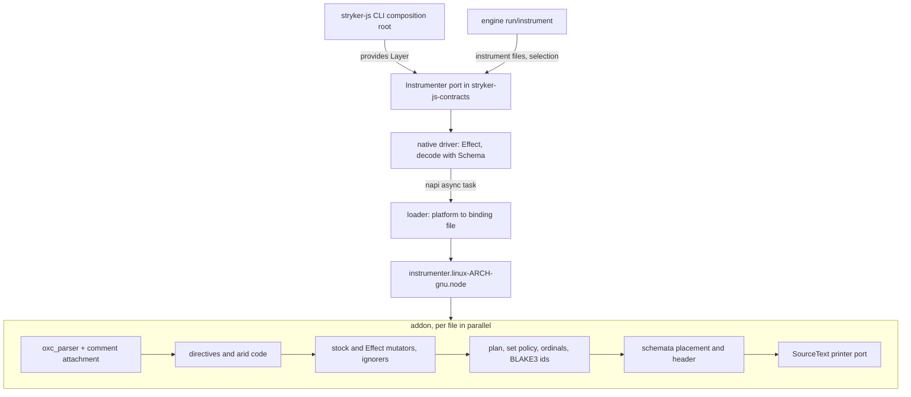
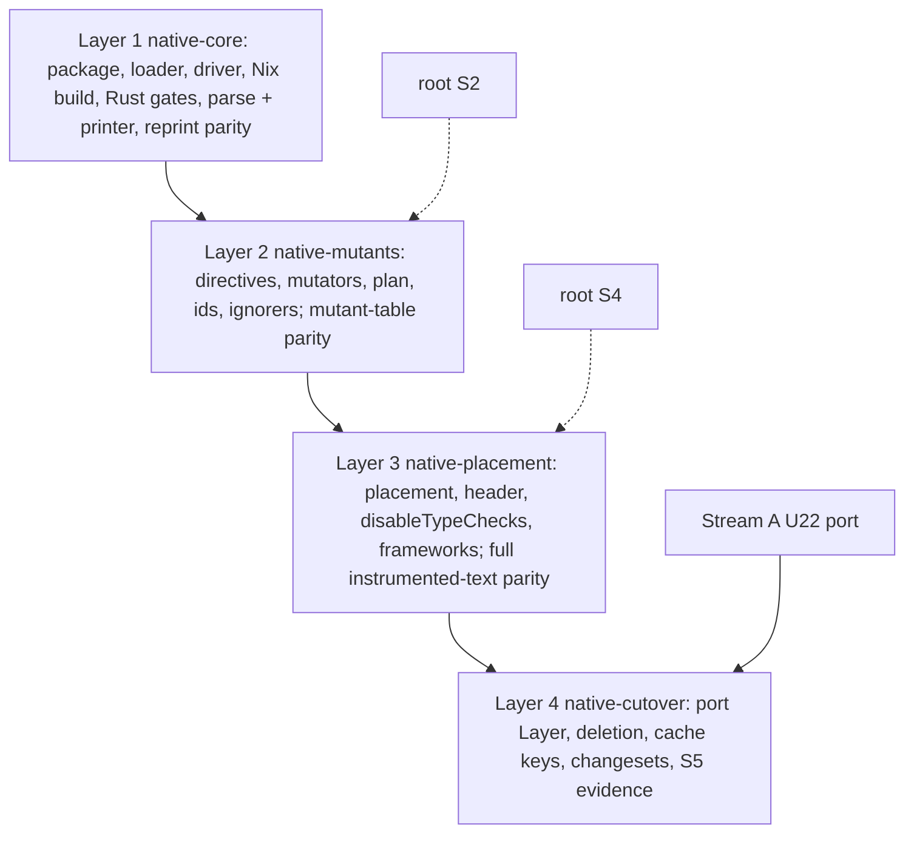

# Native Instrumenter Core - Plan

## Goal Capsule

- Objective: a `stryker run` instruments in at most a third of today's instrument-phase time and produces the same instrumented files and the same mutant table as today, with mutant ids changed once behind a cache-version bump.
- Means: one napi-rs addon over the oxc crates does parse, mutant generation, schemata placement, printing, and id hashing, reached by Effect TS as a driver behind Stream A's `Instrumenter` port (KTD1, KTD4, KTD9).
- Product authority, highest first: `CONSTITUTION.md`; the supervisor's Unit F contract and its rulings on the brainstorm (G-A, S3, S5, S6, S7, S9, S10, and the host-resource ruling); root rulings S1, S2, S4, S8 once issued; this plan.
- Execution profile: four stacked code layers (KTD11), each landing green on its exact head; layers 1-3 are inert until layer 4 wires the driver.
- Stop conditions: a root ruling on S1, S2, S4, or S8 that differs from its working assumption stops every unit marked "pending root ruling" on that question until the plan is revised; a parity diff that cannot be closed without changing emitted output stops the layer (R7, R8).
- Who finishes: `ce-work` builds one layer at a time; the operator merges bottom-up; nobody else merges.

---

## Product Contract

Carried from the origin brainstorm with the supervisor's rulings applied. The gap table and the evidence for the six load-bearing questions (measured oxc_codegen-vs-SourceText diff, CI span baseline, Nix probe) stay in the origin and are not restated.

Product Contract preservation: changed: R9 (S3 removes the SHA-256 alternative), R12 (S7 sets the reference and retirement), R13 (S5 sets run count and reporting), R14 (widened to the whole JS pipeline, because every remaining JS pipeline module is dead after cutover: DEL1, CONST-S4); added R16 (S9). R1-R8, R10, R11, R15 unchanged.

### Summary

A new workspace package holds a Rust crate, its napi-rs binding, a TypeScript loader, and an Effect driver. Given source files plus mutator selection data, it returns instrumented source text, the mutant table, and skips, byte-identical to today's output except for mutant ids. Nix builds it for x86_64- and aarch64-linux-gnu and every tarball carries both binaries. When the CLI switches to it, the JS pipeline and its hashing are deleted.

### Problem Frame

The instrument phase is CPU-bound JS over a JS AST, and the CLI bundle parses through oxc-parser's WebAssembly build (`packages/stryker-js/tsdown.config.ts:64-66`). On main CI the 32 e2e `stryker.instrument` spans sum to 14,159 ms (run `37960922619`); parse and transform are 9.5 s of it. The JS printer and its comment attachment are a whole-program reprint, so they cannot be replaced by a span splicer or by oxc_codegen without changing output (origin, Q1).

### Requirements

**Native package and build**

- R1. A new workspace package holds the Rust crate, its napi-rs binding, and a TypeScript loader; it depends on no other workspace driver, and only the CLI composition root depends on it.
- R2. The flake builds the addon for x86_64-linux-gnu and aarch64-linux-gnu with nixpkgs' `rustPlatform`, and every flake tarball of the package contains both binaries with no `/nix/store` `RUNPATH`.
- R3. Loading on any platform other than Linux x64/arm64 glibc fails with a typed error that names the platform; there is no JS fallback.
- R4. Rust dependencies are only the oxc crates, `napi`, `napi-derive`, `napi-build`, `rayon`, and `blake3`.

**Behaviour**

- R5. One addon call takes a batch of files plus selection data and returns instrumented source text, the mutant table (id, mutator name, original and replacement code, location, ignore reason), and skips, matching the `Instrumenter` shape in Stream A KTD12.
- R6. The addon also provides `disableTypeChecks` with the same output as `disable-type-checks.cell.ts`.
- R7. Instrumented source text is byte-identical to the JS pipeline's for every corpus file, including SourceText formatting and comment placement, apart from mutant ids.
- R8. Mutant spans, mutator names, original and replacement code, ordinals, and ignore reasons equal the JS pipeline's for every corpus file.
- R9. A mutant id is the first 16 lowercase hex characters of BLAKE3 over today's length-prefixed five-field preimage.
- R10. Output is deterministic and independent of rayon thread count and file order.

**Cache keys**

- R11. The id change bumps `INCREMENTAL_CACHE_VERSION` to `'5'`, and the native package joins `ENGINE_PACKAGE_SPECIFIERS`.

**Proof and removal**

- R12. A differential spec compares the addon with the JS pipeline over the whole corpus in CI on every layer while the JS pipeline exists: every tracked script under `packages/**` and `test/e2e/testResources/**` excluding `dist/`, plus framework files once S4 is settled. Full instrumented-text parity is green on the exact head of the layer before cutover; the spec retires with the JS code, and no released-tarball JS reference is kept.
- R13. CI shows the summed `stryker.instrument` span time of the e2e telemetry at no more than one third of main's, from at least two CI runs on the branch head and two at the merge base with the same fixture set, each run's sum, the ratio, and run URLs reported; Stream G's bench lane replaces this when it is on main at layer 4.
- R14. The cutover deletes `print/SourceText.ts`, `MutantIdentity.ts`, and the rest of the JS pipeline, with the instrumenter's `@noble/hashes`, `oxc-parser`, and `oxc-walker` dependencies and the CLI's WebAssembly parser alias; no JS fallback remains.
- R15. Each published break (instrumenter package removal, framework interface, ignorer and plugin-mutator contracts, ids) ships with a changeset at the BREAK-1 level.
- R16. `rustfmt --check` and `clippy -D warnings` from the flake's nixpkgs Rust toolchain gate the crate as flake checks run by a package script.

### Key Decisions

- **Port the SourceText format to Rust; oxc_codegen is not used for output.** oxc_codegen matches 178 of 1003 corpus files at best and the contract excludes format changes. Pending root ruling S1. Governs R7.
- **BLAKE3 ids behind a cache-version bump.** Supervisor ruling S3. Governs R9, R11.
- **One package carrying both Linux binaries.** No per-platform packages and no new `.sfs-deps` overrides. Governs R2, R3.
- **e2e OTel spans are the CI speed evidence until Stream G's bench lane lands.** Supervisor ruling S5. Governs R13.
- **Cutover and deletion ship in one layer, after full parity on the layer below.** Supervisor ruling S7. Governs R12, R14.
- **No docs-only layer.** The brainstorm and this plan ride in the bottom code layer. Supervisor gate finding G-A.

### Scope Boundaries

- No macOS, Windows, or musl binaries.
- No change to the emitted source format unless S1 rules for one.
- No local mutation runs; no Rust mutation testing in this unit unless S8 rules for it.
- No edits under `.github/workflows/`.
- Checker, runner, and execution-engine work stays with Streams H and G; the verdict store stays with Stream B.

#### Considered and not built

- A JS fallback path: excluded by the contract.
- Per-platform npm packages in the oxc-parser style: one package with two files needs no overrides and no optional-dependency resolution; revisit only if a third target is added.
- A test-only addon export to trigger a Rust panic: the panic guard (KTD4) keeps the existing contract that instrument failures surface as `InstrumentError`, but a production export only tests reach is banned (pack: schema-laws, tests-own-no-schemas.md); evidence that would change this is a panic observed in CI.
- Rust copies of the TypeScript behaviour suites, with expected text taken from the JS pipeline: characterization tests (OP12) that duplicate the corpus spec and test the Rust internals rather than the published driver. The TypeScript suites move to the driver instead (KTD12).
- Rust property testing: `proptest` is outside R4; the JS property suites keep running against the JS workflows until cutover, and parity plus Rust example tests carry the decision laws (S8).

#### Deferred to Follow-Up Work

- Migrating the `ignorers` entries of `packages/stryker-js/stryker.config.ts` and `test/e2e-core/stryker.config.ts` to built-in names, after a release carries the native driver (S12).
- A Dependabot `cargo` ecosystem entry for the crate.

### Dependencies / Assumptions

- Stream A U22 (`origin/stream-a/l1-ports-topology`, `docs/plans/2026-10-09-2025-refactor-ports-split-capability-packages-plan.md` KTD12, U22) provides the `Instrumenter` port in `stryker-js-contracts` and moves the driver-neutral modules (`ErrorText`, `Location`, `Instrument` schemas, `InstrumenterContext`) there; layer 4 depends on it (S10).
- Stream B (`origin/stryker/verdict-store`) keeps `KEY_LAYOUT = 'verdict-key/1'` with `mutantId` as a key component.
- Stream C (`stryker/mutant-quality*`) changes mutators; layers 2-4 merge `main` up and port each landed change.
- The e2e lane keeps uploading `stryker.instrument` spans on every CI run (`.github/workflows/ci.yml:133-143`).

### Open Questions for the Supervisor and Root

Pending root rulings (working assumption in force; dependent units are marked):

- S1. Format change to oxc_codegen's. Working assumption: none; SourceText's format is ported (U4, U10).
- S2. JS ignorers and plugin mutator contributions. Working assumption: (a) port the in-repo ignorers to Rust and remove the JS ignorer and plugin-mutator contracts, a published break with a changeset (U9, U13, U14, U16).
- S4. Framework interface. Working assumption: break it to script regions as offsets plus text; the addon injects the header (U12, U14, U16).
- S8. Rust mutation testing. Working assumption: none in this unit; the gap is declared, and parity plus Rust unit tests cover the ported logic (U4, U6, U7, U8, U9, U10, U11).

New questions raised by planning:

- S11. Deleting `@systemfsoftware/stryker-js-instrumenter` and, under S2, the five ignorer packages leaves published names on npm. Deprecating them is a publishing action that needs human approval; should the release carry `npm deprecate` for each?
- S12. The dogfood mutation configs name ignorers by module specifier and are read by the released CLI, so they can move to built-in names only after a release carrying the native driver; they are also judgment surfaces (CONST-E9). Approve the post-release migration and its owner.
- S13. Neither `packages/stryker-js-instrumenter` nor the new package is in `.github/workflows/mutation.yml` `PROJECTS` (`:29`), so no instrumenter code is mutation-graded today or after this unit. Adding the native package's TypeScript is a workflow edit for the workflow owner; propose it or accept the gap?

---

## Planning Contract

### Key Technical Decisions

- KTD1. **Rust port of `print/SourceText.ts` over the oxc AST**, organized by node family (statements, expressions, TypeScript, JSX, comments, precedence) and checked against the JS printer by the corpus spec (KTD7). Comment attachment follows `Ast.handle.ts` `attachComments` (`:413-503`): the same leading/trailing assignment, not oxc_codegen's comment model. Pending root ruling S1.
- KTD2. **Binaries sit next to the loader module.** The package build stages `instrumenter.linux-x64-gnu.node` and `instrumenter.linux-arm64-gnu.node` into the package's `dist/`, and the loader resolves the file relative to its own `import.meta.url`. The CLI bundle inlines every dependency (`packages/stryker-js/tsdown.config.ts:66`), so at cutover the CLI's tsdown config copies both files into its `dist/` beside the bundled loader, as it copies the WebAssembly parser today (`:65`). One loader works in both layouts.
- KTD3. **Nix bindings derivation.** `nix/instrumenter-native.nix` builds the crate with `rustPlatform.buildRustPackage` and `cargoLock.lockFile` (hashless, matching `flake.nix:12-15`) for the host and with `pkgsCross` for the other Linux architecture, so each flake system yields both binaries. The derivation removes `RUNPATH` with `patchelf`, declares `allowedReferences = [ ]` so Nix refuses any store reference, and asserts each file's ELF machine in its install check. `workspaceOf` maps it into the package directory through `mkPnpmWorkspacePackages`' `files` argument (pnpm-release-management `nix/lib/pnpm-store.nix:26-29`). The package `build` script uses binaries already placed by that mapping, which happens inside the Nix sandbox, and otherwise runs `nix build` of the derivation, which is how CI builds them (S6). The script never needs cargo on PATH.
- KTD4. **FFI shape.** Exports are `napi-derive` object structs on a napi `AsyncTask`, so instrumentation runs off the Node main thread and the Effect driver awaits a promise. `#[napi(catch_unwind)]` does not cover an `AsyncTask`'s `compute` phase, so `compute` wraps the pipeline in `std::panic::catch_unwind` and returns a panic as the typed failure `NativeInstrumenterPanicked`; the crate's release profile keeps `panic = "unwind"`, because an abort cannot be caught ([napi-rs error handling](https://napi.rs/docs/concepts/error-handling); [fast-yaml#404](https://github.com/bug-ops/fast-yaml/pull/404)). Reported spans are converted from oxc's UTF-8 byte offsets to UTF-16 code units with oxc's own `oxc_ast_visit::utf8_to_utf16::Utf8ToUtf16` (feature `serialize`, present in 0.150.0), which is how oxc-parser's JS binding produces today's offsets. The conversion is applied to the reported locations, not to the AST, because the printer slices source text by UTF-8 offset. The corpus has non-ASCII sources (for example the `∀…≡…` property names). The TypeScript driver decodes every returned object with Schema into the existing `InstrumentResult` and `File` types; nothing crosses the boundary by cast (pack: cell-architecture, decode-never-cast.md; CONST-B5).
- KTD5. **oxc crates pinned to the catalog's `oxc-parser` version**, exactly `0.150.0` now, and bumped in the same commit while the JS reference exists, so both pipelines see the same parser (pack: boundary-testing, pin-dependency-semantics.md).
- KTD6. **Id preimage is byte-identical to today's.** Each field is prefixed with its JavaScript `.length`, which counts UTF-16 code units, then UTF-8 encoded (`MutantIdentity.ts:7`, `:29-34`); only the hash changes (S3). The parity spec compares the five-field tuples, and checks each native id against BLAKE3 recomputed in TypeScript with `@noble/hashes`' `blake3`, a second implementation already in the lockfile (CONST-T10).
- KTD7. **Corpus parity spec.** `@systemfsoftware/differential-spec`, one test per corpus file, in its own vitest project `parity` so the package's `unit` project runs locally without it. The JS reference is the workspace link to `@systemfsoftware/stryker-js-instrumenter`: workspace links bypass the `.sfs-deps` overrides (`pnpm-workspace.yaml:79-95`), so no released tarball is a reference (S7). Instrumented text is compared after replacing each JS id with the native id of the same tuple. The package's `turbo.json` adds the corpus globs to its `test` inputs so a corpus change invalidates the cached result. The spec grows per layer: reprint with every mutator excluded (layer 1), mutant tables (layer 2), instrumented text and `disableTypeChecks` (layer 3).
- KTD8. **Rust gates as flake checks** `instrumenter-native-fmt` and `instrumenter-native-clippy`, from the same nixpkgs toolchain, run by the package's `lint` script; the dev shell gains `rustc`, `cargo`, `clippy`, `rustfmt` from that nixpkgs for local `cargo check` and `cargo test` (S9). The approval for this gate is the supervisor's S9 ruling (GATE1).
- KTD9. **Driver construction inputs, not port changes.** Ignorer names (S2) and embedded-format data (S4) are inputs to the native driver's Layer, built at the CLI composition root, as Stream A KTD12 does for the JS driver; `selection` stays `optInMutations`, `excludedMutations`, `mutantSetPolicy` (S10).
- KTD10. **Parallel by file, ordered by input.** Rayon maps files in parallel; results are collected in input order and each file's mutants in source order, and the ordinal counter is per file, so thread count cannot reorder output (R10).
- KTD11. **Four code layers on `main`.** Layer 1 `stryker/native-core` (this branch: brainstorm, plan, U1-U5); layer 2 `stryker/native-mutants` (U6-U9); layer 3 `stryker/native-placement` (U10-U12); layer 4 `stryker/native-cutover` (U13-U16), stacked on Stream A's branch if U22 is not on `main` when it is built (S10). Merge `main` up, never rebase, never force-push.
- KTD12. **Behaviour suites stay in TypeScript and follow the driver.** Every proposed test went through the test-layer admission gate, refusing by default. The corpus spec is the only new comparison test. Today's instrumenter integration suites (`packages/stryker-js-instrumenter/tests/*.integration.test.ts`) and the ignorer packages' cases are the behaviour contract: they keep running against the JS pipeline until cutover, then move to the native package and run in-process through the published driver (U14). They are not re-authored in Rust. New tests are admitted only for typed refusals reachable through the driver, for the Rust decision laws whose JS property suites are deleted at cutover (S8), and for invariants no corpus file can show: determinism across thread counts and UTF-16 field lengths in the id preimage. No admitted test spawns a process.

### High-Level Technical Design

The CLI reaches instrumentation only through the port; the native driver is the one Layer behind it after layer 4.



Each layer adds stages and the spec stage that proves them; nothing calls the addon until layer 4.



### Output Structure

```text
packages/stryker-js-instrumenter-native/
  package.json  turbo.json  tsconfig*.json  tsdown.config.ts  vitest.config.ts  oxlint.config.ts  api-extractor.json
  etc/stryker-js-instrumenter-native.api.md
  scripts/stage-bindings.ts
  src/mod.ts
  src/native-binding.workflow.ts
  src/NativeInstrument.schema.ts
  src/drivers/native-binding.ts
  src/drivers/instrumenter.ts
  src/__tests__/native-binding.workflow.property.test.ts
  tests/native-binding.integration.test.ts
  tests/catalog.integration.test.ts
  tests/instrument-parity.differential.test.ts
  tests/__fixtures__/corpus.ts
  crate/Cargo.toml  crate/Cargo.lock  crate/build.rs
  crate/src/{lib.rs, instrument.rs, parse.rs, comments.rs, identity.rs, plan.rs, set_policy.rs, relational.rs, arid.rs, catalog.rs, selection.rs, type_checks.rs}
  crate/src/{print,directives,mutators,ignorers,place}/...
nix/instrumenter-native.nix
```

### Assumptions

- Stream A's frozen `Instrumenter` shape (KTD12) is the shape layer 4 implements; a change to it reopens U13.
- CI's `ubuntu-latest` glibc is at least 2.34, the highest symbol version the probe binaries need.
- The two compared CI runs per side run the same e2e shards over the same fixtures (R13).
- `pkgsCross.aarch64-multiplatform` and `pkgsCross.gnu64` toolchains come from the binary cache, so the cross build stays near the probe's 51 s.

### Risks

- **The 3x target may miss on spans that include I/O.** `stryker.instrument.files.read` wraps file reads with parse and transform; if file I/O dominates after the change, R13 fails. Layer 4 reports per-subspan sums beside the total so the cause is visible.
- **Turbo cache can replay a build instead of running it.** The native package's `turbo.json` makes `crate/**`, `nix/instrumenter-native.nix`, `flake.nix`, and `flake.lock` build inputs, so any Rust or Nix change misses the cache and the CI log shows the Nix build (S6).
- **Each e2e shard rebuilds the addon** after cutover, because the e2e job has no turbo cache step; about two minutes per shard. Accepted; a cache step is a workflow edit.
- **The e2e lane packs a workspace closure** that must include the native package (`docs/solutions/build-errors/e2e-lane-packed-a-subset-of-its-workspace-closure.md`).
- **Stream C mutator changes land mid-stack.** Each merge-up ports the change in Rust in the same layer, and the parity spec fails until it does.

### System-Wide Impact

- Published packages: new `@systemfsoftware/stryker-js-instrumenter-native`; `@systemfsoftware/stryker-js-instrumenter` deleted; framework interface, ignorer interface and kit, and plugin-mutator contract broken under S2 and S4.
- Incremental reports and verdicts from version `'4'` are not reused after the first run on the new CLI (R11).
- The CLI tarball grows by two native binaries and drops the WebAssembly parser.

---

## Implementation Units

| U-ID | Title                              | Key files                                                     | Layer | Depends on            |
| ---- | ---------------------------------- | ------------------------------------------------------------- | ----- | --------------------- |
| U1   | Package, loader, driver surface    | `packages/stryker-js-instrumenter-native/src/**`              | 1     | -                     |
| U2   | Nix bindings build and staging     | `nix/instrumenter-native.nix`, `flake.nix`, `crate/Cargo.*`   | 1     | U1                    |
| U3   | Rust format and lint gates         | `flake.nix`, package `lint` script                            | 1     | U2                    |
| U4   | Parse and SourceText printer port  | `crate/src/{parse,comments}.rs`, `crate/src/print/**`         | 1     | U2                    |
| U5   | Corpus parity spec                 | `tests/instrument-parity.differential.test.ts`                | 1     | U1, U4                |
| U6   | Directives and arid code           | `crate/src/directives/**`, `crate/src/arid.rs`                | 2     | U4                    |
| U7   | Mutators, catalog, selection       | `crate/src/mutators/**`, `crate/src/{catalog,selection}.rs`   | 2     | U4                    |
| U8   | Plan, set policy, ordinals, ids    | `crate/src/{plan,set_policy,relational,identity}.rs`          | 2     | U6, U7                |
| U9   | Ignorers in Rust                   | `crate/src/ignorers/**`                                       | 2     | U8                    |
| U10  | Schemata placement and header      | `crate/src/place/**`                                          | 3     | U8                    |
| U11  | disableTypeChecks                  | `crate/src/type_checks.rs`                                    | 3     | U4                    |
| U12  | Framework regions                  | `packages/frameworks/**`, `crate/src/instrument.rs`           | 3     | U10                   |
| U13  | Driver behind the port, CLI wiring | `src/drivers/instrumenter.ts`, `packages/stryker-js/**`       | 4     | U10-U12, Stream A U22 |
| U14  | Delete the JS pipeline             | `packages/stryker-js-instrumenter/**`, `packages/ignorers/**` | 4     | U13                   |
| U15  | Cache keys and id-citing tests     | `packages/stryker-js/src/verdict-semantics.ts`                | 4     | U13                   |
| U16  | Changesets and CI speed evidence   | `.changeset/*.md`                                             | 4     | U13-U15               |

Paths in the table are relative to `packages/stryker-js-instrumenter-native/` unless they start at the repo root.

### U1. Package, loader, and driver surface

- **Layer:** 1 (`stryker/native-core`).
- **Goal:** an inert workspace package whose driver exposes `instrument(files, selection)` and `disableTypeChecks(file)` as Effects over the addon, with typed refusals for unsupported platforms, unloadable binaries, malformed source, and unknown mutator names.
- **Requirements:** R1, R3, R4, R5 (shape).
- **Dependencies:** none.
- **Files:** `packages/stryker-js-instrumenter-native/package.json`, `tsconfig.json`, `tsconfig.*.json`, `tsdown.config.ts`, `vitest.config.ts`, `oxlint.config.ts`, `api-extractor.json`, `etc/stryker-js-instrumenter-native.api.md`, `README.md`, `src/mod.ts`, `src/native-binding.workflow.ts`, `src/__tests__/native-binding.workflow.property.test.ts`, `src/NativeInstrument.schema.ts`, `src/drivers/native-binding.ts`, `src/drivers/instrumenter.ts`, `tests/native-binding.integration.test.ts`.
- **Approach:**
  1. Scaffold from `packages/stryker-js-instrumenter` (package.json `exports`, `files`, `engines`, `publishConfig`, tsconfig presets, api-extractor, attw).
  2. `native-binding.workflow.ts` is a pure `Workflow.make` decision from `{ platform, arch, libc }` to a binding file name or `UnsupportedPlatform`; the driver gathers the triple in its read phase (CONST-P1, CONST-P2, CONST-B3).
  3. `drivers/native-binding.ts` loads the decided file with `createRequire(import.meta.url)` (KTD2) and maps a load failure to `NativeBindingUnloadable` carrying the cause.
  4. `NativeInstrument.schema.ts` declares the addon's wire shapes and the error variants `UnsupportedPlatform`, `NativeBindingUnloadable`, `UnknownMutator`, `NativeInstrumenterPanicked`, each its own tagged error (CONST-D2); the driver decodes into the existing `InstrumentResult` and maps parse refusals to the existing `ParseFailed` shape (KTD4).
  5. Until U22 is on the branch, `drivers/instrumenter.ts` exports the two Effects with KTD12's signatures; U13 turns them into the port's Layer.
- **Patterns to follow:** `packages/stryker-js-instrumenter/src/drivers/oxc-program.ts`, `Parser.service.ts` (`oxcParseFailure`), `packages/stryker-js/src/decode-mutator-selection.workflow.ts` (refusal shape and its property file).
- **Packs and articles:** (pack: cell-architecture, decode-never-cast.md); (pack: cell-architecture, four-channel-contracts.md); (pack: cell-architecture, pure-decision-workflows.md); (pack: boundary-testing, real-system-oracles.md); (pack: boundary-testing, no-mocks-on-internal-glue.md); (pack: schema-laws, tagged-unions-over-state-by-presence.md); (pack: schema-laws, tests-own-no-schemas.md); CONST-B3, CONST-B5, CONST-D2, CONST-P1, CONST-P2, CONST-T8, CONST-T14.
- **Test scenarios (admitted under KTD12):**
  - Property in `src/__tests__/native-binding.workflow.property.test.ts`, the repo's place for workflow properties: every `(platform, arch, libc)` drawn from Node's platform and arch vocabularies other than `linux/x64/glibc` and `linux/arm64/glibc` is refused with `UnsupportedPlatform` naming all three values, and the two supported triples decide `instrumenter.linux-x64-gnu.node` and `instrumenter.linux-arm64-gnu.node`. It is a property because no CI host can reach the refusal through the loader (CONST-T14).
  - The package's built `dist/` copied to a temporary directory without the `.node` file: importing the driver in-process and calling `instrument` fails with `NativeBindingUnloadable` whose cause names the missing file (refusal pole on the real filesystem).
  - Malformed source `const = 1;` in `broken.ts` fails with `ParseFailed` naming `broken.ts` and the same message and line/column the JS pipeline reports for it. No corpus file is refused, so the corpus spec cannot reach this.
  - Refused: a load-and-run happy path, because the corpus spec loads the real binary on every corpus file; and an unknown-mutator refusal at layer 1, because the Rust catalog is empty there (moved to U7).
- **Verification:** the package typechecks, its `unit` project passes, `api:check` and `attw` pass, and nothing outside the package imports it.

### U2. Nix bindings build and staging

- **Layer:** 1.
- **Goal:** the flake builds both Linux binaries from one Cargo lockfile, the package build stages them into `dist/`, and CI builds them on the PR head.
- **Requirements:** R2, R4, S6.
- **Dependencies:** U1.
- **Files:** `nix/instrumenter-native.nix`, `flake.nix`, `packages/stryker-js-instrumenter-native/crate/Cargo.toml`, `crate/Cargo.lock`, `crate/build.rs`, `crate/src/lib.rs`, `packages/stryker-js-instrumenter-native/scripts/stage-bindings.ts`, `packages/stryker-js-instrumenter-native/turbo.json`, `packages/stryker-js-instrumenter-native/package.json` (`build`, `files`).
- **Approach:**
  1. `nix/instrumenter-native.nix` per KTD3; exported as `packages.<system>.stryker-js-instrumenter-native-bindings` in the flake's `own` set, which the existing clash assert (`flake.nix:93-95`) checks.
  2. `workspaceOf` passes the derivation in `files` at the package's staging directory.
  3. `scripts/stage-bindings.ts` copies the two binaries into `dist/` from the `files`-mapped directory when it holds both, else from a `nix build` of the derivation.
  4. The package `turbo.json` extends the root and adds the Rust and Nix inputs and the staged binaries as outputs.
  5. `Cargo.toml` pins the oxc crates to `=0.150.0` (KTD5) and lists only R4's crates.
- **Execution note:** packaging work; prove it with build output (derivation checks, loaded binary, CI log), not unit tests.
- **Packs and articles:** CONST-E7, CONST-S4.
- **Test expectation:** none, since the derivation's own checks are the gate: `allowedReferences = [ ]`, the ELF machine assertion, and the corpus spec loading the staged binary.
- **Verification:** one local `nix build` of the derivation yields two files whose ELF machines are x86-64 and AArch64 with no `RUNPATH`; the CI check job's log on the layer head shows the derivation building inside the package's turbo build task.

### U3. Rust format and lint gates

- **Layer:** 1.
- **Goal:** `rustfmt --check` and `clippy -D warnings` gate the crate locally and in CI without workflow edits.
- **Requirements:** R16.
- **Dependencies:** U2.
- **Files:** `flake.nix` (`checks.<system>.instrumenter-native-fmt`, `checks.<system>.instrumenter-native-clippy`, dev shell toolchain), `packages/stryker-js-instrumenter-native/package.json` (`lint`), `packages/stryker-js-instrumenter-native/turbo.json` (`lint` inputs).
- **Approach:** KTD8; the package `lint` runs oxlint, then builds both checks for the current system, so turbo's `lint` task in `gate:tasks` runs them in CI.
- **Packs and articles:** CONST-E9 (the gate's owner approval is S9), CONST-W3.
- **Test expectation:** none, since this is a gate; CHK1 proof below.
- **Verification:** a deliberately misformatted line and a deliberately unused binding each make the package `lint` exit non-zero once, locally, before they are reverted; CI's lint task log on the layer head shows both checks running.

### U4. Parse and SourceText printer port

- **Layer:** 1. Pending root ruling S1 (assumption: no format change, port SourceText) and S8 (assumption: no Rust mutation testing).
- **Goal:** the addon parses each file with `oxc_parser`, attaches comments as `Ast.handle.ts` does, and reprints it with a Rust port of `print/SourceText.ts`, so `instrument` with every mutator excluded returns the JS pipeline's text.
- **Requirements:** R7 (unmutated files), R10.
- **Dependencies:** U2.
- **Files:** `crate/src/parse.rs`, `crate/src/comments.rs`, `crate/src/print/mod.rs`, `crate/src/print/precedence.rs`, `crate/src/print/statements.rs`, `crate/src/print/expressions.rs`, `crate/src/print/typescript.rs`, `crate/src/print/jsx.rs`, `crate/src/print/comments.rs`, `crate/src/instrument.rs`, `crate/src/lib.rs`.
- **Approach:** KTD1, KTD4 (UTF-16 offsets), KTD10. Parse refusals report the first diagnostic with the fields `Parser.service.ts` puts in `ParseFailed`. The hashbang is printed as `printProgram` prints it (`print/SourceText.ts:199-212`).
- **Patterns to follow:** `packages/stryker-js-instrumenter/src/print/SourceText.ts`, `Ast.handle.ts:413-503`, `Printer.ts`.
- **Packs and articles:** (pack: boundary-testing, pin-dependency-semantics.md); CONST-P1, CONST-N1, CONST-N3, CONST-T10.
- **Test scenarios (Rust `#[cfg(test)]`, admitted under KTD12):**
  - The same batch of files instrumented on rayon pools of 1 and 8 threads returns identical output (R10).
  - A source with `≡` and an astral emoji before a node reports that node's location in UTF-16 code units equal to JavaScript's `indexOf` of the node text.
  - Refused: printer examples whose expected text is copied from the JS printer (characterization, OP12). The corpus spec compares every corpus file, so a construct it misses is a corpus gap to raise, not a Rust example to add.
- **Verification:** `cargo test` passes; U5's spec at layer 1 has zero differing files in CI.

### U5. Corpus parity spec

- **Layer:** 1, extended by U8 (layer 2) and U10, U11 (layer 3).
- **Goal:** CI compares the native driver with the JS pipeline over the whole corpus on every layer.
- **Requirements:** R12, R7, R8.
- **Dependencies:** U1, U4.
- **Files:** `packages/stryker-js-instrumenter-native/tests/instrument-parity.differential.test.ts`, `tests/__fixtures__/corpus.ts`, `vitest.config.ts` (projects `unit` and `parity`), `turbo.json` (`test` inputs), `package.json` (devDependencies `@systemfsoftware/stryker-js-instrumenter` `workspace:^`, `@systemfsoftware/differential-spec`).
- **Approach:** KTD7. The corpus fixture enumerates `packages/**` and `test/e2e/testResources/**` in-process with `node:fs/promises` `glob`, keeps script extensions, and drops `node_modules`, `dist`, and `.turbo`. It spawns no `git` process. It refuses to return an empty list. At layer 1 both sides run with every stock mutator excluded.
- **Patterns to follow:** `test/e2e-core/tests/analyzer.differential.test.ts`, `packages/stryker-js/tests/vm-parity.differential.test.ts`.
- **Packs and articles:** (pack: boundary-testing, pin-dependency-semantics.md); CONST-T9, CONST-T10, CONST-T12.
- **Test scenarios:**
  - For each corpus file, the native driver's output text equals the JS pipeline's (one test per file, so the CI log names every file compared).
  - A corpus enumeration that finds no files fails the spec instead of passing with zero tests (CHK1).
  - A file both pipelines refuse fails with the same error tag, file name, and location on both sides.
- **Verification:** in CI the `parity` project lists one passing test per corpus file (1003 at the time of the brainstorm) and none failing.

### U6. Directives and arid code

- **Layer:** 2 (`stryker/native-mutants`). Pending root ruling S8 (assumption: no Rust mutation testing).
- **Goal:** the addon decodes and folds `Stryker disable`/`restore` directives and classifies arid code as the JS workflows do.
- **Requirements:** R8.
- **Dependencies:** U4.
- **Files:** `crate/src/directives/decode.rs`, `crate/src/directives/fold.rs`, `crate/src/arid.rs`.
- **Approach:** port `directives/decode-directive.workflow.ts`, `directives/fold-rule.workflow.ts`, `directives/directive.schema.ts`, `arid-code.workflow.ts` as pure functions; warnings for malformed directives carry the JS text.
- **Patterns to follow:** the property files under `packages/stryker-js-instrumenter/src/__tests__/` and `src/directives/__tests__/`.
- **Packs and articles:** CONST-P1, CONST-P2, CONST-D4, CONST-T10.
- **Test scenarios (Rust, admitted under KTD12 as the laws of a decision whose JS property suites are deleted at cutover):**
  - Each named universal in `directive-decode.workflow.property.test.ts`, `fold-rule.workflow.property.test.ts`, and `arid-code.workflow.property.test.ts` holds in Rust over that suite's generator boundary inputs: the empty directive, an unknown mutator name, an unclosed `disable`, a `next-line` directive on the last line.
  - Refused: directive examples that copy the JS output; the behaviour suites and the corpus spec cover them.
- **Verification:** `cargo test` passes; the layer-2 parity stage (U8) has no ignore-reason diffs.

### U7. Mutators, catalog, and selection

- **Layer:** 2. Pending root ruling S8.
- **Goal:** the addon generates the stock and Effect mutants the JS mutators generate, knows exactly the names `StockCatalog` declares, and refuses any other name.
- **Requirements:** R5, R8.
- **Dependencies:** U4.
- **Files:** `crate/src/mutators/mod.rs` and one module per stock mutator, `crate/src/mutators/effect/call.rs`, `crate/src/mutators/effect/atomic_update_split.rs`, `crate/src/mutators/effect/synchronization_removal.rs`, `crate/src/mutators/effect/finalizer_escape.rs`, `crate/src/catalog.rs`, `crate/src/selection.rs`, `packages/stryker-js-instrumenter-native/tests/catalog.integration.test.ts`.
- **Approach:** port `Mutator.service.ts` (16 stock mutators, defaults and opt-in tiers, `selectMutators`), `EffectCall.ts`, `AtomicUpdateSplit.ts`, `SynchronizationRemoval.ts`, `FinalizerEscape.ts`. Replacement text is printed with U4's printer before any placement (`docs/solutions/runtime-errors/mutant-replacement-text-captured-before-placement.md`). Port each Stream C mutator change on merge-up.
- **Patterns to follow:** `packages/stryker-js-instrumenter/tests/catalog-examples.integration.test.ts` and the per-mutator integration tests in that directory.
- **Packs and articles:** (pack: cell-architecture, decode-never-cast.md) for selection names crossing the FFI; CONST-B5, CONST-D2, CONST-T10.
- **Test scenarios (admitted under KTD12):**
  - In `tests/catalog.integration.test.ts`, through the driver in-process: a selection naming each `StockCatalog` entry (`packages/stryker-js-cli-contract`) is accepted, and a name absent from it is refused with `UnknownMutator` naming it. This guards the Rust catalog against drifting from the TypeScript catalog, which the corpus spec cannot see when a mutator matches no corpus node.
  - Refused: Rust copies of `catalog-examples` and the per-mutator integration suites. Those suites run against the JS pipeline until U14 moves them to the driver.
- **Verification:** `cargo test` and the package `unit` project pass.

### U8. Plan, set policy, ordinals, and ids

- **Layer:** 2. Pending root ruling S8.
- **Goal:** the addon's mutant table equals the JS pipeline's on every corpus file, with BLAKE3 ids.
- **Requirements:** R8, R9, R10.
- **Dependencies:** U6, U7.
- **Files:** `crate/src/plan.rs`, `crate/src/set_policy.rs`, `crate/src/relational.rs`, `crate/src/identity.rs`, `tests/instrument-parity.differential.test.ts` (mutant-table stage), `package.json` (devDependency `@noble/hashes`).
- **Approach:** port `plan-mutants.workflow.ts`, `mutant-set-policy.workflow.ts`, `relational-sufficient-sets.ts`; ids per KTD6; ordinals per KTD10. The parity stage runs the full stock selection with the opt-ins each corpus package configures.
- **Packs and articles:** CONST-P1, CONST-P2, CONST-T9, CONST-T10.
- **Test scenarios:**
  - Rust (admitted, invariant no corpus file pins): a tuple whose original code holds `≡` and an astral emoji gets length prefixes equal to JavaScript `.length` of each field; two identical tuples in one file get ordinals 0 and 1 and different ids.
  - Rust (admitted as decision laws, S8): each named universal in `plan-mutants.workflow.property.test.ts` and `mutant-set-policy.workflow.property.test.ts` holds over that suite's generator boundary inputs.
  - Corpus spec: for each corpus file, the native and JS mutant tables are equal on every field but `id`, and every native id equals the first 16 hex characters of `@noble/hashes` BLAKE3 over the same preimage.
- **Verification:** the layer-2 `parity` project has zero differing files in CI.

### U9. Ignorers in Rust

- **Layer:** 2. Pending root ruling S2 (assumption (a)) and S8.
- **Goal:** the three in-repo ignorers run in Rust under their package names and give the reasons the JS ignorers give.
- **Requirements:** R8.
- **Dependencies:** U8.
- **Files:** `crate/src/ignorers/mod.rs`, `crate/src/ignorers/in_source_vitest_block.rs`, `crate/src/ignorers/effect_schema_declarations.rs`, `crate/src/ignorers/angular_signals.rs`, `src/drivers/instrumenter.ts` (ignorer names as construction input, KTD9), `src/NativeInstrument.schema.ts` (`UnknownIgnorer`).
- **Approach:** port `packages/ignorers/in-source-vitest-block/src/in-source-vitest-block.ts`, `packages/ignorers/effect-schema-declarations/src/effect-schema-declarations.ts`, `packages/ignorers/angular/src/angular-signals.ts` with their reason constants and the ancestor semantics of `packages/ignorers/kit/src/define-ignorer.ts:54-63`. The parity stage configures the ignorers each corpus package's `stryker.config.ts` names.
- **Packs and articles:** CONST-T9, CONST-T10, CONST-D2.
- **Test scenarios (admitted under KTD12):**
  - Through the driver: constructing it with an ignorer name that is not built in fails with `UnknownIgnorer` naming it.
  - Corpus spec: ignore reasons are equal for every corpus file under each package's configured ignorers.
  - Refused: Rust copies of the ignorer packages' cases. U14 moves those cases to the driver.
- **Verification:** `cargo test` passes; layer-2 parity has no ignore-reason diffs.

### U10. Schemata placement and header

- **Layer:** 3 (`stryker/native-placement`). Pending root ruling S1 and S8.
- **Goal:** the addon places every live mutant as the JS placers do and prints the instrumented file byte-identical to the JS pipeline apart from ids.
- **Requirements:** R5, R7.
- **Dependencies:** U8.
- **Files:** `crate/src/place/mod.rs`, `crate/src/place/expression.rs`, `crate/src/place/statement.rs`, `crate/src/place/header.rs`, `tests/instrument-parity.differential.test.ts` (instrumented-text stage).
- **Approach:** port `place-mutants.workflow.ts`, the placers and `applyPlan` in `Transformer.service.ts` (`:1336-1433`), and `InstrumentHeader.ts`, keeping the activation identifiers of `InstrumentContext.schema.ts`. Placement refusals keep the JS tags (`MutantsUnplaced`, `NoPlacerClaimsNode`, `MutantKindMismatch`, `NodeWithoutSpan`).
- **Patterns to follow:** `docs/solutions/runtime-errors/mutant-switch-in-a-conditional-test-needs-parens.md`, `docs/solutions/runtime-errors/directive-ignored-mutants-shift-placed-replacements.md`, `tests/conditional-test-placement.integration.test.ts`, `tests/mutant-span-slice.integration.test.ts`.
- **Packs and articles:** CONST-P1, CONST-D2, CONST-T9, CONST-T10.
- **Test scenarios:**
  - Corpus spec: for each corpus file, the instrumented text equals the JS text after id substitution (KTD7).
  - Refused: Rust copies of `conditional-test-placement`, `mutant-span-slice`, and the placement solution-doc cases; those integration suites run against the JS pipeline until U14 moves them to the driver.
- **Verification:** the layer-3 `parity` project has zero differing files in CI; this green run on the layer-3 head is the parity proof the cutover carries (S7).

### U11. disableTypeChecks

- **Layer:** 3. Pending root ruling S8.
- **Goal:** the addon's `disableTypeChecks` returns the JS output for every corpus file.
- **Requirements:** R6.
- **Dependencies:** U4.
- **Files:** `crate/src/type_checks.rs`, `src/drivers/instrumenter.ts`, `tests/instrument-parity.differential.test.ts` (type-check stage).
- **Approach:** port `disable-type-checks.cell.ts` and `TypeCheckDisablers.ts` (`tsDirectiveLikeRegEx` semantics).
- **Packs and articles:** CONST-T9, CONST-T10.
- **Test scenarios:**
  - Corpus spec: for each corpus file, both `disableTypeChecks` outputs are equal.
  - Refused: hand-picked examples, which the corpus already covers.
- **Verification:** the type-check parity stage passes in CI.

### U12. Framework regions

- **Layer:** 3. Pending root ruling S4 (assumption: regions as offsets plus text; the addon injects the header).
- **Goal:** Svelte and Angular files instrument through the addon, with framework plugins locating regions and splicing printed text.
- **Requirements:** R5, R7, R12 (framework files), R15.
- **Dependencies:** U10.
- **Files:** `packages/frameworks/interface/src/mod.ts`, `packages/frameworks/interface/etc/stryker-framework-interface.api.md`, `packages/frameworks/svelte/src/framework.ts`, `packages/frameworks/svelte/tests/svelte-framework.test.ts`, `packages/frameworks/svelte/tests/__fixtures__/toolkit.ts`, `packages/frameworks/angular/src/html-format.ts`, `packages/frameworks/angular/tests/html-format.test.ts`, `packages/stryker-js-instrumenter/src/FrameworkEntry.ts` (JS reference adapted to the new interface), `crate/src/instrument.rs`, `tests/__fixtures__/corpus.ts` (framework extensions), `.changeset/*.md`.
- **Approach:**
  1. `ScriptRegion` loses `scriptAst`; `FrameworkContext` loses `parseScript`/`printScript`; a plugin returns regions and splices the printed region texts.
  2. The header goes into the first module region, or a new module script when none exists, as `packages/frameworks/svelte/src/framework.ts:140-150` does today.
  3. The JS `FrameworkEntry` is adapted in the same layer so the parity reference keeps running.
- **Packs and articles:** (pack: schema-laws, tagged-unions-over-state-by-presence.md) for region kinds; CONST-S3, CONST-T9; BREAK-1.
- **Test scenarios:**
  - The existing `svelte-framework.test.ts` and `html-format.test.ts` change with the interface; their cases keep their current expectations (header once, in the module script; template expressions spliced with their punctuation). No case is added.
  - Corpus spec: each `.svelte` and Angular component file in `test/e2e/testResources/**` instruments identically on both sides.
- **Verification:** the frameworks' unit tests pass; the layer-3 parity stage covers framework files with zero diffs.

### U13. Driver behind the port and CLI wiring

- **Layer:** 4 (`stryker/native-cutover`). Depends on S10's branch choice; pending root ruling S2 for ignorer inputs.
- **Goal:** the CLI instruments through the native driver as the `Instrumenter` port's only Layer.
- **Requirements:** R1, R5, R13.
- **Dependencies:** U10, U11, U12, Stream A U22.
- **Files:** `packages/stryker-js-instrumenter-native/src/drivers/instrumenter.ts`, the CLI composition root that U22 names, `packages/stryker-js/package.json`, `packages/stryker-js/tsdown.config.ts`, `test/e2e-core/package.json`, `test/e2e-core/tests/analyzer.differential.test.ts` and the other `test/e2e-core` importers of the JS instrumenter.
- **Approach:**
  1. `drivers/instrumenter.ts` exports a parameterized Layer for the port, taking ignorer names and embedded-format data (KTD9).
  2. The CLI composition root provides it.
  3. The CLI's tsdown config copies the two binaries (KTD2) and drops the `oxc-parser` alias and WebAssembly copy once no other CLI module imports `oxc-parser`.
  4. `test/e2e-core` moves to the native driver.
- **Patterns to follow:** U22's JS driver Layer; (pack: cell-architecture, service-and-layer-boundaries.md); (pack: cell-architecture, ports-separate-from-layers.md).
- **Packs and articles:** (pack: boundary-testing, fake-and-real-store-laws.md) for the shared contract suite; CONST-B4, CONST-T9.
- **Test scenarios:**
  - U22's `Instrumenter` contract law suite passes against the native driver.
  - The instrumentation integration suites U22 names (`mutant-location-parity`, `framework-run`) pass through the port with the native driver.
  - The e2e lane passes on all five shards.
- **Verification:** CI check and e2e jobs green on the layer head.

### U14. Delete the JS pipeline

- **Layer:** 4. Pending root ruling S2 (ignorer and plugin-mutator removal) and S4 (framework hooks).
- **Goal:** no JS instrumentation code, JS hashing, or JS ignorer contract remains.
- **Requirements:** R14, R15.
- **Dependencies:** U13.
- **Files:** move `packages/stryker-js-instrumenter/tests/*.integration.test.ts` and their `__fixtures__`/`testResources` to `packages/stryker-js-instrumenter-native/tests/`, retargeted from `Instrument.instrument` to the native driver in-process. Move each ignorer package's cases into a driver-level `tests/ignorers.integration.test.ts`: source plus ignorer name gives ignore reasons. Then delete `packages/stryker-js-instrumenter/**`; its driver-neutral modules have moved to contracts under U22. Delete `packages/ignorers/interface/**`, `packages/ignorers/kit/**`, `packages/ignorers/in-source-vitest-block/**`, `packages/ignorers/effect-schema-declarations/**`, `packages/ignorers/angular/**`. Remove the plugin mutator contribution path in `packages/stryker-js/src/run/instrument.ts` and its plugin-interface contract. Delete the corpus spec, its fixtures, and its devDependencies. Repoint any `workspace:^` reference to a deleted package that the dogfood configs still need at its `.sfs-deps` tarball.
- **Approach:** DEL1 total removal in one commit after U13 is green, after the behaviour suites pass against the driver. A moved case whose JS expectation the native driver does not meet is a parity defect: fix it in Rust, and never change the expectation. The dogfood configs keep their module-specifier ignorers until S12 because the released CLI reads them; the PR declares this under CONST-W3.
- **Packs and articles:** CONST-S4, CONST-T9 (parity proof from layer 3 carries, S7), CONST-W3; DEL1.
- **Test expectation:** no new test. The moved suites keep their cases and expectations; only the entry point changes.
- **Verification:** `git grep -nI -e SourceText -e mutantIdOf -e stryker-ignorer-kit -e stryker-ignorer-interface -- . ':!*.lock' ':!.changeset' ':!**/CHANGELOG.md' ':!docs'` returns no match, apart from the S12 dogfood config lines named in the PR.

### U15. Cache keys and id-citing tests

- **Layer:** 4.
- **Goal:** old incremental reports and verdicts are not reused with new ids, and the engine digest covers the native package.
- **Requirements:** R11.
- **Dependencies:** U13.
- **Files:** `packages/stryker-js/src/verdict-semantics.ts`, tests in `packages/**` and `test/**` that cite literal 16-hex mutant ids.
- **Approach:** set `INCREMENTAL_CACHE_VERSION` to `'5'` and add the native package to `ENGINE_PACKAGE_SPECIFIERS` (S3); recompute cited ids from their tuples. If Stream B has landed, confirm its key layout stays `verdict-key/1`.
- **Packs and articles:** CONST-T10 (recomputed ids come from the tuple, not from a run's output).
- **Test expectation:** no new test. No test pins `INCREMENTAL_CACHE_VERSION`'s value (searched `packages/stryker-js/tests`, `src/__tests__`), and the existing version-mismatch behaviour covers the bump. A test that `ENGINE_PACKAGE_SPECIFIERS` lists the package would test a list entry, and is refused.
- **Verification:** the stryker-js tests touched by the change pass; tests targeting mutated files (`*.workflow.ts`, `*.schema.ts` under `packages/stryker-js` and `test/e2e-core`) cite their mutant ids from the latest main mutation report.

### U16. Changesets and CI speed evidence

- **Layer:** 4.
- **Goal:** every published break carries its changeset, and the PR carries the S5 speed evidence.
- **Requirements:** R13, R15.
- **Dependencies:** U13, U14, U15.
- **Files:** `.changeset/*.md`.
- **Approach:** changesets for the new native package, `@systemfsoftware/stryker-js` (driver swap, id change, plugin-mutator and ignorer contract removal), `@systemfsoftware/stryker-framework-interface` (S4), `@systemfsoftware/stryker-js-plugin-interface` (plugin mutator contract, S2), at the BREAK-1 level for each package's current major; deprecation of deleted packages waits on S11. The S5 evidence procedure is in the Verification Contract.
- **Test expectation:** none, since this is release metadata and evidence.
- **Verification:** CI `Changeset Check` green; the PR body lists the four runs, their sums, and the ratio.

---

## Verification Contract

### Host-resource ruling (binding until lifted)

Local verification is targeted only: typecheck plus the affected package's own tests; for the crate, `cargo check` and its unit tests. One build at a time: no parallel Nix or cargo builds, and no Nix build while cargo runs. No full e2e, microVM, full-workspace test or build (`pnpm test`, `pnpm build`, `pnpm check:ci`), full-corpus parity, mutation, or `workspace-tarballs` build locally; push and let CI run the heavy lanes. Close any `tsc --lsp`, watch, or background process when a session ends, and keep scratch output inside the worktree's gitignored scratch area or delete it.

### Local gates per layer

| Layer | Local, targeted                                                                                                                                                                                                                                                                                                                                                                                                                                                      |
| ----- | -------------------------------------------------------------------------------------------------------------------------------------------------------------------------------------------------------------------------------------------------------------------------------------------------------------------------------------------------------------------------------------------------------------------------------------------------------------------- |
| 1     | `pnpm --filter @systemfsoftware/stryker-js-instrumenter-native typecheck`; `pnpm --filter @systemfsoftware/stryker-js-instrumenter-native exec vitest run --project unit`; in `crate/` through `nix develop`: `cargo check`, `cargo test`, `cargo fmt --check`, `cargo clippy -- -D warnings`, one at a time; one `nix build .#stryker-js-instrumenter-native-bindings` only when U2's Nix changes; the U3 CHK1 sabotage once; `./bin/dprint check` on changed files |
| 2     | layer 1's package and crate commands                                                                                                                                                                                                                                                                                                                                                                                                                                 |
| 3     | layer 1's package and crate commands; `typecheck` and `vitest run` for `packages/frameworks/interface`, `packages/frameworks/svelte`, `packages/frameworks/angular`, and `typecheck` for `packages/stryker-js-instrumenter`                                                                                                                                                                                                                                          |
| 4     | `typecheck` for each changed package; `vitest run <changed test files>` in `packages/stryker-js` and `test/e2e-core`; `pnpm --filter @systemfsoftware/stryker-js-instrumenter-native exec vitest run --project unit`                                                                                                                                                                                                                                                 |

### CI evidence that closes each layer

| Layer | Evidence on the exact layer head                                                                                                                                                                                                                                  |
| ----- | ----------------------------------------------------------------------------------------------------------------------------------------------------------------------------------------------------------------------------------------------------------------- |
| 1     | `check` job green; its log shows the bindings derivation building in the native package's turbo `build` task (a cache miss) and both Rust flake checks in `lint`; the `parity` project lists one passing test per corpus file at the reprint stage and no failure |
| 2     | as layer 1, with the mutant-table stage: zero differing files, every id matching the BLAKE3 oracle                                                                                                                                                                |
| 3     | as layer 2, with the instrumented-text and `disableTypeChecks` stages over the corpus including framework files: zero differing files; this run is the S7 parity proof                                                                                            |
| 4     | `check` and all five `e2e` shards green; the log shows the bindings derivation building; DEL1 grep clean (U14); `Changeset Check` green; S5 evidence below                                                                                                        |

### S5 speed evidence (layer 4)

- Dispatch `ci.yml` (`workflow_dispatch`) twice on the layer-4 branch head and twice on a throwaway ref pointing at the merge base with `main`; no mutation run is dispatched on any branch.
- From each run's `e2e-telemetry-*` artifacts (7-day retention), sum the `stryker.instrument` spans over all shards, plus the `parseWithOxc`, `transform.script`, and `files.read` sub-span sums.
- The PR body reports the four run URLs, each run's sum, both sides' mean, and the ratio; R13 passes when the branch mean is at most one third of the merge-base mean.
- If Stream G's bench lane is on `main` when layer 4 is built, its comparison replaces this procedure.
- Delete the throwaway ref after the evidence is recorded.

### Mutation

No local mutation runs. Instrumenter code is outside `mutation.yml` `PROJECTS` (S13); tests that target mutated files cite mutant ids from the latest main mutation report (U15).

---

## Definition of Done

- Global: R1-R16 hold on the layer-4 head; every Verification Contract row for every layer has its CI evidence linked in that layer's PR; no unit marked pending a root ruling ships while its ruling differs from the working assumption; no JS fallback, no abandoned-attempt code, no scratch output in the diff.
- Layer 1: U1-U5 merged with the brainstorm and this plan; reprint parity zero-diff in CI.
- Layer 2: U6-U9 merged; mutant-table parity zero-diff in CI.
- Layer 3: U10-U12 merged; full instrumented-text and `disableTypeChecks` parity zero-diff in CI on the exact head.
- Layer 4: U13-U16 merged; e2e green; R13 ratio reported with run URLs; DEL1 clean; changesets present; S11 and S12 answered or recorded as open in the PR.

---

## Sources

- Origin brainstorm: `docs/brainstorms/2026-10-09-2039-feat-native-instrumenter-core-plan.md` (gap table, Q1-Q6 evidence).
- Stream A: `origin/stream-a/l1-ports-topology`, `docs/plans/2026-10-09-2025-refactor-ports-split-capability-packages-plan.md` KTD12 and U22.
- Stream B: `origin/stryker/verdict-store`, `packages/stryker-js/src/verdict-store/encode-verdict-key.workflow.ts:15,50`.
- CLI bundling: `packages/stryker-js/tsdown.config.ts:5-17,64-66`.
- Mutation projects: `.github/workflows/mutation.yml:29`; e2e telemetry: `.github/workflows/ci.yml:133-143`; turbo task inputs: `turbo.json`.
- Unknown-name refusal today: `packages/stryker-js/src/decode-mutator-selection.workflow.ts:94-111`.
- pnpm-release-management: `nix/lib/pnpm-workspace-packages.nix:104-117`, `nix/lib/pnpm-store.nix:24-29`.
