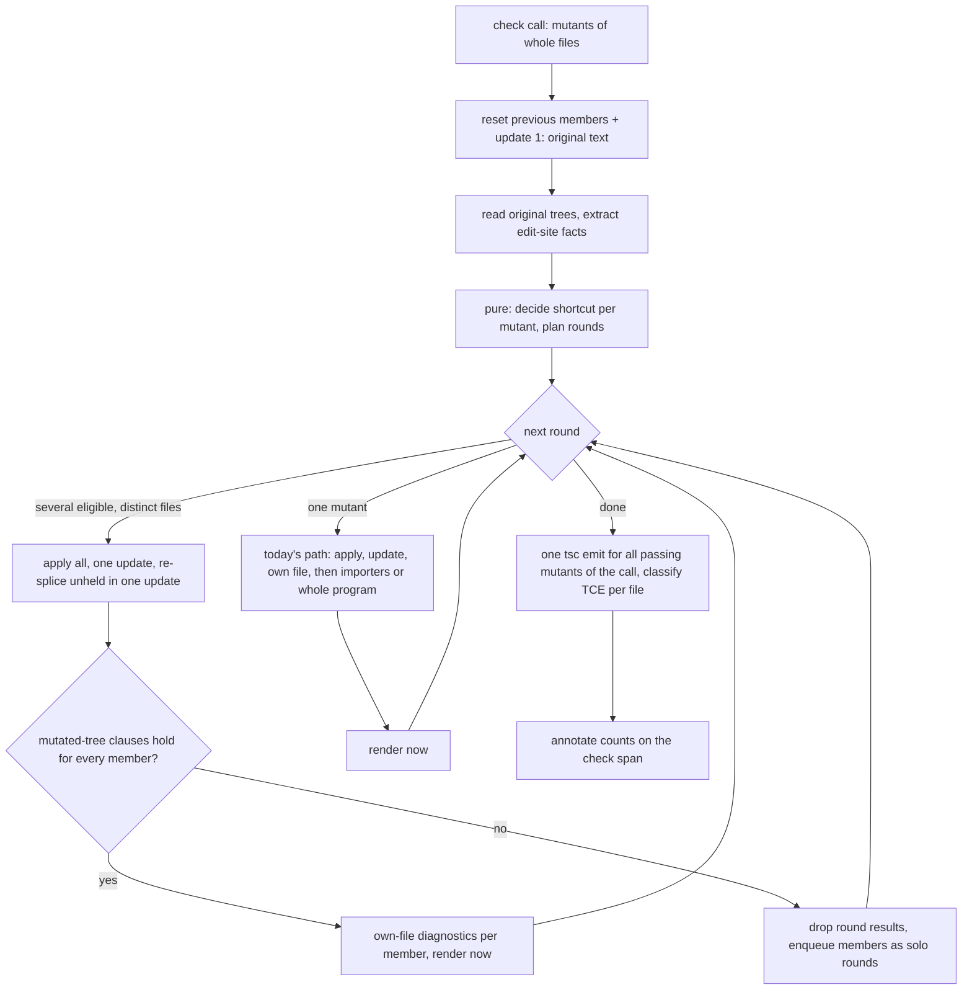

# TypeScript checker on TypeScript 7 native - Plan

## Goal Capsule

- **Objective:** A Stryker run with the TypeScript checker rejects non-compiling mutants with the same verdicts as main's checker, spends less checker time doing it, and nothing in a published package reaches a pre-7 TypeScript compiler. The tsgo-backed checker also answers advisory type queries the instrumenter can ask before it generates a mutant (B10).
- **Means:** check several mutants in one TypeScript 7 snapshot when no member can change another member's verdict, skip importer re-checks for edits that an edit-location rule proves cannot change any type outside a function body, and prove both in a CI lane that runs main's checker and the branch's checker over the same rule-selected corpus (KTD1, KTD2, KTD5). Answer type queries from one probe snapshot per request on a tsgo server separate from the verdict path, and catch every wrong "not assignable" answer in the same lane (KTD10-KTD12).
- **Authority:** the unit contract `.omp-brief/unit-h-contract.md` (Done 1-5, Does-not-count, Constraints), then the supervisor rulings `.omp-brief/rulings-brainstorm.md` (B1-B9), B10 (type-query surface for Stream I, delivered by the root during planning), S1/S2 (targeted local verification; a TS7-capable api-extractor is pre-approved and no override forces TS7 onto it) and `.omp-brief/rulings-plan.md` (review dispositions, OQ-P1 to OQ-P10, the four-layer stack), then this plan. `CONSTITUTION.md` governs any conflict (`CONST-1`). Origin requirements: `docs/brainstorms/2026-10-09-2030-perf-typescript-checker-tsgo-native-plan.md`.
- **Stop conditions:** stop and report if the TypeScript 7.0.2 API cannot do something a unit needs (name the missing API with evidence; never fall back to TS5); if the parity lane shows any verdict difference that the position rule in R7 does not explain; if a corpus leg cannot finish inside its time budget at eight shards.
- **Execution profile:** stacked PRs on trunk `main` via `gh stack` (root `AGENTS.md` OP13b), one concern per layer, no force-push. Locally only typecheck and the touched package's tests (S1); the corpus, e2e and mutation runs happen in CI only.
- **Who ships:** the implementer opens and updates the stack and reports each layer's green head SHA; the operator merges bottom-up.
- **Supervisor items:** OQ-P1 to OQ-P10 are ruled (`.omp-brief/rulings-plan.md`): every default is accepted, and the root confirmed OQ-P5, OQ-P8 and OQ-P9 as defaulted. The root adds `checker-parity-report` to the ruleset after its first green main run (rulesets are never edited here). The plugin-interface `./type-query` entry holds the port only (schemas and service tag, no Layer); `TypeQueryLive` stays in the checker. The v1 shape is accepted with no extra fields, and the provisional marking stays until the supervisor lifts it.

---

## Product Contract

### Summary

Keep the checker on the `typescript@7.0.2` `unstable/*` API it already uses. Let one snapshot carry several mutants from different files when the edit-location rule proves none of them can change another's verdict, skip importer re-checks for those mutants, and run one TypeScript emit build per check call instead of one per file when the lane shows emit time is material (KTD7; otherwise U7 is dropped and the measurement reported). A CI lane compares every corpus verdict and the checker time against a checker built from the pull request's merge-base with main.

### Problem Frame

The origin brainstorm established the gap (its Gap Table and Measured Cost): every mutant gets its own snapshot update, a mutant that compiles in its own file re-checks every transitive importer, and nothing in CI compares two checkers. Planning research added one defect that batching depends on: the checker renders a diagnostic's `line,column` after the whole check call finishes, against whichever mutant was applied last, not against the mutant that produced it (`packages/stryker-js-typescript-checker/src/Checker.cell.ts:53-55` calls `describeDiagnostics` after `check` returns; `src/ts-compiler.handle.ts:1721-1724` resolves positions in the current snapshot). On main a mutant's reason can name the wrong line whenever a later mutant in the same file changed the line count above it.

### Requirements

**Compiler boundary**

- R1. The checker reaches TypeScript only through the `typescript@7` `unstable/*` exports and the TS7 `tsc` binary. No published package can load a pre-7 compiler.
- R2. One snapshot update carries several mutants only when each sits in a different file and each meets the Soundness Rule on both trees (R4). Every batched mutant gets exactly the verdict it gets when checked alone.
- R3. Each check call reports its snapshot updates, parenthesized re-splices, TypeScript emit builds, and shortcut decisions in telemetry CI keeps. The parity lane writes them per side, with per-mutant ratios.

**Shortcut**

- R4. A mutant that meets the Soundness Rule on both the original tree and the mutated, re-parsed tree is decided by its own file's diagnostics, and its file's importers are not re-checked.
- R5. A mutant that fails any clause on either tree keeps today's path: own file, then transitive importers, or the whole program for global-scope files.

**Parity and proof**

- R6. The corpus is every source file of each corpus project's program, minus declaration files and `node_modules`. Corpus projects are every workspace `tsconfig.app.json`, every tsconfig a checker-enabled e2e fixture configuration names (an unresolvable one is skipped and listed), and one `isolatedDeclarations` fixture. Mutants are whatever the branch's instrumenter produces for those files with the default mutator set.
- R7. For every corpus mutant, the branch checker's status equals main's, and its reason text equals main's except the `(line,col)` of diagnostics located in the mutant's own file (see OQ-P1).
- R8. With the shortcut on, every corpus mutant's status equals main's, and its reason text equals main's except the `(line,col)` of diagnostics in the mutant's own file (R7's rule; main always re-checks importers, KTD9). Own-file positions are covered separately by U2's AE10. The lane reports how many mutants the shortcut decided, overall and for the `isolatedDeclarations` fixture on its own, and fails when either count is zero.
- R9. R7 and R8 run in CI on every push to main and on every pull request that touches the checker, the instrumenter, the corpus fixtures, the parity driver, or the lane definition. Any difference fails the lane. No local corpus run is needed to land a change. Every record this unit adds (lane NDJSON lines, compare output, `wrong-not-assignable` lines, span attributes, type-query refusals) carries a version literal, every failure carries a reason code from a closed set plus a concrete next action, listed items are capped with a count and the artifact path, and each lane job writes `$GITHUB_STEP_SUMMARY` and `::error` annotations naming the artifact and the path inside it (root standing rule, `.omp-brief/rulings-plan.md`).

**Speed**

- R10. Summed over all corpus shards, the branch checker's checker phase is shorter than main's, both timed by the lane on the same runner and mutants and written as NDJSON.
- R13. A check call spawns at most one `tsc` emit build, covering every file with a passing mutant in that call, when the lane shows emit builds are material (KTD7).

**Diagnostics**

- R14. A diagnostic's `line,column` is computed from the text of the snapshot that produced it.

**Type queries (B10)**

- R15. The checker package ships, through a declared entry, a tsgo-backed implementation of a type-query port. The instrumenter reaches it only through the port, never through checker internals. The request and response carry an explicit schema version.
- R16. For each requested site, batched per file, the query returns the site's type and its contextual type as text, and for each candidate replacement exactly one answer: `Assignable`, `NotAssignable` or `Unknown` with a reason.
- R17. The query is advisory. No checker verdict reads a query answer, and a query failure (including a tsgo server crash) never fails or delays a check call; it turns that file's answers into a refusal.
- R18. Every `NotAssignable` answer the query gives for a corpus mutant is compared with the branch checker's verdict for the same mutant in the parity lane. A `NotAssignable` mutant whose verdict is not CompileError fails the lane and is written as a `wrong-not-assignable` line naming the site, candidate, both types and the answer's path. The lane fails when a run, summed over all shards, has zero `NotAssignable` answers; a project with zero answers is reported, not gated. The lane also writes, per reason, how many answers it gave, how many CompileError mutants were answered `NotAssignable`, and per corpus project the share of queried mutants answered `Assignable`, `NotAssignable` and `Unknown`.

**TypeScript 5 removal**

- R11. Product docs state TypeScript 7 only (`packages/stryker-js-typescript-checker/README.md:6,17`), and the 8.1.0 changelog claim about importer re-checks is corrected in the next release's notes.
- R12. `typescript@5.9.3` stays in the lockfile only as the dev dependency of `@microsoft/api-extractor`, which no published package reaches at runtime. It leaves when rushstack ships a TS7-capable release (pre-approved bump, tracked under Deferred to Follow-Up Work). No pnpm override.

### Soundness Rule

A mutant may skip importer re-checks when all of these hold on the original tree and again on the mutated tree after its snapshot update:

1. The replaced span lies inside the body of one function-like node F: the block of a function declaration, method, constructor, accessor or function expression, or an arrow function's block or expression body.
2. F's type seen from outside does not depend on its body: F has an explicit return type annotation, or F is a constructor or a set accessor. A contextually typed function without its own annotation and an unannotated get accessor fail this clause.
3. The file is a TypeScript module (`.ts`, `.tsx`, `.mts`, `.cts`) with no `declare global`.
4. The span contains no `import()` call, `require()` call or import type node.

On the mutated tree, F is the function-like node of the same kind starting at the same offset; its header text (decorators, modifiers, name, type parameters, parameters, return annotation: everything from F's start to its body's start) must equal the original's byte for byte, and the shifted span (start, start + replacement length) must lie inside its body. Any mismatch fails the rule.

Under `isolatedDeclarations`, clause 2 holds for every function whose type reaches a declaration, so the rule fires more often there. The rule never compares signatures or declaration emit (origin Key Decisions; `docs/plans/2026-09-29-0427-feat-state-of-the-art-mutation-testing-plan.md:268,928`).

### Acceptance Examples

- AE1. **Covers R4.** `function f(x: number): number { return x + 1 }` in a `.ts` module; the mutant replaces `x + 1` with `x - 1`; the check call reports one shortcut decision and no importer diagnostics are requested.
- AE2. **Covers R5.** `export const f = (x: number) => { return x + 1 }` with no annotation and an importer doing `const n: number = f(1)`; the mutant turns `return x + 1` into `return String(x)`; the verdict is CompileError naming the importer.
- AE3. **Covers R5.** `export function f(x = 1): void {}` and an importer calling `f(2)`; the mutant changes `1` to `""`; the edit is outside the body, and the verdict is CompileError naming the importer.
- AE4. **Covers R5.** A body containing `await import('./a.js')`; the mutant empties the specifier; the mutant falls back and the verdict is CompileError naming the module.
- AE5. **Covers R2.** Shortcut mutants A in `a.ts` and B in `b.ts`, where `b.ts` imports `a.ts`, share one snapshot update. A non-shortcut mutant C in `a.ts` never shares an update with any other mutant.
- AE6. **Covers R8.** A corpus shard where no mutant meets the rule fails the lane with a zero-count refusal; it never passes on vacuous equality.
- AE7. **Covers R4, R5.** A replacement containing `}` that closes F's body early and declares something after it fails the mutated-tree check and falls back.
- AE8. **Covers R5.** `export const f: Fn = (x) => { ... }` (contextually typed, no own annotation): a body mutant falls back.
- AE9. **Covers R5.** `get size() { return this.items.length }` without an annotation, read by an importer as a number: a body mutant returning a string falls back, and the verdict is CompileError naming the importer.
- AE10. **Covers R14.** Two mutants in one file are checked in one call; the first produces an error on line 20; the second deletes three lines above line 20. The first mutant's reason names line 20.
- AE11. **Covers R13.** One check call with passing mutants in `a.ts` and `b.mts` spawns one `tsc` build; each mutant's TCE classification equals the one-file-per-build result.
- AE12. **Covers R16.** Site `const s: "a" | "b" = "a"` at the initializer; candidates `""` and `"b"`; answers: `""` is `NotAssignable` (contextual type `"a" | "b"`), `"b"` is `Assignable`. Applying `""` through the checker gives CompileError.
- AE13. **Covers R16.** Site `f([])` where `declare function f(t: readonly [string]): void`; candidate `[]` is not in the context-free grammar, so the answer is `Unknown` (`candidate-not-context-free`), never `NotAssignable` (out of context `[]` has type `never[]`, which is not assignable to a tuple although `[]` in place can be).
- AE14. **Covers R16.** Site is the argument of a call to a generic function `declare function id<T>(x: T): T`; candidate `""`; the answer is `Unknown` (`overloaded-or-generic-call`).
- AE15. **Covers R17.** A request whose first file holds `declare function f(t: readonly []): void; f([])` (the site `[]` whose type query panics tsgo 7.0.2, microsoft/typescript-go#4804) and a second, ordinary file: the first file is refused `server-crashed`, the second file is answered, and a check call running in the same process at the same time returns its usual verdicts.

### Key Decisions

- **Stay on `typescript@7.0.2` `unstable/*`; do not adopt the 7.1 nightly** (origin decision). Governs R1.
- **No schemata switch for type-checking** (origin decision; instrumented code is stamped `// @ts-nocheck`). Governs R2.
- **The shortcut is an edit-location rule on both trees, not a signature comparison** (session-settled: supervisor B2 hardened the origin rule with the both-trees check and AE7-AE9). Governs R4, R5.
- **Shortcut gated per site, not on the `isolatedDeclarations` flag, plus one `isolatedDeclarations` fixture** (session-settled: supervisor B1 chose OQ1(c)). Governs R6, R8.
- **Main's checker is built from the PR's merge-base inside the lane** (session-settled: supervisor B3). Governs R7.
- **A new sharded `checker-parity` job in `ci.yml`, path-filtered, plus every push to main** (session-settled: supervisor B4; the root may override the read-only `.github/workflows/` boundary). Governs R9.
- **Speed comes from the lane's own NDJSON, with no stream-schema change** (session-settled: supervisor B5). Governs R10.
- **TS5 under api-extractor and ts-morph's bundled 6.0.2 are dev tooling outside Done 5** (session-settled: supervisor B6). Governs R12.
- **Corpus is rule-selected over every package and checker fixture, sharded in CI** (session-settled: supervisor B7). Governs R6.
- **The TCE emit build is measured, not deferred** (session-settled: supervisor B8). Governs R13.
- **README TS7-only and the changelog correction ship in this unit** (session-settled: supervisor B9). Governs R11.
- **The type-query surface is a port in a declared entry, advisory only, versioned, provisional until Stream I confirms** (session-settled: supervisor B10). Governs R15-R18.

### Scope Boundaries

- No TS5 or TS6 fallback, no `typescript-5` alias, no parity on hand-picked files (contract Does-not-count).
- No 7.1 nightly API, no signature or declaration-emit comparison, no stream-schema change, no new third-party executable.
- No pnpm override and no replacement of the `api:check` gate (B6).
- No local mutation, e2e, microVM, full-workspace or corpus runs (S1).
- The type query never answers for candidates outside the context-free grammar in this unit (KTD11); an in-place probe for scope-dependent candidates is follow-up work.

#### Deferred to Follow-Up Work

- Bump `@microsoft/api-extractor` to the first rushstack release whose `package.json` depends on `typescript` 7 (pre-approved by S2); that removes `typescript@5.9.3` from the lockfile. Today's latest, 7.59.4 (2026-10-06), depends on `typescript: 5.9.3` and its `CHANGELOG.md:116` reads "Upgrade the bundled compiler engine to TypeScript 5.9.3".
- Replacing the `test/e2e-core` ts-morph oracle (bundled TypeScript 6.0.2) with a TypeScript 7 one.
- Adopting the 7.1 API's `getJavaScriptEmit` to replace the `tsc` spawn once 7.1 ships stable.
- An in-place probe that answers scope-dependent and context-sensitive candidates (`[]`, `a - b`, `!x`): one probe snapshot per round of sites that cannot see each other, reusing the Soundness Rule's isolation (KTD11 lists why it is not in this unit).

---

## Planning Contract

### Key Technical Decisions

- **KTD1. A check call runs rounds.** The call first resets to the original text (one update, as today at `ts-compiler.handle.ts:1654-1656`) and reads each touched file's original tree. A pure workflow then splits the call's mutants into rounds: a round is either one mutant, or several shortcut-eligible mutants from distinct files. Each round applies its mutants and issues one `updateSnapshot` with every changed file (`node_modules/typescript/dist/api/proto.d.ts:84-97` takes a list). The round re-checks parse-held per member and re-splices all unheld members in one more update (today's `:1486-1490`, batched). It then evaluates the mutated-tree clauses for every member. If any member fails, the round's results are dropped and its members run as solo rounds. Members that pass get their own-file diagnostics; with no errors they pass without importer checks. Solo rounds keep today's path (`:1459-1470`).
  - Why rounds stay inside one call: TCE marks a mutant `sibling` only against an earlier mutant at the same site in the same call (`classify-tce.workflow.ts:57-65`). Splitting a file's mutants across calls would change `Ignored` verdicts. Groups therefore keep every file whole.
- **KTD2. Groups are bounded sets of whole files.** `group()` packs whole files, in input order, into groups of at most `GROUP_MUTANT_BOUND` mutants (a file larger than the bound is a group by itself). The engine still checks groups concurrently across checker workers (`packages/stryker-js/src/Checker/checker-pool.handle.ts:270-289`). Callers that skip `group()` (`packages/stryker-js/src/run/deferrable-dry-run.cell.ts:51`) still get rounds inside `check()`. The bound's value is tuned from lane timings; it starts at 256.
- **KTD3. Diagnostics are rendered when they are produced.** Each round renders its members' diagnostics (`describeDiagnostics`) before the next update, so `MutantCheck` carries rendered lines and `Checker.cell.ts` stops rendering after the call. This fixes R14 on its own and is required by KTD1, since rounds change which text is current at the end of a call.
- **KTD4. One option, `typescriptChecker.importerCheck: 'location-rule' | 'always'`, default `'location-rule'`.** `'always'` disables both the shortcut and multi-member rounds, which reproduces main's algorithm. It is the escape hatch if a soundness hole turns up after release, and local tests use it as the reference. It lives in the `typescriptChecker` block the checker already reads (`ts-compiler.handle.ts:277-283`, `src/Checker.schema.ts:10-12`, `schema/typescript-checker-options.json`), which already feeds the program digest (`src/program-digest.schema.ts:22`), so incremental reuse never mixes verdicts from the two modes.
- **KTD5. The parity lane drives each side's shipped worker bundle over the worker protocol.** A private driver package spawns `dist/main.mjs` from each side through the engine's public `Worker` exports (`packages/stryker-js/src/Worker/mod.ts:6-13`). It passes options through `STRYKER_WORKER_DIR/options.json` (`packages/stryker-js-plugin-runtime/src/worker-options.service.ts:23-27`) and calls `digest`, `group` and `check` over `Plugin.CheckerRpcs` (`packages/stryker-js-plugin-interface/src/PluginRpcs.service.ts:99-103`). The checker's `init` runs while the worker boots (`CheckerRuntime.service.ts:100`), so a corpus project whose dry run fails surfaces as a worker boot failure: the driver records it per project and per side and skips and lists the project under R6 instead of failing the leg, and a project that boots on one side but not the other is a parity violation. The bundle inlines its whole runtime closure and imports only `typescript` (`PLUG-1`), so main's bundle and the branch's bundle never share an Effect runtime in one process. Mutants come from the branch's instrumenter (`Instrument.instrument`, as in `test/e2e-core/tests/concurrency-checker.integration.test.ts:88-93`), so both sides see identical mutant ids.
- **KTD6. Counts travel as span attributes; the driver collects them with a local OTLP/HTTP receiver.** The worker already exports spans over OTLP/HTTP JSON when `OTEL_ENABLED=true`, to `OTEL_EXPORTER_OTLP_ENDPOINT` (`src/main.ts:32`; `packages/stryker-js-plugin-runtime/src/worker-telemetry.service.ts:10-14`). The branch checker annotates `typescript-checker.compiler.check` with `typescript.snapshot_updates.count`, `typescript.resplices.count`, `typescript.tce_builds.count`, `typescript.tce.ms`, `typescript.importer_shortcut.count` and per-clause fallback counts. The driver decodes the OTLP JSON with a Schema and stores the raw spans in the lane artifact for diagnosis (`OBS-1`). Main's checker has no such attributes; its counts are derived (OQ-P2).
- **KTD7. One emit build per check call, when material.** `TceEmitRequest` (`src/tce-emit.ts:13-18`) carries one `sourceExtension` for the whole request, and inputs are named by index (`:25-29`). It becomes a list of per-file entries, each input keeping its own extension and read back with its own emitted extension (`.mts`→`.mjs`, `.cts`→`.cjs`, otherwise `.js`). `tsc` emits per-file extensions within one project, and each synthetic input already lives in the same temp directory with the same package scope as today, so module format detection per file does not change. The change ships if the lane at U6 shows `typescript.tce.ms` at 5% or more of the branch checker phase (OQ-P6). Otherwise the measurement is recorded in the PR and U7 is dropped.
- **KTD8. Verdict reuse across lane runs.** A side's verdicts and counts for one corpus project are cached under the key (sha256 of that side's checker `src/` tree and `typescript` version, the project's `ProgramDigest` from the checker's `digest` RPC, the mutant-set digest). Main's side changes only when the merge-base moves; the branch side's previous-main results are the next PR's main-side entries. Unchanged projects then cost nothing on re-push. Restored rows are tagged `cached` and carry no phase time: R10's speed sum and Done 1's per-mutant ratios count only projects whose two sides were both measured in the current run, and the speed line prints how many projects it excluded. Push-to-main runs skip the cache, so the run that supplies Done 1 and Done 4 is a same-run pass. This uses the same digest the engine already uses for verdict reuse (`ts-compiler.handle.ts:333-357`).
- **KTD9. R8 is proven against main, not by a third run.** Main's checker always re-checks importers and never batches, so it is the "without shortcut" reference. A branch-versus-main identity under R7's rule is the shortcut-on versus shortcut-off identity on the same mutants under that same rule, which is what R8 states, and it saves a third corpus pass. Locally, the integration tests run the same fixtures with `importerCheck: 'always'` and default and compare (OQ-P3).
- **KTD10. The type query runs on its own tsgo server, in the process that calls it.** The port's implementation opens a separate `API` instance (its own `tsc --api` child process) per tsconfig and closes it when the caller's scope closes; the lane driver opens one per corpus project and closes it at that project's end. A panicking request kills only that server: tsgo 7.0.2 panics on `getTypeAtLocation` for an array literal contextually typed by an empty tuple, and "the panic kills the tsgo server process, so every later request on the same `API` instance fails too" (microsoft/typescript-go#4804, closed upstream 2026-08-28; 7.0.2 is the latest 7.0 release on npm as of 2026-10-09). Sharing the checker worker's server would let a query take down verdicts, so the query never goes through the checker worker's RPC. On a crash the file in flight is refused `server-crashed`, the server is reopened once, and the remaining files are answered.
- **KTD11. A replacement gets a type from one probe snapshot per request, built by appending inert statements.** For each requested file, the probe text is the request's file text, then a newline, then one `;(<candidate>);` statement per distinct context-free candidate; the newline keeps a trailing line comment from swallowing the appended statements, and a candidate whose node is still not found in the probe answers `Unknown` (`candidate-not-found`). An expression statement of a literal declares nothing and changes no other type, so every original site keeps its type and contextual type (pinned by a test, U11). The implementation then queries, in that one snapshot: site nodes found by exact span (the walk `nodeSpanOf`/`hasSpanOf` already do, `ts-compiler.handle.ts:794-823`), `getTypeAtLocation(siteNodes)` batched (`dist/api/async/api.d.ts:231-232`), `getContextualType(site)` per site, pipelined (`:239`), `getTypeAtLocation(candidateNodes)` batched for the appended candidate expressions, `isTypeAssignableTo(candidateType, contextualType)` per pair, pipelined (`:246`), and `typeToString` for the reported types (`:268`). Types are snapshot-scoped handles, so source and target must come from the same snapshot; this is why candidates are appended to the file rather than probed in a separate snapshot. `getTypeAtPosition(file, positions)` (`:235-236`) is not used for sites, since it returns the innermost token's type (for `a + b`, the type of `a`).
  - The context-free grammar is the set of candidates whose type does not depend on where they sit: string, no-substitution template, numeric and bigint literals (with an optional leading `-`), `true`, `false`, `null`, `undefined`, `{}`, `() => undefined` and `() => {}`. Array literals are excluded (`[]` takes a tuple type in tuple context but is `never[]` out of context, AE13), and so are object literals with members and functions with parameters or literal bodies (their types widen out of context). A pure workflow decides membership from the candidate text, so a candidate that is not in the grammar is never appended and cannot corrupt the probe parse.
  - An answer is `NotAssignable` only when every one of these holds; otherwise it is `Unknown` with the first failing reason: the site node exists and is an expression; it has a contextual type; the contextual type is not the error type; neither it nor any union or intersection constituent carries `TypeFlags.Instantiable`; the site is not an argument of a call or `new` whose callee has more than one signature or whose resolved signature has type parameters (`getResolvedSignature`, `:234`; `getSignaturesOfType`, `:233`). `Assignable` means only "assignable to the contextual type", never "compiles": a site with a contextual type can still break flows downstream, so callers drop on `NotAssignable` only.
  - Measured on this worktree, `typescript@7.0.2`, the checker package's `tsconfig.app.json` (141 program files), eight context-free candidates (throwaway `.scratch/type-query-cost.mjs`, deleted after measuring): opening the project 193-261 ms once per tsconfig; the probe update 5.7-9.5 ms per file; for `src/group-mutants.workflow.ts` (60 lines, 41 expression sites) site types 3.9 ms batched, contextual types 11 ms pipelined (33 of 41 defined), candidate types under 1 ms, 264 assignability pairs 7.3 ms; for `src/ts-compiler.handle.ts` (1817 lines, 1832 sites) site types 131 ms batched cold and 16 ms warm, contextual types 85 ms (1438 of 1832 defined), 11504 pairs 216 ms (about 19 µs a pair). A whole large file costs about 0.45 s and a small one about 30 ms, against 13-22 ms for one own-file check and up to 12.5 s for one importer re-check per mutant in the checker (origin Measured Cost). Pairs in a real request are one per mutant, not sites × candidates, so request cost is lower than these figures.
  - Reach on the dogfood `mutate` scope (`src/**/*.workflow.ts` and `src/**/*.schema.ts` of the four dogfood projects, from their latest reports): 3783 of 4136 CompileError mutants (91.5%) have a replacement in the context-free grammar, and 62.8% of context-free mutants end as CompileError. R6's corpus is about twice that file set and includes the imperative shell, so the figure is unverified for the corpus until U12's first lane run writes per-project answer shares (R18).
- **KTD12. A wrong `NotAssignable` is caught where every mutant is already checked.** The parity lane checks every corpus mutant with the branch checker anyway, so the driver queries every context-free mutant before checking and compares the answer with the verdict at no extra checker cost. Locally, a differential spec feeds every `NotAssignable` answer on fixture files through the real checker. Stream I's drop-soundness proof consumes the lane's `wrong-not-assignable` lines and per-reason counts; the port itself carries no confidence score.

### High-Level Technical Design

_Directional only; names and signatures are settled in the units._



The lane, per shard: build main's checker at the merge-base in a worktree; build the branch checker; for each corpus project in the shard, run main's worker then the branch worker over the same mutants; write verdict, phase and count lines as NDJSON plus raw spans. A report job merges all shards and fails on any R7, R8, R10 or R18 violation that the current layer has turned on.

### Assumptions

Agent bets, not confirmed by the supervisor:

- The engine's `Worker` exports plus `Plugin.CheckerRpcs` are enough to drive a checker worker outside a Stryker run. If a piece is internal to `packages/stryker-js`, U9 exports it from `Worker/mod.ts` (a minor engine bump) instead of re-implementing the protocol.
- A full corpus pass of main's checker fits in eight 40-minute shards on `ubuntu-latest`. Today's evidence: main's dogfood report holds 6336 mutants for 117 files of `packages/stryker-js` alone, 58% of them CompileError. The first main-push run of U10, which skips the KTD8 cache, measures it; if a shard exceeds the budget at eight shards, that is a stop condition.
- `@opentelemetry/exporter-trace-otlp-http` posts JSON by default, so a schema-decoded JSON receiver is enough.
- Reading a file's `SourceFile` through the snapshot (`project.program.getSourceFile`) costs milliseconds per file, so reading original trees once per call is cheap next to the importer checks it saves (origin Measured Cost: own-file check 13-22 ms, importer re-check up to 12.5 s).
- Stream I calls the type query in the engine process during the instrument phase, before the dry run starts checker workers, so the extra tsgo server never overlaps the checker workers' servers (S1 memory). If I calls it elsewhere, the port is unchanged but the memory assumption must be re-checked.

### Sequencing and Stacking

One stack on trunk `main` (`gh stack`), four linear layers, each green on its own and leaving main releasable. New code lands inert until a higher layer wires it in. When main moves, main is merged into layer 1 and each layer merges its parent upward; plain `git push` only.

| Layer | Branch                             | Base    | Units            | Turns on                                                                                                                                          |
| ----- | ---------------------------------- | ------- | ---------------- | ------------------------------------------------------------------------------------------------------------------------------------------------- |
| 1     | `stryker/tsgo-checker`             | `main`  | docs, U1, U2, U3 | Brainstorm, this plan, README TS7-only, changelog correction; diagnostics rendered when produced; count attributes on the check span              |
| 2     | `stryker/tsgo-checker-parity-lane` | layer 1 | U8, U9, U10      | Driver, fixture and lane; verdict parity gate (R7) on, timings and counts reported                                                                |
| 3     | `stryker/tsgo-checker-type-query`  | layer 2 | U11, U12         | Port entry and tsgo implementation (inert until Stream I calls it); lane `wrong-not-assignable` gate and its zero-answer refusal (R18) on         |
| 4     | `stryker/tsgo-checker-shortcut`    | layer 3 | U4, U5, U6, U7   | Shortcut, multi-member rounds, one emit build per call (U7 only if KTD7's threshold is met); lane zero-count refusal (R8) and speed gate (R10) on |

Layer 2 proves the lane on a branch checker whose only change from main is U2 and U3, so a non-empty diff there is a lane bug, not a checker bug. Layer 3 sits below the shortcut so Stream I can build against the port early.

### Risks

| Risk                                                                                     | Mitigation                                                                                                                                                                       |
| ---------------------------------------------------------------------------------------- | -------------------------------------------------------------------------------------------------------------------------------------------------------------------------------- |
| Corpus runtime of main's checker exceeds CI budget                                       | Shard by file hash; KTD8 cache on pull requests; the uncached main-push run measures; stop condition at eight shards                                                             |
| A soundness hole the rule misses                                                         | Lane compares every corpus verdict against main; `importerCheck: 'always'` escape hatch; AE2/AE3/AE9 regression fixtures                                                         |
| tsgo's `isolatedDeclarations` diagnostics are known-incomplete                           | The rule never trusts the flag (clause 2 is checked per site)                                                                                                                    |
| Reading original trees disposes or invalidates `RemoteSourceFile` handles across updates | Facts are extracted into plain data (spans, kinds, header text) before the next update; no `Node` survives an update                                                             |
| The lane edits a read-only path (`.github/workflows/`)                                   | B4 put it in scope and the root may override; the job lands in its own layer (5) so it can be pulled without touching checker code                                               |
| Required status check naming: matrix legs append `(k)`                                   | Branch protection requires the single `checker-parity-report` job, never a leg (`docs/solutions/workflow-issues/matrix-legs-rename-the-required-status-check.md`); owner adds it |
| `.tsx` with `jsx: preserve` emits `.jsx`, which the TCE reader does not map today        | Unchanged by this plan; U7's mixed-extension test includes `.tsx` and maps by the project's `jsx` setting only if a fixture shows the gap                                        |
| A type query panics the tsgo server (microsoft/typescript-go#4804, live in 7.0.2)        | Separate server per caller (KTD10); file refused `server-crashed`; AE15 regression test                                                                                          |
| A wrong `NotAssignable` drops a mutant that would have compiled                          | Grammar and `Unknown` rules (KTD11); differential spec (U11); lane gate on every corpus mutant (R18, U12)                                                                        |
| `typescript/unstable/*` changes shape in a patch release                                 | U11 pin test re-fires on every `typescript` bump; the port's schema version isolates Stream I from the change                                                                    |

### Considered and Not Built

- **Schemata switch in one snapshot.** Rejected upstream (origin Key Decisions): combined branches change verdicts.
- **A third corpus pass with the shortcut forced off.** KTD9: main is that reference.
- **Exposing the count through the check RPC answer.** Changes `plugin-interface`, which Stream A owns; spans already reach CI.
- **Running the lane on Grafana LGTM like the e2e lane.** A trace-settle wait per shard (`TRACE_SETTLE_SECONDS`, default 70) and a container stack for six attributes; the in-driver receiver is deterministic.
- **A pnpm override forcing TS7 onto api-extractor.** Ruled out (S2, B6).
- **Answering type queries through the checker worker's RPC.** It reuses an open snapshot but puts verdicts behind the same server a query can crash (KTD10), and it changes `Plugin.CheckerRpcs`, which Stream A owns.
- **Intrinsic types without a snapshot** (`getStringType()`, `getBooleanType()`). They give `string` for `""`; `string` is not assignable to `"a" | "b"` although `""`'s literal type decides the real answer, so they would give wrong `NotAssignable` answers.
- **One in-place probe per candidate.** Exact for every candidate kind, but costs a snapshot update and a file check per candidate, the same as the checker's own-file check it is meant to save.

---

## Implementation Units

### Unit Index

| U-ID | Title                                   | Files touched (key)                                                                                                         | Depends on |
| ---- | --------------------------------------- | --------------------------------------------------------------------------------------------------------------------------- | ---------- |
| U1   | TS7-only docs, changelog correction     | `packages/stryker-js-typescript-checker/README.md`, `.changeset/*`                                                          | -          |
| U2   | Render diagnostics when produced        | `src/Checker.cell.ts`, `src/ts-compiler.handle.ts`, `tests/check-mutants.integration.test.ts`                               | U1         |
| U3   | Count updates, re-splices, emit builds  | `src/ts-compiler.handle.ts`, `src/tce-emit.ts`                                                                              | U2         |
| U4   | Edit-site facts and the Soundness Rule  | `src/edit-site.ts`, `src/decide-importer-shortcut.workflow.ts`, `src/CheckerCommands.schema.ts`                             | U3         |
| U5   | Shortcut in the solo path, option       | `src/ts-compiler.handle.ts`, `src/Checker.schema.ts`, `schema/typescript-checker-options.json`, tests                       | U4, U10    |
| U6   | Rounds and file-bounded groups          | `src/group-mutants.workflow.ts`, `src/plan-check-rounds.workflow.ts`, `src/check-rounds.ts`, `src/ts-compiler.handle.ts`    | U5         |
| U7   | One emit build per check call           | `src/tce-emit.ts`, `src/check-rounds.ts`                                                                                    | U6         |
| U8   | `isolatedDeclarations` corpus fixture   | `test/checker-parity/fixtures/isolated-declarations/**`                                                                     | U3         |
| U9   | Parity driver package                   | `test/checker-parity/**`                                                                                                    | U3         |
| U10  | `checker-parity` CI lane                | `.github/workflows/ci.yml`                                                                                                  | U8, U9     |
| U11  | Type-query port and tsgo implementation | `stryker-js-plugin-interface` `./type-query` entry; checker `./type-query` entry, `src/type-query.handle.ts`, two workflows | U3         |
| U12  | Lane: `wrong-not-assignable` gate       | `test/checker-parity/**`                                                                                                    | U10, U11   |

Paths under `src/`, `tests/` and `schema/` are relative to `packages/stryker-js-typescript-checker/`.

### U1. TS7-only docs and the changelog correction

- **Goal:** product docs claim TypeScript 7 only; the next release notes state the actual importer re-check rule.
- **Requirements:** R11, R12.
- **Dependencies:** none.
- **Files:** `packages/stryker-js-typescript-checker/README.md` (lines 6 and 17: "TypeScript 5.x through 7.x", "TypeScript `>=5.0.0`"); a new `.changeset/<name>.md` (patch).
- **Approach:** README prerequisites say TypeScript `>=7.0.0` (the floor `minimumTypeScriptVersion` enforces at `ts-compiler.handle.ts:210`, checked by `guardTypescriptVersion` at `:359-367`). The changeset says the 8.1.0 note (`CHANGELOG.md:65`, importers checked "only when the mutant changes what that file exports") was wrong: on main, importers are re-checked whenever the mutated file has no errors of its own. Released `CHANGELOG.md` sections are not rewritten; changesets own that ledger (`docs/solutions/tooling-decisions/pnpm-owns-the-changeset-ledger.md`).
- **Patterns:** existing changesets in `.changeset/`.
- **Test scenarios:** none; documentation only.
- **Verification:** local `pnpm format:check` on the two files; CI `Changeset Check`.
- **Dogfood mutant ids:** none; no mutated file changes.

### U2. Render diagnostics when they are produced

- **Goal:** a verdict's `line,col` comes from the text that produced the diagnostic.
- **Requirements:** R14; prerequisite for R2 and R7.
- **Dependencies:** U1 (stack order only).
- **Files:** `src/ts-compiler.handle.ts` (`checkOne`, `MutantCheck` at `:1366-1370`, `describeDiagnostics` at `:1763-1775`); `src/Checker.cell.ts` (`verdictsOf` at `:28-45`); `tests/check-mutants.integration.test.ts`; new `tests/__fixtures__/per-mutant-position/`.
- **Approach:** `checkOne` renders its mutant's diagnostics right after collecting them, while its snapshot is still current, and `MutantCheck` carries `DiagnosticLine` values instead of raw `Diagnostic`s. `verdictsOf` maps them straight into `MutantVerdict`. The dry-run path (`CheckerRuntime.service.ts:63`) has no mutant applied and keeps its call.
- **Patterns:** `cell-architecture` `sandwich-phase-order.md` (rendering is part of the imperative read phase, before `decide(checkMutants)`).
- **Test scenarios:**
  - AE10 (integration, regression): fixture where mutant 1 errors at line 20 and mutant 2 (later in the same call) replaces a multi-line block above it with `{}`; mutant 1's reason names line 20. Fails on main, which renders against mutant 2's text.
  - Property (`src/__tests__/check-mutants.workflow.property.test.ts`): for any non-empty list of rendered diagnostics, a failed mutant's reason is those lines joined by `'\n'` in order.
- **Verification:** local `pnpm --filter @systemfsoftware/stryker-js-typescript-checker typecheck` and `... test`; CI full.
- **Dogfood mutant ids:** `47892392410b616f` (Survived on main, `src/check-mutants.workflow.ts:56`, the `'\n'` join replaced by `""`) is killed by the join property. `ts-compiler.handle.ts` and `Checker.cell.ts` are outside the dogfood `mutate` globs (`stryker.config.ts:12-19`), so they have no ids.

### U3. Count updates, re-splices and emit builds

- **Goal:** every check call reports what Done 1 measures.
- **Requirements:** R3.
- **Dependencies:** U2.
- **Files:** `src/ts-compiler.handle.ts` (`updateSnapshot` `:896-909`, `parenthesizedSpliceOf` `:855-861`, `check` `:1634-1684`); `src/tce-emit.ts` (`runEmit` `:88-121`).
- **Approach:** a per-call tally (a `Ref` local to `check`) counts updates, re-splices and emit builds, and sums emit time. `check` annotates the KTD6 attributes on its span. No new span names, so `stryker-js-cli-contract` `SpanTaxonomy` is unchanged.
- **Patterns:** `observability-code` skill for attributes.
- **Test scenarios:** none in the package (Test Admission: refused). The lane's `compare` refuses a run whose branch side reports zero snapshot updates while checking a non-zero number of mutants, which catches an attribute that is never set.
- **Verification:** local package typecheck and tests.
- **Dogfood mutant ids:** none; the touched files are outside the `mutate` globs.

### U4. Edit-site facts and the Soundness Rule decision

- **Goal:** a pure, tested decision for each mutant: shortcut or the first failing clause. Inert until U5.
- **Requirements:** R4, R5.
- **Dependencies:** U3.
- **Files:** new `src/edit-site.ts` (reads a `SourceFile` from `typescript/unstable/ast` and returns plain facts: the function-like ancestors of a span with kind, start, body span, header text and annotation presence; module and `declare global` status, reusing `declaresGlobalScope` at `ts-compiler.handle.ts:1397-1401`; spans of `import()`, `require()` and import type nodes); new `src/decide-importer-shortcut.workflow.ts`; `src/CheckerCommands.schema.ts` (command with original-tree and mutated-tree facts); new `src/__tests__/decide-importer-shortcut.workflow.property.test.ts`.
- **Approach:** the decision is a tagged union, `ShortcutTaken | ImportersRechecked { clause, tree }`, decided by `Workflow.make` with `error: S.Never`. `edit-site.ts` walks `forEachChild` the way `hasSpanOf` does (`:817-823`). The type guards come from `typescript/unstable/ast/is` (a public export). Facts are plain data, so no `Node` outlives its snapshot.
- **Patterns:** `cell-architecture` `pure-decision-workflows.md` (decision is a `Workflow.make` with cyclomatic complexity 1); `schema-laws` `tagged-unions-over-state-by-presence.md` (the decision union); `schema-laws` `cross-field-invariants-as-struct-checks.md` (a span lies inside its body span is a struct check on the facts schema, not a guard in the workflow); `schema-laws` `refusals-beside-generated-laws.md` (refused facts in the schema's own file).
- **Test scenarios (property):** any failing clause on either tree yields `ImportersRechecked` naming that clause and tree; all clauses true on both trees yields `ShortcutTaken`; header text that differs between trees yields `ImportersRechecked`; a span inside a nested unannotated function that sits inside an annotated F yields `ShortcutTaken` (the outermost qualifying F decides).
- **Verification:** local package typecheck and tests.
- **Dogfood mutant ids:** the new workflow and schema match the `mutate` globs; they get ids at the first main mutation run after merge. `src/CheckerCommands.schema.ts` keeps its existing ids for untouched lines (for example `141d93c9edf79341`, Timeout, `:20`), but new command classes shift line-based ids below them.

### U5. Shortcut in the solo path, and the option

- **Goal:** a solo mutant that meets the rule passes on own-file diagnostics; users can turn it off.
- **Requirements:** R4, R5, R8 (local proof).
- **Dependencies:** U4; U10 (the lane must be running before the shortcut changes any verdict path).
- **Files:** `src/ts-compiler.handle.ts` (`checkOne` `:1472-1497`, `checkedIn` `:1459-1470`); `src/Checker.schema.ts` (`:10-12`); `schema/typescript-checker-options.json`; `README.md` (option section); `tests/check-mutants.integration.test.ts`; new `tests/__fixtures__/importer-shortcut/`; `test/checker-parity` compare workflow (zero-count refusal on, layer 4); a changeset (minor); `etc/stryker-js-typescript-checker.api.md` via `api:update` if `TypescriptCheckerOptionsSchema` is on the public surface.
- **Approach:** `checkOne` reads the mutant file's original tree before applying (the call already starts from original text after U6; until then the solo path reads it before `applyMutant`), extracts facts again after the update, and runs the U4 decision. `ShortcutTaken` with no own errors skips `beyondOwnErrorsOf`. `importerCheck: 'always'` skips the decision entirely.
- **Patterns:** `boundary-testing` `real-system-oracles.md` (tests run real tsgo against fixture files); `boundary-testing` `no-mocks-on-internal-glue.md`.
- **Test scenarios:** AE1 (one shortcut decision on the span, no importer diagnostics requested); AE2, AE3, AE9 (CompileError naming the importer: a wrongly taken shortcut makes them pass, so they fail on the plausible bug); AE4; AE7 (hand-built wire whose replacement closes the body); AE8; every fixture run once per `importerCheck` value with identical verdicts.
- **Verification:** local package typecheck and tests; CI lane (R8 zero-count refusal now on).
- **Dogfood mutant ids:** the AE2/AE3 fallback scenarios route through `trace-affected-files.workflow.ts` and `request-affected-files.workflow.ts` and keep their Killed mutants killed: `f68b6e883cbcc324`, `6f609696e10d7efb`, `752592eb349dc8da` (`trace-affected-files.workflow.ts:62`), `620a93c10b22628a`, `ba0a7d59ebb4482d`, `1e395b6653e16a69` (`request-affected-files.workflow.ts:34`).

### U6. Rounds and file-bounded groups

- **Goal:** several eligible mutants from distinct files share one snapshot update.
- **Requirements:** R2, R3, R10.
- **Dependencies:** U5.
- **Files:** `src/group-mutants.workflow.ts` (rewritten: groups of whole files up to `GROUP_MUTANT_BOUND`); new `src/plan-check-rounds.workflow.ts`; `src/CheckerCommands.schema.ts` (round-planning command); new `src/check-rounds.ts` (the round runner: `check`, `checkOne`, `classifyBatchTce` and their helpers move out of `ts-compiler.handle.ts`, `:1472-1684`); `src/ts-compiler.handle.ts` (keeps state, snapshot and graph code; `check` delegates); property tests for both workflows; new `tests/check-rounds.integration.test.ts`; new `tests/__fixtures__/rounds/`; `test/checker-parity` compare workflow (speed gate on); a changeset (minor).
- **Approach:** KTD1 and KTD2. `lastMutants`/`lastMutatedFileNames` (`:1667-1671`) become the last round's members and files. The re-splice, fallback-to-solo and render steps follow the flowchart. `group()` stays a pure, synchronous decision over wires.
- **Patterns:** `cell-architecture` `pure-decision-workflows.md`; `boundary-testing` `pin-dependency-semantics.md`: one pin test drives `typescript/unstable/async` directly with a virtual file system and asserts that one `updateSnapshot` with two changed files serves both new texts, and that a file's diagnostics are recomputed after an update. It re-fires on every `typescript` bump.
- **Test scenarios:** property laws: every mutant lands in exactly one round; a multi-member round holds only eligible mutants, at most one per file; an ineligible mutant is alone; groups hold whole files and respect the bound unless one file exceeds it. Integration: AE5; the `rounds` fixture (several files, eligible mutants including one with an own-file error and one AE7-style breaker) gives identical verdicts with the default option and with `'always'`.
- **Verification:** local package typecheck and tests; CI lane (R7, R8, R10 all gating from layer 4).
- **Dogfood mutant ids:** the rewrite retires every current id in `group-mutants.workflow.ts`, including Killed `62022de61dbfc17f`, `25c843d6bcc5ba1d`, `ab0fe07b72c193ad`, `e9f541378e920557` and NoCoverage `17563f7f061cc8d9` (`:48`, the empty-list fallback). New ids appear at the first main mutation run after merge.

### U7. One emit build per check call

- **Goal:** TCE costs one `tsc` program build per check call.
- **Requirements:** R13.
- **Dependencies:** U6, and KTD7's threshold met in the lane.
- **Files:** `src/tce-emit.ts` (`TceEmitRequest` `:13-18`, naming `:25-29`, `writeInputs` `:52-69`, `runEmit` `:88-121`); `src/check-rounds.ts` (one emit for all files); `tests/check-mutants.integration.test.ts`; new `tests/__fixtures__/per-mutant-tce-mixed/` (`.ts`, `.mts`, `.tsx`); a changeset (patch).
- **Approach:** KTD7. Inputs are named `tce-<file>-<index><ext>`; the result maps each file to its original emit and its mutants' emits.
- **Patterns:** `boundary-testing` `real-system-oracles.md` (real `tsc` binary).
- **Test scenarios:** AE11 (integration). Property (`src/__tests__/check-mutants.workflow.property.test.ts`): a mutant whose TCE outcome is `original` is ignored with reason `equivalent-to-original: tce`, and one whose outcome is `sibling` with `duplicate-at-site: tce`.
- **Verification:** local package typecheck and tests; CI lane.
- **Dogfood mutant ids:** the exact-reason property kills `7f50c38d0d04fa7f` and `5cd5dc3a795c02d0` (both Survived on main, `src/check-mutants.workflow.ts:42-43`, the two ignore-reason strings).

### U8. `isolatedDeclarations` corpus fixture

- **Goal:** the contract's named case has a non-empty proof set (B1).
- **Requirements:** R6, R8.
- **Dependencies:** U3 (stack order).
- **Files:** new `test/checker-parity/fixtures/isolated-declarations/` with a standalone `tsconfig.json` (`isolatedDeclarations: true`, `declaration: true`, strict, not extending `@systemfsoftware/tsconfig`, whose README forbids the flag) and four to six modules: annotated exported functions, a class with annotated methods and accessors, an annotated arrow constant, an importer chain two deep, and a module with a dynamic import.
- **Approach:** the fixture must compile cleanly under tsgo 7.0.2, since the checker refuses a project whose dry run fails. Bodies hold arithmetic, conditionals and string literals so the default mutators produce body mutants.
- **Test scenarios:** none of its own; the lane's per-fixture shortcut count is its test.
- **Verification:** local `tsc -p test/checker-parity/fixtures/isolated-declarations --noEmit` exits 0.
- **Dogfood mutant ids:** none.

### U9. Parity driver package

- **Goal:** a CI tool that runs both checker sides over a corpus shard and compares sides; every line kind and the compare output carry `schemaVersion: 1`, every violation a reason `code` and `nextAction`, and printed violations are capped at 50 with the omitted count and the summary path (R9).
- **Requirements:** R3, R6, R7, R8, R10.
- **Dependencies:** U3.
- **Files:** new private package `test/checker-parity/` (`@systemfsoftware/stryker-checker-parity`): `package.json`, tsconfigs, `src/corpus.ts` (R6 discovery: workspace `tsconfig.app.json` files, the tsconfig each checker-enabled `test/e2e/testResources/*/stryker*.config.ts` names, the U8 fixture; program files listed with the TS7 `tsc --listFilesOnly`), `src/shard.ts` (file-hash sharding), `src/run-side.ts` (KTD5), `src/otlp-receiver.ts` (KTD6), `src/Parity.schema.ts` (NDJSON lines: verdict, phase, counts, refusal), `src/compare-sides.workflow.ts` (pure: R7 diff with the own-file position rule, R8 zero-count refusal overall and for the U8 fixture, R10 speed verdict, Done 1 ratios), `src/main.ts` (`run` and `compare` commands); tests under `src/__tests__/`. `pnpm-workspace.yaml` already covers `test/*`.
- **Approach:** `run --side <name> --worker <path to dist/main.mjs> --shard k/N --out <dir>` instruments the shard's files with the branch instrumenter, then per project spawns the worker with `typescriptChecker` options and OTLP env and calls `digest`, `group`, then `check` per group (the checker's `init` runs at worker boot, KTD5). A boot failure is recorded per project and side, and the project is skipped and listed. It times each RPC, writes NDJSON, and records the KTD8 cache key per project; restored rows are tagged `cached`. `compare <dirs>` exits non-zero on any violation, prints every differing mutant (id, file, line, both reasons), and writes a summary. Main-side counts are derived per OQ-P2 and labelled "derived". The driver never runs locally (S1); it refuses to start outside CI unless `--allow-local` is passed, mirroring `refuse-local-mutation.workflow.ts`.
- **Patterns:** `cell-architecture` `pure-decision-workflows.md` (compare); `cell-architecture` `decode-never-cast.md` and `schema-laws` `rich-type-over-foreign-encoded.md` (OTLP JSON and NDJSON decode through Schema; OTLP's wire shape is the Encoded side); `schema-laws` `tests-own-no-schemas.md`; `schema-laws` `invariants-as-refinements.md` (`k/N` refined at decode: 1 ≤ k ≤ N).
- **Test scenarios (property, local):** two identical sides compare clean; a single status difference fails naming the mutant; an own-file `(line,col)` difference passes and an other-file one fails; a zero shortcut count fails overall and for the fixture alone (AE6); a branch side with checked mutants and zero snapshot updates fails (U3's attribute never set); a project that boots on one side and fails boot on the other fails, and one that fails boot on both is listed as skipped; branch time ≥ main time fails once the speed gate is on, and cached projects never enter the speed sum; sharding assigns every file to exactly one shard for any N.
- **Verification:** local `pnpm --filter @systemfsoftware/stryker-checker-parity typecheck` and `... test` (pure tests only).
- **Dogfood mutant ids:** none; the package is not a dogfood project (`mutation.yml:29`).

### U10. `checker-parity` CI lane

- **Goal:** the parity lane runs on every relevant pull request and every push to main, with the R7 verdict-parity gate on from layer 2; R18's gate comes on with U12 (layer 3), and R8's zero-count refusal and R10's speed gate with U5 and U6 (layer 4). Each leg and `checker-parity-report` write a short `$GITHUB_STEP_SUMMARY` and `::error` annotations naming the artifact and the file inside it (R9).
- **Requirements:** R9 (and R3, R7, R8, R10 through U9).
- **Dependencies:** U8, U9.
- **Files:** `.github/workflows/ci.yml` (new jobs `checker-parity-changes`, `checker-parity` with an `include` matrix of shards, `checker-parity-report`).
- **Approach:** `checker-parity-changes` outputs `run=true` on push to main, or when `git diff --name-only <merge-base>...HEAD` touches `packages/stryker-js-typescript-checker/`, `packages/stryker-js-instrumenter/`, `test/checker-parity/`, `test/e2e/testResources/`, `pnpm-lock.yaml` or `.github/workflows/ci.yml`. Each `checker-parity (k)` leg checks out with history, installs like `check` (nix dprint, released tarballs, pnpm, node 24, `pnpm install --frozen-lockfile`), builds the branch checker worker, instrumenter and driver with `turbo build --filter`, adds a worktree at the merge-base, installs and builds main's checker there, restores the KTD8 cache (pull requests only; push to main runs uncached), runs both sides, saves the cache, and uploads `checker-parity-<run_id>-<k>` (NDJSON plus raw spans, 14-day retention). `checker-parity-report` downloads all legs and runs `compare`. It is the one context branch protection should require; it succeeds when changes say `run=false`. Shard count starts at 6; the first main-push run's timings set it. Each lane PR body states per-shard wall time and whether the cache was hit (OQ-P4).
- **Patterns:** existing `e2e` job matrix and artifact steps in `ci.yml`; `docs/solutions/workflow-issues/matrix-legs-rename-the-required-status-check.md`; `docs/solutions/workflow-issues/mutation-lane-green-while-every-job-failed.md` (the report job fails when any leg wrote no NDJSON; no `continue-on-error` on verdict steps).
- **Test scenarios:** none in-repo; the layer's own CI run on a branch where the checker differs from main only by U2 and U3 must report zero verdict differences.
- **Verification:** local `pnpm format:check` (dprint covers YAML); CI: the lane's first run.
- **Dogfood mutant ids:** none.

### U11. Type-query port and tsgo implementation

- **Goal:** the instrumenter can ask, before generating a mutant, the type at a span and whether a candidate replacement is assignable where it would sit, through a port it already depends on.
- **Requirements:** R15, R16, R17.
- **Dependencies:** U3 (stack order). Independent of U4-U7.
- **Files:**
  - Port (provisional location, OQ-P8): `packages/stryker-js-plugin-interface/src/TypeQuery.schema.ts` (the v1 schemas in "Type-query surface for Stream I"), `src/TypeQuery.service.ts` (the `TypeQuery` service tag), a declared `./type-query` entry in its `package.json` `exports` and `tsdown.config.ts`, and its api report. The instrumenter already depends on `stryker-js-plugin-interface` (`packages/stryker-js-instrumenter/package.json`), so it needs no new dependency.
  - Implementation: `packages/stryker-js-typescript-checker/src/type-query.handle.ts` (server lifecycle, probe text, the API calls in KTD11), new `src/classify-candidate.workflow.ts` (pure: grammar membership from text), new `src/answer-type-query.workflow.ts` (pure: facts per site and candidate to the answer union, reasons in the order KTD11 lists), `src/CheckerCommands.schema.ts` (their commands), a declared `./type-query` entry exporting `TypeQueryLive: Layer<TypeQuery>`, a fixed Layer with no options: each request carries its own `tsconfigFile`, and no option exists for a factory to take (sub-conductor ruling on #277, 2026-10-10). It is declared in `package.json` `exports`, with an entry in the first `tsdown.config.ts` block beside `index` and `runtime` and workspace dependencies external, so the `TypeQuery` tag stays one instance; `PLUG-1` keeps governing only the spawned `main.mjs` worker entry, `tsdown.config.ts:22-31`.
  - Tests: `src/__tests__/classify-candidate.workflow.property.test.ts`, `src/__tests__/answer-type-query.workflow.property.test.ts`, `packages/stryker-js-plugin-interface/src/__tests__/TypeQuery.schema.test.ts`, `tests/type-query.differential.test.ts`, `tests/type-query-pins.integration.test.ts`, fixtures under `tests/__fixtures__/type-query/`.
  - Changesets: plugin-interface minor, checker minor. Both changesets, the `./type-query` entries' JSDoc and both READMEs state that the entry is provisional and will change shape when Stream I confirms it (OQ-P9); the plugin-interface README leaves it out of its stable-surface list until then. `BREAK-1` makes that later change an ordinary break, so no compatibility path is built.
- **Approach:** KTD10 and KTD11. Locations arrive as the plugin-interface `Location` (line and column, as mutants carry); the implementation converts them with the instrumenter's `offsetAt`, which the checker already uses. Site facts (kind, exact span found, parent call, flags) are read into plain data before the answer workflow decides, as in U4.
- **Patterns:** `cell-architecture` `pure-decision-workflows.md` and `sandwich-phase-order.md` (read facts, decide, write the response); `cell-architecture` `ports-separate-from-layers.md` (the port and its Layer live in separate modules and packages); `schema-laws` `tagged-unions-over-state-by-presence.md` (answer and file outcome unions); `schema-laws` `rich-type-over-foreign-encoded.md`; `boundary-testing` `pin-dependency-semantics.md`; `boundary-testing` `real-system-oracles.md`.
- **Test scenarios:**
  - Property, `classify-candidate`: every text built from the grammar's productions is a member; any text that is not one whole production (a member with a trailing `)` or `;`, a `[]`, an object literal with a member, a function with a parameter) is not, so no non-member can be appended.
  - Property, `answer-type-query`: `NotAssignable` exactly when every KTD11 condition holds and assignability is false; each failing condition alone yields `Unknown` with that reason; reasons are reported in KTD11's order when several fail.
  - Schema codec laws for every v1 schema (round trip, encode stability), and a request with `version: 2` is refused `unsupported-version`.
  - Differential (`tests/type-query.differential.test.ts`, reference: the real checker's verdict): over the fixture files, every candidate answered `NotAssignable` is applied as a mutant through `CheckerRuntime` and must be CompileError; AE12, AE13, AE14 are rows of this spec.
  - Pin (`tests/type-query-pins.integration.test.ts`): appending `;("");` statements leaves every site's `getContextualType` text unchanged; the appended `""` has type text `""` (literal, not `string`); a file whose last line is a `//` comment with no trailing newline still has its candidates answered; AE15 (the #4804 panic refuses one file and the next file is answered). These re-fire on every `typescript` bump.
- **Verification:** local `pnpm --filter @systemfsoftware/stryker-js-plugin-interface typecheck` and `... test`, then the same for the checker package; the checker's `build` once, which also runs the existing `PLUG-1` `deps.onlyImport` check on the worker bundle.
- **Dogfood mutant ids:** none yet. The two workflows and the schema match the checker's `mutate` globs and get ids at the first main mutation run after merge; `type-query.handle.ts` is shell, outside the globs. plugin-interface is not a dogfood project (`mutation.yml:29`).

### U12. Lane: `wrong-not-assignable` gate

- **Goal:** every wrong `NotAssignable` on the corpus fails CI, with enough detail for Stream I's drop-soundness proof; `wrong-not-assignable` lines carry `schemaVersion: 1`, a reason code and a next action like every other lane record (R9).
- **Requirements:** R18.
- **Dependencies:** U10, U11.
- **Files:** `test/checker-parity/src/run-side.ts` (branch side: before checking a project, call `TypeQueryLive` once per file with every mutant of a context-free replacement as a candidate at its site); `src/Parity.schema.ts` (`TypeAnswer` and `WrongNotAssignable` lines); `src/compare-sides.workflow.ts` (R18 gate and per-reason counts); its property test.
- **Approach:** KTD12. The driver opens a query server per corpus project and closes it at that project's end, never holding one across projects, and records its peak count of live tsgo servers per leg in the lane artifact; the query adds no checker work. Answers are joined to verdicts by mutant id.
- **Test scenarios (property):** a `NotAssignable` answer joined to a CompileError verdict passes; joined to Survived, Killed, NoCoverage, Timeout or Ignored it fails and names the mutant; `Assignable` and `Unknown` never fail the gate; a run with zero `NotAssignable` answers over all shards fails, while a single project with zero answers passes and is reported; counts per reason add up to the number of queried mutants; per-project answer shares add up to that project's queried mutants.
- **Verification:** local driver typecheck and tests; CI: the lane's run on layer 3.
- **Dogfood mutant ids:** none.

### Type-query surface for Stream I

**Status: provisional until Stream I confirms.** Schema version 1. Port entry `@systemfsoftware/stryker-js-plugin-interface/type-query` (location provisional, OQ-P8); tsgo implementation `@systemfsoftware/stryker-js-typescript-checker/type-query` exporting `TypeQueryLive`. Written as Effect Schema; field names are the wire names.

```ts
// Port: Context service, no implementation in the port's entry.
interface TypeQueryShape {
  readonly query: (request: TypeQueryRequest) => Effect<TypeQueryResponse, TypeQueryRefused>
}

TypeQueryRequest = Struct({
  version: Int, // the implementation checks it first and refuses anything but 1 with 'unsupported-version'
  tsconfigFile: String, // absolute path; one tsgo project per request
  files: NonEmptyArray(Struct({
    fileName: String, // absolute path, a file of that project
    content: String, // the text the instrumenter parsed
    sites: Array(Struct({
      siteId: String, // caller-chosen, unique within the file
      location: Location, // plugin-interface Location: the node a mutator replaces
      candidates: Array(Struct({ candidateId: String, text: String })),
    })),
  })),
})

TypeQueryResponse = Struct({
  version: Literal(1),
  files: Array(Union([
    TaggedStruct('FileAnswered', {
      fileName: String,
      sites: Array(Struct({
        siteId: String,
        siteType: Option(String), // typeToString(getTypeAtLocation(site))
        contextualType: Option(String), // typeToString(getContextualType(site))
        candidates: Array(Struct({ candidateId: String, answer: TypeAnswer })),
      })),
    }),
    TaggedStruct('FileRefused', {
      fileName: String,
      reason: Literals(['not-in-project', 'server-crashed']),
    }),
  ])),
})

TypeAnswer = Union([
  TaggedStruct('Assignable', { candidateType: String }), // assignable to the contextual type; NOT "compiles"
  TaggedStruct('NotAssignable', { candidateType: String, contextualType: String }),
  TaggedStruct('Unknown', {
    reason: Literals([
      'candidate-not-context-free',
      'candidate-not-found',
      'site-not-found',
      'site-not-expression',
      'no-contextual-type',
      'error-type',
      'instantiable-target',
      'overloaded-or-generic-call',
    ]),
  }),
])

TypeQueryRefused = TaggedError('TypeQueryRefused', {
  reason: Literals(['unsupported-version', 'project-open-failed']),
})
```

Contract for callers:

1. Advisory only. The checker never reads an answer; its verdict stays authoritative (R17). Only `NotAssignable` may justify dropping a candidate; `Assignable` and `Unknown` say nothing about compiling.
2. One request opens or reuses one tsgo server for its `tsconfigFile` and makes one probe snapshot for all its files (file text, a newline, then the appended candidates). Batch all of a file's sites in one request; batching several files in one request saves the per-request update.
3. Cost per request, measured (KTD11): one probe update of 6-10 ms, plus about 30 ms for a 60-line file and about 0.45 s for an 1800-line file with every expression site queried. Opening a project costs about 0.2-0.26 s once.
4. Answers cover the context-free grammar only (KTD11); every other candidate is `Unknown` (`candidate-not-context-free`). On the dogfood `mutate` scope that grammar covers 91.5% of CompileError mutants; the corpus-wide share is written by the lane (R18).
5. A server crash refuses the file in flight (`server-crashed`) and does not fail the request; the next file is answered on a fresh server.
6. Wrong `NotAssignable` answers are detected in CI by the checker-parity lane (R18): each is a `wrong-not-assignable` NDJSON line in the lane artifact naming the site, candidate, both types and the answer path, and any such line fails `checker-parity-report`. The lane also writes per-reason counts and how many CompileError mutants were answered `NotAssignable` (the query's recall). Stream I's drop-soundness proof can consume both from the lane artifact.
7. A new field or answer reason is a schema version bump; a caller that receives a version it does not know refuses it.

### Test Admission

Every test the plan proposes, checked against `skill://test-layer-selection` (default REFUSE). The checker's real tsgo server is a dependency's own transport, not a CLI of this repo, so integration tests that open it pass the in-process gate the same way the checker's existing `tests/*.integration.test.ts` do (`boundary-testing` `real-system-oracles.md`).

| Test                                                    | Cell / layer             | Verdict  | Reason                                                                                         |
| ------------------------------------------------------- | ------------------------ | -------- | ---------------------------------------------------------------------------------------------- |
| U2 AE10                                                 | shell, integration       | Admitted | Regression of a known bug (Problem Frame)                                                      |
| U2 importer-line scenario (removed)                     | shell, integration       | Refused  | Same rendering path as AE10; the lane compares other-file positions exactly                    |
| U2 and U7 reason properties on `check-mutants.workflow` | workflow, property       | Admitted | Workflow cells take property tests only; kill three Survived ids                               |
| U3 count integration test (removed)                     | shell, integration       | Refused  | Pins the algorithm's internal update count; Done 1 is measured by the lane, which refuses zero |
| U4 decision properties                                  | workflow, property       | Admitted | Pure decision                                                                                  |
| U5 AE1-AE4, AE7-AE9, two option values                  | shell, integration       | Admitted | Each fails if the shortcut is taken wrongly; boundary semantics of tsgo                        |
| U6 round and group properties                           | workflow, property       | Admitted | Pure decision                                                                                  |
| U6 two-file `updateSnapshot` pin                        | dependency pin           | Admitted | Rounds rest on it; re-fires on `typescript` bumps                                              |
| U6 AE5 and `rounds` fixture verdict identity            | shell, integration       | Admitted | Two-mode differential on real tsgo                                                             |
| U6 "fewer updates than mutants" (removed)               | shell, integration       | Refused  | Performance claim; the lane measures it                                                        |
| U7 AE11                                                 | shell, integration       | Admitted | Mixed extensions are the plausible bug in one-build emit                                       |
| U7 "one emit build per call" (removed)                  | shell, integration       | Refused  | Counter echo; the lane measures it                                                             |
| U9 compare and shard properties                         | workflow, property       | Admitted | Pure decision                                                                                  |
| U11 grammar and answer properties                       | workflow, property       | Admitted | Pure decision                                                                                  |
| U11 v1 schema codec laws                                | schema                   | Admitted | Required for non-error schemas                                                                 |
| U11 differential spec (query vs checker verdict)        | `*.differential.test.ts` | Admitted | Two implementations on the same inputs; the checker is the reference                           |
| U11 pins (inert append, literal type, #4804 crash)      | dependency pin           | Admitted | KTD10 and KTD11 rest on them                                                                   |
| U12 gate properties                                     | workflow, property       | Admitted | Pure decision                                                                                  |

---

## Verification Contract

| Gate                                           | Local (S1)                                                                                                                                                                                   | CI                                  |
| ---------------------------------------------- | -------------------------------------------------------------------------------------------------------------------------------------------------------------------------------------------- | ----------------------------------- |
| Format (`START-1`)                             | `pnpm format:check` (dprint; touched files)                                                                                                                                                  | `check` job                         |
| Typecheck (`START-2`)                          | `pnpm --filter @systemfsoftware/stryker-js-typescript-checker typecheck`; the driver package when touched                                                                                    | `check` job                         |
| Tests (`START-3`)                              | `pnpm --filter @systemfsoftware/stryker-js-typescript-checker test`; the driver package's tests when touched                                                                                 | `check` job, `e2e` job              |
| Build and gates (`START-4`)                    | at most one local build at a time, only when a test needs `dist/`                                                                                                                            | `pnpm check:ci` in `check`          |
| Changesets (`START-5`)                         | -                                                                                                                                                                                            | `Changeset Check`                   |
| Dogfood (`START-6`)                            | unchanged; this plan does not touch the flake input or overrides                                                                                                                             | mutation lane on main               |
| Verdict parity, shortcut proof, speed (R7-R10) | never                                                                                                                                                                                        | `checker-parity-report`             |
| Type-query port and implementation (R15-R17)   | `pnpm --filter @systemfsoftware/stryker-js-plugin-interface typecheck` and `... test`; checker package tests (differential spec and pins open one short-lived tsgo server each and close it) | `check` job                         |
| No wrong `NotAssignable` on the corpus (R18)   | never                                                                                                                                                                                        | `checker-parity-report`             |
| No pre-7 compiler in the product (R1, R12)     | `git grep -nE "from 'typescript'" -- 'packages/*/src'` returns nothing; `pnpm why typescript@5.9.3 --prod` lists no workspace package                                                        | same commands in the PR description |

Done 4's threshold: `sum(branch checker phase) < sum(main checker phase)` over all shards of one uncached main-push lane run, from the NDJSON phase lines, counting only projects measured on both sides in that run (KTD8). Done 1's measurement: snapshot updates and emit builds per mutant, per side, printed by `compare` from the same run (main's derived, OQ-P2).

## Definition of Done

- Contract Done 1-5 hold, each with its evidence: Done 1 from `compare`'s per-side ratios on a main-push lane run after layer 4; Done 2 and 3 from a green `checker-parity-report` with a non-zero shortcut count overall and for the `isolatedDeclarations` fixture; Done 4 from the same run's speed line; Done 5 from the R1/R12 commands and green CI on the stack's top head.
- Every layer is green on its own head, and its head SHA is reported to the operator.
- R11 and the changelog correction are released through changesets.
- No local mutation, corpus or e2e run happened; no long-lived `tsc --api`, `--lsp` or watch process is left running.
- Cleanup: no abandoned-approach code, throwaway probes (for example `.scratch/`) or unused exports remain in the diff; every removed symbol passes `DEL1`'s `git grep` check.

---

## Stream D: checker files this plan rewrites

Paths relative to `packages/stryker-js-typescript-checker/`.

- Rewritten or heavily changed: `src/ts-compiler.handle.ts` (1817 lines; `check`, `checkOne` and TCE classification move out to `src/check-rounds.ts`), `src/group-mutants.workflow.ts`, `src/tce-emit.ts`, `src/Checker.cell.ts`.
- Edited: `src/CheckerCommands.schema.ts`, `src/Checker.schema.ts`, `schema/typescript-checker-options.json`, `README.md`, `tests/check-mutants.integration.test.ts`.
- New: `src/check-rounds.ts`, `src/edit-site.ts`, `src/decide-importer-shortcut.workflow.ts`, `src/plan-check-rounds.workflow.ts`, `src/type-query.handle.ts`, `src/classify-candidate.workflow.ts`, `src/answer-type-query.workflow.ts`, their `src/__tests__/*.property.test.ts`, `tests/check-rounds.integration.test.ts`, `tests/type-query.differential.test.ts`, `tests/type-query-pins.integration.test.ts`, fixtures under `tests/__fixtures__/`. Properties are added to the existing `src/__tests__/check-mutants.workflow.property.test.ts`.
- Entry points: `package.json` `exports` and `tsdown.config.ts` gain `./type-query`.
- Outside the checker: `.github/workflows/ci.yml`, new `test/checker-parity/`, `packages/stryker-js-plugin-interface` (`./type-query` entry, `TypeQuery.schema.ts`, `TypeQuery.service.ts`, api report), `.changeset/*`.

## Dogfood mutant ids

Source: main's latest successful Mutation run, run 37960922409 (#416) on `1e1de6d05`, artifact `mutation-report-416`, file `packages/stryker-js-typescript-checker/stryker-incremental.json` (downloaded with `gh api /repos/systemfsoftware/stryker-js-effect/actions/artifacts/11631605715/zip`). The checker's dogfood mutates only `src/**/*.workflow.ts` and `src/**/*.schema.ts` (`stryker.config.ts:12-19`), so the imperative shell (`ts-compiler.handle.ts`, `tce-emit.ts`, `Checker.cell.ts`, the new `check-rounds.ts`) has no mutant ids. Its behaviour is proven by integration tests and the parity lane.

| Id                                                                                                 | Main status           | Location                                         | Targeted by                            |
| -------------------------------------------------------------------------------------------------- | --------------------- | ------------------------------------------------ | -------------------------------------- |
| `47892392410b616f`                                                                                 | Survived              | `src/check-mutants.workflow.ts:56` (`'\n'` join) | U2 join property                       |
| `7f50c38d0d04fa7f`                                                                                 | Survived              | `src/check-mutants.workflow.ts:42`               | U7 exact-reason property (`original`)  |
| `5cd5dc3a795c02d0`                                                                                 | Survived              | `src/check-mutants.workflow.ts:43`               | U7 exact-reason property (`sibling`)   |
| `f68b6e883cbcc324`, `6f609696e10d7efb`, `752592eb349dc8da`                                         | Killed                | `src/trace-affected-files.workflow.ts:62`        | U5 fallback scenarios keep them killed |
| `620a93c10b22628a`, `ba0a7d59ebb4482d`, `1e395b6653e16a69`                                         | Killed                | `src/request-affected-files.workflow.ts:34`      | U5 fallback scenarios keep them killed |
| `62022de61dbfc17f`, `25c843d6bcc5ba1d`, `ab0fe07b72c193ad`, `e9f541378e920557`, `17563f7f061cc8d9` | Killed ×4, NoCoverage | `src/group-mutants.workflow.ts`                  | Retired by the U6 rewrite              |

New workflow and schema files (U4, U6, U11; the U9 package is not dogfooded) get ids at the first main mutation run after they merge; the plan cannot cite them earlier because ids digest the file's content (KTD1 of the 2026-09-29 plan).

## Outstanding Questions

### Open questions for the supervisor

Ruled in `.omp-brief/rulings-plan.md`: every default below is accepted. OQ-P5, OQ-P8 and OQ-P9 are forwarded to the root, and the defaults are built as provisional.

- OQ-P1. **R7 position rule (blocks U10's gate).** Main renders every reason against the last-applied mutant's text (Problem Frame), and rounds change which text is last, so byte-equal reasons with main are impossible once U6 lands. Default: compare status exactly and reason text exactly except the `(line,col)` of diagnostics in the mutant's own file; U2's AE10 test proves the branch's positions are correct. Alternative: keep main's rendering bug and forbid multi-member rounds, which gives up Done 1's batching.
- OQ-P2. **Main-side Done 1 counts are derived, not observed.** Main's checker has no counters. Default: main's updates = check calls + mutants + re-splices (`ts-compiler.handle.ts:1656,1485,1489`) and main's emit builds = (check call, file with a passing mutant) pairs (`:1612-1622`), computed from the lane's observed calls, mutants and verdicts, with re-splices taken from the branch side's counter (a re-splice depends only on the mutant's text). Alternative: patch main's checker inside the lane with counters, which measures a checker that is not main's.
- OQ-P3. **R8 proven against main (KTD9).** Default: no third corpus pass with the shortcut forced off. Alternative: a third pass with `importerCheck: 'always'`, about 50% more lane time.
- OQ-P4. **Lane cost.** Default: six shards, the KTD8 cache on pull requests (push to main runs uncached), path filter per B4 plus `test/checker-parity/`, `pnpm-lock.yaml` and `ci.yml`, and a stop at eight shards over 40 minutes each. The extra paths are the lane's own code, the TypeScript version, and the lane's definition. Each lane PR body states per-shard wall time and whether the cache was hit.
- OQ-P5. **Branch protection.** The owner adds `checker-parity-report` as a required check; this plan cannot read or change protection (`docs/solutions/workflow-issues/matrix-legs-rename-the-required-status-check.md:63`).
- OQ-P6. **TCE materiality threshold.** Default: U7 ships when emit time is at least 5% of the branch checker phase in the lane at layer 4; otherwise U7 is dropped and the measurement reported.
- OQ-P7. **New user option `typescriptChecker.importerCheck`.** A public option (minor bump) that exists as the escape hatch and the local test reference. Alternative: no option, with an internal runtime switch only, which leaves users no way to turn the shortcut off if a hole appears.
- OQ-P8. **Where the type-query port lives (blocks U11 landing; Stream A owns the split).** Default: a declared `./type-query` entry of `@systemfsoftware/stryker-js-plugin-interface`, which the instrumenter already depends on. Alternative: a new port-only package; Stream A decides if its split already plans one.
- OQ-P9. **Shape confirmation from Stream I (blocks marking the surface non-provisional).** Default: the v1 shape in "Type-query surface for Stream I". Points for I to confirm: line-and-column `Location` rather than offsets; one tsconfig per request; whether I needs per-candidate types in `Unknown` answers.
- OQ-P10. **Scope of answers in this unit.** Default: context-free candidates only (91.5% of CompileError mutants on the dogfood `mutate` scope; corpus-wide share from the lane). Alternative: also build the in-place probe for scope-dependent candidates now, which adds a round planner like U6's to U11 and several snapshot updates per file.

### Deferred to Implementation

- `GROUP_MUTANT_BOUND`'s final value and the shard count, from lane timings.
- Whether `Plugin.CheckerRpcs` and the engine's `Worker` exports suffice for the driver, or an engine export is added (Assumptions).
- The exact attribute names, kept under the `typescript.` prefix the check span already uses.

## Sources

- Origin requirements and measurements: `docs/brainstorms/2026-10-09-2030-perf-typescript-checker-tsgo-native-plan.md`.
- Contract and rulings: `.omp-brief/unit-h-contract.md`; `.omp-brief/rulings-brainstorm.md`; root and repo `AGENTS.md`; `CONSTITUTION.md`.
- Pack rules (`.compound-engineering/config.yaml`): `cell-architecture` (`pure-decision-workflows.md`, `sandwich-phase-order.md`, `decode-never-cast.md`); `boundary-testing` (`pin-dependency-semantics.md`, `real-system-oracles.md`, `no-mocks-on-internal-glue.md`); `schema-laws` (`tagged-unions-over-state-by-presence.md`, `cross-field-invariants-as-struct-checks.md`, `refusals-beside-generated-laws.md`, `rich-type-over-foreign-encoded.md`, `invariants-as-refinements.md`, `tests-own-no-schemas.md`).
- TypeScript 7.0.2 API: `node_modules/typescript/dist/api/proto.d.ts:84-97`; `dist/api/async/api.d.ts:334-338`; `dist/api/async/types.d.ts:288-309`; `dist/api/timing.d.ts:18-90`.
- Mutation report: run 37960922409, artifact 11631605715 (`mutation-report-416`, expires 2026-10-23).
- api-extractor: `npm view @microsoft/api-extractor` (7.59.4, `typescript: 5.9.3`); its `CHANGELOG.md:116`.
- Type-query primitives, TypeScript 7.0.2: `node_modules/typescript/dist/api/async/api.d.ts:231-246` (`getTypeAtLocation`, `getSignaturesOfType`, `getResolvedSignature`, `getTypeAtPosition`, `getContextualType`, `isTypeAssignableTo`), `:268` (`typeToString`), `:269` (`isContextSensitive`), `:414` (`Type.flags`); microsoft/typescript-go#4804 (server-killing panic in `getTypeAtLocation`, reproduced on 7.0.2); `npm view typescript time` (7.0.2 of 2026-07-08 is the latest 7.0 release).
- Type-query cost and reach: throwaway probe on this worktree (KTD11); main's four dogfood `stryker-incremental.json` reports from artifact 11631605715.

## Document Review (report-only)

`ce-doc-review` ran with `mode:non-interactive` and changed nothing in the plan. Reviewers: coherence, feasibility, scope-guardian, and adversarial. The packs `cell-architecture`, `boundary-testing` and `schema-laws` were passed to every reviewer. The cross-model pass was skipped because no peer CLI (`codex`, `grok`, `cursor-agent`, `opencode`) is installed. 18 findings came back. Two were duplicates (F1/F10 and F9/F11), so 16 are distinct. The supervisor ruled on the dispositions (`.omp-brief/rulings-plan.md` P-F): every one marked **Apply** is applied in the plan body above (F13 and F17 narrowed as written), and F12 is rejected (strict `<` stays; a flapping speed gate is reported with run URLs, never given a margin).

| #   | Sev | Finding                                                                                                                                                                                                                        | Evidence checked                                                                                                                                                                                                  | Proposed disposition                                                                                                                                                                                                                                                                                                                   |
| --- | --- | ------------------------------------------------------------------------------------------------------------------------------------------------------------------------------------------------------------------------------ | ----------------------------------------------------------------------------------------------------------------------------------------------------------------------------------------------------------------- | -------------------------------------------------------------------------------------------------------------------------------------------------------------------------------------------------------------------------------------------------------------------------------------------------------------------------------------- |
| F1  | P2  | U3's Unit Index row lists `test/checker-parity`, a package U9 creates two layers later (same as F10).                                                                                                                          | Unit Index U3 row and U3 Files differ.                                                                                                                                                                            | **Apply.** Drop it from U3's row. The zero-update refusal stays in U9's compare property list, which already contains it.                                                                                                                                                                                                              |
| F2  | P2  | The Summary promises one emit build per call, but KTD7 may drop U7.                                                                                                                                                            | KTD7, layer 8.                                                                                                                                                                                                    | **Apply.** Make the Summary sentence conditional on KTD7.                                                                                                                                                                                                                                                                              |
| F3  | P2  | U10's goal says R7-R10 are gated from layer 5, while the sequencing turns R8 on at layer 6 and R10 at layer 7.                                                                                                                 | Sequencing table.                                                                                                                                                                                                 | **Apply.** Change the goal to "R7 from layer 5, R8 with U5, R10 with U6".                                                                                                                                                                                                                                                              |
| F4  | P3  | R12 says the api-extractor bump is "tracked in Planning Contract", but it is tracked under Deferred to Follow-Up Work.                                                                                                         | Line 131-133.                                                                                                                                                                                                     | **Apply.** Repoint R12's reference.                                                                                                                                                                                                                                                                                                    |
| F5  | P2  | The request schema has `version: Literal(1)`, so a v2 request fails decode and never reaches the `unsupported-version` refusal that U11 tests.                                                                                 | Surface block.                                                                                                                                                                                                    | **Apply.** Change the request to `version: Int`, so the implementation checks the version first and refuses anything that is not 1. The response keeps `Literal(1)`.                                                                                                                                                                   |
| F6  | P3  | The dogfood-id note leaves out U11's two new workflows.                                                                                                                                                                        | U11 Dogfood line.                                                                                                                                                                                                 | **Apply.** Name U11 in the note.                                                                                                                                                                                                                                                                                                       |
| F7  | P2  | `PLUG-1` (`deps.onlyImport`) is applied to the new `./type-query` library entry. That bundling would inline `plugin-interface`, which gives the `TypeQuery` tag a second identity, so `Layer.provide` cannot find the service. | `tsdown.config.ts:16-31`: only the `main` worker entry uses `onlyImport`/`alwaysBundle: [/./]`, while `index` and `runtime` keep workspace deps external. AGENTS.md scopes `PLUG-1` to the spawned worker bundle. | **Apply.** Build `./type-query` like `./runtime`, in the first tsdown block. `PLUG-1` keeps governing `main.mjs` only. U11's local build stays, and it checks the existing worker bundle.                                                                                                                                              |
| F8  | P2  | The driver calls an `init` RPC that does not exist. A project whose dry run fails kills worker boot, and R6 has no skip rule for that case.                                                                                    | `PluginRpcs.service.ts:99-103` (`check`, `group`, `digest`). `CheckerRuntime.service.ts:100` runs `service.init` while the layer builds.                                                                          | **Apply.** In KTD5 and U9, the step list becomes `digest`, `group`, `check`. A boot failure is recorded per project and per side, then skipped and listed under R6, so it never fails the whole leg. If the two sides boot differently on the same project, that is a parity violation.                                                |
| F9  | P1  | The KTD8 cache can put this run's branch timings against a main side cached from an earlier run on another runner, which breaks R10's "same runner" condition (same as F11).                                                   | KTD8 has no rule for timings.                                                                                                                                                                                     | **Apply.** Cached entries carry verdicts and counts only. R10 and Done 1 sum only the projects whose two sides were both measured in this run, and the speed line prints how many projects were excluded. Push-to-main runs skip the cache, so Done 1 and Done 4 come from a same-run pass. The uncached run's cost is added to OQ-P4. |
| F12 | P2  | A speed gate with a strict `<` and no margin will flap.                                                                                                                                                                        | U9 and HLD: each leg runs main and then branch on the same runner.                                                                                                                                                | **Reject the premise and keep `<`.** Both sides run in the same leg, so runner variance between legs does not apply once F9 is applied. A margin would change Done 4's threshold ("faster than main"), and that is the contract's decision, not this plan's. Revisit if the lane flaps after layer 7.                                  |
| F13 | P1  | R18 passes vacuously when the query answers `NotAssignable` for nothing.                                                                                                                                                       | R18 and U12 have no zero-count refusal, unlike R8 and AE6.                                                                                                                                                        | **Apply, narrowed.** `checker-parity-report` fails when a lane run, summed over all shards, has zero `NotAssignable` answers. A per-project zero is reported but does not gate, because a project with no context-free mutants legitimately answers nothing. Add a U12 property case for this.                                         |
| F14 | P1  | KTD9 proves R8 through R7's comparison, which is weaker than R8's wording because R7 exempts own-file `(line,col)`.                                                                                                            | R7, R8, KTD9.                                                                                                                                                                                                     | **Apply.** Restate R8 as identity under R7's rule. The positions that rule exempts are covered separately by U2's AE10.                                                                                                                                                                                                                |
| F15 | P1  | The 91.5% reach was measured on the dogfood `mutate` scope (workflow and schema files only), not on R6's whole corpus.                                                                                                         | `stryker.config.ts:12-19`. Reach was computed from the four dogfood reports.                                                                                                                                      | **Apply.** State the figure's scope wherever it is cited (KTD11, OQ-P10, surface item 4). U12 writes per-project answer shares on the R6 corpus at its first run. This is reported, not gated.                                                                                                                                         |
| F16 | P2  | Probe seam: if a file ends in a line comment with no trailing newline, every appended candidate is swallowed into the comment, and there is no answer for a candidate that is missing from the probe.                          | KTD11 text: "file text followed by one `;(<candidate>);`".                                                                                                                                                        | **Apply.** The probe becomes file text, then `\n`, then the candidates. Add `candidate-not-found` to `Unknown`. Add a pin row in which the file ends in a `//` comment.                                                                                                                                                                |
| F17 | P2  | A provisional shape ships as an ordinary published entry.                                                                                                                                                                      | U11 changesets.                                                                                                                                                                                                   | **Apply, narrowed.** The plugin-interface changeset, the entry's JSDoc and the README say it is provisional until OQ-P9 closes. Do not add a deprecation path or a compat shim: `BREAK-1` makes Stream I's v2 an ordinary break.                                                                                                       |
| F18 | P3  | The server count is stated two ways: one per leg (U12) and one per tsconfig (KTD10).                                                                                                                                           | U12 Approach, KTD10.                                                                                                                                                                                              | **Apply.** Servers are opened per corpus project and closed at that project's end, and each leg records its peak count of live tsgo servers.                                                                                                                                                                                           |

Residual risks the reviewers raised, noted here with no change proposed:

- R7's own-file position exemption has no bound on how far a position can move, so AE10 is its only guard. U2 renders positions when they are produced, which removes the cause. A lane check on position magnitude would add a gate, which needs GATE1 approval.
- A candidate whose own type degrades to the error type or `any` answers `Assignable`, and the lane does not gate on `Assignable`. Callers drop only on `NotAssignable`, so the cost is lost recall, not soundness.
- The `isolatedDeclarations` fixture proves the rule fires on constructs this plan chose. Corpus diversity comes from R6, and in this repo the flag is set in no other project.
- Whether a cold, uncached main-push run fits eight shards is still unmeasured (Assumptions). F9 makes that run the source of the Done evidence, so its first timing decides OQ-P4.
