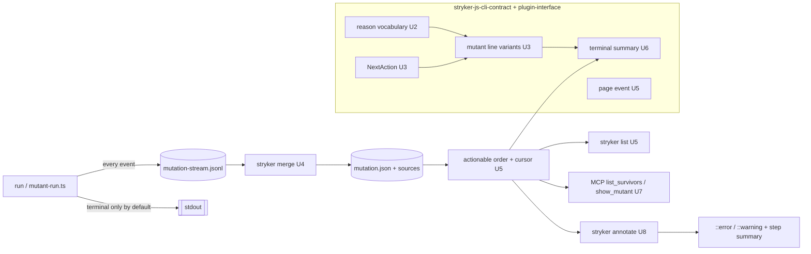
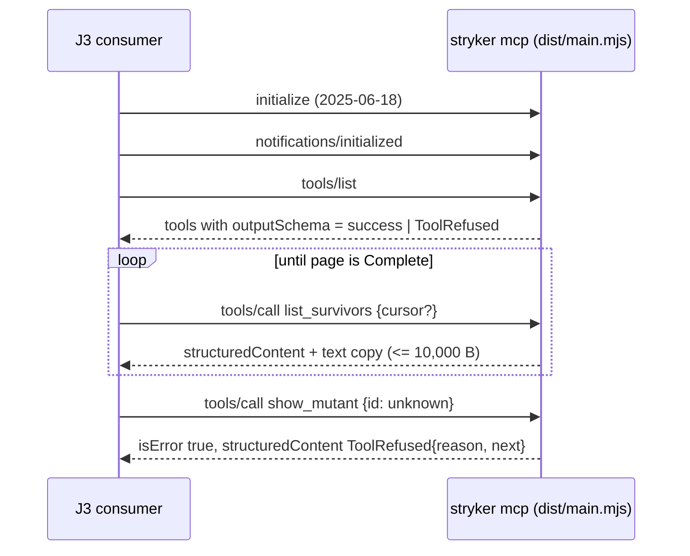

# Agent-Facing Surfaces - Plan

## Goal Capsule

- **Objective:** A coding agent learns what a mutation run, CLI call, MCP call, report, or CI job concluded, why each failure or survivor happened, and what to do next, from documented schema fields alone and inside outputs of at most 10,000 bytes; CI proves this on every change.
- **Means:** extend main's existing contracts with one reason vocabulary and actionable fields, make the terminal event the bounded default output with one paged query behind it, and wire CI jobs to existing annotation and summary mechanisms (KTD2-KTD11).
- **Product authority:** `CONSTITUTION.md` (`CONST-1`), then root `AGENTS.md`, then the supervisor rulings of 2026-10-10 recorded in this Product Contract, then this plan.
- **Stop conditions:** stop and report to the root when a layer would restructure the event spine, edit `repos/**` or another repo, add a third-party dependency, loosen a CI gate, or ship a release; when the version law refuses to judge (stale pin); or when merging up `main` (a re-landed #258 or the spine refactor) changes a field this plan adds.
- **Execution profile:** twelve units shipped as one `gh stack` off `main` (PR table in KTD1); U12 is the top layer and lands after a human-approved release containing U3-U8 (OQ3). Mutation never runs locally; target mutant ids come from main's CI reports.
- **Finishes and ships:** an implementing agent opens each layer with `gh stack submit --auto --open`; the operator merges bottom-up; releases stay with a human.

## Product Contract

### Summary

Main already ships every agent surface this unit names: an NDJSON stream, typed exit codes, an MCP server, JSON, SARIF and HTML reports, and an `annotate` command. This unit makes them agent-complete and bounded: each survivor and failure carries a stable reason code with the facts needed to act on it, every default output fits a 10,000-byte budget with paging to the rest, CI jobs lead with the cause, and CI journeys prove an agent can pick its next action from the schema alone.

### Problem Frame

An agent on main today hits four walls, all measured on the repo's own corpus (artifact `mutation-report-416`, main `1e1de6d05`: 8,626 mutants, 1,035 Survived, 451 NoCoverage, 20 Timeout). The branch base is now `d2f018db4` (#259 and #260 merged up); the corpus figures remain those of `1e1de6d05`.

Outputs exceed every agent client's limit. The terminal `verdict` line carries every actionable mutant: 1,506 entries, about 366 KB on one line. The MCP `list_survivors` result for the surfaced set (509 survivors under the default caps) is 52,702 bytes of compact JSON. Codex truncates tool output at 10,000 bytes by default and drops `structuredContent` when it truncates; Claude Code warns at 10,000 tokens, caps at 25,000, and spills any text result over 50,000 characters to a file.

Facts an agent needs are absent or split. The stream's `mutant` line has location and replacement but no covering tests, no original text, and no reason; `mutant-detail` has covering tests and a reproducer but no file or location, and only for ids an agent already asked about. The merged CI report has no `statusReason` on any of the 8,626 mutants, no `coveredBy` or `killedBy`, and empty file sources. Only plugin-load failures carry a typed reason.

CI failures bury the cause. `gh run view --log-failed` on ci run #925 printed 1,472 lines (157,260 bytes); the first `##[error]` line names the pnpm wrapper command, and the failing test appears at line 1,235. On mutation run #413 `--log-failed` printed 523 lines (59,162 bytes); the cause sits at line 467 and prints as `exit 1 (VerdictFail)` although no score was computed: shard reports were missing. On main that merge failure carries no exit class at all; it falls to the generic failure path, whose code 1 collides with `VerdictFail`. No workflow writes a step summary, and the repo's own annotation renderer runs in no workflow. The check-run annotations agents can read say only `Process completed with exit code 1.`

Docs drift. The root `README.md` stream example still shows `schemaVersion` `1.1` against the contract's `6.0`.

### Existing Surfaces on Main

Every requirement below extends one of these; none rebuilds it.

| Surface             | Contract and version                                                                                                                                                                    | Reasons and next actions today                                                                                                   | Location                                                                                                                                                                                   |
| ------------------- | --------------------------------------------------------------------------------------------------------------------------------------------------------------------------------------- | -------------------------------------------------------------------------------------------------------------------------------- | ------------------------------------------------------------------------------------------------------------------------------------------------------------------------------------------ |
| Run event stream    | `RunEvent` union, 17 kinds, `StreamSchemaVersion` `6.0`; JSON Schema generated and byte-drift-checked; released-baseline version law                                                    | Only `error` carries a typed `reason` (`PluginLoadFailureReason`) and `remediation`; `mutant-detail` carries `reproducer`        | `packages/stryker-js-cli-contract/src/run-event.schema.ts`, `stream-version.schema.ts:3`, `tests/contract-documents.integration.test.ts`, `tests/contract-version-law.integration.test.ts` |
| CLI exit and stderr | Exit 0/1/2/3/4/130 by `ExitClass`; machine mode via `--json`, `STRYKER_MODE`, `AGENT`, `CLAUDECODE`, `CODEX_SANDBOX`; human stderr is free text ending `exit <code> (<class>): <error>` | Class only; no reason code on stderr                                                                                             | `packages/stryker-js/src/reporting/run-failure.ts`, `classify-run-outcome.workflow.ts`, `resolve-output-mode.workflow.ts`, `conclude-run.cell.ts:97-100`                                   |
| MCP server          | stdio, protocol `2025-06-18`; tools `list_survivors`, `show_mutant`, `rerun_mutant`, `report_usefulness`; `outputSchema` and `structuredContent` on success                             | Failures return `isError` text only; no cursor or size bound; `list_survivors` capped only by surfacing (1 per line, 7 per file) | `packages/stryker-js/src/Mcp/mcp-server.cell.ts:208-221`, `mcp-tools.ts`, `mcp-tools.schema.ts`                                                                                            |
| JSON report         | mutation-testing-report-schema `3.9.0`, written `schemaVersion` `1.0`                                                                                                                   | `statusReason` is a free string                                                                                                  | `packages/stryker-js-plugin-interface/src/Report.schema.ts:3`, `scripts/report-contract.ts`                                                                                                |
| SARIF               | 2.1.0, `ruleId` = mutator, `primaryLocationLineHash` = mutant id, 5,000-result cap                                                                                                      | No reason code, no rule `fullDescription` or `help`; truncation not stated in the output                                         | `packages/stryker-js/src/sarif-report.workflow.ts`, `reporter-factories.ts:85`                                                                                                             |
| HTML                | One file with the full report JSON inlined                                                                                                                                              | None                                                                                                                             | `packages/stryker-js-html-reporter/src/write-html-report.cell.ts`                                                                                                                          |
| Annotations         | `stryker annotate`: `::warning` for Survived, `::notice` for NoCoverage, escaped, baseline-aware                                                                                        | Mutator title and description only; unwired in CI                                                                                | `packages/stryker-js/src/render-annotations.workflow.ts`                                                                                                                                   |
| CI workflows        | `ci.yml`, `mutation.yml`, `release.yml`                                                                                                                                                 | No `$GITHUB_STEP_SUMMARY` anywhere; three hand-written workflow commands                                                         | `.github/workflows/ci.yml:62`, `mutation.yml:310,327`                                                                                                                                      |
| Agent docs          | Root `AGENTS.md`; skill `skills/stryker-mutation-testing/SKILL.md`; contract README                                                                                                     | Prose only; README stream sample stale                                                                                           | `README.md:293-300`                                                                                                                                                                        |

### Actors

- A1. Local coding agent (Claude Code, Codex, omp) that runs the CLI in a terminal tool and reads stdout, stderr, and the exit code.
- A2. CI-reading agent that diagnoses a red or green job through `gh run view`, annotations, step summaries, and artifacts.
- A3. MCP client agent that drives the `stryker mcp` server.
- A4. Journey script: a scripted consumer in CI with no LLM call that stands in for A1 and A3.
- A5. Maintainer who approves workflow edits, releases, and supervisor rulings.

### Key Decisions

- KD1. **Extend main's surfaces; build none twice.** Every surface in the table exists; the work is fields, bounds, and wiring. Governs R4-R26.
- KD2. **One reason vocabulary, shared by every surface.** The stream, MCP, SARIF, annotations, and CI summaries name a failure by the same code. There is one vocabulary module, `packages/stryker-js-plugin-interface/src/ignore-rule.schema.ts`, with one export surface (`Mutant.*`); U2 extends it with the codes for the other statuses, `remembered`, run failures, and tool refusals, and builds no second module. Governs R5, R6, R7, R33. (session-settled: root ruling 2026-10-10 on OQ2 — chosen over the mutant-quality workstream authoring the non-`Ignored` codes.)
- KD3. **A reason is a property of a status variant.** Each status carries exactly the reason and next-action fields valid for it, never an optional field whose presence encodes state (pack: schema-laws, tagged-unions-over-state-by-presence.md). Governs R5, R8.
- KD4. **Size the budget to the tightest agent client.** Codex's default tool-output limit is 10,000 bytes, the tightest documented client limit; Claude Code's 10,000-token warning and 50,000-character spill sit above it. Governs R11.
- KD5. **Default machine-mode stdout is a bounded summary; the full per-mutant stream is opt-in.** On the corpus 2,719,417 bytes of mutant lines precede the verdict, and Codex keeps only the first 10,000 bytes, so an agent's default output never reaches the verdict. The default leads with the verdict and causes and fits the budget; per-mutant detail stays reachable through paging and through the stream file the summary names, and a documented opt-in restores the full stream on stdout. Breaking change under R30. Governs R11, R12. (session-settled: user-directed — chosen over keeping per-mutant lines on default stdout: the verdict is unreachable within the tightest client's limit.)
- KD6. **Annotation severity follows the job's result.** On a red job its survivors and failures are `::error` with file and line, highest priority first within GitHub's 10-per-step cap; on a green job survivors are `::warning`. Run failures with no source location are `::error title=<what failed>` naming the step or component. `stryker annotate` gains the error level; no gate-rejected survivor set is invented, since none exists in CI today. Governs R18. (session-settled: user-directed — chosen over `::error` only for gate-rejected survivors: CI has no survivor baseline, so that set is empty.)
- KD7. **An MCP refusal is a structured result.** A domain refusal such as an unknown mutant id belongs on the outcome channel with a reason code, not in error text (pack: cell-architecture, four-channel-contracts.md). Governs R15.
- KD8. **Journeys read only the published contract and assert hand-written expectations.** They decode with the published schema and add no third-party validator; each seeded case carries a hand-written expected reason code and next action, never derived from running the code or reading the schema (`CONST-T10`). Governs R22, R24. (session-settled: user-directed — chosen over a schema-derived oracle: a generated accept-law cannot reject a wrong but well-formed reason.)
- KD9. **The agent guide is generated, not written.** It derives from schema annotations and fails CI on drift, as the committed `contract/*.json` documents already do. Governs R26.
- KD10. **The HTML report stays out of the agent path.** It is audited for size and left unchanged. Governs R1.
- KD11. **Workflow edits are in scope under an open bypass.** Root `AGENTS.md` marks `.github/workflows/` read-only and `CONST-E9` covers CI checks; each PR touching a workflow declares `CONST-W3` naming `CONST-E9` and the case, keeps workflow changes in their own commits, and loosens no existing gate. Governs R16-R21, R32. (session-settled: user-directed — chosen over a maintainer applying agent-drafted edits: the unit contract authorises the edits and the root reviews each workflow diff.)
- KD12. **Build on main; whoever lands second adopts the other's names.** PR #258 (`stryker/mutant-quality-l1-reasons` `695bad677`: the `checker` code and closing `Ignored`'s `statusReason`) closed unmerged; this unit does not stack on it. If #258 re-lands first, U2 adopts its names and merges `main` up; if U2 lands first, it carries `checker` under that name and a re-landed #258 adopts U2's. If both bump the stream, they share one unreleased `7.0`, because the version law compares against the released alias. Governs R8, R30. (session-settled: root ruling 2026-10-10.)
- KD13. **SARIF upload to code scanning is out of scope.** SARIF is audited; rule help, `fullDescription`, and an explicit truncation note ship in U8 only when the U1 audit row records their cost and a reader that consumes them; otherwise they move to Scope Boundaries as considered and not built. Governs R1. (session-settled: user-directed — chosen over uploading: not in Done and needs `security-events: write`.)

### Requirements

**Audit**

- R1. An audit document under `docs/` holds one row per surface in the Existing Surfaces table, recording from main's code: schema and version, whether every failure and survivor carries a stable reason code and a concrete next action, output size on the repo's own corpus against the R11 budget, and each fact reachable only by reading prose.
- R2. Each audit row cites `path:line` for its claims and names the corpus artifact and run id each size comes from.
- R3. The audit's gap column maps each gap to the requirement that closes it, or records it as out of scope.

**Reason codes and actionable fields**

- R4. Every survivor (`Survived`, `NoCoverage`) and every failure event an agent acts on (`Timeout`, `RuntimeError`, and run-level failures) carries, on its stream event, in the merged report, and on the drill-down: file, start and end line and column, original text, replacement text, mutator, the covering tests (`coveredBy`) where coverage was measured, and what kills it or why it cannot be killed. `Killed` lines carry a reason code and the killing tests (`killedBy`); `CompileError` and `Ignored` lines carry a reason code only. Field names follow mutation-testing-report-schema, so the stream, the drill-down, and the report use one vocabulary.
- R5. Each of those outcomes carries a stable reason code from a closed vocabulary that states why the mutant has its status, held by the outcome's status variant rather than an optional field.
- R6. Each carries a concrete next action: for a killable mutant, what would kill it (the covering tests to strengthen, or the uncovered location to test) and the command that reproduces it; for one that cannot or need not be killed, why.
- R7. Every run-level failure (`error` event, nonzero exit) carries a reason code and a remediation, and its exit class and code name its cause; a merge with missing shard reports is never reported as `VerdictFail`.
- R8. The reason vocabulary and actionable fields are declared in the stryker-js-cli-contract schema, appear in its generated JSON Schema, and change only under the existing version law with a changeset and a migration note.
- R9. The merged report produced by `stryker merge` keeps the reason on every mutant, the R4 fields on survivors and failures, and file sources read from the checkout at merge time, so CI-produced reports carry the same facts as local ones.
- R10. In human mode, the final stderr line of a failed run names the exit class, the reason code, and the command that prints the machine summary.

**Bounded output**

- R11. An agent's default machine-mode output (stdout and stderr together) is at most 10,000 bytes on the repo's corpus. It leads with the verdict and its causes, then holds the exit class, counts by status and by reason code, the highest-priority actionable items, the stream file path, the paging command, and a cursor to the rest. A cursor is emitted only by an unsharded run that owns the report it names; a shard run's summary instead carries that shard's own counts and names the merged report artifact and the post-merge `stryker list --report <path>` command.
- R12. The terminal stream event is that summary, and per-mutant lines leave default stdout; the full per-mutant stream stays in the stream file on every run and on stdout behind a documented opt-in.
- R13. One paged query over a finished run returns actionable items in a stable order with a cursor, through both a CLI command and an MCP tool, and filters by status, reason code, and file; the active filter is part of the cursor, so a filtered cursor cannot be replayed against another listing. Each CLI page is at most 8,000 bytes of stdout, leaving R11's stderr headroom.
- R14. Every MCP tool result fits the R11 budget counting both its `structuredContent` and the serialized-JSON text block the spec recommends; `list_survivors` pages instead of returning the whole surfaced set, and `show_mutant` returns at most three covering-test names plus the total, leaving the full list in the stream file's `mutant-detail`.
- R15. MCP tool failures return `isError` with a typed reason code and next action in structured output that conforms to the tool's declared schema.

**CI legibility**

- R16. Every job in `ci.yml`, `mutation.yml`, and `release.yml` writes a structured `$GITHUB_STEP_SUMMARY`: outcome, cause, file and line when known, counts, and the name of the artifact holding raw logs and reports. `release.yml`'s summary is written by a job in this repo that runs after the reusable-workflow call with `if: always()`; the other repo is not edited.
- R17. Each step summary fits the R11 budget; overflow goes to the named artifact.
- R18. When a job goes red, its survivors and failures surface as `::error` annotations with `file` and `line` (column span when known), highest priority first within GitHub's 10-per-step cap; on a green job survivors surface as `::warning`. Run failures with no source location surface as `::error title=<what failed>` naming the step or component. The step summary states how many were omitted, counted as the actionable set minus the annotations the run actually emitted, and names the artifact holding the rest.
- R19. A red job's first `##[error]` line states what failed and where (test, mutant, or step and file) and appears within the first 20 lines of the failing step's log. `gh run view --log-failed` is measured on the dispatch proof run against the #925 and #413 baselines. Where `gh` still reports `UNKNOWN STEP` for this repo's jobs, the dispatch evidence records that the whole-job line count is unchanged and names the step summary as the supported entry point.
- R20. Raw logs and full reports upload as artifacts whose names appear in the summary.
- R21. The CI changes are proven by `workflow_dispatch` runs on the PR branch, scoped to a small slice. Mutation triggers stay as they are and `mutation.yml` gains no `pull_request` trigger. These steps run only on `refs/heads/main`, so a branch dispatch cannot touch shared state: `mutation.yml`'s build-cache save, incremental-cache save, budget-baseline upload, and shard-artifact deletion, and `ci.yml`'s turbo cache save.

**Agent journeys**

- R22. CI runs scripted journeys against the built, packed CLI and the real MCP server with no mocks of this repo's surfaces; each journey decodes the stream and MCP output with the published contract only.
- R23. Journeys cover one seeded survivor and one seeded failure on each of the CLI stream and MCP, and each selects its next action from reason code and fields alone.
- R24. Each seeded case carries a hand-written expected reason code and next action; a journey fails when a required field or reason code is missing, or when its selected action or decoded code differs from that expectation.
- R25. Each journey can fail on a plausible regression, proven by negative cases in the same suite: the journey's consumer is fed its own run's captured real output with exactly one required field or reason code removed or renamed, and must fail with a message naming that field or code. The cases are generated from the consumer's own required-field list, run in CI like any other test, and are cited in the PR body by test name and CI run URL. No case edits source or plants a bug.

**Agent docs**

- R26. A concise agent-facing guide lists the event kinds, reason codes, next actions, budgets, and paging, generated from the contract schema and drift-checked in CI.
- R27. Root `AGENTS.md` and `skills/stryker-mutation-testing/SKILL.md` point to the guide instead of restating it.
- R28. The root `README.md` stream example is generated or checked against the current contract so its `schemaVersion` cannot drift.

**Delivery**

- R29. The work ships as a `gh stack` off `main`, one reviewable concern per layer, each layer green and inert until a higher layer wires it in.
- R30. Breaking contract changes ship under `BREAK-1`: a changeset bumping major (minor while 0.x) with a migration note. The stream major is `7.0`, one unreleased bump shared with any re-landed #258.
- R31. No new third-party dependency and no cloud credentials; any dependency is proposed for approval, never added.
- R32. Every PR that touches a workflow carries a `CONST-W3` declaration in its body naming `CONST-E9` and the case, keeps workflow changes in their own commits, and removes or weakens no threshold, baseline, budget, or check.
- R33. Every status variant in the schema carries the reason field, and every code it holds comes from the one vocabulary (KD2).

### Key Flows

- F1. Local agent loop
  - **Trigger:** A1 runs `stryker run --json` (or runs under `AGENT`/`CLAUDECODE`).
  - **Steps:** reads the terminal summary; picks the top actionable item by reason code; pages for more if needed; reruns one mutant by the reproducer command; acts on the next action.
  - **Outcome:** the agent changed a test or config without opening the report or HTML.
  - **Covered by:** R4-R6, R11-R13.
- F2. Red CI job
  - **Trigger:** a CI job fails on a PR or on `main`.
  - **Steps:** A2 reads the job summary or the first `##[error]` line; reads the annotation at `file:line`; downloads the named artifact only if the summary is not enough.
  - **Outcome:** the cause and location are known from the first screen.
  - **Covered by:** R16-R20.
- F3. MCP loop
  - **Trigger:** A3 connects to `stryker mcp`.
  - **Steps:** pages `list_survivors`; calls `show_mutant`; on a refusal reads the reason code; calls `rerun_mutant`; records usefulness.
  - **Outcome:** every result fits the budget and every refusal is machine-readable.
  - **Covered by:** R13-R15.
- F4. Journey in CI
  - **Trigger:** a PR's CI.
  - **Steps:** A4 runs the packed CLI on a seeded fixture, decodes outputs with the published contract, selects the next action, and asserts it.
  - **Outcome:** a missing field or code fails the job.
  - **Covered by:** R22-R25.

### Acceptance Examples

- AE1. **Covers R4-R6.** Given a seeded `Survived` mutant whose covering test lacks an assertion, when the run ends, then its stream line and merged-report entry name the covering test, the original and replacement text, a reason code meaning "covered, no test failed", and a reproducer command.
- AE2. **Covers R5, R6.** Given a seeded `NoCoverage` mutant, then its reason code means "no test executes this location" and its next action names the uncovered file and line.
- AE3. **Covers R7.** Given a merge where one shard report is missing, then the `error` event and exit class name missing shard reports, not `VerdictFail`.
- AE4. **Covers R11-R13.** Given the repo's corpus (1,506 actionable mutants), when an agent runs the CLI unsharded in default machine mode, then its whole output is at most 10,000 bytes, begins with the verdict and its causes, and holds counts, a first page, the stream file path, and a cursor; the paging command's pages together list all 1,506. Given a shard run, its summary carries that shard's counts, the merged report artifact name, and the `stryker list --report <path>` command, and no cursor.
- AE5. **Covers R15.** Given `show_mutant` with an id the report does not list, then the result carries a reason code in structured output, and `isError` follows the spec.
- AE6. **Covers R18.** Given a red mutation job whose report has 509 surfaced survivors, then 10 `::error` annotations appear, highest priority first, each with `file` and `line`, and the step summary states that 499 were omitted and names the artifact holding them; given the same report on a green job, the annotations are `::warning`.
- AE8. **Covers R18.** Given a red job whose merge failed on missing shard reports, then an `::error title=...` annotation names the merge step and the missing shards, with no `file`.
- AE7. **Covers R24, R25.** Given the survivor journey's captured `stryker list` page with `statusReason` removed from the survivor item, then the consumer fails with a message naming `statusReason`; with its code renamed to one the vocabulary lacks, the message names the unknown code.

### Success Criteria

- Budgets stated in each PR body beside the budget: U5, U6, and U7 state the bytes measured from the PR's own built CLI on the CI journey fixture (real `7.0` output), not a model. The corpus figures in Budgets on the corpus are labelled as a model, and U12 re-measures summary, page, and MCP-result bytes on the first `main` mutation report that carries `7.0` fields.
- `gh run view --log-failed` on the dispatch proof run reports its byte and line counts beside the 157,260-byte (#925) and 59,162-byte (#413) baselines, and its first `##[error]` line names the cause within the first 20 lines of the failing step (R19).
- Each journey is green in CI with every one of its generated negative cases passing; the PR cites the case names and the CI run URL.

### Scope Boundaries

- Restructuring the event spine (`run-event-stream.service.ts`, `reporter-stream.service.ts`) or moving packages: owned elsewhere. Fields land on main's current schema and emit sites; a field that must land where the spine moves code is added in the schema and flagged to the sub-conductor (OQ1, closed).
- Ignorer plugins' own reason codes (e.g. #259's `effect-schema-declarations/<code>`): owned by each ignorer package; this unit neither enumerates nor duplicates them (KTD2).
- The phase-share bench.
- Uploading SARIF to GitHub code scanning (needs `security-events: write`).
- Editing `systemfsoftware/pnpm-release-management`; `release.yml` gets a summary job on this side only.
- Changing the HTML report, prose-only docs without schema checks (other than the `STRATEGY.md:18` positioning sentence U11 rewords), tests that re-read a schema to find fields just added, assertions on human-pretty output, and LLM-judged evals.
- SARIF rule `fullDescription`/`help` and the truncation note, unless the U1 audit row justifies them (KD13).
- Changing when mutation runs, or adding a `pull_request` trigger to `mutation.yml`.

<!-- ce-section: work-relationships -->

### How This Work Fits Together

This plan covers agent-facing surfaces. The breakdown below is the current understanding, not a committed roadmap.

- Mutant-quality reasons (#258, closed unmerged): if it re-lands, it **Shares** the stream `mutant` line, its `statusReason`, the vocabulary module, and the unreleased `7.0`; whoever lands second adopts the other's names (KD12).
- Event spine refactor: this plan builds against main's current code and merges `main` up as the refactor lands; it does not restructure the spine. A field that must land where the refactor moves code is added in the schema and flagged (OQ1, closed).
- Phase-share bench: **Can proceed independently of** this plan.

### Dependencies / Assumptions

Premises this plan rests on, each with its source. Verified means read in code or measured in this session; unverified means inferred.

- Verified: main ships the stream, exit codes, MCP server, JSON, SARIF, HTML, and `annotate` surfaces listed above (code reads; grounding files).
- Verified: no workflow or script writes `$GITHUB_STEP_SUMMARY`, and no workflow runs `stryker annotate` (grep of `.github/`, scripts).
- Verified: root `AGENTS.md` marks `.github/workflows/` read-only for agents; R16-R21 need edits there, authorised by the unit contract under a `CONST-W3` declaration (KD11).
- Verified: `mutation.yml` triggers on push to `main` (with `paths-ignore`), on `workflow_dispatch` with input `full`, and on a daily schedule; the brief's "only on push to main" is narrower than the workflow (`mutation.yml:3-17`). The CLI refuses mutation outside GitHub Actions unless the run is dry-run only or carries an explicit local opt-in (`refuse-local-mutation.workflow.ts:40-48`).
- Verified: corpus sizes and log sizes in the Problem Frame (artifact `mutation-report-416`, run 37960922409; `--log-failed` on runs 37953877772 and 37942966476).
- Verified: `stryker merge` rebuilds files from the stream and keeps only id, mutator, status, location, and replacement, with empty source (`packages/stryker-js/src/report-from-stream.workflow.ts`, `shard/shard-merge.ts`); the corpus report confirms it.
- Verified: omp sets `AGENT` and `CLAUDECODE`, so omp gets machine mode by default.
- Verified (primary sources): MCP `2025-06-18` tools spec (`outputSchema`, `structuredContent` with a text mirror, `isError`); GitHub annotation cap of 10 errors and 10 warnings per step; step summary cap of 1 MiB per step and 20 shown per job; SARIF limits of 25,000 results per run with 5,000 displayed and 10 MB gzipped; mutation-testing-report-schema `3.9.0` status enum and free-string `statusReason`; Claude Code MCP limits; Codex 10,000-byte default.
- Unverified: whether GitHub's `gh` step association can be restored for this repo's jobs; on #925 every line was `UNKNOWN STEP`, so `--log-failed` printed the whole job, including about 830 setup lines before the test step.
- Unverified: whether a job-level cap of 50 annotations applies; GitHub documents 50 per Checks API request. R18's omitted count is defined against annotations actually emitted, so a lower cap shows as a larger omitted count, not a wrong one.
- Unverified: whether GitHub ingests SARIF rules lacking `fullDescription` and `help`.
- Unverified: the size of covering-test lists per survivor on the corpus; the merged report records none today.
- Verified: no ruleset requires a status check on `main` (ruleset `23172737` holds deletion, non-fast-forward, and pull-request rules only); the classic branch-protection API returns 403 for this token. The merge gate is the root's all-green verdict on the exact head, so journeys in CI gate through that verdict.

### Outstanding Questions

**Resolved by supervisor ruling (2026-10-10)**

- Q1. Workflow edits are in scope under a `CONST-W3` declaration naming `CONST-E9` (KD11, R32).
- Q3. Build on main; merge main up; whoever lands second adopts the other's names (KD12).
- Q6. Annotation severity follows the job's result (KD6, R18).
- Q7. SARIF upload is out of scope (KD13).
- Q12. One stream major, `7.0`, shared with any re-landed #258 (R30).
- Q13. `release.yml`'s summary is written by a job in this repo after the reusable call (R16).
- Q2 (OQ2). One vocabulary: U2 extends `ignore-rule.schema.ts` (KD2, KTD2).
- Q14 (OQ3). U12 waits on a release that ships U3-U8 and moves the `stryker-published` pin; changesets cut it when U3-U8 merge, and nothing else waits on it.

**Resolved in planning**

- Q4. Field names, vocabulary members, summary shape, ranking order, filters, and cursor encoding: KTD2-KTD7.
- Q5. Stream lines, `mutant-detail`, and the report carry the full `coveredBy` and `killedBy` lists; summary items, pages, next actions, and `show_mutant` carry three names plus the total: KTD3, KTD4.
- Q8. Closed with OQ1: build against main, merge main up, flag fields that land in moving code.
- Q9. Guarded steps: KTD12, R21.
- Q10. All three journeys run in the `test/e2e` lane on the packed CLI (J3 needs a stdin-capable harness exec, U10); integration-lane tests run in-process and spawn nothing; AE3 is proven by U4's in-process merge tests: KTD10, KTD16.
- Q11. Measured on the U9 dispatch proof run; the leading-cause requirement is judged there.

### Sources / Research

- Measurements: corpus artifact `mutation-report-416` (run 37960922409, main `1e1de6d05`); `gh run view --log-failed` on runs 37953877772 (ci #925) and 37942966476 (mutation #413).
- Repo history: `docs/solutions/workflow-issues/mutation-lane-green-while-every-job-failed.md`, `shared-deno-import-map-feeds-the-e2e-trace-scripts.md` ("Read the failing step, not the job colour."), `exit-codes-through-runtime-teardown.md`; PR #193 (human-mode failure printed nothing), PR #256 (cause found only by reading run 37942966476's log), PR #133 (agent surfaces shipped; workflow edits deferred to a human); `docs/plans/2026-09-29-0427-feat-state-of-the-art-mutation-testing-plan.md` (agent loop success criterion).
- MCP: https://modelcontextprotocol.io/specification/2025-06-18/server/tools, https://modelcontextprotocol.io/specification/2025-11-25/server/tools; client limits: https://code.claude.com/docs/en/mcp, https://raw.githubusercontent.com/openai/codex/main/codex-rs/protocol/src/openai_models.rs.
- SARIF: https://docs.oasis-open.org/sarif/sarif/v2.1.0/errata01/os/sarif-v2.1.0-errata01-os-complete.html, https://docs.github.com/en/code-security/reference/code-scanning/sarif-files/sarif-support.
- GitHub Actions: https://docs.github.com/en/actions/reference/workflows-and-actions/workflow-commands, https://docs.github.com/en/rest/checks/runs, https://cli.github.com/manual/gh_run_view.
- Report schema: https://github.com/stryker-mutator/mutation-testing-elements/blob/master/packages/report-schema/src/mutation-testing-report-schema.json.
- Packs applied: schema-laws (tagged-unions-over-state-by-presence.md for KD3; refusals-beside-generated-laws.md and invariants-as-refinements.md for the reason vocabulary; rich-type-over-foreign-encoded.md for SARIF and the report schema; tests-own-no-schemas.md for journeys); cell-architecture (four-channel-contracts.md for KD7; decode-never-cast.md for journey decoding; pure-decision-workflows.md for next-action selection); boundary-testing (no-mocks-on-internal-glue.md and real-system-oracles.md for R22; staged-protocol-evidence.md for the MCP initialize-list-call sequence); package-topology (surface-changes-are-versioned.md for R30; one-access-path.md for the shared vocabulary; declared-entry-points.md if the guide ships as a package subpath). Not applied: store and unit-of-work rules, builder and handle rules, scoped lifecycle, condition-branch agreement.

---

## Planning Contract

### Key Technical Decisions

- KTD1. **One stack, CI legibility first, the vocabulary below every consumer.** Layer order and bases:

  | PR | Unit | Base                                        | Concern                                                             |
  | -- | ---- | ------------------------------------------- | ------------------------------------------------------------------- |
  | 1  | U1   | `main`                                      | audit doc and this plan                                             |
  | 2  | U9   | PR 1                                        | CI wiring that needs no new CLI code                                |
  | 3  | U2   | PR 2                                        | reason vocabulary: extend `ignore-rule.schema.ts`                   |
  | 4  | U3   | PR 3                                        | stream `7.0`: per-status mutant lines, next actions, drill-down     |
  | 5  | U4   | PR 4                                        | merge keeps facts; merge failures classified                        |
  | 6  | U5   | PR 5                                        | one order, cursor, `stryker list`                                   |
  | 7  | U6   | PR 6                                        | summary-first default output; run-failure reasons                   |
  | 8  | U7   | PR 7                                        | MCP paging, drill-down, structured refusals                         |
  | 9  | U8   | PR 8                                        | `stryker annotate` levels, limit, overflow, failure annotations     |
  | 10 | U11  | PR 9                                        | generated agent guide, doc pointers, README check, `STRATEGY.md:18` |
  | 11 | U10  | PR 10                                       | agent journeys and their generated negative cases                   |
  | 12 | U12  | PR 11 (top of stack), after the OQ3 release | `mutation.yml` adopts U3-U8 after a release moves the dogfood pin   |

  Every layer is green on its own; U2-U8 add code no workflow calls until U10 and U12 wire it. Only U3+ depend on the vocabulary. Governs R29, R33.

- KTD2. **One vocabulary: U2 extends `packages/stryker-js-plugin-interface/src/ignore-rule.schema.ts`, exported through `Mutant.*` only.** The file already holds `RULE_IDS` (12 codes) and the `<code>: <detail>` grammar (`IgnoreStatusReasonText`, `IgnoreStatusReason`; `ignore-rule.schema.ts:6-59` at `d2f018db4`). U2 adds the remaining closed codes in that same file, not in a second module, and every status gets the same grammar decoded to `{ code, detail }`, so `statusReason` is one field with one grammar. A result inherited from the incremental report carries `remembered: <detail>`, whose detail names the prior run's code when it had one, instead of today's bare `Remembered` placeholder (`run/incremental-reuse.cell.ts:421,446`). `mutation-runs-on-main-ci` moves into the vocabulary; U5 removes the contract's own `RefusalRule` literal (`run-event.schema.ts:331`) and reads the code from `Mutant.*` (the contract already imports `Mutant`, `:1`). Each code's meaning is its schema annotation.

  **How #259's codes relate.** Naming follows main's convention: lowercase kebab-case, a colon-and-space separator, no prefix on first-party codes. Plugin-owned codes, such as #259's `REASON_CODES` in `packages/ignorers/effect-schema-declarations/src/effect-schema-declarations.ts:13-40`, are a second level inside the first-party `ignorer` code: `plan-mutants.workflow.ts:153` writes `ignorer: <plugin reason>`, so such a mutant reads `ignorer: effect-schema-declarations/tagged-tag: <text>`. The vocabulary closes the first level and leaves the second open, because any third-party ignorer may add codes. A `/` never appears in a first-party code, which U2's refusal tests enforce, so the two levels cannot collide. The U11 guide documents that an `ignorer` detail begins with `<plugin>/<code>: <text>`. #259's codes are neither copied nor re-declared.

  On main, kept as is (`RULE_IDS`):

  | Status    | Codes                                                                                                                                                                                                                        |
  | --------- | ---------------------------------------------------------------------------------------------------------------------------------------------------------------------------------------------------------------------------- |
  | `Ignored` | `arid-logging`, `arid-telemetry`, `arid-time`, `arid-config-default`, `arid-memoization`, `redundant-relational`, `equivalent-to-original`, `duplicate-at-site`, `ignore-static`, `directive`, `excluded-mutator`, `ignorer` |

  Added by U2 to the same file (`checker` under #258's name; whoever lands second adopts the other's names, KD12):

  | Scope                                 | Codes                                                                                                                                                                                                                                                                                                             |
  | ------------------------------------- | ----------------------------------------------------------------------------------------------------------------------------------------------------------------------------------------------------------------------------------------------------------------------------------------------------------------- |
  | `Ignored`                             | `checker` (a checker removed the mutant before any test ran)                                                                                                                                                                                                                                                      |
  | `Survived`                            | `covered-not-killed` (covering tests ran, none failed), `coverage-not-measured` (coverage analysis off)                                                                                                                                                                                                           |
  | `NoCoverage`                          | `not-covered`                                                                                                                                                                                                                                                                                                     |
  | `Timeout`                             | `timed-out` (detail keeps today's wall-clock or hit-limit text, so the timeout-kind matchers still match on it)                                                                                                                                                                                                   |
  | `RuntimeError`                        | `runtime-error`                                                                                                                                                                                                                                                                                                   |
  | `CompileError`                        | `compile-error`                                                                                                                                                                                                                                                                                                   |
  | `Killed`                              | `killed`                                                                                                                                                                                                                                                                                                          |
  | any status inherited from a prior run | `remembered`                                                                                                                                                                                                                                                                                                      |
  | run failures                          | `initial-test-run-failed`, `config-invalid`, `plugin-load-failed` (detail stays `PluginLoadFailureReason`), `shard-reports-missing`, `shard-reports-overlap`, `score-below-break`, `new-survivors`, `budget-exceeded`, `mutation-runs-on-main-ci` (the existing `RefusalRule` literal, `run-event.schema.ts:331`) |
  | tool refusals                         | `report-missing`, `report-unreadable`, `unknown-mutant-id`, `cursor-stale`, `rerun-refused`                                                                                                                                                                                                                       |

  (pack: package-topology, one-access-path.md; pack: schema-laws, invariants-as-refinements.md; pack: schema-laws, refusals-beside-generated-laws.md) Governs R5, R7, R8, R33. (session-settled: root ruling 2026-10-10 on OQ2 — chosen over a second vocabulary or the mutant-quality workstream authoring these codes; inherits KD2.)

- KTD3. **The stream `mutant` line becomes a union discriminated by `status`, each variant carrying only its fields, named as in mutation-testing-report-schema.** All variants: `id`, `fileName`, `location` (start and end), `mutator`, `replacement`, `status`, `statusReason`, `static`, `cost`. `Survived`, `Timeout`, `RuntimeError` add `original`, `coveredBy`, `next`; `NoCoverage` adds `original` and `next`; `Killed` adds `killedBy`; `CompileError` and `Ignored` add nothing. `coveredBy` and `killedBy` carry the full test-id lists, so `stryker merge` copies them straight into the report and an agent learns one vocabulary. Fixed structs only, never a `Report.*` rest record (`docs/solutions/test-failures/stream-schema-must-not-carry-json-rest-records.md`). `mutant-detail` (`run-event.schema.ts:300`) gains the same fields. (pack: schema-laws, tagged-unions-over-state-by-presence.md) Governs R4, R5, R6, R8, R9.

- KTD4. **Next action is a closed tagged union in `packages/stryker-js-cli-contract/src/next-action.schema.ts`, exported as `RunEvent.NextAction`.** Members: `strengthen-tests` (`tests: { total, shown }`, `reproduce`), `add-test` (`file`, `line`, `column`), `none-needed` (`why`: Timeout counts as detected; RuntimeError is excluded from the score), `fix-failing-test` (`tests`), `fix-config` (`remediation`), `rerun-shards` (`shards`), `run-mutation` (`command`), `list-survivors` (`command`), `restart-paging` (`command`). `shown` holds at most three test names and `total` the full count; the same three-plus-total cap applies to summary items, pages, and `show_mutant`, while stream lines, `mutant-detail`, and the report carry the full `coveredBy` (Q5). `reproduce` reuses the `stryker run --mutant <id>` string (`build-reproducers.workflow.ts:98`). Governs R6, R7, R15.

- KTD5. **The summary is the terminal event, reshaped; no new surface.** `verdict` (`run-event.schema.ts:223`) drops the unbounded `mutants` array and leads with: `exit { class, code }`, `causes` (at most five, each `reason`, `detail`, `next`), `counts { byStatus, byReason }`, `top` (actionable items packed to the cap), `page`, `reportFile`, `streamFile`, then the existing fields. `page` is `Complete`, `More { total, cursor, command }`, or `Sharded { actionable, mergedReportArtifact, command }`: a cursor appears only in an unsharded run that owns the report it names, and a shard run names the merged report artifact and the post-merge `stryker list --report <path>` command instead. `error` carries `reason` and `next` the same way; `refused` gains them in U5 with the `page` event. A pure builder caps the encoded summary at 8,000 bytes, leaving 2,000 bytes of the R11 budget for stderr. Governs R11, R12. (session-settled: user-directed — chosen over keeping per-mutant lines on default stdout: inherits KD5.)

- KTD6. **Default machine stdout is the terminal line only; `--stream full` restores every event.** The stream file (`reports/mutation-stream.jsonl`, `run-event-stream.service.ts:105`) receives every event in every mode. Human mode is unchanged except R10's final line.

  | Mode                                                   | Default stdout                 | `--stream full` stdout | stderr                                                                                     |
  | ------------------------------------------------------ | ------------------------------ | ---------------------- | ------------------------------------------------------------------------------------------ |
  | machine (`--json`, `STRYKER_MODE`, `AGENT`, tool vars) | terminal event only            | every event            | logger lines; nothing structured                                                           |
  | human                                                  | nothing (projection on stderr) | every event            | projection plus `exit <code> (<class>) <reason>: <error>; run with --json for the summary` |

  Breaking under R30. Existing e2e tests that decode stdout as a full stream pass `--stream full` or read the stream file. Governs R12.

- KTD7. **One pure order, one filter, one cursor, byte-packed pages.** Order: status rank (`Survived`, `NoCoverage`, `Timeout`, `RuntimeError`), then file, line, column, id. Filters: `status`, `reason`, `file` (CLI `--status`, `--reason`, `--file`; `list_survivors` parameters of the same names). Cursor: base64url of `<first 12 hex of sha-256 over the report bytes and the canonical filter>:<offset>`; a digest mismatch, including a cursor replayed under a different filter, is the `cursor-stale` refusal. Pages pack whole items until the next would cross the cap: 8,000 bytes of stdout for a CLI page (R11's stderr headroom), 4,800 bytes of structured content for an MCP result so both blocks stay under 10,000. The same workflow feeds summary `top`, `stryker list`, `list_survivors`, and annotation priority. (pack: cell-architecture, pure-decision-workflows.md) Governs R13, R14, R18.

- KTD8. **Paging reads the finished report, so merge must keep the facts first.** In CI only `reports/mutation/*` is uploaded (`mutation.yml:298-303`) and shard streams are deleted, so `stryker list` and MCP read `mutation.json`; U4 lands before U5. Governs R9, R13.

- KTD9. **MCP tools register through `McpServer.addTool`, not `registerToolkit`.** `registerToolkit` writes `structuredContent: result.isFailure ? undefined : …` (`node_modules/.pnpm/effect@4.0.0/node_modules/effect/src/ai/McpServer.ts:1922-1926`) and replaces a declared `Error` failure with its message text (`:1854-1858`). The service's `addTool` handler returns a `CallToolResult` directly (`:212-224`). Each tool declares `outputSchema` as the JSON Schema of `Union(success, ToolRefused)` (`Tool.getJsonSchemaFromSchema`, `Tool.ts:1786`), returns `isError: true` with `structuredContent` on `ToolRefused`, and mirrors it as serialized JSON text. Vendored Effect stays untouched. (pack: cell-architecture, four-channel-contracts.md) Governs R14, R15.

- KTD10. **Journeys run in the e2e lane, the only lane that spawns the CLI.** J1 (CLI survivor), J2 (CLI failure), and J3 (MCP survivor and MCP failure) run in `test/e2e` on the packed CLI with the real vitest runner, because only there do survivors carry measured covering tests (`calc-fixture`, `failing-fixture`) and only there is the packed-install closure, the stdio process boundary, and the classed exit code observed. Three journeys stay within the e2e cap of four. J3 needs stdin, which `Warm.exec` does not pass today (`test/e2e/src/Harness/stryker-cli-runner.service.ts:63`), so U10 extends the harness with a stdin-piped exec. AE3 is proven by U4's in-process merge tests, not by a journey. Each journey's consumer is a pure selector that decodes with the published contract only and is checked against hand-written expectations. (pack: boundary-testing, real-system-oracles.md; pack: boundary-testing, no-mocks-on-internal-glue.md; pack: schema-laws, tests-own-no-schemas.md) Governs R22-R25. (session-settled: user-directed — chosen over a schema-derived oracle: inherits KD8.)

- KTD16. **Test layers follow the cell, and only journeys spawn.** Schema files get codec laws and refusal cases beside them; `*.workflow.ts` decisions (`nextActionOf`, order, filter and packing, summary builder, annotation rendering, merge classification, outcome classification) get property tests only; shells and cells are proven by in-process composition tests in `packages/stryker-js/tests` that run `Engine.mutationTestCell` under `Engine.RunEnvironment.stage` with the node platform layer (the pattern of `tests/incremental-reuse.integration.test.ts:116-124`), or call the `McpServer` service's `callTool` (`McpServer.ts:222`) with the KTD9 tools added; no new integration test spawns `dist/main.mjs`. Existing spawning suites (`tests/shard-merge.integration.test.ts`, `tests/mcp-server.integration.test.ts`) are not extended. Governs every unit's test scenarios.

- KTD11. **CI legibility starts with tools already installed.** Turbo filters the environment, so `test` and `test:e2e` get `GITHUB_ACTIONS`, `GITHUB_STEP_SUMMARY`, `GITHUB_REPOSITORY`, `GITHUB_SHA`, and `GITHUB_WORKSPACE` in `passThroughEnv`. Vitest then adds its `github-actions` reporter (default when `GITHUB_ACTIONS === 'true'`, vitest 5.0.1 `dist/chunks/defaults.D2ip7f-X.js:67`), which prints `::error file=,line=` per failing test and appends a job summary (`dist/chunks/index.DzobfTyw.js:17535-17546`). Today ci #925's check run holds only `Process completed with exit code 1.` and the turbo wrapper line. A Deno script (`scripts/ci-job-summary.ts`, beside `scripts/mutation-backstop.ts`) writes each job's summary header; gating steps tee to `ci-logs/` and upload it. Governs R16-R20.

- KTD12. **Branch dispatches cannot touch shared state.** `mutation.yml` build-cache save (`:143-149`), incremental-cache save (`:317-321`), budget-baseline upload (`:335-341`), and shard-artifact deletion (`:344-352`) gain `github.ref == 'refs/heads/main'`. `ci.yml`'s combined `actions/cache` (`:37-41`) splits into a restore and a main-only save; PR runs stop saving their own turbo cache and keep restoring `main`'s (closes OQ5). `workflow_dispatch` gains `projects` and `max-shards` inputs so a proof run mutates one small project. Governs R21. (session-settled: user-directed — chosen over unguarded dispatch: supervisor ruling, dispatch proof.)

- KTD13. **`mutation.yml` runs the released CLI, so it adopts new CLI behaviour only after a release.** `PUBLISHED_CLI` (`mutation.yml:30`) resolves to the tarball of the `stryker-published` pin (`27b10759`, v18.1.0); retargeting it is forbidden (root `AGENTS.md` Dogfood). U9 wires what v18.1.0 already has (`annotate` warning/notice, `--json` error events); U12 adopts the new fields, levels, and summary after a human-approved release containing U3-U8 moves the pin (OQ3). Governs R16-R21.

- KTD14. **One unreleased stream major and changeset-borne migration notes.** `StreamSchemaVersion` goes `6.0` to `7.0` once, shared with any re-landed #258; `stryker-js-cli-contract` bumps minor (0.x), `stryker-js-plugin-interface` minor for added vocabulary, `stryker-js` major (default stdout, `verdict` reshape, MCP output schemas). Each changeset body carries its migration note. (pack: package-topology, surface-changes-are-versioned.md) Governs R8, R30. (session-settled: user-directed — chosen over a second major: version law compares against the released alias, `tests/contract-version-law.integration.test.ts:34,119-127`; inherits KD12.)

- KTD15. **The agent guide is a generated contract document.** `agentGuideSource()` joins `streamDocumentSource()` in `packages/stryker-js-cli-contract/scripts/contract-documents.ts`, `generate-contract.ts` writes `contract/agent-guide.md`, and `tests/contract-documents.integration.test.ts` byte-compares it. It lives outside the paths turbo's `test` inputs exclude (`turbo.json:61-64`; `test` hashes `NODE_ENV`, `CI`, `AGENT` only, `:74-78`). The README stream sample is checked by decoding each line through `RunEventWireLine`, with the root `README.md` added to that test's inputs. Governs R26-R28. (session-settled: user-directed — chosen over a hand-written guide: inherits KD9.)

### High-Level Technical Design

Directional only; names may change at implementation.

MCP exchange the J3 journey stages (pack: boundary-testing, staged-protocol-evidence.md):

### Budgets on the corpus

Two kinds of figure, kept apart:

- **Model.** Computed in planning by encoding the KTD3-KTD7 shapes over artifact `mutation-report-416` (run 37960922409, main `1e1de6d05`: 8,626 mutants, 1,506 actionable). That report is 3.9.0-shaped: it carries no `statusReason`, `coveredBy`, `killedBy`, or `next`, so the model fills reasons and next actions synthetically and assumes 100-byte test names where it counts them. The modelled page item is `id`, `status`, `statusReason`, `file`, `span`, `mutator`, `replacement`, `coveredBy.total`, `next` (326 B mean, 377 B p95, 554 B max). A model alone does not meet Done.
- **Measured.** U5, U6, and U7 each state in the PR body, beside the budget, the bytes measured from that PR's own built CLI on the CI journey fixture (real `7.0` output). U12 re-measures summary, page, and MCP-result bytes on the first `main` mutation report carrying `7.0` fields; those figures supersede the model.

| Surface                             | Today (measured)                                                      | Budget                                            | Model on `mutation-report-416`                                                                                                    | Measured by                           |
| ----------------------------------- | --------------------------------------------------------------------- | ------------------------------------------------- | --------------------------------------------------------------------------------------------------------------------------------- | ------------------------------------- |
| Default machine stdout + stderr     | 2,719,417 B of mutant lines, then a 365,985 B `verdict.mutants` array | 10,000 B (summary <= 8,000 B + stderr <= 2,000 B) | 945 B fixed fields; 21 `top` items without test names, 11 with three 100-byte names                                               | U6 PR (journey fixture); U12 (corpus) |
| `stryker list` page                 | no paging                                                             | 8,000 B of stdout                                 | 23 items per page on average, 65 pages for 1,506; 108 pages with three 100-byte names, so page items carry only `coveredBy.total` | U5 PR (journey fixture); U12 (corpus) |
| MCP `list_survivors`, both blocks   | 52,702 B of structured content alone                                  | 10,000 B (4,800 B structured)                     | 13 items per page on average, 112 pages                                                                                           | U7 PR (journey fixture); U12 (corpus) |
| MCP `show_mutant`, both blocks      | full covering-test list, unbounded                                    | 10,000 B                                          | 753 B mean, 1,321 B max structured with three 100-byte names and the diff omitted; 2,642 B max with the text block                | U7 PR (journey fixture); U12 (corpus) |
| Step summary                        | none written                                                          | 10,000 B                                          | outcome, cause, counts, at most 10 annotation rows, artifact name                                                                 | U9 and U12 dispatch runs              |
| Annotations per step                | 3 hand-written                                                        | 10 errors + 10 warnings (GitHub)                  | at most 10 per level; omitted = actionable minus emitted                                                                          | U12 dispatch run                      |
| Full stream file (opt-in on stdout) | 2.72 MB                                                               | none (file)                                       | +429,782 B for reasons and next actions with no test names; full `coveredBy`/`killedBy` lists unmodelled (the corpus has none)    | U12 (corpus)                          |

Original text on actionable lines only adds 64,146 B; on every line it would add 761,525 B.

### Assumptions

- Covering-test names average about 100 bytes; the first measured PR replaces this figure.
- Machine-mode stderr stays under 2,000 bytes; U6 measures it on the journey fixture and U12 on the corpus, and if it does not, logger output moves to the stream file.
- GitHub may cap annotations at 50 per Checks request at job level; the omitted count is defined against annotations emitted (R18).

### Open Questions

None.

Closed at the plan gate (2026-10-10):

- OQ2. Root ruling: one vocabulary; U2 extends `ignore-rule.schema.ts` (KD2, KTD2); #258 closed unmerged, and whoever lands second adopts the other's names (KD12).
- OQ3. Root ruling: yes. U12 waits on a release that ships U3-U8 and moves the `stryker-published` pin; changesets cut it when U3-U8 merge, and nothing else waits on it. U12 stays the top layer.
- OQ1. Spine overlap: closed by the unit contract. Build against main's current code, merge `main` up as the spine refactor lands, and do not restructure the spine. A field that must land where the spine moves code is added in the schema and flagged to the sub-conductor. Files at risk: `run/mutant-run.ts`, `run/mutant-settlement.ts`, `run/incremental-reuse.cell.ts`, `run-event-stream.service.ts`, `frame-run-event.workflow.ts`, `reporting/verdict-envelope.ts`, `reporting/run-failure.ts`, `classify-run-outcome.workflow.ts`, `conclude-run.cell.ts`, `Rerun/rerun-selection.ts`, `build-reproducers.workflow.ts`, `mutation-reporting.service.ts`, `render-annotations.workflow.ts`, `sarif-report.workflow.ts`, `Mcp/*`; the contract package and `shard/` do not move.
- OQ4. U11 rewords `STRATEGY.md:18`.
- OQ5. Closed under KTD12.
- OQ6. No ruleset requires a status check on `main` (ruleset `23172737`); the merge gate is the root's all-green verdict on the exact head, so journeys in CI gate through that verdict.

### Risks

- If #258 re-lands, merging `main` up conflicts in `ignore-rule.schema.ts`, `run-event.schema.ts`, `stream-version.schema.ts`, `contract/stream.schema.json`, `run/mutant-run.ts`, and `report-from-stream.workflow.ts`; the later of the two adopts the other's names and both keep `statusReason` as one field (KD12, KTD2).
- The version law refuses to judge while the pin lags the workspace version, and a narrowing with no changeset passes after the version PR (`docs/solutions/tooling-decisions/released-baseline-law-refuses-a-lagging-pin.md`). Every contract layer carries its changeset in the same commit.
- `addTool` registration reimplements parameter decoding that `registerToolkit` did; U7 keeps the `InvalidParams` path covered.
- A summary or annotation step keyed on the stream file goes green on a dead run (`docs/solutions/workflow-issues/mutation-lane-green-while-every-job-failed.md`); summaries key on the report or the terminal event, and no verdict step gets `continue-on-error`.
- `gh run view --log-failed` printed `UNKNOWN STEP` for every line on #925, so it dumps the whole job; R19 is judged on the dispatch output, and the annotations list is the short path.
- The microsandbox guest exec may not support a stdin pipe; if U10 cannot add one without restructuring the harness, J3 stops and goes back to the root. An in-process `callTool` never stands in for the J3 journey (root ruling 2026-10-10: KTD16 accepted).
- Building the `McpServer` service in-process without a transport is an inference from `McpServer.layer` taking any `RpcServer.Protocol` (`McpServer.ts:1368-1379`); if it needs a live protocol, U7 provides an in-memory one from `effect/rpc`, never a spawned server.

### Implementation Units

Target mutant ids are main's at `1e1de6d05` from `mutation-report-416` (run 37960922409). Ids hash the mutated code, so an edited line gets new ids; each PR names the listed ids its tests should kill on lines it leaves intact, and the first main mutation run after merge is the check (mutation never runs locally or on a PR). The contract and plugin-interface packages are not in the mutation projects (`PROJECTS`, `mutation.yml:29`), so their schema changes are covered by the version law, generated laws, and refusal tests, not by mutant ids.

| U-ID | Title                                                              | Files touched (main)                                                                                                                                                                                                                                                                                 | Depends on         |
| ---- | ------------------------------------------------------------------ | ---------------------------------------------------------------------------------------------------------------------------------------------------------------------------------------------------------------------------------------------------------------------------------------------------- | ------------------ |
| U1   | Audit doc and plan                                                 | `docs/explainers/agent-surfaces-audit.md`, this plan (drops `origin:`), `docs/brainstorms/` (deleted)                                                                                                                                                                                                | -                  |
| U2   | Reason vocabulary (extends `ignore-rule.schema.ts`)                | `stryker-js-plugin-interface/src/ignore-rule.schema.ts`, `Mutant/mod.ts`                                                                                                                                                                                                                             | U1                 |
| U3   | Stream `7.0` mutant variants and next actions                      | contract `run-event.schema.ts`, `stream-version.schema.ts`, `next-action.schema.ts`; `run/mutant-run.ts`, `run/mutant-settlement.ts`, `run/incremental-reuse.cell.ts`, `Rerun/rerun-selection.ts`, `build-reproducers.workflow.ts`, `mutation-reporting.service.ts`, `plan-mutant-tests.workflow.ts` | U2                 |
| U4   | Merge keeps facts; merge failures classified                       | `report-from-stream.workflow.ts`, `shard/*`, `classify-run-outcome.workflow.ts`, `conclude-run.ts`                                                                                                                                                                                                   | U3                 |
| U5   | Actionable order, filters, cursor, `stryker list`                  | `actionable-order.workflow.ts` (new), `cap-survivors.workflow.ts`, `Cli.schema.ts`, `bin/cli-command.ts`, `run-request.cell.ts`; contract `run-event.schema.ts` (`page`, `refused`)                                                                                                                  | U4                 |
| U6   | Summary-first default output                                       | contract `run-event.schema.ts` (`verdict`, `error`), `frame-run-event.workflow.ts`, `reporting/verdict-envelope.ts`, `reporting/run-failure.ts`, `run-event-stream.service.ts`, `conclude-run.cell.ts`, `resolve-output-mode.workflow.ts`, `bin/cli-command.ts`                                      | U5                 |
| U7   | MCP paging, filters, bounded drill-down, structured refusals       | `Mcp/mcp-tools.ts`, `Mcp/mcp-tools.schema.ts`, `Mcp/mcp-server.cell.ts`, `Rerun/admit-mutant-rerun.workflow.ts`                                                                                                                                                                                      | U5, U6             |
| U8   | Annotate levels, limit, failures; SARIF rule text (contingent, U1) | `render-annotations.workflow.ts`, `Cli.schema.ts`, `bin/cli-command.ts`, `sarif-report.workflow.ts`                                                                                                                                                                                                  | U7                 |
| U9   | CI legibility with released tools                                  | `turbo.json`, `.github/workflows/*.yml`, `scripts/ci-job-summary.ts` (new)                                                                                                                                                                                                                           | U1                 |
| U10  | Agent journeys                                                     | `test/e2e/tests/agent-journey-*.e2e.test.ts`, `test/e2e/src/agent-consumer/*`, `test/e2e/src/Harness/stryker-cli-runner.service.ts` (stdin pipe)                                                                                                                                                     | U11                |
| U11  | Generated agent guide                                              | contract `scripts/*`, `contract/agent-guide.md`, `AGENTS.md`, `skills/stryker-mutation-testing/SKILL.md`, `README.md`, `STRATEGY.md`                                                                                                                                                                 | U8                 |
| U12  | `mutation.yml` adopts the released surfaces                        | `.github/workflows/mutation.yml`, `scripts/ci-job-summary.ts` (extends U9's script)                                                                                                                                                                                                                  | U10, release (OQ3) |

- U1. **Audit doc and plan.**
  - **Goal:** record the gap table R1-R3 ask for, from main's code, so every later layer cites a row.
  - **Requirements:** R1, R2, R3.
  - **Dependencies:** none.
  - **Files:** `docs/explainers/agent-surfaces-audit.md` (new; `docs/explainers/` holds explanatory docs), `docs/plans/2026-10-10-0141-feat-agent-surfaces-plan.md` (this file; the stack's one plan, REPO-D2) and its `.review.md`, `docs/brainstorms/2026-10-10-0002-feat-agent-surfaces-plan.md` (deleted).
  - **Approach:** one row per Existing Surfaces row (stream, CLI, MCP, JSON report, SARIF, HTML, annotations, CI workflows, agent docs) with schema and version, reason and next-action status, corpus size against the 10,000-byte budget, prose-only facts, `path:line` cites, and the requirement that closes each gap. Sizes cite `mutation-report-416` and the #925/#413 log baselines. The HTML row records KD10. The SARIF row records the cost of rule `fullDescription`/`help` and the truncation note and names any reader that consumes them; that row decides whether U8 builds them (KD13). The brainstorm file is deleted in this PR, and the plan's frontmatter `origin:` line is removed in the same commit; this plan carries the Product Contract.
  - **Test scenarios:** Test expectation: none -- documentation only; U11 owns the generated, checked guide.
  - **Verification:** every gap row names a requirement or "out of scope (KDn)"; the plan has no `origin:` pointing at a deleted file; `pnpm gate:repo` passes with one plan file.

- U2. **Reason vocabulary (extends the one module).**
  - **Goal:** extend `packages/stryker-js-plugin-interface/src/ignore-rule.schema.ts` with the codes main lacks (KTD2 "Added by U2"): `checker`, settled statuses, `remembered`, run failures, and tool refusals.
  - **Requirements:** R5, R7, R8, R33.
  - **Dependencies:** U1.
  - **Files:** `packages/stryker-js-plugin-interface/src/ignore-rule.schema.ts`, `packages/stryker-js-plugin-interface/src/Mutant/mod.ts`, `packages/stryker-js-plugin-interface/etc/*.api.md`, tests beside them, `.changeset/agent-reason-vocabulary.md`.
  - **Approach:** in `ignore-rule.schema.ts`, add `checker` to `RULE_IDS`, add the per-status settled codes plus `remembered`, and the run-failure and tool-refusal literal sets, each member with an annotation (the U11 guide reads it); generalise the existing grammar so every status's `statusReason` decodes to `{ code, detail }` through one schema; export through `Mutant` only, with no second module or alias. Stream and report fields stay unchanged in this layer.
  - **Patterns:** `ignore-rule.schema.ts:6-59` (main `d2f018db4`); refusal tests beside generated laws.
  - **Test scenarios:**
    - Happy path: `covered-not-killed: 2 covering tests ran, none failed` decodes to code `covered-not-killed`; `remembered: covered-not-killed in the previous run` decodes to code `remembered`; encode round-trips.
    - Refusal: `covered-not-killed` with no `:` separator, an unknown code `slow`, today's bare `Remembered`, a `Survived` code under `Ignored`, and a first-party code containing `/` are rejected (pack: schema-laws, refusals-beside-generated-laws.md).
    - Happy path: `ignorer: effect-schema-declarations/tagged-tag: TaggedClass/TaggedError _tag is a declaration discriminant, not behaviour` decodes to code `ignorer`, with the plugin code kept in the detail.
    - Every member of each literal set has a non-empty description annotation.
  - **Verification:** `api:check` report shows only additions; changeset bumps `stryker-js-plugin-interface` minor. The PR body lists every existing `statusReason` producer with the code it will emit and the detail half it supplies, which U3 implements: `mutation-reporting.service.ts:249` (`runtime-error: <errorMessage>`), `:255` (`killed: <failureMessage>`), the timeout path (`timed-out: <today's wall-clock or hit-limit text>`, so the timeout-kind matchers exercised at `:1207-1231` keep matching on the detail), `:242` check failures (`compile-error: <message>`), `plan-mutant-tests.workflow.ts:213` early results, `run/incremental-reuse.cell.ts:446` (`remembered: <detail>`), and the instrumenter's `Ignored` reason (`stryker-js-instrumenter/src/Mutator.service.ts:148`, already `<rule-id>: <detail>`).

- U3. **Stream `7.0` mutant variants and next actions.**
  - **Goal:** each per-mutant line and `mutant-detail` carries the R4-R6 facts for its status, under the report schema's field names.
  - **Requirements:** R4, R5, R6, R8, R30; AE1, AE2.
  - **Dependencies:** U2.
  - **Files:** `packages/stryker-js-cli-contract/src/run-event.schema.ts`, `src/next-action.schema.ts` (new), `src/stream-version.schema.ts`, `src/RunEvent/mod.ts`, `contract/stream.schema.json`, `etc/*.api.md`, `tests/contract-version-law.integration.test.ts` fixtures as the law requires; `packages/stryker-js/src/run/mutant-run.ts`, `run/mutant-settlement.ts`, `run/incremental-reuse.cell.ts`, `Rerun/rerun-selection.ts`, `build-reproducers.workflow.ts`, `mutation-reporting.service.ts`, `plan-mutant-tests.workflow.ts`; `.changeset/stream-7-mutant-variants.md`.
  - **Approach:** KTD3 and KTD4. `original` is sliced from the file's source before instrumentation (the `Project` file `source`, as `build-reproducers.workflow.ts:106-107` does), never from the instrumented sandbox source, where the replacement is already applied. `coveredBy` and `killedBy` come from the coverage and kill results the runner already reports per mutant. Every `statusReason` producer on U2's list emits `<code>: <detail>`, including `remembered: <detail>` from incremental reuse. `next` is built by one pure `nextActionOf(status, facts)` in the contract package so the guide, MCP, and annotations share it.
  - **Execution note:** test-first for `nextActionOf` (pure).
  - **Patterns:** `docs/solutions/test-failures/stream-schema-must-not-carry-json-rest-records.md`; `docs/solutions/tooling-decisions/released-baseline-law-refuses-a-lagging-pin.md`.
  - **Test scenarios:**
    - Property (`nextActionOf`, workflow): for every generated status and fact set, `Survived` with coverage gives `strengthen-tests` whose `tests.total` equals the covering-test count and `tests.shown` holds its first three; `NoCoverage` gives `add-test` at the mutant's own start position; `Timeout` and `RuntimeError` give `none-needed`.
    - Covers AE1, AE2 (in-process composition): `Engine.mutationTestCell` over a seeded workspace with one unasserted and one uncovered function; the stream's `Survived` line carries hand-written `{ reason: 'covered-not-killed', next: strengthen-tests }`, `coveredBy` naming the seeded test, and original `n * 2`; the `NoCoverage` line carries `not-covered` and `add-test` at the hand-written file, line, and column. J1 proves AE1 across the packed CLI.
    - Incremental (in-process, extends `tests/incremental-reuse.integration.test.ts`): a second run reusing the first run's results emits a `statusReason` decoding to code `remembered` for every reused mutant.
    - Refusal: a `NoCoverage` line carrying `coveredBy`, a `Killed` line without `killedBy`, and a `Survived` line without `next` fail decode.
    - Version law: the `6.0` to `7.0` change passes with the changeset and fails with it removed.
  - **Target mutants:** `build-reproducers.workflow.ts` survivors `e65ee3e59dbf8148` L13, `4868200158d404eb` L16, `2bc73d914f15f443` L60, and the diff-building run L69-L83 (`ae7b0a375e0d755e` ... `e98bed08a96a639b`, 13 ids).
  - **Verification:** `contract/stream.schema.json` regenerates with the variants; `pnpm --filter @systemfsoftware/stryker-js-cli-contract test` passes.

- U4. **Merge keeps facts; merge failures classified.**
  - **Goal:** the merged CI report carries reasons, covering and killing tests, and sources; a merge with missing or overlapping shards exits as a configuration-class failure with its own reason.
  - **Requirements:** R7, R9; AE3.
  - **Dependencies:** U3.
  - **Files:** `packages/stryker-js/src/report-from-stream.workflow.ts`, `shard/shard-merge.ts`, `shard/merge-shard-reports.workflow.ts`, `shard/shard-merge.schema.ts`, `classify-run-outcome.workflow.ts`, `conclude-run.ts`; `.changeset/merge-keeps-reasons.md`.
  - **Approach:** `report-from-stream` copies `statusReason`, `coveredBy`, and `killedBy` straight from the `7.0` lines (the report schema's own names) and reads file sources from the checkout under `basePath` (merge runs in the checkout in `mutation.yml`'s report job). `ShardReportGap` and `ShardReportOverlap` gain `exitClass: 'ConfigError'` and reasons `shard-reports-missing` / `shard-reports-overlap`, so `collectExitClasses` sees them instead of falling to `RunGenericFailureObservation` code 1.
  - **Test scenarios:**
    - Covers AE3 (property, `merge-shard-reports.workflow.ts`): for every generated plan and shard set with at least one planned shard absent, the decision is `ShardReportGap` with `exitClass: 'ConfigError'`, reason `shard-reports-missing`, and detail listing exactly the absent shard's planned ids; with an id in two shards, `ShardReportOverlap` and `shard-reports-overlap`.
    - Property (`classify-run-outcome.workflow.ts`): a `ConfigError` merge failure classifies to exit code 2 and never to `VerdictFail` code 1.
    - Happy path (in-process composition): two in-process `--shard` runs of a seeded workspace merged through the merge cell; the report keeps `statusReason` on every mutant, `coveredBy` on survivors, `killedBy` on killed mutants, and non-empty `source` for every file; hand-written expected statuses.
  - **Target mutants:** `merge-shard-reports.workflow.ts` `837f55e332a4c806` L64, `e100ba738ab1ab54` L64, `ad52061454c585ec` L74, `d610fb9f4cd12b85` L74 (NoCoverage on the gap and overlap messages), `58a04c24ad9b7aa5` L89, `1bed4ff174dc697a` L97, `b2d16b9bc67a35b4` L108, `a05b81db3660b341` L145; `report-from-stream.workflow.ts` `0f7f79c7c32592d9` L18, `d6b91d5257898725` L59, `59e66312dae15457` L60; `classify-run-outcome.workflow.ts` `12b354f664620752` L29, `07258da680f0fbfe` L59.
  - **Verification:** the in-process merged report of the seeded shards decodes and every surfaced mutant has `statusReason`.

- U5. **Actionable order, filters, cursor, `stryker list`.**
  - **Goal:** one paged, filterable query over a finished report.
  - **Requirements:** R13; AE4 (paging half).
  - **Dependencies:** U4.
  - **Files:** `packages/stryker-js/src/actionable-order.workflow.ts` (new), `cap-survivors.workflow.ts` (ranks through the new order), `Cli.schema.ts`, `bin/cli-command.ts`, `run-request.cell.ts`; contract `run-event.schema.ts` (new `page` event: `items`, `filter`, `page: Complete | More { cursor, command }`, `total`; the `refused` reshape: `reason`, `next`, with `RefusalRule` removed and `reason` typed from the `Mutant.*` tool-refusal and run-failure codes, KTD2); `.changeset/stryker-list.md`.
  - **Approach:** KTD7. `stryker list [--cursor <c>] [--report <path>] [--status <s>] [--reason <code>] [--file <path>] [--limit <n>]` reads `reports/mutation/mutation.json`, emits one `page` line on stdout (machine and human mode alike) and exits 0, or emits a `refused` event, which gains `reason` and `next` in this layer, with `report-missing`, `report-unreadable`, or `cursor-stale` and exit 2. `--limit` caps items per page below the byte cap (it never raises it) and is part of the cursor digest, so a small fixture can still produce a `More` page.
  - **Execution note:** test-first for the order, filter, and packing (pure).
  - **Test scenarios:**
    - Property: for any generated report and any filter, concatenating pages from no cursor to `Complete` yields every matching actionable id exactly once, in order (pack: schema-laws, arbitrary-filter-floors.md applies to the report arbitrary).
    - Property: every encoded page is at most 8,000 bytes, including one whose single item is the largest the schema allows (a page always holds at least one item; an item over the cap is truncated in `shown` fields, never split).
    - Edge: a cursor from a different report digest returns `cursor-stale` with `next: restart-paging`; a cursor issued under `--status Survived` and replayed without it returns `cursor-stale`.
    - In-process composition: the `list` route over a merged report written by an in-process run; hand-written expected first id and `More` cursor.
  - **Target mutants:** `cap-survivors.workflow.ts` `0017ab92baf1bd1c` L31, `2974ccddd8ceecfe` L45, `a19610b71718d4ed` L82.
  - **Verification:** the PR body states, beside the 8,000-byte budget, the page count and maximum page bytes measured from this PR's built CLI on the CI journey fixture (real `7.0` output); the corpus figure (65 pages, 23 items on average) is labelled as a model.

- U6. **Summary-first default output.**
  - **Goal:** default machine output fits 10,000 bytes and leads with the verdict and causes; human-mode failures end with R10's line.
  - **Requirements:** R7, R10, R11, R12, R30; AE4.
  - **Dependencies:** U5.
  - **Files:** contract `run-event.schema.ts` (`verdict`, `error` reshape), `contract/stream.schema.json`; `packages/stryker-js/src/frame-run-event.workflow.ts`, `reporting/verdict-envelope.ts`, `reporting/run-failure.ts`, `run-event-stream.service.ts`, `resolve-output-mode.workflow.ts` (`--stream full`), `conclude-run.cell.ts`, `bin/cli-command.ts`; `README.md` NDJSON section; every e2e and integration test that decodes stdout as a full stream (switch to `--stream full` or the stream file); `.changeset/summary-first-stdout.md` (stryker-js major, migration note: "add `--stream full` or read `reports/mutation-stream.jsonl`").
  - **Approach:** KTD5, KTD6. Drain writes every event to the stream file; stdout gets only the framed terminal event unless `--stream full`. The summary builder takes the U5 order and packs `top` under the 8,000-byte cap. `RunFailed` gains `reason` and `next` (`Refused` gained them in U5). A shard run (`--shard`) emits `page: Sharded` with its own counts, the merged report artifact name, and the post-merge `stryker list --report <path>` command, and no cursor.
  - **Test scenarios:**
    - Covers AE4. Property over generated reports up to corpus size: encoded summary at most 8,000 bytes, `causes` first after `_tag`, `page` is `Complete` exactly when `top` holds every actionable item, and a sharded run's summary is `Sharded` with no cursor.
    - In-process composition: `Engine.mutationTestCell` in machine mode on a seeded workspace; the drain's stdout sink receives exactly one line, a `verdict` whose `top` names the seeded survivor; the stream file holds every `mutant` line; with `--stream full` the stdout sink equals the stream file.
    - Property (`run-failure.ts` final-line renderer): for every exit class and reason, the human-mode final line is `exit <code> (<class>) <reason>: <detail>; run with --json for the summary`. J2 proves the classed exit code across the process boundary.
  - **Target mutants:** `frame-run-event.workflow.ts` survivors L107-L181 (23 ids, `edfb156ac2e23f3b` ... `d2bc0291e2294a60`); `resolve-output-mode.workflow.ts` `9b0ac802af8e2cf5` L9 ... `f882c129ef233b29` L94 (12 ids).
  - **Verification:** `pnpm test` and `pnpm test:e2e` (CI) pass with the migrated tests; the PR body states, beside the 8,000/2,000-byte budget, the summary and stderr bytes measured from this PR's built CLI on the CI journey fixture; the corpus figure (945 B fixed, 21 `top` items) is labelled as a model; README sample decodes (U11 makes it a check).

- U7. **MCP paging, filters, bounded drill-down, structured refusals.**
  - **Goal:** every MCP result fits the budget and every refusal is structured.
  - **Requirements:** R13, R14, R15; AE5.
  - **Dependencies:** U5 (order, filter, cursor), U3 (detail fields).
  - **Files:** `packages/stryker-js/src/Mcp/mcp-tools.ts`, `Mcp/mcp-tools.schema.ts`, `Mcp/mcp-server.cell.ts`, `Rerun/admit-mutant-rerun.workflow.ts`; `tests/mcp-tools.integration.test.ts` (new, in-process); `tests/__fixtures__/mcp-server.schema.ts` (move expectations to hand-written literals); `.changeset/mcp-structured-refusals.md`.
  - **Approach:** KTD9. `list_survivors` takes `cursor?`, `status?`, `reason?`, `file?`, and `limit?` (same meaning as U5's `--limit`) and returns a U5 page sized at 4,800 bytes of structured content; `show_mutant` returns the U3 detail with `coveredBy` capped at three names plus the total (the full list stays in the stream file's `mutant-detail`) and the diff omitted; `rerun_mutant` refusals (`RerunRefused`, `admit-mutant-rerun.workflow.ts:31`) map to `rerun-refused` / `unknown-mutant-id`; `report_usefulness` keeps its shape. Every result also carries the serialized JSON text block.
  - **Test scenarios (in-process: the `McpServer` service's `callTool` with the KTD9 tools added; no stdio spawn):**
    - Covers AE5. `show_mutant {id: 'ffffffffffffffff'}`: `isError: true`, `structuredContent` decodes as `ToolRefused { reason: 'unknown-mutant-id', next: list-survivors }`, and validates against the tool's declared `outputSchema`.
    - Happy path: `list_survivors` pages over a fixture report of 120 survivors; every result's `structuredContent` plus text is at most 10,000 bytes; union of pages equals the hand-written id list; `{status: 'NoCoverage'}` returns only the hand-written NoCoverage ids.
    - Bound: `show_mutant` on a fixture survivor with 40 covering tests returns three names and `total: 40`; both blocks together are at most 10,000 bytes.
    - Error path: malformed arguments still return `InvalidParams`.
    - No report present: `report-missing` with `next: run-mutation`.
  - **Target mutants:** `Mcp/mcp-tools.schema.ts` `b26d6cc15499b8b3` L6, `01f923718a5fa0de` L21; `Rerun/admit-mutant-rerun.workflow.ts` `07f4a8998033f40c` L63. `mcp-tools.ts` and `mcp-server.cell.ts` are not in the corpus (not mutated today).
  - **Verification:** the PR body states, beside the 10,000-byte budget, `list_survivors` page bytes and `show_mutant` bytes measured from this PR's built `dist/main.mjs` on the journey fixture; the corpus figures (13 items, 112 pages; `show_mutant` max 2,642 B) are labelled as a model.

- U8. **Annotate levels, limit, failure annotations; SARIF rule text (contingent on U1).**
  - **Goal:** `stryker annotate` emits what KD6 rules, capped and counted.
  - **Requirements:** R18; AE6, AE8; KD13 (SARIF half, only if the U1 audit row justifies it).
  - **Dependencies:** U6 (terminal event and reasons), U5 (order).
  - **Files:** `packages/stryker-js/src/render-annotations.workflow.ts`, `Cli.schema.ts` (`annotate`: `--level error|warning`, `--limit`, `--summary <path>`, `--from-event <stream>`), `bin/cli-command.ts`, `sarif-report.workflow.ts` (SARIF half only); `.changeset/annotate-levels.md`.
  - **Approach:** order by U5; emit at most `limit` (default 10) lines at the chosen level, each message `<reason>: <next action>`; append a markdown block (counts, omitted count, report artifact name) to `--summary` when set, where the omitted count is the actionable set minus the lines actually emitted. `--from-event` reads a terminal `error` event and emits `::error title=<reason>::<detail>` (AE8). SARIF half: rules gain `fullDescription` and `help` from the vocabulary annotations, and the run notes truncation past `SARIF_MAX_RESULTS` in `run.properties`; built only when the U1 audit row justifies it, otherwise moved to Scope Boundaries with its test scenario and target mutants.
  - **Test scenarios:**
    - Covers AE6 (property, `render-annotations.workflow.ts`): for every generated report with n actionable items and limit k, exactly min(n, k) lines at the requested level in U5 order, each with `file`, `line`, `col`, `endColumn`, and the summary's omitted count is n minus the lines emitted.
    - Covers AE8 (property): for every terminal `error` event, `--from-event` renders one `::error title=<reason>::<detail>` line with no `file`.
    - Property: file names with `,`, `:`, `%`, CR, and LF round-trip through the existing escaping.
    - SARIF half only (property, `sarif-report.workflow.ts`): every rule has non-empty `fullDescription.text`; a report over 5,000 results records `truncated: true`.
  - **Target mutants:** `render-annotations.workflow.ts` all 26 actionable ids (L33 NoCoverage `aa034c21319496f2`; escaping L94-L101; line format L107-L115); SARIF half only: `sarif-report.workflow.ts` 10 ids (`a55209612382e0a2` L13 ... `3981f38019be38de` L169).
  - **Verification:** U12's dispatch shows the annotations in the check run.

- U9. **CI legibility with released tools.**
  - **Goal:** red `ci.yml` jobs name the failing test and file; every job writes a summary and uploads raw logs; branch dispatches cannot write shared caches; all with tools already in the repo.
  - **Requirements:** R16-R21, R32 (for `ci.yml` and `release.yml`, and `mutation.yml`'s guards).
  - **Dependencies:** U1.
  - **Files:** `turbo.json` (`passThroughEnv` per KTD11 for `test`, `test:e2e`), `.github/workflows/ci.yml`, `.github/workflows/mutation.yml` (KTD12 guards and dispatch inputs only), `.github/workflows/release.yml` (a `summary` job after the reusable call: `needs: release`, `if: always()`), `scripts/ci-job-summary.ts` (new Deno script, shebang with scoped `--allow-read`/`--allow-write`/`--allow-env`).
  - **Approach:** vitest's `github-actions` reporter gives `::error file=,line=` per failing test and a job summary once the variables reach it. `ci-job-summary.ts` writes a header (job, outcome, first failing step, artifact name) and appends the tail of `ci-logs/<step>.log`. Gating steps `tee` into `ci-logs/`; an `if: always()` upload names `ci-logs-<job>-<run_id>`. The existing `::error::pnpm gate:repo ...` (`ci.yml:62`) and mutation `::error`/`::notice` lines stay. `mutation.yml`'s report job runs v18.1.0's `stryker annotate` (warnings/notices) into the summary. Workflow edits are in their own commits; PR body declares `CONST-W3` naming `CONST-E9`.
  - **Test scenarios:** Test expectation: none as unit tests -- proof is the dispatch below; `ci-job-summary.ts` has no logic beyond formatting.
  - **Dispatch proof (R21):** on the PR branch, (1) `ci.yml` dispatch with a temporary commit that breaks one vitest assertion: the check run lists `::error file=...` for that test, the job summary names it, `ci-logs-*` uploads, and the turbo cache save shows `skipped`; record `gh run view --log-failed` bytes, lines, and the line number of the first `##[error]` against #925 (157,260 B, cause at line 1,235), and check that the first `##[error]` naming the cause is within the first 20 lines of the failing step; if `gh` still prints `UNKNOWN STEP`, record the unchanged whole-job line count and name the step summary as the entry point (R19); revert the commit. (2) `mutation.yml` dispatch with `projects: packages/stryker-js` and `max-shards: 2`: no cache save, artifact delete, or baseline upload step runs (each shows `skipped`). Branch caches are branch-scoped (GitHub dependency-caching restrictions), so the guards protect cache quota and main's eviction order, not cross-branch reads.
  - **Verification:** both dispatch run URLs and the measurements in the PR body; no threshold, baseline, budget, or check removed (diff review).

- U10. **Agent journeys.**
  - **Goal:** CI proves an agent can pick its next action from the CLI stream and from MCP, for a seeded survivor and a seeded failure on each, using only the published contract.
  - **Requirements:** R22-R25; AE1, AE5, AE7 (AE3 is proven by U4's in-process merge tests).
  - **Dependencies:** U11 (U3-U8 through it).
  - **Files:** `test/e2e/src/agent-consumer/select-next-action.ts` (pure selector importing only `@systemfsoftware/stryker-js-cli-contract` and `stryker-js-plugin-interface` from the packed tarballs), `test/e2e/tests/agent-journey-survivor.e2e.test.ts` (J1), `test/e2e/tests/agent-journey-run-failure.e2e.test.ts` (J2), `test/e2e/tests/agent-journey-mcp.e2e.test.ts` (J3), `test/e2e/src/Harness/stryker-cli-runner.service.ts` and `Warm` exec (stdin pipe for J3); `test/e2e-core` witness registry if a new lane test requires it.
  - **Approach:** KTD10, KTD16. Each journey runs the packed binary, decodes stdout, the stream file, or MCP output with the contract's published codecs (no repo-internal imports, no third-party validator), calls the selector, and compares with a hand-written expected `{ reason, next }` literal in the test. J1 (CLI survivor): calc-fixture, default machine output (verdict), then `stryker list --status Survived --limit 1` and the page its cursor names, expected `covered-not-killed` / `strengthen-tests` naming `double is called but never pinned — its mutants are this fixture’s survivors`; it also reads the `Killed` line for `add` from the stream file, whose `killedBy` names `add adds its two operands`. J2 (CLI failure): failing-fixture, expected `initial-test-run-failed` / `fix-failing-test` naming `isEven reports three as even`, and the classed exit code. J3 (MCP survivor and failure): the packed CLI first mutates calc-fixture, then the real built `stryker mcp` server over a stdin pipe runs `initialize` -> `tools/list` -> `list_survivors {limit: 1}` following cursors until `Complete` -> `show_mutant` on the `double` survivor, expected `covered-not-killed` / `strengthen-tests`; then `show_mutant` on an unknown id, expected `unknown-mutant-id` / `list-survivors`. (pack: boundary-testing, staged-protocol-evidence.md for J3)
  - **Test scenarios:** the three journeys above (four seeded cases), the only tests in this plan that spawn the CLI, plus their generated negative cases (below).
  - **Negative cases (R25, AE7):** `select-next-action.ts` exports, per input kind, the list of wire paths it requires (`REQUIRED.cliPage`, `REQUIRED.cliVerdict`, `REQUIRED.cliKilled`, `REQUIRED.cliError`, `REQUIRED.mcpTools`, `REQUIRED.mcpPage`, `REQUIRED.mcpDetail`, `REQUIRED.mcpRefusal`) and the subset of those paths that hold closed codes. The selector reads its input only through a projection built from that list, so a field it uses but does not list is unreadable and cannot be added without becoming a case. Each journey captures its own real output (stdout lines, the stream file, MCP responses) once, then generates one case per listed path: `removed <path>` deletes the key from the captured wire JSON before decode, `renamed <path>` moves its value to `<key>_renamed`, and for code paths `renamed code <path>` replaces the code with `<code>-renamed`. Each case asserts the consumer fails with a message naming the path, or the path and the unknown code. Test names come from the paths, so the CI report lists one case per required field. No fixture JSON is hand-written and no case reads the schema; the expected `{ reason, next }` literals on the green path stay hand-written.
  - **Required paths (initial lists; the consumer's exported list is authoritative; "(code)" marks a closed code).** An `[]` path is mutated on every element. Paging paths are mutated on the first captured page, which `--limit 1` makes a `More` page.
    - J1 `cliVerdict`: `exit.class` (code), `page._tag`, `streamFile`, `top[].id`, `top[].statusReason` (code).
    - J1 `cliPage`: `items[].id`, `items[].status` (code), `items[].statusReason` (code), `items[].fileName`, `items[].location.start.line`, `items[].location.start.column`, `items[].location.end.line`, `items[].location.end.column`, `items[].original`, `items[].replacement`, `items[].coveredBy`, `items[].next._tag` (code), `items[].next.tests.total`, `items[].next.tests.shown`, `items[].next.reproduce`, `page._tag`, `page.cursor`.
    - J1 `cliKilled`: `status` (code), `statusReason` (code), `killedBy`.
    - J2 `cliError`: `code`, `reason` (code), `error`, `next._tag` (code), `next.tests`.
    - J3 `mcpTools`: `tools[].name`, `tools[].outputSchema`.
    - J3 `mcpPage`: `structuredContent.items[].id`, `structuredContent.items[].statusReason` (code), `structuredContent.items[].fileName`, `structuredContent.items[].location.start.line`, `structuredContent.items[].location.start.column`, `structuredContent.page._tag`, `structuredContent.page.cursor`.
    - J3 `mcpDetail`: `structuredContent.statusReason` (code), `structuredContent.original`, `structuredContent.replacement`, `structuredContent.coveredBy.total`, `structuredContent.coveredBy.shown`, `structuredContent.next._tag` (code), `structuredContent.next.tests`.
    - J3 `mcpRefusal`: `isError`, `structuredContent.reason` (code), `structuredContent.next._tag` (code), `structuredContent.next.command`.
  - **Verification:** three green journeys on the final commit, each with all its negative cases green in the same CI run; the PR body lists the negative-case test names and the CI run URL.

- U11. **Generated agent guide.**
  - **Goal:** one concise guide derived from the schema, drift-checked; agent docs point to it; the strategy line matches the shipped default.
  - **Requirements:** R26, R27, R28; KD5 (`STRATEGY.md:18`).
  - **Dependencies:** U8 (every shape the guide renders is fixed by then; U10 changes no contract).
  - **Files:** `packages/stryker-js-cli-contract/scripts/contract-documents.ts` (`agentGuideSource()`), `scripts/generate-contract.ts`, `contract/agent-guide.md`, `tests/contract-documents.integration.test.ts`, package `README.md` pointer; root `AGENTS.md` (one pointer row), `skills/stryker-mutation-testing/SKILL.md` (pointer, removing restated stream facts); root `README.md` NDJSON sample; the README-sample decode test and its `turbo.json` input; `STRATEGY.md` (line 18 positioning sentence only).
  - **Approach:** KTD15. The guide renders event kinds, per-status fields, every reason code and next action with its annotation text, budgets (10,000 B, 8,000 B summary and CLI page, 4,800 B MCP structured), filters, and paging, from schema ASTs and annotations, under 10,000 bytes itself. `STRATEGY.md:18`, which promises real-time NDJSON on stdout, is reworded to name the summary-first default and the `--stream full` opt-in (KD5).
  - **Test scenarios:**
    - Drift: regenerated guide byte-equals the committed file (existing test pattern).
    - Coverage: every literal in every reason and next-action union appears as a heading or table row in the guide (derived from the schema AST in the same run, not a hand list; CHK1).
    - README: every NDJSON line in the root `README.md` sample decodes through `RunEventWireLine`; a `schemaVersion: "1.1"` line fails.
  - **Verification:** guide size stated in the PR; changing one annotation without regenerating fails `pnpm test`.

- U12. **`mutation.yml` adopts the released surfaces.**
  - **Goal:** the mutation report job emits KD6 annotations and a summary from the released CLI, and the corpus budgets are measured on real `7.0` output.
  - **Requirements:** R16-R20 for `mutation.yml`, R32; AE6, AE8.
  - **Dependencies:** U10, and a human-approved release containing U3-U8 whose `stryker-published` pin move lands first (OQ3). Top layer of the stack.
  - **Files:** `.github/workflows/mutation.yml`, `scripts/ci-job-summary.ts` (extends the U9 script for shard and report summaries).
  - **Approach:** report job, in a step with `if: ${{ !cancelled() }}`: `stryker annotate --level ${{ steps.gate.outcome == 'failure' && 'error' || 'warning' }} --limit 10 --summary "$GITHUB_STEP_SUMMARY"`; on merge failure `stryker annotate --from-event` on the merge stream; shard jobs write a summary from their terminal event (`page: Sharded`). Keyed on the report or terminal event, never on stream presence.
  - **Dispatch proof:** `mutation.yml` dispatch on the PR branch head, scoped as in U9, with no code planted: the evidence comes from the real survivors in the report that run produces over the repo's corpus (main's `mutation-report-416` has 1,035 `Survived` and 451 `NoCoverage`). The check run shows at most 10 annotations from those survivors, each with file and line, at the level KD6 assigns to the gate's real outcome (`::error` when the gate rejects, `::warning` when it passes); the summary states counts, the omitted count, and the report artifact name; guarded steps show `skipped`. Record `--log-failed` against #413 (59,162 B, cause at line 467).
  - **Re-measurement:** on the first `main` mutation report carrying `7.0` fields, measure summary, `stryker list` page, `list_survivors`, and `show_mutant` bytes and machine-mode stderr; these supersede the corpus model in Budgets on the corpus.
  - **Verification:** dispatch run URL, re-measured figures, and measurements in the PR body.

### Requirements Traceability

| Requirement          | Units                       |
| -------------------- | --------------------------- |
| R1-R3                | U1                          |
| R4                   | U3, U4                      |
| R5, R8               | U2, U3                      |
| R6                   | U3                          |
| R7                   | U2, U4, U6                  |
| R9                   | U4                          |
| R10-R12              | U6                          |
| R13                  | U5, U7                      |
| R14, R15             | U7                          |
| R16-R21              | U9, U12                     |
| R18                  | U8, U12                     |
| R22-R25              | U10 (AE3 via U4)            |
| R26-R28              | U11                         |
| R29                  | KTD1                        |
| R30                  | U3, U5, U6, U7 (changesets) |
| R31                  | all (no dependency added)   |
| R32                  | U9, U12                     |
| R33                  | U2, U3                      |
| KD13 SARIF rule text | U8, contingent on U1's row  |

### Packs applied

- schema-laws: tagged-unions-over-state-by-presence (U3, U6), refusals-beside-generated-laws (U2, U3, U5), invariants-as-refinements (U2), tests-own-no-schemas (U7 fixture move, U10), arbitrary-filter-floors (U5), rich-type-over-foreign-encoded (U4 report fields stay Encoded at the report boundary).
- cell-architecture: pure-decision-workflows (U3 `nextActionOf`, U5 order, U6 summary builder, U10 selector), four-channel-contracts (U7 refusals), decode-never-cast (U10 consumers).
- boundary-testing: real-system-oracles and no-mocks-on-internal-glue (U10, U7), staged-protocol-evidence (J3).
- package-topology: one-access-path (U2), surface-changes-are-versioned (U3, U6, U7), declared-entry-points (U11 ships no new subpath; the guide is a file, not an export).
- Not applied: store and unit-of-work, builder, handle, scoped-lifecycle, condition-branch-agreement rules.
