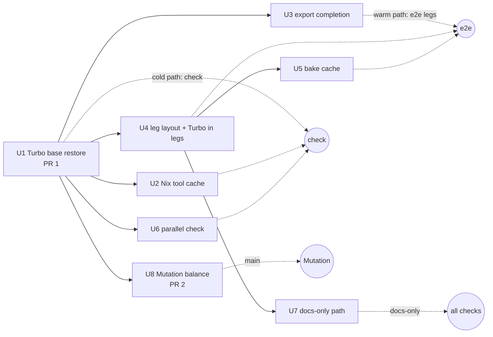
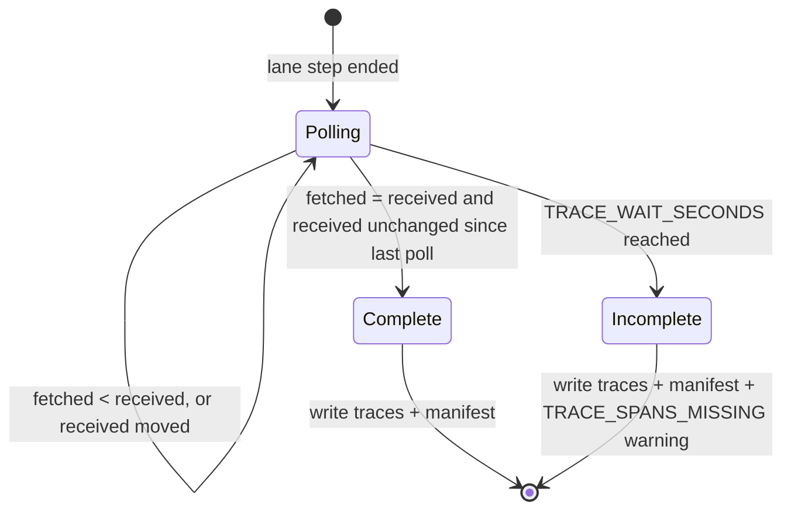

# CI Wall Clock - Plan

## Goal Capsule

- **Objective:** A maintainer or agent opening a code PR gets every check's verdict within 10 minutes, a docs-only PR within 3 minutes, and main's Mutation verdict within 15 minutes. No test, gate, or assertion is lost along the way, and a failing job explains itself in its summary.
- **Means:** Fix what each critical path actually waits on, measured per step: a stale Turbo restore (KTD1, KTD3) and a from-source Rust build (KTD6) in `check`, a fixed trace-settle wait (KTD7) and a per-leg fixture bake (KTD8) in every e2e leg, and an unbalanced kill-matrix plan in Mutation (KTD9).
- **Product authority:** This plan governs `.github/workflows/*` and `.github/actions/*` (except the checker-parity jobs owned by #266), Turbo and pnpm configuration, test sharding configuration, `test/e2e/scripts/export-traces.ts`, and the e2e harness's fixture-bake caching, including concurrent per-fixture installs in `bake-fixtures.sh`. In `mutation.yml` it may change sharding, caching, runner placement, and top-level concurrency, and may add `job-report` steps to Mutation's own jobs, which touch no kill-matrix or verdict-store logic. In `kill-matrix.yml` it may add only KTD9's cache steps and one plan-summary line. The Product Contract wins on behavior; KTDs win on mechanism; units override neither.
- **Stop conditions:** Stop and report instead of continuing when a unit's coverage proof (Verification Contract) shows a test, task, mutant, trace, or span count that differs before and after, or for U3 a trace or span count below the old exporter's on the same leg; or when a lever on the R9 exclusion list would be the only way to meet a target.
- **Execution profile:** Each unit is its own PR, cut from the latest `origin/main` once its Dependencies have merged, self-contained, and landing the moment it is green. Order: U1, U8, U2, U3, U4, U5, U6, U7. Merge `origin/main` up with plain merges; never rebase or force-push. Local verification stays light: format, typecheck, and unit tests of touched TS packages, one build at a time. No local e2e, mutation, or microVM. Every wall-time claim comes from real runs on the unit's branch (`workflow_dispatch` runs until its PR opens), and for U8 from main's next Mutation runs. GitHub API reads are paced and sequential; run data already fetched is reused from a local file.
- **Who finishes:** `ce-work` builds and opens each layer ready for review; the operator merges bottom-up.

---

## Product Contract

### Summary

Cut PR CI from 14.4 minutes p50 (19.8 max) to 10 minutes or less, cold or warm. In `check`, restore the Turbo entry of the PR's own base commit and stop compiling `gritlint` from source on every run. In every e2e leg, end the telemetry export when the lane's own traces are complete, and reuse the fixture bake across runs. Run `check`'s Turbo graph on parallel runners once its per-task timings are known. Docs-only PRs skip the e2e, Changeset, and Nix work they cannot affect and report in 3 minutes or less. main's Mutation finishes in 15 minutes or less, with the kill matrix inside it, once the kill-matrix plan is balanced on recorded costs. Every job writes a summary with a reason code and a next action.

### Problem Frame

Measured window: the last 40 completed runs of each workflow, created between 2026-10-07T06:55Z and 2026-10-10T05:51Z (jobs API, `filter=latest`). The figures below are p50 / p90 / max in minutes over successful runs. Run links use `https://github.com/systemfsoftware/stryker-js-effect/actions/runs/<id>`.

**Per-workflow wall** (first job start to last job end; queue = run created to first job start)

| Workflow               | Event               |  n | Wall p50 / p90 / max | Queue p50 / max | Runner-min p50 |
| ---------------------- | ------------------- | -: | -------------------- | --------------- | -------------: |
| CI                     | pull_request        | 16 | 14.4 / 19.5 / 19.8   | 0.1 / 0.8       |           65.9 |
| CI                     | push (main)         |  8 | 13.8 / 14.3 / 19.0   | 0.1 / 13.0      |           60.4 |
| Changeset Check        | pull_request        | 35 | 7.7 / 8.5 / 8.7      | 0.1 / 3.5       |            7.7 |
| Nix (x86_64 + aarch64) | pull_request + push | 34 | 5.4 / 5.7 / 10.6     | 0.1 / 0.3       |            9.8 |
| Commitlint             | pull_request        | 35 | 0.4 / 0.5 / 0.6      | 0.0 / 2.2       |            0.4 |
| Mutation               | push (main)         | 33 | 9.5 / 13.8 / 19.5    | 0.1 / 14.0      |           95.3 |
| Release                | push (main)         | 37 | 8.9–14.6             | 0.1 / 0.7       |       8.9–14.6 |

A PR therefore costs about 84 runner-minutes: CI 65.9 + Changeset 7.7 + Nix 9.7 + Commitlint 0.4.

The Nix row's 10.6-minute max is a pull_request run: the aarch64 leg of [38022202872](https://github.com/systemfsoftware/stryker-js-effect/actions/runs/38022202872) spent 10.45 minutes in its build step. Nix therefore breaks R3 today on a slow ARM runner, although its p50 is 5.4.

**CI per job and step, PR runs** (n = 16)

| Job                    | Job p50 / p90 / max | Dominant steps (p50 / p90)                                                      | Share of CI runner-min |
| ---------------------- | ------------------- | ------------------------------------------------------------------------------- | ---------------------: |
| e2e (rest-1)           | 13.6 / 14.6 / 14.7  | E2E lane 10.7 / 11.5; Export telemetry 1.8 / 1.8; Start LGTM 0.5                |                    20% |
| check                  | 14.2 / 19.5 / 19.8  | Gate (`pnpm check:ci`) 12.9 / 18.1; plant-two-plans 0.5; every setup step ≤ 0.2 |                    21% |
| e2e (lifecycle)        | 12.1 / 12.4 / 12.6  | E2E lane 9.2 / 9.4; Export telemetry 1.7 / 1.8                                  |                    18% |
| e2e (sabotage)         | 10.9 / 11.4 / 11.5  | E2E lane 8.0 / 8.5; Export telemetry 1.7 / 1.8                                  |                    16% |
| e2e (svelte-composite) | 9.3 / 9.7 / 10.3    | E2E lane 6.0 / 6.7; Export telemetry 1.7 / 1.8                                  |                    14% |
| e2e (rest-2)           | 8.5 / 8.8 / 8.8     | E2E lane 5.5 / 5.8; Export telemetry 1.8 / 1.8                                  |                    12% |

Export telemetry alone accounts for 8.7 runner-minutes per run (13%). Setup steps (checkout, Nix install, pnpm install, released tarballs, deno) take 0.0–0.2 each because those caches hit.

**Cold vs warm, PR CI**

| Run                                                                                          | Change                                    | Gate cache                      | Gate | check | Longest e2e    | Wall |
| -------------------------------------------------------------------------------------------- | ----------------------------------------- | ------------------------------- | ---: | ----: | -------------- | ---: |
| [38026672592](https://github.com/systemfsoftware/stryker-js-effect/actions/runs/38026672592) | instrumenter + ignorers + lockfile (#270) | cold, fresh base: 74/112 cached | 17.2 |  18.9 | rest-1 14.7    | 18.9 |
| [38025092746](https://github.com/systemfsoftware/stryker-js-effect/actions/runs/38025092746) | one changeset file (#269)                 | cold, stale restore: 59/112     | 13.7 |  15.0 | rest-1 12.8    | 15.0 |
| [38020576278](https://github.com/systemfsoftware/stryker-js-effect/actions/runs/38020576278) | changesets only (#265)                    | warm: 112/112, FULL TURBO       |  2.9 |   4.1 | rest-1 13.5    | 13.5 |
| [37953880292](https://github.com/systemfsoftware/stryker-js-effect/actions/runs/37953880292) | `.github/` only (#256)                    | warm: 100/112                   |  6.9 |   8.2 | lifecycle 12.2 | 12.2 |

The PR critical path is `check` on a cold run and e2e `rest-1` or `lifecycle` on a warm run. A warm, changeset-only PR still takes 13.5 minutes, because all five e2e legs run on every PR. The sample contains no docs-only PR. The changeset-only and `.github/`-only runs above are the closest analogues, and none finished in under 12.2 minutes.

**Inside `check`'s Gate.** `check:ci` runs its four legs in series. In the FULL TURBO run 38020576278, `format:check` took 4 seconds, then `lint:conventions` spent 2.75 minutes (03:28:03 to 03:30:48) while `bin/gritlint` built `gritlint` and its vendored crates from source through `nix run`; both Turbo invocations then finished in under a second. No Nix substituter serves `gritlint`, so every `check` job pays this.

**E2E lane inside a leg** (seconds; lane and Vitest from three runs' logs, setup from the harness spans exported by run 38026672592)

| Leg              | Lane (turbo) | Vitest  | Pre-test build | `e2e.setup` (pack + bake) | `e2e.setup.bake` | Test files                                                                                          |
| ---------------- | ------------ | ------- | -------------: | ------------------------: | ---------------: | --------------------------------------------------------------------------------------------------- |
| lifecycle        | 511–569      | 466–523 |            ~45 |                       198 |              177 | enterprise-mutation-lifecycle 305–323                                                               |
| sabotage         | 341–490      | 313–444 |          27–46 |                       199 |              177 | enterprise-monorepo-sabotage 188–244                                                                |
| rest-1           | 547–687      | 514–641 |          33–47 |                       196 |              175 | typescript-checker 376–442; runner-resilience 197–225; mutator-edge-cases 97–111; failing-run 77–81 |
| svelte-composite | 286–375      | 257–328 |          29–47 |                       160 |              137 | svelte-app 124–166; composite-checker 88–118                                                        |
| rest-2           | 332–346      | 286–297 |          45–49 |                       193 |              172 | mutation-run, vitest-nested-describe, vm-vitest: 86–94 each                                         |

Every leg runs the same global setup: pack the workspace closure (21–22 s), then bake every fixture in one microVM guest job, where `bake-fixtures.sh` runs two `npm install`s per fixture in sequence. Files inside a leg run concurrently, so rest-1's lane is bounded by setup plus `typescript-checker.e2e`, whose scenarios run in sequence within the file.

**Mutation on main** (job wall = first job start to last job end)

| Run                                                                                          | Created → first job | Job wall | What ran                                                                                                      |
| -------------------------------------------------------------------------------------------- | ------------------: | -------: | ------------------------------------------------------------------------------------------------------------- |
| [38023414571](https://github.com/systemfsoftware/stryker-js-effect/actions/runs/38023414571) |                14.0 |     19.5 | 20 mutation shards (5.1–10.2, queued up to 7.0) + 20 kill-matrix shards (4.2–12.7, queued up to 4.4)          |
| [38023408744](https://github.com/systemfsoftware/stryker-js-effect/actions/runs/38023408744) |                 0.0 |     13.8 | 17 mutation shards (2.1–3.9, all done at 5.8) + 20 kill-matrix shards (4.3–12.0); kill-matrix collect at 13.0 |
| 38015192824, 38013285598, 37960922409, 37956843616, 37953878013                              |             0.0–0.1 |  5.5–9.0 | 20 mutation shards, no kill matrix (before #263)                                                              |

The kill-matrix shards do 138–151 runner-minutes of mutation work per run with about 0.5 minutes of setup each. Perfectly balanced over 20 shards that is about 8 minutes per shard, but the shards spread from 4.2 to 12.7. The kill-matrix `plan` job restores no cost record and plans with `--full`, so every mutant gets the planner's default cost. The planner reads recorded costs from the incremental file even under `--full`, which only disables verdict reuse (`packages/stryker-js/src/plan-request.cell.ts`, `reportCostsOf`; `packages/stryker-js/src/run/incremental-reuse.ts`, `incrementalReportTextsOf`). The peak observed load was 55 concurrent jobs across all workflows, at 2026-10-10T04:36:33Z, when Mutation shards waited up to 7.0 minutes for a runner.

**Root causes, ranked by critical-path minutes**

1. **`check` runs the whole Turbo graph on one runner after a stale restore: 10–15 minutes of Turbo time.** 10 of 16 PR Gates took 12.9 minutes or longer. Two causes overlap:
   - _Stale restore._ The key is `turbo-Linux-dist-${sha}` with prefix restore-keys, so a PR restores the newest entry readable from its ref. Turbo's own hashes show the restored entry, not an invalidated key, is the fault. `turbo run lint lint:tsgo typecheck test --dry=json` at `ec9ece03`, `4bf59526`, and `be2f0c18` gives the same global hash and external-dependency hash at all three. 53 task hashes differ between `ec9ece03` and `4bf59526` (typecheck 11, test 10, lint 10, build 9, api:check 8, lint:tsgo 5), and none differ between `4bf59526` and `be2f0c18`. #269 (base `4bf59526`, one changeset file) restored the `ec9ece03` entry and missed exactly 53 of 112 tasks. Its run was created at 04:44:08Z; `4bf59526`'s own entry was saved after 04:47:17Z, because main CI [38023414511](https://github.com/systemfsoftware/stryker-js-effect/actions/runs/38023414511) queued 13.0 minutes behind the previous main run. Four PR runs on base `4bf59526` restored older main entries that morning and had 13.7–18.4-minute Gates.
   - _Genuine cascade._ With a fresh base, a change to an upstream package still re-runs every dependent task. #270 (instrumenter) took 14m10s of Turbo time at 74/112 cached. #260 (stryker-js only) took 10m01s at 104/112. The logs cannot attribute time to individual tasks: `test` and `typecheck` use `outputLogs: errors-only`, and `check:ci` runs without a run summary.
2. **`gritlint` compiles from source in every `check` job: 2.75 minutes**, in series before Turbo starts (see Inside `check`'s Gate).
3. **Every e2e leg bakes every fixture before its first test: 2.7–3.3 minutes of `e2e.setup`.** The bake writes to `test/e2e/node_modules/.cache/stryker-e2e/baked/<packsKey>/`, which no job restores. `packsKey` hashes the unpacked bytes of every packed workspace tarball, so a code PR that changes a packed package also changes it.
4. **E2E `rest-1` is unbalanced: 13.6 minutes p50.** Vitest's hash sharding puts `typescript-checker.e2e` (376–442 s) on the same leg as three other files, while `rest-2` finishes in 8.5.
5. **main serializes CI and Mutation per ref.** `cancel-in-progress` is false on main, so a push waits for the previous run. That cost CI 13.0 minutes ([38023414511](https://github.com/systemfsoftware/stryker-js-effect/actions/runs/38023414511)) and delayed `4bf59526`'s Turbo entry (root cause 1). The queue stays (KTD2): once U1 makes main's `check` mostly cache hits, the run it waits behind is short.
6. **Export telemetry adds 1.7–1.8 minutes to the end of every leg.** `test/e2e/scripts/export-traces.ts` polls Tempo search until the trace count has not grown for `TRACE_SETTLE_SECONDS` (70). In the lifecycle leg of 38026672592 the count went 36, 37, then 47 by 32 seconds after the lane ended, and the step ended 72 seconds later. Tempo indexes a trace for search only after its live store cuts it (`max_trace_idle: 30s`) and cuts the block, so the wait after the last span cannot fall below about 30–60 seconds without dropping spans (`docs/solutions/test-failures/tempo-live-store-drops-long-lane-traces.md`). The 70-second idle tail after the last arrival can.
7. **The kill-matrix plan balances on default costs, so its longest shard runs 12.0–12.7 minutes** against an 8-minute balanced share.
8. **Changeset Check spends 7.6 of its 7.7 minutes on setup.** The reusable workflow (`systemfsoftware/pnpm-release-management`, `devshell: true`) builds dprint, gritlint, `stryker-js-effect-tarballs`, and `stryker-published` from source, then release-tools. The check itself takes 0.1. It stays off a code PR's critical path but rules out a 3-minute docs-only PR.
9. **Nix builds `workspace-tarballs` twice per architecture** (`build`, then `--rebuild` for the bit-for-bit check) with no store cache: 5.2 minutes p50, and 10.45 on one PR's aarch64 leg, which breaks R3. Off the code-PR critical path at p50, and it rules out a 3-minute docs-only PR.
10. **Builds repeat across jobs.** Each e2e leg runs 14 Turbo tasks with nothing cached (about 0.75 minutes, five times over), because e2e legs restore no Turbo cache.

### Requirements

**PR wall clock**

- R1. On a typical code PR that changes one package, CI, Changeset Check, Nix, and Commitlint each finish within 10 minutes of wall time (first job start to last job end), both cold and warm.
- R2. On a docs-only PR, every check that a PR reports finishes within 3 minutes of wall time.
- R3. No job triggered by a PR runs longer than 10 minutes.
- R4. A path is docs-only when changing it cannot change any artifact or verdict a skipped check produces: it is never packed into a published tarball and never read by a Turbo task's inputs, an e2e fixture key, or a workflow. The flake's whole-tree `src = self` is the one exempt reader, because a docs-only change leaves its built outputs byte-identical and Nix still runs on the next main push (R8). `docs/plans/**` is docs-only because `check` never skips `gate:repo`, which reads it. Any path not explicitly classified counts as code.

**main**

- R5. main's Mutation workflow finishes within 15 minutes from its first job start to its last job end, including the kill-matrix lane and any wait for a runner inside the run. Waiting behind a previous run is excluded.
- R6. Mutation still runs only on main pushes, the schedule, and dispatch. It never runs on PRs or locally.

**Coverage**

- R7. Every test file, gate, and assertion that runs today still runs with unchanged semantics. A PR runs every task whose inputs changed.
- R8. Work a PR skips (docs-only per R4) runs in full on the next main push, for every workflow with a main-push trigger (CI, Nix). Changeset Check runs on pull requests only; a docs-only PR changes no publishable package, so its skipped check has nothing to read, and the PR's own classification and skip line are its evidence.
- R9. No change uses a lever on the excluded list: bigger runners, raised timeouts, skipped or quarantined tests, `continue-on-error`, optional checks, dropped e2e lanes, self-hosted runners, cloud credentials (AWS, OIDC, S3), or new third-party actions or executables.
- R10. Every check that reports on a PR today keeps reporting on every PR, including docs-only PRs. A docs-only skip happens at step level, or as a job-level skip that still reports under the job's name.

**Agent surface**

- R11. Every job in the workflows this plan touches writes a short step summary with its outcome, duration, cache state (hit or miss, with counts where the tool reports them), and a reason code from KTD5's table. `kill-matrix.yml` is the exception: its jobs keep their existing summary table and failure annotations, and its plan job adds one summary line (KTD9).
- R12. A failing job emits an annotation with a reason code and a next action. Raw logs and telemetry stay in artifacts.

**Evidence**

- R13. Each PR in the stack records cold and warm wall times for every workflow it affects, from real runs on its branch, with run URLs. The PR that targets R5 also records main's next Mutation runs after it merges.
- R14. Each unit ships as its own PR cut from the latest `origin/main` after its Dependencies merge, in the order U1, U8, U2, U3, U4, U5, U6, U7. The order follows measured minutes saved within the dependency constraints; U8 depends only on U1, so it is second. The first PR is U1.

### Key Decisions

- **The levers exclude bigger runners, raised timeouts, skipped tests, `continue-on-error`, optional checks, dropped lanes, self-hosted runners, cloud credentials, and new third-party tooling.** (session-settled: user-directed — chosen over those levers, which the unit contract lists as not counting: they buy time without reducing work, or they lose coverage.) Governs R7, R9.
- **Mutation stays off PRs and never runs locally.** (session-settled: user-directed — chosen over PR mutation: the unit contract keeps it on main and dispatch only.) Governs R6.
- **The 15-minute Mutation budget includes the kill-matrix lane, which stays inside the Mutation run.** (session-settled: user-directed — chosen over moving the lane out of the run: the lane belongs to other streams; this plan's levers are sharding, caching, runner placement, and top-level concurrency.) Governs R5.
- **The export ends on a real completion condition, never a shorter sleep.** (session-settled: user-directed — chosen over lowering `TRACE_SETTLE_SECONDS`: a fixed sleep is the wrong shape either way.) This unit may edit `test/e2e/scripts/export-traces.ts` and the harness's fixture-bake caching, with no test or assertion changes. Governs R7, R12.
- **No status check is required on main.** (session-settled: user-directed — the main ruleset 23172737 has no `required_status_checks` rule, so a job-level skip leaves no required check pending.) Governs R10.
- **PR 1 is the Turbo-cache fix, and it fixes what invalidates the key, not only the restore order.** (session-settled: user-directed — chosen over a larger first PR: stop the bleeding first.) The hash evidence in root cause 1 shows nothing invalidates the key; the restored entry is a different commit's. Governs R1, R14.
- **Main may never consume a fork PR's Turbo outputs, baked fixture trees, restored flake tool binaries, Nix build inputs, or kill-matrix cost records.** This repo is public. `actions/cache` scopes a `pull_request` run's entries to `refs/pull/<n>/merge`, which main cannot restore, and only `push`, `workflow_dispatch`, and `schedule` runs write main's scope. No unit adds a path by which main restores a PR-ref entry. Governs R7.
- **main CI keeps its per-ref serial queue.** (session-settled: user-directed — chosen over per-commit main concurrency: overlapping pushes would add a whole CI run's jobs to a runner pool already binding at 55 concurrent jobs, and R5 counts in-run runner waits.) Governs R1, R5.
- **Each unit is its own PR from the latest `origin/main`, not a stack.** (session-settled: user-directed — chosen over a `gh stack`: each unit lands the moment it is green.) Governs R14.
- **Both R3 levers for the long e2e legs are authorized.** (session-settled: user-directed — chosen over reporting the gap: `typescript-checker.e2e` splits across two legs by a mechanism that runs every scenario exactly once, including scenarios added later, and `bake-fixtures.sh` installs fixtures concurrently.) Governs R3, R7.
- **Mutation's own jobs get `job-report`; `kill-matrix.yml` gets only KTD9's cache steps and a plan-summary line.** (session-settled: user-directed — chosen over narrowing R11 to the PR workflows, and over job reports in `kill-matrix.yml`.) Governs R11, R12.

### Scope Boundaries

- Checker-parity jobs (#266), and the kill-matrix and verdict-store logic in `mutation.yml` and `kill-matrix.yml` beyond sharding, caching, runner placement, and top-level concurrency.
- `systemfsoftware/pnpm-release-management`'s reusable Changeset Check. Its devshell build belongs to that repo; this plan only decides when the caller invokes it (U7).
- The Release and Force Release workflows, which run on push or dispatch only and are not on a PR's path.
- Running e2e or mutation locally.

**Considered and not built**

- _A shared `dist` artifact from one build job for the e2e legs._ A build job the legs `need` puts its whole duration in front of every leg, which costs more wall than the 0.75 minutes each leg spends building. U4 restores the Turbo cache in each leg instead. Evidence that would change this: a leg whose pre-test build stays above 2 minutes after U4.
- _Cancel-in-progress concurrency on Changeset Check and Commitlint._ It saves runner-minutes on superseded pushes but no wall time on the head commit, which is what R1–R3 measure.
- _Per-commit main CI concurrency._ It would land a merged commit's Turbo entry sooner, but overlapping main pushes add a whole CI run (up to 13 jobs after U6) to a runner pool that already queued Mutation shards at 55 jobs. KTD1's base-then-newest restore covers PRs opened during main's queue.
- _Moving kill-matrix shards to the ARM runner pool._ Whether ARM capacity is separate from the x86 job limit is unmeasured, and U8's balanced plan meets R5 without it. Evidence that would change this: U8's runs still showing kill-matrix shards queued more than 3 minutes.

### Outstanding Questions

Q1 (does the 15-minute Mutation budget include the kill matrix) and Q2 (may this plan edit the export script and the bake caching) were answered by the operator's 2026-10-10 rulings, recorded under Key Decisions.

**Deferred to Implementation**

- Q3. If U5 step 1 measures `npm install --package-lock-only` per run costing more than the bake time a reuse saves, U5 records the numbers and stops after step 2.

### Sources / Research

- Workflows: `.github/workflows/ci.yml`, `mutation.yml`, `kill-matrix.yml`, `nix.yml`, `changeset-check.yml`, `commitlint.yml`, `.github/actions/released-tarballs/action.yml`.
- Turbo configuration: `turbo.json`. `test`, `typecheck`, `lint`, and `lint:tsgo` hash `$TURBO_DEFAULT$` minus `**/*.md` and depend on `^build` and `^api:check`. `api:check` reads and writes `etc/*.api.md`. `test:e2e` sets `cache: false`.
- Root scripts in `package.json`: `check:ci` composes `format:check`, `lint:conventions`, `gate:tasks`, and `gate:dist`; the last two accept `TURBO_BASE`.
- E2E harness: `test/e2e/tests/__fixtures__/global-setup.ts`, `test/e2e/src/Harness/fixture-cache.service.ts` (`bakeProgram`, `bakedCacheRoot`), `test/e2e/tests/__fixtures__/bake-fixtures.sh`, `test/e2e-core/src/key-material.ts`, `missing-fixtures.workflow.ts`, `prune-stale-entries.workflow.ts`, `test/e2e/scripts/export-traces.ts`, `process-compose.yaml`, `test/e2e/lgtm/tempo-live-store.yaml`.
- Learnings: `docs/solutions/test-failures/tempo-live-store-drops-long-lane-traces.md`, `docs/solutions/best-practices/e2e-lane-owns-its-traces-through-traceparent.md`, `docs/solutions/build-errors/pnpm-pack-tarball-bytes-are-not-a-stable-cache-key.md`, `docs/solutions/build-errors/vitest-config-narrow-spread-drops-source-condition.md`, `docs/solutions/workflow-issues/mutation-lane-green-while-every-job-failed.md`, `docs/solutions/workflow-issues/matrix-legs-rename-the-required-status-check.md`, `docs/solutions/workflow-issues/shared-deno-import-map-feeds-the-e2e-trace-scripts.md`, `docs/solutions/performance-issues/shard-plan-priced-untested-verdicts-at-a-whole-suite-prediction.md`, `docs/solutions/tooling-decisions/do-not-sleep-to-prove-a-mutation-timeout.md`.
- Tempo: `GET /metrics` on every component, and `tempo_distributor_spans_received_total` as the ingest counter ([Tempo HTTP API](https://github.com/grafana/tempo/blob/main/docs/sources/tempo/api_docs/_index.md), [Unable to find traces](https://grafana.com/docs/tempo/latest/operations/troubleshooting/unable-to-see-trace)).

---

## Planning Contract

### Key Technical Decisions

- KTD1. **`check` restores the Turbo entry of its exact base commit first, in its own restore step.** `actions/cache` searches the current ref (exact key, key prefix, restore-keys) before the default branch, so a single step with restore-keys lets a PR's own stale entry beat main's exact base entry. Step one restores `turbo-<os>-dist-<base>` with no restore-keys; only on a miss does step two restore `turbo-<os>-dist-<sha>` with the prefix `turbo-<os>-dist-`, which returns the PR ref's newest entry, then main's newest. The base is the commit object's first parent for `pull_request` (the merge commit's parent is the base tip it merged) and `push`, and `git merge-base HEAD origin/main` for `workflow_dispatch`. A dispatch input `cache: cold` skips both restores so R13 can record cold numbers on demand; it never applies to `pull_request` events. Instantiates the PR 1 Key Decision; governs R1, R13.
- KTD2. **main CI keeps `cancel-in-progress: false` and its per-ref group.** No main commit is cancelled and no two main CI runs overlap. Governs R1, R5.
- KTD3. **The Turbo cache is pruned, saved only when it changed, and swept on main by its own job.** `check` saves only the cache files whose hashes appear in this run's Turbo summaries, copying `mutation.yml`'s build-job prune step, and saves only when the Gate passed and missed at least one task. A `cache-sweep` job runs only on main pushes; it alone holds `actions: write` (GitHub grants permissions per job), lists `turbo-` entries, and deletes by cache id, never by key, so main's and a PR's entries under one key are never confused. It keeps the newest three entries on main and the newest one per other ref, and deletes every entry of a closed PR. Budget: turbo entries at most 4 GB of the 10 GB quota (today 30 entries of 298–308 MB, 9 GB). Governs R1.
- KTD4. **Turbo writes a run summary in CI through `TURBO_RUN_SUMMARY=true` on the job, not a flag in `package.json`.** `check:ci` stays the one definition that `ci.yml`'s comment requires, and local runs write no summary. Governs R11.
- KTD5. **One composite action, `.github/actions/job-report`, writes every job's summary and failure annotation.** Callers pass the outcome, a reason code from the table below, the next action, and optionally the Turbo run-summary directory and extra detail lines. It writes a few lines to `$GITHUB_STEP_SUMMARY` (with cached/total and the slowest missed tasks when given Turbo summaries), emits `::error title=<REASON>::<next action>` on failure, and runs under `if: always()` without `continue-on-error`. It is shell and `jq`, both already on the runners. Governs R11, R12.

  | Job (unit)                                     | Success codes                       | Failure codes                                                                                                   |
  | ---------------------------------------------- | ----------------------------------- | --------------------------------------------------------------------------------------------------------------- |
  | `check` (U1); each `check` part (U6)           | `GATE_OK`                           | `TURBO_TASK_FAILED`, `GATE_NON_TURBO_FAILED`, `CHECK_SETUP_FAILED`                                              |
  | final `check` aggregator (U6)                  | `GATE_OK`                           | `CHECK_PART_FAILED` (naming the part)                                                                           |
  | `cache-sweep` (U1)                             | `SWEEP_OK`                          | `SWEEP_FAILED`                                                                                                  |
  | `flake-tools` composite line (U2)              | `FLAKE_TOOL_CACHE_HIT`              | `FLAKE_TOOL_CACHE_MISS` (warning), `FLAKE_TOOL_BUILD_FAILED`                                                    |
  | Nix legs (U2, U7)                              | `NIX_OK`, `SKIPPED_DOCS_ONLY`       | `NIX_BUILD_FAILED`, `NIX_NOT_REPRODUCIBLE`                                                                      |
  | e2e legs (U3, U4, U5, U7)                      | `E2E_OK`, `SKIPPED_DOCS_ONLY`       | `E2E_LANE_FAILED`, `E2E_LANE_TIMEOUT`, `LGTM_NOT_READY`, `TRACE_SEARCH_FAILED`; `TRACE_SPANS_MISSING` (warning) |
  | Changeset classify and report (U7)             | `CHANGESET_OK`, `SKIPPED_DOCS_ONLY` | `CHANGESET_CHECK_FAILED`                                                                                        |
  | Commitlint (U7)                                | `COMMITLINT_OK`                     | `COMMITLINT_FAILED`                                                                                             |
  | Mutation `plan`, `build`, shard, `report` (U8) | `MUTATION_OK`                       | `MUTATION_PLAN_FAILED`, `MUTATION_BUILD_FAILED`, `MUTATION_SHARD_FAILED`, `MUTATION_REPORT_FAILED`              |
  | any job above, cancelled                       | none                                | `CANCELLED`                                                                                                     |

  Bake state (`BAKE_HIT`, `BAKE_TARBALLS_ONLY`, `BAKE_FULL`) is a summary field of the e2e legs, not an outcome code.
- KTD6. **CI tools built from the flake are cached as a file binary cache keyed on the files that define them.** The key is `hashFiles('flake.lock', 'flake.nix', 'nix/**')`: `dprint` is built from `nix/dprint.nix` and `flake.nix` selects `gritlint`, so a `flake.lock`-only key would serve a stale binary. `gritlint` and `dprint` are copied with `nix copy` into a directory saved with `actions/cache`, copied back with `nix copy --no-check-sigs` before use, and put on `PATH` so `bin/gritlint` takes its first branch. The trust root is cache scope (KTD-level Key Decision on fork outputs), not a signature or NAR hash, which the entry's own writer produces. An evicted or missing entry falls back to building and reports `FLAKE_TOOL_CACHE_MISS`. The Nix workflow's legs use the same mechanism for the build inputs of `workspace-tarballs` (the closure `--rebuild` substitutes, never the rebuilt outputs), after U2 measures where the 5.2-minute step goes. Only `nix` and `actions/cache` are involved. Governs R1, R2, R3.
- KTD7. **The export completes when the lane's own traces are complete.** The lane's stimuli mint a trace id per CLI run and hand it to the CLI as `TRACEPARENT` (`docs/solutions/best-practices/e2e-lane-owns-its-traces-through-traceparent.md`); the harness records each minted id in the telemetry directory as the run starts, with no assertion change. After the lane step ends, the exporter fetches every recorded id and finishes when each one returns spans and its span count is unchanged since the previous poll. It then collects the harness's setup and bake traces and the Vitest worker traces by searching the lane window, exactly as today. A global received-equals-fetched condition is not used: Tempo cuts the setup and bake traces early (gaps up to 307 s), so spans the distributor counted may never be fetchable. `TRACE_WAIT_SECONDS` stays the deadline; on the deadline the exporter exports what it has and writes `TRACE_SPANS_MISSING` with the incomplete ids, and exit behavior is unchanged. The coverage proof is absolute: on the same leg and Tempo, the new exporter's trace and span counts are at least the old exporter's, setup and bake traces included; a shortfall stops U3. The completion decision is a pure workflow in `test/e2e-core`; the exporter becomes a Node script in the e2e package built on Effect 4 and Schema, replacing the Deno script, with the same artifact layout. Governs R7, R12 (session-settled export Key Decision).
- KTD8. **The fixture bake is cached in two layers inside one cache entry, and reuse re-checks npm resolution.** One entry, `e2e-bake-<os>-<run_id>`, restored by the prefix's newest match, holds `baked/<packsKey>/` (the whole baked root, so the harness still decides reuse by its own key) and `registry/<layerKey>/` per fixture (the tree after the registry install, keyed on the fixture key, base image, and bake script bytes). Per-fixture keys are computed inside the harness, after the restore, so they select subdirectories rather than cache entries. The lifecycle leg saves the entry, on main pushes (so PRs restore it) and in its own PR scope when it rebuilt anything. Fixture manifests resolve caret ranges from the workspace catalog with no lockfile, so today every run resolves fresh; a cached tree or layer is reused only when a fresh `npm install --package-lock-only` produces the lockfile recorded with it, otherwise that fixture bakes in full. `bake-fixtures.sh` already runs the registry install before the tarball install, and its per-fixture install pairs run concurrently (each fixture's own order kept). Governs R1, R3, R7 (session-settled export and R3-lever Key Decisions).
- KTD9. **Kill-matrix shards balance on the previous kill-matrix run's recorded costs.** The kill-matrix `collect` job saves its merged incremental reports to `actions/cache`; the kill-matrix `plan` restores the newest before planning with `--full`, which still forces every mutant to re-run (`packages/stryker-js/src/incremental-diff.workflow.ts`). The plan's summary line reports the restored key and how many mutants were priced from the record versus at the default cost, so a run whose record was never written (a failed `collect`) is visible. Mutation stays serialized per ref, so the run never competes with its own predecessor. Governs R5.
- KTD10. **`check`'s Turbo graph splits by named root scripts, and each part owns its cache entry.** `gate:tasks` becomes a composition of named sub-scripts, so `check:ci` still names everything and each parallel job calls one sub-script. The largest test suite shards with Vitest's `--shard`, at most 3 test shards (Contention). Each part restores and saves `turbo-<os>-<part>-<sha>` with KTD1's two steps and KTD3's prune; the sweep groups entries by part. The final `check` job checks out only `.github/actions` and runs `job-report` over its `needs` results. Governs R1, R7.
- KTD11. **The docs-only class is one allowlist read by one composite action.** `.github/actions/change-class` diffs the PR against its base and emits `docs_only=true` only when every changed path matches `.github/actions/change-class/docs-only.txt`, which it reads through `github.action_path`; anything else is code (R4). The allowlist starts at `docs/**` (plans included, because `check` never skips `gate:repo`), root `*.md`, and `**/AGENTS.md`. It excludes every package `README.md` and `CHANGELOG.md` (npm packs both), `packages/**/etc/*.api.md` (an `api:check` input), `.changeset/**` (Changeset Check reads it), and `test/e2e/testResources/**` (fixture key input). `check` never skips: on a docs-only PR it still runs `format:check`, `lint:conventions`, `gate:repo`, and a Turbo graph that is all cache hits. Governs R2, R4, R8, R10.

### High-Level Technical Design

Dependencies and the critical path each unit moves (each unit is its own PR from `origin/main`; PR order U1, U8, U2, U3, U4, U5, U6, U7):

E2E leg anatomy, minutes: the lifecycle leg of run [38026672592](https://github.com/systemfsoftware/stryker-js-effect/actions/runs/38026672592) (job 12.58), then after U3–U5. "Miss" is a code PR that changes a packed package.

| Phase                                           | 38026672592 | After U3–U5, packs miss | After U3–U5, packs hit | Unit   |
| ----------------------------------------------- | ----------: | ----------------------: | ---------------------: | ------ |
| Setup steps (checkout through deno, post steps) |        0.78 |                    0.70 |                   0.70 | U2, U3 |
| Start LGTM                                      |        0.45 |       0.10 (overlapped) |      0.10 (overlapped) | U4     |
| Pre-test build (lane minus Vitest)              |        0.77 |          0.30 (changed) |                   0.10 | U4     |
| `e2e.setup`: pack                               |        0.35 |                    0.35 |                   0.35 | none   |
| `e2e.setup`: bake                               |        2.95 |   measured in U5, ≤ 2.4 |                   0.05 | U5     |
| Tests (lifecycle file)                          |        5.39 |                    5.39 |                   5.39 | none   |
| Export telemetry                                |        1.73 |                    ≤0.6 |                   ≤0.6 | U3     |
| Upload and job overhead                         |        0.16 |                    0.16 |                   0.16 | none   |
| Total                                           |       12.58 |       ≈ 7.6 + bake ≤ 10 |                  ≈ 7.5 | R1, R3 |

Export completion decision (KTD7):

- The runner-job ceiling is already binding near 55: 55 concurrent jobs ran at 04:36:33Z while Mutation shards queued up to 7.0 minutes. U1 and U8 record job queue times.
- Every leg's owned trace ids can be recorded as their runs start without changing any assertion (KTD7). U3 verifies this before replacing the exporter.
- One baked root, and each fixture's registry layer, fit within the cache budget beside KTD3's turbo budget. U5 measures both sizes first.
- Merging `origin/main` up often keeps conflicts with the #266 and Stream I/B edits to `mutation.yml` and `kill-matrix.yml` small, and with this plan's own units, which all edit `ci.yml` from separate PRs.

### Contention and cache budget

- Jobs per main push after U4, U6, and U7: CI is at most 13 (`check` parts k + 2 with k ≤ 3 test shards, `cache-sweep` 1, seven e2e legs), Nix 2, Release 1–2, Mutation about 45 (2 plan, 2 build, 20 + 20 shards, collect, report). That is up to about 62 against a pool that queued at 55. KTD2 keeps main CI from overlapping itself, and the cap on k is what holds CI at 13.
- Jobs per PR push after U4, U6, and U7: CI up to 12 (no sweep), Changeset 3 (classify, reusable check, report), Nix 2, Commitlint 1.
- R5 counts runner waits inside the Mutation run. U8 records each kill-matrix shard's queue; if shards still queue more than 3 minutes, U8 step 4 records `MAX_SHARDS`, `TARGET_SECONDS`, and the measured queue before changing either.
- Cache: 54 entries, 10.44 GB on 2026-10-10. Targets: turbo at most 4 GB including U6's per-part entries (U1's sweep), bake entries at most 3 GB (U5), flake tools and Nix build inputs measured in U2 and budgeted there, and mutation, node, and sfs entries unchanged at about 1.2 GB. GitHub evicts the least recently used entries above 10 GB; the sweep keeps main's base entries from being evicted by PR saves, and an evicted flake-tool entry reports `FLAKE_TOOL_CACHE_MISS` instead of failing silently.

---

## Implementation Units

Each unit's wall targets are verified on real runs of its PR branch (R13). Every unit keeps the coverage proof and agent-surface output named in its Verification field.

### U1. Fresh Turbo cache for `check` (PR 1)

**Goal:** `check` restores its base commit's Turbo entry first, saves a pruned entry only when it missed tasks, a main-only `cache-sweep` job keeps turbo entries under budget, and every `check` and sweep run reports cached/total and a reason code.

**Requirements:** R1, R7, R11, R12, R13, R14; KTD1, KTD3, KTD4, KTD5.

**Dependencies:** none.

**Files:** `.github/workflows/ci.yml`, `.github/actions/job-report/action.yml` (new).

**Approach:**

1. Record the job start, then compute the base commit after the commit-graph fetch (KTD1).
2. Replace the `Turbo cache` step with KTD1's two restore steps, both skipped by `cache: cold`, and a separate save after the Gate (KTD3).
3. Set `TURBO_RUN_SUMMARY=true` on `check` (KTD4).
4. Prune `.turbo/cache` to the hashes in `.turbo/runs/*.json`, copying `mutation.yml`'s build job, and save under the run's own SHA only when the Gate passed and missed at least one task.
5. Add the `cache-sweep` job (KTD3): main pushes only, `actions: write` and `pull-requests: read` on that job alone, deletion by cache id.
6. Add `job-report` (KTD5) and call it from `check` and `cache-sweep` with KTD5's codes. `TURBO_TASK_FAILED` names the failed task ids from the run summaries; `GATE_NON_TURBO_FAILED` covers a red Gate whose Turbo tasks all passed (`format:check`, `lint:conventions`, or `gate:repo`); `CHECK_SETUP_FAILED` covers a failure before the Gate.
7. Add the `cache: cold` dispatch input.

**Patterns to follow:** `mutation.yml` build job (key, prune, conditional save); `kill-matrix.yml` collect step summary; `.github/actions/released-tarballs/action.yml` for a composite action.

**Test scenarios:**

- A PR whose base commit's main CI finished restores `turbo-Linux-dist-<base sha>` in the first restore step and misses only tasks whose inputs the PR changed.
- A change outside every Turbo input (changesets, `.github/`, docs) on a fresh base reports all tasks cached.
- A PR opened before its base commit's main CI finished misses the first step; the second restores the newest readable entry, and the summary names it.
- A second push to a PR whose base entry is missing restores the PR ref's own newest entry before main's.
- A run whose Gate missed nothing saves no cache entry.
- A main push runs `cache-sweep`, which keeps the newest three main entries and the newest one per other ref and deletes closed PRs' entries; no other job holds `actions: write`.
- A dispatch with `cache: cold` restores nothing and reports 0 cached.
- A planted failing test produces `TURBO_TASK_FAILED` naming the task; a planted dprint violation produces `GATE_NON_TURBO_FAILED`.

**Verification:**

- Target: a `check` job on a change outside every Turbo input at most 4.5 minutes (from 15.0 on #269; U2 removes the remaining 2.75). Turbo cache entries at most 4 GB after the first main sweep.
- Coverage proof: `turbo run lint lint:tsgo typecheck test --dry=json` and `turbo run build --dry=json` list the same task ids at the base and head commits (112 and 17, counting tasks that have a command); each run summary's task count equals that list.
- Restore proof: on the warm run, the summary's missed-task set equals the set of task ids whose dry-run hashes differ between the base and head commits (empty for a change outside every Turbo input), and the restored key names the base SHA.
- Agent surface: `check`'s step summary shows the restored key, cached/total, the five slowest missed tasks with durations, and the reason code; a failing run annotates the reason code and the command to reproduce.

### U2. Cached Nix-built CI tools and Nix build inputs

**Goal:** No `check` job compiles `gritlint` when the files that define it are unchanged, and no Nix leg exceeds R3.

**Requirements:** R1, R2, R3, R11; KTD5, KTD6.

**Dependencies:** U1.

**Files:** `.github/actions/flake-tools/action.yml` (new), `.github/workflows/ci.yml`, `.github/workflows/nix.yml`.

**Approach:**

1. The composite restores a file binary cache keyed per KTD6, copies the requested flake outputs into the store with `nix copy --no-check-sigs`, builds any that are missing, and saves only on a miss.
2. It prints each tool's `bin` directory to `$GITHUB_PATH`, replacing `ci.yml`'s `dprint from the flake` and `deno from the flake` steps.
3. `check` requests `gritlint` and `dprint`; each e2e leg requests `deno` until U3 removes its last use.
4. Measure first on the Nix legs: the split of the 5.2-minute step between the input closure and the two `workspace-tarballs` builds, and the closure's size. Then cache that closure the same way, keyed on `flake.lock`, `flake.nix`, `nix/**`, `pnpm-lock.yaml`, and the package manifests, and report each leg through `job-report`.

**Patterns to follow:** `.github/actions/released-tarballs/action.yml` (cache keyed on a pin, build only on miss).

**Test scenarios:**

- With unchanged key files, `bin/gritlint` resolves to the restored store path and `lint:conventions` starts linting within seconds.
- A change to `nix/dprint.nix` alone misses, rebuilds `dprint`, and saves under the new key.
- A missing or empty cache directory falls back to building and reports `FLAKE_TOOL_CACHE_MISS`, never skipping `lint:conventions`.
- A Nix leg with a restored input closure still runs `--rebuild` on `workspace-tarballs` and fails `NIX_NOT_REPRODUCIBLE` on a mismatch.

**Verification:**

- Target: `lint:conventions` at most 0.2 minutes on a hit (from 2.75); a fully cached `check` job at most 2.0 minutes; each Nix leg at most 5.0 minutes p50 and none above 10 over the unit's runs, both architectures.
- Coverage proof: `gritlint check` reports the same rule count and file count before and after on the same commit; the Nix legs still build and `--rebuild` the same `workspace-tarballs` outputs.
- Agent surface: the composite's summary line names each tool with `FLAKE_TOOL_CACHE_HIT` or `FLAKE_TOOL_CACHE_MISS` and the entry size; a build failure annotates `FLAKE_TOOL_BUILD_FAILED` with the tool name.

### U3. Export telemetry completes on the lane's own traces

**Goal:** Every leg's export ends as soon as every trace the lane owns is complete, while capturing at least what today's exporter captures.

**Requirements:** R1, R3, R7, R11, R12; KTD5, KTD7.

**Dependencies:** U1.

**Files:** `test/e2e-core/src/trace-export-completion.workflow.ts` (new, with in-source laws), `test/e2e-core/src/mod.ts`, the harness module that mints the stimulus trace ids (records each id; no assertion change), `test/e2e/scripts/export-traces.ts`, `test/e2e/package.json`, `test/e2e/tsconfig.test.json`, `.github/workflows/ci.yml`, `test/e2e/README.md`, `test/e2e/AGENTS.md`, `docs/solutions/test-failures/tempo-live-store-drops-long-lane-traces.md`, `docs/solutions/workflow-issues/shared-deno-import-map-feeds-the-e2e-trace-scripts.md`.

**Approach:**

1. Record each minted trace id in the telemetry directory as its run starts.
2. The completion decision takes per-id span-count samples and the deadline and returns `Polling`, `Complete`, or `Incomplete` as a closed tagged union (pack: cell-architecture, pure-decision-workflows.md; pack: schema-laws, tagged-unions-over-state-by-presence.md).
3. The exporter is an Effect 4 program run by Node, like `seed-status-fault`. It decodes Tempo's search and trace responses with Schema at the boundary (pack: cell-architecture, decode-never-cast.md), owns its HTTP client in a scope (pack: cell-architecture, scoped-lifecycle-boundaries.md), and writes the same `e2e-telemetry/` layout and manifest fields. After the owned ids complete, it collects the window's other traces by search.
4. Remove the Deno shebang script and its `--config=scripts/deno.json` reference; `import-traces.ts` keeps the map, so `scripts/deno.json` stays (`docs/solutions/workflow-issues/shared-deno-import-map-feeds-the-e2e-trace-scripts.md`, which U3 updates).
5. Remove the `deno` request from the e2e legs once nothing in the job uses it.
6. Update the README, AGENTS.md, and both learnings to describe the completion condition in place of the settle window.

**Execution note:** Run the coverage comparison before marking the PR ready: both exporters run in one leg on one Tempo, on every leg; that comparison step is removed afterwards.

**Patterns to follow:** `test/e2e-core/src/missing-fixtures.workflow.ts` and `prune-stale-entries.workflow.ts` (pure workflow with in-source laws); `test/e2e/package.json` `seed-status-fault` (Node TS script); `test/e2e/tests/__fixtures__/trace-observation.fixture.ts` (Tempo client settings).

**Test scenarios:**

- Every owned id returns spans and its count is unchanged since the previous sample: `Complete`.
- An owned id's count grew since the previous sample: `Polling`.
- An owned id still absent before the deadline: `Polling`; at the deadline: `Incomplete` naming it.
- Zero owned ids and zero traces with telemetry enabled: the existing zero-trace failure, unchanged.
- Property: the decision never returns `Complete` while any owned id is absent or still growing, drawn from the unrefined sample sequences with boundary seeds 0 and the maximum (pack: schema-laws, refusals-beside-generated-laws.md).
- Exporter against a loopback HTTP server serving recorded Tempo responses: writes one file per trace and a manifest with `traceCount`; a refused connection fails at once with the search error, and the server closes without a leaked handle (pack: boundary-testing, real-system-oracles.md; pack: boundary-testing, no-mocks-on-internal-glue.md).

**Verification:**

- Target: Export telemetry at most 0.6 minutes p50 on every leg (from 1.7–1.8).
- Coverage proof: on the same leg and Tempo, the new exporter's trace count and span total are at least the old exporter's on all five legs, setup and bake traces included (today 327/8097, 34/12820, 47/13397, 93/3205, 73/3492 in run 38026672592); a shortfall stops the unit. Each leg's Vitest file and test counts are unchanged.
- Agent surface: the export step summary shows owned ids complete/total, traces, spans, and elapsed seconds; `TRACE_SPANS_MISSING` and `TRACE_SEARCH_FAILED` annotate with the artifact name to inspect.

### U4. E2E leg layout, Turbo reuse, and the typescript-checker split

**Goal:** No e2e leg rebuilds unchanged packages or waits for LGTM serially, and `typescript-checker.e2e` runs across two legs with every scenario exactly once.

**Requirements:** R1, R3, R7, R11, R12; KTD1, KTD5.

**Dependencies:** U1.

**Files:** `.github/workflows/ci.yml`; if the mechanism below fails its proof, `test/e2e/tests/typescript-checker.e2e.test.ts` split into two feature files with the scenarios moved unchanged.

**Approach:**

1. Each leg restores the Turbo cache with KTD1's two steps and never saves it.
2. Start LGTM detached right after checkout and wait for readiness before the lane step; `TRACE_WINDOW_START` stays taken at container start.
3. Add two `typescript-checker` legs from one shared pattern `P`: one runs the file with `-t "P"`, the other with `-t "^(?!.*(?:P))"`. Vitest compiles `-t` into a RegExp tested against each full test name, so every name matches exactly one of the two, including names added later. Add the file to the rest legs' `--exclude` list; the rest legs keep `--shard=1/2` and `2/2` over the remainder, so a new test file still lands in a rest leg. If the complement fails its proof, move the scenarios unchanged into two feature files instead.
4. Each leg calls `job-report` with KTD5's e2e codes (`E2E_LANE_FAILED` names the failing files; `E2E_LANE_TIMEOUT` is exit 124 from `timeout`).

**Test scenarios:**

- A PR that changes no packed package runs the pre-test build entirely from cache.
- The union of files over all seven legs equals the 11 files under `test/e2e/tests`; every file except `typescript-checker.e2e` runs in exactly one leg.
- A planted new scenario in `typescript-checker.e2e` runs in exactly one of its two legs; the two legs' test counts sum to the unsplit count.
- A new test file added to `test/e2e/tests` runs in exactly one rest leg without a workflow edit.
- An LGTM container that never becomes ready fails the leg with `LGTM_NOT_READY` before the lane starts.

**Verification:**

- Target: every leg at most 10 minutes on a warm PR; rest and typescript-checker legs at most 8.0.
- Coverage proof: per-leg Vitest `Test Files` and `Tests` counts summed over legs equal today's sum on the same commit, counting `typescript-checker.e2e`'s tests once.
- Agent surface: each leg's summary shows the files and name filter it ran, test counts, pre-test build cached/total, and the reason code.

### U5. Fixture bake cached across runs and installed concurrently

**Goal:** A leg whose `packsKey` matches a previous run skips the bake, a `packsKey` miss reinstalls only the workspace tarballs, and fixtures install concurrently.

**Requirements:** R1, R3, R7, R11; KTD5, KTD8.

**Dependencies:** U4.

**Files:** `.github/workflows/ci.yml`, `test/e2e/src/Harness/fixture-cache.service.ts`, `test/e2e/tests/__fixtures__/bake-fixtures.sh`, `test/e2e-core/src/key-material.ts`, `test/e2e-core/src/missing-fixtures.workflow.ts`, `test/e2e-core/src/prune-stale-entries.workflow.ts`, `test/e2e/README.md`.

**Approach:**

1. Measure first, on the branch: the baked root's size, each fixture's registry-layer size, the split of `e2e.guest.job` between registry and tarball installs, and the cost of `npm install --package-lock-only` for every fixture. Record them in the PR.
2. CI restores KTD8's entry by prefix and the lifecycle leg saves it; the harness reuses the baked root only when each fixture's fresh lock-only resolution equals the lockfile recorded with it.
3. The harness derives a registry-layer key per fixture from the fixture key, base image, and bake script bytes (a new pure key function beside `fixtureKeyBytes`), reuses a matching layer under the same lock check, and runs only the tarball install for those fixtures.
4. `bake-fixtures.sh` runs each fixture's install pair concurrently, keeping registry before tarballs within a fixture.
5. Prune keeps the current `packsKey` root and the current registry layers and still honors leases.

**Execution note:** If step 1 shows the lock-only resolution costs more than the bake time a reuse saves, record the numbers under Q3 and stop after step 2.

**Patterns to follow:** `test/e2e-core/src/key-material.ts` (key bytes from unpacked content, never tarball bytes: `docs/solutions/build-errors/pnpm-pack-tarball-bytes-are-not-a-stable-cache-key.md`); `missing-fixtures.workflow.ts` and `prune-stale-entries.workflow.ts`.

**Test scenarios:**

- The registry-layer key changes when the fixture's sources, the base image, or the bake script change, and stays the same when only a packed tarball changes (property over the key-material inputs).
- A fixture with a present registry layer, a matching lock, and a new `packsKey` is planned for a tarball-only bake; one whose fresh lock differs, or with no layer, is planned for a full bake.
- Prune never removes a leased entry or the current registry layer.
- A restored root under a different `packsKey` leads to a full bake and is pruned at teardown.

**Verification:**

- Target: `e2e.setup` at most 0.5 minutes on a `packsKey` hit; bake at most 2.4 minutes on a packs miss; lifecycle and both typescript-checker legs at most 10 minutes on a cold code PR that changes a packed package.
- Coverage proof: for every fixture, the installed package and version list (`npm ls --all --json`) from a concurrent bake, a restored root, and a registry-layer reuse equals a serial bake's on the same commit; Vitest file and test counts per leg are unchanged.
- Agent surface: each leg's summary adds bake state (`BAKE_HIT`, `BAKE_TARBALLS_ONLY`, `BAKE_FULL`) with fixture counts and the lock-check result.

### U6. Parallel `check`

**Goal:** A cold code PR's `check` work finishes within 10 minutes by running its Turbo graph on parallel runners.

**Requirements:** R1, R3, R7, R11, R12; KTD1, KTD3, KTD4, KTD5, KTD10.

**Dependencies:** U1, and U1's run summaries from at least five PR runs to size the split.

**Files:** `package.json`, `.github/workflows/ci.yml`, `packages/stryker-js/vitest.config.ts` (only if `--shard` needs config).

**Approach:**

1. Size from U1's summaries: the longest task's duration and the sum of `test` durations per package; choose k ≤ 3 test shards.
2. Split `gate:tasks` into named sub-scripts so `check:ci` still runs all of them in series locally.
3. `check` becomes a small set of jobs: one for `format:check`, `lint:conventions`, `gate:repo`, `gate:dist`, and the non-test Turbo tasks, and one per test shard. Each restores and saves its own part entry (KTD10), so built `dist` and `api:check` outputs come from cache, not a new artifact.
4. A final `check` job, keeping the name, `needs` all of them, checks out only `.github/actions`, and reports `GATE_OK` or `CHECK_PART_FAILED` through `job-report`.
5. The sweep groups `turbo-` entries by part.

**Test scenarios:**

- A planted failure in one shard fails that shard and the final `check` job, which names the shard.
- The union of task ids run across the parallel jobs equals `check:ci`'s Turbo task list.
- The sum of Vitest test counts across stryker-js shards equals the unsharded count.
- A second run on the same base restores every part's own entry and misses nothing.

**Verification:**

- Target: `check` wall at most 9 minutes on a cold stryker-js-only PR (from 13.7–18.9).
- Coverage proof: task ids and per-package test counts before and after, as above.
- Agent surface: the final `check` summary lists each part with outcome, duration, and cached/total.

### U7. Docs-only fast path and remaining job reports

**Goal:** A docs-only PR's checks all report within 3 minutes, and Nix, Changeset Check, and Commitlint write job reports.

**Requirements:** R2, R4, R8, R10, R11, R12; KTD5, KTD11.

**Dependencies:** U4.

**Files:** `.github/actions/change-class/action.yml` (new), `.github/actions/change-class/docs-only.txt` (allowlist, new), `.github/workflows/ci.yml`, `.github/workflows/nix.yml`, `.github/workflows/changeset-check.yml`, `.github/workflows/commitlint.yml`.

**Approach:**

1. `change-class` emits `docs_only` for `pull_request` events only; on push and dispatch it always emits `false` (R8).
2. On a docs-only PR, each e2e leg skips Start LGTM, the lane, Export telemetry, Package telemetry, and Upload telemetry artifact at step level, because the export's zero-trace check and the upload's `if-no-files-found: error` would otherwise fail the leg; both Nix legs skip their build. Each reports `SKIPPED_DOCS_ONLY`.
3. Changeset Check gains a classify job; the reusable `check` job is skipped at job level on docs-only PRs, which still reports under its name (ruleset 23172737 requires none), and a report job writes its summary.
4. Commitlint and the Changeset report job call `job-report`.

**Test scenarios:**

- A PR changing only `docs/solutions/x.md` or `docs/plans/x-plan.md` classifies as docs-only.
- A PR changing `docs/x.md` and `packages/stryker-js/src/a.ts` classifies as code.
- A PR changing `packages/stryker-js/README.md`, `packages/stryker-js/etc/stryker-js.api.md`, `.changeset/x.md`, or a file under `test/e2e/testResources/` classifies as code.
- A rename from `docs/` into `packages/` classifies as code.
- A docs-only PR still runs `check` with `format:check`, `lint:conventions`, and `gate:repo`; a planted second plan under `docs/plans/` still fails `gate:repo`.
- A docs-only PR's e2e legs finish green with `SKIPPED_DOCS_ONLY` and no telemetry step failure.
- The next main push after a docs-only merge runs every e2e leg, both Nix legs, and the full `check`.

**Verification:**

- Target: docs-only PR, every workflow at most 3 minutes; code PRs unchanged except Changeset Check plus at most 0.5 minutes for its classify job.
- Coverage proof: on the following main push, the e2e and Nix work ran with counts equal to a code PR's; on the docs-only PR, the skipped steps are listed in each job's summary, and Changeset Check's classify output and skip line stand in for it (R8).
- Agent surface: every job on the PR shows its change class; `SKIPPED_DOCS_ONLY` appears in each skipped job's summary.

### U8. Mutation balanced within 15 minutes (PR 2)

**Goal:** main's Mutation run finishes within 15 minutes with the kill matrix inside it.

**Requirements:** R5, R6, R11, R12, R13; KTD5, KTD9.

**Dependencies:** U1 (the `job-report` action).

**Files:** `.github/workflows/kill-matrix.yml` (KTD9 cache steps and one plan-summary line only), `.github/workflows/mutation.yml`.

**Approach:**

1. Kill-matrix `collect` saves the merged incremental reports under a run-scoped key; kill-matrix `plan` restores the newest into each project's incremental file before `plan --full` (KTD9), and its summary line reports the restored key and the mutants priced from the record versus the default.
2. Judge the result by the plan's shard spread on the next real run, not by `predictedSeconds` (`docs/solutions/performance-issues/shard-plan-priced-untested-verdicts-at-a-whole-suite-prediction.md`).
3. Mutation's own `plan`, `build`, shard, and `report` jobs call `job-report` with KTD5's codes; `kill-matrix.yml`'s existing summary table and failure annotations stay as they are.
4. If the first balanced run still exceeds 15 minutes of wall, compare kill-matrix `MAX_SHARDS` and `TARGET_SECONDS` against the measured runner queue before changing either, and record the numbers.

**Test scenarios:**

- A first run with no cached cost record plans exactly as today and reports 0 mutants priced from a record.
- A run with a restored record reports a non-zero count priced from it, and the kill-matrix collect reports the same mutant count per project as the plan (every mutant re-run under `--full`).
- A run whose restore misses, or whose predecessor's `collect` never saved, still completes and says which in the plan summary.

**Verification:**

- Target: Mutation job wall at most 15 minutes on main's next three pushes; kill-matrix shard spread max/min at most 1.5 (from 3.0).
- Coverage proof: each run's kill-matrix and mutation-lane shard counts and per-project mutant counts equal its own plan's; the kill-matrix artifact still publishes. The lever proof is the plan summary's restored key and priced-from-record count.
- Agent surface: each Mutation job's summary shows its shard, mutants, duration, and runner queue; a failed shard annotates `MUTATION_SHARD_FAILED` with the artifact to read.

---

## Verification Contract

- **Local, per unit (light):** `pnpm format:check`; for units touching TS, `pnpm --filter @systemfsoftware/stryker-e2e-core typecheck test` and `pnpm --filter @systemfsoftware/stryker-e2e typecheck`, one build at a time. No local `test:e2e`, mutation, or microVM.
- **CI, per unit:** a warm run and a cold run (`cache: cold` dispatch from U1 on) on the PR branch for every workflow the unit affects, with run URLs, per-job wall, and job queue in the PR body (R13).
- **Coverage proof, per unit:** the before/after counts named in the unit's Verification field, from the same commit or the unit's base commit, in the PR body. A mismatch stops the unit (Goal Capsule).
- **Agent surface, per unit:** one planted-failure run on the PR branch showing the reason-code annotation and summary, reverted before the PR is ready.
- **Exit thresholds:** R1–R3 and R5 as numbers: code PR wall at most 10 minutes cold and warm, docs-only at most 3, no PR job above 10, Mutation job wall at most 15.
- **Before every push:** merge `origin/main` up with a plain merge. Units edit `ci.yml` from separate PRs; whichever lands second merges main and resolves.

## Definition of Done

- Every unit's wall target, coverage proof, and agent-surface output is recorded in its PR with run URLs.
- R1, R2, R3, and R5 hold on real runs after every unit merges: three consecutive code PRs and one docs-only PR, and main's next three Mutation runs.
- No step uses `continue-on-error` that did not before, and no timeout is raised.
- The Deno export script and every reference to it are gone; `scripts/deno.json` still type-checks `import-traces.ts`.
- Planted failures, probe steps, and comparison exporters are removed from every branch before it is marked ready.
- Every cache family the plan adds appears in the Contention and cache budget with a measured size.
- Each PR carries a changeset only where it changes a publishable package; `test/e2e` and `test/e2e-core` are private.
