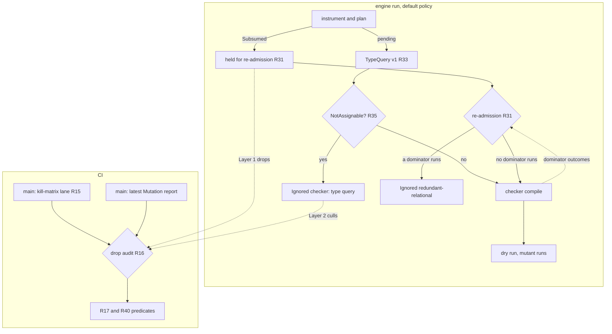
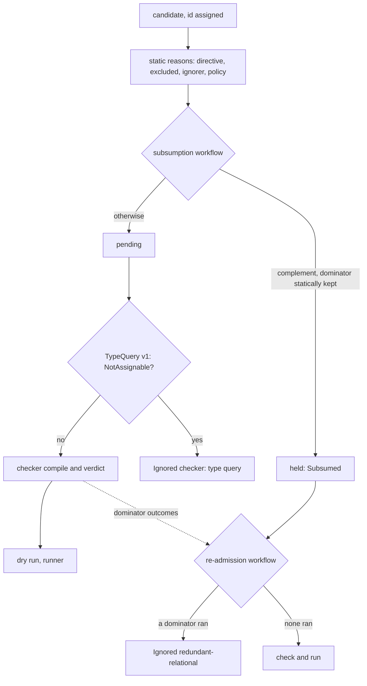
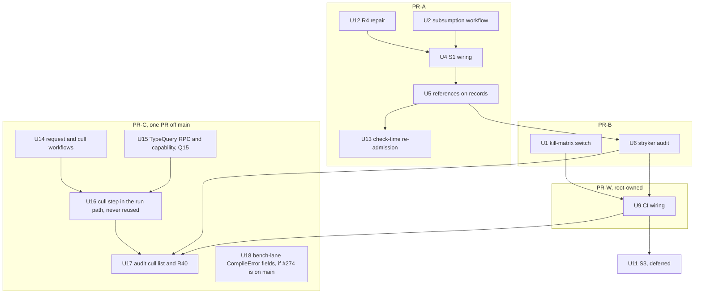

# Mutant Subsumption and Type-Guided Generation - Plan

## Goal Capsule

- **Objective:** A stryker-js-effect run executes fewer mutants that carry no new signal. A mutant that a kept mutant dominates is not run, and its record names that dominator. A mutant that the TypeScript checker's type facts show cannot compile is never compiled or run. CI shows on the dogfood corpus that no test loses a kill and that no mutant which compiles on main is lost.
- **Means:** static subsumption decided in the instrumenter (KTD1), with a check-time re-admission step in the engine (KTD13); type answers from Stream H's TypeQuery v1 over the unmutated program, with a pure cull decision in the engine (KTD14, KTD15); a kill-matrix lane and a `stryker audit` command (KTD6, KTD7).
- **Product authority:** `.omp-brief/unit-i-contract.md` (Unit I), the supervisor's and the root's 2026-10-09 rulings recorded under Outstanding Questions, then `CONSTITUTION.md`, which outranks both. Stream C (`origin/stryker/mutant-quality`, plan `docs/plans/2026-10-09-1850-feat-mutant-quality-plan.md`) owns `arid-uncovered-block` and `constant-collection-size`. Stream H owns the TS checker package. Stream F owns native generation later.
- **Execution profile:** PR-A shipped as #273 and the kill-matrix lane as #263; both are on `main`. PR-B is #276 (open). PR-W, owned by the root, adds the `drop-audit` job. PR-C is one PR cut from `main` (not stacked on PR-W) once its prerequisites are on `main`. Local verification is targeted: typecheck and the affected package's tests, at most one build at a time, no e2e, no microVM, no mutation runs. Close every long-lived `tsc`, `--lsp`, or watch process as soon as it is done.
- **Stop conditions:**
  - PR-W, and PR-C's one-job change to `drop-audit`, edit `.github/workflows/`, which is Read-only for this unit. The root owns and reviews both.
  - PR-C ships U14-U17 together and nothing less: pure workflows or an RPC that nothing calls would be dead code. If #277, #276, or PR-W's `drop-audit` is not on `main`, or Stream H has not answered Q15, when `ce-work` would start, PR-C waits unstarted and the wait is reported.
  - U11 (S3) is deferred until PR-W's `drop-audit` exists.
- **Who finishes:** `ce-work` builds PR-C (PR-A has landed; PR-B, #276, waits on the root); the root reviews and owns PR-W; the supervisor merges every PR.
- **Open blockers:** for PR-C, #277, #276, and PR-W on `main`, and Q15 (who writes the `typeQuery` RPC, Stream H). Q16, Q17, Q19, Q20, Q23, and Q24 go to the supervisor or the root.
- **Applicable packs** (`.compound-engineering/config.yaml`):
  - cell-architecture: pure-decision-workflows, ports-separate-from-layers, sandwich-phase-order, scoped-lifecycle-boundaries
  - schema-laws: tagged-unions-over-state-by-presence, refusals-beside-generated-laws, arbitrary-filter-floors
  - boundary-testing: pin-dependency-semantics, real-system-oracles, no-mocks-on-internal-glue

---

## Product Contract

### Gap against origin/main

Every "has" cell below was read at `1e1de6d05`, before PR-A. Since then PR-A (#273) shipped Layer 1 on `main` (`packages/stryker-js-instrumenter/src/subsume-mutants.workflow.ts`, `packages/stryker-js/src/readmit-subsumed.workflow.ts`, and `Mutant.subsumption`), and #263 shipped the kill-matrix lane (`.github/workflows/kill-matrix.yml`); rows 1-3 describe `main` before both. The kill-matrix and Layer 1 figures come from Mutation run [37960922409](https://github.com/systemfsoftware/stryker-js-effect/actions/runs/37960922409) (#416, head `1e1de6d05`, artifact `mutation-report-416`). The CompileError diagnostics come from the scheduled `--full` run [37918729445](https://github.com/systemfsoftware/stryker-js-effect/actions/runs/37918729445) (#406, artifact `mutation-report-406`): #416 reused 3753 of its 4136 CompileError verdicts, and a reused verdict's reason reads `Remembered`, so #416 has no diagnostic text for them. 4079 of #406's 4128 CompileError ids appear in #416, and every one of them is CompileError there too.

| Done item                                                   | origin/main has                                                                                                                                                                                                                                                                                                                                                                                                                                                                                                                                                                                                                      | Missing                                                                                                                                                                                                                                                                                  | Primary source                                                                                                  |
| ----------------------------------------------------------- | ------------------------------------------------------------------------------------------------------------------------------------------------------------------------------------------------------------------------------------------------------------------------------------------------------------------------------------------------------------------------------------------------------------------------------------------------------------------------------------------------------------------------------------------------------------------------------------------------------------------------------------ | ---------------------------------------------------------------------------------------------------------------------------------------------------------------------------------------------------------------------------------------------------------------------------------------- | --------------------------------------------------------------------------------------------------------------- |
| 1. Static subsumption (Layer 1)                             | `redundant-relational` at `packages/stryker-js-instrumenter/src/mutant-set-policy.workflow.ts:16,99-113`, with its table at `relational-sufficient-sets.ts:34-39`. It applies only in condition positions (`Mutator.service.ts:889-892`, `:922-924`) and has generated properties (`__tests__/mutant-set-policy.workflow.property.test.ts:22-49`).                                                                                                                                                                                                                                                                                   | No dominator is named. Drops happen only in condition positions and fire 0 times on the corpus. Its literal drops have no JS operand precondition. A drop survives a directive that ignores its dominator (`plan-mutants.workflow.ts:156-186`) and any check-time ignore.                | Kaminski, Ammann, Offutt, "Better Predicate Testing", AST 2011; Just & Schweiggert, STVR 24(5), 2014, Table III |
| 1. Dropped mutant reported with dominator and reason        | Ignored mutants carry `statusReason: '<ruleId>: <detail>'` (`Mutator.service.ts:136-150`). The vocabulary is closed at 12 ids (`packages/stryker-js-plugin-interface/src/ignore-rule.schema.ts:6-19`).                                                                                                                                                                                                                                                                                                                                                                                                                               | No dominator field. Reuse overwrites the reason with `'Remembered'` (`packages/stryker-js/src/run/incremental-reuse.cell.ts:421`): all 1187 Ignored mutants in #416 read `Remembered`. The merged `mutation.json` has no `statusReason`.                                                 | Kurtz et al., "Mutant Subsumption Graphs", Mutation 2014                                                        |
| 1. CI proves no signal loss against main's full kill matrix | `killedBy` and `coveredBy` exist in the report schema. The vitest runner reports every killer only under `disableBail` (`packages/stryker-js-vitest-runner/src/VitestRuntime.handle.ts:248`, `interpret-vitest-mutant-run.workflow.ts:94-110`).                                                                                                                                                                                                                                                                                                                                                                                      | No full kill matrix. `disableBail` defaults to false (`stryker-options.schema.ts:284`), and no dogfood config sets it. All 1797 Killed mutants in #416 have exactly one `killedBy`. The merged `mutation.json` carries neither `killedBy` nor `coveredBy`. No CI job checks subsumption. | Kurtz et al., "Analyzing the Validity of Selective Mutation with Dominator Mutants", FSE 2016                   |
| 2. Layer 2: type-guided generation                          | The checker runs the TS 7 native API (`typescript/unstable/async`, `packages/stryker-js-typescript-checker/src/ts-compiler.handle.ts:26-34`, program built at `:1291-1296`). It returns diagnostics only (`Checker.schema.ts:29-36`); its interface is `init`/`check`/`group`/`digest` (`packages/stryker-js-plugin-interface/src/Checker.service.ts:8-17`). The TS 7 `Checker` class exposes `getContextualType`, `getResolvedSignature`, `getReturnTypeOfSignature`, `getPropertiesOfType`, `getUndefinedType`, and `isTypeAssignableTo` (`node_modules/typescript/dist/api/async/api.d.ts:207-327`), and no repo code calls them. | Every type fact. 4136 of 8626 mutants in #416 (47.9%) are CompileError, and each one costs a snapshot refresh and a diagnostics pass in the checker.                                                                                                                                     | TypeScript 7.0.2 `api.d.ts`; Stream C KD3                                                                       |
| 3. Before/after counts                                      | No bench lane on main. `.github/workflows/` holds changeset-check, ci, commitlint, force-release, mutation, nix, and release. Each project's incremental report records `testsCompleted` per mutant and `costs.<id>.actualMs`.                                                                                                                                                                                                                                                                                                                                                                                                       | The counts and the lane. The lane belongs to another stream.                                                                                                                                                                                                                             | n/a                                                                                                             |
| 4. CI green with new tests                                  | `pnpm test` runs property tests. `stryker-js-instrumenter` is not in the Mutation corpus (`.github/workflows/mutation.yml:29`).                                                                                                                                                                                                                                                                                                                                                                                                                                                                                                      | The new instrumenter code gets no CI mutation coverage (CONST-T3).                                                                                                                                                                                                                       | n/a                                                                                                             |

**Contract claims checked:**

- "Main's full kill matrix" does not exist. CI bails on the first failing test, and the merged report drops `killedBy`. This unit builds the matrix (Q1, accepted).
- "`redundant-relational` may already be the Kaminski ROR subset" is half right. It is the Just & Schweiggert sufficient set for the four ordering operators, which matches the Kaminski set. But it applies only in condition positions. KTD12 of the SOTA plan left value positions out on purpose (`docs/plans/2026-09-29-0427-feat-state-of-the-art-mutation-testing-plan.md:260`). This repo's pure core writes `Boolean.match` in place of `if` or `?:` (CONST-P2), so the rule fires on 0 of 76 relational sites.

### Summary

Layer 1 replaces main's condition-only relational table with subsumption rules that name a dominator. Each rule states its JavaScript operand precondition and fires only where that precondition holds. A drop stands only while its dominator runs, at plan time and at check time. Layer 2 asks Stream H's TypeQuery v1, over the unmutated program, whether a context-free replacement is assignable to the type its site is checked against. A mutant that v1 answers `NotAssignable` is Ignored with Stream C's `checker` rule before it reaches the checker's compile step or a runner. `stryker audit` checks both layers on the corpus. A Layer 1 drop is checked against main's full kill matrix, and a Layer 2 cull against main's latest mutant statuses.

### Problem Frame

**Same-site reduction has little to work with.** In #416, 7489 of 7827 mutated sites (95.7%) carry one mutant. The 338 multi-mutant sites hold 1137 mutants, and 925 of those were executed (2852 were executed in total).

Ceiling on #416 for each Layer 1 candidate:

| Candidate                                                 | Sites | Mutants dropped | Executed among them | Test executions saved (Σ `testsCompleted`) | Status                                |
| --------------------------------------------------------- | ----- | --------------- | ------------------- | ------------------------------------------ | ------------------------------------- |
| S1 relational complement, no precondition                 | 76    | 76              | 68                  | 325 of 18697 (1.7%)                        | Sound for every JS value. Adopted.    |
| S3 relational literal, dominated by the boundary operator | 73    | 73              | 61                  | 339                                        | Needs precondition P. Deferred (U11). |
| S2 equality negation, dominated by a literal              | 223   | 223             | 182                 | 851                                        | Refuted on the corpus. Rejected.      |

**CompileError is where the waste is.** In #416, 4136 of 8626 mutants (47.9%) are CompileError. They account for 3921 s of the 10403 s summed per-mutant `actualMs` (37.7%); in #406 the figures are 2814 s of 8667 s (32.5%). By mutator (#406):

| Mutator               | CompileError | Of its mutants | Replacement                  |
| --------------------- | ------------ | -------------- | ---------------------------- |
| ArrowFunction         | 1964         | 2572 (76.4%)   | `() => undefined`            |
| ObjectLiteral         | 1043         | 1711 (61.0%)   | `{}`                         |
| StringLiteral         | 506          | 1813 (27.9%)   | `""`                         |
| ArrayDeclaration      | 207          | 498 (41.6%)    | `[]`, `["Stryker was here"]` |
| BlockStatement        | 190          | 228 (83.3%)    | `{}` (emptied body)          |
| MethodExpression      | 141          | 269 (52.4%)    | another method               |
| BooleanLiteral        | 46           | 197 (23.4%)    | `true`/`false`               |
| all operator mutators | 31           | 1163           |                              |

By first diagnostic code: TS2322 1666, TS2739 597, TS2345 555, TS2375 181, TS2339 169, TS2554 146, TS2349 118, TS2769 112, TS2741 106, TS2355 86, TS2378 62. The largest mutator × code pairs are ArrowFunction/TS2322 (1213), ObjectLiteral/TS2739 (595), ArrowFunction/TS2345 (234), StringLiteral/TS2322 (231), StringLiteral/TS2345 (215), ObjectLiteral/TS2339 (148), ArrowFunction/TS2554 (146), and BlockStatement/TS2355 (86).

**Most of it is not decidable at the site.** Of the 4025 CompileErrors with diagnostics in #406, 1414 have every diagnostic inside the mutated range. 247 have some inside, 2158 have them only elsewhere in the same file, and 206 have them in another file. Elsewhere means generic inference: replacing an arrow argument changes the inferred type argument, and the error appears at the enclosing call or declaration. For example, the arrow at `packages/stryker-js/src/classify-exit.workflow.ts:53` (`98783bb973358922`) fails at `:81`, and `Match.orElse((): Tone => …)` at `render-clear-text-report.workflow.ts:497` (`6f53c0e6f3df5cc0`) fails at `:492`. Only a full compile of the mutated program decides those, and that is the checker's existing job.

**The site-anchored ceiling is 1170 mutants.** These are the CompileErrors whose diagnostics all sit inside the mutated range and all belong to the assignability family (TS2322, TS2345, TS2739, TS2740, TS2741, TS2375, TS2353, TS2367, TS2355, TS2378). By mutator: ObjectLiteral 589, ArrowFunction 257, BlockStatement 139, StringLiteral 136, ArrayDeclaration 27, BooleanLiteral 22. Their checker cost was 749 s, 26.6% of CompileError cost and 8.6% of all per-mutant cost. A rough syntactic look at where they sit gives:

- 542 of the 589 ObjectLiteral cases are call arguments, mostly `Option.match`/`Match` option objects whose keys are fixed.
- 58 of the BlockStatement cases are accessors and 81 are function bodies: 71 with a declared return type and 10 that rely on a contextual signature (Q20).
- StringLiteral and ArrowFunction cases are spread across call arguments, properties, and initializers.

**What TypeQuery v1 can decide of the 1170.** Each mutant's site node (TypeScript 5.9 parser over the #406 sources) was walked the way v1 walks it at #277's head `c78e199d9`: the origin links in `type-query.handle.ts:436-485`, the call-argument facts at `:490-509`, and the answer order in `answer-type-query.workflow.ts:54-70`. Generic callees were classified by the same callee table as the first routing (library combinators and `Workflow.make` are generic; Schema class `make` is not). v1 itself was not run, so the routing is a prediction. Each id was then joined to main's Mutation run #424 ([38034894588](https://github.com/systemfsoftware/stryker-js-effect/actions/runs/38034894588), head `add6faa73`, artifact `mutation-report-424`: 9366 mutants, 4387 CompileError (46.84%), 4156 s of checker time over CompileError):

| v1 outcome at the site (`c78e199d9`)                                            | ObjectLiteral | ArrowFunction | BlockStatement | StringLiteral | ArrayDeclaration | BooleanLiteral | Total | CompileError on #424 | Checker s on #424 |
| ------------------------------------------------------------------------------- | ------------- | ------------- | -------------- | ------------- | ---------------- | -------------- | ----- | -------------------- | ----------------- |
| 1. Typed (`CallArgument`, non-generic): argument of a non-generic call          | 169           | 8             | 0              | 15            | 0                | 0              | 192   | 188                  | 166.1             |
| 2. Typed (`DeclaredContext`): returned expression, declared return type         | 48            | 0             | 0              | 26            | 0                | 1              | 75    | 73                   | 56.7              |
| 3. Typed (`DeclaredContext`): initializer of an annotated declaration           | 30            | 11            | 0              | 26            | 0                | 8              | 75    | 75                   | 58.5              |
| 4. Typed (`CallArgument`, non-generic): nested in a non-generic call's argument | 2             | 0             | 0              | 11            | 0                | 0              | 13    | 13                   | 12.4              |
| 5. `Unknown` `overloaded-or-generic-call`: nested in a generic call's argument  | 5             | 66            | 0              | 2             | 0                | 0              | 73    | 72                   | 57.3              |
| 6. `Unknown` `overloaded-or-generic-call`: direct argument of a generic call    | 333           | 135           | 0              | 33            | 0                | 9              | 510   | 499                  | 424.8             |
| 7. `Unknown` `site-not-expression`: emptied function or accessor body           | 0             | 0             | 139            | 0             | 0                | 0              | 139   | 135                  | 133.1             |
| 8. `Unknown` `no-contextual-type`: unannotated declaration                      | 2             | 37            | 0              | 0             | 0                | 0              | 39    | 38                   | 44.5              |
| 9. `Unknown` `no-contextual-type`: equality operand                             | 0             | 0             | 0              | 23            | 0                | 4              | 27    | 26                   | 18.2              |
| 10. `Unknown` `candidate-not-context-free`: `[]`, `["Stryker was here"]`        | 0             | 0             | 0              | 0             | 27               | 0              | 27    | 27                   | 23.6              |
| Total                                                                           | 589           | 257           | 139            | 136           | 27               | 22             | 1170  | 1146                 | 995.2             |

Against the `92bffa23d` routing, only row 5 moved: those 73 sites were answered there and are `Unknown` now. Rows 1-4 are unchanged.

- **Predicted culls:** N_cull = 355, the rows 1-4 mutants in #406's set. 349 of them exist on #424; the other 6 are absent because their files changed.
- **Predicted CompileError removed:** N_CE = 349. Every one of the 349 joined culls was CompileError on #424, which is what R40 requires.
- **CompileError share on #424:** 4387 of 9366 (46.84%) falls to 4038 of 9366 (43.11%).
- **Checker time over CompileError on #424:** 4156 s falls to about 3862.3 s (−293.7 s, −7.07%).

Rows 6-10 stay with the checker: row 7 is the v1 amendment asked in Q20, row 6 is Q23, row 9 is not worth an amendment (Q22), and rows 8 and 10 are already answered correctly as `Unknown`. 24 of the 1170 are absent from #424. 315 of the 1170 have their diagnostic after the mutated span in original coordinates, a line shift caused by multi-line replacements; the routing uses the site node, not the diagnostic, so it is unaffected. The prediction bounds the 1170 only: a CompileError outside the 1170 can also be answered `NotAssignable`, and the audit counts it.

**The inferred-context hazard is closed at `c78e199d9` (Q21 met).** At `S.Literals(['run', 'merge', …])` (`packages/stryker-js/src/Cli.schema.ts:25`), the `""` mutants `91c88189eda04502` and `73f7ceb08f61bd67` Survived on #424. `S.Literals` is `<const L extends ReadonlyArray<LiteralValue>>(literals: L)` (`effect` 4.0.0, `Schema.d.ts:4003`), and TypeScript 5.9.3's `getContextualType` returns the literal inferred from the original element there, so an answer from the contextual type alone would cull a surviving mutant. At `92bffa23d`, v1 checked for a generic callee only on a direct argument. Commit `03dbbaf4f` makes v1 walk from the site to its origin first: the array element climbs through its `ArrayLiteralExpression` (`type-query.handle.ts:438`) to the call argument (`:462-465`), whose `CallArgument` facts mark `S.Literals` as `declaredGeneric` (`:490-509`, flag at `:507`). `originAnswerOf` then answers `Unknown` `overloaded-or-generic-call` (`answer-type-query.workflow.ts:54-70`, at `:65`). The emulated walk over both witnesses gives `ArrayLiteralExpression > CallExpression S.Literals`, generic. Re-walked the same way, all 447 #424 shape mutants that compiled at row-5 positions now land on a generic `CallArgument`, so none of them is culled.

**A syntactic skip is already refuted.** Stream C's KD3 (`docs/plans/2026-10-09-1850-feat-mutant-quality-plan.md:114` at `575ca03e`) measured, on #416, 778 ArrowFunction mutants on arrows whose explicit return type excludes `void`/`undefined`/`any`/`unknown`/`never`. 648 were CompileError and 120 compiled (99 Killed, 21 Survived). The annotation sat on the arrow that the mutant replaces, so the mutant removed it. Layer 2 asks v1 for the contextual type at the site on the unmutated program, which the TS checker resolves, and culls nothing from annotation text.

Two findings bound what the Layer 1 rules can do in JavaScript:

1. **Infection containment is not kill containment.** A static rule can prove that every single evaluation that infects dominator `d` also infects `m` into the same post-state (the RIP infection condition; Ammann & Offutt, _Introduction to Software Testing_, 2nd ed.). It cannot rule out masking across repeated evaluations of the same site (Kurtz, Ammann, Offutt, "Static Analysis of Mutant Subsumption", ICSTW 2015).
2. **The corpus contains a counterexample.** At `packages/stryker-js/src/run/validate-options-admission.workflow.ts:19`, the literal mutant `90f2080398d798bc` was Killed by test 973, while the negation `1e60ed65ae6cd32a` (`value === null`) Survived all 3 of its covering tests. Infection containment holds there and the operands are pure, yet the kill does not carry over. That rejects S2 and is why every drop is checked against the kill matrix.

### Key Decisions

- **Rules prove infection containment; the kill matrix decides kill containment.** A static proof cannot cover masking across repeated evaluations. Governs R1, R17.
- **S1 extends `redundant-relational` and adds no parallel rule.** It only removes mutants. Governs R3, R8.
- **S2 is rejected on evidence.** At one site, CI ids `90f2080398d798bc` (Killed) and `1e60ed65ae6cd32a` (Survived) violate `killers(d) ⊆ killers(m)`.
- **The R4 repair lands first.** Main's condition-position drops lose their unconditional status before any new drop ships. This is breaking under BREAK-1 and is flagged for Stream C, whose U8 edits `mutant-set-policy.workflow.ts`. Governs R4.
- **This unit owns the invariant that a drop holds only while its dominator runs, at check time too.** On main today the checker's TCE `sibling`/`original` classification can Ignore a named dominator at check time (`packages/stryker-js-typescript-checker/src/check-mutants.workflow.ts:41-44`). Stream C's `constant-collection-size` will add another check-time ignore. One generic engine step re-admits the dropped mutant; it does not depend on Stream C. Governs R5, R31.
- **Empirical subsumption mined from the matrix is not a drop rule**, because a heuristic without a proof is excluded ("Does not count").
- **Logical-connector (COR) subsumption is out.** The corpus has 15 `LogicalOperator` mutants on 9 sites, and `&&`, `||`, and `??` return non-booleans.
- **SMT equivalence proving is rejected (root, 2026-10-09).** No `z3-solver` and no `async-mutex`. On the corpus it would prove about 1 mutant (`87ac4fce39ccfec2` in `flooredTimeoutOf`) out of about 70 eligible mutants in 16 functions with only `number`/`boolean` parameters. It would add a 35.8 MB WASM package (35,820,846 bytes unpacked) and one individually maintained transitive dependency (`async-mutex`, maintainer `dirtyhairy`).
- **Layer 2 is type-guided generation that consumes Stream H's TypeQuery v1 (root ruling, 2026-10-10).** This unit builds no type gatherer. A mutant is culled only when v1, over the unmutated program, answers `NotAssignable` for its replacement at its site. `Assignable`, every `Unknown`, and every refusal keep it. Annotation text, syntax, and mutator name never decide a cull. Governs R32-R39.
- **v1 at #277's head `c78e199d9` answers `Unknown` inside inferred contexts (Q21 met).** Commit `03dbbaf4f` walks from the site to its origin and answers `overloaded-or-generic-call` when the walk reaches an argument of a generic callee. The corpus witness, `S.Literals` at `Cli.schema.ts:25`, is kept (Problem Frame). Governs R34.
- **Layer 2 asks before any mutant is compiled, so culled mutants cost no compile.** Done is measured by the drop in CompileError and in checker time, with no compiling mutant lost. Governs R37, R40.
- **Culls happen in the run path and the audit only.** The plan path does not cull and shard pricing does not change. Shard placement belongs to Stream C U7. Governs R37.
- **Culls are decided afresh on every run.** A prior cull is never remembered, because the query can keep a mutant this run that it culled last run (KTD17). Governs R9.

Retired with the SMT layer: R13, R19-R30, AE7-AE10, KTD8-KTD12, U3, U7, U8, and U10. U3's compile-parity spec is no longer needed, because R31 re-admits on a dominator CompileError.

### Requirements

**Layer 1 rule semantics**

- R1. A rule drops mutant `m` only by naming at least one dominator `d`: a mutant of the same original expression at the same site. The rule proves that for every single evaluation of the site where its precondition holds, every value that infects `d` also infects `m` and leaves `m` in the same post-state.
- R2. Each rule declares one precondition class and fires only where the class is established. Otherwise every mutant at the site is kept. The classes:
  - **none:** no condition.
  - **P (pure operands):** each operand is a literal, a parameter or local binding, `typeof <identifier>`, or `void 0` (KTD4 gives the exact syntax). `.length` needs type facts and waits for class T.
  - **T (non-nullish primitives):** both operand types lie within number, bigint, string, or boolean (literal and enum types included). Deferred (Q5).
- R3. S1 (relational complement, class none, any position) drops these mutants: `<`→`>=` (dominator `<=`), `<=`→`>` (dominator `<`), `>`→`<=` (dominator `>=`), and `>=`→`<` (dominator `>`). All four operators evaluate left then right, apply ToPrimitive(number) once per operand, and differ only in how they map the `IsLessThan` result to a boolean. A Bun probe over number, bigint/number, string, number/string, nullable, and `valueOf`-object operands found identical evaluation traces and 0 violations.
- R4. The repair: no condition-position literal or operator is dropped without a rule from R3 or U11. Main's condition-position table is removed (`Mutator.service.ts:914-931`, `mutant-set-policy.workflow.ts:99-113`). Generation is unchanged. `!=` never dominates `>`: the probe found 13 NaN counterexamples. `<=` never dominates `==` without class T: `null`/`0` and identity-distinct objects break it.
- R5. A drop holds only while a dominator runs. If every named dominator is Ignored, at plan time or at check time, or is CompileError, then `m` runs.
- R6. S3 (`true` for `<`/`>`, `false` for `<=`/`>=`, dominated by the boundary operator, class P) ships only after the R16 check passes for it on the corpus.
- R7. Under `mutantSetPolicy: 'full'`, neither layer drops anything.

**Layer 1 re-admission**

- R31. One pure check-time step runs after the checker's verdicts are known. A dominator runs when it passes the checker and settles with any status (Killed, Survived, Timeout, NoCoverage, or RuntimeError), in this run or as a remembered result. Each subsumed mutant none of whose named dominators runs is re-admitted and goes through the checker and the runner like any other mutant. While at least one named dominator runs, `m` stays dropped, and its record names a dominator that runs. The step does not depend on which checker or rule caused an ignore. A NoCoverage dominator counts as running because R17 audits that pair.

**Reporting**

- R8. Every Layer 1 drop is Ignored with `redundant-relational`. The redundancy reference's `rule` (`complement`, or `boundary-literal` after U11) tells the rules apart. Layer 2 culls are Ignored with Stream C's existing `checker` rule id (KTD16).
- R9. The plugin `Mutant`, the NDJSON mutant line, and the incremental record carry a Layer 1 drop's dominator ids as a typed field (`Mutant.subsumption`, on `main` since #273). The merged `mutation.json` follows the external report schema, so it carries the reference in `statusReason`, rendered from the line's typed field. A Layer 2 cull adds no `Mutant` variant. It is an Ignored `checker` status whose detail names the site, both types, and the next action (R35), and the audit reads culls as typed data from the cull step (R38). Neither is ever served from remembered results:
  - a subsumed record is refused by its typed `subsumption` field (`packages/stryker-js/src/incremental-diff.workflow.ts:97-103,315-319,339`);
  - a cull is refused by a typed `typeQueryCull` field on the incremental record (KTD17), so a prior cull is never carried into a run whose query did not cull the mutant again.

**Layer 1 purity and seam**

- R10. The Layer 1 rules are one pure Workflow with cyclomatic complexity 1. The re-admission step is a second one.
- R11. The rule workflow reads only serializable site facts: the site key and original operator kind; each candidate's mutant id, replacement kind, and current ignore status; and the precondition classes established for the site. The re-admission workflow reads only mutant ids, their named dominators, and each dominator's settled outcome. A native generator (Stream F) can emit the same facts and reuse both workflows' property tests as its oracle.

**Layer 2: type-guided generation**

- R32. Type answers come only from Stream H's TypeQuery port, version 1 (`@systemfsoftware/stryker-js-plugin-interface/type-query`: `TypeQueryRequest`, `TypeQueryResponse`, `TypeAnswer`, `TypeQueryRefused`; implementation `TypeQueryLive` in the TS checker; PR #277 at `c78e199d9`). This unit builds no gatherer, reads no checker internals, and decides nothing from annotation text, syntax alone, or the mutator name. Without a checker plugin that declares and serves the query, nothing is culled.
- R33. Every pending mutant in the requested set is asked, and nothing is pre-filtered. v1's context-free classifier (`classify-candidate.workflow.ts:25-70` at `c78e199d9`) is the single definition of what can be answered. Each original `location` is one `TypeQuerySite`, whose `siteId` is `<fileName>:<startLine>:<startColumn>-<endLine>:<endColumn>`. Each mutant is one `TypeQueryCandidate` (`candidateId` is the mutant id, `text` its replacement), and `content` is the unmutated file text. One request per project tsconfig carries every file that holds a pending mutant.
- R34. A cull is sound only where v1's contextual type is not inferred from the site. v1 at `c78e199d9` meets this. It walks from the site to its origin (`type-query.handle.ts:436-485`) and answers `Unknown` `overloaded-or-generic-call` on reaching an argument of a callee with any signature that declares type parameters (`:462-465`, `:490-509`; `answer-type-query.workflow.ts:54-70`, at `:65`). Where no anchor enforces the context, it answers `Unknown` `context-not-enforced` (`:69`). PR-C requires #277 at or after `03dbbaf4f`, and AE14 is its regression scenario.
- R35. The cull decision is one pure Workflow with cyclomatic complexity 1. Under the `'default'` policy, a `NotAssignable` answer yields Ignored with Stream C's `checker` rule id and this detail:

  `type query: candidate <text> (type <candidateType>) is not assignable to <contextualType> at <siteId> (site type <siteType>); nothing to do: this mutant cannot type-check. If it compiles, report a false NotAssignable to TypeQuery with site <siteId>`

  The rule's documented next action (`ignore-rule.schema.ts:39`: remove or change the checker plugin) does not fit an engine cull, so the detail carries its own. Every other answer (`Assignable`, any `Unknown`) keeps the mutant, and so do a `FileRefused` file, a `TypeQueryRefused` request, a missing or duplicated answer, and the `'full'` policy.
- R36. The query crosses the worker boundary as a `typeQuery` RPC on the checker worker, carrying v1's schemas unchanged. The checker worker provides `TypeQueryLive`. A checker declares explicitly that it serves v1. Today the checker RPC group is fixed at `check`, `group`, and `digest` (`packages/stryker-js-plugin-interface/src/PluginRpcs.service.ts:99`), and only the test runner has a `capabilities` RPC (`:30-35`). A checker that does not declare `typeQuery` v1 is treated as a `FileRefused` for every file, so every mutant is kept. Q15's open remainder asks who writes the RPC and the declaration.
- R37. The query runs and the cull is decided before mutants are planned for checking, in two places only:
  - the run path, after `acquireCheckers` and before `reuseAndPlan` (`run/mutation-test.cell.ts:93-96`, `run/deferrable-dry-run.cell.ts:64-67`);
  - the audit (R40).

  The plan path (`plan-request.cell.ts`) does not cull, and a shard plan prices a mutant that will be culled like any pending mutant. A culled mutant is never grouped, compiled, or run. A failed query keeps every mutant and never fails the run.
- R38. A culled mutant keeps its id, because the instrumenter still generates it (`mutantIdOf`, `MutantIdentity.ts:20-31`). It is reported as Ignored. The audit takes the cull list from the cull step's typed output, never by parsing reason text (CHK1).
- R39. What v1 answers `Unknown` stays the checker's job. No syntactic or annotation fallback decides it (Stream C KD3). A gap is a v1 amendment question for the root (Q20, Q22, Q23).

**Tests (admitted by the test-layer gate)**

- R12. The Layer 1 rule workflow gets colocated property tests, with the JS engine as the oracle. Over generated operands in each precondition's domain (NaN, `-0`, mixed bigint and number, numeric and non-numeric strings, `null`, `undefined`, and objects with `valueOf` or `Symbol.toPrimitive`), the test evaluates the original, `d`, and `m` and asserts containment. Beside it, a refusal property asserts that a site outside the domain is kept.
- R41. The re-admission workflow gets property tests through its real decision function, over generated dominator outcome sets.
- R42. The request and cull workflows get colocated property tests through their real decision functions. Over generated responses that hold every answer variant, only `NotAssignable` culls, and only under `'default'`. Every pending mutant is asked exactly once, under the site whose location equals its own. The R40 predicate gets property tests over every main status.

**No-signal-loss check**

- R14. The corpus is the Mutation workflow's `PROJECTS` (`.github/workflows/mutation.yml:29`) under each project's `mutate` globs, at main's head.
- R15. A CI-only kill-matrix lane runs on main: `.github/workflows/kill-matrix.yml` (#263), called from the Mutation workflow on push to main (`mutation.yml:361-366`) and runnable by dispatch:
  - it runs the released CLI with `mutantSetPolicy: 'full'`, `disableBail: true`, and `coverageAnalysis: 'perTest'`;
  - it does no verdict reuse (`disableBail` is fingerprinted, `packages/stryker-js/src/verdict-semantics.ts:92-111`);
  - it publishes each mutant's status, every `killedBy`, `coveredBy`, and `testsCompleted`.
- R16. On every PR, a check:
  - computes two lists over the corpus from the workspace build, without compiling a mutant or executing a test: the Layer 1 drop list `(m, rule, dominators)` and the Layer 2 cull list `(m, siteId, candidateType, contextualType)`;
  - joins Layer 1 drops to main's latest kill matrix, and Layer 2 culls to main's latest Mutation report, on content-derived mutant ids (`packages/stryker-js-instrumenter/src/MutantIdentity.ts:20-31`);
  - evaluates R17 and R40 and fails on any violation;
  - fails a Layer 1 rule as `Unattested` when it has at least one drop but no joined pair, and fails Layer 2 as `Unattested` when it has at least one cull but no pass;
  - publishes per-rule counts by verdict, every unjoinable id, and every unresolved cull.
- R17. The predicate below applies to each Layer 1 drop `(m, d)`, where `d` is the dominator its record names. Separately, every test that kills at least one mutant in the full matrix must still kill some kept mutant.

  | `d` in matrix                          | `m` in matrix                                      | Verdict                                |
  | -------------------------------------- | -------------------------------------------------- | -------------------------------------- |
  | Killed                                 | Killed, `killers(d) ⊆ killers(m)`                  | pass                                   |
  | Killed                                 | Killed, `killers(d) ⊄ killers(m)`                  | fail                                   |
  | Killed or Timeout                      | Survived or NoCoverage                             | fail                                   |
  | Killed or Timeout                      | CompileError, RuntimeError, or Ignored             | pass; `m` carries no kill signal       |
  | Killed                                 | Timeout                                            | pass; listed as attribution-unverified |
  | Timeout                                | Killed or Timeout                                  | pass; listed as attribution-unverified |
  | Survived                               | any                                                | pass; counted as vacuous               |
  | NoCoverage                             | NoCoverage, CompileError, RuntimeError, or Ignored | pass; counted as vacuous               |
  | NoCoverage                             | Killed, Survived, or Timeout                       | fail: misidentified pair               |
  | CompileError, RuntimeError, or Ignored | any                                                | fail: R5 broken                        |
  | absent (or `m` absent)                 | any                                                | unjoinable                             |

- R40. For each Layer 2 cull `m`, the check reads `m`'s status in main's latest Mutation report. A cull passes only if main compiled `m` to an error:

  | `m` on main                                                     | Verdict                                                                             |
  | --------------------------------------------------------------- | ----------------------------------------------------------------------------------- |
  | CompileError                                                    | pass                                                                                |
  | Ignored                                                         | unresolved: listed, never a pass (a mutant the checker Ignored on main did compile) |
  | Killed, Survived, Timeout, NoCoverage, RuntimeError, or Pending | fail: names `m`                                                                     |
  | absent                                                          | unjoinable                                                                          |

  NoCoverage counts as compiling, because a mutant reaches the no-coverage branch only after the checker passed it (`run/mutation-test.cell.ts:112-117`). This check needs no kill matrix.

**Metrics**

- R18. A full, non-reusing run of the corpus is taken before and after each layer ships. Each run reports:
  - planned mutants, and Ignored mutants per rule id;
  - CompileError count and share;
  - mutants the checker compiled;
  - executed mutants (Killed + Survived + Timeout + RuntimeError);
  - test executions (Σ `testsCompleted`), read from the incremental records because the merged `mutation.json` lacks it;
  - Σ checker milliseconds over CompileError mutants (`costs.<id>.actualMs`; a culled mutant is never compiled and has no cost entry);
  - from the audit (not `--counts-only`, which reads only reports): Layer 2 answers per variant (`Assignable`, `NotAssignable`, `Unknown` by reason, `FileRefused` by reason), so a low N can be traced to the reasons v1 could not decide, and the time the query took;
  - the lists of dropped and culled ids.

  The counts ship as a CI artifact that a bench lane can ingest. Publishing them to the lane is a follow-up (Q3).

### Acceptance Examples

- AE1. **Covers R3, R8, R9.** At `trapFile.length > 0` (`interpret-vitest-mutant-run.workflow.ts:33`), `<= 0` (`4252fb2dcdaf4ccc`) is Ignored with `redundant-relational`, naming dominator `3e6dbfafadd1dc10` (`>=`). The `true`, `false`, and `>=` mutants still run.
- AE2. **Covers R5, R31.** If the checker Ignores `trapFile.length >= 0` (`3e6dbfafadd1dc10`) at check time, for any reason, then `<= 0` (`4252fb2dcdaf4ccc`) is checked and run.
- AE3. **Covers R5.** Under `// Stryker disable next-line EqualityOperator`, `if (a < b)` keeps the `>=` mutant's directive reason, because its dominator `<=` is ignored too.
- AE4. **Covers R4.** `if (x < limit)` keeps `true` and `false`, which main's condition-position table drops today.
- AE5. **Covers R17.** A drop whose dominator was Killed by test 973 while `m` Survived (the S2 shape at `1e60ed65ae6cd32a`) fails the check, and the failure names both ids.
- AE6. **Covers R17.** `comparePatternKeysOf(key, current[0]) < 0`: dominator `056ca92f55a9284e` (`<=`) Survived and the dropped `f1f3c32d0a1b980f` (`>=`) was Killed. The pair passes as vacuous, unless some test's only kill was `f1f3c32d0a1b980f`.
- AE11. **Covers R33, R35.** At `onTrue: (): MutatorSelectionRefused['reason'] => 'NotOptInTier'` (`packages/stryker-js/src/decode-mutator-selection.workflow.ts:70`), the `""` mutant `8879a7e25286c657` is culled: the contextual type is the declared literal union, and v1 answers `NotAssignable`. It was CompileError on #424.
- AE12. **Covers R33, R35.** At `AliasSpecifierCaptured.make({ capture })` (`packages/stryker-js-typescript-checker/src/capture-alias-specifier.workflow.ts:57`), the `{}` mutant `3c2edc30946047e2` is culled: the site is a direct argument of a non-generic `make`, whose parameter requires `capture`. It was CompileError on #424.
- AE13. **Covers R39.** The `{}` mutant `2e81ec0fd3b2b496` of `tceFieldOf`'s `Option.match` options object (`CheckMutants.schema.ts:11`) gets `Unknown` `overloaded-or-generic-call`, and the emptied getter body `a2f15bd57cd23c25` (`get rendered(): string`, `:28`) gets `Unknown` `site-not-expression`. Both are kept and compiled as today, the second until Q20.
- AE14. **Covers R34, R40.** At `S.Literals(['run', …])` (`packages/stryker-js/src/Cli.schema.ts:25`), the `""` mutants `91c88189eda04502` and `73f7ceb08f61bd67` Survived on #424. v1 at `c78e199d9` reaches `S.Literals`, a generic callee, from the array element and answers `Unknown` `overloaded-or-generic-call`, so both are kept. A v1 that answered `NotAssignable` there would fail the audit, which would name both as lost compiling mutants.
- AE15. **Covers R35.** The `""` mutant `bcd46e4a7cf9cc09` of the template literal in `get message(): string` (`packages/stryker-js/src/Checker/Checker.schema.ts:17`) gets `Assignable` and is kept. It Survived on #424.

### Success Criteria

- On the corpus, S1 drops 76 mutants, and the R16 check on the first kill matrix (available once PR-W lands) reports 0 failures.
- On the corpus, PR-C's audit reports at least one cull, 0 compiling mutants lost, and Layer 2 not `Unattested`. Predicted from rows 1-4 of the v1 table at `c78e199d9`, against #424 (9366 mutants, 4387 CompileError, 4156 s of checker time over CompileError):
  - N_cull = 355 culled mutants, 349 of which exist on #424;
  - N_CE = 349 CompileErrors removed;
  - CompileError share from 46.84% to 43.11%;
  - checker time over CompileError from 4156 s to about 3862.3 s (−293.7 s, −7.07%).

  Q20's amendment would add up to 135 more CompileErrors and 133.1 s.
- The before/after proof is `stryker audit --counts-only` over two main Mutation runs: #424 (or the last main run before PR-C's release) and the first main run after it. CompileError falls by N_CE, and checker time over CompileError falls by those mutants' baseline cost. Both runs are cited by run id and artifact.
- The R18 counts appear as a CI artifact for each before/after pair, and the dropped and culled ids match the R16 lists.

### Delivery order

PR-A shipped as #273 and the kill-matrix lane as #263 (Q14's ruling). Each remaining PR is shippable alone and tested end to end:

| PR                          | Base                                    | Units                                             | What ships                                                                                        |
| --------------------------- | --------------------------------------- | ------------------------------------------------- | ------------------------------------------------------------------------------------------------- |
| PR-A Layer 1                | `main` (shipped, #273)                  | U12 (first), U2, U4, U5, U13                      | the R4 repair; S1 on by default; the dominator reference on every record; check-time re-admission |
| PR-B Evidence tooling       | `main` (#276, open)                     | U1, U6                                            | the kill-matrix switch; `stryker audit` with the R17 predicate and the R18 counts                 |
| PR-W Workflow wiring        | `main`, after PR-B                      | U9                                                | the `drop-audit` job and the counts step. The root owns and reviews it                            |
| PR-C Type-guided generation | `main`, with #277, #276, and PR-W on it | U14, U15, U16, U17 (and U18 if #274 is on `main`) | TypeQuery v1 culls with `checker` reasons; the audit's Layer 2 cull list and R40 check            |
| Follow-up                   | after PR-W                              | U11                                               | S3 under class P, gated by its own `drop-audit` run                                               |

### Verification

- `pnpm test` runs R12, R41, and R42 on every PR.
- From PR-W on, R16 runs in CI on every PR.
- The before/after numbers come only from CI runs, cited by run id and artifact. Nothing runs mutation locally.

### Scope Boundaries

- Deferred: S3 (U11); class-T rules and `.length` in class P (Q5); emptied bodies (row 7, Q20) and generic or overloaded direct arguments (row 6, Q23); CompileErrors whose diagnostics land outside the mutated range.
- Not decided by Layer 2, and needing no amendment: equality operands (row 9, ruled not worth one), unannotated declarations (row 8), and non-context-free candidates (row 10). v1 answers `Unknown` there, which is correct.
- Out: S2 (refuted), COR, the unary-insertion tables, empirically mined subsumption, and SMT equivalence proving (rejected).
- Out: any decision from annotation text or syntax alone (Stream C KD3).
- Out: building the bench lane (another stream). Changing `PROJECTS`, `mutate` globs, thresholds, or any other judgment surface (CONST-E9; Q6).
- Out: a type gatherer of this unit's own (the old U15, dropped by the root); engine workarounds for a v1 gap.
- Out: plan-path culls and any shard-pricing or shard-placement change for culls (Stream C U7 owns shard placement).

### Dependencies / Assumptions

- Mutant ids join across the `full` and `default` policies and across this unit's PRs, because neither the policy nor the new rules feed `mutantIdOf` (`MutantIdentity.ts:20-31`; per-tuple ordinal at `Transformer.service.ts:137-141`; ids are assigned before the policy runs, `Transformer.service.ts:931`).
- A kill-matrix run costs about one nightly run: #416's Killed mutants completed 8205 tests out of 9028 covering tests.
- Corpus behavior changes only after a release, because the Mutation lane runs the released CLI (Dogfood). The audit is the exception: it runs the PR's workspace build on every PR.
- [INFERENCE] One v1 query over the corpus costs about 10-15 s. #277's KTD11 measured 193-261 ms per project open, 5.7-9.5 ms per file probe update, and about 30 ms per 60-line file; #424's corpus is 4 projects, 162 files, 16,967 lines, and 8454 sites. R18 reports the measured time.
- [INFERENCE] `Mutant.location` uses the line and column convention that v1's `Location` reads (`offsetAt(lineStarts, …)`, `type-query.handle.ts:413-415`). If it does not, U16's first scenario fails with `site-not-found` answers.

### Outstanding Questions

**Rulings (2026-10-09)**

- Q1. Accepted by the root. This unit builds the kill-matrix lane as an evidence producer (U1) and the no-signal-loss predicate as a pure, tested workflow (U6). The root owns and reviews the `.github/workflows/` wiring that makes it a gate (PR-W, U9).
- Q2. Moot: SMT is rejected, so neither `z3-solver` nor `async-mutex` is added.
- Q3. No bench lane exists on main. R18 counts ship as a CI artifact that a bench lane can ingest. Publishing them to the lane is a follow-up through the supervisor.
- Q4. The R4 repair is in scope and breaking. It lands first in PR-A, and the PR body flags it for Stream C.
- Q5. Class T waits for a checker fact seam. v1 answers assignability only, and a receiver-kind fact would be a v1 amendment (Q18). Class T stays deferred.
- Q6. `PROJECTS` stays unchanged. Adding the instrumenter to the corpus is a follow-up for the root.
- Q7. Both: a typed reference on repo-owned records plus the `statusReason` detail (KTD5), added without waiting for Stream C R6/R7.
- Q10, Q11. Overruled and resolved. This unit builds generic check-time re-admission in PR-A (R31, U13). It does not wait for Stream C.
- Q12. Confirmed. `stryker audit` instruments and runs no tests, so it is not a mutation run, and it runs from the workspace build.
- Q13. Confirmed. Whichever PR lands second, this unit's or Stream C U1, takes the next `StreamSchemaVersion` (`packages/stryker-js-cli-contract/src/stream-version.schema.ts:3`); merge main up when that happens.

**Rulings (2026-10-09 23:37Z, the root)**

- Q14. `kill-matrix.yml` lands alone, as its own PR, before the drop-audit wiring, on push to main and `workflow_dispatch`, with no `pull_request` trigger. It landed as #263 (`7d15adcfd`).
- Q15. Stream H owns the type-fact gatherer, shipped as the TypeQuery v1 port with `TypeQueryLive` in the TS checker. PR-C consumes the port and builds no gatherer. Any field it lacks goes to the root as a v1 amendment. Only who writes the `typeQuery` RPC stays open (below).
- Q18. One shared fact union, defined once in a single `*.schema.ts`; whichever of Stream C U9 and this unit lands first defines it. PR-C defines none: it consumes `TypeAnswer` from `TypeQuery.schema.ts` and reads no facts.

**Rulings (2026-10-10, sub-conductor, on the PR-C re-plan)**

- PR-C is one PR cut from `main`, not stacked on PR-W, holding U14-U17 together. It waits unstarted while #277, #276, PR-W, or Q15's remainder is unresolved.
- Q21 is met at `c78e199d9` (R34, AE14).
- Q22. Agreed: no equality-operand amendment.
- Culls are recomputed on every run and never reused (KTD17). They happen in the run path and the audit only, with no shard-pricing change and no plan-path cull.
- R40 passes a cull only if it was CompileError on main. Ignored on main is unresolved, and every other status fails.
- A cull reuses Stream C's `checker` rule id with its own detail and next action (R35); no new `Mutant` variant.
- A checker declares `typeQuery` support explicitly; one that does not keeps every mutant (R36).
- U18 stays in the plan, conditional on #274 being on `main` when `ce-work` starts.

### Open questions for the supervisor

- Q15, remainder (Stream H). **Who writes the `typeQuery` RPC and the capability declaration.** U15 adds a `typeQuery` RPC to the checker group (`PluginRpcs.service.ts:99`, `Checker.service.ts`) and a capability declaration the engine reads before asking: the checker group has no `capabilities` RPC today, while the test runner's (`PluginRpcs.service.ts:30-35`) is the precedent. The worker serves the RPC by providing `TypeQueryLive` (`CheckerWorker.service.ts`, `CheckerRuntime.service.ts`), which are Stream H's files. The query server is a second tsgo process inside the checker worker, opened on the first query and closed with the worker's scope. Option (a): this unit writes U15 under Stream H's review. Option (b): Stream H adds the RPC and the declaration, and this unit consumes them. PR-C waits until this is answered.
- Q16. **"Never generated."** The instrumenter still produces a culled mutant: it gets an id and a place in the mutant switch, and the report lists it as Ignored. It is never compiled, tested, or counted as CompileError. Keeping the record gives the audit an id to join (R38). Culls happen in the run path after instrumentation (R37), so this plan keeps the record. Is an Ignored `checker` record acceptable as "not generated"? A no would need answers before `instrumentCell` (`run/run-stages.cell.ts:18-35`), and the audit would lose its id. PR-C does not wait on this.
- Q17. **The audit starts the checker.** For Layer 2 culls, `stryker audit` asks v1 over the unmutated corpus programs. That type-checks the original program and compiles no mutant. Please confirm that this stays within Q12.
- Q19. **Shard co-location.** KTD13 places each subsumed mutant with its first dominator, and Stream C U7 adds guard-group placement to `plan-shards.workflow.ts`. Whichever lands second merges both constraints into one grouping key. Culls add no placement constraint (R37).
- Q20 (the root). **v1 amendment A1: emptied bodies** (row 7: 139 mutants, 135 CompileError, 133.1 s). v1 refuses a `Block` site as `site-not-expression`, and a `{}` candidate reads as an object literal. Of the 139, 58 are accessors (TS2355, TS2378), 71 are functions with a declared return type (TS2355), and 10 rely on a contextual signature. Fields needed: `TypeQuerySite.kind: 'expression' | 'function-body'` on the request. For a `function-body` site, `SiteAnswer.contextualType` is the declared return type (the declared type for an accessor; the awaited type for an `async` function), and the `{}` candidate is answered as the assignability of `undefined` to it. New `UnknownReason` values: `'return-type-not-declared'` and `'generator-body'`.
- Q23 (the root). **Generic and overloaded direct arguments** (row 6: 510 mutants, 499 CompileError on #424, 424.8 s of checker time). Is closing this worth an amendment? No field closes it. Deciding a candidate there needs the call re-resolved with the candidate in place, which is the in-place probe that #277's OQ-P10 lists as its alternative. Without it, the checker keeps compiling them.
- Q24 (Stream G). **The bench-lane fields.** #274's lane has the `check` row (`PhaseDurations.check`, `CheckDuration` `measured { ms }`) but no CompileError count. If #274 is on `main` when `ce-work` starts, U18 adds `SideCounts.compileErrors` and `SideCounts.compileErrorCheckMs`; otherwise U18 is the named follow-up "bench-lane CompileError fields". Does Stream G accept the two fields? The lane's checker corpus mutates only `classify-tce.workflow.ts`, where v1 can cull 2 of the 1170 (`812c4f64f7559d6f`, `e004b1e2727e1383`), so its expected `check` verdict is `no-signal`. PR-C's before/after proof does not rest on the lane: it is the audit's `--counts-only` over main runs.

### Sources / Research

- Kaminski, Ammann, Offutt, "Better Predicate Testing", AST 2011.
- Just, Schweiggert, STVR 24(5), 2014, Table III (cited at `relational-sufficient-sets.ts:4-7`).
- Just, Kapfhammer, Schweiggert, "Do Redundant Mutants Affect the Effectiveness and Efficiency of Mutation Analysis?", Mutation 2012.
- Ammann, Delamaro, Offutt, "Establishing Theoretical Minimal Sets of Mutants", ICST 2014.
- Kurtz, Ammann, Delamaro, Offutt, Deng, "Mutant Subsumption Graphs", Mutation 2014.
- Kurtz, Ammann, Offutt, "Static Analysis of Mutant Subsumption", ICSTW 2015.
- Kurtz et al., "Analyzing the Validity of Selective Mutation with Dominator Mutants", FSE 2016.
- Garg et al., "Cerebro: Static Subsuming Mutant Selection", TSE 49(1) 2023, arXiv 2112.14151. A learned model, so it cannot serve as a verdict.
- Ammann, Offutt, _Introduction to Software Testing_, 2nd ed. (the RIP model).
- ECMA-262 `IsLessThan`.
- TypeScript 7.0.2, `node_modules/typescript/dist/api/async/api.d.ts` (`Checker`, `TypeObject`, `Signature`).
- Stream C plan, `origin/stryker/mutant-quality` at `575ca03e` (KD3, KTD10, KTD14; U7, U8, U9).
- SOTA plan, `docs/plans/2026-09-29-0427-feat-state-of-the-art-mutation-testing-plan.md` (KTD12, KTD13).
- `docs/solutions/tooling-decisions/verdict-cache-content-keyed-reuse.md`; `docs/solutions/performance-issues/shard-plan-priced-untested-verdicts-at-a-whole-suite-prediction.md`; `docs/solutions/workflow-issues/matrix-legs-rename-the-required-status-check.md`; `docs/solutions/workflow-issues/mutation-lane-green-while-every-job-failed.md`.

---

## Planning Contract

### Key Technical Decisions

- KTD1. **Layer 1 is a new pure workflow, `subsume-mutants.workflow.ts` (as shipped in #273), and `mutant-set-policy` gives up its relational rule.** `redundant-relational` keeps one owner. `mutantSetPolicy` keeps `equivalent-to-original` and `duplicate-at-site`. The new workflow's command carries only serializable site and candidate facts (R11). Governs R1, R3, R8, R10, R11.
- KTD2. **Admissible dominators are the four ordering operators.** These are the only dominators S1 needs. A dominator that fails to compile, or that the checker Ignores, no longer needs a compile-parity argument, because R31 re-admits `m`.

  | Original | Complement dropped (S1, class none) | Literal dropped (S3, U11, class P, condition position) | Dominator |
  | -------- | ----------------------------------- | ------------------------------------------------------ | --------- |
  | `<`      | `>=`                                | `true`                                                 | `<=`      |
  | `<=`     | `>`                                 | `false`                                                | `<`       |
  | `>`      | `<=`                                | `true`                                                 | `>=`      |
  | `>=`     | `<`                                 | `false`                                                | `>`       |

- KTD3. **Plan-time re-admission runs inside `plan-mutants.workflow.ts`.** Directive, excluded-mutator, ignorer, and the remaining policy reasons are decided first (`:156-197`). The subsumption workflow then sees each candidate's static status and names only dominators that are statically kept. Arid reasons apply to the whole frame (`Transformer.service.ts:920`), so they ignore `d` and `m` together. Governs R5.
- KTD4. **Class P is syntactic and conservative.** An operand passes when it is one of: a literal; `void 0`; a parameter of the enclosing function; a `const` declared in the same function body, with no function boundary between it and the site, by a statement that ends before the site; or `typeof` applied to such an identifier. Anything else, including `.length`, needs type facts. Requiring an earlier declaration with no function boundary in between rules out TDZ reads, which the R12 oracle cannot generate. Governs R2 (U11).
- KTD5. **The drop reference is a tagged union:** `Subsumed { rule, dominators }`, where `dominators` is a non-empty list of mutant ids whose first entry runs. (PR-A shipped it on `main` as `Mutant.subsumption`, with `Readmitted` as its second variant.) Layer 2 adds no variant (R9, KTD16). Each record type carries it in its own style:
  - **Plugin `Mutant`:** optional, refused unless the status is Ignored. This follows the `statusReason` check at `Mutant.schema.ts:80-85`.
  - **NDJSON mutant line:** `NullOr`, matching `cost` (`run-event.schema.ts:115,130`).
  - **Incremental record:** optional.

  The `statusReason` detail names the first dominator id. Governs R9.
- KTD6. **One `stryker audit` subcommand produces the drop list and evaluates the predicates.** The only path that instruments without running tests is the engine's `planInstrumentCell` (`plan-request.cell.ts:233-235`), and a Deno script would need a second instrument path that resolves the oxc WASM and the npm graph. So the "script" becomes a sibling of `gate` (`bin/cli-command.ts:687-698`). The predicates are pure workflows. Governs R16, R17, R18, R40.
- KTD7. **The kill matrix comes from an environment switch in `sharedConfig` plus the merged incremental reports.** `mutantSetPolicy` has no CLI flag (`stryker-options.schema.ts:154`), and shard children receive a fixed argument list (`shard/shard-run.ts:34-44`), so only config reaches every child. No corpus config sets `mutator` or `disableBail`, and all four spread `sharedConfig`. The merged `mutation.json` strips `killedBy`, `coveredBy`, and `testsCompleted` (`report-from-stream.workflow.ts:39-58`). The merged incremental reports keep them (`IncrementalReport.schema.ts:8-22`), and those reports are the matrix. Governs R14, R15.
- KTD13. **Re-admission is an engine step that holds subsumed mutants until their dominators settle.** Today an Ignored mutant from the instrumenter becomes an early result (`run/mutation-test-plan.cell.ts:142-148,227-228`), and early results are announced before any check (`run/mutant-settlement.ts:207-214`). A check-time ignore arrives later, through `settleIgnored` (`:235-239`). So:
  1. A mutant carrying `Subsumed` is planned like a kept mutant: `planMutantTestsCell` sees it without its Ignored status, so it gets a real `RunPlan` from its own coverage (`run/mutation-test-plan.cell.ts:174-178,226-228`). Its `RunPlan` is then held aside, out of both the early results and the plans sent to `checkPlans`.
  2. The settlement records each dominator's outcome as the check stream settles it: checked and settled with a status, ignored at check time, CompileError, or remembered.
  3. After the stream drains, the re-admission workflow decides each held mutant. A re-admitted mutant's held `RunPlan` is passed to `checkPlans` and then to the same `runPlanOf`. The rest settle as Ignored `redundant-relational` naming a dominator that ran.
  4. Without a checker plugin, every dominator's outcome is known at plan time, so the step decides at once.

  A shard run sees its dominators' verdicts only if they run in the same process, so the shard plan places each subsumed mutant with its first dominator (Q19). S1 and S3 each name exactly one dominator, so co-locating the first one makes every outcome the step needs local. A placement group is placed as one item and never raises the shard count above `maxShards`. Subsumed records are never served from remembered results (R9), so a remembered drop cannot outlive a dominator that has stopped running. Governs R5, R31.
- KTD14. **Layer 2 asks Stream H's TypeQuery v1 through the checker worker, and the decision runs in the engine.** v1 is a plain `Context.Service` implemented by `TypeQueryLive` in the checker package, and no engine path calls it today (#277 at `c78e199d9`). A `typeQuery` RPC on the checker worker carries v1's schemas unchanged, behind an explicit capability declaration (R36). The engine owns the run path and the audit, the two places that cull (R37), so the decision workflow lives there. Rejected: providing `TypeQueryLive` in the engine process, which would make the engine depend on a checker package and spawn tsgo outside the plugin worker that PLUG-1 isolates. Rejected: deciding inside `check`, because the audit would then have to run `check`, which compiles mutants, to learn the cull list. Rejected: culling in the plan path to price culls at 0 in shard plans, which would start a checker in every plan only to improve pricing; shard placement is Stream C U7's. Governs R32, R36, R37.
- KTD15. **Only `NotAssignable` culls, and only where the contextual type is not inferred from the site.** v1 types the context-free candidate (the fresh `""` literal, `{}`, `() => undefined`) and checks it against the site's contextual type on the unmutated program. A mutant replaces only its own range, so a contextual type that comes from a declared anchor is identical in the mutated program, and the same assignability error appears there. A contextual type inferred from the replaced range is not identical (AE14). v1 at `c78e199d9` answers `Unknown` there (R34). The audit's R40 check against main is the corpus-level proof. Governs R34, R35.
- KTD16. **Layer 2 reuses Stream C's `checker` rule id and mints none, with its own detail.** Stream C's KD3 dropped `type-invalid-return` and `type-invalid-object` (`docs/plans/2026-10-09-1850-feat-mutant-quality-plan.md:42,114`), and `checker` already reads "A checker plugin from `checkers` ignored it" (`ignore-rule.schema.ts:39`). That rule's documented next action, removing or changing the checker plugin, does not fit an engine cull. So the cull detail (R35) names the site id, the site type, the candidate and its type, and the contextual type, and it carries the cull's own next action. No consumer parses it: the audit takes the cull list as typed data (R38), and reuse reads the typed `typeQueryCull` field (KTD17). Governs R8, R35.
- KTD17. **A cull is never remembered, and reuse keys that on a typed field.** On `main`, `isReusableRecord` (`packages/stryker-js/src/incremental-diff.workflow.ts:99-103`) refuses only a record that carries `subsumption` (`:97`). An Ignored record whose rule is `checker` is reusable: `RememberedStatusSchema` includes Ignored (`:20`), and `rememberedIgnoredOf` (`:234-240`) serves it. The run path culls before reuse, so a mutant this run culls never reaches reuse. The hazard is a mutant culled last run that this run keeps, because the query failed, its file was refused, the checker no longer declares the capability, or v1 now answers `Unknown`. Its newest record is the Ignored cull, and with matching keys `rememberedOf` (`:250-264`) would serve it as Ignored with no compile. So the fix has three parts:
  - The incremental record gains an optional typed `typeQueryCull { siteId, candidateType, contextualType }` beside `subsumption`. That means `IncrementalReport.schema.ts:23` and `IncrementalDiff.schema.ts:54,85`, and the writer spreads it in at `run/incremental-reuse.cell.ts:111` as it does `subsumption`.
  - `isReusableRecord` refuses a record that carries it.
  - `decidedPerRun` (`:315-319`) reports the refusal as `decidedPerRun`.

  The cull's typed data reaches the record writer from the cull step's output. The plugin `Mutant` is unchanged. Rejected: matching `checker: type query` in the record's `statusReason` (CHK1). Also rejected: refusing every `checker`-Ignored record, which would also stop reusing the TCE ignores that `check` decides. Governs R9.

### High-Level Technical Design

The decision order for one mutant, by layer. It is directional only; the units give the details.

The stack, bottom to top. Arrows mark true dependencies.

### Assumptions

- [INFERENCE] The merged incremental reports of a kill-matrix run carry every killer for each mutant. The vitest runner reports all killers under `disableBail` (`interpret-vitest-mutant-run.workflow.ts:94-110`), and `shard/incremental-union.ts` keeps arbitrary fields. U9's first artifact confirms this when it shows `killedBy` lengths above 1.
- [INFERENCE] TypeScript 7.0.2's `getContextualType`, which v1 calls, returns the inferred literal inside a `const` generic call's argument, as TypeScript 5.9.3 does in the probe behind AE14. v1 at `c78e199d9` does not depend on it there, because the origin walk answers `Unknown` first. U16's AE14 scenario runs that shape through the real checker.

### Risks

| Risk                                                                                                                                                                                                                                                       | Mitigation                                                                                                                                                                                                                            |
| ---------------------------------------------------------------------------------------------------------------------------------------------------------------------------------------------------------------------------------------------------------- | ------------------------------------------------------------------------------------------------------------------------------------------------------------------------------------------------------------------------------------- |
| Stream C edits the same files: `ignore-rule.schema.ts`, `mutant-set-policy.workflow.ts`, `Transformer.service.ts`, `Mutator.service.ts`, `run-event.schema.ts`, `incremental-reuse.cell.ts`, `IncrementalReport.schema.ts`, and `plan-shards.workflow.ts`. | Additive fields only; merge `main` upward; the supervisor sequences overlapping layers (Q13, Q19). PR-A's body names every file it shares with Stream C.                                                                              |
| No CI mutation run covers the new instrumenter code (`PROJECTS` excludes it, Q6; CONST-T3).                                                                                                                                                                | Property tests with a JS-engine oracle (U2) and integration tests (U4, U12); corpus inclusion is a follow-up for the root.                                                                                                            |
| v1 answers `NotAssignable` for a mutant that compiles.                                                                                                                                                                                                     | R40 checks every corpus cull against main on every PR, and a cull passes only if main compiled it to an error. The inferred-context case has a corpus witness (AE14), answered `Unknown` at `c78e199d9` and pinned by U16's scenario. |
| A prior cull is remembered in a run whose query keeps the mutant.                                                                                                                                                                                          | KTD17: reuse refuses any record carrying `typeQueryCull`, and U16's reuse scenario fails if a cull is carried over.                                                                                                                   |
| A `typescript` update changes assignability.                                                                                                                                                                                                               | `typescript` is a catalog pin. #277's `type-query-pins.integration.test.ts` pins v1's answers on the installed version, and R40 re-checks the corpus on every PR (pin-dependency-semantics).                                          |
| The query costs more than the compiles it saves.                                                                                                                                                                                                           | R18 reports the query time beside checker time: an estimated 10-15 s against 293.7 s saved. If it costs more on the corpus, PR-C does not meet its Done, and the measurement goes to the supervisor.                                  |
| Holding subsumed mutants until the check stream drains delays their settlement.                                                                                                                                                                            | They cost nothing to settle. Progress totals already count them as planned (`mutant-settlement.ts:158`).                                                                                                                              |
| Matrix ids fail to join PR drop ids when the PR edits corpus sources.                                                                                                                                                                                      | The audit lists unjoinable ids. A rule with drops but no joined pair fails as `Unattested` (R16), so a vacuous audit cannot pass.                                                                                                     |

### Deferred to Follow-Up Work

- S3 (U11), after PR-W. Class-T rules and `.length` in class P (Q5).
- Layer 2 sites that v1 answers `Unknown` for and that would need a v1 amendment: emptied bodies (row 7, Q20) and generic or overloaded direct arguments (row 6, Q23). Equality operands (row 9) are ruled out, and rows 8 and 10 need none.
- U18, if #274 is not on `main` when `ce-work` starts: the named follow-up "bench-lane CompileError fields".
- Publishing R18 counts to a bench lane (Q3). Adding the instrumenter to `PROJECTS` (Q6).

---

## Implementation Units

Units are grouped by PR. Within a PR, the order shown is the commit order. Mutant ids come from #416 (run 37960922409), or from #406 (run 37918729445) where #416 lacks diagnostics. They name the corpus mutants whose CI outcome each unit is expected to change. Tests use their own fixtures, because ids are derived from file content.

### PR-A: Layer 1 (shipped as #273, `add6faa73`)

Executed. The units below are the contract PR-A was built against. The Layer 1 module landed as `subsume-mutants.workflow.ts`, with its property test `__tests__/subsume-mutants.workflow.property.test.ts`, and the re-admission step as `readmit-subsumed.workflow.ts`.

#### U12. Condition-position repair (lands first)

- **Goal:** no condition-position mutant is dropped by main's unconditional table. `true`, `false`, and the complement all run in condition positions until U4 adds S1.
- **Requirements:** R4, R7; AE4.
- **Dependencies:** none.
- **Files:**
  - `packages/stryker-js-instrumenter/src/Mutator.service.ts`: `relationalSufficientReplacement` and `sufficientInCondition` (`:914-931`) are deleted. Generation at `:756-781,980-996` is unchanged.
  - `packages/stryker-js-instrumenter/src/mutant-set-policy.workflow.ts` and its property test: the relational rule (`:99-113`) and the `relationalSufficient` fact are removed; `MutantSetRuleId` loses `redundant-relational`.
  - `packages/stryker-js-instrumenter/src/Transformer.service.ts` (`:922`): it stops computing `relationalSufficient`.
  - `packages/stryker-js-instrumenter/tests/instrumenter.integration.test.ts`, `etc/*.api.md`, and a changeset (`major` for `@systemfsoftware/stryker-js-instrumenter` and `@systemfsoftware/stryker-js`).
- **Approach:** delete the table's consumers. `IgnoreRuleId` keeps `redundant-relational`, because U4 reuses it. The changeset and the PR body name the break and the Stream C overlap (Q4).
- **Patterns:** DEL1 (no `relationalSufficient` trace remains).
- **Test scenarios:** all run the real instrumenter over source text.
  1. AE4: `if (x < limit)` keeps `true`, `false`, `<=`, and `>=`.
  2. `while (a <= b)` keeps every mutant that main's `<=` row drops.
  3. Under `'full'`, the planted set equals the default set at relational sites.
- **Verification:** `pnpm --filter @systemfsoftware/stryker-js-instrumenter test`, `... typecheck`, `... api:check`; `git grep -nI relationalSufficient` returns nothing.
- **Mutant ids:** none on the corpus, where the rule fires 0 times.

#### U2. Subsumption decision workflow

- **Goal:** one pure workflow decides, per site, which ordering-operator complements are subsumed and by which statically kept dominators.
- **Requirements:** R1, R3, R5, R7, R10, R11, R12.
- **Dependencies:** none.
- **Files:**
  - New `packages/stryker-js-instrumenter/src/subsume-mutants.workflow.ts`.
  - New `packages/stryker-js-instrumenter/src/__tests__/subsume-mutants.workflow.property.test.ts`.
  - `packages/stryker-js-instrumenter/src/relational-sufficient-sets.ts`. Its generation members stay as they are, because generation reads them (`Mutator.service.ts:772,992`), and changing them would shift the planted set and every corpus id. The KTD2 dominator table is a separate export in the same module, with the same source citation.
- **Approach:** the command holds the policy, one site fact, and the candidate facts.
  - The site fact is a tagged union: `RelationalSite { operator, position: condition | value }`, or `OtherSite`.
  - Each candidate fact holds its id, its replacement (`OrderingOperator { op }`, `BooleanLiteral { value }`, or `OtherReplacement`), and its static status (`StaticallyKept` or `StaticallyIgnored`).
  - The decision for each candidate is `Unaffected` or `Subsumed { rule: complement, dominators }`.
  - Under `'full'` every candidate is `Unaffected`.
  - The workflow is built with `Workflow.make`, has `error: S.Never`, uses only exhaustive `Match`, and has cyclomatic complexity 1.
- **Patterns:** `mutant-set-policy.workflow.ts:99-188` (its fold over candidates); the packs pure-decision-workflows, tagged-unions-over-state-by-presence, arbitrary-filter-floors.
- **Test scenarios:**
  1. Containment, with the JS engine as oracle (R12). For each KTD2 row, operand pairs are drawn constructively from the class-none domain: numbers with NaN, ±0, and ±∞; mixed bigint and number; numeric and non-numeric strings; `null`; `undefined`; and objects whose `valueOf` or `Symbol.toPrimitive` returns a generated primitive. Every operand read and coercion call is recorded in a trace. Whenever `d`'s value or trace differs from the original's, `m`'s value and trace equal `d`'s.
  2. If every named dominator is `StaticallyIgnored`, `m` is `Unaffected` (R5; the AE3 shape).
  3. A `BooleanLiteral` candidate is never `Subsumed`.
  4. A site whose only other kept candidate is `!=` leaves the complement `Unaffected`. This is the shape of the 13 NaN counterexamples to "`!=` dominates `>`".
  5. Under `'full'`, every candidate is `Unaffected` (R7).
  6. Every `Subsumed` names only candidates at the same site that are `StaticallyKept` and themselves `Unaffected`, so no drop chains through another drop.
- **Verification:** `pnpm --filter @systemfsoftware/stryker-js-instrumenter test -- mutant-subsumption`, `... typecheck`.
- **Mutant ids:** none until U4.

#### U4. Subsumption wired into instrumentation

- **Goal:** under the default policy, S1 complements are dropped in every position. Each dropped mutant is Ignored as `redundant-relational`, and its detail names the dominator.
- **Requirements:** R3, R5, R7, R8, R11; AE1, AE3.
- **Dependencies:** U2, U12.
- **Files:** `packages/stryker-js-instrumenter/src/Transformer.service.ts` (site and candidate facts in `mutablesFor`, `:907-944`); `plan-mutants.workflow.ts` (subsumption after the static reasons, `:156-197`); `tests/instrumenter.integration.test.ts`; `etc/*.api.md`; a changeset (`minor` for `@systemfsoftware/stryker-js-instrumenter`, new default drops).
- **Approach:** `planMutants` computes each candidate's static reason, builds the subsumption command from those statuses, and appends the subsumption reason only to candidates that are still kept. The detail reads `subsumed by <dominator id> (<rule> of '<op>')`.
- **Patterns:** `ignoreReasonOf` precedence (`plan-mutants.workflow.ts:156-172`); the pack pure-decision-workflows.
- **Test scenarios:** all run the real instrumenter over source text.
  1. AE1: `const has = trapFile.length > 0` and `if (trapFile.length > 0)` both drop `<= 0`. Its detail names the id of the `>= 0` mutant, and the `>= 0` mutant still runs.
  2. AE3: with `// Stryker disable next-line EqualityOperator` above `if (a < b)`, the `>=` mutant carries the directive reason and never `redundant-relational`.
  3. Under `'full'`, no mutant carries `redundant-relational`.
  4. The id named in a detail equals the `id` of the dominator mutant in the same result, which is what lets R16 join drops to the matrix.
- **Verification:** `pnpm --filter @systemfsoftware/stryker-js-instrumenter test`, `... typecheck`, `... api:check`.
- **Mutant ids:** the 76 S1 complements, for example `4252fb2dcdaf4ccc` (dominator `3e6dbfafadd1dc10`, `interpret-vitest-mutant-run.workflow.ts:33`), `7cc1d2e642bc9016` (dominator `ce457592a72d9910`, `resolve-package-exports.workflow.ts:177`), `f1f3c32d0a1b980f` (dominator `056ca92f55a9284e`, `:210`), `90f2dbf3b5f82fbb` (dominator `149cefe61afda75a`), and `45d32ce61361d8a7` (dominator `269522184df5c7de`).

#### U5. Drop reference on every record

- **Goal:** for each dropped mutant, a consumer can recover its reference from the plugin `Mutant`, the NDJSON mutant line, and the incremental record. The merged `mutation.json` names it in `statusReason`.
- **Requirements:** R9; KTD5.
- **Dependencies:** U4.
- **Files:**
  - `packages/stryker-js-plugin-interface/src/Mutant.schema.ts`: the union (`Subsumed` only; Layer 2 adds no variant, R9) and the field.
  - `packages/stryker-js-cli-contract/src/run-event.schema.ts` (`:105-164`), `stream-version.schema.ts`, and the regenerated stream contract JSON.
  - `packages/stryker-js/src/run/mutant-run.ts` (`:93-104`), `IncrementalReport.schema.ts` (`:8-22`), and `run/incremental-reuse.cell.ts` (`:414-422`): a record carrying a drop reference is never remembered.
  - `packages/stryker-js-instrumenter/src/plan-mutants.workflow.ts`, which sets the field.
  - `packages/stryker-js/src/report-from-stream.workflow.ts`: `mutantFromStream` (`:31-45`) gains `statusReason`, rendered by the same function that writes the detail in U4.
  - The api reports, the tests named below, and changesets: `major` for `@systemfsoftware/stryker-js-cli-contract`, `minor` for `@systemfsoftware/stryker-js-plugin-interface` and `@systemfsoftware/stryker-js`.
- **Approach:** KTD5. SCHEMA-1 applies: optional fields are spread in conditionally and never assigned `undefined`. `StreamSchemaVersion` takes the next major (Q13).
- **Patterns:** the `Mutant` refusal check (`Mutant.schema.ts:80-85`); the packs tagged-unions-over-state-by-presence, refusals-beside-generated-laws.
- **Test scenarios:**
  1. Generated codec laws for the changed NDJSON line and incremental record. The `Mutant` decoder refuses a reference on any status other than Ignored.
  2. Reuse: an incremental report holding an Ignored `Subsumed` record yields no remembered result for it; the fresh run Ignores it again with the same reference (`packages/stryker-js/tests/incremental-reuse.integration.test.ts`).
  3. In-process, through the engine's programmatic run surface, with no CLI spawn: a fixture with one S1 site emits an NDJSON line whose first `dominators` entry equals the `id` on the dominator's own line.
  4. A stream holding a `Subsumed` line rebuilds a report whose mutant `statusReason` names the dominator id.
- **Verification:** `pnpm --filter` with `test`, `typecheck`, and `api:check` for `@systemfsoftware/stryker-js-plugin-interface`, `@systemfsoftware/stryker-js-cli-contract`, and `@systemfsoftware/stryker-js`, one package at a time.
- **Mutant ids:** the same 76 as U4.

#### U13. Check-time re-admission

- **Goal:** a subsumed mutant runs whenever no named dominator runs, whatever the checker did to the dominator. A subsumed mutant and its dominators always settle in the same process.
- **Requirements:** R5, R31, R41; AE2.
- **Dependencies:** U5.
- **Files:**
  - New `packages/stryker-js/src/readmit-subsumed.workflow.ts` and `src/__tests__/readmit-subsumed.workflow.property.test.ts`.
  - `packages/stryker-js/src/run/mutation-test-plan.cell.ts`: subsumed mutants are planned as `RunPlan`s with their Ignored status removed, then held out of both `earlyResults` and the checked plans (`:174-178,226-232`).
  - `packages/stryker-js/src/run/mutant-settlement.ts`: dominator outcomes are recorded from `settleIgnored`, `settleFailure`, and `runPlan` (`:229-241`), and the step runs after the stream drains; re-admitted mutants go through `checkPlans` and `runPlanOf`.
  - `packages/stryker-js/src/plan-request.cell.ts` (`:282-293`) and `plan-shards.workflow.ts` (`PlannedMutant`, `:17-23`): each planned mutant carries an optional placement key, which is its first dominator's id, and placement keeps a key's mutants in one shard.
  - New `packages/stryker-js/tests/readmit-subsumed.integration.test.ts`; a changeset (`minor`, `@systemfsoftware/stryker-js`).
- **Approach:** KTD13. The command lists each held mutant with its `dominators` and each dominator's outcome: `Settled { status }` (Killed, Survived, Timeout, NoCoverage, or RuntimeError), `IgnoredAtCheck { reason }`, `CompileError`, `IgnoredAtPlan`, or `Remembered { status }`. Under R31, `Settled` and a remembered status other than Ignored or CompileError count as running. The decision per mutant is `StillSubsumed { dominator }`, naming the first dominator that ran, or `Readmitted { causes }`.
- **Patterns:** `classify-tce.workflow.ts` (facts in, decision out); `runCheckedPlans` (`Checker/checker-pool.handle.ts:369-397`); `docs/solutions/performance-issues/shard-plan-priced-untested-verdicts-at-a-whole-suite-prediction.md`; the packs pure-decision-workflows, tagged-unions-over-state-by-presence, sandwich-phase-order.
- **Test scenarios:**
  1. R41: over generated outcome sets, a mutant is `Readmitted` exactly when no named dominator is `Settled` or a remembered status other than Ignored or CompileError.
  2. A `StillSubsumed` decision always names a dominator whose outcome is `Settled` or such a remembered status.
  3. The decision does not depend on the ignore reason: permuting the `IgnoredAtCheck` reasons leaves every decision unchanged.
  4. `planShards`, over generated plans and shard counts, never splits a placement key across shards.
  5. AE2, integration, in-process, with a test checker plugin that answers `ignored` for one named dominator id: the subsumed `m` is checked and run with run options from its own coverage record, and its result carries no drop reference. With a test checker that passes every mutant, `m` is Ignored `redundant-relational`, naming the dominator. With no test covering `m`, a re-admitted `m` settles as NoCoverage.
- **Verification:** `pnpm --filter @systemfsoftware/stryker-js test -- readmit plan-shards`, `... typecheck`, `... api:check`.
- **Mutant ids:** the 76 U4 pairs. None of their dominators is TCE-ignored in #416, so the corpus outcome is unchanged; the unit guards R5.

**PR-A Definition of Done:**

- `check`, every `e2e (…)` leg, and `Changeset Check` are green on PR-A's head, cited by run id (`xd://github run_watch`).
- U12, U2, U4, U5, and U13 test scenarios pass; `api:check` is clean for every touched package.
- The PR body lists the R4 break first and names the files shared with Stream C.
- After the release that carries PR-A, the first main Mutation run shows the 76 S1 complements Ignored as `redundant-relational`, each naming its dominator, cited by run id.

### PR-B: Evidence tooling (#276, base `main`)

#### U1. Kill-matrix switch in the shared Stryker config

- **Goal:** with one environment variable set, every corpus project runs the full mutant set without bail, so a CI lane can record every killer of every mutant using the released CLI.
- **Requirements:** R14, R15.
- **Dependencies:** none.
- **Files:** `packages/toolchain/stryker-config/lib/base.js`.
- **Approach:** when `STRYKER_KILL_MATRIX=1`, `sharedConfig` adds `disableBail: true` and `mutator: { mutantSetPolicy: 'full' }`. `coverageAnalysis: 'perTest'` is already set (`base.js:17`). With the variable unset, the object is unchanged. A cold start (no cache restore, `plan --full`) is U9's job (KTD7).
- **Patterns:** the environment reads at `base.js:4-8`.
- **Test expectation:** none. This is a config switch; its proof is U9's first artifact showing Killed mutants with more than one `killedBy`.
- **Verification:** `pnpm format:check`; `pnpm --filter @systemfsoftware/stryker-js typecheck`.

#### U6. `stryker audit`: drop list, predicates, and counts

- **Goal:** one command computes the corpus drop list without compiling a mutant or running a test, joins Layer 1 drops to a kill matrix, evaluates R17, and writes the verdicts and the R18 counts.
- **Requirements:** R16, R17, R18; AE5, AE6.
- **Dependencies:** U5.
- **Files:**
  - New `packages/stryker-js/src/audit-drops.workflow.ts` and `src/__tests__/audit-drops.workflow.property.test.ts`.
  - New `packages/stryker-js/src/audit-request.cell.ts`.
  - `packages/stryker-js/src/Cli.schema.ts`, `route-cli-request.workflow.ts` (and its exhaustive tag maps), and `bin/cli-command.ts`.
  - New `packages/stryker-js/tests/audit.integration.test.ts`, the api report, and a changeset (`minor`, `@systemfsoftware/stryker-js`).
- **Approach:** `stryker audit --matrix <dir> --out <file> [--counts-only]`. U17 adds `--statuses <dir>`.
  - **Drop list:** for each project, the cell runs `prepareStageCell` and `planInstrumentCell` as `plan-request.cell.ts:233-235` does, under the project's default-policy config. It collects every mutant that carries a drop reference. U17 adds U16's cull step to this path.
  - **Inputs:** `--matrix` reads `<dir>/<project>/stryker-incremental.json` from a kill-matrix artifact.
  - **Predicates:** one pure workflow returns a tagged verdict per drop (`Pass`, `Vacuous`, `AttributionUnverified`, `Fail { reason }`), a per-rule `Unattested` verdict, counts per rule and verdict, orphaned tests (R17's global clause), and unjoinable ids. U17 adds the R40 branch, keyed on the cull step's typed output (R38), with its `Unresolved` verdict for a cull that was Ignored on main.
  - **Counts:** a second pure workflow reduces a set of incremental reports to the R18 counts. `--counts-only` runs only that reducer and needs no instrumentation.
  - **Exit code:** non-zero if any drop fails, any rule is `Unattested`, or any test is orphaned. An unjoinable id alone never fails the audit.
- **Patterns:** the `gate` subcommand route (`Cli.schema.ts:83`, `cli-command.ts`); `docs/solutions/workflow-issues/mutation-lane-green-while-every-job-failed.md` (the verdict comes from a finished JSON, with no `continue-on-error`); the packs pure-decision-workflows, arbitrary-filter-floors.
- **Test scenarios:**
  1. Every R17 row: generators build `(d, m, killers)` triples for that row, and the workflow returns that row's verdict.
  2. When both are Killed, the pair passes exactly when `killers(d) ⊆ killers(m)` over generated sets.
  3. AE6 shape: a test whose only kills are dropped mutants is orphaned and fails the audit, even when every pair passes.
  4. A drop id missing from its input is listed and does not fail, as long as its rule has another joined pair. A rule whose drops are all unjoinable is `Unattested` and fails.
  5. Integration, AE5 shape, in-process through the CLI route cell with no process spawn: a fixture project with one S1 site and a matrix recording `d` Killed by a test that does not kill `m` gives a failing `RunExit` whose output names both ids; a consistent matrix gives exit 0.
  6. `--counts-only` over #416's incremental reports (checked in as a fixture slice, not the whole artifact) reproduces the slice's planned, CompileError, and Σ `testsCompleted` totals.
- **Verification:** `pnpm --filter @systemfsoftware/stryker-js test -- audit`, `... typecheck`, `... api:check`.
- **Mutant ids:** AE5 `90f2080398d798bc` / `1e60ed65ae6cd32a` and AE6 `056ca92f55a9284e` / `f1f3c32d0a1b980f` label the property fixtures. On the first real matrix, the subjects are the 76 U4 pairs.

**PR-B Definition of Done:**

- `check`, every `e2e (…)` leg, and `Changeset Check` are green on PR-B's head, cited by run id.
- U6's scenarios pass; with `STRYKER_KILL_MATRIX` unset, `sharedConfig` is unchanged.
- `node packages/stryker-js/dist/main.mjs audit --counts-only` over the downloaded `mutation-report-416` artifact gives 8626 planned and 4136 CompileError, output quoted in the PR body. It reads JSON only and instruments nothing.

### PR-W: Workflow wiring (base `main` after PR-B, owned by the root)

#### U9. CI wiring

- **Goal:**
  - Every PR runs the drop audit against main's latest kill matrix and latest Mutation report.
  - Every Mutation run publishes R18 counts.
- **Requirements:** R16, R18.
- **Dependencies:** U1 and U6 (#276); the kill-matrix lane already on `main` (#263). The root owns and reviews this unit (`.github/workflows/` is Read-only).
- **Files:**
  - `.github/workflows/kill-matrix.yml`: landed alone as #263 under Q14's ruling; PR-W does not touch it.
  - `.github/workflows/ci.yml`: a new non-matrix `drop-audit` job.
  - `.github/workflows/mutation.yml`: one counts step in the `report` job.
- **Approach:**
  - **Kill-matrix workflow:** on `main` since #263; PR-W only reads its latest successful artifact.
  - **`drop-audit` job:** it builds the workspace `stryker-js` and downloads, through REST, the latest successful kill-matrix artifact. It then runs `node packages/stryker-js/dist/main.mjs audit --matrix <dir> --out audit.json` and uploads `audit.json`. If the artifact is missing, the job fails with `::error` and does not skip. Its context name `drop-audit` goes to the root, who decides whether to require it.
  - **Counts step:** after `merge`, the workspace-built `audit --counts-only` writes `reports/mutation/mutation-counts.json` into the existing report artifact.
- **Patterns:** `mutation.yml:39-352`; `.github/actions/released-tarballs`; `docs/solutions/workflow-issues/mutation-lane-green-while-every-job-failed.md`.
- **Test expectation:** none. This is workflow wiring; its evidence is the artifacts and runs below.
- **Verification:** on GitHub only, observed with `xd://github run_watch` (OP13), with run ids cited.

**PR-W Definition of Done:**

- The root has approved the workflow diff.
- `drop-audit` on PR-W's head reports the 76 S1 pairs joined to the latest kill-matrix artifact, 0 failures, 0 orphaned tests, and no `Unattested` rule, cited by run id.
- The counts step's artifact is cited from the first Mutation run that carries it.

### PR-C: Type-guided generation (one PR, base `main`)

PR-C is cut from `main` and carries U14, U15, U16, and U17 together. U18 joins only if #274 is on `main`. PR-C starts only when all of these hold:

- #277 is on `main`, at or after `03dbbaf4f`;
- #276 (`stryker audit`) is on `main`;
- PR-W's `drop-audit` job is on `main`;
- Stream H has answered Q15's remainder.

If any of them is missing when `ce-work` would start, PR-C waits unstarted and the wait is reported with the missing item. It never lands a subset, because pure workflows or an RPC that nothing calls would be dead code. It builds no gatherer and edits no v1 schema: a gap in v1 is a question for the root (Q20, Q23), not a field this PR adds.

#### U14. Request and cull workflows

- **Goal:** two pure workflows turn pending mutants into v1 requests and v1 responses into cull decisions. No I/O, no checker.
- **Requirements:** R7, R33, R35, R38, R42.
- **Dependencies:** none inside PR-C. It compiles against `@systemfsoftware/stryker-js-plugin-interface/type-query` on `main`.
- **Files:**
  - New `packages/stryker-js/src/type-query-request.workflow.ts`. Its inputs are the pending mutants, each project's tsconfig path, and the unmutated file texts, and it returns one `TypeQueryRequest` per tsconfig. Sites are keyed by the original `location`, with `siteId` in R33's form. Candidates are keyed by mutant id.
  - New `packages/stryker-js/src/type-query-cull.workflow.ts`. Its inputs are the request, the policy, and the checker's outcome: a `TypeQueryResponse`, a `TypeQueryRefused`, or `NotServed` when the checker does not declare v1. It returns one decision per asked mutant, as a tagged union:
    - `Culled { id, siteId, siteType, candidate, candidateType, contextualType }`, whose R35 detail the same module renders;
    - `Kept { id, cause }`, where `cause` is one of `assignable`, `unknown`, `file-refused`, `request-refused`, `not-served`, `unanswered`, or `full-policy`.
  - Their property tests in `packages/stryker-js/src/__tests__/`.
  - A changeset (`minor`, `@systemfsoftware/stryker-js`).
- **Approach:** both workflows have cyclomatic complexity 1. Dispatch is `Match.valueTags` over `TypeAnswer` and the checker outcome. A candidate id missing from the response, or answered twice, is `Kept { cause: 'unanswered' }`. The cull workflow does not inspect candidate text; whether a candidate is context-free is v1's decision (R33).
- **Patterns:** `classify-tce.workflow.ts`; `subsume-mutants.workflow.ts`; the packs pure-decision-workflows, tagged-unions-over-state-by-presence, refusals-beside-generated-laws, arbitrary-filter-floors.
- **Test layer:** colocated property tests through the real `decide`. These are pure core decisions, so the gate admits them. No integration test is added here.
- **Test scenarios** (arbitraries draw every `TypeAnswer` variant, every `UnknownReason`, both `FileRefused` reasons, `TypeQueryRefused`, and `NotServed`):
  1. `∀r_Response_=ShouldCullOnlyWhenTheAnswerIsNotAssignableAndThePolicyIsDefault`.
  2. `∀r_Response_=ShouldKeepEveryMutantWhenThePolicyIsFull` (R7).
  3. `∀r_Refusal_=ShouldKeepEveryAskedMutantWhenTheRequestOrItsFileIsRefusedOrTheCheckerDoesNotServeV1`.
  4. `∀r_Response_=ShouldKeepAMutantWhoseIdIsMissingOrAnsweredTwice`.
  5. `∀m_Mutants_=ShouldAskEveryPendingMutantExactlyOnceUnderTheSiteAtItsOwnLocation`, and mutants of two tsconfigs never share a request.
  6. `∀r_Response_=ShouldNameTheSiteTheTypesAndTheNextActionInTheCullDetail`: the detail holds `siteId`, `siteType`, the candidate text, `candidateType`, and `contextualType` verbatim, ends with R35's next action, and decodes as `IgnoreStatusReasonText` with rule `checker`.
- **Verification:** `pnpm --filter @systemfsoftware/stryker-js exec vitest run src/__tests__/type-query-request.workflow.property.test.ts src/__tests__/type-query-cull.workflow.property.test.ts`, then `pnpm --filter @systemfsoftware/stryker-js typecheck`.
- **Mutant ids:** none on their own; U16 wires them.

#### U15. TypeQuery RPC and capability on the checker worker (Q15's remainder)

- **Goal:** the engine can learn whether a checker serves TypeQuery v1, and can send it a `TypeQueryRequest` that a tsgo query server owned by the worker answers.
- **Requirements:** R32, R36.
- **Dependencies:** #277 on `main`; Stream H's answer on who writes the RPC and the declaration.
- **Files:**
  - `packages/stryker-js-plugin-interface/src/PluginRpcs.service.ts`: a `typeQuery` RPC in the checker group (`:99`), payload `TypeQueryRequest`, success `TypeQueryResponse`, error `TypeQueryRefused`. The checker's capability declaration comes beside it, shaped after the test runner's `capabilities` RPC (`:30-35`) unless Stream H's answer names another form. `Checker.service.ts` gains the matching members.
  - `packages/stryker-js-typescript-checker/src/CheckerWorker.service.ts` and `CheckerRuntime.service.ts`: declare v1 and serve the RPC from `TypeQueryLive`, scoped to the worker.
  - `packages/stryker-js/src/Checker/`: the pool's client side reads the declaration once per worker. A checker that does not declare v1 yields `NotServed`.
  - New `packages/stryker-js-typescript-checker/tests/type-query-worker.integration.test.ts`. Its project lives in `packages/stryker-js-typescript-checker/tests/worker-answers-type-query/` (a `tsconfig.json` and one source file with the AE11 and AE12 shapes). The directory is named for its job, the project the worker answers type queries over, and is not a `__fixtures__` or technical-kind folder (placement rule).
  - Api reports; changesets (`minor` for `@systemfsoftware/stryker-js-plugin-interface`, `@systemfsoftware/stryker-js-typescript-checker`, and `@systemfsoftware/stryker-js`).
- **Approach:** the RPC carries v1's schemas unchanged, so the port stays the single definition (Q18's ruling). The checker worker builds `TypeQueryLive` lazily on the first query and closes it with the worker's scope; `check` and `group` never touch it.
- **Patterns:** the existing `digest` RPC (`PluginRpcs.service.ts:71-73`) and the test runner's `capabilities` RPC (`:30-35`); the packs ports-separate-from-layers, scoped-lifecycle-boundaries, real-system-oracles, no-mocks-on-internal-glue.
- **Test layer:** one integration suite through the spawned worker bundle and the real tsgo. The worker boundary is an observable contract and its oracle is the real system, so the gate admits it. No mock of the worker or of tsgo.
- **Test scenarios:**
  1. The worker's capability declaration names `typeQuery` v1.
  2. A declared literal-union return answers `NotAssignable` for `""` (the AE11 shape), and a non-generic `make({ capture })` answers `NotAssignable` for `{}` (AE12).
  3. The same worker answers `check` identically before and after a query.
  4. A request naming a file outside the tsconfig yields `FileRefused` `not-in-project` for that file, and the other files are answered.
  5. Closing the worker's scope ends the query server's process.
- **Verification:** `pnpm --filter @systemfsoftware/stryker-js-typescript-checker build` alone (PLUG-1: the bundle still imports only `typescript` and node builtins), then that package's `exec vitest run tests/type-query-worker.integration.test.ts`, `typecheck`, and `api:check`; then `api:check` for the plugin interface.
- **Mutant ids:** none.

#### U16. The cull step in the run path, never remembered

- **Goal:** with a checker that declares and serves the query, the run path culls the `NotAssignable` mutants as Ignored `checker` before they are grouped or compiled, and no later run remembers a cull. Without such a checker, nothing changes.
- **Requirements:** R7, R8, R9, R34, R35, R37, R38; KTD17; AE11-AE15.
- **Dependencies:** U14, U15.
- **Files:**
  - New `packages/stryker-js/src/run/type-query-cull.cell.ts`: the sandwich.
  - `run/mutation-test.cell.ts:93-96` and `run/deferrable-dry-run.cell.ts:64-67`: call it after `acquireCheckers` and before `reuseAndPlan`.
  - KTD17's reuse change: `IncrementalReport.schema.ts:23`, `IncrementalDiff.schema.ts:54,85`, `incremental-diff.workflow.ts:97-103,315-319` and `src/__tests__/incremental-diff.workflow.property.test.ts`, and `run/incremental-reuse.cell.ts:111`.
  - New `packages/stryker-js/tests/type-query-cull.integration.test.ts`. Its project lives in `packages/stryker-js/tests/cull-not-assignable-mutants/` (a `tsconfig.json`, sources with the AE11-AE15 shapes, and a Stryker config naming the TS checker). The directory is named for its job under the placement rule.
  - `packages/stryker-js/README.md` and `skills/stryker-mutation-testing/SKILL.md:212`: the `checker` rule now also covers type-query culls, with their own next action.
  - The api report; a changeset (`minor`, `@systemfsoftware/stryker-js`).
- **Approach:** a sandwich.
  - Read: pending mutants within the run's requested ids, the unmutated texts of their files, and the checker pool's declaration and response.
  - Decide: U14's two workflows.
  - Write: for each `Culled`, an Ignored `checker` status with R35's detail and a `typeQueryCull` on its incremental record; the cull list as a typed value for the audit (R38).

  A failed or refused query, or a checker that does not declare v1, keeps every mutant. The refusal is logged with its reason and next action, and the run never fails. A culled mutant leaves the plan before `checkPlans`, so the checker never compiles it. The plan path is not touched (R37).
- **Patterns:** the `subsumption` refusal in `incremental-diff.workflow.ts:97-103,315-319`; the packs sandwich-phase-order, pure-decision-workflows, scoped-lifecycle-boundaries.
- **Test layer:** one integration suite through the in-process engine with the real TS checker plugin. It tests which mutants reach the checker and what each record says, which a consumer sees, so the gate admits it. The reuse refusal is a pure decision, so it gets a property test in the existing `incremental-diff` suite.
- **Test scenarios:**
  1. Should cull the declared-literal `""` and the non-generic `make({})` mutants under the default policy. The checker's `check` requests never contain their ids, and each record's reason names `checker`, the site id, both types, and the next action (AE11, AE12).
  2. Should keep the generic-call `{}` and the emptied getter, which reach `check` (AE13), and the `Assignable` template literal (AE15).
  3. Should keep the `""` mutant inside `S.Literals([...])`'s array, answered `Unknown` `overloaded-or-generic-call` (AE14). This is the regression guard for Q21: it fails if v1 culls the mutant.
  4. Should keep every mutant when the policy is `'full'`, and when no checker is configured.
  5. Should keep every mutant, and send each to `check`, when the configured checker does not declare `typeQuery` v1.
  6. Should check a mutant that the previous run culled when this run's checker does not serve the query. The second run reuses the first run's incremental report, and the mutant is neither Remembered nor Ignored. The scenario fails if a cull is carried over. With the query served again, the mutant is culled afresh.
  7. Property, in `incremental-diff.workflow.property.test.ts`: `∀r_Records_=ShouldNeverRememberARecordCarryingATypeQueryCull`, over generated records whose keys all match.
- **Verification:** `pnpm --filter @systemfsoftware/stryker-js exec vitest run tests/type-query-cull.integration.test.ts src/__tests__/incremental-diff.workflow.property.test.ts tests/incremental-reuse.integration.test.ts`, then `typecheck` and `api:check`. One build at a time.
- **Mutant ids** (corpus, after the release, predicted from #424): culled `8879a7e25286c657` and `3c2edc30946047e2`; kept `2e81ec0fd3b2b496`, `a2f15bd57cd23c25`, `bcd46e4a7cf9cc09`, `91c88189eda04502`, and `73f7ceb08f61bd67`.

#### U17. The audit's cull list and R40

- **Goal:** `stryker audit` lists the Layer 2 culls under the default policy and passes each one only if it was CompileError on main.
- **Requirements:** R16, R18, R38, R40, R42; AE14.
- **Dependencies:** U6 (#276), U9 (PR-W), U16.
- **Files:**
  - `packages/stryker-js/src/audit-request.cell.ts`: run U16's cell after `planInstrumentCell`, and add `--statuses <dir>`, which reads `<dir>/<project>/stryker-incremental.json` from main's latest Mutation artifact.
  - `packages/stryker-js/src/audit-drops.workflow.ts` and its property test: the R40 branch, with the verdicts `Pass`, `Unresolved`, and `Fail` naming the id, plus unjoinable ids. Layer 2 is `Unattested` when it has at least one cull and no pass.
  - `packages/stryker-js/src/audit.schema.ts`, `Cli.schema.ts`, `bin/cli-command.ts`, and `README.md`.
  - `.github/workflows/ci.yml` (root-owned, as in U9): `drop-audit` also downloads main's latest successful Mutation artifact and passes `--statuses`.
  - `packages/stryker-js/tests/audit.integration.test.ts`; the api report; a changeset (`minor`, `@systemfsoftware/stryker-js`).
- **Approach:** R40 joins each culled id to main's status. Each failure line names the id, its site id, and the next action: "a compiling mutant was culled: report a false NotAssignable to TypeQuery with site `<siteId>`". The audit report adds the answer counts per variant and the query's wall time (R18).
- **Patterns:** U6's audit cell and workflow; the packs pure-decision-workflows, refusals-beside-generated-laws.
- **Test layer:** property tests for the R40 predicate and the attestation rule are pure decisions, so the gate admits them. One CLI scenario through the built binary is admitted because the exit code and the named id are what a consumer sees.
- **Test scenarios:**
  1. `∀s_Status_=ShouldPassACullOnlyWhenMainCompiledItToAnError`, over every `MutantStatus` plus absent. CompileError passes. Ignored is `Unresolved` and never passes. Killed, Survived, Timeout, NoCoverage, RuntimeError, and Pending fail and name the id. Absent is unjoinable.
  2. `∀c_Culls_=ShouldMarkLayer2UnattestedWhenNoCullPasses`: with at least one cull and no pass (every one unresolved or unjoinable), Layer 2 is `Unattested`, and the audit fails.
  3. `∀c_Answers_=ShouldCountEveryAskedMutantUnderExactlyOneAnswerVariant`.
  4. Integration through the built binary: a project whose main statuses mark a culled id Survived exits 1 and names the id and its site (the AE14 failure shape).
- **Verification:** `pnpm --filter @systemfsoftware/stryker-js build`, then `exec vitest run src/__tests__/audit-drops.workflow.property.test.ts tests/audit.integration.test.ts`, then `typecheck` and `api:check`.
- **Wall-clock:** `drop-audit` stays under 10 minutes. Instrumenting the four corpus projects took 3.1 s in PR-B's audit; the query adds an estimated 10-15 s plus one checker worker start per project.
- **Mutant ids:** on the corpus, every culled id from U16, joined to #424 or the latest main run.

#### U18. Bench-lane CompileError fields (only if #274 is on `main` when `ce-work` starts)

- **Goal:** the shared bench lane publishes the CompileError count and the checker time over CompileError beside the `check` duration it already measures.
- **Requirements:** R18.
- **Dependencies:** #274 on `main`; Stream G's answer on Q24.
- **Files:** `test/e2e-core/src/bench-summary.schema.ts` (`SideCounts.compileErrors: CountRange` and `SideCounts.compileErrorCheckMs`, a min/max range in milliseconds), the lane's reducer, and its property test.
- **Test layer:** a property test of the reducer, a pure decision, which the gate admits.
- **Test scenarios:** `∀r_Runs_=ShouldReportTheCompileErrorAndCheckerTimeRangesAcrossRuns`, min and max over generated per-run counts and milliseconds.
- **Verification:** that package's `exec vitest run` on the changed test, then `typecheck`.
- **If #274 is not on `main`:** U18 leaves PR-C as the named follow-up "bench-lane CompileError fields". PR-C's Done does not depend on it.

**PR-C Definition of Done:**

- PR-C's prerequisites hold: #277 (at or after `03dbbaf4f`), #276, and PR-W are on `main`, and Stream H has answered Q15's remainder. The root has approved the `drop-audit` change.
- `check`, every `e2e (…)` leg, `Changeset Check`, and `drop-audit` are green on PR-C's head, cited by run id. No job runs over 10 minutes, and the workflow runs at most 10 minutes.
- U14-U17's scenarios pass (and U18's, if it ships); `api:check` is clean for every touched package.
- `drop-audit` reports at least one cull joined to main's statuses, 0 failures, Layer 2 not `Unattested`, and lists every unresolved cull.
- The PR body states the prediction from the v1 table (N_cull = 355, N_CE = 349) and the measured before figure from `stryker audit --counts-only` over #424, or the last main Mutation run before the release: 4387 CompileError of 9366 (46.84%) and 4156 s of checker time over CompileError. It then gives the predicted after figure, 4038 (43.11%) and about 3862.3 s, and the query's wall time.
- After the release that carries PR-C, `stryker audit --counts-only` over the first main Mutation run shows CompileError and checker time over CompileError falling by the predicted amounts, cited by run id. If U18 shipped, the bench lane's `compileErrors` and `compileErrorCheckMs` ranges move the same way on its corpus.

### Deferred: U11. S3 boundary-literal drops under class P (after PR-W)

- **Goal:** under the default policy, at a condition position whose operands are pure (class P), the literal that the boundary operator subsumes is dropped: `true` for `<`/`>`, `false` for `<=`/`>=`. The drop names that operator.
- **Requirements:** R2, R6, R12 (class-P domain).
- **Dependencies:** U4, U13, and PR-W's `drop-audit`. This PR's own `drop-audit` run is the R6 check: its `boundary-literal` pairs join main's matrix, because the `full` policy plants every literal.
- **Files:** new `packages/stryker-js-instrumenter/src/operand-purity.ts` (KTD4); `Mutator.service.ts` (`relationalSiteFacts` gains operand purity); `subsume-mutants.workflow.ts` and its property test (`RelationalSite` gains `operands: pure | unknown`; `Subsumed.rule` gains `boundary-literal`); `Transformer.service.ts`; `tests/instrumenter.integration.test.ts`; the api report; a changeset.
- **Test scenarios:** containment over the class-P domain with the JS engine as oracle; with `operands: unknown` or `position: value`, a literal is never `Subsumed`; `if (a < b)` with parameters drops `true` naming `<=`, and `if (obj.x < b)` keeps it.
- **Definition of Done:** the scenarios pass, and the PR's `drop-audit` run reports 0 failures with joined `boundary-literal` pairs, cited by run id.

---

## Verification Contract

| Gate                    | Command                                                                                          | Applies to                            |
| ----------------------- | ------------------------------------------------------------------------------------------------ | ------------------------------------- |
| Format (START-1)        | `pnpm format:check`                                                                              | every PR                              |
| Typecheck (START-2)     | `pnpm --filter <package> typecheck`                                                              | every PR, for each package it touches |
| Tests (START-3)         | `pnpm --filter <package> test`                                                                   | PR-A, PR-B, PR-C                      |
| API report              | `pnpm --filter <package> api:check` (`api:update` when exports change)                           | PR-A, PR-B, PR-C                      |
| Bundle closure (PLUG-1) | `pnpm --filter @systemfsoftware/stryker-js-typescript-checker build`                             | PR-C                                  |
| Single plan (REPO-D2)   | `pnpm gate:repo`                                                                                 | the PR that carries this plan         |
| CI (START-4, START-5)   | `check`, `e2e (…)`, and `Changeset Check` on each PR head, observed with `xd://github run_watch` | every PR                              |
| Kill matrix             | the `kill-matrix` workflow on `main`, cited by run id and artifact                               | from PR-W                             |
| No signal loss          | `drop-audit` reports 0 failures, 0 orphaned tests, 0 compiling mutants lost                      | every PR from PR-W                    |

Locally: one build at a time, no e2e, no full-workspace test, no mutation run, and no long-lived `tsc`/watch process left running. A unit's tests count as passing only when the parent session ran them (VER1).

## Definition of Done

- Each PR meets its own Definition of Done above, is green on its head, and is stacked on `main` (OP13b).
- The success criteria are shown by CI evidence, cited by run id.
- Every breaking change ships its changeset; PR-A's body flags the R4 break for Stream C.
- The diff holds no abandoned-attempt code, no `relationalSufficient` paths, no SMT or `z3` code or dependency, and no scratch files (DEL1).
