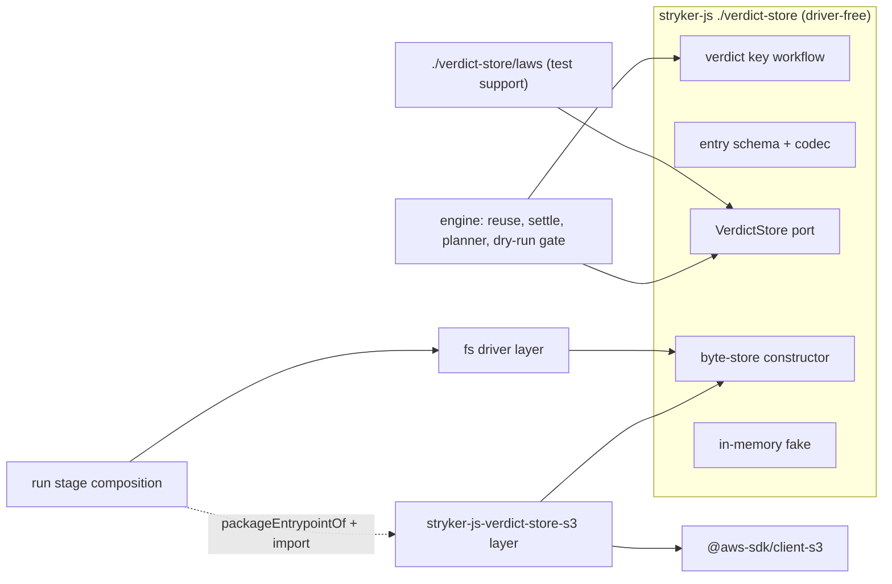
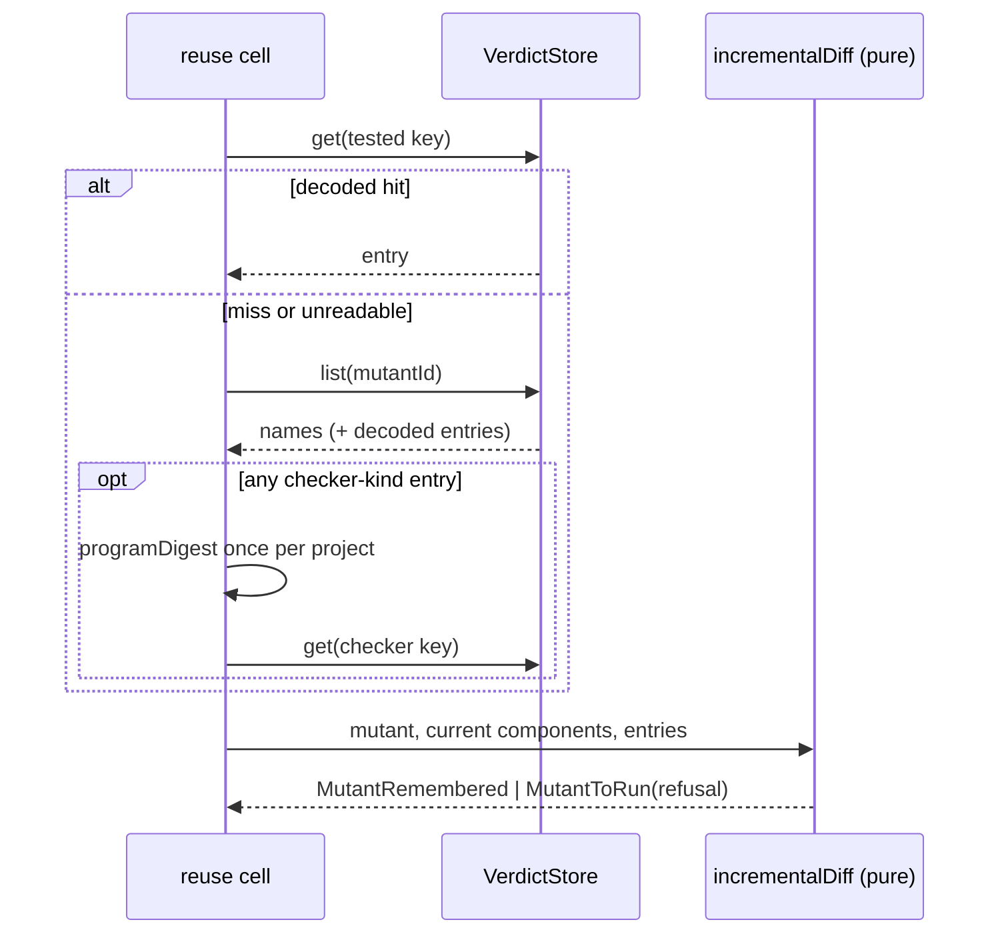

# VerdictStore port with content-addressed verdict keys - Plan

## Goal Capsule

- **Objective:** A mutation verdict is reused in a later run, another shard or another PR exactly when its inputs are byte-identical. An unchanged re-run reuses at least 95% of verdicts, and no concurrent writer or killed process leaves a verdict that reads back wrong.
- **Means:** Per-key immutable entries behind a `VerdictStore` port with an in-memory fake, a filesystem driver and an S3 driver package (KTD1-KTD3, see origin Key Decisions).
- **Authority:** Product Contract (R-IDs) wins on behavior, KTDs win on mechanism, units override neither. `CONSTITUTION.md` and `AGENTS.md` (`BREAK-1`, `PLUG-1`, `START-1`..`START-6`) bind every unit.
- **Stop conditions:** Stop and report instead of working around when emulate 0.12.1 lacks an S3 behaviour the driver needs, when a unit would require editing a read-only surface (`CONSTITUTION.md`, `repos/**`, any workflow other than `.github/workflows/mutation.yml`), or when a new third-party executable dependency beyond `@aws-sdk/client-s3` and `emulate` appears necessary. A root ruling lifts the read-only line for `mutation.yml` in U12-U14 only, as it did for #253, #256 and #263.
- **Execution profile:** Deep. U1-U11 on branch `stryker/verdict-store` (PR #271) from `origin/main` `1e1de6d05`. U12-U14 on the stacked branch `stryker/verdict-store-ci` from `51ac1ac88`, PR base `stryker/verdict-store`. Plain pushes only; merge the parent (and through it `main`) up when it moves. No local mutation runs of any kind.
- **Who ships:** #271 carries U1-U11; the stacked PR carries U12-U14, this plan file (which supersedes the 2026-10-10-1354 plan, itself the successor by move of the 2026-10-10-1244 and 2026-10-09 plans, so the stack adds one plan file, `REPO-D2`), and merges before or with the release that moves the dogfood pin. The operator rules on Open Questions and merges.

---

## Product Contract

Product Contract preservation: restructured, no scope change except `changed: R6, R8, R16, R17` — R6 gains a `settledAt` time so "newest entry" stays defined without file order; R8 names the checker-configuration refusal `checkerConfigChanged` (the origin left the name open); R16 removes the `incrementalSources` option, whose only job (feeding extra verdict records) the store takes over; R17 moves the cross-machine share from an operator residual into the stacked layer (R22-R26). Success Criteria wording on `0574dc1362451398` is corrected: the survivor's site is deleted, so the new collision property kills its replacement.

### Summary

Each verdict, with its measured cost, is stored as its own entry under a key computed from everything that can change it. A run gets each mutant's key; on a miss it lists that mutant's other entries to name the refusal. Every settled verdict is put as soon as it settles. Both drivers use blind last-write-wins writes. One law suite proves the fake, the fs driver and the S3 driver behave the same.

### Problem Frame

Verdict identity is already content-derived (`packages/stryker-js/src/incremental-diff.workflow.ts:98-105`, `packages/stryker-js-instrumenter/src/MutantIdentity.ts:20-35`), so this is mostly a port extraction. It closes four gaps the origin documents with evidence: the key is never materialized (one JSON document per project), tsconfig content reaches the key only for `CompileError` records, the `'\u0000'` separator is ambiguous (survivor `0574dc1362451398`), and every checkpoint rewrites the whole document without fsync (see origin: Problem Frame).

### Key Decisions

- **Blind writes, last-write-wins, on every adapter; no conditional put.** (session-settled: user-directed — chosen over If-None-Match write-once, which emulate 0.12.1 cannot serve and which freezes an unreproduced Timeout, and over write-once fs only, which splits the law suite.) Governs R10, R13, R18.
- **The store takes verdicts and their per-mutant cost; `dryRunCoverage` and `budget` stay in the incremental file.** The execution that produces a verdict also measures its cost, so the cost shares the verdict key and travels with it across shards and PRs, and the planner prices reused mutants with real costs. `dryRunCoverage` and `budget` are keyed by suite inputs and run policy, not per mutant. (session-settled: user-approved — chosen over verdicts only, where cost and verdict could disagree, and over moving the whole file, the largest diff and the heaviest collision with Stream A.) Governs R6, R16, R17.
- **The S3 driver ships as `@systemfsoftware/stryker-js-verdict-store-s3` in `packages/stryker-js-verdict-store-s3`, importing only the port and key-schema entry of stryker-js, with the law suite imported from a test-support entry.** (session-settled: user-directed — chosen over an optional peer inside stryker-js and over a hard dependency; `@aws-sdk/client-s3` must not reach every CLI install.) (pack: cell-architecture, service-and-layer-boundaries.md "Separate Driver Package") Governs R11, R12.
- **CI proves the 95% reuse in a PR e2e journey against emulate's AWS service started by the e2e harness on the host; no AWS credentials.** (session-settled: user-directed — chosen over a main-only mutation.yml step, which never runs on the PR head, and over a real bucket, which needs IaC.) Governs R20.
- **Main's mutation shards share the fs store through GitHub's own mechanisms only: per-shard artifacts, one merge in the report job, `actions/cache` between runs. No AWS, OIDC, role, bucket env or credential of any kind.** (session-settled: user-directed in the stacked-layer contract, chosen over a real bucket.) Governs R17, R22-R26.
- **Entries are grouped by mutant id so a miss can still say why it missed.** Governs R7, R8.
- **No unit of work.** A lost timeout-reproduction increment under a race only delays reuse by one run (pack: cell-architecture, store-serializable-unit-of-work.md). Governs R10.
- **The port sits where Stream A's `stryker-js-contracts` package expects it: one driver-free folder behind one public entry.** `packages/stryker-js/src/verdict-store/` holds the port (`VerdictStore.service.ts`, no Layer), the key workflow, the entry schema, the byte-store constructor and the laws, importing only `effect` and schema modules, so the folder moves as a unit. Layers (in-memory fake, fs driver) live under `packages/stryker-js/src/drivers/` in non-`*.service.ts` modules with no static `*Live` names. (session-settled: user-directed — Stream A plan `docs/plans/2026-10-09-1848-refactor-ports-split-capability-packages-plan.md` KTD1 on branch `stream-a/l1-ports-topology`.) (pack: cell-architecture, ports-separate-from-layers.md) Governs R11.

### Requirements

**Verdict key**

- R1. The verdict key is a full-length digest over a canonical, length-prefixed encoding of: a key-layout version, `engineDigest`, `mutantSetPolicy`, `runInputsDigest`, the mutant identity (file name, mutator, digest of the original text, digest of the replacement, ordinal, location), the mutated file's content digest, the sorted covering test ids, the covering-test closure digest, and the checker configuration digest.
- R2. The checker configuration digest covers the tsconfig chain contents, the checker options, and the TypeScript and checker versions, but not program source files. A run with no checker contributes a fixed no-checker marker.
- R3. A `CompileError` verdict is reused exactly when today's program-digest rule allows (`incremental-diff.workflow.ts:110-123`), so a source edit anywhere in the program still refuses it.
- R4. Key derivation is a pure workflow. Equal inputs produce equal keys, and a change to any single component produces a different key, including component pairs whose plain concatenations collide.

**Store port and entries**

- R5. `VerdictStore` is a `Context.Service` port with three operations: get an entry by key, put an entry by key, and list the entries for a mutant id. Its module imports no driver and exports no Layer.
- R6. An entry is a schema-decoded record carrying its full key components, the remembered status, `coveredBy`, `killedBy`, `testsCompleted`, timeout evidence, the measured cost and the time it settled. Source text never enters an entry: the identity components are file name, mutator, location, ordinal and the digests of the original and replacement text (session-settled: user-directed — a shared bucket must not hold source code, and refusal naming needs only component equality).
- R7. On a hit, the run reuses the entry under today's reuse rules: remembered statuses only, an unreproduced wall-clock Timeout refused, flaky dependence refused.
- R8. On a miss, the run names the refusal by today's fixed precedence, comparing against the newest listed entry for that mutant id; a changed checker configuration is refused as `checkerConfigChanged`. With no entries listed, the reason is `noPriorRecord`.
- R9. A missing, torn or undecodable entry reads as a miss and never fails the run. The `reuse` event counts undecodable entries under a new refusal reason, `entryUnreadable`, and lookups the store could not serve under `storeUnavailable`.
- R10. A put replaces any entry at that key. Concurrent puts to one key leave exactly one of the written entries, never a mix. The timeout-reproduction upgrade is an overwrite at the same key.

**Adapters and packaging**

- R11. stryker-js publishes the port, key workflow, entry schema and byte-store constructor from one declared public entry, and the shared law suite from a test-support entry. The in-memory fake is an internal driver Layer. The S3 package imports nothing else from stryker-js.
- R12. `@systemfsoftware/stryker-js-verdict-store-s3` exports a parameterized `layer(options)` over `@aws-sdk/client-s3`, pinned exactly through the pnpm catalog at the org line `3.1095.0`. The CLI loads it from the project install only when configuration selects S3; if the package is missing, the run is refused with an error that names it.
- R13. The fs driver writes each entry to a temp file inside the store directory, fsyncs it, and renames it over the key path. Readers never treat leftover temp files as entries.
- R14. Store configuration selects the fs driver (the default, a directory under the project's reports) or S3 (bucket, prefix, region, endpoint, path-style). An S3 endpoint must be https unless its host is loopback or the microsandbox host gateway; credentials come only from the SDK default chain, never from store options. Store options join the non-fingerprinted storage keys (`packages/stryker-js/src/verdict-semantics.ts:90`), and the fs directory joins `strykerOutputFilesOf` (`packages/stryker-js/src/stryker-outputs.ts:9-25`), so a run never hashes its own store.

**Run behavior**

- R15. A run puts each verdict as soon as it settles, so a run interrupted or killed at any point leaves every verdict that settled before the kill reusable.
- R16. Every reader of prior verdicts or prior per-mutant cost reads the store: run-time reuse, the planner's pricing, and the deferrable-dry-run decision. The incremental file and the shard union stop carrying verdict records and costs, and the `incrementalSources` option is removed.
- R17. Shards writing to one store need no merge step for verdicts inside the engine. Across machines, main's Mutation workflow carries the store between jobs and between runs (R22).
- R21. The store is trusted input: anyone who can write it can forge verdicts. A PR from a fork must not write a store that main reads. The solution doc and the option docs say so.

**Main's shared store (stacked layer)**

- R22. The plan job and every mutation shard start from the newest combined store, `<project>/reports/stryker-verdicts/` for each project in `PROJECTS`, restored from `actions/cache`. Each shard uploads, as one artifact, the entries under the mutant ids its plan entry names. The report job restores the same store, lays every shard's part over it in plan shard order (one entry name in two parts: the later part wins, and either is a valid verdict), and saves the result under a key derived from the merged store's content, so the next run of an unchanged `main` restores everything this run wrote.
- R23. Under a CLI that predates the store (the released 18.1.0 that the dogfood pin installs today), no store directory exists. Every new step then succeeds as a no-op and leaves the incremental-report cache and the plan as they are; reuse still follows today's run-inputs rule, so a tree whose lockfile or package manifest differs from the cached run re-runs every mutant once (Risks). Store reuse is measured on the second main mutation run after a release moves the pin: the first only writes the store, because v4 verdicts are discarded (KTD8).
- R24. Each shard's stage step and the report's merge step write a step summary: staged entries per project (shard); parts merged out of shards planned, entries merged, collisions (entry names that more than one part carried), skipped non-entry files, store size and cache key (report). A failure prints a reason code and the next action in its error annotation, never "see logs". A planned shard with no part is a warning that names the shard, not a failure: its mutants re-run next time.
- R25. No existing mutation job grows by more than its store restore, stage or merge, and save. No job of this layer runs on pull requests, so the 10-minute PR-job budget is untouched. The PR body states the cache size and that it costs nothing beyond GitHub cache storage.
- R26. `workflow_dispatch` runs of `mutation.yml` on `stryker/verdict-store-ci` are green in every job. The proof run, an unchanged re-run on the same head after a seeding run, reuses at least 95% of each project's mutants, read from its own plan output. The PR body quotes both runs' URLs and per-project counts, and says that the first main mutation run after a release moves the dogfood pin writes the store and the next one reuses it, so this layer merges before or with that release.

**Proof**

- R18. One law suite, defined once and run on the fake, the fs driver and the S3 driver against emulate 0.12.1 through `createEmulator({ service: 'aws' })`, `reset()` and `close()`, proves:
  - get after put returns the value put, and repeated gets return the same value;
  - puts on different keys commute;
  - an absent key reads as a miss;
  - concurrent puts to one key are last-write-wins with no mix;
  - a corrupt entry reads as a miss;
  - the timeout-upgrade overwrite works.

  The fs suite also plants a leftover temp file and a truncated entry. (pack: boundary-testing, fake-and-real-store-laws.md)
- R19. An e2e journey runs real CLI processes concurrently against one store, SIGKILLs one mid-run, and shows that a following run decodes every entry (`entryUnreadable` is 0) and reuses every entry the killed process put (counted from the store, which holds only remembered statuses).
- R20. An e2e journey in the ci.yml e2e lane runs the packed CLI twice on an unchanged fixture against the S3 driver pointed at emulate on the host. It passes only when the second run's own `reuse` event shows `reused / (reused + ran) >= 0.95`.

### Acceptance Examples

- AE1. **Covers R2, R4, R8.** Given a remembered `Survived` verdict, when only `tsconfig.json` changes `strict`, the key changes and the mutant runs again with refusal `checkerConfigChanged`.
- AE2. **Covers R9.** Given an entry file truncated mid-JSON, when a run looks up that key, the mutant runs, the run succeeds, and `reuse.refused.entryUnreadable` is 1.
- AE3. **Covers R10.** Given an unreproduced wall-clock Timeout entry, when the re-run times out again, the entry at the same key is replaced with `reproductions: 1`, and a third run reuses it.
- AE4. **Covers R15, R19.** Given a run SIGKILLed mid-run, when a new run starts, every entry the killed run put is reused.
- AE5. **Covers R23.** Given the released 18.1.0 CLI, when the dispatch run finishes, every stage step reports 0 entries, the merge reports 0 entries and no key, both cache steps are skipped, and every job is green.
- AE6. **Covers R22.** Given two shards whose parts both carry `<scheme>/<id>/tested-<key>.json`, where `<scheme>` is `schemeDirectoryOf(VerdictKeyScheme)` (`packages/stryker-js/src/verdict-store/VerdictKeyScheme.schema.ts`), the merged store holds the second part's bytes and the summary counts one collision.

### Success Criteria

- The R20 journey is green on the PR head, and its assertion reads the CLI's own NDJSON `reuse` event, not a hand-computed count.
- The R18 law suite runs, with no skips, in the stryker-js and S3-package test tasks on the PR head.
- The R4 collision property kills the replacement of survivor `0574dc1362451398` (the `'\u0000'` join at `incremental-diff.workflow.ts:105`, deleted by U6). The entry round-trip and reuse properties target the `rememberedOf` survivors (`7c2e2e9e9da4fc43`, `c5b364135610b3a4`, `174b8e52f6c5c584`, `a4deb93c48d0b4bd`, `ec2b75971f004744`, `5c5af2eb451aef17`, `6ac950f8cd326ba3`, `e0c3736e2c4fa506`), the timeout-evidence survivor `e6d78dc9239886fb`, and the admission survivor `6d5ddbf66bb2928a` (`admit-incremental-report.workflow.ts:19`), all from main report `mutation-report-416` (head `1e1de6d05`). Main mutation runs grade them after merge.
- The stacked layer's proof run (R26) is green in every job and its plan output shows, per project, at least 95% of mutants reused on an unchanged re-run of the seeding run's head.

### Scope Boundaries

- Moving `dryRunCoverage` and `budget` into the store, and sharing dry runs across PRs. They are keyed by suite inputs and run policy, not by the verdict key; see Deferred to Follow-Up Work.
- Retention and pruning of store entries; S3 lifecycle rules or cache eviction own it. Known limit: every mutation.yml save whose store changed writes a full copy under a new cache key, bounded only by GitHub's cache eviction (`docs/verdict-store.md`, Known limits).
- Conditional writes, multipart upload, Range reads.
- Stream A's package split; this work only places the port where that split expects it.
- Any mock of the S3 client: no `vi.mock`, no `aws-sdk-client-mock`, no hand-rolled S3 server, no patch or wrapper of emulate.
- Considered and not built: migrating v4 incremental verdicts into the store. The first run after upgrade re-runs every mutant once, which the run's own `reuse` event shows at once; a migration would be stored-data code kept alive for one run.
- Considered and not built: sweeping leftover temp files. A killed run leaves at most one small temp file per in-flight put, readers ignore them (R13), and cache eviction removes the directory; evidence of unbounded growth would change the call.
- Considered and not built: batching per-mutant S3 lists into one prefix scan. The PR fixture and fs-backed main runs never feel the latency; a real-bucket run on main (follow-up) would.

### Deferred to Follow-Up Work

- A real shared S3 bucket for main's mutation shards (IaC, credentials, workflow wiring). The stacked layer's fs store through artifacts and `actions/cache` covers main until then.
- `dryRunCoverage` and `budget` as a later store candidate under their own suite-input and run-policy keys. Until then they stay in the incremental file, which mutation.yml keeps caching and re-seeding (KTD8).

### Sources / Research

- Origin: `docs/brainstorms/2026-10-09-1842-feat-verdict-store-requirements.md`.
- `docs/solutions/tooling-decisions/verdict-cache-content-keyed-reuse.md` (content key, named refusal, reproducible-only verdicts, outputs excluded from the crawl).
- `docs/plans/2026-09-29-0427-feat-state-of-the-art-mutation-testing-plan.md` R5, R8-R10, R38, KTD1-KTD2.
- `docs/solutions/build-errors/e2e-lane-packed-a-subset-of-its-workspace-closure.md` (I1 closure completeness, I2 derived packaging set).
- emulate 0.12.1 S3 routes: `packages/@emulators/aws/src/routes/s3.ts:300-393` (PutObject upserts unconditionally). S3 never stores partial objects ([PutObject](https://docs.aws.amazon.com/AmazonS3/latest/API/API_PutObject.html)) and is strongly read-after-write consistent ([consistency](https://docs.aws.amazon.com/AmazonS3/latest/userguide/Welcome.html#ConsistencyModel)).

---

## Planning Contract

### Key Technical Decisions

- KTD1. **Two key kinds over one canonical encoding.** A `tested` key carries R1's components. A `checker` key replaces covering ids, closure and checker configuration with the checker's `programDigest`, so R3 holds by key equality. The encoding is a tagged, length-prefixed component list plus a layout version, hashed with SHA-256 to 64 hex chars, which removes the `'\u0000'` ambiguity (pack: schema-laws, refusals-beside-generated-laws.md).
- KTD2. **Object name `<prefix>/v1/<mutantId>/<kind>-<keyHex>.json`.** Listing by mutant id is one prefix list. The kind in the name lets the deferrable-dry-run decision and the lazy `programDigest` probe decide from names alone, as `programDigestAtPlanTime` does from texts today (`packages/stryker-js/src/plan-request.cell.ts:201-219`).
- KTD3. **Drivers are byte stores; the port module owns naming, codec and decode-as-miss.** fs and S3 implement get-bytes, put-bytes and list-names; a constructor in the port module turns them into the typed `VerdictStore`, so all adapters share one decode path and differ only in I/O and atomicity (pack: cell-architecture, ports-separate-from-layers.md, service-and-layer-boundaries.md).
- KTD4. **Matching is key equality; refusal naming compares the newest listed entry (by `settledAt`) component by component.** Precedence: `semanticsChanged` > `policyChanged` > `runInputsChanged` > `checkerConfigChanged` > `programChanged` > `closureAnalysisFailed` > `closureChanged` (closure digest, covering ids, file content or location changed) > `timeoutUnreproduced` > `noPriorRecord`. A mutant whose only listed entries are undecodable is refused `entryUnreadable`; a mutant whose lookup returned `unavailable` is refused `storeUnavailable`. The pure decision stays in `incrementalDiff`; it receives decoded entries instead of report records.
- KTD5. **The checker configuration digest comes from the checker's existing `digest` RPC with a scope parameter.** `CheckerDigestRequest` gains `config | program`. `config` hashes `programKeyOf` with no source files (`packages/stryker-js-typescript-checker/src/program-digest.schema.ts:10-24`, `ts-compiler.handle.ts:349-375`) and must not build the program. This reuses the extends resolution of #255/#257 instead of duplicating it in stryker-js. Breaking for checker plugins (`BREAK-1`).
- KTD6. **The law suite is data, not vitest calls.** The test-support entry exports named laws (Schema-described inputs plus an Effect check) and a harness contract `{ layer, corrupt(name), reset }`. Each adapter's test registers them with `it.effect.prop`, so stryker-js gains no vitest runtime or peer dependency and the S3 package imports the laws instead of copying them (pack: boundary-testing, fake-and-real-store-laws.md).
- KTD7. **The CLI loads the S3 Layer in-process from the project install.** It reuses `packageEntrypointOf` and `importModule` from `packages/stryker-js/src/plugin-loader.service.ts:420-432`. A planning probe ran two copies of `effect@4.0.0-rc.117` in one Node process, each declaring its own `Context.Service()('VerdictStore')` class: a `Layer.effect` built by copy B, with a finalizer and a typed failure, served the tag class declared in copy A (`OK [ 'got:k1', 'StoreUnavailable' ]`, finalizer ran). Services resolve by key string, so a second installed copy of the port module resolves the same service. The S3 package peers `effect` on the same catalog range.
- KTD8. **Incremental file layout v5.** `INCREMENTAL_CACHE_VERSION` moves `'4'` → `'5'` (`verdict-semantics.ts:18`). The file keeps the identity header, `dryRunCoverage` and `budget`, and drops `files`, `costs` and `testFiles`. The checkpoint keeps writing that header, coverage and budget; `checkpoint-mutants.workflow.ts` and its `Pending` rows are deleted.
- KTD9. **S3 driver mechanics.** `S3Client` is built from options (bucket, prefix, region, endpoint, `forcePathStyle`) with credentials only from the SDK default chain. A configured endpoint must be https unless its host is loopback or `host.microsandbox.internal`; anything else fails layer acquisition with `VerdictStoreUnavailable`. Put is a blind `PutObject` with a string body. `NoSuchKey` is a miss. Listing paginates `ListObjectsV2` by prefix. Catalog pins are exact: `@aws-sdk/client-s3: 3.1095.0` (the org line of `@aws-sdk/client-ec2`/`client-secrets-manager`/`client-service-quotas` in github-selfhosted-runner's catalog) and `emulate: 0.12.1`, both resolved under `minimumReleaseAge` without touching `minimumReleaseAgeExclude`.
- KTD10. **e2e harness owns emulate as a scoped host service.** It is acquired with `createEmulator({ service: 'aws' })`, released with `close()`, and creates one bucket per journey. The endpoint is rewritten to `host.microsandbox.internal` the way `test/e2e/src/Harness/stryker-cli-runner.service.ts:9-18` rewrites OTLP. AWS env reaches the CLI through a new `env` field on `StrykerRunInput` threaded into `runEnvironment` (`test/e2e/tests/__fixtures__/e2e-harness.fixture.ts:127-160`). The S3 package joins `ENTRY_PACKAGES` (`test/e2e/src/Harness/fixture-cache.service.ts:100-105`) so its tarball is packed by derivation (I2).
- KTD11. **fs atomicity.** Write to a uniquely named temp file in the store directory (same filesystem), fsync the file, rename it over the key path. Listing accepts only names matching `<kind>-<64 hex>.json`.
- KTD12. **Store I/O failure degrades; misconfiguration fails fast.** Port operations return outcomes rather than failing: get and list report `unavailable` beside `unreadable`, and a put reports `skipped`. The reuse cell counts an `unavailable` lookup as `storeUnavailable`. The settle path logs a skipped put and keeps the run going. The run emits one warning with the unavailable and skipped counts. Layer acquisition probes the store without writing an entry (fs: create the root directory and confirm it is a directory; S3: `HeadBucket`) and fails the run with a named `VerdictStoreUnavailable` error before instrumentation. A store outage then never aborts a long run, and a store that is wrong from the start is never silently useless.
- KTD13. **A shard's part is selected by the plan, not by time.** The stage step copies every entry file whose parent directory is a mutant id that `plan.json` assigns to this shard and project. The plan assigns every mutant, reused or not, to exactly one shard (main run `38048403407`'s `plan.json`: 20 shards, 9366 mutant ids, equal to its `plan 9366 mutants` line), so the parts partition the store's live mutants: each part carries the entries its shard put this run plus the restored entries of its mutants, and the upload per run is about one store's size. No file-time or snapshot logic. Only names matching `<tested|checker>-<64 hex>.json` are staged, so a killed put's leftover temp file never travels (mirrors `ENTRY_FILE_NAME` in `packages/stryker-js/src/verdict-store/verdict-blobs.ts`; a mismatch shows as staged 0 against a non-empty store). Collisions are then 0 unless two shards were assigned one mutant.
- KTD14. **The cache key is the merged store's content digest.** `mutation-verdicts-<sha256 over sorted (relative path, sha256 of bytes)>`, computed by the merge script and saved only when a lookup-only restore misses. Restores use that prefix and get the newest cache. An unchanged re-run saves nothing new, so cache churn tracks real change. The store only grows (no pruning), so the newest cache always contains every older one's entries, except a timeout-upgrade overwrite, which is the newer verdict anyway.
- KTD15. **One Node-runnable TypeScript script, `scripts/verdict-store-parts.ts`, with `stage` and `merge` subcommands.** Its decisions are pure exported functions (which files a shard stages, which part wins per name, collisions, skips, the content key, the summary text, reason codes); `main` does the I/O. Node 24 runs it as `node scripts/verdict-store-parts.ts` in mutation jobs with no Deno or Nix install; `ci.yml`'s `Repo scripts tests` step runs its Deno property tests (`./bin/deno test --config=scripts/deno.json scripts/`). Same shape as `scripts/change-lane.ts`.
- KTD16. **Trust (R21).** `mutation.yml` runs on `push` to `main`, `schedule` and `workflow_dispatch`, all trusted cache writers; it never runs on `pull_request`. A dispatch on a branch saves to that branch's scope only, so the proof runs cannot write the store `main` restores.

### High-Level Technical Design

Component boundaries; arrows are imports, and the dashed edge is the runtime load from the project install.



Reuse lookup per mutant, after the dry run. This is directional guidance; U6 owns the mechanism.



### Output Structure

```text
packages/stryker-js/src/verdict-store/
  verdict-key.workflow.ts        # U1
  VerdictEntry.schema.ts         # U1
  VerdictStore.service.ts        # U2 port (no Layer)
  verdict-blobs.ts               # U2 byte-store constructor + codec
  laws.ts                        # U2 test-support laws
  mod.ts / laws-mod.ts           # U2 public entries
packages/stryker-js/src/drivers/memory-verdict-store.ts      # U2 fake Layer
packages/stryker-js/src/drivers/fs-verdict-store.layer.ts   # U4
packages/stryker-js-verdict-store-s3/                        # U9
  src/mod.ts  src/s3-verdict-store.layer.ts
  tests/s3-verdict-store.laws.integration.test.ts
  package.json tsdown.config.ts vitest.config.ts api-extractor.json tsconfig*.json etc/
test/e2e/testResources/verdict-store-fixture/               # U10
test/e2e/tests/verdict-store-reuse.e2e.test.ts               # U10
test/e2e/tests/verdict-store-concurrency.e2e.test.ts         # U10
```

### Assumptions

- Stream A's plan puts ports and cross-seam schemas in `stryker-js-contracts`, reuse and reporting in `stryker-js-engine`, and Layers in `drivers/` (operator ruling on Q3).
- The `e6d78dc9239886fb` survivor id is carried from the origin; the planning session did not re-read its line.

### Risks & Dependencies

- **Stream A collision.** U6-U8 touch the engine files Stream A will move. Merge `main` early and often; keep the port folder free of engine imports so it moves as a unit.
- **Effect version skew.** KTD7's probe covers equal versions only. A project whose installed `effect` differs from the CLI bundle's could break the in-process Layer; the S3 package's `effect` peer range and the CLI's own `effect` peer keep them on one catalog line.
- **emulate and SDK checksums.** `@aws-sdk/client-s3` 3.729.0 and later computes a CRC32 checksum for every upload by default ([SDK guide](https://docs.aws.amazon.com/sdk-for-javascript/v3/developer-guide/s3-checksums.html)). The laws run with SDK defaults first. If get-after-put fails because of the checksum framing, the client sets `requestChecksumCalculation: 'WHEN_REQUIRED'` and `responseChecksumValidation: 'WHEN_REQUIRED'` (valid against real S3; operator ruling), and the PR body records which was needed. Any other emulate gap is a stop.
- **First full run after upgrade.** v4 verdicts are discarded (KTD8), so main's first run after the release re-runs every mutant once.
- **The proof run cannot reuse against main's cache.** The released 18.1.0 `runInputsDigest` hashes the nearest lockfile (`inputs.lockfile` in its `dist/run-stages-*.mjs`; source `packages/stryker-js/src/verdict-semantics.ts:123,171` on `main`), and the stack changes `pnpm-lock.yaml`, so a first dispatch run on the branch refuses every mutant `runInputsChanged`. Hence two runs: a seeding run whose branch-scoped caches the proof run, on the same head, restores (U14). `settled-decision-invalidated`: the contract named one dispatch run.
- **Cache eviction.** GitHub evicts least-recently-used caches past the repository limit. The store cache competes with the pnpm store (about 269 MB) and the build cache; the PR body states the store size from the merge summary.

---

## Implementation Units

| U-ID | Title                                                    | Key files                                                                                                                                                                                      | Depends on |
| ---- | -------------------------------------------------------- | ---------------------------------------------------------------------------------------------------------------------------------------------------------------------------------------------- | ---------- |
| U1   | Verdict key workflow and entry schema                    | `packages/stryker-js/src/verdict-store/verdict-key.workflow.ts`, `VerdictEntry.schema.ts`                                                                                                      | —          |
| U2   | Port, byte-store constructor, fake, laws, public entries | `packages/stryker-js/src/verdict-store/*`, `packages/stryker-js/package.json`, `tsdown.config.ts`                                                                                              | U1         |
| U3   | Checker configuration digest                             | `packages/stryker-js-plugin-interface/src/PluginRpcs.service.ts`, `packages/stryker-js-typescript-checker/src/ts-compiler.handle.ts`, `packages/stryker-js/src/Checker/checker-pool.handle.ts` | —          |
| U4   | fs driver                                                | `packages/stryker-js/src/drivers/fs-verdict-store.layer.ts`                                                                                                                                    | U2         |
| U5   | Store option and driver selection                        | `packages/stryker-js-plugin-interface/src/stryker-options.schema.ts`, `packages/stryker-js/src/run/RunEnvironment.service.ts`                                                                  | U2, U4     |
| U6   | Reuse read path through the store                        | `packages/stryker-js/src/incremental-diff.workflow.ts`, `run/incremental-reuse.cell.ts`, `packages/stryker-js-cli-contract/src/run-event.schema.ts`                                            | U1-U5      |
| U7   | Write path and incremental file v5                       | `packages/stryker-js/src/mutation-reporting.service.ts`, `run/mutant-run.ts`, `run/mutant-settlement.ts`, `IncrementalReport.schema.ts`, `shard/incremental-union.ts`                          | U6         |
| U8   | Planner pricing and dry-run gate from the store          | `packages/stryker-js/src/plan-request.cell.ts`, `run/deferrable-dry-run.cell.ts`, `run/incremental-reuse.ts`                                                                                   | U6         |
| U9   | S3 driver package                                        | `packages/stryker-js-verdict-store-s3/**`, `pnpm-workspace.yaml`                                                                                                                               | U2         |
| U10  | e2e journeys                                             | `test/e2e/src/Harness/*`, `test/e2e/tests/verdict-store-*.e2e.test.ts`, `test/e2e/tests/enterprise-runner-resilience.e2e.test.ts`                                                              | U5-U9      |
| U11  | Docs and changesets                                      | `docs/solutions/tooling-decisions/verdict-cache-content-keyed-reuse.md`, `.changeset/*`                                                                                                        | U1-U10     |
| U12  | Stage and merge script for store parts                   | `scripts/verdict-store-parts.ts`, `scripts/verdict-store-parts.test.ts`                                                                                                                        | U7         |
| U13  | mutation.yml carries the store between jobs and runs     | `.github/workflows/mutation.yml`                                                                                                                                                               | U12        |
| U14  | Dispatch proof and PR body                               | stacked PR body                                                                                                                                                                                | U13        |

### U1. Verdict key workflow and entry schema

**Goal:** A pure workflow that derives `tested` and `checker` keys, and the schema of a stored entry.

**Requirements:** R1, R2 (component only), R3, R4, R6; KTD1.

**Dependencies:** None.

**Files:**

- Create `packages/stryker-js/src/verdict-store/verdict-key.workflow.ts`, `packages/stryker-js/src/verdict-store/VerdictEntry.schema.ts`.
- Test `packages/stryker-js/src/verdict-store/__tests__/verdict-key.workflow.property.test.ts` (decision properties). The entry schema's codec laws go in-source, following `packages/stryker-js/src/Worker.schema.ts:98` and `docs/plans/2026-09-30-1853-perf-in-source-schema-laws-plan.md`.

**Approach:**

- Use a `Workflow.make` command/decision pair like `incrementalDiff` (`incremental-diff.workflow.ts:306-311`) (pack: cell-architecture, pure-decision-workflows.md).
- The command carries the components as branded schema fields. The decision is a branded 64-hex `VerdictKey` plus its kind.
- The entry schema carries the key, kind, every component (so U6 can name refusals) with original and replacement text as digests only, status restricted to `RememberedStatusSchema`, the optional verdict fields of today's `PreviousReuseRecordSchema` (`packages/stryker-js/src/IncrementalDiff.schema.ts`), `costMs` and `settledAt`.

**Patterns to follow:** `packages/stryker-js/src/incremental-diff.workflow.ts` command shape; `packages/stryker-js-instrumenter/src/MutantIdentity.ts` length prefixing; `@systemfsoftware/vitest` `it.prop` with schema arbitraries (`packages/stryker-js/src/__tests__/incremental-diff.workflow.property.test.ts`).

**Test scenarios:**

- Equal commands give equal keys, over generated commands.
- Changing any single component (each field in turn, generated values) changes the key.
- Two commands whose components differ but whose plain `'\u0000'`-joined strings are equal (for example `["a\u0000b", "c"]` vs `["a", "b\u0000c"]`) give different keys.
- Reordering covering test ids does not change the key; adding or removing one does.
- A `checker` key ignores covering ids and closure digest but changes with `programDigest`.
- An entry encodes and decodes to an equal value; a status outside `RememberedStatusSchema` (e.g. `RuntimeError`, `Pending`) is refused at decode (pack: schema-laws, refusals-beside-generated-laws.md, arbitrary-filter-floors.md).

**Verification:** The properties pass under `pnpm --filter @systemfsoftware/stryker-js test`, and the collision scenario fails if the encoding is swapped for a plain join.

### U2. Port, byte-store constructor, fake, laws, public entries

**Goal:** The `VerdictStore` port and everything a driver package needs, published from two entries.

**Requirements:** R5, R9, R10, R11, R18; KTD2, KTD3, KTD6.

**Dependencies:** U1.

**Files:**

- Create `packages/stryker-js/src/verdict-store/VerdictStore.service.ts`, `verdict-blobs.ts`, `laws.ts`, `mod.ts`, `laws-mod.ts`, and `packages/stryker-js/src/drivers/memory-verdict-store.ts` (the fake Layer).
- Modify `packages/stryker-js/package.json` (exports and `publishConfig.exports` for `./verdict-store` and `./verdict-store/laws`), `packages/stryker-js/tsdown.config.ts` (entry keys), the api-extractor inputs and `packages/stryker-js/etc/` report.
- Test `packages/stryker-js/tests/memory-verdict-store.laws.integration.test.ts`.

**Approach:**

- The port module declares `Context.Service` with get, put and list returning outcomes per KTD12, plus the `VerdictStoreUnavailable` error that only layer acquisition raises. It holds no Layer and imports no driver (pack: cell-architecture, ports-separate-from-layers.md).
- The byte-store constructor builds object names per KTD2. On read, an undecodable object is reported as unreadable, never as a failure (R9).
- The fake keeps encoded bytes in a `Ref` map so `corrupt` exercises the same decode path.
- `laws.ts` exports R18's laws and the harness contract (KTD6). The concurrency law forks N puts of distinct entries to one key and asserts the read equals one of them byte for byte.

**Patterns to follow:** `packages/stryker-js/package.json:97-142` subpath exports with the `@systemfsoftware/source` condition; `tsdown.config.ts` main entry block.

**Test scenarios:**

- Every R18 law passes on the fake.
- `corrupt(name)` followed by get gives a miss, and list reports the name as unreadable.
- list for a mutant id with no entries is empty; entries of another mutant id never appear.

**Verification:** `pnpm --filter @systemfsoftware/stryker-js build api:check test` pass with the new report committed.

### U3. Checker configuration digest

**Goal:** stryker-js can ask each checker for a configuration-only digest without building a program.

**Requirements:** R2; KTD5.

**Dependencies:** None.

**Files:**

- Modify `packages/stryker-js-plugin-interface/src/PluginRpcs.service.ts`, the `CheckerDigestRequest` schema module, `packages/stryker-js-plugin-interface/src/Checker.service.ts`.
- Modify `packages/stryker-js-typescript-checker/src/ts-compiler.handle.ts`, `program-digest.schema.ts`.
- Modify `packages/stryker-js/src/Checker/Checker.handle.ts`, `packages/stryker-js/src/Checker/checker-pool.handle.ts`.
- Test `packages/stryker-js-typescript-checker/tests/` (config-digest integration test beside the existing program-digest tests) and `packages/stryker-js/src/Checker/__tests__/` for the pool fold.

**Approach:**

- The `config` scope feeds `programKeyOf` the versions, options and `tsConfigChainOf` files with `sourceFiles: []`.
- The pool folds per-checker digests by name in a pure function, as `programDigestOf` does (`checker-pool.handle.ts:183-221`). With no checkers configured it returns the fixed marker.
- Answering `config` must not trigger `init`'s program build. UNVERIFIED that the worker serves `digest` before `init`; the implementer confirms against `ts-compiler.handle.ts` before wiring.

**Test scenarios:**

- Editing a source file leaves the config digest equal while the program digest changes.
- Editing a tsconfig in the extends chain (including a package base resolved per #257) changes the config digest.
- Changing `typescriptChecker` options changes the config digest.
- Property on the fold: any permutation of the same named digests gives the same pool digest, and an empty set gives the marker.

**Verification:** typescript-checker and stryker-js tests pass; `PLUG-1` build gate passes for the checker worker bundle.

### U4. fs driver

**Goal:** A filesystem `VerdictStore` Layer that survives concurrent writers and kills.

**Requirements:** R10, R13, R18; KTD3, KTD11.

**Dependencies:** U2.

**Files:**

- Create `packages/stryker-js/src/drivers/fs-verdict-store.layer.ts`.
- Test `packages/stryker-js/tests/fs-verdict-store.laws.integration.test.ts`.

**Approach:**

- Directory per mutant id under the configured root. Put = open a unique temp file in the target directory, write, `sync`, close, `rename`.
- List reads the mutant directory and keeps only names matching KTD11.
- Replaces nothing in `atomic-write.cell.ts`; that helper stays for the incremental file.

**Patterns to follow:** `packages/stryker-js/src/atomic-write.cell.ts` temp naming and cleanup on failure (pack: boundary-testing, real-system-oracles.md — real temp directories, no fs fakes).

**Test scenarios:**

- Every R18 law passes against a real temp directory.
- A planted `*.tmp` file beside an entry is invisible to list and get.
- The fs harness's `corrupt(name)` truncates the entry file mid-JSON, so R18's corrupt-entry law covers the torn file a killed rename-less writer would leave.

**Verification:** The law file runs in the stryker-js `test` task with no skips.

### U5. Store option and driver selection

**Goal:** Configuration picks fs or S3, and the run stage provides the matching Layer.

**Requirements:** R12, R14, R16 (`incrementalSources` removal); KTD7.

**Dependencies:** U2, U4.

**Files:**

- Modify `packages/stryker-js-plugin-interface/src/stryker-options.schema.ts` (new `verdictStore` tagged union, default fs at `reports/stryker-verdicts`; delete `incrementalSources`).
- Modify `packages/stryker-js/src/verdict-semantics.ts:90`, `packages/stryker-js/src/stryker-outputs.ts`, `packages/stryker-js/src/run/incremental-reuse.ts` (remove the sources glob).
- Modify `packages/stryker-js/src/run/RunEnvironment.service.ts`, `packages/stryker-js/src/run/StageServices.service.ts`, `packages/stryker-js/src/run/run-stages.ts`.
- Create `packages/stryker-js/src/run/verdict-store-layer.cell.ts` (driver selection and S3 load).
- Test `packages/stryker-js/tests/verdict-store-selection.integration.test.ts`; update `packages/stryker-js/tests/plan-shard-reuse.integration.test.ts` and `plan-stream-location.integration.test.ts`, which set `incrementalSources`.

**Approach:**

- Selection is a pure decision on the option; the cell imports the S3 package's entry via `packageEntrypointOf` + `importModule` and decodes its `layer` export before use.
- A missing package fails with a tagged error naming `@systemfsoftware/stryker-js-verdict-store-s3` and the install command; the CLI exit maps it like other config refusals.
- The store Layer joins `stageLayerOf` beside `MutationReporting.layer` (`RunEnvironment.service.ts:99-130`) and the headless `strykerCell` path.

**Test scenarios:**

- `verdictStore: { kind: 's3', ... }` with the package absent from the project fails before instrumentation with the named error.
- Two option sets differing only in `verdictStore` give the same options fingerprint.

**Verification:** stryker-js and plugin-interface tests pass; plugin-interface api report regenerated.

### U6. Reuse read path through the store

**Goal:** Run-time reuse reads the store and names refusals per KTD4.

**Requirements:** R3, R7, R8, R9, R16; KTD2, KTD4.

**Dependencies:** U1-U5.

**Files:**

- Modify `packages/stryker-js/src/incremental-diff.workflow.ts` (key-equality matching; refusal precedence; delete `keyOf` and record-field matching), `packages/stryker-js/src/IncrementalDiff.schema.ts` (refusal literals `checkerConfigChanged`, `entryUnreadable`; records become entries).
- Modify `packages/stryker-js/src/run/incremental-reuse.cell.ts` (build components per mutant: covering ids from `testCoverage.testsByMutantId`, closure digests, file content digest; get, then list; lazy `programDigest`; lazy config digest).
- Modify `packages/stryker-js-cli-contract/src/run-event.schema.ts` (`ReuseRefusals` gains `checkerConfigChanged` and `entryUnreadable`) and its api report.
- Test `packages/stryker-js/src/__tests__/incremental-diff.workflow.property.test.ts` (rewrite against entries), `packages/stryker-js/tests/incremental-reuse.integration.test.ts`, `packages/stryker-js/tests/compile-error-reuse.integration.test.ts`, `packages/stryker-js/tests/wall-clock-timeout.integration.test.ts`.

**Approach:**

- `incrementalDiff` stays the pure owner of reuse rules; the cell only gathers entries and current components.
- `programDigest` is probed once per project only when a listed name has the `checker` kind.
- An entry that `get` reported unreadable is not counted again when list returns it.
- Without dry-run coverage (the deferred dry run, `run/deferrable-dry-run.cell.ts:65-118`) no `tested` key exists, so the cell looks up `checker` kinds only.
- New and rewritten integration tests run in-process through `strykerCell` or the composed run layer. They never spawn the CLI.

**Test scenarios:**

- Property: an entry whose components equal the current ones and whose status is remembered is reused; any single differing component refuses it with the reason KTD4's precedence names.
- A wall-clock Timeout entry with `reproductions: 0` is refused `timeoutUnreproduced` and its timeout evidence reaches the mutant to run.
- A flaky-dependent mutant is refused `flakyDependency` even when its key hits.
- A `CompileError` entry is reused when `programDigest` is unchanged and refused `programChanged` after an edit to any program source (AE: R3).
- AE1: changing only `strict` in `tsconfig.json` refuses a `Survived` entry with `checkerConfigChanged`.
- AE2: a truncated entry makes the mutant run, the run succeeds, and the `reuse` event reports `entryUnreadable: 1`.
- `force` runs every mutant with `noPriorRecord` and reads nothing from the store.

**Verification:** The integration tests read reuse counts from the run's `ReuseReported` event, not from store internals.

### U7. Write path and incremental file v5

**Goal:** Settled verdicts go to the store as they settle; the incremental file sheds verdicts and costs.

**Requirements:** R6, R10, R15, R16, R17; KTD8.

**Dependencies:** U6.

**Files:**

- Modify `packages/stryker-js/src/run/mutant-run.ts:157-238` and `packages/stryker-js/src/run/mutant-settlement.ts:216-222` (put at settle, beside `checkpoint.record`).
- Modify `packages/stryker-js/src/mutation-reporting.service.ts` (`writeIncrementalReport`, `slimIncrementalReport`, `checkpoint`: drop `files`, `costs`, `testFiles`; remove `stampClosureDigests`/`stampProgramDigests` once entries carry them).
- Modify `packages/stryker-js/src/IncrementalReport.schema.ts`, `packages/stryker-js/src/verdict-semantics.ts:18`, `packages/stryker-js/src/admit-incremental-report.workflow.ts`, `packages/stryker-js/src/read-project.cell.ts`.
- Modify `packages/stryker-js/src/shard/incremental-union.ts` (union only coverage and budget) and `packages/stryker-js/src/shard/shard-merge.ts`.
- Delete `packages/stryker-js/src/checkpoint-mutants.workflow.ts` and its tests.
- Test `packages/stryker-js/tests/incremental-report-roundtrip.integration.test.ts`, `shard-merge.integration.test.ts`, `shard-run-verdict.integration.test.ts`, `framework-run.integration.test.ts`, `mutant-location-parity.integration.test.ts`, `plugin-mutator-provider.integration.test.ts`, which read verdicts from the incremental file today and must read the store or the run's events instead.

**Approach:**

- The put sits on the settle path so a kill after settle cannot lose the verdict (R15).
- The entry's `costMs` is the measured cost the cost model already records; `settledAt` comes from `Clock`.
- Remembered verdicts are not re-put.
- A `skipped` put is logged and counted per KTD12; the mutant's verdict still reaches the report and the stream.
- A v4 file is discarded as `cacheLayoutChanged`, which leaves dry-run coverage to be rebuilt once.

**Test scenarios:**

- After a run, every non-reused mutant with a remembered status has exactly one entry at its key, carrying cost and `settledAt`.
- A mutant settled `RuntimeError` or `Pending` is never put.
- AE3: an unreproduced wall-clock Timeout re-run that times out again overwrites the same key with `reproductions: 1`, and a third run reuses it.
- A v4 incremental file is discarded with `cacheLayoutChanged` and the run still reuses store entries.
- A run whose fs store root is a regular file fails before instrumentation with `VerdictStoreUnavailable` (real fs, no double).

**Verification:** `git grep -n checkpointMutants -- packages` returns nothing (DEL1); stryker-js tests pass.

### U8. Planner pricing and dry-run gate from the store

**Goal:** `stryker plan` prices mutants and the dry-run gate reads prior statuses from the store.

**Requirements:** R16; KTD2.

**Dependencies:** U6.

**Files:**

- Modify `packages/stryker-js/src/plan-request.cell.ts` (`reportCostsOf` → newest entry's `costMs` per mutant id; `programDigestAtPlanTime` decides from `checker` names).
- Modify `packages/stryker-js/src/run/deferrable-dry-run.cell.ts`, `packages/stryker-js/src/run/incremental-reuse.ts` (`priorStatusesOf` from listed names and entries), `packages/stryker-js/src/require-dry-run.workflow.ts` if its input shape changes.
- Test `packages/stryker-js/tests/plan-costs.integration.test.ts`, `packages/stryker-js/tests/plan-shard-reuse.integration.test.ts`, and the require-dry-run property test.

**Approach:**

- Cost lookup is by mutant id regardless of key match, as today.
- `DryRunSkippable` holds when every current mutant has a `checker`-kind entry and none depends on a flaky test, preserving `require-dry-run.workflow.ts:37-84`.

**Test scenarios:**

- A plan over a store holding measured costs prices those mutants with `costMs`; mutants without entries fall back to coverage cost, then `DEFAULT_MUTANT_COST_MS`.
- Two entries for one mutant id price with the newer `settledAt`.
- A project whose every mutant has only `checker` entries defers the dry run; one `tested` entry, or a mutant with none, makes the dry run run.

**Verification:** Planner and dry-run integration tests pass with costs and statuses sourced from a seeded fs store.

### U9. S3 driver package

**Goal:** `@systemfsoftware/stryker-js-verdict-store-s3` passes the shared laws against emulate.

**Requirements:** R11, R12, R18; KTD3, KTD6, KTD9.

**Dependencies:** U2.

**Files:**

- Create `packages/stryker-js-verdict-store-s3/` from the `packages/stryker-js-cli-contract/` template: `package.json` (deps: `@aws-sdk/client-s3` catalog; peers: `effect`, `@systemfsoftware/stryker-js` workspace; dev: `emulate` catalog, `@systemfsoftware/vitest`), `tsdown.config.ts`, `vitest.config.ts`, `api-extractor.json`, `tsconfig*.json`, `oxlint.config.ts`, `etc/` api report, `src/mod.ts`, `src/s3-verdict-store.layer.ts`.
- Test `packages/stryker-js-verdict-store-s3/tests/s3-verdict-store.laws.integration.test.ts`.
- Modify `pnpm-workspace.yaml` catalog (`@aws-sdk/client-s3: 3.1095.0`, `emulate: 0.12.1`, both exact) and `pnpm-lock.yaml` (regenerated). If `minimumReleaseAge` refuses either version, stop and ask; never edit `minimumReleaseAgeExclude`.
- Create a `.changeset/*.md` debut intent and the `.changeset/ledger.yaml` debut entry per `.changeset/README.md`.

**Approach:**

- The layer imports only `@systemfsoftware/stryker-js/verdict-store` and the SDK.
- The test suite creates one emulator per file (`createEmulator({ service: 'aws' })`), calls `reset()` and recreates the bucket in `beforeEach`, and `close()` in `afterAll`. A real `S3Client` points at the emulator URL with `forcePathStyle: true` and dummy credentials.
- `corrupt(name)` writes raw bytes with a `PutObjectCommand` through the same client.
- No `overrides` entry in `pnpm-workspace.yaml` until a release publishes the package; the dogfood override list covers released packages only.

**Test scenarios:**

- Every R18 law passes against emulate.
- A missing bucket fails layer acquisition with `VerdictStoreUnavailable` naming the bucket, before any put.
- A non-https endpoint whose host is not loopback or the host gateway fails layer acquisition.
- list across more than one `ListObjectsV2` page (more than 1000 entries under one mutant id, or the page size the SDK lets the test set) returns every name.

**Verification:** `pnpm --filter @systemfsoftware/stryker-js-verdict-store-s3 build typecheck test api:check attw` pass; `START-6` dogfood check still passes.

### U10. e2e journeys

**Goal:** Real packed CLI processes prove R19 and R20 in the ci.yml e2e lane.

**Requirements:** R15, R19, R20; AE4; KTD10.

**Dependencies:** U5-U9.

**Files:**

- Modify `test/e2e/src/Harness/fixture-cache.service.ts` (`ENTRY_PACKAGES` gains the S3 package), `test/e2e/src/Harness/stryker-cli-runner.service.ts` and `test/e2e/tests/__fixtures__/e2e-harness.fixture.ts` (`env` on `StrykerRunInput`), and add a scoped emulate service under `test/e2e/src/Harness/` plus `test/e2e/package.json` dev dependency on `emulate`.
- Create `test/e2e/testResources/verdict-store-fixture/` (small project whose `package.json` devDepends on the S3 package; `stryker.config.ts` selects S3 with `forcePathStyle`).
- Create `test/e2e/tests/verdict-store-reuse.e2e.test.ts`, `test/e2e/tests/verdict-store-concurrency.e2e.test.ts`.
- Modify `test/e2e/tests/enterprise-runner-resilience.e2e.test.ts` and `test/e2e/tests/__fixtures__/run-artifacts.fixture.ts` (the `Pending` checkpoint assertion becomes the AE4 store-reuse assertion; `readCheckpointOf` goes).

**Approach:**

- The reuse journey runs the fixture twice in two fresh forks against one bucket and decodes the second run's NDJSON stream with the existing `machine-stream.fixture.ts`. It asserts R20's ratio from the `reuse` event and that the first run reused nothing.
- The concurrency journey starts two CLI processes against one store. It SIGKILLs one mid-run while it is still putting and lets the other finish. A third run then asserts `entryUnreadable` is 0 and that every entry the killed process put (listed from the store) is reused.
- New files run in the `rest-1`/`rest-2` legs without a workflow edit (`.github/workflows/ci.yml:79-82,120`).

**Execution note:** Start with a spike journey that (a) reaches emulate from a fork through `host.microsandbox.internal` and (b) runs two `execStreaming` calls in one fork and delivers signal 9. UNVERIFIED today: loopback reachability (emulate binds `127.0.0.1` unless `hostname` is set), two live execs per fork, and `handle.signal(9)` (only `INTERRUPT_SIGNAL = 2` is used, `test/e2e/src/Harness/warm-sandbox.handle.ts:183,213`). If one fork cannot host two processes, use two forks against the shared S3 store; that changes R19's topology, not its claim.

**Test scenarios:**

- R20: the second unchanged run reports `reused / (reused + ran) >= 0.95` from its own `reuse` event.
- R20 negative control in the same journey: the first run reports `reused: 0` and `noPriorRecord` equal to its mutant count, so the ratio cannot pass vacuously.
- R19/AE4: after a SIGKILL mid-run, the next run decodes every entry and reuses every entry the killed run put.
- Resilience: an interrupted `--incremental` run's announced mutants are reused by the next run.

**Verification:** `pnpm test:e2e -- tests/verdict-store-reuse.e2e.test.ts tests/verdict-store-concurrency.e2e.test.ts tests/enterprise-runner-resilience.e2e.test.ts` passes locally with LGTM up, and the `rest-*` legs are green on the PR head with these files in their logs.

### U11. Docs and changesets

**Goal:** The learnings doc and release intents match the shipped behavior.

**Requirements:** R11, R12, R14, R16; `BREAK-1`, `START-5`.

**Dependencies:** U1-U10.

**Files:**

- Modify `docs/solutions/tooling-decisions/verdict-cache-content-keyed-reuse.md` (key now materialized; store layout; refusal reasons; R21 trust model).
- Modify the `verdictStore` option description in `stryker-options.schema.ts` and `packages/stryker-js/README.md` or the options reference where `incrementalSources` is documented, if present (R21 trust model).
- Create `.changeset/*.md` per `BREAK-1`: stryker-js major (store, `incrementalSources` removal, v5 layout), plugin-interface major (option schema, checker digest RPC), typescript-checker major (config digest RPC), cli-contract minor (0.x; refusal reasons), plus the S3 debut from U9.
- Land `docs/brainstorms/2026-10-09-1842-feat-verdict-store-requirements.md` and this plan in the same PR.

**Approach:** Bind the solution doc to the new code paths. Do not restate the plan.

**Test expectation:** none -- documentation and release metadata only; CI `Changeset Check` gates the changesets.

**Verification:** `git grep -n incrementalSources -- . ':!*.lock' ':!CHANGELOG.md' ':!.changeset/changelogs'` returns nothing (DEL1); `Changeset Check` green.

### U12. Stage and merge script for store parts

**Goal:** A pure, tested decision for which entries a shard ships and how parts combine, with the I/O in one thin `main`.

**Requirements:** R22, R23, R24; AE5, AE6; KTD13-KTD15.

**Dependencies:** U7 (entry layout on disk).

**Files:**

- Create `scripts/verdict-store-parts.ts` (shebang `#!/usr/bin/env -S deno run` with only the `--allow-read`, `--allow-write` and `--allow-env=GITHUB_OUTPUT,GITHUB_STEP_SUMMARY` it needs, OP15; `node:` imports only, so Node 24 runs it unchanged).
- Create `scripts/verdict-store-parts.test.ts` (Deno, `fast-check` from `scripts/deno.json`).

**Approach:**

- `stage --plan plan.json --shard k/n --projects <csv> --out verdict-part`: for each project of this shard, copy `<project>/reports/stryker-verdicts/<scheme>/<id>/<entry>` for every planned id into `verdict-part/<project>/reports/stryker-verdicts/...`. A missing store directory stages 0, and the summary counts the store directories found against the planned projects, so an absent store reads differently from a store holding none of this shard's entries. Codes: `PLAN_SHARD_ABSENT` (next action "re-run the plan job; this shard name is not in plan.json"), `SHARD_STORE_UNREADABLE` and `VERDICT_PART_UNWRITABLE` (next action "re-run failed jobs").
- `merge --plan plan.json --parts verdict-parts --projects <csv>`: order parts by plan shard index, copy each part's entries over the restored store, then write `key`, `entries` and `bytes` to `GITHUB_OUTPUT` and the summary. Codes: `VERDICT_PART_OUTSIDE_STORE` (a part path that is not `<planned project>/reports/stryker-verdicts/<scheme>/<id>/<entry>`; next action "inspect that shard's stage summary"), `VERDICT_PART_UNREADABLE` and `VERDICT_STORE_UNWRITABLE` (next action "re-run failed jobs"). Missing parts: warning `VERDICT_PARTS_MISSING` naming the shards.
- Pure exports: `plannedShardOf(plan, shard)`, `stagedOf(mutants, listing)`, `mergeOf(plan, projects, parts)` returning winners, collisions, merged and missing parts or a refusal, `storeKeyOf(digests)`, `stageSummaryOf`, `mergeSummaryOf`, and `annotationOf`, which escapes the message so a refusal is always one workflow command. Refusal codes are the closed union `RefusalCode`.

**Test scenarios (admitted by test-layer-selection: pure decisions, property tests only; pack: cell-architecture, pure-decision-workflows.md for the decide/IO split):**

- Stage selects exactly the entry files under this shard's planned ids for each project; a temp name (`.<base>.<hex>.tmp`), a non-entry name or another shard's id is never staged.
- Merge: every entry name carried by any part appears once, with the bytes of the last part (plan order) that carried it (AE6); collisions equal the names carried by two or more parts; zero parts gives zero entries, no key and the no-op summary (AE5).
- A part path outside a planned project's store is refused with `VERDICT_PART_OUTSIDE_STORE`, never merged.
- `storeKeyOf` is independent of listing order, and changes when any path or any byte digest changes.

**Verification:** `./bin/deno test --config=scripts/deno.json scripts/` passes; `node scripts/verdict-store-parts.ts stage` against a planted throwaway directory (deleted after) stages the expected files under Node 24.

### U13. mutation.yml carries the store between jobs and runs

**Goal:** Main's shards share one fs store with no AWS of any kind, and today's runs are unchanged under 18.1.0.

**Requirements:** R17, R21-R25; KTD14, KTD16.

**Dependencies:** U12.

**Files:** Modify `.github/workflows/mutation.yml` (root ruling; no other workflow).

**Approach:**

- `env.VERDICT_STORES`: the four `<project>/reports/stryker-verdicts` paths.
- plan and mutation jobs: `actions/cache/restore@v6`, `path: ${{ env.VERDICT_STORES }}`, `key: mutation-verdicts-latest` (never saved, so it always misses), `restore-keys: mutation-verdicts-`, after the incremental restore.
- mutation job, after `Mutation`: `if: ${{ !cancelled() }}` stage step, then `actions/upload-artifact@v7` `name: verdict-part-<slug>`, `if-no-files-found: error`, `retention-days: 1`, `overwrite: true` (so `rerun --failed` replaces it), `continue-on-error: true`, so a lost part surfaces as `VERDICT_PARTS_MISSING` in the report job instead of failing a shard whose mutation results are complete. A cancelled shard stages nothing; the report job is itself `!cancelled()`, so such a part would never merge.
- report job, after `gate` and the budget-baseline upload: restore the store, download `pattern: verdict-part-*` into `verdict-parts/` (each artifact in its own directory), run `merge`, which emits an empty `key` when it finds no entries. Both cache steps are guarded by `key != ''`, so a no-op run skips them: `actions/cache/restore@v6` `lookup-only: true` on the merge's key, then `actions/cache/save@v6` when that lookup missed. Every store step is `if: ${{ !cancelled() }}` and `continue-on-error: true`: a store failure cannot cost the merged report, the incremental seed or the gate, a failing gate still saves the store, and a refusal still prints its `::error` annotation. The existing cleanup step also deletes `verdict-part-*` artifacts.
- Run `actionlint` on the file before every push.

**Test expectation:** none in-repo: a test that re-reads the workflow file is banned (CHK1, OP12). The U14 dispatch runs are the smoke proof.

**Verification:** `actionlint .github/workflows/mutation.yml` clean; `pnpm format:check`.

### U14. Dispatch proof and PR body

**Goal:** R26 evidence from the run's own output.

**Requirements:** R25, R26; AE5.

**Dependencies:** U13.

**Approach:**

- Dispatch `mutation.yml` on `stryker/verdict-store-ci` with defaults (`full: false`, `lane: all`): the seeding run. When it is green, dispatch again on the same head: the proof run. One `run_watch` per run.
- Quote from the proof run's plan log each project's `reused / to run` line next to main run `38048403407`'s, every job's conclusion, the stage and merge summaries (0 entries under 18.1.0, AE5), and the added wall time per job against main.
- PR body: proof scope (the first main mutation run after the release that moves the pin writes the store and the next one reuses it; merge before or with that release), cache size (0 today; projected from the per-entry size times main's mutant count, labelled as a projection), zero cost beyond GitHub cache storage, the trust argument (KTD16), and the `settled-decision-invalidated` note on two runs.
- The store-write path (stage of real entries, merge, save) cannot be exercised here: the released 18.1.0 CLI writes no store, so both runs stage 0 entries. It is proven by #271's `e2e (verdict-store)` journey, where real CLI processes write, kill and reuse a store, and by the first post-pin main runs.

**Test expectation:** none -- CI evidence only.

**Verification:** both runs green; the proof run's counts meet R26.

---

## Verification Contract

- `pnpm format:check`, `pnpm typecheck`, `pnpm test`, `pnpm check:ci` (`START-1`..`START-4`), run by the parent in this worktree before each push (VER1).
- `pnpm --filter <pkg> api:check` for stryker-js, plugin-interface, cli-contract, typescript-checker and the S3 package after regenerating reports.
- `pnpm --filter @systemfsoftware/stryker-js-vitest-runner --filter @systemfsoftware/stryker-js-typescript-checker build` (`PLUG-1`).
- `nix build .#stryker-published --out-link .sfs-deps && pnpm install --frozen-lockfile && ! git grep -qE "^  '@systemfsoftware/stryker-[a-z-]+@[0-9]" -- pnpm-lock.yaml` (`START-6`).
- `pnpm test:e2e -- tests/verdict-store-reuse.e2e.test.ts tests/verdict-store-concurrency.e2e.test.ts tests/enterprise-runner-resilience.e2e.test.ts` with `pnpm lgtm:up`.
- Test admission (test-layer-selection gate): workflow and fold properties, in-source schema laws, one law suite on three adapters, in-process integration through the run layer, and three e2e journeys. No test asserts packaging, file presence or default values.
- CI on the exact head: `check` and all five `e2e` legs green, with the new journey names in the `rest-*` logs; `Changeset Check` green.
- No local mutation runs of any kind.
- Stacked layer: `./bin/deno test --config=scripts/deno.json scripts/`, `actionlint .github/workflows/mutation.yml`, `pnpm format:check`; then the two U14 dispatch runs.

## Definition of Done

- R1-R20 hold, each traced to a passing test named in U1-U10.
- The R18 law suite runs, unskipped, on the fake, fs and S3 in the stryker-js and S3-package `test` tasks.
- The R20 journey asserts the ratio from the run's own `reuse` event and is green on the PR head.
- DEL1 checks return nothing for `checkpointMutants`, `incrementalSources` and `keyOf` in `incremental-diff.workflow.ts`.
- No dead-end or experimental code from abandoned approaches remains in the diff, including spike journeys from U10's execution note.
- The PR body states that the port, key schema and entry schema live in `packages/stryker-js/src/verdict-store/` behind `./verdict-store` for Stream A's contracts/ports package, and lists the targeted main-report mutant ids.
- R21 holds: KTD16's trigger set (`mutation.yml` runs on `push` to `main`, `schedule` and `workflow_dispatch`, never on `pull_request`) and U11's trust-model docs.
- R22-R26 hold: U12's properties pass in `check`, and the U14 proof run is green with at least 95% per-project reuse on an unchanged re-run, quoted from its own plan output.

## Open Questions

**Blocking release (not ce-work)**

- Q1. Resolved by root ruling: the stacked layer edits `mutation.yml` (U13).
- Q2. Resolved: remove `incrementalSources` (BREAK-1, major bump).
- Q3. Resolved: see the port-location Key Decision.

**Deferred to implementation**

- Whether the checker worker serves `digest` before `init` (U3).
- The emulate bind address a fork can reach, two live execs per fork, and signal 9 delivery (U10 spike).
- Whether emulate 0.12.1 accepts the SDK's default checksum framing (U9, stop condition if not).
- Whether `actions/download-artifact@v8` with a pattern that matches nothing fails the step (U13; the step is `continue-on-error` either way, and the merge reports missing parts).
