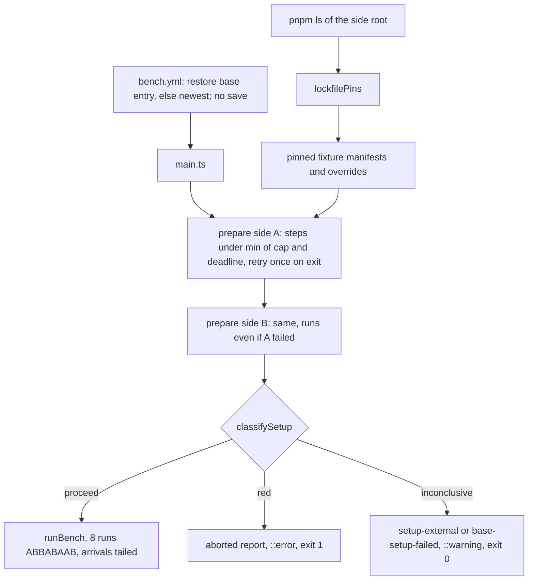

# Bench Lane Fit - Plan

## Goal Capsule

- **Objective:** A pull request fails the Bench workflow only for a cause the pull request introduced, or when the lane itself runs out of its job deadline, and every Bench job finishes well inside that deadline while it keeps reporting each phase's absolute time and share for every corpus entry, PR against base.
- **Product authority:** the root conductor of the stryker-js-effect SOTA program, through its sub-conductor. The rulings recorded under Key Decisions are theirs.
- **Open blockers:** none. The sub-conductor ruled on every open question on 2026-10-10, including approval to edit `.github/workflows/bench.yml` (and no other workflow file).

---

## Product Contract

### Summary

Pin the enterprise fixture install to each side's own lockfile versions. Give every setup step its own deadline, and classify a setup failure by which side failed and how. Take side A's build from main's existing Turbo cache entry for the base commit. Record when each phase of each run starts and ends, as the lane saw it, so the cost inside a run can be located from CI evidence. Narrow the two oversized corpus entries so the eight runs fit with cold setup and still leave room before the deadline.

### Problem Frame

On run 38080366685 (PR #293, a test-only change, base `65ecde3cb`), two of the four Bench jobs failed. Neither failure had anything to do with the PR.

The enterprise job's side A `npm install` ran from 19:36:24 to 19:42:36 and was cut off at the job deadline (`setup-timed-out`). The output tail repeats `ERESOLVE overriding peer dependency / While resolving: @effect/opentelemetry@4.0.3 / Could not resolve dependency: peer effect@"^4.0.3"`. The registry explains it: `@effect/opentelemetry@4.0.3` (10:03:40Z), `@effect/platform-node-shared@4.0.3` (10:03:52Z) and `@effect/platform-node@4.0.3` (10:04:06Z) all declare peer `effect@^4.0.3`, and `effect@4.0.3` does not exist (npm 404; the newest version is 4.0.2). The bench guarded against this with `npm install --before=<last commit time of pnpm-lock.yaml>`. #274's merge commit `70aaafd26` touched `pnpm-lock.yaml` at 17:50:09Z, which moved the cutoff past the bad publish. So the guard held only as long as nobody touched the lockfile. The same command also ran in silence for six minutes, because the only limit on it was the job deadline.

The typescript-checker job aborted with `budget-exceeded` at run 8 of 8. Its runs took 45.4-47.6 s each. Setup was two cold Turbo builds: 37.6 s on side A and 27.5 s on side B. On #274's green run the same entry finished its job in 439 s against a 450 s deadline, so the entry never had any headroom. That run passed only because side B's build happened to be warm (0.6 s). Side A is cold on every PR because the bench's `actions/cache` step falls back to the newest `turbo-Linux-dist-` entry, never the exact base commit's. That step also saves a ~300 MB entry per corpus entry per PR head (26 such entries are live now), which churns the repository's cache quota. In the checker entry's mutated file, one mutant at line 25 now reports `Timeout` and costs 8.3 s per run. A timeout measures the timeout setting, not the engine.

The `@systemfsoftware/stryker-js-vm-runner` alias that resolves to the vitest-runner tarball is intended. `packages/stryker-js/package.json` declares `"@systemfsoftware/stryker-js-vm-runner": "workspace:@systemfsoftware/stryker-js-vitest-runner@^"`, and `pnpm-workspace.yaml` maps it to `.sfs-deps/stryker-js-vitest-runner.tgz`. It played no part in the stall.

### Key Decisions

- **Pin the fixture install to the side's own lockfile instead of to a time cutoff.** A version the repository never locked can never reach the fixture, whatever the clock or the commit history says. A cutoff of any kind (`--before`, `--min-release-age`) stops protecting the install as soon as time or history moves on. (session-settled: user-approved — chosen over a time-based registry cutoff: the cutoff moved past a bad publish when an unrelated commit touched the lockfile.) Governs R1, R2.
- **Which side failed decides what a setup failure means.** A head-only failure is the PR's doing. The same failure on both sides is outside the PR. (session-settled: user-directed — chosen over "always red" and "retry then red": an outage that hits base and head alike is not the PR's fault.) Governs R4, R5, R6, R7, R8.
- **A base-only setup failure is not red.** When side A fails setup and side B does not, the PR did not cause it: the entry reports no speed signal under its own reason code naming side A, with one warning, and the job exits 0. Running out of the job deadline stays red on either side, because that is the lane's own sizing. (session-settled: user-directed — chosen over red with the existing code naming side A: the lane must not fail a PR for a reason the PR did not cause.) Governs R6a, R8.
- **Keep one retry, and compare failures, not only final outcomes.** A failed setup step is retried once inside its own deadline. When side A needed its retry on the same step that side B finally failed, with the same failure kind, both sides failed the same way. (session-settled: user-directed — chosen over dropping the retry: the retry recovers blips, and comparing the attempts closes the hole where a shared outage that side A survived on its retry would turn the PR red.) Governs R6, R7, R8.
- **Size the budget on cold setup.** A cache hit is a speedup. Fitting the deadline must never depend on one. Governs R10, R11.
- **Keep the run count at 8.** The verdict's separation test cannot reach two-sided α ≤ 0.05 with fewer than four runs per side. (session-settled: user-directed — chosen over fewer runs: the 2/70 derivation stands.) Governs R13.
- **Find a run's cost before cutting it.** The job budget is the binding bar: eight runs plus cold setup fit well under the job deadline, and every job takes at most 10 minutes. The per-run target is derived from it. Where a run's wall time cannot be explained from the stream, the lane records phase start and end times so the cost is located from CI evidence, not guessed. (session-settled: user-directed — chosen over shrinking ranges blind.) Governs R11, R15.
- **Restore Turbo outputs from main's existing per-commit entry, and stop saving bench entries.** `ci.yml`'s `check` job on main already saves `turbo-Linux-dist-<sha>` with every build output. Only main-scoped entries can be read across pull requests. The exact entry is best effort: main keeps only its newest three. (session-settled: user-approved — the `bench.yml` edit is approved for that file only.) Governs R9.

### Requirements

**Setup determinism**

- R1. The enterprise fixture install resolves every registry package that the side's own `pnpm-lock.yaml` locks to exactly one version to that version, for the fixture manifests and every closure member alike. Names locked to more than one version are left to npm's normal resolution.
- R2. No time-based registry cutoff remains in the bench's install path. The `--before` flag and the helper that reads the lockfile's commit time are removed.
- R3. Each setup step (Turbo build, closure build and pack, fixture install) runs under its own deadline. The deadline is fixed per step and never exceeds the time left before the job deadline. When it expires, the step's running command is killed and the abort names the side, the setup step and its output tail.

**Setup failure classification**

- R4. Both sides attempt setup even when the other side's setup failed, so every failure can be classified.
- R5. When only side B fails setup, the job fails with the existing reason code (`side-setup-failed` or `setup-timed-out`), names the setup step, and exits non-zero.
- R6. When both sides fail the same setup step the same way, the entry reports no speed signal under a distinct reason code `setup-external`, emits exactly one `::warning` line naming the setup step and the next action, and the job exits 0. Other entries are unaffected. "The same way" means both sides overran that step's own deadline, or both exited non-zero on it; an attempt side A survived on its retry counts as a failure of that step (R7). A step clipped by the job deadline (`out-of-time`) is never `setup-external` and always fails the job.
- R6a. When side A fails setup and side B does not, the entry reports no speed signal under the reason code `base-setup-failed` naming side A and the setup step, emits exactly one `::warning` line naming the setup step and the next action, and the job exits 0. Other entries are unaffected. A side-A failure that ran out of the job deadline stays red (`setup-timed-out`).
- R7. A setup step whose command exits non-zero is retried at most once, inside the same step's deadline. No deadline is raised to make room for it. A side that recovered on its retry still reports which step and which failure kind its first attempt hit, so classification can compare it.
- R8. The classification in R5, R6 and R6a is a pure decision with tests covering the side-B-only, both-sides, side-A-only and retried-on-A cases.

**Setup cost**

- R9. The bench restores the Turbo cache the way `ci.yml` does: main's entry for the exact base commit in one step, and only when that misses, the newest `turbo-Linux-dist-` entry this ref can read in a second step. The exact entry exists only while main still keeps it. The bench writes no cache entries of its own.

**Budget and corpus**

- R10. With cold setup on both sides, every Bench job finishes within 300 s of starting, 150 s before the 450 s bench deadline, and within the 10-minute job limit. Neither the deadline, the job timeout nor the runner size changes.
- R11. Every repo corpus entry's median run on the PR head is at most 22 s, derived from R10: 300 s, less about 35 s of steps before the Bench step, about 70 s for two cold Turbo builds in sequence (37.6 s and 27.5 s on run 38080366685), leaves about 195 s for 8 runs, or 24 s each; 22 s keeps 2 s per run for the tree restore, the digest and the CLI's start. The enterprise entry stays at or below its current ~12 s.
- R12. No corpus entry's mutate range produces a `Timeout` verdict on the base.
- R13. The run count stays at 8 (4 per side, order `ABBABAAB`). The PR body states the derivation: under no difference, the chance that 4 B samples fall entirely on one side of 4 A samples is 2/C(8,4) = 2/70 ≈ 0.029. With 3 per side it is 2/20 = 0.10, which exceeds 0.05.

**Reporting**

- R14. The report keeps every existing field and output: versioned JSON, job summary table, and a single verdict line. Adding `setup-external`, `base-setup-failed` and R15's phase times bumps the report's `schemaVersion`.
- R15. Each measured run in the report carries the start and end of every phase it entered, in milliseconds since the lane spawned the CLI, as the lane observed the run's stream lines arriving. The run-streams artifact carries the arrival time of every stream line, so cost inside a phase (per mutant, per worker start) can be located from CI evidence.

### Acceptance Examples

- AE1. **Covers R5.** **Given** side A's fixture install succeeds and side B's exits non-zero, **when** setup is classified, **then** the report is aborted with `side-setup-failed` naming side B's install step, and the job exits non-zero.
- AE2. **Covers R6.** **Given** both sides' fixture installs overrun their deadline, **when** setup is classified, **then** the report carries `setup-external` naming the install step, one `::warning` line is emitted, and the job exits 0.
- AE3. **Covers R5, R6.** **Given** side A's install overruns its own step deadline and side B's exits non-zero, **when** setup is classified, **then** the failures differ in kind, so the job is red with side B's code.
- AE4. **Covers R1.** **Given** the side's lockfile locks `@effect/opentelemetry` to 4.0.0 and the registry's newest is 4.0.3, **when** the fixture installs, **then** `node_modules/@effect/opentelemetry/package.json` reads 4.0.0.
- AE5. **Covers R6a, R8.** **Given** side A's closure build exits non-zero and side B's setup succeeds, **when** setup is classified, **then** the report carries `base-setup-failed` naming side A and the closure step, one `::warning` line is emitted, and the job exits 0.
- AE6. **Covers R6, R7.** **Given** side A's fixture install exits non-zero on its first attempt and succeeds on its retry, and side B's fixture install exits non-zero on both attempts, **when** setup is classified, **then** both sides failed the install step the same way, so the report carries `setup-external` and the job exits 0.
- AE7. **Covers R15.** **Given** a run whose stream lines arrive at known times, **when** the run is read, **then** each phase's start is the arrival of its `phase` line and its end is the arrival of the next `phase` line, or of the `verdict` line for the last phase.

### Scope Boundaries

- The job deadline (`BENCH_DEADLINE_MS`, 450 s), the job timeout (9 min) and the runner stay as they are. Nothing is skipped or put behind a flag.
- Running both sides' setup in parallel is out. They share one Turbo cache directory and four vCPUs.
- Early stopping when every phase is already settled as no-signal is deferred. It saves CI minutes on average but not in the worst case, and the worst case is what has to fit the budget.
- A guard against corpus drift (a later edit on main making a mutate range expensive again) is deferred. R11 and R12 are checked on this PR's head only.
- No other workflow file than `.github/workflows/bench.yml` is touched.
- The e2e harness's bake (`test/e2e/tests/__fixtures__/bake-fixtures.sh`, `--min-release-age=1`) belongs to its owner. Its one-day window lets `@effect/*@4.0.3` back in from 2026-10-11T10:04Z if `effect@4.0.3` is still unpublished by then. This is reported to the root, not fixed here.

### Outstanding Questions

**Resolved by the sub-conductor (2026-10-10)**

- Side-A-only setup failure: not red; `base-setup-failed`, one warning, exit 0 (R6a, AE5).
- `.github/workflows/bench.yml`, which the repo's `AGENTS.md` Boundaries table marks read-only: the edit is approved for that file only, because the root ordered the fix at the lane, including caching the base side keyed on the base SHA. The PR body says so.
- Retry-once stays, and classification compares attempts (R7, AE6).
- The checker entry: find the cost first (R15). If it is fixed per-run overhead, shrink the entry's `testFiles` to the tests covering the kept mutants and restate the per-run target from the job budget. The run count stays at 8.
- A `setup-external` or `base-setup-failed` result on the head run does not count toward done. If an outage hits the head run, re-run the job; if it persists, stop and report blocked with the evidence.

**Deferred to Implementation**

- The exact per-step deadline values, starting from observed cold durations: Turbo build 26-38 s, closure build and pack 37-39 s, fixture install 10-20 s healthy.

### Sources

- Run 38080366685 (PR #293) job logs and artifacts. Run 38069693066 (#274 green head `68efb3996`) artifacts.
- npm registry `time` for `effect`, `@effect/opentelemetry`, `@effect/platform-node`, `@effect/platform-node-shared`.
- npm's resolver can loop forever on a peer it cannot satisfy ("PeerSpin", https://pith.science/paper/2505.12676). `overrides` force a version across the whole tree (https://oneuptime.com/blog/post/2026-01-22-nodejs-fix-npm-peer-dependency-conflicts/view).
- `test/e2e-core/src/summarize-bench.workflow.ts` (`separated`, `decisive`), `test/e2e-core/src/bench-order.ts` (`BENCH_ORDER`).
- `.github/workflows/ci.yml` (restore-base / restore-newest / save of `turbo-Linux-dist-<sha>`, and `cache-sweep`, which keeps main's newest three entries), `.github/workflows/bench.yml` (Turbo cache step).
- `packages/stryker-js/src/run-event-stream.service.ts` (`drainToSinks`): the CLI writes each stream line to the progress file and syncs it before the next, so the lane can observe arrivals while the run is going.
- `docs/plans/2026-10-10-1719-perf-execution-engine-bench-lane-plan.md` (the lane's plan of record, KTD1-KTD11).
- Decision logic stays in a pure workflow, with branching as exhaustive dispatch (pack: cell-architecture, pure-decision-workflows.md). The setup outcome per side is a tagged union, never presence-shaped (pack: schema-laws, tagged-unions-over-state-by-presence.md). The decision is tested by properties, and the I/O shell through a real run (pack: boundary-testing, no-mocks-on-internal-glue.md).

---

## Planning Contract

### Key Technical Decisions

- KTD1. **The pins come from `pnpm ls`, not from parsing `pnpm-lock.yaml`.** Each side already runs `pnpm install` on its own lockfile before the Bench step, so `pnpm ls -r --json --depth=Infinity` at the side's root lists exactly the versions its lockfile locks. Parsing the YAML directly would need a YAML parser, and `js-yaml` is only a transitive dependency, so using it would add a direct one (the root's no-new-dependency rule). Measured on this worktree: 0.5 s, 549 package names, 499 at exactly one version, with `effect`, `@effect/opentelemetry`, `@effect/platform-node` and `@effect/platform-node-shared` each at 4.0.0 only. A name pins when every occurrence in the tree carries the same exact semver version. Workspace names and `link:`/`file:` versions never pin. The listing is decoded by a recursive schema built with `S.suspend` (pack: schema-laws, recursive-schema-suspend.md) and is never cast (pack: cell-architecture, decode-never-cast.md).
- KTD2. **The pins are applied as npm `overrides` plus exact direct specs.** The bundle root's `package.json` gets `overrides` set to the pins. Every pinned name in every fixture manifest's `dependencies`, `devDependencies` and `optionalDependencies` is rewritten to the same exact version. Probes run this session: a root declaring `effect: "^4.0.0"` with override `"4.0.0"` fails with `EOVERRIDE`, and a root declaring `effect: "4.0.0"` with overrides for `effect`, `@effect/platform-node` and `@effect/platform-node-shared` installs 4.0.0 of all three through a dependency that asks for `^4.0.0`. The rewrite runs after the shared catalog resolution (`test/e2e-core/src/catalog-resolution.ts`) and does not change it, so the e2e harness, which shares that module, is unaffected. `--before`, `lastLockfileCommitTimeOf` and `LOCKFILE` are deleted (R2; DEL1).
- KTD3. **Every setup step has one deadline that covers all of its commands and its retry.** The deadline is `min(cap, time left before BENCH_DEADLINE_MS)`. Caps are about 2.3× the observed cold duration: repo Turbo build 90 s (26-38 s cold), enterprise closure build and pack 90 s (37-39 s), enterprise install, covering the pins listing and both `npm install` calls, 75 s (10-20 s healthy). Steps that only touch files (catalogs, manifests, configs) have no cap of their own; they are clipped to the job deadline only. A step whose command exits non-zero is retried once inside the same deadline (R7); a step that overran is not retried, because its deadline is spent. A side that recovered on its retry keeps the first attempt's step and kind in its `ready` value. When the deadline expires, Effect interrupts the scoped spawn, and the spawn's existing `forceKillAfter` of 10 s kills the process tree. The step's collected stdout and stderr tail goes into the failure value (and no longer only into the log, as commit `04399fc27` did).
- KTD4. **A setup failure has three kinds, as a tagged union.** `exited` (non-zero exit after the retry), `overran` (the step's own cap expired) and `out-of-time` (the job deadline clipped the step before its cap). Each carries the step, a reason and the output tail (pack: schema-laws, tagged-unions-over-state-by-presence.md). A side's setup is `ready { recovered }` or `failed { failure }`, where `recovered` is `none` or `retried { step, kind: 'exited' }`.
- KTD5. **`classifySetup` is a pure workflow in `test/e2e-core`.** It sits next to `summarize-bench.workflow.ts` and decides from both sides' setup values (pack: cell-architecture, pure-decision-workflows.md: `Workflow.make`, exhaustive `Match`, no I/O). Its verdict is `proceed`, `red { side, code, reason }` or `inconclusive { code: 'setup-external' | 'base-setup-failed', side, step, reason }`, decided in this order:
  - Both `ready` gives `proceed`.
  - An `out-of-time` failure when the other side is `ready` gives `red` with `setup-timed-out`, naming that side. When both sides failed, the B-first rule below decides, and side A's failure is carried in the reason. The job deadline is not a property of any step, so running out of it is never external.
  - B `failed` with kind `exited` or `overran` at step s, and A either `failed` at s with the same kind or `ready` with `retried` at s (kind `exited`), gives `inconclusive` `setup-external`.
  - Otherwise B `failed` gives `red` naming B (B first).
  - Only A `failed` (B `ready`) gives `inconclusive` `base-setup-failed` naming A, unless A's failure is `out-of-time` (covered above).
  - The code of a `red` follows the named failure: `exited` gives `side-setup-failed`, and `overran` or `out-of-time` gives `setup-timed-out`.
- KTD6. **`setup-external` and `base-setup-failed` are a new report outcome, not new abort codes.** `aborted` always fails the job, so an exit-0 case must be a different tag. `BenchReportOutcome` gains `inconclusive { code: 'setup-external' | 'base-setup-failed', side, step, reason, nextAction }`. The annotation renders it as `::warning title=Bench inconclusive::…`, and `BenchRendered` gains a `warning` variant. `publish` in `test/bench/src/main.ts` exits 0 on `inconclusive`. `schemaVersion` moves from `'1.1'` to `'1.2'`. Today it is written as a literal in four places (`bench-report.schema.ts`, `main.ts`, `run-bench.service.ts`, `render-bench-report.workflow.property.test.ts`); it becomes one exported constant used by all of them. `NEXT_ACTION['setup-timed-out']` is reworded for per-step deadlines.
- KTD7. **Both sides' setup runs in sequence, and B runs even if A failed.** In `main.ts`, each `prepareNamed` is wrapped in `Effect.result`, and the two results feed `classifySetup`. The outer `Effect.timeoutOption(setupBudgetMs)` and `setupBudgetMs` are deleted, since every step is clipped to the job deadline (KTD3).
- KTD8. **The Turbo cache step becomes two restore-only steps, copied from `ci.yml`.** `actions/cache` searches this ref before main, so one step with a prefix fallback returns this ref's newest entry ahead of main's exact base entry (`ci.yml` records this, which is why it splits its restore). `bench.yml` therefore gets `restore-base` (`actions/cache/restore`, `key: turbo-Linux-dist-${{ steps.sides.outputs.base }}`, no `restore-keys`) and `restore-newest` (only when the first missed, `key: turbo-Linux-dist-${{ github.sha }}`, `restore-keys: turbo-Linux-dist-`), both at the same `path` the orchestrator passes as `--cache-dir`. The exact entry exists only while main's `cache-sweep` keeps it (main's newest three), so it is best effort. The bench no longer saves; `ci.yml`'s `cache-sweep` already removes the bench-saved `turbo-` entries beyond one per open pull request, so no deletion is needed.
- KTD9. **Mutate ranges are picked by a cost rule, and the head run is the check.** Using run 38080366685's per-mutant `cost` (`fixedOverheadMs + testBodyMs`, summed per line):
  - A range contains no `Timeout` on the base.
  - It keeps at least one `Killed` and at least one `CompileError` mutant, so the dry run, the checker and mutant execution all do real work.
  - Its summed cost is at most half the entry's current sum.
  - Starting ranges: typescript-checker `src/classify-tce.workflow.ts:66-89` (20 mutants: 3 `Killed` at line 70, 17 `CompileError`; summed cost 4.6 s of 21.9 s; excludes the line-25 `Timeout` at 8.3 s and the 6.5 s line-63 cluster) and vitest-runner `src/interpret-vitest-mutant-run.workflow.ts:85-109` (21 mutants, `Killed` and `CompileError` both present; 10.6 s of 22.4 s).
  - Both entries already pin `testFiles` to the one test file that covers every kept mutant (run 38080366685's incremental reports: the kept checker mutants' 2 covering tests and the kept vitest-runner mutants' 5 all live in that file), so a `testFiles` cut has nothing left to remove. Within a run, the remaining lever is the range.
  - The checker entry's mutation-test wall time (38.6 s) is 17 s above its summed per-mutant cost, and the stream carries no wall-clock times that would explain the gap. R15's phase times and line arrivals on the head run locate it. If it is fixed per-run overhead (worker start, dry run, check, teardown), the per-run target is restated from the job budget (R11), not chased by shrinking the range further.
- KTD10. **The run count stays at 8, with no code change.** The PR body carries R13's derivation.
- KTD11. **The lane observes stream arrivals by tailing the progress file.** The CLI writes each stream line to `--progressStreamFile` and syncs it before the next (`drainToSinks`). While the CLI runs, `runCli` reads the file every 100 ms and stamps each newly completed line with the milliseconds since spawn; a final read after exit stamps the rest with the exit time. `--json` (stream on stdout) is not used, because it suppresses the clear-text reporter and so changes the `reporting` work being measured. `ReadBenchRunCommand` gains the arrivals beside the lines, and the pure reader derives each phase's start and end (AE7). `BenchRunMeasured` and `BenchReportRun` gain `phaseTimes`. Each run's arrivals are written beside its stream as `<stem>.arrivals.json` in the run-streams artifact.

### High-Level Technical Design

### Sequencing

U1 comes before U2. U2, U3, U4 and U8 come before U5, because U5 edits the same install step as U2 and the same report construction as U4 and U8. U6 and U7 are independent. All eight units ship in one PR on `stryker/bench-lane-fit`, so the lane proves itself on its own head.

## Implementation Units

### U1. Lockfile pins (pure)

- **Goal:** turn a side's installed tree into the set of exact pins and apply it to a fixture manifest.
- **Requirements:** R1.
- **Files:**
  - New `test/e2e-core/src/lockfile-pins.schema.ts`: the `pnpm ls` listing, a recursive schema.
  - New `test/e2e-core/src/lockfile-pins.workflow.ts`: `lockfilePins`, which takes the listing and the workspace names and returns the pins, and `pinnedManifest`, which takes a manifest, the pins and whether it is the root.
  - `test/e2e-core/src/mod.ts`.
  - New `test/e2e-core/src/__tests__/lockfile-pins.workflow.property.test.ts`.
- **Approach:** KTD1, KTD2.
- **Patterns to follow:** `test/e2e-core/src/install-closure.workflow.ts` (Workflow plus TaggedClass result), `catalog-resolution.ts` (manifest rewrite).
- **Test scenarios:**
  - A name that occurs at one exact version anywhere in the tree pins to it.
  - A name that occurs at two versions never pins.
  - `link:`/`file:` versions and workspace names never pin.
  - Pins do not change when the tree is reordered or a subtree is duplicated.
  - `pinnedManifest` gives every pinned dependency name the exact version and leaves unpinned specs byte-identical.
  - The root's `overrides` equal the pins, and a member manifest gets no `overrides`.
  - Applying `pinnedManifest` twice gives the same result as applying it once.
- **Verification:** `pnpm --filter @systemfsoftware/stryker-e2e-core test`.

### U2. The enterprise install uses the pins

- **Goal:** the fixture can only install versions the side's own lockfile locks.
- **Requirements:** R1, R2.
- **Dependencies:** U1.
- **Files:** `test/bench/src/prepare-side.service.ts`.
- **Approach:** In the install step:
  - Run `pnpm ls -r --json --depth=Infinity` at `input.root`, decode the output, and compute the pins with the workspace names `workspacePackages` already lists.
  - Rewrite every staged manifest through `pinnedManifest`, then run both `npm install` calls without `--before`.
  - Delete `lastLockfileCommitTimeOf`, `LOCKFILE` and the `--before` argument.
- **Test scenarios:** none in-repo. The shell spawns processes; its decision is U1's.
- **Verification:**
  - The KTD2 probes (already run).
  - The head run's enterprise job finishes `install the enterprise fixture` within its cap on both sides while the registry's newest `@effect/opentelemetry` is still 4.0.3.
  - `git grep -nE -- '--before|lastLockfileCommitTimeOf' test/bench` returns nothing.

### U3. Setup classification (pure)

- **Goal:** decide what a setup failure means from both sides' outcomes.
- **Requirements:** R4-R8.
- **Files:**
  - New `test/e2e-core/src/setup-outcome.schema.ts`: `SideSetup` and `SetupFailure`.
  - New `test/e2e-core/src/classify-setup.workflow.ts`.
  - `test/e2e-core/src/mod.ts`.
  - New `test/e2e-core/src/__tests__/classify-setup.workflow.property.test.ts`.
- **Approach:** KTD4, KTD5.
- **Test scenarios:**
  - Examples: AE1, AE2, AE3, AE5 and AE6.
  - Both ready always gives `proceed`.
  - `setup-external` holds exactly when B failed at a step with kind `exited` or `overran` and A failed at that step with the same kind, or A recovered on its retry at that step and B's kind is `exited`.
  - An `out-of-time` failure beside a `ready` side gives `red` with `setup-timed-out` naming the failed side.
  - B `ready` and A failed with any kind but `out-of-time` gives `base-setup-failed` naming A.
  - A `red` always names a side that failed. Whenever B failed and the verdict is not `setup-external`, the `red` names B.
  - A `red` code is `side-setup-failed` exactly when the named failure is `exited`.
- **Verification:** `pnpm --filter @systemfsoftware/stryker-e2e-core test`.

### U4. The `inconclusive` report outcome

- **Goal:** a both-sides or base-only setup failure is reported as no signal, with one warning, and the job exits 0.
- **Requirements:** R6, R6a, R14.
- **Files:**
  - `test/e2e-core/src/bench-report.schema.ts`: the outcome case, the `warning` rendered variant, the schema-version constant and the `NEXT_ACTION` text.
  - `test/e2e-core/src/render-bench-report.workflow.ts`.
  - `test/e2e-core/src/__tests__/render-bench-report.workflow.property.test.ts`.
  - `test/bench/src/main.ts` and `test/bench/src/run-bench.service.ts`: the report construction that writes the `schemaVersion` literal moves to the constant.
- **Approach:** KTD6.
- **Test scenarios:**
  - `inconclusive` renders exactly one annotation line, at `warning` level, naming the side, the step and the next action, and never `::error`.
  - Its markdown states no speed signal for the entry.
  - `summarized`, `failed` and `aborted` render as before. Their existing properties stay, re-pointed at the constant.
  - A `1.1` report fails to decode with `BenchReportJson`.
- **Verification:** `pnpm --filter @systemfsoftware/stryker-e2e-core test`.

### U5. Shell: per-step deadline, retry, both sides, classification

- **Goal:** the orchestrator applies KTD3 and KTD7 and publishes U3's verdict through U4's report.
- **Requirements:** R3-R7, R6a, R14.
- **Dependencies:** U2, U3, U4, U8.
- **Files:** `test/bench/src/prepare-side.service.ts` (`timed` takes the cap and the job deadline, and the step-cap table); `test/bench/src/prepare-side.schema.ts` (`BenchSetupFailed` carries the `SetupFailure` kind and the tail); `test/bench/src/main.ts` (sequential `Effect.result` per side, `classifySetup`, verdict to report, `publish` exit per outcome, outer setup timeout removed); `test/bench/README.md`, whose deadline paragraph describes the per-step deadline, `setup-external`, `base-setup-failed` and the restore-only cache.
- **Approach:** KTD3, KTD5-KTD7.
- **Test scenarios:** none for the shell. Its decisions are U3's and U4's (the plan of record's U6 follows the same convention; pack: boundary-testing, no-mocks-on-internal-glue.md).
- **Verification:** `tsc -b`, oxlint and `lint:tsgo` for `@systemfsoftware/stryker-bench`, plus the head run. No local orchestrator run (root rule: no local bench run).

### U6. Restore-only Turbo cache keyed on the base commit

- **Goal:** side A restores main's build outputs for its exact commit when main still keeps them, and the bench stops writing cache entries.
- **Requirements:** R9.
- **Files:** `.github/workflows/bench.yml`.
- **Approach:** KTD8.
- **Test scenarios:** none in-repo. The workflow is proven by running it.
- **Verification:** On the head run, one of the two restore steps logs a restore from some `turbo-Linux-dist-` entry, side A's `turbo build the repo corpus projects` time in `setupSteps` drops below its cold 26-38 s, and the run saves no new `turbo-Linux-bench-*` cache entry (checked with `gh api repos/{owner}/{repo}/actions/caches`).

### U7. Corpus narrowing

- **Goal:** every entry's runs fit R10-R12.
- **Requirements:** R10, R11, R12, R13.
- **Dependencies:** U8 (its phase times decide the second round).
- **Files:** `test/bench/corpus.json`; `test/bench/README.md` (corpus section: the cost rule and the new ranges).
- **Approach:** KTD9, KTD10.
- **Test scenarios:** none. The corpus is data, and the head run checks it.
- **Verification:** On the head run:
  - Every repo entry's median `total` is at most 22 s, and the enterprise entry's is at most about 12 s.
  - No base run has a `Timeout` in a corpus range.
  - Every job's wall-clock from start to finish is at most 300 s, read from the jobs API.
  - If an entry misses, its phase times and line arrivals locate the cost first. If the cost is in mutant execution, the range shrinks by the KTD9 rule and the head runs again. Each iteration is one CI run, and there are at most two shrink rounds. If an entry is still off target after the second, stop and report it as a question.

### U8. Phase times observed by the lane

- **Goal:** each measured run carries its phase start and end times, and each stream line's arrival time is kept in the run-streams artifact.
- **Requirements:** R15.
- **Files:**
  - `test/e2e-core/src/bench-run.schema.ts` (`PhaseTime`, `BenchRunMeasured.phaseTimes`).
  - `test/e2e-core/src/read-bench-run.workflow.ts` (arrivals in the command, phase times derived).
  - `test/e2e-core/src/bench-report.schema.ts` (`BenchReportRun.phaseTimes`).
  - `test/e2e-core/src/__tests__/read-bench-run.workflow.property.test.ts`.
  - `test/bench/src/run-bench.service.ts` (tail the stream file during the run, pass arrivals, write `<stem>.arrivals.json`, copy phase times into the report run).
- **Approach:** KTD11.
- **Test scenarios:**
  - AE7 as an example.
  - Every phase time has `startMs ≤ endMs`, and consecutive phases abut: one phase's end is the next phase's start.
  - Phases appear in the order their `phase` lines appear in the stream.
  - Shifting every arrival by a constant shifts every start and end by that constant.
  - A stream with no `phase` lines gives no phase times; a run whose arrivals do not match its lines one to one is refused as `stream-invalid`.
- **Verification:** `pnpm --filter @systemfsoftware/stryker-e2e-core test`; the head run's report carries phase times for every measured run, and its run-streams artifact holds an arrivals file per run.

## Verification Contract

- Local, light verification per the root's rule: `turbo run typecheck lint:tsgo` for `@systemfsoftware/stryker-e2e-core` and `@systemfsoftware/stryker-bench`; oxlint for both; the changed test files (U1, U3, U4 and U8 property tests). One build at a time. Format check with `./bin/dprint check`. No local mutation run, no local bench run, no full e2e run.
- In CI on the PR head: `check` (START-1 to START-4), the e2e jobs, and all four Bench jobs green, observed with `xd://github` `run_watch`.
- Changeset: none. Both touched packages are private (`test/e2e-core/package.json` and `test/bench/package.json` have `"private": true`). The Changeset Check job decides.

## Definition of Done

- U1-U8 land in one PR on `stryker/bench-lane-fit` whose head CI is green on every job.
- The head run's bench table, for all four entries, enterprise included, shows per-phase absolute time and share, A against B, with a workload status of `same`. A `setup-external` or `base-setup-failed` result does not count: re-run the job, and if the outage persists, stop and report blocked with the evidence.
- The PR body states that `.github/workflows/bench.yml` was edited under the sub-conductor's approval and that no other workflow file changed.
- Every Bench job's measured wall time is at most 300 s, and the PR body states it per job, along with R13's derivation.
- `git grep -nE -- '--before|lastLockfileCommitTimeOf|setupBudgetMs' test/bench` returns nothing (DEL1).
- Each of R1-R15 traces to a unit above, and each of AE1-AE7 is a test or an observed head run.
